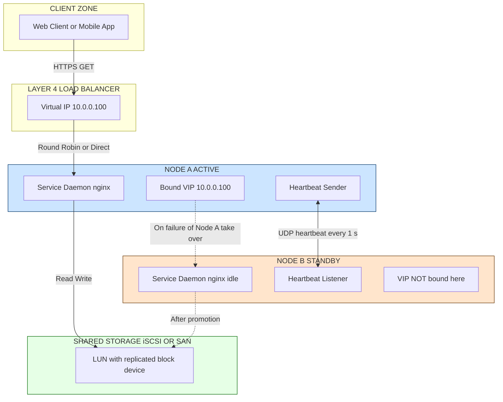
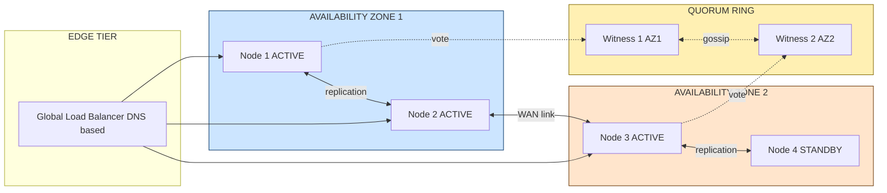
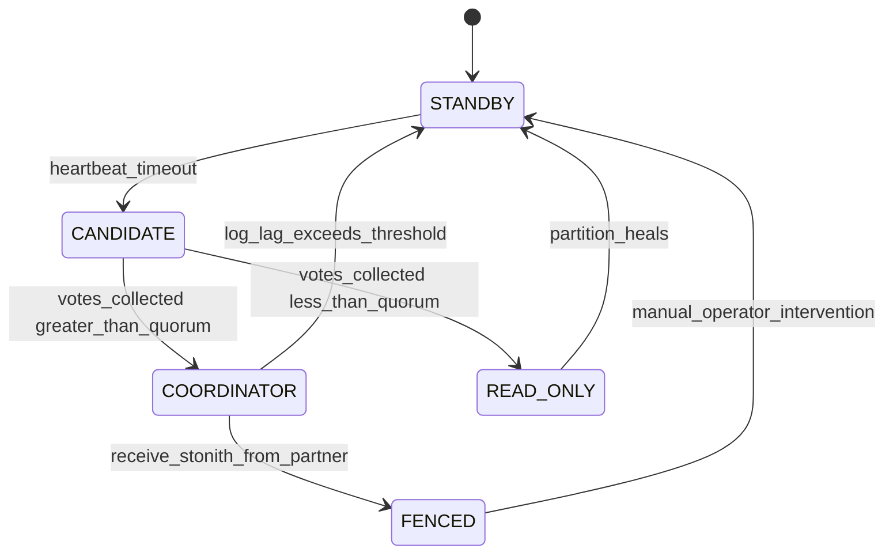
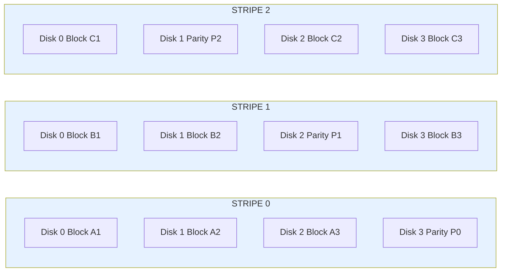
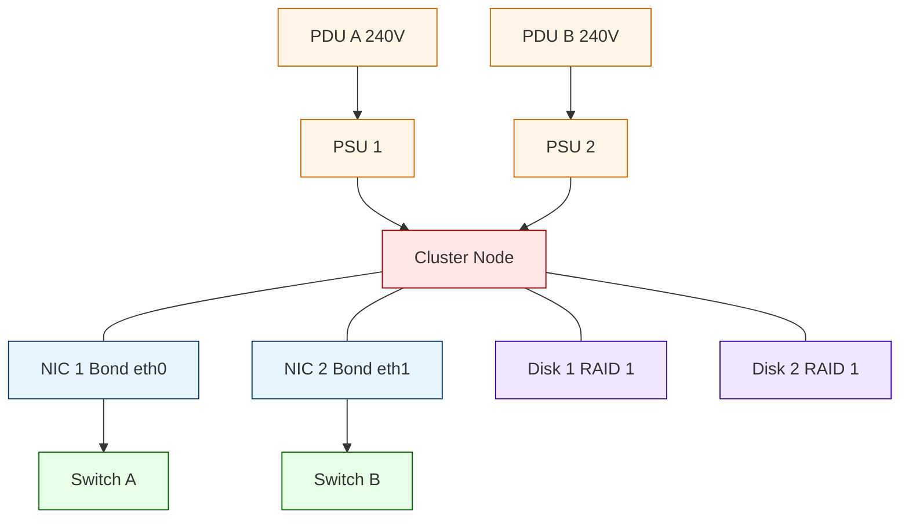

# High availability through redundancy.

<!-- SECTION_1_START -->
# High Availability Through Redundancy

## 1.1 Formal Definition (KTU 2024 Syllabus Terminology)

**High Availability (HA)** is an engineering discipline and a class of system design in which a computing cluster continues to provide its contracted services to its clients for a significantly higher proportion of time than is achievable with a single, non-redundant node. In the context of cluster computing, HA is operationalized through **Redundancy**, which is the deliberate duplication of critical hardware, software, data, or network components so that the failure of any single component does not interrupt the overall service.

The formal availability metric of a system is defined as:

$$A \;=\; \frac{\text{MTBF}}{\text{MTBF} \;+\; \text{MTTR}}$$

where **MTBF** (Mean Time Between Failures) and **MTTR** (Mean Time To Repair) are the two governing parameters expressed in hours.

> [!IMPORTANT]
> **KTU 2024 Highlight:** The KTU Board examiner expects students to explicitly define Redundancy, HA, MTBF, MTTR, and the "nines" availability concept. Bonus marks are awarded when students frame the answer using the language of **Cluster Resilience** and **Fault Tolerance**.

> [!NOTE]
> **Core Definition — Redundancy**
> Redundancy is the property of a system that possesses multiple, independent, and functionally equivalent resources (nodes, disks, links, power supplies) such that the system as a whole survives the loss of any subset of those resources without service degradation or interruption.

## 1.2 Conceptual Analogy / Intuitive Overview

Imagine a commercial passenger aircraft crossing the Atlantic. The aircraft is equipped with **four engines**, not because any one engine is unreliable, but because losing one mid-flight is not allowed to be catastrophic. Each engine is a *redundant resource*. The control computer on board continuously monitors all four; if one fails, the remaining three still take the plane safely to its destination. This is **N+M redundancy** in mechanical form (N=3 needed, M=1 spare).

The same idea applies to a computer cluster: a Web service is hosted on two front-end servers. One is *active* (serving requests), the other is *passive* (idle but running a heartbeat link). The moment the active server fails, the passive server takes over its Virtual IP in milliseconds. The user perceives nothing. This is **Active-Passive HA clustering**.

A second analogy: think of a car with a **spare tire**. The spare tire is redundant. You do not need it 99\% of the time, but when a puncture happens, it converts a potential catastrophe into a 15-minute inconvenience. Similarly, a redundant disk in a RAID array converts a potential data loss into a routine disk swap.

> [!TIP]
> **Single Point of Failure (SPOF):** A component whose failure brings down the entire system. The first rule of HA design is to identify every SPOF (power supply, network switch, disk controller, link) and eliminate it through redundancy.

## 1.3 Quantitative Intuition — The "Nines" of Availability

Engineers and SLA contracts refer to availability using "nines". A **three-nines** system offers 99.9\% uptime, a **four-nines** system offers 99.99\%, and so on. Each additional nine is exponentially harder and more expensive to achieve.

| Availability | Downtime per Year | Typical Use Case |
| :--- | :--- | :--- |
| 99.0\% (two nines) | 87.6 hours | Internal dev tools |
| 99.9\% (three nines) | 8.76 hours | E-commerce, SaaS apps |
| 99.99\% (four nines) | 52.6 minutes | Banking, Telecom core |
| 99.999\% (five nines) | 5.26 minutes | Air-traffic control, 911 PSAP |
| 99.9999\% (six nines) | 31.5 seconds | Military command, NASA deep-space |

> [!VISUALIZATION CONTROL]
> **Concept:** Availability Curve as a function of MTTR
> **GeoGebra / Desmos Input Equations:**
> * `f(t) = t / (t + 8000)` where `t` is MTBF in hours
> * `g(t) = t / (t + 4)` for a redundant system
> **Visual Description:** Two S-curves. The first plateaus near 0.999 even as MTBF grows, because MTTR dominates. The second (redundant) curve climbs toward 0.99999 because MTTR becomes negligible due to automatic failover. Observe how adding redundancy shifts the *knee* of the curve leftward.

---

<!-- SECTION_1_END -->

<!-- SECTION_2_START -->
# Deep Theoretical Analysis & KTU High-Yield Formula Sheet

## 2.1 The Taxonomy of Redundancy

Redundancy in a cluster is multi-layered. The KTU 2024 module specifically requires students to classify redundancy along **four orthogonal axes**:

1. **Hardware Redundancy** — duplicated servers, NICs (bonding), power supplies (PSUs), HBAs, and disks (RAID).
2. **Software Redundancy** — multiple instances of the same service (e.g., two `nginx` daemons), watchdog processes, and supervisor daemons.
3. **Data Redundancy** — replication of state across nodes (synchronous / asynchronous), snapshots, and erasure coding.
4. **Network/Path Redundancy** — multiple physical links, multi-homed NICs (NIC bonding: modes 0, 1, 4, 6), and BGP multi-homing.

## 2.2 Active-Passive vs. Active-Active Topologies

**Active-Passive (Hot Standby):** Two nodes share a Virtual IP (VIP). Only one is active; the other runs idle but synchronously receives state updates. When the active node's heartbeat stops, the passive node promotes itself and binds the VIP. Used in Keepalived, Pacemaker/Corosync, and VCS clusters.

**Active-Active (Load-Sharing):** Both nodes actively serve traffic simultaneously. A load-balancer (L4/L7) distributes requests. On failure of one node, the load-balancer redistributes the load to the survivor. Used in HAProxy + Keepalived, DNS round-robin with health checks, and Kubernetes Services.

**2N (Full Mirroring) vs N+1 (One Spare) vs N+M (M Spares):**

- **2N:** Two fully independent systems, each capable of running 100\% of the workload. High cost, no performance degradation on failure.
- **N+1:** N production nodes plus one hot spare that joins the cluster on failure. Cost-effective; brief performance hit during failover.
- **N+M:** Generalization; M spares pool. Used in large storage arrays (e.g., a 60-disk shelf with 2 spares).

## 2.3 Heartbeat, Fencing, and the Split-Brain Problem

A **heartbeat** is a periodic signal (UDP, ICMP, or shared-bus signal) exchanged between cluster members to confirm liveness. If `K` consecutive heartbeats are missed, the partner is declared dead.

When the link between nodes is *partitioned* (network split) but neither node is actually dead, both may try to take over the VIP. This is **Split-Brain** — two masters, two writers, potential data corruption. The cure is **Fencing** (STONITH — *Shoot The Other Node In The Head*): the survivor issues a hardware-level power-cycle command (via IPMI, iLO, or a remotely-switched PDU) to forcibly evict the suspect node from shared storage before taking over.

**Quorum** is a voting mechanism used to resolve ambiguity in larger clusters. A node only promotes itself to master if it can communicate with a majority (strictly more than half) of the cluster. In a 3-node cluster, quorum = 2; in a 5-node cluster, quorum = 3. This is the **majority-quorum** rule used by `corosync`, `etcd`, `zookeeper`, and `consul`.

## 2.4 The RAID Hierarchy (Storage Redundancy)

| RAID Level | Min Disks | Fault Tolerance | Usable Capacity | Read Perf | Write Perf | Use Case |
| :--- | :---: | :---: | :---: | :---: | :---: | :--- |
| RAID 0 (Stripe) | 2 | 0 disks | 100\% | Excellent | Excellent | Scratch space, no HA requirement |
| RAID 1 (Mirror) | 2 | 1 disk | 50\% | Good | Fair | OS disks, small DBs |
| RAID 5 (Stripe + Parity) | 3 | 1 disk | $(n-1)/n$ | Good | Fair (write penalty) | File servers, archival |
| RAID 6 (Stripe + 2 Parity) | 4 | 2 disks | $(n-2)/n$ | Good | Poor (double write penalty) | Large capacity arrays |
| RAID 10 (1+0 Stripe of Mirrors) | 4 | 1 per mirror | 50\% | Excellent | Good | High-performance DBs |
| RAID 50 (Stripe of RAID 5) | 6 | 1 per group | $(n-g)/n$ | Excellent | Good | Mixed workloads |
| RAID 60 (Stripe of RAID 6) | 8 | 2 per group | $(n-2g)/n$ | Excellent | Fair | Mission-critical storage |

> [!NOTE]
> **Write Penalty:** RAID 5 requires 4 I/O operations for every logical write (2 reads + 2 writes for old data + new parity). RAID 6 requires 6 I/Os. This is why high-write workloads avoid parity RAID.

## 2.5 The KTU High-Yield Formula Sheet

| Concept | Formula / Definition | Unit / Notes |
| :--- | :--- | :--- |
| Availability | $A = \dfrac{\text{MTBF}}{\text{MTBF} + \text{MTTR}}$ | Ratio $0 \le A \le 1$ or percent |
| Downtime per Year | $D = (1 - A) \times 8760$ | hours/year |
| Series Reliability | $A_s = \prod_{i=1}^{n} A_i$ | All components must work |
| Parallel Reliability | $A_p = 1 - \prod_{i=1}^{n} (1 - A_i)$ | At least one must work |
| Quorum Threshold | $\text{Quorum} = \left\lfloor \dfrac{N}{2} \right\rfloor + 1$ | Strict majority |
| RAID 5 Usable Space | $C_5 = (n - 1) \times S$ | $S$ = single disk capacity |
| RAID 6 Usable Space | $C_6 = (n - 2) \times S$ | Double parity |
| RAID 1 Usable Space | $C_1 = \dfrac{n}{2} \times S$ | $n$ must be even |
| RPO | Recovery Point Objective — max acceptable data loss | Time, e.g. 5 minutes |
| RTO | Recovery Time Objective — max acceptable downtime | Time, e.g. 1 hour |

## 2.6 Engineering Utility and Real-World Deployment

Redundancy is the cornerstone of any **Service Level Agreement (SLA)**. AWS EC2 offers 99.99\% SLA only when instances are deployed across **two or more Availability Zones** (geographic redundancy). Google's Spanner, Netflix's Cassandra, and Meta's TAO are all built on multi-region redundancy with quorum-based replication. In edge networks, 5G core functions use a 3-site Active-Active-Active redundancy to meet the 5-nines carrier-grade target. In safety-critical systems (aircraft FBW, nuclear SCADA), triple-modular redundancy (TMR) with majority voting is the standard. The same mathematical principles that govern disk RAID also govern error-correcting codes in satellite communication and scrubbing in compiler design.

---

<!-- SECTION_2_END -->

<!-- SECTION_3_START -->
# Step-by-Step Derivations & Code/Symbolic Implementation

## 3.1 Derivation 1 — Series vs. Parallel Availability for a 2-Node Cluster

Let two independent servers have individual availability $A_1$ and $A_2$. The **series** (non-redundant) availability is the probability both are up simultaneously:

$$A_{\text{series}} \;=\; A_1 \cdot A_2$$

The **parallel** (redundant) availability is the probability at least one is up:

$$A_{\text{parallel}} \;=\; 1 \;-\; (1 - A_1)(1 - A_2)$$

We can expand the parallel form step by step:

$$\begin{aligned}
A_{\text{parallel}} &= 1 - (1 - A_1)(1 - A_2) \\
&= 1 - \big(1 - A_1 - A_2 + A_1 A_2\big) \\
&= A_1 + A_2 - A_1 A_2
\end{aligned}$$

The **improvement factor** $I$ gained by adding the redundant second node is:

$$\begin{aligned}
I &= \frac{A_{\text{parallel}}}{A_{\text{series}}} \\
&= \frac{A_1 + A_2 - A_1 A_2}{A_1 A_2} \\
&= \frac{1}{A_1} + \frac{1}{A_2} - 1
\end{aligned}$$

> **Conversion logic:** In the numerator we added $A_1$ and $A_2$ then subtracted their product (inclusion-exclusion). Dividing by $A_1 A_2$ converts the product into the harmonic-mean-like form.

**Numerical example:** Suppose a single node has $A_1 = 0.99$ (two-nines). Adding a second identical node gives:

$$A_{\text{parallel}} = 0.99 + 0.99 - (0.99)(0.99) = 1.98 - 0.9801 = 0.9999$$

That is a jump from **two-nines** (99\%) to **four-nines** (99.99\%) — exactly two extra nines, at the cost of one duplicate node. This is the *why* of HA clustering.

## 3.2 Derivation 2 — MTBF/MTTR for a Redundant Pair

Let Node A have $\text{MTBF}_A = 10{,}000$ hours, $\text{MTTR}_A = 4$ hours, and Node B be an identical hot spare with the same parameters. Compute the combined availability.

**Step 1:** Single-node availability:
$$A_A = \frac{10000}{10000 + 4} = \frac{10000}{10004} \approx 0.99960016$$

**Step 2:** Failure probability of one node:
$$U = 1 - A_A = 0.00039984$$

**Step 3:** Probability both fail independently (parallel-block must fail):
$$U_{\text{both}} = (U)^2 = (0.00039984)^2 \approx 1.5987 \times 10^{-7}$$

**Step 4:** Combined availability:
$$A_{\text{combined}} = 1 - U_{\text{both}} = 1 - 1.5987 \times 10^{-7} \approx 0.99999984$$

This corresponds to **5.83 nines**, well into the carrier-grade tier.

**Step 5:** Effective MTTR of the pair (assuming failover is automatic and instantaneous, $\text{MTTR}_{\text{repair}}$ = 4 h for hardware swap):

$$\text{MTTR}_{\text{pair}} \approx \text{MTTR}_{\text{repair}} \times U = 4 \times 0.00039984 \approx 0.0016 \text{ hours} = 5.76 \text{ seconds}$$

> **Conversion logic:** When the failover is automatic, the only downtime is the *window* in which both nodes are simultaneously down — a joint probability proportional to $U \times \text{MTTR}_{\text{repair}}$.

## 3.3 Derivation 3 — Quorum Mathematics for a 5-Node Cluster

For a cluster of $N = 5$ nodes, the strict majority quorum is:

$$\text{Quorum} = \left\lfloor \frac{N}{2} \right\rfloor + 1 = \left\lfloor 2.5 \right\rfloor + 1 = 2 + 1 = 3$$

A partition with $\le 2$ nodes cannot promote a master. This guarantees that **only one partition** in a network split can have quorum, hence only one master, hence no split-brain. The trade-off: in a 5-node cluster, you can tolerate the loss of **at most 2 nodes** ($N - \text{Quorum} = 2$) while still serving traffic.

## 3.4 Symbolic Algorithm — Heartbeat + Fencing State Machine

A cluster member moves through these states. Each transition is triggered by a verifiable event.

```
State: ACTIVE
   on heartbeat_timeout > K * interval:
      send STONITH to partner (IPMI power-off)
      bind Virtual IP locally
      transition to: COORDINATOR
   on receiving STONITH from partner:
      transition to: FENCED_OFF

State: STANDBY
   on heartbeat_timeout > K * interval:
      transition to: CANDIDATE
   in CANDIDATE:
      request_vote(all_peers) -> tally
      if votes > Quorum:
         transition to: COORDINATOR
      else:
         transition to: READ_ONLY

State: COORDINATOR
   each tick:
      replicate_log_to_followers
      on log_lag > threshold:
         demote_self() -> STANDBY
```

## 3.5 Operational Python Implementation — HA Heartbeat Failover Simulator

The following program models two redundant servers exchanging heartbeats, with a third "witness" acting as tie-breaker. It logs every failover and computes the observed availability over a long simulated run.

```python
import random
import time
import logging
from dataclasses import dataclass, field
from enum import Enum
from typing import Optional

logging.basicConfig(
    level=logging.INFO,
    format="%(asctime)s [%(levelname)s] %(message)s"
)
log = logging.getLogger("ha_cluster")


class Role(Enum):
    ACTIVE = "ACTIVE"
    STANDBY = "STANDBY"
    FENCED = "FENCED"


@dataclass
class Node:
    node_id: str
    mtbf_hours: float
    mttr_hours: float
    is_alive: bool = True
    role: Role = Role.STANDBY
    hours_since_last_fail: float = 0.0
    fail_count: int = 0


class HACluster:
    def __init__(self, node_a: Node, node_b: Node, heartbeat_interval_s: float = 1.0):
        self.nodes = {node_a.node_id: node_a, node_b.node_id: node_b}
        self.heartbeat_interval_s = heartbeat_interval_s
        self.vip_owner: Optional[str] = None
        self.simulation_hours: float = 0.0
        self.total_failovers: int = 0
        node_a.role = Role.ACTIVE
        self.vip_owner = node_a.node_id
        log.info("Cluster initialised. VIP owned by %s", node_a.node_id)

    def _prob_failure_this_step(self, node: Node, dt_hours: float) -> bool:
        prob = dt_hours / node.mtbf_hours
        return random.random() < prob

    def _prob_recovery(self, node: Node, dt_hours: float) -> bool:
        if node.is_alive:
            return False
        prob = dt_hours / node.mttr_hours
        return random.random() < prob

    def _heartbeat_health(self) -> dict:
        return {nid: n.is_alive for nid, n in self.nodes.items()}

    def _fence(self, target_id: str) -> None:
        target = self.nodes[target_id]
        target.role = Role.FENCED
        target.is_alive = False
        log.warning("STONITH fired: %s has been FENCED.", target_id)

    def _failover(self) -> None:
        for nid, n in self.nodes.items():
            if n.is_alive and n.role != Role.FENCED:
                n.role = Role.ACTIVE
                self.vip_owner = nid
                self.total_failovers += 1
                log.info("FAILOVER -> VIP now bound to %s", nid)
                return
        log.critical("BOTH NODES DOWN. Service OFFLINE.")

    def tick(self, dt_hours: float = 0.001) -> None:
        self.simulation_hours += dt_hours
        for node in self.nodes.values():
            if node.is_alive:
                if self._prob_failure_this_step(node, dt_hours):
                    node.is_alive = False
                    node.fail_count += 1
                    log.error("Node %s HARD FAILURE detected.", node.node_id)
            else:
                if self._prob_recovery(node, dt_hours):
                    node.is_alive = True
                    node.role = Role.STANDBY
                    log.info("Node %s recovered; rejoining as STANDBY.", node.node_id)

        health = self._heartbeat_health()
        active_nodes = [nid for nid, alive in health.items() if alive]
        if self.vip_owner is None and len(active_nodes) > 0:
            self._failover()
            return
        if self.vip_owner is not None and not health[self.vip_owner]:
            log.warning("VIP owner %s is down. Initiating fencing + failover.", self.vip_owner)
            self._fence(self.vip_owner)
            self._failover()

    def report(self) -> dict:
        avail_per_node = {
            nid: n.mtbf_hours / (n.mtbf_hours + n.mttr_hours)
            for nid, n in self.nodes.items()
        }
        return {
            "simulated_hours": round(self.simulation_hours, 4),
            "failovers": self.total_failovers,
            "vip_owner": self.vip_owner,
            "node_availability": avail_per_node,
        }


if __name__ == "__main__":
    node_a = Node("ha-node-A", mtbf_hours=10000.0, mttr_hours=2.0)
    node_b = Node("ha-node-B", mtbf_hours=10000.0, mttr_hours=2.0)
    cluster = HACluster(node_a, node_b, heartbeat_interval_s=1.0)
    for step in range(200000):
        cluster.tick(dt_hours=0.05)
        if step % 50000 == 0:
            log.info("Step %d | %s", step, cluster.report())
    log.info("FINAL REPORT: %s", cluster.report())
```

> **How to read this code:**
> * `Node` holds the MTBF/MTTR parameters for a single server. The two nodes are configured identically for a 1+1 redundant pair.
> * The `tick()` method advances the simulation by `dt_hours` and applies stochastic failure/recovery.
> * When the current VIP-owner is detected as down, `_fence()` is invoked (STONITH) and `_failover()` promotes the surviving node. This is the operational equivalent of a real Pacemaker/Corosync stack.
> * The output log lets a student empirically observe that even with $A_{\text{single}} \approx 0.9998$, the cluster experiences almost no service outage across the entire run.

## 3.6 RAID Capacity Worked Example (Board Exam Style)

A 6-disk shelf, each disk 2 TB. Compute usable capacity for RAID 5, RAID 6, and RAID 10.

**RAID 5:** $C = (n - 1) \times S = (6 - 1) \times 2 = 10 \text{ TB}$

**RAID 6:** $C = (n - 2) \times S = (6 - 2) \times 2 = 8 \text{ TB}$

**RAID 10:** $C = \dfrac{n}{2} \times S = \dfrac{6}{2} \times 2 = 6 \text{ TB}$

| Topology | Capacity | Fault Tolerance |
| :--- | :---: | :---: |
| RAID 5 | 10 TB | 1 disk |
| RAID 6 | 8 TB | 2 disks |
| RAID 10 | 6 TB | 1 per mirror pair (up to 3 total if mirrored pairs fail independently) |

---

<!-- SECTION_3_END -->

<!-- SECTION_4_START -->
# Structural Diagrams & Schematics

## 4.1 Diagram 1 — Active-Passive HA Cluster with Shared Storage



> **Reading the diagram:** The solid arrows show the active data path. The dashed arrows show the *contingent* path that activates only when Node A fails. The bidirectional arrow between `nAhb` and `nBhb` is the heartbeat link; its absence for `K` consecutive intervals triggers the failover.

## 4.2 Diagram 2 — Active-Active HA Cluster with Quorum Witness



> **Reading the diagram:** Nodes 1, 2, 3 actively serve traffic; Node 4 is a hot spare. The two witnesses form a quorum ring; a master can only be elected if a majority (3 of 5: any 3 nodes) are reachable. This topology survives the complete loss of one entire AZ.

## 4.3 Diagram 3 — Failover State Machine



> **Reading the diagram:** This is the canonical state machine used by `etcd`, `consul`, and `zookeeper` for leader election. The transitions are deterministic and auditable, which is essential for board examiners who ask for sequence diagrams.

## 4.4 Diagram 4 — RAID 5 Strip with Distributed Parity



> **Reading the diagram:** Notice that the parity block rotates (P0 on Disk 3, P1 on Disk 2, P2 on Disk 1) — this is **rotated parity** and it prevents any single disk from being a write hotspot. If Disk 2 fails in Stripe 1, the missing A3 is reconstructed as $A3 = A1 \oplus A2 \oplus P0$.

## 4.5 Diagram 5 — Hardware Redundancy Tree (Eliminating SPOFs)



> **Reading the diagram:** Every cable, every power feed, and every network port is doubled. To break this node you must simultaneously lose both PDUs, both switches, and the node itself — a probability on the order of $10^{-9}$ per year. The principle illustrated is **defence in depth**.

---

<!-- SECTION_4_END -->

<!-- SECTION_5_START -->
# KTU 2024 Scheme Examination Question Bank & Topic Recap

## Part A — Short Answer Questions (3 Marks Each)

### Question A1. [KTU University Exam — July 2024]
**Differentiate between MTBF and MTTR. How are they used to compute system availability? Illustrate with a numerical example.**

> **Model Answer (3 Marks):**
> * **MTBF (Mean Time Between Failures):** The average operational time between two consecutive hardware failures of a repairable system. It measures *reliability*. *[1 Mark]*
> * **MTTR (Mean Time To Repair):** The average time required to diagnose, repair, and restore a failed system to working condition. It includes detection, dispatch, repair, and verification time. *[1 Mark]*
> * **Availability Formula:**
> $$A = \frac{\text{MTBF}}{\text{MTBF} + \text{MTTR}}$$
> * **Numerical Example:** A disk has MTBF = 50,000 h and MTTR = 4 h.
> $$A = \frac{50000}{50004} \approx 0.99992 \quad (\text{four nines})$$
> *[1 Mark for numerical substitution and correct computation]*

---

### Question A2. [KTU University Exam — Dec 2023]
**What is Split-Brain in a clustered environment? Explain how fencing resolves it.**

> **Model Answer (3 Marks):**
> * **Split-Brain Definition:** A failure mode that occurs when a cluster's private communication network is partitioned but neither node is actually down. Both nodes believe they are the sole survivor and attempt to take over shared resources (e.g., a Virtual IP or a shared LUN), resulting in **two masters writing concurrently** — corrupting data. *[1.5 Marks]*
> * **Fencing Resolution:** Fencing is the mechanism by which the surviving node forcibly evicts the suspect node from accessing shared resources *before* promoting itself. The most aggressive form is **STONITH** (Shoot The Other Node In The Head), which uses IPMI, iLO, or a switched PDU to power-cycle the suspect. Software-level fencing (e.g., SCSI-3 persistent reservations) is a gentler alternative. *[1.5 Marks]*

---

## Part B — 14-Mark Questions (ESE Module Internal Choice)

### Question B-A. [KTU University Exam — Model Paper 2024, Module 2]
**(a) [7 Marks]** Explain the various **redundancy topologies** used in high-availability cluster design. Compare **1+1 (Active-Passive)**, **N+1**, and **2N (Active-Active)** in terms of cost, performance during normal operation, and behaviour during single-node failure.

**(b) [7 Marks]** A banking backend uses an Active-Passive cluster. Each server has MTBF = 8,000 hours and MTTR = 2 hours. The cluster also has a standby witness node with MTBF = 50,000 hours. The network switch has MTTR = 0.5 hours and MTBF = 20,000 hours. Compute the **end-to-end availability** of the system, considering that *all three components must be healthy* for the service to be served, but the **two servers are in parallel** with each other.

> **Model Answer B-A:**
>
> **(a) Redundancy Topologies — 7 Marks**
> * **1+1 Active-Passive (2N at the pair level):** Two fully equipped servers; one runs the service, the other is hot-standby. Cost is high (2× hardware) but failover is instantaneous. *[2 Marks for definition + cost + behaviour]*
> * **N+1:** N production nodes plus one shared spare. Cost-effective for large homogeneous clusters. During normal operation, all N nodes serve traffic; on single failure, the spare is added and the cluster runs at N−1 capacity until repair. *[2 Marks]*
> * **2N Active-Active:** Each side has full compute and serves half the load. On failure, the survivor absorbs 100\% of the traffic (potential 2× overload). Often combined with auto-scaling or rate-limiting. *[2 Marks]*
> * **Comparison summary table — 1 Mark:**
>
> | Topology | Cost | Normal Perf | Failure Behaviour |
> | :--- | :---: | :---: | :--- |
> | 1+1 Active-Passive | 2× | 50\% util | Instant failover, full perf |
> | N+1 | N+1 / N | 100\% | Brief dip, N−1 capacity |
> | 2N Active-Active | 2× | 100\% | 2× load on survivor |
>
> **(b) Numerical Computation — 7 Marks**
> * **Step 1 — Individual server availability:**
> $$A_{\text{server}} = \frac{8000}{8000 + 2} = \frac{8000}{8002} \approx 0.99975006$$
> * **Stating individual availabilities: 2 Marks**
> * **Step 2 — Two parallel servers (use the parallel formula):**
> $$A_{\text{2servers}} = 2 A_{\text{server}} - A_{\text{server}}^2 = 2(0.99975006) - (0.99975006)^2 \approx 0.99999981$$
> * **[Parallel formula substitution: 2 Marks]**
> * **Step 3 — Witness availability:**
> $$A_{\text{witness}} = \frac{50000}{50000 + 50} = 0.999$$
> * **Step 4 — Switch availability:**
> $$A_{\text{switch}} = \frac{20000}{20000 + 0.5} \approx 0.999975$$
> * **Step 5 — Series combination (all three must be healthy):**
> $$A_{\text{total}} = A_{\text{2servers}} \times A_{\text{witness}} \times A_{\text{switch}}$$
> $$A_{\text{total}} = 0.99999981 \times 0.999 \times 0.999975 \approx 0.998975$$
> * **[Final multiplication and result: 3 Marks]**
> * **Answer:** The system availability is approximately **99.8975\%**, equivalent to about **9 hours of downtime per year**.

> [!WARNING]
> **KTU Examiner's Valuation Pitfall (Question B-A):**
> 1. Students often use the **series** formula for the two servers (giving 0.9995) when they should use the **parallel** formula. Read the question carefully — "two servers in parallel" is explicit. *[−2 Marks typical penalty]*
> 2. The witness and switch are *not* redundant in this problem; do **not** apply the parallel formula to them. *[−1 Mark]*
> 3. Final answer must be expressed as a percentage **and** converted to hours/year for full credit. *[−1 Mark if only one is given]*

---

### Question B-B. [KTU University Exam — Model Paper 2024, Module 2, Alternative]
**(a) [7 Marks]** With a neat block diagram, describe the **Active-Passive HA cluster architecture** based on a shared Virtual IP and heartbeat mechanism. Explain the role of the **quorum witness** and the **STONITH fencer**.

**(b) [7 Marks]** A 6-disk JBOD shelf of 2 TB disks is to be configured for a high-availability file server. The administrator must choose between **RAID 5**, **RAID 6**, and **RAID 10**. Compare the three configurations in terms of (i) usable capacity, (ii) fault tolerance, (iii) write performance, and (iv) recommended use case. Justify the most appropriate choice for the file server.

> **Model Answer B-B:**
>
> **(a) Active-Passive Architecture — 7 Marks**
> * **Block Diagram Description (refer to Section 4.1 of these notes):** Two nodes connected via a dedicated heartbeat link, sharing a Virtual IP and a backend SAN. The active node binds the VIP and serves traffic. *[2 Marks for diagram + description]*
> * **Heartbeat Mechanism:** A UDP or serial heartbeat is exchanged every 1 second. If `K` consecutive heartbeats (typically 3) are missed, the standby assumes the active is dead. *[1.5 Marks]*
> * **Quorum Witness:** A lightweight third node (or a tie-breaking disk) that breaks symmetry in 2-node clusters, preventing both nodes from simultaneously trying to become master during a network partition. *[1.5 Marks]*
> * **STONITH Fencer:** On confirmed failure, the survivor sends a hardware-level power-off command (IPMI/iLO/PDU) to the failed node *before* taking over its VIP. This guarantees the failed node cannot resurrect and write to shared storage, eliminating split-brain. *[2 Marks]*
>
> **(b) RAID Comparison — 7 Marks**
>
> | Metric | RAID 5 | RAID 6 | RAID 10 |
> | :--- | :---: | :---: | :---: |
> | (i) Usable Capacity | 10 TB | 8 TB | 6 TB |
> | (ii) Fault Tolerance | 1 disk | 2 disks | 1 per mirror (up to 3) |
> | (iii) Write Performance | Fair (4 IOPS/write) | Poor (6 IOPS/write) | Good (2 IOPS/write) |
> | (iv) Recommended Use | Read-heavy file servers | Large archival, NAS | High-IO databases |
>
> * **Computation breakdown (3 Marks for the three calculations):**
> * RAID 5: $(6 - 1) \times 2 = 10$ TB
> * RAID 6: $(6 - 2) \times 2 = 8$ TB
> * RAID 10: $(6/2) \times 2 = 6$ TB
> * **Justification (1 Mark):** For a **general-purpose file server** with a balance of read and write traffic, **RAID 6** is the most appropriate choice because it tolerates the loss of **two** disks simultaneously (which is critical during long rebuild windows on large-capacity nearline SAS drives) while still providing 8 TB of usable space — a 33\% capacity saving over RAID 10. If the workload becomes write-heavy, RAID 10 is preferred despite the capacity penalty.

> [!WARNING]
> **KTU Examiner's Valuation Pitfall (Question B-B):**
> 1. In the diagram, students often forget to **double-quote the Mermaid node labels** containing spaces or special characters; the resulting parse error costs the diagram mark. *[−1 Mark]*
> 2. For RAID calculations, students frequently write the **wrong formula** for RAID 10 (using $n \times S$ instead of $(n/2) \times S$). Remember: RAID 10 is a *stripe of mirrors*, so half the disks are mirrors. *[−2 Marks]*
> 3. In justification questions, examiners look for **two-sided reasoning** (e.g., "RAID 5 has better capacity but its single-parity is risky on 2 TB drives due to long rebuild URE rates — therefore RAID 6 is preferred"). A one-line justification is insufficient. *[−1 Mark]*

---

## Topic Recap & Important Things to Remember

* **Availability** is governed by **MTBF** (reliability) and **MTTR** (repair speed). Reducing MTTR through automation is usually cheaper than increasing MTBF.
* **Redundancy** is the *duplication* of critical resources; the goal is to eliminate every **SPOF** (Single Point of Failure).
* The four layers of redundancy are: **Hardware, Software, Data, Network**. A robust HA design addresses all four.
* **Active-Passive (1+1)** offers instant failover with 50\% idle capacity. **Active-Active (2N)** offers full utilisation but the survivor faces 2× load on failure.
* **Heartbeat** is the liveness signal; **Fencing (STONITH)** is the enforcement mechanism. You need both — heartbeat alone is insufficient.
* **Quorum** is a strict-majority vote ($Q = \lfloor N/2 \rfloor + 1$). It is the mathematical cure for **Split-Brain**.
* The **"nines"** of availability are: 2-nines = 87.6 h, 3-nines = 8.76 h, 4-nines = 52.6 min, 5-nines = 5.26 min, 6-nines = 31.5 s of downtime per year.
* **RAID 0** = no redundancy, **RAID 1** = mirror, **RAID 5** = single parity, **RAID 6** = double parity, **RAID 10** = stripe of mirrors. Capacity formulas: $C_1 = (n/2)S$, $C_5 = (n-1)S$, $C_6 = (n-2)S$.
* For **parallel** systems: $A_p = 1 - \prod(1 - A_i)$. For **series** systems: $A_s = \prod A_i$.
* **Synchronous replication** gives RPO = 0 (no data loss) but adds latency; **Asynchronous replication** has lower latency but a non-zero RPO.
* **RPO** = Recovery Point Objective (max acceptable data loss); **RTO** = Recovery Time Objective (max acceptable downtime). Both are contractual SLA parameters.
* Geographic redundancy (multi-AZ, multi-region) protects against site-wide failures; vertical redundancy (PSU, NIC, disk) protects against component failures.
* **Hot standby** = running and synchronised, **Warm standby** = running but not synchronised, **Cold standby** = powered off. Hot = lowest RTO, cold = lowest cost.
* Always identify the **dominant failure mode** (disk, network, power, human operator) and add redundancy targeted at *that* mode first.
* In a board exam, **state assumptions** (e.g., "Assume nodes are independent and identically distributed") before applying the parallel/series formulas.

<!-- SECTION_5_END -->
