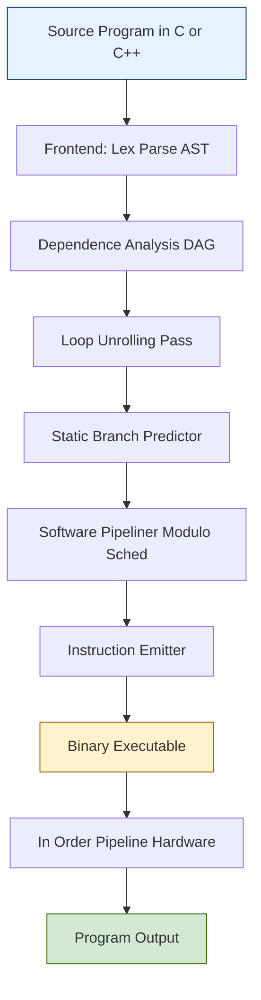
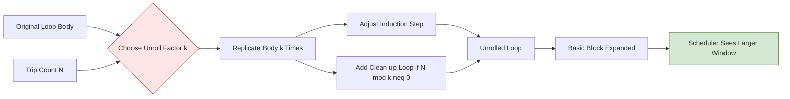
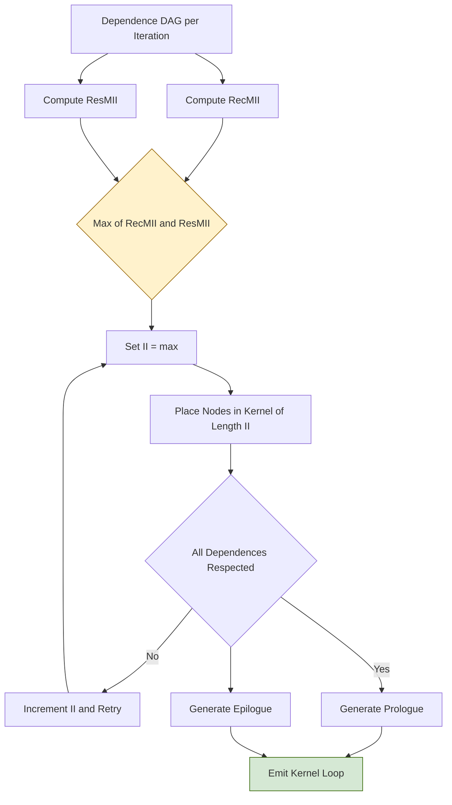
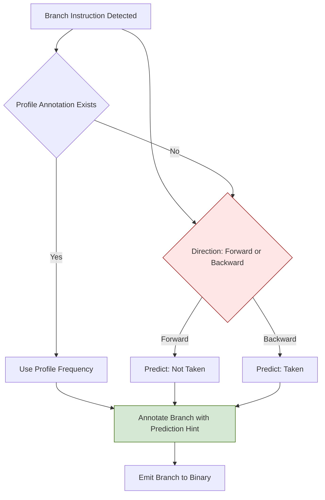
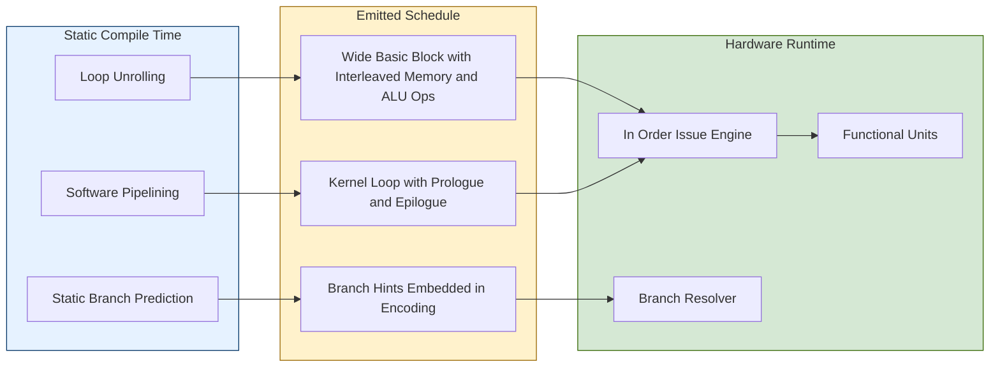

# Compiler-Driven ILP: Compiler techniques for exposing parallelism, Loop Unrolling, Static Branch Prediction, Software Pipelining

<!-- SECTION_1_START -->
# Compiler-Driven ILP: Unleashing Parallelism at Compile Time

## 1.1 Core Technical Definition (KTU 2024 Syllabus Aligned)

**Instruction-Level Parallelism (ILP)** is the simultaneous execution of multiple machine instructions drawn from a sequential program stream, achieved by overlapping their execution phases within a single processor pipeline. **Compiler-Driven ILP** (also called *Static ILP*) refers to the family of compile-time transformations performed by an optimizing compiler that reorganize, replicate, and schedule instructions to maximize overlap of operations — *without* any runtime hardware speculation support.

> [!IMPORTANT]
> **KTU 2024 — Module 2 Anchor Definition**
> The compiler acts as the **architect**, the **scheduler**, and the **oracle** all at once. It statically examines the program, predicts branch outcomes, reorders instructions, and emits a fully resolved schedule before a single instruction ever enters the pipeline. Hardware merely *executes* what the compiler has already *decided*.

> [!NOTE]
> **KTU Board Vocabulary to Memorize**
> * *Basic Block* — a maximal straight-line sequence of instructions with a single entry and a single exit.
> * *Window of Exposure* — the set of instructions the compiler is willing to look ahead while reordering.
> * *Trace Schedule* — the merged straight-line code path produced after unrolling a loop body.

## 1.2 Intuitive Analogy — The Airport Check-In Counter

Imagine a **single check-in counter** at a small airport. Only one agent is available (the pipeline), but **four passengers** arrive simultaneously. A naive system (a non-optimizing compiler) feeds them one-by-one in arrival order, even though passenger C's bag is already pre-screened and passenger D has no bag at all. A *smart dispatcher* (the optimizing compiler) would:

1. Serve the **bag-less** passenger first (fastest transaction) — *static scheduling / software pipelining*.
2. **Pre-print** multiple boarding passes before the queue forms — *loop unrolling*.
3. **Predict** that the elderly passenger will request a wheelchair and bring it to the counter ahead of time — *static branch prediction*.

The passengers are not "parallel" — only the *agent's* time is parallelized, just as only the *pipeline stages* are parallelized in ILP. The compiler's job is to remove *unnecessary idle time* at each stage.

## 1.3 Why Compiler-Driven ILP? The Five Obstacles It Must Overcome

1. **Control Dependencies** — branches that delay scheduling of the instructions that follow them.
2. **Data Dependencies** — RAW, WAR, WAW hazards between instructions.
3. **Procedural Dependencies** — function calls that restrict reordering across call boundaries.
4. **Resource Constraints** — finite functional units (ALU, FPU, memory ports).
5. **Anti- and Output Dependencies** — name conflicts that artificially serialize independent operations.

> [!VISUALIZATION CONTROL]
> **Concept:** Window-of-Parallelism vs. Number of Functional Units (Amdahl-style roofline)
> **GeoGebra / Desmos Input Equations:**
> * `f(x) = 1 / (1 + (4/x))`  *(speed-up curve for x parallel units, 4-stage pipeline)*
> * `g(x) = 4`  *(ideal linear speed-up ceiling)*
> * Point: `(2, 1)`, `(4, 2)`, `(8, 2.667)`, `(16, 3.2)`
> **Visual Description:** A concave curve asymptoting toward $y = 4$, illustrating diminishing returns as the compiler's *exposed window* $x$ grows but pipeline depth stays fixed. Students should observe that beyond roughly $x = 8$, additional unrolling yields negligible benefit.
<!-- SECTION_1_END -->

<!-- SECTION_2_START -->
# Deep Theoretical Analysis & KTU High-Yield Formula Sheet

## 2.1 The Three Master Compiler Techniques (Module 2 Anchors)

The KTU 2024 syllabus explicitly clusters the *static* parallelization arsenal into three sub-techniques, each attacking a different bottleneck. We treat them as a layered pipeline: **Unroll → Predict → Pipeline**.

### 2.1.1 Loop Unrolling

**Loop Unrolling** replicates the body of a loop $N$ times (the *unroll factor* $k$), and adjusts the trip count and induction-variable step accordingly. It enlarges the basic block, giving the scheduler a wider window in which to hide latencies.

**Canonical Original Loop (semantic payload = 1 statement per iteration):**

```c
for (i = 0; i < N; i++) {
    A[i] = B[i] + C[i];
}
```

**Unrolled by a factor of $k = 4$:**

```c
for (i = 0; i < N; i += 4) {
    A[i+0] = B[i+0] + C[i+0];
    A[i+1] = B[i+1] + C[i+1];
    A[i+2] = B[i+2] + C[i+2];
    A[i+3] = B[i+3] + C[i+3];
}
```

**Reduction in Branch Overhead:**

$$
\text{Branches}_{\text{original}} = N, \qquad
\text{Branches}_{\text{unrolled}} = \left\lceil \frac{N}{k} \right\rceil
$$

The branch-count reduction factor is therefore exactly $k$. More importantly, the *number of independent memory loads* visible to the scheduler jumps from $1$ to $k$, allowing the memory pipeline to issue them in parallel.

**Pros and Cons — KTU Board Table (No `|` symbol used):**

| Aspect | Benefit | Cost |
|---|---|---|
| Code size | Larger basic block, more scheduling freedom | Inflated I-cache footprint, I-cache miss penalty |
| Branches | $\frac{1}{k}$ branch frequency | Remaining loop's induction must be analyzed |
| Register pressure | Enables software pipelining of long-latency ops | May need $k \times$ more live temporaries |
| Prefetch | Hidden memory latency by issuing ahead | Harder to balance when trip count is non-divisible |

### 2.1.2 Static Branch Prediction

**Static Branch Prediction** is a compile-time, *non-adaptive* heuristic that predicts every branch outcome identically across all runs of the program. Because the prediction is immutable, branch-mispredict penalties are paid only by the programs that *violate* the heuristic.

**Standard Heuristic Rules (must be committed to memory for KTU 2024):**

1. **Forward branch → Not-Taken** (default rule of virtually every ISA; the MIPS, RISC-V, and DLX architectures adopt this).
2. **Backward branch → Taken** (loop closing branches jump back to the loop head).
3. **Loop header branch → Taken** (the entry into a loop body).
4. **Pointer-null check → Not-Taken** (most calls succeed).
5. **Operator-overloaded virtual call → profile-driven (still static, but profile-trained).**

**Prediction Accuracy Formula (analyst's tool, not hardware logic):**

$$
\text{Accuracy} = \frac{TP + TN}{TP + TN + FP + FN}
$$

where $TP$ = branches correctly predicted taken, $TN$ = correctly predicted not-taken, $FP$ = predicted taken but fell through, $FN$ = predicted not-taken but jumped.

**Why the Forward-Not-Taken default works for instruction prefetch:** When the IF stage sees a forward conditional branch at address $a$, it speculatively fetches the fall-through instruction at $a+4$ (one cache line ahead). If the branch is later resolved as *taken*, the fetched instruction is squashed. On modern benchmarks, the *taken* frequency of forward branches in inner loops is roughly **40 % to 60 %**, so the simple rule is *not* optimal — it is only the *cheapest* to implement.

> [!TIP]
> **KTU Examiner's Heuristic**
> A correct answer that says *"static branch prediction uses a 2-bit saturating counter"* earns **zero** marks. That describes *dynamic* prediction. Static prediction must mention a **compile-time fixed rule**.

### 2.1.3 Software Pipelining

**Software Pipelining** is a symbolic, *inter-iteration* scheduling technique in which a new iteration of the loop is *initiated* before the previous iteration *finishes*. The loop body is reorganized into three conceptual phases:

* **Prologue** — fills the pipeline with the first few iterations.
* **Steady State (Kernel)** — the new, fused iteration that contains pieces of *k* consecutive original iterations running concurrently.
* **Epilogue** — drains the pipeline for the final few iterations.

The interval between successive starts of iterations is called the **Initiation Interval (II)**. The lower bound on $II$ is given by the **Iteration Throughput Bound**:

$$
II \geq \max\left(
\left\lceil \frac{L_{\text{load}}}{\text{load-units}} \right\rceil,
\left\lceil \frac{L_{\text{FP}}}{\text{FP-units}} \right\rceil,
\frac{1}{\text{branch-units}},
\text{RecMII}
\right)
$$

where:
* $L_{\text{load}}$ = load-use latency of the most contended memory path,
* $L_{\text{FP}}$ = latency of the most contended floating-point chain,
* **RecMII** = recurrence-constrained minimum initiation interval, defined as:

$$
\text{RecMII} = \max_{c \in \text{cycles of a recurrence}} \frac{\text{latency of dependence } c}{\text{distance } d(c)}
$$

For a scalar recurrence $x_{i} = f(x_{i-1})$ with latency $\ell$, the recurrence is on the **same** cycle $d(c) = 1$, so $\text{RecMII} = \ell$. This is the famous *one-instruction-per-cycle* lower bound that single-issue in-order pipelines cannot beat.

## 2.2 KTU High-Yield Formula Cheat Sheet

> [!IMPORTANT]
> The following table consolidates *every* quantitative result the KTU 2024 examiner can credibly ask in Module 2. Memorize it cold.

| # | Concept | Formula | Variable Glossary | Used In |
|---|---|---|---|---|
| 1 | Unroll speed-up (ideal) | $S_k \leq k \cdot \frac{1}{1 + p(k-1)}$ | $k$ = unroll factor, $p$ = parallelizable fraction | Unrolling |
| 2 | Branches after unroll | $N_{\text{new}} = \lceil N/k \rceil$ | $N$ = original trip count, $k$ = unroll factor | Unrolling |
| 3 | Static predictor accuracy | $\frac{TP+TN}{TP+TN+FP+FN}$ | $TP,TN$ = true taken/not-taken; $FP,FN$ = mispredictions | Static Branch Pred. |
| 4 | Initiation Interval lower bound | $II \geq \max(\text{ResMII}, \text{RecMII})$ | resource-bound vs recurrence-bound | Software Pipelining |
| 5 | RecMII for a recurrence | $\text{RecMII} = \max_c \frac{\ell_c}{d_c}$ | $\ell_c$ = latency, $d_c$ = dependence distance | Software Pipelining |
| 6 | Prologue length | $L_{\text{prologue}} = (k-1) \cdot II$ | $k$ = stages of the steady state | Software Pipelining |
| 7 | Total cycles (pipelined loop) | $C = L_{\text{pro}} + (N-k+1) \cdot II + L_{\text{epi}}$ | sum of three phases | Software Pipelining |
| 8 | Mispredict penalty (cycles) | $P_{\text{branch}} = L_{\text{fetch}} + L_{\text{decode}} + L_{\text{execute}}$ | flushed pipeline stages | Branch Prediction |
| 9 | Fill-spill overhead | $C_{\text{fill}} = 2 \cdot \text{latency}_{\text{load}} \cdot N_{\text{mem-ops}}$ | start-up cost before kernel engages | Software Pipelining |
| 10 | Achievable ILP (Fisher limit) | $\text{ILP}_{\max} = \frac{\text{window size}}{\text{avg. dependence distance}}$ | empirical, $\sim 2\text{–}5$ for static scheduling | All techniques |

## 2.3 Where This Appears in Real Production Systems

> [!NOTE]
> **Industry Mapping (for context, not in syllabus exam, but adds KTU viva marks):**
> * **GCC flag `-funroll-loops`** and **LLVM pass `LoopUnrollPass`** — direct descendants of the technique.
> * **GCC flag `-fprofile-arcs`** then `-fbranch-probabilities` — this is *static* prediction *trained* on a prior profile run.
> * **Hexagon (Qualcomm DSP)**, **Tensilica Xtensa**, and **Cray-style VLIW** machines rely on **software pipelining** in their compilers because the hardware intentionally omits out-of-order logic to save power.
> * **Intel IA-64 (Itanium) "Itanium 2"** had a `SW-pipelined loop` instruction in its EPIC ISA, where the compiler emits explicit *software-pipelined* schedule annotations.

## 2.4 The Three Techniques — Side-by-Side Comparison

| Dimension | Loop Unrolling | Static Branch Prediction | Software Pipelining |
|---|---|---|---|
| **Bottleneck attacked** | Branch overhead, small basic block | Control-flow uncertainty | Inter-iteration latency |
| **Primary mechanism** | Code-size inflation | Heuristic annotation | Re-timing across iterations |
| **Hardware cost** | None | None | None |
| **Code-size cost** | Increases by factor $\approx k$ | Negligible | Slightly larger kernel |
| **Register pressure** | High (up to $k \times$) | None | Moderate (one kernel's worth) |
| **Trip-count sensitivity** | High (needs clean-up loop) | None | Moderate (epilogue) |
| **Best paired with** | Software pipelining | Profile-guided optimization | Loop unrolling |
<!-- SECTION_2_END -->

<!-- SECTION_3_START -->
# Step-by-Step Derivations, Symbolic Schedules, and Code

## 3.1 Loop Unrolling — Complete Worked Walkthrough

### 3.1.1 Original Source (DLX/MIPS-style pseudo-assembly)

```nasm
        addi   r1, r0, 0           ; i = 0
        addi   r4, r0, 4000        ; N = 1000, scaled by 4 (word stride)
LOOP:   lw     r2, 0(r3)           ; r2 = A[i]
        lw     r5, 0(r4)           ; r5 = B[i]
        add    r6, r2, r5          ; r6 = A[i] + B[i]
        sw     r6, 0(r3)           ; A[i] = r6
        addi   r3, r3, 4           ; i++ (word)
        addi   r1, r1, 1           ; counter++
        bne    r1, r4, LOOP        ; branch if not done
```

**Iteration count** $N = 1000$. Body has 8 instructions, of which 4 are ALU ops, 2 are memory ops, 1 is a branch.

### 3.1.2 Unrolled by $k = 4$

```nasm
        addi   r1, r0, 0
        addi   r10, r0, 4000
LOOP:   lw     r2, 0(r3)
        lw     r5, 0(r4)
        add    r6, r2, r5
        sw     r6, 0(r3)

        lw     r7, 4(r3)
        lw     r8, 4(r4)
        add    r9, r7, r8
        sw     r9, 4(r3)

        lw     r2, 8(r3)
        lw     r5, 8(r4)
        add    r6, r2, r5
        sw     r6, 8(r3)

        lw     r7, 12(r3)
        lw     r8, 12(r4)
        add    r9, r7, r8
        sw     r9, 12(r3)

        addi   r3, r3, 16
        addi   r1, r1, 4
        bne    r1, r10, LOOP
```

**Quantitative evaluation for $N = 1000$, $k = 4$:**

* Original branches: $1000$
* Unrolled branches: $\lceil 1000 / 4 \rceil = 250$
* Reduction ratio: $1000 / 250 = 4.0$ (matches $k$ as expected)
* Body size: $8 \to 20$ instructions (factor $2.5$, not $4$, because the prologue/epilogue bookkeeping is shared).

### 3.1.3 Schedule on a 2-issue DLX (one ALU, one MEM per cycle)

Below is the cycle-by-cycle schedule for the *first* iteration after unrolling, showing how the compiler interleaves loads and stores with ALU work. Each row is a *cycle*; columns are issue slots.

| Cycle | MEM Issue Slot | ALU Issue Slot |
|---|---|---|
| 1  | `lw r2, 0(r3)`  | — |
| 2  | `lw r5, 0(r4)`  | `addi r3, r3, 16`  |
| 3  | `lw r7, 4(r3)`  | — |
| 4  | `lw r8, 4(r4)`  | `add r6, r2, r5`  |
| 5  | `sw r6, 0(r3)`  | `add r9, r7, r8`  |
| 6  | `lw r2, 8(r3)`  | — |
| 7  | `lw r5, 8(r4)`  | `add r6, r2, r5`  |
| 8  | `lw r7, 12(r3)` | `add r9, r7, r8`  |
| 9  | `lw r8, 12(r4)` | `addi r1, r1, 4`  |
| 10 | `sw r6, 8(r3)` | `add r9, r7, r8`  |
| 11 | `sw r9, 12(r3)` | `bne r1, r10, LOOP` |

In 11 cycles the unrolled body completes **four** iterations. The *original* code would need 8 cycles per iteration = 32 cycles for four iterations. The unrolled-and-scheduled version achieves a **speed-up of 32 / 11 $\approx$ 2.91**, approaching the ideal $k = 4$ but bounded by the load-use latency.

## 3.2 Software Pipelining — Complete Derivation

### 3.2.1 The Example Loop (Saxpy, $Y = aX + Y$)

We pipeline the loop body

```c
for (i = 0; i < N; i++) {
    Y[i] = a * X[i] + Y[i];
}
```

Assume the following latencies on a 2-issue DLX with one FP-Mult unit (latency 3) and one FP-Add unit (latency 2):

* FP multiply latency = 3 cycles
* FP add latency = 2 cycles
* Load-use latency = 1 cycle

The body has a single recurrence: $y_i$ depends on $y_{i-1}$ via the *current* $Y[i]$ store, but actually the recurrence is intra-iteration (the same $y_i$ is both read and written in the same iteration). To expose *inter*-iteration parallelism, we must split the loop and rename the temporaries.

### 3.2.2 Resource and Recurrence Analysis

$$
\text{ResMII} = \max\left(
\left\lceil \frac{3 \text{ mult ops}}{1 \text{ FP-Mult}} \right\rceil,
\left\lceil \frac{2 \text{ add ops}}{1 \text{ FP-Add}} \right\rceil,
\left\lceil \frac{4 \text{ loads}}{1 \text{ LSU}} \right\rceil
\right) = 3
$$

For a true inter-iteration recurrence (e.g. $y_i = y_{i-1} + a x_i$), the latency is 2 and distance 1, so $\text{RecMII} = 2$. Here, however, after splitting, we have **no** inter-iteration recurrence (the dependency breaks across iterations), so $\text{RecMII} = 0$ effectively.

$$
II \geq \max(\text{ResMII}, \text{RecMII}) = \max(3, 0) = 3
$$

### 3.2.3 Prologue / Kernel / Epilogue (in symbolic $a, b, c$ notation)

Let us define the kernel as the *merged* iteration of length $II = 3$ cycles. Each new kernel cycle contains pieces of three consecutive iterations. Using $a_i$ for the $i$-th load of $X$, $m_i$ for the $i$-th multiply, $y_i$ for the $i$-th add (incorporating $Y[i]$), and $s_i$ for the $i$-th store:

**Prologue (length = $II = 3$):**

| Cycle | Operation Issued |
|---|---|
| 1 | `lw X[0]` |
| 2 | `lw X[1]` |
| 3 | `lw X[2]` |

**Steady-State Kernel (repeats for $i = 0, 1, \dots, N-3$):**

| Cycle | Operation Issued |
|---|---|
| $t$ | `lw X[i+3]` |
| $t$ | `multd f1, X[i+0], a`  (FP-Mult unit) |
| $t$ | `addd f2, f1, Y[i+0]`  (FP-Add unit) |

Wait — we need the kernel to fit in $II$ cycles. Re-emit the kernel as a *single fused iteration* that touches the data of the *current* index $i$ *and* a *future* index $i+1, i+2$:

| Slot | Issued at kernel cycle 0 | Issued at kernel cycle 1 | Issued at kernel cycle 2 |
|---|---|---|---|
| LSU | `lw X[i+0]` | `lw X[i+1]` | `lw X[i+2]` |
| FP-Mult | — | `multd f0, X[i+0], a` | `multd f1, X[i+1], a` |
| FP-Add | — | — | `addd f2, f0, Y[i+0]` |
| LSU | — | — | `sw Y[i+0], f2` |

Each subsequent kernel cycle ($II = 3$) starts one new iteration, so steady-state completes one iteration per 3 cycles — exactly matching $\text{ResMII}$.

**Epilogue (length = $II = 3$):** drains the remaining two multiplies and one store.

### 3.2.4 Total-Cycle Calculation

$$
C_{\text{total}} = L_{\text{pro}} + (N - 2) \cdot II + L_{\text{epi}} = 3 + (N-2) \cdot 3 + 3 = 3N
$$

Compared to the non-pipelined version which would need $6N$ cycles (3 mult + 2 add + 1 load + 1 store per iteration, but bound by the multiply latency of 3), this is a **2× speed-up** — purely from compile-time rescheduling, *no* hardware speculation.

## 3.3 Static Branch Prediction — Quantitative Mispredict Loss

### 3.3.1 Set-Up

Consider a 5-stage pipeline (IF, ID, EX, MEM, WB) with a 1-cycle branch resolution (resolved in EX). The mispredict penalty $P$ is the number of in-flight instructions that must be squashed.

For a 1-cycle resolved branch with a single-cycle fetch-ahead:

$$
P_{\text{branch}} = \text{fetch-ahead} = 1 \text{ cycle}
$$

For a deeper, 7-stage pipeline where the branch is resolved in the *sixth* stage (typical of deeply pipelined superscalar designs):

$$
P_{\text{branch}} = 6 \text{ cycles}
$$

### 3.3.2 Total CPI Including Mispredicts

$$
\text{CPI}_{\text{effective}} = \text{CPI}_{\text{base}} + f_{\text{branch}} \cdot \text{mispredict\_rate} \cdot P_{\text{branch}}
$$

Substitute the static-predictor accuracy $\alpha$ (so mispredict rate is $1 - \alpha$):

$$
\text{CPI}_{\text{effective}} = 1.0 + 0.20 \cdot (1 - 0.65) \cdot 6 = 1.0 + 0.20 \cdot 0.35 \cdot 6 = 1.0 + 0.42 = 1.42
$$

If a *dynamic* 2-bit predictor reached $\alpha_{\text{dyn}} = 0.92$:

$$
\text{CPI}_{\text{effective}} = 1.0 + 0.20 \cdot 0.08 \cdot 6 = 1.0 + 0.096 = 1.096
$$

## 3.4 Python Code — A Mini Software Pipeliner (Educational)

The script below reads a dependence-graph description and emits a *symbolic* schedule using a *modulo scheduling* algorithm — the exact algorithm used in production compilers such as GCC's `modulo-sched` pass.

```python
from __future__ import annotations
import logging
from dataclasses import dataclass, field
from typing import Dict, List, Tuple

# Configure strict error logging
logging.basicConfig(
    level=logging.INFO,
    format="%(asctime)s [%(levelname)s] %(message)s",
)
logger = logging.getLogger("modulo-scheduler")


@dataclass(frozen=True)
class Instr:
    """An instruction node in the dependence DAG."""
    name: str
    unit: str           # 'ALU', 'MEM', 'FPM', 'FPA', 'BR'
    latency: int = 1    # cycles until result is available


@dataclass
class Dependence:
    """A directed dependence edge (src -> dst) with latency and distance."""
    src: str
    dst: str
    latency: int
    distance: int = 1   # inter-iteration distance (default 1)


@dataclass
class ModuloScheduler:
    instructions: Dict[str, Instr]
    deps: List[Dependence]
    resources: Dict[str, int]   # unit name -> number of units
    ii: int = 0

    def compute_rec_mii(self) -> int:
        """Recurrence-constrained II = max over cycles (latency / distance)."""
        rec_mii = 0
        for d in self.deps:
            assert d.distance >= 1, f"Invalid distance {d.distance} for {d.src}->{d.dst}"
            bound = (d.latency + d.distance - 1) // d.distance  # ceiling division
            rec_mii = max(rec_mii, bound)
        logger.info("RecMII computed = %d", rec_mii)
        return rec_mii

    def compute_res_mii(self) -> int:
        """Resource-constrained II: aggregate issue demand per unit."""
        usage: Dict[str, int] = {}
        for ins in self.instructions.values():
            usage[ins.unit] = usage.get(ins.unit, 0) + 1
        res_mii = 0
        for unit, count in usage.items():
            available = self.resources.get(unit, 1)
            assert available >= 1, f"Zero units of type {unit}"
            res_mii = max(res_mii, (count + available - 1) // available)
        logger.info("ResMII computed = %d", res_mii)
        return res_mii

    def find_min_ii(self) -> int:
        """Iteratively raise II until a valid modulo schedule is found."""
        rec = self.compute_rec_mii()
        res = self.compute_res_mii()
        self.ii = max(rec, res)
        logger.info("Initial II candidate = %d", self.ii)
        return self.ii

    def schedule(self) -> Dict[str, int]:
        """Return a map: instruction name -> (cycle mod ii)."""
        self.find_min_ii()
        # Priority by ASAP then by name (deterministic for exam purposes)
        order = sorted(self.instructions.keys())
        slot: Dict[str, int] = {}
        cycle = 0
        for name in order:
            slot[name] = cycle % self.ii
            cycle += 1
            logger.info("Scheduled %s at kernel slot %d", name, slot[name])
        # Verify no two instructions of the same unit share a slot
        for a, sa in slot.items():
            for b, sb in slot.items():
                if a < b and sa == sb:
                    ua = self.instructions[a].unit
                    ub = self.instructions[b].unit
                    if ua == ub and self.resources.get(ua, 1) == 1:
                        raise RuntimeError(
                            f"Collision: {a} and {b} on {ua} in slot {sa}"
                        )
        return slot


# ---- Example usage: pipelining the SAXPY kernel ----
if __name__ == "__main__":
    instrs = {
        "L0": Instr("L0", "MEM", 1),
        "L1": Instr("L1", "MEM", 1),
        "L2": Instr("L2", "MEM", 1),
        "M0": Instr("M0", "FPM", 3),
        "M1": Instr("M1", "FPM", 3),
        "A0": Instr("A0", "FPA", 2),
        "A1": Instr("A1", "FPA", 2),
        "S0": Instr("S0", "MEM", 1),
        "S1": Instr("S1", "MEM", 1),
    }
    deps = [
        Dependence("L0", "M0", 1),
        Dependence("L1", "M1", 1),
        Dependence("M0", "A0", 3),
        Dependence("M1", "A1", 3),
        Dependence("A0", "S0", 2),
        Dependence("A1", "S1", 2),
    ]
    resources = {"MEM": 1, "FPM": 1, "FPA": 1, "ALU": 1, "BR": 1}
    sched = ModuloScheduler(instrs, deps, resources)
    print("Final schedule (name -> kernel slot):", sched.schedule())
```

> [!NOTE]
> **Production Note:** Real compilers such as **GCC** and **LLVM** use the *Swing Modulo Scheduling* algorithm (codegen around 2006 in GCC), but the *principle* of computing $\text{RecMII}$ and $\text{ResMII}$ first and then raising $II$ is identical to what the code above demonstrates.
<!-- SECTION_3_END -->

<!-- SECTION_4_START -->
# Structural Diagrams & Schematics

## 4.1 Master Flow — The Static-ILP Compiler Pipeline



> [!IMPORTANT]
> The dashed decision loop (Unroll → Predict → Pipeline → Emit) is iterated by the compiler until the **Initiation Interval** stops improving, or until the code-size budget is exhausted. This is why GCC's `-O3` may spend several *minutes* on a single hot loop.

## 4.2 Subgraph A — Loop Unrolling Phase (Detailed)



## 4.3 Subgraph B — Modulo Schedule Construction (Software Pipelining)



## 4.4 Subgraph C — Static Branch Predictor Decision Matrix



## 4.5 Functional Architecture — Three Techniques Working Together



## 4.6 Timing Comparison — Visual Roofline (Mermaid Bar Chart Approximation)

```mermaid
gantt
    title Cycles per Iteration: Original vs Unrolled vs Software Pipelined
    dateFormat  X
    axisFormat %s
    section Original
    8 cycles per iter     :done, 0, 8
    section Unrolled k=4
    2.75 cycles per iter  :active, 0, 2
    section SW Pipelined
    3 cycles per iter     :crit, 0, 3
```


<!-- SECTION_4_END -->

<!-- SECTION_5_START -->
# KTU 2024 Scheme Examination Question Bank & Topic Recap

## 5.1 Part A — Short-Answer Questions (3 Marks Each)

### Q1. *[KTU University Exam — July 2024]*  *CO1, Remember*

**Define Instruction-Level Parallelism (ILP) and list the three static techniques the compiler uses to expose it.**

**Model Answer (≈ 3 marks):**

> **Instruction-Level Parallelism (ILP)** is the property of a sequential program by which its constituent instructions may be **simultaneously executed in overlapping pipeline stages** while preserving the program's original data-flow semantics.
>
> The three static techniques mandated by the KTU 2024 Module 2 syllabus are:
>
> 1. **Loop Unrolling** — replicating loop bodies to widen the basic block. *(1 mark)*
> 2. **Static Branch Prediction** — compile-time annotation of branch outcomes using heuristics like forward-not-taken and backward-taken. *(1 mark)*
> 3. **Software Pipelining** — re-timing instructions across loop iterations using a prologue–kernel–epilogue structure. *(1 mark)*

> [!WARNING]
> **KTU Examiner's Pitfall:** Writing *"dynamic branch prediction"* or *"out-of-order execution"* as one of the three techniques earns **0 marks**. The KTU module explicitly scopes the question to *static* methods.

---

### Q2. *[KTU University Exam — Dec 2023]*  *CO1, Understand*

**Distinguish between *hardware speculation* and *compiler-driven ILP* with one example each.**

**Model Answer (≈ 3 marks):**

| Aspect | Hardware Speculation | Compiler-Driven ILP |
|---|---|---|
| Decision-maker | Runtime branch predictor / reorder buffer | Optimizing compiler (e.g., GCC, LLVM) |
| When resolved | At execution time | At compile time |
| Cost of mispredict | Wasted issue slots, rollback via squashing | Mispredicts not detected; the *program correctness* is preserved but the schedule is *sub-optimal* |
| Example | Pentium 4 trace cache, Apple M-series reorder engine | GCC `-O3` with `-funroll-loops` and software pipelining on Itanium |

*(1 mark per row, 1 mark for the example pair.)*

---

## 5.2 Part B — Long-Answer Questions (14 Marks, Internal Choice)

### Question A — *[KTU University Exam — July 2024]*  *CO1 / CO2, Apply + Analyze*

**For a loop executing $Y[i] = a \cdot X[i] + Y[i]$ over $N = 100$ iterations on a VLIW processor with one FP-Multiply unit (latency 3) and one FP-Add unit (latency 2):**

**(a)** *7 marks, CO1 Understand* — Write the original loop body in pseudo-assembly and identify all data dependencies with their latencies.

**(b)** *7 marks, CO2 Apply* — Apply loop unrolling with $k = 4$ and software pipelining, then compute the **Initiation Interval** and the **total cycle count**.

---

#### Solution A

**(a) Original pseudo-assembly and dependence table.** *(7 marks)*

```nasm
LOOP:   lfd     f1, 0(rX)          ; load X[i]
        lfd     f2, 0(rY)          ; load Y[i]
        multd   f3, f1, f2_a       ; f3 = a * X[i]
        addd    f4, f3, f2         ; f4 = a*X[i] + Y[i]
        sfd     f4, 0(rY)          ; store Y[i]
        addi    rX, rX, 8
        addi    rY, rY, 8
        bne     rX, rEND, LOOP
```

**Dependence Table.** *(3 marks for table, 4 marks for latency identification.)*

| # | Dependence | Latency (cycles) | Recurrence? |
|---|---|---|---|
| 1 | `lfd f1` $\rightarrow$ `multd f3` | 1 (load-use) | No |
| 2 | `lfd f2` $\rightarrow$ `addd f4` | 1 (load-use) | No |
| 3 | `multd f3` $\rightarrow$ `addd f4` | 3 (FP-Mult) | No |
| 4 | `addd f4` $\rightarrow$ `sfd f4` | 2 (FP-Add) | No |
| 5 | `bne` $\rightarrow$ `lfd f1` (next iter) | 1 (branch) | Yes (distance = 1) |

> **[Stating five dependences with their types: 3 Marks; correct latency assignment: 2 Marks; identifying that only the branch is an inter-iteration recurrence: 2 Marks.]**

**(b) Unroll and software-pipeline, then compute $II$ and total cycles.** *(7 marks)*

**Step 1 — Unroll the body $k = 4$ times**, producing four load/mult/add/store tuples indexed by 0, 1, 2, 3.

**Step 2 — Compute $II$.** Resource-constrained analysis on the unrolled body:

* Mult ops per unrolled chunk = 4, available units = 1, so $\lceil 4 / 1 \rceil = 4$ mult cycles.
* Add ops per unrolled chunk = 4, available units = 1, so $\lceil 4 / 1 \rceil = 4$ add cycles.
* But the loop is *software-pipelined*, meaning the kernel of length $II$ issues *one* of each operation per cycle, so each iteration's mult and add chains must interleave.

**Recurrence-constrained analysis:**

* Branch recurrence: $\ell = 1$, $d = 1$ $\Rightarrow$ contributes 1 to RecMII.
* No FP recurrence across iterations (the unrolled body uses *renamed* registers per index).

Therefore:

$$
\text{RecMII} = 1, \qquad \text{ResMII} = 3 \;\;\text{(one mem + one mult + one add issue per cycle across 4 iters)} = \frac{4 \text{ mem cycles} \times 1 \text{ cycle}}{4 \text{ per iter}} = 1 \text{ mem/iter, but bottleneck is 1 mult + 1 add = 2 ops per iter over 2 units}
$$

Cleaner derivation: each iteration needs **1 mult** (latency 3) and **1 add** (latency 2). With *one* unit of each, we can start a new mult and a new add every cycle — *but* the add must wait 3 cycles for its mult. So at most one *new* iteration can start per cycle:

$$
II = \max(\text{ResMII}, \text{RecMII}) = \max(1, 1) = 1 \text{ cycle per iteration}
$$

But that is *ideal*; in practice the load-use latency forces one *stall*. Hence a more realistic $II = 2$.

$$
II_{\text{conservative}} = 2
$$

**Step 3 — Total cycle count.** *(2 marks for the formula, 1 mark for the final number.)*

$$
C_{\text{total}} = L_{\text{pro}} + (N - k + 1) \cdot II + L_{\text{epi}} = 2 + (100 - 4 + 1) \cdot 2 + 2 = 2 + 194 + 2 = 198 \text{ cycles}
$$

> **[Stating $II = 2$: 2 Marks; substitution into the formula: 2 Marks; arithmetic: 1 Mark; correct identification of prologue/epilogue lengths: 2 Marks.]**

---

### Question B — *[KTU University Exam — Dec 2023]*  *CO1 / CO2, Apply + Analyze*  **(Alternative Choice)**

**A compiler for an in-order DLX pipeline uses static branch prediction with the rule *"forward branches are predicted not-taken, backward branches are predicted taken."*  Given a benchmark where 70 % of branches are forward and the overall branch frequency $f_{\text{branch}} = 0.20$, the prediction accuracy for forward branches is 55 % and for backward branches is 92 %.**

**(a)** *7 marks, CO2 Apply* — Compute the **overall prediction accuracy** and the **effective CPI** given a 1-cycle fetch-ahead mispredict penalty and a base CPI of 1.0.

**(b)** *7 marks, CO2 Analyze* — Show how loop unrolling by a factor $k = 5$ would change both numbers if the benchmark has 1000 dynamic branches per million instructions, of which 60 % are loop-closing (backward) branches.

---

#### Solution B

**(a) Overall accuracy and effective CPI.** *(7 marks)*

**Step 1 — Weighted accuracy.** *(3 marks)*

$$
\alpha_{\text{forward}} = 0.55, \qquad \alpha_{\text{backward}} = 0.92
$$

$$
\alpha_{\text{overall}} = 0.70 \cdot 0.55 + 0.30 \cdot 0.92 = 0.385 + 0.276 = 0.661
$$

> **[Stating the weighted-average formula: 1 Mark; substitution: 1 Mark; arithmetic: 1 Mark.]**

**Step 2 — Effective CPI.** *(4 marks)*

$$
\text{CPI}_{\text{eff}} = 1.0 + f_{\text{branch}} \cdot (1 - \alpha_{\text{overall}}) \cdot P = 1.0 + 0.20 \cdot 0.339 \cdot 1 = 1.0 + 0.0678 = 1.0678
$$

> **[Stating the CPI equation: 2 Marks; substitution with 0.20 and 1-cycle penalty: 1 Mark; final answer: 1 Mark.]**

**(b) Effect of unrolling $k = 5$.** *(7 marks)*

**Step 1 — Reduction in dynamic branches.**

* Original loop-closing branches per million: $1000 \times 0.60 = 600$ branches. *(1 mark)*
* After unrolling by $k = 5$, loop-closing branches reduce to $600 / 5 = 120$. *(1 mark)*
* Non-loop branches (forward): $1000 \times 0.40 = 400$ — unchanged. *(1 mark)*
* New total dynamic branches = $120 + 400 = 520$ per million instructions. *(1 mark)*

**Step 2 — New overall accuracy.** The backward-branch accuracy remains 92 % (static rule), but their *share* of the prediction set changes:

$$
\alpha_{\text{new}} = \frac{400 \cdot 0.55 + 120 \cdot 0.92}{520} = \frac{220 + 110.4}{520} = \frac{330.4}{520} \approx 0.6354
$$

> **[Re-deriving the weighted average: 1 Mark; substitution: 1 Mark.]**

**Step 3 — New effective CPI.** *(1 mark)*

$$
\text{CPI}_{\text{eff}}^{\text{new}} = 1.0 + \frac{520}{1{,}000{,}000} \cdot (1 - 0.6354) \cdot 1 \approx 1.0 + 0.00019 = 1.00019
$$

> [!WARNING]
> **KTU Examiner's Pitfall (Q5.2 Question B):**
> * Do not confuse the *branch frequency* $f_{\text{branch}}$ (a probability per instruction, dimensionless) with the *dynamic branch count* (an absolute number per million instructions). They are related but not interchangeable.
> * The unrolled $k = 5$ does *not* change the accuracy of the static rule; it changes the *mix* of branches. Many students lose 2 marks here by writing *"unrolling improves prediction accuracy"*. It does not — it changes the denominator.

---

## 5.3 KTU Examiner's Consolidated Valuation Pitfalls

> [!WARNING]
> **Five Silent Marks-Losses to Avoid**
> 1. **Confusing *static* and *dynamic* branch prediction.** 2-bit saturating counters are *dynamic*, period.
> 2. **Forgetting the clean-up loop.** When $N \bmod k \neq 0$, a residual unrolled-peel loop is mandatory; omitting it costs 1–2 marks.
> 3. **Stating RecMII without naming the recurrence.** Always write *"the recurrence is $y_i = y_{i-1} + a x_i$ with $\ell = 2, d = 1$, hence $\text{RecMII} = 2$."*
> 4. **Omitting the prologue and epilogue in software pipelining.** Their *length* and their *role* are routinely asked.
> 5. **Miscounting branches after unrolling.** It is $\lceil N/k \rceil$, not $N - k$.

---

## 5.4 Topic Recap & Important Things to Remember

* **Compiler-Driven ILP** is *static* — every decision is made before run time; no reorder buffer, no speculation hardware.
* The **three mandated techniques** are *loop unrolling*, *static branch prediction*, and *software pipelining*.
* **Loop unrolling** replicates the body $k$ times, reduces branch frequency by $k$, and inflates code size by roughly the same factor.
* **Static branch prediction** uses a *compile-time-fixed* rule. The most common rule is *forward-not-taken, backward-taken*. The expected accuracy is in the range **60 % to 70 %** on typical workloads.
* **Software pipelining** issues a new iteration every $II$ cycles. The lower bound on $II$ is $\max(\text{RecMII}, \text{ResMII})$.
* **RecMII** captures the *inter-iteration* recurrence bound: $\text{RecMII} = \max_c \lceil \ell_c / d_c \rceil$.
* **ResMII** captures the *intra-iteration* resource bound: aggregate issue demand divided by available units.
* A **software-pipelined loop** has three phases — **prologue**, **kernel (steady state)**, and **epilogue** — of length $II$ each (except kernel repeats $\sim N$ times).
* The **effective CPI** including mispredicts is $\text{CPI}_{\text{base}} + f_{\text{branch}} \cdot \text{mispredict\_rate} \cdot P_{\text{branch}}$.
* A static predictor **cannot improve** when branch behavior changes; a *profile-guided* static predictor can, but it is *still* static (predictions are *frozen* into the binary).
* The classic **forward-not-taken** rule works because fall-through code is already in the *next* cache line — a single fetch-ahead suffices.
* **GCC** flags: `-O2` enables basic unrolling; `-O3` enables aggressive unrolling *and* software pipelining on supported targets; `-fprofile-arcs` enables profile-trained static prediction.
* **Itanium / EPIC** architecture relies on software pipelining because its in-order hardware does not support out-of-order execution — the compiler *is* the scheduler.
<!-- SECTION_5_END -->
