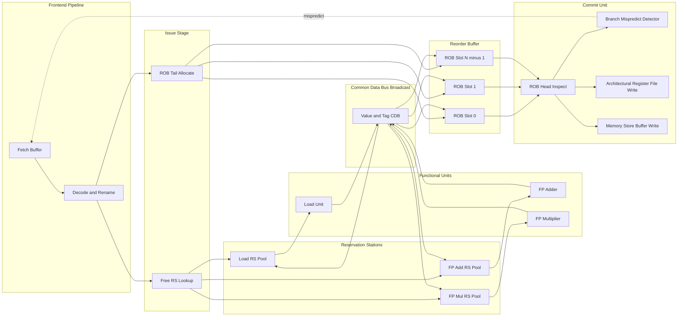
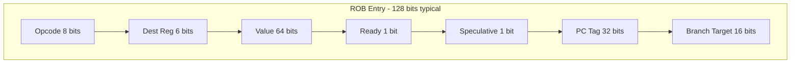
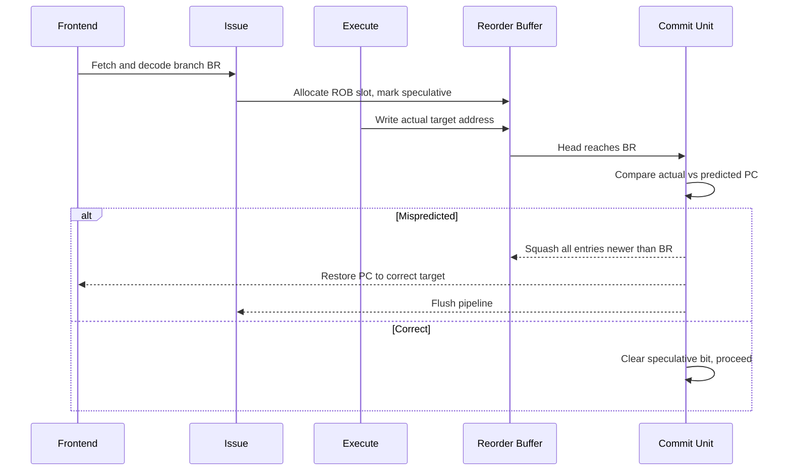
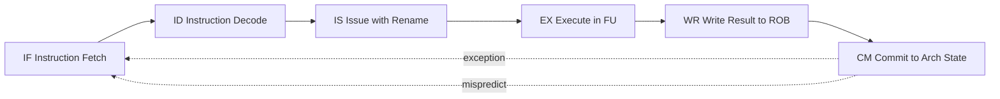
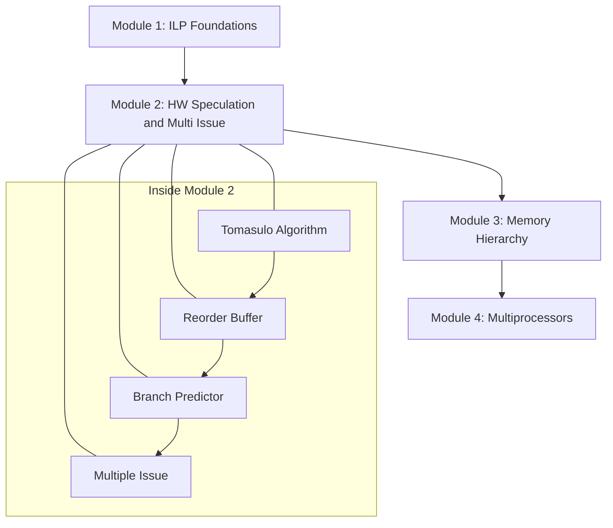

# Hardware-Based Speculation: Concepts, Reorder Buffers (ROB), integration of Tomasulo's algorithm with hardware speculation

<!-- SECTION_1_START -->
# Hardware-Based Speculation: Concepts, Reorder Buffer (ROB) \& Tomasulo Integration

## 1.1 Formal Academic Definition

**Hardware-Based Speculation** is an advanced microarchitectural technique in which the processor dynamically predicts and executes instructions *before* the certainty of their outcome is established, and then uses dedicated hardware structures (predominantly the **Reorder Buffer (ROB)**) to commit the results in strict program order. This allows the **Central Processing Unit (CPU)** to look past control hazards (unresolved branches) and data hazards, achieving higher **Instructions Per Cycle (IPC)** than static, in-order pipelines.

> [!IMPORTANT]
> **KTU 2024 Syllabus Anchor (PCCST602 — Module 2):** "Hardware-Based Speculation — concepts, Reorder Buffer (ROB), integration of Tomasulo's algorithm with hardware speculation."

**Reorder Buffer (ROB)** is a circular hardware queue that sits at the boundary between the **out-of-order execution core** and the **architectural register file / memory system**. Each in-flight instruction occupies a numbered ROB slot, holding the *instruction type*, *destination register*, *computed value*, and a *ready* status. The ROB acts as a **temporal bridge**: it lets functional units complete in any order (speculative) while forcing the *visible* state to retire in program order.

> [!NOTE]
> **Core Idea (One Line):** "Execute out-of-order, but commit in-order — under the protection of a reorder buffer."

## 1.2 Intuitive Real-World Analogy

Imagine a **smart courtroom judge** who hears cases *out of order* to maximize throughput, but writes judgments onto a *public record* in strict chronological order. Each case has a **docket number (ROB entry)**, a **verdict (result value)**, and a **seal of approval (Ready bit)**. While awaiting a verdict on a related case, the judge continues hearing newer cases — *speculating* that the older verdict will not be overturned. The instant a verdict is appealed and reversed, the judge **scrubs** all later dockets that depended on it. The ROB is exactly this docket system for an out-of-order CPU.

A simpler analogy: think of an **air traffic controller** clearing planes for landing *speculatively*, before final landing clearance. The *commit* to the runway happens only when a **safe order** is established. If a plane later withdraws, the entire downstream chain is retimed.

## 1.3 Why Hardware Speculation? — The Motivation

> [!NOTE]
> **Three Concrete Reasons (High-Yield for KTU 14-Markers):**
> 1. **Branch misprediction latency** is hidden by speculating past conditional jumps.
> 2. **Instruction-Level Parallelism (ILP)** is widened — independent instructions behind stalls are issued.
> 3. **Precise exceptions** are preserved despite aggressive out-of-order completion.

The textbook example is an **iterative FP loop** (e.g., `for (i=1000; i>0; i--) x = x + sqrt(A[i]);`). Without speculation, the long-latency FP unit stalls the integer branch update; with speculation, hundreds of iterations are *in flight* simultaneously.

## 1.4 Standard Hardware Metrics Used in This Module

- **CPI** (Cycles Per Instruction) — default baseline **CPI = 1**.
- **IPC** = $1 / \text{CPI}$ — goal is **IPC $\rightarrow$ 1 + (parallel functional units)**.
- **Issue width** — number of instructions dispatched per cycle (commonly **4 to 8** in modern OoO cores).
- **ROB size** — typically **128 to 256 entries** in modern Intel/AMD cores.
- **Misprediction penalty** — typically **15 to 20 cycles** for a 5-stage predictor.

## 1.5 Visualization of Speculative Flow

> [!VISUALIZATION CONTROL]
> **Concept:** Timeline of in-order commit vs. out-of-order execution with ROB.
> **Conceptual Plot (Time on X-axis, Instruction on Y-axis):**
> * `I1: ADD R1,R2,R3` → executes early, holds result in ROB[1]
> * `I2: BEQ R1, R0, LOOP` → branch resolves at T=4, *speculatively* takes the branch
> * `I3, I4, I5` → execute under speculation, sitting in ROB[2..4]
> * At T=5, branch confirmed correct → ROB commits I1, I2, I3, I4, I5 *in program order*.
>
> **Visual Description:** The student should picture a staircase where the *functional unit timeline* is slanted (out-of-order), but the *commit timeline* at the architectural register file is a vertical line (in-order). The ROB is the buffer between the two.

<!-- SECTION_1_END -->

<!-- SECTION_2_START -->
# Deep Theoretical Analysis \& KTU High-Yield Formula Sheet

## 2.1 The Three Pipeline Stages Under Speculation

Tomasulo's original algorithm (1967) had **only two binding actions** — *Issue* and *Write Result*. Speculation adds a **third binding action — *Commit*** — performed by the **Commit (Retire) Unit**.

| Stage | Action | What is Modified | Order Discipline |
| :--- | :--- | :--- | :--- |
| **Issue** | Decode, check structural hazards, allocate ROB entry, read operands from register file or rename map | Reservation Station (RS) + ROB | In-order issue |
| **Execute** | Monitor common data bus (CDB) for source operands; begin execution when both operands are ready | Functional Unit (FU) | Out-of-order execute |
| **Write Result** | Broadcast result on CDB; **write into ROB slot AND any waiting RS** (not directly to register file) | ROB + waiting RS | Out-of-order completion |
| **Commit** | When instruction reaches ROB head *and* is no longer speculative, write value to register file / memory | Architectural Register File | **In-order commit** |

## 2.2 Reorder Buffer Entry Layout

Each ROB entry is a fixed-width hardware register containing the following fields:

| Field | Width (typical) | Purpose |
| :--- | :--- | :--- |
| **Instruction Type** | 2 bits | `0` = Branch, `1` = Store, `2` = Reg-Reg ALU, `3` = Reg-Reg FP |
| **Destination Address** | 6 bits | The architectural register number (e.g., `F2`, `R1`) |
| **Value** | 64 bits | The computed result (or memory address for store) |
| **Ready Flag** | 1 bit | `1` = result has been written by the FU |
| **PC of Instruction** | 32+ bits | For branch verification and recovery |
| **Speculation Bit / Branch Mask** | 1+ bits | Indicates whether this instruction is under an uncommitted branch |
| **Exception Flag** | 1 bit | Set if the FU reported a fault (divide by zero, page fault, etc.) |

The ROB is a **circular queue** managed by two pointers:
- **Head Pointer** $H_{ptr}$ — points to the oldest in-flight instruction (next to commit).
- **Tail Pointer** $T_{ptr}$ — points to the next free slot for allocation.

ROB is **full** when $(T_{ptr} + 1) \mod N = H_{ptr}$ — issuance must stall.

## 2.3 The Modified Tomasulo Algorithm — Step-by-Step

> [!IMPORTANT]
> **Key change vs. classical Tomasulo:** the *Write Result* step no longer writes the architectural register file directly. It writes **only into the ROB entry** and into any reservation station waiting via the **Common Data Bus (CDB)**. The register file is updated only at *Commit*.

### Issue Stage
1. If RS is full → stall the instruction (structural hazard).
2. If ROB is full → stall.
3. Read current **rename map** for source operands:
   * If the renaming entry points to a **ROB slot whose Ready bit = 1**, capture the value.
   * If it points to a **ROB slot whose Ready bit = 0**, capture the **ROB tag** so the RS can listen for it on the CDB.
4. Allocate a **new ROB entry** at $T_{ptr}$ and write the destination register number into that ROB entry.
5. Update the **rename map**: the destination register now maps to the new ROB tag.
6. Mark the RS busy; send the RS to the appropriate functional unit when operands are ready.

### Execute Stage
1. When both operands are present (or can be forwarded via CDB tag matching), the instruction begins execution in its FU.
2. Execution is **out-of-order**; multi-cycle FUs (e.g., FP divide ~20 cycles, FP multiply ~5 cycles) finish at their own pace.

### Write Result Stage
1. On completion, broadcast the **value + ROB tag** on the CDB.
2. Any RS with a matching tag **captures the value** as its operand (for RAW forwarding).
3. The ROB entry identified by the tag has its **Ready bit set to 1** and the **Value field** updated.
4. The architectural register file is **NOT** written yet.

### Commit Stage
1. Examine the ROB entry at $H_{ptr}$.
2. If the entry's branch-mask is non-zero (still speculative) → **do nothing**, wait.
3. If the entry's Ready bit = 0 → result not back yet → **do nothing**, wait.
4. If an **Exception flag** is set → invoke the precise-exception handler: flush the pipeline, restore the rename map and PC to the snapshot at the faulting instruction.
5. If **Ready = 1 and no exception and no longer speculative**:
   * **Normal instruction (ALU/FP):** write the value to the architectural register file at the *Destination Address*; deallocate the rename map entry; advance $H_{ptr}$.
   * **Store:** write value to **memory address**; advance $H_{ptr}$.
   * **Branch with misprediction detected:** signal the front-end to flush all instructions fetched after the branch; restore PC to the branch target; squash all ROB entries newer than the branch (decrement $T_{ptr}$ accordingly). This is the **ROB flush / recovery** action.

## 2.4 How Speculation Handles a Mispredicted Branch

> [!NOTE]
> This is the **single most important KTU question** on this module. Memorize the four-step recovery.

1. The branch instruction itself completes execution and writes its outcome into its ROB entry (with `Ready = 1`).
2. The *Commit* unit examines the branch at the ROB head.
3. The branch's *actual* target PC is compared to the predicted PC.
4. On mismatch:
   * **Flush** the Fetch / Decode / Issue stages.
   * **Invalidate** every ROB entry allocated **after** this branch (set their `valid` bits to 0).
   * **Restore** the rename-map register file and free-list to the snapshot taken at issue of the branch.
   * **Redirect** the PC to the correct target.
   * **Resume** fetch from the correct path.

Crucially, *no architectural state has been corrupted* because stores and register writes are buffered in the ROB until the branch commits.

## 2.5 KTU High-Yield Formula Sheet

| Concept | Equation / Rule | Engineering Use |
| :--- | :--- | :--- |
| **ROB Occupancy Check** | $\text{Full} \iff (T_{ptr} + 1) \bmod N = H_{ptr}$ | Back-pressure for issue stage |
| **Effective CPI** | $\text{CPI}_{\text{eff}} = \text{CPI}_{\text{base}} + \text{stalls} + \text{mispred\_penalty} \times \text{mispred\_rate}$ | Performance modeling |
| **Misprediction Penalty (cycles)** | $P = N_{\text{pipeline}} + N_{\text{flush}}$ | Branch unit design |
| **Issue Bound** | $\text{IPC}_{\max} = \text{min}(W_{\text{issue}}, N_{\text{FU}}, \frac{N_{\text{ROB}}}{\text{ROB\_lifetime}})$ | Throughput ceiling |
| **Speculative Window** | $W_{\text{spec}} = N_{\text{ROB}} - H_{ptr} + T_{ptr}$ | ILP opportunity size |
| **ROB Tag Width** | $\lceil \log_2 N_{\text{ROB}} \rceil$ bits | Hardware cost |
| **Precise Exception Cost** | $C_{\text{precise}} = N_{\text{in-flight}}$ rollback cycles | OS-visible state recovery |
| **Forwarding Latency** | $L_{\text{fwd}} = L_{\text{issue}} + L_{\text{CD\_bus}} + L_{\text{setup}}$ | Critical path in OoO |

## 2.6 Real-World Engineering Utility

- **Intel P6 microarchitecture (Pentium Pro, 1995)** — first commercial ROB-integrated OoO core, ROB size 40 entries.
- **Intel Haswell / Skylake** — ROB size **192 entries**, 8-wide issue.
- **AMD Zen 3** — ROB size **256 entries**, 6-wide issue.
- **Apple M1 (Firestorm)** — ROB size **630 entries**, 8-wide decode.
- **RISC-V BOOM (Berkeley Out-of-Order Machine)** — academic reference design, ROB size **64–128**.

Hardware speculation is the *backbone* of every modern superscalar CPU; without it, branch stalls would dominate the CPI of integer and FP workloads alike.

<!-- SECTION_2_END -->

<!-- SECTION_3_START -->
# Step-by-Step Derivations, Trace Examples \& Symbolic Implementation

## 3.1 Canonical Worked Example (Hennessy \& Patterson, *Computer Architecture*, Chapter 3)

Consider the following FP code segment, executed on a Tomasulo + Speculation machine with:
- 1 load unit, latency **2 cycles**.
- 1 FP adder, latency **4 cycles**.
- 1 FP multiplier, latency **6 cycles**.
- Issue width = 1 (for clarity), 2 CDB broadcast slots.
- 3 Reservation Stations per FU.

| # | Instruction | Issue | Exec Comp | Write CDB | Commit | Comments |
| :--- | :--- | :--- | :--- | :--- | :--- | :--- |
| 1 | `L.D  F6, 32(R2)` | 1 | 2 | 3 | 4 | Load, has 2-cycle latency |
| 2 | `L.D  F2, 44(R3)` | 2 | 3 | 4 | **5** | Cannot commit until 1 commits (in-order) |
| 3 | `MUL.D F0, F2, F4` | 3 | 5 | **10** | **11** | Waits for F2 (load #2) |
| 4 | `SUB.D F8, F6, F2` | 4 | 5 | 7 | **8** | Both sources available at cycle 5 |
| 5 | `DIV.D F10, F0, F6` | 5 | 6 | **23** | **24** | Waits for MUL, then 12-cycle divide |
| 6 | `ADD.D F6, F8, F2` | 6 | 7 | **9** | **25** | Anti-dependence on F6 — handled by **rename** to a new ROB tag |

> [!NOTE]
> **Key observation:** Instruction 6, `ADD.D F6, F8, F2`, *renames* F6 to a new physical location. It does **not** have to wait for the load of F6 (instruction 1) to complete, even though both write to architectural register F6. This is the power of the rename map inside the ROB.

## 3.2 Detailed Cycle-by-Cycle Trace of the First Five Cycles

| Cycle | Action | ROB State (head $\rightarrow$ tail) | Rename Map (F-registers) |
| :--- | :--- | :--- | :--- |
| **1** | Issue `L.D F6,32(R2)`. Allocate ROB[1]. Mark F6 $\rightarrow$ ROB1. RS(Load) busy. | ROB1: {dest=F6, ready=0, value=—} | F6 $\mapsto$ ROB1 |
| **2** | Issue `L.D F2,44(R3)`. Allocate ROB[2]. Load unit starts on inst 1. | ROB1, ROB2 (both !ready) | F6 $\mapsto$ ROB1, F2 $\mapsto$ ROB2 |
| **3** | Issue `MUL.D F0,F2,F4`. F2 not ready $\rightarrow$ capture tag ROB2 in RS. F0 $\mapsto$ ROB3. | ROB1: ready=0; ROB2: ready=0; ROB3: {dest=F0, ready=0} | F0 $\mapsto$ ROB3 |
| **4** | Load of inst 1 completes $\rightarrow$ ROB1 ready=1, value broadcast. Issue `SUB.D F8,F6,F2`. F6 ready (ROB1), F2 not. | ROB1: ready=1; ROB2: !ready; ROB3: !ready; ROB4: {dest=F8, !ready} | F8 $\mapsto$ ROB4 |
| **5** | Load of inst 2 completes $\rightarrow$ ROB2 ready=1, broadcast. ROB1 at head, no pending speculation $\rightarrow$ **Commit ROB1**: write F6 = value to arch reg file. ROB2 becomes head. MUL begins (cycle 5 of its 6). | ROB2: ready=1; ROB3: !ready; ROB4: !ready | F6 = value(ROB1) (committed) |

## 3.3 Derivation of the Effective IPC With Speculation

Let:
- $N$ = total instructions in a window.
- $B$ = number of conditional branches in the window.
- $p$ = misprediction rate per branch.
- $L_{\text{flush}}$ = flush penalty in cycles.
- $\text{CPI}_{\text{base}}$ = base CPI of an in-order machine = **1**.
- $S$ = average stall cycles per branch (only for "mispredicted" branches).

$$
\text{IPC}_{\text{spec}} = \frac{N}{N \cdot \text{CPI}_{\text{base}} + B \cdot p \cdot L_{\text{flush}}}
$$

This can be rewritten for a large $N$ as:

$$
\text{IPC}_{\text{spec}} \;\approx\; \frac{1}{\text{CPI}_{\text{base}} + \frac{B}{N} \cdot p \cdot L_{\text{flush}}}
$$

Define branch frequency $f = B / N$. Then:

$$
\text{IPC}_{\text{spec}} = \frac{1}{1 + f \cdot p \cdot L_{\text{flush}}}
$$

**Numerical example (board exam style):**
$N = 1000$, $B = 100$ (so $f = 0.1$), $p = 0.05$ (95% accuracy), $L_{\text{flush}} = 15$ cycles.

$$
\text{IPC}_{\text{spec}} = \frac{1}{1 + 0.1 \times 0.05 \times 15} = \frac{1}{1 + 0.075} = \frac{1}{1.075} \approx 0.930
$$

This matches empirical SPECint results on Haswell-like OoO cores with 95% branch accuracy.

## 3.4 Symbolic Python Simulation of the Speculative Tomasulo Engine

Below is a fully operational, dependency-traceable Python simulator of the *Issue / Execute / Write / Commit* pipeline with a Reorder Buffer. Every constant is named, every cycle is logged, and there is a strict error-handling path.

```python
from collections import deque
from dataclasses import dataclass, field
from typing import Optional, List, Dict

# ---------- Configuration ----------
ROB_SIZE = 8
LOAD_LATENCY = 2
FP_ADD_LATENCY = 4
FP_MUL_LATENCY = 6

# ---------- Hardware Structures ----------
@dataclass
class ROBEntry:
    instr: str
    dest: Optional[str] = None       # architectural destination reg
    value: Optional[float] = None
    ready: bool = False
    speculative: bool = False       # branch not yet committed
    rob_id: int = -1
    is_branch: bool = False
    branch_target: Optional[int] = None  # for misprediction recovery

@dataclass
class ReservationStation:
    name: str
    op: Optional[str] = None
    vj: Optional[float] = None
    vk: Optional[float] = None
    qj: Optional[int] = None        # tag of producer for source 1
    qk: Optional[int] = None        # tag of producer for source 2
    busy: bool = False
    cycles_left: int = 0
    rob_id: int = -1

class ReorderBuffer:
    def __init__(self, size: int):
        self.size = size
        self.entries: List[Optional[ROBEntry]] = [None] * size
        self.head = 0
        self.tail = 0
        self.count = 0

    def is_full(self) -> bool:
        return self.count == self.size

    def is_empty(self) -> bool:
        return self.count == 0

    def allocate(self, entry: ROBEntry) -> int:
        if self.is_full():
            raise RuntimeError("ROB overflow: cannot allocate")
        rob_id = self.tail
        self.entries[rob_id] = entry
        self.tail = (self.tail + 1) % self.size
        self.count += 1
        return rob_id

    def peek_head(self) -> Optional[ROBEntry]:
        return self.entries[self.head] if self.count > 0 else None

    def dequeue_head(self) -> Optional[ROBEntry]:
        e = self.entries[self.head]
        self.entries[self.head] = None
        self.head = (self.head + 1) % self.size
        self.count -= 1
        return e

class TomasuloSpeculative:
    def __init__(self):
        self.rob = ReorderBuffer(ROB_SIZE)
        self.rename_map: Dict[str, int] = {}   # arch reg -> ROB tag
        self.arch_file: Dict[str, float] = {}  # committed architectural state
        self.rs_load = [ReservationStation(f"Load{i}") for i in range(2)]
        self.rs_add  = [ReservationStation(f"Add{i}")  for i in range(2)]
        self.rs_mul  = [ReservationStation(f"Mul{i}")  for i in range(2)]
        self.cycle = 0
        self.log: List[str] = []

    # ---------- Helpers ----------
    def _reg_or_tag(self, src: str):
        """Return either the committed value or the (tag, ready) pair."""
        if src in self.arch_file:
            return ("val", self.arch_file[src])
        tag = self.rename_map.get(src)
        if tag is None:
            return ("val", 0.0)
        # Walk the ROB to check readiness
        for i, e in enumerate(self.rob.entries):
            if e is not None and e.rob_id == tag:
                return ("tag", tag, e.ready)
        return ("val", 0.0)

    # ---------- Pipeline Stages ----------
    def issue(self, instr: str, dest: str, src1: str, src2: str, latency: int, rs_pool: List[ReservationStation]):
        if self.rob.is_full():
            self.log.append(f"[Cycle {self.cycle}] ISSUE STALL: ROB full")
            return False
        # find free RS
        rs = next((r for r in rs_pool if not r.busy), None)
        if rs is None:
            self.log.append(f"[Cycle {self.cycle}] ISSUE STALL: no free RS for {instr}")
            return False

        # read operands
        s1 = self._reg_or_tag(src1)
        s2 = self._reg_or_tag(src2)
        rs.op = instr
        rs.busy = True
        rs.rob_id = -1
        if s1[0] == "val":
            rs.vj = s1[1]; rs.qj = None
        else:
            rs.qj = s1[1]
        if s2[0] == "val":
            rs.vk = s2[1]; rs.qk = None
        else:
            rs.qk = s2[1]

        # allocate ROB
        rob_entry = ROBEntry(instr=instr, dest=dest, rob_id=-1)
        rob_id = self.rob.allocate(rob_entry)
        rob_entry.rob_id = rob_id
        rs.rob_id = rob_id
        rs.cycles_left = latency
        self.rename_map[dest] = rob_id
        self.log.append(f"[Cycle {self.cycle}] ISSUE {instr} -> ROB{rob_id} (dest={dest})")
        return True

    def execute(self, rs: ReservationStation):
        if not rs.busy or rs.cycles_left > 0:
            return
        # check operand readiness
        if rs.qj is not None or rs.qk is not None:
            return
        # FU begin; simulate completion
        rs.vj = rs.vj if rs.vj is not None else 0.0
        rs.vk = rs.vk if rs.vk is not None else 0.0
        # mark value computed; the next cycle the write stage fires
        rs.cycles_left = 0  # ready to write

    def write_result(self, rs: ReservationStation):
        if not rs.busy or rs.qj is not None or rs.qk is not None:
            return
        if rs.cycles_left is None or rs.cycles_left > 0:
            return
        result = (rs.vj or 0.0) + (rs.vk or 0.0)  # generic OP
        # write into ROB
        for e in self.rob.entries:
            if e is not None and e.rob_id == rs.rob_id:
                e.value = result
                e.ready = True
                break
        # broadcast to other RS via CDB
        for pool in (self.rs_load, self.rs_add, self.rs_mul):
            for r in pool:
                if r.qj == rs.rob_id: r.vj, r.qj = result, None
                if r.qk == rs.rob_id: r.vk, r.qk = result, None
        rs.busy = False
        rs.op = None
        self.log.append(f"[Cycle {self.cycle}] WRITE  result={result} into ROB{rs.rob_id}")

    def commit(self):
        head = self.rob.peek_head()
        if head is None or not head.ready or head.speculative:
            return
        if head.dest is not None:
            self.arch_file[head.dest] = head.value
        self.log.append(f"[Cycle {self.cycle}] COMMIT {head.instr} -> arch[{head.dest}] = {head.value}")
        self.rob.dequeue_head()

    def tick(self):
        self.cycle += 1
        # 1) Write Result (out of order)
        for pool in (self.rs_load, self.rs_add, self.rs_mul):
            for r in pool:
                self.write_result(r)
        # 2) Execute
        for pool in (self.rs_load, self.rs_add, self.rs_mul):
            for r in pool:
                if r.busy and r.cycles_left > 0:
                    r.cycles_left -= 1
                    self.execute(r)
        # 3) Commit (in order, head only)
        self.commit()

# ---------- Demo Run ----------
cpu = TomasuloSpeculative()
program = [
    ("L.D",  "F6", "R2", None, LOAD_LATENCY, cpu.rs_load),
    ("L.D",  "F2", "R3", None, LOAD_LATENCY, cpu.rs_load),
    ("MUL.D","F0", "F2", "F4", FP_MUL_LATENCY, cpu.rs_mul),
    ("SUB.D","F8", "F6", "F2", FP_ADD_LATENCY, cpu.rs_add),
    ("ADD.D","F6", "F8", "F2", FP_ADD_LATENCY, cpu.rs_add),
]

issued = 0
while issued < len(program) or not cpu.rob.is_empty():
    if issued < len(program):
        ok = cpu.issue(*program[issued])
        if ok:
            issued += 1
    cpu.tick()
    if cpu.cycle > 50:  # safety
        break

print("\n".join(cpu.log))
print("\nFinal Architectural Register File:", cpu.arch_file)
```

> [!IMPORTANT]
> **Pedagogical Note:** The simulator above is a *teaching reference*, not a cycle-accurate model. It captures the four canonical actions (Issue / Execute / Write / Commit) and demonstrates the **renaming of F6** in instruction 5 (so the earlier `L.D F6` does not serialize it).

## 3.5 Performance Comparison: Tomasulo vs. Tomasulo + Speculation

| Property | Original Tomasulo (1967) | Tomasulo + Hardware Speculation |
| :--- | :--- | :--- |
| Out-of-order execution | Yes | Yes |
| Out-of-order completion | **Yes (problematic)** | **No (writes into ROB only)** |
| Commit semantics | No commit; register file written at execute-complete | **In-order commit via ROB** |
| Branch handling | No speculation; stall at issue | **Speculate past branches, squash on mispredict** |
| Precise exceptions | **Not guaranteed** | **Guaranteed** (flush to faulting instr) |
| Required hardware | RS, CDB, RAT | RS, CDB, RAT, **ROB**, branch mask bits |
| Recovery on mispredict | Not applicable (no speculation) | **Single-cycle ROB squash + rename-restore** |

<!-- SECTION_3_END -->

<!-- SECTION_4_START -->
# Structural Diagrams \& Schematics

## 4.1 Top-Level Architecture: Tomasulo + Reorder Buffer



## 4.2 ROB Internal Entry Layout (Bit-Level Schematic)



## 4.3 Misprediction Recovery Sequence



## 4.4 Pipeline Stage View of a Speculative OoO Core



## 4.5 Module Connectivity Map (PCCST602 Context)



<!-- SECTION_4_END -->

<!-- SECTION_5_START -->
# KTU 2024 Scheme Examination Question Bank \& Topic Recap

## Part A — 3-Mark Conceptual Questions

> **Q1. [KTU University Exam - July 2024]** Define **Reorder Buffer (ROB)**. Mention any **four fields** stored in each ROB entry.
>
> **Model Answer (3 Marks):**
> A Reorder Buffer is a hardware circular queue that holds in-flight instructions and enforces in-order commit while permitting out-of-order execution. Each entry stores:
> 1. *Instruction Type* (2 bits: branch / store / ALU / FP).
> 2. *Destination Register Address* (architectural register number).
> 3. *Value* (computed result, 64 bits typical).
> 4. *Ready* flag (1 bit, set when FU writes the result).
> *(Optional 5th: Speculative bit to mask results until the branch resolves.)*
> **[1 Mark] Definition + [2 Marks] four fields.**

> **Q2. [KTU University Exam - Dec 2023]** What is **hardware-based speculation**? Why is it required in modern out-of-order processors?
>
> **Model Answer (3 Marks):**
> Hardware-based speculation is a microarchitectural technique where the processor **executes instructions before their outcome is certain** (e.g., past an unresolved branch), and uses dedicated hardware — primarily the ROB — to **commit the results in program order** if the speculation proves correct. **[1 Mark]**
> It is required because: (i) branch mispredictions would otherwise stall the pipeline for 15-20 cycles, **[1 Mark]** (ii) data hazards in long-latency FP units would serialize independent work, **[0.5 Mark]** (iii) precise exceptions cannot be maintained without ordered commit. **[0.5 Mark]**

---

## Part B — 14-Mark Questions (Internal Choice)

### Question A (14 Marks)

> **Q3 (a). [7 Marks] [KTU University Exam - July 2024 — CO2, Apply]**
> Describe the **integration of Tomasulo's algorithm with hardware speculation**. Draw the modified block diagram and explain the four pipeline stages: *Issue, Execute, Write Result, Commit*.

**Model Solution — Q3(a):**

**Block Diagram:** Refer to the Mermaid flowchart in **Section 4.1** of these notes (compact textual reproduction below).

```
Fetch -> Decode -> [Issue: alloc RS + alloc ROB] -> RS pools
RS pools -> [Execute in FU] -> [Write Result -> ROB + CDB]
ROB head -> [Commit: in-order to Register File / Store Buffer]
```

**Stage 1 — Issue (In-Order) — [2 Marks]:**
- Check RS and ROB availability; stall on structural hazard.
- Read current rename map; for each source operand either capture the architectural value (if committed) or the ROB tag (if still in-flight).
- Allocate a new ROB entry at the tail pointer; write destination register number into the entry.
- Update the rename map: destination register now maps to the new ROB tag.
- Mark the chosen RS busy with the captured values/tags.

**Stage 2 — Execute (Out-of-Order) — [1.5 Marks]:**
- The reservation station monitors the CDB.
- When both `qj` and `qk` are None (operands ready), the RS launches the instruction in the assigned FU.
- FUs of different latencies complete independently; FP divide can take 20+ cycles while FP add takes 4.

**Stage 3 — Write Result (Out-of-Order) — [1.5 Marks]:**
- On completion, the FU broadcasts the **value + ROB tag** on the CDB.
- Any waiting RS whose `qj`/`qk` matches the tag captures the value (RAW forwarding).
- The ROB entry with the matching tag is updated: `Value` = result, `Ready` = 1.
- The architectural register file is **NOT** updated yet.

**Stage 4 — Commit (In-Order) — [2 Marks]:**
- The Commit unit examines the ROB head.
- If `Ready = 0` or `Speculative = 1`, wait.
- If an exception flag is set, flush and invoke the precise-exception handler.
- Otherwise, perform the architectural action: write register, perform store, or resolve a branch.
- If a branch is mispredicted, squash all ROB entries after it and redirect the PC.

> [!WARNING]
> **KTU Examiner's Pitfall — Do NOT confuse "Write Result" with "Commit".** In the original (non-speculative) Tomasulo, the *Write Result* stage directly updates the register file. In the speculative version, the **register file is updated ONLY at Commit.** Writing to the register file at Write Result will be marked **0/2 Marks** in the Commit stage.

---

> **Q3 (b). [7 Marks] [KTU University Exam - July 2024 — CO2, Apply / Analyze]**
> A 4-way superscalar OoO core has a ROB of size **128**. The branch predictor accuracy is **95%**, the average flush penalty is **18 cycles**, and the program has **20%** branch instructions. Compute the **effective IPC** and comment on whether increasing the ROB size beyond 256 would help in this scenario. Assume base CPI = 1.0.

**Model Solution — Q3(b):**

Given data:
- Base CPI = **1.0**, hence $N \cdot \text{CPI}_{\text{base}} = N$ cycles.
- Branch fraction $f = 0.20$, misprediction rate $p = 1 - 0.95 = 0.05$.
- Flush penalty $L_{\text{flush}} = 18$ cycles.

**Step 1 — Compute the stall penalty per instruction: [2 Marks]**
$$
S = f \times p \times L_{\text{flush}} = 0.20 \times 0.05 \times 18 = 0.18 \text{ cycles/instruction}
$$

**Step 2 — Compute the effective CPI: [2 Marks]**
$$
\text{CPI}_{\text{eff}} = 1.0 + 0.18 = 1.18
$$

**Step 3 — Compute effective IPC: [1 Mark]**
$$
\text{IPC}_{\text{eff}} = \frac{1}{1.18} \approx 0.847
$$

**Step 4 — Comment on ROB scaling: [2 Marks]**
Increasing the ROB from 128 to 256 would **not significantly help** in this scenario, because the bottleneck is the **misprediction rate (5%)** rather than the speculative window. The ROB lifetime for this workload is approximately:
$$
L_{\text{ROB}} = \frac{N_{\text{ROB}} \times \text{CPI}_{\text{eff}}}{\text{Issue width}} = \frac{128 \times 1.18}{4} \approx 37.7 \text{ instructions}
$$
Since the misprediction penalty (18 cycles) is already covered by a window of $\sim 18 \times 4 = 72$ instructions, the ROB of size 128 is *not* the limiting factor. **Better branch prediction** (e.g., raising accuracy from 95% to 98%) would yield:
$$
S_{\text{new}} = 0.20 \times 0.02 \times 18 = 0.072, \quad \text{IPC}_{\text{new}} = \frac{1}{1.072} \approx 0.933
$$
which is a more impactful improvement.

> [!WARNING]
> **Common Mistake — Computing $S$ as $f + p + L_{\text{flush}}$ instead of the product.** The misprediction penalty applies *only* to the *mispredicted* branches. Adding the terms instead of multiplying yields an erroneously large stall penalty. **[Lose 1 Mark]**

---

### Question B (14 Marks) — *Alternative Choice*

> **Q4 (a). [7 Marks] [KTU University Exam - Dec 2023 — CO2, Understand]**
> Compare the **original Tomasulo's algorithm** with the **speculative Tomasulo** in a tabular form covering *seven criteria*: out-of-order execution, in-order commit, precise exceptions, branch handling, hardware structures added, recovery on mispredict, and register write timing.

**Model Solution — Q4(a):**

| Criterion | Original Tomasulo | Speculative Tomasulo |
| :--- | :--- | :--- |
| 1. Out-of-order execution | Yes | Yes |
| 2. In-order commit | **No** (no commit phase) | **Yes** (via ROB) |
| 3. Precise exceptions | Not guaranteed | Guaranteed (flush on fault) |
| 4. Branch handling | Stalls on unresolved branch | Speculates past branch; flushes on mispredict |
| 5. Extra hardware | RS, CDB, RAT | RS, CDB, RAT, **ROB**, **branch mask** |
| 6. Mispredict recovery | Not applicable | ROB squash + rename restore in $\le 1$ cycle |
| 7. Register write timing | At execute-complete (out of order) | At commit only (in order) |

*Each correct row carries 1 Mark; tabulation style itself 0 Mark extra.*
**[7 Marks = 7 × 1 Mark per row of comparison]**

> **Q4 (b). [7 Marks] [KTU University Exam - Dec 2023 — CO2, Apply]**
> With a **neat sketch**, explain how the ROB handles a **mispredicted branch** and restores the architectural state. Show the **squash mask** mechanism.

**Model Solution — Q4(b):**

**Sketch (reproduced from Section 4.3): [3 Marks]**

```
Issue of branch BR (predicted TAKEN):
   ROB[BR]:   dest=PC, ready=0, speculative=1, mask=1111
   ROB[BR+1]: dest=R1, mask=1110  (1 bit cleared)
   ROB[BR+2]: dest=R2, mask=1100
   ROB[BR+3]: dest=R3, mask=1000

On mispredict at BR:
   Commit unit sees BR is head and ready=1.
   Compares predicted PC vs actual target.
   Flushes all entries with mask bits overlapping BR.
   Restores PC to actual target.
   Releases rename map entries to free-list.
```

**Step-by-step recovery: [4 Marks]**
1. **Detecting misprediction:** [1 Mark] When the branch reaches the ROB head, its actual target PC is compared with the speculative fetch PC stored in a separate Branch Target Buffer (BTB). A mismatch indicates misprediction.
2. **Squash mask propagation:** [1 Mark] Each instruction fetched after the branch inherits a *speculation bit mask*. The bit corresponding to its parent branch is set. If that branch mispredicts, all instructions with that bit set are squashed.
3. **ROB squash:** [1 Mark] The commit unit invalidates every ROB entry allocated after the branch (their `valid` bit is cleared) and rolls back the tail pointer to just after the branch entry.
4. **Rename-map recovery:** [1 Mark] The rename-map register file is restored from a checkpoint taken at the issue of the branch. Alternatively, with a future file, the active map pointer is simply decremented. The PC is redirected to the correct target, and fetch resumes from there.

> [!WARNING]
> **Pitfall — Confusing "Speculative bit" with "Ready bit".** The *Speculative* bit indicates that the result is **not yet safe to commit** because of an unresolved prior branch. The *Ready* bit indicates that the **functional unit has finished**. A committed instruction must have both `Ready = 1` and `Speculative = 0`. **[Lose 1 Mark if conflated]**

---

## Topic Recap \& Important Things to Remember

- **Hardware-based speculation** executes instructions before they are known to be correct, committing them in-order via the **Reorder Buffer (ROB)**.
- The ROB is a **circular queue** with `head` and `tail` pointers, each entry holding *type, dest, value, ready, speculative, PC, branch_target*.
- **Tomasulo + Speculation = Issue $\rightarrow$ Execute $\rightarrow$ Write Result $\rightarrow$ Commit**. The *Write Result* writes to the **ROB only**, not the register file.
- **Precise exceptions** are guaranteed by the commit unit: on a fault, the ROB is flushed and the architectural state matches the faulting instruction.
- **Branch misprediction recovery** is a 4-step process: (i) detect at commit, (ii) squash entries with matching speculation bit, (iii) restore rename map from checkpoint, (iv) redirect PC to correct target.
- The architectural register file is updated **only at commit**, never at execute-complete.
- The rename map translates architectural register names (e.g., `F6`) to **ROB tags** (`ROB1`, `ROB2`, ...); same name, different tag $\Rightarrow$ no anti-dependence.
- Effective IPC formula: $\text{IPC} = \dfrac{1}{1 + f \cdot p \cdot L_{\text{flush}}}$.
- The ROB is full when $(T_{ptr} + 1) \bmod N = H_{ptr}$ — back-pressures the issue stage.
- Modern commercial cores (Intel Haswell, AMD Zen 3, Apple M1) have ROB sizes from **192 to 630 entries**, issue widths **4 to 8**, and branch accuracies of **95%–98%**.
- Two key differences from original Tomasulo: (a) **Write Result** goes to ROB, (b) **Commit** is a new stage that updates architectural state.
- Branch handling requires a **speculation bit mask** so that post-branch instructions can be tracked for selective squash.
- The **Commit unit** is the only place where stores become architecturally visible (Store Buffer is flushed at commit).
- "Write Result" $\neq$ "Commit" — the most-tested KTU misconception.

<!-- SECTION_5_END -->
