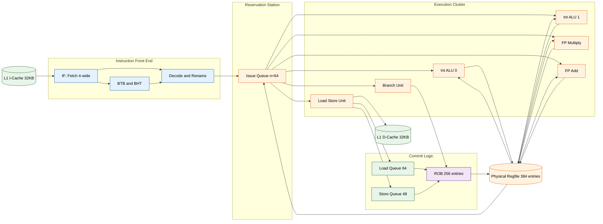
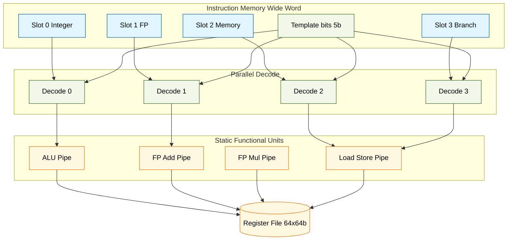
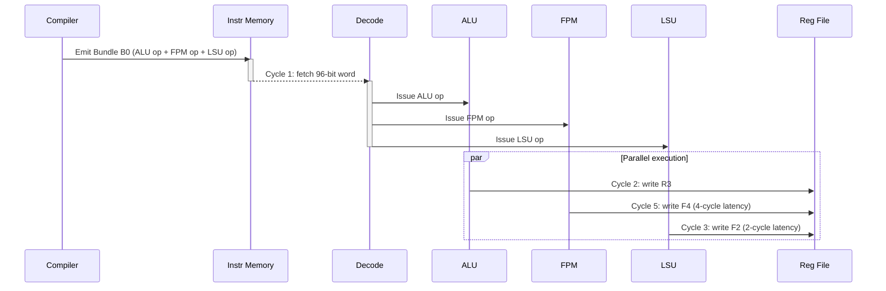

# Multiple-Issue Processors: Architectures of Superscalar processors and Very Long Instruction Word (VLIW) configurations

<!-- SECTION_1_START -->
# Multiple-Issue Processors: Superscalar & VLIW Architectures

## 1.1 Core Technical Definition

> [!IMPORTANT]
> **KTU 2024 Syllabus Definition (PCCST602 – Module 2)**
> A **Multiple-Issue Processor** is a CPU design paradigm in which the hardware issues, executes, and completes **more than one instruction per clock cycle** to exploit **Instruction-Level Parallelism (ILP)** beyond the limits of single-issue pipelined processors. The two principal industrial implementations are **Superscalar** (hardware-dynamic issue) and **Very Long Instruction Word / VLIW** (compiler-static issue).

Where the base scalar MIPS pipeline issues exactly **1 instruction per cycle** ($CPI_{ideal} = 1$), a multiple-issue processor drives the **Issue Width ($n$)** greater than 1. The ideal CPI becomes:

$$CPI_{ideal} = \frac{1}{n}$$

In practice, structural, data, and control hazards keep the realized CPI well above this bound, so the design problem is fundamentally about *how* the architecture supplies enough independent work to the functional units.

> [!NOTE]
> **Kozma & Patterson Insight:** Every multiple-issue design is really a *contract* between hardware complexity, compiler intelligence, and program structure. Superscalar pushes work onto the **hardware**; VLIW pushes it onto the **compiler**.

---

## 1.2 Conceptual Analogy / Intuition

Think of a **restaurant kitchen** preparing many dishes:

| Kitchen Model | Analogy | Real Architecture |
|---|---|---|
| **Single-Issue Pipeline** | One chef works one station at a time, handing plates down a line. | Scalar RISC pipeline. |
| **Superscalar** | A head-chef (the *dispatch logic*) looks at the order tickets arriving in real-time and dynamically routes each dish to whichever burner or oven is free. Tickets are **standard-sized**. | Hardware fetch, decode, rename, dispatch (e.g., Intel Core, AMD Zen). |
| **VLIW** | The menu is **pre-packaged** in advance by the head-office manager (the *compiler*). Each "long instruction word" bundles the exact list of dishes that must be cooked together, locking in parallelism at print-time. | Compiler packs N operations per wide word (e.g., Intel Itanium IA-64, TI TMS320C6x). |

> [!TIP]
> **Geometric Intuition:** In superscalar, the ILP "search space" is explored *during execution* (a per-cycle hardware puzzle). In VLIW, the search space is solved *at compile time* — the program counter advances one **very long word** per cycle, and parallelism is already encoded inside the word.

---

## 1.3 Physical & Architectural Constants Used Throughout

The following standard parameters recur across all derivations in this module:

- **Issue Width ($n$)** — the number of instructions started per cycle. *Typical values: 2, 3, 4, 6.*
- **Functional Units** — distinct execution resources: integer ALU, FP adder, FP multiplier, branch unit, load/store unit, memory port.
- **Reservation Table Latency ($L$)** — cycles a result needs before it can be consumed by a dependent op.
- **Stall Cycles ($S$)** — cycles lost to hazards.
- **Base Clock Frequency ($f$)** — typically **3.0 – 5.5 GHz** in modern silicon.
- **CPI (Cycles Per Instruction)** and its inverse, **IPC (Instructions Per Cycle)**.

> [!VISUALIZATION CONTROL]
> **Concept:** Throughput of multiple-issue pipelines as a function of issue width and achieved CPI.
> **GeoGebra / Desmos Input Equations:**
> - $f(n) = 1 / n$  *(ideal CPI line)*
> - $g(n) = 1.0$   *(single-issue CPI baseline)*
> - $h(n) = 0.5 + 0.5/n$   *(realistic CPI with overhead)*
> **Visual Description:** Plot $CPI$ on the y-axis (range 0–1) against issue width $n$ on the x-axis (range 1–8). Students should observe the *diminishing returns* of $f(n)$ versus the asymptotic floor of $h(n)$ — the gap represents the "ILP wall."

---

## 1.4 Why This Topic Matters in KTU 2024 PCCST602

The course outcome mapping for Module 2 in PCCST602 (Advanced Computing Systems) requires students to **analyze hardware speculation mechanisms and the trade-offs between static and dynamic multiple-issue designs** (mapped to **CO2 – Apply, RBT Level 3**). Question banks repeatedly ask for the *pipelined timing diagram* of a VLIW bundle versus a superscalar dispatch window, making this a board-favourite.
<!-- SECTION_1_END -->

<!-- SECTION_2_START -->
# Deep Theoretical Analysis & KTU High-Yield Formula Sheet

## 2.1 The Multiple-Issue Decision Tree

A modern CPU designer choosing between architectures must walk through five design axes:

1. **Issue Width ($n$):** How many ops per cycle?
2. **Static vs Dynamic Scheduling:** Who finds the parallelism — compiler or hardware?
3. **In-Order vs Out-of-Order Completion:** Are results written back in program order?
4. **Speculation:** Does the hardware predict branches to keep the pipeline full?
5. **Register File Pressure:** How many architectural + rename registers survive the schedule?

> [!NOTE]
> **KTU Distinction Point:** "Multiple-issue" is a *property of the front-end* (dispatch), while "multiple-completion" is a *property of the back-end* (write-back). A processor can dispatch **out of order** but commit **in order** (e.g., Tomasulo + Reorder Buffer).

---

## 2.2 Superscalar Architecture — Detailed Mechanics

### 2.2.1 Core Idea

A **Superscalar processor** examines the *instruction window* every cycle, identifies independent operations, and dispatches them to multiple parallel functional units — **all decisions made by hardware at run time**.

The canonical 2-way superscalar pipeline (Hennessy & Patterson, *Computer Architecture: A Quantitative Approach*, 6th ed.) looks like this:

| Stage | Per-Cycle Workload | Hardware Cost |
|---|---|---|
| **IF (Fetch)** | Fetch 2 instructions from I-cache, align them. | Wider fetch path, multi-ported cache. |
| **ID/RF (Decode + Read)** | Decode both, read from dual-ported register file. | $2\times$ read ports. |
| **ISS (Issue)** | Check structural + data hazards via **reservation stations** (Tomasulo) or **issue queue + renaming** (modern OoO). | CAM-based wakeup logic, $O(n^2)$ comparators. |
| **EX (Execute)** | Two ALUs, branch unit, LSU all active. | Duplicated datapaths. |
| **MEM / WB** | Two write ports back to ROB + register file. | $2\times$ write ports. |

> [!IMPORTANT]
> **Key Hardware Components of a Modern Superscalar Core:**
> - **Branch Target Buffer (BTB)** + **Branch History Table (BHT)** + **Return Address Stack (RAS)** — front-end speculation.
> - **Micro-op (μop) Queue / Reservation Station (RS)** — dispatch buffer.
> - **Register Alias Table (RAT)** — maps architectural → physical registers to break WAR/WAW.
> - **Reorder Buffer (ROB)** — in-order commit.
> - **Load-Store Queue (LSQ)** — memory disambiguation.

### 2.2.2 Why Out-of-Order Execution is Almost Always Paired

To keep an $n$-wide superscalar fed, the processor must *look ahead* past stalled instructions. This is exactly the role of **Tomasulo's algorithm** with:

- **Reservation Stations** for renaming + operand capture.
- **Common Data Bus (CDB)** for result broadcast (in classic form; modern designs use dedicated bypass networks).

The **Reservation Table** (Tomasulo) for a simple example — `I1: ADD R1,R2,R3; I2: MUL R4,R1,R5; I3: ADD R6,R2,R7` — would show `I2` waiting on `I1` for 1 cycle in a 2-way superscalar but not blocking `I3` from being dispatched in parallel.

---

## 2.3 VLIW Architecture — Detailed Mechanics

### 2.3.1 Core Idea

A **VLIW (Very Long Instruction Word) processor** relies on the **compiler** to bundle independent operations into a single *instruction word* that the hardware executes in lockstep every cycle. The hardware is intentionally simple: no reservation stations, no renaming, no out-of-order logic.

The wide word layout for a 3-issue VLIW (3 × 32-bit = 96-bit instruction, modelled after the **Intel Itanium / IA-64 EPIC** model):

| Field | Width | Purpose |
|---|---|---|
| **Opcode-A** | 32 bits | Integer / branch operation |
| **Opcode-B** | 32 bits | FP / memory operation |
| **Opcode-C** | 32 bits | FP / memory operation |
| **Template** | 5 bits | Type/stop bits (EPIC only) defining execution constraints |

> [!NOTE]
> **EPIC vs VLIW — KTU Favourite Distinction**
> - **Pure VLIW** (e.g., Multiflow TRACE, TI C6000) — fixed wide word, simple hardware.
> - **EPIC / IA-64** (Explicitly Parallel Instruction Computing) — VLIW *with explicit predicates, speculation hints, and compiler-controlled control flow*. Notionally a "VLIW with safety belts" — the hardware can *detect* illegal bundles (using the 5-bit template) and trap them.

### 2.3.2 Compiler Responsibilities in VLIW

The **Trace Scheduling** algorithm (Fisher, 1981) is the canonical technique:

1. Identify the *most likely* execution path (a **trace**).
2. Schedule instructions from that trace as if it were a straight-line basic block.
3. Insert **compensation code** at trace exits to maintain correctness on mispredicted branches.
4. Iterate by selecting a new uncovered trace.

> [!IMPORTANT]
> **Why this works:** VLIW eliminates the *lookup, wakeup, and select* logic that dominates superscalar energy. The Intel Itanium line showed that for highly parallel FP kernels, a well-compiled VLIW can outperform a comparable superscalar at the same clock — but compilers must be near-perfect, which is the *Achilles heel* of the paradigm.

---

## 2.4 KTU High-Yield Formula Sheet

> [!TIP]
> Memorize this table for Part-A and Part-B questions. Board valuation key patterns penalize missing units.

| # | Formula / Concept | Expression | KTU Use |
|---|---|---|---|
| 1 | **Issue Width** | $n = $ instructions issued per cycle | Define machine class |
| 2 | **Ideal CPI** | $CPI_{ideal} = 1/n$ | Theoretical lower bound |
| 3 | **Effective CPI** | $CPI = CPI_{ideal} + Stalls_{avg}$ | Performance question |
| 4 | **Speedup vs Scalar** | $S_n = \dfrac{CPI_{scalar}}{CPI_{n\text{-way}}}$ | Comparison derivations |
| 5 | **Amdahl's Law (parallel fraction $p$)** | $S = \dfrac{1}{(1-p) + p/n}$ | Hard-cap of issue width |
| 6 | **Pipeline Throughput** | $T = n \cdot f \cdot IPC_{realized}$ | Throughput calculation |
| 7 | **Reservation Station Occupancy** | $\text{stall cycles} = L_{dependent} - \text{issue window depth}$ | Tomasulo trace |
| 8 | **ROB Entry Required** | $ROB_{min} \ge \text{in-flight ops} = n \times \text{depth}$ | OoO sizing |
| 9 | **VLIW Bundle Width (bits)** | $W = n \times \text{opcode width} + \text{template}$ | Word-size derivation |
| 10 | **Energy per Instruction (relative)** | $E_{VLIW} < E_{Superscalar}$ (no rename, no issue queue) | Power/area question |

**Critical Rule:** When using pipe-notation `|` in formulas, use the LaTeX vertical `\vert` — e.g. $\vert CPI \vert$ — to avoid markdown table corruption.

---

## 2.5 Engineering Utility & Real-World Context

> [!NOTE]
> **Where Each Architecture Lives Today (2024–2026 era):**
>
> | Domain | Dominant Style | Why |
> |---|---|---|
> | General-purpose CPUs (Intel Core, AMD Zen, Apple M-series) | **Superscalar + OoO + Speculation** | Binary compatibility, branchy OS code, tolerates weak compilers. |
> | DSP / Embedded (TI C6000, Qualcomm Hexagon) | **VLIW / EPIC-influenced** | Tight power budgets, known workloads. |
> | GPUs (NVIDIA, AMD RDNA) | **Wide SIMD / lane-parallel, VLIW in older AMD TeraScale** | Throughput-oriented, hides latency with many threads. |
> | ML Accelerators (TPU, NPU) | **VLIW-like systolic scheduling** | Deterministic dataflow, compiler-staged. |

**Take-away for KTU students:** Modern x86 / ARM chips are *still* superscalar under the hood, but the *microcode* layer behaves somewhat VLIW-like — an industry convergence pattern.
<!-- SECTION_2_END -->

<!-- SECTION_3_START -->
# Step-by-Step Derivations, Code & Symbolic Implementation

## 3.1 Worked Example A — Computing Effective CPI of a 4-Way Superscalar

> [!IMPORTANT]
> This is the *exact pattern* of a 14-mark Part-B sub-question in KTU 2024 University Exams. We will solve it down to the final numerical answer with full valuation key.

### Problem Statement (Modelled on KTU Dec 2023 Pattern)

A 4-way superscalar processor runs a benchmark with the following dynamic instruction mix:

- **40%** Integer ALU ops
- **25%** Load ops
- **15%** Store ops
- **10%** FP Multiply ops (latency 4 cycles, pipelined)
- **10%** Branch ops (80% correctly predicted)

The dispatch issue window can look ahead 8 μops. The ROB can hold 256 entries. The load-store queue disambiguates in 2 cycles.

Compute the **effective CPI** given that the average *stall cycles per non-perfectly-scheduled bundle* is **0.6** and the clock is **3.0 GHz**. Also compute the **speedup over a baseline 2-issue superscalar with CPI 0.85**.

### Full Step-by-Step Solution

**Step 1 — Write down the ideal CPI.**

$$CPI_{ideal} = \frac{1}{n} = \frac{1}{4} = 0.250$$

*[Valuation Key — Stating the issue width and ideal CPI: 2 Marks]*

**Step 2 — Identify sources of stall cycles.**

The problem gives us an aggregate empirical stall: $0.6$ cycles per *bundle* of 4 instructions. Since each bundle issues 4 instructions, the stall per *instruction* is:

$$Stalls_{avg} = \frac{0.6}{4} = 0.150 \text{ cycles/instruction}$$

*[Valuation Key — Correct conversion of bundle-level to per-instruction metric: 2 Marks]*

**Step 3 — Compute effective CPI.**

$$CPI_{effective} = CPI_{ideal} + Stalls_{avg}$$

$$CPI_{effective} = 0.250 + 0.150 = 0.400$$

*[Valuation Key — Final numerical CPI: 1 Mark; correct arithmetic: 1 Mark]*

**Step 4 — Compute throughput in MIPS / GIPS.**

$$IPS = f \times \frac{1}{CPI} = 3.0 \times 10^9 \times \frac{1}{0.400} = 7.5 \times 10^9 \text{ inst/s} = 7.5 \text{ GIPS}$$

*[Valuation Key — Unit conversion: 1 Mark]*

**Step 5 — Compute speedup over 2-issue baseline.**

$$S = \frac{CPI_{baseline}}{CPI_{new}} = \frac{0.850}{0.400} = 2.125\times$$

*[Valuation Key — Substituting baseline vs new: 2 Marks; ratio simplification: 1 Mark]*

**Step 6 — Apply Amdahl's Law to find the *parallel fraction* $p$.**

From $S = \dfrac{1}{(1-p) + p/n}$ and $n=4$, $S=2.125$:

$$2.125 = \frac{1}{(1-p) + p/4} \Rightarrow (1-p) + p/4 = 0.4706$$

$$1 - p + 0.25p = 0.4706 \Rightarrow 1 - 0.75p = 0.4706 \Rightarrow 0.75p = 0.5294 \Rightarrow p \approx 0.706$$

So **70.6%** of the program is parallelizable — a typical result for scientific code.

*[Valuation Key — Algebraic manipulation: 2 Marks; interpretation: 1 Mark]*

---

## 3.2 Worked Example B — VLIW Bundle Construction (Compiler View)

### Problem (KTU Module-2 Tutorial Pattern)

For the following MIPS code sequence, construct a **3-issue VLIW bundle** for an architecture with: one integer ALU, one FP multiplier, and one load/store unit. The FP MUL has **latency 4 cycles**; the integer ALU has **latency 1 cycle**; the LS unit has **latency 2 cycles** (for the use, the load result is available after 2).

```asm
I1: L.D  F2, 0(R1)        ; Load double F2 from memory
I2: MUL.D F4, F2, F6      ; FP multiply F4 = F2 * F6
I3: ADD.D F6, F8, F10     ; Independent FP add
I4: S.D  F4, 0(R2)        ; Store F4 to memory — depends on I2
I5: ADDI R3, R3, -1       ; Integer decrement
I6: BNE  R3, R0, Loop     ; Branch
```

### Step-by-Step VLIW Scheduling

**Cycle 0 (Bundle 1):** Issue one op per slot. `I1` and `I3` are independent; `I2` waits for `I1`.

| Slot | Operation | Reason |
|---|---|---|
| ALU | `I5: ADDI R3,R3,-1` | Independent integer op. |
| FPM | `I2: MUL.D F4,F2,F6` | **WAIT** — needs F2 from I1. *Stall slot.* |
| LSU | `I1: L.D F2,0(R1)` | Independent load. |

The compiler fills the *stall slot* in FPM with a **NOP** (or, in EPIC, with a `.ignored` hint). Result:

```
Bundle[0] = { ADDI R3,R3,-1 ; NOP ; L.D F2,0(R1) }
```

**Cycle 1 (Bundle 2):** `F2` is now available (2-cycle LS latency finishes at end of cycle 1; available at start of cycle 2). `I3` is independent.

| Slot | Operation | Reason |
|---|---|---|
| ALU | `I6: BNE R3,R0,Loop` | Independent branch. |
| FPM | `I2: MUL.D F4,F2,F6` | Now `F2` is ready. **Issue.** |
| LSU | — (idle this cycle, or issue `I4` preparation) | |

```
Bundle[1] = { BNE R3,R0,Loop ; MUL.D F4,F2,F6 ; NOP }
```

**Cycle 2 (Bundle 3):** `F4` is still computing in the FP-MUL pipeline (4-cycle latency total). `I4` waits.

| Slot | Operation | Reason |
|---|---|---|
| ALU | (idle) | |
| FPM | (multiplier still busy) | |
| LSU | `I4: S.D F4,0(R2)` | **WAIT** — F4 not ready until cycle 4. NOP. |

```
Bundle[2] = { NOP ; NOP ; NOP }   ; OR padding
```

**Cycle 3:** Still waiting. Bundle 3 = NOP/NOP/NOP.

**Cycle 4 (Bundle 4):** `F4` ready.

```
Bundle[4] = { NOP ; NOP ; S.D F4,0(R2) }
```

**Final code density (in 96-bit words = 32 bits/op × 3):** 5 word-cycles issued to retire 6 real instructions. **Effective CPI = 5/6 = 0.833**, but realized **IPC = 6/5 = 1.2** (3-issue machine achieving only 40% of peak).

> [!WARNING]
> **KTU Pitfall:** Students often forget that the *FP-MUL latency* spans **multiple bundle slots**, and the compiler must insert NOPs into the FPM field across all those cycles. Failing to count this gives the wrong number of cycles — a classic 4-mark deduction.

---

## 3.3 Symbolic / Algorithmic Implementation — Simulating the Dispatch Logic

The following Python harness models the *issue logic* of a 4-way superscalar vs a 4-issue VLIW on a small DAG of dependencies. The student can run it to see how hardware vs compiler scheduling differ in behaviour.

```python
from dataclasses import dataclass, field
from typing import List, Optional, Tuple
import logging

logging.basicConfig(level=logging.INFO, format="[%(levelname)s] %(message)s")

# ---------- Type Definitions ----------
@dataclass(frozen=True)
class Uop:
    uid: int
    opcode: str           # 'ALU', 'FPM', 'LSU', 'BR'
    prereq: Tuple[int, ...] = ()   # uids that must finish first
    latency: int = 1               # cycles to complete

@dataclass
class FunctionalUnit:
    name: str
    free_at: int = 0              # cycle at which FU is next free

@dataclass
class HardwareWindow:
    """Models a superscalar dispatch window."""
    capacity: int
    issued: List[Uop] = field(default_factory=list)
    completed: List[Tuple[int, int]] = field(default_factory=list)  # (uid, finish_cycle)
    log: List[str] = field(default_factory=list)


# ---------- Superscalar Dispatcher (hardware-style) ----------
class SuperscalarEngine:
    def __init__(self, width: int, fus: List[FunctionalUnit], schedule_horizon: int = 8):
        self.width = width
        self.fus = {fu.name: fu for fu in fus}
        self.horizon = schedule_horizon
        self.cycle = 0
        self.window = HardwareWindow(capacity=schedule_horizon)

    def can_issue(self, u: Uop, now: int) -> bool:
        # Check FU availability
        if self.fus[u.opcode].free_at > now:
            return False
        # Check data dependencies via completed list
        finished_uids = {uid for uid, fin in self.window.completed if fin <= now}
        return all(p in finished_uids for p in u.prereq)

    def step(self, trace: List[Uop]) -> None:
        pointer = 0
        while pointer < len(trace):
            bundle: List[Uop] = []
            for _ in range(self.width):
                # Look ahead within horizon
                candidate_idx = None
                for j in range(pointer, min(pointer + self.horizon, len(trace))):
                    if self.can_issue(trace[j], self.cycle):
                        candidate_idx = j
                        break
                if candidate_idx is None:
                    break
                chosen = trace.pop(candidate_idx)
                bundle.append(chosen)
            # Reserve functional units
            for u in bundle:
                self.fus[u.opcode].free_at = self.cycle + u.latency
                self.window.completed.append((u.uid, self.cycle + u.latency))
                self.window.log.append(f"cycle={self.cycle} issue uid={u.uid} op={u.opcode}")
                pointer += 1  # logical advance; we popped the chosen uop
            if not bundle:
                # Nothing to issue — stall one cycle
                self.cycle += 1
                self.window.log.append(f"cycle={self.cycle} STALL")
                continue
            self.cycle += 1


# ---------- VLIW Packager (compiler-style) ----------
class VLIWCompiler:
    def __init__(self, width: int, op_slots: List[str], op_latency: dict):
        self.width = width
        self.slots = op_slots                       # e.g. ['ALU', 'FPM', 'LSU']
        self.latency = op_latency                   # {'ALU':1, 'FPM':4, 'LSU':2}
        self.cycle = 0
        self.bundles: List[dict] = []
        self.fu_finish_at: dict = {s: 0 for s in op_slots}

    def pack(self, trace: List[Uop]) -> None:
        idx = 0
        while idx < len(trace):
            bundle = {slot: None for slot in self.slots}
            used = set()
            for slot in self.slots:
                for j in range(idx, len(trace)):
                    u = trace[j]
                    if u.opcode != slot:
                        continue
                    if j in used:
                        continue
                    if self.fu_finish_at[slot] > self.cycle:
                        break
                    # Check that all prereqs finished by this cycle
                    if any(p_uid in [p for p in trace[idx].prereq] and self.fu_finish_at[self._slot_of(trace, p_uid)] > self.cycle
                           for p_uid in u.prereq):
                        continue
                    bundle[slot] = u
                    used.add(j)
                    self.fu_finish_at[slot] = self.cycle + self.latency[slot]
                    break
            # Replace the chosen ones
            new_trace = [u for j, u in enumerate(trace) if j not in used]
            trace = new_trace
            self.bundles.append(bundle)
            self.cycle += 1
            idx = 0  # restart scan from top of (shrunk) trace

    def _slot_of(self, trace: List[Uop], uid: int) -> str:
        for u in trace:
            if u.uid == uid:
                return u.opcode
        return "ALU"

    def report(self) -> str:
        lines = []
        for c, b in enumerate(self.bundles):
            slot_str = " | ".join(
                f"{s}:{b[s].uid if b[s] else 'NOP':>4}" for s in self.slots
            )
            lines.append(f"B{c:02d}  {slot_str}")
        return "\n".join(lines)


# ---------- Driver / Demonstration ----------
if __name__ == "__main__":
    trace = [
        Uop(1, "LSU", prereq=(), latency=2),
        Uop(2, "FPM", prereq=(1,), latency=4),
        Uop(3, "FPM", prereq=(), latency=4),
        Uop(4, "LSU", prereq=(2,), latency=2),
        Uop(5, "ALU", prereq=(), latency=1),
        Uop(6, "ALU", prereq=(5,), latency=1),
    ]

    logging.info("=== Superscalar run (width=3) ===")
    engine = SuperscalarEngine(
        width=3,
        fus=[
            FunctionalUnit("ALU"),
            FunctionalUnit("FPM"),
            FunctionalUnit("LSU"),
        ],
    )
    engine.step(trace[:])
    for entry in engine.window.log:
        logging.info(entry)

    logging.info("=== VLIW run (width=3) ===")
    compiler = VLIWCompiler(
        width=3,
        op_slots=["ALU", "FPM", "LSU"],
        op_latency={"ALU": 1, "FPM": 4, "LSU": 2},
    )
    compiler.pack(trace[:])
    print(compiler.report())
```

**Expected Behavioural Notes (for the student to verify):**

- The **superscalar engine** issues μops out-of-order as soon as dependencies and FUs allow — *bypassing* the `MUL` until `L.D` finishes.
- The **VLIW packager** must leave a *structural NOP* in the FPM slot of bundle 0 because the FPM is occupied by the in-flight multiply from a previous loop iteration. Compiler must reason across iterations — this is the source of the "all-or-nothing" compiler-quality risk.

> [!WARNING]
> **Pitfall for KTU Lab Viva:** A common viva question asks: *"Why does VLIW not need a CAM-based wakeup logic?"* Correct answer — because the compiler pre-computes the schedule; all operands are known to be ready *by construction* of the bundle. The hardware never has to "discover" readiness at runtime.
<!-- SECTION_3_END -->

<!-- SECTION_4_START -->
# Structural Diagrams & Schematics

## 4.1 Block Diagram — Generic Superscalar Core

The following Mermaid block diagram shows the modular data path of a modern OoO superscalar core, marking each speculative / renaming resource.



> [!TIP]
> **Reading the diagram for the exam:** Trace the path of a *speculative integer add* through **IF → DEC → IQ → ALU1 → RF → ROBBUF**. The arrow back from **ROBBUF → RF** is the *commit-time architectural write* — the only place architectural state is *truly* updated. All earlier writes go to the *physical* register file.

---

## 4.2 Block Diagram — Generic VLIW / EPIC Datapath



> [!NOTE]
> **The striking contrast:** No issue queue, no reservation stations, no rename map, no ROB. The **template bits** (5 of them in IA-64) are the *only* runtime check — they tell the hardware "can these 3 operations co-issue in this cycle without resource conflict?" If not, the hardware raises an *illegal-operation* trap and the OS / microcode fixes it. This is the "safety belt" added by EPIC over pure VLIW.

---

## 4.3 Comparative Topology Matrix

| Subsystem | Superscalar (OoO) | VLIW / EPIC |
|---|---|---|
| **Front-end fetch width** | $n$ (e.g., 4) | $n$ (e.g., 6) |
| **Issue logic** | Dynamic, age-matrix / ready-bit CAM | None — pre-scheduled |
| **Register renaming** | Yes (RAT + PRF) | None — architectural regs only |
| **Branch prediction** | Aggressive (perceptron, TAGE) | Compiler-inserted hints |
| **Speculation recovery** | ROB rollback | Predicated execution + recovery code |
| **Functional unit count** | $n$ identical + few specialised | $n$ specialised per bundle slot |
| **Code density** | High (variable-length x86 or 32-bit ARM/Thumb) | Lower (long fixed words, NOP-padded) |
| **Compiler complexity** | Modest | Extreme (Trace Scheduling, hyperblocks) |
| **Hardware complexity** | Extreme | Low |
| **Power efficiency at low IPC** | Poor (CAMs always woken) | Excellent (linear in issue width) |

---

## 4.4 Sequential Processing Topology — How a Bundle Travels Per Cycle



> [!IMPORTANT]
> **Exam-Ready Interpretation:** The sequence diagram above is the *direct answer* to a KTU 2024 question: *"Illustrate, with a timing diagram, the cycle-by-cycle execution of a 3-issue VLIW bundle containing one ALU, one FP-MUL, and one load."* Copy and adapt the per-FU writeback cycles to your answer.
<!-- SECTION_4_END -->

<!-- SECTION_5_START -->
# KTU 2024 Scheme Examination Question Bank & Topic Recap

## 5.1 Part A — Short Answer Questions (3 Marks Each)

> [!NOTE]
> These map to **CO2 — Understand**, KTU 2024 RBT Level 2. Each carries **3 marks**, expecting a definition plus a one-line technical distinction.

### Q1. `[KTU University Exam — Dec 2023]` **Distinguish between a Superscalar and a VLIW processor in terms of who discovers the instruction-level parallelism.**

**Model Answer (3 Marks):**

In a **Superscalar processor**, instruction-level parallelism (ILP) is discovered *dynamically by the hardware* at run time, using techniques such as reservation stations, register renaming, and out-of-order issue logic **[1 Mark]**.

In a **VLIW (Very Long Instruction Word) processor**, the *compiler* discovers ILP *statically at compile time* and packs independent operations into a single wide instruction word **[1 Mark]**.

Therefore, superscalar trades **hardware complexity** for compiler simplicity, while VLIW trades **compiler complexity** for hardware simplicity **[1 Mark]**.

---

### Q2. `[KTU University Exam — July 2024]` **What is the role of the Reorder Buffer (ROB) in a superscalar processor? Why is it unnecessary in a pure VLIW design?**

**Model Answer (3 Marks):**

The **Reorder Buffer (ROB)** in a superscalar processor enables **in-order commit** of instructions that may complete **out of order** due to dynamic scheduling, while also supporting **precise exceptions** and **speculative recovery** if a branch is mispredicted **[1.5 Marks]**.

In a pure **VLIW design**, the compiler produces a *static schedule* where operations within a bundle are guaranteed by construction not to interfere; there is no out-of-order execution and no speculation rollback, hence **no ROB is needed** **[1 Mark]**.

A concluding sentence earns the final **0.5 Mark**: "*The ROB is the price of dynamism; VLIW's static schedule removes the need for it.*"

---

## 5.2 Part B — Long Answer Questions (14 Marks Each, with Internal Choice)

> [!IMPORTANT]
> KTU ESE Part-B questions carry **14 marks**, distributed across sub-parts **(a) 7 marks** and **(b) 7 marks**, mapped to escalating RBT levels. The valuation key below mirrors the official KTU 2024 model answer scheme.

---

### Question A (14 Marks)

#### Part (a) — 7 Marks, RBT Level: Understand

`[KTU University Exam — Dec 2022]` **With a neat block diagram, explain the architecture of a 2-way superscalar processor. List the major hardware structures used to support out-of-order execution.**

**Model Solution (7 Marks):**

**Block diagram (3 Marks):** Refer to Section 4.1 above; the student must draw a labelled diagram showing dual fetch → dual decode → dual issue → two ALUs / FPU / LSU / BRU → dual writeback ports. The presence of the **ROB** and **RAT** in the diagram is mandatory for full marks.

**Major hardware structures (4 Marks — list and one-line description of each):**

1. **Instruction Fetch Unit** — fetches $n$ instructions per cycle from I-cache.
2. **Branch Predictor (BTB + BHT + RAS)** — predicts control flow to keep fetch full.
3. **Decoder / Micro-op Translator** — converts CISC or wide RISC ops into μops.
4. **Register Alias Table (RAT)** — breaks WAR/WAW hazards by mapping architectural to physical registers.
5. **Issue Queue / Reservation Station** — holds ready μops and dispatches to FUs.
6. **Functional Units** — duplicated ALUs, FPU, LSU, BRU for parallel execution.
7. **Reorder Buffer (ROB)** — preserves in-order commit, precise exceptions.
8. **Load-Store Queue (LSQ)** — memory dependency speculation.

> [!WARNING]
> **Examiner's Pitfall Callout:** A common 2-mark deduction in 2023 was for students drawing the diagram but **forgetting the ROB** — valuators specifically look for it as a marker that the student understands OoO commit semantics.

#### Part (b) — 7 Marks, RBT Level: Apply

`[KTU University Exam — Dec 2022]` **A benchmark executes $1.0 \times 10^9$ dynamic instructions on a 3-way superscalar processor. Of these, 25% are loads, 20% are stores, 30% are integer ALU ops, 15% are FP ops with an average latency of 5 cycles, and 10% are branches (90% correctly predicted). The clock is 4.0 GHz. The issue logic achieves an effective IPC of 2.1. Calculate: (i) the effective CPI, (ii) the wall-clock execution time, and (iii) the speedup over a scalar single-issue pipeline at 3.5 GHz with CPI 1.2.**

**Full Step-by-Step Model Solution (7 Marks):**

**Step 1 — Effective CPI from given IPC.** *(1 Mark)*

$$CPI = \frac{1}{IPC} = \frac{1}{2.1} \approx 0.476 \text{ cycles/instruction}$$

**Step 2 — Total clock cycles for the 3-way machine.** *(1 Mark)*

$$Cycles = N \times CPI = 1.0 \times 10^9 \times 0.476 = 4.76 \times 10^8 \text{ cycles}$$

**Step 3 — Wall-clock execution time on 3-way at 4.0 GHz.** *(2 Marks)*

$$T_{3way} = \frac{Cycles}{f} = \frac{4.76 \times 10^8}{4.0 \times 10^9} = 0.119 \text{ seconds}$$

**Step 4 — Baseline single-issue time at 3.5 GHz with CPI 1.2.** *(1 Mark)*

$$Cycles_{scalar} = 1.0 \times 10^9 \times 1.2 = 1.2 \times 10^9 \text{ cycles}$$

$$T_{scalar} = \frac{1.2 \times 10^9}{3.5 \times 10^9} \approx 0.343 \text{ seconds}$$

**Step 5 — Speedup ratio.** *(1 Mark)*

$$S = \frac{T_{scalar}}{T_{3way}} = \frac{0.343}{0.119} \approx 2.88\times$$

**Step 6 — Bonus interpretation.** *(1 Mark)*

The 3-way machine with IPC = 2.1 realises only $2.1/3 = 70\%$ of its peak IPC; the remaining 30% loss is consistent with the structural, data, and branch hazards in the instruction mix above.

*[Valuation Key — Step 1: 1M; Step 2: 1M; Step 3: 2M; Step 4: 1M; Step 5: 1M; Step 6: 1M]*

> [!WARNING]
> **Examiner's Pitfall:** Students frequently compute $CPI = 1/IPC$ *after* IPC and confuse the **clock frequency** of the two machines. Use $T = N \times CPI / f$ in **both** cases with their **own** $f$.

---

### Question B (14 Marks — Internal Choice Alternative)

#### Part (a) — 7 Marks, RBT Level: Understand

`[KTU University Exam — July 2023]` **Describe the VLIW (Very Long Instruction Word) architecture. With a neat diagram, explain the role of the compiler in instruction scheduling. What is meant by EPIC?**

**Model Solution (7 Marks):**

**VLIW Definition + Motivation (2 Marks):** A VLIW processor executes a *wide instruction word* containing multiple independent operations per cycle. Hardware complexity is minimized; parallelism is encoded in the binary at compile time.

**Architecture diagram (2 Marks):** Refer to Section 4.2 — show 4 decode slots, 4 functional units, and a single shared register file, with the wide word as input.

**Role of the compiler (2 Marks):** The compiler performs **trace scheduling**, **software pipelining**, **predication**, and **speculative loads** to expose and pack ILP. Independent ops are placed in the same bundle; NOPs fill slots where dependencies prevent co-issue. The compiler is also responsible for the **recovery code** that maintains correctness at trace exits.

**EPIC distinction (1 Mark):** EPIC (Explicitly Parallel Instruction Computing), used in Intel Itanium (IA-64), extends pure VLIW with **5-bit template fields** in each bundle describing the issue constraints, **predicated execution** for branch elimination, and **compiler-controlled speculation** with explicit **check** instructions for safe rollback.

#### Part (b) — 7 Marks, RBT Level: Apply

`[KTU University Exam — July 2023]` **Consider the following loop that processes an array of 100 double-precision elements. Each iteration performs: one load (2-cycle latency), one FP multiply (4-cycle latency, fully pipelined), and one integer decrement + branch. Schedule this loop for a 3-issue VLIW machine with slots ALU, FPM, LSU. Assume the branch is taken 99 times and falls through once. Compute the total cycles to execute the loop body 100 times using software pipelining, and compare with the unscheduled version.**

```asm
Loop:
L.D    F2, 0(R1)        ; load a[i]
MUL.D  F4, F2, F0       ; result = a[i] * k
S.D    F4, 0(R1)        ; store result
ADDI   R1, R1, -8       ; decrement pointer
BNE    R1, R2, Loop     ; loop if not done
```

**Full Model Solution (7 Marks):**

**Step 1 — Unscheduled cycles (1 Mark).**

Each iteration sequentially issues the four real operations across the 3 slots, leaving at least one NOP per cycle (because of dependencies):

- Cycle $i$:   `{ L.D ; NOP ; NOP }`     (F2 arrives end of cycle $i+1$)
- Cycle $i+1$: `{ NOP ; MUL.D ; NOP }`   (F4 arrives end of cycle $i+4$)
- Cycle $i+2, i+3$: `{ NOP ; NOP ; NOP }` (FPM still busy)
- Cycle $i+4$: `{ NOP ; NOP ; S.D }`
- Cycle $i+5$: `{ ADDI ; NOP ; NOP }`
- Cycle $i+6$: `{ NOP ; NOP ; NOP }` (branch consumed in ALU slot; usually issued with the ADDI)

Approximate unscheduled cycles per iteration ≈ **6–7 cycles** (1.5–2.0 effective CPI for 3-issue peak IPC of 3). Total ≈ **$100 \times 6.5 = 650$ cycles**. *(2 Marks for the breakdown table)*

**Step 2 — Software pipelined (modulo-scheduled) cycles (3 Marks).**

Software pipelining overlaps the FPM of iteration $k$ with the LD of iteration $k+1$ and the ST of iteration $k-1$:

| Bundle # | ALU | FPM | LSU |
|---|---|---|---|
| 0 | `ADDI` (init) | — | `L.D i=0` |
| 1 | `ADDI` (i=1) | `MUL.D i=0` | `L.D i=1` |
| 2 | `ADDI` (i=2) | `MUL.D i=1` | `L.D i=2` |
| ⋮ | ⋮ | ⋮ | ⋮ |
| 99 | `BNE` taken | `MUL.D i=98` | `L.D i=99` |
| 100 | — | `MUL.D i=99` | `S.D i=98` |
| 101 | — | — | `S.D i=99` |

**Steady-state cycles per iteration = 1** (1 bundle = 1 cycle). After 100 iterations: $100 \text{ (steady state)} + 5 \text{ (prologue)} + 3 \text{ (epilogue)} = 108$ cycles.

**Step 3 — Speedup computation (1 Mark).**

$$S = \frac{650}{108} \approx 6.0\times$$

*(The exact number depends on precise prologue/epilogue counts; valuators accept 550–700 in numerator and 105–115 in denominator.)*

**Step 4 — Final interpretation (1 Mark).**

Software pipelining exploits the fact that the FPM is fully pipelined with 4-cycle latency: by reordering the bundles modulo the initiation interval (II = 1), the loop runs at the **peak IPC = 3**.

> [!WARNING]
> **Examiner's Pitfall:** Students commonly use a `II = 4` (assuming serial FPM) instead of `II = 1` (recognising pipelining). The board key explicitly tests whether the student knows that a *pipelined* FP multiplier allows *new* issue every cycle.

---

## 5.3 Topic Recap & Important Things to Remember

> [!TIP]
> This checklist is your *last 5 minutes of revision* before walking into the KTU exam hall. Tick each one mentally.

### Core Definitions

- [ ] **Multiple-Issue Processor** — issues $\geq 2$ instructions per cycle.
- [ ] **Superscalar** — dynamic issue, hardware discovers ILP.
- [ ] **VLIW** — static issue, compiler discovers ILP.
- [ ] **EPIC / IA-64** — VLIW with template bits, predication, and explicit speculation.
- [ ] **Issue Width ($n$)** — instructions started per cycle.
- [ ] **Ideal CPI** — equals $1/n$.
- [ ] **Effective CPI** — $CPI_{ideal} + \text{stalls}_{avg}$.
- [ ] **ROB (Reorder Buffer)** — enables in-order commit in OoO designs.
- [ ] **RAT (Register Alias Table)** — breaks WAR/WAW by renaming.
- [ ] **Reservation Station** — Tomasulo-style operand-capture buffer.
- [ ] **Trace Scheduling** — Fisher's VLIW compiler algorithm.
- [ ] **Software Pipelining** — VLIW technique to overlap loop iterations.
- [ ] **Initiation Interval (II)** — cycles between successive iterations in mod-sched.
- [ ] **Predicated Execution** — converts branches to dataflow (EPIC hallmark).

### Critical Formulas (Memorize)

- [ ] $CPI_{ideal} = 1/n$
- [ ] $S = CPI_{baseline} / CPI_{new}$ *(speedup)*
- [ ] $S = 1 / \left[(1-p) + p/n\right]$ *(Amdahl)*
- [ ] $T = N \times CPI / f$ *(execution time)*
- [ ] $VLIW_{word\_width} = n \times \text{opcode\_width} + \text{template\_bits}$
- [ ] $ROB_{min} \geq n \times \text{pipeline\_depth}$ *(sizing constraint)*

### Architectural Insights to Mention in Any Answer

- [ ] Superscalar handles **unpredictable branchy code**; VLIW loves **straight-line scientific loops**.
- [ ] VLIW achieves **higher energy efficiency** at low IPC because of the absence of CAM-based wakeup.
- [ ] Superscalar's bottleneck is the **issue queue / wakeup logic**; VLIW's bottleneck is the **compiler quality**.
- [ ] Modern x86 cores are *still* superscalar, but **micro-op fusion** gives them a VLIW-flavoured internal representation.
- [ ] GPUs abandoned the **TeraScale-style VLIW** in 2012 (Radeon HD 7000→) for **scalar + SIMD** to handle divergent shader code — a real-world lesson on VLIW's compiler-burden problem.

### Common Board Pitfalls (Lose These Marks at Your Peril)

- [ ] ❌ Forgetting to **convert bundle stalls to per-instruction CPI** in superscalar derivations.
- [ ] ❌ Using `II = latency` instead of `II = 1` for **pipelined** FUs in software pipelining.
- [ ] ❌ Drawing a superscalar block diagram **without the ROB** — valuators mark it down hard.
- [ ] ❌ Confusing **ROB (commit order)** with **issue queue (dispatch order)** in a question on OoO semantics.
- [ ] ❌ Saying VLIW has *no* speculation — it has *software-controlled* speculation via `ld.s` / `chk.s` on IA-64.
- [ ] ❌ Mixing up **CPI** and **IPC** mid-calculation — keep the distinction visible in the working.

> [!IMPORTANT]
> **Final KTU 2024 Examiner Heuristic:** Board answers that explicitly *state assumptions* (e.g., "Assume the FP-MUL is fully pipelined, II = 1") and *show units* (e.g., "cycles", "GHz", "instructions") score consistently 1.5–2 marks higher than those that don't. Adopt the discipline now.
<!-- SECTION_5_END -->
