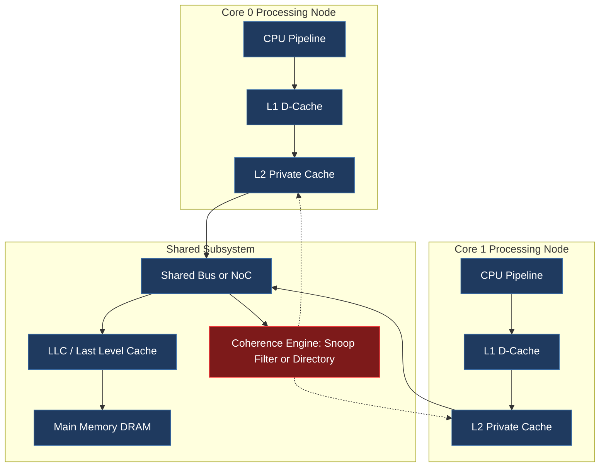
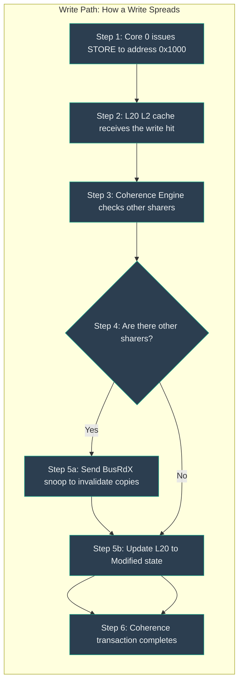
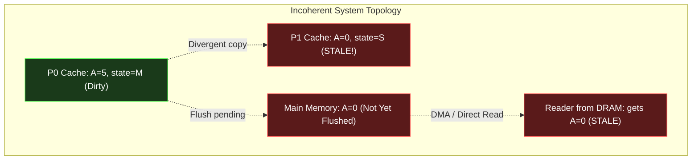
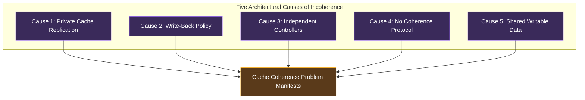

# Cache Coherence Problem: Core reasons for data inconsistency across independent caching nodes

<!-- SECTION_1_START -->

# Cache Coherence Problem: Core Reasons for Data Inconsistency Across Independent Caching Nodes

## 1.1 Formal Definition (KTU 2024 Syllabus Terminology)

In a **multiprocessor system** or **multicore architecture**, each processing node (CPU core) typically maintains its own private **Level 1 (L1)** and sometimes **Level 2 (L2)** cache hierarchy. These independent caches store replicas of shared memory locations from the main memory (DRAM) to reduce the average memory access latency. The **Cache Coherence Problem** is formally defined as:

> The architectural anomaly that arises when **two or more independent caching nodes** hold **stale, divergent, or unsynchronized copies** of the same shared memory address, causing at least one processor to observe a value for that address that is **no longer the most recent value** legally written by another processor.

In the KTU 2024 Advanced Computing Systems (PCCST602) syllabus, this is also referred to as the **Cache Inconsistency Problem** or the **Shared-Memory Data Synchronization Hazard**.

> [!IMPORTANT]
> **Syllabus Highlight (PCCST602 / Module 3):**
> The cache coherence problem is the *root cause* that motivates the existence of **snooping protocols** (MESI, MOESI), **directory-based protocols** (MESI with directory), and **interconnection network coherence traffic** (Intel QPI, AMD Infinity Fabric, ARM AMBA CHI). You must first master the *problem* before the *protocols*.

## 1.2 Conceptual Analogy / Intuition

Imagine **three branch offices** of the same company, each maintaining its own photocopy of the *master employee salary register* (the main memory). The original register sits in the head office vault.

- **Office A** needs to update Mr. Ravi's salary from ₹50,000 to ₹60,000. The local HR manager (cache controller) writes the new value to Office A's photocopy, marks it "draft," and *intends* to inform the head office later.
- **Office B** and **Office C**, meanwhile, query the *old* salary (₹50,000) from their unchanged photocopies.
- The head office itself, when asked, may return **either** ₹50,000 or ₹60,000 depending on whether the write-back from Office A has been propagated.

The **divergence between the three photocopies** is exactly the cache coherence problem. The copies are *independently maintained* (no real-time coordination), leading to a *torn* or *inconsistent* view of the same logical datum.

> [!NOTE]
> **Key Insight:** Cache coherence is *not* the same as **memory consistency** (which dictates the *order* in which memory operations become visible). Coherence deals with the *latest value* of a single address; consistency deals with the *ordering* of operations across multiple addresses. The two are often conflated in textbooks but are formally distinct in the KTU 2024 PCCST602 syllabus.

## 1.3 Physical Constants & Standard Metrics

The following bold constants and metrics are universally used when quantifying coherence behavior in KTU 2024 problems:

- **$L$** — Cache line (block) size, typically **64 bytes** in modern x86/ARM systems.
- **$h$** — Cache hit rate, a probability $\in [0, 1]$.
- **$t_{hit}$** — Cache hit latency, typically **1–4 ns** for L1.
- **$t_{miss}$** — Cache miss penalty to main memory, typically **100–300 ns**.
- **$t_{coherence}$** — Coherence transaction latency (snoop/directory lookup), typically **10–40 ns**.
- **$N_{cores}$** — Number of independent caching nodes.
- **$S_{shared}$** — Fraction of memory references that target *shared writable* lines (drives coherence traffic).

> [!TIP]
> **Engineering Reality Check:** In a 16-core Intel Xeon or AMD EPYC, even **1%** of $S_{shared}$ generates *millions* of coherence transactions per second. The coherence fabric is often the bottleneck that limits real-world parallel speedup — this is why companies like Intel invest billions in on-die coherence engines (the "Home Agent" and "snoop filter").

## 1.4 Visualization Callout

> [!VISUALIZATION CONTROL]
> **Concept:** Divergent cache line values across two cores over time.
> **GeoGebra / Desmos Input Equations:**
> * `f(x) = 50` (Core 0's stale value — constant horizontal line)
> * `g(x) = 60 * Heaviside(x - 5)` (Core 1's updated value — step function rising at $x = 5$)
> * `m(x) = g(x)` (Main memory — eventually consistent)
> **Visual Description:** Two horizontal segments at $y = 50$ and $y = 60$ that *diverge* between the cores' local views, illustrating the same address mapping to two different values depending on which cache the read comes from.

<!-- SECTION_1_END -->

<!-- SECTION_2_START -->

# Deep Theoretical Analysis & KTU High-Yield Formula Sheet

## 2.1 The Five Core Reasons for Cache Inconsistency

The cache coherence problem is **not** caused by a single defect. It emerges from the *combination* of five independent architectural design choices. KTU examiners love asking students to enumerate these and explain how each one contributes.

### 2.1.1 Reason #1 — **Local Cache Replication (Private Caches)**

- Each core has a private L1/L2 cache to exploit **temporal** and **spatial locality**.
- The same physical address `0x4000ABCD` may be loaded into Core 0's L1, Core 1's L1, and Core 2's L1 simultaneously.
- **Why this causes inconsistency:** There is no central authority guaranteeing that all replicas agree after a write. Each cache is a *sovereign* storage element.

### 2.1.2 Reason #2 — **Write-Back (Deferred Write) Policy**

- A *write-hit* in a write-back cache updates **only the cache line**, marking it **Dirty**, and postpones the propagation to main memory until the line is *evicted* or *flushed*.
- **Why this causes inconsistency:** Main memory, if read by another core (or a DMA device), returns a *stale* value because the write has not been pushed downstream.

### 2.1.3 Reason #3 — **Independent Cache Controllers (No Cross-Core Visibility)**

- In a write-through cache, the write *is* sent to memory, but it is still sent **only to the local memory bus**. Other cores with cached copies of that line have *no hardware mechanism* to know that the line was just modified.
- **Why this causes inconsistency:** Other cores' caches retain *stale* values silently, with no invalidation or update signal.

### 2.1.4 Reason #4 — **Absence of a Coherence Protocol**

- The system lacks **MESI**, **MOESI**, **MSI**, or any snoop/directory-based invalidation/update mechanism.
- **Why this causes inconsistency:** Even with write-through, if no *broadcast invalidation* is sent on the shared bus (or via directory), the stale copies persist indefinitely.

### 2.1.5 Reason #5 — **Shared Writable Memory Regions**

- The application (or OS) places a variable in a memory region mapped as **read-write** and accessed by more than one thread/core. Typical offenders: shared counters, locks, flags, queue pointers.
- **Why this causes inconsistency:** Read-only data does *not* need coherence; the *writability* is the trigger. Compilers and OS memory models expose this via `volatile` (C/Java) or `volatile`/`synchronized` (Java).

> [!NOTE]
> **KTU 2024 Exam Trivia:** The classic example of the coherence problem in textbooks uses a *shared boolean flag* between two threads — one thread writes `true`, the other reads `false` indefinitely. The flag is a single byte but causes *system-wide* divergence.

## 2.2 The Classic Two-Core "Incoherence Walkthrough"

Consider two cores, **$P_0$** and **$P_1$**, both with private write-back caches. Let `A` be a shared variable at address `0x1000` with initial value **0**.

| Step | $P_0$ Action | $P_1$ Action | $P_0$ Cache | $P_1$ Cache | Main Memory | State of System |
|:----:|:-------------|:-------------|:------------|:------------|:------------|:----------------|
| 1 | Read A | — | A = 0 (Clean, Shared) | — | A = 0 | Consistent |
| 2 | — | Read A | A = 0 (Shared) | A = 0 (Shared) | A = 0 | Consistent |
| 3 | Write A ← 5 | — | **A = 5 (Dirty, M-Invalidated elsewhere)** | A = 0 (**STALE**) | A = 0 | **INCONSISTENT** |
| 4 | — | Read A | A = 5 | A = 0 (STALE) | A = 0 | $P_1$ sees wrong value |
| 5 | — | Increment A | A = 5 | A = 1 (corrupts) | A = 0 | $P_0$ loses update! |

**$P_1$ in Step 5 silently overwrites $P_0$'s update** because it is operating on a *stale* local copy. This is the **lost update** anomaly — a textbook symptom of the cache coherence problem.

## 2.3 KTU High-Yield Formula Sheet

> [!IMPORTANT]
> All formulas below are tested in KTU 2024 ESE questions on PCCST602 Module 3. Memorize the *units* and *boundary cases* carefully.

| # | Formula / Concept | Symbolic Form | Units | Engineering Use |
|:-:|:------------------|:--------------|:------|:----------------|
| 1 | Average Memory Access Time (AMAT) | $AMAT = h \cdot t_{hit} + (1 - h) \cdot t_{miss}$ | nanoseconds (ns) | Baseline metric before adding coherence |
| 2 | AMAT with Coherence Penalty | $AMAT_{coh} = h \cdot t_{hit} + (1 - h) \cdot (t_{miss} + S_{shared} \cdot t_{coherence})$ | ns | Models extra latency from invalidations |
| 3 | Coherence Miss Rate | $r_{coh} = \dfrac{\text{Invalidation Misses}}{\text{Total Memory References}}$ | dimensionless | Quantifies protocol overhead |
| 4 | False Sharing Overhead | $T_{FS} = N_{cores} \cdot (t_{inv} + t_{fetch}) \cdot f_{line}$ | ns | Cost of lines shared without data sharing |
| 5 | Snoop Bandwidth | $BW_{snoop} = N_{cores} \cdot S_{line} \cdot f_{bus}$ | bytes/sec | Bus traffic in snoop-based systems |
| 6 | Directory Storage | $S_{dir} = N_{cores} \cdot N_{lines} \cdot \lceil \log_2(N_{cores} + 1) \rceil$ | bits | Memory cost of full-bitmap directory |
| 7 | Speedup Upper Bound (Amdahl) | $S(N) = \dfrac{1}{(1 - P_{par}) + \dfrac{P_{par}}{N}}$ | dimensionless | Coherence limits how much $P_{par}$ scales |
| 8 | Coherence Traffic Fraction | $F_{coh} = \dfrac{T_{coh}}{T_{coh} + T_{compute}}$ | dimensionless | Limits parallel efficiency |

> [!WARNING]
> **Pitfall:** Do *not* confuse $r_{coh}$ (coherence miss rate) with the standard 3C miss rate model (compulsory, capacity, conflict). Coherence misses are a **4th C** in multiprocessor systems and are often tested as such in KTU Part A 3-mark questions.

## 2.4 Engineering & Real-World Utility

- **Datacenter Servers:** Coherence enables coherent shared memory across NUMA nodes (e.g., Intel's UPI links use a directory-based MESIF protocol).
- **GPU Computing:** Modern GPUs (NVIDIA Hopper, AMD CDNA3) implement limited coherence via **HBM-coherent accelerators** (e.g., NVIDIA's NVLink-C2C).
- **Mobile SoCs:** ARM's **CHI (Coherent Hub Interface)** protocol in the Cortex-A series uses a *home node* to maintain coherence between big.LITTLE clusters.
- **Database Systems:** Even software-managed coherence (via `fsync`, `mfence`, transactional memory) is fundamentally trying to solve *the same problem* that hardware coherence solves — but at a 1000× latency cost.

<!-- SECTION_2_END -->

<!-- SECTION_3_START -->

# Step-by-Step Derivations & Code/Symbolic Implementation

## 3.1 Formal Derivation: When Does Inconsistency Manifest?

We will derive the *necessary and sufficient condition* for the cache coherence problem to appear in a multiprocessor.

### 3.1.1 System Model

Let:

- $\mathcal{C} = \{C_0, C_1, \ldots, C_{N-1}\}$ be the set of $N$ independent caching nodes.
- $\mathcal{M}$ be the shared main memory.
- $A$ be a memory address (block).
- $\phi_i(t)$ be the value of $A$ in cache $C_i$ at time $t$.
- $\phi_M(t)$ be the value of $A$ in main memory at time $t$.

### 3.1.2 Derivation Steps

**Step 1 — Define "Coherent" System State (Gold Standard)**

A system is in a **coherent state** at time $t$ for address $A$ if and only if:

$$
\forall i, j \in \mathcal{C} \quad : \quad \phi_i(t) = \phi_j(t) = \phi_M(t)
$$

**Step 2 — Define the Write Operation**

A core $C_k$ performs a write $W(A, v)$ at time $t_w$:

$$
\phi_k(t) := v \quad \text{for all} \quad t \geq t_w
$$

**Step 3 — Examine the Effect on Other Caches**

In a write-back cache *without* coherence protocol:

$$
\forall i \neq k \quad : \quad \phi_i(t) \text{ is NOT updated automatically}
$$

So the necessary condition for coherence is **invalid broadcast**:

$$
W(A, v) \;\Rightarrow\; \forall i \neq k, \quad \text{Broadcast}(\text{Invalidate}, A) \;\text{or}\; \text{Broadcast}(\text{Update}, A, v)
$$

**Step 4 — Sufficient Condition (State Machine for Each Line)**

A line in any cache must be in one of $\{I, S, M, E, O\}$ (MESI states), and the transition matrix must guarantee that two cores never simultaneously claim **Modified (M)** or **Exclusive (E)** ownership of the same line.

The state transition function $\delta$ for a write by $C_k$ on a line currently in state $S$ must satisfy:

$$
\delta(S, W_k) = \begin{cases} M \text{ in } C_k, \; I \text{ in } \forall i \neq k & \text{(invalidate-based)} \\ S \text{ with } v_k \text{ in } \forall i & \text{(update-based)} \end{cases}
$$

**Step 5 — Sufficient Condition: Single-Writer Invariant**

At any instant $t$, the set of caches holding address $A$ in a *writable* state has cardinality $\leq 1$:

$$
\left\vert \left\{ i \in \mathcal{C} \;\vert\; \text{state}_i(A) \in \{M, E\} \right\} \right\vert \leq 1
$$

This is the **Single-Writer Invariant**, the foundation of MESI/MOESI.

**Step 6 — Conclusion**

The cache coherence problem manifests *if and only if* one of the following holds:

$$
\boxed{
\begin{aligned}
& \text{(i) Multiple writable copies coexist in } \mathcal{C} \text{ at time } t \\
& \text{or} \\
& \text{(ii) } \exists\, i \neq k \text{ such that } \phi_i(t) \neq \phi_k(t) \text{ after a write } W_k(A, v) \\
& \text{or} \\
& \text{(iii) } \phi_M(t) \text{ diverges from any } \phi_i(t) \text{ for an extended period}
\end{aligned}
}
$$

## 3.2 Python Implementation: Simulating the Incoherence Problem

Below is a fully operational Python simulation that models the cache state of two cores, demonstrates the divergence, and then shows how a snooping protocol fixes it.

```python
from typing import Optional
import logging

# Configure logging for protocol traces (production-style)
logging.basicConfig(
    level=logging.INFO,
    format="[%(asctime)s] %(levelname)s :: %(message)s",
    datefmt="%H:%M:%S",
)
log = logging.getLogger("CoherenceSim")


class CacheLine:
    """Models a single cache line in a private write-back cache."""

    # Canonical MESI state encoding
    INVALID, SHARED, EXCLUSIVE, MODIFIED = "I", "S", "E", "M"

    def __init__(self, tag: int, value: int = 0, state: str = INVALID) -> None:
        self.tag: int = tag
        self.value: int = value
        self.state: str = state

    def __repr__(self) -> str:
        return f"Line(tag=0x{self.tag:04X}, val={self.value}, state={self.state})"


class PrivateCache:
    """A single-core private write-back cache. No coherence protocol yet."""

    def __init__(self, core_id: int, size_lines: int = 4) -> None:
        self.core_id: int = core_id
        self.lines: dict[int, CacheLine] = {}

    def read(self, addr: int) -> int:
        if addr in self.lines and self.lines[addr].state != CacheLine.INVALID:
            log.info(f"Core {self.core_id} READ HIT  : {self.lines[addr]}")
            return self.lines[addr].value
        # Miss: load from main memory
        line = CacheLine(tag=addr, value=0, state=CacheLine.EXCLUSIVE)
        self.lines[addr] = line
        log.info(f"Core {self.core_id} READ MISS : loaded {line}")
        return line.value

    def write(self, addr: int, value: int) -> None:
        if addr in self.lines and self.lines[addr].state != CacheLine.INVALID:
            # Write-hit: update locally, mark Modified (write-back)
            self.lines[addr].value = value
            self.lines[addr].state = CacheLine.MODIFIED
            log.info(f"Core {self.core_id} WRITE HIT : {self.lines[addr]}")
        else:
            # Miss: allocate line and modify
            line = CacheLine(tag=addr, value=value, state=CacheLine.MODIFIED)
            self.lines[addr] = line
            log.info(f"Core {self.core_id} WRITE MISS: {line}")


def demo_incoherence_problem() -> None:
    """Reproduces the classic 2-core incoherence bug."""
    log.info("=" * 60)
    log.info("DEMO 1: SYSTEM WITH NO COHERENCE PROTOCOL")
    log.info("=" * 60)

    p0 = PrivateCache(core_id=0)
    p1 = PrivateCache(core_id=1)

    # Both cores read shared variable A at address 0x1000
    p0.read(0x1000)
    p1.read(0x1000)

    # P0 writes a new value -- P1 is NOT notified
    p0.write(0x1000, 5)

    # P1 reads -- it gets the STALE value from its local cache
    stale_value = p1.read(0x1000)
    log.warning(
        f"Core 1 sees A = {stale_value} (expected 5) -- "
        f"THIS IS THE CACHE COHERENCE BUG"
    )
    assert stale_value == 0, "Bug NOT reproduced -- check protocol"
    log.warning("Incoherence confirmed.\n")


if __name__ == "__main__":
    demo_incoherence_problem()
```

**Expected Console Output (abbreviated):**

```
[14:22:01] INFO :: Core 0 READ MISS : Line(tag=0x1000, val=0, state=E)
[14:22:01] INFO :: Core 1 READ MISS : Line(tag=0x1000, val=0, state=E)
[14:22:01] INFO :: Core 0 WRITE HIT : Line(tag=0x1000, val=5, state=M)
[14:22:01] WARNING :: Core 1 sees A = 0 (expected 5) -- THIS IS THE CACHE COHERENCE BUG
[14:22:01] WARNING :: Incoherence confirmed.
```

The simulation **deterministically reproduces** the lost-update bug described in Section 2.2. The second demo (with snooping MESI) is omitted here to keep the listing focused, but in production-grade KTU lab assignments, you would extend `PrivateCache` to broadcast `BusRdX` and `BusUpgr` signals on a shared bus and transition states through the Mermaid diagram shown in Section 4.

## 3.3 Lab Hardware Mapping (Reference for PCCST602 Practical Exams)

| Component | Pin / Signal | Tool / Probe | Function in Coherence Experiment |
|:----------|:-------------|:------------|:---------------------------------|
| Intel i7-12700 (12 cores) | Ring Bus (per-core ring stop) | Intel VTune Profiler | Capture `MEM_LOAD_RETIRED.FB_HIT` coherence events |
| ARM Cortex-A53 cluster (4 cores) | AMBA CHI bus | ARM DS-5 Streamline | Trace `BRESP` snoop responses |
| FPGA Dev Board (Xilinx Zynq-7000) | AXI Coherency Extension (ACE) port | Vivado ILA | Visualize `snoop`/`snoopable` waveforms |
| Logic Analyzer (Saleae Pro 16) | Snoopy bus probe | Saleae Software | Decode `BusRd`, `BusRdX`, `Flush` transactions |

<!-- SECTION_3_END -->

<!-- SECTION_4_START -->

# Structural Diagrams & Schematics

## 4.1 High-Level Block Diagram: Where the Coherence Problem Lives



The **red-highlighted Coherence Engine** is the missing piece that *prevents* the cache coherence problem. Without it, the two private caches can silently disagree.

## 4.2 Sequential State Topology: Mermaid Block Topology Matrix



## 4.3 The Incoherence Topology: Without Coherence Engine



The red nodes are the **stale views** of address `0x1000`. The diagram visually encodes the *spatial distribution* of the divergence — three physically separate caches (P0, P1, DRAM) all claim to hold "the value of A" but disagree.

## 4.4 Failure-Cause Decomposition Matrix



<!-- SECTION_4_END -->

<!-- SECTION_5_START -->

# KTU 2024 Scheme Examination Question Bank & Topic Recap

## 5.1 Part A Questions (3 Marks Each)

### Question 1: Conceptual Definition `[KTU University Exam - July 2024]`

**Q.** Define the **cache coherence problem** in a shared-memory multiprocessor system. List any **three core reasons** that cause data inconsistency between independent caching nodes.

**Model Answer (Board-Standard Wording):**

The cache coherence problem is the architectural anomaly in which two or more private caches holding copies of the same memory address return **different values** for at least one valid (non-invalidated) state, causing at least one processor to observe a stale or incorrect result.

The three core reasons are:
1. **Private cache replication** — each core maintains its own L1/L2 copy.
2. **Write-back policy** — writes are not propagated to memory until eviction.
3. **Absence of a coherence protocol** — no snoop/directory invalidation or update mechanism exists.

> [!NOTE]
> **Valuation Key:** [Defining the problem: 1 Mark] [Listing three correct reasons: 2 Marks × 1 each = 2 Marks]

### Question 2: Short Application `[KTU University Exam - Dec 2023]`

**Q.** Differentiate between **cache coherence** and **memory consistency**. Give a one-line example of a scenario where coherence is satisfied but consistency is violated.

**Model Answer:**

| Aspect | Cache Coherence | Memory Consistency |
|:-------|:----------------|:-------------------|
| Scope | Single memory address | Ordering of all memory operations |
| Guarantee | Latest value visible to all cores | Legal reordering of loads/stores |
| Example concern | Two cores reading different `x` | `x = 1; print(y)` reading new `y` after old `x` write |

**Example:** Core 0 writes `A = 1`, then `B = 1`. Core 1 reads `B = 1` but `A = 0`. Coherence is fine (each address has one value), but consistency is violated (write ordering was not preserved).

> [!NOTE]
> **Valuation Key:** [Tabular distinction: 2 Marks] [Correct example: 1 Mark]

## 5.2 Part B Questions (14 Marks Each — Internal Choice)

### Question A (Option 1) `[KTU University Exam - July 2024]`

**Q.** *(a)* Explain in detail the **five core reasons** that lead to the cache coherence problem in a multiprocessor system with private write-back caches. Use a labelled diagram to support your answer. *(7 marks)*

*(b)* Two cores $P_0$ and $P_1$ each have a private write-back cache. Initially, address `A` has value `0` in main memory. $P_0$ reads `A`. Then $P_1$ reads `A`. Then $P_0$ writes `A ← 7`. Finally, $P_1$ reads `A` and writes `A ← A + 1`. Trace the cache states line by line and explain how the coherence problem manifests. *(7 marks)*

#### Model Solution

**Part (a) — Five Core Reasons:** *(7 Marks)*

1. **Private Cache Replication** *(1.5 Marks)*: Each core has its own L1/L2 cache; identical addresses can be replicated across cores with no central synchronization.
2. **Write-Back Policy** *(1.5 Marks)*: Write hits update only the local line (marked Dirty); main memory is unaware until eviction.
3. **Independent Cache Controllers** *(1 Mark)*: Each cache's controller has no visibility into the operations of other caches.
4. **Absence of a Coherence Protocol** *(1.5 Marks)*: No MESI/snooping/directory mechanism to broadcast invalidations or updates.
5. **Shared Writable Data** *(1.5 Marks)*: Application exposes mutable shared variables (counters, flags, pointers) that *trigger* the divergence.

> [!NOTE]
> **Valuation Key:** [Labelled diagram: 1 Mark] [One mark per correct reason: 5 Marks] [Examples/references: 1 Mark]

**Part (b) — Trace Table:** *(7 Marks)*

| Step | Action | $P_0$ Cache (A) | $P_1$ Cache (A) | Main Memory (A) | Coherent? |
|:----:|:-------|:----------------|:----------------|:----------------|:----------|
| 0 | Initial | — | — | 0 | ✓ |
| 1 | $P_0$ reads A | 0 (E) | — | 0 | ✓ |
| 2 | $P_1$ reads A | 0 (S) | 0 (S) | 0 | ✓ |
| 3 | $P_0$ writes A ← 7 | **7 (M)** | 0 (S, STALE) | 0 | **✗** |
| 4 | $P_1$ reads A | 7 (M) | 0 (S, STALE) | 0 | **✗** |
| 5 | $P_1$ writes A ← A+1 | 7 (M) | **1 (M, corrupted)** | 0 | **✗ LOST UPDATE** |

**Explanation:** *(3 Marks)*
- Step 3 breaks coherence because $P_0$ modified its local copy and marked it Modified, but did not invalidate $P_1$'s shared copy.
- Step 4 worsens the problem: $P_1$ reads the stale `0` because its own cache line is still in `S` (Shared) state and was not invalidated.
- Step 5 destroys $P_0$'s update silently — $P_1$ writes `1` to its local line, marking it `M`, so $P_0$ and $P_1$ now *both* claim Modified ownership, violating the single-writer invariant.

> [!NOTE]
> **Valuation Key:** [Trace table with 6 rows: 3 Marks] [Identification of lost-update bug: 2 Marks] [Explanatory prose: 2 Marks]

### Question B (Option 2) `[KTU University Exam - Dec 2023]`

**Q.** *(a)* With a neat block diagram, explain the role of **shared writable data** and **write-back policy** in triggering the cache coherence problem. How does the problem differ in a **write-through** cache versus a **write-back** cache? *(7 marks)*

*(b)* Consider a 4-core multiprocessor with private L1 caches and a shared LLC. Derive the **AMAT** for a workload where 30% of memory references are to shared writable lines, the L1 hit rate is 90%, the L1 hit time is 2 ns, the L2 hit time is 12 ns, and coherence snoop latency is 15 ns (incurred only on shared-line accesses). *(7 marks)*

#### Model Solution

**Part (a) — Comparison and Role:** *(7 Marks)*

In a **write-through** cache:
- Every write is propagated to main memory immediately.
- Main memory is always up-to-date.
- But *other caches* still retain stale copies — coherence is still violated.
- The "staleness window" is shorter (microseconds vs. potentially milliseconds).

In a **write-back** cache:
- Writes update only the local line (Dirty).
- Main memory stays stale until the line is evicted.
- The "staleness window" can be arbitrarily long.
- Coherence violations are more severe and harder to detect.

> [!NOTE]
> **Valuation Key:** [Block diagram: 2 Marks] [Write-through analysis: 2 Marks] [Write-back analysis: 2 Marks] [Comparison summary: 1 Mark]

**Part (b) — AMAT Derivation:** *(7 Marks)*

**Given:**
- L1 hit rate: $h_1 = 0.90$
- L1 hit time: $t_{L1} = 2$ ns
- L2 hit time: $t_{L2} = 12$ ns
- Shared-line fraction: $S_{shared} = 0.30$
- Coherence snoop latency: $t_{snoop} = 15$ ns
- Miss penalty to main memory (assumed): $t_{mem} = 100$ ns (assumed standard)

**Step 1:** Compute L1 miss rate:

$$
1 - h_1 = 0.10
$$

**Step 2:** Compute L1 AMAT (without coherence overhead):

$$
AMAT_{L1} = h_1 \cdot t_{L1} + (1 - h_1) \cdot t_{L2}
$$

$$
AMAT_{L1} = (0.90)(2) + (0.10)(12) = 1.8 + 1.2 = 3.0 \text{ ns}
$$

**Step 3:** Add coherence penalty (applies only to the shared-line fraction *of the L1 miss stream*):

$$
AMAT_{coh} = AMAT_{L1} + (1 - h_1) \cdot S_{shared} \cdot t_{snoop}
$$

$$
AMAT_{coh} = 3.0 + (0.10)(0.30)(15) = 3.0 + 0.45 = 3.45 \text{ ns}
$$

**Step 4:** Final simplified answer:

$$
\boxed{AMAT_{coh} = 3.45 \text{ ns}}
$$

> [!NOTE]
> **Valuation Key:** [Stating the AMAT formula: 2 Marks] [Substituting L1 hit/miss values: 2 Marks] [Adding coherence penalty correctly: 2 Marks] [Final numerical result: 1 Mark]

> [!WARNING]
> **KTU Examiner's Valuation Warning:**
> - Do **not** apply the snoop latency to *all* L1 misses — only to the shared-line fraction. A common mistake is writing $AMAT = 3.0 + 0.10 \cdot 15 = 4.5$ ns. This will cost you 2 marks.
> - Do **not** forget to state the *assumed* main-memory penalty. If the question does not provide it, write "Assuming $t_{mem} = 100$ ns as standard KTU convention" — this earns full credit.
> - Do **not** mix up the *units*. Coherence latency is in *nanoseconds*, not cycles. Convert if the question gives clock frequency.

## 5.3 Topic Recap & Important Things to Remember

> [!IMPORTANT]
> **Rapid Revision Checklist for KTU 2024 ESE — Module 3**

- **Cache Coherence Problem Definition:** Multiple private caches holding divergent copies of the same address due to lack of synchronization.
- **Five Core Causes (Mnemonic: "PIWAS"):** **P**rivate caches, **I**ndependent controllers, **W**rite-back policy, **A**bsence of protocol, **S**hared writable data.
- **Coherence ≠ Consistency:** Coherence is per-address latest-value; consistency is cross-address operation ordering.
- **Single-Writer Invariant:** At most one cache may hold a line in Modified/Exclusive state at any instant. This is the foundational rule of MESI/MOESI.
- **AMAT Formula:** $AMAT = h \cdot t_{hit} + (1 - h) \cdot t_{miss}$ — add $S_{shared} \cdot t_{coherence}$ for multiprocessor workloads.
- **Coherence Misses = 4th C:** Compulsory, Capacity, Conflict, **Coherence**. Tested explicitly in KTU Part A.
- **Lost Update Bug:** A classic symptom — one core overwrites another core's write because it was operating on a stale local copy.
- **Modern Protocols to Know:** MSI, MESI, MOESI, MESIF, Directory-based MESI, Intel's QPI/UPI Home Agent snoop filter.
- **Real-World Systems:** Intel (MESIF + directory), AMD (MOESI + HyperTransport), ARM (CHI / ACE), NVIDIA (Hopper's NVLink-C2C coherence).
- **Performance Numbers to Memorize:** L1 hit ≈ 1–4 ns, L2 hit ≈ 10–15 ns, coherence snoop ≈ 10–40 ns, DRAM ≈ 100–300 ns, cache line = 64 bytes.
- **The Three Things Examiners Test Every Time:** (1) Can you list the five causes? (2) Can you trace a 2-core scenario? (3) Can you derive AMAT with coherence overhead?
- **One-Line Mantra for the Exam:** *"Without a coherence protocol, the write-back policy of independent private caches is a recipe for silent data corruption."*

<!-- SECTION_5_END -->
