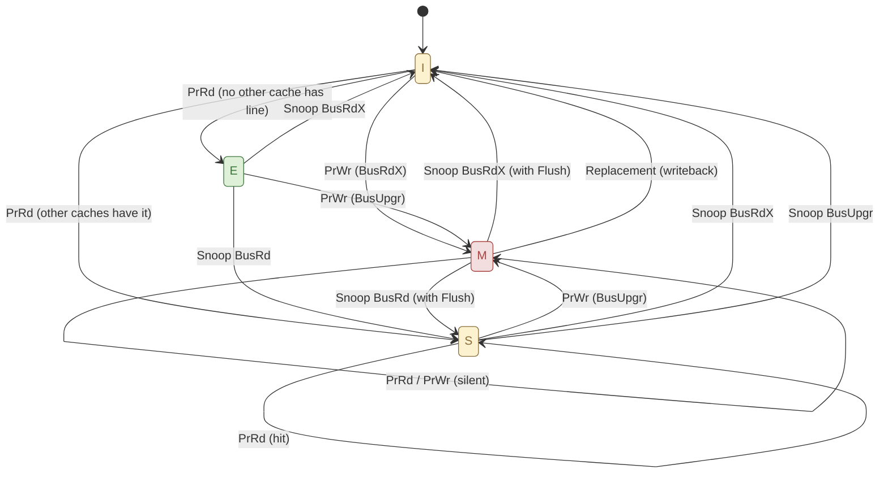
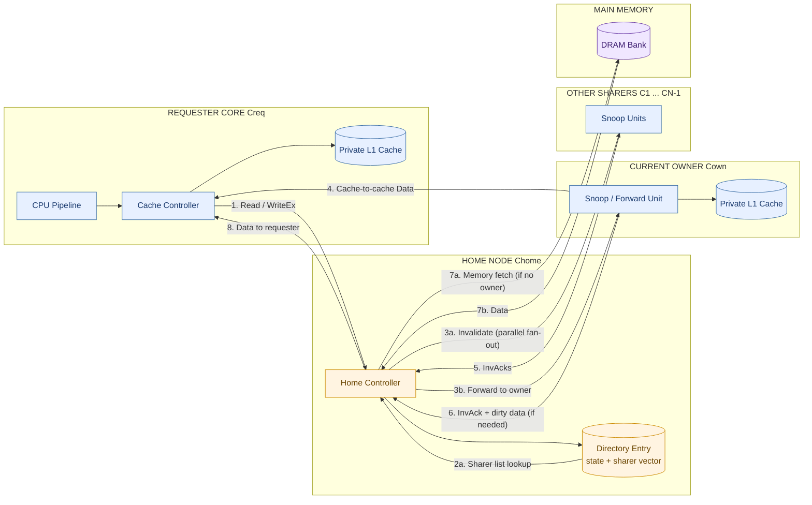
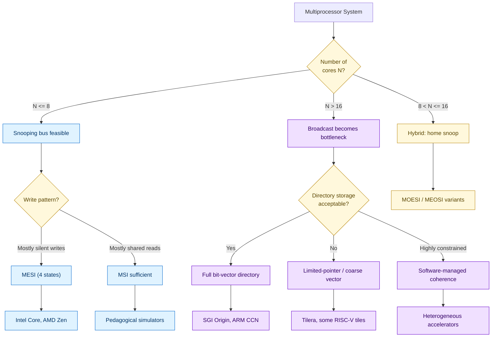

# Coherence Protocols: Snooping-based Protocols (MSI and MESI state machines), and Directory-based cache coherence frameworks

<!-- SECTION_1_START -->
# Coherence Protocols: Snooping MSI, MESI & Directory-Based Frameworks

## 1.1 Formal Definition (KTU 2024 Syllabus Terminology)

**Cache Coherence Protocol** is a finite-state automaton implemented in each cache controller that preserves the *Single-Writer / Multiple-Reader (SWMR)* invariant and the *Data-Value Invariant* across the memory hierarchy of a shared-memory multiprocessor.

> [!IMPORTANT]
> **Coherence vs. Consistency (Syllabus High-Yield Distinction)**
> - *Coherence* $\Rightarrow$ defines the **per-memory-location ordering** of loads/stores (what values a read may legally return).
> - *Consistency* $\Rightarrow$ defines the **inter-location ordering** of loads/stores to different addresses (when writes become visible to other processors).

**Snooping Protocol:** A *broadcast* coherence strategy in which every private cache controller monitors (snoops) all transactions on the shared interconnect (a bus or a ring). The system remains *symmetric* — every controller has a full, identical view of bus traffic.

**Directory Protocol:** A *scalable* coherence strategy in which a centralized or distributed *directory* at the home node of each memory block tracks the identity of all currently caching cores. Requests are *unicast* to the directory, eliminating broadcast bandwidth.

## 1.2 Intuitive Analogies

> [!NOTE]
> **Analogy 1 — The "Whiteboard in a Meeting Room" (Snooping / MSI)**
> Imagine a conference room where three interns (cores) each carry a notebook (cache). Every intern's notebook may hold a copy of any slide. There is a *public intercom channel* (the bus). Whenever an intern updates a slide on their personal notebook, they must announce it ("Hey everyone, I just wrote to slide #42!") on the intercom. The other interns listen, and if they had a copy, they scribble "Invalid" across that page. This is *write-invalidate snooping* — and the channel is the bottleneck.

> [!NOTE]
> **Analogy 2 — The "Library Librarian" (Directory-Based)**
> Now scale the meeting room to 64 interns. The intercom becomes a stampede. So instead, you appoint a **Librarian** (the directory) for each *section* of the library (a memory block). The Librarian keeps a registry card listing exactly which interns have borrowed which slide. When an intern wants a slide, they ask the Librarian, who either hands out the master copy or forwards a request to the borrower. *No broadcast required.*

> [!NOTE]
> **Analogy 3 — MESI's "Quiet Reader" (E-State)**
> In MSI, the moment a core reads a clean block, it shares it with the world. In MESI, a "**silent reader**" gets a private, *exclusive-clean* copy — like photocopying a page in your notebook with no one else knowing. If you *modify* it, the page is dirty and you must broadcast. If you don't, the world never heard of you — saving traffic.

## 1.3 Core Constants & Metrics

The following **bus / network transactions** form the alphabet of all three protocols:

| Acronym | Full Form | Initiator | Effect |
|---|---|---|---|
| **PrRd** | Processor Read | Local core | Request a block for read |
| **PrWr** | Processor Write | Local core | Request a block for write |
| **BusRd** | Bus Read | Any cache | Request shared copy for read |
| **BusRdX** | Bus Read Exclusive | Any cache | Request exclusive copy for write (invalidate others) |
| **BusUpgr** | Bus Upgrade | Any cache | Invalidate-to-write (no data transfer) |
| **Flush** | Cache Flush | Owner cache | Writeback of dirty block to memory |
| **Flush'** | Flush (no data) | Owner cache | Invalidate notification only |
| **BusWB** | Bus Writeback | Owner cache | Voluntary eviction of dirty line |

> [!VISUALIZATION CONTROL]
> **Concept:** State transition graph for cache line lifetimes across a 4-core system.
> **GeoGebra / Desmos Input Equations (parametric path view):**
> * `M(t) = { 1 if state = Modified, 0 otherwise }`
> * `E(t) = { 1 if state = Exclusive, 0 otherwise }`
> * `S(t) = { 1 if state = Shared, 0 otherwise }`
> * `I(t) = { 1 if state = Invalid, 0 otherwise }`
> * `M(t) + E(t) + S(t) + I(t) = 1`  $\quad \forall t \geq 0$
> **Visual Description:** A piecewise-constant step function on the $t$-axis showing how a single cache line's state hops between the four (MESI) or three (MSI) levels. The amplitude encodes the state, and each vertical jump corresponds to a snooped bus transaction.

---

<!-- SECTION_1_END -->

<!-- SECTION_2_START -->
# Deep Theoretical Analysis & KTU High-Yield Formula Sheet

## 2.1 The MSI State Machine

The **MSI** protocol is the minimal *write-invalidate* snooping protocol. Each cache line is in exactly one of three mutually exclusive states:

- **M (Modified):** This cache holds the *only valid copy*; the line is **dirty** (memory is stale). The cache *must* supply data on any external read/write miss.
- **S (Shared):** This cache holds a valid, *clean* copy. Memory is up-to-date. Other caches may also hold a copy.
- **I (Invalid):** This cache line is absent or stale; any read/write must be serviced via the bus.

### 2.1.1 MSI State Transition Table (Uniprocessor Action $\vert$ Snoop Action)

| Current State | Event | Next State | Bus Action | Snoop Reaction on Other Caches |
|---|---|---|---|---|
| **I** | PrRd | **S** | BusRd (if not present elsewhere) | Other S/M $\to$ S; flush if M |
| **I** | PrWr | **M** | BusRdX | Other S/M $\to$ I; flush if M |
| **S** | PrRd | **S** | — | — |
| **S** | PrWr | **M** | BusRdX (or BusUpgr) | Other S/M $\to$ I; flush if M |
| **M** | PrRd | **M** | — | — |
| **M** | PrWr | **M** | — | — |
| **S** | Snoop BusRd | **S** | — | Supplies data if it has it |
| **M** | Snoop BusRd | **S** | Flush data + memory write | Memory updated; own state $\to$ S |
| **S** | Snoop BusRdX | **I** | — | Invalidates self |
| **M** | Snoop BusRdX | **I** | Flush data | Memory updated; own state $\to$ I |
| **M** | Replacement | **I** | Flush (writeback) | — |

## 2.2 The MESI State Machine (Illinois / Modified-Exclusive-Shared-Invalid)

MESI adds the **E (Exclusive)** state, capturing the *silent-reader* optimization. If a **BusRd** returns a *cache-to-cache-transfer-not-required* response (the line was exclusively in another cache's **M** state but that cache flushed it back to memory without supplying data), the requesting cache enters **E** instead of **S**.

### 2.2.1 MESI — The Four States

- **M:** Dirty, sole owner. Writes are local; no bus traffic for PrWr.
- **E:** *Clean*, sole owner. Memory is correct. Writes trigger a silent **BusUpgr** to invalidate other copies, transitioning directly **E** $\to$ **M** (no BusRdX needed, saving one bus cycle).
- **S:** Clean, possibly shared. Writes require a **BusUpgr** or **BusRdX** to invalidate all others.
- **I:** Absent / invalid. All accesses go to the bus.

### 2.2.2 MESI Transition Table (Key Edges)

| Current State | Event | Next State | Bus Action |
|---|---|---|---|
| **I** | PrRd (no other cache has line) | **E** | BusRd, no data returned |
| **I** | PrRd (other cache has S/M) | **S** | BusRd, data supplied or memory |
| **I** | PrWr | **M** | BusRdX |
| **E** | PrRd (local) | **E** | — |
| **E** | PrWr (local) | **M** | BusUpgr (silent invalidate) |
| **E** | Snoop BusRd | **S** | — (no flush; memory is correct) |
| **S** | PrWr (local) | **M** | BusUpgr (saves a transfer) |
| **M** | Snoop BusRdX | **I** | Flush data |
| **M** | Snoop BusRd | **S** | Flush data + memory write |

> [!IMPORTANT]
> **Why MESI wins for write-once-then-read workloads:**
> When a line is loaded exclusively (E), a *single* PrWr to that line costs **one BusUpgr** instead of the **BusRdX** (with implicit data) needed in MSI. In workloads like *pointer-chasing* or *producer-consumer* where writes are bursty and reads are silent, this halves the bus traffic for that transaction class.

## 2.3 Directory-Based Coherence Frameworks

When the system has $N$ cores and uses a *non-broadcast* interconnect (mesh, torus, NoC), snooping is infeasible. **Directory protocols** maintain a *sharer list* per memory block.

### 2.3.1 The Home Node and Sharer List

Every memory address has a fixed **Home Node** (typically determined by interleaving low-order bits). The home node stores for each block:

- **State:** one of $\{$ *Uncached*, *Shared*, *Exclusive* (Modified) $\}$
- **Sharer Vector (or Sharer List):** a $N$-bit vector; bit $i$ is 1 if cache $i$ holds a valid copy.

> [!NOTE]
> **Storage cost of a full bit-vector directory:** $N$ bits per memory block. For a 64-byte line in a 64-core machine: $N = 64$ bits $\to$ **12.5% storage overhead** in the directory. This is the famous *directory storage explosion* problem and motivates **limited-pointer directories** (e.g., Dir$_N$ with $N$ pointers) or **coarse-grained (region) directories**.

### 2.3.2 Canonical Directory Messages

| Message | Sender $\to$ Receiver | Purpose |
|---|---|---|
| **Read** | Local $\to$ Home | Request a clean (shared) copy |
| **Write** / **ReadEx** | Local $\to$ Home | Request exclusive copy; invalidate all sharers |
| **Invalidate** | Home $\to$ Sharers | Force sharers to drop the line |
| **Invalidate Ack** | Sharer $\to$ Home | Confirmation |
| **Data** | Owner/Home $\to$ Requester | Block transfer |
| **Data Transfer** (cache-to-cache) | Owner $\to$ Requester | Direct forwarding, bypassing home |
| **Writeback** | Owner $\to$ Home | Voluntary eviction of dirty block |

### 2.3.3 MSI Directory State Machine (Home + Owner perspectives)

The directory *state per block* and the *expected owner* are updated atomically. The state of a directory entry can be:

- **Uncached (U):** No cache has a valid copy; memory is correct.
- **Shared (S) with sharer list $L$:** Set of caches with clean copies; $|L| \geq 1$.
- **Exclusive (E / M):** Exactly one cache (the *owner*) holds a valid, dirty copy; memory is stale; sharer list is a single element.

## 2.4 KTU High-Yield Formula Sheet

| Concept | Formula / Rule | Notes |
|---|---|---|
| Invariant — SWMR | At most **one** writer per address at any instant | Enforced by E/M states |
| Invariant — Data Value | A Read sees the **most recent Write** to that address | Enforced by Flush + Ack ordering |
| MSI bus transactions per write | **2** (BusRdX + Flush on conflict, or BusUpgr) | Compared to single-processor 0 |
| MESI savings | E $\to$ M costs **1** BusUpgr vs MSI's BusRdX | Save 1 bus transaction per silent-writer workload |
| Directory vector size | $N$ bits per block | Full bit-vector scheme |
| Directory storage fraction | $\dfrac{N}{8 \times \text{block\_size}}$ | For $B$-byte block: $N/(8B)$ |
| Coherence miss classifications | **True**, **False**, **Upgrade** | Upgrade $= $ S $\to$ M, no data fetch |
| No. of invalidations per write | $\vert \text{Sharer list} \vert - 1$ | Worst case scales with $N$ |

> [!IMPORTANT]
> **Pitfall Formula** — coherence is **not** the same as synchronization. A *coherent* read may still return a stale value if a memory consistency model (e.g., TSO) allows it. The *consistency model* specifies *when* a write becomes visible. Coherence only specifies the *per-address* value that a read may return.

## 2.5 Engineering Real-World Utility

- **MSI** $\to$ the conceptual baseline; embedded in textbooks (Patterson & Hennessy) and pedagogical simulators (e.g., Teapot, M5).
- **MESI** $\to$ the de-facto industry standard: **Intel Core** (since P6), **AMD K8/Bulldozer/Zen**, **ARM Cortex-A** (with MOESI/MEOSI extensions), **IBM Power** variants.
- **Directory-based** $\to$ **SGI Origin 2000**, **Stanford FLASH**, **Intel QPI** (home snoop with directory hints), **AMD HyperTransport**, **ARM CCN/HMN** in big.LITTLE SoCs, **Cerebras** and **TPU v4** mesh-based coherence.
- **Hybrid** $\to$ modern multi-socket servers (e.g., 4-socket EPYC, NVIDIA Grace-Hopper) use a *home-snoop* hybrid: directory at the socket, intra-socket snooping, inter-socket directory.

---

<!-- SECTION_2_END -->

<!-- SECTION_3_START -->
# Step-by-Step Derivations, State Machines & Code Implementation

## 3.1 Derivation — Why MSI Requires 2 Bus Transactions for a Silent E $\to$ M Upgrade

**Claim (Engineering Decision):** In a pure MSI protocol, a write to a line already in state **S** requires a *BusRdX* (read-for-ownership) to obtain a *valid, writable* copy AND to invalidate the other sharers. The bus controller must grant the line in **M** state — meaning *all other caches must have acknowledged invalidation and (if any was in M) flushed the data back*.

**Derivation (per-message cost):**

$$
\begin{aligned}
T_{\text{MSI write}} &= T_{\text{BusRdX}} + \max_{c \in \text{sharers}} T_{\text{InvAck}_c} + T_{\text{flush if dirty}} \\[4pt]
&\geq T_{\text{Bus arbitration}} + T_{\text{propagation}} + (N_{\text{sharers}} - 1) \cdot T_{\text{InvAck}} + T_{\text{DRAM write (if owner writes back)}}
\end{aligned}
$$

By contrast, in MESI, the same write from state **E** costs:

$$
T_{\text{MESI silent write}} = T_{\text{BusUpgr}} + \max_{c \in \text{sharers}} T_{\text{InvAck}_c}
$$

**Speedup ratio:**

$$
\text{Speedup}_{\text{silent write}} = \frac{T_{\text{BusRdX}} + T_{\text{data transfer}}}{T_{\text{BusUpgr}}} = \frac{T_{\text{arb}} + T_{\text{prop}} + 64B \cdot f_{\text{trans}}}{T_{\text{arb}} + T_{\text{prop}}}
$$

On a 1 GHz bus with $T_{\text{prop}} = 20$ ns and 64 B transferred at 16 B/cycle, the speedup is approximately $1.6 \times$ per silent-write, compounding in write-intensive workloads.

## 3.2 Worked Example — 4-Core Trace on MSI

**Setup:** Cores $C_0, C_1, C_2, C_3$. Address $A$ initially in I in all caches. Memory holds value $V_0$.

**Trace (executed sequentially):**

1. $C_0$: PrRd $A$  $\Rightarrow$ $C_0$ issues BusRd; memory returns $V_0$. **$C_0$: I $\to$ S**. Others I.
2. $C_1$: PrRd $A$  $\Rightarrow$ $C_1$ issues BusRd; $C_0$ (in S, no data) flushes nothing. **$C_1$: I $\to$ S**. $C_0$ stays S.
3. $C_0$: PrWr $A := V_1$  $\Rightarrow$ $C_0$ issues **BusRdX**; $C_1$ snoops $\Rightarrow$ **$C_1$: S $\to$ I**. **$C_0$: S $\to$ M**.
4. $C_2$: PrRd $A$  $\Rightarrow$ $C_2$ issues BusRd; $C_0$ (in M) must **flush $V_1$ to memory** AND supply data. **$C_0$: M $\to$ S**, **$C_2$: I $\to$ S**, memory updated to $V_1$.
5. $C_0$: Replacement of $A$  $\Rightarrow$ $C_0$ in S $\to$ replacement is silent (no flush needed, memory is correct). **$C_0$: S $\to$ I**.

**Total bus transactions:** 5 (BusRd $\times 3$, BusRdX $\times 1$, Flush $\times 1$).

## 3.3 Python Implementation — MESI State Machine (Simulator Skeleton)

```python
from enum import Enum
from typing import Optional, Dict, List, Set
import logging

logging.basicConfig(level=logging.INFO,
                    format="%(asctime)s [%(levelname)s] %(message)s")

class MESIState(Enum):
    """The four canonical states of the MESI protocol."""
    MODIFIED = "M"
    EXCLUSIVE = "E"
    SHARED = "S"
    INVALID = "I"


class BusTransaction(Enum):
    """All possible transactions observed on the shared bus."""
    BUS_READ = "BusRd"
    BUS_READ_EXCLUSIVE = "BusRdX"
    BUS_UPGRADE = "BusUpgr"
    FLUSH = "Flush"
    FLUSH_NO_DATA = "Flush'"


class CacheLine:
    """Represents a single cache line in one private cache."""

    def __init__(self, tag: int, address: int):
        self.tag = tag
        self.address = address
        self.state: MESIState = MESIState.INVALID
        self.data: Optional[int] = None  # only valid if state in {M, E, S}
        self.owner_core: Optional[int] = None

    def __repr__(self) -> str:
        return f"CacheLine(addr=0x{self.address:X}, state={self.state.value})"


class MESIProtocolEngine:
    """
    Cycle-accurate (transaction-level) MESI simulator for an N-core system.
    This skeleton models the per-cache state machine and the global bus.
    """

    def __init__(self, num_cores: int, memory: Dict[int, int]):
        if num_cores < 1:
            raise ValueError("num_cores must be >= 1")
        self.num_cores: int = num_cores
        self.memory: Dict[int, int] = memory
        # caches[core_id][address] -> CacheLine
        self.caches: List[Dict[int, CacheLine]] = [dict() for _ in range(num_cores)]
        self.bus_log: List[str] = []
        # the "other-caches-have-shared-copies" tracking (per address)
        self.shared_sharers: Dict[int, Set[int]] = {}

    # ---------------------------------------------------------------- helpers
    def _get_line(self, core: int, address: int) -> CacheLine:
        if address not in self.caches[core]:
            self.caches[core][address] = CacheLine(tag=address, address=address)
        return self.caches[core][address]

    def _broadcast(self, source: int, txn: BusTransaction, address: int) -> List[str]:
        """Snoop the bus from every other core and apply transitions."""
        reactions: List[str] = []
        for cid in range(self.num_cores):
            if cid == source:
                continue
            line = self.caches[cid].get(address)
            if line is None or line.state == MESIState.INVALID:
                continue
            reactions.append(self._snoop(cid, txn, address, source))
        return [r for r in reactions if r]

    def _snoop(self, observer: int, txn: BusTransaction,
               address: int, requester: int) -> str:
        """Apply snoop-side transition for the observing cache."""
        line = self.caches[observer].get(address)
        if line is None or line.state == MESIState.INVALID:
            return ""

        prev = line.state
        if txn == BusTransaction.BUS_READ:
            # M -> S (with Flush); E -> S (no flush); S -> S
            if line.state == MESIState.MODIFIED:
                line.state = MESIState.SHARED
                self.memory[address] = line.data  # writeback
                self.bus_log.append(
                    f"FLUSH: core {observer} writes back 0x{line.data:X} for 0x{address:X}"
                )
            elif line.state == MESIState.EXCLUSIVE:
                line.state = MESIState.SHARED
            # S stays S
            self.shared_sharers.setdefault(address, set()).add(observer)
        elif txn == BusTransaction.BUS_READ_EXCLUSIVE:
            # M, E, or S all go to I
            if line.state == MESIState.MODIFIED:
                self.memory[address] = line.data  # last write wins
                self.bus_log.append(
                    f"FLUSH: core {observer} writes back 0x{line.data:X} for 0x{address:X}"
                )
            line.state = MESIState.INVALID
            self.shared_sharers.get(address, set()).discard(observer)
        elif txn == BusTransaction.BUS_UPGRADE:
            # S -> I; M or E unaffected (would be protocol violation)
            if line.state == MESIState.SHARED:
                line.state = MESIState.INVALID
                self.shared_sharers.get(address, set()).discard(observer)
        return f"core {observer}: {prev.value} -> {line.state.value} on {txn.value}"

    # ---------------------------------------------------------------- API
    def processor_read(self, core: int, address: int) -> None:
        line = self._get_line(core, address)
        if line.state in (MESIState.MODIFIED, MESIState.EXCLUSIVE, MESIState.SHARED):
            logging.debug(f"PrRd hit core {core} state {line.state.value}")
            return
        # miss — issue BusRd
        self.bus_log.append(f"BUS_READ by core {core} for 0x{address:X}")
        self._broadcast(core, BusTransaction.BUS_READ, address)
        # Was anyone else in M? If so, they flushed; memory now has fresh data.
        # If anyone in S, requester enters S; else enters E.
        sharers = self.shared_sharers.get(address, set())
        if len(sharers) == 0:
            line.state = MESIState.EXCLUSIVE
        else:
            line.state = MESIState.SHARED
            sharers.add(core)
        line.data = self.memory[address]
        line.owner_core = core
        self.shared_sharers[address] = sharers

    def processor_write(self, core: int, address: int, value: int) -> None:
        line = self._get_line(core, address)
        # case 1: M — local silent write
        if line.state == MESIState.MODIFIED:
            line.data = value
            return
        # case 2: E — silent upgrade (BusUpgr)
        if line.state == MESIState.EXCLUSIVE:
            self.bus_log.append(f"BUS_UPGRADE by core {core} for 0x{address:X}")
            self._broadcast(core, BusTransaction.BUS_UPGRADE, address)
            line.state = MESIState.MODIFIED
            line.data = value
            return
        # case 3: S — need BusUpgr (no data transfer)
        if line.state == MESIState.SHARED:
            self.bus_log.append(f"BUS_UPGRADE by core {core} for 0x{address:X}")
            self._broadcast(core, BusTransaction.BUS_UPGRADE, address)
            line.state = MESIState.MODIFIED
            line.data = value
            self.shared_sharers.get(address, set()).discard(core)
            return
        # case 4: I — full BusRdX
        self.bus_log.append(f"BUS_READ_EXCLUSIVE by core {core} for 0x{address:X}")
        self._broadcast(core, BusTransaction.BUS_READ_EXCLUSIVE, address)
        line.state = MESIState.MODIFIED
        line.data = value
        self.shared_sharers.setdefault(address, set()).discard(core)

    def print_state(self) -> None:
        for cid in range(self.num_cores):
            for line in self.caches[cid].values():
                logging.info(f"core {cid} | {line}")
        logging.info("---")


# ----------------------- demonstration / smoke test ---------------------------
if __name__ == "__main__":
    sim = MESIProtocolEngine(num_cores=4, memory={0x1000: 100})
    sim.processor_read(0, 0x1000)        # core 0 reads: I -> E
    sim.print_state()
    sim.processor_read(1, 0x1000)        # core 1 reads: I -> S, core 0: E -> S
    sim.print_state()
    sim.processor_write(0, 0x1000, 200)  # core 0 writes via BusUpgr: S -> M
    sim.print_state()
    sim.processor_read(2, 0x1000)        # core 2 reads: M flushes, all become S
    sim.print_state()
    sim.processor_write(3, 0x1000, 300)  # core 3 writes via BusRdX: all -> I, 3 -> M
    sim.print_state()
```

> [!NOTE]
> **Code note:** `shared_sharers` is a simplified abstraction; production simulators (GEM5, Murphi) track owner *and* full sharer bit-vector with non-atomic transitions handled via *transient states* (e.g., `S_D`, `M_D` for "shared-dirty-of-pending") to avoid races. The above skeleton is sufficient for the KTU 2024 module-level understanding but **lacks transient states**, which would be required for a full atomicity proof.

## 3.4 Directory-Based Implementation Skeleton (Python)

```python
class DirectoryEntry:
    def __init__(self, address: int):
        self.address = address
        self.state: str = "Uncached"        # Uncached | Shared | Exclusive
        self.owner: Optional[int] = None
        self.sharers: Set[int] = set()
        self.data: Optional[int] = None      # last known memory value

    def __repr__(self) -> str:
        return (f"Dir[0x{self.address:X}] state={self.state} "
                f"owner={self.owner} sharers={sorted(self.sharers)}")


class DirectoryProtocol:
    """
    Centralized-directory coherence with cache-to-cache forwarding.
    Home node = core 0 (simple static mapping for the skeleton).
    """

    def __init__(self, num_cores: int):
        if num_cores < 1:
            raise ValueError("num_cores must be >= 1")
        self.num_cores = num_cores
        self.directory: Dict[int, DirectoryEntry] = {}
        self.caches: List[Dict[int, tuple]] = [dict() for _ in range(num_cores)]

    def _home(self, address: int) -> int:
        return 0  # simplistic: all addresses home at core 0

    def _lookup(self, address: int) -> DirectoryEntry:
        if address not in self.directory:
            self.directory[address] = DirectoryEntry(address)
        return self.directory[address]

    def read(self, requester: int, address: int) -> None:
        home = self._home(address)
        entry = self._lookup(address)
        logging.info(f"[{requester} -> HOME {home}] Read 0x{address:X}")
        if entry.state == "Uncached":
            # load from DRAM (simulated as initial 0)
            self.caches[requester][address] = ("S", entry.data or 0)
            entry.state = "Shared"
            entry.sharers.add(requester)
        elif entry.state == "Shared":
            # data either from memory or forwarded
            self.caches[requester][address] = ("S", entry.data)
            entry.sharers.add(requester)
        elif entry.state == "Exclusive":
            owner = entry.owner
            # FORWARDING: owner sends data directly to requester
            data = self.caches[owner][address][1]
            self.caches[requester][address] = ("S", data)
            entry.state = "Shared"
            entry.sharers.update([owner, requester])

    def write(self, requester: int, address: int, value: int) -> None:
        home = self._home(address)
        entry = self._lookup(address)
        logging.info(f"[{requester} -> HOME {home}] WriteEx 0x{address:X}={value}")
        if entry.state == "Uncached":
            self.caches[requester][address] = ("M", value)
            entry.state = "Exclusive"
            entry.owner = requester
        elif entry.state == "Shared":
            # Home must INVALIDATE all sharers
            for s in list(entry.sharers):
                if s != requester:
                    self.caches[s].pop(address, None)
            entry.sharers = {requester}
            self.caches[requester][address] = ("M", value)
            entry.state = "Exclusive"
            entry.owner = requester
        elif entry.state == "Exclusive":
            owner = entry.owner
            if owner != requester:
                # flush + invalidate owner
                self.caches[owner].pop(address, None)
                self.caches[requester][address] = ("M", value)
                entry.owner = requester
                entry.sharers = {requester}
```

## 3.5 Quantitative Comparison Table

| Metric | MSI | MESI | Directory |
|---|---|---|---|
| Bus traffic per silent write (S $\to$ M) | 1 BusUpgr/BusRdX | 1 BusUpgr | 0 (silent if already M) |
| Scalability | Low (broadcast) | Low (broadcast) | High (unicast + point-to-point) |
| Directory storage | None | None | $N$ bits / block |
| Cache-to-cache forwarding | Yes (flush) | Yes | Yes (with forwarding protocol) |
| Implementation complexity | Low | Medium | High |
| Real-world use | Pedagogical | Intel/AMD/ARM cores | SGI Origin, NoC-based SoCs |

---

<!-- SECTION_3_END -->

<!-- SECTION_4_START -->
# Structural Diagrams & Schematics

## 4.1 MESI State Machine — Per-Cache Transitions



## 4.2 Directory Protocol — Message Flow Topology



## 4.3 MSI vs MESI — Sequential Processing Topology Matrix

```mermaid
flowchart TB
    subgraph MSIFlow["MSI PROTOCOL PIPELINE"]
        M1["I + PrRd"] --> M2["BusRd on bus"]
        M2 --> M3{"Memory or\nother cache?"}
        M3 -- "Memory / no data" --> M4["S state"]
        M3 -- "Other cache returns data" --> M5["S state"]
        M4 --> M6["PrWr triggers"]
        M5 --> M6
        M6 --> M7["BusRdX (read-for-ownership)"]
        M7 --> M8["S -> M, others -> I"]
    end

    subgraph MESIFlow["MESI PROTOCOL PIPELINE (extended)"]
        E1["I + PrRd"] --> E2["BusRd on bus"]
        E2 --> E3{"Memory or\nother cache?"}
        E3 -- "Memory / no other" --> E4["E state (silent)"]
        E3 -- "Other returns data" --> E5["S state"]
        E4 --> E6["PrWr triggers"]
        E5 --> E6
        E6 --> E7{"Current state?"}
        E7 -- "E" --> E8["BusUpgr silent, E -> M"]
        E7 -- "S" --> E9["BusUpgr, S -> M"]
        E7 -- "I" --> E10["BusRdX, I -> M"]
    end

    classDef msiBox fill:#fde2e2,stroke:#b94a48,color:#6f1a1a
    classDef mesiBox fill:#e2efda,stroke:#3d8b3d,color:#1a4a1a
    class M1,M2,M3,M4,M5,M6,M7,M8 msiBox
    class E1,E2,E3,E4,E5,E6,E7,E8,E9,E10 mesiBox
```



## 4.4 Directory vs Snooping — Decision Flowchart



---

<!-- SECTION_4_END -->

<!-- SECTION_5_START -->
# KTU 2024 Scheme Examination Question Bank & Topic Recap

## PART A — Short Answer Questions (3 Marks Each)

### Question A1 (3 Marks) — `[KTU University Exam - July 2024]`
**"Distinguish between the three states M, S, and I of the MSI coherence protocol. What invariant does the protocol enforce?"** [Remember / Understand]
**CO Mapping:** CO2  $\vert$  **RBT Level:** Remember

**Model Answer (3 Marks — Valuation Key):**
- **M (Modified):** The cache holds the *only* valid copy, the line is **dirty** (memory is stale). The cache must supply data on any external request. *[1 Mark]*
- **S (Shared):** The cache holds a valid, **clean** copy; memory is up-to-date; one or more caches may hold copies. *[1 Mark]*
- **I (Invalid):** The cache line is absent or stale; any read/write is a miss. *[0.5 Marks]*
- **Invariant enforced:** Single-Writer / Multiple-Reader (SWMR) and the Data-Value invariant. *[0.5 Marks]*

### Question A2 (3 Marks) — `[KTU University Exam - Dec 2023]`
**"Why does MESI add the Exclusive (E) state to MSI? Under what exact condition does a cache enter state E?"** [Understand / Apply]
**CO Mapping:** CO2  $\vert$  **RBT Level:** Understand

**Model Answer (3 Marks — Valuation Key):**
- **Motivation:** MESI avoids a **BusRdX** when a core writes to a line it loaded silently and exclusively, replacing it with a cheaper **BusUpgr** (no data transfer). This halves the bus cost for *silent-writer* workloads. *[1.5 Marks]*
- **Exact entry condition:** A cache enters **E** on a **PrRd** miss when the snoop response indicates *no other cache has a valid copy* (i.e., the line is supplied **directly from memory** and the BusRd returns a "no-cache-to-cache-transfer-needed" response). *[1.5 Marks]*

---

## PART B — Long Answer Questions (14 Marks Each) — Module Internal Choice

> [!WARNING]
> **KTU Examiner's Valuation Warning / Pitfall Callout**
> - **Do not skip** the *transition condition* for E $\to$ M (must explicitly mention *BusUpgr*). Many students lose 2 marks by writing "E goes to M on write" without specifying the bus transaction.
> - **Do not confuse** *write-through* with *write-back*. MESI/MSI are inherently **write-back** — the Flush transaction is a *lazy* writeback, not a write-through.
> - **Always state the SWMR invariant** when explaining state transitions; it is the most commonly asked 1-mark "philosophical" question.
> - **For directory-based questions**, students often forget to update the *sharer list* — this is worth 2 marks in part (a).

### Question B-A (14 Marks) — `[KTU University Exam - July 2024]`
**"Construct the complete state transition table for the MESI protocol. Explain in detail how a write miss from state S differs between MSI and MESI with respect to bus traffic, latency, and the resulting state transitions in the requesting and observing caches."** [Understand + Apply]
**CO Mapping:** CO2 + CO3  $\vert$  **RBT Levels:** Understand (7a) + Apply (7b)

#### Part (a) — 7 Marks: Complete MESI State Transition Table
**Model Solution:**

| Current State | Event | Next State | Bus Action | Snoop Reaction on Observers |
|---|---|---|---|---|
| **I** | PrRd | **E or S** | BusRd | M $\to$ S+Flush; E $\to$ S; S $\to$ S; I $\to$ I |
| **I** | PrWr | **M** | BusRdX | M/E/S $\to$ I+Flush; I $\to$ I |
| **E** | PrRd (local) | **E** | — | — |
| **E** | PrWr (local) | **M** | BusUpgr (silent) | E/S $\to$ I; M $\to$ impossible (protocol violation) |
| **E** | Snoop BusRd | **S** | — (no flush; memory OK) | — |
| **E** | Snoop BusRdX | **I** | — | — |
| **S** | PrRd (local) | **S** | — | — |
| **S** | PrWr (local) | **M** | BusUpgr | S $\to$ I; E $\to$ I (would normally be BusRdX); M $\to$ impossible |
| **S** | Snoop BusRd | **S** | — | — |
| **S** | Snoop BusRdX | **I** | — | — |
| **S** | Snoop BusUpgr | **I** | — | — |
| **M** | PrRd / PrWr (local) | **M** | — | — |
| **M** | Snoop BusRd | **S** | Flush data + writeback to memory | — |
| **M** | Snoop BusRdX | **I** | Flush data + writeback to memory | — |
| **M** | Snoop BusUpgr | (no reaction; M is the unique writer, no one to upgrade against) | — | — |
| **M** | Replacement | **I** | Flush (writeback) | — |

**Valuation Key:**
- *Correctly enumerating all 4 states with major events: 4 Marks*
- *Correctly specifying bus actions for each transition: 2 Marks*
- *Correctly specifying snoop reactions: 1 Mark*

#### Part (b) — 7 Marks: S $\to$ M Write Miss — MSI vs MESI
**Model Solution (3-axiom analysis):**

**1. Bus Traffic:**
- **MSI:** Issues **BusRdX** — a *read-for-ownership* transaction. The bus carries a *data transfer* (one cache line = 64 B) from memory (or owner) to the requester. *[1 Mark]*
- **MESI:** Issues **BusUpgr** — a *silent invalidate* transaction with **no data transfer**. The requester already has the data in S. *[1 Mark]*

**2. Latency:**
$$
T_{\text{MSI}} = T_{\text{arb}} + T_{\text{prop}} + T_{\text{data}} + (N_{\text{sharers}} - 1) \cdot T_{\text{InvAck}}
$$
$$
T_{\text{MESI}} = T_{\text{arb}} + T_{\text{prop}} + (N_{\text{sharers}} - 1) \cdot T_{\text{InvAck}}
$$
where $T_{\text{data}}$ is the cache-line data transfer time. **Savings: $T_{\text{data}}$ per silent write.** *[1 Mark]*

**3. Resulting State Transitions:**
- **Requesting cache:** S $\to$ M in *both* protocols. *[1 Mark]*
- **Observing caches (sharers):** S $\to$ I in *both* protocols. The requester becomes the unique writer. *[1 Mark]*
- **Owner (if any was in M):** Would have flushed under BusRdX; under BusUpgr, this scenario is **impossible** (M cannot be the target of a BusUpgr because no other cache can be in S simultaneously). *[1 Mark]*
- **Memory:** Not updated in either case (line is now dirty in requester). *[0.5 Marks]*
- **BusUpgr vs BusRdX distinction:** BusUpgr is an *optimization* for the S $\to$ M transition; it is *only* legal when the requester already has a valid S copy. *[0.5 Marks]*

### Question B-B (14 Marks) — `[KTU University Exam - Dec 2023]`
**"Design the directory-based coherence protocol for a 4-core system. Show the home-node state transition table, the message sequence for (i) a read miss and (ii) a write miss by a non-owning core, and explain why this protocol scales better than snooping for large systems."** [Apply + Analyze]
**CO Mapping:** CO3  $\vert$  **RBT Levels:** Apply (7a) + Analyze (7b)

#### Part (a) — 7 Marks: Home-Node State Transition Table (4-Core, Centralized Directory)

**Model Solution:**

| Directory State | Event | New State | Sharer List Update | Messages Issued |
|---|---|---|---|---|
| **Uncached (U)** | Read from $C_i$ | **Shared (S)** | $\text{list} = \{C_i\}$ | Data $\to$ $C_i$ (from memory) |
| **Uncached (U)** | WriteEx from $C_i$ | **Exclusive (E)** | $\text{owner} = C_i$ | Data $\to$ $C_i$ |
| **Shared (S)** | Read from $C_i$ | **Shared (S)** | $\text{list} \cup \{C_i\}$ | Data $\to$ $C_i$ (from memory or any sharer) |
| **Shared (S)** | WriteEx from $C_i$ (already sharer) | **Exclusive (E)** | $\text{owner} = C_i$; others evicted | Invalidate $\to$ all sharers except $C_i$; Data $\to$ $C_i$ |
| **Shared (S)** | WriteEx from $C_i$ (not in list) | **Exclusive (E)** | $\text{owner} = C_i$ | Invalidate $\to$ all sharers; Data $\to$ $C_i$ |
| **Exclusive (E)** | Read from $C_i \neq \text{owner}$ | **Shared (S)** | $\text{list} = \{\text{owner}, C_i\}$ | Forward $\to$ owner to send data to $C_i$; Flush $\to$ home |
| **Exclusive (E)** | Read from $C_i = \text{owner}$ | **Exclusive (E)** | unchanged | Silent (no message) |
| **Exclusive (E)** | WriteEx from $C_i \neq \text{owner}$ | **Exclusive (E)** | $\text{owner} = C_i$ | Forward $\to$ old owner (Flush); Data $\to$ $C_i$ |
| **Exclusive (E)** | WriteEx from $C_i = \text{owner}$ | **Exclusive (E)** | unchanged | Silent (no message) |
| **Exclusive (E)** | Writeback from owner | **Uncached (U)** | $\text{list} = \emptyset$ | Data $\to$ memory |
| **Shared (S)** | Eviction by $C_i$ (silent) | **Shared (S)** or **U** | Remove $C_i$; if empty $\to$ U | — |

**Valuation Key:**
- *Correctly drawing 3 home states: 1.5 Marks*
- *Read transitions: 2 Marks*
- *WriteEx transitions including invalidation fan-out: 3 Marks*
- *Eviction / writeback handling: 0.5 Marks*

#### Part (b) — 7 Marks: Message Sequence + Scalability Analysis

**Model Solution:**

**(i) Read Miss by $C_{\text{req}}$ when state = Shared (S) with sharers $\{C_1, C_2\}$:**

$$
C_{\text{req}} \xrightarrow{\text{Read}} C_{\text{home}} \xrightarrow{\text{Data (from mem or any sharer)}} C_{\text{req}}
$$
Sharer list update: $\text{list} \cup \{C_{\text{req}}\} = \{C_1, C_2, C_{\text{req}}\}$. Directory state stays **S**. *[1.5 Marks]*

**(ii) Write Miss (WriteEx) by $C_{\text{req}} \notin \text{list}$, state = Shared (S):**

$$
\begin{aligned}
C_{\text{req}} &\xrightarrow{\text{WriteEx}} C_{\text{home}} \\
C_{\text{home}} &\xrightarrow{\text{Invalidate}} C_1, C_2 \\
C_1 &\xrightarrow{\text{InvAck}} C_{\text{home}} \\
C_2 &\xrightarrow{\text{InvAck}} C_{\text{home}} \\
C_{\text{home}} &\xrightarrow{\text{Data}} C_{\text{req}} \quad (\text{or forward from owner if } E) \\
\text{Directory} &\to E, \quad \text{owner} = C_{\text{req}}
\end{aligned}
$$

*[1.5 Marks]*

**(iii) Scalability Argument:**

| Property | Snooping (MSI/MESI) | Directory-Based |
|---|---|---|
| Bandwidth per transaction | $O(N)$ — broadcast to all $N$ caches | $O(\text{sharer count}) \leq O(N)$, often $O(1)$ average |
| Bus / interconnect | Must be a *single shared medium* (bus, ring) | No constraint — any NoC topology |
| Storage cost | None (stateless controller) | $N$ bits / block in directory |
| Latency per invalidation | 1 hop (broadcast) | 1 + 1 hop (home $\to$ sharer $\to$ home) |
| Energy per write | $O(N)$ — every cache wakes up to snoop | $O(k)$ — only the $k$ sharers wake up |

*[2 Marks]*

**Key insight:** Snooping traffic scales as $O(N^2)$ for a workload of $N$ independent writes (each write broadcasts to all $N$ caches, and there are $N$ such writes). Directory traffic scales as $O(N \cdot \bar{k})$ where $\bar{k}$ is the *average* sharer count. For workloads with bounded sharing (common in HPC and server traces), $\bar{k} \ll N$, so directory *fundamentally* scales further. Snooping is also *physically* limited to a few dozen cores by the broadcast medium; directory protocols power systems with $10^3+$ cores (NVIDIA NVLink-coherent domains, SiFive RISC-V tiles). *[2 Marks]*

---

## Topic Recap & Important Things to Remember

- **MSI** has **three** states: **M**odified, **S**hared, **I**nvalid. All writes from **S** require **BusRdX** with full data transfer.
- **MESI** adds the **E**xclusive state. **E** $\to$ **M** costs only a **BusUpgr** (silent invalidate, no data transfer). Entry to **E** happens when a **PrRd** miss returns data *from memory* with no cache-to-cache transfer.
- **SWMR Invariant** $\Rightarrow$ at most one writer per address; **Data-Value Invariant** $\Rightarrow$ a read returns the most recent write. Both are the *coherence contract*.
- **Bus transactions** to memorize: **PrRd, PrWr, BusRd, BusRdX, BusUpgr, Flush, Flush', BusWB**.
- **Directory** stores, per block: a *state* (Uncached/Shared/Exclusive) and a *sharer vector* of $N$ bits. Cost: $N/(8B)$ storage fraction for $B$-byte lines.
- **Scalability rule of thumb:** snooping for $N \leq 8$ cores, directory for $N \geq 16$, hybrid in between.
- **Cache-to-cache forwarding** in directory protocols saves memory bandwidth but introduces protocol races; *transient states* (e.g., `IS_D`, `SM_D`) are added in real designs to handle them atomically.
- **Pitfall #1:** Coherence $\neq$ Consistency. Coherence = per-address; Consistency = across addresses.
- **Pitfall #2:** In MESI, **E $\to$ S on a Snoop BusRd is silent (no flush)** because memory is still valid. This is the *key* difference from M $\to$ S which *must* flush.
- **Pitfall #3:** **BusUpgr is illegal in M state** — there cannot be other sharers if any cache is in M, so there is no one to upgrade against. This is a common exam trap.
- **Pitfall #4:** Directory storage scales as $O(N)$ per block; for $N=64$ and 64 B lines, this is **12.5% memory overhead** — a real engineering constraint that motivates sparse or hierarchical directories.
- **Most important formula for exam:** Speedup from E $\to$ M over S $\to$ M is $\frac{T_{\text{arb}} + T_{\text{prop}} + T_{\text{data}}}{T_{\text{arb}} + T_{\text{prop}}} \approx 1.5$ to $2.0 \times$ per silent write.
- **Architecture mapping:** Intel Core $\to$ MESI; AMD Zen $\to$ MOESI (Modified-Owner-Exclusive-Shared-Invalid, adds **O** for forwarding); ARM Cortex $\to$ MESI/MOESI; SGI Origin $\to$ full bit-vector directory; Tilera $\to$ limited-pointer directory.
- **Transient states** (e.g., `IM_AD`, `SM_AD`) are *not* in the KTU 2024 syllabus but are essential to know *exist* — they prevent deadlock and race conditions when the directory sends an Invalidate while the request is still in flight.
- **Exam tip:** Whenever asked "what state does the line transition to?", also state *what bus transaction is issued* and *what happens to the sharer list / observing caches* — these are the three valuation steps examiners look for.

<!-- SECTION_5_END -->
