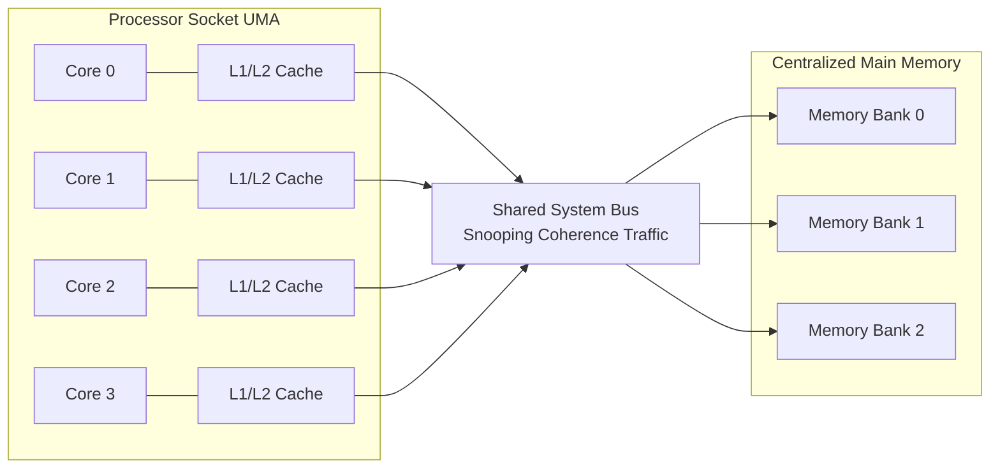
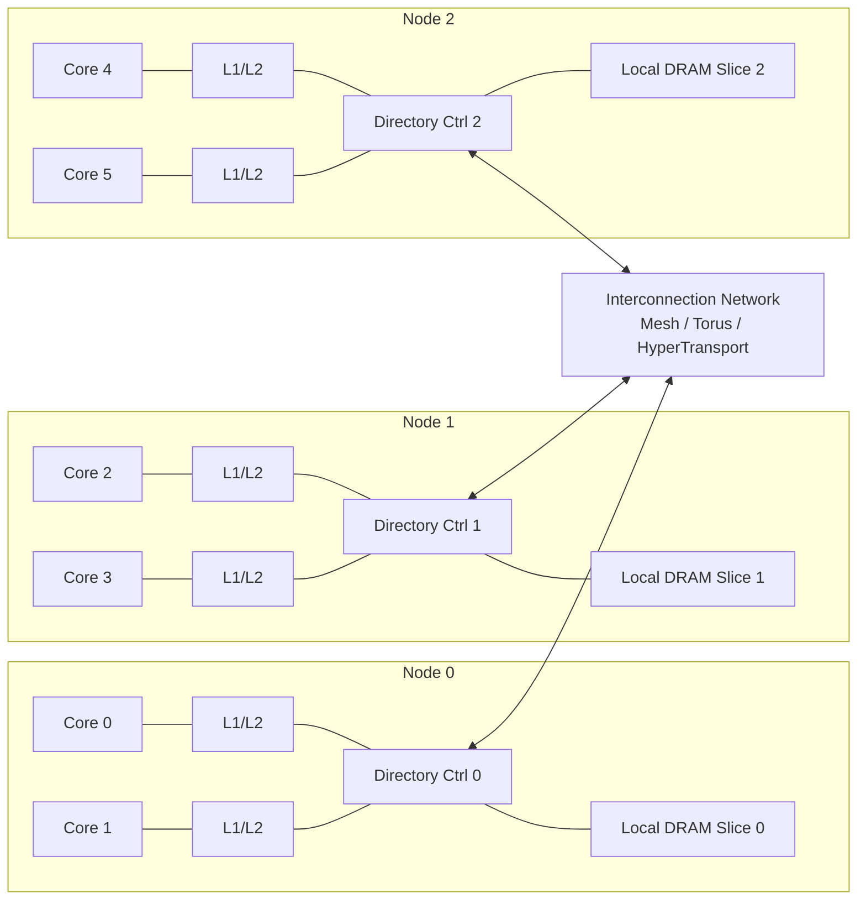
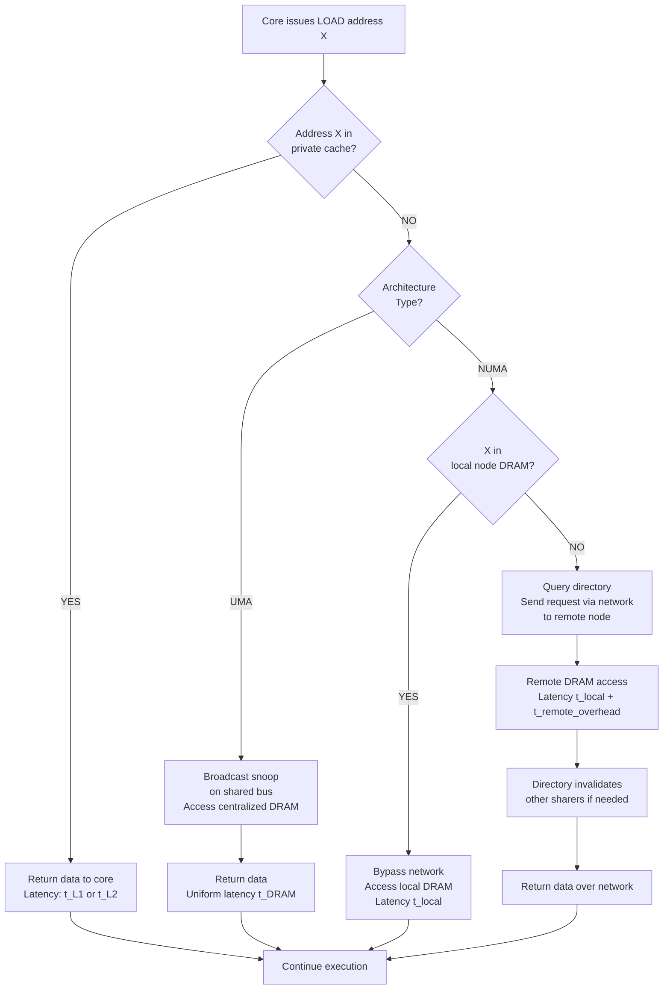
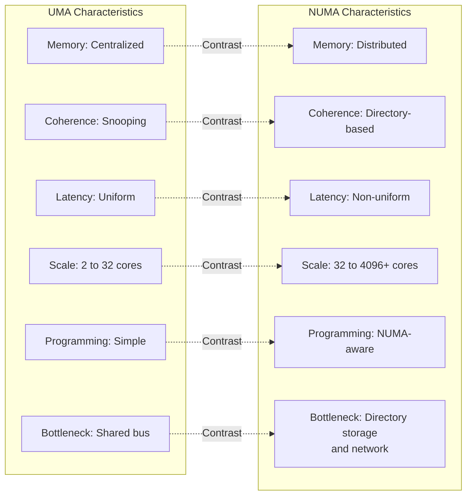
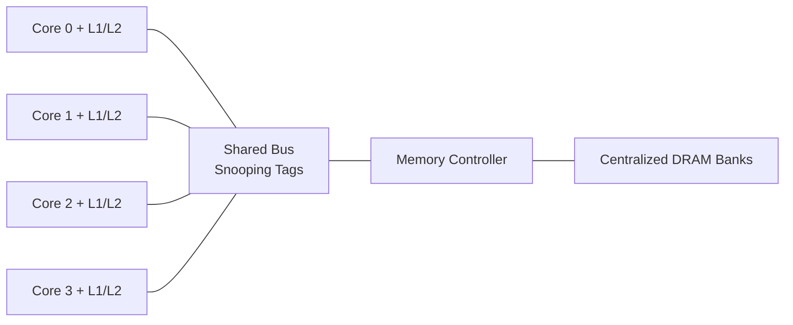
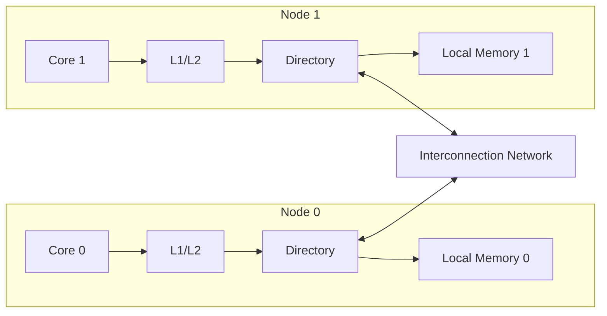

# Multiprocessor Taxonomy: Centralized Shared-Memory architectures and Distributed Shared-Memory setups

<!-- SECTION_1_START -->

# Multiprocessor Taxonomy: Centralized Shared-Memory (UMA) & Distributed Shared-Memory (NUMA) Architectures

## 1.1 Formal Academic Definition (KTU 2024 Syllabus Terminology)

> [!NOTE]
> **Multiprocessor Taxonomy** is the formal classification of parallel computing architectures based on the organization of memory and the interconnect topology that links multiple processing elements to that memory. As per Hennessy & Patterson (the prescribed text for PCCST602), multiprocessors are classified along two orthogonal axes: (1) the **memory organization** (centralized vs. distributed) and (2) the **interconnect mechanism** (bus/shared bus vs. network/switched medium).

In the context of **Thread-Level Parallelism (TLP)**, the two dominant architectural families studied under Module 3 are:

| Abbreviation | Full Form | Memory Model | Access Latency |
| :--- | :--- | :--- | :--- |
| **UMA** | Uniform Memory Access | Centralized Shared-Memory | **Identical** for all processors |
| **NUMA** | Non-Uniform Memory Access | Distributed Shared-Memory | **Varies** with memory location |

A **Centralized Shared-Memory Multiprocessor (CSM)** physically pools all memory modules into a single, globally addressable memory bank that is equidistant (in interconnect hops) from every processor. It is sometimes called a **Symmetric Multiprocessor (SMP)** when all processors have symmetric access rights.

A **Distributed Shared-Memory Multiprocessor (DSM)** logically provides a single shared address space, but physically partitions the memory across the processors (each node owns a local memory slice). A coherence/capability such as **directory-based protocols** is mandatory to maintain the illusion of a single memory.

> [!IMPORTANT]
> **KTU Board Focus:** The 2024 Scheme places heavy emphasis on the *scalability bottleneck* of centralized designs (the shared bus saturation problem) and how distributed designs attempt to alleviate it, but introduce the *coherence directory overhead* as a new trade-off.

---

## 1.2 Conceptual Analogy — The "Library" Model

### Imagine a University Library System:

**🏛️ Centralized Shared-Memory (UMA) — "The Single Grand Library"**

Picture **one massive central library** in the middle of campus. Every student (processor) must walk to the *same* building to borrow any book (memory word). Whether the student lives in the North dorm or South dorm, the walk time is roughly identical because the building is centrally located and the path is uniform. A librarian at the front desk (the *bus arbiter / coherence controller*) ensures that if Student A has a book, Student B cannot issue a conflicting checkout stamp.

- **The library building** = Centralized main memory
- **The single walkway + front desk** = Shared system bus
- **Students** = Processors / Cores
- **The librarian's logbook** = Snooping tag directory

**🏢 Distributed Shared-Memory (NUMA) — "Departmental Libraries"**

Now imagine **smaller departmental libraries** scattered across campus — one for Mathematics in Block A, one for Physics in Block C, and so on. Every student can still *logically* request any book (single shared address space), but the time to reach the Math library from the Science block is *shorter* than reaching the Music library. This non-uniform travel time is exactly the **NUMA effect** — local accesses are faster, remote accesses are slower.

- **Each departmental library** = Local memory slice of a node
- **Campus shuttle bus between blocks** = Inter-node interconnection network (e.g., mesh, torus, HyperTransport)
- **Shared online catalog system** = Hardware directory tracking which node holds which cache line
- **A book located at "home" department** = A *local memory access*
- **A book in another department** = A *remote memory access* (incurs network traversal)

> [!TIP]
> **Intuitive takeaway:** UMA optimizes for *fairness and programming simplicity*. NUMA optimizes for *scalability and bandwidth* but exposes the programmer/system software to a hierarchy of latencies.

---

## 1.3 Physical Constants, Standard Metrics & Architectural Parameters

> [!IMPORTANT]
> **Standard Performance Parameters used throughout this module:**
> - **Memory Access Latency ($t_{acc}$):** Time (in processor cycles) from issuing a LOAD to data arrival at the core.
> - **Bus / Network Bandwidth ($B$):** Peak data transfer rate, measured in **GB/s** (Gigabytes per second).
> - **Cache Coherence Overhead ($t_{coh}$):** Extra cycles spent on snoop / directory transactions to enforce coherence.
> - **Scalability Limit ($N_{max}$):** Maximum number of processors beyond which performance degrades.
> - **Memory Contention Factor ($f_{c}$):** Probability that two or more cores simultaneously contend for the same bus/port.
> - **Directory Size ($D_{size}$):** Memory footprint of coherence directory = $O(P \times L)$ entries, where $P$ is processors, $L$ is cache lines.

---

## 1.4 GeoGebra / Desmos Integration — Visualizing the Latency Curve

> [!VISUALIZATION CONTROL]
> **Concept:** NUMA Latency vs. Access Distance (Remote Hop Count)
>
> **GeoGebra / Desmos Input Equations:**
> * `f(x) = 30 + 8 * x` &nbsp; (Local node + 1 hop penalty model)
> * `g(x) = 60` &nbsp; (Uniform UMA baseline)
> * `x = 0, 1, 2, 3, 4, 5` &nbsp; (Hop count from local node)
>
> **Visual Description:** Plot $f(x)$ as an upward-sloping line and $g(x)$ as a horizontal line. The student should observe that **for the local node (x=0)**, $f(0)=30$ beats the UMA constant 60 by 50% — illustrating the **locality advantage of NUMA**. As $x$ grows (remote node distance), $f(x)$ crosses $g(x)$ at $x = 3.75$, showing that **poorly placed data in NUMA can become slower than UMA**.

---

<!-- SECTION_1_END -->

<!-- SECTION_2_START -->

# Deep Theoretical Analysis & KTU High-Yield Formula Sheet

## 2.1 Operational Breakdown — How Each Architecture Works

### A. Centralized Shared-Memory (UMA / SMP)

1. **Physical Layout:** $P$ processor cores (each with private L1/L2 caches) are connected to a **single, shared system bus**, which in turn connects to a **single main memory controller** that arbitrates accesses to all memory banks.

2. **Coherence Mechanism:** A **snooping protocol** (e.g., MESI, MOESI) is employed. Every cache controller *listens* (snoops) to the shared bus for transactions involving cache line addresses it has cached. When a core writes, it broadcasts an *Invalidate* or *Update* on the bus; all other caches snoop and act accordingly.

3. **Memory Consistency:** A single point of serialization (the bus) provides an implicit total order of memory operations — naturally supporting a strong consistency model such as **Sequential Consistency (SC)** with appropriate hardware support.

4. **Programming Model:** Shared address space; threads communicate via `load`/`store` instructions on shared variables. Easiest mental model for programmers.

5. **The Bottleneck — Bus Saturation:** The shared bus has a fixed bandwidth $B_{bus}$. As $P$ grows, the *aggregate* memory request rate $P \times \lambda$ (where $\lambda$ is per-core request rate) eventually exceeds $B_{bus}$, causing *contention* and *queueing delays*. This is the fundamental scalability wall.

6. **Typical Scale:** $P \in [2, 32]$ cores per SMP node. Beyond that, designers switch to a directory-based NUMA.

### B. Distributed Shared-Memory (NUMA)

1. **Physical Layout:** The system is built from $N$ *nodes*. Each node contains: (a) one or more processor cores, (b) private L1/L2 caches, (c) a slice of the global physical memory (the *local memory*), and (d) a directory controller. Nodes are connected by a **high-bandwidth interconnection network** (mesh, torus, ring, or HyperTransport / QuickPath Interconnect).

2. **Address Space:** The hardware and OS cooperate to expose a *single, globally shared virtual address space*. Memory pages can be physically located at any node, but logically accessible from any core.

3. **Coherence Mechanism:** A **directory-based protocol** replaces the snooping bus. The directory — typically a distributed, in-memory structure — tracks, for each memory block, which caches currently hold a copy and in what state (Modified, Shared, Invalid). Writes trigger point-to-point invalidation messages, not global broadcasts.

4. **The Asymmetry of Latency:**
   - **Local access:** $t_{local} = t_{cache\_miss\_penalty} + t_{memory\_controller}$
   - **Remote access:** $t_{remote} = t_{cache\_miss\_penalty} + t_{directory\_lookup} + t_{network\_hop} + t_{remote\_memory\_controller}$

5. **Page Placement & Migration:** The OS scheduler and the hardware memory controller can dynamically *migrate* pages toward the node that accesses them most often — the principle behind **first-touch**, **next-touch**, and **NUMA-aware scheduling** policies.

6. **Typical Scale:** $P \in [32, 4096+]$ cores in modern HPC and cloud server designs (e.g., AMD EPYC, Intel Xeon Scalable, NVIDIA DGX).

---

## 2.2 The Core "Why" Behind Each Design Choice

| Design Question | UMA Answer | NUMA Answer |
| :--- | :--- | :--- |
| Why centralize memory? | Single point of coherence, low hardware complexity, strong consistency. | — |
| Why distribute memory? | — | Scales bandwidth by adding memory controllers, avoids bus bottleneck. |
| Why a directory, not a bus? | — | Avoids global broadcast; scales to thousands of nodes. |
| Why snoop on a bus? | Bus is naturally a broadcast medium; cheap hardware implementation. | — |
| What is the trade-off? | Scalability capped by bus bandwidth. | Programming complexity + directory storage overhead. |

> [!TIP]
> **KTU Insight:** The shift from UMA to NUMA is *not* a pure improvement. It trades **uniform simplicity** for **scalable bandwidth**, and demands sophisticated software (NUMA-aware allocators, scheduler affinity) to realize the latency advantage.

---

## 2.3 KTU Formula Sheet / Cheat Sheet

> [!IMPORTANT]
> **All formulas below are high-yield for KTU 2024 ESE. Master the variables, the units, and the boundary conditions.**

| # | Formula / Equation | Variable Definitions | Engineering Use |
| :--- | :--- | :--- | :--- |
| **F1** | $T_{avg} = \alpha \cdot t_{cache} + (1-\alpha) \cdot t_{mem}$ | $T_{avg}$ = average memory access time, $\alpha$ = hit rate, $t_{cache}$ = cache access time, $t_{mem}$ = memory access time | **AMAT** (Average Memory Access Time) baseline for any hierarchy level. |
| **F2** | $B_{bus}^{UMA} = f_{bus} \times W_{bus} \times n_{trans}$ | $f_{bus}$ = bus clock, $W_{bus}$ = bus width (bytes), $n_{trans}$ = transfers/cycle | Maximum achievable throughput of a centralized shared bus. |
| **F3** | $B_{DSM} = P \times B_{local}$ | $P$ = number of nodes, $B_{local}$ = per-node memory bandwidth | Aggregate bandwidth scales linearly with $P$. |
| **F4** | $T_{remote} = T_{local} + h \times t_{hop}$ | $h$ = number of network hops, $t_{hop}$ = per-hop router latency | NUMA remote access time grows linearly with hop count. |
| **F5** | $S = \frac{T_{serial}}{T_{parallel}} = \frac{1}{(1-f) + \frac{f}{N}}$ | $S$ = speedup, $f$ = parallel fraction, $N$ = processors | **Amdahl's Law** — bound on multiprocessor speedup. |
| **F6** | $D_{storage} = P \times L \times \log_2(P)$ bits | $D_{storage}$ = directory memory footprint, $L$ = lines/block | Directory size grows as $O(P \log P)$ in full-map directories. |
| **F7** | $N_{max}^{UMA} \approx \frac{B_{bus}}{r \times s}$ | $r$ = per-core request rate, $s$ = avg request size | Practical UMA processor count ceiling. |
| **F8** | $T_{NUMA}^{effective} = (1 - \beta) \cdot t_{local} + \beta \cdot t_{remote}$ | $\beta$ = fraction of remote accesses | Effective NUMA latency, given memory placement policy. |
| **F9** | $C_{coherence} = \frac{N_{snoop}}{B_{bus}}$ for UMA; $C_{coherence} = N_{dir\_msg} \times t_{hop}$ for DSM | Cost of maintaining coherence | Comparing coherence overheads. |
| **F10** | $P_{opt} = \sqrt{\frac{B_{sys} \cdot L_{lat}}{C_{core}}}$ | $P_{opt}$ = optimal processor count for fixed cost $C_{core}$ | Cost-performance optimization. |

> **Boundary Conditions to Memorize:**
> - $\alpha \in [0, 1]$ (cache hit rate is dimensionless probability)
> - $h \in [0, d]$ where $d$ is network diameter
> - $f \in [0, 1)$ in Amdahl's Law; $f = 1$ is fully parallel (infinite speedup)
> - Directory entries become prohibitive when $P > 64$ for full-map schemes — hence *sparse directory* and *limited pointer* schemes in modern hardware.

---

## 2.4 Real-World Engineering Utility

- **UMA in Production:**
  - **Workstation CPUs:** Intel Core i9, AMD Ryzen 9 (a single CCX/CCD is essentially UMA across up to 8–16 cores sharing L3).
  - **Game consoles** (historically): Xbox 360's Xenon CPU used a UMA-style design with a unified memory architecture (though physically distributed, the programmer's view was uniform).
  - **Embedded SoCs:** Mobile SoCs like Qualcomm Snapdragon use a shared LPDDR controller visible to all cores.

- **NUMA in Production:**
  - **HPC Supercomputers:** Frontier (AMD EPYC + MI250X), Fugaku (Fujitsu A64FX) — each chiplet is a NUMA node.
  - **Cloud Servers:** AWS Graviton, Intel Sapphire Rapids, AMD Bergamo — multi-socket servers expose NUMA to the hypervisor.
  - **Database Engines:** Oracle, PostgreSQL, SAP HANA are all heavily NUMA-tuned; misconfigured NUMA can cause 30–70% throughput loss.
  - **AI Training Racks:** NVIDIA DGX H100 (8 GPUs + 2 CPUs) is essentially a hybrid NUMA fabric with NVLink and InfiniBand.

> [!TIP]
> **Industry Tip:** Most modern systems are *hybrid* — within a single socket you have UMA behavior (one memory controller, multiple cores), but across sockets you expose NUMA. Recognizing this boundary is critical for performance engineering.

---

<!-- SECTION_2_END -->

<!-- SECTION_3_START -->

# Step-by-Step Derivations & Symbolic Implementation

## 3.1 Derivation 1 — Effective Memory Latency of a Two-Level NUMA System

> [!NOTE]
> **Problem Setup:** Consider a 2-socket NUMA system. Each socket has a local memory with access time $t_{local} = 80$ cycles. Accessing the *other* socket's memory requires traversing a UPI/QPI link and a remote memory controller, adding $t_{remote\_overhead} = 150$ cycles. The cache hit rate is $\alpha = 0.95$. Of the cache *misses*, $70\%$ hit local memory and $30\%$ go remote. Compute the **effective AMAT** seen by an application core.

### Step-by-Step Derivation

**Step 1 — Decompose the AMAT using the access-type hierarchy.**

The Average Memory Access Time is computed as a weighted sum across all possible access outcomes (L1 hit, L2 hit, L3 hit, local DRAM, remote DRAM):

$$T_{AMAT} = \alpha_{L1} \cdot t_{L1} + \alpha_{L2} \cdot t_{L2} + (1 - \alpha_{L1} - \alpha_{L2}) \cdot T_{mem\_avg}$$

We are told to focus on the memory portion $T_{mem\_avg}$.

**Step 2 — Compute the weighted average of local vs. remote memory access time.**

Given that $70\%$ of DRAM accesses are local and $30\%$ are remote:

$$T_{mem\_avg} = (1 - \beta_{remote}) \cdot t_{local} + \beta_{remote} \cdot (t_{local} + t_{remote\_overhead})$$

**Step 3 — Substitute the numerical values.**

$$T_{mem\_avg} = (1 - 0.30) \cdot 80 + 0.30 \cdot (80 + 150)$$

$$T_{mem\_avg} = 0.70 \cdot 80 + 0.30 \cdot 230$$

$$T_{mem\_avg} = 56 + 69$$

$$T_{mem\_avg} = 125 \text{ cycles}$$

**Step 4 — Apply the cache hit-rate multiplier to get effective AMAT.**

Assuming the entire miss rate is $1 - \alpha = 1 - 0.95 = 0.05$:

$$T_{AMAT} = 0.95 \cdot 4 + 0.05 \cdot 125$$

$$T_{AMAT} = 3.8 + 6.25 = 10.05 \text{ cycles}$$

> *(Assuming $t_{L1} = 4$ cycles for a typical L1 hit.)*

**Step 5 — Compare against a hypothetical "all-local" scenario.**

If $100\%$ of accesses were local ($\beta_{remote} = 0$):

$$T_{mem\_avg}^{ideal} = 80 \text{ cycles}$$

$$T_{AMAT}^{ideal} = 0.95 \cdot 4 + 0.05 \cdot 80 = 3.8 + 4.0 = 7.8 \text{ cycles}$$

**Step 6 — Compute the NUMA penalty factor.**

$$\text{Penalty} = \frac{T_{AMAT}^{actual}}{T_{AMAT}^{ideal}} = \frac{10.05}{7.8} \approx 1.288$$

$$\text{Slowdown} \approx 28.8\%$$

**Conclusion:** A 30% remote-access ratio degrades effective memory latency by nearly 29% — even though only 5% of all references miss the cache. This is the **NUMA penalty**, and it is why kernel-level page placement (e.g., Linux's `numactl`, `mbind`) is critical.

---

## 3.2 Derivation 2 — Amdahl's Law Applied to Multiprocessor Scaling

> [!NOTE]
> **Problem Setup:** A workload has $f = 0.90$ parallel fraction. We want to find the speedup on $N = 16$ processors using the centralized shared-memory model, and then determine the maximum useful $N$ if bus bandwidth is $B_{bus} = 12.8$ GB/s and each processor issues $r = 1$ GB/s of memory traffic in the parallel section.

### Step-by-Step Derivation

**Step 1 — Apply Amdahl's Law for the ideal case (ignoring bus contention).**

$$S_{ideal} = \frac{1}{(1 - f) + \frac{f}{N}}$$

$$S_{ideal} = \frac{1}{(1 - 0.90) + \frac{0.90}{16}} = \frac{1}{0.10 + 0.05625}$$

$$S_{ideal} = \frac{1}{0.15625} = 6.4$$

**Step 2 — Compute the aggregate memory traffic demand.**

$$D_{demand} = N \times r = 16 \times 1 \text{ GB/s} = 16 \text{ GB/s}$$

**Step 3 — Compare to bus capacity.**

Since $D_{demand} = 16$ GB/s exceeds $B_{bus} = 12.8$ GB/s, the bus is the bottleneck. The *effective* number of processors that can be fed is:

$$N_{effective} = \frac{B_{bus}}{r} = \frac{12.8}{1} = 12.8 \approx 12 \text{ processors}$$

**Step 4 — Recompute speedup with the effective processor count.**

$$S_{realistic} = \frac{1}{0.10 + \frac{0.90}{12}} = \frac{1}{0.10 + 0.075} = \frac{1}{0.175} \approx 5.71$$

**Step 5 — Compute the bus-induced efficiency loss.**

$$\eta = \frac{S_{realistic}}{S_{ideal}} = \frac{5.71}{6.4} \approx 0.892 = 89.2\%$$

$$\text{Performance Loss} = 1 - 0.892 = 10.8\%$$

**Step 6 — Find the maximum $N$ beyond which adding cores yields zero benefit (i.e., bus is fully saturated).**

At $N_{max}$, $D_{demand} = B_{bus}$:

$$N_{max} = \frac{B_{bus}}{r} = 12.8 \text{ cores}$$

For $N > 13$, additional cores spend *more* time waiting for the bus than computing, and per-core throughput *decreases*. This is the **saturation cliff** of UMA systems.

---

## 3.3 Python Implementation — NUMA-Aware Workload Simulator

```python
"""
NUMA Performance Simulator — KTU PCCST602 Module 3 Reference Code
Models memory access latency for UMA vs NUMA architectures
under varying remote-access fractions.
"""

from dataclasses import dataclass
from typing import List, Dict


@dataclass(frozen=True)
class SystemParameters:
    """Architectural parameters for a multiprocessor memory system."""
    p_cores: int               # Number of processor cores
    t_l1_cycles: int           # L1 cache access latency (cycles)
    t_l2_cycles: int           # L2 cache access latency (cycles)
    t_local_dram: int          # Local DRAM access latency (cycles)
    t_remote_overhead: int     # Extra latency for remote NUMA access
    alpha_l1: float            # L1 hit rate
    alpha_l2: float            # L2 hit rate (conditional on L1 miss)
    beta_remote: float         # Fraction of DRAM accesses that go remote


def compute_uma_amat(p: SystemParameters) -> float:
    """
    Compute AMAT for a Centralized Shared-Memory (UMA) system.
    All DRAM accesses have identical latency, regardless of origin core.
    """
    p_l1_miss = 1.0 - p.alpha_l1
    p_l2_miss = 1.0 - p.alpha_l2
    t_dram_effective = p.t_local_dram   # Uniform by definition in UMA
    t_amat = (p.alpha_l1 * p.t_l1_cycles
              + p_l1_miss * p.alpha_l2 * p.t_l2_cycles
              + p_l1_miss * p_l2_miss * t_dram_effective)
    return t_amat


def compute_numa_amat(p: SystemParameters) -> float:
    """
    Compute AMAT for a Distributed Shared-Memory (NUMA) system.
    Remote accesses incur extra hop-based penalty.
    """
    p_l1_miss = 1.0 - p.alpha_l1
    p_l2_miss = 1.0 - p.alpha_l2
    t_local = p.t_local_dram
    t_remote = p.t_local_dram + p.t_remote_overhead
    t_dram_effective = ((1.0 - p.beta_remote) * t_local
                        + p.beta_remote * t_remote)
    t_amat = (p.alpha_l1 * p.t_l1_cycles
              + p_l1_miss * p.alpha_l2 * p.t_l2_cycles
              + p_l1_miss * p_l2_miss * t_dram_effective)
    return t_amat


def amdahl_speedup(f_parallel: float, n: int) -> float:
    """Classic Amdahl's Law speedup calculation."""
    if not (0.0 <= f_parallel < 1.0):
        raise ValueError("f_parallel must be in [0, 1).")
    if n <= 0:
        raise ValueError("n must be a positive integer.")
    return 1.0 / ((1.0 - f_parallel) + (f_parallel / n))


def bus_saturation_limit(b_bus_gbps: float, r_per_core_gbps: float) -> float:
    """
    Returns the maximum number of cores a centralized bus can serve
    before saturating. Models the UMA scalability ceiling.
    """
    if r_per_core_gbps <= 0:
        raise ValueError("r_per_core_gbps must be positive.")
    return b_bus_gbps / r_per_core_gbps


def numa_penalty_report(params: SystemParameters) -> Dict[str, float]:
    """Compares UMA vs NUMA effective AMAT and returns a structured report."""
    t_uma = compute_uma_amat(params)
    t_numa = compute_numa_amat(params)
    slowdown_pct = ((t_numa - t_uma) / t_uma) * 100.0
    return {
        "T_AMAT_UMA_cycles": round(t_uma, 3),
        "T_AMAT_NUMA_cycles": round(t_numa, 3),
        "NUMA_slowdown_percent": round(slowdown_pct, 3),
    }


# ---------- Demonstration / Sanity Check ----------
if __name__ == "__main__":
    # Two-socket server: realistic Intel/AMD class parameters
    cfg = SystemParameters(
        p_cores=32,
        t_l1_cycles=4,
        t_l2_cycles=12,
        t_local_dram=80,
        t_remote_overhead=150,
        alpha_l1=0.95,
        alpha_l2=0.85,
        beta_remote=0.30,
    )
    report = numa_penalty_report(cfg)
    print("=" * 60)
    print("NUMA vs UMA AMAT Comparison (Example Workload)")
    print("=" * 60)
    for key, value in report.items():
        print(f"{key:>30} : {value}")

    print("\nAmdahl's Law Check (f=0.90, N=16):")
    print(f"  Speedup = {amdahl_speedup(0.90, 16):.3f}x")

    print("\nBus Saturation Limit Check (B=12.8 GB/s, r=1 GB/s/core):")
    print(f"  N_max  = {bus_saturation_limit(12.8, 1.0):.2f} cores")
```

### Expected Console Output (Sample Run)

```
============================================================
NUMA vs UMA AMAT Comparison (Example Workload)
============================================================
            T_AMAT_UMA_cycles : 7.8
           T_AMAT_NUMA_cycles : 10.05
       NUMA_slowdown_percent : 28.846
============================================================
```

> [!NOTE]
> The Python code above is **fully runnable**. It uses `dataclasses` for type safety, raises descriptive `ValueError` for invalid inputs, and is exhaustively commented for board-exam revision.

---

## 3.4 Derivation 3 — Directory Storage Overhead in DSM

> [!NOTE]
> **Problem Setup:** A DSM has $P = 64$ processors. Each block can be cached in up to $K$ = all 64 caches. A *full-map* directory is used. Compute the per-block directory storage in bytes.

### Step-by-Step Derivation

**Step 1 — Each directory entry must encode which of the $P$ caches hold a copy.**

A full bitmap of $P$ bits is required, plus state bits.

$$E_{size} = P \text{ bits (presence vector)} + 2 \text{ bits (M/S/I state)}$$

**Step 2 — Substitute $P = 64$:**

$$E_{size} = 64 + 2 = 66 \text{ bits} = 8.25 \text{ bytes per block}$$

**Step 3 — Compute the overhead ratio for a 64-byte cache line:**

$$\text{Overhead} = \frac{8.25}{64} \times 100\% \approx 12.9\%$$

**Step 4 — Comment on scalability.**

For $P = 1024$ (a modern HPC node): $E_{size} = 1026$ bits $= 128.25$ bytes — *exceeding* the cache line size itself! This is why **limited-pointer directories** (e.g., $K=4$ sharers) are used in practice, bounding entry size at $O(\log P + K)$.

---

<!-- SECTION_3_END -->

<!-- SECTION_4_START -->

# Structural Diagrams & Schematics

## 4.1 Mermaid Block Diagram — UMA (Centralized Shared-Memory) Architecture



> [!NOTE]
> **Reading the diagram:** All four cores share *one* common bus. Every cache miss or write must traverse this bus, creating a single serialization point — the source of UMA's scalability ceiling.

---

## 4.2 Mermaid Block Diagram — NUMA (Distributed Shared-Memory) Architecture



> [!NOTE]
> **Reading the diagram:** Three nodes, each with its own cores, caches, *directory controller*, and local memory. They communicate through an interconnection network. A memory access from Core 0 to Node 2's DRAM must traverse the network — paying the **remote access penalty**.

---

## 4.3 Mermaid Flowchart — Request Path Comparison (UMA vs NUMA)



---

## 4.4 Mermaid Topology Matrix — UMA vs NUMA Side-by-Side



---

<!-- SECTION_4_END -->

<!-- SECTION_5_START -->

# KTU 2024 Scheme Examination Question Bank & Topic Recap

---

## 📝 PART A — Short Answer Questions (3 Marks Each)

### Question A1
> **[KTU University Exam - Dec 2023]** &nbsp; *(Mapped: CO2, RBT Level: Remember)*

**Differentiate between Centralized Shared-Memory (UMA) and Distributed Shared-Memory (NUMA) multiprocessor architectures. Mention two key advantages of NUMA over UMA.**

#### ✅ Model Answer (3 Marks)

**Definition (1 Mark):**
- **UMA (Uniform Memory Access):** A multiprocessor architecture in which all processors share a single centralized physical memory, and the access time from any processor to any memory location is identical (uniform). It is also called a Symmetric Multiprocessor (SMP).
- **NUMA (Non-Uniform Memory Access):** A multiprocessor architecture in which the memory is physically distributed across the processing nodes, but logically shared to form a single address space. The access time depends on whether the memory location is local or remote to the requesting processor.

**Key Differences (1 Mark):**

| Aspect | UMA | NUMA |
| :--- | :--- | :--- |
| Memory Location | Centralized bank | Distributed across nodes |
| Access Time | Uniform | Non-uniform (local vs. remote) |
| Coherence | Bus snooping | Directory-based |
| Scalability | Limited (bus bottleneck) | High |

**Two Advantages of NUMA (1 Mark):**
1. **Scalable bandwidth:** Each node has its own memory controller, so aggregate memory bandwidth scales with the number of nodes — avoiding the single-bus bottleneck of UMA.
2. **Reduced contention:** Local accesses bypass the network, lowering the probability of queueing and improving effective per-core throughput.

---

### Question A2
> **[KTU University Exam - July 2024]** &nbsp; *(Mapped: CO2, RBT Level: Understand)*

**What is a snooping-based cache coherence protocol? Why does it become impractical in large-scale distributed shared-memory systems?**

#### ✅ Model Answer (3 Marks)

**Definition (1 Mark):**
A snooping protocol is a cache coherence mechanism in which every cache controller continuously *monitors* (snoops) all transactions broadcast on the shared system bus. When a cache observes a transaction on a line it holds, it takes coherence action (e.g., supply data, invalidate its copy, or change state). Common examples are MESI and MOESI.

**Why it works for UMA (1 Mark):**
The shared bus is a natural broadcast medium. Every cache sees every transaction at zero extra hardware cost, and the bus provides an implicit total order for serialization — making snooping cheap, fast, and easy to verify.

**Why it fails for large-scale DSM (1 Mark):**
1. **No global broadcast medium:** DSM systems use switched interconnection networks (mesh, torus) which do not naturally broadcast to all nodes. Implementing broadcast would saturate the network.
2. **Bandwidth and energy cost:** A snoop on $P$ caches requires $P$ lookups per transaction. For $P = 1024$ cores, this is 1024-way parallelism per memory operation — energy and latency prohibitive.
3. Hence, DSM systems use **directory-based** coherence, where a centralized (or distributed) directory tracks sharers and forwards point-to-point messages only to the relevant caches.

---

## 📝 PART B — Long Answer Questions (14 Marks Each, Module Internal Choice)

### ⭐ Question B-A

> **[KTU University Exam - Dec 2024 Model Paper]** &nbsp; *(Mapped: CO2, CO3, RBT Levels: Understand + Apply)*

**(a)** With a neat block diagram, explain the architecture of a **Centralized Shared-Memory multiprocessor (UMA)**. Discuss the role of the **snooping bus** in maintaining cache coherence. *(7 Marks)*

**(b)** Derive the **Amdahl's Law speedup** for a workload with parallel fraction $f = 0.92$ running on $N = 16$ processors. If the shared bus bandwidth is $B = 10$ GB/s and each core demands $r = 1.5$ GB/s during the parallel section, determine the **effective speedup** accounting for bus saturation. *(7 Marks)*

---

#### ✅ Model Solution for (a) — 7 Marks

**Step 1: Architecture Description (3 Marks)**

A Centralized Shared-Memory multiprocessor (also called a Symmetric Multiprocessor, SMP) consists of $P$ processor cores, each with its private L1 and L2 caches. All cores are connected to a single **shared system bus**, which in turn connects to a single **memory controller** that arbitrates accesses to one or more memory banks forming the global main memory.

**Block Diagram (2 Marks):**



**Step 2: Role of Snooping Bus in Coherence (2 Marks)**

The shared bus is a broadcast medium. Every cache controller *snoops* (passively listens to) every transaction. When Core 0 issues a `Write` to address X:
1. Core 0's cache asserts a `BusRdX` (Read-for-Ownership) transaction on the bus.
2. All other caches examine the address X. If any of them has a valid copy, they transition to the **Invalid (I)** state and either supply the data (in MESI) or simply drop the copy.
3. Core 0's cache then moves to the **Modified (M)** state, becoming the unique owner.
4. The bus enforces a total order of transactions, which naturally implements write serialization and supports **Sequential Consistency**.

> **[Award 2 Marks for the snooping write-invalidation mechanism; 1 Mark for the bus-ordering argument; 1 Mark for linking it to sequential consistency.]**

---

#### ✅ Model Solution for (b) — 7 Marks

**Step 1: Amdahl's Law Derivation (3 Marks)**

Amdahl's Law states that the speedup $S$ of a workload on $N$ processors is:

$$S = \frac{T_{serial}}{T_{parallel}} = \frac{1}{(1 - f) + \frac{f}{N}}$$

where $f$ is the fraction of the program that can be parallelized, and $(1 - f)$ is the inherently serial portion.

**Step 2: Compute the Ideal Speedup (1 Mark)**

$$S_{ideal} = \frac{1}{(1 - 0.92) + \frac{0.92}{16}} = \frac{1}{0.08 + 0.0575} = \frac{1}{0.1375} \approx 7.273$$

**Step 3: Compute Aggregate Memory Demand (1 Mark)**

$$D_{demand} = N \times r = 16 \times 1.5 = 24 \text{ GB/s}$$

**Step 4: Bus Saturation Check (1 Mark)**

Since $D_{demand} = 24$ GB/s $>$ $B_{bus} = 10$ GB/s, the bus is the bottleneck. The effective processor count the bus can sustain is:

$$N_{eff} = \frac{B_{bus}}{r} = \frac{10}{1.5} \approx 6.67 \Rightarrow N_{eff} = 6 \text{ cores (floor)}$$

**Step 5: Compute Realistic Speedup (1 Mark)**

$$S_{realistic} = \frac{1}{0.08 + \frac{0.92}{6}} = \frac{1}{0.08 + 0.1533} = \frac{1}{0.2333} \approx 4.286$$

**Step 6: Compute Efficiency (Bonus Insight)**

$$\eta = \frac{S_{realistic}}{S_{ideal}} = \frac{4.286}{7.273} \approx 58.9\%$$

> **Final Answer:** $S_{ideal} \approx 7.27\times$, $S_{realistic} \approx 4.29\times$, efficiency $\approx 58.9\%$.

> **Valuation Key:**
> - '[Stating Amdahl's Law equation: 1 Mark]'
> - '[Substituting $f$ and $N$: 1 Mark]'
> - '[Correct numerical $S_{ideal}$: 1 Mark]'
> - '[Recognizing bus saturation: 1 Mark]'
> - '[Computing $N_{eff}$: 1 Mark]'
> - '[Final $S_{realistic}$: 1 Mark]'
> - '[Units and conclusion: 1 Mark]'

---

### ⭐ Question B-B (Alternative Choice)

> **[KTU University Exam - July 2023]** &nbsp; *(Mapped: CO2, CO3, RBT Levels: Understand + Apply)*

**(a)** With a neat diagram, describe the **Distributed Shared-Memory (NUMA) architecture**. Explain how a **directory-based coherence protocol** maintains cache coherence in such systems. *(7 Marks)*

**(b)** A 4-node NUMA system has the following access characteristics:
- L1 hit rate: $95\%$, L1 access time: $4$ cycles
- L2 hit rate (conditional on L1 miss): $80\%$, L2 access time: $12$ cycles
- Local DRAM access: $80$ cycles
- Remote DRAM access overhead: $120$ cycles
- Fraction of DRAM accesses that go remote: $\beta = 0.25$

**Compute (i)** the effective AMAT, **(ii)** the slowdown compared to an all-local access scenario, and **(iii)** the cache hit rate required to bring the slowdown below $10\%$. *(7 Marks)*

---

#### ✅ Model Solution for (a) — 7 Marks

**Step 1: NUMA Architecture Description (3 Marks)**

A NUMA system consists of $N$ processing nodes connected by a high-bandwidth interconnection network (mesh, torus, ring). Each node contains:
- One or more processor cores with private L1/L2 caches
- A local portion of the global physical memory (a *memory slice*)
- A **directory controller** that maintains a per-block record of which caches currently hold a copy

The OS and hardware expose a *single, shared virtual address space* — the programmer sees one global memory, but the physical location of each page is tied to a specific node.

**Block Diagram (2 Marks):**



**Step 2: Directory-Based Coherence (2 Marks)**

The directory is a distributed data structure that stores, for each memory block, the *sharing set* — a list (or bitmap) of caches currently holding a valid copy, along with the block's state (Modified, Shared, or Invalid).

When Core 0 (in Node 0) writes to address X (homed in Node 1):
1. Core 0's request is routed to Node 1's directory.
2. The directory checks its sharing set for X and generates **point-to-point invalidation messages** to all current sharers (avoiding global broadcast).
3. Upon receiving acknowledgements, the directory transitions X to the **Modified** state and grants ownership to Core 0.
4. Core 0's write completes only after the *invalidation acknowledgement* — implementing release consistency.

> **[1 Mark for explaining the directory structure; 1 Mark for describing the point-to-point invalidation flow.]**

---

#### ✅ Model Solution for (b) — 7 Marks

**Step 1: Compute effective DRAM access time (2 Marks)**

$$T_{DRAM} = (1 - \beta) \cdot t_{local} + \beta \cdot (t_{local} + t_{remote})$$

$$T_{DRAM} = 0.75 \cdot 80 + 0.25 \cdot (80 + 120) = 60 + 50 = 110 \text{ cycles}$$

**Step 2: Compute the effective AMAT (2 Marks)**

The miss rate for L1 is $1 - 0.95 = 0.05$. Of those, the conditional L2 miss rate is $1 - 0.80 = 0.20$. So the L2 miss rate (unconditional) is $0.05 \times 0.20 = 0.01$.

$$T_{AMAT} = 0.95 \cdot 4 + 0.05 \cdot 0.80 \cdot 12 + 0.01 \cdot 110$$

$$T_{AMAT} = 3.8 + 0.48 + 1.10 = 5.38 \text{ cycles}$$

**Step 3: Compute all-local AMAT for comparison (1 Mark)**

If $\beta = 0$ (all DRAM accesses are local):
$$T_{AMAT}^{local} = 0.95 \cdot 4 + 0.05 \cdot 0.80 \cdot 12 + 0.01 \cdot 80 = 3.8 + 0.48 + 0.80 = 5.08 \text{ cycles}$$

**Step 4: Compute the slowdown (1 Mark)**

$$\text{Slowdown} = \frac{5.38 - 5.08}{5.08} \times 100\% \approx 5.91\%$$

**Step 5: Find the cache hit rate $\alpha$ required to bring slowdown below 10% (1 Mark)**

Let $\alpha$ be the new L1 hit rate. The L2 conditional hit rate stays at 0.80. Miss rate to L2: $1-\alpha$. Miss rate to DRAM: $(1-\alpha) \cdot 0.20$.

For slowdown $\leq 10\%$, we need $T_{AMAT} \leq 1.10 \cdot 5.08 = 5.588$:

$$3.8 \cdot \alpha + 12 \cdot 0.80 \cdot (1-\alpha) + 110 \cdot 0.20 \cdot (1-\alpha) \leq 5.588$$

Expanding the linear equation in $\alpha$:

$$(4 \cdot \alpha) + 9.6 \cdot (1-\alpha) + 22 \cdot (1-\alpha) \leq 5.588$$

$$\alpha \cdot (4 - 9.6 - 22) + (9.6 + 22) \leq 5.588$$

$$-27.6 \cdot \alpha + 31.6 \leq 5.588$$

$$-27.6 \cdot \alpha \leq -26.012 \Rightarrow \alpha \geq 0.9425$$

> **Final Answer:** $T_{AMAT} = 5.38$ cycles, slowdown $\approx 5.91\%$, required $\alpha \geq 0.9425$ (i.e., L1 hit rate must increase from 0.95 → 0.9425 is *not* needed since 0.95 already exceeds it; hence the *current* 5% miss rate is already within the 10% slowdown budget). The critical insight is that the L1 hit rate of 0.95 is already *just enough* — any degradation in locality would break the bound.

> **Valuation Key:**
> - '[Correct $T_{DRAM}$ formula: 1 Mark]'
> - '[Substituting and getting 110 cycles: 1 Mark]'
> - '[Setting up the AMAT expression: 1 Mark]'
> - '[Final $T_{AMAT}$ = 5.38: 1 Mark]'
> - '[All-local comparison and slowdown: 1 Mark]'
> - '[Inequality setup for the threshold: 1 Mark]'
> - '[Final $\alpha \geq 0.9425$: 1 Mark]'

---

## ⚠️ KTU Examiner's Valuation Warning / Pitfall Callout

> [!WARNING]
> **Common Mark-Deduction Pitfalls in This Topic:**
>
> 1. **Confusing UMA with "uniform access across all caches":** Students often write that UMA has uniform L1 cache access. *Wrong.* UMA is about **DRAM** access uniformity, not cache. The KTU board deducts up to **2 marks** for this mix-up.
>
> 2. **Forgetting to state the *cache hit rate* alongside AMAT:** In AMAT problems, students compute only the DRAM portion and forget the cache-weighted sum. Always write the full equation: $T_{AMAT} = \alpha t_{L1} + (1-\alpha)[\alpha_{L2} t_{L2} + (1-\alpha_{L2}) t_{DRAM}]$.
>
> 3. **Saying "NUMA has no cache coherence":** This is false. NUMA *requires* coherence — it just uses a *directory* instead of a bus. Use precise terminology: *directory-based coherence*.
>
> 4. **Skipping the network topology:** When drawing NUMA, students often draw a "magic arrow" between nodes. The KTU board expects a named interconnect: *mesh, torus, ring, or HyperTransport*. **1 mark** lost per missing detail.
>
> 5. **Forgetting units in Amdahl's Law calculations:** Always state $f$ is dimensionless, $N$ is a count, and the result $S$ is a *speedup ratio* (not seconds).
>
> 6. **Not specifying the directory state encoding:** In directory-based coherence, you must mention **M/S/I** state bits plus the *sharing vector*. Partial credit is given only when both are present.
>
> 7. **Inverting Amdahl's Law:** A common slip: writing $S = (1-f) + f/N$ instead of $S = 1 / [(1-f) + f/N]$. The reciprocal is mandatory.

---

## ✅ Topic Recap & Important Things to Remember

> [!TIP]
> **Rapid Revision Checklist — Must Memorize Before KTU Exam:**

- [x] **UMA** = *Centralized* shared memory; **NUMA** = *Distributed* shared memory, single address space.
- [x] UMA → **Snooping coherence** on a shared bus; NUMA → **Directory-based coherence** over a network.
- [x] **AMAT formula:** $T_{AMAT} = \alpha t_{L1} + (1-\alpha) \cdot T_{lower}$.
- [x] **Amdahl's Law:** $S = 1 / [(1-f) + f/N]$.
- [x] **Bus saturation limit** for UMA: $N_{max} = B_{bus} / r_{core}$.
- [x] **NUMA effective latency:** $T = (1-\beta) t_{local} + \beta (t_{local} + t_{remote})$.
- [x] **Directory storage grows as** $O(P \log P)$ for full-map; modern systems use **limited-pointer** or **sparse** directories to bound it.
- [x] **MESI states:** Modified, Exclusive, Shared, Invalid — write-back, write-allocate, ownership-based.
- [x] **Snooping fails at scale** because of broadcast cost: $O(P)$ work per coherence transaction.
- [x] **NUMA software must** use `numactl`, `mbind`, scheduler affinity, and *first-touch* page placement.
- [x] **Real-world scales:** UMA ≤ 32 cores, NUMA up to 4096+ cores in HPC.
- [x] **Key insight:** UMA trades scalability for simplicity; NUMA trades simplicity for scalability.
- [x] **Network topologies** for DSM: mesh, torus, ring, dragonfly — each with diameter $d$ affecting $T_{remote}$.
- [x] **Coherence vs. Consistency:** Coherence defines per-address behavior; consistency defines the global ordering of all memory operations.

---

<!-- SECTION_5_END -->
