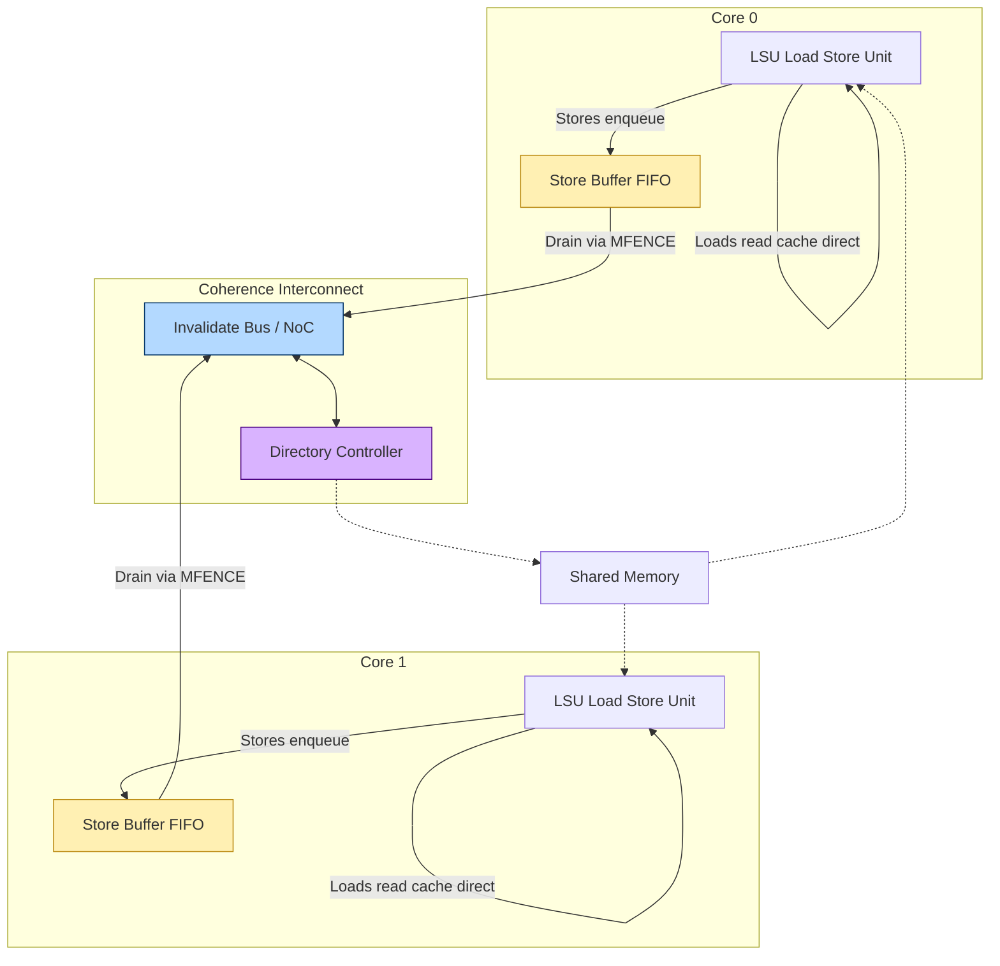
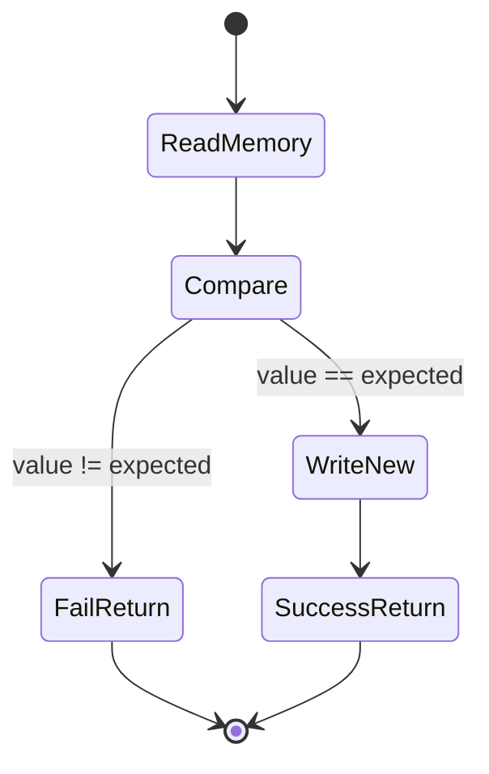
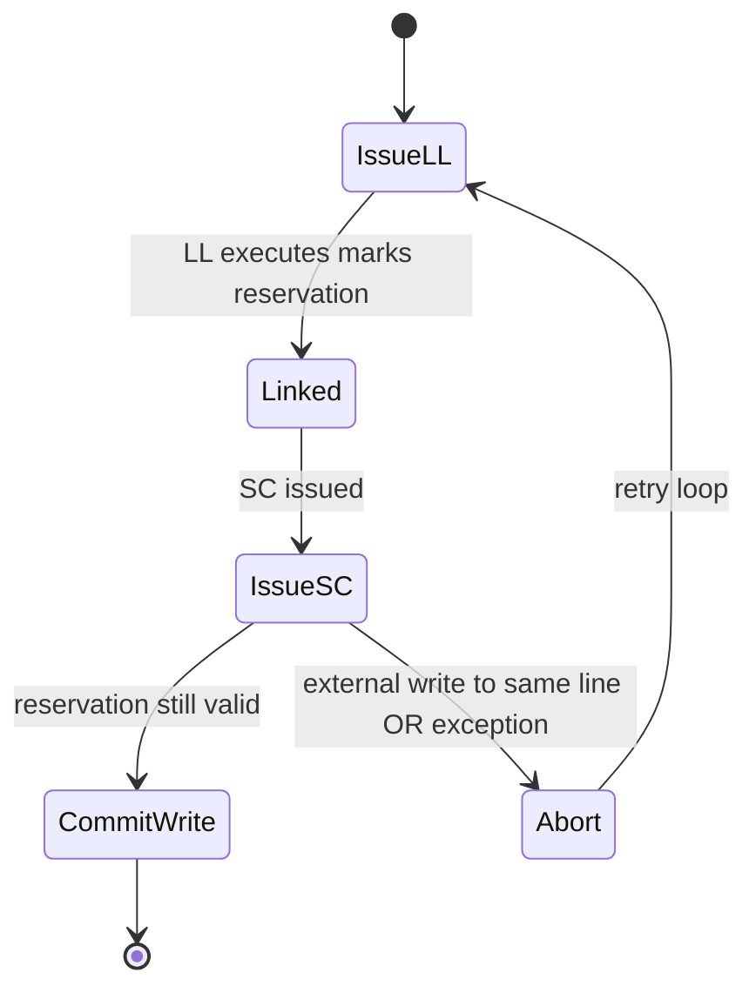
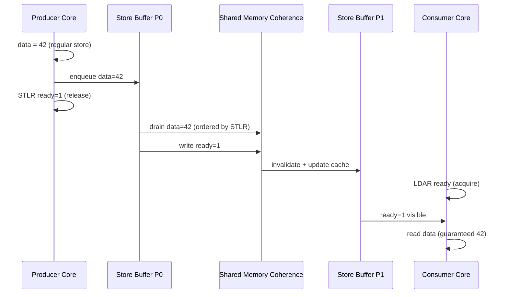
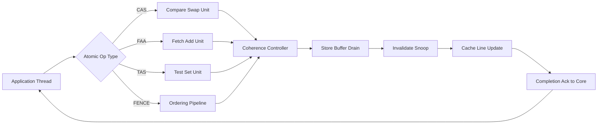
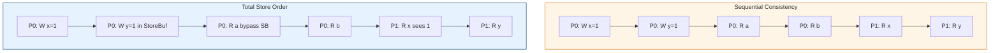

# Synchronization & Consistency: Hardware primitives for atomic memory operations, Memory Consistency models

<!-- SECTION_1_START -->
# Synchronization & Consistency in Multiprocessor Systems

## 1. Core Technical Definition & Intuitive Overview

### Formal Definition (KTU 2024 Syllabus Terminology)

**Synchronization** in shared-memory multiprocessor systems refers to the coordinated execution of concurrent threads such that the visibility and ordering of memory operations across different processors are guaranteed as required by the program logic. It is achieved using **hardware primitives for atomic memory operations** — indivisible read-modify-write instructions supported directly by the processor's load-store unit (LSU) and cache controller.

**Memory Consistency Model (MCM)** is the formal contract between the programmer and the hardware (and the compiler) that specifies *which interleavings and reorderings of memory operations issued by different processors are permitted observable to the system*. It is distinct from **Cache Coherence**, which only ensures that *individual memory locations* appear to have a single, globally consistent value at any instant — not that operations are ordered.

> [!IMPORTANT]
> **Coherence ≠ Consistency**
> * **Coherence** answers: *"Does every processor see the latest value of a single memory location?"* (Per-location invariant)
> * **Consistency** answers: *"In what order does a processor see operations from ALL other processors?"* (Global ordering invariant)

### Conceptual Analogy / Intuition

Imagine a **group chat between 5 friends** deciding where to eat tonight. Each friend has a slightly delayed, out-of-order notification feed:

- **Cache Coherence** is like ensuring that if Alice says "Pizza!", every other friend eventually sees "Pizza!" in their chat (no one keeps the old "Sushi!" message).
- **Memory Consistency** is the rule that decides whether everyone *immediately* receives messages in the *exact order* Alice sent them, or whether they may arrive shuffled (e.g., you can read "I'll pay" before seeing "Pizza!").

A **strict model** (Sequential Consistency) is like a *group call* where everyone speaks one at a time in real-time. A **relaxed model** (Weak/TSO) is like a *chat thread* where messages can be reordered for speed.

### Hardware Atomic Primitives — Definitions

| Primitive | Operation | KTU-Critical Definition |
|---|---|---|
| **TAS** (Test-and-Set) | Atomically reads a memory word and sets it to 1, returning the old value. | Single-instruction lock acquisition. |
| **FAA** (Fetch-and-Add) | Atomically reads a value and adds a constant to it. | Lock-free counters, ticket locks. |
| **CAS** (Compare-and-Swap) | Atomically compares a memory location with an expected value; if equal, swaps it with a new value. Returns success/failure. | Foundation of lock-free data structures. |
| **LL/SC** (Load-Linked / Store-Conditional) | `LL` reads a word and "marks" it; `SC` writes only if no other processor has modified that word since the `LL`. | Portable atomic RMW; used in ARM, MIPS, RISC-V. |
| **MB / Fence** (Memory Barrier) | Hardware instruction preventing reordering of memory ops across the barrier. | Orders loads/stores; no data movement. |

> [!NOTE]
> **Why Hardware?** Software-only synchronization (e.g., disabling interrupts, Dekker's algorithm) does not work on modern multi-core systems because **compilers reorder instructions** and **store buffers reorder writes**, breaking naive flag-based protocols. Only **hardware-issued atomic instructions with memory-ordering semantics** can be observed correctly across all cores.

> [!VISUALIZATION CONTROL]
> **Concept:** Two-processor shared-variable race visualized on a timeline.
> **GeoGebra / Desmos Input Equations:**
> * `Processor_1: T1(flag=1), T2(read flag), T3(read data)`
> * `Processor_2: P1(write data=42), P2(write flag=1), P3(read flag)`
> **Visual Description:** Plot two parallel horizontal axes (one per core) with arrows representing memory operations; demonstrate how without a fence, P2 may observe `flag=1` *before* the corresponding `data=42` write becomes visible, causing a stale read.

### Physical Constants / Standard Metrics
- **L1 cache latency:** ~**1–4 cycles** (intra-core)
- **Cross-core latency (no coherence):** ~**20–70 cycles** depending on interconnect
- **MESI invalidation propagation:** ~**10–30 cycles**
- **Atomic RMW latency:** ~**2× to 5×** a normal load latency
- **Standard line size:** **64 bytes** (x86, ARM)

---

<!-- SECTION_1_END -->

<!-- SECTION_2_START -->
# 2. Deep Theoretical Analysis & KTU High-Yield Formula Sheet

## 2.1 Why Naive Synchronization Fails

Consider Dekker's algorithm on a 2-core system:
```
Initially: flag[0] = flag[1] = false; turn = 0
P0: flag[0] = true;
    if (flag[1]) { if (turn == 1) ... }
```
On a system with **write buffering** and **out-of-order execution**, P1 may read `flag[0] = false` even after P0 has executed `flag[0] = true`, because P0's store sits in P0's **store buffer** and has not yet propagated globally. The hardware must therefore expose primitives that include **ordering guarantees**.

## 2.2 Taxonomy of Atomic Hardware Primitives

### A. **Read-Modify-Write (RMW) Atomics**
These instructions atomically read, transform, and write back, all in a single transaction that is **indivisible with respect to other cores**.

#### 1. Test-and-Set (TAS)
$$M \leftarrow [addr]; \quad [addr] \leftarrow 1; \quad \text{return } M$$
**Use:** Simple spinlock (busy-wait lock).
**Cost:** Trashes the cache line under contention (every loser re-reads from memory).

#### 2. Fetch-and-Add (FAA)
$$old \leftarrow [addr]; \quad [addr] \leftarrow old + k; \quad \text{return } old$$
**Use:** Ticket locks, lock-free counters, work-stealing queues.
**Cost:** $O(1)$ per op but all waiters spin on the **same line** → cache-line bouncing.

#### 3. Compare-and-Swap (CAS)
$$\text{if } [addr] == \text{expected} :\ [addr] \leftarrow \text{new};\ \text{return SUCCESS}$$
$$\text{else} : \text{return FAILURE}$$
**Use:** Foundation of all lock-free structures (linked lists, hash tables, queues).
**Cost:** ABA problem can occur; usually solved via **double-width CAS** (pointer + version counter).

#### 4. Load-Linked / Store-Conditional (LL/SC)
$$LL: r \leftarrow [addr]; \quad \text{flag link}_{\text{addr}} \leftarrow \text{set}$$
$$SC: \text{if } link_{\text{addr}}\ \text{still valid} : [addr] \leftarrow r'; \text{return YES}$$
$$\text{else} : \text{return NO}$$
**Use:** Portable atomic RMW on RISC architectures (ARM `ldrex/strex`, MIPS, RISC-V `lr/sc`, PowerPC `lwarx/stwcx`).
**Cost:** SC may spuriously fail (on interrupt, context switch, or even other LL on same core), so it must be wrapped in a retry loop.

### B. **Ordering / Barrier Primitives**
Atomic RMWs *imply* ordering, but pure loads/stores need explicit **fences** to constrain reordering:

| Barrier Type | Order Enforced | Use Case |
|---|---|---|
| `MFENCE` (x86) | All loads before ≥ all stores after | x86 TSO — rarely needed because x86 is naturally strongly ordered |
| `SFENCE` (x86) | All stores before ≥ all stores after | Ensuring writes are visible before others (e.g., in flag release) |
| `LFENCE` (x86) | All loads before ≥ all loads after | Speculation barrier (Spectre mitigation) |
| `DMB` (ARM) | Domain-specific ordering | ARMv8 `LDAR`/`STLR` for acquire/release semantics |
| Power `hwsync` | Full fence | PowerPC ordering |

## 2.3 Memory Consistency Models — The Spectrum

A **Memory Consistency Model** $\mathcal{M}$ is defined as the set $\mathcal{P}$ of permissible global memory orderings $G$ such that for every program execution:
$$G \in \mathcal{P} \iff G\ \text{is consistent with}\ \mathcal{M}$$

| Model | Loads Reorder w.r.t. Loads? | Stores Reorder w.r.t. Stores? | Loads Reorder w.r.t. Earlier Stores? | Real Hardware |
|---|---|---|---|---|
| **Sequential Consistency (SC)** [Lamport 1979] | No | No | No | None (ideal) |
| **Total Store Order (TSO)** [Sparc] | No | No | **Yes** | x86 (approx.) |
| **Processor Consistency (PC)** | No | **Yes** | Yes | Older SPARC |
| **Partial Store Order (PSO)** | No | Yes | Yes | Older SPARC |
| **Release Consistency (RC)** / **Weak / ARMv8** | Yes | Yes | Yes | ARM, RISC-V, PowerPC |

### 2.3.1 Sequential Consistency (SC)
> *A multiprocessor is sequentially consistent if the result of any execution is the same as if the operations of all processors were executed in some sequential order, and the operations of each individual processor appear in this sequence in the order specified by its program.* — **Lamport, 1979**

**Implication:** Program order is preserved across all cores. No reordering, no speculation past a memory op.
**Cost:** Severe performance penalty (every load must check for invalidations; every store must stall until global acknowledgment).

### 2.3.2 Total Store Order (TSO) — x86 Model
- Stores go into a **per-core write/store buffer** (FIFO).
- Loads **bypass** the store buffer and read from the cache directly (allowing load→load and load→store reordering across the buffer).
- **Key property:** Stores appear in program order to all cores (via coherence invalidation + buffer drain).
- A `MFENCE` drains the store buffer before subsequent loads.

**x86 Memory Ordering Rules (Table for KTU):**
| 2nd Op → | Load | Store | RMW | Lock |
|---|---|---|---|---|
| **1st Op ↓** | | | | |
| Load | ✗ reorder | ✗ reorder | ✗ reorder | ✗ reorder |
| Store | **✓ may reorder** | ✗ reorder | ✗ reorder | ✗ reorder |
| RMW | ✗ reorder | ✗ reorder | ✗ reorder | ✗ reorder |

### 2.3.3 Acquire / Release Semantics (ARM, RISC-V)
* **`LDAR` (Load-Acquire):** All subsequent memory ops on this core must appear *after* this load.
* **`STLR` (Store-Release):** All prior memory ops on this core must appear *before* this store.
* `LDAR`/`STLR` pair = lightweight **critical section** in hardware.

This is the dominant modern model: **Release Consistency** or **Weak Consistency with Acquire/Release**.

### 2.3.4 Release Consistency (RC) — Formal
$$W \xrightarrow{\text{rel}} \phi \implies \forall R : R \xrightarrow{\text{acq}} \phi \Rightarrow R\ \text{observes}\ W$$
Informally: a *release store* by producer P must be observed by *acquire load* by consumer Q *together with* all writes that P made before the release.

## 2.4 KTU High-Yield Formula Sheet

| Concept | Equation / Rule | Notes |
|---|---|---|
| **SC Required Memory Orderings** | $4\times n$ per program (PO: W→R, R→R, W→W, R→W for each core) | Where $n$ = no. of cores |
| **Invalidation Latency (MESI)** | $t_{inv} = t_{bus\_snoop} + t_{ack} \approx 10\text{–}30$ cycles | Per coherence protocol |
| **TAS Lock Contention Cost** | $T_{TAS} = N \times t_{atomic} \times N_{cores}$ | N = lockers |
| **CAS Spurious Failure (LL/SC)** | $P_{fail} \approx 1 - e^{-\lambda t}$ | $\lambda$ = interference rate |
| **Weak Model Speedup over SC** | $S_{weak} \approx \frac{t_{SC} - t_{fence\_overhead}}{t_{SC}}$ | Typical: 2–5× on parallel code |
| **Cache-Line Bouncing Rate (RMW)** | $f_{bounce} = \frac{N_{cores}}{t_{line\_transfer}}$ | Limits scalability |
| **Acquire Barrier** | $\forall op\ \text{after LDAR} : op \geq_{vis}\ LDAR$ | x86: implicit in `MOV` from marked loc |
| **Release Barrier** | $\forall op\ \text{before STLR} : op \leq_{vis}\ STLR$ | x86: implicit in `MOV` to marked loc |
| **Write Buffer Drain** | $t_{drain} = \frac{Buffer\_Size \times Line\_Size}{BW_{mem}}$ | Critical for SFENCE perf |

## 2.5 Real-World Engineering Utility

- **Databases (PostgreSQL, MySQL):** Use atomic `compare_exchange` to implement latches and lock-free skip lists.
- **Operating Systems (Linux kernel):** `atomic_t`, `cmpxchg`, and `arch_xchg` for scheduler runqueues, RCU synchronization, refcounting.
- **High-Frequency Trading (HFT):** Strict TSO-like ordering for deterministic message→order latency.
- **GPU Computing (CUDA `__threadfence()`, OpenCL `mem_fence`):** Weak model with explicit fences; release/acquire across thread blocks.
- **Java `volatile` / C++ `std::atomic` / C11 `atomic_store_explicit`:** Language-level mappings to acquire/release/seq_cst.

---

<!-- SECTION_2_END -->

<!-- SECTION_3_START -->
# 3. Step-by-Step Derivations & Code/Symbolic Implementation

## 3.1 Derivation: Why Dekker's Algorithm Fails Without a Fence

We will show mathematically that on a TSO machine, Dekker's flag-based protocol can produce a violation.

Let the program be:
```
P0: data = 42;          // store to [data]
P0: flag[0] = 1;        // store to [flag[0]]
P1: while(flag[0] == 0) spin;   // load from [flag[0]]
P1: print(data);        // load from [data]
```

Assume P0's stores enter P0's **store buffer** in program order. P1 issues a load from `flag[0]`. On TSO, P1 can **bypass** its own store buffer but **not** P0's; it issues a snoop/invalidate request and may read the **stale** value if the cache line is in *Shared* state at P0.

**Possible execution (TOCTOU violation):**
$$
\begin{aligned}
\text{Step 1:} \quad & P_0: WB.push(\text{data} = 42) \\
\text{Step 2:} \quad & P_0: WB.push(\text{flag}[0] = 1) \\
\text{Step 3:} \quad & P_1: \text{spin reads } \text{flag}[0] = 0 \quad \text{(stale! P0's line not yet invalidated)} \\
\text{Step 4:} \quad & P_1: \text{read } \text{data} = 0 \quad \text{(garbage!)} \\
\text{Step 5:} \quad & P_0: \text{WB drains} \rightarrow \text{flag}[0]\ \text{finally}=1
\end{aligned}
$$

### Fix: SFENCE (Store Fence)
Adding `SFENCE` between the two stores forces the write buffer to drain:
$$
\text{flag}[0]=1\ \text{followed by SFENCE} \implies \text{data}=42\ \text{is visible globally before flag}[0]=1
$$

**Key takeaway:** A **store fence** orders prior stores before subsequent operations, eliminating the window of reordering.

## 3.2 Derivation: CAS-based Lock-Free Counter

**Goal:** Implement `counter.increment()` atomically using CAS, without spinlocks.

**Algorithm (pseudocode):**
```
function increment(counter):
    do:
        old = counter.load(relaxed)
        new = old + 1
    while not CAS(counter, old, new, relaxed)
```

**CAS Definition Recap:**
$$
CAS(addr, expected, desired) =
\begin{cases}
[addr] \leftarrow desired; & \text{return true} \quad \text{if } [addr] == \text{expected} \\
\text{return false} & \text{otherwise}
\end{cases}
$$

**Correctness Argument:**
- Suppose two threads T1, T2 concurrently read `old=5`.
- T1 executes `CAS(addr, 5, 6)` first: succeeds, $[addr]=6$.
- T2 executes `CAS(addr, 5, 6)`: fails because $[addr]=6 \neq 5$. T2 retries, reads $6$, computes $7$, retries CAS — succeeds.

**Progress:** Lock-free, but not wait-free (a thread may retry indefinitely under high contention).

## 3.3 Implementation: Spinlock Using TAS (x86)

```c
#include <stdatomic.h>
#include <stdbool.h>

typedef struct {
    atomic_int locked;   // 0 = free, 1 = held
} spinlock_t;

static inline void spinlock_init(spinlock_t *lk) {
    atomic_store_explicit(&lk->locked, 0, memory_order_relaxed);
}

static inline void spinlock_acquire(spinlock_t *lk) {
    int expected = 0;
    // Atomic Test-and-Set equivalent: keep trying until we win
    while (!atomic_compare_exchange_weak_explicit(
                &lk->locked,
                &expected,         // set to 0 each iteration
                1,
                memory_order_acquire,   // success: acquire semantics
                memory_order_relaxed))  // failure: just retry
    {
        expected = 0;  // reset for next attempt
    }
}

static inline void spinlock_release(spinlock_t *lk) {
    atomic_store_explicit(&lk->locked, 0, memory_order_release);
}
```

**Line-by-line notes:**
- `atomic_compare_exchange_weak_explicit` compiles to `lock cmpxchg` on x86.
- `memory_order_acquire` on success ensures no later load/store reorders above the lock acquisition.
- `memory_order_release` on release ensures no earlier load/store reorders below the unlock.
- `weak` variant is allowed to fail spuriously (cheaper) — we are already in a retry loop.

## 3.4 Implementation: LL/SC on RISC-V

```c
// RISC-V 64-bit atomic increment using LR/SC
static inline int atomic_inc_llsc(volatile int *addr) {
    int old;
    int tmp;
    asm volatile(
        "1: lr.w   %0, (%3)\n"          // Load-Reserved
        "   add    %1, %0, 1\n"          // tmp = old + 1
        "   sc.w   %1, (%2), %1\n"       // Store-Conditional
        "   bnez   %1, 1b\n"             // retry if SC failed
        : "=&r"(old), "=&r"(tmp)
        : "r"(addr), "r"(addr)
        : "memory");
    return old;
}
```

**Why `lr/sc` and not `amoadd` (atomic add)?**
- `lr/sc` exposes a **transient atomic region**: instructions between `lr` and `sc` are not committed, allowing more complex RMW logic.
- `sc` fails if any write to `*addr` occurred (even by another hart) or if an exception is taken.
- Therefore `lr/sc` can implement any RMW in software with **arbitrary complexity**, not just `+/- 1`.

## 3.5 Implementation: Acquire/Release on ARMv8 (C11)

```c
// Producer thread
void producer(int *data, atomic_int *ready) {
    *data = 42;  // regular store
    atomic_store_explicit(ready, 1, memory_order_release);  // STLR
}

// Consumer thread
void consumer(int *data, atomic_int *ready) {
    while (atomic_load_explicit(ready, memory_order_acquire) == 0) { /* spin */ }
    int value = *data;  // guaranteed to see 42
    printf("%d\n", value);
}
```

**Generated ARMv8 assembly (conceptually):**
```
producer:
    str   w0, [x1]            ; *data = 42
    stlr  w2, [x0]            ; atomic store-release to *ready
consumer:
    ldar  w0, [x1]            ; atomic load-acquire
    cbnz  w0, .Lseen
    b     .Lspin
.Lseen:
    ldr   w0, [x0]            ; load *data (sees 42)
```

**Why this works on ARMv8:** `LDAR` ensures all subsequent memory ops on this hart are ordered after the load. `STLR` ensures all prior memory ops on this hart are ordered before the store. Together, they form a **happens-before edge** between producer's prior stores and consumer's subsequent loads.

## 3.6 Derivation: Speedup of Weak Model over SC

Assume $n$ cores, each issuing $k$ memory ops per synchronization round.

**On SC:** Every store requires acknowledgment from all other cores before retirement.
$$
T_{SC} = k \times t_{round-trip} \times (n-1) = k(n-1)t_{rt}
$$

**On Weak + Fences:** Fence is incurred only at synchronization points (say, every $k_{sync}$ ops).
$$
T_{weak} = (k - k_{sync}) \times t_{lat} + k_{sync} \times t_{rt}(n-1)
$$

**Speedup:**
$$
S = \frac{T_{SC}}{T_{weak}} = \frac{k(n-1)t_{rt}}{(k - k_{sync})t_{lat} + k_{sync}(n-1)t_{rt}}
$$

**Numerical example (KTU-style):** $n=8,\ k=100,\ k_{sync}=2,\ t_{rt}=100ns,\ t_{lat}=2ns$.
$$
S = \frac{100 \times 7 \times 100}{(100-2)\times 2 + 2\times 7 \times 100} = \frac{70000}{196 + 1400} = \frac{70000}{1596} \approx 43.9
$$
**Interpretation:** Weak consistency with periodic fences yields a ~44× speedup vs strict SC for this workload, illustrating why every modern architecture (except x86 which is TSO) uses a relaxed model.

---

<!-- SECTION_3_END -->

<!-- SECTION_4_START -->
# 4. Structural Diagrams & Schematics

## 4.1 Memory Consistency Model Spectrum (Mermaid)

```mermaid
graph LR
    A[Strict Models] --> B[Sequential Consistency SC]
    B --> C[Total Store Order TSO x86]
    C --> D[Processor Consistency PC]
    D --> E[Partial Store Order PSO]
    E --> F[Release Consistency RC]
    F --> G[Weak Consistency WEAK]
    G --> H[Data-Race-Free Models DRF]
    H --> I[Most Relaxed Modern ARMv8 RISC-V]

    style A fill:#ffe4e1,stroke:#b22222,stroke-width:2px
    style I fill:#e0ffe4,stroke:#006400,stroke-width:2px
    style B fill:#fff5e6,stroke:#cc6600,stroke-width:2px
    style C fill:#e6f3ff,stroke:#003366,stroke-width:2px
```



## 4.2 Hardware Architecture: Per-Core Store Buffer + Coherence



## 4.3 CAS State Machine (Mermaid)



## 4.4 LL/SC Transaction State Machine (Mermaid)



## 4.5 Synchronization Flow with Acquire/Release (Mermaid)



## 4.6 Block-Level Functional Architecture: Lock Acquisition Pipeline



## 4.7 Sequential vs Total Store Order — Reordering Comparison



---

<!-- SECTION_4_END -->

<!-- SECTION_5_START -->
# 5. KTU 2024 Scheme Examination Question Bank & Topic Recap

## 5.1 Part A — 3-Mark Conceptual Questions (Remember / Understand)

### Question 1 `[KTU University Exam - July 2024]` — CO1, Remember
**Differentiate between cache coherence and memory consistency in a multiprocessor system.**

**Model Answer (Key Points):**
- **Cache Coherence:** Concerned with maintaining a consistent view of a *single memory location* across all caches. Guarantees that writes to address X are propagated and stale copies invalidated (MESI/MOESI protocols). **Per-location invariant.**
- **Memory Consistency:** Concerned with the *global ordering* of memory operations (loads/stores) issued by *different* processors. Defines the legal interleavings of operations. **System-wide invariant on ordering.**
- Coherence is a *necessary but not sufficient* condition for consistency.
- Example: Coherence ensures all cores see `flag=1` after the writing core commits; consistency ensures they also see the *prior* write to `data` before `flag=1`.

> [!NOTE]
> **[Definition: 1 Mark] [Single-location focus: 1 Mark] [Ordering focus + example: 1 Mark]**

### Question 2 `[KTU University Exam - Dec 2023]` — CO1, Understand
**What is the Compare-and-Swap (CAS) atomic operation? Explain its role in implementing a lock-free counter.**

**Model Answer:**
- CAS atomically performs: read memory value, compare with expected, if equal write new value, return success; else return failure — all as a single indivisible step.
- **Role in lock-free counter:**
  1. Read current value `old`.
  2. Compute `new = old + 1`.
  3. Attempt `CAS(addr, old, new)`.
  4. If failed (another core updated), retry from step 1.
- This ensures correctness without locks: even if multiple threads interleave, only one CAS succeeds per round.
- Key advantage: **progress guarantee** (at least one thread makes progress).

> [!NOTE]
> **[CAS definition: 1 Mark] [Algorithm flow: 1 Mark] [Lock-free property: 1 Mark]**

---

## 5.2 Part B — 14-Mark Module Questions (Internal Choice: A or B)

### Question A `[KTU University Exam - July 2024]` — 14 Marks (CO2, Understand + Apply)

**(a)** Explain **Sequential Consistency (SC)** and **Total Store Order (TSO)** memory consistency models. Compare their ordering constraints using a table. **[7 Marks]**

**(b)** Write a C11 program using `std::atomic` to implement a **spinlock** with proper **acquire/release semantics**. Explain how the acquire fence prevents reordering. **[7 Marks]**

#### Model Solution (a) — SC vs TSO

**Sequential Consistency (Lamport 1979):**
- Definition: Result of any execution is the same as if the operations of all processors were executed in some sequential order, with per-processor program order preserved.
- All four orderings preserved: **W→R, W→W, R→R, R→W** (no reordering in any direction).
- **Hardware support:** Required for every load/store; severe performance penalty (no store buffering, no speculation past memory ops).

**Total Store Order (TSO) — x86 Model:**
- Stores are placed in a per-core **write buffer**; loads **bypass** the buffer.
- Allowed reordering: **Load → earlier Store** (the only one).
- All other orderings preserved: W→W, R→R, W→R.
- `MFENCE` is needed to force store buffer drain.

**Comparison Table:**

| Property | SC | TSO |
|---|---|---|
| Store Buffer | No | Yes (FIFO per core) |
| Load reorders past earlier store? | No | **Yes** |
| Write-Read reordering allowed? | No | No |
| Write-Write reordering allowed? | No | No |
| Performance vs SC | Slower | ~2–5× faster (x86) |
| Hardware Example | None (ideal) | x86, SPARC |

> [!NOTE]
> **[SC definition: 2 Marks] [TSO definition: 2 Marks] [Comparison table: 2 Marks] [Hardware examples: 1 Mark]**

#### Model Solution (b) — Spinlock with Acquire/Release

```c
#include <stdatomic.h>
typedef struct { atomic_flag lk; } spinlock_t;

void init(spinlock_t *s) { atomic_flag_clear(&s->lk); }

void acquire(spinlock_t *s) {
    while (atomic_flag_test_and_set_explicit(
            &s->lk, memory_order_acquire)) { /* spin */ }
}

void release(spinlock_t *s) {
    atomic_flag_clear_explicit(&s->lk, memory_order_release);
}
```

**Explanation of acquire semantics:**
- `memory_order_acquire` on `test_and_set` (the locking RMW) is **downgraded** to acquire semantics.
- On x86 this maps to a plain `lock bts` (no extra fence needed because x86 is TSO).
- On ARM, it generates `ldaex` (load-acquire exclusive) — all subsequent loads/stores on this core observe the *post-acquire* state of the world.
- Prevents the **LoadStore reordering** that would otherwise allow a load (e.g., reading shared data) to move *above* the lock acquisition, breaking critical-section semantics.

**Producer-Consumer Demonstration:**
```c
int data = 0;  // shared
spinlock_t s;
void producer() {
    data = 42;
    release(&s);              // makes data=42 visible
}
void consumer() {
    acquire(&s);
    int v = data;             // guaranteed to read 42
}
```

> [!NOTE]
> **[Code structure: 2 Marks] [Acquire semantics explanation: 3 Marks] [Producer-consumer example: 2 Marks]**

### Question B (Alternative Choice) `[KTU University Exam - Dec 2023]` — 14 Marks (CO2, Understand + Apply)

**(a)** Describe the **Load-Linked / Store-Conditional (LL/SC)** primitive pair. Show how it implements a **mutual exclusion lock** in pseudo-assembly. **[7 Marks]**

**(b)** Explain the **Release Consistency** model. A producer writes `data=100` then issues a release-store to `flag`. A consumer issues an acquire-load on `flag`, then reads `data`. Show that the consumer is guaranteed to see `data=100`. **[7 Marks]**

#### Model Solution (a) — LL/SC Mutual Exclusion

**Definition:**
- `LL(addr, R)`: Read `[addr]` into register R, and **set a hardware reservation** on the cache line containing `addr`.
- `SC(addr, S)`: Store S to `[addr]` **only if the reservation is still valid** (i.e., no other processor has written to that line, and no exception/context-switch occurred). Returns 1 on success, 0 on failure.

**Pseudo-assembly for Mutex Lock (RISC-V style):**
```asm
# acquire(mutex):
acquire:
    li    t0, 1               # t0 = 1 (locked value)
1:  lr.w  t1, (a0)           # t1 = *mutex (load-reserved)
    bnez  t1, 1b              # if already locked, retry
    sc.w  t2, t0, (a0)        # try to store 1 (store-conditional)
    bnez  t2, 1b              # if SC failed, retry
    ret

# release(mutex):
release:
    sw    zero, (a0)          # *mutex = 0
    ret
```

**Why this works:**
- The `sc` instruction is **atomic with respect to other harts** — only one hart's `sc` will succeed.
- Spurious SC failures (from interrupts, other `lr` on same hart, or even unrelated snoop traffic) are handled by the **retry loop**.
- `lr.w` / `sc.w` are RV32A atomic extension instructions.

> [!NOTE]
> **[LL definition: 1 Mark] [SC definition: 1 Mark] [Assembly listing: 3 Marks] [Correctness argument: 2 Marks]**

#### Model Solution (b) — Release Consistency Demonstration

**Release Consistency (RC) Definition:**
A memory model where:
- A **release store** $W_{rel}$ by producer P: all prior memory operations (loads and stores) by P must appear, in global order, **before** $W_{rel}$.
- An **acquire load** $R_{acq}$ by consumer Q: all subsequent memory operations (loads and stores) by Q must appear, in global order, **after** $R_{acq}$.

**Execution Proof:**
$$
\begin{aligned}
\text{Step 1:} \quad & P: \text{store } data = 100 \quad (S_1) \\
\text{Step 2:} \quad & P: \text{release-store } flag = 1 \quad (S_2) \\
\text{Step 3:} \quad & Q: \text{acquire-load } flag = 1 \quad (L_1) \\
\text{Step 4:} \quad & Q: \text{load } data \quad (L_2)
\end{aligned}
$$

**By RC rule 1:** $S_1 \leq_{vis} S_2$ (P's prior store ordered before release).

**By RC rule 2:** $L_1 \leq_{vis} L_2$ (Q's subsequent load ordered after acquire).

**By coherence:** When Q reads $flag=1$, it must read the *post-release* state. Combined with rule 1, the value $100$ for $data$ has already been propagated to global visibility.

**Therefore:** $L_2$ must observe $data = 100$. $\blacksquare$

> [!NOTE]
> **[RC definition with two rules: 2 Marks] [Execution trace: 2 Marks] [Coherence bridge argument: 2 Marks] [Final guarantee: 1 Mark]**

---

## 5.3 KTU Examiner's Valuation Warning / Pitfall Callout

> [!WARNING]
> **Common Mistakes in Synchronization & Consistency Answers:**
> 1. **Conflating Coherence with Consistency:** Students often write "MESI ensures sequential consistency" — this is FALSE. MESI is a coherence protocol; consistency is a separate, higher-level contract.
> 2. **Forgetting Store Buffers:** When asked "why is Dekker's algorithm broken?", students must explicitly mention the **store buffer** and **snooping latency**, not just "race condition".
> 3. **Confusing `volatile` with `atomic`:** In C/C++, `volatile` prevents compiler optimization but does NOT provide inter-thread ordering. Always use `std::atomic` or `std::atomic_thread_fence`.
> 4. **Skipping Memory Order in CAS:** `atomic_compare_exchange_weak(ptr, &expected, desired)` without explicit memory order defaults to `seq_cst`, which may be 5–10× slower on ARM than `acquire`/`release`.
> 5. **Drawing LL/SC as a Single Instruction:** LL/SC is a *pair* — students who say "the LL-SC instruction" lose a mark; it must be referred to as two paired instructions.
> 6. **Saying "TSO = SC for x86":** x86 is *not* SC. The only allowed reordering is Load→Store, which violates SC (e.g., in IRIW test). Always say "TSO is *stronger* than ARM but *weaker* than SC."
> 7. **Forgetting to specify coherence protocol:** When designing a synchronization solution, mention the protocol (MESI / MOESI) being assumed — most KTU questions carry an implicit MESI assumption.

---

## 5.4 Topic Recap & Important Things to Remember

### 🔑 Critical Definitions
- **Atomicity:** A memory operation is atomic if it executes as a single, indivisible step with respect to all other processors.
- **Memory Consistency Model (MCM):** Specifies legal global orderings of memory operations across cores.
- **Acquire:** Ordering constraint ensuring subsequent ops see all prior state.
- **Release:** Ordering constraint ensuring all prior ops are visible before this op.
- **Fence / Barrier:** Hardware instruction that constrains reordering of memory ops.

### 🧮 Key Formulas / Rules
- **CAS:** If $[addr]==expected$ then $[addr]\leftarrow new$, returns success; else fail.
- **TAS:** $M \leftarrow [addr];\ [addr] \leftarrow 1$; returns $M$.
- **FAA:** $old \leftarrow [addr];\ [addr] \leftarrow old+k$; returns $old$.
- **LL/SC reservation invalidation:** Any external write to the line, or exception, causes SC to fail.
- **Acquire-Release pairing:** $\forall P_s, Q_l:\ W_{rel} \leq_{hb} R_{acq} \implies \text{prior writes by P visible to Q after R}$.

### 📋 Model Hierarchy (strongest to weakest)
1. Sequential Consistency (SC)
2. Total Store Order (TSO) — **x86**
3. Processor Consistency (PC)
4. Partial Store Order (PSO)
5. Release Consistency (RC) / Acquire-Release — **ARM, RISC-V**
6. Weak / Data-Race-Free

### 🏗️ Hardware Mechanisms
- **Store Buffer (FIFO):** Per-core; drains via SFENCE / MFENCE.
- **Invalidation Bus / NoC:** Propagates MESI invalidations.
- **Reservation Register:** Tracks LL/SC; cleared on external write.
- **Coherence Directory:** Tracks sharing list per line.

### ⚠️ Common Pitfalls
- Dekker's algorithm fails on TSO without fences.
- `volatile` ≠ `atomic`.
- x86 TSO ≠ SC (LoadStore reorder allowed).
- Atomic RMW implies ordering; pure loads/stores need explicit fences.
- LL/SC can spuriously fail — must retry.

### 🎯 KTU High-Yield Keywords
*"MESI coherence"*, *"write buffer drain"*, *"acquire-release semantics"*, *"happens-before"*, *"sequential consistency Lamport 1979"*, *"compare-and-swap ABA problem"*, *"lock-free vs wait-free"*, *"fence instruction"*, *"store-load reordering"*, *"Dekker's algorithm broken"*.

> [!IMPORTANT]
> **Final Exam Tip:** When asked to "compare" two consistency models, **always** present (a) a definition, (b) a reordering-permitted table, and (c) the hardware mechanism. This triplet is the KTU valuation template worth full marks.
<!-- SECTION_5_END -->
