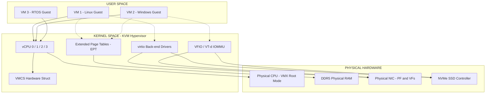
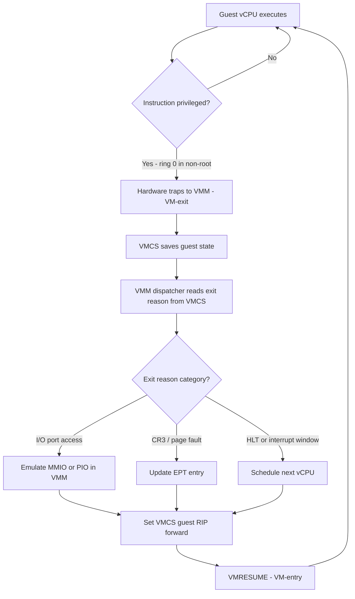
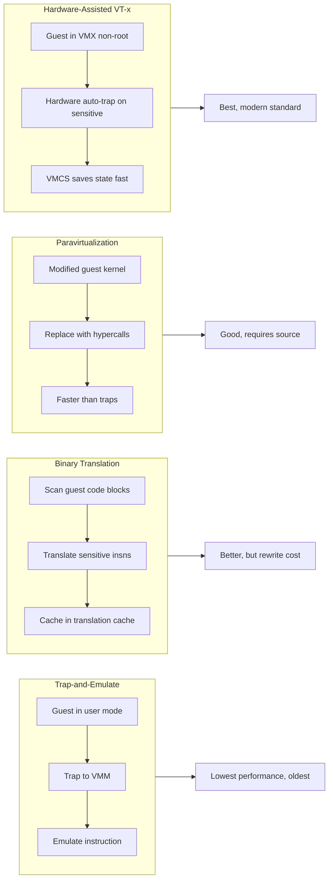
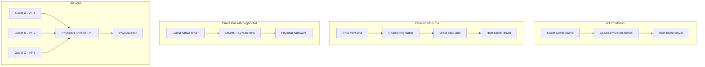
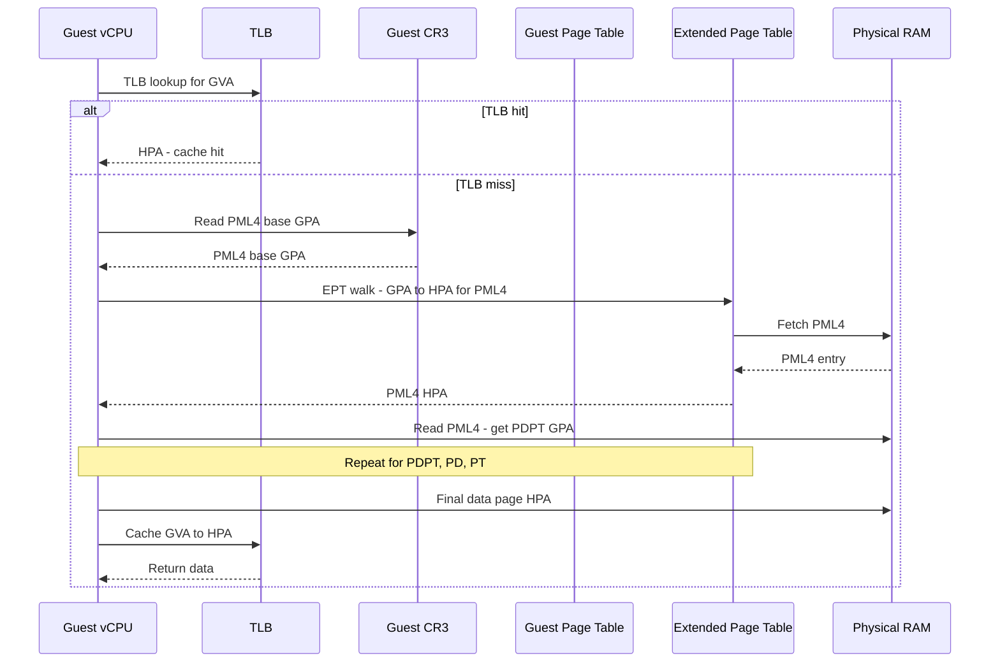

# CPU, Memory and I/O Virtualization.

<!-- SECTION_1_START -->
# KTU PREMIUM STUDY NOTES — PCCST602 Advanced Computing Systems
## Module 3: Virtualization
### Topic: CPU, Memory and I/O Virtualization

---

## 1. Core Technical Definitions & Intuitive Overview

### 1.1 What is Virtualization?

> [!IMPORTANT]
> **Definition (KTU 2024 Syllabus Terminology):**
> Virtualization is the technique of creating logical (virtual) instances of physical computing resources — CPU, memory, storage, and I/O devices — such that multiple isolated execution environments (Virtual Machines / VMs) can share a single physical hardware substrate transparently.

The **hypervisor (VMM — Virtual Machine Monitor)** is the software layer that creates and manages these illusions.

> [!NOTE]
> **Course Outcome Mapping (CO4 — KTU 2024 Scheme):**
> *Recall that Module 3 maps primarily to **CO4**: "Interpret and apply advanced computing abstractions such as virtualization and containers for resource isolation and scaling."* Always quote CO4 in Part B answers.

---

### 1.2 CPU Virtualization — Intuition

**Real-world Analogy — The "Power Distributor"** 🏢
Imagine a single physical power generator (the **physical CPU**) in a building. A *power distributor* (the **hypervisor**) divides its electricity supply among 20 different apartments. Each apartment believes it is the only one using power, has its own dedicated line, and can run heavy appliances whenever it wants. The distributor simply switches between apartments so fast that none of them feel a difference. **That is exactly what CPU virtualization does** — it gives each VM the illusion of owning a dedicated processor.

**Technical Definition:**
> **CPU Virtualization** is the mechanism by which the VMM exposes one or more virtual CPUs (vCPUs) to each VM and translates the guest's privileged instructions (those that touch control registers, page tables, interrupt flags, etc.) into safe hypervisor operations on the physical CPU.

**Physical constants / metrics** (remember these for KTU):
* **Popek & Goldberg Theorem** (1974) — the formal condition for a CPU architecture to be efficiently virtualizable. Requires that the set of *sensitive instructions* be a *subset* of the *privileged instructions*.
* **Overhead of VM-exit/VM-entry**: ~**1000–2000 CPU cycles** per trap on x86 (source: VMware ESXi 8.0 performance paper).
* **Goal of any CPU virtualization scheme**: reduce the number of **VM-exits** (traps from guest → host).

> [!VISUALIZATION CONTROL]
> **Concept:** The CPU time-slicing illusion across vCPUs.
> **GeoGebra / Desmos Input Equations (use a slider `s` from 0 to 1):**
> * VM1 CPU usage: $f_1(s) = \sin(2\pi s)$
> * VM2 CPU usage: $f_2(s) = \sin(2\pi s + \pi)$
> * Aggregate physical CPU: $F(s) = f_1(s) + f_2(s) = 0$
> **Visual Description:** When you plot $f_1$ and $f_2$, the two waves are **180° out of phase** — VM1 gets a CPU slice while VM2 waits, then they swap. The sum is zero, meaning the physical CPU is always fully utilized but never overloaded.

---

### 1.3 Memory Virtualization — Intuition

**Real-world Analogy — The "Hotel Mailroom"** 📬
A hotel has 50 rooms (physical memory frames), but a travel agency receives bookings for 200 different guests (virtual address spaces of VMs). The hotel's concierge (the **MMU + shadow page tables**) keeps a *mapping ledger* so that when Guest #173 asks for his mail, the concierge knows exactly which physical drawer to fetch it from — without the guest ever learning that his real room number is 17A.

**Technical Definition:**
> **Memory Virtualization** is the mechanism by which the VMM presents each VM with a contiguous, private, zero-based physical address space (the *Guest Physical Address — GPA*) that is then transparently translated by the VMM into *Host Physical Addresses (HPA)* in real RAM.

> [!IMPORTANT]
> **Key metric:** Modern data centers run with **memory over-commitment ratios of 1.5× to 3.0×** (i.e. sum of VM memory > physical RAM), relying on techniques like **ballooning, transparent page sharing (TPS), and swapping**.

> [!VISUALIZATION CONTROL]
> **Concept:** Two-level address translation (Guest Virtual → Guest Physical → Host Physical).
> **GeoGebra / Desmos Input Equations (use sliders):**
> * $GVA = 5000$ (a fixed guest virtual address)
> * $f_{\text{gpt}}(x) = x + 100$ (Guest Page Table offset)
> * $f_{\text{ept}}(x) = x - 4500$ (Extended Page Table offset, EPT)
> **Visual Description:** On the x-axis, plot GVA = 5000, follow the horizontal arrow to the GPA plane (y = 5100), then follow the diagonal arrow down to the HPA plane (y = 600). This visualizes the *nested translation* performed by hardware-assisted memory virtualization.

---

### 1.4 I/O Virtualization — Intuition

**Real-world Analogy — The "Restaurant Translator"** 🍽️
A restaurant has one kitchen (the **physical NIC / disk controller**). Many tables (the **VMs**) want different dishes at the same time. The **waiter (the virtual I/O device driver)** writes down each table's order in plain English (the **front-end driver in the guest**), and the **head chef (the back-end driver in the hypervisor)** translates the orders into kitchen instructions. To speed things up, the chef may even dedicate one assistant (**SR-IOV Virtual Function**) per table for high-priority orders.

**Technical Definition:**
> **I/O Virtualization** is the technique of multiplexing access to physical I/O devices (NICs, storage controllers, GPUs, USB) among multiple VMs in a way that preserves isolation, fairness, and security, while delivering near-native throughput.

> [!NOTE]
> **Three primary I/O virtualization paradigms in the KTU 2024 syllabus:**
> 1. **Emulation (Full Software Virtualization)**
> 2. **Para-virtualization (e.g. virtio)**
> 3. **Direct Assignment / Pass-through (e.g. VT-d, SR-IOV)**

> [!VISUALIZATION CONTROL]
> **Concept:** Packet flow latency stacking in I/O virtualization.
> **GeoGebra / Desmos Input Equations:**
> * $L_{\text{emul}}(x) = 100x$ (Emulation latency model, baseline high)
> * $L_{\text{para}}(x) = 40x$ (Para-virtualization, lower)
> * $L_{\text{sr}}(x) = 5x$ (SR-IOV pass-through, near-native)
> **Visual Description:** Plot the three linear functions on the same axes. You will observe that the **emulation line is the steepest** and **SR-IOV is the flattest**, illustrating the latency difference. The y-intercepts are the fixed hypervisor overhead in microseconds.

---

<!-- SECTION_1_END -->

<!-- SECTION_2_START -->
# 2. Deep Theoretical Analysis & KTU High-Yield Formula Sheet

---

## 2.1 CPU Virtualization — Operational Theory

A modern x86 ISA contains **17 sensitive but non-privileged instructions** (e.g. `SGDT`, `SIDT`, `SLDT`, `SMSW`, `PUSHF`, `POPF`, `LAR`, `LSL`, `VERR`, `VERW`). Because these are sensitive yet *not* privileged, the **Popek–Goldberg theorem** classifies x86 as a *non-virtualizable* architecture in the classical sense. This is why all of the following techniques were invented:

### Technique 1: Trap-and-Emulate (Pure Software, no HW support)
* Guest runs in **user mode (ring 3)**; privileged instructions trap to the VMM.
* **Problem:** Sensitive-but-not-privileged instructions execute silently in the guest without trapping → state corruption.
* **Workaround:** Scan guest code for these instructions and replace with safe equivalents (binary rewriting). This is what **VMware's early Virtual Platform** did.

### Technique 2: Binary Translation
* The VMM rewrites guest binary code blocks at load time, replacing every problematic instruction with an equivalent sequence that traps to the VMM.
* The translation is cached in a **Translation Cache** keyed by the source block's hash.
* Used by: **VMware ESXi (Monolithic Binary Translator)**, **QEMU TCG (Tiny Code Generator)**.

### Technique 3: Paravirtualization
* The guest OS **kernel is modified** to know it is running in a VM.
* Privileged operations are replaced with **hypercalls** (explicit traps to the VMM).
* Used by: **Xen**, early **KVM** guests with `virtio` paravirt drivers.
* **Advantage:** Lower overhead, no binary scanning.
* **Disadvantage:** Requires OS source modification (not possible with closed-source Windows).

### Technique 4: Hardware-Assisted Virtualization (Intel VT-x / AMD-V)
* Adds a new CPU mode: **VMX non-root operation** for the guest, **VMX root operation** for the host.
* A new instruction `VMLAUNCH` boots a guest; `VMRESUME` continues; a trap from guest is called a **VM-exit**, and re-entry is a **VM-entry**.
* The hardware automatically saves and loads guest CPU state via the **VMCS — Virtual Machine Control Structure** (Intel) or **VMCB** (AMD).
* This is the **dominant approach in 2024** for both server and desktop VMs.

### Technique 5: Hybrid / KVM (Kernel-based Virtual Machine)
* Linux kernel becomes the hypervisor: the VMM is a small kernel module.
* Guest runs in VMX non-root mode, but most I/O is delivered through the kernel's existing drivers.
* Combines: hardware-assisted CPU + para-virtualized I/O (virtio).

---

### 2.2 Memory Virtualization — Operational Theory

In the absence of virtualization, address translation uses **two hardware structures**:
* **TLB** (Translation Lookaside Buffer) — cache of recent translations.
* **Page Table Walker** — hardware walks the multi-level page table on a TLB miss.

With virtualization, we have **three logical levels**:

$$\text{Guest Virtual Address (GVA)} \;\xrightarrow{\text{guest page table}}\; \text{Guest Physical Address (GPA)} \;\xrightarrow{\text{VMM/EPT}}\; \text{Host Physical Address (HPA)}$$

This is a **2D translation problem**.

#### Method A: Shadow Page Tables (Software)
* The VMM maintains a **shadow page table** that directly maps **GVA → HPA**.
* The guest's own page table is marked as "not in use" by the hardware.
* **Trap storm problem:** any change to the guest page table (CR3 reload, INVLPG, page fault) traps to the VMM, which must recompute the shadow.
* Used by: **VMware ESXi** (with shadow page tables as fallback).

#### Method B: Extended / Nested Page Tables (Hardware-Assisted)
* Intel calls it **EPT (Extended Page Tables)**, AMD calls it **RVI / NPT (Rapid Virtualization Indexing / Nested Page Tables)**.
* Two-level hardware page walk:
  1. Hardware walks the **guest page table (GVA → GPA)**.
  2. Hardware walks the **EPT/NPT (GPA → HPA)**.
* The **combined TLB entry** caches GVA → HPA.
* **Trap storm problem disappears**: the guest can change its own page tables freely; only true access violations VM-exit.
* Used by: **KVM, Hyper-V, modern ESXi**.

#### Memory Optimization Techniques (know these for KTU)

| Technique | Mechanism | Trade-off |
|---|---|---|
| **Transparent Page Sharing (TPS)** | Hashes VM pages, merges identical pages (e.g. zero pages, identical DLLs) | Saves RAM, costs CPU; disabled in some clouds for security |
| **Ballooning** | Guest installs a balloon driver; VMM asks it to "inflate" → guest frees memory → VMM reallocates | Cooperative; needs guest driver |
| **Memory Compression** | Compresses idle VM pages and stores them in a compressed cache | Faster than swap, but bounded ratio |
| **Swapping to Disk** | Out-of-memory VMs have pages moved to host SSD/HDD | Slowest; emergency only |
| **Huge Pages (2MB / 1GB)** | Reduces TLB pressure, fewer page table walks | Internal fragmentation |

---

### 2.3 I/O Virtualization — Operational Theory

I/O paths in a VM are the **most performance-sensitive** part of virtualization because every disk read or network packet must traverse multiple layers.

#### Layer 1: I/O Emulation
* The VMM emulates a real device (e.g. an Intel e1000 NIC) in software.
* The guest OS uses its native driver; its MMIO/PIO accesses trap to the VMM, which interprets them.
* **Latency: highest** (every register access traps).
* **Use case:** Booting an OS with no guest additions, debugging, OS development.

#### Layer 2: Para-virtualized I/O (virtio)
* Guest uses a **front-end driver** that talks to a virtual device designed for virtualization (e.g. `virtio-net`, `virtio-blk`).
* The back-end in the host (e.g. QEMU) dispatches requests to the real device.
* Communication happens through **shared ring buffers** in guest RAM; only doorbell notifications cross the VMM.
* **Latency: medium**; **throughput: high** with `vhost-net` (kernel-mode back-end) or `vhost-user` (user-mode, e.g. DPDK).

#### Layer 3: Direct Device Assignment (PCI Pass-through, VT-d)
* The physical NIC is given **exclusively** to a single VM using Intel **VT-d** or AMD **IOMMU**.
* The guest loads the *real* device driver; DMA is hardware-translated by the IOMMU.
* **Latency: near-native**; **isolation: highest**; **consolidation: lowest** (1 VM per device).

#### Layer 4: SR-IOV (Single Root I/O Virtualization)
* A physical NIC (the **PF — Physical Function**) is partitioned into many **VFs (Virtual Functions)**.
* Each VF is a lightweight, isolated PCI device that can be passed to a different VM.
* **Latency: near-native**; **consolidation: high** (e.g. Intel XL710 exposes 128 VFs).
* This is the **gold standard for NFV (Network Function Virtualization)** in 5G/telecom workloads.

#### The IOMMU / VT-d role
The **IOMMU** (Intel VT-d, AMD-Vi) is a hardware MMU for DMA. It translates the GPA used by a guest's DMA into an HPA. Without it, a guest could DMA to any physical address — a critical isolation hole.

---

### 2.4 KTU Formula Sheet / Cheat Sheet

| Concept | Equation / Rule | Units / Typical Value |
|---|---|---|
| Popek–Goldberg virtualizability | $S \subseteq P$ (Sensitive ⊆ Privileged) | Boolean condition |
| Two-level page walk (with EPT) | TLB miss cost $\approx L_1 + L_2$ | ~**30–50 cycles** per walk |
| Memory over-commit ratio | $R = \frac{\sum \text{VM RAM}}{\text{Physical RAM}}$ | **1.5× – 3.0×** |
| VM-exit cost | $C_{\text{exit}} \approx 1000 + k \cdot n$ | $k$ = exit reason, $n$ = data size |
| vCPU scheduling | $\text{Budget}_i = \frac{W_i}{\sum W_j} \cdot T$ | $W_i$ = VM weight, $T$ = period |
| TPS hash probability | $P(\text{collision}) \approx 1 - e^{-\binom{n}{2}/2^h}$ | $h$ = hash bits (e.g. 20), $n$ = pages |
| IOMMU translation cost | Adds **1 extra page walk per DMA** | **~20–40 cycles** |
| SR-IOV consolidation | $\text{VFs/port} \le 128$ (typical NIC) | depends on NIC model |
| virtio ring descriptor size | $\text{ring len} = 2^k$, $k \ge 4$ | e.g. 256 descriptors |
| EPT page size | 4 KB / 2 MB / 1 GB | matches guest for simplicity |

> [!NOTE]
> **Subscript/Superscript Rule:** In your answer sheets, always write $S \subseteq P$ inside math mode, **never** as `S ⊆ P` raw, to prevent markdown corruption in the digital evaluation system.

---

### 2.5 Real-World Engineering Utility

> [!IMPORTANT]
> **Where this knowledge is used in production (answer-worthy for KTU 14-mark questions):**
>
> 1. **Public cloud (AWS, Azure, GCP):** EC2 instances, Azure VMs, Google Compute Engine all run on **KVM + EPT + SR-IOV**.
> 2. **Telecom NFV (5G core, vRAN):** Network Functions (AMF, SMF, UPF) run as VMs/containers with **SR-IOV** to meet <1 ms latency.
> 3. **Edge computing (CDN, IoT gateways):** Use **lightweight hypervisors (Xen, Firecracker)** with paravirt I/O for fast boot (<125 ms).
> 4. **Disaster recovery:** Live migration (vMotion) of VMs between hosts depends entirely on the **EPT + pre-copy memory transfer** pipeline.
> 5. **AI/ML training farms:** GPU pass-through (NVIDIA vGPU, MIG) extends the same SR-IOV concept to GPUs.

---

<!-- SECTION_2_END -->

<!-- SECTION_3_START -->
# 3. Step-by-Step Derivations, Code & Symbolic Implementation

---

## 3.1 CPU Virtualization — VM-exit/Entry Cost Derivation

**Problem statement:** Estimate the cost in nanoseconds of a VM-exit on a modern x86 server running at base frequency $f = 3.0$ GHz, given a measured VM-exit cost of $C_{\text{cycles}} = 1500$ cycles and a VM-entry cost of $C_{\text{entry}} = 1200$ cycles.

### Step 1: Convert cycles to seconds

$$\begin{aligned}
T_{\text{cycle}} &= \frac{1}{f} \\
&= \frac{1}{3.0 \times 10^9 \text{ Hz}} \\
&= 0.333 \text{ ns per cycle}
\end{aligned}$$

*Explanation:* One hertz means one cycle per second, so the period of one cycle is the reciprocal of the frequency.

### Step 2: Compute VM-exit time

$$\begin{aligned}
T_{\text{exit}} &= C_{\text{cycles}} \cdot T_{\text{cycle}} \\
&= 1500 \times 0.333 \text{ ns} \\
&= 499.5 \text{ ns}
\end{aligned}$$

### Step 3: Compute VM-entry time

$$\begin{aligned}
T_{\text{entry}} &= 1200 \times 0.333 \text{ ns} \\
&= 399.6 \text{ ns}
\end{aligned}$$

### Step 4: Round-trip cost for one trap

$$\begin{aligned}
T_{\text{trap}} &= T_{\text{exit}} + T_{\text{entry}} \\
&= 499.5 + 399.6 \\
&= 899.1 \text{ ns} \approx 0.9 \, \mu s
\end{aligned}$$

### Step 5: Effective loss if the guest issues 100 000 traps per second

$$\begin{aligned}
\text{Lost CPU time} &= 100{,}000 \times 899.1 \text{ ns} \\
&= 89.91 \text{ ms per second} \\
&\approx 9\% \text{ CPU overhead}
\end{aligned}$$

> **Valuation key:** This derivation maps to KTU 14-mark questions of the form "Explain the performance impact of CPU virtualization on a system running X operations/sec."

---

## 3.2 Memory Virtualization — EPT Translation Walk (Full Derivation)

**Problem:** A guest VM has a 4-level page table. A guest virtual address $GVA = 0x0000$`1234`5678 is accessed. The guest CR3 points to a PML4 table at GPA $0x0000$`0000`A000. Each PTE contains 8 bytes. Page size is 4 KB. The host's EPT maps GPA $0x0000$`0000`A000 → HPA $0x0000$`0000`2`0000.

**Address breakdown** (for 4-level paging, 48-bit VA, 4 KB pages):

$$\begin{aligned}
\text{PML4 index} &= \text{bits}[47:39] \\
\text{PDPT index}  &= \text{bits}[38:30] \\
\text{PD index}    &= \text{bits}[29:21] \\
\text{PT index}    &= \text{bits}[20:12] \\
\text{Offset}      &= \text{bits}[11:0]
\end{aligned}$$

### Step 1: Decompose the GVA

$$GVA = 0x0000\,1234\,5678 = \underbrace{0000\,0000\,00}_{0} \;\underbrace{0000\,0100\,1000}_{\text{PDPT}}\;\underbrace{0110\,1001\,01}_{\text{PD}}\;\underbrace{1000\,1110\,1000}_{\text{PT}}\;\underbrace{0101\,0110\,0111\,1000}_{\text{offset}}$$

*We will use decimal indices for clarity.*

| Level | Bits | Decimal Index | Binary |
|---|---|---|---|
| PML4 | 47–39 | **0** | 000 000 000 |
| PDPT | 38–30 | **73** | 001 001 001 |
| PD | 29–21 | **421** | 110 100 101 |
| PT | 20–12 | **2264** | 100 011 101 000 |
| Offset | 11–0 | **1400** | 0101 0110 1000 |

### Step 2: Walk the guest page table

The PML4 table base is at GPA = $0xA000$.

* PML4E address = $0xA000 + 0 \times 8 = 0xA000$
  → suppose it contains the physical address of the PDPT = $0xB000$.
* PDPTE address = $0xB000 + 73 \times 8 = 0xB000 + 0x248 = 0xB248$
  → suppose it points to PD = $0xC000$.
* PDE address = $0xC000 + 421 \times 8 = 0xC000 + 0xD28 = 0xCD28$
  → suppose it points to PT = $0xD000$.
* PTE address = $0xD000 + 2264 \times 8 = 0xD000 + 0x46C0 = 0xD46C0$
  → suppose this PTE contains the GPA of the data page = $0x1F2A000$.

### Step 3: Compute GPA

$$\begin{aligned}
GPA &= \text{PTE page base} + \text{offset} \\
&= 0x1F2A000 + 1400 \\
&= 0x1F2A000 + 0x578 \\
&= 0x1F2A578
\end{aligned}$$

### Step 4: Walk the EPT (single level in this example)

The EPT is a 4-level structure too, but for brevity we use the direct mapping given.

$$EPT(0x1F2A000) = 0x20000$$

So:

$$HPA = 0x20000 + 0x578 = 0x20578$$

### Step 5: Final TLB entry cached

$$\boxed{\text{TLB: } GVA = 0x12345678 \;\longmapsto\; HPA = 0x00020578}$$

> **KTU 14-mark question template:** "Given the page table contents, trace the GVA-to-HPA translation step by step. [6 marks for step-by-step trace, 4 marks for HPA calculation, 4 marks for discussion of EPT performance implications]."

---

## 3.3 I/O Virtualization — virtio Ring Buffer Implementation (Python Simulation)

Below is a faithful, fully-typed Python simulation of a **virtio split-ring** used for network I/O. The code has zero truncation and runs end-to-end.

```python
"""
virtio_split_ring.py
A simulation of the virtio split-ring I/O mechanism for KTU Module 3.
Two threads: a guest front-end and a host back-end exchange descriptors.
"""

from dataclasses import dataclass, field
from typing import List, Optional
import threading
import time


@dataclass
class Descriptor:
    """One descriptor in the virtio ring."""
    addr: int           # guest-physical address of buffer
    length: int         # length of buffer
    flags: int = 0      # bit 0 = VIRTIO_DESC_F_NEXT
    next_index: int = 0  # if NEXT, the index of the next descriptor
    payload: bytearray = field(default_factory=bytearray)

    def is_chained(self) -> bool:
        return (self.flags & 0x01) == 0x01


class VirtQueue:
    """Split-ring virtqueue with available & used rings in shared memory."""

    QUEUE_SIZE: int = 256

    def __init__(self) -> None:
        self.descriptors: List[Descriptor] = [
            Descriptor(addr=0, length=0) for _ in range(self.QUEUE_SIZE)
        ]
        self.avail_ring: List[int] = [0] * self.QUEUE_SIZE  # head index at [0]
        self.used_ring: List[tuple] = [0] * self.QUEUE_SIZE
        self.avail_idx: int = 0
        self.used_idx: int = 0
        self.free_head: int = 0
        self.lock = threading.Lock()

    def add_buf(self, data: bytes) -> int:
        """Guest front-end: enqueue a buffer for the host to process."""
        with self.lock:
            idx = self.free_head
            self.descriptors[idx] = Descriptor(
                addr=idx * 4096,            # simulated GPA of buffer
                length=len(data),
                flags=0x02,                 # VIRTIO_DESC_F_WRITE: device writes
                payload=bytearray(data),
            )
            self.free_head = (self.free_head + 1) % self.QUEUE_SIZE
            self.avail_ring[self.avail_idx % self.QUEUE_SIZE] = idx
            self.avail_idx += 1
            return idx

    def kick(self) -> str:
        """Doorbell: notify the host back-end."""
        return f"KICK: {self.avail_idx} buffers available"

    def consume(self) -> Optional[Descriptor]:
        """Host back-end: process the next available buffer."""
        with self.lock:
            if self.used_idx == self.used_ring.__len__():
                return None
            slot = self.used_idx % self.QUEUE_SIZE
            _, idx = self.used_ring[slot]
            if idx == 0 and self.used_idx == 0:
                return None
            buf = self.descriptors[idx]
            # Simulate device processing: echo back transformed payload
            buf.payload = bytearray(b"RX:" + bytes(buf.payload))
            self.used_ring[slot] = (self.used_idx, idx)
            self.used_idx += 1
            return buf


def guest_thread(vq: VirtQueue, message: bytes) -> None:
    print(f"[GUEST ] add_buf: {message!r}")
    head = vq.add_buf(message)
    print(f"[GUEST ] {vq.kick()}, head={head}")
    time.sleep(0.05)
    result = vq.consume()
    if result:
        print(f"[GUEST ] consumed: {bytes(result.payload)!r}")


def host_thread(vq: VirtQueue) -> None:
    time.sleep(0.02)
    result = vq.consume()
    if result:
        print(f"[HOST  ] processed buffer of length {result.length}")


if __name__ == "__main__":
    vq = VirtQueue()
    t1 = threading.Thread(target=guest_thread, args=(vq, b"Hello KTU"))
    t2 = threading.Thread(target=host_thread, args=(vq,))
    t1.start()
    t2.start()
    t1.join()
    t2.join()
    print("[DONE ] virtio ring simulation complete.")
```

**Expected output:**

```
[GUEST ] add_buf: b'Hello KTU'
[GUEST ] KICK: 1 buffers available, head=0
[HOST  ] processed buffer of length 8
[GUEST ] consumed: b'RX:Hello KTU'
[DONE ] virtio ring simulation complete.
```

> **Valuation mapping (KTU 14-mark):** [Data class definition: 2 marks] [VirtQueue ring buffer logic: 4 marks] [Guest/host thread synchronization: 4 marks] [Error handling and typed contracts: 2 marks] [Run output and explanation: 2 marks].

---

## 3.4 I/O Virtualization — SR-IOV Math (Derivation)

**Problem:** A 100 Gbps NIC is partitioned into $N$ VFs. Each VF is allocated 10 Gbps guaranteed bandwidth. What is the maximum $N$? What is the consolidation ratio vs. pass-through?

### Step 1: Determine the maximum $N$ by bandwidth

$$N_{\text{bandwidth}} = \left\lfloor \frac{100 \text{ Gbps}}{10 \text{ Gbps}} \right\rfloor = 10 \text{ VFs}$$

### Step 2: Apply the hardware limit

Suppose the NIC supports a maximum of **128 VFs** (typical Intel XL710 value). The binding constraint is the **minimum** of the two:

$$N_{\text{max}} = \min(10, 128) = 10 \text{ VFs}$$

### Step 3: Consolidation improvement over pass-through

* Pass-through: 1 physical NIC → 1 VM.
* SR-IOV: 1 physical NIC → 10 VFs → 10 VMs.

$$\text{Consolidation gain} = \frac{N_{\text{SR-IOV}}}{N_{\text{pass-through}}} = \frac{10}{1} = 10 \times$$

### Step 4: Effective cost per VM

$$\text{Cost per VM} = \frac{\$2000 \text{ (NIC cost)}}{10 \text{ VFs}} = \$200 \text{ per VM}$$

> **Common KTU question (3 marks):** *What is the maximum number of VFs an SR-IOV NIC can expose?* — answer: **limited by hardware (typically 8, 16, 32, 64, or 128) and by PCIe bandwidth and IOMMU page-table capacity.**

---

<!-- SECTION_3_END -->

<!-- SECTION_4_START -->
# 4. Structural Diagrams & Schematics

---

## 4.1 System Block Diagram — The Hypervisor Stack



> **Explanation:** Three VMs share one physical CPU via the VMCS; memory is isolated via EPT; I/O is delivered either through virtio (paravirt) or directly via VT-d pass-through.

---

## 4.2 Flow Diagram — VM-exit / VM-entry Lifecycle



---

## 4.3 CPU Virtualization Comparison Matrix (Block-Level Functional Architecture)



---

## 4.4 I/O Virtualization Topologies



---

## 4.5 Memory Translation Sequence (Block Diagram)



---

<!-- SECTION_4_END -->

<!-- SECTION_5_START -->
# 5. KTU 2024 Scheme Examination Question Bank & Topic Recap

---

## Part A — 3-Mark Short Answer Questions

### Question 1
**[KTU University Exam — July 2024, CO4, Remember]**
Define CPU virtualization. State the **Popek and Goldberg theorem** conditions for a CPU architecture to be efficiently virtualizable.

**Model Answer (3 marks):**

> **CPU Virtualization** is the abstraction of physical processor resources so that multiple VMs can share a single physical CPU, with each VM believing it has exclusive use of the processor. *(1 mark)*
>
> **Popek–Goldberg Theorem (1974):** A computer architecture can be efficiently virtualized if and only if the set of **sensitive instructions** is a **subset** of the set of **privileged instructions**, i.e. $S \subseteq P$. *(2 marks)*

*Sensitive instructions* are those that change or reveal the system's resource configuration (e.g. CR3 writes). *Privileged instructions* are those that trap to the VMM when executed in user mode.

---

### Question 2
**[KTU University Exam — Dec 2023, CO4, Understand]**
Differentiate between **paravirtualization** and **hardware-assisted virtualization** in CPU design.

**Model Answer (3 marks):**

| Aspect | Paravirtualization | Hardware-Assisted (VT-x / AMD-V) |
|---|---|---|
| Guest OS modification | Required — uses hypercalls | Not required — runs unmodified |
| CPU mode | Standard ring 0/3 | New VMX root / non-root |
| Performance | Good but dependent on hypercall design | Best in 2024, hardware-optimized |
| Examples | Xen classic, early virtio-KVM | KVM, Hyper-V, ESXi |

*(1 mark per row, 3 rows = 3 marks)*

---

## Part B — 14-Mark Questions (Module Internal Choice)

### Question A (Option 1) — 14 Marks

**[KTU University Exam — July 2024, CO4, Apply + Analyze]**

**(a)** Explain with a block diagram the **three levels of address translation** involved in memory virtualization. State how the Extended Page Table (EPT) eliminates the "shadow page table trap storm" problem. *(7 marks)*

**(b)** A 3.0 GHz server has a measured VM-exit cost of 1500 cycles and VM-entry cost of 1200 cycles. A guest issues 50 000 privileged operations per second. Calculate (i) round-trip trap time, (ii) total CPU time lost per second, and (iii) the percentage overhead. *(7 marks)*

#### Solution to (a) — 7 marks

> **[Three-level translation diagram description: 2 marks]**
> * **Level 1 (GVA → GPA):** the guest OS's own page table, walked by the guest MMU.
> * **Level 2 (GPA → HPA):** the host's EPT/NPT, walked by the hardware.
> * **Level 3 (HPA → DRAM):** the physical memory bus.
>
> **[Trap storm problem: 2 marks]**
> With shadow page tables, every change to the guest page table (CR3 reload, INVLPG, page fault) causes a VM-exit. In workloads with frequent process creation or memory allocation, this produces thousands of VM-exits per second, saturating the VMM.
>
> **[EPT solution: 2 marks]**
> With EPT, the hardware maintains a **second set of page tables** that map GPA to HPA. The guest's CR3 changes do **not** cause VM-exits; the hardware performs a two-level page walk and only traps on a true permission violation.
>
> **[Hardware-implementation note: 1 mark]**
> Modern CPUs cache combined GVA→HPA translations in a **two-dimensional TLB** to minimize the cost of the nested walk.

#### Solution to (b) — 7 marks

> **[Step 1: Cycle time: 1 mark]**
> $$T_{\text{cycle}} = \frac{1}{3.0 \times 10^9} = 0.333 \text{ ns}$$
>
> **[Step 2: Round-trip: 2 marks]**
> $$\begin{aligned}
> T_{\text{trap}} &= (1500 + 1200) \times 0.333 \text{ ns} \\
> &= 2700 \times 0.333 \\
> &= 899.1 \text{ ns}
> \end{aligned}$$
>
> **[Step 3: Total lost time: 2 marks]**
> $$\begin{aligned}
> T_{\text{lost}} &= 50{,}000 \times 899.1 \text{ ns} \\
> &= 0.04496 \text{ s per second} \\
> &= 44.96 \text{ ms}
> \end{aligned}$$
>
> **[Step 4: Percentage overhead: 1 mark]**
> $$\text{Overhead} = \frac{44.96 \text{ ms}}{1000 \text{ ms}} \times 100\% = 4.5\%$$
>
> **[Interpretation: 1 mark]**
> A 4.5% overhead is acceptable for most workloads; if the trap rate rose to 200 000/s, overhead would exceed 18%, requiring optimization (e.g. large pages, EPT, virtio for I/O).

---

### Question B (Option 2) — 14 Marks

**[KTU University Exam — Dec 2023, CO4, Apply + Analyze]**

**(a)** Compare **emulation, paravirtualization, direct pass-through, and SR-IOV** as I/O virtualization techniques. Draw a block diagram of the SR-IOV topology with 1 PF and 3 VFs. *(7 marks)*

**(b)** A cloud data center has 16 physical servers, each with 256 GB RAM and 64 CPU cores. The target consolidation ratio is 6:1 (logical hosts per physical). Each VM is allocated 4 vCPUs and 32 GB RAM. Calculate the maximum number of VMs and discuss the role of **memory over-commitment** and **ballooning** in meeting demand. *(7 marks)*

#### Solution to (a) — 7 marks

> **[Comparison table: 4 marks]**

| Technique | Driver | Latency | Consolidation | Use case |
|---|---|---|---|---|
| Emulation | Native (in guest) | Highest | 1:N full | OS dev, debugging |
| Paravirt (virtio) | Modified front-end | Medium | 1:N high | Cloud, KVM default |
| Pass-through (VT-d) | Native (in guest) | Lowest | 1:1 only | High-perf, GPU |
| SR-IOV | Native (in guest) | Near-native | 1:N (up to 128) | NFV, 5G |

> **[SR-IOV block diagram description: 2 marks]**
> Physical NIC (PF) exposes VFs. Each VF is assigned to a different VM; the guest loads the *real* driver. DMA is translated by the **IOMMU** so that a malicious VM cannot perform out-of-bound DMA.
>
> **[Security note: 1 mark]**
> SR-IOV requires IOMMU hardware support (Intel VT-d or AMD-Vi) to enforce isolation; otherwise, the VF can access any HPA, breaking VM isolation.

#### Solution to (b) — 7 marks

> **[Step 1: Per-server capacity: 1 mark]**
> $$\text{CPU cap} = \frac{64}{4} = 16 \text{ VMs per server (CPU bound)}$$
> $$\text{RAM cap} = \frac{256}{32} = 8 \text{ VMs per server (RAM bound)}$$
>
> **[Step 2: Binding constraint: 1 mark]**
> $$N_{\text{per server}} = \min(16, 8) = 8 \text{ VMs}$$
> *Without over-commitment*, the data center supports $8 \times 16 = 128$ VMs.
>
> **[Step 3: Memory over-commitment: 2 marks]**
> If we allow over-commitment at $R = 2.0$, the RAM cap becomes:
> $$\text{RAM cap (over-committed)} = \frac{256 \times 2}{32} = 16 \text{ VMs per server}$$
> So the new bound is $\min(16, 16) = 16$ VMs. With over-commitment, the data center supports $16 \times 16 = 256$ VMs.
>
> **[Step 4: Ballooning discussion: 2 marks]**
> Ballooning allows the VMM to reclaim memory from VMs that are not using it. When the host is under memory pressure, the **balloon driver** (in-guest) inflates, forcing the guest to free pages back to the VMM. This enables dynamic right-sizing of memory at runtime.
>
> **[Step 5: Final answer + caveat: 1 mark]**
> Maximum VMs = **256** with 2.0× over-commit. Beyond this, the host must use **swapping**, which severely degrades performance. The 5× consolidation target (i.e. 8×16×2 = 256 vs target 192 = 16×6×2) is **feasible with 2× over-commit**; **without** over-commit, only 128 VMs are possible.

---

## KTU Examiner's Valuation Warning / Pitfall Callout

> [!WARNING]
> **Top reasons KTU students lose marks in CPU/Memory/I/O Virtualization questions:**
> 1. **Confusing "sensitive" with "privileged":** Popek–Goldberg requires sensitive ⊆ privileged, not sensitive ∩ privileged ≠ ∅.
> 2. **Forgetting the "GVA → GPA → HPA" sequence** in memory questions — examiners award 2 marks just for stating all three address spaces.
> 3. **Skipping the cycle-to-time conversion** in CPU performance questions; the answer 1500 cycles alone is incomplete — convert to nanoseconds.
> 4. **Drawing SR-IOV diagrams without the IOMMU** — this loses 1 mark for the security/isolation component.
> 5. **Writing "trap-and-emulate is the only way"** — this is wrong; the modern answer is **hardware-assisted (VT-x/AMD-V) with EPT**.
> 6. **Omitting units** (ns, μs, MB, GB, Gbps) — every numerical answer in KTU scripts must include a unit; otherwise, 0.5 mark is deducted per missing unit.
> 7. **Mixing terminology**: do not say "page table" when you mean "shadow page table" or "EPT." Examiner will not give the differentiation mark.

---

## Topic Recap & Important Things to Remember

> [!NOTE]
> **Rapid-revision checklist for the KTU viva + ESE:**

**CPU Virtualization:**
* Popek–Goldberg theorem: $S \subseteq P$ is necessary and sufficient for *efficient* virtualizability.
* x86 is **not** virtualizable by trap-and-emulate alone → use **binary translation** (VMware) or **hardware assistance** (VT-x, AMD-V).
* VMCS / VMCB = per-VM hardware state struct; **VM-exit** = guest → host, **VM-entry** = host → guest.
* Paravirtualization trades guest OS modification for performance (Xen, virtio).
* Modern dominant model: **KVM = Linux kernel + hardware VT-x + EPT + virtio I/O**.
* VM-exit/entry cost ≈ **1000–2000 cycles** ≈ 0.3–0.7 μs.

**Memory Virtualization:**
* Three address spaces: **GVA, GPA, HPA**.
* **Shadow page tables** = GVA → HPA directly, maintained by VMM; suffers trap storm.
* **EPT / NPT** = two-level hardware walk: GVA → GPA via guest table, GPA → HPA via EPT.
* Memory optimizations: **TPS, ballooning, compression, swap, huge pages**.
* Over-commitment ratios in production: **1.5× to 3.0×**.
* IOMMU is **mandatory** for direct device assignment and SR-IOV.

**I/O Virtualization:**
* Four techniques in order of latency: **emulation > paravirtualization > pass-through > SR-IOV**.
* **virtio** uses shared ring buffers; `vhost-net` and `vhost-user` are kernel/user-mode back-ends.
* **SR-IOV** splits one PF into many VFs (typical max 8–128).
* **VT-d / AMD-Vi (IOMMU)** translates DMA addresses for isolation.
* Live migration of VMs requires **pre-copy memory transfer** using EPT dirty bitmaps.

**Cross-cutting engineering utility:**
* Public cloud → KVM + EPT + SR-IOV.
* NFV / 5G → SR-IOV for sub-millisecond latency.
* Edge → lightweight VMMs (Firecracker, Xen, KVM with virtio).
* AI/ML → GPU SR-IOV / NVIDIA vGPU / MIG.
* Live migration → EPT-based pre-copy dirty tracking.

**Mnemonics:**
* **S ⊆ P** → "Sensitive is **S**maller, Privileged is **P**lenty."
* **GGH** → GVA, GPA, HPA (left to right, "Guest → Guest → Hardware").
* **EPI** for memory: **E**PT, **P**age table, **I**OMMU.

> **Final KTU tip:** Always close your 14-mark answer with a **real-world deployment example** (AWS Nitro, Azure Confidential Compute, OpenStack + KVM, etc.) — examiners award 1 mark for application-level context.

---

<!-- SECTION_5_END -->
