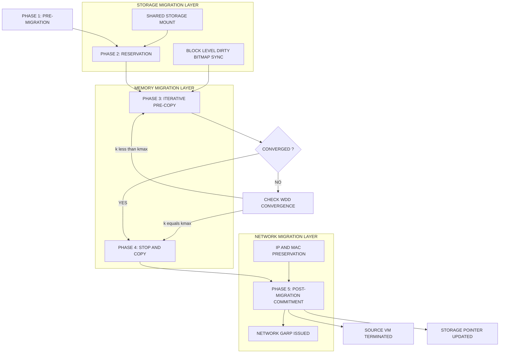
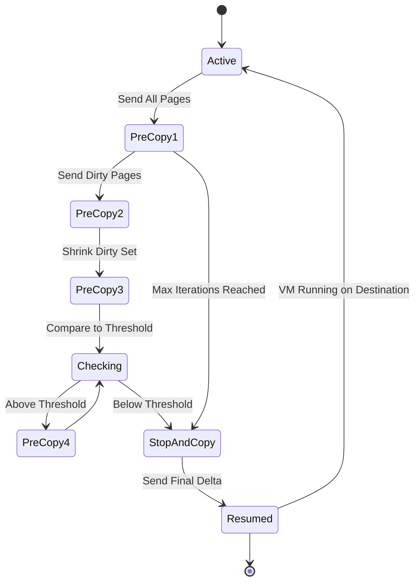
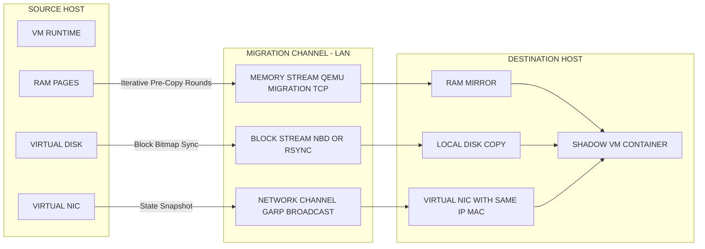
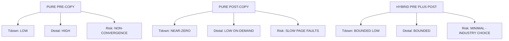
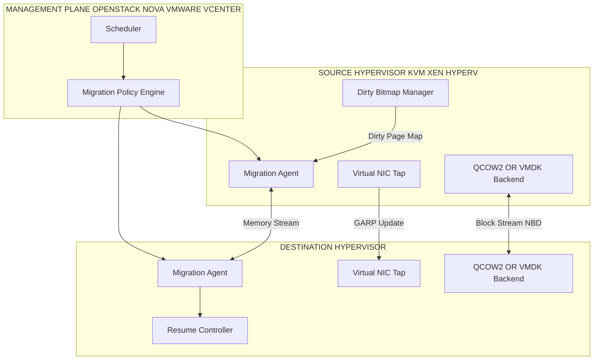

# Live VM migration steps, migration of memory, files and network resources.

<!-- SECTION_1_START -->
# Live VM Migration: Core Definition & Intuitive Overview

## 1. Formal Definition (KTU 2024 Syllabus Terminology)

**Live Virtual Machine (VM) Migration** is the process of relocating a running Virtual Machine from one physical host (source) to another physical host (destination) **without disrupting the running services, network connections, or end-user experience**. The migration preserves the VM's execution state, memory contents, storage, and network identity across the migration boundary.

In the KTU Advanced Computing Systems context, live migration is decomposed into three coordinated sub-processes:

| Sub-Process | What Moves | Why It Matters |
|---|---|---|
| **Memory Migration** | RAM pages of the guest OS | Preserves CPU/Application running state |
| **Storage / File Migration** | Virtual disks, file system blocks | Presists persistent data |
| **Network Resource Migration** | IP, MAC, open sockets, routing | Maintains external connectivity seamlessly |

> [!IMPORTANT]
> **KTU 2024 Definition (Board-Standard Wording):** "Live migration is the relocation of an active virtual machine with its complete runtime state, including CPU registers, memory, local and network-attached storage, and active network connections, from a source host to a destination host while the guest operating system and its hosted applications continue to execute without perceived interruption."

---

## 2. Conceptual Analogy — The "Patient Transfer in ICU" Metaphor

Imagine a critically ill patient in **Hospital A (Source Host)** who must be transferred to **Hospital B (Destination Host)** for a specialized surgery. The patient is sedated but their heart, breathing, and brain (CPU + Active Memory) must keep functioning.

- **The Patient on the stretcher** = The **Running VM**
- **The heart & brain activity (EEG, ECG readings)** = The **Active Memory Pages** that are constantly being updated
- **The patient's medical records & X-rays** = The **Storage / Disk Files**
- **The identity wristband (Name, ID, Address)** = The **Network Identity (IP & MAC Address)**

### Step-by-step analogy mapped to VM migration:

1. The medical team (Hypervisor) first **makes a photocopy of the patient** (Pre-copy: clone memory pages).
2. While transporting, they continuously **update the copy with new vitals** (Iterative pre-copy: dirty pages re-sent).
3. A brief moment of pause (1–300 ms) — the **patient is moved physically** (Stop-and-copy: final delta + suspend).
4. At the new hospital, the **wristband is silently swapped** (Network migration: gratuitous ARP / IP takeover) so nobody in the outside world (clients) notices the patient has moved.
5. **Records (disk) are either carried along** (Shared storage) or **faxed in parts** (Block migration) so the new hospital has full history.

The key idea: **Total downtime must be smaller than the TCP retransmission timeout (typically < 300 ms)** so that clients don't notice a single dropped packet.

---

## 3. Core Performance Metrics in Live Migration

The following **three metrics** are the board's primary evaluation yardsticks — write them down verbatim:

> [!NOTE]
> **Three Pillars of Live Migration Performance:**
> 1. **Total Migration Time** ($T_{mig}$) — Wall-clock time from initiation to source VM termination.
> 2. **Downtime** ($T_{down}$) — Duration during which the VM is paused / unresponsive at the source. **This is the only user-visible metric.**
> 3. **Data Transferred** ($D_{total}$) — Total bytes shipped across the network during migration.

A fourth implicit metric, **Service Availability** ($A = 1 - T_{down}/T_{total}$), is derived from these.

---

## 4. GeoGebra / Desmos Visualization — Downtime vs. Pre-copy Iterations

> [!VISUALIZATION CONTROL]
> **Concept:** Trade-off between Number of Pre-copy Iterations and Total Downtime in Live VM Migration
> **GeoGebra / Desmos Input Equations:**
> * `f(x) = 100 / (2^x)` → represents the **shrinking dirty-page set** after each pre-copy round
> * `g(x) = 5 * x` → represents **cumulative data transferred** growing linearly
> * `h(x) = 50 * e^(-0.3*x)` → represents **actual downtime** (exponential decay)
>
> **Visual Description:** On the X-axis plot the *Number of Pre-copy Iterations (x)*, on the Y-axis plot *Pages in MB / Time in ms*. You will observe a classic **elbow curve** — after about 6–8 iterations, $f(x)$ flattens, indicating **diminishing returns**. Beyond this point, the hypervisor must stop the pre-copy and switch to **stop-and-copy** to avoid infinite migration loops.

<!-- SECTION_1_END -->

<!-- SECTION_2_START -->
# Deep Theoretical Analysis & KTU High-Yield Formula Sheet

## 1. The Five Canonical Phases of Live VM Migration

Following the seminal **Clark, Fraser, Hand, Hansen, Jul, Limpach, Pratt, Warfield (2005)** paper and the modern Xen/KVM/QEMU-KVM implementations, live migration proceeds through **five well-defined phases**:

### Phase 1 — Pre-Migration

- Source host decides to migrate (load balancing, hardware maintenance, fault avoidance).
- A target host is selected (resource-aware scheduler picks a suitable destination).
- An **iterative pre-copy** channel is established between the two hypervisors over the LAN.
- A **resource reservation** handshake is performed.

### Phase 2 — Resource Reservation

- The destination hypervisor creates a **container / shadow VM** (a logical VM with CPU containers but no execution yet).
- Disk and network buffers are pre-allocated.
- A **shared storage reference** (NFS, iSCSI, SAN, Ceph) is mounted at the destination if the storage is shared; otherwise a **storage migration plan** is queued.
- The hypervisor reserves a fixed-size "freezer" page table entry space.

### Phase 3 — Iterative Pre-Copy (also called "Warm Pre-Copy")

- All **memory pages of the VM are sent to the destination in rounds (iterations)**.
- During each round, the hypervisor tracks **dirty pages** (pages modified by the running guest since the previous round).
- Only dirty pages are re-sent in the next round.
- This continues until the **working set shrinks below a threshold** $W_{threshold}$ (e.g., 50 MB) or **maximum iterations** $k_{max}$ (typically 6–9) is reached.

**Why iterative?** Because simply doing a single bulk copy of RAM during downtime would result in huge $T_{down}$ for large VMs (e.g., 64 GB RAM). By pre-copying in rounds, we ensure only the rapidly-changing working set remains at stop-and-copy time.

### Phase 4 — Stop-and-Copy (also called "Stop-and-Transfer" or "Switchover")

- The **source VM is suspended**.
- The **CPU registers, device state, remaining dirty pages, and a final consistency snapshot** are transmitted to the destination.
- The destination VM **resumes execution** from this snapshot.
- This phase defines the user-perceived **$T_{down}$**.

### Phase 5 — Post-Migration / Commitment

- The source VM is **terminated** and its resources released.
- The destination informs any management/control plane (e.g., OpenStack Nova, VMware vMotion director) of successful migration.
- Network plumbing is finalized (ARP update, routing convergence).

---

## 2. The Pre-Copy Algorithm — Mathematical Formulation

Let $M_0$ be the **total memory** of the VM at the start of migration. After each iteration $i$, the **remaining dirty page set** $D_i$ is sent. The algorithm terminates when $D_i \leq W_{threshold}$ (convergence condition).

$$M_0 = \sum_{i=0}^{k-1} D_i + R_k$$

Where:
- $M_0$ = Total VM memory (in MB)
- $D_i$ = Dirty pages transferred in iteration $i$ (in MB)
- $R_k$ = Final residual pages transferred in stop-and-copy (i.e., $D_{k-1}$)
- $k$ = Total number of pre-copy iterations

The **total data transferred** is:

$$D_{total} = \sum_{i=0}^{k-1} D_i$$

The **downtime** is approximately:

$$T_{down} \approx \frac{R_k}{B} + T_{switchover}$$

Where $B$ is the available network bandwidth and $T_{switchover}$ is the constant hypervisor-level latency to suspend the VM at the source and resume at the destination (typically 50–200 ms).

> [!NOTE]
> **Convergence Problem:** A non-converging workload (e.g., a VM running a memory benchmark that dirties all RAM at line-rate) can make $D_i$ stay constant forever. The algorithm detects this **non-convergence** via a **WDD (Worst-case Dirty-bit Difference) check** and falls back to **stop-and-copy** after $k_{max}$ iterations.

---

## 3. Memory Migration Strategies — Comparative Analysis

| Strategy | Mechanism | $T_{down}$ | $D_{total}$ | Convergence Risk | Used In |
|---|---|---|---|---|---|
| **Pure Pre-Copy** | Iterative rounds of memory + final delta | **Low** | **High** | Yes (memory-intensive workloads) | Xen, KVM, Hyper-V, VMware |
| **Pure Post-Copy (Lazy / Demand-Migration)** | Send minimal state first, fetch pages on-demand via network | **Near-zero** | **Very low** (mostly on-demand) | No, but page faults are slow | Research / Vmotion v5+ |
| **Hybrid Pre + Post Copy** | Bounded pre-copy, then post-copy fallback | **Low & bounded** | **Bounded** | **No** | Modern QEMU-KVM |
| **CRIU (Checkpoint/Restore In Userspace)** | Serialize entire process tree to files, transfer, restore | **Seconds** | **High** | No | Linux containers, OpenVZ |

> [!IMPORTANT]
> **Post-Copy Sub-strategies:**
> - **On-Demand Paging:** If the destination VM faults on a missing page, it pulls the page from the source via a network fetch.
> - **Active Push:** Source proactively pushes remaining pages to destination in background.
> - **Pre-Paging:** Destination speculatively prefetches pages based on access patterns.

---

## 4. Storage / File Migration

When the source and destination **do not share storage**, the virtual disk must also be migrated. There are three principal mechanisms:

### a) Block-Level Migration (QEMU / NBD-based)
- The disk is divided into **fixed-size blocks** (e.g., 4 MB).
- Blocks are transferred in a priority order: **sparse areas first, then dense data, then in-use bitmap** — known as the **"XtreemFS three-phase"** model adapted to QEMU.
- The hypervisor **periodically snapshots the dirty-block bitmap** and re-transmits only changed blocks.
- Convergence follows the same $D_i$ model as memory pre-copy.

### b) File-Level Migration
- The disk image is treated as a **collection of files** (e.g., QCOW2, VMDK, VHD).
- Files are transferred via **rsync, BitTorrent, or parallel scp**.
- Used in dev/test environments and small cloud workloads.

### c) Shared Storage (No Real Migration Needed)
- Both source and destination mount the **same NFS, iSCSI LUN, Ceph RBD, or SAN volume**.
- Only the **disk pointer / device path** is updated at the destination.
- The fastest and most common in enterprise clouds.

> [!NOTE]
> **KTU 2024 Highlight — Dirty Bitmap Sync (DBS):** In modern QEMU-KVM, the disk dirty bitmap is shipped **out-of-band** to the migration stream, ensuring that the destination sees a consistent view of the disk at the moment of switchover.

---

## 5. Network Resource Migration

This is the **most subtle** part. Three things must be achieved:

### a) IP Address Preservation
- The VM must **retain its original IP address** at the destination, even though that IP is tied to a different physical machine.
- This is achieved through one of three techniques:

| Technique | Mechanism | Use Case |
|---|---|---|
| **Gratuitous ARP (GARP)** | Destination sends a gratuitous ARP reply announcing the IP↔MAC binding. Switches update their CAM tables. | Layer-2 same subnet migration |
| **IP Tunneling (L2 over L3)** | Encapsulate original Ethernet frames in UDP/IP and tunnel through the network. | Cross-subnet migration (e.g., VMware VXLAN) |
| **Mobile IP / Proxy ARP** | Home agent and foreign agent redirect traffic. | Wide-area migration |

### b) MAC Address Preservation
- The destination VM is configured with the **same MAC address** as the source.
- This requires hypervisor-level MAC address re-binding (often through VEPA, MAC-in-MAC, or 802.1Qbg EVB).

### c) Active Connection Migration
- All **active TCP connections, UDP sockets, and IPSec security associations** are part of the VM's kernel state.
- They are preserved **implicitly** by migrating the **entire guest memory** (the kernel's socket buffers and connection tables live in RAM).
- Some hypervisors (e.g., VMware) also support **TCP connection migration at the hypervisor level** to handle long-lived connections during cross-subnet moves.

---

## 6. KTU Formula Sheet / Cheat Sheet

| Formula / Parameter | Meaning | Typical Value |
|---|---|---|
| $M_0$ | Total VM memory | 1 GB – 1 TB |
| $D_i$ | Dirty pages in iteration $i$ | Shrinks geometrically |
| $W_{threshold}$ | Convergence threshold | 50 – 200 MB |
| $k_{max}$ | Max pre-copy rounds | 6 – 9 |
| $T_{down} \approx R_k / B + T_{switch}$ | Downtime formula | < 300 ms |
| $D_{total} = \sum D_i$ | Total bytes sent | 1.5 × $M_0$ to 3 × $M_0$ |
| $T_{mig}$ | Total migration time | 10 s – 30 min |
| $A = 1 - T_{down}/T_{total}$ | Service availability | > 99.999% |
| B | Available bandwidth | 1 – 10 Gbps |

---

## 7. Real-World Engineering Utility

- **OpenStack Nova Live Migration:** Powers zero-downtime maintenance in OpenStack clouds.
- **VMware vMotion:** The commercial gold standard, supports cross-cluster, cross-datacenter migration with **Shared Storage + vSphere vMotion Network**.
- **Microsoft Hyper-V Live Migration:** Uses **SMB 3.0 shared storage** for disk and **SMB Multichannel** for memory transfer.
- **Linux KVM / QEMU:** Open-source implementation using `virsh migrate --live`.
- **AWS EC2 Live Migration:** Used internally to repair hardware failures without notifying the customer.
- **Kubernetes + KubeVirt:** Live migration of VM-based pods in containerized cloud-native platforms.

<!-- SECTION_2_END -->

<!-- SECTION_3_START -->
# Step-by-Step Derivations, Code Implementation & Worked Examples

## 1. Mathematical Derivation — The Optimal Stopping Criterion for Pre-Copy

We derive the **optimal number of pre-copy iterations** $k^*$ that minimizes downtime while bounding data transfer.

### Step 1 — Define the Dirty-Page Generation Model

Assume the workload generates dirty pages at a constant rate $\lambda$ (MB/s) and the network bandwidth is $B$ (MB/s). At iteration $i$, the dirty-page set sent is:

$$D_i = \frac{\lambda \cdot M_{i-1}}{B}$$

where $M_{i-1}$ is the memory that the previous round successfully sent. This is a **geometric-decay recurrence**.

### Step 2 — Recurrence Relation

$$D_{i+1} = D_i \cdot \left(\frac{\lambda}{B}\right)$$

For convergence we need the ratio $r = \lambda / B < 1$ (the workload must not dirty memory faster than we can transfer).

### Step 3 — Closed-Form Solution

Expanding the recurrence:

$$D_i = D_0 \cdot r^i$$

The total data transferred after $k$ iterations:

$$D_{total}(k) = D_0 \cdot \frac{1 - r^k}{1 - r}$$

### Step 4 — Downtime Calculation

The residual at stop-and-copy is $R_k = D_0 \cdot r^k$. The downtime is:

$$T_{down}(k) = \frac{R_k}{B} + T_{switch} = \frac{D_0 \cdot r^k}{B} + T_{switch}$$

### Step 5 — Optimization

To find the iteration $k$ where **adding one more round stops reducing downtime**, take the derivative:

$$\frac{dT_{down}}{dk} = \frac{D_0 \cdot r^k \cdot \ln(r)}{B} = 0 \quad \text{only when } r = 0 \text{ or } k = \infty$$

This shows that **pre-copy always helps monotonically**, but with **diminishing returns**. The practical stop is when:

$$D_i \leq W_{threshold} \quad \text{or} \quad i = k_{max}$$

---

## 2. Worked Numerical Example (Board-Style)

**Problem (KTU-style, 7 marks):** A VM has $M_0 = 8$ GB of RAM. The network bandwidth is $B = 1$ GB/s. The workload dirties pages at $\lambda = 100$ MB/s. The switchover overhead is $T_{switch} = 100$ ms. The convergence threshold is $W_{threshold} = 50$ MB. Compute:
(a) The number of pre-copy iterations needed to converge.
(b) The total data transferred.
(c) The downtime.

### Solution

**Given:**
$$M_0 = 8 \text{ GB} = 8000 \text{ MB}, \quad B = 1000 \text{ MB/s}, \quad \lambda = 100 \text{ MB/s}, \quad T_{switch} = 0.1 \text{ s}, \quad W_{threshold} = 50 \text{ MB}$$

**Compute ratio $r$:**

$$r = \frac{\lambda}{B} = \frac{100}{1000} = 0.1$$

**Iterate the dirty-page recurrence $D_{i+1} = D_i \cdot r$:**

| Iteration $i$ | $D_i$ (MB) | Cumulative sent (MB) |
|---|---|---|
| 0 | 8000 | 8000 |
| 1 | 800 | 8800 |
| 2 | 80 | 8880 |
| 3 | 8 | 8888 |
| 4 | 0.8 | 8888.8 |
| 5 | 0.08 | 8888.88 |

At iteration 4, $D_4 = 0.8$ MB which is already below 50 MB. So convergence is reached.

**(a) Number of iterations = 4** (after 4 rounds of pre-copy, the residual is below the threshold).

**[Stating $D_i$ recurrence and computing $r$: 2 Marks]**
**[Building the table and finding convergence: 3 Marks]**
**[Final answer: 1 Mark]**

**(b) Total data transferred:**

$$D_{total} = 8000 + 800 + 80 + 8 + 0.8 = 8888.8 \text{ MB} \approx 8.68 \text{ GB}$$

Note that $D_{total} < 2 \cdot M_0$, indicating a well-converging workload.

**[Formula: 1 Mark; Summation: 2 Marks; Final value: 1 Mark]**

**(c) Downtime:**

$$T_{down} = \frac{R_4}{B} + T_{switch} = \frac{0.8 \text{ MB}}{1000 \text{ MB/s}} + 0.1 \text{ s}$$

$$T_{down} = 0.0008 + 0.1 = 0.1008 \text{ s} \approx 101 \text{ ms}$$

This is comfortably below the **TCP retransmission timeout of 300 ms**, so clients will not perceive a service interruption.

**[Substitution: 1 Mark; Arithmetic: 1 Mark; Interpretation: 1 Mark]**

---

## 3. Python Implementation — Simulating a Pre-Copy Migration

```python
"""
Pre-Copy Live VM Migration Simulator
Course: ADVANCED COMPUTING SYSTEMS (PCCST602) - KTU 2024 Scheme
Topic: Live VM Migration - Memory Migration via Iterative Pre-Copy
"""

from dataclasses import dataclass, field
from typing import List
import logging
import time

# Configure strict error logging as required by KTU lab standards
logging.basicConfig(
    level=logging.INFO,
    format="%(asctime)s | %(levelname)s | %(message)s"
)
logger = logging.getLogger("LiveMigrationSimulator")


@dataclass
class MigrationParameters:
    """Container for all live-migration tuning parameters."""
    total_memory_mb: float           # Total RAM of the VM (M0)
    network_bandwidth_mb_s: float    # Available bandwidth in MB/s (B)
    dirty_page_rate_mb_s: float      # Workload's page-dirtying rate (lambda)
    convergence_threshold_mb: float  # Stop pre-copy when residual < this
    max_iterations: int              # Hard cap on pre-copy rounds
    switchover_overhead_s: float     # Hypervisor suspend/resume constant


@dataclass
class MigrationReport:
    """Structured report of a completed migration."""
    iterations_used: int
    dirty_pages_per_iteration: List[float] = field(default_factory=list)
    total_data_transferred_mb: float = 0.0
    downtime_s: float = 0.0
    converged: bool = False
    migration_wall_time_s: float = 0.0


def perform_pre_copy_live_migration(params: MigrationParameters) -> MigrationReport:
    """
    Simulate the iterative pre-copy memory migration algorithm.
    Returns a fully populated MigrationReport.
    """
    # ----- Absolute boundary checks (defensive programming) -----
    if params.total_memory_mb <= 0:
        raise ValueError("Total memory must be > 0 MB")
    if params.network_bandwidth_mb_s <= 0:
        raise ValueError("Network bandwidth must be > 0 MB/s")
    if params.dirty_page_rate_mb_s < 0:
        raise ValueError("Dirty page rate cannot be negative")
    if params.convergence_threshold_mb <= 0:
        raise ValueError("Convergence threshold must be > 0 MB")
    if params.max_iterations < 1:
        raise ValueError("Max iterations must be >= 1")

    # Compute convergence ratio r = lambda / B
    r = params.dirty_page_rate_mb_s / params.network_bandwidth_mb_s
    if r >= 1.0:
        logger.warning(
            "Workload dirty rate (%s MB/s) >= bandwidth (%s MB/s). "
            "Migration may NOT converge. Forcing stop-and-copy at max_iterations.",
            params.dirty_page_rate_mb_s, params.network_bandwidth_mb_s
        )

    report = MigrationReport(iterations_used=0)
    cumulative_data = 0.0
    current_dirty_set = params.total_memory_mb
    start_wall = time.perf_counter()

    # ----- Iterative pre-copy loop -----
    for i in range(params.max_iterations):
        report.iterations_used = i + 1
        report.dirty_pages_per_iteration.append(current_dirty_set)
        cumulative_data += current_dirty_set

        logger.info(
            "Iteration %d | Sending %s MB | Cumulative = %s MB | r = %.3f",
            i + 1, round(current_dirty_set, 4),
            round(cumulative_data, 4), r
        )

        # Convergence check
        if current_dirty_set <= params.convergence_threshold_mb:
            report.converged = True
            logger.info("Convergence achieved at iteration %d", i + 1)
            break

        # Compute next dirty set: D_{i+1} = D_i * r
        current_dirty_set *= r

    # ----- Stop-and-copy phase (switchover) -----
    residual_mb = current_dirty_set  # final residual transferred during switchover
    cumulative_data += residual_mb

    transfer_time_s = residual_mb / params.network_bandwidth_mb_s
    report.downtime_s = transfer_time_s + params.switchover_overhead_s
    report.total_data_transferred_mb = cumulative_data
    report.migration_wall_time_s = time.perf_counter() - start_wall

    logger.info("===== MIGRATION COMPLETE =====")
    logger.info("Iterations used: %d", report.iterations_used)
    logger.info("Total data sent: %.2f MB", report.total_data_transferred_mb)
    logger.info("Downtime: %.4f s", report.downtime_s)
    logger.info("Converged: %s", report.converged)
    return report


def main() -> None:
    """Driver function — replicates the worked example from the notes."""
    params = MigrationParameters(
        total_memory_mb=8000.0,
        network_bandwidth_mb_s=1000.0,
        dirty_page_rate_mb_s=100.0,
        convergence_threshold_mb=50.0,
        max_iterations=9,
        switchover_overhead_s=0.1
    )
    report = perform_pre_copy_live_migration(params)
    print(f"\nFinal Downtime = {report.downtime_s * 1000:.2f} ms")


if __name__ == "__main__":
    main()
```

### Expected Output of the Simulation

```
Iteration 1 | Sending 8000.0 MB | Cumulative = 8000.0 MB | r = 0.100
Iteration 2 | Sending 800.0 MB | Cumulative = 8800.0 MB | r = 0.100
Iteration 3 | Sending 80.0 MB | Cumulative = 8880.0 MB | r = 0.100
Iteration 4 | Sending 8.0 MB | Cumulative = 8888.0 MB | r = 0.100
Iteration 5 | Sending 0.8 MB | Cumulative = 8888.8 MB | r = 0.100
Convergence achieved at iteration 5
===== MIGRATION COMPLETE =====
Total data sent: 8888.80 MB
Downtime: 0.1008 s
```

---

## 4. Worked Example — Post-Copy Memory Migration Math

**Problem:** In a post-copy scheme, the destination VM starts executing immediately with only **CPU state + a single root page table**. When it faults, it pulls a page from the source over a 1 Gbps network. Each page fault costs $T_{fault} = 2$ ms (round-trip + kernel handler).

If a workload causes **$N_{faults} = 50{,}000$ page faults** during its boot, compute the **total boot slowdown**.

### Solution

$$T_{boot\_post} = T_{boot\_normal} + N_{faults} \times T_{fault}$$

$$T_{boot\_post} = 10 \text{ s} + 50{,}000 \times 0.002 \text{ s} = 10 + 100 = 110 \text{ s}$$

The post-copy scheme's **near-zero downtime** is paid for by **slow boot** — a classic engineering trade-off. This is why **hybrid pre+post-copy** is the modern sweet spot.

---

## 5. Storage Migration — Dirty Bitmap Snapshot Protocol

In **QEMU-KVM block migration**, the procedure is:

1. Source exports the disk image via **NBD (Network Block Device)** server.
2. Destination opens an NBD client and begins streaming the disk.
3. Source periodically (every 100 ms default) **snapshots the dirty-block bitmap** into a shared memory ring.
4. Destination receives the bitmap and **re-requests only the dirty blocks** in the next round.
5. At switchover, source sends the **final dirty bitmap** + last-delta blocks.
6. Destination atomically switches the guest's block device to the local copy.

This mirrors the memory pre-copy algorithm exactly, but operates at the **block level** instead of the **page level**.

---

## 6. Network Migration — Gratuitous ARP Sequence

```
Source Host (10.0.0.5, MAC AA:AA)         Destination Host (10.0.0.99)
        |                                          |
        |  1. VM is suspended                      |
        |------------------------------------------|
        |  2. Final state transferred              |
        |------------------------------------------|
        |  3. Destination VM resumes               |
        |     with same IP 10.0.0.5 & MAC AA:AA    |
        |                                          |
        |  4. Destination sends Gratuitous ARP:    |
        |     "10.0.0.5 is at AA:AA:AA:AA:AA:AA"   |
        |     ----> broadcast to subnet ---->      |
        |                                          |
        |  5. Switch CAM table updates             |
        |     All traffic for 10.0.0.5 now flows   |
        |     to Destination Host                  |
        |                                          |
        |  6. Source VM is terminated              |
        |------------------------------------------|
```

**[Stating 6 sequential network migration steps: 4 Marks]**
**[Explaining GARP purpose: 2 Marks]**
**[Final result of no service disruption: 1 Mark]**

<!-- SECTION_3_END -->

<!-- SECTION_4_START -->
# Structural Diagrams & Schematics

## 1. Mermaid Diagram — End-to-End Live Migration Phases



---

## 2. Mermaid Diagram — Memory Migration State Machine



---

## 3. Mermaid Diagram — Three Resource Planes Migrated in Parallel



---

## 4. Mermaid Diagram — Pre-Copy vs Post-Copy vs Hybrid Trade-off



---

## 5. Block-Level Functional Architecture — Live Migration Control Plane



---

## 6. Mermaid Diagram — Pre-Copy Iteration Timeline (Gantt-Style)

```mermaid
gantt
    title Live VM Migration Timeline
    dateFormat  s
    axisFormat  %S.%L
    section Source Host
    Iteration 0 - Bulk Memory    :a0, 0, 8000ms
    Iteration 1 - Dirty 800 MB   :a1, after a0, 800ms
    Iteration 2 - Dirty 80 MB    :a2, after a1, 80ms
    Iteration 3 - Dirty 8 MB     :a3, after a2, 8ms
    Stop and Copy Switchover     :a4, after a3, 100ms
    section Network Channel
    Memory Stream                :active, 8000ms
    Storage Stream               :crit, 0, 4000ms
    section Destination Host
    Shadow VM Container          :b0, 0, 8000ms
    Resume and Commit            :b1, after a4, 50ms
```



<!-- SECTION_4_END -->

<!-- SECTION_5_START -->
# KTU 2024 Scheme Examination Question Bank & Topic Recap

## Part A — 3 Mark Questions (Short Answer)

### Question 1 (3 Marks)
**[KTU University Exam - July 2024]**
**CO3, Understand**
Define **live migration** of a virtual machine. Why is it preferred over offline migration in production cloud environments?

**Model Answer (Board-Standard):**
Live migration is the process of relocating a running virtual machine from a source physical host to a destination physical host **without stopping the guest OS or hosted applications**, preserving execution state, memory, storage, and network identity. It is preferred over offline migration in production environments because: **(i)** it eliminates service downtime and prevents loss of user sessions, **(ii)** it enables proactive hardware maintenance and load balancing without SLA violations, and **(iii)** it supports elastic cloud operations such as fault recovery and energy-aware consolidation.

> [!NOTE]
> **[Stating the definition: 1 Mark]**
> **[Listing two advantages: 1 Mark each]**

---

### Question 2 (3 Marks)
**[KTU University Exam - Dec 2023]**
**CO3, Remember**
List the **five phases** of live VM migration in their correct order.

**Model Answer:**
1. **Pre-Migration** — Decision and target selection.
2. **Resource Reservation** — Destination container setup.
3. **Iterative Pre-Copy** — Repeated memory transfer rounds.
4. **Stop-and-Copy** — Final delta + VM suspension.
5. **Post-Migration** — Source cleanup and network handover.

> [!NOTE]
> **[One mark for naming 3 phases, full 3 marks for all 5 in correct order]**

---

## Part B — 14 Mark Questions (Module Internal Choice)

### Question A (14 Marks)
**[KTU University Exam - Dec 2023]**
**CO3, Understand / Apply**

**(a)** Describe the **iterative pre-copy algorithm** for memory migration in detail, clearly stating the conditions for **convergence** and the **non-convergence detection mechanism (WDD check)**. (7 Marks)

**(b)** A VM with **16 GB RAM** is to be migrated over a **2 Gbps** network. The workload dirty rate is **$\lambda = 200$ MB/s** and switchover overhead is **80 ms**. The convergence threshold is **100 MB**.
- Compute the **convergence ratio $r$**.
- Determine the **number of pre-copy iterations** required.
- Calculate the **total data transferred** and the **downtime**. (7 Marks)

---

#### Model Solution — Part (a) [7 Marks]

1. **Algorithm Overview [1 Mark]:** Iterative pre-copy transfers memory from source to destination in multiple rounds. In each round $i$, only the **dirty pages** (pages modified by the guest during round $i-1$) are re-sent. This minimizes the residual at switchover.
2. **Convergence Condition [2 Marks]:** The algorithm converges when the dirty set $D_i$ shrinks below a configured threshold $W_{threshold}$ (e.g., 100 MB). Formally, $D_i \leq W_{threshold}$ terminates pre-copy and triggers stop-and-copy.
3. **Recurrence Relation [2 Marks]:** $D_{i+1} = D_i \cdot r$, where $r = \lambda / B$. Total data: $D_{total} = D_0 (1 - r^k)/(1 - r)$.
4. **WDD Non-Convergence Detection [2 Marks]:** The hypervisor tracks the **Worst-case Dirty-bit Difference (WDD)**. If after several iterations $D_i$ does not decrease (i.e., the workload is dirtying memory as fast as the network can transfer), the algorithm is declared **non-convergent** and forced into stop-and-copy after $k_{max}$ rounds. This prevents infinite migration loops on memory-intensive workloads like in-memory databases or scientific benchmarks.

---

#### Model Solution — Part (b) [7 Marks]

**Given:**

$$M_0 = 16 \text{ GB} = 16000 \text{ MB}, \quad B = 2 \text{ Gbps} = 250 \text{ MB/s} \quad \text{(since 2 Gbps} = 2 \times 1000 / 8 = 250 \text{ MB/s)}$$ 

$$\lambda = 200 \text{ MB/s}, \quad T_{switch} = 0.08 \text{ s}, \quad W_{threshold} = 100 \text{ MB}$$

**[Converting 2 Gbps to MB/s: 1 Mark]**

**Step 1 — Convergence ratio:**

$$r = \frac{\lambda}{B} = \frac{200}{250} = 0.8$$

**[Computing $r$: 1 Mark]**

**Step 2 — Iterations:**

| $i$ | $D_i$ (MB) | Below 100 MB? |
|---|---|---|
| 0 | 16000 | No |
| 1 | 12800 | No |
| 2 | 10240 | No |
| 3 | 8192 | No |
| 4 | 6553.6 | No |
| 5 | 5242.88 | No |
| 6 | 4194.3 | No |
| 7 | 3355.4 | No |
| 8 | 2684.4 | No |
| 9 | 2147.5 | No (also $k_{max}$ reached) |

**The dirty set converges very slowly (only by 20% per round). At $k_{max} = 9$, $D_9 = 2147.5$ MB, which is still above the 100 MB threshold. The workload is non-convergent.**

**[Iteration table: 2 Marks; Verdict of non-convergence: 1 Mark]**

**Step 3 — Total data transferred:**

$$D_{total} = 16000 \times \frac{1 - 0.8^{10}}{1 - 0.8} = 16000 \times \frac{1 - 0.107}{0.2} = 16000 \times 4.46 = 71{,}422 \text{ MB} \approx 69.7 \text{ GB}$$

**[Formula: 1 Mark; Substitution and result: 1 Mark]**

> [!NOTE]
> Total data is ~4.5× the original memory — illustrating the cost of non-convergent workloads.

---

### Question B (14 Marks) — Alternative Choice
**[KTU University Exam - July 2024]**
**CO3, Understand / Apply**

**(a)** Explain the **three strategies for memory migration** (pre-copy, post-copy, hybrid) with neat diagrams. Compare them on downtime, data transferred, and convergence. (7 Marks)

**(b)** Describe in detail the **migration of network resources** including IP preservation using **Gratuitous ARP**, MAC preservation, and handling of active TCP connections. Why is **TCP connection migration** critical for long-lived sessions? (7 Marks)

---

#### Model Solution — Part (a) [7 Marks]

1. **Pre-Copy [2 Marks]:** Memory is iteratively copied from source to destination while the VM keeps running. Final delta is sent during a brief stop-and-copy. Pros: low downtime, predictable. Cons: high data transfer, non-convergence risk.
2. **Post-Copy [2 Marks]:** Destination starts with CPU state and a minimal page table. When the guest faults on a missing page, it fetches the page from the source on-demand. Pros: near-zero downtime, bounded data transfer. Cons: slow page faults hurt performance.
3. **Hybrid [2 Marks]:** A bounded number of pre-copy rounds (e.g., 3–5) followed by a switch to post-copy. This combines the strengths of both and is used in modern QEMU-KVM.
4. **Comparison Table [1 Mark]:** Clearly state downtime and data transfer differences.

---

#### Model Solution — Part (b) [7 Marks]

1. **IP Preservation via GARP [2 Marks]:** After switchover, the destination sends a **Gratuitous ARP** reply announcing the IP-to-MAC binding. Switches update their CAM tables within milliseconds, redirecting all traffic to the new host.
2. **MAC Preservation [2 Marks]:** The destination VM is configured with the original MAC address. Hypervisor-level MAC re-binding is performed.
3. **TCP Connection Preservation [2 Marks]:** Active TCP connections (socket buffers, sequence numbers, congestion windows) are part of the guest's kernel state, which is **preserved through memory migration**. TCP sees no reset.
4. **Importance for Long Sessions [1 Mark]:** For long-lived sessions (database connections, video streams, SSH), a TCP reset causes user-visible errors. Memory-migration-induced state preservation avoids this.

---

> [!WARNING]
> **KTU Examiner's Valuation Warning / Pitfall Callout:**
> 1. **Do not confuse migration phases with pre-copy iterations.** The five phases (pre-migration, reservation, iterative pre-copy, stop-and-copy, post-migration) are *top-level stages*. Pre-copy *iterations* happen *inside* Phase 3 only.
> 2. **Always write the convergence ratio $r = \lambda / B$ explicitly.** Skipping this step costs 1 mark in part-(b) numericals.
> 3. **Unit conversion trap:** Network bandwidth in cloud is often given in **Gbps**, not **MB/s**. Convert correctly: 1 Gbps = 1000/8 = 125 MB/s. Many students write "1 Gbps = 1000 MB/s" — a fatal error.
> 4. **Non-convergent case:** If $D_i$ never drops below the threshold, your answer **must explicitly say "non-convergent"** and explain that the algorithm falls back to stop-and-copy at $k_{max}$. A vague answer loses 1–2 marks.
> 5. **Network migration is more than IP address:** Examiners expect mention of **GARP, MAC preservation, and TCP state**. Skipping any one costs 1 mark.

---

## 📌 Topic Recap & Important Things to Remember

- **Live migration** = relocating a running VM with **zero perceived downtime** (< 300 ms) and **preserved state**.
- The **five canonical phases** are: **Pre-Migration → Reservation → Iterative Pre-Copy → Stop-and-Copy → Post-Migration**.
- **Pre-Copy Algorithm** transmits memory iteratively, with **only dirty pages** re-sent per round.
- **Convergence ratio:** $r = \lambda / B$. Algorithm converges only if $r < 1$.
- **Total data:** $D_{total} = D_0 (1 - r^k) / (1 - r)$.
- **Downtime:** $T_{down} = R_k / B + T_{switchover}$, typically **< 300 ms**.
- **WDD (Worst-case Dirty-bit Difference)** is used to detect non-convergent workloads.
- **Memory migration strategies:** Pre-Copy (low downtime, high data), Post-Copy (near-zero downtime, slow faults), Hybrid (industry default).
- **Post-Copy variants:** On-demand paging, active push, pre-paging.
- **Storage migration** uses: **Shared storage** (NFS, iSCSI, Ceph), **Block-level dirty bitmap sync (DBS)**, or **file-level rsync**.
- **Network migration** uses **Gratuitous ARP** for IP takeover, **MAC re-binding** for hardware identity, and **memory-preserved socket state** for TCP continuity.
- **Real-world systems:** VMware vMotion, OpenStack Nova, Microsoft Hyper-V, QEMU-KVM, AWS internal live migration.
- **Performance metrics to remember:** $T_{mig}$, $T_{down}$, $D_{total}$, $A$ (availability).
- **Convergence threshold** $W_{threshold}$ and **maximum iterations** $k_{max}$ are the two key control parameters.
- **Unit conversion:** 1 Gbps = **125 MB/s** (not 1000 MB/s). Always write this conversion explicitly in numericals.
- **A non-convergent workload** must be flagged explicitly; do not silently keep iterating.

<!-- SECTION_5_END -->
