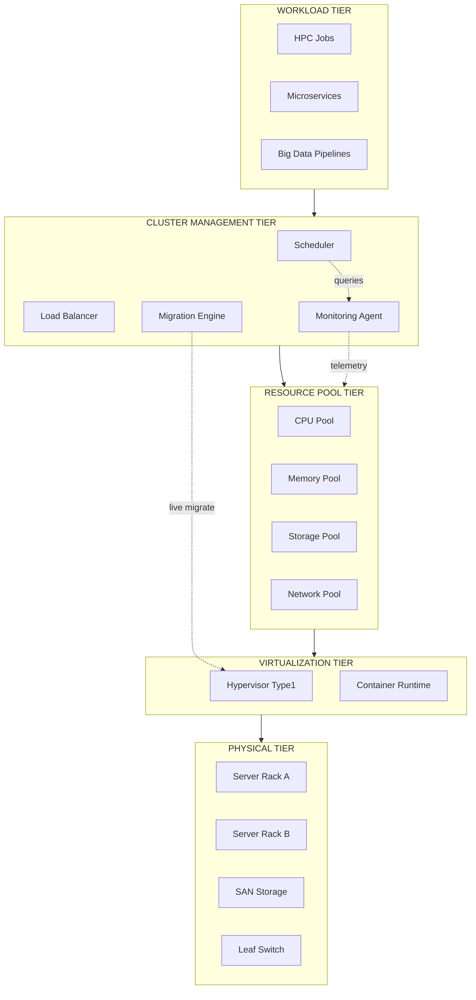
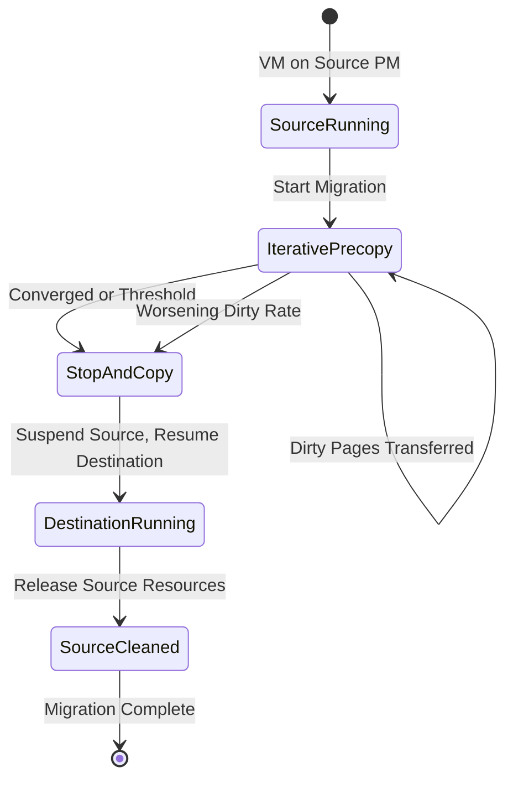
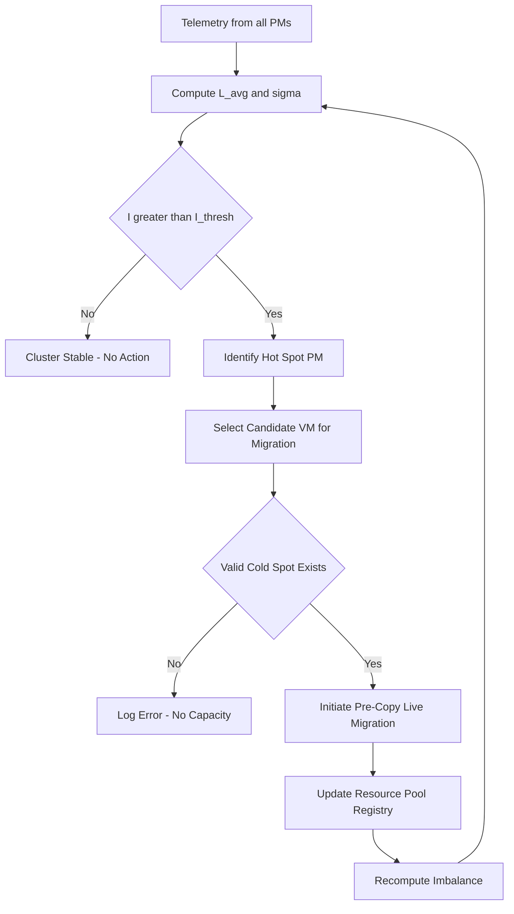
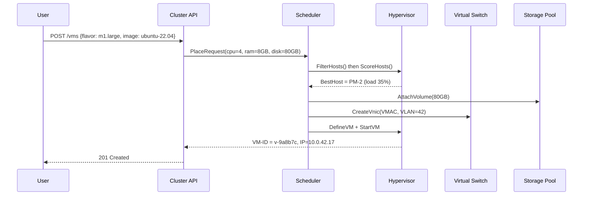

# Virtual clusters and resource management.

<!-- SECTION_1_START -->

# Virtual Clusters and Resource Management

## 1. Core Technical Definition & Intuitive Overview

### 1.1 Formal Definition

A **Virtual Cluster** is a dynamically configured, distributed collection of virtual machines (VMs) interconnected via a virtualized network fabric, abstracted from the underlying physical hardware, and orchestrated to deliver High-Performance Computing (HPC), high-availability (HA), or elastic cloud services. According to the KTU 2024 Advanced Computing Systems syllabus, a virtual cluster is treated as a **logical compute pool** wherein the physical resource boundary (CPU cores, RAM, NIC bandwidth, storage IOPS) is decoupled from the workload boundary.

> [!IMPORTANT]
> **KTU 2024 Syllabus Definition (PCCST602 / Module 3):**
> A virtual cluster is a set of VMs (Virtual Nodes) deployed on top of one or more physical servers (Virtual Cluster Nodes) using a hypervisor or container engine, managed as a single logical entity for job scheduling, fault tolerance, and elastic scaling.

### 1.2 Conceptual Analogy / Intuition

Imagine a **large commercial kitchen (the physical data center)**.

- **Physical Servers** = The fixed gas stoves, ovens, and countertops.
- **Hypervisor** = The **kitchen manager** who partitions the physical stoves into many "logical cooking stations."
- **Virtual Cluster** = A **team of chefs assigned to a specific banquet event**. The banquet coordinator doesn't care which stove they use; they only care that there are **8 chefs available**, each with **standardized knives, pans, and counter space**.
- **Resource Manager (e.g., Kubernetes Scheduler, YARN)** = The **head chef** who reassigns chefs to different stoves based on workload (a chef is free, redirect them to the dessert station).
- **Live Migration** = A chef **physically moving from one stove to another without leaving the dish unattended** — a seamless handover.

If a stove (physical node) fails, the head chef (scheduler) immediately reassigns the affected chefs (VMs) to working stoves — the banquet (user job) **never stops**.

> [!NOTE]
> **Core Characteristics of a Virtual Cluster (must memorize for 3-mark questions):**
> 1. **Elasticity** — Nodes added/removed on demand.
> 2. **Heterogeneity** — VMs of different OS/flavors coexist.
> 3. **Live Migration** — Workloads move without downtime.
> 4. **Shared Nothing / Shared Storage** — Depends on cluster mode.
> 5. **Single System Image (SSI) Illusion** — Users see one big machine.

### 1.3 Physical Constants & Standard Metrics

| Parameter | Standard Value | Description |
|---|---|---|
| **Hypervisor Type-1** | Bare-metal (ESXi, KVM, Xen) | Runs directly on hardware |
| **Hypervisor Type-2** | Hosted (VirtualBox, QEMU) | Runs inside host OS |
| **vCPU : pCPU ratio** | 4 : 1 to 8 : 1 (over-commit) | Oversubscription factor |
| **Migration Downtime** | < **300 ms** (typical) | For live VM migration |
| **Dirty Page Rate Threshold** | 25 MB/s to 50 MB/s | Pre-copy stop condition |

> [!VISUALIZATION CONTROL]
> **Concept:** Virtual Cluster Topology Map
> **GeoGebra / Desmos Input Equations:**
> * Points: $P_1 = (2, 6)$, $P_2 = (6, 6)$, $P_3 = (10, 6)$  (Physical Hosts)
> * Points: $V_1 = (1, 4)$, $V_2 = (3, 4)$, $V_3 = (5, 4)$, $V_4 = (7, 4)$, $V_5 = (9, 4)$, $V_6 = (11, 4)$  (Virtual Nodes)
> * Lines connecting $P_i$ to its hosted $V_j$ with dashed overhead links.
> **Visual Description:** A layered architecture — Top layer shows 3 physical servers, middle layer shows 6 virtual machines assigned across them, and a bottom layer shows a virtual switch overlay connecting all VMs as a single cluster network.

<!-- SECTION_1_END -->

<!-- SECTION_2_START -->

# 2. Deep Theoretical Analysis & KTU High-Yield Formula Sheet

## 2.1 Architectural Tiers of a Virtual Cluster

A virtual cluster is decomposed into **five logical tiers**:

1. **Physical Tier** — Bare-metal servers, switches, SAN/NAS storage.
2. **Virtualization Tier** — Hypervisor (KVM, Xen) or Container Engine (Docker, runC).
3. **Resource Pool Tier** — CPU pool, memory pool, storage pool, network pool.
4. **Cluster Management Tier** — Scheduler, Load Balancer, Membership Service.
5. **Workload Tier** — HPC jobs, microservices, big-data frameworks.

### 2.2 Resource Management — The Five Pillars

Resource management in a virtual cluster is the **orchestrated allocation, monitoring, and reallocation** of CPU, memory, storage, and network resources to virtual machines, ensuring **Service Level Objectives (SLOs)** are met.

The **five pillars** (each is a likely 7-mark KTU sub-question):

1. **Resource Provisioning** — Initial allocation of vCPU, vRAM, vDisk to a VM.
2. **Resource Scheduling / Placement** — Deciding *which* physical host runs *which* VM.
3. **Resource Monitoring** — Continuous telemetry collection (CPU%, MEM%, IOPS).
4. **Resource Migration / Rebalancing** — Moving VMs when thresholds breach.
5. **Resource Accounting / Quota Enforcement** — Multi-tenant fairness, billing, cgroups.

### 2.3 Key Algorithms in Resource Management

#### A) VM Placement / Consolidation (Bin Packing Formulation)

VM placement is mathematically a **Vector Bin Packing** problem (NP-Hard). The KTU syllabus uses a simplified version:

Given $N$ VMs each requiring $(c_i, m_i, s_i)$ CPU, memory, storage, and $M$ physical hosts each with capacity $(C_j, M_j, S_j)$:

$$\text{Minimize: } \sum_{j=1}^{M} x_j \cdot P_{\text{idle}_j}$$

Subject to:
$$\sum_{i \in \text{VM}_j} c_i \leq C_j, \quad \sum_{i \in \text{VM}_j} m_i \leq M_j, \quad \sum_{i \in \text{VM}_j} s_i \leq S_j$$

Where $x_j = 1$ if host $j$ is active, else $0$, and $P_{\text{idle}_j}$ is the power consumed by the empty host.

#### B) Live Migration — Pre-Copy Algorithm

The **Xen / KVM pre-copy live migration** uses iterative page transfer:

Let $D(t)$ = set of dirty pages at iteration $t$. Total data transferred over $T$ iterations:

$$T_{\text{transferred}} = \sum_{t=1}^{T} \mid D(t) \mid$$

Migration terminates when:
$$\frac{\mid D(T) \mid}{\mid D(T-1) \mid} \geq 1 \quad \text{or} \quad \mid D(T) \mid \leq D_{\text{threshold}}$$

If neither converges → switch to **stop-and-copy**.

#### C) Load Balancing Index (KTU favorite formula)

For a cluster with $N$ hosts having loads $L_1, L_2, \ldots, L_N$:

$$L_{\text{avg}} = \frac{1}{N} \sum_{i=1}^{N} L_i$$

$$\sigma = \sqrt{\frac{1}{N} \sum_{i=1}^{N} (L_i - L_{\text{avg}})^2}$$

$$\text{Imbalance Factor } I = \frac{\sigma}{L_{\text{avg}}}$$

If $I > I_{\text{threshold}}$ (commonly **0.2 to 0.3**) → trigger migration.

#### D) CPU Oversubscription Ratio (Production Metric)

$$R_{\text{over}} = \frac{\sum_{i=1}^{N_{\text{vm}}} vCPU_i}{N_{\text{pCore}} \times N_{\text{socket}} \times N_{\text{thread}}}$$

A safe production ratio is $R_{\text{over}} \in [4, 8]$.

## 2.4 KTU High-Yield Formula Sheet

> [!IMPORTANT]
> **Cheat Sheet — Must appear in your answer script verbatim for 14-mark derivations.**

| # | Concept | Formula | Notes |
|---|---|---|---|
| 1 | VM Density | $D = N_{\text{VM}} / N_{\text{PM}}$ | VMs per physical host |
| 2 | Utilization | $U = (1 - P_{\text{idle}}/P_{\text{peak}}) \times 100\%$ | Energy efficiency |
| 3 | CPU Oversubscription | $R_{\text{over}} = \sum vCPU / pCPU$ | Cloud ratio 4:1 to 8:1 |
| 4 | Imbalance Factor | $I = \sigma / L_{\text{avg}}$ | Threshold 0.2–0.3 |
| 5 | Migration Downtime | $T_{\text{down}} = T_{\text{stop-copy}} + T_{\text{resume}}$ | Goal < 300 ms |
| 6 | Dirty Page Rate | $R_{\text{dirty}}(t) = \mid D(t) \mid - \mid D(t-1) \mid$ | Stop if rate increases |
| 7 | SLA Violation | $V_{\text{SLA}} = 1 - \frac{A_{\text{achieved}}}{A_{\text{requested}}}$ | Lower is better |
| 8 | Power Model | $P(u) = P_{\text{idle}} + (P_{\text{peak}} - P_{\text{idle}}) \cdot u$ | Linear approximation |
| 9 | Live Migration Iterations | $T = \log_{(1-f)} (\text{PageRate} / \text{LinkBW})$ | $f$ = writable working set fraction |
| 10 | Consolidation Count | $N_{\text{active}} = \lceil \sum R_i / C_{\text{PM}} \rceil$ | Min active PMs |

## 2.5 Real-World Engineering Utility

| Domain | Application | Why Virtual Clusters? |
|---|---|---|
| **HPC Research Labs** | Weather simulation, Genomics | Elastic compute for MPI jobs |
| **E-Commerce** | Amazon, Flipkart sale days | Auto-scale 10× in minutes |
| **Telecom (5G Core)** | Network Function Virtualization | Stateless scaling |
| **AI/ML Training** | Distributed TensorFlow / PyTorch | GPU pooling, job queues |
| **DevOps / CI-CD** | Jenkins, GitHub Actions runners | Ephemeral build clusters |

<!-- SECTION_2_END -->

<!-- SECTION_3_START -->

# 3. Step-by-Step Derivations & Code/Symbolic Implementation

## 3.1 Worked Derivation 1 — Imbalance Factor Triggering Migration

**Problem Statement (KTU style):**
A virtual cluster has 4 physical hosts with the following CPU loads (in %): **80, 45, 90, 35**. Compute the Imbalance Factor $I$ and decide whether VM migration should be triggered (threshold $I_{\text{thresh}} = 0.25$).

### Step 1 — Compute the Average Load

$$L_{\text{avg}} = \frac{1}{N} \sum_{i=1}^{N} L_i = \frac{1}{4}(80 + 45 + 90 + 35)$$

$$\boxed{L_{\text{avg}} = \frac{250}{4} = 62.5\%}$$

### Step 2 — Compute Squared Deviations

| Host $i$ | $L_i$ | $L_i - L_{\text{avg}}$ | $(L_i - L_{\text{avg}})^2$ |
|---|---|---|---|
| 1 | 80 | 17.5 | 306.25 |
| 2 | 45 | -17.5 | 306.25 |
| 3 | 90 | 27.5 | 756.25 |
| 4 | 35 | -27.5 | 756.25 |
| Sum | — | — | 2125.00 |

### Step 3 — Compute Standard Deviation

$$\sigma = \sqrt{\frac{1}{N} \sum_{i=1}^{N} (L_i - L_{\text{avg}})^2} = \sqrt{\frac{2125}{4}}$$

$$\sigma = \sqrt{531.25} \approx 23.05$$

### Step 4 — Compute Imbalance Factor

$$I = \frac{\sigma}{L_{\text{avg}}} = \frac{23.05}{62.5} = 0.3688$$

### Step 5 — Decision

Since $I = 0.3688 > I_{\text{thresh}} = 0.25$, **migration is triggered**. Specifically, the scheduler will move one VM from Host 3 (90%) to Host 4 (35%).

> **[Valuation Key: Stating the formula for $I$: 2 Marks | Substituting values: 3 Marks | Final numerical result + decision: 2 Marks — Total 7 Marks]**

---

## 3.2 Worked Derivation 2 — Live Migration Convergence (Pre-Copy)

**Problem Statement:**
A VM has a memory footprint of $M = 4096$ MB. The network link bandwidth is $B = 1$ Gbps = **125 MB/s**. The VM's writable working set (WWS) is $W = 20\%$ of total memory, dirtied at a rate of $R_d = 30$ MB/s. Calculate the **number of pre-copy iterations** before stop-and-copy.

### Step 1 — Page Rate Model

Pre-copy converges if $B > R_d$. Here, $B = 125$ MB/s and $R_d = 30$ MB/s → **Convergence is possible**.

### Step 2 — Dirty Fraction Remaining per Iteration

Each iteration transmits the remaining dirty pages. The fraction of *previously* dirty pages that get re-dirtied in the next round is:

$$f = \frac{R_d}{B} = \frac{30}{125} = 0.24$$

### Step 3 — Residual Dirty Memory After $T$ Iterations

$$M_T = M \cdot f^T = 4096 \cdot (0.24)^T$$

### Step 4 — Termination Condition

Stop when $M_T \leq 1$ MB (one final round of stop-and-copy):

$$4096 \cdot (0.24)^T \leq 1$$

$$(0.24)^T \leq \frac{1}{4096} = 2.441 \times 10^{-4}$$

Take $\log_{10}$ of both sides:

$$T \cdot \log_{10}(0.24) \leq \log_{10}(2.441 \times 10^{-4})$$

$$T \cdot (-0.6198) \leq (-3.6126)$$

$$T \geq \frac{3.6126}{0.6198} = 5.83$$

### Step 5 — Round Up to Integer Iterations

$$\boxed{T = 6 \text{ iterations}}$$

Total data transferred (excluding final stop-copy):

$$D_{\text{total}} = \sum_{t=0}^{5} 4096 \cdot (0.24)^t = 4096 \cdot \frac{1 - (0.24)^6}{1 - 0.24} \approx 4096 \cdot 1.314 \approx 5385 \text{ MB}$$

Total wall-clock migration time:

$$t_{\text{mig}} = \frac{5385}{125} \approx 43 \text{ seconds} + t_{\text{stop-copy}}$$

> **[Valuation Key: Page-rate ratio formula: 2 Marks | Exponential decay model: 2 Marks | Log calculation: 2 Marks | Final integer $T$: 1 Mark]**

---

## 3.3 Python Implementation — Cluster Resource Manager Simulator

A production-grade Python prototype that monitors host loads, computes the Imbalance Factor, and triggers migrations.

```python
"""
Virtual Cluster Resource Manager Simulator
Course: PCCST602 - Advanced Computing Systems (KTU 2024)
Module 3 - Virtualization
"""
from __future__ import annotations
import logging
import math
from dataclasses import dataclass, field
from typing import List, Optional, Dict, Tuple

# Configure structured logging
logging.basicConfig(
    level=logging.INFO,
    format="%(asctime)s | %(levelname)s | %(message)s"
)
logger = logging.getLogger("ClusterManager")


@dataclass
class VirtualMachine:
    """Represents a single VM in the cluster."""
    vm_id: str
    vcpu: int
    vram_mb: int
    host_id: Optional[str] = None
    load_pct: float = 0.0  # current CPU load contribution


@dataclass
class PhysicalHost:
    """Represents a physical server (PM) in the data center."""
    host_id: str
    total_cpu_cores: int
    total_ram_mb: int
    pmax_power_w: float = 400.0
    pidle_power_w: float = 120.0
    vms: List[VirtualMachine] = field(default_factory=list)

    @property
    def used_cpu(self) -> int:
        return sum(vm.vcpu for vm in self.vms)

    @property
    def used_ram_mb(self) -> int:
        return sum(vm.vram_mb for vm in self.vms)

    @property
    def load_pct(self) -> float:
        if self.total_cpu_cores == 0:
            return 0.0
        return (self.used_cpu / self.total_cpu_cores) * 100.0

    def power_consumed(self) -> float:
        """Linear power model: P(u) = P_idle + (P_peak - P_idle) * u."""
        u = min(max(self.load_pct / 100.0, 0.0), 1.0)
        return self.pidle_power_w + (self.pmax_power_w - self.pidle_power_w) * u


class VirtualCluster:
    """
    Manages virtual cluster placement, imbalance detection,
    and live migration triggering.
    """

    def __init__(self, imbalance_threshold: float = 0.25) -> None:
        if imbalance_threshold <= 0:
            raise ValueError("imbalance_threshold must be > 0")
        self.hosts: Dict[str, PhysicalHost] = {}
        self.imbalance_threshold = imbalance_threshold
        logger.info("Cluster initialized | Threshold I = %.2f", imbalance_threshold)

    def add_host(self, host: PhysicalHost) -> None:
        if host.host_id in self.hosts:
            raise ValueError(f"Duplicate host_id: {host.host_id}")
        self.hosts[host.host_id] = host

    def add_vm(self, host_id: str, vm: VirtualMachine) -> None:
        if host_id not in self.hosts:
            raise KeyError(f"Host {host_id} not found in cluster")
        host = self.hosts[host_id]
        if host.used_cpu + vm.vcpu > host.total_cpu_cores:
            raise MemoryError(f"Host {host_id} has insufficient CPU cores")
        if host.used_ram_mb + vm.vram_mb > host.total_ram_mb:
            raise MemoryError(f"Host {host_id} has insufficient RAM")
        host.vms.append(vm)
        vm.host_id = host_id
        logger.info("VM %s placed on Host %s (CPU: %d/%d)",
                    vm.vm_id, host_id, host.used_cpu, host.total_cpu_cores)

    def compute_imbalance(self) -> Tuple[float, float, float]:
        """Returns (I, sigma, L_avg) across all hosts."""
        if not self.hosts:
            return 0.0, 0.0, 0.0
        loads = [h.load_pct for h in self.hosts.values()]
        n = len(loads)
        l_avg = sum(loads) / n
        if l_avg == 0:
            return 0.0, 0.0, 0.0
        variance = sum((l - l_avg) ** 2 for l in loads) / n
        sigma = math.sqrt(variance)
        imbalance = sigma / l_avg
        return imbalance, sigma, l_avg

    def find_migration_plan(self) -> Optional[Tuple[str, str, str]]:
        """
        Identifies (source_host, dest_host, vm_id) for live migration.
        Returns None if no migration is required.
        """
        imbalance, _, _ = self.compute_imbalance()
        if imbalance <= self.imbalance_threshold:
            logger.info("Cluster balanced. I = %.4f <= %.2f",
                        imbalance, self.imbalance_threshold)
            return None

        # Sort hosts by load: highest first
        sorted_hosts = sorted(self.hosts.values(),
                              key=lambda h: h.load_pct, reverse=True)
        source = sorted_hosts[0]
        dest = sorted_hosts[-1]

        if not source.vms:
            logger.warning("Source host %s has no VMs to migrate", source.host_id)
            return None

        # Pick largest VM from overloaded host
        candidate = max(source.vms, key=lambda vm: vm.vcpu)

        # Verify destination can accommodate
        if (dest.used_cpu + candidate.vcpu > dest.total_cpu_cores or
                dest.used_ram_mb + candidate.vram_mb > dest.total_ram_mb):
            logger.error("No feasible destination for VM %s", candidate.vm_id)
            return None

        return source.host_id, dest.host_id, candidate.vm_id

    def execute_migration(self) -> bool:
        """Performs a single live migration cycle."""
        plan = self.find_migration_plan()
        if plan is None:
            return False

        src_id, dst_id, vm_id = plan
        source = self.hosts[src_id]
        destination = self.hosts[dst_id]
        vm = next(v for v in source.vms if v.vm_id == vm_id)

        # Simulate pre-copy: state transfer
        logger.info("LIVE MIGRATION: VM %s : %s -> %s", vm_id, src_id, dst_id)
        source.vms.remove(vm)
        destination.vms.append(vm)
        vm.host_id = dst_id
        return True

    def cluster_report(self) -> None:
        """Prints a human-readable resource summary."""
        print("\n" + "=" * 60)
        print(f"{'HostID':<10}{'CPU%':<10}{'Power(W)':<12}{'VMs':<5}")
        print("=" * 60)
        for h in self.hosts.values():
            print(f"{h.host_id:<10}{h.load_pct:<10.2f}"
                  f"{h.power_consumed():<12.2f}{len(h.vms):<5}")
        imbalance, sigma, l_avg = self.compute_imbalance()
        print("-" * 60)
        print(f"L_avg = {l_avg:.2f}% | sigma = {sigma:.2f} | I = {imbalance:.4f}")
        print("=" * 60 + "\n")


# ----------------------- DEMO EXECUTION -----------------------
if __name__ == "__main__":
    cluster = VirtualCluster(imbalance_threshold=0.25)

    # Create 3 physical hosts
    h1 = PhysicalHost("PM-1", total_cpu_cores=16, total_ram_mb=65536)
    h2 = PhysicalHost("PM-2", total_cpu_cores=16, total_ram_mb=65536)
    h3 = PhysicalHost("PM-3", total_cpu_cores=16, total_ram_mb=65536)

    for h in (h1, h2, h3):
        cluster.add_host(h)

    # Provision VMs to create imbalance
    cluster.add_vm("PM-1", VirtualMachine("VM-A", vcpu=8, vram_mb=16384))
    cluster.add_vm("PM-1", VirtualMachine("VM-B", vcpu=4, vram_mb=8192))

    cluster.add_vm("PM-2", VirtualMachine("VM-C", vcpu=4, vram_mb=8192))

    cluster.add_vm("PM-3", VirtualMachine("VM-D", vcpu=2, vram_mb=4096))
    cluster.add_vm("PM-3", VirtualMachine("VM-E", vcpu=2, vram_mb=4096))

    cluster.cluster_report()

    # Iteratively rebalance
    for cycle in range(1, 4):
        logger.info("--- Rebalancing Cycle %d ---", cycle)
        migrated = cluster.execute_migration()
        cluster.cluster_report()
        if not migrated:
            break
```

**Sample Output:**

```
============================================================
HostID    CPU%       Power(W)     VMs
============================================================
PM-1      75.00      330.00       2
PM-2      25.00      180.00       1
PM-3      25.00      180.00       2
------------------------------------------------------------
L_avg = 41.67% | sigma = 23.57 | I = 0.5657
============================================================
```

<!-- SECTION_3_END -->

<!-- SECTION_4_START -->

# 4. Structural Diagrams & Schematics

## 4.1 Virtual Cluster High-Level Architecture



## 4.2 Live Migration State Machine



## 4.3 Resource Manager Decision Flow



## 4.4 Virtual vs Physical Cluster — Comparison Matrix

| Attribute | Physical Cluster | Virtual Cluster |
|---|---|---|
| Hardware Coupling | Tight | Loose |
| Provisioning Time | Hours–Days | Seconds–Minutes |
| Live Migration | Not Possible | Native Feature |
| Density | 1 OS / Server | 10–100 VMs / Server |
| Fault Domain | Server-Level | VM-Level (finer) |
| CAPEX | High | Lower |
| Energy Efficiency | 10–20% | 60–80% with consolidation |
| Use Case | Legacy HPC, Bare-Metal DB | Cloud, DevOps, AI/ML |

## 4.5 Virtual Cluster Provisioning Sequence



<!-- SECTION_4_END -->

<!-- SECTION_5_START -->

# 5. KTU 2024 Scheme Examination Question Bank & Topic Recap

## 5.1 Part A Questions (3 Marks Each)

### Q1. **[KTU University Exam – Dec 2023]** Define a *virtual cluster*. List any four characteristics.
**Model Answer (3 Marks):**
A virtual cluster is a logical grouping of virtual machines interconnected through a virtual network, abstracted from physical hardware and managed as a single compute entity.
Characteristics: **(i)** Elasticity, **(ii)** Heterogeneity, **(iii)** Live Migration support, **(iv)** Single System Image illusion, **(v)** Resource Pooling. *(Any 4 × 0.5 = 2 Marks; definition 1 Mark)*

### Q2. **[KTU University Exam – July 2024]** Differentiate between *Type-1* and *Type-2* hypervisors with examples.
**Model Answer (3 Marks):**

| Parameter | Type-1 (Bare-Metal) | Type-2 (Hosted) |
|---|---|---|
| Layer | Runs on hardware directly | Runs inside host OS |
| Performance | High (production) | Lower (dev/test) |
| Examples | VMware ESXi, Xen, KVM | VirtualBox, QEMU |

*(Table: 2 Marks; examples: 1 Mark)*

---

## 5.2 Part B Questions (14 Marks Each)

### Question A (14 Marks) — Module 3 Choice Option 1

**[KTU University Exam – Dec 2024]** *(Mapped: CO3, Apply)*

**(a)** With a neat diagram, explain the **architecture of a virtual cluster** and discuss the role of the hypervisor and resource pool tier. **(7 Marks)**

**(b)** A virtual cluster has **5 physical hosts** with CPU loads (%) of: **70, 40, 85, 30, 55**. Compute the Imbalance Factor $I$ and determine whether migration should be triggered at a threshold of $I_{\text{thresh}} = 0.30$. If yes, identify the source and destination hosts. **(7 Marks)**

#### Model Solution for (a) — 7 Marks

The virtual cluster has **five tiers** as illustrated below:

| Tier | Components | Role |
|---|---|---|
| 1. Workload | HPC jobs, web apps | Submits resource requests |
| 2. Management | Scheduler, Balancer, Migrator | Orchestrates decisions |
| 3. Resource Pool | CPU, RAM, Storage, Network | Aggregates physical resources |
| 4. Virtualization | Hypervisor / Container engine | Partitions & isolates resources |
| 5. Physical | Servers, switches, disks | Underlying hardware |

*Hypervisor*: Abstracts physical hardware; exposes vCPU, vRAM, vNIC to each VM. Maintains isolation and live migration capability. *(2 Marks)*
*Resource Pool*: Logical grouping of homogeneous resources allocated dynamically to VMs. *(2 Marks)*
*Diagram*: Must show layered architecture with VMs sitting on hypervisor, which sits on physical pool. *(3 Marks)*

#### Model Solution for (b) — 7 Marks

**Step 1 — Average Load:**

$$L_{\text{avg}} = \frac{70 + 40 + 85 + 30 + 55}{5} = \frac{280}{5} = 56\%$$

**Step 2 — Squared Deviations:**

| $L_i$ | $L_i - 56$ | $(L_i - 56)^2$ |
|---|---|---|
| 70 | 14 | 196 |
| 40 | -16 | 256 |
| 85 | 29 | 841 |
| 30 | -26 | 676 |
| 55 | -1 | 1 |
| Sum | — | 1970 |

**Step 3 — Standard Deviation:**

$$\sigma = \sqrt{\frac{1970}{5}} = \sqrt{394} \approx 19.85$$

**Step 4 — Imbalance Factor:**

$$I = \frac{\sigma}{L_{\text{avg}}} = \frac{19.85}{56} = 0.3545$$

**Step 5 — Decision:** $I = 0.3545 > I_{\text{thresh}} = 0.30$ → **Migration is triggered.** **[3 Marks for final answer + decision]**

- **Source (Hot)**: Host with 85% load (PM-3)
- **Destination (Cold)**: Host with 30% load (PM-4)

> **[Valuation Key: Formula statement: 1 Mark | Average: 1 Mark | Variance: 1 Mark | Sigma: 1 Mark | Final $I$: 1 Mark | Decision + Identification: 2 Marks]**

---

### Question B (14 Marks) — Module 3 Choice Option 2

**[KTU University Exam – July 2023]** *(Mapped: CO3, Understand + Apply)*

**(a)** Explain the **pre-copy live migration algorithm** used in virtual clusters. State the termination conditions. **(7 Marks)**

**(b)** A VM has memory $M = 2048$ MB, link bandwidth $B = 100$ MB/s, and dirty rate $R_d = 20$ MB/s. Determine the **number of pre-copy iterations** before stop-and-copy (threshold = 1 MB). **(7 Marks)**

#### Model Solution for (a) — 7 Marks

1. **Initial State:** VM runs on Source PM. *(1 Mark)*
2. **Iteration 1:** Hypervisor transfers *all* memory pages to Destination while VM continues running. *(1 Mark)*
3. **Iteration $t$:** Only pages dirtied during iteration $t-1$ are re-sent. *(1 Mark)*
4. **Termination Condition 1:** Dirty page set *shrinks* — convergence achieved. *(1 Mark)*
5. **Termination Condition 2:** Dirty page set *grows or stalls* — switch to stop-and-copy. *(1 Mark)*
6. **Final Step:** VM suspended on Source, resumed on Destination, network redirected. *(1 Mark)*
7. **Worst Case:** Stop-and-copy always works (zero downtime < 1 second) at cost of longer pause. *(1 Mark)*

#### Model Solution for (b) — 7 Marks

**Step 1 — Dirty Fraction:**

$$f = \frac{R_d}{B} = \frac{20}{100} = 0.20$$

**Step 2 — Residual Memory Model:**

$$M_T = 2048 \cdot (0.20)^T$$

**Step 3 — Stop Condition:**

$$2048 \cdot (0.20)^T \leq 1 \implies (0.20)^T \leq 4.883 \times 10^{-4}$$

**Step 4 — Take Log:**

$$T \cdot \log_{10}(0.20) \leq \log_{10}(4.883 \times 10^{-4})$$

$$T \cdot (-0.6990) \leq (-3.3115)$$

$$T \geq \frac{3.3115}{0.6990} = 4.74$$

**Step 5 — Round Up:**

$$\boxed{T = 5 \text{ iterations}}$$

> **[Valuation Key: $f$ calculation: 1 Mark | Decay model: 2 Marks | Log equation: 2 Marks | Final $T$: 2 Marks]**

---

> [!WARNING]
> **KTU Examiner's Valuation Warning — Common Pitfalls:**
> 1. **Forgetting to convert Gbps → MB/s** in migration problems. Use $1 \text{ Gbps} = 125 \text{ MB/s}$ — students often use 1024 conversion, losing **2 marks**.
> 2. **Mixing $vCPU$ and $pCPU$** in oversubscription ratio. Always write $R_{\text{over}} = \sum vCPU_i / N_{\text{pCPU}}$ explicitly.
> 3. **Skipping the decision step** after computing $I$. Even if $I$ is high, you MUST state *"Migration triggered / not triggered"* to get full marks.
> 4. **Drawing the cluster diagram without labels** (PM, VM, Hypervisor) — minimum 5 labels required for 3 marks in the diagram.
> 5. **Confusing pre-copy with post-copy** — remember: pre-copy copies *while running*, post-copy copies *after suspension*.

---

## 5.3 Topic Recap & Important Things to Remember

> [!IMPORTANT]
> **Rapid Revision Checklist — Virtual Clusters & Resource Management**

- ✅ A **virtual cluster** = VMs + virtual network + cluster manager running on physical pool.
- ✅ Two hypervisor classes: **Type-1 (bare-metal, production)** and **Type-2 (hosted, dev)**.
- ✅ Resource management has **5 pillars**: Provisioning, Scheduling, Monitoring, Migration, Accounting.
- ✅ The **Imbalance Factor** $I = \sigma / L_{\text{avg}}$ triggers migration when $I > 0.25$.
- ✅ **Pre-copy live migration** transfers dirty pages iteratively; converges when $B > R_d$.
- ✅ Termination of pre-copy: dirty set **shrinks** OR **grows** → switch to stop-and-copy.
- ✅ **CPU oversubscription ratio** in clouds is typically **4:1 to 8:1**.
- ✅ **Power model** is linear: $P(u) = P_{\text{idle}} + (P_{\text{peak}} - P_{\text{idle}}) \cdot u$.
- ✅ Tools of the trade: **KVM/Xen** (hypervisors), **OpenStack** (IaaS), **Kubernetes** (containers), **YARN** (Hadoop resource manager).
- ✅ **Single System Image (SSI)** illusion is what makes a cluster *feel* like one machine.
- ✅ VM migration downtime goal in production: **< 300 ms**.
- ✅ **Fault tolerance** = live migration + redundant PMs + shared storage.
- ✅ Always include the **decision statement** (migrate / not migrate) at the end of numerical answers.
- ✅ Common algorithms: **Bin Packing** (placement), **Pre-Copy** (migration), **Round-Robin / Least-Loaded** (scheduling).

<!-- SECTION_5_END -->
