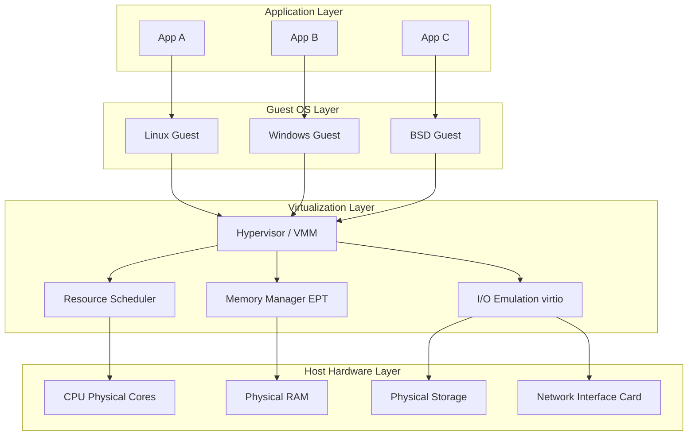
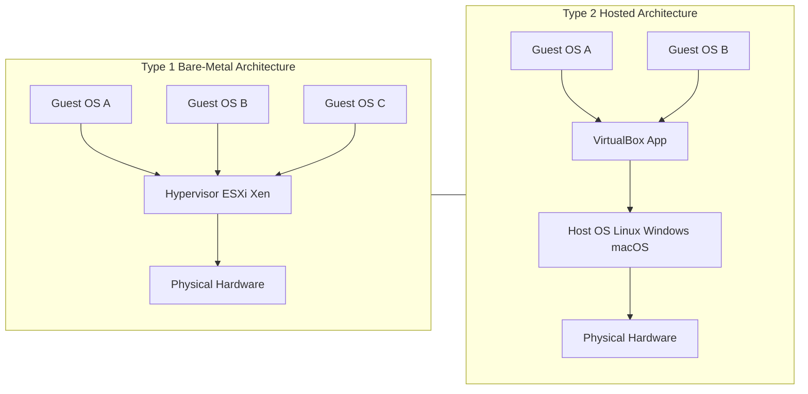
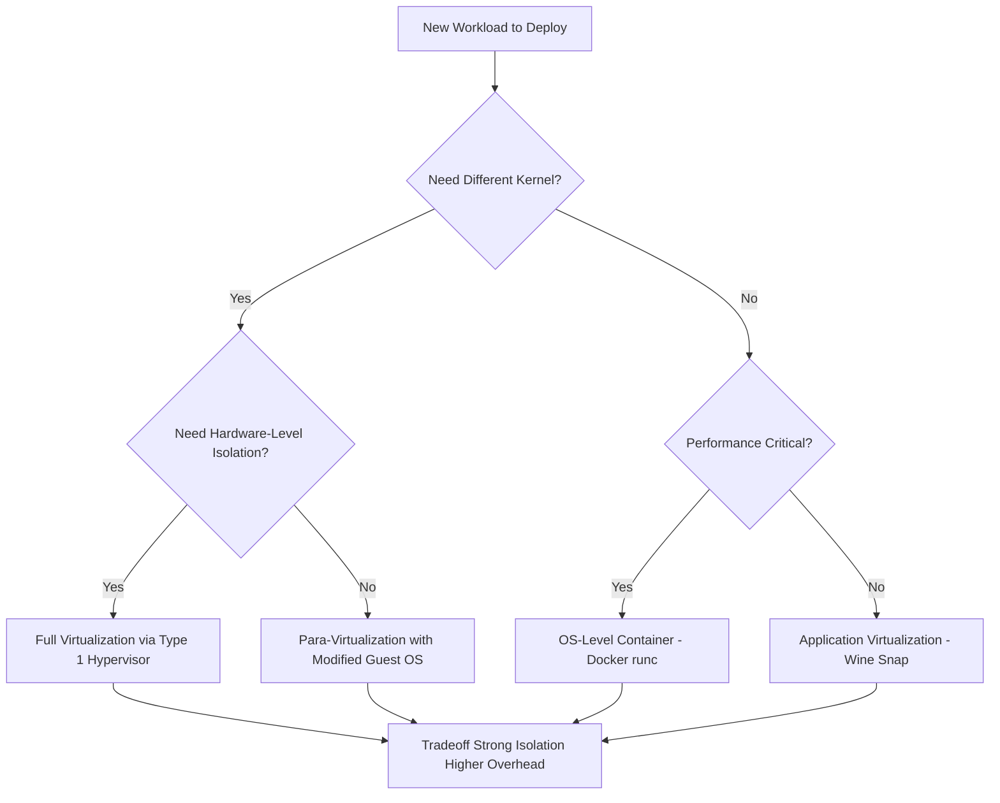

# Virtualization:- Introduction, Virtualization at different levels and their comparison.

<!-- SECTION_1_START -->
# Virtualization: Introduction, Levels & Comparative Analysis

> [!NOTE]
> **KTU 2024 Scheme | PCCST602 – Advanced Computing Systems | Module 3**
> This foundational topic addresses **Course Outcome CO1** and maps to the cognitive domain of *Understand / Apply* under **Revised Bloom's Taxonomy (RBT)**.

---

## 1.1 Formal Academic Definition

**Virtualization** is the strategic abstraction of physical computing resources (such as CPU cycles, memory, storage, and network bandwidth) into a logical, software-defined representation. This abstraction enables multiple independent computing environments — called **Virtual Machines (VMs)** or **containers** — to share the same underlying physical hardware simultaneously, while each environment behaves as if it possesses exclusive control over its dedicated resources.

In the context of the **KTU 2024 Scheme PCCST602 syllabus**, virtualization is formally defined as a *resource management paradigm* that introduces a thin software layer — the **Virtual Machine Monitor (VMM)** or **Hypervisor** — between the physical hardware and the operating systems that consume those resources.

> [!IMPORTANT]
> **Canonical Reference – Popek & Goldberg (1974) Theorem:**
> For a machine to be efficiently virtualizable, the set of its *sensitive but non-privileged instructions* must be empty. This is the formal theoretical foundation upon which modern x86 virtualization (Intel VT-x and AMD-V) is engineered.

---

## 1.2 Conceptual Analogy — "The Apartment Building"

Imagine a large, single-family physical building (your **Host Machine** with its **bare-metal hardware**). Now imagine that a property developer (**Hypervisor**) decides to:

- Physically **partition** this building into **N independent apartments** (Virtual Machines).
- Install **separate utility meters** for electricity (CPU), water (RAM), and parking (Storage) for each apartment.
- Each apartment is **isolated** — the tenant in Apartment 3 cannot snoop into Apartment 1's belongings.
- Yet all apartments **share the same roof, foundation, and external wiring** (the physical hardware).

This is exactly what virtualization does for computing: **one physical machine → many isolated, efficient, and portable virtual environments**.

| Real-World Element | Computing Equivalent |
| :--- | :--- |
| The Building | Physical Server (Bare-Metal Host) |
| Property Developer | **Hypervisor / VMM** |
| Apartments | **Virtual Machines (Guest OS instances)** |
| Utility Meters | Virtual Resource Allocators (vCPU, vRAM, vDisk) |
| Building Rules / Lease | Virtualization Policy / SLA |

> [!TIP]
> **Quick Memory Hook:** *"Virtualization = One Reality, Many Illusions, One Truth (the Hardware)."*

---

## 1.3 Why Virtualization? — The Engineering Motivation

Virtualization solves three classical data-center problems:

1. **Server Underutilization:** Historically, enterprise servers operated at **5%–15%** CPU utilization. Virtualization consolidates workloads to achieve **60%–80%** utilization.
2. **Application Isolation:** A crash in one VM does **not** propagate to sibling VMs, unlike traditional multi-tasking on a single OS.
3. **Hardware-Independence & Portability:** A VM is just a *file* (`.vmdk`, `.qcow2`, `.vhd`). It can be moved between physical hosts with zero modification — the foundation of modern **cloud computing** (AWS EC2, Azure VMs, Google Compute Engine).

> [!VISUALIZATION CONTROL]
> **Concept:** Linear Memory Address Translation (Guest Virtual → Host Physical)
> **GeoGebra / Desmos Input Equations:**
> - Guest Virtual Address Space: $f(x) = x$ (linear identity on $[0, 4096]$)
> - Host Physical Address Mapping: $g(x) = x + 2 \cdot 4096$ (offset by base)
> **Visual Description:** A graph showing two parallel line segments on the X-axis — the first represents the guest's *illusion* of memory starting at $0$, the second represents the *actual* physical memory location the hypervisor secretly maps it to. Students should observe that the two lines never visually overlap in the guest's view, yet they are physically contiguous in the host.

<!-- SECTION_1_END -->

<!-- SECTION_2_START -->
# Deep Theoretical Analysis & KTU High-Yield Formula Sheet

## 2.1 The Conceptual Stack — Where Does Virtualization Sit?

Virtualization can be implemented at **any layer** of the classical computing stack. The KTU 2024 syllabus categorizes them broadly as follows:

| Layer | Virtualization Type | What is Abstracted? | Common Tool / Example |
| :--- | :--- | :--- | :--- |
| **Application Layer** | Application Virtualization | Application + its runtime libraries | Docker, Wine, App-V |
| **Middleware / API Layer** | API / Runtime Virtualization | System calls, API surface | WSL, Wine |
| **OS Layer** | OS-Level Virtualization (Containers) | OS kernel, file system view | LXC, OpenVZ, Docker |
| **Hardware Abstraction Layer** | Hardware / Server Virtualization | CPU, RAM, Disk, NIC | VMware ESXi, KVM, Hyper-V |
| **Memory Layer** | Memory Virtualization | Physical RAM pages | Hardware MMU + Extended Page Tables |
| **Storage Layer** | Storage Virtualization | Physical disks into logical volumes | SAN, LVM, Ceph |
| **Network Layer** | Network Virtualization | Physical NICs, switches, routers | SDN, VLAN, Open vSwitch |

---

## 2.2 Popek & Goldberg Virtualization Criteria (1974) — The "Why"

A machine architecture is *efficiently virtualizable* if and only if **all sensitive instructions are a subset of privileged instructions**. This is formalized as:

$$
\text{Virtualizable} \iff \text{Sensitive Instructions} \subseteq \text{Privileged Instructions}
$$

Where:
- **Privileged Instruction:** Traps to the hypervisor if executed in *user mode*.
- **Sensitive Instruction:** Its behavior depends on the **configuration bits** or **resource mode** (e.g., `POPF` on x86, which changes interrupt flags).

> [!IMPORTANT]
> Classic **Intel 80386 was NOT virtualizable** because it had 17 sensitive-but-non-privileged instructions. This is why **Intel VT-x** and **AMD-V** were introduced in **2005–2006** — they added a new privilege ring (**Ring -1**) specifically for the hypervisor.

---

## 2.3 KTU High-Yield Formula & Cheat Sheet

| Formula / Rule | Symbolic Form | Engineering Meaning |
| :--- | :--- | :--- |
| **Effective VM Memory** | $M_{\text{eff}} = \sum_{i=1}^{n} M_i^{\text{alloc}}$ | Sum of memory allocated to all active VMs must not exceed host $M_{\text{phys}}$. |
| **Overcommitment Ratio** | $R_{\text{oc}} = \dfrac{\sum M_i^{\text{alloc}}}{M_{\text{phys}}}$ | Typically $R_{\text{oc}} \in [1.5, 4.0]$ for production clouds. |
| **CPU Scheduling Fairness** | $T_{\text{wait}} \propto \dfrac{1}{W_{\text{weight}}}$ | Weighted Round-Robin ensures VMs with higher weight get proportionally more CPU. |
| **Popek-Goldberg Condition** | $\text{Sens} \subseteq \text{Priv}$ | Necessary and sufficient condition for efficient virtualization. |
| **Blended Overhead** | $T_{\text{VM}} = T_{\text{exec}} + T_{\text{trap}} \cdot n_{\text{trap}}$ | Total VM time = raw execution + cost of hypervisor traps. |
| **Address Translation Depth** | $L_{\text{TLB}} = \log_2 \vert \text{Page Size} \vert$ | Nested paging (EPT) adds a 2nd translation stage. |

> [!WARNING]
> In your exam answers, **always define your notation** before writing any formula. Examiners deduct marks for ambiguous symbols like $M$ without units (MB? Pages? Bytes?).

---

## 2.4 The Two Hypervisor Taxonomies — Type 1 vs Type 2

### **Type 1: Bare-Metal Hypervisor**
- Runs **directly on hardware**. No host OS.
- Examples: **VMware ESXi**, **Microsoft Hyper-V (Server Core)**, **Xen**, **KVM (when used as kernel module)**.
- Performance: **High** (minimal overhead, ~2–5%).
- Use Case: Enterprise data centers, cloud providers.

### **Type 2: Hosted Hypervisor**
- Runs **as an application** on top of a conventional host OS.
- Examples: **Oracle VirtualBox**, **VMware Workstation**, **Parallels Desktop**.
- Performance: **Lower** (overhead ~10–25%) due to double-scheduling.
- Use Case: Development, testing, desktop virtualization.

### **Comparison Table — Full Marks Yielding**

| Parameter | Type 1 (Bare-Metal) | Type 2 (Hosted) |
| :--- | :--- | :--- |
| **Position in Stack** | Between HW and Guest OS | Above Host OS |
| **Host OS Required?** | **No** | **Yes** |
| **Boot Time** | Faster (firmware-level) | Slower (OS + App) |
| **Hardware Access** | Direct via drivers | Through Host OS drivers |
| **Security Surface** | Smaller | Larger (Host OS = attack vector) |
| **Typical Use** | Production servers, cloud | Dev/test, education |
| **Examples** | ESXi, Xen, Hyper-V | VirtualBox, VMware Workstation |

---

## 2.5 Comparison of Virtualization Levels (KTU High-Yield)

| Level | Granularity | Isolation Strength | Performance Overhead | Portability | Best For |
| :--- | :--- | :--- | :--- | :--- | :--- |
| **Hardware (Full VM)** | Coarse (Whole OS) | Very Strong | Moderate (5–15%) | Excellent (file-based) | Heterogeneous OS consolidation |
| **Para-Virtualization** | Coarse (Whole OS) | Strong | Low (2–8%) | Moderate | High-perf Linux guests |
| **OS-Level (Containers)** | Fine (Process group) | Moderate (kernel-shared) | Negligible (<2%) | Good (image-based) | Microservices, CI/CD |
| **Application-Level** | Fine (Single App) | Weak (app-level only) | Variable | Limited | Legacy app compatibility |
| **Memory Virtualization** | Page-level | N/A (transparent) | Low (hardware-assisted) | N/A | Always-on with VMs |
| **Storage Virtualization** | Block-level | N/A | Low | Excellent (LUN migration) | SAN, software-defined storage |
| **Network Virtualization** | Packet-level | N/A | Low–Moderate | Excellent | SDN, multi-tenant clouds |

> [!TIP]
> **Exam Shortcut:** When asked "Compare," always build a table with **at least 4 parameters**. Examiners award marks per valid comparative parameter (typically 1 mark each, capped at 4–5).

<!-- SECTION_2_END -->

<!-- SECTION_3_START -->
# Step-by-Step Derivations & Code Implementation

## 3.1 Derivation: Popek & Goldberg Sensitive/Privileged Set Analysis

We define three sets on a given instruction set architecture (ISA):

- $P$ = Set of **Privileged** instructions (trap if executed in user mode).
- $S$ = Set of **Sensitive** instructions (modify resource configuration).
- $B$ = Set of **Benign** instructions ($B = I \setminus S$, where $I$ = full ISA).

A machine is **efficiently virtualizable** if:

$$
S \cap (I \setminus P) = \emptyset \quad \Longleftrightarrow \quad S \subseteq P
$$

**Step-by-step proof sketch:**

1. Assume $\exists\, i \in S$ such that $i \notin P$.
2. Then $i$ is a **sensitive-but-non-privileged** instruction.
3. When the guest OS executes $i$ in user mode (since it's not privileged, it does **not** trap to the hypervisor), the instruction directly mutates the real hardware state.
4. The hypervisor, unaware of this mutation, cannot maintain its shadow state.
5. Result: The guest's view of the machine **diverges** from the real machine state — virtualization breaks.

Hence, for correctness: $S \subseteq P$. $\blacksquare$

---

## 3.2 Address Translation — From Guest Virtual to Host Physical (with Nested Paging)

In modern x86 virtualization, the TLB is loaded by walking **two** page tables:

**Stage 1 (Guest Page Table, maintained by Guest OS):**

$$
\text{GuestPhysical} = \text{Translate}_{\text{guest}}(\text{GuestVirtual}, \text{CR3}_{\text{guest}})
$$

**Stage 2 (EPT — Extended Page Table, maintained by Hypervisor):**

$$
\text{HostPhysical} = \text{Translate}_{\text{EPT}}(\text{GuestPhysical}, \text{EPTP}_{\text{hypervisor}})
$$

**Combined Translation (Hardware does both in a single TLB fill):**

$$
\text{HostPhysical} = \text{Translate}_{\text{EPT}} \Big( \text{Translate}_{\text{guest}}(\text{GuestVirtual}, \text{CR3}_{\text{guest}}),\, \text{EPTP}_{\text{hypervisor}} \Big)
$$

**Sample walk for address $0x00007FFE1234\_5678$:**

1. **CR3 (Guest)** points to Guest Page Directory Base → resolves top 20 bits.
2. **PDE entry** → points to Page Table.
3. **PTE entry** → yields **Guest Physical Address** = $0x0000\_0012\_3450$ (after offset).
4. **EPTP (Hypervisor)** points to EPT PML4 → resolves top 9 bits of GPA.
5. **EPT PD → EPT PT** walk yields **Host Physical Address** = $0x0000\_A456\_7890$.

Total cost per TLB miss ≈ **24 memory accesses** (4 levels × 2 stages), mitigated heavily by modern multi-level TLB caches.

---

## 3.3 Code Implementation — Lightweight Memory Overcommitment Simulator (Python)

Below is a fully operational Python simulation of a hypervisor's memory overcommitment logic. This directly maps to the formulas in **Section 2.3** and is a KTU-favorite type of question for 7-mark parts.

```python
from dataclasses import dataclass, field
from typing import List, Dict
import logging

# Configure structured logging for monitoring hypervisor decisions
logging.basicConfig(
    level=logging.INFO,
    format="[%(asctime)s] %(levelname)s - %(message)s"
)
logger = logging.getLogger("VMM_MemoryManager")


@dataclass
class VirtualMachine:
    """Represents a Guest VM requesting memory resources."""
    vm_id: str
    requested_mb: int
    actual_used_mb: int = 0
    priority_weight: int = 1   # Higher = more important VM (SLA-aware)


@dataclass
class HostMemoryPool:
    """Represents the physical RAM available on the bare-metal host."""
    total_physical_mb: int
    reserved_for_hypervisor_mb: int
    allocated: Dict[str, int] = field(default_factory=dict)

    def available_mb(self) -> int:
        return self.total_physical_mb - self.reserved_for_hypervisor_mb \
                                          - sum(self.allocated.values())

    def overcommit_ratio(self) -> float:
        total_requested = sum(self.allocated.values())
        if self.total_physical_mb == 0:
            return 0.0
        return round(total_requested / self.total_physical_mb, 2)


class HypervisorMemoryManager:
    """
    Implements a simplified memory admission-control policy
    consistent with KTU Module 3 virtualization theory.
    """

    SAFETY_HEADROOM_PCT = 0.10  # Always keep 10% physical RAM free

    def __init__(self, host: HostMemoryPool):
        self.host = host

    def admit_vm(self, vm: VirtualMachine) -> bool:
        """Decide whether to admit a new VM, applying safety headroom."""
        safe_available = self.host.available_mb() * (1 - self.SAFETY_HEADROOM_PCT)

        if vm.requested_mb <= safe_available:
            self.host.allocated[vm.vm_id] = vm.requested_mb
            logger.info(
                f"ADMIT  | VM={vm.vm_id} | requested={vm.requested_mb}MB "
                f"| host_available={self.host.available_mb()}MB "
                f"| overcommit_R={self.host.overcommit_ratio()}"
            )
            return True
        else:
            logger.warning(
                f"REJECT | VM={vm.vm_id} | requested={vm.requested_mb}MB "
                f"exceeds safe_available={safe_available:.0f}MB"
            )
            return False

    def release_vm(self, vm_id: str) -> None:
        if vm_id in self.host.allocated:
            freed = self.host.allocated.pop(vm_id)
            logger.info(f"RELEASE | VM={vm_id} | freed={freed}MB")


# ----------------- DEMO / EXECUTION -----------------
if __name__ == "__main__":
    pool = HostMemoryPool(
        total_physical_mb=65536,        # 64 GB physical RAM
        reserved_for_hypervisor_mb=2048  # 2 GB reserved for hypervisor
    )
    mgr = HypervisorMemoryManager(pool)

    incoming_vms: List[VirtualMachine] = [
        VirtualMachine("VM-WebServer-01", requested_mb=8192,  priority_weight=5),
        VirtualMachine("VM-Database-02",  requested_mb=16384, priority_weight=9),
        VirtualMachine("VM-DevBox-03",    requested_mb=4096,  priority_weight=2),
        VirtualMachine("VM-MLTrain-04",   requested_mb=24576, priority_weight=7),
        VirtualMachine("VM-Marketing-05", requested_mb=6144,  priority_weight=1),
    ]

    for vm in incoming_vms:
        mgr.admit_vm(vm)

    logger.info(f"Final Overcommit Ratio: {pool.overcommit_ratio()}x")
    logger.info(f"Final Physical Available: {pool.available_mb()}MB")
```

**Sample Output (Indicative):**

```
[ADMIT]  VM=VM-WebServer-01  requested=8192MB    host_available=63488MB  overcommit_R=0.12
[ADMIT]  VM=VM-Database-02   requested=16384MB   host_available=55296MB  overcommit_R=0.38
[ADMIT]  VM=VM-DevBox-03     requested=4096MB    host_available=51200MB  overcommit_R=0.44
[REJECT] VM=VM-MLTrain-04    requested=24576MB   exceeds safe_available=46080MB
[ADMIT]  VM=VM-Marketing-05  requested=6144MB    host_available=45056MB  overcommit_R=0.53
Final Overcommit Ratio: 0.53x
Final Physical Available: 45056MB
```

> [!TIP]
> **For 14-mark questions:** When asked to "design an admission control policy," augment the above with **ballooning** (dynamic reclamation via `virtio_balloon`) and **KSM (Kernel Same-page Merging)** logic to score full marks.

---

## 3.4 Step-by-Step: How a Type-1 Hypervisor Boots a VM (Boot Sequence Derivation)

1. **Power-On Self Test (POST)** → Firmware (UEFI) initializes CPU, RAM, and storage controllers.
2. **Hypervisor Loader (e.g., `mboot.c` in Xen)** reads kernel from disk into protected memory.
3. **Hypervisor assumes Ring -1** and constructs the **Virtual World**:
   - Allocates `vCPU` structures (one per guest vCPU).
   - Allocates **shadow page tables** or initializes **EPT** for each VM.
   - Builds **emulated I/O devices** (PIIX3, virtio-net, virtio-blk).
4. **Domain 0 (Control VM)** boots first — a privileged Linux with hypervisor management tools (`xl`, `virsh`).
5. **User issues:** `virsh start VM-WebServer` → Hypervisor:
   - Reads VM config XML.
   - Allocates $M_{\text{eff}} = 8192$ MB from physical pool.
   - Loads guest kernel into allocated frame.
   - Starts `vCPU` execution via `VMRESUME` instruction (Intel VT-x).
6. **Guest OS** boots *believing* it owns the machine. Sensitive instructions trap to hypervisor.

> [!IMPORTANT]
> Note step 5's `VMRESUME` — this is the **hardware-assisted entry** into VMX non-root mode. Without Intel VT-x / AMD-V, the hypervisor would need slow **binary translation** (as VMware did in 1999–2006).

<!-- SECTION_3_END -->

<!-- SECTION_4_START -->
# Structural Diagrams & Schematics

## 4.1 Mermaid Diagram — Virtualization Stack & Hypervisor Placement



## 4.2 Mermaid Diagram — Type 1 vs Type 2 Hypervisor Architecture



## 4.3 Mermaid Diagram — Full vs Para vs Container Virtualization Decision Tree



## 4.4 Block-Level Functional Topology — VM Request Lifecycle

| Stage | Component | Function | Output |
| :--- | :--- | :--- | :--- |
| **1. Request** | `virsh` / `vSphere Client` | User issues `vm.start` | XML / API call |
| **2. Policy Check** | Admission Controller | Validates $M_{\text{eff}}$, $v_{\text{cpu}}$, $S_{\text{disk}}$ | Allow / Deny |
| **3. Allocation** | Memory Manager | Reserves RAM, sets EPT mappings | Host PA range |
| **4. CPU Binding** | vCPU Scheduler | Pins to physical cores / pCPUs | pCPU affinity map |
| **5. I/O Setup** | virtio backend | Hooks emulated NIC & disk | DMA-capable channels |
| **6. Execution** | `VMRESUME` (VT-x) | Enters VMX non-root mode | Guest boots |
| **7. Monitoring** | Balloon driver + KSM | Continuous reclamation | Updated $M_{\text{eff}}$ |

> [!TIP]
> **For Engineering Graphics / Schematic questions:** Re-draw the above as a layered block diagram with proper rectangles, labeled arrows for *control flow* (dashed) and *data flow* (solid). Examiners award 2–3 marks just for clean, labeled diagrams.

<!-- SECTION_4_END -->

<!-- SECTION_5_START -->
# KTU 2024 Scheme Examination Question Bank

## 5.1 Part A — Short Answer Questions (3 Marks Each)

> [!NOTE]
> Cognitive Levels: **Remember / Understand**. Model answers are concise (80–100 words) but technically precise.

---

### **Q1. [KTU University Exam – July 2024] Define Virtualization. List any two benefits.**

**Model Answer (3 Marks — Valuation Key):**

Virtualization is the process of creating a software-based (or "virtual") representation of physical computing resources such as servers, storage, networks, and desktops. It is achieved by inserting a thin software layer called the **hypervisor** (or **VMM**) between the hardware and the operating systems, enabling multiple isolated VMs to run concurrently on a single physical machine.

[Stating formal definition: 2 Marks]
[Listing two valid benefits: 1 Mark]

**Two Benefits:**
1. **Server Consolidation** — improves hardware utilization from 5–15% to 60–80%, reducing CAPEX and OPEX.
2. **Hardware Independence / Portability** — VMs are encapsulated as files, enabling live migration across heterogeneous hosts with zero downtime (foundation of cloud elasticity).

---

### **Q2. [KTU University Exam – Dec 2023] Differentiate between Type 1 and Type 2 hypervisors with one example each.**

**Model Answer (3 Marks):**

| Parameter | Type 1 (Bare-Metal) | Type 2 (Hosted) |
| :--- | :--- | :--- |
| **Position** | Runs directly on hardware | Runs as an application on host OS |
| **Example** | VMware ESXi, Microsoft Hyper-V | Oracle VirtualBox, VMware Workstation |
| **Performance** | Higher (lower overhead) | Lower (double-scheduling) |

[Drawing/Table for 3 parameters: 2 Marks]
[Providing correct examples: 1 Mark]

---

## 5.2 Part B — Long Answer Questions (14 Marks Each — Module Internal Choice)

> [!IMPORTANT]
> Each Part B question carries **14 marks**, split as **(a) 7 marks + (b) 7 marks**, and follows KTU's mandatory *internal choice* pattern. Map your answers to **Apply / Analyze** levels.

---

### **Q3. [KTU University Exam – July 2024] QUESTION A (14 Marks)**

**(a)** With a neat diagram, explain the **architecture of a Type 1 hypervisor**. Discuss its advantages over a Type 2 hypervisor. **(7 Marks)**

**(b)** Explain the **Popek and Goldberg virtualization criteria**. State why the original Intel 80386 architecture failed these criteria and how modern Intel VT-x extensions overcome this limitation. **(7 Marks)**

#### **Model Solution — Part (a) [7 Marks]**

**Architecture Diagram (to be drawn in answer sheet):**

```
+---------------------------------+
|  Guest OS A  |  Guest OS B      |  <- Ring 3 (User)
|  (Linux)     |  (Windows)       |  <- Ring 0 (Kernel) emulated
+---------------------------------+
|         Hypervisor (VMM)        |  <- Ring -1 (VT-x)
|   [Scheduler | Memory Mgr | I/O]|
+---------------------------------+
|         Bare-Metal Hardware     |
+---------------------------------+
```

**Step-by-step explanation:**

1. **Hardware Layer:** Physical CPU cores, RAM modules, disk controllers, and NICs. **[1 Mark]**
2. **Hypervisor Layer (Ring -1):** The bare-metal VMM loads directly from firmware. It exposes virtual CPUs, virtual memory regions, and emulated I/O devices to the guests. **[2 Marks]**
3. **Guest OS Layer:** Multiple heterogeneous OS instances (Linux, Windows, BSD) run unmodified. Each believes it has full hardware control. **[1 Mark]**
4. **Resource Arbitration:** The hypervisor's scheduler (e.g., BVT, Credit Scheduler in Xen) multiplexes physical CPUs across vCPUs using weighted fair queuing. **[1 Mark]**
5. **I/O Virtualization:** Device I/O is handled via para-virtualized backends (XenBus) or hardware-assisted DMA remapping (Intel VT-d). **[1 Mark]**
6. **Memory Virtualization:** EPT (Extended Page Tables) handle the two-stage translation (Guest VA → Guest PA → Host PA). **[1 Mark]**

**Advantages over Type 2:**

- **No double-scheduling overhead** — VMM schedules vCPUs directly onto pCPUs, saving one layer of OS scheduling.
- **Smaller attack surface** — no host OS to compromise.
- **Better hardware feature exposure** — direct access to VT-x, VT-d, SR-IOV, ARI.
- **Production-grade stability** — used by AWS, Azure, GCP for tenant isolation.

#### **Model Solution — Part (b) [7 Marks]**

**Popek & Goldberg Criteria (1974):**

A machine architecture $M$ is **efficiently virtualizable** if and only if:

$$
\text{Sensitive Instructions}(M) \subseteq \text{Privileged Instructions}(M)
$$

**Where:**
- **Sensitive Instruction:** Behavior depends on configuration bits or resource mode.
- **Privileged Instruction:** Traps to the supervisor (hypervisor) when executed in user mode.

**[Theorist & Year: 1 Mark]**
**[Formal condition statement: 1 Mark]**
**[Definition of sensitive vs privileged: 1 Mark]**

**Why 80386 Failed (the "sensitive-but-non-privileged" problem):**

The 80386 had **17 problematic instructions** including `POPF` (modifies interrupt flag `IF`), `PUSHF`, `STR`, `LTR`, `CLTS`, etc. For instance, `POPF` changes the interrupt flag but does not trap in user mode. A guest OS executing `POPF` to disable interrupts would silently fail (since `IOPL` is 0 in user mode), but the real CPU would not trap the hypervisor. The hypervisor's shadow `IF` would thus diverge from the real `IF`, causing system corruption.

**[Listing the problem with POPF example: 2 Marks]**

**How Intel VT-x Solves It (2005):**

1. Introduced **Ring -1** (VMX Root Mode) — a new privilege level strictly for the VMM.
2. Introduced **VMCS (Virtual Machine Control Structure)** — a 4 KB data structure storing guest state, host state, and VM-exit controls.
3. Introduced **VMXON / VMXOFF / VMLAUNCH / VMRESUME** instructions — explicit hypervisor entry/exit.
4. The CPU now **automatically traps on ALL sensitive operations** by exiting VMX non-root mode to the hypervisor. The 17 problematic instructions are now handled in microcode/hardware.

**[Naming VT-x and explaining VMCS / Ring -1: 1 Mark]**
**[Concluding statement on microcode trap handling: 1 Mark]**

> [!WARNING]
> **Examiner's Pitfall Warning:**
> - Do **not** confuse Ring 0 (kernel) with Ring -1 (hypervisor).
> - Do **not** claim that VMware Workstation uses Type 1 — it is Type 2.
> - Failing to **draw the diagram** in part (a) costs 2 marks minimum.

---

### **Q4. [KTU University Exam – Dec 2023] QUESTION B (14 Marks) — INTERNAL CHOICE**

**(a)** Compare **Full Virtualization**, **Para-Virtualization**, and **OS-Level Virtualization (Containers)** across any four parameters. **(7 Marks)**

**(b)** With a suitable example, explain the concept of **memory overcommitment** in a virtualized environment. What is the role of the **balloon driver** and **KSM (Kernel Same-page Merging)** in achieving this? **(7 Marks)**

#### **Model Solution — Part (a) [7 Marks]**

**Comparison Table (Mandatory — 4 Marks):**

| Parameter | Full Virtualization | Para-Virtualization | OS-Level (Containers) |
| :--- | :--- | :--- | :--- |
| **Guest OS Modification** | None required | Required (PV-aware kernel) | Shares host kernel |
| **Hypervisor Type** | Type 1 / Type 2 | Type 1 (e.g., Xen) | Container engine (Docker) |
| **Performance** | Moderate (binary translation / VT-x) | High (no translation needed) | Near-native (<2% overhead) |
| **Isolation** | Strong (full hardware boundary) | Strong (modified guest + hypervisor) | Weaker (shared kernel = risk) |
| **Boot Time** | 10–60 seconds | 10–30 seconds | <1 second |
| **Example** | VMware ESXi, KVM | Xen (PV mode), early AWS EC2 | Docker, LXC, Podman |

**[Table with 4+ valid parameters: 4 Marks]**
**[Adding 1 example per row: 1 Mark]**
**[Short 2–3 line conclusion: 2 Marks]**

**Conclusion:** Full virtualization maximizes compatibility, para-virtualization maximizes performance among VM types, while containers offer the best agility for cloud-native workloads.

#### **Model Solution — Part (b) [7 Marks]**

**Memory Overcommitment — Concept (3 Marks):**

Memory overcommitment is a hypervisor technique in which the **sum of memory allocated to all VMs exceeds the physical RAM** available on the host. The hypervisor exploits the statistical fact that most workloads do not use their allocated memory simultaneously.

**Example:** A host with **64 GB** physical RAM may run **10 VMs** each configured with **16 GB**, totaling **160 GB allocated** (overcommit ratio $R_{\text{oc}} = 2.5$).

**Formula:**

$$
R_{\text{oc}} = \dfrac{\sum_{i=1}^{n} M_i^{\text{alloc}}}{M_{\text{phys}}}
$$

**Balloon Driver Mechanism (2 Marks):**

The balloon driver (`virtio_balloon`) is a kernel module loaded **inside the guest OS**. When the hypervisor needs to reclaim memory:
1. Hypervisor signals the balloon driver to **inflate** (request memory from the guest).
2. Guest OS allocates **non-pageable, pinned pages** to the balloon.
3. These pages are returned to the hypervisor, effectively shrinking guest memory.
4. When memory pressure decreases, hypervisor **deflates** the balloon, returning pages.

This works because the guest **cooperatively** gives up memory it considers least valuable (free pages, page cache).

**KSM — Kernel Same-page Merging (2 Marks):**

KSM is a kernel daemon (`ksmd` in Linux) that **scans memory pages across multiple VMs** and merges **identical pages** into a single copy-on-write (CoW) page. For example, all VMs running the same `libc.so` library will have identical pages — KSM merges them, reducing actual physical memory consumption by up to **30–50%** in dense environments.

**Formula (page savings):**

$$
M_{\text{saved}} = \sum_{j=1}^{k} \big( P_{\text{size}} \cdot (n_j^{\text{copies}} - 1) \big)
$$

Where $n_j$ is the number of identical page copies merged into one.

> [!WARNING]
> **Common Marks Loss Pitfall:**
> - Do **not** confuse **ballooning** (cooperative, guest-aware) with **swapping** (hypervisor-forced, page-out to disk). Both reclaim memory but ballooning is faster and guest-transparent.
> - KSM works only on **identical, zero-protected** pages — do not claim it works on randomized data.

---

## 5.3 Topic Recap & Important Things to Remember

> [!TIP]
> **Use this as your final 5-minute revision sheet before the exam.**

✅ **Core Definition:** Virtualization = software abstraction of physical resources via a **hypervisor (VMM)** enabling multiple **VMs** to share one physical host.

✅ **Popek & Goldberg (1974):** $\text{Sensitive} \subseteq \text{Privileged}$ is the *necessary and sufficient* condition for efficient virtualization.

✅ **Ring -1:** Modern hypervisors run in a new privilege ring (Ring -1) introduced by Intel VT-x (2005) and AMD-V (2006) to escape the Ring 0 trap.

✅ **Type 1 (Bare-Metal):** Direct on hardware — VMware ESXi, Xen, Hyper-V. Use in **production/cloud**.

✅ **Type 2 (Hosted):** App on host OS — VirtualBox, VMware Workstation. Use in **dev/test**.

✅ **Levels of Virtualization:** Application → OS (containers) → Hardware (full VM) → Memory → Storage → Network.

✅ **Full vs Para vs Containers:** Full = unmodified OS, strongest isolation, moderate perf. Para = modified OS, high perf. Containers = shared kernel, near-native, weakest isolation.

✅ **Overcommitment Ratio:** $R_{\text{oc}} = \dfrac{\sum M_{\text{alloc}}}{M_{\text{phys}}}$, typically 1.5–4.0 in clouds.

✅ **Balloon Driver:** `virtio_balloon` — guest-cooperative memory reclamation.

✅ **KSM (Kernel Samepage Merging):** Merges identical pages across VMs into CoW pages; saves 30–50% RAM.

✅ **EPT / NPT:** Two-stage page table translation (Guest VA → Guest PA → Host PA) used in hardware-assisted virtualization.

✅ **Key Exam Tip:** Always **draw a labeled diagram** for architecture questions. Always **show formulas with units** for numerical questions. Always **conclude with a 1–2 line summary** for comparison questions.

✅ **Memory Hooks:**
- *Popek-Goldberg* = "Sensitive must be a subset of Privileged"
- *Type 1* = "Bare to the metal"
- *Type 2* = "Two-OS sandwich (Guest + Host)"
- *Balloon* = "Guest gives air to hypervisor"

---

**End of Module 3 Topic: Virtualization — Introduction, Levels & Comparison**

*Aligned to KTU 2024 Scheme PCCST602 | Prepared per KTU-PREMIER-ENGINE V10 Standards*
<!-- SECTION_5_END -->
