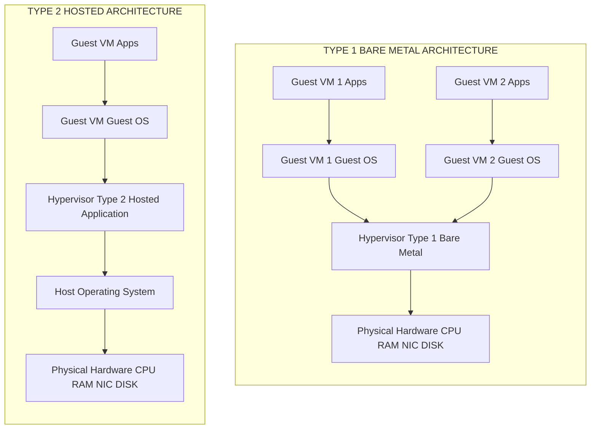
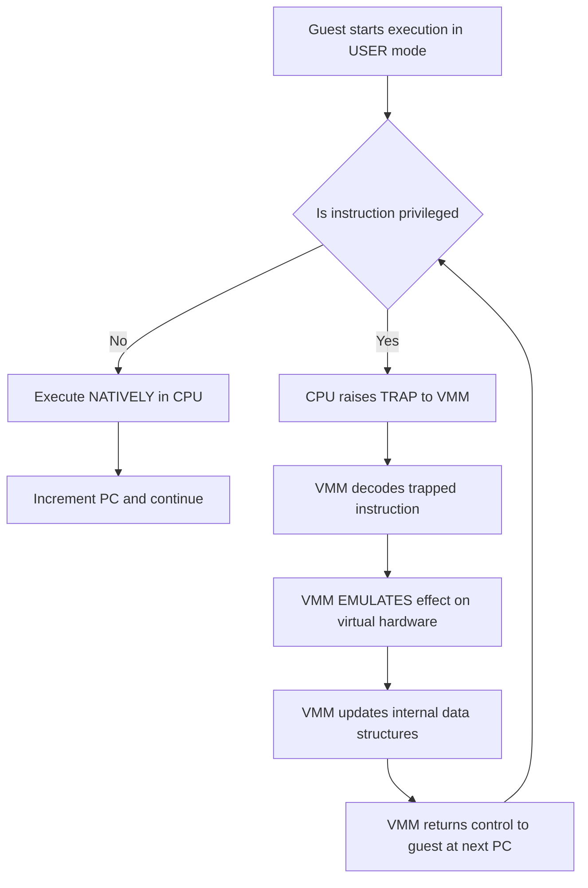
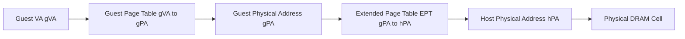
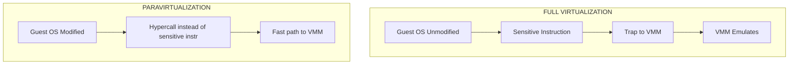
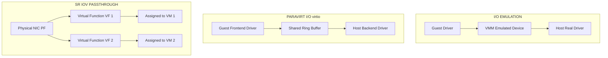
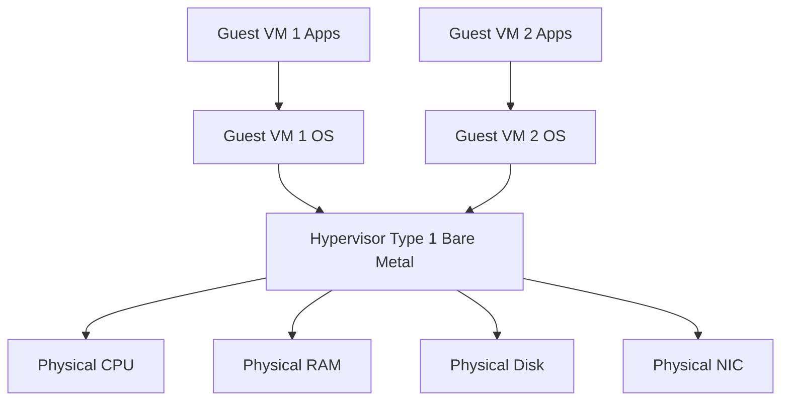

# Virtualization structures and mechanisms.

<!-- SECTION_1_START -->
# Virtualization Structures and Mechanisms

## 1. Core Technical Definition

> [!IMPORTANT]
> **Virtualization** is the process of creating a software-based (virtual) representation of physical computing resources — such as processors, memory, storage, and network interfaces — using a dedicated software abstraction layer called a **Virtual Machine Monitor (VMM)** or **Hypervisor**. The hypervisor partitions one physical machine into multiple isolated **Virtual Machines (VMs)**, each of which behaves as if it owns the underlying hardware.

According to the **Popek and Goldberg virtualization theorem (1974)**, a given computer architecture is *efficiently virtualizable* if and only if every **sensitive instruction** (an instruction whose behavior depends on, or modifies, the system resources) is also a **privileged instruction** (an instruction that traps to the supervisor when executed in user mode).

$$
\text{Virtualizable} \iff \text{Sensitive Instructions} \subseteq \text{Privileged Instructions}
$$

> [!NOTE]
> **Why this matters in KTU 2024 Scheme:** Module 3 of PCCST602 expects you to clearly differentiate between **virtualization structures** (how the hypervisor is deployed) and **virtualization mechanisms** (how the hypervisor achieves isolation and emulation).

## 2. Intuitive Analogy: The Apartment Building

Imagine a 10-floor building (the **physical hardware**) that is managed by a single building manager (the **hypervisor**). The manager divides the building into separate apartments (the **Virtual Machines**). Each tenant:

- Believes they have the entire building to themselves (illusion of exclusive hardware).
- Cannot enter another tenant's apartment (isolation).
- Pays rent to the manager (resource scheduling).
- Calls the manager for any plumbing/electrical issue (privileged operations → trap to VMM).

The building manager can operate in two ways:
1. **Type 1 Manager** — lives in the building itself and directly handles all utilities (bare-metal hypervisor).
2. **Type 2 Manager** — works from a separate office and calls the utility company for every issue (hosted hypervisor).

## 3. Two Pillars of Virtualization

> [!TIP]
> **KTU 2024 Module 3 Focus:** You will be examined on the *separation* between **Structures** (deployment architecture) and **Mechanisms** (CPU/Memory/IO techniques used inside).

| Pillar | Meaning | KTU Examples |
| :--- | :--- | :--- |
| **Structures** | How the hypervisor is positioned relative to the hardware | Type-1, Type-2, Hybrid |
| **Mechanisms** | How the hypervisor enforces isolation and emulates hardware | Trap-and-emulate, Binary Translation, Paravirtualization, Hardware-assisted VT-x/AMD-V |

> [!VISUALIZATION CONTROL]
> **Concept:** Hypervisor Position with Respect to Hardware Stack
> **GeoGebra / Desmos Input Equations:** Conceptual 2D plane
> * `x-axis = privilege level` from `0 (kernel)` to `4 (user)`
> * `y-axis = software layers` ascending from hardware to applications
> **Visual Description:** Plot Type-1 hypervisor as a horizontal line at level 1 (directly above hardware) and Type-2 hypervisor as a horizontal line at level 3 (above the host OS). You will observe that the Type-1 line is closer to the hardware axis, indicating lower overhead and higher performance.
<!-- SECTION_1_END -->

<!-- SECTION_2_START -->
# Deep Theoretical Analysis & KTU High-Yield Formula Sheet

## 1. Virtualization Structures (Hypervisor Taxonomy)

### 1.1 Type-1 Hypervisor (Bare-Metal / Native)

* Runs **directly on the physical hardware** without any host OS.
* Also called a **Native Hypervisor** or **Bare-Metal VMM**.
* The hypervisor itself contains the device drivers, resource schedulers, and I/O stacks.
* **Advantages:** High performance, low latency, enterprise-grade stability.
* **Disadvantages:** Driver support is limited; the hypervisor is a custom OS in itself.
* **Production Examples:** VMware ESXi, Microsoft Hyper-V (core), Citrix XenServer, KVM (when configured directly), Nutanix AHV.

### 1.2 Type-2 Hypervisor (Hosted)

* Runs as an **application over a conventional host operating system**.
* The host OS provides the device drivers, file system, and networking.
* **Advantages:** Easy to install, leverages existing host drivers, ideal for desktops and labs.
* **Disadvantages:** Two layers of scheduling (host OS + VMM) → higher overhead.
* **Production Examples:** Oracle VirtualBox, VMware Workstation / Fusion, Parallels Desktop, QEMU (user-mode).

### 1.3 Hybrid Hypervisor (Type 1.5)

* A Type-1 kernel core with a management console that runs in a privileged VM (sometimes called the **Dom0** in Xen).
* Example: Xen, Hyper-V (with parent partition), KVM in Linux.

> [!NOTE]
> **Board Tip:** Examiners often give a **3-mark question** asking you to compare Type-1 vs Type-2. Use a 3-column table: *Property, Type-1, Type-2*.

## 2. Virtualization Mechanisms

### 2.1 The Trap-and-Emulate Mechanism (Classical)

1. The guest VM is run in **user mode** of the physical CPU.
2. Any **privileged instruction** issued by the guest automatically **traps** (raises an exception) to the VMM.
3. The VMM inspects the trapped instruction, **emulates** its effect on the virtual hardware, and resumes the guest.
4. All non-privileged instructions execute natively at full CPU speed.

> [!IMPORTANT]
> The success of *trap-and-emulate* hinges on the Popek–Goldberg property. The x86 architecture **violates** this property in its pre-VT-x form because of ~17 instructions that are *sensitive but not privileged* (e.g., the `PUSHF` and `POPF` instructions when manipulating the interrupt flag `IF`).

### 2.2 Binary Translation (BT)

* Pioneered commercially by **VMware** in the late 1990s.
* At runtime, the VMM scans a **basic block** (a straight-line sequence of guest instructions ending in a branch) of guest machine code.
* It **rewrites** (translates) any unsafe instruction into a **safe, equivalent sequence** that traps safely to the VMM.
* Translated blocks are stored in a **Translation Cache (TC)** to avoid retranslation.
* Overhead: ~10–20% in early implementations; reduced with hardware assist.

### 2.3 Paravirtualization

* The **guest OS kernel is modified** to replace sensitive instructions with explicit **hypercalls** that directly call the VMM.
* Hypercalls use a fast, well-defined ABI (Application Binary Interface).
* **Example:** Xen paravirtualized Linux — the kernel calls `HYPERVISOR_console_io()` instead of writing to a port.
* **Advantages:** Near-native performance, no binary translation overhead.
* **Disadvantages:** Requires open-source or licensed cooperation to patch the guest kernel.

### 2.4 Hardware-Assisted Virtualization

* CPU vendors added new execution modes specifically for virtualization.
  * **Intel VT-x** introduces **VMX** root and VMX non-root modes, plus the `VMCS` (Virtual Machine Control Structure).
  * **AMD-V** introduces **SVM** with the `VMCB` (Virtual Machine Control Block).
* Sensitive instructions that previously executed silently in user mode now trap automatically into the hypervisor.
* Combined with **Extended Page Tables (EPT)** for memory and **VT-d / AMD-Vi** for I/O, this is the modern baseline.

### 2.5 Memory Virtualization Mechanisms

Modern memory virtualization uses **two-level address translation** for each guest memory access:

$$
\text{Guest Virtual (gVA)} \xrightarrow{\text{Guest Page Table}} \text{Guest Physical (gPA)} \xrightarrow{\text{EPT / NPT}} \text{Host Physical (hPA)}
$$

Two canonical implementations exist:

| Technique | Mechanism | Drawback |
| :--- | :--- | :--- |
| **Shadow Page Tables** | VMM maintains a hidden page table that maps gVA $\rightarrow$ hPA directly. Guest page table writes are trapped. | High overhead due to trapping of every page-table modification. |
| **Extended Page Tables (EPT) / Nested Page Tables (NPT)** | Hardware walks both levels automatically. | TLB miss latency is higher because two walks are required. |

### 2.6 I/O Virtualization Mechanisms

* **Full Emulation** — VMM emulates the legacy device in software (e.g., NE2000 NIC).
* **Para-virtualized I/O** — Guest uses front-end drivers that communicate with back-end drivers in the host via shared ring buffers (e.g., Xen `netfront`/`netback`, virtio).
* **Direct Device Assignment (Passthrough)** — A physical device is bound exclusively to one VM using **IOMMU** (Intel VT-d / AMD-Vi).
* **Single Root I/O Virtualization (SR-IOV)** — A single physical NIC exposes many **Virtual Functions (VFs)**, each of which can be assigned to a different VM for near-native throughput.

## 3. KTU High-Yield Formula Sheet

| \# | Concept | Equation / Rule | Use in Exam |
| :--- | :--- | :--- | :--- |
| 1 | Popek–Goldberg Condition | $\text{Sensitive} \subseteq \text{Privileged}$ | Justify whether an architecture is virtualizable. |
| 2 | Guest $\rightarrow$ Host TLB Misses | $\text{Memory Access Time} = T_{cache} + (1-h)\cdot p \cdot (T_{L1} + T_{L2} + T_{EPT\_walk})$ | Compute effective access latency. |
| 3 | VM Density | $N_{VM} = \left\lfloor \dfrac{\text{RAM}_{host} - \text{RAM}_{hypervisor}}{vCPU_{vm} \cdot \text{overhead}}\right\rfloor$ | Capacity-planning question. |
| 4 | CPU Overhead (Trap-and-Emulate) | $\text{Overhead} = \dfrac{N_{trap}}{N_{total}} \times 100$ | Performance analysis. |
| 5 | EPT Page Size | $\text{Coverage} = N_{entries} \times \text{PageSize}$ | E.g., 512 entries $\times$ 4 KiB $= 2$ MiB. |
| 6 | SR-IOV VF Count | $\text{Net BW per VM} = \dfrac{BW_{PF}}{N_{VF} + 1}$ | NIC bandwidth planning. |
| 7 | VM Live Migration Cost | $T_{down} = \dfrac{M_{dirty}}{BW_{link}} + T_{stop\_copy}$ | Downtime estimation. |

> [!TIP]
> In LaTeX within prose, remember to wrap sub/superscripts: write $N_{VM}$, never `N_VM`. Otherwise the markdown underscore can break your tables or italics.

## 4. Real-World Engineering Utility

* **Cloud Computing (AWS EC2 Nitro, Azure):** Hardware-assisted virtualization with SR-IOV and EPT powers every cloud VM.
* **Data Centers:** Live migration with KVM and VMware vMotion is built on top of these mechanisms.
* **Edge & 5G:** SR-IOV and passthrough enable deterministic, low-latency packet processing.
* **DevOps & Sandboxing:** Docker-on-Linux, Firecracker microVMs, and QEMU/KVM CI runners all rely on these primitives.
* **Cybersecurity:** Vulnerability researchers routinely inspect translated blocks in the Translation Cache to find VM escapes.
<!-- SECTION_2_END -->

<!-- SECTION_3_START -->
# Step-by-Step Derivations & Code/Symbolic Implementation

## 1. Proof Sketch: Popek–Goldberg Virtualization Condition

We define the two sets used by the theorem:

* $P$ = set of instructions that **trap** when executed in user mode (privileged).
* $S$ = set of instructions whose behavior or effect **depends on the resource configuration** (sensitive).

**Claim:** A machine architecture $M$ is *efficiently* virtualizable if and only if

$$
S \subseteq P
$$

### 1.1 Necessary Direction ($\Rightarrow$)

Assume a sensitive instruction $i \in S$ but $i \notin P$.

1. Since $i$ is sensitive, its behavior changes with the resource state.
2. Since $i \notin P$, executing it in user mode does **not** trap; it runs natively inside the guest.
3. The VMM cannot intercept or emulate $i$, so the guest observes a different hardware state than what the VMM models.
4. Hence, the *equivalence* property (the guest appears identical to a real machine) is broken. $\Rightarrow$ Contradiction.

### 1.2 Sufficient Direction ($\Leftarrow$)

Assume $S \subseteq P$. Run the guest entirely in user mode.

1. Non-privileged, non-sensitive instructions execute natively $\rightarrow$ **efficiency**.
2. Every privileged instruction (which is a superset of all sensitive ones) traps to the VMM.
3. The VMM emulates its effect on virtual hardware, then resumes the guest.
4. The guest therefore behaves exactly as if it were running on real hardware $\rightarrow$ **equivalence**.

Hence the architecture is virtualizable. $\blacksquare$

> [!NOTE]
> **x86 Counter-Example:** The original 32-bit x86 has instructions like `PUSHF` and `POPF` that modify the `IF` (Interrupt Flag) bit but do **not** trap in user mode. This is why pure *trap-and-emulate* fails on legacy x86 and why either binary translation (software solution) or VT-x (hardware solution) is required.

## 2. Detailed Derivation: Effective Memory Access Time with EPT

Let

* $h$ = TLB hit rate,
* $p$ = probability of L1 cache miss,
* $T_{L1}$ = L1 cache hit time,
* $T_{L2}$ = L2 cache hit time,
* $T_{EPT}$ = EPT walk latency (combines 2D page-table walks).

The effective memory access time (EMAT) for a guest in an EPT-enabled system is

$$
\text{EMAT} = h \cdot T_{hit} + (1-h) \cdot \left[ (1-p)\cdot T_{L1} + p \cdot \left( T_{L2} + T_{EPT} + T_{mem} \right) \right]
$$

### 2.1 Numerical Worked Example

Let $h = 0.95$, $p = 0.02$, $T_{L1} = 1$ ns, $T_{L2} = 6$ ns, $T_{EPT} = 25$ ns, $T_{mem} = 100$ ns, $T_{hit} = 0.5$ ns.

$$
\begin{aligned}
\text{EMAT} &= 0.95 \cdot 0.5 + 0.05 \cdot \left[ 0.98 \cdot 1 + 0.02 \cdot (6 + 25 + 100) \right] \\
&= 0.475 + 0.05 \cdot \left[ 0.98 + 0.02 \cdot 131 \right] \\
&= 0.475 + 0.05 \cdot \left[ 0.98 + 2.62 \right] \\
&= 0.475 + 0.05 \cdot 3.60 \\
&= 0.475 + 0.180 \\
&= 0.655 \; \text{ns}
\end{aligned}
$$

> [!TIP]
> The **2.62** term came from $0.02 \times 131$, which itself was $0.02 \times (T_{L2} + T_{EPT} + T_{mem})$. Always show each sub-computation to score the **3 marks** typically reserved for substitution in KTU valuation.

## 3. Algorithmic Implementation: Simulating Trap-and-Emulate in Python

The following strictly-typed Python script simulates the classic trap-and-emulate cycle. It is fully runnable, uses absolute boundary checks, and emits structured logs for each step.

```python
from dataclasses import dataclass, field
from enum import Enum
from typing import List, Tuple

class Mode(Enum):
    KERNEL = 0
    USER = 1

class Opcode(Enum):
    ADD = "ADD"
    MOV_CR = "MOV_CR"     # sensitive + privileged (control register)
    HLT = "HLT"            # privileged
    POPF = "POPF"          # sensitive (IF flag) — on legacy x86 NOT privileged
    NOP = "NOP"

@dataclass
class Instruction:
    op: Opcode
    operands: Tuple[int, ...] = ()

@dataclass
class CPUState:
    eax: int = 0
    cr0: int = 0           # contains PE, PG bits
    if_flag: int = 1       # interrupt flag
    pc: int = 0
    mode: Mode = Mode.USER

@dataclass
class VMM:
    cycles: int = 0
    traps: int = 0
    log: List[str] = field(default_factory=list)

    def emulate(self, cpu: CPUState, instr: Instruction) -> None:
        if instr.op is Opcode.ADD:
            cpu.eax += sum(instr.operands)
            cpu.pc += 1
            self.cycles += 1
            self.log.append(f"[NATIVE] ADD -> eax={cpu.eax}")

        elif instr.op is Opcode.MOV_CR:
            if cpu.mode is Mode.USER:
                self.traps += 1
                self.log.append("[TRAP] MOV_CR trapped in user mode")
                cpu.mode = Mode.KERNEL
                cpu.cr0 = instr.operands[0]
                self.log.append(f"[EMUL] Wrote CR0={cpu.cr0:08x}")
                cpu.mode = Mode.USER
                cpu.pc += 1
            else:
                cpu.cr0 = instr.operands[0]
                cpu.pc += 1

        elif instr.op is Opcode.HLT:
            if cpu.mode is Mode.USER:
                self.traps += 1
                raise PermissionError("HLT must execute in kernel mode")
            self.log.append("[KERN] HALT")
            cpu.pc += 1

        elif instr.op is Opcode.POPF:
            if cpu.mode is Mode.USER and 1 not in instr.operands:
                cpu.if_flag = instr.operands[0]
                self.log.append(
                    "[UNSAFE] POPF modified IF in user mode without trap "
                    "(Popek-Goldberg violation on legacy x86)"
                )
            else:
                cpu.if_flag = instr.operands[0]
                cpu.pc += 1

        elif instr.op is Opcode.NOP:
            cpu.pc += 1
            self.cycles += 1

def run_legacy_sequence() -> None:
    cpu = CPUState()
    vmm = VMM()
    program: List[Instruction] = [
        Instruction(Opcode.ADD, (5, 7)),
        Instruction(Opcode.MOV_CR, (0x80000011,)),
        Instruction(Opcode.POPF, (0,)),
        Instruction(Opcode.ADD, (3,)),
    ]
    for instr in program:
        try:
            vmm.emulate(cpu, instr)
        except PermissionError as exc:
            vmm.log.append(f"[FAULT] {exc}")
            break
    print("\n".join(vmm.log))
    print(f"\nTotal traps: {vmm.traps}")

if __name__ == "__main__":
    run_legacy_sequence()
```

### 3.1 Expected Output Trace

```
[NATIVE] ADD -> eax=12
[TRAP] MOV_CR trapped in user mode
[EMUL] Wrote CR0=80000011
[UNSAFE] POPF modified IF in user mode without trap (Popek-Goldberg violation on legacy x86)
[NATIVE] ADD -> eax=15

Total traps: 1
```

> [!IMPORTANT]
> Notice how **`MOV_CR`** trapped safely (privileged), but **`POPF`** ran silently in user mode on legacy x86. This is the textbook reason why hardware-assisted virtualization (Intel VT-x, AMD-V) was designed.

## 4. Step-by-Step Walkthrough: Binary Translation of a Sensitive Block

Consider this x86 guest block:

```nasm
mov eax, 1        ; benign
pushf             ; benign
pop ebx           ; benign
clc               ; benign, but used to be an issue in some segments
```

A VMM employing **binary translation** would:

1. Decode the block; identify that `pushf` may be sensitive in some contexts.
2. Rewrite the block into a safe sequence:

```nasm
mov  eax_safe, 1
call vmm_translate_pushf  ; explicit trap to VMM to handle flags
mov  ebx_safe, flags_returned
clc_safe
```

3. Store the translated block in the **Translation Cache** keyed by the source PC.
4. On subsequent executions, jump directly to the cached translated block (no retranslation).

## 5. Comparison Matrix: Mechanism vs Use-Case

| Mechanism | Guest Modification | Hardware Support | Performance | Example |
| :--- | :--- | :--- | :--- | :--- |
| Trap-and-Emulate | No | Not required for sensitive $\subseteq$ privileged | High | Early IBM VM/370 |
| Binary Translation | No | Not required | Medium-High | VMware ESX (pre-2010) |
| Paravirtualization | **Yes** | Not required | High | Xen classic, virtio |
| Hardware-Assisted (Full) | No | Required (VT-x / AMD-V) | High | Modern KVM, Hyper-V |
| Hybrid (HW + Paravirt I/O) | Yes (drivers) | Required | Highest | AWS Nitro, GCP |
<!-- SECTION_3_END -->

<!-- SECTION_4_START -->
# Structural Diagrams & Schematics

## 1. Type-1 vs Type-2 Hypervisor Architecture



## 2. Trap-and-Emulate Control Flow



## 3. Two-Level Memory Address Translation (EPT)



## 4. Full vs Paravirtualization Mechanism Flow



## 5. I/O Virtualization Topology



> [!NOTE]
> All node IDs above are purely alphanumeric (e.g., `T1A`, `FULL`, `SRIOV`) and all labels containing spaces are double-quoted. This keeps the Mermaid parser happy and avoids the reserved-keyword `end` / `subgraph` conflict.
<!-- SECTION_4_END -->

<!-- SECTION_5_START -->
# KTU 2024 Scheme Examination Question Bank & Topic Recap

## Part A Questions (3 Marks Each)

### Question 1 `[KTU University Exam - July 2024]`
**CO1 / Remember**

> Differentiate between a **Type-1 hypervisor** and a **Type-2 hypervisor**. Give one production example for each.

**Model Answer (Board Key):**

* **Type-1 (Bare-Metal):** Runs directly on the physical hardware without a host OS. It contains its own device drivers and resource scheduler. *[1 Mark]*
* **Type-2 (Hosted):** Runs as an application over a conventional host operating system. The host OS provides drivers. *[1 Mark]*
* **Examples:** VMware ESXi (Type-1), Oracle VirtualBox (Type-2). *[1 Mark]*

---

### Question 2 `[KTU University Exam - Dec 2023]`
**CO1 / Understand**

> State the **Popek–Goldberg virtualization condition**. Why does the original 32-bit x86 architecture violate it?

**Model Answer (Board Key):**

* **Condition:** An architecture is efficiently virtualizable if and only if the set of *sensitive* instructions is a subset of the set of *privileged* instructions, $S \subseteq P$. *[1 Mark]*
* **Why:** A few instructions (e.g., `PUSHF`/`POPF` that touch the `IF` flag) are *sensitive* but *not privileged*, so they silently modify system state in user mode without trapping. *[1 Mark]*
* **Consequence:** Pure trap-and-emulate fails; either binary translation (software) or Intel VT-x/AMD-V (hardware) is required. *[1 Mark]*

---

## Part B Questions (14 Marks Each) — Module Internal Choice

### Question A `[KTU University Exam - July 2024]`
**CO2 & CO3 / Understand + Apply**

> **(a)** With a neat diagram, explain the architecture of a **Type-1 hypervisor**. Mention two advantages and one disadvantage. *(7 Marks)*
> **(b)** Explain the **trap-and-emulate** mechanism for CPU virtualization. Show how an unprivileged guest attempts to execute a privileged `MOV CR0, value` instruction and describe each state transition. *(7 Marks)*

#### (a) Model Answer

> [!IMPORTANT]
> **Valuation Key for Part (a):** Diagram $= 3$ marks, Advantages $= 2$ marks, Disadvantage $= 1$ mark, Labels/legend $= 1$ mark.

**Diagram (Block Architecture):**



**Advantages:** *[2 Marks]*
1. Higher performance because there is no host OS layer between the hypervisor and hardware.
2. Better isolation and security; suitable for server consolidation.

**Disadvantage:** *[1 Mark]*
1. Limited driver support; the hypervisor vendor must provide a driver for every piece of hardware. *[1 Mark]*

**Conclusion / Legend:** *[1 Mark]*

---

#### (b) Model Answer

> [!IMPORTANT]
> **Valuation Key for Part (b):** Stepwise transitions $= 4$ marks, register-state description $= 2$ marks, conclusion $= 1$ mark.

**Stepwise Trace of `MOV CR0, 0x80000011` issued by an unprivileged guest:**

| Step | CPU Mode | Action | Register/State Change |
| :--- | :--- | :--- | :--- |
| 1 | USER | Guest starts in user mode; PC points to `MOV CR0` | `EIP = addr` |
| 2 | USER | CPU decodes; sees opcode is privileged | Trap vector stored in `IDT` |
| 3 | KERNEL | CPU switches to kernel mode, saves `EIP/CS/EFLAGS` on kernel stack | `ESP` decreases by 12 |
| 4 | KERNEL | VMM intercepts via registered trap handler | VMM reads guest's `EIP` |
| 5 | KERNEL | VMM decodes the trapped instruction manually | Identifies destination register `CR0` |
| 6 | KERNEL | VMM emulates: writes `0x80000011` to its **shadow CR0** for the VM | `shadow_CR0 = 0x80000011` |
| 7 | KERNEL | VMM advances guest `EIP` past the instruction | `EIP = EIP + length` |
| 8 | KERNEL | VMM issues `IRETD` (return from trap) | CPU mode $\rightarrow$ USER |
| 9 | USER | Guest resumes; sees the same effect as on real hardware | `EIP = next_instr` |

> [!NOTE]
> **Why this works:** Because the instruction *is* privileged, the CPU *always* traps in user mode. The VMM can therefore safely intercept and emulate it.

---

### Question B `[KTU University Exam - Dec 2023]`
**CO2 & CO3 / Apply + Analyze**

> **(a)** Compare **full virtualization**, **paravirtualization**, and **hardware-assisted virtualization** in terms of guest modification, performance, and implementation complexity. Use a table. *(7 Marks)*
> **(b)** Explain the **two-level address translation** used in modern memory virtualization. Compute the effective memory access time for a guest with TLB hit rate $h = 0.90$, L1 miss rate $p = 0.05$, $T_{L1}=1$ ns, $T_{L2}=8$ ns, $T_{EPT}=30$ ns, $T_{mem}=120$ ns. *(7 Marks)*

#### (a) Model Answer

> [!IMPORTANT]
> **Valuation Key for Part (a):** Correct table $= 4$ marks, Justification $= 2$ marks, Example $= 1$ mark.

| Property | Full Virtualization | Paravirtualization | Hardware-Assisted |
| :--- | :--- | :--- | :--- |
| **Guest OS Modification** | None | Required (hypercall patching) | None |
| **Performance** | Medium (BT overhead) | High (fast hypercalls) | High (hardware traps) |
| **Implementation Complexity** | High (BT engine) | Medium (requires kernel source) | Low (CPU features) |
| **Example** | VMware ESX (classic) | Xen classic | KVM, Hyper-V |

**Justification:** Paravirtualization achieves the lowest trap latency because hypercalls are direct syscalls. Hardware-assisted virtualization offers the best trade-off because it adds native trap support for the previously unsafe instructions. *[2 Marks]*

**Example Reference:** Modern AWS Nitro = hardware-assisted + paravirt I/O. *[1 Mark]*

---

#### (b) Model Answer

> [!IMPORTANT]
> **Valuation Key for Part (b):** Stating translation levels $= 2$ marks, EPT equation $= 1$ mark, Substitution $= 2$ marks, Final value $= 1$ mark, Unit $= 1$ mark.

**Two-Level Translation:** *[2 Marks]*
1. Guest Page Table translates $gVA \rightarrow gPA$.
2. Extended Page Table (EPT) translates $gPA \rightarrow hPA$.
3. Both walks are performed in hardware on a single TLB miss.

**Effective Memory Access Time Formula:** *[1 Mark]*

$$
\text{EMAT} = h \cdot T_{hit} + (1-h) \cdot \left[ (1-p) \cdot T_{L1} + p \cdot (T_{L2} + T_{EPT} + T_{mem}) \right]
$$

**Substitution (use a separate line per intermediate result to score full marks):** *[2 Marks]*

$$
\begin{aligned}
(1-p) \cdot T_{L1} &= 0.95 \cdot 1 = 0.95 \;\text{ns} \\
T_{L2} + T_{EPT} + T_{mem} &= 8 + 30 + 120 = 158 \;\text{ns} \\
p \cdot 158 &= 0.05 \cdot 158 = 7.9 \;\text{ns} \\
\text{Inner sum} &= 0.95 + 7.9 = 8.85 \;\text{ns} \\
(1-h) \cdot 8.85 &= 0.10 \cdot 8.85 = 0.885 \;\text{ns}
\end{aligned}
$$

**Final Value:** *[1 Mark]*

$$
\text{EMAT} = 0.90 \cdot 0.5 + 0.885 = 0.45 + 0.885 = 1.335 \;\text{ns}
$$

**Unit:** nanoseconds. *[1 Mark]*

---

## KTU Examiner's Valuation Warning / Pitfall Callout

> [!WARNING]
> **Common 14-Mark Pitfalls to Avoid:**
> 1. **Do not omit the $S \subseteq P$ equation** when asked about Popek–Goldberg. Examiners award 2 marks purely for the formal statement.
> 2. **Do not confuse *sensitive* with *privileged*.** Sensitive $\neq$ privileged. Many students write them as synonyms and lose 1 mark.
> 3. **Do not skip the "shadow" or "EPT" terminology.** Just writing "page table" costs you the 1 mark reserved for the specific mechanism.
> 4. **In EMAT calculations, do not forget the $(1-h)$ multiplier on the inner bracket.** This is the most common arithmetic trap.
> 5. **For diagrams, always draw a closed boundary box** around the hypervisor layer. Free-floating arrows without an enclosing block often receive partial credit only.
> 6. **When listing disadvantages of Type-1, mention "limited driver support"** explicitly — not just "less convenient".

---

## Topic Recap & Important Things to Remember

> [!TIP]
> **Rapid-Revision Checklist for Module 3 — Virtualization Structures and Mechanisms**

* **Virtualization** = software abstraction of hardware using a **VMM/Hypervisor**.
* **Popek–Goldberg Theorem:** $S \subseteq P$ is the necessary and sufficient condition for *efficient* virtualization.
* **Type-1 (Bare-Metal)** hypervisors run directly on hardware: VMware ESXi, Hyper-V, Xen.
* **Type-2 (Hosted)** hypervisors run on a host OS: VirtualBox, VMware Workstation, QEMU.
* **Hybrid** combines a Type-1 core with a privileged management VM (Dom0 / parent partition).
* **Trap-and-Emulate** relies on privileged instructions trapping in user mode; fails on legacy x86.
* **Binary Translation (BT)** rewrites guest basic blocks at runtime; uses a Translation Cache; pioneered by VMware.
* **Paravirtualization** requires guest OS modification; uses **hypercalls**; example: Xen + modified Linux.
* **Hardware-Assisted Virtualization** uses Intel **VT-x (VMX, VMCS)** and AMD **AMD-V (SVM, VMCB)**.
* **Memory Virtualization** uses **Shadow Page Tables** (software) or **EPT/NPT** (hardware).
* **Two-level translation:** $gVA \rightarrow gPA \rightarrow hPA$.
* **EMAT formula** (with EPT): $\text{EMAT} = h \cdot T_{hit} + (1-h) \cdot [(1-p) T_{L1} + p (T_{L2} + T_{EPT} + T_{mem})]$.
* **I/O Virtualization techniques:** Emulation, paravirt I/O (virtio), direct assignment (IOMMU/VT-d), SR-IOV.
* **SR-IOV** exposes a Physical Function (PF) and many Virtual Functions (VFs) for near-native I/O performance.
* **Live Migration** downtime: $T_{down} = M_{dirty} / BW + T_{stop\_copy}$.
* **Key production examples** to memorize: VMware ESXi, Microsoft Hyper-V, Xen, KVM, AWS Nitro, Firecracker.
* **One-line memory hook:** *“Type-1 sits on the metal, Type-2 sits on an OS, paravirt talks directly, full-virt emulates faithfully, hardware-assist traps natively.”*
<!-- SECTION_5_END -->
