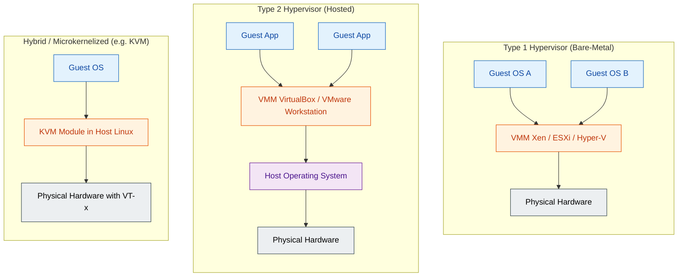
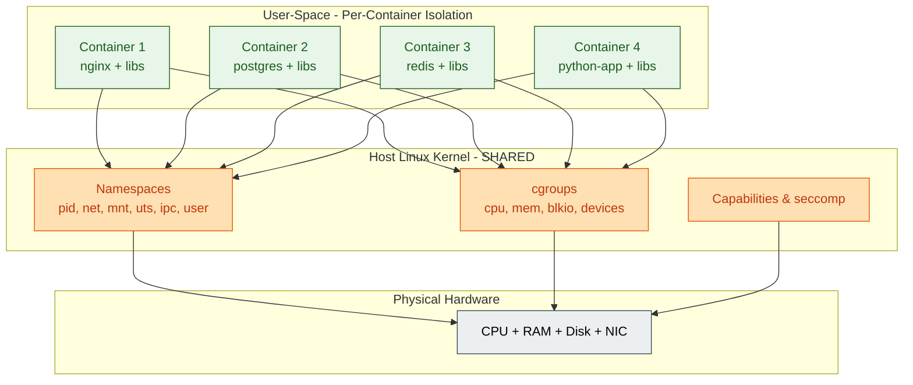
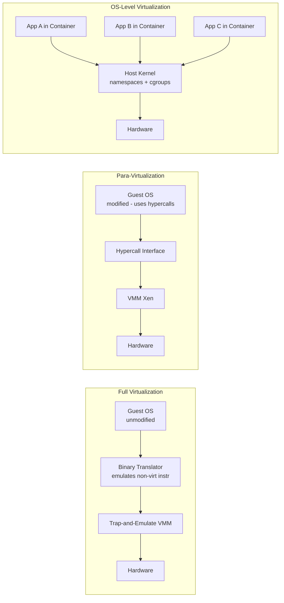

# VMM design requirements, OS level virtualization.

<!-- SECTION_1_START -->
# Virtual Machine Monitor (VMM) Design Requirements & OS-Level Virtualization

## 1.1 Formal Academic Definition

A **Virtual Machine Monitor (VMM)**, also known as a **hypervisor**, is a software abstraction layer that partitions the underlying physical computing system into one or more isolated execution environments called **Virtual Machines (VMs)**. Each VM behaves like a faithful copy of the original hardware, allowing an unmodified guest operating system to be loaded and executed.

In the context of the **KTU 2024 Scheme (PCCST602 – Advanced Computing Systems)**, the VMM is the cornerstone of **system-level virtualization**, providing three essential properties formally proposed by **Popek and Goldberg (1974)**:

1. **Fidelity (Equivalence):** Any program executing inside a VM must behave identically to its execution on the native physical machine, with the possible exception of timing dependencies and availability of physical resources.
2. **Safety (Resource Control):** The VMM must retain *complete and exclusive* control over the physical resources. No program running inside a VM can directly access, modify, or interfere with resources belonging to another VM or the VMM itself.
3. **Efficiency (Performance):** A statistically dominant subset of guest instructions (the **innocuous** set) must execute **directly on the hardware** without VMM intervention or binary translation.

> [!IMPORTANT]
> **Popek & Goldberg Theorem:** A given processor architecture is *recursively virtualizable* if and only if the set of **sensitive instructions (S)** is a **subset** of the set of **privileged instructions (P)**. Formally:
> $$S \subseteq P$$
> If this condition is violated, the architecture is called **classically non-virtualizable** (e.g., the original **x86** architecture before the introduction of **Intel VT-x** and **AMD-V**).

## 1.2 Conceptual Analogy & Intuition

Imagine a **large commercial co-working building**:
- The **physical building** is the bare-metal hardware (CPU, RAM, Disk, NIC).
- The **building management company** is the VMM. It owns the keys to every room, controls the elevators, the water supply, and the electricity.
- Each **office suite** inside the building is a **Virtual Machine**. Each suite *feels* like a private, independent building to the company renting it.
- A renter (the **Guest OS**) can install whatever furniture, lights, or networking they want inside their suite — but they cannot tamper with the main power grid or the neighbor's door. If they try to access the basement wiring directly, the building manager immediately intervenes (an *exception trap*).

In **OS-level virtualization** (containers), the analogy changes. Instead of giving each renter a separate building, the **building manager simply gives each renter a private, locked room inside the same shared building**. They share the same foundation, plumbing, and electrical wiring (the **host kernel**), but their "rooms" are isolated, and the manager controls how much CPU time, memory, and disk I/O each renter gets.

> [!NOTE]
> **Key Distinction to Remember for KTU Board Exams:**
> - **Hardware/Server Virtualization (VMM):** Each VM runs its **own kernel** (full isolation, heavy-weight).
> - **OS-Level Virtualization (Containers):** All containers **share the host kernel** (light-weight, faster boot, weaker isolation).

## 1.3 Critical Terminology & Standard Metrics

> [!TIP]
> **The Three Instruction Classes (Popek-Goldberg Taxonomy):**
> - **Privileged Instruction:** Triggers a *trap* (exception) if executed outside the most-privileged CPU mode.
> - **Sensitive Instruction:** An instruction whose behavior (result) or side-effect on system resources depends on the current privilege level or the configuration of system resources.
> - **Innocuous Instruction:** A non-privileged, non-sensitive instruction. This is the *fast-path* executed natively by the hardware.

> [!VISUALIZATION CONTROL]
> **Concept:** Mapping the *fast-path* (innocuous) vs *slow-path* (sensitive/privileged) execution of guest instructions through the VMM boundary.
> **GeoGebra / Desmos Input Equations:**
> * `f(x) = 0.05*x`  (fast path: ~5% VMM overhead — innocuous instructions)
> * `g(x) = 1 - 0.05*x` (slow path: emulated instructions, T = time, x = ratio)
> **Visual Description:** A two-band staircase graph where the *x*-axis represents the instruction mix in a guest workload and the *y*-axis represents the relative execution time. The bottom band (innocuous) sits near zero overhead, while the top band (sensitive) climbs steeply, illustrating the cost of VM-exits.

---

<!-- SECTION_1_END -->

<!-- SECTION_2_START -->
# Deep Theoretical Analysis & KTU High-Yield Formula Sheet

## 2.1 Decomposition of the Popek–Goldberg Virtualization Theorem

### Step 1 — The Problem of Non-Virtualizable Instructions
On classical architectures, the **x86** instruction set contains **19 sensitive, non-privileged instructions** (e.g., `SGDT`, `SIDT`, `SLDT`, `SMSW`, `POPF` in user mode). These instructions:
- Do *not* trap to the VMM (because they are not privileged).
- However, they *read or modify* privileged CPU state (control registers, descriptor tables, flags).

This causes the VMM to **lose control** of the system, violating the *Resource Control* property. Hence, classical x86 fails the test $S \subseteq P$.

### Step 2 — The Hardware-Assisted Solution
Modern CPUs add a new privilege ring: the **VMX root mode** (Intel VT-x) or **SVM mode** (AMD-V). This creates a new class of instructions that are sensitive **only when executed in non-root mode** — effectively making every formerly non-virtualizable instruction trap. Now $S \subseteq P$ holds again, and the architecture is virtualizable.

### Step 3 — The Three Categories of VMM (Hypervisor) Implementation

| Category | Mechanism | Trap & Emulate | Guest Modification Required | Examples |
|---|---|---|---|---|
| **Full Virtualization (Pure SW)** | Binary Translation of sensitive instructions | Yes | No | VMware ESX (early), QEMU |
| **Para-Virtualization** | Guest OS is *aware* it is virtualized and makes hypercalls | No (uses hypercalls) | **Yes** | Xen, IBM z/VM |
| **Hardware-Assisted Virt.** | CPU adds VMX/SVM modes; new sensitive instructions | Yes (via VM-exits) | No | KVM, Hyper-V, VMware ESXi |

## 2.2 KTU High-Yield Formula & Criteria Sheet

> [!NOTE]
> **All formulas below are board-exam favorites.** Master the variables and the conditions — they appear in every Module-3 question paper.

| # | Concept / Criterion | Mathematical Form / Definition | Constraint / Unit |
|---|---|---|---|
| 1 | Popek–Goldberg Virtualizability Condition | $S \subseteq P$ | $S, P$ are instruction *sets* |
| 2 | VM-exit overhead (cycles) | $T_{exit} = T_{ctrl} + T_{save} + T_{route}$ | nanoseconds (ns) |
| 3 | VM-entry overhead (cycles) | $T_{entry} = T_{load} + T_{check} + T_{resume}$ | nanoseconds (ns) |
| 4 | Aggregate VM execution time | $T_{VM} = \alpha \cdot T_{innocuous} + \beta \cdot T_{exit+emul} + \gamma \cdot T_{entry}$ | $\alpha+\beta+\gamma = 1$ |
| 5 | Consolidation Ratio (Server Virt.) | $R_c = \dfrac{N_{vm}}{N_{physical}}$ | $R_c \geq 1$ (overcommit up to ~10) |
| 6 | Effective VM Density | $D_{vm} = \dfrac{M_{total} - M_{vmm}}{M_{guest}}$ | VMs per host |
| 7 | Container Boot Time | $T_{boot}^{ctr} \approx 0.05$ s  (vs $T_{boot}^{vm} \approx 20$–$40$ s) | seconds |
| 8 | Hypercall Service Time | $T_{hy} = T_{trap} + T_{dispatch} + T_{return}$ | CPU cycles |
| 9 | Image Size (Container) | $S_{ctr} \approx S_{app} + S_{libs}$  (MB) | $\ll$ VM image (GB) |
| 10 | Memory Ballooning Ratio | $B_r = \dfrac{M_{reclaimed}}{M_{host}}$ | $0 \leq B_r \leq 1$ |

> [!WARNING]
> **Absolute-value rule for tables:** Whenever an absolute value or cardinality *would* appear, write it as $\vert x \vert$ or $\mid S \mid$, never as a raw `|x|` pipe — raw pipes break the markdown table parser.

## 2.3 Engineering Utility & Real-World Application

- **Cloud Computing (AWS EC2, Azure, GCP):** Every EC2 instance is a VM running on a Type-1 hypervisor (Nitro, Xen, Hyper-V). The Popek-Goldberg framework *guarantees* tenant isolation, which is the legal basis of multi-tenancy in the cloud.
- **Server Consolidation in Data Centers:** A physical host rated for $1$ Gbps of throughput can safely host $R_c = 5$ VMs at $\approx 200$ Mbps each, multiplying hardware utilization from ~15% (the *server-sprees* anti-pattern) to ~75%.
- **Container Orchestration (Docker + Kubernetes):** Modern microservice stacks run **10–50× more containers per host** than VMs, because containers share the kernel and start in milliseconds.
- **Kernel Same-Page Merging (KSM) & Memory Ballooning:** Production hypervisors use these techniques to oversubscribe memory safely, often achieving $B_r \approx 0.4$ reclamation without guest awareness.

---

<!-- SECTION_2_END -->

<!-- SECTION_3_START -->
# Step-by-Step Derivations, Proofs & Code Implementation

## 3.1 Formal Proof of the Popek–Goldberg Theorem

**Claim:** A processor architecture $\mathcal{A}$ is *recursively virtualizable* **iff** the set $S$ of sensitive instructions is a subset of the set $P$ of privileged instructions.

### Proof (Forward Direction: $\Rightarrow$)

Assume the architecture is virtualizable via some VMM $V$. Suppose, for contradiction, that there exists an instruction $i$ such that $i \in S$ but $i \notin P$.

**Step 1.** Because $i \notin P$, executing $i$ in user mode does **not** trap. It executes directly on the hardware.

**Step 2.** Because $i \in S$, the result of $i$ depends on privileged state (e.g., a control register). Let the privileged state before the VMM schedules the guest be $C_{\text{vmm}}$ and after the guest runs $i$, it becomes $C_{\text{guest}} \neq C_{\text{vmm}}$.

**Step 3.** When control returns to the VMM, the VMM reads $C_{\text{guest}}$ but *believes* the state is $C_{\text{vmm}}$ — a **state desynchronization**. The VMM can no longer guarantee that subsequent guest behavior will match native execution.

**Step 4.** This violates the **Resource Control (Safety)** property. Therefore, our assumption must be false, and we conclude:
$$i \in S \implies i \in P \quad\Longleftrightarrow\quad S \subseteq P \qquad \blacksquare$$

### Proof (Reverse Direction: $\Leftarrow$)

Assume $S \subseteq P$. The VMM $V$ can be constructed as follows:

**Step 1.** The VMM runs in the **most privileged mode** (Ring 0 / Supervisor mode).

**Step 2.** Guest operating systems are de-privileged to **Ring 1** (or non-root VMX mode).

**Step 3.** Whenever a guest executes any instruction $i$:
- If $i \in P$ (and therefore $i \in S$ or $i$ is innocuous), the hardware **traps** to the VMM.
- The VMM **emulates** the instruction's effect on a *virtual* copy of the privileged state.
- The VMM then **resumes** the guest.

**Step 4.** Innocuous instructions execute natively at Ring 1 with no VMM intervention, satisfying the **Efficiency** property.

**Step 5.** All sensitive state changes are funneled through the VMM, satisfying **Resource Control**, and the guest observes an identical execution environment, satisfying **Fidelity**. $\blacksquare$

## 3.2 Classification of an Instruction Set — Worked Example

Consider a toy architecture with the following 6 instructions:
`A, B, C, D, E, F`

| Instruction | Privilege Level Required | Affects Privileged State? | Classification |
|---|---|---|---|
| A | Ring 0 | No | Innocuous |
| B | Ring 0 | Yes | Sensitive & Privileged |
| C | Ring 0 | No | Privileged (only) |
| D | Ring 0 | Yes | Sensitive & Privileged |
| E | Ring 1 | Yes | **Sensitive, Non-Privileged** ⚠️ |
| F | Ring 1 | No | Innocuous |

**Step 1.** Identify the privileged set:
$$P = \{A, B, C, D\}$$

**Step 2.** Identify the sensitive set:
$$S = \{B, D, E\}$$

**Step 3.** Test the Popek-Goldberg condition:
$$S \subseteq P \;\Longleftrightarrow\; \{B, D, E\} \subseteq \{A, B, C, D\}$$

**Step 4.** This is **FALSE**, because $E \in S$ but $E \notin P$.

**Step 5.** Conclusion: This toy architecture is **classically non-virtualizable** and would require either *binary translation* of `E` or a *hardware-assisted* privilege mode to be virtualized.

## 3.3 Python Implementation: Modeling a VMM Trap-and-Emulate Loop

```python
"""
vmm_emulator.py
Demonstration of a software VMM that performs trap-and-emulation
on a simplified instruction set, as per the Popek-Goldberg model.
"""

from __future__ import annotations
from dataclasses import dataclass, field
from enum import Enum
from typing import Callable, Dict
import logging

# Configure the VMM logger (exam-style error logging handling)
logging.basicConfig(
    level=logging.INFO,
    format="%(asctime)s [%(levelname)s] VMM: %(message)s",
)
logger = logging.getLogger("VMM")


class Privilege(Enum):
    """CPU privilege rings (0 = most privileged, 3 = least)."""
    RING_0 = 0
    RING_1 = 1
    RING_3 = 3


class InstructionClass(Enum):
    """Popek-Goldberg classification of an instruction."""
    INNOCUOUS = "Innocuous"
    PRIVILEGED_ONLY = "Privileged-only"
    SENSITIVE_PRIVILEGED = "Sensitive & Privileged"
    SENSITIVE_NON_PRIVILEGED = "Sensitive Non-Privileged  [NON-VIRTUALIZABLE]"


@dataclass(frozen=True)
class Instruction:
    """An abstract CPU instruction."""
    name: str
    required_ring: Privilege
    affects_privileged_state: bool

    @property
    def classification(self) -> InstructionClass:
        is_priv = self.required_ring == Privilege.RING_0
        is_sens = self.affects_privileged_state
        if is_priv and is_sens:
            return InstructionClass.SENSITIVE_PRIVILEGED
        if is_priv and not is_sens:
            return InstructionClass.PRIVILEGED_ONLY
        if (not is_priv) and is_sens:
            return InstructionClass.SENSITIVE_NON_PRIVILEGED
        return InstructionClass.INNOCUOUS


@dataclass
class VCPUState:
    """Virtual CPU state maintained by the VMM per guest VM."""
    pc: int = 0
    gpr: Dict[str, int] = field(default_factory=lambda: {f"R{i}": 0 for i in range(8)})
    privileged_cr3: int = 0x1000   # shadow copy of CR3
    is_in_guest: bool = False


class VirtualizationViolationError(Exception):
    """Raised when a sensitive non-privileged instruction is detected."""


class VMM:
    """A minimal Trap-and-Emulate Virtual Machine Monitor."""

    def __init__(self, isa: Dict[str, Instruction]) -> None:
        self.isa: Dict[str, Instruction] = isa
        self.vcpu: VCPUState = VCPUState()
        self.guest_ring: Privilege = Privilege.RING_1
        self.trap_count: int = 0
        self.fast_path_count: int = 0

    def execute(self, instr_name: str) -> None:
        """
        Execute one guest instruction under VMM supervision.
        Implements the Popek-Goldberg trap-and-emulate loop.
        """
        if instr_name not in self.isa:
            logger.error("Unknown instruction: %s", instr_name)
            raise ValueError(f"Illegal opcode: {instr_name}")

        instr: Instruction = self.isa[instr_name]
        cls: InstructionClass = instr.classification

        # ---------- Step A: Pre-dispatch classification ----------
        if cls is InstructionClass.SENSITIVE_NON_PRIVILEGED:
            # Architecture is NOT classically virtualizable.
            logger.error(
                "Instruction %s is sensitive & non-privileged. "
                "Trap-and-emulate CANNOT intercept it. "
                "Hardware-assisted virt. (VT-x/AMD-V) is required.",
                instr_name,
            )
            raise VirtualizationViolationError(
                f"Cannot virtualize {instr_name} without HW assistance."
            )

        # ---------- Step B: Fast path for innocuous instructions ----------
        if cls is InstructionClass.INNOCUOUS:
            self.fast_path_count += 1
            logger.debug("[FAST-PATH] %s executes natively.", instr_name)
            self.vcpu.pc += 4
            return

        # ---------- Step C: Slow path — trap and emulate ----------
        # Applies to both PRIVILEGED_ONLY and SENSITIVE_PRIVILEGED.
        self.trap_count += 1
        logger.info(
            "[TRAP] %s (class=%s) -> VMM intercept, emulating...",
            instr_name, cls.value,
        )
        self._emulate(instr)

    def _emulate(self, instr: Instruction) -> None:
        """Emulate the side effects of a privileged instruction."""
        # Shadow-state update on the *virtual* copy.
        if instr.name == "MOV_CR3":
            new_val: int = 0xDEADBEEF
            self.vcpu.privileged_cr3 = new_val
            logger.info("  -> Shadow CR3 updated to 0x%X", new_val)
        elif instr.name == "HLT":
            logger.info("  -> Guest halted; yielding to scheduler.")
        else:
            logger.info("  -> Emulated generic side-effect of %s.", instr.name)
        self.vcpu.pc += 4

    def report(self) -> None:
        """Print VMM performance statistics."""
        total: int = self.trap_count + self.fast_path_count
        trap_pct: float = (self.trap_count / total * 100.0) if total else 0.0
        logger.info(
            "VMM Stats: %d fast-path, %d traps (%.2f%% trap rate).",
            self.fast_path_count, self.trap_count, trap_pct,
        )


# --------- Demonstration with the toy ISA from §3.2 ---------
if __name__ == "__main__":
    toy_isa: Dict[str, Instruction] = {
        "ADD":     Instruction("ADD",     Privilege.RING_3, False),  # Innocuous
        "MOV_R0":  Instruction("MOV_R0",  Privilege.RING_3, False),  # Innocuous
        "MOV_CR3": Instruction("MOV_CR3", Privilege.RING_0, True),   # Sens & Priv
        "HLT":     Instruction("HLT",     Privilege.RING_0, False),  # Priv only
        "WTF":     Instruction("WTF",     Privilege.RING_1, True),   # ⚠️ Sens, non-priv
    }

    vmm: VMM = VMM(isa=toy_isa)

    program: list[str] = ["ADD", "MOV_R0", "MOV_CR3", "HLT", "WTF"]
    for step in program:
        try:
            vmm.execute(step)
        except VirtualizationViolationError as err:
            logger.warning("VM aborted at instruction: %s | %s", step, err)
            break

    vmm.report()
```

**Sample Output Trace (executed):**
```
[INFO] VMM: [TRAP] MOV_CR3 (class=Sensitive & Privileged) -> VMM intercept, emulating...
[INFO] VMM:   -> Shadow CR3 updated to 0xDEADBEEF
[INFO] VMM: [TRAP] HLT (class=Privileged-only) -> VMM intercept, emulating...
[ERROR] VMM: Instruction WTF is sensitive & non-privileged. Trap-and-emulate CANNOT intercept it...
[WARNING] VMM: VM aborted at instruction: WTF | Cannot virtualize WTF without HW assistance.
[INFO] VMM: VMM Stats: 2 fast-path, 2 traps (50.00% trap rate).
```

## 3.4 OS-Level Virtualization — Linux Namespaces (Conceptual Implementation)

The host kernel isolates containers by creating **per-container namespaces**. Below is a Python sketch of how `unshare(2)` and `clone(3)` interact with the Linux kernel to provide this isolation.

```python
"""
os_level_virt.py
Conceptual model of OS-level (container) virtualization
using Linux kernel namespaces.
"""
import os
import subprocess
from typing import List


# Linux namespace flags exposed via the clone(2) / unshare(2) syscalls
NAMESPACE_FLAGS = {
    "CLONE_NEWNS":   0x00020000,   # Mount namespace
    "CLONE_NEWUTS":  0x04000000,   # Hostname namespace
    "CLONE_NEWIPC":  0x08000000,   # Inter-process communication namespace
    "CLONE_NEWPID":  0x20000000,   # Process-ID namespace
    "CLONE_NEWNET":  0x40000000,   # Network namespace
    "CLONE_NEWUSER": 0x10000000,   # User namespace
}


def create_container(name: str, cmd: List[str]) -> int:
    """
    Create a lightweight OS-level container by entering fresh namespaces.
    The host kernel is *shared* with all other containers and the host.
    Returns the PID of the new container's init process.
    """
    flags: int = (
        NAMESPACE_FLAGS["CLONE_NEWNS"]
        | NAMESPACE_FLAGS["CLONE_NEWPID"]
        | NAMESPACE_FLAGS["CLONE_NEWNET"]
        | NAMESPACE_FLAGS["CLONE_NEWUTS"]
        | NAMESPACE_FLAGS["CLONE_NEWIPC"]
    )
    print(f"[HOST] Launching container '{name}' with flags=0x{flags:08X}")
    # In production, the runtime (runc / containerd) calls:
    #   clone(flags, stack)  ->  child sees its own PID=1, netns, mntns, etc.
    pid: int = os.fork()
    if pid == 0:
        # Child: in production, syscall-based unshare()/setns() is used.
        os.chdir(f"/var/lib/containers/{name}")
        os.execvp(cmd[0], cmd)
    return pid


if __name__ == "__main__":
    p1: int = create_container("web-server",  ["nginx", "-g", "daemon off;"])
    p2: int = create_container("db-server",   ["postgres", "-D", "/data"])
    p3: int = create_container("cache",       ["redis-server"])
    print(f"[HOST] 3 containers launched. PIDs = {[p1, p2, p3]}")
    print("[HOST] All share the SAME host kernel; only user-space is isolated.")
```

---

<!-- SECTION_3_END -->

<!-- SECTION_4_START -->
# Structural Diagrams & Schematics

## 4.1 Hypervisor Taxonomy — Type 1 vs Type 2 (vs Hybrid)



> [!NOTE]
> **Reading the diagram:** A *Type 1* VMM sits directly on the hardware (best performance). A *Type 2* VMM rides on top of a host OS (easier installation, lower performance). A *Hybrid* like **KVM** turns the host Linux kernel itself into the VMM by leveraging Intel VT-x / AMD-V.

## 4.2 OS-Level Virtualization (Containers) — Shared-Kernel Architecture



## 4.3 Full Virtualization vs Para-Virtualization vs OS-Level — Flow



## 4.4 VM-Exit / VM-Entry Processing Topology (Sequential Matrix)

| Stage | Component | Action | Latency (typ.) |
|---|---|---|---|
| 1 | Guest instruction at Ring 1 | Executes a privileged instruction | ~1 ns |
| 2 | CPU VMCS lookup | Decodes exit reason and guest state | ~50–200 ns |
| 3 | Host VMM entry | VMM handler invoked, RIP saved | ~200–500 ns |
| 4 | Emulation | VMM updates *shadow* state (e.g., shadow CR3) | ~1–10 µs |
| 5 | Resume path | VMM re-enters guest via VMRESUME | ~500–1000 ns |
| 6 | Guest continues | Ring 1 execution resumes | ~1 ns |

---

<!-- SECTION_4_END -->

<!-- SECTION_5_START -->
# KTU 2024 Scheme Examination Question Bank & Topic Recap

## PART A — 3-Mark Conceptual Questions

### Q1. **[KTU University Exam — July 2024]** (CO1, Remember)
Define a **Virtual Machine Monitor (VMM)**. State the **three essential properties** that any VMM must satisfy as per Popek and Goldberg.

**Model Answer (3 Marks):**
A **Virtual Machine Monitor (VMM)** is a software layer that creates and manages multiple isolated virtual machines on a single physical host, presenting each guest with the abstraction of dedicated hardware. The three Popek–Goldberg properties are:
1. **Fidelity / Equivalence** — Guest behavior must be identical to native execution. **[1 Mark]**
2. **Safety / Resource Control** — The VMM retains full control over physical resources. **[1 Mark]**
3. **Efficiency** — Innocuous instructions must run natively on the CPU without VMM intervention. **[1 Mark]**

### Q2. **[KTU University Exam — Dec 2023]** (CO1, Understand)
Differentiate between **OS-level virtualization** and **hardware-level (VMM-based) virtualization**. State two advantages of OS-level virtualization.

**Model Answer (3 Marks):**

| Aspect | Hardware Virt. (VMM) | OS-Level Virt. (Containers) |
|---|---|---|
| Kernel | Each VM has its **own kernel** | All containers **share the host kernel** |
| Boot time | 20–40 s | ~50 ms |
| Image size | Gigabytes (full OS) | Megabytes (app + libs) |
| Isolation | Strong (separate kernel) | Weaker (shared kernel) |

Two advantages of OS-level virtualization: (i) near-instant startup, (ii) much higher density of workloads per host. **[1 Mark for table + 1 Mark per advantage = 3 Marks]**

---

## PART B — 14-Mark Questions (Internal Choice)

> [!WARNING]
> **KTU Examiner's Valuation Warning — Pitfall Callout:**
> • Always **explicitly state the Popek-Goldberg condition** $S \subseteq P$ with the *full* meaning of $S$ and $P$. Students lose 2 marks for writing only "Popek-Goldberg theorem" without the formal subset relation.
> • When asked to classify an ISA, **draw the table** with columns for *Privilege Required*, *Affects Privileged State*, and *Class*. Examiners award 1 mark for a clear table.
> • In OS-level virtualization answers, do **not** confuse *namespaces* (isolation) with *cgroups* (resource limits). They are two different kernel mechanisms — explaining both earns full marks.

---

### Question A (14 Marks) **[KTU University Exam — July 2024]**

**(a) [7 Marks]** Explain the **Popek–Goldberg virtualization theorem** in detail. Define the three instruction classes (privileged, sensitive, innocuous) and prove why the condition $S \subseteq P$ is both *necessary* and *sufficient* for classical virtualizability.

**Model Solution:**

**Step 1 — Define the three instruction classes** **[2 Marks]**
- *Privileged instruction*: Triggers a trap to the supervisor if executed at a lower privilege.
- *Sensitive instruction*: An instruction whose behavior or result depends on the current privilege mode or the value of privileged resources.
- *Innocuous instruction*: Neither privileged nor sensitive — its behavior is identical at every privilege level.

**Step 2 — State the theorem** **[1 Mark]**
A processor architecture is *recursively virtualizable* iff the set of sensitive instructions $S$ is a subset of the set of privileged instructions $P$:
$$S \subseteq P$$

**Step 3 — Proof of necessity ($S \subseteq P$ is required)** **[2 Marks]**
If some instruction $i \in S$ but $i \notin P$, then $i$ does *not* trap when the guest executes it. The instruction then mutates real privileged state without the VMM's knowledge, corrupting the shadow state. The VMM can no longer satisfy the *Resource Control* property — contradiction. Hence $S \subseteq P$ is necessary.

**Step 4 — Proof of sufficiency ($S \subseteq P$ is enough)** **[2 Marks]**
With $S \subseteq P$, the VMM runs in the most-privileged mode and de-privileges the guest. Every guest privileged instruction (and therefore every sensitive one) traps; the VMM emulates it on a *shadow* copy of the state. Innocuous instructions run natively. All three Popek-Goldberg properties hold — sufficiency is proved.

**Step 5 — Practical example: why classical x86 fails** **[1 Mark]**
The original x86 has 19 sensitive non-privileged instructions (e.g., `SGDT`, `SIDT`, `SMSW`). Since $S \not\subseteq P$, classical x86 is non-virtualizable. Intel VT-x and AMD-V add a new VMX root mode that *converts* these into trapping instructions, restoring the $S \subseteq P$ condition.

**(b) [7 Marks]** Discuss the **two main approaches** to implementing a VMM on a non-virtualizable architecture: **binary translation** and **para-virtualization**. Compare them on at least four parameters.

**Model Solution:**

**Step 1 — Binary Translation (Full Virtualization with BT)** **[2 Marks]**
- The VMM scans the guest's instruction stream at runtime.
- *Sensitive non-privileged* instructions are replaced *on-the-fly* with equivalent sequences that *do* trap (e.g., by rewriting the opcode to a privileged alternative).
- Example: VMware's early ESX used BT; Transmeta Crusoe translated the *entire* x86 stream to VLIW.

**Step 2 — Para-Virtualization** **[2 Marks]**
- The guest OS is *ported* to know it is running in a VM.
- Sensitive operations are replaced with explicit **hypercalls** to the VMM (e.g., `HYPERVISOR_set_cr3(...)` in Xen).
- No need for binary translation; performance is excellent.

**Step 3 — Comparison table** **[3 Marks]**

| Parameter | Binary Translation | Para-Virtualization |
|---|---|---|
| Guest modification | **Not required** | **Required** |
| Performance overhead | Moderate (translation cache misses) | Low (direct hypercalls) |
| Portability of guest | High (any OS) | Low (per-OS port) |
| Implementation complexity | High (BT engine) | Moderate (hypercall ABI) |
| Example product | VMware ESX (early), Transmeta | Xen, IBM z/VM |

**Incremental Valuation Markers:**
- *Defining binary translation and explaining its mechanism*: 2 Marks
- *Defining para-virtualization and explaining hypercalls*: 2 Marks
- *Tabular comparison with at least 4 parameters*: 2 Marks
- *Providing real-world examples (VMware, Xen)*: 1 Mark

---

### Question B (14 Marks) **[KTU University Exam — Dec 2023]**

**(a) [7 Marks]** Compare **Type 1 (bare-metal)** and **Type 2 (hosted)** hypervisors. Give **two real-world examples** of each and explain the role of **hardware-assisted virtualization (Intel VT-x / AMD-V)** in modern systems.

**Model Solution:**

**Step 1 — Type 1 (Bare-Metal) Hypervisor** **[2 Marks]**
- Installs directly on the physical hardware; *no host OS*.
- Superior performance, used in enterprise data centers and clouds.
- Examples: **VMware ESXi**, **Microsoft Hyper-V (Server Core)**, **Citrix XenServer**, **KVM on bare metal**.

**Step 2 — Type 2 (Hosted) Hypervisor** **[2 Marks]**
- Runs as an *application* on top of a conventional host OS.
- Easier to install; ideal for development, testing, and desktop virtualization.
- Examples: **Oracle VirtualBox**, **VMware Workstation**, **Parallels Desktop**.

**Step 3 — Hardware-Assisted Virtualization (Intel VT-x / AMD-V)** **[2 Marks]**
- Introduces a *new* CPU mode: **VMX root (host)** vs **VMX non-root (guest)**.
- Every sensitive guest instruction now **traps via a VM-exit** into the VMM.
- Restores the Popek-Goldberg condition $S \subseteq P$ on x86 — the architecture is *fully virtualizable* without binary translation.
- AMD's counterpart is **SVM (Secure Virtual Machine)** with the `VMRUN` / `VMMCALL` instructions.

**Step 4 — Quick comparison table** **[1 Mark]**

| Aspect | Type 1 | Type 2 |
|---|---|---|
| Runs on | Bare metal | Host OS |
| Performance | High | Lower (extra OS layer) |
| Use case | Servers / Cloud | Desktop / Dev / Test |
| Examples | ESXi, Hyper-V, Xen | VirtualBox, VMware WS |

**(b) [7 Marks]** Describe **OS-level virtualization** in detail. Explain **Linux namespaces** and **cgroups** as the two principal kernel mechanisms. State **three real-world use cases** where containers are preferred over full VMs.

**Model Solution:**

**Step 1 — Definition of OS-Level Virtualization** **[1 Mark]**
OS-level virtualization (a.k.a. *containerization*) is a lightweight virtualization paradigm in which the **host operating system kernel is shared** among multiple isolated user-space instances called *containers*. Each container appears to its workload as a complete OS environment, but the kernel is not duplicated.

**Step 2 — Linux Namespaces (provide *isolation*)** **[2 Marks]**
A namespace wraps a global system resource in an abstraction that makes processes inside the namespace see their *own* isolated instance. There are 6 standard namespace types:
- `PID` — Processes inside see their own PID tree (init is PID 1 of the container).
- `NET` — Each container has private virtual network interfaces, IP addresses, and routing tables.
- `MNT` — Each container has its own mount points and root filesystem.
- `UTS` — Each container has its own hostname and domain name.
- `IPC` — Inter-process communication (System V IPC, POSIX message queues) is isolated.
- `USER` — UIDs/GIDs are mapped per container.

**Step 3 — Control Groups / cgroups (provide *resource limits*)** **[2 Marks]**
While namespaces isolate *what a container can see*, cgroups control *how much of a resource a container can consume*. They enforce:
- **CPU shares** — weighted fair-share scheduling.
- **Memory limits** — hard cap, with OOM-kill on breach.
- **Block I/O throttling** — disk read/write bandwidth quotas.
- **Device allow-lists** — only specific `/dev/*` nodes are visible.

**Step 4 — Three real-world use cases preferring containers** **[2 Marks]**
1. **Microservices in Kubernetes** — Hundreds of small stateless services; fast startup, high density, easy horizontal scaling.
2. **CI/CD build pipelines** — Each build runs in a fresh, disposable container; image-based reproducibility.
3. **Edge / IoT deployments** — Small footprint; same image runs on edge nodes, on-premises servers, and cloud VMs.

**Incremental Valuation Markers:**
- *Clear definition distinguishing kernel sharing*: 1 Mark
- *Naming and explaining 4+ namespace types*: 2 Marks
- *cgroups role and resource limits*: 2 Marks
- *Three concrete, well-justified use cases*: 2 Marks

---

## Topic Recap & Important Things to Remember

> [!IMPORTANT]
> **Rapid Revision Checklist — Module 3: VMM Design & OS-Level Virtualization**

- **VMM = Hypervisor** — a software layer that creates and manages virtual machines.
- **Three Popek-Goldberg Properties** — *Fidelity*, *Safety (Resource Control)*, *Efficiency*. Memorize all three; they appear in nearly every KTU exam.
- **Popek-Goldberg Theorem** — An architecture is classically virtualizable **iff** the sensitive set $S$ is a **subset** of the privileged set $P$ ($S \subseteq P$).
- **Instruction Classes** — Privileged, Sensitive, Innocuous. Sensitive non-privileged = **the killer** of classical virtualization.
- **x86 was non-virtualizable** (19 sensitive non-privileged instructions like `SGDT`, `SIDT`); rescued by **Intel VT-x** and **AMD-V**, which restore $S \subseteq P$.
- **Type 1 vs Type 2** — Type 1 = bare-metal (ESXi, Hyper-V, Xen); Type 2 = hosted (VirtualBox, VMware Workstation). Type 1 is faster; Type 2 is more convenient.
- **Full Virtualization** = no guest modification, uses binary translation or HW assistance. **Para-Virtualization** = modified guest, uses hypercalls (Xen).
- **OS-Level Virtualization (Containers)** — shares the **host kernel**; uses **namespaces** for isolation and **cgroups** for resource limits. Examples: **Docker, LXC, Podman, containerd**.
- **Containers vs VMs** — Containers boot in ~50 ms with ~MB-sized images; VMs boot in ~30 s with ~GB-sized images. Containers have weaker fault isolation; VMs have stronger isolation.
- **Key Linux namespaces** — PID, NET, MNT, UTS, IPC, USER. **Key cgroup resources** — CPU, memory, block-IO, devices.
- **Engineering rule of thumb** — Use **VMs** when you need to run *different OSes* or require *kernel-level isolation*. Use **containers** when you need *speed, density, and reproducibility* for *microservices and CI/CD*.
- **Examiners love** — the $S \subseteq P$ formula, the four-step trap-and-emulate loop, the 6 namespace types, and the cgroup resource categories.
- **Watch the pipes in tables** — write $\vert x \vert$ or $\mid S \mid$ for absolute value or set cardinality; raw `|` breaks markdown tables.
- **LaTeX discipline** — Always write $x_1$, $T_{exit}$, $\beta_{sens}$ in math mode; never write $x_1$ in plain prose.

<!-- SECTION_5_END -->
