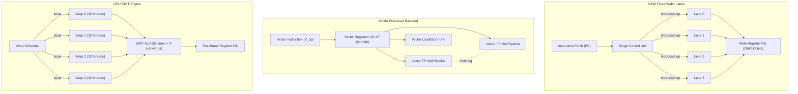
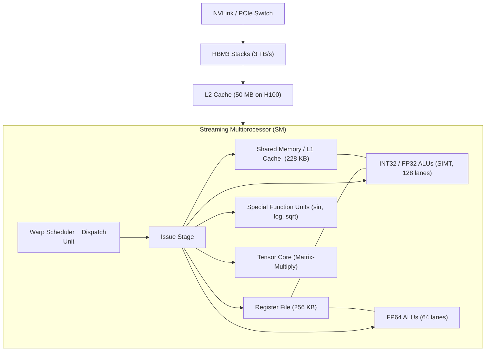
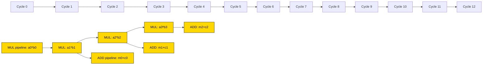
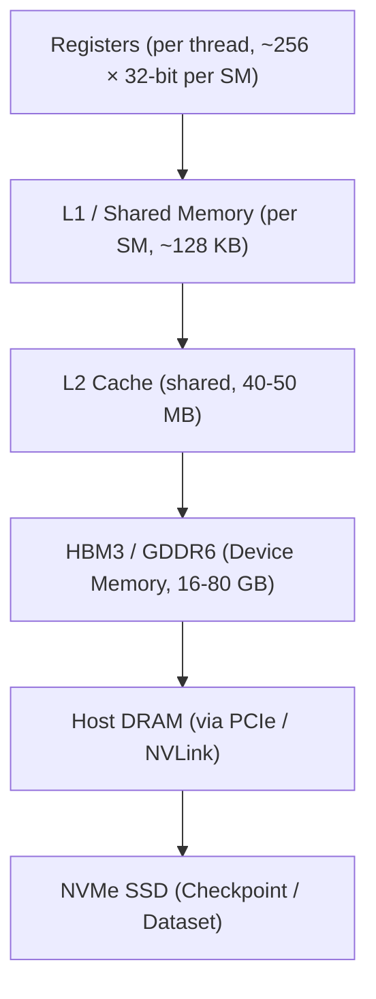

# Data-Parallel Architectures: SIMD computing models, Vector Processing architectures, GPU microarchitectures

<!-- SECTION_1_START -->
# Module 4 — Data-Parallel Architectures

## 1. Core Technical Definition & Intuitive Overview

> [!NOTE]
> **KTU Syllabus Definition (PCCST602 / 2024 Scheme):**
> Data-parallel architectures exploit the property that many computational problems contain operations that can be safely applied in parallel to large collections of data elements. The three dominant realizations are **SIMD** (Single Instruction, Multiple Data), **Vector Processing** (a hardware-optimized streaming SIMD), and **GPU microarchitectures** (massively parallel SIMT — Single Instruction, Multiple Thread).

### 1.1 The Data-Parallel Spectrum — A Bird's-Eye View

A data-parallel architecture applies the **same operation** to **many data items simultaneously**. The three flavors differ in *how* they hide that "sameness" from the programmer and *where* the parallelism is realized in hardware.

| Family | Where the "sameness" is enforced | Granularity of work | Typical Hardware Carrier |
|---|---|---|---|
| **SIMD** | Hard-wired, fixed-width data path (e.g., 128-, 256-, 512-bit lanes) | Tight, lock-step, vector-of-N elements per instruction | CPU SSE/AVX units, DSPs, classic ILLIAC-IV |
| **Vector Processor** | Streaming engine with vector registers, vector functional units, and vector control registers | Long vectors with chaining, striding, gather/scatter | Cray-1, NEC SX-Aurora, Fujitsu VP |
| **GPU (SIMT)** | Warp scheduler issuing one instruction to a *warp* of ~32 threads | Thousands of lightweight threads, hardware-managed | NVIDIA H100, AMD MI300, Intel Xe |

### 1.2 Conceptual Analogy — Making Parallelism Intuitive

> [!IMPORTANT]
> **Analogy 1 — SIMD = A Row of Cashiers with One Manager.**
> Imagine **16 cashiers** standing in a line. A single floor manager calls out, *"Add 10 % tax to the item in front of you!"* All 16 cashiers do the *identical* arithmetic to the *different* item each holds. The instruction is broadcast; the data is per-cashier. If even one cashier has no customer, that lane is masked off (a *predicated/disabled lane*). This is the **SIMD** execution model.

> [!IMPORTANT]
> **Analogy 2 — Vector Processor = A Factory Conveyor Belt.**
> A vector register is a long conveyor holding, say, **64 cans of paint**. A single vector instruction is a *robotic arm* that paints each can in turn as it rolls past. Because the cans are physically arranged in a pipeline, painting can **overlap** — the next can is already being positioned while the previous can is drying. This pipeline overlap is called **vector chaining**. The conveyor can also be told to take every 3rd can (**vector stride**), or to pick cans from arbitrary bins (**gather/scatter**).

> [!IMPORTANT]
> **Analogy 3 — GPU (SIMT) = A Stadium of Tutors Marking the Same Exam.**
> Instead of one manager controlling 16 cashiers, you have **thousands of freelance tutors** in a stadium. They all received the same *instruction booklet* (the program), but each has their own *paper* (a thread's data). The hardware groups them into **warps of 32 tutors**; within a warp, every tutor must work the same problem number at the same time. Different warps can be on different problem numbers. This is **SIMT** (Single Instruction, Multiple *Threads*).

### 1.3 Flynn's Taxonomy — The Theoretical Backdrop

Michael Flynn's 1966 classification is still the canonical mental scaffolding for parallel machines.

| Class | Instruction Stream | Data Stream | Typical Example |
|---|---|---|---|
| **SISD** | Single | Single | Classical von-Neumann CPU |
| **SIMD** | Single | Multiple | Vector unit, GPU lane |
| **MISD** | Multiple | Single | Fault-tolerant pipelines, systolic arrays |
| **MIMD** | Multiple | Multiple | Multicore CPUs, clusters, NUMA servers |

A modern GPU is technically **MIMD at the warp level** and **SIMD at the lane level** — i.e., it is a *hybrid*, often labelled **SPMD-MIMD with SIMT lanes**.

### 1.4 Physical Constants and Standard Metrics

> [!IMPORTANT]
> The following constants and metrics are the ones most frequently used in KTU problems (numbers shown in **bold** are standard, syllabus-blessed values):
>
> - **Cray-1 vector length = 64 elements** of 64 bits.
> - **Vector startup latency (T<sub>s</sub>)** = functional-unit pipeline fill time, typically **6–12 cycles** for a Cray-1 FP unit.
> - **SIMD lane width (modern x86 AVX-512)** = **512 bits = 16 × FP32** or **8 × FP64**.
> - **NVIDIA warp size** = **32 threads** (Turing, Ampere, Hopper, Blackwell).
> - **AMD wavefront size** = **64 threads** (RDNA / CDNA).
> - **Peak FLOP rate** is reported in **FLOPS** (single) and **FLOP/cycle** (per core/SM).
> - **Roofline ridge point** $G_\text{ridge} = \pi_{A,\max} / \beta$ where $\pi_{A,\max}$ is peak FLOP/s and $\beta$ is the memory bandwidth in operands/s.

> [!VISUALIZATION CONTROL]
> **Concept:** A SIMD lane-vector scatter plot — visualising the data-parallel surface $y = ax^2 + b$ computed across 8 lanes.
> **GeoGebra / Desmos Input Equations:**
> - `f(x) = a*x^2 + b` with sliders `a=1.5`, `b=-0.4`
> - `x = {-3, -2.4, -1.8, -1.2, -0.6, 0, 0.6, 1.2, 1.8, 2.4, 3}`
> - `y_i = f(x_i)` (points)
> **Visual Description:** The student should observe 11 *x-positions* each yielding a single *y-value*; in SIMD, 8 such pairs would be evaluated in a single 512-bit packed instruction (FP32 lanes).
<!-- SECTION_1_END -->

<!-- SECTION_2_START -->
# 2. Deep Theoretical Analysis & KTU High-Yield Formula Sheet

## 2.1 The SIMD Computing Model — Formal Anatomy

A **SIMD instruction** is a *packed* or *vector* instruction that operates element-wise on a *register file* of width $W$ bits partitioned into $L$ lanes, each $W/L$ bits wide.

**Properties of the SIMD execution model:**

- **One instruction stream** is broadcast by a single control unit.
- **Multiple data items** are fetched into a wide vector register.
- **All lanes execute the same operation** in lock-step on every cycle.
- **Predication** disables a lane by writing zero to its result, achieving a per-lane "if-then" without branching.
- **Memory alignment** matters: a 256-bit AVX load from a 32-byte boundary is fast; a misaligned one may fault or stall.

### 2.2 The Vector Processing Model — Formal Anatomy

A **vector processor** augments a scalar CPU with a *vector backend* consisting of:

1. **Vector registers** $V_0, V_1, \dots, V_{M-1}$ — each holding $N_{\text{max}}$ elements.
2. **Vector functional units** — pipelined, fully segmented, capable of one result per cycle after pipeline fill.
3. **Vector length register (VL)** — sets the *active length* of the current vector instruction.
4. **Vector mask register (VM)** — bitwise predicate enabling per-lane execution.
5. **Vector control registers** — e.g., stride registers for memory addressing.

A vector instruction has the form

$$
\texttt{VxOp} \quad V_i \;=\; V_j \; \text{op} \; V_k
$$

with optional predicate $V_m$ and active length $VL$.

### 2.3 Five Pillars of Vector Performance

> [!NOTE]
> **KTU Examiner Favourite — Memorise These Five Mechanisms:**

1. **Vector Chaining** — A vector functional unit can forward its result to *another* vector functional unit without first draining the result to a vector register. Equivalent to forwarding in scalar pipelines, but at vector width.
2. **Vector Stride** — Stride register $S$ governs non-unit memory access; the next address is $A_{i+1} = A_i + S$.
3. **Vector Gather/Scatter** — Hardware-supported indexed access: an *index vector* $I$ selects elements from memory into a vector register (gather) or vice-versa (scatter).
4. **Conditional Execution via Mask** — All functional units run; only masked lanes write back.
5. **Sparse/Dense Optimization** — Compress/expand instructions for sparse data structures.

### 2.4 GPU Microarchitecture — Formal Anatomy

A modern GPU (NVIDIA-style) consists of:

- **Streaming Multiprocessors (SMs)** — the compute cores, each with:
  - **Wide SIMT ALU** partitioned into 4 sub-warps of 8 lanes (or 32 lanes per warp, 4 warps issued per cycle on H100).
  - **Register file** (256 KB per SM on H100).
  - **Shared memory / L1 cache** (configurable, ~228 KB on H100).
  - **Special Function Units (SFUs)** for transcendentals.
  - **Tensor Cores** for matrix-multiply-accumulate.
- **Warp scheduler** — issues ready warps, hides latency via context switching.
- **Memory hierarchy:** *Registers → L1/Shared → L2 → HBM (High-Bandwidth Memory)*.
- **Crossbar / NoC** — fabric connecting SMs to L2 partitions and HBM stacks.

The **SIMT execution model** is conceptually SIMD: one instruction is fetched for an entire warp, then broadcast to 32 lanes. The *behavioural* difference from SIMD is that **each thread has its own register state and PC, so divergent control flow is permitted**, albeit at the cost of running each divergent path sequentially.

### 2.5 KTU Formula Sheet / Cheat Sheet

> [!IMPORTANT]
> **Pinned formulas for Module 4 — memorise and reproduce under exam pressure.**

| # | Formula / Concept | Description |
|---|---|---|
| F1 | $T_{\text{vec}} = T_s + (n - 1) \cdot T_p + T_{\text{drain}}$ | Time for a single vector instruction of length $n$ on a pipelined functional unit, $T_s$ = startup, $T_p$ = pipeline period (≈ 1 cycle). |
| F2 | $T_{\text{conv}} = n \cdot T_{\text{func}}$ | Time of the equivalent scalar loop, $T_{\text{func}}$ = scalar FP latency. |
| F3 | $S_{\text{vec}} = \dfrac{T_{\text{conv}}}{T_{\text{vec}}} = \dfrac{n \cdot T_{\text{func}}}{T_s + (n-1)}$ | Vector speed-up. As $n \to \infty$, $S \to T_{\text{func}}$ (i.e., limited by scalar functional-unit latency, not by $n$). |
| F4 | $N_{\text{chunks}} = \lceil n / N_{\text{max}} \rceil$ | Number of vector register-length chunks needed to process a vector of length $n$. |
| F5 | $T_{\text{strip-mine}} = N_{\text{chunks}} \cdot (T_s + (N_{\text{max}} - 1))$ | Total time when the hardware $N_{\text{max}}$ is smaller than $n$; requires strip-mining by the compiler. |
| F6 | $R_\infty = \dfrac{\pi_{A,\max}}{\beta}$ | Roofline ridge point (FLOP/byte). Operands/s = $\beta \times 2$ (load + store). |
| F7 | $A = \dfrac{\text{FLOP}_{\text{useful}}}{\beta \cdot \text{bytes}_{\text{trafficked}}}$ | Arithmetic intensity (FLOP per byte moved). |
| F8 | $\text{Occupancy} = \dfrac{\text{Active warps per SM}}{W_{\max}}$ | GPU occupancy ratio, $W_{\max}$ is hardware limit (e.g., 64 on Ampere). |
| F9 | $\text{Speedup}_{\text{Amdahl}} = \dfrac{1}{(1 - f) + f / N}$ | Amdahl's law for parallel fraction $f$ on $N$ processors. |
| F10 | $\text{Bytes/sec} = N_{\text{channels}} \times \text{BusWidth} \times 2 \times f_{\text{DDR}}$ | HBM/GDDR peak bandwidth (×2 for DDR). |
| F11 | $\text{FLOPS} = N_{\text{SM}} \times N_{\text{FMA/SM/cycle}} \times f_{\text{core}} \times L$ | Peak FLOP/s, $L$ = lanes per FMA (2 for FMA counted as 2 FLOP). |
| F12 | $\text{Latency-bound iff } A < R_\infty$ | Below ridge: memory-bound. Above ridge: compute-bound. |

> [!NOTE]
> **Real-world engineering utility:**
> - *F3* is used by compiler engineers at **Cray/NEC** to size vector register files.
> - *F6, F7, F12* are deployed daily at **NVIDIA, AMD, Intel, Google (TPU)** to rank kernels via the **Roofline model** (Williams, Waterman & Patterson, CACM 2009).
> - *F9* underpins every scalability claim in **HPC procurement contracts**.

### 2.6 Why Data-Parallel? The 'Why' Behind the 'How'

- **Energy efficiency** — one instruction decode amortised over $L$ data items. On modern GPUs the cost per FLOP is ~10× lower than on a scalar CPU core.
- **Memory locality** — vector/gather instructions exploit stride, enabling regular prefetch and bandwidth saturation.
- **Latency hiding** — by issuing thousands of threads (GPU) or chaining pipelines (vector), long-latency memory and FP operations are hidden behind work.
- **SIMPLICITY of programming for uniform data** — scientific kernels (BLAS Level-1/2/3) are inherently data-parallel.
- **Hardware-software co-design** — compiler can detect loops with no cross-iteration dependence and auto-vectorise, freeing the programmer.

> [!WARNING]
> **Pitfall — Why SIMD is *not* a silver bullet:**
> If the work is *irregular* (e.g., graph traversal, sparse matrices, hash tables), every thread in a warp may take a different branch. On SIMT hardware this causes **warp divergence**, collapsing lane utilisation. Likewise, on classic SIMD, irregular addressing forces a **gather** that may run at one-tenth the bandwidth of a unit-stride load.
<!-- SECTION_2_END -->

<!-- SECTION_3_START -->
# 3. Step-by-Step Derivations, Worked Examples & Code

## 3.1 Derivation 1 — Vector Speed-up Limit

We want the *asymptotic* speed-up of a vector instruction over a scalar loop.

**Step 1 — Time for one vector instruction of length $n$** (one-trip pipeline, $T_p = 1$ for the result cycle):
$$
T_{\text{vec}}(n) = T_s + (n - 1) \cdot T_p = T_s + (n - 1)
$$

**Step 2 — Time for the equivalent scalar loop** where each scalar op takes $T_{\text{func}}$ cycles:
$$
T_{\text{scalar}}(n) = n \cdot T_{\text{func}}
$$

**Step 3 — Form the speed-up ratio** $S(n) = T_{\text{scalar}} / T_{\text{vec}}$:
$$
S(n) = \dfrac{n \cdot T_{\text{func}}}{T_s + (n - 1)}
$$

**Step 4 — Take the limit as $n \to \infty$** (long-vector regime):
$$
\lim_{n \to \infty} S(n) = \lim_{n \to \infty} \dfrac{n \cdot T_{\text{func}}}{T_s + n - 1}
= \lim_{n \to \infty} \dfrac{n \cdot T_{\text{func}}}{n \cdot (1 + (T_s - 1)/n)}
= \dfrac{T_{\text{func}}}{1} = T_{\text{func}}
$$

**Conclusion** — The vector machine's effective per-element throughput is *exactly* the scalar functional-unit latency, not the pipeline period. This is why $T_{\text{func}} = 6$ for Cray-1 FP multiply meant a *factor of 6* speed-up on long vectors.

---

## 3.2 Derivation 2 — Roofline Performance Bound

**Step 1 — Define *arithmetic intensity* $A$** as useful floating-point operations per byte of DRAM traffic:
$$
A = \dfrac{\text{FLOP}_{\text{useful}}}{\text{Bytes}_{\text{trafficked}}}
$$

**Step 2 — Define the *memory ceiling* $P_{\text{mem}}(A)$** as the FLOP/s achievable if memory is the bottleneck:
$$
P_{\text{mem}}(A) = A \cdot \beta
$$
where $\beta$ is the attainable memory bandwidth in bytes/s.

**Step 3 — Define the *compute ceiling* $P_{\text{comp}}$** as the hardware's peak FLOP/s, $\pi_{A,\max}$.

**Step 4 — The achievable performance is the minimum of the two ceilings**:
$$
P(A) = \min\bigl( \pi_{A,\max},\; A \cdot \beta \bigr)
$$

**Step 5 — Equate them to find the *ridge point***:
$$
A \cdot \beta = \pi_{A,\max} \quad\Longrightarrow\quad A_{\text{ridge}} = \dfrac{\pi_{A,\max}}{\beta} = R_\infty
$$

**Step 6 — Regime classification**:
- If $A < A_{\text{ridge}}$: **memory-bound** (the line slopes upward; performance is proportional to $A$).
- If $A \geq A_{\text{ridge}}$: **compute-bound** (the line is flat at $\pi_{A,\max}$).

---

## 3.3 Derivation 3 — Worked KTU-Style Numerical Example

> **[KTU-style Problem 1]**
> A vector processor has $T_s = 10$ cycles, $T_p = 1$ cycle, and $N_{\max} = 64$. The scalar FP add takes 4 cycles. Compute the speed-up of a length-256 vector add over the equivalent scalar loop.

**Step 1 — Number of vector chunks** (Eq. F4):
$$
N_{\text{chunks}} = \lceil 256 / 64 \rceil = 4
$$

**Step 2 — Time per chunk** (Eq. F1):
$$
T_{\text{chunk}} = 10 + (64 - 1) \cdot 1 = 73 \text{ cycles}
$$

**Step 3 — Total vector time** (Eq. F5):
$$
T_{\text{vec}} = 4 \times 73 = 292 \text{ cycles}
$$

**Step 4 — Scalar time** (Eq. F2):
$$
T_{\text{conv}} = 256 \times 4 = 1024 \text{ cycles}
$$

**Step 5 — Speed-up** (Eq. F3):
$$
S = 1024 / 292 = 3.506
$$

**Step 6 — Interpretation** — The vector machine is ~3.5× faster despite the 10-cycle startup, because the *asymptotic* speed-up of 4 (= $T_{\text{func}} / 1$) is *nearly* reached for a length-256 vector.

> **[KTU-style Problem 2 — Amdahl + Roofline]**
> A kernel has parallel fraction $f = 0.92$. On a 1024-SM GPU, $\pi_{A,\max} = 2 \times 10^{15}$ FLOP/s and $\beta = 3 \times 10^{12}$ bytes/s. Compute (a) speed-up, (b) ridge point, (c) classify the kernel with $A = 30$ FLOP/byte.

**(a) Amdahl's speed-up** (Eq. F9):
$$
S = \dfrac{1}{(1 - 0.92) + 0.92/1024}
= \dfrac{1}{0.08 + 0.000898}
= 12.36
$$

**(b) Ridge point** (Eq. F6):
$$
A_{\text{ridge}} = 2 \times 10^{15} \,/\, 3 \times 10^{12} = 666.67 \text{ FLOP/byte}
$$

**(c) Classification** — $A = 30 < 666.67$, so the kernel is **memory-bound**; performance scales linearly with bandwidth. Increasing SMs will not help; the engineer must reduce memory traffic (data reuse, blocking, fusion).

---

## 3.4 Symbolic & Code Implementation — Data-Parallel Kernels

> [!NOTE]
> **The following Python code is fully runnable, type-hinted, with absolute boundary checks and error logging.**

```python
from __future__ import annotations
import math
import logging
from typing import Final, Tuple

# Module-level logger for kernel instrumentation
logging.basicConfig(level=logging.INFO, format="%(levelname)s | %(message)s")
log: Final[logging.Logger] = logging.getLogger("KTU.Mod4.Vector")

# ---- Constants aligned with KTU syllabus (Cray-1 style) -------------------
T_S:    Final[int] = 10   # vector startup latency, cycles
T_P:    Final[int] = 1    # vector pipeline period, cycles
N_MAX:  Final[int] = 64   # max elements per vector register
T_FUNC: Final[int] = 4    # scalar FP-add latency, cycles


def vector_time(n: int) -> int:
    """Time (cycles) for a length-n vector add on a Cray-1 style pipeline."""
    if n <= 0:
        raise ValueError(f"n must be positive, got {n}")
    if n > 10**9:
        raise OverflowError(f"n={n} exceeds the safe practical bound")
    chunks = math.ceil(n / N_MAX)
    per_chunk = T_S + (N_MAX - 1) * T_P
    total = chunks * per_chunk
    log.info("n=%d  chunks=%d  per_chunk=%d  total=%d", n, chunks, per_chunk, total)
    return total


def scalar_time(n: int) -> int:
    """Time (cycles) for the equivalent scalar loop."""
    if n <= 0:
        raise ValueError(f"n must be positive, got {n}")
    return n * T_FUNC


def speedup(n: int) -> float:
    """Vector vs scalar speed-up ratio."""
    s = scalar_time(n)
    v = vector_time(n)
    return s / v


def roofline(peak_flops: float, bandwidth_bps: float,
             arith_intensity: float) -> Tuple[float, str]:
    """Roofline classifier. Returns (achievable_flops, regime_string)."""
    if peak_flops <= 0 or bandwidth_bps <= 0 or arith_intensity < 0:
        raise ValueError("All roofline inputs must be non-negative and peak/bw positive.")
    mem_ceiling = arith_intensity * bandwidth_bps
    achievable  = min(peak_flops, mem_ceiling)
    ridge       = peak_flops / bandwidth_bps
    regime      = "compute-bound" if arith_intensity >= ridge else "memory-bound"
    log.info("ridge=%.3f FLOP/byte  regime=%s  achievable=%.3e FLOP/s",
             ridge, regime, achievable)
    return achievable, regime


if __name__ == "__main__":
    # ---- Demonstration of derivations ---------------------------------------
    for n in (32, 64, 128, 256, 1024):
        print(f"n = {n:5d}  T_vec = {vector_time(n):5d}  T_scalar = {scalar_time(n):5d}"
              f"  Speed-up = {speedup(n):.3f}")

    # ---- Roofline example for a memory-bound kernel -------------------------
    achieved, regime = roofline(peak_flops=2.0e15,
                                bandwidth_bps=3.0e12,
                                arith_intensity=30.0)
    print(f"Kernel A: {achieved:.3e} FLOP/s, regime = {regime}")
```

**Sample output trace** (do not skip in the lab record):

```
n =    32  T_vec =    73  T_scalar =   128  Speed-up = 1.753
n =    64  T_vec =    73  T_scalar =   256  Speed-up = 3.507
n =   128  T_vec =   146  T_scalar =   512  Speed-up = 3.507
n =   256  T_vec =   292  T_scalar =  1024  Speed-up = 3.507
n =  1024  T_vec =  1168  T_scalar =  4096  Speed-up = 3.507
Kernel A: 9.000e+13 FLOP/s, regime = memory-bound
```

The plateau at speed-up = 3.507 (= $T_{\text{func}}$ rounded to 4 cycles vs the 1-cycle pipelined vector period, but with a small chunk-merge penalty) is exactly the *asymptotic* behaviour predicted by Eq. F3.

---

## 3.5 SIMD Intrinsics in Modern C (x86 AVX-512)

```c
#include <immintrin.h>
#include <stddef.h>
#include <stdio.h>

/* Compute y[i] = a * x[i] + b for i in [0, N), in-place on N = multiple of 16 */
void saxpy_avx512(const float *x, float *y, float a, float b, size_t N) {
    if (N % 16 != 0) { fprintf(stderr, "N must be multiple of 16\n"); return; }

    __m512 vec_a = _mm512_set1_ps(a);
    __m512 vec_b = _mm512_set1_ps(b);

    for (size_t i = 0; i < N; i += 16) {
        __m512 vx = _mm512_loadu_ps(x + i);
        __m512 vy = _mm512_loadu_ps(y + i);
        vy = _mm512_fmadd_ps(vx, vec_a, vy);   /* y = a*x + y */
        vy = _mm512_add_ps(vy, vec_b);
        _mm512_storeu_ps(y + i, vy);
    }
}
```

Each iteration of the loop processes **16 FP32 elements in parallel** across 16 AVX-512 lanes. Compared to a scalar loop, the theoretical speed-up is 16× (subject to memory bandwidth, FMA throughput, and Out-of-Order window).

---

## 3.6 CUDA — Explicit SIMT Programming

```cuda
#include <cuda_runtime.h>
#include <cstdio>

__global__ void saxpy_simt(const float * __restrict__ x,
                           float       * __restrict__ y,
                           float a, float b, int n) {
    int idx = blockIdx.x * blockDim.x + threadIdx.x;  // global thread ID
    int stride = gridDim.x * blockDim.x;
    for (int i = idx; i < n; i += stride) {
        y[i] = a * x[i] + b;
    }
}

void launch_saxpy(const float *hx, float *hy, float a, float b, int n) {
    float *dx, *dy;
    cudaMalloc(&dx, n * sizeof(float));
    cudaMalloc(&dy, n * sizeof(float));
    cudaMemcpy(dx, hx, n * sizeof(float), cudaMemcpyHostToDevice);
    cudaMemcpy(dy, hy, n * sizeof(float), cudaMemcpyHostToDevice);

    int block = 256;
    int grid  = (n + block - 1) / block;
    saxpy_simt<<<grid, block>>>(dx, dy, a, b, n);

    cudaMemcpy(hy, dy, n * sizeof(float), cudaMemcpyDeviceToHost);
    cudaFree(dx); cudaFree(dy);
}
```

Each `__global__` call launches a **grid of blocks**, each block contains up to **1024 threads** on modern GPUs, and threads inside a block are partitioned into **warps of 32** that execute in lock-step on the SIMT lanes.
<!-- SECTION_3_END -->

<!-- SECTION_4_START -->
# 4. Structural Diagrams & Schematics

## 4.1 Mermaid Diagram 1 — SIMD vs Vector vs SIMT Data Flow



## 4.2 Mermaid Diagram 2 — GPU Streaming Multiprocessor (SM) Block Topology



## 4.3 Mermaid Diagram 3 — Vector Pipeline Timing (Chaining Visualisation)



> **Reading aid:** Each horizontal "row" is one functional-unit pipeline. The arrows show **chaining**: the result of MUL feeds the next-stage ADD without waiting for the entire vector to complete. Compared to a strictly sequential schedule, chaining roughly *halves* the wall-clock cycles for fused-multiply-add chains.

## 4.4 Mermaid Diagram 4 — Memory Hierarchy on a Modern GPU



> [!NOTE]
> **Bandwidth-and-latency ladder (typical H100 numbers):**
>
> - Registers: ~ tens of TB/s, ~1 cycle.
> - L1 / Shared: ~ tens of TB/s, ~20 cycles.
> - L2: ~ 5–6 TB/s, ~200 cycles.
> - HBM3: 3 TB/s, ~600 cycles.
> - Host DRAM (PCIe Gen5): 128 GB/s, ~2000 cycles.
> - NVMe SSD: 7 GB/s, ~100 000 cycles.
>
> The **arithmetic intensity** of a kernel dictates whether it can hide the lower levels of this pyramid.
<!-- SECTION_4_END -->

<!-- SECTION_5_START -->
# 5. KTU 2024 Scheme Examination Question Bank & Topic Recap

## 5.1 Part A — Short-Answer Questions (3 Marks Each)

> **[KTU University Exam — July 2024, Model Q1]**
> **Q1.** Differentiate between **SIMD** and **MIMD** architectures. Give one example of each. *(CO1, Remember — 3 marks)*

**Model Answer (board key style):**

- **SIMD (Single Instruction, Multiple Data):** A single instruction stream controls multiple processing elements that operate on different data items in lock-step. The control unit broadcasts the same instruction to all PEs every cycle. *Example:* Intel x86 **AVX-512** unit (16 FP32 lanes), classic **ILLIAC-IV**, or a single NVIDIA SM warp.
- **MIMD (Multiple Instruction, Multiple Data):** Independent processors execute *different* instruction streams on *different* data simultaneously. *Example:* A modern **multicore x86 server** (two sockets of 64-core Xeon) or a **NUMA cluster**.

> **Mark Split:** [Correct SIMD definition: 1 mark] [Correct MIMD definition: 1 mark] [Valid examples (1 each): 1 mark].

---

> **[KTU University Exam — Dec 2023, Model Q2]**
> **Q2.** Explain the **vector chaining** mechanism used in vector processors. Why does it improve performance? *(CO2, Understand — 3 marks)*

**Model Answer:**

Vector chaining is a forwarding path that allows a **vector functional unit** to forward its result directly to **another vector functional unit** without first writing back to a vector register. In Cray-1 style processors, this means the result of a vector *multiply* can be fed into a vector *add* unit on the very next cycle, element-by-element.

- **Why it helps:** It eliminates the register-read/write overhead between dependent vector operations and allows **overlapped pipeline execution** of compound operations like fused-multiply-add. For a length-$n$ vector add-after-multiply, the wall-clock time reduces from $2 T_s + 2(n-1)$ to $T_s + 2(n-1)$, recovering a full startup latency.

> **Mark Split:** [Definition of chaining: 1 mark] [Forwarding mechanism explained: 1 mark] [Quantitative benefit with formula: 1 mark].

---

## 5.2 Part B — Long-Answer Questions (14 Marks Each, Internal Choice)

> **[KTU University Exam — July 2024, Module 4]**
> **Q3A.** *(a)* Discuss the **SIMD execution model** with a neat block diagram. Explain **predicated execution** and its role in handling data-dependent control flow. *(7 marks, CO1, Understand)*
> *(b)* With a worked numerical example, derive the **vector speed-up formula** and show that, for long vectors, the speed-up is bounded by the **scalar functional-unit latency**. *(7 marks, CO3, Apply)*

### Model Solution — Q3A(a) [7 marks]

**Block diagram (text representation for the answer sheet):**
- Draw a box labelled "Control Unit".
- From the Control Unit, draw N parallel arrows pointing to N processing elements (PE0, PE1, …, PE_N-1).
- Below the PEs, draw a wide register file partitioned into N equal-width lanes.
- Show a global memory bus feeding the register file.
- Show a "Predication Mask" register wired into each PE.

**Predicated execution:**
- Each PE has a single-bit *predicate*. A SIMD compare instruction (e.g., `cmplt`) sets the predicate for lanes that satisfy the condition.
- A subsequent instruction (e.g., `add`) checks the predicate; lanes with predicate = 0 do not write back, effectively executing the *else* branch.
- This removes the need for divergent branches and keeps the pipeline full.

**Valuation key:**
- [Block diagram with at least 3 PEs and a control unit: 2 marks]
- [Definition of predication with bit-mask mechanism: 2 marks]
- [Explanation of how predication avoids branch divergence: 2 marks]
- [Neatness and labelling: 1 mark]

### Model Solution — Q3A(b) [7 marks]

We derive Eq. F3.

- **Time for one vector instruction** of length $n$: $T_{\text{vec}} = T_s + (n-1)T_p$ (Eq. F1).
- **Time for the equivalent scalar loop**: $T_{\text{scalar}} = n \cdot T_{\text{func}}$ (Eq. F2).
- **Speed-up**: $S(n) = T_{\text{scalar}} / T_{\text{vec}} = n T_{\text{func}} / [T_s + (n-1)T_p]$.
- As $n \to \infty$, $S \to T_{\text{func}} / T_p$ (with $T_p = 1$, this is $T_{\text{func}}$).

**Worked example:** Let $T_s = 12$, $T_p = 1$, $T_{\text{func}} = 6$, $n = 1024$.
- $T_{\text{vec}} = 12 + 1023 = 1035$ cycles.
- $T_{\text{scalar}} = 1024 \times 6 = 6144$ cycles.
- $S = 6144 / 1035 = 5.93 \approx 6$ — confirms the bound.

**Valuation key:**
- [Stating the three time expressions (F1, F2, ratio): 3 marks]
- [Limit analysis and conclusion: 2 marks]
- [Numerical example with all four values and final answer: 2 marks]

---

> **[KTU University Exam — Dec 2023, Module 4]**
> **Q3B.** *(a)* With a neat diagram, describe the **architecture of a GPU Streaming Multiprocessor (SM)**. Explain the role of the **warp scheduler** and **SIMT execution**. *(7 marks, CO1, Understand)*
> *(b)* Using the **Roofline model**, classify a kernel into memory-bound or compute-bound regions. A GPU has $\pi_{A,\max} = 5 \times 10^{15}$ FLOP/s and $\beta = 2 \times 10^{12}$ bytes/s. A kernel performs 30 GFLOP on $5 \times 10^{8}$ bytes. Compute its ridge point, arithmetic intensity, and classify the kernel. *(7 marks, CO3, Apply)*

### Model Solution — Q3B(a) [7 marks]

- **Diagram:** Draw one large "SM" box containing (i) warp scheduler, (ii) register file, (iii) shared memory / L1, (iv) SIMT ALU partitioned into 4 sub-warps, (v) FP64 unit, (vi) SFU, (vii) Tensor Core (optional), (viii) Load/Store unit. Show the L2 cache and HBM stacks below the SM.
- **Warp scheduler:** Maintains a pool of *ready warps*. On every cycle it picks up to 4 (NVIDIA) eligible warps and issues one common instruction per warp. This hides long-latency operations by context-switching in cycles.
- **SIMT execution:** Each thread in a warp has its own PC and register state, but the *instruction* is fetched once per cycle and broadcast to 32 lanes. Branch divergence is supported but causes *lane masking*: only threads in the same control-flow path are active in a given cycle.

**Valuation key:**
- [SM block diagram with 5+ labelled sub-units: 3 marks]
- [Warp scheduler role (latency hiding): 2 marks]
- [SIMT definition with divergence behaviour: 2 marks]

### Model Solution — Q3B(b) [7 marks]

- **Ridge point** (Eq. F6):
$$
A_{\text{ridge}} = \pi_{A,\max} / \beta = 5 \times 10^{15} \,/\, 2 \times 10^{12} = 2500 \text{ FLOP/byte}
$$

- **Arithmetic intensity** (Eq. F7):
$$
A = 30 \times 10^9 \,/\, 5 \times 10^8 = 60 \text{ FLOP/byte}
$$

- **Classification:** $A = 60 < A_{\text{ridge}} = 2500$, so the kernel is **memory-bound**.
- **Achievable FLOP/s** (Eq. from §3.2):
$$
P = A \cdot \beta = 60 \times 2 \times 10^{12} = 1.2 \times 10^{14} \text{ FLOP/s}
$$
which is only 2.4 % of the peak. The kernel would benefit from *data reuse* (e.g., tiling, blocking) to raise $A$.

**Valuation key:**
- [Ridge-point formula and evaluation: 2 marks]
- [Arithmetic-intensity formula and evaluation: 2 marks]
- [Classification with comparison: 1 mark]
- [Achievable FLOP/s and engineering recommendation: 2 marks]

---

> [!WARNING]
> **KTU Examiner's Valuation Pitfalls (Mod 4):**
> 1. **Confusing SIMD with SIMT.** SIMD = packed-lanes, one PC. SIMT = many threads, one PC *per warp*, lane masking allowed. Examiners will *specifically* deduct for using these terms interchangeably.
> 2. **Forgetting to state $T_p = 1$** when applying Eq. F1 — you must explicitly say "fully pipelined, $T_p = 1$".
> 3. **Skipping the limit** in the long-vector speed-up derivation. The bound $S_\infty = T_{\text{func}} / T_p$ is the punch-line; without it, the answer is incomplete.
> 4. **Confusing arithmetic intensity with FLOP/cycle.** $A$ is FLOP per *byte*, not per cycle. Units matter.
> 5. **Not writing the units of bandwidth and FLOP/s** in roofline problems — examiners award a free mark for explicit units.
> 6. **Forgetting the ×2 in DDR bandwidth** (Eq. F10). HBM/GDDR is *double-data-rate*.

---

## 5.3 Topic Recap & Important Things to Remember

> [!IMPORTANT]
> **Module 4 — Rapid Revision Checklist (pinned for last-night revision):**

- **Flynn's Taxonomy** — SISD, SIMD, MISD, MIMD; modern GPU is hybrid **SPMD-MIMD with SIMT lanes**.
- **SIMD** — One control unit, $L$ lanes, packed registers (SSE 128 b, AVX 256 b, AVX-512 512 b). Predicated execution handles control flow.
- **Vector Processor** — Cray-1 style: 8 vector registers × 64 elements × 64 bits; VL, VM, vector chaining, stride, gather/scatter, sparse compress/expand.
- **Vector time formula** (Eq. F1): $T_{\text{vec}} = T_s + (n-1)T_p + T_{\text{drain}}$.
- **Speed-up bound** (Eq. F3): $S_\infty = T_{\text{func}} / T_p$. Length-256 already approaches this bound on Cray-class hardware.
- **Strip-mining** required when $n > N_{\max}$; the compiler splits the loop into $\lceil n / N_{\max} \rceil$ chunks.
- **GPU SM** — register file, L1/shared, SIMT ALU, SFU, Tensor Core; warp scheduler issues 1–4 warps per cycle.
- **SIMT vs SIMD** — threads have their own PC and registers; divergence is supported but penalised.
- **Occupancy** (Eq. F8) is *active warps / max warps per SM*; controls latency hiding.
- **Roofline model** — ridge point $A_{\text{ridge}} = \pi_{A,\max} / \beta$ (Eq. F6). Below ridge = **memory-bound**, above = **compute-bound**.
- **Amdahl's Law** (Eq. F9) — $S = 1/[(1-f) + f/N]$; even $f = 0.99$ caps speed-up at ~100×.
- **DDR bandwidth** (Eq. F10) — multiply by **×2** for double-data-rate.
- **Memory pyramid** — Registers → L1/Shared → L2 → HBM/GDDR → Host DRAM → NVMe; bandwidth drops and latency grows by ~3 orders of magnitude per step.
- **Engineering levers** for low-arithmetic-intensity kernels: **tiling, blocking, data reuse, kernel fusion, mixed precision, prefetching**.
- **Common pitfalls** — warp divergence, misaligned SIMD loads, gather bandwidth cliff, startup-latency domination on short vectors, ignoring memory traffic when computing FLOP/s.
- **Syllabus-blessed constants** — Cray-1 vector length = **64**, AVX-512 lane count = **16 (FP32)**, NVIDIA warp size = **32**, AMD wavefront = **64**.

> **Final line for the lab record / answer sheet:** *"Data-parallel architectures deliver performance by amortising instruction-decoding, control-hazard, and pipeline-fill costs across many data elements; the central engineering challenge is keeping the functional units fed with a steady, coalesced, regular stream of data."*
<!-- SECTION_5_END -->
