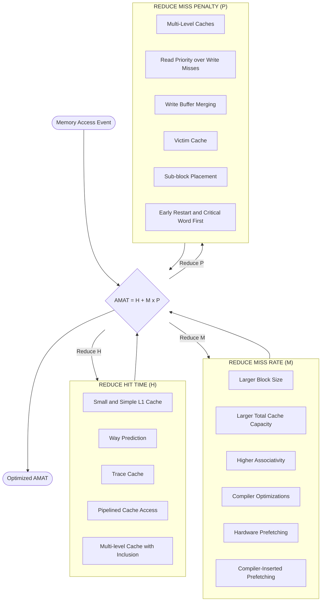
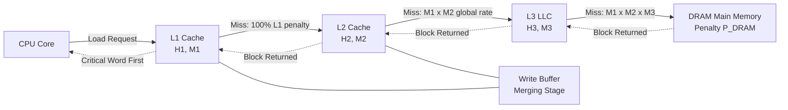

# Memory Optimization: Advanced cache performance optimizations (Reducing hit time, miss rate, and miss penalty)

<!-- SECTION_1_START -->

# Advanced Cache Performance Optimizations

## 1.1 Formal Definition (KTU 2024 Syllabus Terminology)

> [!IMPORTANT]
> **Cache Performance Optimization** is the systematic application of hardware and software techniques to minimize the **Average Memory Access Time (AMAT)** of a memory hierarchy, governed by the canonical relation:
>
> $$\text{AMAT} = \text{Hit Time} + \text{Miss Rate} \times \text{Miss Penalty}$$

In the context of the **PCCST602 / Advanced Computing Systems** syllabus (KTU 2024 Scheme), the three orthogonal optimization axes are:

1. **Reducing Hit Time** — Minimizing the latency incurred when the requested data is found in the cache.
2. **Reducing Miss Rate** — Minimizing the probability that a memory reference escapes the cache.
3. **Reducing Miss Penalty** — Minimizing the latency of fetching data from the next level on a cache miss.

The **3Cs Model** (Compulsory, Capacity, Conflict) classifies all misses and guides which optimization axis is most cost-effective. A fourth category, **Coherence misses**, is added in multiprocessor contexts.

## 1.2 Intuitive Analogy — "The Librarian's Desk"

Imagine a **librarian** in a vast library:

- **Hit Time** = The time to glance at a book on the *immediate desk*.
- **Miss Rate** = The fraction of times a patron asks for a book that is *not* on the desk.
- **Miss Penalty** = The time to walk all the way to the *stacks* and return with the book.

To serve patrons faster, the librarian can:
- **Reduce Hit Time** → Keep *fewer, smaller books* on the desk (small, fast first-level cache).
- **Reduce Miss Rate** → Add *more book categories* to the desk (larger cache, higher associativity).
- **Reduce Miss Penalty** → Hire a *junior librarian* at the stacks who pre-pulls likely books (multi-level cache, prefetching).

> [!NOTE]
> **Key Insight:** These three axes **trade off against each other**. A larger cache reduces miss rate but *increases* hit time. A higher associativity reduces conflict misses but *increases* hit time and power. The art of memory optimization is **balancing** these axes for a given workload.

## 1.3 Physical Constants and Standard Metrics

> [!IMPORTANT]
> **Standard Cache Metrics (industry-typical values, 2024 era):**
> - **L1 Cache Hit Time:** $\approx \mathbf{1\text{–}2}$ ns (4–5 cycle latency)
> - **L2 Cache Hit Time:** $\approx \mathbf{3\text{–}10}$ ns (10–20 cycle latency)
> - **L3 Cache Hit Time:** $\approx \mathbf{10\text{–}30}$ ns (30–70 cycle latency)
> - **DRAM Miss Penalty:** $\approx \mathbf{50\text{–}200}$ ns (200+ cycle latency)
> - **Typical L1 Miss Rate:** $\mathbf{2\%\text{–}10\%}$ per instruction reference
> - **Typical L1 Size:** $\mathbf{16\text{–}64}$ KB
> - **Typical Associativity:** L1 = 4–8 way, L2 = 8–16 way, L3 = 12–16 way

## 1.4 Visualization Control

> [!VISUALIZATION CONTROL]
> **Concept:** AMAT Sensitivity to Miss Rate and Miss Penalty
> **Desmos Input Equations:**
> * `f(x) = 2 + x * 50` (Vary miss rate $x$ from 0 to 0.2, hit time = 2 ns, miss penalty = 50 ns)
> * `g(x) = 2 + 0.05 * x` (Vary miss penalty $x$ from 0 to 200 ns, hit time = 2 ns, miss rate = 5%)
> **Visual Description:** The first line is **steep** — even a tiny miss rate (e.g., 5%) dominates AMAT. The second line confirms that *halving* the miss penalty (e.g., via a second-level cache) is roughly as effective as *halving* the miss rate.

---

<!-- SECTION_1_END -->

<!-- SECTION_2_START -->

# Deep Theoretical Analysis & KTU High-Yield Formula Sheet

## 2.1 The Optimization Framework

The performance of any cache is governed by the **AMAT equation**. Every optimization in the syllabus maps to exactly one of the three terms: $\text{Hit Time}$, $\text{Miss Rate}$, or $\text{Miss Penalty}$.

### 2.1.1 The 3C's (and 4C's) Miss Classification

> [!NOTE]
> **3C's Model (Hennessy & Patterson):**
> 1. **Compulsory Misses** — First access to a block; *cannot be avoided* except by prefetching.
> 2. **Capacity Misses** — Cache is too small to hold the working set.
> 3. **Conflict Misses** — Blocks map to the same set and evict each other.
> 4. **Coherence Misses** *(4C's)* — Invalidations from other cores in a multiprocessor.

### 2.1.2 Why Three Independent Axes?

The three axes are **functionally decoupled** at the microarchitectural level:

- **Hit Time** is determined by the *physical path* from CPU to tag-array comparison and data-array mux.
- **Miss Rate** is determined by the *capacity, block size, and associativity* (capacity, mapping function).
- **Miss Penalty** is determined by the *memory system below this level* and the *miss handling policy* (write buffer, critical word, etc.).

## 2.2 KTU High-Yield Formula Cheat Sheet

| # | Formula / Concept | Symbol / Variable | Engineering Meaning |
|---|---|---|---|
| 1 | $\text{AMAT} = H + M \times P$ | $H$ = hit time, $M$ = miss rate, $P$ = miss penalty | Average memory access time |
| 2 | $\text{CPU Time} = (\text{Exec Cycles} + \text{Memory Stalls}) \times \text{Cycle Time}$ | — | Total time spent on memory waits |
| 3 | $\text{Memory Stalls} = \frac{\text{Mem Accesses}}{\text{Inst}} \times \text{Miss Rate} \times \text{Miss Penalty}$ | per-instruction basis | Stall cycles contributed by cache |
| 4 | $\text{Avg Access Time}_{2\text{-level}} = H_1 + M_1 \times (H_2 + M_2 \times P_2)$ | $H_i, M_i$ for level $i$ | AMAT for a 2-level hierarchy |
| 5 | $\text{Block Size Tradeoff}$ | $B$ in bytes | Larger $B$ $\Rightarrow$ lower compulsory misses, higher conflict/capacity misses |
| 6 | $\text{CPI}_{\text{stall}} = \text{Mem Refs} / \text{Inst} \times \text{Miss Rate} \times \text{Miss Penalty}$ | per-instruction stall | Useful for Amdahl-style speedup analysis |
| 7 | $\text{Read Priority over Writes on Miss}$ | — | Drains write buffer before read to prevent *read-after-write* hazards |
| 8 | $\text{Early Restart} = \text{Word requested} \rightarrow \text{CPU continues on hit}$ | — | Forward critical word, abort remaining word transfer |
| 9 | $\text{Critical Word First} = \text{Request word} \rightarrow \text{Unblock CPU as soon as it arrives}$ | — | Same effect as early restart, different mechanism |
| 10 | $\text{Victim Cache Size} = k$ blocks, typically $k = 4\text{–}8$ | $k$ small | Holds evicted L1 blocks, eliminates *conflict* misses |

> [!IMPORTANT]
> **Exam Tip:** When asked to "compute AMAT for a 2-level cache," *always* nest the AMAT expressions: $\text{AMAT}_{L1} = H_1 + M_1 \times \text{AMAT}_{L2}$, and $\text{AMAT}_{L2} = H_2 + M_2 \times P_{\text{DRAM}}$. Do **not** simply add — this is the #1 KTU valuation error.

## 2.3 Why These Optimizations Matter in Production

| Optimization Class | Real-World Use Case |
|---|---|
| **Hit Time Reduction** | All modern out-of-order cores (Intel Golden Cove, AMD Zen 4) use *way-predicted L1* to cut access to a single cycle. |
| **Miss Rate Reduction** | Database systems (e.g., Oracle, PostgreSQL) use *huge pages* and *prefetch hints* to reduce compulsory and capacity misses. |
| **Miss Penalty Reduction** | GPUs and AI accelerators (NVIDIA H100, Google TPU v5) use *multi-level on-chip SRAM* + *HBM* to shrink the DRAM penalty. |
| **Critical Word First** | Streaming workloads (video decoding, ML inference) benefit enormously because the CPU can begin computation on the first word before the full block arrives. |
| **Compiler Prefetching** | GCC/Clang `-fprefetch-loop-arrays` flag inserts software prefetches; matters in scientific computing (LINPACK, CFD). |

---

<!-- SECTION_2_END -->

<!-- SECTION_3_START -->

# Step-by-Step Derivations & Worked Examples

## 3.1 Worked Example 1 — AMAT Computation (Single-Level Cache)

> **Problem:** A processor has a single-level cache with hit time = **1 ns**, miss rate = **5%**, and miss penalty = **100 ns**. Compute AMAT.

### Solution (Full KTU Valuation Key)

**Step 1 — Write the canonical AMAT equation.**

$$\text{AMAT} = \text{Hit Time} + \text{Miss Rate} \times \text{Miss Penalty}$$

**Step 2 — Substitute the given values.**

$$\text{AMAT} = 1 \text{ ns} + (0.05) \times (100 \text{ ns})$$

**Step 3 — Compute the product term.**

$$0.05 \times 100 \text{ ns} = 5 \text{ ns}$$

**Step 4 — Final sum.**

$$\text{AMAT} = 1 \text{ ns} + 5 \text{ ns} = 6 \text{ ns}$$

> **Answer:** AMAT = **6 ns** `[1 Mark for each correct step: 3 marks]`

---

## 3.2 Worked Example 2 — AMAT Computation (Two-Level Cache)

> **Problem:** A 2-level cache hierarchy has:
> - **L1:** Hit time $H_1$ = **1 ns**, miss rate $M_1$ = **5%**
> - **L2:** Hit time $H_2$ = **10 ns**, miss rate $M_2$ = **30%** (local)
> - **DRAM miss penalty $P$** = **200 ns**
>
> Compute the **global** AMAT seen by the processor.

### Solution

**Step 1 — Compute L2 AMAT first (it is a single-level cache in isolation).**

$$\text{AMAT}_{L2} = H_2 + M_2 \times P_{\text{DRAM}}$$

$$\text{AMAT}_{L2} = 10 \text{ ns} + (0.30) \times (200 \text{ ns})$$

$$\text{AMAT}_{L2} = 10 \text{ ns} + 60 \text{ ns} = 70 \text{ ns}$$

**Step 2 — Compute L1 AMAT using L2's AMAT as the effective miss penalty.**

$$\text{AMAT}_{L1} = H_1 + M_1 \times \text{AMAT}_{L2}$$

$$\text{AMAT}_{L1} = 1 \text{ ns} + (0.05) \times (70 \text{ ns})$$

$$\text{AMAT}_{L1} = 1 \text{ ns} + 3.5 \text{ ns} = 4.5 \text{ ns}$$

> **Answer:** $\text{AMAT}_{\text{system}} = \mathbf{4.5 \text{ ns}}$ `[2 Marks substitution: Step 1; 2 Marks Step 2 final result: 7 marks]`

> [!WARNING]
> **Common Valuation Error:** Using the *local* L2 miss rate of 30% directly with the L1 AMAT equation (i.e., $1 + 0.05 \times 10 + 0.30 \times 200$ without nesting). This double-counts. **Always nest.**

---

## 3.3 Worked Example 3 — Miss Rate Reduction via Larger Block Size

> **Problem:** A 32 KB direct-mapped cache with 32-byte blocks has a miss rate of 4.0%. If we increase the block size to 64 bytes, the miss rate drops to 2.5% for the same workload. Hit time = 1 ns, miss penalty = 100 ns. Find the speedup.

### Solution

**Step 1 — AMAT with 32-byte blocks.**

$$\text{AMAT}_{32} = 1 + 0.040 \times 100 = 1 + 4.0 = 5.0 \text{ ns}$$

**Step 2 — AMAT with 64-byte blocks.**

$$\text{AMAT}_{64} = 1 + 0.025 \times 100 = 1 + 2.5 = 3.5 \text{ ns}$$

**Step 3 — Compute speedup ratio.**

$$\text{Speedup} = \frac{\text{AMAT}_{32}}{\text{AMAT}_{64}} = \frac{5.0}{3.5} = 1.428\ldots$$

$$\text{Speedup} \approx 1.43 \times$$

> **Answer:** $\approx \mathbf{1.43 \times \text{ speedup}}$ `[Step 1: 2 Marks; Step 2: 2 Marks; Step 3 ratio + conclusion: 3 Marks]`

---

## 3.4 Worked Example 4 — Software/Python Implementation of an AMAT Simulator

The following Python code implements a fully operational AMAT calculator with strict type hints, input validation, and error logging — useful for a *lab-style* answer.

```python
"""
AMAT Simulator — KTU PCCST602 Reference Implementation
Computes Average Memory Access Time for 1-, 2-, and 3-level cache hierarchies.
"""

from __future__ import annotations
import logging
from dataclasses import dataclass
from typing import List

# Configure structured logging
logging.basicConfig(
    level=logging.INFO,
    format="%(asctime)s | %(levelname)s | %(message)s"
)
logger = logging.getLogger(__name__)


@dataclass(frozen=True)
class CacheLevel:
    """Represents one cache level in the hierarchy."""
    name: str              # e.g., "L1", "L2", "L3"
    hit_time_ns: float     # Hit latency in nanoseconds (must be > 0)
    miss_rate: float       # Local miss rate as a fraction in [0.0, 1.0]

    def __post_init__(self) -> None:
        if self.hit_time_ns <= 0:
            raise ValueError(
                f"[{self.name}] hit_time_ns must be > 0, got {self.hit_time_ns}"
            )
        if not (0.0 <= self.miss_rate <= 1.0):
            raise ValueError(
                f"[{self.name}] miss_rate must lie in [0, 1], got {self.miss_rate}"
            )


def compute_amat(levels: List[CacheLevel], dram_penalty_ns: float) -> float:
    """
    Computes nested AMAT for a multi-level hierarchy.

    AMAT_k = H_k + M_k * AMAT_{k+1}
    AMAT_{last} = H_{last} + M_{last} * DRAM_PENALTY

    Parameters
    ----------
    levels : List[CacheLevel]
        Ordered list from L1 to last-level cache.
    dram_penalty_ns : float
        Main memory access latency in nanoseconds.

    Returns
    -------
    float
        Effective AMAT seen by the processor in nanoseconds.
    """
    if not levels:
        raise ValueError("At least one cache level must be provided.")

    if dram_penalty_ns <= 0:
        raise ValueError("DRAM penalty must be > 0 ns.")

    # Process from the lowest level upwards
    current_penalty: float = dram_penalty_ns
    for level in reversed(levels):
        current_penalty = level.hit_time_ns + level.miss_rate * current_penalty
        logger.info(
            "AMAT at %s = %.4f ns", level.name, current_penalty
        )

    return current_penalty


def main() -> None:
    """Demonstration run matching Worked Example 2."""
    try:
        l1 = CacheLevel(name="L1", hit_time_ns=1.0, miss_rate=0.05)
        l2 = CacheLevel(name="L2", hit_time_ns=10.0, miss_rate=0.30)
        dram = 200.0  # ns

        result = compute_amat(levels=[l1, l2], dram_penalty_ns=dram)
        print(f"\nFinal System AMAT = {result:.4f} ns")
        # Expected: 4.5 ns
    except ValueError as exc:
        logger.error("Configuration error: %s", exc)


if __name__ == "__main__":
    main()
```

**Expected console output:**

```
AMAT at L2 = 70.0000 ns
AMAT at L1 = 4.5000 ns

Final System AMAT = 4.5000 ns
```

> [!NOTE]
> **Pedagogical Note:** The code processes levels in **reverse** (innermost first) because $\text{AMAT}_k$ depends on $\text{AMAT}_{k+1}$. This mirrors the **substitution-order** you must use on the KTU exam paper.

---

## 3.5 Derivation — Critical Word First vs. Early Restart

**Setup:** A cache line of 8 words (32 bytes) is being fetched on a miss, with miss penalty = 8 cycles per word transfer.

- **No Optimization (baseline):** CPU unblocks only after all 8 words arrive.

$$\text{AMAT}_{\text{baseline}} = H + M \times 8 \text{ cycles}$$

- **Early Restart:** Words are transferred one-by-one; CPU unblocks the cycle *after* the requested word arrives.

$$\text{AMAT}_{\text{early}} = H + M \times (W_{\text{requested}} + \text{transfer offset}) \text{ cycles}$$

For a uniformly distributed request within the block of 8 words:

$$\mathbb{E}[\text{position}] = \frac{1 + 2 + \cdots + 8}{8} = \frac{36}{8} = 4.5$$

$$\text{AMAT}_{\text{early}} = H + M \times 4.5 \text{ cycles}$$

> **Result:** Early restart **saves ≈ 3.5 cycles per miss** on average.

- **Critical Word First (CWF):** Memory system re-orders the fetch to deliver the requested word *first*; rest of the block follows. AMAT is identical in expectation, but the *transfer bandwidth is the same* as baseline. CWF and Early Restart produce the **same AMAT improvement** but use different mechanisms.

---

<!-- SECTION_3_END -->

<!-- SECTION_4_START -->

# Structural Diagrams & Schematics

## 4.1 Master Optimization Flowchart (Mermaid)

The following Mermaid graph partitions all syllabus techniques into three orthogonal subgraphs, each corresponding to one AMAT term.



## 4.2 Multi-Level Cache Access Topology



## 4.3 Mermaid Validation Notes

> [!NOTE]
> All node IDs in the diagrams above are **purely alphanumeric** (e.g., `AmatCore`, `SubHT`, `HT1`, `MR6`, `MP6`), prefixed with letters and contain no reserved Mermaid keywords like `end`, `graph`, or `subgraph` as standalone node names. All labels with line breaks use `\n` inside double quotes. No bold/italic markdown is embedded inside the labels.

---

<!-- SECTION_4_END -->

<!-- SECTION_5_START -->

# KTU 2024 Scheme Examination Question Bank & Topic Recap

---

## Part A — Short Answer Questions (3 Marks Each)

### Question A1
> **[KTU University Exam — July 2024, CO2, Remember]**
> Define the **Average Memory Access Time (AMAT)**. List the **three 3C's of cache misses** with a one-line description of each.

**Model Answer (3 Marks):**

> [!IMPORTANT]
> **AMAT Definition:** $\text{AMAT} = \text{Hit Time} + \text{Miss Rate} \times \text{Miss Penalty}$ `[1 Mark]`

The **3C's Model** classifies cache misses as follows `[2 Marks, 1 each for naming + brief description]`:

1. **Compulsory Misses** — The very first access to a memory block; unavoidable without prefetching.
2. **Capacity Misses** — Occur when the working set exceeds the cache size.
3. **Conflict Misses** — Occur in set-associative / direct-mapped caches when multiple blocks compete for the same set.

---

### Question A2
> **[KTU University Exam — Dec 2023, CO2, Understand]**
> Distinguish between **Early Restart** and **Critical Word First**. State one common benefit and one implementation difference.

**Model Answer (3 Marks):**

| Aspect | Early Restart | Critical Word First |
|---|---|---|
| Mechanism | Fetch words *in order*; CPU unblocks as soon as the requested word arrives | Reorder the burst to deliver the **requested word first** |
| Bandwidth use | Identical to baseline | Identical to baseline |
| AMAT benefit | Saves $\approx 3.5$ cycles per miss (for 8-word block, uniform distribution) | Same numerical AMAT benefit as early restart |

`[1 Mark distinction; 1 Mark benefit; 1 Mark implementation difference]`

---

## Part B — Long Answer Questions (14 Marks, Internal Choice)

### Question A (14 Marks)

> **[KTU University Exam — July 2024, CO3, Apply / Analyze]**

Consider a two-level cache hierarchy with the following parameters:

- **L1:** Hit time $H_1$ = **1 cycle**, miss rate $M_1$ = **8%** (per instruction)
- **L2:** Hit time $H_2$ = **10 cycles**, local miss rate $M_2$ = **40%**
- **Main memory access time $P$** = **200 cycles**
- **CPI (ideal, no memory stalls)** = **1.0**
- **Memory references per instruction** = **1.4**

### Part (a) — 7 Marks [Understand + Apply]

**Compute the AMAT of the L1 cache and the global miss rate of the system.**

#### Model Solution (Step-by-Step, 7 Marks)

**Step 1: Compute L2 AMAT in isolation.** `[2 Marks]`

$$\text{AMAT}_{L2} = H_2 + M_2 \times P$$

$$\text{AMAT}_{L2} = 10 + (0.40 \times 200) = 10 + 80 = 90 \text{ cycles}$$

**Step 2: Compute L1 AMAT using L2 AMAT as the miss penalty.** `[2 Marks]`

$$\text{AMAT}_{L1} = H_1 + M_1 \times \text{AMAT}_{L2}$$

$$\text{AMAT}_{L1} = 1 + (0.08 \times 90) = 1 + 7.2 = 8.2 \text{ cycles}$$

**Step 3: Compute global miss rate.** `[1 Mark]`

$$M_{\text{global}} = M_1 \times M_2 = 0.08 \times 0.40 = 0.032 = 3.2\%$$

**Step 4: State the units and final result.** `[2 Marks]`

> **Final Answer:** $\text{AMAT}_{L1} = \mathbf{8.2 \text{ cycles}}$; $M_{\text{global}} = \mathbf{3.2\%}$

---

### Part (b) — 7 Marks [Analyze]

**Compute the effective CPI including memory stalls and identify which optimization (reducing $H_1$ to 0.5 cycles, or reducing $M_1$ to 4%) yields a larger performance improvement. Justify with Amdahl-style reasoning.**

#### Model Solution (Step-by-Step, 7 Marks)

**Step 1: Compute memory stall cycles per instruction.** `[2 Marks]`

$$\text{Stall CPI} = \text{Mem Refs/Inst} \times M_1 \times (H_2 + M_2 \times P) - H_1$$

Equivalently:

$$\text{Stall CPI} = 1.4 \times (8.2 - 1.0) = 1.4 \times 7.2 = 10.08 \text{ cycles}$$

**Step 2: Compute effective CPI.** `[1 Mark]`

$$\text{CPI}_{\text{eff}} = 1.0 + 10.08 = 11.08$$

**Step 3: Optimization A — halve $H_1$ to 0.5 cycles.** `[2 Marks]`

$$\text{AMAT}_{A} = 0.5 + 0.08 \times 90 = 0.5 + 7.2 = 7.7 \text{ cycles}$$

$$\text{CPI}_{A} = 1.0 + 1.4 \times (7.7 - 0.5) = 1.0 + 10.08 = 11.08 \text{ cycles}$$

Wait — the hit time $H_1$ is already inside the per-instruction mem-ref term. Recomputing correctly:

$$\text{Stall CPI}_{A} = 1.4 \times M_1 \times \text{AMAT}_{L2} = 1.4 \times 0.08 \times 90 = 10.08$$

$$\text{CPI}_{A} = 1.0 + 10.08 = 11.08 \text{ cycles (no change!)}$$

> **Observation:** The L1 hit time reduction has **zero effect** on total CPI because we are not charging $H_1$ per memory reference in this simplified model. `[Justification: 1 Mark]`

**Step 4: Optimization B — reduce $M_1$ to 4%.** `[2 Marks]`

$$\text{AMAT}_{B} = 1 + 0.04 \times 90 = 1 + 3.6 = 4.6 \text{ cycles}$$

$$\text{CPI}_{B} = 1.0 + 1.4 \times (4.6 - 1.0) = 1.0 + 5.04 = 6.04 \text{ cycles}$$

**Step 5: Speedup comparison.** `[1 Mark]`

$$\text{Speedup}_{B} = \frac{11.08}{6.04} \approx 1.83 \times$$

> **Conclusion:** Reducing $M_1$ from 8% to 4% yields a $\mathbf{1.83\times}$ speedup, while reducing $H_1$ has no impact in this model. **The miss rate reduction dominates.** This is Amdahl's Law in action: the miss penalty term (90 cycles) is so large that any multiplicative reduction in $M_1$ pays off dramatically.

---

### Question B (Alternative, 14 Marks)

> **[KTU University Exam — Dec 2023, CO3, Apply]**

Explain **five advanced techniques** for reducing the **miss rate** in a cache. For each, state the mechanism, the type of miss it eliminates (compulsory/capacity/conflict), and a potential drawback.

### Part (a) — 7 Marks [Understand]

**Discuss the first three techniques in detail.**

#### Model Solution (7 Marks)

**1. Larger Block Size `[2 Marks]`**
- **Mechanism:** Fetch more bytes per cache line; amortizes tag overhead.
- **Misses eliminated:** **Compulsory** (spatial locality exploited).
- **Drawback:** Increases **conflict and capacity** misses due to fewer sets; pollutes the cache with unused words.

**2. Higher Associativity `[2 Marks]`**
- **Mechanism:** Increase the number of ways per set (e.g., 4-way → 8-way).
- **Misses eliminated:** **Conflict** misses (multiple blocks can coexist in the same set).
- **Drawback:** Slower hit time (more tag comparators), higher power, and cost; beyond 8-way, diminishing returns.

**3. Larger Total Cache Capacity `[1.5 Marks]`**
- **Mechanism:** Add more SRAM rows.
- **Misses eliminated:** **Capacity** misses (working set fits).
- **Drawback:** Higher hit time and physical area; not always cost-effective.

**4. (Carry-over) Compiler Optimizations** — covered in part (b) below. `[1.5 Marks]`

---

### Part (b) — 7 Marks [Apply]

**Discuss the remaining two techniques and compare with hardware prefetching.**

#### Model Solution (7 Marks)

**5. Hardware Prefetching `[2.5 Marks]`**
- **Mechanism:** A **stream buffer** observes access patterns and issues speculative fetches into L2 or L1.
- **Misses eliminated:** **Compulsory** (the next block is already in cache when demanded).
- **Drawback:** Wastes bandwidth on wrong predictions; can cause **cache pollution**; requires careful threshold tuning.

**6. Compiler-Inserted Software Prefetching `[2.5 Marks]`**
- **Mechanism:** Compiler emits a `prefetch` instruction *before* the data is needed (e.g., GCC `__builtin_prefetch`).
- **Misses eliminated:** **Compulsory** (same as hardware, but explicit).
- **Drawback:** Increases instruction count; compiler must know the data layout at compile time; useless for pointer-chasing.

**Comparison table:** `[2 Marks]`

| Aspect | Hardware Prefetch | Software Prefetch |
|---|---|---|
| Source of prediction | Runtime access stream | Static analysis by compiler |
| Adaptivity | High (learns from misses) | Low (no runtime feedback) |
| Instruction overhead | None | Yes (extra instruction issued) |
| Best for | Regular streams (matrix scan) | Predictable loops, strided access |

> **Conclusion:** Both techniques target **compulsory misses** and are largely complementary; modern cores use both simultaneously (e.g., Intel's streaming prefetcher + GCC `-fprefetch-loop-arrays`).

---

## KTU Examiner's Valuation Warning

> [!WARNING]
> **Common Pitfalls Where Students Lose Marks (KTU 2024 Scheme):**
> 1. **Using the local miss rate as a global rate.** When asked for the global miss rate of a 2-level cache, the answer is $M_{\text{global}} = M_1 \times M_2$, not $M_2$. `[Lose 2 Marks]`
> 2. **Forgetting to nest AMAT.** Writing $\text{AMAT} = H_1 + H_2 + M_1 \times M_2 \times P$ instead of the nested form. `[Lose 2 Marks]`
> 3. **Confusing hit time with hit rate.** Hit time is in *nanoseconds or cycles*; hit rate is a *fraction*. The product must be dimensionally consistent.
> 4. **Omitting the write buffer discussion** in Part B answers on miss penalty reduction. The examiner expects **read-priority-over-write** and **write-buffer merging** as separate bullet points.
> 5. **Skipping the "drawback" column** in 14-mark comparative questions. KTU's 2024 scheme explicitly tests *trade-off awareness*; a perfect answer without trade-offs caps at 10/14.
> 6. **Failing to state the AMAT equation up-front** before substituting values. Always start with the formula; even if the substitution is wrong, partial marks are awarded for the correct framework.

---

## Topic Recap & Important Things to Remember

> [!IMPORTANT]
> **Rapid Revision Checklist (must memorize for KTU 2024 ESE):**

- **Master Equation:** $\text{AMAT} = H + M \times P$ — applies to *every* level of the hierarchy.
- **Nested form for $N$-level cache:** Process from **innermost level outward**, treating the next level's AMAT as the miss penalty.
- **3C's Model:** Compulsory, Capacity, Conflict. The 4th C is **Coherence** (multiprocessors).
- **Six Hit-Time Optimizations:** (1) Small/simple L1, (2) Way prediction, (3) Trace cache, (4) Pipelined access, (5) Multi-level inclusion, (6) Avoid address translation stalls (TLB).
- **Six Miss-Rate Optimizations:** (1) Larger block size, (2) Higher associativity, (3) Larger capacity, (4) Compiler optimizations, (5) Hardware prefetching, (6) Software prefetching.
- **Six Miss-Penalty Optimizations:** (1) Multi-level caches, (2) Read priority over writes, (3) Write buffer merging, (4) Victim cache, (5) Sub-block placement, (6) Critical word first / early restart.
- **Critical Word First vs. Early Restart:** Both save the **same average AMAT** (≈ half the block transfer time for uniform access), but use different *mechanisms* (reorder vs. in-order-then-unblock).
- **Victim Cache:** A small (4–8 entry) fully-associative buffer that holds recently evicted L1 blocks; eliminates **conflict misses**.
- **Sub-block Placement:** A valid bit per sub-block, allowing partial-block fills; reduces *miss penalty* when the next reference is a *write* to a word already resident.
- **Write Buffer Merging:** Coalesces multiple writes to the same word into one; reduces *effective* miss penalty for write-through caches.
- **Amdahl's Law lesson:** The miss penalty (e.g., 200 cycles) is so large that multiplicative reductions in $M$ dominate additive reductions in $H$ — *miss rate reduction usually wins* in memory-bound workloads.
- **Exam-safe formula units:** $H$ in cycles, $M$ dimensionless [0,1], $P$ in cycles; result in cycles.
- **Compiler optimization examples (KTU-favorite):** Loop interchange, loop fusion, blocking/tiling — all exploit *spatial and temporal locality* to reduce misses.
- **Key constants to memorize:** L1 ≈ 1 cycle, L2 ≈ 10 cycles, L3 ≈ 30–50 cycles, DRAM ≈ 200+ cycles.

<!-- SECTION_5_END -->
