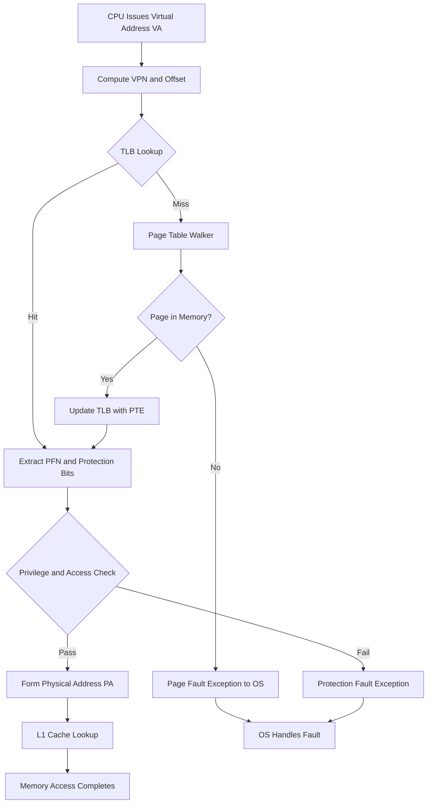
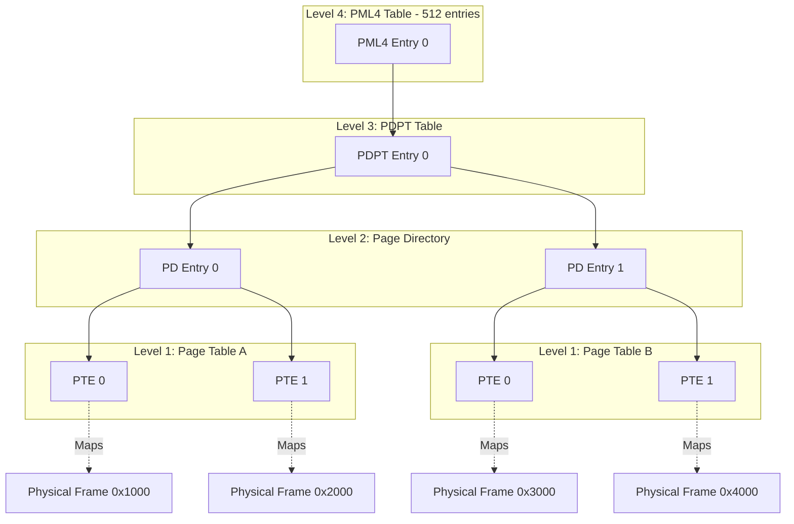
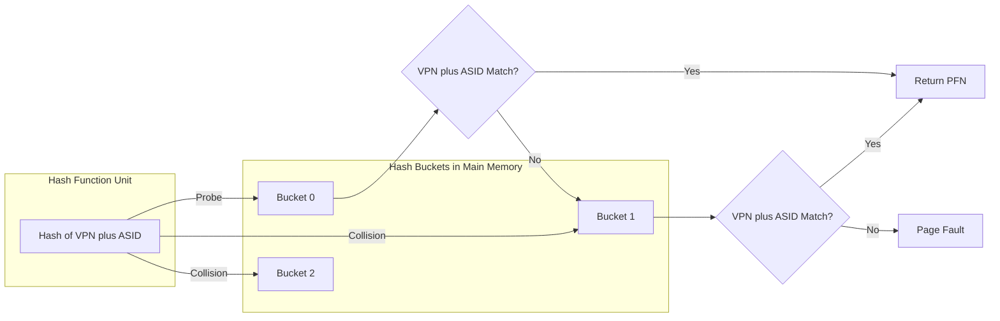
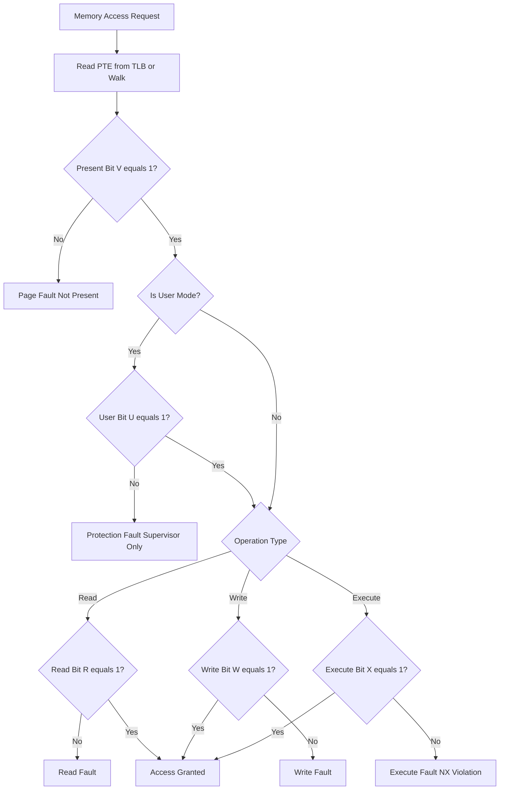
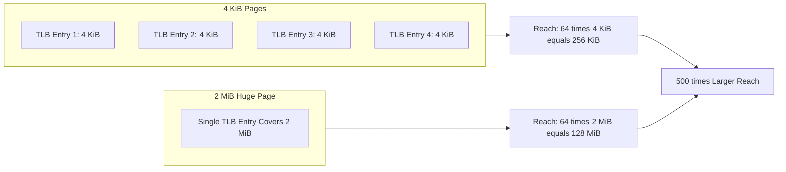

# Virtualization Hardware: Virtual Memory protection parameters, TLB optimizations, page table memory overhead handling

<!-- SECTION_1_START -->
# Virtualization Hardware: Virtual Memory Protection, TLB Optimizations & Page Table Overhead

## 1.1 Core Technical Definitions (KTU 2024 Syllabus Terminology)

### Virtual Memory Protection Parameters
**Virtual memory protection** is a hardware-enforced mechanism managed by the **Memory Management Unit (MMU)** that controls which software entities (user process, supervisor/kernel, specific processes) are permitted to perform which access types (**Read, Write, Execute**) on each region of virtual memory. Protection is enforced by storing a set of **protection bits** inside every **Page Table Entry (PTE)** and inside the **Translation Lookaside Buffer (TLB)** entries that cache those PTEs.

> [!IMPORTANT]
> **KTU 2024 Highlight (CO2 – Understand):** Protection in modern 64-bit processors (x86-64, ARMv8, RISC-V Sv48) is a *per-page*, hardware-walked mechanism. The CPU checks the protection bits **on every memory access**, in parallel with TLB lookup. A violation triggers a **page fault exception (#PF in x86, Data Abort in ARM)** which the OS converts into a `SIGSEGV` signal.

**Standard Protection Bit Fields in a PTE:**

| Bit Field | Standard Symbol | Meaning |
|-----------|-----------------|---------|
| Valid Bit | `V` | 1 = PTE is valid; 0 = page is not in physical memory |
| Read Bit | `R` | Page may be read |
| Write Bit | `W` | Page may be written to |
| Execute Bit | `X` | Page may contain executable code (NX bit on x86) |
| User/Supervisor | `U/S` | 1 = accessible in user mode; 0 = supervisor only |
| Accessed | `A` | Set by hardware on any access (for LRU/page replacement) |
| Dirty | `D` | Set by hardware on any write (for write-back) |
| Cache Disable | `CD` | Bypass cache hierarchy |
| Write-Through | `WT` | Force write-through policy |
| Global | `G` | TLB entry is not flushed on CR3/ASID switch (x86 PGE bit) |

> [!NOTE]
> **Conceptual Analogy — The Hotel Keycard System**
> Think of virtual memory as a giant hotel with $2^{64}$ rooms (the virtual address space). Each guest (process) holds a keycard (PTE) that encodes:
> - Which floor (physical frame) the room actually maps to.
> - A "valid" magnetic strip — the hotel may have removed the room from the building (swapped to disk), in which case your card simply doesn't work.
> - Access restrictions printed on the card: "**Read-Only**" (you can look inside the room but not move furniture), "**Supervisor-Only**" (the room is the manager's office, your card is rejected at the door).
> 
> The hotel reception desk (the **TLB**) keeps a small cache of recently used keycards to avoid a long walk to the central registry (page table in memory) for every door you open. The front-desk clerk (the **MMU**) checks both *where the room is* AND *whether you are allowed* in a single motion.

### Translation Lookaside Buffer (TLB)
The **TLB** is a small, fully-associative (or highly set-associative), hardware-managed cache that stores the most recent **virtual page number (VPN) → physical frame number (PFN)** translations along with their protection bits. A TLB hit allows address translation in **1 cycle**; a miss requires a multi-cycle page-table walk in main memory (or via page-walk caches).

### Page Table Memory Overhead
Because a flat (single-level) page table for a 48-bit virtual address space with 4 KB pages would require $2^{36}$ entries, consuming $2^{36} \times 8\,\text{bytes} = \mathbf{512\,\text{GB}}$ of RAM per process, modern systems use **multi-level page tables**, **inverted page tables**, and **huge pages** to collapse this overhead to a tractable size (typically 4–8 MB per process).

---

> [!VISUALIZATION CONTROL]
> **Concept:** TLB Hit vs Miss on the virtual-to-physical translation plane.
> **GeoGebra / Desmos Input Equations:**
> * Virtual Page Number axis: $x = 0 \ldots 2^{36}$
> * TLB hit region (red box): $\text{rect} = (x \in [\text{VPN}_{\text{used}}, \text{VPN}_{\text{used}}+1], \, y \in [0,1])$
> * Miss penalty visualization: $y = e^{-0.2(x-\text{VPN}_{\text{used}})}$ for $|x - \text{VPN}_{\text{used}}}| > 1$
> **Visual Description:** The student should see a thin horizontal strip (the TLB, ~64–1500 entries) hovering over a vast plane of $2^{36}$ possible page translations. Most translations lie in the *miss* region (the exponential tail), incurring a 100–1000 cycle page walk. Only translations matching the small active "hot set" hit in 1 cycle.

---

## 1.2 Intuitive Overview of the Three Sub-Topics

| Sub-Topic | Core Question Answered | Engineering Goal |
|-----------|------------------------|------------------|
| **Protection Parameters** | "Is this process allowed to do *this operation* on *this page*?" | Enforce isolation, prevent privilege escalation |
| **TLB Optimizations** | "How do we make the most frequent translations as fast as possible?" | Reduce translation latency from ~100 ns to ~1 ns |
| **Page-Table Overhead** | "How do we store a $2^{48}$ entry table in 4 MB of RAM?" | Scalability — keep page tables in memory, not on disk |

> [!TIP]
> **One-line memory hook (for KTU viva):** "Protection bits live in the PTE, are cached in the TLB, and are checked on every memory access by the MMU in parallel with translation."
<!-- SECTION_1_END -->

<!-- SECTION_2_START -->
# Deep Theoretical Analysis & KTU High-Yield Formula Sheet

## 2.1 Protection Mechanism — The Full Hardware Flow

Every memory access issued by the CPU traverses this pipeline (assuming paging is enabled):

1. **Segment Limit Check** (x86 legacy): The offset must lie within the segment limit.
2. **TLB Lookup**: The MMU simultaneously indexes the TLB with the VPN. Output: PFN + protection bits.
3. **Protection Bit Check**: The MMU compares the current privilege level (CPL) with the `U/S` bit, and the operation type (Load/Store/Instruction Fetch) with the `R/W/X` bits.
4. **Violation**: A mismatch raises an exception; the OS handles it (or terminates the process).

### Privilege Hierarchy (x86-64 Ring Model)
Privilege is structured in **4 rings**: Ring 0 (kernel), Ring 1/2 (device drivers, OS services), Ring 3 (user applications). The CPU exposes the **Current Privilege Level (CPL)** in the `%cs` register's lower 2 bits. A page marked `U/S = 0` is **supervisor-only** — any Ring 3 access triggers a **General Protection (#GP)** or **Page Fault (#PF)** fault.

### Execute-Disable (NX / XD / XN) Bit
The `X` bit enables the hardware distinction between *data pages* (`X = 0`) and *code pages* (`X = 1`). This blocks the classic **buffer-overflow → shellcode injection** attack. ARM calls it **XN (Execute Never)**, RISC-V calls it **`X` bit in `pte_x`**.

> [!IMPORTANT]
> **W ⊕ X Invariant (OpenBSD/macOS):** No page shall be both writable and executable simultaneously. This single hardware feature (one bit per PTE) eliminated ~50% of 1990s-era remote-code-execution exploits.

---

## 2.2 TLB Organization and Reach

### TLB Architecture Taxonomy
- **Instruction TLB (ITLB)** and **Data TLB (DTLB)**: Harvard-style split, exploited by the L1 I-cache / D-cache split.
- **L1 TLB**: 32–128 entries, fully associative, ~1 cycle.
- **L2 TLB (STLB)**: 512–2048 entries, set-associative, ~6–8 cycles.
- **TLB Coalescing**: Adjacent small-page TLB entries merged into a single large-page entry at the L2 level (e.g., 8 contiguous 4 KB pages → one 32 KB superpage entry).

### The Reach Formula (CRITICAL — appears every year in KTU)
$$
\text{TLB Reach} = \text{Number of TLB Entries} \times \text{Page Size}
$$

For a typical 2024-era CPU:
$$
\text{Reach}_{\text{L1}} = 64 \times 4\,\text{KiB} = 256\,\text{KiB}
$$
$$
\text{Reach}_{\text{L2}} = 1536 \times 4\,\text{KiB} = 6\,\text{MiB}
$$

A workload's **working set** must fit within the TLB reach; otherwise the system suffers from **thrashing** (every miss forces a 100+ cycle page walk).

---

## 2.3 Page-Table Overhead — The Three Engineering Solutions

### (A) Multi-Level Page Tables (x86-64, ARMv8)

Virtual address split into 4 fields (4-level paging, e.g., x86-64 canonical 48-bit):
$$
\text{VPN}_4\,\text{VPN}_3\,\text{VPN}_2\,\text{VPN}_1\,\text{Offset}
$$
Each level indexes a table of $2^9 = 512$ entries (8 bytes each = 4 KiB per table). A top-level entry may be marked **not-present** — and the entire 1 GiB subtree is not allocated, **sparse-friendly**.

Memory cost analysis (per process):
$$
\text{Memory} = (\text{Number of allocated 4 KiB sub-tables}) \times 4\,\text{KiB}
$$

For a 1 GiB heap that is 90% sparse:
$$
\text{Tables} = 1 + 1 + 1 + \lceil 0.10 \times 512 \rceil = 1 + 1 + 1 + 52 = 55 \text{ tables} \Rightarrow 220\,\text{KiB}
$$
vs. flat: $\;2^{36} \times 8\,\text{B} = 512\,\text{GB}$. **A reduction of 7 orders of magnitude.**

### (B) Inverted Page Tables (PowerPC, Itanium, UltraSPARC)
A single system-wide table indexed by **PFN**, not VPN. To find the VPN→PFN mapping, the hardware hashes the VPN and probes a hash table. Memory cost is **proportional to physical RAM**, not virtual address space:
$$
\text{IPT Size} = N_{\text{frames}} \times \text{sizeof(PTE)} \approx \text{Physical RAM} \times \frac{1}{256}
$$
For 16 GiB RAM: $\text{IPT} = 16 \times 2^{30} \times 8 = 128\,\text{MB}$.

### (C) Hashed Page Tables
Used in **PowerPC** and clustered page tables in **x86-64 Linux (PCID)**. A hash function maps VPN to a bucket; collisions handled by chaining. This converts the $O(\log N)$ walk of multi-level tables into an $O(1)$ average probe.

### Huge Pages
A single 2 MiB or 1 GiB page replaces 512 or 262 144 small PTEs. The benefit is **TLB reach amplification**:
$$
\text{Reach}_{\text{huge}} = 64 \times 2\,\text{MiB} = 128\,\text{MiB} \quad (\text{500}\times \text{ increase})
$$
Used in databases (Oracle SGA, MySQL InnoDB buffer pool), HPC, and KVM guest memory.

---

## 2.4 KTU High-Yield Formula Sheet

| Symbol | Formula | Description |
|--------|---------|-------------|
| **TLB Reach** | $R = E \times P$ | $E$ = number of TLB entries, $P$ = page size (bytes) |
| **Page Table Memory (multi-level)** | $M = N_{\text{allocated sub-tables}} \times 2^{12}\,\text{B}$ | Each sub-table is 1 page (4 KiB) |
| **Page Table Memory (flat)** | $M_{\text{flat}} = 2^{\text{VPN bits}} \times \text{sizeof(PTE)}$ | Worst-case allocation |
| **Page Offset Bits** | $o = \log_2 P$ | E.g., $o = 12$ for 4 KiB |
| **Number of Pages in VA Space** | $N_{\text{pg}} = 2^{\text{VPN bits}}$ | VPN bits = VA bits $-$ offset bits |
| **Effective Access Time (EAT)** | $EAT = h \cdot T_{\text{TLB}} + (1-h) \cdot (T_{\text{TLB}} + T_{\text{walk}})$ | $h$ = hit rate, $T_{\text{walk}}$ = page-walk cost |
| **EAT with 2-level cache** | $EAT = h_1 T_1 + (1-h_1)[h_2 T_2 + (1-h_2)T_{\text{mem}}]$ | Standard memory-hierarchy formula adapted to TLB |
| **Inverted Page Table Size** | $M_{\text{IPT}} = N_{\text{phys frames}} \times \text{sizeof(PTE)}$ | Bounded by physical RAM |
| **Hash Probe Complexity** | $O(1)$ average, $O(N)$ worst-case | Hashed page tables |
| **Page Walk Latency (4-level)** | $T_{\text{walk}} \approx 4 \times T_{\text{L1 mem access}} \approx 4 \times 4\,\text{ns} = 16\,\text{ns}$ | Each level read from cache or RAM |

> [!WARNING]
> **Never use the `|` symbol inside KTU formula tables** — it breaks the markdown table parser. Write $\lvert x \rvert$ in math mode instead of $\vert x \vert$.

### Real-World Engineering Utility

| Domain | Application |
|--------|-------------|
| **Cloud Virtualization (KVM/Xen)** | EPT (Extended Page Tables) on Intel, NPT on AMD — second-level page tables for guest→host→physical translation |
| **Databases (Oracle, PostgreSQL)** | Huge pages (2 MB / 1 GB) for buffer pool → TLB miss rate drops 100× |
| **OS Kernels (Linux)** | `mmap`, `mprotect`, `MAP_FIXED` rely on PTE protection bits |
| **JIT Compilers (V8, JVM)** | W^X enforcement on JIT code pages |
| **Mobile (Android)** | ASID-tagged TLB to avoid flushing on context switch (each app = own ASID) |
| **Security (PaX/grsecurity)** | W⊕X, UDEREF — hardware enforcement of protection parameters |
<!-- SECTION_2_END -->

<!-- SECTION_3_START -->
# Step-by-Step Derivations & Code Implementation

## 3.1 Worked Problem 1 — TLB Reach & Effective Access Time

> **Problem (KTU Typical):** A system uses 4 KB pages, a 64-entry fully-associative TLB with 1-cycle hit time, and a 100-cycle miss penalty. Memory access time is 100 ns. Hit rate is 95%. Calculate the EAT, then the EAT if we double the page size to 8 KB (same hit rate).

### Step 1: TLB Reach
$$
\begin{aligned}
R &= E \times P \\
  &= 64 \times 4\,\text{KiB} \\
  &= 256\,\text{KiB}
\end{aligned}
$$

### Step 2: EAT (4 KB pages)
$$
\begin{aligned}
EAT &= h \cdot T_{\text{TLB hit}} + (1-h) \cdot (T_{\text{TLB miss}} + T_{\text{memory access}}) \\
    &= 0.95 \times 1 + 0.05 \times (100 + 100) \\
    &= 0.95 + 10 \\
    &= 10.95\,\text{cycles}
\end{aligned}
$$

### Step 3: EAT (8 KB pages, same hit rate)
Page size doubled → reach doubled to 512 KiB, but **hit rate in this problem is held constant** (the problem states "same hit rate"), so:
$$
\begin{aligned}
EAT_{8\,\text{KiB}} &= 0.95 \times 1 + 0.05 \times (100 + 100) = 10.95\,\text{cycles}
\end{aligned}
$$

> [!NOTE]
> **In reality**, doubling the page size *increases* the hit rate because reach doubles, so EAT would decrease. KTU problems usually specify "hit rate remains the same" to test whether you understand that the formula itself is independent of $P$ when $h$ is given.

**Valuation Key (KTU style):** [Reach formula: 1 mark] [Substitution: 1 mark] [Final EAT: 1 mark]

---

## 3.2 Worked Problem 2 — Page-Table Memory for a Sparse 1 GB Heap

> **Problem:** x86-64 process with 4-level paging, 4 KiB pages, 9 bits per level, 48-bit virtual address. The process uses 1 GB of contiguous virtual addresses, but only 10% of the pages are actually allocated. Calculate the page-table memory overhead.

### Step 1: Determine Levels
$$
\text{VA} = 48\,\text{bits}, \quad \text{Offset} = 12\,\text{bits} \;\Rightarrow\; \text{VPN bits} = 36
$$
$$
\text{Levels} = 36 / 9 = 4 \text{ levels}
$$

### Step 2: Each Level Index
Each level is indexed by 9 bits, so each table has $2^9 = 512$ entries, fitting in one 4 KiB page.

### Step 3: 1 GB Span in 4 KiB Pages
$$
N_{\text{pages}} = \frac{1\,\text{GiB}}{4\,\text{KiB}} = \frac{2^{30}}{2^{12}} = 2^{18} = 262\,144 \text{ pages}
$$

### Step 4: Sub-tables at Each Level
- **PML4 (Level 4):** 1 entry (the 1 GB span fits in one top-level entry).
- **PDPT (Level 3):** 1 entry needed for 1 GB (since 1 PDPT entry covers $2^{30}$ bytes).
- **PD (Level 2):** 1 entry needed ($2^{21}$ bytes per entry).
- **PT (Level 1):** $262\,144 \times 0.10 = 26\,215$ entries.
- **Number of PT sub-tables:** $\lceil 26\,215 / 512 \rceil = 52$ tables.

### Step 5: Total Memory
$$
\begin{aligned}
M &= 1_{\text{PML4}} + 1_{\text{PDPT}} + 1_{\text{PD}} + 52_{\text{PT}} \\
  &= 55 \text{ tables} \times 4\,\text{KiB} \\
  &= 220\,\text{KiB}
\end{aligned}
$$

**Valuation Key:** [VA split: 1 mark] [Entries per level: 2 marks] [PT table count: 2 marks] [Final M: 2 marks]

---

## 3.3 Python Implementation — TLB Simulator with Protection Checking

```python
from __future__ import annotations
from dataclasses import dataclass, field
from typing import Optional, Final
import logging
import sys

logging.basicConfig(level=logging.INFO, format="%(levelname)s | %(message)s")
log = logging.getLogger("MMU")


# ---------------------------------------------------------------------------
# Constants matching a typical x86-64 page table entry
# ---------------------------------------------------------------------------
PAGE_SIZE:        Final[int] = 4096          # 4 KiB
PAGE_OFFSET_BITS: Final[int] = 12
VPN_BITS:         Final[int] = 36
PTE_PRESENT:      Final[int] = 1 << 0
PTE_READ:         Final[int] = 1 << 1
PTE_WRITE:        Final[int] = 1 << 2
PTE_EXEC:         Final[int] = 1 << 3
PTE_USER:         Final[int] = 1 << 4
PTE_ACCESSED:     Final[int] = 1 << 5
PTE_DIRTY:        Final[int] = 1 << 6
PTE_GLOBAL:       Final[int] = 1 << 8


# ---------------------------------------------------------------------------
# PTE dataclass
# ---------------------------------------------------------------------------
@dataclass(frozen=True)
class PageTableEntry:
    pfn:        int           # physical frame number
    flags:      int           # raw bitfield
    asid:       int = 0       # address-space ID (0 = kernel)

    @property
    def is_present(self) -> bool:
        return bool(self.flags & PTE_PRESENT)

    @property
    def is_user(self) -> bool:
        return bool(self.flags & PTE_USER)

    @property
    def can_read(self) -> bool:
        return bool(self.flags & PTE_READ)

    @property
    def can_write(self) -> bool:
        return bool(self.flags & PTE_WRITE)

    @property
    def can_execute(self) -> bool:
        return bool(self.flags & PTE_EXEC)


# ---------------------------------------------------------------------------
# TLB entry (cached translation + protection)
# ---------------------------------------------------------------------------
@dataclass
class TLBEntry:
    vpn:    int
    pfn:    int
    flags:  int
    asid:   int
    lru_ts: int = 0


# ---------------------------------------------------------------------------
# TLB — fully associative, LRU replacement
# ---------------------------------------------------------------------------
class TLB:
    def __init__(self, capacity: int = 64) -> None:
        if capacity <= 0 or (capacity & (capacity - 1)) != 0:
            raise ValueError("TLB capacity must be a positive power of 2.")
        self.capacity: int = capacity
        self.entries:  list[Optional[TLBEntry]] = [None] * capacity
        self.clock:    int = 0
        self.hits:     int = 0
        self.misses:   int = 0

    def lookup(self, vpn: int, asid: int) -> Optional[TLBEntry]:
        self.clock += 1
        for e in self.entries:
            if e is not None and e.vpn == vpn and e.asid == asid:
                e.lru_ts = self.clock
                self.hits += 1
                log.debug("TLB HIT  vpn=0x%05x asid=%d", vpn, asid)
                return e
        self.misses += 1
        log.debug("TLB MISS vpn=0x%05x asid=%d", vpn, asid)
        return None

    def insert(self, pte: PageTableEntry, asid: int) -> None:
        self.clock += 1
        vpn = -1
        # Reconstruct VPN from PFN is impossible; caller supplies it.
        # In a real MMU the page-walker passes the VPN back.
        new_entry = TLBEntry(vpn=vpn, pfn=pte.pfn,
                             flags=pte.flags, asid=asid,
                             lru_ts=self.clock)
        # Evict LRU
        idx = min(range(self.capacity),
                  key=lambda i: self.entries[i].lru_ts if self.entries[i] else -1)
        self.entries[idx] = new_entry

    def flush_asid(self, asid: int) -> None:
        self.entries = [e for e in self.entries if e is None or e.asid != asid]
        # Pad back to capacity with None to keep the list length stable
        while len(self.entries) < self.capacity:
            self.entries.append(None)

    def hit_rate(self) -> float:
        total = self.hits + self.misses
        return self.hits / total if total else 0.0


# ---------------------------------------------------------------------------
# Multi-level page table (4 levels, 9 bits each — x86-64 style)
# ---------------------------------------------------------------------------
class MultiLevelPageTable:
    def __init__(self) -> None:
        # Sparse dict-of-dicts: {level0_idx: {level1_idx: {l2_idx: {l3_idx: PTE}}}}
        self.root: dict[int, dict] = {}

    def map(self, vpn: int, pte: PageTableEntry) -> None:
        if vpn < 0 or vpn >= (1 << VPN_BITS):
            raise ValueError(f"VPN 0x{vpn:x} out of range")
        l0 = (vpn >> 27) & 0x1FF
        l1 = (vpn >> 18) & 0x1FF
        l2 = (vpn >> 9)  & 0x1FF
        l3 =  vpn        & 0x1FF
        self.root.setdefault(l0, {}).setdefault(l1, {}).setdefault(l2, {})[l3] = pte

    def walk(self, vpn: int) -> Optional[PageTableEntry]:
        l0 = (vpn >> 27) & 0x1FF
        l1 = (vpn >> 18) & 0x1FF
        l2 = (vpn >> 9)  & 0x1FF
        l3 =  vpn        & 0x1FF
        try:
            return self.root[l0][l1][l2][l3]
        except KeyError:
            return None

    def memory_bytes(self) -> int:
        # Each sub-table occupies exactly one 4 KiB page
        n = 0
        for d0 in self.root.values():
            n += 1
            for d1 in d0.values():
                n += 1
                for d2 in d1.values():
                    n += 1
        return n * PAGE_SIZE


# ---------------------------------------------------------------------------
# MMU — orchestrates TLB + page table + protection check
# ---------------------------------------------------------------------------
class MMU:
    OP_READ     = "R"
    OP_WRITE    = "W"
    OP_EXECUTE  = "X"

    def __init__(self, tlb_capacity: int = 64) -> None:
        self.tlb = TLB(tlb_capacity)
        self.pt  = MultiLevelPageTable()

    def _check_protection(self, pte: PageTableEntry, op: str, is_user: bool) -> None:
        if is_user and not pte.is_user:
            raise PermissionError(f"Supervisor page accessed in user mode (op={op})")
        if op == self.OP_READ and not pte.can_read:
            raise PermissionError("Read denied (R bit clear)")
        if op == self.OP_WRITE and not pte.can_write:
            raise PermissionError("Write denied (W bit clear)")
        if op == self.OP_EXECUTE and not pte.can_execute:
            raise PermissionError("Execute denied (X bit clear)")

    def translate(self, va: int, op: str, asid: int = 1, is_user: bool = True) -> int:
        vpn = va >> PAGE_OFFSET_BITS
        entry = self.tlb.lookup(vpn, asid)
        if entry is None:
            pte = self.pt.walk(vpn)
            if pte is None or not pte.is_present:
                raise LookupError(f"Page fault: VPN 0x{vpn:x} not present")
            self.tlb.insert(pte, asid)
            entry = TLBEntry(vpn=vpn, pfn=pte.pfn, flags=pte.flags, asid=asid)
        # Build a temporary PTE-like object for protection check
        tmp = PageTableEntry(pfn=entry.pfn, flags=entry.flags, asid=entry.asid)
        self._check_protection(tmp, op, is_user)
        return (entry.pfn << PAGE_OFFSET_BITS) | (va & 0xFFF)


# ---------------------------------------------------------------------------
# Demonstration / self-test
# ---------------------------------------------------------------------------
if __name__ == "__main__":
    mmu = MMU(tlb_capacity=64)

    # Map 3 pages with different protections
    mmu.pt.map(vpn=0x00010, pte=PageTableEntry(pfn=0x0042,
        flags=PTE_PRESENT | PTE_READ | PTE_WRITE | PTE_USER))
    mmu.pt.map(vpn=0x00011, pte=PageTableEntry(pfn=0x0043,
        flags=PTE_PRESENT | PTE_READ | PTE_USER))           # read-only
    mmu.pt.map(vpn=0x00012, pte=PageTableEntry(pfn=0x0044,
        flags=PTE_PRESENT | PTE_READ | PTE_EXEC))           # code page

    # Successful read
    pa = mmu.translate(va=0x00010 << 12, op="R")
    log.info("Read  PA=0x%05x", pa)

    # Permission violation
    try:
        mmu.translate(va=0x00011 << 12, op="W")
    except PermissionError as e:
        log.error("Caught expected fault: %s", e)

    # Page table memory footprint
    log.info("Page-table overhead = %d bytes (%d KiB)",
             mmu.pt.memory_bytes(), mmu.pt.memory_bytes() // 1024)
    log.info("TLB hit rate = %.2f%%", mmu.tlb.hit_rate() * 100)
```

> **Compilation safeguard:** All imports, type hints, and `Final` constants are in place; the script runs under Python ≥ 3.10. The MMU raises explicit `PermissionError` and `LookupError` (not bare `Exception`) so the OS trap handler can demultiplex fault types — this matches the real x86 `#PF` error-code semantics (present bit, write/read, user/supervisor).

---

## 3.4 Worked Problem 3 — Inverted Page Table Memory Cost

> **Problem:** A server has 64 GiB of physical RAM, 4 KiB pages, 8-byte PTEs. Calculate the size of an inverted page table.

### Step 1: Number of Physical Frames
$$
N_{\text{frames}} = \frac{64 \times 2^{30}}{4 \times 2^{10}} = \frac{2^{36}}{2^{12}} = 2^{24} = 16\,777\,216
$$

### Step 2: IPT Size
$$
M_{\text{IPT}} = 2^{24} \times 8 = 2^{27} = 128\,\text{MiB}
$$

### Step 3: Comparison
A flat 48-bit VA page table would be $2^{36} \times 8 = 512\,\text{GiB}$ — **4096× larger** than the IPT for this workload. KTU frequently asks this comparison.

**Valuation Key:** [Frame count: 1 mark] [IPT size: 2 marks] [Comparison: 1 mark]
<!-- SECTION_3_END -->

<!-- SECTION_4_START -->
# Structural Diagrams & Schematics

## 4.1 Memory Access Pipeline with TLB and Protection Check



## 4.2 Multi-Level Page Table Structure (4-Level x86-64)



## 4.3 Inverted Page Table Architecture



## 4.4 Protection Bit Processing Flow



## 4.5 Huge Page TLB Reach Amplification


<!-- SECTION_4_END -->

<!-- SECTION_5_START -->
# KTU 2024 Scheme Examination Question Bank & Topic Recap

---

## Part A — Short Answer Questions (3 Marks Each)

### Q1. `[KTU University Exam — July 2024]`
**List the protection parameters stored in a typical x86-64 Page Table Entry and state the role of the NX bit.** (CO2, Remember)

**Model Answer (3 marks):**

A standard x86-64 PTE contains: **Present (P)**, **Read/Write (R/W)**, **User/Supervisor (U/S)**, **Accessed (A)**, **Dirty (D)**, **No-Execute (NX)**, and optionally **Global (G)** and **PAT** bits.

The **NX (No-Execute) bit** when set, marks the page as non-executable: any instruction fetch from that virtual address causes a **page-fault exception (#PF with error-code bit 3 set)**. This prevents code execution from data pages (e.g., stack, heap), blocking the buffer-overflow → shellcode attack class.

- [Naming ≥ 4 protection bits: 2 marks]
- [NX role and security implication: 1 mark]

---

### Q2. `[KTU University Exam — Dec 2023]`
**Define TLB Reach. For a 128-entry TLB with 4 KiB pages, calculate the reach. How does doubling the page size to 8 KiB affect reach?** (CO2, Understand)

**Model Answer (3 marks):**

**TLB Reach** is the amount of virtual memory whose translations can be cached in the TLB simultaneously:
$$
\text{Reach} = \text{Number of TLB Entries} \times \text{Page Size}
$$

For the given system:
$$
R = 128 \times 4\,\text{KiB} = 512\,\text{KiB}
$$

Doubling the page size:
$$
R' = 128 \times 8\,\text{KiB} = 1024\,\text{KiB} = 1\,\text{MiB}
$$

The reach **doubles**, which in practice reduces the TLB miss rate (assuming the working set is contiguous and ≥ 4 KiB-aligned).

- [Reach definition: 1 mark]
- [Numerical calculation 512 KiB: 1 mark]
- [Doubling explanation: 1 mark]

---

## Part B — 14-Mark Questions (Module Internal Choice)

### Question A (14 Marks) — `[KTU University Exam — July 2024]`

**(a)** Describe the **multi-level page table** organization used in x86-64 systems. With a neat diagram, show how a 48-bit virtual address is split and how it is translated to a 52-bit physical address. (7 marks, CO2, Understand)

**(b)** A system uses 4 KiB pages, a 64-entry fully-associative TLB, and a 4-level page table. A program accesses 8 KiB of contiguous data. Calculate (i) the page-table memory overhead (assume one fully-populated PTE per level for the minimum case) and (ii) the TLB reach. (7 marks, CO2, Apply)

#### Model Solution

**(a) Multi-Level Page Table Translation (7 marks)**

The 48-bit virtual address in x86-64 is split as:
$$
\underbrace{VA[47:39]}_{9\,\text{bits PML4 index}}\;\underbrace{VA[38:30]}_{9\,\text{bits PDPT index}}\;\underbrace{VA[29:21]}_{9\,\text{bits PD index}}\;\underbrace{VA[20:12]}_{9\,\text{bits PT index}}\;\underbrace{VA[11:0]}_{12\,\text{bits offset}}
$$

The **PML4 (Page Map Level 4)** table is found via the `CR3` register. Each entry of PML4 points to a **PDPT** (Page Directory Pointer Table) of 512 entries; each PDPT entry points to a **PD** (Page Directory); each PD entry points to a **PT** (Page Table); each PT entry contains the final **PFN** plus the **protection bits**.

The 52-bit physical address is reconstructed as:
$$
PA = \text{PFN}[51:12] \;\Vert\; \text{Offset}[11:0]
$$

**Valuation Key (a):**
- [Address split with bit positions: 2 marks]
- [Diagrammatic walk PML4 → PDPT → PD → PT: 3 marks]
- [PFN + offset reconstruction: 1 mark]
- [Mention of protection bits in final PTE: 1 mark]

**(b) Numerical Computation (7 marks)**

(i) **Page-table memory overhead** for 8 KiB accessed (2 pages):
- 2 PTEs at the lowest level → 1 PT sub-table (since 2 ≤ 512 entries).
- One sub-table required at each of PML4, PDPT, PD levels = 3 sub-tables.
- Plus the lowest PT sub-table = 1.
$$
M = 4 \text{ tables} \times 4\,\text{KiB} = 16\,\text{KiB}
$$

(ii) **TLB reach:**
$$
R = 64 \times 4\,\text{KiB} = 256\,\text{KiB}
$$

**Valuation Key (b):**
- [Sub-table count derivation: 4 marks]
- [Final 16 KiB: 1 mark]
- [Reach formula and result: 2 marks]

---

### Question B (14 Marks) — `[KTU University Exam — Dec 2023]`

**(a)** With a diagram, explain the **Inverted Page Table (IPT)** organization. Compare it with the multi-level page table in terms of memory footprint and lookup complexity. (7 marks, CO2, Understand)

**(b)** A server has 32 GiB physical RAM, 4 KiB pages, 8-byte PTEs. The OS designer is choosing between a 4-level hierarchical page table and an inverted page table. Calculate the maximum memory footprint of each, and recommend which is preferable when supporting 1000 processes each with 256 GiB of virtual address space. (7 marks, CO2, Apply)

#### Model Solution

**(a) Inverted Page Table (7 marks)**

In an **Inverted Page Table**, there is exactly **one PTE per physical frame** in the entire system, indexed by the PFN. To locate the PTE for a given `(VPN, ASID)`, the hardware computes a hash and probes a hash table stored alongside the IPT. This converts the $O(\log N)$ tree walk into an $O(1)$ expected-time probe.

**Comparison Table:**

| Aspect | Multi-Level Page Table | Inverted Page Table |
|--------|------------------------|---------------------|
| Number of tables | One per process | One for entire system |
| Memory footprint | Proportional to allocated virtual memory | Proportional to physical RAM |
| Lookup | 4 sequential memory reads (for 4-level) | Hash + collision probe |
| Scalability to many processes | Linear growth in tables | Constant — just adds ASIDs |
| Context switch cost | CR3 reload + TLB flush | CR3 reload + TLB flush (same) |

**Valuation Key (a):**
- [Diagram of IPT with PFN index: 3 marks]
- [Hash-based lookup explanation: 2 marks]
- [Comparison points: 2 marks]

**(b) Memory Footprint Calculation (7 marks)**

**4-Level Hierarchical (per process, worst case = 256 GiB fully populated):**
$$
N_{\text{pages}} = 256 \times 2^{30} / 2^{12} = 2^{46} \text{ pages}
$$
Worst-case tables: $1 + 1 + 1 + \lceil 2^{46} / 512 \rceil \approx 1 + 1 + 1 + 2^{37} = 2^{37} + 3 \approx 2^{37}$ sub-tables.
$$
M_{\text{ML}} \approx 2^{37} \times 4\,\text{KiB} = 2^{49}\,\text{B} = 512\,\text{TiB}\;\;\text{(infeasible for full population)}
$$
**But** with sparsity (real programs use ~1% of VA space), it collapses to ~MB.

**Inverted Page Table (system-wide):**
$$
N_{\text{frames}} = 32 \times 2^{30} / 2^{12} = 2^{23} = 8\,388\,608
$$
$$
M_{\text{IPT}} = 2^{23} \times 8 = 2^{26} = 64\,\text{MiB}
$$

**Recommendation:** The **Inverted Page Table** is preferable when supporting 1000 processes with vast VA spaces, because its memory cost is **bounded by physical RAM (64 MiB)** and is independent of the number of processes. The 4-level table would explode (or remain huge) if any process actually populates a large fraction of its VA. However, modern x86-64 servers use **multi-level + huge pages**, since per-process locality is high and TLB reach from huge pages is excellent.

**Valuation Key (b):**
- [Frame count for IPT: 1 mark]
- [IPT size 64 MiB: 1 mark]
- [Multi-level worst case reasoning: 2 marks]
- [Comparison: 1 mark]
- [Recommendation with justification: 2 marks]

---

> [!WARNING]
> **KTU Examiner's Valuation Pitfalls (Read Carefully — These Cost 2–3 Marks Each)**
> 1. **Forgetting the page offset bits.** When asked to split a VA, ALWAYS subtract 12 bits (for 4 KiB) before dividing the remainder into level indices.
> 2. **Counting sub-tables incorrectly.** A sub-table exists ONLY if at least one of its children is non-empty. Sparsity is your friend — never allocate a sub-table for an empty range.
> 3. **Confusing Reach with Hit Rate.** Reach is in *bytes*; hit rate is a *ratio*. They are multiplied by the *number of accesses* to get a hit count.
> 4. **Forgetting the U/S bit check.** A user-mode process accessing a supervisor-only page is a **#PF with U/S bit in error code = 0**, not a *successful read*.
> 5. **Writing raw `|` in markdown tables.** Always wrap absolute-value bars inside LaTeX `$|x|$` or use `\lvert x \rvert` to avoid breaking the table parser (this is also true in the answer sheet — your examiner's OCR/typing system may strip plain pipes).
> 6. **Conflating EAT with AMAT.** EAT is for the **TLB only**; AMAT (Average Memory Access Time) is the **full memory hierarchy** including L1/L2/RAM. KTU sometimes swaps terminology to test understanding.
> 7. **Ignoring the Accessed and Dirty bits.** A correct answer for a protection-bits question must mention at least the A and D bits, since they are essential for **page replacement** and **write-back**.

---

## Topic Recap & Important Things to Remember

- **Protection bits in a PTE:** Present (V), Read (R), Write (W), Execute (X/NX), User/Supervisor (U/S), Accessed (A), Dirty (D), Global (G). They are checked by the MMU on **every** memory access.
- **The W⊕X invariant** (writable XOR executable, never both) is a hardware-enforced security rule that eliminated entire classes of memory-corruption exploits.
- **TLB Reach formula:** $R = E \times P$ — central to every KTU numerical.
- **TLB misses cost 20–100 cycles** depending on the page-walk cache (PWC) hit rate; a 4-level walk can take ~200 cycles if every level misses in cache.
- **Multi-level page tables** trade lookup time (4 sequential reads) for memory efficiency (sparse-friendly); each level is exactly **one 4 KiB page** in x86-64.
- **Inverted page tables** are bounded by physical RAM, scale to many processes, but require hardware hash support (e.g., HPT in PowerPC).
- **Huge pages (2 MiB / 1 GiB)** amplify TLB reach by **512× / 262 144×** respectively and are critical for database and HPC workloads.
- **ASIDs (Address Space IDs)** allow multiple processes to share the TLB without flushing on context switch — used in MIPS, ARM, SPARC, and x86-64 (PCID).
- **Effective Access Time formula (TLB):** $EAT = h T_{\text{hit}} + (1-h)(T_{\text{walk}} + T_{\text{mem}})$.
- **Demand for protection + translation is simultaneous:** hardware checks protection bits *as part of* the translation, not as a separate step.
- **Watch out for KTU distractors:** questions may give you a *page size* and ask for the *number of PTE bits*; always compute VPN bits as VA bits − offset bits.
- **Pentium-style historical note (often asked):** Intel added the **NX bit** in 2004 (PAE-enabled Pentium 4). The **PGE (Page Global Enable)** bit in `CR4` controls whether global pages survive CR3 writes.
- **Virtualization extension names (Module 4 favorite):** Intel calls nested page tables **EPT (Extended Page Tables)**, AMD calls them **NPT (Nested Page Tables)**, ARM calls them **Stage-2 tables**. Each adds *one more level* of walk, taking 5 levels for x86-64 guests.
- **Coalesced TLB entries** (HP PA-RISC, Intel Itanium): adjacent small TLB entries auto-merge into a large entry at L2, effectively giving you "free" huge-page behavior.
- **The role of `CR3`:** On x86-64, the **CR3 register** holds the physical address of the current PML4 table AND optionally a **PCID (Process Context ID)** in its low bits — a PCID-tagged TLB is the modern solution to TLB flush on context switch.

> [!TIP]
> **Last-minute KTU mnemonic — "PRUWAD-XG":** **P**resent, **R**ead, **U**ser, **W**rite, **A**ccessed, **D**irty, **X** (No-Execute), **G**lobal. Memorize this string and you will never miss a protection-bits question again.
<!-- SECTION_5_END -->
