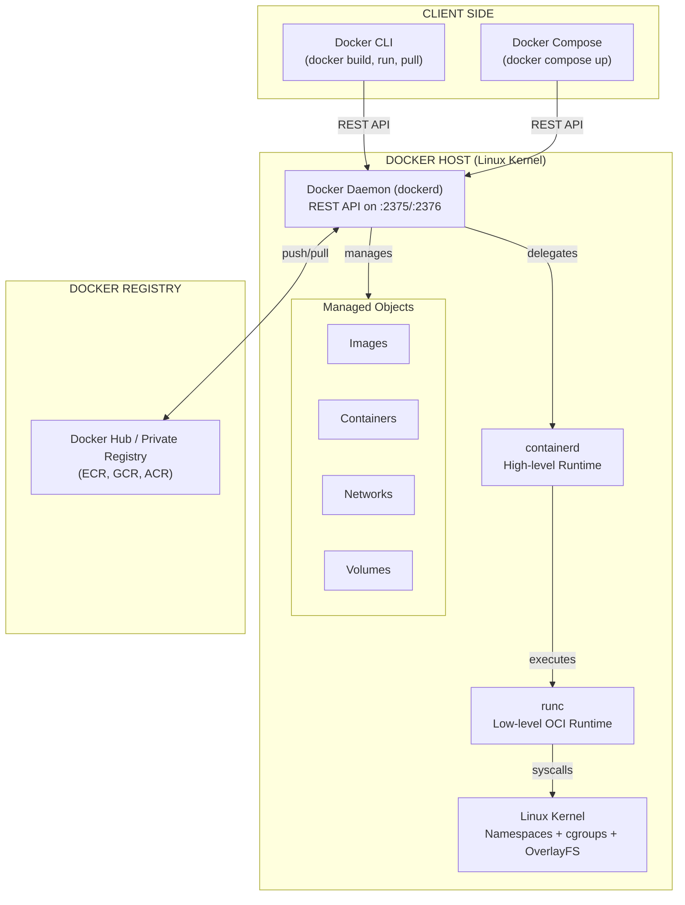
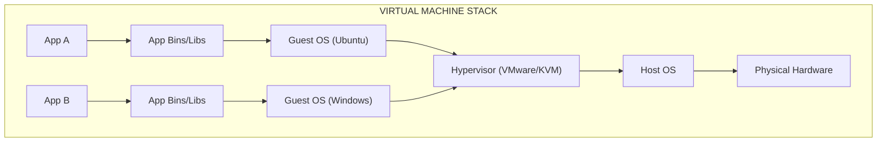
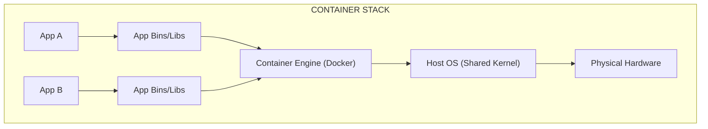
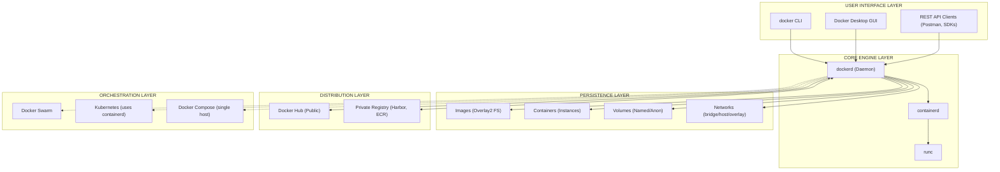
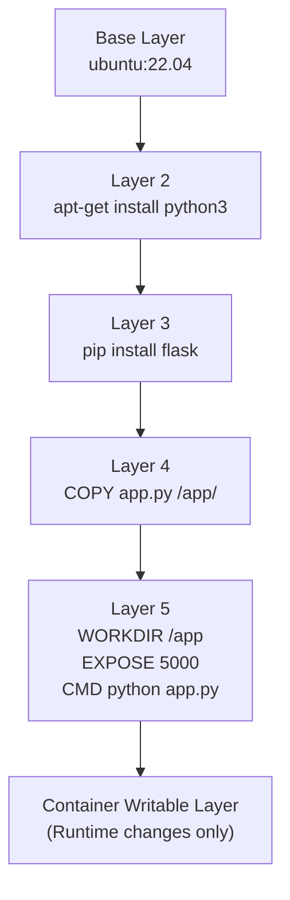

# Case Study - Docker Containers – Architecture, Components, Examples.

<!-- SECTION_1_START -->
# Docker Containers: Architecture, Components & Examples

## 1. Core Technical Definition

> [!IMPORTANT]
> **Formal Definition (KTU 2024 Syllabus Aligned)**
> **Docker** is an open-source *containerization* platform that packages applications and their dependencies into lightweight, portable, isolated units called **containers**, which run consistently across any environment leveraging OS-level virtualization (via Linux kernel features like **cgroups** and **namespaces**).

A **Docker Container** is a runtime instance of a **Docker Image**. It encapsulates:
- Application code
- Runtime (e.g., Python 3.11, Node.js 20)
- System libraries
- System tools and settings

### Conceptual Analogy / Intuition

> [!NOTE]
> **Real-World Analogy — The Shipping Container Revolution**
>
> Before standardized shipping containers, goods were loaded manually — every ship, truck, and train had its own loading logic. The shipping container standardized the *unit of transport*. **Docker does the same for software**: instead of "works on my machine", the application becomes a self-contained, standardized unit that runs *identically* on a developer's laptop, a test server, or a production cloud.

Think of it as a three-layer mental model:
1. **Image** = A *class* / blueprint / recipe (read-only template).
2. **Container** = An *instance* of that image (a running object).
3. **Dockerfile** = The *source code* used to build the image.

| Layer | Container Concept | Object-Oriented Analogy |
|---|---|---|
| Docker Image | Class definition | Blueprint of a house |
| Docker Container | Object instance | An actual built house |
| Dockerfile | Source code | Architectural drawing |
| Docker Hub | Repository | GitHub for images |

> [!TIP]
> **Syllabus Highlight:** KTU 2024 PCCST602 Module 4 explicitly asks for a *case study* on Docker — meaning the answer must demonstrate the **why**, **what**, and **how** with a working example, not just definitions.

### Key Architectural Constants & Metrics

- **Container Density:** A single host running Docker can support **100s–1000s of containers** simultaneously (vs. 10s of VMs).
- **Startup Time:** Containers boot in **milliseconds** (VMs take 10s of seconds to minutes).
- **Image Size:** Typically **MB range** (vs. GB for VMs) because containers share the host kernel.
- **Standard Port:** Docker Daemon listens on **2375** (insecure) and **2376** (TLS-secured).
- **OCI Runtime Spec:** Docker follows the **Open Container Initiative** specification for interoperability.

> [!VISUALIZATION CONTROL]
> **Concept:** Virtual Machine vs Docker Container — Resource Overhead Comparison
> **Conceptual Diagram Axes:**
> * X-Axis: Number of Workloads (1 → N)
> * Y-Axis: Resource Overhead (GB of RAM consumed)
> **Plot Equations (relative):**
> * $VM_{overhead}(n) = 1.5n + 2$  (each VM has its own Guest OS)
> * $Container_{overhead}(n) = 0.05n + 0.3$  (containers share host OS)
> **Visual Description:** Two diverging lines — VM line climbs steeply (each box carries a full OS), Container line stays nearly flat (only app + libs). The **gap between the curves = the efficiency gain** Docker provides.

---

<!-- SECTION_1_END -->

<!-- SECTION_2_START -->
# 2. Deep Theoretical Analysis — Docker Architecture & High-Yield Concepts

## 2.1 The Docker Engine — Three-Layer Architecture

Docker follows a **client–server architecture** composed of:

### Layer 1: Docker Daemon (`dockerd`)
- A long-running **background process/service**.
- Manages Docker objects: **images, containers, networks, volumes**.
- Listens for REST API requests on `/var/run/docker.sock` (Unix socket) or TCP port **2375/2376**.
- Communicates with the Linux kernel via **`containerd`** → **`runc`**.

### Layer 2: Docker REST API
- The **interface contract** between Client and Daemon.
- Uses **HTTP-based REST** (JSON payloads).
- Every `docker run`, `docker build` command is translated to an API call.

### Layer 3: Docker CLI (`docker` command)
- The **user-facing client**.
- Sends commands to the daemon via the API.
- Can also talk to a **remote daemon** (e.g., on a cloud VM) by setting `DOCKER_HOST`.

> [!IMPORTANT]
> **Why This Matters for KTU:** Question banks frequently test whether students understand that the **CLI and Daemon are decoupled** — meaning a single CLI can manage multiple remote daemons, which is the foundation of **Docker Swarm** and **Kubernetes Node agents**.

## 2.2 Docker Image Architecture — Layered Union File System

Images are built as a **stack of read-only layers** using the **Union File System (UnionFS / Overlay2)**.

| Image Layer (Top → Bottom) | Content | Example Instruction |
|---|---|---|
| Layer 5 (top, writable at runtime) | Container-specific changes | `docker run` adds a thin writable layer |
| Layer 4 | Application code | `COPY app.py /app/` |
| Layer 3 | Dependencies | `RUN pip install flask` |
| Layer 2 | System libraries | `RUN apt-get install -y python3` |
| Layer 1 (bottom) | Base OS (e.g., `ubuntu:22.04`) | `FROM ubuntu:22.04` |

> [!NOTE]
> **Why layers matter:** When you `docker pull` an updated image, Docker only downloads the **changed layers**, not the entire image. This is the **Content Addressable Storage (CAS)** model — every layer is identified by a **SHA-256 hash**.

## 2.3 Core Docker Components — High-Yield Reference Table

| Component | Type | Purpose | KTU Exam Frequency |
|---|---|---|---|
| **Dockerfile** | Text file (recipe) | Build instructions for an image | Very High |
| **Docker Image** | Read-only template | Package + run an application | Very High |
| **Docker Container** | Runnable instance | Live, isolated process | Very High |
| **Docker Volume** | Persistent storage | Survives container deletion | High |
| **Docker Network** | Virtual network | Inter-container communication | High |
| **Docker Compose** | YAML orchestrator | Multi-container app definition | High |
| **Docker Registry / Docker Hub** | Image repository | Store/distribute images | Medium |
| **Docker Daemon (`dockerd`)** | Background service | Manages Docker objects | Medium |
| **containerd** | High-level runtime | Manages container lifecycle | Low (advanced) |
| **runc** | Low-level runtime | Implements OCI spec, talks to kernel | Low (advanced) |
| **Docker Swarm** | Native orchestrator | Cluster of Docker engines | Medium |

> [!WARNING]
> **Common Confusion:** Students often mix up **`docker-compose`** (single-host, multi-container YAML) and **Docker Swarm** (multi-host clustering). Compose is for **developer laptops**; Swarm is for **production clustering** (although Kubernetes has largely replaced Swarm in industry).

## 2.4 The Build → Ship → Run Pipeline (Engineering Utility)

The Docker workflow maps directly to modern **DevOps / CI-CD** pipelines:

$$
\text{Dockerfile} \xrightarrow{\texttt{docker build}} \text{Image} \xrightarrow{\texttt{docker push}} \text{Registry} \xrightarrow{\texttt{docker pull}} \text{Container (any host)}
$$

> [!TIP]
> **Real-World Engineering Use:**
> - **Microservices:** Each microservice gets its own container, scaled independently.
> - **CI/CD:** GitHub Actions / Jenkins builds a Docker image for every commit, pushes to Docker Hub / ECR, deploys to AWS ECS / Kubernetes.
> - **Hybrid Cloud Portability:** Same image runs on AWS, Azure, GCP, or on-premise VMware — *no rewrite needed*.
> - **MLOps:** Reproducible ML training environments (TensorFlow, PyTorch) packaged as containers.
> - **Edge Computing:** Lightweight footprint suits IoT gateways and edge nodes.

## 2.5 Isolation Mechanisms — How Docker Achieves Isolation

Docker leverages **three Linux kernel features**:

1. **Namespaces** (`pid`, `net`, `mnt`, `uts`, `ipc`, `user`) — provide *isolated views* of system resources.
   - PID namespace: Container sees its own PID 1.
   - Net namespace: Container has its own virtual network interfaces.
2. **Control Groups (cgroups)** — enforce *resource limits* (CPU %, memory cap, I/O bandwidth).
3. **Union File Systems (OverlayFS)** — provide *layered, copy-on-write* storage.

> [!NOTE]
> **Why not full VM?** VMs use **hardware-level virtualization** (hypervisor + Guest OS per VM) — heavy. Docker uses **OS-level virtualization** (shared kernel) — light. This is the **fundamental architectural difference** the KTU examiner loves to test.

---

<!-- SECTION_2_END -->

<!-- SECTION_3_START -->
# 3. Step-by-Step Walkthrough — Dockerfile, Build, Run, Networking

## 3.1 End-to-End Example: Containerizing a Python Flask App

### Step 1 — Application Code

Create a directory `flask-app/` and a file `app.py`:

```python
from flask import Flask
import os

app = Flask(__name__)

@app.route("/")
def home():
    hostname = os.uname().nodename
    return f"Hello from Docker! Container hostname: {hostname}\n"

@app.route("/health")
def health():
    return {"status": "ok", "engine": "Docker"}, 200

if __name__ == "__main__":
    # Listen on 0.0.0.0 so the container accepts external traffic
    app.run(host="0.0.0.0", port=5000, debug=False)
```

### Step 2 — Requirements File

`requirements.txt`:
```
flask==3.0.3
```

### Step 3 — Dockerfile (Image Recipe)

```dockerfile
# ----- Stage 1: Build Stage (multi-stage best practice) -----
FROM python:3.11-slim AS builder

WORKDIR /build

# Copy requirements first to leverage Docker layer caching
COPY requirements.txt .
RUN pip install --no-cache-dir --user -r requirements.txt

# ----- Stage 2: Runtime Stage (minimal final image) -----
FROM python:3.11-slim

WORKDIR /app

# Copy only the installed packages from the builder stage
COPY --from=builder /root/.local /root/.local
ENV PATH=/root/.local/bin:$PATH

# Copy application source
COPY app.py .

# Expose the Flask port (documentation only, does NOT publish)
EXPOSE 5000

# Run as non-root user for security
RUN useradd -m appuser
USER appuser

# Container's PID 1 process
CMD ["python", "app.py"]
```

> [!IMPORTANT]
> **Why multi-stage builds?** The builder stage contains compilers, headers, and pip caches. The final image only carries **runtime dependencies**, dramatically reducing image size (often by 60–80%).

### Step 4 — Build the Image

```bash
docker build -t flask-demo:1.0 .
```

**Output trace (explanation of each line):**
```
[+] Building 18.4s (14/14) FINISHED
 => [internal] load build definition from Dockerfile         # Parses Dockerfile
 => => transferring dockerfile: 387B
 => [internal] load .dockerignore                              # Excludes unwanted files
 => [builder 1/4] FROM docker.io/library/python:3.11-slim      # Pulls base layer
 => [builder 2/4] WORKDIR /build                               # Sets working directory
 => [builder 3/4] COPY requirements.txt .                      # Adds requirements file
 => [builder 4/4] RUN pip install --user -r requirements.txt   # Installs deps
 => [stage-1 2/4] WORKDIR /app
 => [stage-1 3/4] COPY --from=builder /root/.local .           # Layer cache transfer
 => [stage-1 4/4] COPY app.py .                                # Adds source code
 => exporting to image                                         # Packs layers into final image
 => => naming to docker.io/library/flask-demo:1.0
```

### Step 5 — Run the Container

```bash
# Run in detached mode, map host port 8080 -> container port 5000
docker run -d \
  --name flask-instance \
  -p 8080:5000 \
  flask-demo:1.0
```

**Verify:**
```bash
docker ps                    # List running containers
docker logs flask-instance   # Stream logs
curl http://localhost:8080/  # Test the endpoint
```

**Expected output:**
```
Hello from Docker! Container hostname: <random-12-char-hash>
```

### Step 6 — Multi-Container with Docker Compose

`docker-compose.yml`:
```yaml
version: "3.9"

services:
  web:
    build: .
    image: flask-demo:1.0
    container_name: flask-web
    ports:
      - "8080:5000"
    depends_on:
      - redis
    environment:
      - REDIS_HOST=redis
      - REDIS_PORT=6379
    restart: unless-stopped

  redis:
    image: redis:7-alpine
    container_name: flask-redis
    ports:
      - "6379:6379"
    volumes:
      - redis-data:/data

volumes:
  redis-data:
```

Bring it up:
```bash
docker compose up -d
docker compose ps
docker compose logs -f web
```

## 3.2 Networking Deep-Dive — Port Mapping Derivation

When a container is created, it gets its own **virtual network interface** inside a Docker network (default: `bridge`). To make a service reachable from outside the host, we use **port publishing**:

$$
\text{Host Port} \xrightarrow{\text{DNAT in iptables}} \text{Container IP : Container Port}
$$

**Example mapping:** `-p 8080:5000`
- `8080` = port on the **host machine** (what the user hits in their browser).
- `5000` = port **inside the container** where Flask binds.
- Docker inserts an **iptables rule** that DNATs incoming traffic to `8080` → `Container_IP:5000`.

> [!TIP]
> **Why two ports?** It allows **port conflict avoidance** — multiple containers can internally run on `5000`, but each is exposed on a different host port (e.g., 8080, 8081, 8082).

## 3.3 Persistent Storage — Volumes vs Bind Mounts

| Mechanism | Managed By | Use Case | Location |
|---|---|---|---|
| **Named Volume** | Docker | Database data, app state | `/var/lib/docker/volumes/...` |
| **Bind Mount** | User | Dev workflow (live code reload) | Any host directory |
| **tmpfs Mount** | OS RAM | Secrets, non-persistent cache | RAM only |

**Volume example:**
```bash
docker volume create db_data
docker run -d \
  --name postgres-db \
  -v db_data:/var/lib/postgresql/data \
  -e POSTGRES_PASSWORD=secret \
  postgres:16-alpine
```

> [!WARNING]
> **Container layer data is NOT persistent.** When the container is removed (`docker rm`), everything in its writable layer is **deleted** — unless it was stored in a volume.

---

<!-- SECTION_3_END -->

<!-- SECTION_4_START -->
# 4. Structural Diagrams & Schematics

## 4.1 Docker High-Level Engine Architecture



## 4.2 Container Build → Ship → Run Workflow

```mermaid
flowchart LR
    subgraph Dev["DEVELOPER MACHINE"]
        CODE["Application Code\n(app.py, package.json)"]
        DOCKERFILE["Dockerfile\n(Build Recipe)"]
    end

    subgraph Build["BUILD STEP"]
        BUILD_CMD["docker build -t myapp:1.0 ."]
        IMAGE["Docker Image\n(Layered Read-Only FS)"]
    end

    subgraph Registry["REGISTRY"]
        PUSH["docker push myapp:1.0"]
        HUB["Docker Hub / ECR\n(centralized image store)"]
    end

    subgraph Prod["ANY HOST (Test/Staging/Prod)"]
        PULL["docker pull myapp:1.0"]
        RUN["docker run -d -p 8080:5000 myapp:1.0"]
        CONTAINER["Running Container\n(Writable Layer on top)"]
    end

    CODE --> DOCKERFILE
    DOCKERFILE --> BUILD_CMD
    BUILD_CMD --> IMAGE
    IMAGE --> PUSH
    PUSH --> HUB
    HUB --> PULL
    PULL --> RUN
    RUN --> CONTAINER
```



## 4.3 VM vs Container Architecture Comparison





> [!NOTE]
> **Key Takeaway from Diagrams:** In the VM model, **each workload carries a full Guest OS** — heavy, slow to boot, GBs in size. In the Container model, **all workloads share the host kernel** via the container engine — lightweight, sub-second boot, MBs in size.

## 4.4 Docker Component Topology (System Map)



## 4.5 Image Layering — Build Cache Strategy



> [!TIP]
> **Layer Caching Logic:** Docker caches each instruction. If you re-build and only `app.py` changed, layers 0–3 are reused from cache. **Always place frequently changing instructions (like `COPY source`) at the bottom** of the Dockerfile to maximize cache hits.

---

<!-- SECTION_4_END -->

<!-- SECTION_5_START -->
# 5. KTU 2024 Scheme Examination Question Bank & Topic Recap

## 5.1 Part A — Short Answer Questions (3 Marks Each)

### Q1. `[KTU University Exam – July 2024, CO1, Remember]`
**Differentiate between a Docker Image and a Docker Container. (3 Marks)**

**Model Answer:**

| Aspect | Docker Image | Docker Container |
|---|---|---|
| Definition | Read-only template with instructions for creating a container | Running instance of an image |
| State | Static, immutable | Dynamic, has a writable layer |
| Storage | Stored in `/var/lib/docker/overlay2/` | Exists only while running (unless persisted via volume) |
| Analogy | Class definition | Object instance |

> [Defining both: 1 Mark] [Highlighting immutability of image: 1 Mark] [Distinguishing writable layer of container: 1 Mark]

### Q2. `[KTU University Exam – Dec 2023, CO1, Understand]`
**What is the role of the Docker Daemon (`dockerd`)? (3 Marks)**

**Model Answer:**
The Docker Daemon is a long-running background service that:
1. Listens for **REST API requests** from the Docker CLI on port **2375/2376**.
2. Manages Docker objects: **images, containers, networks, and volumes**.
3. Delegates container execution to **`containerd` → `runc`**, which interfaces with the Linux kernel.

> [Identifying daemon as background service: 1 Mark] [Mentioning REST API: 1 Mark] [Listing managed objects: 1 Mark]

---

## 5.2 Part B — Long Answer Questions (14 Marks, Module Internal Choice)

### QUESTION A `[KTU University Exam – July 2024, CO2, Apply]`

**(a)** Explain the **Docker Engine architecture** with a neat diagram. Describe the functions of the **Docker Client, Docker Daemon, and Docker Registry**. **(7 Marks)**

**Model Solution:**

**1. Docker Client:**
- The user-facing component invoked via the `docker` command.
- Sends commands to the daemon using the **REST API** over a Unix socket or TCP.
- Can connect to a **remote daemon** by setting `DOCKER_HOST=tcp://<ip>:2376`.

**2. Docker Daemon (`dockerd`):**
- The persistent service that handles all Docker objects.
- Communicates with `containerd` (high-level runtime) which in turn invokes `runc` (low-level OCI runtime) to spawn containers using Linux **namespaces and cgroups**.

**3. Docker Registry:**
- A stateless, scalable server-side application that stores and distributes Docker images.
- **Docker Hub** is the public default; private registries include **AWS ECR, Azure ACR, Google GCR, and Harbor**.

> [Diagrammatic representation of client–daemon–registry flow: 3 Marks]
> [Describing Docker Client with API mention: 1 Mark]
> [Describing Daemon with `containerd`/`runc` chain: 2 Marks]
> [Describing Registry and examples: 1 Mark]

**(b)** Write a **Dockerfile** to containerize a simple Python Flask application that listens on port 5000. Explain each instruction. **(7 Marks)**

**Model Solution:**

```dockerfile
# Use a slim Python 3.11 base image
FROM python:3.11-slim

# Set the working directory inside the container
WORKDIR /app

# Copy the requirements file first (for layer caching)
COPY requirements.txt .

# Install Python dependencies
RUN pip install --no-cache-dir -r requirements.txt

# Copy the rest of the application code
COPY . .

# Document that the container listens on port 5000
EXPOSE 5000

# Define the default command to run the app
CMD ["python", "app.py"]
```

**Instruction-by-Instruction Explanation:**

| Line | Purpose | Marks |
|---|---|---|
| `FROM python:3.11-slim` | Pulls base image with Python 3.11 runtime | 1 |
| `WORKDIR /app` | Sets `/app` as the working directory | 0.5 |
| `COPY requirements.txt .` | Adds requirements file (small, placed early for caching) | 1 |
| `RUN pip install ...` | Installs dependencies in a separate layer | 1 |
| `COPY . .` | Copies application source into the image | 0.5 |
| `EXPOSE 5000` | Documents the listening port (metadata) | 1 |
| `CMD ["python", "app.py"]` | Defines PID 1 process when container starts | 1 |
| Build & Run commands (`docker build -t flaskapp:1.0 .` and `docker run -p 8080:5000 flaskapp:1.0`) | Demonstrates the full build–run cycle | 1 |

---

### QUESTION B `[KTU University Exam – Dec 2023, CO2, Apply]`

**(a)** Compare **Virtual Machines** and **Docker Containers** based on architecture, boot time, size, isolation, and performance. **(7 Marks)**

**Model Solution:**

| Parameter | Virtual Machine | Docker Container |
|---|---|---|
| **Architecture** | Hardware-level virtualization (Hypervisor) | OS-level virtualization (Shared Kernel) |
| **Boot Time** | 30–60 seconds | <1 second (milliseconds) |
| **Image Size** | GBs (5–50 GB) | MBs (50–500 MB) |
| **OS Requirement** | Each VM runs its own Guest OS | All containers share host OS kernel |
| **Isolation** | Strong (separate kernel) | Process-level (namespaces) |
| **Performance** | Near-native (~95%) | Native (~99%) |
| **Density** | 10s per host | 1000s per host |
| **Hypervisor** | Required (VMware, KVM, Hyper-V) | Not required |

> [Architecture & Hypervisor distinction: 2 Marks] [Boot time and size: 2 Marks] [Isolation and performance: 2 Marks] [Density advantage: 1 Mark]

**(b)** With a suitable diagram, explain the **build, ship, and run** workflow of a Docker-based application. Show the commands used at each stage. **(7 Marks)**

**Model Solution:**

**Stage 1 — Build (Developer Machine):**
- Developer writes application code and a `Dockerfile`.
- Command: `docker build -t myapp:1.0 .`
- Output: A layered, read-only **Docker Image** stored locally.

**Stage 2 — Ship (Registry):**
- Command: `docker push myapp:1.0`
- The image is uploaded to a **Docker Registry** (Docker Hub / ECR).
- The image is content-addressed (SHA-256 hash) for integrity.

**Stage 3 — Run (Any Target Host):**
- On any host (test/staging/production):
  ```
  docker pull myapp:1.0
  docker run -d -p 80:5000 --name web myapp:1.0
  ```
- A **container** is instantiated with a thin writable layer atop the image layers.
- The application is reachable at `http://<host-ip>/`.

> [Build stage explanation with command: 2 Marks] [Ship stage with registry concept: 2 Marks] [Run stage with port mapping: 2 Marks] [Diagram of the pipeline: 1 Mark]

---

## 5.3 KTU Examiner's Valuation Warning

> [!WARNING]
> **Common Pitfalls — Where Students Lose Marks**
> 1. **Confusing `EXPOSE` with `-p`:** `EXPOSE` is **documentation only**; it does NOT publish the port. Use `-p 8080:5000` at runtime.
> 2. **Skipping the `CMD`/`ENTRYPOINT`:** Without a default command, the container exits immediately. Always define PID 1.
> 3. **Forgetting to mention `containerd`/`runc`:** Examiners reward the layered execution chain (`dockerd → containerd → runc → kernel`).
> 4. **Treating volumes as optional:** Container data is **ephemeral**. Always justify persistent storage via volumes for databases.
> 5. **Missing the layered FS explanation:** Images are **layered, copy-on-write, content-addressed** — this is a favourite 2–3 mark sub-question.
> 6. **No diagram in 14-mark questions:** A neat block diagram of architecture is worth **2–3 marks** standalone.
> 7. **Writing `docker-compose` for multi-host scenarios:** Compose is **single-host**; multi-host clustering needs **Swarm or Kubernetes**.

---

## 5.4 Topic Recap & Important Things to Remember

> [!IMPORTANT]
> **Rapid Revision Checklist — Docker Containers**

- **Definition:** Docker is an OS-level virtualization platform that packages apps + dependencies into isolated, portable containers.
- **Core Trio:** **Image** (blueprint), **Container** (running instance), **Dockerfile** (build recipe).
- **Engine Layers:** `Docker CLI` → `REST API` → `dockerd` → `containerd` → `runc` → `Linux Kernel`.
- **Isolation:** Uses Linux **namespaces** (isolation view) + **cgroups** (resource limits) + **OverlayFS** (layered storage).
- **Image Layers:** Read-only, stacked, **content-addressed (SHA-256)**, with a thin writable layer added at runtime.
- **Dockerfile Key Instructions:** `FROM`, `WORKDIR`, `COPY`, `RUN`, `EXPOSE`, `CMD`/`ENTRYPOINT`, `USER`, `ENV`, `VOLUME`.
- **Port Mapping:** `-p <host_port>:<container_port>` — host port is the public-facing one.
- **Volumes:** Persistent storage for databases; survive `docker rm`. Bind mounts = dev, named volumes = prod.
- **Networks:** `bridge` (default), `host` (no isolation), `overlay` (multi-host Swarm), `none` (no network).
- **Docker Compose:** YAML-based, single-host, multi-container orchestration; uses `docker-compose up -d`.
- **Docker Swarm vs Compose:** Swarm = multi-host clustering; Compose = single-host dev tool.
- **VM vs Container:** VMs = hardware virt + Guest OS (heavy); Containers = OS virt + shared kernel (light).
- **Registry:** Docker Hub is the public default; ECR/ACR/GCR/Harbor are enterprise alternatives.
- **Performance Metrics:** Boot <1s, size in MB, density in 1000s/host, native CPU/mem performance.
- **Security Best Practices:** Use slim base images, run as non-root (`USER appuser`), scan with `docker scan`, use multi-stage builds.
- **Standard Ports:** Daemon REST API = **2375 (insecure) / 2376 (TLS)**; Docker Compose file = `docker-compose.yml` (v2) or `compose.yaml` (v3).
- **KTU Buzzwords to Memorize:** *Content Addressable Storage, Union File System, OCI Specification, Layer Caching, Build-Ship-Run, Microservice Isolation, Immutable Infrastructure.*
- **Real-World Adoption:** Used in **CI/CD pipelines (Jenkins, GitHub Actions), MLOps, edge computing, hybrid cloud migration**, and as the deployment unit for **Kubernetes Pods**.

<!-- SECTION_5_END -->
