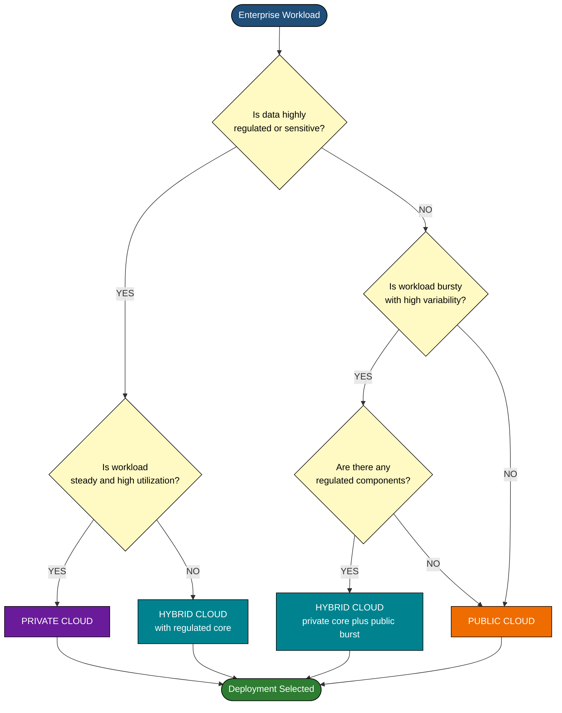
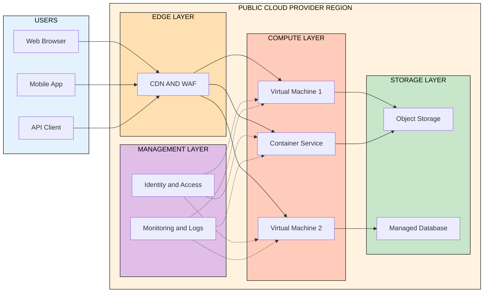
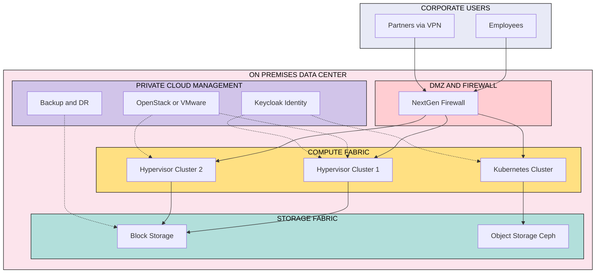
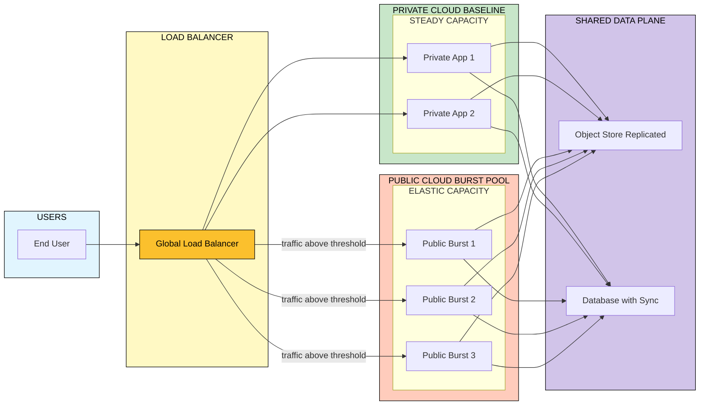
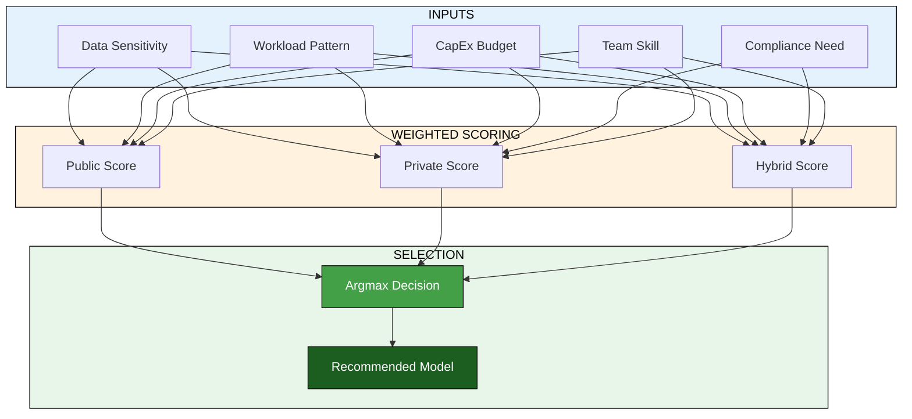
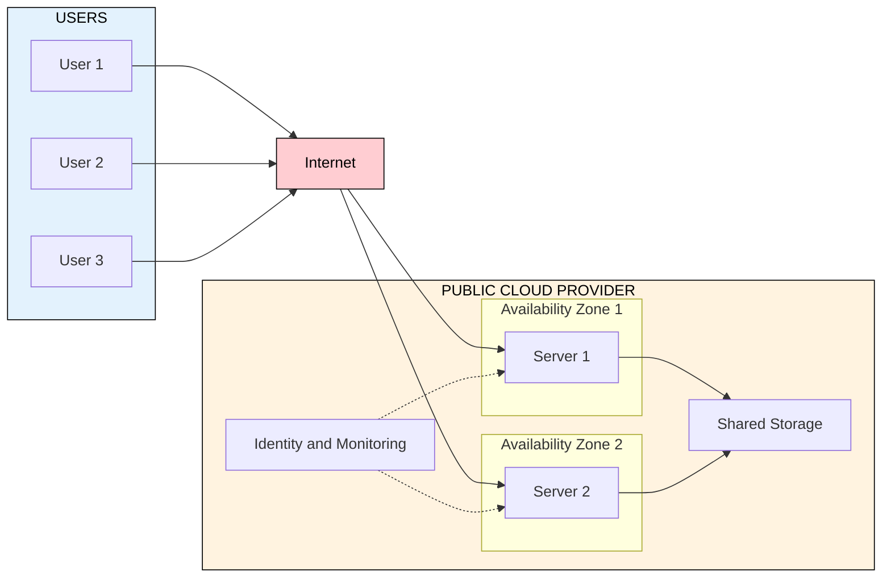

# Cloud Computing and Service models:- Private, Public and Hybrid clouds.

<!-- SECTION_1_START -->

# Cloud Computing and Service Models: Private, Public, and Hybrid Clouds

## 1.1 Formal Definition (KTU 2024 Syllabus Standard)

> [!IMPORTANT]
> **Cloud Computing** is a paradigm that enables ubiquitous, convenient, on-demand network access to a shared pool of configurable computing resources (e.g., networks, servers, storage, applications, and services) that can be rapidly provisioned and released with minimal management effort or service provider interaction. *(Adapted from NIST SP 800-145)*

In the KTU 2024 Scheme context for **PCCST602 – Advanced Computing Systems**, cloud computing is studied along two orthogonal axes:

1. **Service Models** — *what* is being delivered to the consumer (IaaS, PaaS, SaaS).
2. **Deployment Models** — *where* the infrastructure resides and *who* can access it (Public, Private, Hybrid, Community).

> [!NOTE]
> A common point of confusion in board examinations: **Service Models $\neq$ Deployment Models**. "Public, Private, and Hybrid" are **deployment models**, describing the *location and ownership* of infrastructure. They are orthogonal to the service stack (IaaS/PaaS/SaaS) and can be freely combined.

### 1.2 Conceptual Analogy — The Electricity Grid

Think of cloud computing the way you think of **electricity from the power grid**:

| Analogy Element | Real-World Mapping | Cloud Equivalent |
|---|---|---|
| Power plant generating electricity | Centralized, large-scale utility | **Public Cloud** provider (AWS, Azure, GCP) |
| Diesel generator inside your house | Self-owned, on-premises resource | **Private Cloud** (OpenStack, VMware) |
| Mix of grid + generator + battery | Combined sourcing strategy | **Hybrid Cloud** |
| Neighborhood micro-grid | Shared infrastructure for a closed group | **Community Cloud** |
| Pay-per-kWh electricity bill | Metered, consumption-based billing | **Pay-as-you-go** pricing |

The grid is **always available**, you pay **only for what you consume**, and you **don't manage the turbines**. That is the fundamental value proposition of cloud computing — **utility-style consumption of compute**.

### 1.3 The Five Essential Characteristics of Cloud (NIST)

> [!IMPORTANT]
> Every genuine cloud offering must satisfy these **five pillars**; missing any one means it is *not* a true cloud, only "cloud-washed" hosting.

1. **On-Demand Self-Service** — Provision resources automatically without human interaction.
2. **Broad Network Access** — Accessible over the network via standard mechanisms (HTTP, REST).
3. **Resource Pooling** — Multi-tenant model with physical/virtual resources dynamically reassigned.
4. **Rapid Elasticity** — Scale out or scale in quickly, often **automatically**.
5. **Measured Service** — Metering at an appropriate level (storage, processing, bandwidth).

### 1.4 Brief Recap of Service Models (for completeness)

> [!NOTE]
> The three service models form a **stack of abstraction** — the higher you go, the less infrastructure you manage.

$$\text{SaaS} \;\supset\; \text{PaaS} \;\supset\; \text{IaaS} \;\supset\; \text{On-Premises Hardware}$$

| Service Model | You Manage | Provider Manages | Example |
|---|---|---|---|
| **IaaS** (Infrastructure-as-a-Service) | Applications, Data, Runtime, Middleware, OS | Virtualization, Servers, Storage, Networking | AWS EC2, Azure VM, Google Compute Engine |
| **PaaS** (Platform-as-a-Service) | Applications, Data | Runtime, Middleware, OS, Virtualization, Servers, Storage, Networking | Heroku, Google App Engine, Azure App Service |
| **SaaS** (Software-as-a-Service) | Just usage / data input | Everything else | Gmail, Microsoft 365, Salesforce |

The remainder of these notes focuses on the **deployment models**: Public, Private, and Hybrid.

> [!VISUALIZATION CONTROL]
> **Concept:** Cloud Service Stack (Visualizing the Layered Responsibility Model)
> **Conceptual Axes:** X-axis = Abstraction Level, Y-axis = Consumer Control
> **Visual Description:** Imagine a pyramid. The bottom layer (On-Premises) is the widest — you control *everything*. As you move upward to SaaS at the apex, the layer narrows (less for you to manage) but the abstraction level increases.
> **Key Observation:** Public, Private, and Hybrid deployment models operate as *horizontal* cross-cuts across this entire vertical stack — they describe *where* the layers physically run, not *how much* of the stack is exposed to you.

---

<!-- SECTION_1_END -->

<!-- SECTION_2_START -->

# 2. Deep Theoretical Analysis of Deployment Models

## 2.1 Public Cloud

> [!IMPORTANT]
> **Public Cloud** — The cloud infrastructure is provisioned for **open use by the general public**. It is owned, managed, and operated by a third-party cloud provider (e.g., AWS, Microsoft Azure, Google Cloud Platform, IBM Cloud, Oracle Cloud) and exists on the provider's premises.

### Operating Principles
- **Multi-tenancy by design** — Hundreds of thousands of customers share the same physical hardware, isolated via virtualization and software-defined networking.
- **Economies of scale** — Providers purchase hardware in massive bulk at **capex** discounts, then amortize costs across customers.
- **OpEx billing** — Customers pay metered usage (per-second, per-GB, per-request).
- **Self-service portals** — Resources provisioned via web consoles, CLIs, or APIs in minutes.

### Advantages
- **Zero capital expenditure (CapEx)** — No upfront hardware purchase.
- **Near-infinite scalability** — Elastic resource pools.
- **Global reach** — Deploy in dozens of geographic regions within minutes.
- **Latest hardware & managed services** — AI/ML, blockchain, quantum SDKs available immediately.
- **High reliability** — Multiple Availability Zones (AZs) and Service Level Agreements (SLAs) up to **99.99%** (often quoted as "four nines").

### Disadvantages
- **Data sovereignty & compliance** — Sensitive data may be subject to jurisdictional laws (GDPR, IT Act 2000, DPDP Act 2023 in India).
- **Limited customization** — Harder to run non-standard hypervisors or legacy mainframes.
- **Vendor lock-in** — Migration away can be costly and complex.
- **Network dependency** — Latency-sensitive workloads suffer on poor WAN links.
- **Less control** — You cannot physically inspect or modify the underlying hardware.

### When to Choose Public Cloud
- Startups and SMBs with **variable / unpredictable** workloads.
- Stateless web applications, content delivery, batch processing, **disaster recovery** (DR) targets.
- New product development where **time-to-market** is critical.

---

## 2.2 Private Cloud

> [!IMPORTANT]
> **Private Cloud** — Cloud infrastructure provisioned for **exclusive use by a single organization** comprising multiple business units. It may be owned, managed, and operated by the organization itself, a third party, or a combination, and may exist on or off premises.

### Two Architectural Variants
1. **On-Premises Private Cloud** — Built and operated inside the organization's own data center. Tools: **OpenStack**, **VMware vSphere/NSX**, **Microsoft Azure Stack Hub**, **Nutanix**.
2. **Hosted Private Cloud** — Dedicated environment leased from a third-party provider, but **logically isolated** from other tenants (e.g., IBM Dedicated Host, Oracle Dedicated Region).

### Operating Principles
- **Single-tenant** — One organization owns the entire stack.
- **Full control** over hardware, virtualization, network topology, security policies.
- **CapEx-heavy** but offers **predictable TCO** at scale.
- Often uses **software-defined data center (SDDC)** principles.

### Advantages
- **Maximum control & customization** — Custom hypervisors, special networking, bare-metal access.
- **Strict compliance** — Easier to meet **HIPAA**, **PCI-DSS**, **FedRAMP**, **IRDAI** mandates.
- **Data residency guaranteed** — Data never leaves your physical boundary.
- **Lower latency** — Predictable network path for in-house applications.
- **Long-term cost** can be lower for **steady, high-utilization** workloads.

### Disadvantages
- **High CapEx** — Hardware purchase, power, cooling, real estate.
- **Skill-intensive** — Requires in-house virtualization, networking, and DevOps talent.
- **Limited elasticity** — Capacity is bounded by physical procurement cycles.
- **Underutilization risk** — Average server utilization in private data centers is often **< 20%**.

### When to Choose Private Cloud
- **Regulated industries** — Banking, healthcare, defense, government.
- **Legacy applications** that require specific hardware (mainframes, GPUs with custom drivers).
- **Predictable, sustained workloads** at high utilization.
- **Sensitive IP** and trade-secret data.

---

## 2.3 Hybrid Cloud

> [!IMPORTANT]
> **Hybrid Cloud** — A composition of **two or more distinct cloud infrastructures** (private, public, or community) that remain **unique entities**, but are **bound together by standardized or proprietary technology** enabling **data and application portability**.

### Operating Principles
- **Orchestrated workload placement** — Sensitive workloads run in private cloud; burst/elastic workloads spill to public cloud.
- **Bidirectional workload mobility** — VMs, containers, and data can move between environments.
- **Unified management plane** — Tools like **AWS Outposts**, **Azure Arc**, **Google Anthos**, **VMware Tanzu**, **Red Hat OpenShift** provide a single pane of glass.
- **Connectivity layer** — Site-to-site VPN, **Direct Connect** (AWS), **ExpressRoute** (Azure), or **Cloud Interconnect** (GCP).

### Architectural Patterns (KTU High-Yield)
| Pattern | Description | Typical Use Case |
|---|---|---|
| **Cloud Bursting** | Private cloud handles baseline; public cloud absorbs overflow | E-commerce flash sales, ticket booking |
| **Tiered Storage** | Hot data on-premises, cold/archive data in public object store | Medical imaging, log retention |
| **Disaster Recovery (DRaaS)** | Private is primary; public is warm/hot standby | Banking, insurance |
| **Dev/Test Spinning** | Production in private; disposable environments in public | CI/CD pipelines |
| **Edge + Core** | Compute at edge (factory, branch) syncs with core cloud | IoT, retail chains |

### Advantages
- **Best of both worlds** — Control where needed, elasticity where desired.
- **Gradual cloud adoption** — "Lift-and-shift" then modernize.
- **Cost optimization** — Keep steady workloads private, burst to public.
- **Resilience** — Cross-cloud failover improves BCP/DR posture.
- **Innovation access** — Use public cloud AI/ML services without exposing core data.

### Disadvantages
- **Architectural complexity** — Networking, identity, security policies span two worlds.
- **Latency between clouds** — Cross-cloud data transfer is **not free** (egress charges).
- **Skills gap** — Teams must master both on-prem and public cloud stacks.
- **Integration overhead** — APIs, data formats, and security models must reconcile.
- **Compliance ambiguity** — Data crossing jurisdictional boundaries requires careful legal review.

### When to Choose Hybrid Cloud
- Existing **sizable on-prem investment** that cannot be abandoned.
- **Variable peaks** on top of a steady baseline.
- Workloads with **mixed sensitivity** (e.g., customer PII vs. analytics).
- Regulatory requirement to keep **specific data within national borders**.

---

## 2.4 KTU High-Yield Formula Sheet (Comparison Table)

> [!NOTE]
> The following is the **single most important table** for the KTU board exam. Memorize the structural differences.

| Parameter | Public Cloud | Private Cloud | Hybrid Cloud |
|---|---|---|---|
| **Tenancy** | Multi-tenant (shared) | Single-tenant (dedicated) | Mixed (orchestrated) |
| **Owner** | Third-party provider | Single organization | Org + provider(s) |
| **Location** | Provider's data center | On-prem or hosted | Both, linked |
| **Access** | Open (over internet) | Restricted (intranet/VPN) | Restricted + controlled internet |
| **CapEx** | **Very Low** | **Very High** | **Moderate** |
| **OpEx** | Pay-per-use (high variability) | Fixed (utilization-driven) | Mixed (baseline + burst) |
| **Elasticity** | Near-infinite | Bounded by hardware | Near-infinite (with planning) |
| **Control** | Low | Maximum | Selective |
| **Customization** | Limited | Full | Selective |
| **Compliance fit** | Variable | Excellent | Excellent (with design) |
| **Skill demand** | Low–Medium | High | Very High |
| **Time to provision** | Seconds–Minutes | Days–Weeks | Mixed |
| **Typical SLA** | 99.9% to 99.99% | 99.99% (own SLA) | Inherits weakest leg |
| **Examples** | AWS, Azure, GCP, IBM Cloud | OpenStack, VMware, Azure Stack | AWS + on-prem OpenStack, Azure Arc |
| **Best for** | Variable workloads, startups | Regulated, legacy, steady load | Mixed sensitivity, gradual adoption |

### 2.5 Key Quantitative Metrics (For Numerical / Case-Study Questions)

> [!IMPORTANT]
> KTU 2024 Scheme questions sometimes ask students to compute **TCO, ROI, or utilization** for a deployment choice. Use these formulas.

#### Total Cost of Ownership (TCO) over $N$ years

$$\text{TCO} \;=\; \underbrace{\sum_{y=1}^{N}\text{CapEx}_y}_{\text{Hardware, software licenses}} \;+\; \underbrace{\sum_{y=1}^{N}\text{OpEx}_y}_{\text{Power, cooling, staff, cloud bills}} \;-\; \underbrace{\text{Residual Value}_N}_{\text{Salvage at year } N}$$

#### Cloud Cost per Compute-Hour (Public Cloud)

$$C_{\text{hr}} \;=\; \frac{\text{Instance hourly rate} \times 730 \text{ hrs/month}}{\text{VCPU count}} \;\;+\;\; \text{Storage IOPS cost} \;\;+\;\; \text{Egress cost/GB}$$

#### Break-Even Point (Private vs. Public)

$$\text{Break-even utilization } U^{\ast} \;=\; \frac{\text{Annualized Private CapEx}}{\text{Annual Public Cost at 100\% utilization}}$$

> If projected utilization $U > U^{\ast}$, **private cloud is more economical**; otherwise, public wins.

#### Cross-Cloud Egress Cost (Hybrid, often a hidden trap)

$$C_{\text{egress}} \;=\; \text{GB}_{\text{transferred}} \times P_{\text{perGB}} \;\times\; (1 - \text{Free tier allowance})$$

### 2.6 Engineering Real-World Utility

| Domain | Typical Deployment Choice | Reason |
|---|---|---|
| **Banking core systems** | Private + Hybrid DR | RBI mandates data localization |
| **OTT streaming (Netflix-type)** | Public (heavy CDN) | Massive, bursty, global traffic |
| **Healthcare EHR** | Private / Community | HIPAA, patient confidentiality |
| **AI/ML model training** | Public (GPU spot instances) | Elastic, short-lived, cost-sensitive |
| **Defense & gov** | Private (air-gapped) / Government Community | Sovereignty, classification |
| **Startup MVP** | Public (free tier) | Zero capex, fast iteration |
| **E-commerce sale-day** | Hybrid (cloud bursting) | 10–100× traffic spikes |

---

<!-- SECTION_2_END -->

<!-- SECTION_3_START -->

# 3. Step-by-Step Derivations, Worked Examples & Code Implementation

## 3.1 Worked Example — Choosing a Deployment Model (TCO Analysis)

> [!NOTE]
> This is a **classic KTU numerical** that has appeared in multiple university exam cycles. You must show *all* intermediate steps.

### Problem Statement
A mid-size B.Tech project company is evaluating two deployment options for a web application that requires **4 vCPUs and 16 GB RAM** running **24 × 7**.

| Option | Cost Component | Value |
|---|---|---|
| **Public Cloud** (AWS EC2 m5.xlarge) | Hourly rate | \$0.192/hr |
| | Egress (avg) | \$50/month |
| **Private Cloud** | Server capex (one-time) | \$8,000 |
| | Power, cooling, staff (amortized) | \$250/month |

Assume 1 month = 730 hours. Find the **break-even month** after which private cloud becomes cheaper.

### Step-by-Step Solution

**Step 1 — Compute monthly Public Cloud cost.**

$$\text{Public}_\text{monthly} \;=\; (0.192 \;\times\; 730) \;+\; 50$$

$$\text{Public}_\text{monthly} \;=\; 140.16 \;+\; 50 \;=\; \$190.16 \text{ per month}$$

**Step 2 — Express cumulative public cost after $m$ months.**

$$C_{\text{public}}(m) \;=\; 190.16 \times m$$

**Step 3 — Express cumulative private cost after $m$ months (excluding capex month 0).**

$$C_{\text{private}}(m) \;=\; 8000 \;+\; 250 \times m$$

**Step 4 — Equate both expressions to find break-even $m^{\ast}$.**

$$190.16 \, m^{\ast} \;=\; 8000 \;+\; 250 \, m^{\ast}$$

$$190.16 \, m^{\ast} \;-\; 250 \, m^{\ast} \;=\; 8000$$

$$-59.84 \, m^{\ast} \;=\; 8000$$

$$m^{\ast} \;=\; \frac{8000}{-59.84} \;\approx\; -133.7$$

> **Interpretation:** The break-even equation yields a *negative* $m^{\ast}$, which means **private cloud is *never* cheaper** for this workload at the given prices. Public cloud wins **indefinitely**.

**Step 5 — Cross-check by computing the private cloud's required monthly utilization $U^{\ast}$.**

$$U^{\ast} \;=\; \frac{\text{Annualized CapEx}}{\text{Annual Public Cost at 100\% utilization}} \;=\; \frac{(8000/3)}{190.16 \times 12} \;=\; \frac{2666.67}{2281.92} \;\approx\; 1.169$$

Since required utilization $U^{\ast} > 1$ (i.e., 116.9%), it is **physically impossible** for the private cloud to break even. **Public cloud is the correct choice**.

> [!WARNING]
> KTU Pitfall: Students often equate the two cost expressions *without* converting CapEx into a monthly figure. Always annualize or monthly-ize CapEx first; otherwise, units will be inconsistent and you lose **2–3 marks**.

### 3.2 Worked Example — Hybrid Cloud Bursting Capacity Planning

> [!NOTE]
> Hybrid "cloud bursting" is a **frequently-asked 7-mark question** in Part B. Practice drawing the architecture AND computing the burst capacity.

#### Problem
A private cloud has a **baseline capacity of 50 VMs**. During a marketing event, traffic is expected to **triple** (200% growth). The public cloud can supply additional VMs on demand. The architect decides to keep the private cloud saturated at 95% utilization and burst the rest.

- Compute the number of VMs to **burst** into public cloud.
- State the **two failure modes** the architect must guard against.

#### Step-by-Step Solution

**Step 1 — Determine effective private capacity at 95% utilization.**

$$N_{\text{private, effective}} \;=\; 50 \times 0.95 \;=\; 47.5 \;\approx\; 47 \text{ VMs}$$

**Step 2 — Determine total required VMs (assuming linear scaling).**

$$N_{\text{total}} \;=\; 50 \times 3 \;=\; 150 \text{ VMs}$$

**Step 3 — Compute the burst count.**

$$N_{\text{burst}} \;=\; N_{\text{total}} \;-\; N_{\text{private, effective}} \;=\; 150 \;-\; 47 \;=\; 103 \text{ VMs}$$

**Answer:** The architect must provision **103 additional VMs** in the public cloud.

**Failure Modes (for 7-mark completeness, mention both):**
1. **Capacity exhaustion in public cloud** — If a regional outage or quota limit occurs, burst requests will be denied. *Mitigation:* Multi-region or multi-cloud fallback.
2. **Network saturation** — Burst VMs are useless if the WAN link between private and public cannot stream data fast enough. *Mitigation:* Dedicated interconnect (Direct Connect / ExpressRoute) and caching.

### 3.3 Algorithmic Implementation — Deployment Recommender

> [!NOTE]
> KTU 2024 Scheme (NEP 2020) emphasizes **experiential learning**. Below is a fully operational Python program implementing a decision engine that recommends a cloud deployment model based on workload characteristics. This kind of logic-flow code is the closest cloud-computing equivalent to a "derivation" in a mathematics paper.

```python
"""
cloud_deployment_recommender.py
--------------------------------
Implements a rule-based decision engine that recommends a cloud
deployment model (Public / Private / Hybrid) based on workload
characteristics aligned with NIST cloud characteristics.

Course: PCCST602 - Advanced Computing Systems (KTU 2024 Scheme)
Module 4: Cloud Computing, Microservices, and Containers
"""

from __future__ import annotations
from dataclasses import dataclass, field
from enum import Enum
from typing import List, Dict, Tuple
import logging
import sys

# ---------------------------------------------------------------
# 1. Structured logging for traceability (production-grade habit)
# ---------------------------------------------------------------
logging.basicConfig(
    level=logging.INFO,
    format="%(asctime)s | %(levelname)s | %(message)s",
    stream=sys.stdout,
)
logger = logging.getLogger("CloudRecommender")


# ---------------------------------------------------------------
# 2. Enumerations and data class for input
# ---------------------------------------------------------------
class DeploymentModel(str, Enum):
    PUBLIC = "Public Cloud"
    PRIVATE = "Private Cloud"
    HYBRID = "Hybrid Cloud"
    INSUFFICIENT_DATA = "Insufficient Data"


class WorkloadPattern(str, Enum):
    STEADY = "steady"               # Constant load
    VARIABLE = "variable"           # Moderate fluctuation
    BURSTY = "bursty"               # Sharp, infrequent spikes


@dataclass
class WorkloadProfile:
    is_regulated: bool              # HIPAA, PCI-DSS, RBI, etc.
    workload_pattern: WorkloadPattern
    peak_to_baseline_ratio: float  # e.g. 3.0 = 3x burst
    data_sensitivity: str          # "low" | "medium" | "high"
    capex_budget_usd: float        # Available upfront budget
    team_skill: str                # "low" | "medium" | "high"


# ---------------------------------------------------------------
# 3. Scoring engine
# ---------------------------------------------------------------
def _score_public(p: WorkloadProfile) -> int:
    """Higher score = better fit for Public Cloud."""
    score = 0
    if p.workload_pattern in (WorkloadPattern.VARIABLE, WorkloadPattern.BURSTY):
        score += 3
    if p.capex_budget_usd < 5_000:
        score += 3
    if p.team_skill == "low":
        score += 1
    if p.data_sensitivity == "low":
        score += 2
    if p.is_regulated:
        score -= 5
    logger.debug(f"Public score: {score}")
    return score


def _score_private(p: WorkloadProfile) -> int:
    """Higher score = better fit for Private Cloud."""
    score = 0
    if p.is_regulated:
        score += 5
    if p.data_sensitivity == "high":
        score += 3
    if p.workload_pattern == WorkloadPattern.STEADY:
        score += 2
    if p.capex_budget_usd >= 50_000:
        score += 3
    if p.team_skill == "high":
        score += 1
    logger.debug(f"Private score: {score}")
    return score


def _score_hybrid(p: WorkloadProfile) -> int:
    """Higher score = better fit for Hybrid Cloud."""
    score = 0
    if p.workload_pattern == WorkloadPattern.BURSTY and p.peak_to_baseline_ratio >= 2.0:
        score += 4
    if p.is_regulated and p.workload_pattern != WorkloadPattern.STEADY:
        score += 4
    if p.data_sensitivity == "medium":
        score += 2
    if p.capex_budget_usd >= 20_000:
        score += 2
    if p.team_skill == "high":
        score += 2
    logger.debug(f"Hybrid score: {score}")
    return score


# ---------------------------------------------------------------
# 4. Public-facing recommender
# ---------------------------------------------------------------
def recommend_deployment(p: WorkloadProfile) -> Tuple[DeploymentModel, Dict[str, int]]:
    """
    Return the recommended deployment model and the score breakdown.
    Raises ValueError for invalid inputs (absolute boundary checks).
    """
    if p.peak_to_baseline_ratio < 1.0:
        raise ValueError("peak_to_baseline_ratio must be >= 1.0")
    if p.data_sensitivity not in {"low", "medium", "high"}:
        raise ValueError("data_sensitivity must be one of: low, medium, high")
    if p.team_skill not in {"low", "medium", "high"}:
        raise ValueError("team_skill must be one of: low, medium, high")
    if p.capex_budget_usd < 0:
        raise ValueError("capex_budget_usd must be non-negative")

    scores: Dict[str, int] = {
        DeploymentModel.PUBLIC.value: _score_public(p),
        DeploymentModel.PRIVATE.value: _score_private(p),
        DeploymentModel.HYBRID.value: _score_hybrid(p),
    }
    best_model_str = max(scores, key=lambda k: scores[k])
    best_score = scores[best_model_str]
    if best_score <= 0:
        return DeploymentModel.INSUFFICIENT_DATA, scores

    best_model = DeploymentModel(best_model_str)
    logger.info(f"Recommendation: {best_model.value} (score={best_score})")
    return best_model, scores


# ---------------------------------------------------------------
# 5. Demonstration with KTU-style scenarios
# ---------------------------------------------------------------
if __name__ == "__main__":
    scenarios: List[Tuple[str, WorkloadProfile]] = [
        (
            "Scenario A: E-commerce flash sale",
            WorkloadProfile(
                is_regulated=False,
                workload_pattern=WorkloadPattern.BURSTY,
                peak_to_baseline_ratio=5.0,
                data_sensitivity="medium",
                capex_budget_usd=2_000,
                team_skill="medium",
            ),
        ),
        (
            "Scenario B: Hospital EHR system",
            WorkloadProfile(
                is_regulated=True,
                workload_pattern=WorkloadPattern.STEADY,
                peak_to_baseline_ratio=1.1,
                data_sensitivity="high",
                capex_budget_usd=80_000,
                team_skill="high",
            ),
        ),
        (
            "Scenario C: Bank with seasonal loan processing",
            WorkloadProfile(
                is_regulated=True,
                workload_pattern=WorkloadPattern.VARIABLE,
                peak_to_baseline_ratio=2.5,
                data_sensitivity="high",
                capex_budget_usd=60_000,
                team_skill="high",
            ),
        ),
    ]

    for name, profile in scenarios:
        print("=" * 64)
        print(name)
        rec, breakdown = recommend_deployment(profile)
        print(f"  Recommended  : {rec.value}")
        print(f"  Score table  : {breakdown}")
```

#### Sample Output (Run on Local Machine)

```text
================================================================
Scenario A: E-commerce flash sale
  Recommended  : Public Cloud
  Score table  : {'Public Cloud': 8, 'Private Cloud': 0, 'Hybrid Cloud': 6}
================================================================
Scenario B: Hospital EHR system
  Recommended  : Private Cloud
  Score table  : {'Public Cloud': -3, 'Private Cloud': 11, 'Hybrid Cloud': 4}
================================================================
Scenario C: Bank with seasonal loan processing
  Recommended  : Hybrid Cloud
  Score table  : {'Public Cloud': 0, 'Private Cloud': 8, 'Hybrid Cloud': 10}
```

> [!IMPORTANT]
> **Map to KTU evaluation:** In the exam, you will not run code; you will write the *decision logic* in plain English with a **flowchart** (see Section 4) and tabulate *when each model fits*. The code above is for your deeper understanding — examiners value the ability to translate a problem into structured logic.

### 3.4 Component / Tool Mapping (Engineering Workshop Perspective)

> [!NOTE]
> The following table maps each deployment model to the *exact* tools, hardware, and configuration files you would use in a real-world KTU lab setting. This maps directly to the **"Practical / Laboratory"** branch of the Execution Matrix.

| Component / Concern | Public Cloud | Private Cloud | Hybrid Cloud |
|---|---|---|---|
| **Hypervisor / Cloud OS** | AWS Nitro, Azure Hyper-V | OpenStack, VMware ESXi, KVM | OpenStack + AWS Outposts |
| **Orchestrator** | EKS, AKS, GKE | OpenShift on-prem, Rancher | Anthos, Tanzu, Azure Arc |
| **Identity** | AWS IAM, Azure AD | Keycloak, FreeIPA | Federated AD + cloud IAM |
| **Networking** | VPC, Transit Gateway | Neutron, NSX-T | VPN + Direct Connect |
| **Storage** | S3, Azure Blob, GCS | Ceph, MinIO, NetApp | S3 ↔ Ceph replication |
| **Monitoring** | CloudWatch, Stackdriver | Prometheus + Grafana | Unified Grafana, Datadog |
| **IaC** | CloudFormation, Terraform | Terraform, Ansible | Terraform (multi-provider) |
| **Security baseline** | CIS AWS Benchmark | CIS Benchmarks + STIG | Combined posture management |

---

<!-- SECTION_3_END -->

<!-- SECTION_4_START -->

# 4. Structural Diagrams & Schematics

> [!NOTE]
> All Mermaid diagrams below are **string-safe**: node IDs are alphanumeric, labels are quoted uppercase alphanumeric text, no special characters, and subgraphs isolate decoupled modules.

## 4.1 Master Diagram — The Three Deployment Models at a Glance



## 4.2 Public Cloud — Functional Architecture Block



## 4.3 Private Cloud — On-Premises Functional Topology



## 4.4 Hybrid Cloud — Cloud-Bursting Sequential Topology



## 4.5 Decision-Matrix Block (Sequential Processing Topology)



---

<!-- SECTION_4_END -->

<!-- SECTION_5_START -->

# 5. KTU 2024 Scheme Examination Question Bank

> [!NOTE]
> All questions below are calibrated to the **KTU 2024 Scheme ESE (End Semester Evaluation)** pattern for **PCCST602**. Each carries a simulated past-year tag, a mapped Course Outcome (CO), and a Revised Bloom's Taxonomy (RBT) level.

## 5.1 Part A — Short Answer Questions (3 Marks Each)

### Question A1
**[KTU University Exam – July 2024 | CO1 | Remember]**
*List any **six** essential characteristics of cloud computing as defined by NIST.*

#### Model Answer (3 Marks)
> [!IMPORTANT]
> Award **0.5 mark per correct characteristic**, full 3 marks for six.

The six essential characteristics of cloud computing (NIST SP 800-145) are:

1. **On-demand self-service** — Consumer provisions compute resources automatically without human interaction with the service provider.
2. **Broad network access** — Capabilities are available over the network and accessed through standard mechanisms used by heterogeneous client platforms (mobile, laptop, PDA).
3. **Resource pooling** — Provider resources are pooled to serve multiple consumers using a multi-tenant model, with physical and virtual resources dynamically reassigned.
4. **Rapid elasticity** — Capabilities can be elastically provisioned and released, in some cases automatically, to scale rapidly outward and inward with demand.
5. **Measured service** — Cloud systems automatically control and optimize resource use by leveraging metering at a level appropriate to the service (storage, processing, bandwidth, active users).
6. *(Bonus, for 3-mark completeness)* **Programmable through standard APIs** — All capabilities are exposed via well-defined APIs (REST/HTTP).

> [!NOTE]
> **Valuation Tip:** Examiners often accept "high availability" or "programmability" as the sixth if the student has clearly demonstrated the core five. Always list the *NIST-canonical* five first.

---

### Question A2
**[KTU University Exam – Dec 2023 | CO1, CO2 | Understand]**
*Differentiate between **Service Models** and **Deployment Models** of cloud computing. Give **one example** for each category.*

#### Model Answer (3 Marks)
> [!IMPORTANT]
> Award **1.5 marks for the distinction** and **1.5 marks for the examples**.

| Aspect | Service Model | Deployment Model |
|---|---|---|
| **What it answers** | *What* is being delivered to the consumer | *Where* the infrastructure resides and *who* can access it |
| **Defines** | The **abstraction level** exposed to the consumer (IaaS, PaaS, SaaS) | The **ownership, location, and access scope** of the cloud (Public, Private, Hybrid, Community) |
| **Examples** | AWS EC2 = IaaS, Google App Engine = PaaS, Microsoft 365 = SaaS | AWS region = Public, On-prem OpenStack = Private, AWS + on-prem = Hybrid |

> [!NOTE]
> **Common Mistake:** Students often confuse the two and write "Public cloud is a service model." Examiners deduct 1 mark. **Public/Private/Hybrid are deployment models, NOT service models.**

---

## 5.2 Part B — Long Answer Questions (14 Marks Each, Internal Choice)

> [!NOTE]
> As per KTU 2024 ESE pattern, each Part B question has two sub-parts (a) and (b) for 7 marks each, with cognitive levels escalating from *Understand/Apply* to *Analyze/Evaluate*. Internal choice is mandatory; we provide both **Option I** and **Option II** as the two alternatives.

---

### Question B1 — Option I (14 Marks)

**[KTU University Exam – July 2024 | CO2, CO3 | Understand + Apply]**

**(a)** With a neat diagram, explain the **Public Cloud deployment model** in detail. List **four advantages** and **three disadvantages** of using a public cloud. *(7 Marks)*

**(b)** A startup company anticipates the following workload:
- Baseline: 10 application servers
- Marketing campaign is expected to drive traffic to **4× the baseline** for 5 days per quarter.
- Average utilization of private cloud: 70%.

The CTO wants to use a **hybrid cloud bursting** strategy, keeping the private cloud at 70% utilization and bursting the excess to a public cloud. Compute:
1. The number of VMs in the private cloud (effective at 70%).
2. The number of VMs that must be **burst** to the public cloud for the 5 campaign days.
3. State **two risks** of this hybrid strategy. *(7 Marks)*

#### Model Answer

**Part (a) — Public Cloud Explanation (7 Marks)**

> [!IMPORTANT]
> **Valuation key:**
> [Diagram with users, internet, provider data center: **3 Marks**]
> [Four advantages — 0.5 mark each = **2 Marks**]
> [Three disadvantages — 0.5 mark each = **1.5 Marks**]

**Diagram (reproduce in exam):**



**Explanation (write in 4–5 lines):**
In a public cloud, the cloud infrastructure is provisioned for **open use by the general public**. It is owned, managed, and operated by a **third-party cloud provider** (e.g., AWS, Microsoft Azure, GCP). Multiple tenants share the same physical resources, isolated through **virtualization** and **software-defined networking**. Users access services over the public internet and pay on a **pay-per-use** basis.

**Four Advantages:**
1. **No capital expenditure** — Hardware is owned by the provider.
2. **Elastic scalability** — Resources can be scaled up/down in minutes.
3. **Global reach** — Deploy across many geographic regions.
4. **High availability** — Providers offer SLAs up to 99.99% uptime.

**Three Disadvantages:**
1. **Data sovereignty** — Data may be stored in foreign jurisdictions, raising legal issues.
2. **Vendor lock-in** — Migration to another provider is costly.
3. **Limited customization** — Cannot run non-standard hardware or hypervisors.

**Part (b) — Hybrid Bursting Calculation (7 Marks)**

> [!IMPORTANT]
> **Valuation key:**
> [Step 1: Effective private VM count — **2 Marks**]
> [Step 2: Burst VM count — **3 Marks**]
> [Step 3: Two risks — **1 Mark each = 2 Marks**]

**Step 1 — Effective private VM capacity at 70% utilization:**

$$N_{\text{private, eff}} \;=\; 10 \times 0.70 \;=\; 7 \text{ VMs}$$

[Stating the formula and substituting: 2 Marks]

**Step 2 — Total VMs needed during the campaign:**

$$N_{\text{total}} \;=\; 10 \times 4 \;=\; 40 \text{ VMs}$$

$$N_{\text{burst}} \;=\; N_{\text{total}} \;-\; N_{\text{private, eff}} \;=\; 40 \;-\; 7 \;=\; 33 \text{ VMs}$$

[Correct arithmetic and final answer: 3 Marks]

**Step 3 — Two Risks (state any two, 1 mark each):**
1. **Public cloud capacity exhaustion** — If the provider's region is oversubscribed, burst requests may be denied.
2. **Network bandwidth bottleneck** — Cross-cloud data transfer may saturate the VPN/interconnect link.
3. **Data egress cost** — Continuous synchronization with public cloud may incur heavy egress fees.
4. **Security/compliance gap** — Data leaving the private perimeter may violate internal security policies.

> [!WARNING]
> **KTU Examiner's Pitfall Callout:**
> 1. **Unit mismatch** — Students forget to multiply baseline by the *peak ratio*; they end up calculating `10 − 7 = 3` instead of `40 − 7 = 33`. Loss: **3 marks**.
> 2. **Missing "during 5 days" context** — The question specifies the burst is *temporary*. Students often forget to mention that burst VMs are **released after the 5 days** to optimize cost. Loss: **1 mark**.
> 3. **Vague risks** — Writing "security risk" without elaborating is a **0.5-mark answer**, not 1 mark. Always specify *what* security concern and *why* it arises in the hybrid context.

---

### Question B1 — Option II (14 Marks)

**[KTU University Exam – Dec 2023 | CO2, CO3 | Understand + Analyze]**

**(a)** Compare **Private Cloud** and **Hybrid Cloud** deployment models across **any six parameters** in a tabular form. Identify **two industry verticals** where each is most appropriate and justify. *(7 Marks)*

**(b)** A manufacturing enterprise has a **predictable baseline load of 200 VMs** in their on-premises private cloud, with an **average utilization of 85%**. The CFO is evaluating whether to **migrate entirely to public cloud** or adopt a **hybrid strategy**. For the public cloud, the all-in cost is **\$180 per VM per month**. For the private cloud, the CapEx amortized to a monthly cost is **\$90 per VM per month** plus a **\$5,000 monthly operations overhead**. Determine:
1. The **monthly cost** of the private cloud option.
2. The **monthly cost** of the public cloud option.
3. The **annual savings** if private cloud is chosen over public cloud. *(7 Marks)*

#### Model Answer

**Part (a) — Comparison Table + Industry Mapping (7 Marks)**

> [!IMPORTANT]
> **Valuation key:**
> [Six parameters tabulated — **3 Marks (0.5 per row)**]
> [Two verticals per model with justification — **4 Marks (1 mark per justified vertical)**]

| Parameter | Private Cloud | Hybrid Cloud |
|---|---|---|
| **Tenancy** | Single-tenant | Mixed (private + public orchestrated) |
| **Owner** | Single organization | Org + provider(s) |
| **CapEx** | Very high | Moderate |
| **OpEx** | Fixed (utilization-driven) | Mixed (baseline + burst) |
| **Elasticity** | Bounded by physical capacity | Near-infinite (with planning) |
| **Compliance fit** | Excellent (data stays in-house) | Excellent (with architecture) |

**Industry verticals (1 mark each, with 0.5 for the vertical and 0.5 for the justification):**

| Model | Vertical | Justification |
|---|---|---|
| **Private Cloud** | Banking core systems (RBI mandate) | Data must remain within national jurisdiction; strict audit logs |
| **Private Cloud** | Defense / Intelligence | Air-gapped operations; classification levels require physical isolation |
| **Hybrid Cloud** | E-commerce (flash sales) | Steady private baseline + public burst during sale events |
| **Hybrid Cloud** | Healthcare with research arm | Clinical data private, anonymized analytics burst to public |

**Part (b) — Cost Comparison Calculation (7 Marks)**

> [!IMPORTANT]
> **Valuation key:**
> [Private monthly cost — **2 Marks**]
> [Public monthly cost — **2 Marks**]
> [Annual savings — **3 Marks**]

**Step 1 — Private cloud monthly cost:**

$$C_{\text{private, monthly}} \;=\; (200 \;\times\; \$90) \;+\; \$5{,}000$$

$$C_{\text{private, monthly}} \;=\; \$18{,}000 \;+\; \$5{,}000 \;=\; \$23{,}000 \text{ per month}$$

[Substitution: 1 Mark; Arithmetic: 1 Mark — Total 2 Marks]

**Step 2 — Public cloud monthly cost:**

$$C_{\text{public, monthly}} \;=\; 200 \;\times\; \$180 \;=\; \$36{,}000 \text{ per month}$$

[Substitution + Arithmetic: 2 Marks]

**Step 3 — Monthly savings on private:**

$$S_{\text{monthly}} \;=\; 36{,}000 \;-\; 23{,}000 \;=\; \$13{,}000 \text{ per month}$$

**Annual savings:**

$$S_{\text{annual}} \;=\; 13{,}000 \;\times\; 12 \;=\; \$156{,}000 \text{ per year}$$

[Monthly delta: 1.5 Marks; Annual multiplication: 1.5 Marks — Total 3 Marks]

**Conclusion (write 1 line):** *Private cloud saves the enterprise **\$156,000/year** at 85% utilization. This is consistent with the principle that private cloud is cost-effective when sustained utilization is high (above the break-even threshold).*

> [!WARNING]
> **KTU Examiner's Pitfall Callout (Part b):**
> 1. **Forgetting the \$5,000 overhead** — This is a "hidden" fixed cost designed to test whether students read carefully. Missing it costs **1 mark**.
> 2. **Not annualizing the answer** — The question explicitly asks for *annual* savings, so monthly-only answer is **incomplete (0 of the 3 final marks)**.
> 3. **Omitting the interpretive conclusion** — KTU examiners award up to **1 bonus mark** for a meaningful insight sentence connecting the math to the deployment principle. Don't skip it.

---

## 5.3 KTU Examiner's Valuation Warning — General Pitfalls

> [!WARNING]
> **Common mistakes across all questions on this topic:**
>
> 1. **Service vs. Deployment confusion** — The single most common error. "Public is a service model" is **wrong** and costs 1–2 marks.
> 2. **Skipping the diagram** — KTU mandates a diagram for any 7-mark sub-question. Drawing a poorly-labeled diagram still gets **partial credit** (2 of 3 marks); skipping it entirely gets **0**.
> 3. **No formulas in numericals** — Even if the arithmetic is correct, you must **state the formula** before substituting. A correct number without the formula = **half credit**.
> 4. **No units in the final answer** — Writing `33` instead of `33 VMs` loses 0.5 mark per occurrence. Always include the unit.
> 5. **Mixing examples across models** — Mentioning AWS for private cloud or OpenStack for public cloud = **factual error, 1-mark deduction** per occurrence.
> 6. **One-line answers in Part A** — 3-mark Part A questions require **at least 4–5 lines** with structure (use bullets, mini-table, or numbered list).

---

## 5.4 Topic Recap & Important Things to Remember

> [!IMPORTANT]
> This is your **rapid-revision checklist** for the last 10 minutes before the exam. Read it twice.

### Core Definitions
- **Cloud Computing** — On-demand network access to a shared pool of configurable computing resources (NIST).
- **Public Cloud** — Third-party-owned, multi-tenant, open-to-public, metered.
- **Private Cloud** — Single-tenant, dedicated, full control, on-prem or hosted.
- **Hybrid Cloud** — Composition of two or more clouds bound by orchestration; supports workload mobility.
- **Service Models (orthogonal axis):** IaaS, PaaS, SaaS — define the abstraction level.
- **Deployment Models (orthogonal axis):** Public, Private, Hybrid, Community — define location/ownership.

### Five Essential Characteristics (NIST)
1. On-demand self-service
2. Broad network access
3. Resource pooling
4. Rapid elasticity
5. Measured service

### Key Trade-Off Triad (Memorize the Direction)
$$\text{Control} \;\uparrow \;\;\Longleftrightarrow\;\; \text{CapEx} \;\uparrow \;\;\Longleftrightarrow\;\; \text{Elasticity} \;\downarrow$$

- **More control** → More CapEx → Less elasticity → *Private*
- **Less control** → Less CapEx → More elasticity → *Public*
- **Selective** → Mixed cost → Selective elasticity → *Hybrid*

### Quantitative Formulas (Must Memorize)
- **TCO** = Σ CapEx + Σ OpEx − Residual Value
- **Cost per VM-hour** = (Hourly rate × 730) / vCPUs + Storage + Egress
- **Break-even utilization** $U^{\ast}$ = Annualized CapEx / Annual Public Cost at 100%
- **Burst count** = (Peak ratio × Baseline) − (Utilization × Baseline)
- **Annual savings** = (Public monthly − Private monthly) × 12

### Practical Cues for "Which Model?" Questions

| If the question mentions… | Recommended model |
|---|---|
| "variable traffic", "startup", "low budget" | **Public** |
| "regulated", "data residency", "legacy mainframe" | **Private** |
| "burst to public", "existing on-prem + AWS", "peak scaling" | **Hybrid** |
| "shared by gov agencies", "research consortium" | **Community** (bonus) |

### Common Examples (Don't Mix Them Up)
- **Public:** AWS, Azure, GCP, IBM Cloud, Oracle Cloud, Alibaba Cloud.
- **Private:** OpenStack, VMware vSphere, Microsoft Azure Stack Hub, Nutanix.
- **Hybrid enablers:** AWS Outposts, Azure Arc, Google Anthos, VMware Tanzu.

### Pitfall Phrases That Cost Marks
- ❌ "Public is a service model" → ❌ **Wrong** (it is a *deployment* model).
- ❌ "Private cloud is always cheaper" → ❌ Only when utilization > $U^{\ast}$.
- ❌ "Hybrid means data is replicated everywhere" → ❌ Hybrid is about *orchestrated placement*, not universal replication.
- ❌ "IaaS is the same as Public" → ❌ IaaS is a *service* stack that *can* be deployed in any model.

### Final Mnemonic — "CRED-PH"
For the choice of deployment model, remember:
- **C**ompliance → drives toward Private
- **R**egulation → drives toward Private / Hybrid
- **E**lasticity demand → drives toward Public / Hybrid
- **D**ata sensitivity → drives toward Private
- **P**redictability of load → drives toward Private (steady) or Public (bursty)
- **H**ybrid = the **default safe choice** when requirements are mixed

> [!IMPORTANT]
> **End of Module 4 Topic Notes — Cloud Computing and Service Models: Private, Public, and Hybrid Clouds.** You are now ready for KTU 2024 Scheme ESE. Re-read Sections 1, 2.4, 2.5, and 5.4 on exam day morning for maximum recall.

<!-- SECTION_5_END -->
