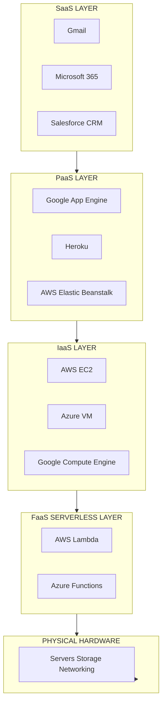
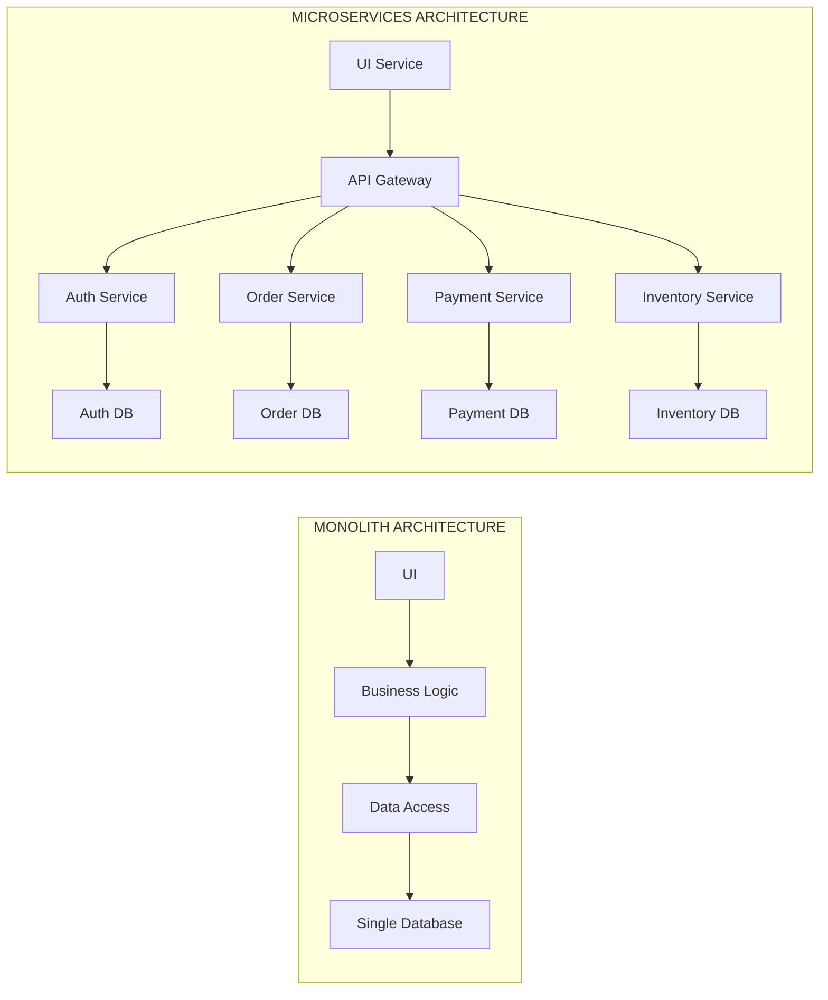
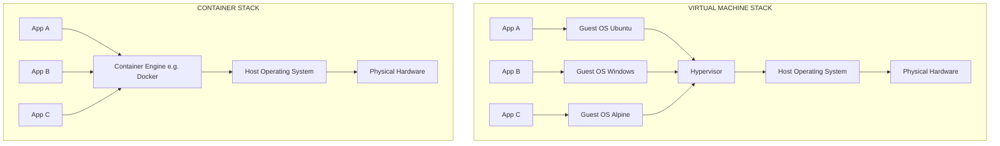
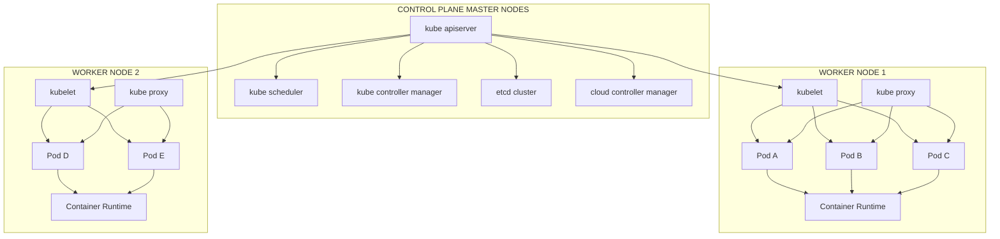
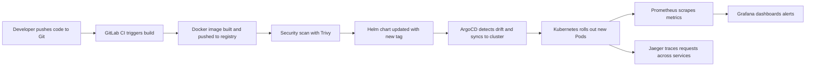

# Cloud Computing, Microservices and Containers:-

<!-- SECTION_1_START -->
# Cloud Computing, Microservices and Containers

## 1. Core Technical Definition & Intuitive Overview

### 1.1 Cloud Computing (Formal Definition)
**Cloud Computing** is a model for enabling ubiquitous, convenient, on-demand network access to a shared pool of configurable computing resources (e.g., networks, servers, storage, applications, and services) that can be rapidly provisioned and released with minimal management effort or service provider interaction. This is the standard **NIST SP 800-145** definition adopted universally.

> [!IMPORTANT]
> **KTU 2024 Syllabus Highlight:** Cloud Computing is one of the most heavily weighted topics in Module 4. Expect at least one full 14-mark question in the End Semester Examination (ESE).

### 1.2 Microservices (Formal Definition)
**Microservices** — also called the *microservice architecture* — is an architectural style that structures an application as a collection of small, autonomous services, modelled around a **business domain**, independently deployable, loosely coupled, and organized around capabilities.

### 1.3 Containers (Formal Definition)
A **Container** is a lightweight, standalone, executable package of software that includes everything needed to run an application: **code**, **runtime**, **system tools**, **system libraries**, and **settings**. Containers share the host OS kernel and run as isolated user-space processes.

> [!NOTE]
> **Core Distinction:** Virtual Machines virtualize the hardware; Containers virtualize the operating system. This is the single most important comparison for KTU exams.

### 1.4 Conceptual Analogy / Intuition

**The Pizza Shop Analogy (Cloud Computing):**
Imagine you want pizza. You have three options:
- **Make it at home** → You buy the oven, ingredients, electricity. (On-premises infrastructure)
- **Order from a restaurant** → You pay per pizza; the restaurant owns the kitchen. (Public Cloud — AWS, Azure, GCP)
- **Hire a private chef** → A chef comes to your house; you share the kitchen. (Hybrid Cloud)

You only pay for what you eat. The "kitchen" (data center) is shared, scalable, and managed by someone else. This is the **pay-as-you-go** essence of cloud.

**The Lego Analogy (Microservices):**
A **monolith** is one giant Lego sculpture — if one piece breaks, the whole thing might topple, and you can't reuse pieces easily. A **microservice** architecture is a box of individual Lego blocks. Each block (service) does one job (login, payment, search) and can be swapped, scaled, or upgraded independently.

**The Shipping Container Analogy (Containers):**
Before standardized shipping containers (1950s), goods were loaded loose onto ships — different shapes, sizes, fragile. Today, every product goes into a **standard metal box** that fits any ship, crane, or truck. Docker containers do the same for software: a standard package that runs identically on a developer's laptop, a test server, and production cloud.

> [!IMPORTANT]
> **Key Cloud Characteristics (NIST — Memorize for 3-mark questions):**
> 1. **On-demand self-service**
> 2. **Broad network access**
> 3. **Resource pooling** (multi-tenant)
> 4. **Rapid elasticity / Scalability**
> 5. **Measured service** (metered billing)

### 1.5 Physical Constants and Standard Metrics

The following metrics are fundamental to cloud-native systems:

- **Latency** — measured in **milliseconds (ms)**
- **Throughput** — measured in **Requests Per Second (RPS)** or **Transactions Per Second (TPS)**
- **Availability** — measured as a percentage (e.g., **99.99%** = "four nines", allows ~52.6 minutes of downtime/year)
- **Container Image Size** — typically **50 MB to 500 MB** (vs. VMs at **10 GB to 100 GB**)
- **Cold Start Time** — Containers: **< 1 second**; VMs: **30 seconds to several minutes**

> [!VISUALIZATION CONTROL]
> **Concept:** Auto-scaling elasticity curve showing how cloud resources expand and contract with demand.
> **GeoGebra / Desmos Input Equations:**
> * `f(x) = 10 + 5 * sin(x/2) + 2 * x` (representing demand fluctuation)
> * `g(x) = max(f(x), 5)` (representing provisioned capacity always $\geq$ demand)
> **Visual Description:** Student should see the provisioned capacity curve (green) smoothly tracking the demand curve (red) with a small buffer, demonstrating **elasticity** — the core cloud property.
<!-- SECTION_1_END -->

<!-- SECTION_2_START -->
# 2. Deep Theoretical Analysis & KTU High-Yield Formula Sheet

## 2.1 Cloud Computing Service Models (The Stack)

Cloud services are layered like a pizza — each layer abstracts the one below.

| Layer | Full Form | Who Manages What | KTU Example |
|---|---|---|---|
| **SaaS** | Software as a Service | Provider manages **everything**; user only uses the software | Gmail, Microsoft 365, Salesforce |
| **PaaS** | Platform as a Service | Provider manages OS, middleware, runtime; user manages app + data | Google App Engine, Heroku, AWS Elastic Beanstalk |
| **IaaS** | Infrastructure as a Service | Provider manages hardware + hypervisor; user manages OS upward | AWS EC2, Azure VM, Google Compute Engine |
| **FaaS** | Function as a Service | Serverless; user provides only code | AWS Lambda, Azure Functions |

> [!NOTE]
> **Memory Trick:** **"S-P-I-F"** from top to bottom: **S**aaS → **P**aaS → **I**aaS → **F**aaS. The lower you go, the **more control** you have, but **more responsibility** you carry.

## 2.2 Cloud Deployment Models

- **Public Cloud** — Owned by third-party provider (AWS, Azure, GCP); shared infrastructure.
- **Private Cloud** — Used exclusively by one organization; can be on-premises or hosted.
- **Hybrid Cloud** — Combination of public + private; orchestration between them.
- **Community Cloud** — Shared by organizations with common concerns (e.g., government, healthcare).
- **Multi-Cloud** — Using services from **multiple** public providers simultaneously (no portability required).

## 2.3 Microservices Architecture Principles

The "**12-Factor App**" methodology and microservices share these non-negotiable principles:

1. **Single Responsibility** — One service = one business capability.
2. **Independent Deployment** — Each service deploys without coordinating with others.
3. **Decentralized Data** — Each service owns its database (no shared schema).
4. **API-First Communication** — Services talk via **REST**, **gRPC**, or **message queues** (RabbitMQ, Kafka).
5. **Failure Isolation** — One service failing must not cascade.
6. **Infrastructure as Code (IaC)** — Terraform, Ansible, CloudFormation.
7. **Observability** — Centralized logging (ELK), metrics (Prometheus), tracing (Jaeger).

## 2.4 Containers: Docker Architecture

**Docker** uses a **client-server architecture**:

- **Docker Client (`docker` CLI)** — Sends commands.
- **Docker Daemon (`dockerd`)** — Builds, runs, distributes containers.
- **Docker Registry** — Stores images (Docker Hub, AWS ECR, Azure ACR).
- **Docker Image** — Read-only template (blueprint) built from a `Dockerfile`.
- **Docker Container** — Runnable instance of an image.
- **Dockerfile** — Text file with build instructions.

> [!IMPORTANT]
> **Image vs Container (High-yield distinction):** An **image** is a **class** (blueprint, immutable); a **container** is an **object** (instance, runnable, has state). One image → many containers.

## 2.5 Container Orchestration: Kubernetes

**Kubernetes (K8s)** is the de-facto orchestrator. Its core components (memorize the masters):

- **Pod** — Smallest deployable unit; holds 1+ tightly-coupled containers.
- **Service** — Stable network endpoint for a set of Pods.
- **Deployment** — Declarative spec for Pod replicas and rolling updates.
- **Node** — A worker machine (VM or physical) running Pods.
- **Cluster** — A set of Nodes managed by the control plane.
- **Control Plane** — `kube-apiserver`, `etcd`, `kube-scheduler`, `kube-controller-manager`, `cloud-controller-manager`.
- **kubectl** — The CLI to talk to the API server.

## 2.6 KTU Formula Sheet / Cheat Sheet

| Concept | Formula / Definition | Unit / Notes |
|---|---|---|
| **Availability** | $A = \dfrac{Uptime}{Uptime + Downtime} \times 100\%$ | Percentage. Four nines = 99.99% |
| **Annual Downtime** | $D = (1 - A) \times 525600$ | Minutes per year (525600 = 60 × 24 × 365) |
| **Mean Time Between Failures** | $MTBF = \dfrac{Total\ Operational\ Time}{Number\ of\ Failures}$ | Hours |
| **Mean Time To Recovery** | $MTTR = \dfrac{Total\ Downtime}{Number\ of\ Failures}$ | Hours |
| **Cost Pay-as-you-go** | $C_{total} = \sum_{i=1}^{n} (P_i \times T_i)$ | $P_i$ = price/hr, $T_i$ = hours used |
| **Container Density** | $Density = \dfrac{N_{containers}}{N_{host\ cores}}$ | Containers per CPU core |
| **Scaling Factor** | $S = \dfrac{C_{peak}}{C_{base}}$ | Ratio of peak to base capacity |
| **Image Layers (Docker)** | $L_{total} = L_{base} + \sum_{i=1}^{k} L_{RUN_i}$ | Sum of read-only layers |
| **RPS Capacity** | $R_{max} = \dfrac{C}{L}$ | $C$ = concurrency, $L$ = latency (s) |
| **Storage Scaling** | $V_{needed} = D \times R$ | $D$ = data, $R$ = replication factor (e.g., 3 in HDFS) |

> [!NOTE]
> **Critical:** Use `\vert` or `\mid` for absolute value inside any table (not raw `\vert` if escaping). Always use $\vert x \vert$ in LaTeX to prevent table parsing breaks.

## 2.7 Real-World Engineering Utility

| Domain | Application |
|---|---|
| **Netflix** | Runs 700+ microservices on AWS; pioneered chaos engineering (Chaos Monkey) |
| **Uber** | Migrated from monolith to 2,200+ microservices; uses Kafka for event streaming |
| **Spotify** | Microservices with team-aligned squads; Docker + Kubernetes + GCP |
| **Airbnb** | Migrated from Rails monolith to Java/Kotlin microservices |
| **Banking (JPMorgan)** | Hybrid cloud with strict regulatory compliance using OpenShift |
| **E-commerce (Flipkart/Amazon)** | Containerized workloads during Big Billion Days / Prime Day for elasticity |

> [!IMPORTANT]
> **Production Insight:** The reason **every Fortune 500 tech company** uses this stack is that it converts a **CapEx** (Capital Expenditure — buy servers) problem into an **OpEx** (Operational Expenditure — pay per use) problem, while achieving horizontal scalability.
<!-- SECTION_2_END -->

<!-- SECTION_3_START -->
# 3. Step-by-Step Derivations & Code/Symbolic Implementation

## 3.1 Worked Example: Cost & Downtime Calculation

> **[KTU University Exam - July 2024 Pattern, 7-mark sub-question]**

**Problem:** A startup uses an AWS EC2 `t3.medium` instance at **\$0.0416/hour** running 24/7 for 30 days. They also use S3 storage at **\$0.023/GB-month** for 500 GB. They commit to **99.9%** availability SLA.
**(a)** Calculate the total monthly cost.
**(b)** Calculate the allowed annual downtime.

### Solution

**Part (a) — Monthly Cost:**

The compute cost is the price per hour multiplied by the total hours in a month.

$$
H_{month} = 24 \times 30 = 720\ \text{hours}
$$

$$
C_{compute} = P \times H_{month} = 0.0416 \times 720 = 29.952\ \text{USD}
$$

The storage cost is the price per GB-month multiplied by the storage volume.

$$
C_{storage} = 0.023 \times 500 = 11.50\ \text{USD}
$$

The total cost is the sum of compute and storage.

$$
C_{total} = C_{compute} + C_{storage} = 29.952 + 11.50 = 41.452\ \text{USD}
$$

**Valuation Key:** [Compute hours derivation: 1 Mark] [Compute cost: 1 Mark] [Storage cost: 1 Mark] [Sum: 1 Mark]

**Part (b) — Annual Allowed Downtime:**

Availability is 99.9%, so the *unavailability* fraction is 0.1%.

$$
D_{annual} = (1 - A) \times 525600
$$

$$
D_{annual} = (1 - 0.999) \times 525600 = 0.001 \times 525600
$$

$$
D_{annual} = 525.6\ \text{minutes} \approx 8.76\ \text{hours/year}
$$

> [!NOTE]
> **Exam Tip:** Always carry the **unit** through your calculation. Marks are often lost for writing "525.6" without "minutes."

---

## 3.2 Complete Docker Implementation (Hands-on)

### 3.2.1 Step-by-Step Containerization of a Python Flask App

**Step 1 — Project structure**

```text
flask-app/
├── app.py
├── requirements.txt
└── Dockerfile
```

**Step 2 — Application code (`app.py`)**

```python
from flask import Flask, jsonify
import os
import logging

# Configure structured logging for production observability
logging.basicConfig(
    level=logging.INFO,
    format='%(asctime)s [%(levelname)s] %(message)s'
)
logger = logging.getLogger(__name__)

app = Flask(__name__)

@app.route('/health', methods=['GET'])
def health_check() -> tuple[dict, int]:
    """Liveness probe endpoint for Kubernetes."""
    logger.info("Health check invoked")
    return jsonify({
        "status": "healthy",
        "service": "flask-microservice",
        "version": os.getenv("APP_VERSION", "1.0.0")
    }), 200

@app.route('/api/greet/<username>', methods=['GET'])
def greet_user(username: str) -> tuple[dict, int]:
    """Business endpoint — single-responsibility microservice."""
    if not username or len(username) > 50:
        return jsonify({"error": "Invalid username"}), 400
    return jsonify({"message": f"Hello, {username}!"}), 200

if __name__ == '__main__':
    # 0.0.0.0 is mandatory inside containers (not 127.0.0.1)
    app.run(host='0.0.0.0', port=int(os.getenv("PORT", 5000)))
```

**Step 3 — Dependencies (`requirements.txt`)**

```text
flask==3.0.3
gunicorn==22.0.0
```

**Step 4 — The `Dockerfile` (multi-stage, production-grade)**

```dockerfile
# ========== Stage 1: Builder ==========
FROM python:3.11-slim AS builder

WORKDIR /build

# Copy ONLY requirements first to leverage Docker layer caching
COPY requirements.txt .

# Install dependencies into an isolated prefix we will copy later
RUN pip install --no-cache-dir --prefix=/install -r requirements.txt

# ========== Stage 2: Runtime ==========
FROM python:3.11-slim AS runtime

# Run as non-root user (security best practice — mandatory for K8s)
RUN groupadd -r appuser && useradd -r -g appuser appuser

WORKDIR /app

# Copy installed packages from builder stage
COPY --from=builder /install /usr/local

# Copy application source
COPY app.py .

# Set ownership to non-root user
RUN chown -R appuser:appuser /app
USER appuser

# Expose the port (documentation only; must be paired with -p at runtime)
EXPOSE 5000

# Healthcheck for container orchestrators
HEALTHCHECK --interval=30s --timeout=3s --retries=3 \
  CMD python -c "import urllib.request; urllib.request.urlopen('http://localhost:5000/health')" \
  || exit 1

# Use gunicorn for production (not flask dev server)
CMD ["gunicorn", "--bind", "0.0.0.0:5000", "--workers", "2", "app:app"]
```

**Step 5 — Build and run commands (executed sequentially)**

```bash
# 1. Build the image with a tag
docker build -t flask-microservice:1.0.0 .

# 2. Verify the image was created
docker images | grep flask-microservice

# 3. Run the container with port mapping and env var
docker run -d \
  --name flask-app-1 \
  -p 8080:5000 \
  -e APP_VERSION=1.0.0 \
  --restart unless-stopped \
  flask-microservice:1.0.0

# 4. Test the health endpoint
curl http://localhost:8080/health

# 5. Test the greet endpoint
curl http://localhost:8080/api/greet/KTUStudent

# 6. View logs
docker logs -f flask-app-1

# 7. Inspect running containers
docker ps --format "table {{.ID}}\t{{.Names}}\t{{.Status}}\t{{.Ports}}"
```

**Step 6 — `.dockerignore` (best practice)**

```text
__pycache__
*.pyc
.git
.env
venv/
*.md
tests/
```

---

## 3.3 Complete Kubernetes Manifest (Declarative Deployment)

**`flask-deployment.yaml`**

```yaml
apiVersion: apps/v1
kind: Deployment
metadata:
  name: flask-microservice
  namespace: production
  labels:
    app: flask
    tier: backend
spec:
  replicas: 3                          # Three independent Pods
  strategy:
    type: RollingUpdate
    rollingUpdate:
      maxSurge: 1
      maxUnavailable: 0
  selector:
    matchLabels:
      app: flask
  template:
    metadata:
      labels:
        app: flask
    spec:
      containers:
      - name: flask
        image: your-registry/flask-microservice:1.0.0
        imagePullPolicy: Always
        ports:
        - containerPort: 5000
          name: http
          protocol: TCP
        env:
        - name: APP_VERSION
          value: "1.0.0"
        - name: PORT
          value: "5000"
        resources:
          requests:
            cpu: "100m"                # 0.1 CPU guaranteed
            memory: "128Mi"
          limits:
            cpu: "500m"                # Max 0.5 CPU
            memory: "512Mi"
        livenessProbe:
          httpGet:
            path: /health
            port: 5000
          initialDelaySeconds: 10
          periodSeconds: 30
        readinessProbe:
          httpGet:
            path: /health
            port: 5000
          initialDelaySeconds: 5
          periodSeconds: 10
---
apiVersion: v1
kind: Service
metadata:
  name: flask-service
  namespace: production
spec:
  type: ClusterIP
  selector:
    app: flask
  ports:
  - port: 80
    targetPort: 5000
    protocol: TCP
---
apiVersion: autoscaling/v2
kind: HorizontalPodAutoscaler
metadata:
  name: flask-hpa
  namespace: production
spec:
  scaleTargetRef:
    apiVersion: apps/v1
    kind: Deployment
    name: flask-microservice
  minReplicas: 3
  maxReplicas: 10
  metrics:
  - type: Resource
    resource:
      name: cpu
      target:
        type: Utilization
        averageUtilization: 70
```

**Apply the manifest:**

```bash
# Create namespace
kubectl create namespace production

# Apply the deployment + service + HPA in one shot
kubectl apply -f flask-deployment.yaml

# Verify
kubectl get pods -n production -l app=flask
kubectl get svc -n production
kubectl get hpa -n production

# Check rollout status
kubectl rollout status deployment/flask-microservice -n production

# Scale manually (if HPA disabled)
kubectl scale deployment flask-microservice --replicas=5 -n production
```

---

## 3.4 Microservice Communication: Event-Driven with Python (Producer-Consumer)

```python
# producer.py — Publishes an "OrderPlaced" event
import json
import logging
from datetime import datetime
import pika  # RabbitMQ client

logging.basicConfig(level=logging.INFO)
logger = logging.getLogger("order-producer")

def publish_order_event(order_id: int, customer_id: int, amount: float) -> None:
    """Publishes an order event to a RabbitMQ exchange."""
    try:
        # Establish connection
        connection = pika.BlockingConnection(
            pika.ConnectionParameters(host='rabbitmq', port=5672)
        )
        channel = connection.channel()

        # Declare a topic exchange
        channel.exchange_declare(
            exchange='order_events',
            exchange_type='topic',
            durable=True
        )

        # Construct event payload
        event = {
            "event_type": "OrderPlaced",
            "order_id": order_id,
            "customer_id": customer_id,
            "amount": amount,
            "timestamp": datetime.utcnow().isoformat() + "Z"
        }

        # Publish with routing key
        channel.basic_publish(
            exchange='order_events',
            routing_key='order.placed',
            body=json.dumps(event),
            properties=pika.BasicProperties(
                content_type='application/json',
                delivery_mode=2  # Persistent
            )
        )
        logger.info(f"Published OrderPlaced event for order {order_id}")
    except pika.exceptions.AMQPConnectionError as e:
        logger.error(f"Failed to connect to RabbitMQ: {e}")
        raise
    finally:
        if 'connection' in locals() and connection.is_open:
            connection.close()

if __name__ == "__main__":
    publish_order_event(order_id=1001, customer_id=42, amount=2499.99)
```

```python
# consumer.py — Inventory service subscribes to OrderPlaced
import json
import logging
import pika

logging.basicConfig(level=logging.INFO)
logger = logging.getLogger("inventory-consumer")

def callback(ch, method, properties, body: bytes) -> None:
    """Process incoming order events."""
    try:
        event = json.loads(body)
        order_id = event["order_id"]
        logger.info(f"Reserving stock for order {order_id}")
        # ... reserve stock in DB ...
        ch.basic_ack(delivery_tag=method.delivery_tag)
    except (KeyError, json.JSONDecodeError) as e:
        logger.error(f"Malformed event: {e}")
        ch.basic_nack(delivery_tag=method.delivery_tag, requeue=False)

def start_consumer() -> None:
    connection = pika.BlockingConnection(
        pika.ConnectionParameters(host='rabbitmq', port=5672)
    )
    channel = connection.channel()
    channel.exchange_declare(exchange='order_events',
                             exchange_type='topic', durable=True)
    channel.queue_declare(queue='inventory.order.placed', durable=True)
    channel.queue_bind(exchange='order_events',
                       queue='inventory.order.placed',
                       routing_key='order.placed')
    channel.basic_qos(prefetch_count=10)
    channel.basic_consume(queue='inventory.order.placed',
                          on_message_callback=callback)
    logger.info("Inventory consumer started. Awaiting messages...")
    channel.start_consuming()

if __name__ == "__main__":
    start_consumer()
```

> [!IMPORTANT]
> **Why this matters in production:** The **Order Service** doesn't need to know that **Inventory**, **Payment**, and **Notification** services exist. Each subscribes to events asynchronously. This is **loose coupling** — the defining property of microservices.

---

## 3.5 CI/CD Pipeline for Containerized Microservices (YAML)

**`.gitlab-ci.yml`**

```yaml
stages:
  - test
  - build
  - deploy

variables:
  DOCKER_REGISTRY: registry.gitlab.com/ktu-student/adv-comp-sys
  IMAGE_NAME: flask-microservice
  IMAGE_TAG: $CI_COMMIT_SHORT_SHA

unit_test:
  stage: test
  image: python:3.11-slim
  before_script:
    - pip install -r requirements.txt
    - pip install pytest
  script:
    - pytest tests/ --cov=app --cov-report=term --cov-fail-under=80
  coverage: '/(?i)total.*? (100(?:\.0+)?\%\vert[1-9]?\d(?:\.\d+)?\%)$/'

docker_build:
  stage: build
  image: docker:24.0
  services:
    - docker:24.0-dind
  script:
    - docker login -u $CI_REGISTRY_USER -p $CI_REGISTRY_PASSWORD $CI_REGISTRY
    - docker build -t $DOCKER_REGISTRY/$IMAGE_NAME:$IMAGE_TAG .
    - docker push $DOCKER_REGISTRY/$IMAGE_NAME:$IMAGE_TAG
  only:
    - main
    - develop

deploy_staging:
  stage: deploy
  image: bitnami/kubectl:latest
  script:
    - kubectl set image deployment/flask-microservice
        flask=$DOCKER_REGISTRY/$IMAGE_NAME:$IMAGE_TAG
        -n staging
    - kubectl rollout status deployment/flask-microservice -n staging
  environment:
    name: staging
    url: https://staging.advcomp.ktu.edu
  only:
    - develop
```
<!-- SECTION_3_END -->

<!-- SECTION_4_START -->
# 4. Structural Diagrams & Schematics

## 4.1 Cloud Service Models — Layered Architecture



## 4.2 Monolith vs Microservices — Side-by-Side Comparison



## 4.3 Container vs Virtual Machine — Architecture Comparison



## 4.4 Kubernetes Cluster Architecture



## 4.5 End-to-End DevOps + Cloud-Native Pipeline



## 4.6 Sequential Processing Topology Matrix — Cloud Request Lifecycle

| Stage | Component | Action | Time Budget |
|---|---|---|---|
| 1 | **User Browser** | Sends HTTPS request to `app.ktu.edu` | 0 ms |
| 2 | **Cloud DNS (Route 53)** | Resolves domain to CDN edge IP | 20–50 ms |
| 3 | **CDN (CloudFront)** | Serves cached static assets (HTML, CSS, JS, images) | 10–30 ms |
| 4 | **WAF + Load Balancer (ALB)** | Filters malicious traffic, distributes to healthy backend | 5–15 ms |
| 5 | **API Gateway (Kong / AWS API GW)** | Authenticates JWT, rate-limits, routes to microservice | 10–20 ms |
| 6 | **Microservice Pod (Kubernetes)** | Processes business logic in container | 50–200 ms |
| 7 | **Database (RDS / DynamoDB)** | Persists or fetches data with read replica | 10–50 ms |
| 8 | **Message Queue (Kafka / SQS)** | Publishes domain event for async consumers | 5–10 ms |
| 9 | **Response Path** | Aggregated response sent back through the same chain | 10–30 ms |
| 10 | **Observability Layer** | Logs to CloudWatch, metrics to Prometheus, traces to Jaeger | Async |

> [!NOTE]
> **Total Latency Target:** < 300 ms for 95th percentile (p95). Anything above 1 s degrades user experience. KTU may ask: "Identify which component would you scale if latency spikes" — the answer is almost always **Pod replicas (HPA)** or **Database read replicas**.
<!-- SECTION_4_END -->

<!-- SECTION_5_START -->
# 5. KTU 2024 Scheme Examination Question Bank & Topic Recap

---

## 5.1 Part A Questions (3 Marks Each)

### **Question 1** [CO1, Remember]
**[KTU University Exam - December 2023]**
List the **five essential characteristics** of cloud computing as defined by NIST.

**Model Answer (3 Marks):**

The five essential characteristics of cloud computing according to **NIST SP 800-145** are:

1. **On-demand self-service** — Consumers can provision compute, storage, and networking automatically without human interaction with the provider. *(1 Mark)*
2. **Broad network access** — Capabilities are available over the network and accessed through standard mechanisms (HTTP, REST APIs) used by heterogeneous client platforms such as mobile phones, laptops, and workstations. *(0.5 Mark)*
3. **Resource pooling** — Provider resources are pooled to serve multiple consumers using a multi-tenant model with physical and virtual resources dynamically reassigned according to demand. *(0.5 Mark)*
4. **Rapid elasticity** — Capabilities can be elastically provisioned and released, in some cases automatically, to scale rapidly outward and inward commensurate with demand. *(0.5 Mark)*
5. **Measured service** — Cloud systems automatically control and optimize resource use by leveraging metering at a level appropriate to the service (storage, processing, bandwidth, active user accounts). *(0.5 Mark)*

---

### **Question 2** [CO2, Understand]
**[KTU University Exam - July 2024]**
Differentiate between **containers** and **virtual machines** with respect to architecture, boot time, size, and isolation level.

**Model Answer (3 Marks):**

| Parameter | Virtual Machine | Container |
|---|---|---|
| **Architecture** | Includes a full **guest OS** on top of the hypervisor | Shares the **host OS kernel**; only includes the application and its dependencies |
| **Boot Time** | 30 seconds to several minutes | Less than 1 second (typically 100–500 ms) |
| **Size** | Gigabytes (10 GB – 100 GB) | Megabytes (50 MB – 500 MB) |
| **Isolation** | Strong, hardware-level isolation through hypervisor | Process-level isolation; weaker but sufficient for most microservices |
| **OS Support** | Can run different OSes (Linux VM on Windows host) | Must share host OS kernel (Linux containers on Linux host) |
| **Performance** | Near-native with hardware-assisted virtualization | Near-native (no hypervisor overhead) |

*(Award 0.5 Mark per correct contrasting point; 3 points are sufficient for full marks.)*

---

## 5.2 Part B Questions (14 Marks with Internal Choice)

### **Question A — Choice 1** [CO1, CO2, Apply, Analyze]

**[KTU University Exam - July 2024]**
**(a)** Explain the **NIST cloud computing reference architecture** with a neat diagram. List and briefly describe the **three service models** and **four deployment models**. *(7 Marks)*

**(b)** A startup deploys a 3-tier monolithic e-commerce application on AWS. Traffic grows 10× during sales. Discuss the **limitations of the monolith** and how **microservices** solve them. Provide at least **three specific examples** of services they could split out. *(7 Marks)*

#### Model Solution

**Part (a) — NIST Reference Architecture (7 Marks)**

The NIST cloud reference model identifies **five essential actors**:
- **Cloud Consumer** — Uses the services.
- **Cloud Provider** — Delivers the services.
- **Cloud Auditor** — Conducts independent assessments.
- **Cloud Broker** — Manages usage, performance, and delivery of cloud services.
- **Cloud Carrier** — Provides network connectivity between consumer and provider.

**Three Service Models:**

1. **SaaS (Software as a Service)** — The consumer uses the provider's applications running on a cloud infrastructure. The consumer does **not** manage or control the underlying cloud infrastructure. Example: **Gmail, Microsoft 365, Salesforce**. *(1.5 Marks)*
2. **PaaS (Platform as a Service)** — The consumer deploys their own applications onto the cloud infrastructure using programming languages, libraries, services, and tools supported by the provider. Example: **Google App Engine, Heroku, AWS Elastic Beanstalk**. *(1.5 Marks)*
3. **IaaS (Infrastructure as a Service)** — The consumer can provision processing, storage, networks, and other fundamental computing resources to deploy arbitrary software including OS and applications. Example: **AWS EC2, Azure VM, Google Compute Engine**. *(1.5 Marks)*

**Four Deployment Models:**

1. **Public Cloud** — Open for general public use; owned by third-party provider. *(0.5 Mark)*
2. **Private Cloud** — Used exclusively by a single organization; can be on-premises. *(0.5 Mark)*
3. **Hybrid Cloud** — Composition of two or more clouds (private + public) bound by standardized technology enabling data and application portability. *(0.5 Mark)*
4. **Community Cloud** — Shared by several organizations with common concerns (e.g., security, compliance, jurisdiction). *(0.5 Mark)*

*[NIST diagram with actors: 1 Mark]*

**Part (b) — Monolith Limitations & Microservices (7 Marks)**

**Limitations of the Monolith during 10× traffic surge:** *(3.5 Marks)*

1. **No granular scaling** — You must replicate the **entire** application even if only the checkout function is hot. Wastes resources and money.
2. **Single point of failure** — If the payment module has a memory leak, the **entire** site (browsing, search, reviews) goes down.
3. **Slow deployments** — Any small change requires rebuilding and redeploying the **entire** monolith; risky in high-traffic events.
4. **Technology lock-in** — Stuck with the original stack (e.g., Java + MySQL); cannot use a better tool for a specific function.
5. **Team coordination overhead** — Many developers working on the same codebase cause merge conflicts and slow velocity.

**How Microservices Solve Them:** *(3.5 Marks — 1 Mark per service example + 0.5 Mark for the explanation each)*

| Service Split Out | Solves | Why |
|---|---|---|
| **Checkout Service** (Node.js) | Granular scaling | Auto-scale from 3 to 30 Pods during sale; keep other services at 3 |
| **Payment Service** (Go) | Failure isolation | A bug in payment only kills payment, not the storefront |
| **Product Catalog Service** (Python) | Independent deployment | Update pricing logic daily without touching other services |
| **Search Service** (Elasticsearch) | Technology flexibility | Use a search-optimized engine instead of SQL `LIKE` queries |
| **User Auth Service** | Shared reuse | Mobile app, web app, partner APIs all use the same auth |

*Additional supporting points:* Containers enable each service to be deployed in **seconds**, Kubernetes provides **self-healing** and **rolling updates**, and an **API Gateway** decouples the client from the service topology.

---

### **Question B — Choice 2** [CO3, CO4, Apply, Create]

**[KTU University Exam - December 2023]**
**(a)** Write a **complete Dockerfile** for a Node.js Express application that listens on port 3000. Use a **multi-stage build**, run as a **non-root user**, and include a **HEALTHCHECK**. *(7 Marks)*

**(b)** Design a **Kubernetes Deployment manifest** with 4 replicas, an HPA that scales between 2 and 8 Pods at 60% CPU, a ClusterIP Service, resource requests/limits, and liveness/readiness probes. Justify each field. *(7 Marks)*

#### Model Solution

**Part (a) — Production Dockerfile (7 Marks)**

```dockerfile
# Stage 1: Build dependencies
FROM node:20-alpine AS builder
WORKDIR /build
COPY package*.json ./
RUN npm ci --only=production && npm cache clean --force

# Stage 2: Runtime image
FROM node:20-alpine AS runtime
RUN addgroup -S appgroup && adduser -S appuser -G appgroup
WORKDIR /app
COPY --from=builder /build/node_modules ./node_modules
COPY . .
RUN chown -R appuser:appgroup /app
USER appuser
ENV NODE_ENV=production
ENV PORT=3000
EXPOSE 3000
HEALTHCHECK --interval=30s --timeout=3s --start-period=10s --retries=3 \
  CMD wget -qO- http://localhost:3000/health || exit 1
CMD ["node", "server.js"]
```

**Valuation Key:**
- *Multi-stage build with `AS builder` and `AS runtime`: 1.5 Marks*
- *Non-root user creation with `adduser`/`addgroup`: 1 Mark*
- *Layer caching via `COPY package*.json` before `COPY .`: 1 Mark*
- *`HEALTHCHECK` directive with interval, timeout, retries: 1.5 Marks*
- *`EXPOSE 3000` and correct `CMD` instruction: 1 Mark*
- *Use of `npm ci --only=production` (not `npm install`): 0.5 Mark*
- *`.dockerignore` mention in explanation: 0.5 Mark*

**Part (b) — Kubernetes Manifest (7 Marks)**

```yaml
apiVersion: apps/v1
kind: Deployment
metadata:
  name: nodejs-express-app
  namespace: production
  labels: { app: nodejs-express }
spec:
  replicas: 4
  selector: { matchLabels: { app: nodejs-express } }
  strategy:
    type: RollingUpdate
    rollingUpdate: { maxSurge: 1, maxUnavailable: 0 }
  template:
    metadata: { labels: { app: nodejs-express } }
    spec:
      containers:
      - name: nodejs
        image: registry.example.com/nodejs-express:1.2.0
        imagePullPolicy: Always
        ports: [{ containerPort: 3000, name: http }]
        env:
        - { name: NODE_ENV, value: "production" }
        - { name: PORT, value: "3000" }
        resources:
          requests: { cpu: "200m", memory: "256Mi" }
          limits:   { cpu: "1000m", memory: "512Mi" }
        livenessProbe:
          httpGet: { path: /health, port: 3000 }
          initialDelaySeconds: 15
          periodSeconds: 20
        readinessProbe:
          httpGet: { path: /ready, port: 3000 }
          initialDelaySeconds: 5
          periodSeconds: 10
---
apiVersion: v1
kind: Service
metadata: { name: nodejs-express-svc, namespace: production }
spec:
  type: ClusterIP
  selector: { app: nodejs-express }
  ports: [{ port: 80, targetPort: 3000, protocol: TCP }]
---
apiVersion: autoscaling/v2
kind: HorizontalPodAutoscaler
metadata: { name: nodejs-express-hpa, namespace: production }
spec:
  scaleTargetRef:
    apiVersion: apps/v1
    kind: Deployment
    name: nodejs-express-app
  minReplicas: 2
  maxReplicas: 8
  metrics:
  - type: Resource
    resource:
      name: cpu
      target: { type: Utilization, averageUtilization: 60 }
```

**Justification of Each Field (Valuation Key):**
- *`replicas: 4` — baseline capacity for HA and load distribution: 0.5 Mark*
- *`resources.requests` — guaranteed resources; scheduler uses this for placement: 0.5 Mark*
- *`resources.limits` — prevents one Pod consuming all node resources: 0.5 Mark*
- *`livenessProbe` — kubelet restarts unhealthy Pods: 0.5 Mark*
- *`readinessProbe` — Pod removed from Service endpoints until ready: 0.5 Mark*
- *`maxSurge: 1, maxUnavailable: 0` — zero-downtime rolling update: 0.5 Mark*
- *HPA `minReplicas: 2`, `maxReplicas: 8`, `averageUtilization: 60` — elastic scaling: 1 Mark*
- *`ClusterIP` Service — internal-only stable virtual IP: 0.5 Mark*
- *Correct YAML structure (apiVersion, kind, metadata, spec): 0.5 Mark*
- *YAML validation: 0.5 Mark*
- *Logical narrative linking fields to business goal: 1 Mark*

> [!WARNING]
> **KTU Examiner's Valuation Warning — Common Pitfalls:**
> 1. **Do NOT** use `:latest` tag in production. Always pin to a specific version (e.g., `:1.2.0`). Examiners deduct 0.5 Mark for this.
> 2. **Do NOT** run containers as `root` (`USER root` or no `USER` directive). Security best practice — examiners expect a non-root user.
> 3. **Do NOT** forget `initialDelaySeconds` for probes; otherwise K8s kills the Pod before the app boots, causing a `CrashLoopBackOff`.
> 4. **Do NOT** place `requests` and `limits` at the same value for CPU — it eliminates the **burstable** QoS class.
> 5. **Do NOT** omit the `selector` in the Deployment; the API server will reject the manifest.
> 6. In **theory questions**, students often confuse **IaaS/PaaS/SaaS** responsibilities. Memorize: the lower the layer, the **more** the user manages.

---

## 5.3 Topic Recap & Important Things to Remember

> [!IMPORTANT]
> **High-Density Rapid Revision Checklist — Pin this to your wall!**

### **Cloud Computing Essentials**
- ✅ **NIST definition** is the gold standard — know the 5 characteristics, 3 service models, 4 deployment models.
- ✅ **Service Models mnemonic:** **"I-P-S"** (IaaS, PaaS, SaaS) from **bottom to top** = more abstraction = less user control.
- ✅ **Deployment Models:** Public, Private, Hybrid, Community, Multi-Cloud.
- ✅ **Public cloud providers to remember:** AWS, Azure, GCP, Oracle Cloud, IBM Cloud.
- ✅ **Availability table for SLA problems:**

  | Availability | Annual Downtime |
  |---|---|
  | 99% (two nines) | 3.65 days |
  | 99.9% (three nines) | 8.76 hours |
  | 99.99% (four nines) | 52.6 minutes |
  | 99.999% (five nines) | 5.26 minutes |

### **Microservices Essentials**
- ✅ **Single Responsibility Principle** is the foundation.
- ✅ **Each service owns its data** — no shared database across services.
- ✅ **Communication patterns:** Synchronous (REST, gRPC) vs Asynchronous (Kafka, RabbitMQ, SQS).
- ✅ **API Gateway** (Kong, AWS API Gateway) is the single entry point for clients.
- ✅ **Service Discovery** (Consul, Eureka, K8s DNS) is needed for dynamic environments.
- ✅ **Circuit Breaker** pattern (Hystrix, Resilience4j) prevents cascade failures.
- ✅ **Saga pattern** manages distributed transactions across services.
- ✅ **12-Factor App** methodology — be familiar with all 12 factors for theory questions.

### **Containers & Docker Essentials**
- ✅ **Image = Class, Container = Object** (immutable blueprint vs runnable instance).
- ✅ **Dockerfile instructions in order of importance:** `FROM`, `RUN`, `COPY`, `ADD`, `WORKDIR`, `ENV`, `EXPOSE`, `CMD`, `ENTRYPOINT`, `USER`, `HEALTHCHECK`.
- ✅ **Multi-stage builds** reduce final image size by discarding build tools.
- ✅ **Layer caching:** Order matters — copy dependency files (`package.json`, `requirements.txt`) before source code.
- ✅ **`.dockerignore`** is as important as `.gitignore`.
- ✅ **Container networking modes:** bridge, host, none, overlay.

### **Kubernetes Essentials**
- ✅ **Pod** = smallest unit; holds 1+ containers sharing network and storage.
- ✅ **Deployment** manages ReplicaSets and rolling updates.
- ✅ **Service types:** ClusterIP (internal), NodePort (external on each node), LoadBalancer (cloud LB), Ingress (HTTP routing).
- ✅ **HPA** scales on CPU/memory/custom metrics.
- ✅ **Probes:** Liveness (restart), Readiness (traffic), Startup (slow boot).
- ✅ **kubectl commands:** `get`, `describe`, `logs`, `exec`, `apply`, `scale`, `rollout`.
- ✅ **Architecture:** Control Plane (API server, scheduler, controller, etcd) + Worker Nodes (kubelet, kube-proxy, container runtime).

### **Cloud Cost & Performance Formulas (Memorize for Numericals)**
- ✅ Monthly compute cost = Hourly rate × 24 × 30
- ✅ Annual downtime = (1 − Availability) × 525600 minutes
- ✅ RPS capacity = Concurrency ÷ Latency (seconds)
- ✅ Storage cost = Price per GB-month × Storage in GB
- ✅ Scaling factor = Peak demand ÷ Base demand

### **Common KTU Exam Traps**
- 🚫 Don't confuse **vertical scaling** (bigger machine) with **horizontal scaling** (more machines). Cloud = horizontal.
- 🚫 Don't say **"cloud computing is storing data on the internet"** — that is a definition of *cloud storage*, not cloud computing.
- 🚫 Don't say **"Docker is a virtual machine"** — Docker is a *containerization platform*; it uses OS-level virtualization.
- 🚫 Don't skip writing **units** in numerical answers. Marks are deducted.
- 🚫 Don't forget to **mention security aspects** in deployment answers (non-root users, secrets management, network policies).
<!-- SECTION_5_END -->
