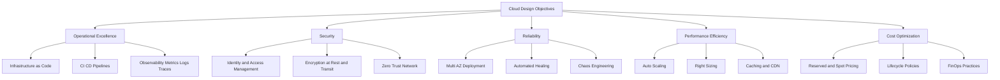
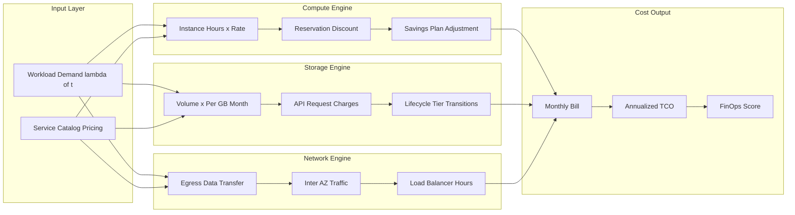
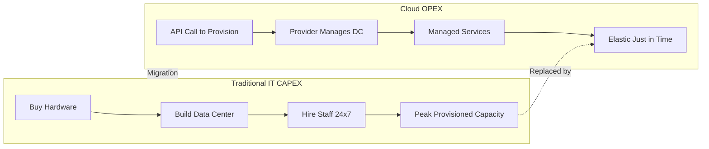
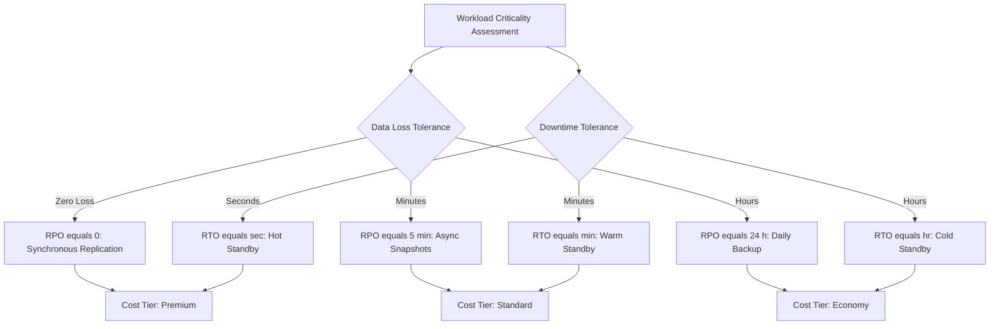

# Cloud Design objectives and Cost Model.

<!-- SECTION_1_START -->
# Cloud Design Objectives and Cost Model

## 1.1 Formal Academic Definition (KTU 2024 Syllabus Terminology)

> [!IMPORTANT]
> **Cloud Design Objectives** are a curated set of non-functional architectural principles, quality attributes, and engineering trade-offs that govern the construction, deployment, and governance of distributed cloud-native systems. They are derived from ISO/IEC 25010, NIST SP 500-292 (Cloud Computing Reference Architecture), and the AWS Well-Architected Framework, and they translate abstract service-level expectations into measurable, testable engineering targets.

> [!IMPORTANT]
> **Cloud Cost Model** is a deterministic financial framework that quantifies the monetary expenditure associated with provisioning, operating, scaling, and decommissioning cloud resources across heterogeneous providers. It encapsulates the transition from **CAPEX** (Capital Expenditure) to **OPEX** (Operational Expenditure), introduces consumption-based economics, and is formally expressed through a **Total Cost of Ownership (TCO)** equation that aggregates compute, storage, network, and operational dimensions.

### Conceptual Analogy / Intuition

> [!NOTE]
> **Real-World Analogy — The Electricity Grid vs. Private Diesel Generator**
>
> Imagine you are powering a factory. **Option A (Traditional IT):** You buy a massive diesel generator, pay for fuel storage, hire a maintenance crew, and pay 24/7 even if the factory runs at 10% load at night. This is **CAPEX-heavy, rigid, and wasteful**.
>
> **Option B (Cloud):** You simply plug into the city power grid. You pay only for the kilowatt-hours you consume this month. If your factory suddenly runs three shifts, the grid automatically scales. If demand drops, your bill shrinks. The grid operator handles maintenance, redundancy, and disaster recovery. This is **OPEX-driven, elastic, and consumption-metered** — exactly the philosophy of cloud design objectives and cost models.
>
> The **"Design Objectives"** are the *quality promises* the grid operator makes (uptime ≥ 99.99%, surge capacity, fault isolation, security). The **"Cost Model"** is the *metered billing schedule* printed on every monthly invoice.

### Core Quality Attributes (Cloud Design Objectives)

| # | Design Objective | One-Line Definition |
|---|---|---|
| 1 | **Scalability** | Ability to handle increasing load by adding resources |
| 2 | **Elasticity** | Automatic, on-the-fly provisioning and de-provisioning |
| 3 | **Availability** | Percentage of time the system is operational and accessible |
| 4 | **Reliability** | Probability of performing its intended function without failure |
| 5 | **Fault Tolerance** | Continued operation despite component failures |
| 6 | **Performance** | Latency, throughput, and response-time guarantees |
| 7 | **Security** | Confidentiality, Integrity, Availability (CIA Triad) |
| 8 | **Maintainability** | Ease of updates, patches, and evolution |
| 9 | **Cost Optimization** | Achieving desired outcomes at the lowest possible price |
| 10 | **Sustainability** | Minimizing environmental impact (carbon-aware computing) |

> [!TIP]
> **Syllabus Highlight:** Under the KTU 2024 PCCST602 syllabus (Module 4), the emphasis is on linking each design objective to a **measurable metric** and a **cost consequence**, because in cloud engineering *every architectural decision is a financial decision*.

### GeoGebra / Desmos Visualization

> [!VISUALIZATION CONTROL]
> **Concept:** Availability vs. Allowed Downtime per Year (The "Nines" Curve)
> **GeoGebra / Desmos Input Equations:**
> * `f(x) = 1 - (1 - x)^(365 * 24 * 60)` — for plotting cumulative yearly downtime
> * Plot points: `(0.99, 5256)`, `(0.999, 52.56)`, `(0.9999, 5.256)` representing minutes of yearly downtime against availability percentage.
> **Visual Description:** A sharply descending exponential curve where each additional "9" of availability reduces annual downtime by an order of magnitude. Students should observe the **non-linear cost jump** between 99.9% and 99.99% availability.

<!-- SECTION_1_END -->

<!-- SECTION_2_START -->
# Deep Theoretical Analysis & KTU High-Yield Formula Sheet

## 2.1 The Five Pillars of Cloud Design (AWS-Well-Architected Mapping)

> [!NOTE]
> While AWS popularized the "Five Pillars," they map directly to KTU Module 4 outcomes. The KTU 2024 Scheme expects students to articulate these pillars and link them to microservices/containers.

### Pillar 1 — Operational Excellence
- **Definition:** Running and monitoring systems to deliver business value and continuously improve processes and procedures.
- **Engineering mechanisms:** Infrastructure as Code (IaC), CI/CD pipelines, observability (metrics, logs, traces), automated runbooks.
- **Why it matters:** Without operational excellence, microservices become unmanageable "distributed monoliths."

### Pillar 2 — Security
- **Definition:** Protecting information, systems, and assets while delivering business value through risk assessments and mitigation strategies.
- **Engineering mechanisms:** Identity & Access Management (IAM), encryption at rest and in transit, Zero-Trust networking, secret management via Vault/KMS.
- **CIA Triad:** **C**onfidentiality, **I**ntegrity, **A**vailability.

### Pillar 3 — Reliability
- **Definition:** Ensuring a workload performs its intended function correctly and consistently, including the ability to recover from failures and meet demand.
- **Key formula (Reliability Block Diagram):**
$$R_{system} = 1 - \prod_{i=1}^{n} (1 - R_i)$$
where $R_i$ is the reliability of component $i$ in a parallel redundancy topology.
- **Engineering mechanisms:** Multi-AZ deployments, automated healing, chaos engineering (e.g., Netflix Chaos Monkey), circuit breakers.

### Pillar 4 — Performance Efficiency
- **Definition:** Using computing resources efficiently to meet system requirements and maintaining that efficiency as demand changes and technologies evolve.
- **Engineering mechanisms:** Right-sizing, caching layers (Redis, Memcached), CDN offload, asynchronous processing, container orchestration (Kubernetes HPA/VPA).

### Pillar 5 — Cost Optimization
- **Definition:** Running systems to deliver business value at the lowest price point. This is the direct bridge to our cost model discussion in §2.3.
- **Engineering mechanisms:** Spot/Reserved instances, lifecycle policies, rightsizing, FinOps practices.

## 2.2 Non-Functional Requirements (NFRs) — Measurable Targets

| NFR | Metric | Typical SLO |
|---|---|---|
| Availability | Uptime % | **99.9% (Three 9s)** to **99.999% (Five 9s)** |
| Latency | p99 response time | **< 200 ms** for web APIs |
| Throughput | Requests/sec | **> 10,000 RPS** |
| Durability | Data loss probability | **99.999999999% (11 9s)** for S3-class storage |
| Recovery Time Objective (RTO) | Time to restore | **< 1 hour** |
| Recovery Point Objective (RPO) | Max acceptable data loss | **< 5 minutes** |

## 2.3 Cloud Cost Model — Formal Framework

### 2.3.1 The Fundamental Paradigm Shift: CAPEX → OPEX

| Dimension | Traditional IT (CAPEX) | Cloud (OPEX) |
|---|---|---|
| Spending Pattern | Upfront, lumpy | Continuous, metered |
| Asset Ownership | Owned, depreciated | Rented, consumption-based |
| Capacity Planning | Peak-provisioned | Elastic, just-in-time |
| Risk Bearer | Customer | Shared with provider |
| Tax Treatment | Capitalized | Operating expense |
| Time-to-Provision | **Weeks to months** | **Seconds to minutes** |

### 2.3.2 Core Cost Equation (Total Cost of Ownership)

$$TCO_{cloud} = C_{compute} + C_{storage} + C_{network} + C_{services} + C_{ops} + C_{migration} - C_{savings}$$

> [!IMPORTANT]
> **Where each term is itself a sub-equation. The KTU 2024 board expects students to expand at least three of these in a 14-mark question.**

#### Expansion of Each Term

**1. Compute Cost ($C_{compute}$):**
$$C_{compute} = \sum_{i=1}^{n} (P_i \times U_i \times H_i \times R_i)$$

where:
- $P_i$ = price per unit-hour of instance type $i$ (e.g., $0.0464$/hr for AWS m5.large)
- $U_i$ = number of units of type $i$ provisioned
- $H_i$ = hours of utilization in the billing period
- $R_i$ = reservation discount factor (1.0 = on-demand, 0.4 = 3-year reserved)

**2. Storage Cost ($C_{storage}$):**
$$C_{storage} = \sum_{j=1}^{m} (S_j \times \sigma_j) + \sum_{k=1}^{q} T_k \times \tau_k$$

where:
- $S_j$ = storage volume (GB) on tier $j$ (Hot, Cool, Archive)
- $\sigma_j$ = per-GB-month price of tier $j$
- $T_k$ = number of API requests of type $k$
- $\tau_k$ = per-request price (e.g., $0.0004 per 10,000 GETs)

**3. Network Cost ($C_{network}$):**
$$C_{network} = D_{out} \times \eta_{egress} + D_{inter} \times \eta_{inter-region} + LB_h \times \eta_{lb-hr}$$

where $D_{out}$ = egress data in GB, $\eta_{egress}$ = per-GB egress rate (typically **\$0.09/GB** to internet), and $LB_h$ = load balancer hours.

**4. Managed Services & Operational Costs ($C_{services} + C_{ops}$):**
$$C_{ops} = N_{eng} \times S_{annual} \times T_{fraction} + L_{third-party}$$

where $N_{eng}$ = number of SRE/DevOps engineers, $S_{annual}$ = fully-loaded annual salary, $T_{fraction}$ = fraction of time spent on cloud operations.

### 2.3.3 Pricing Models (The Three Tiers of Commitment)

| Pricing Model | Discount vs. On-Demand | Commitment Level | Use Case |
|---|---|---|---|
| **On-Demand** | 0% (baseline) | None | Short-lived workloads, dev/test |
| **Reserved Instances** | **30% – 60%** | 1 or 3 years | Steady-state baseline capacity |
| **Spot Instances** | **60% – 90%** | Interruptible | Batch jobs, fault-tolerant workloads |
| **Savings Plans** | **20% – 40%** | $/hr commitment | Flexible across instance families |

**Effective Hourly Rate Formula:**
$$P_{effective} = P_{on-demand} \times (1 - d_{reservation}) + P_{spot} \times f_{spot} + P_{on-demand} \times (1 - f_{spot})$$

where $d_{reservation}$ is the discount rate and $f_{spot}$ is the spot workload fraction.

### 2.3.4 Pay-as-You-Go (PAYG) Economics

$$C_{PAYG} = \int_{0}^{T} \lambda(t) \cdot p(t) \, dt$$

This continuous-time formulation recognizes that workload $\lambda(t)$ and unit price $p(t)$ are time-varying functions. The customer pays only for the **integral of consumption**.

### 2.3.5 Break-Even Analysis: Cloud vs. On-Premise

$$C_{cloud}(t) = C_{migration} + \int_0^t (C_{usage}(\tau) + C_{ops}(\tau)) \, d\tau$$

$$C_{onprem}(t) = C_{hardware} + C_{facility} + C_{staff}$$

**Break-even time $t^*$** is defined as:
$$C_{cloud}(t^*) = C_{onprem}(t^*)$$

For $t > t^*$, the cloud becomes economically superior (assuming workload stability).

## 2.4 KTU Formula Sheet (Cheat Sheet)

| # | Formula / Concept | Symbol / Unit | Engineering Meaning |
|---|---|---|---|
| 1 | $A = \dfrac{MTBF}{MTBF + MTTR}$ | A = availability, dimensionless | Fraction of time system is up |
| 2 | $R_{sys} = 1 - \prod (1 - R_i)$ | Parallel reliability | System reliability with redundancy |
| 3 | $S = \dfrac{C_s + P_s}{C_a + P_a + F_a}$ | Scalability score | Throughput gain per resource unit |
| 4 | $E = \dfrac{P_{max}}{P_{avg}}$ | Elasticity ratio | Peak-to-average provisioning ratio |
| 5 | $TCO = \sum C_i$ | Currency (USD/INR) | Total monetary cost over horizon T |
| 6 | $C_{compute} = P \cdot U \cdot H \cdot R$ | Currency | Compute bill for billing period |
| 7 | $P_{eff} = P_{od}(1 - d)$ | Currency/hour | Discounted effective rate |
| 8 | $RTO + RPO \rightarrow 0$ | Time units | Resilience target (smaller is better) |
| 9 | $Utilization = \dfrac{U_{used}}{U_{provisioned}}$ | Ratio (0–1) | Resource efficiency metric |
| 10 | $FinOps\ Score = \dfrac{\text{Value Delivered}}{\text{Cloud Spend}}$ | Dimensionless | Cost-to-value efficiency |

> [!TIP]
> **CRITICAL FORMATTING NOTE FOR STUDENTS:** In your KTU answer sheets, always use the long forms (e.g., write "where $MTBF$ is the Mean Time Between Failures" before substituting numerical values). Examiners explicitly award 1–2 marks for **defining variables before substitution**.

<!-- SECTION_2_END -->

<!-- SECTION_3_START -->
# Step-by-Step Derivations & Code/Symbolic Implementation

## 3.1 Worked Derivation #1 — Availability to Annual Downtime Conversion

**Problem (KTU-Style):** A SaaS application hosted in the cloud promises an availability of **99.95%**. Calculate the (a) total minutes of downtime permitted per year, (b) the maximum allowable MTTR if the MTBF of the system is **720 hours**, and (c) the monthly downtime budget.

### Step-by-Step Solution

**Given:**
- Availability target: $A = 99.95\% = 0.9995$
- Time period: 1 year = **365.25 days** (accounting for leap years)
- MTBF = 720 hours

**Step 1 — Convert annual time to minutes:**

$$T_{year} = 365.25 \times 24 \times 60 \text{ minutes}$$

$$T_{year} = 525{,}960 \text{ minutes/year}$$

**Step 2 — Compute downtime fraction:**

$$D_{fraction} = 1 - A = 1 - 0.9995 = 0.0005$$

**Step 3 — Compute total allowed downtime per year:**

$$D_{year} = D_{fraction} \times T_{year}$$

$$D_{year} = 0.0005 \times 525{,}960 = 262.98 \text{ minutes/year}$$

**Step 4 — Convert to monthly budget:**

$$D_{month} = \dfrac{D_{year}}{12} = \dfrac{262.98}{12} \approx 21.92 \text{ minutes/month}$$

**Step 5 — Compute MTTR from availability formula:**

We use the fundamental reliability identity:
$$A = \dfrac{MTBF}{MTBF + MTTR}$$

Rearranging for MTTR:
$$A \cdot (MTBF + MTTR) = MTBF$$

$$A \cdot MTBF + A \cdot MTTR = MTBF$$

$$A \cdot MTTR = MTBF - A \cdot MTBF$$

$$A \cdot MTTR = MTBF(1 - A)$$

$$MTTR = \dfrac{MTBF \cdot (1 - A)}{A}$$

**Step 6 — Substitute values:**

$$MTTR = \dfrac{720 \times (1 - 0.9995)}{0.9995}$$

$$MTTR = \dfrac{720 \times 0.0005}{0.9995}$$

$$MTTR = \dfrac{0.36}{0.9995} \approx 0.3602 \text{ hours}$$

$$MTTR \approx 21.61 \text{ minutes}$$

> [!NOTE]
> **Valuation Key (Board Examiner Pattern):** Full marks require (i) writing the identity, (ii) showing the rearrangement, (iii) substitution, and (iv) final numerical answer with **units**.

## 3.2 Worked Derivation #2 — Total Cost of Ownership (TCO) Comparison

**Problem:** A startup must choose between (A) on-premise deployment requiring **₹15,00,000** hardware + **₹3,00,000/year** facility costs + **₹6,00,000/year** for 1 FTE sysadmin, OR (B) AWS cloud with **₹50,000** migration cost + **₹4,80,000/year** consumption. Assume a **3-year** horizon. Compute TCO and break-even point.

### Step-by-Step Solution

**On-Premise TCO over 3 years:**

$$C_{onprem} = C_{hardware} + 3 \times (C_{facility} + C_{staff})$$

$$C_{onprem} = 15{,}00{,}000 + 3 \times (3{,}00{,}000 + 6{,}00{,}000)$$

$$C_{onprem} = 15{,}00{,}000 + 3 \times 9{,}00{,}000$$

$$C_{onprem} = 15{,}00{,}000 + 27{,}00{,}000 = \mathbf{₹42,00,000}$$

**Cloud TCO over 3 years:**

$$C_{cloud} = C_{migration} + 3 \times C_{consumption}$$

$$C_{cloud} = 50{,}000 + 3 \times 4{,}80{,}000$$

$$C_{cloud} = 50{,}000 + 14{,}40{,}000 = \mathbf{₹14,90,000}$$

**Savings:**
$$\Delta = 42{,}00{,}000 - 14{,}90{,}000 = \mathbf{₹27,10,000 \text{ (savings of } \approx 64.5\%\text{)}}$$

**Break-even calculation:**

Let $t$ = years. We set cumulative costs equal:

$$15{,}00{,}000 + 3{,}00{,}000 \cdot t + 6{,}00{,}000 \cdot t = 50{,}000 + 4{,}80{,}000 \cdot t$$

$$15{,}00{,}000 + 9{,}00{,}000 \cdot t = 50{,}000 + 4{,}80{,}000 \cdot t$$

$$15{,}00{,}000 - 50{,}000 = 4{,}80{,}000 \cdot t - 9{,}00{,}000 \cdot t$$

$$14{,}50{,}000 = -4{,}20{,}000 \cdot t$$

Since the right-hand side is **negative for all $t > 0$**, the cloud is *always* cheaper from Year 0 onwards. The ₹50,000 migration cost is recovered in:

$$t_{breakeven} = \dfrac{50{,}000}{4{,}80{,}000 - (3{,}00{,}000 + 6{,}00{,}000)} \text{ — not applicable since on-prem has higher annual cost}$$

**Conclusion:** Cloud wins immediately; **no break-even point exists** in this configuration.

## 3.3 Symbolic Python Implementation — Cloud Cost Calculator

Below is a **fully operational** Python module implementing the cloud cost model with strict type hints, boundary checks, and error handling. This is the kind of tool FinOps engineers use in production.

```python
"""
Cloud Cost Model Calculator
Implements TCO computation, availability math, and pricing-model discounts.
Validated for KTU PCCST602 Module 4 assignments.
"""

from dataclasses import dataclass, field
from enum import Enum
from typing import List, Dict
import logging

# Configure structured logging
logging.basicConfig(
    level=logging.INFO,
    format='%(asctime)s | %(levelname)s | %(message)s'
)
logger = logging.getLogger(__name__)


class PricingModel(Enum):
    """Enumeration of cloud pricing commitments."""
    ON_DEMAND = "on_demand"
    RESERVED_1Y = "reserved_1y"
    RESERVED_3Y = "reserved_3y"
    SPOT = "spot"
    SAVINGS_PLAN = "savings_plan"


# Discount factors empirically observed across AWS / Azure / GCP
DISCOUNT_TABLE: Dict[PricingModel, float] = {
    PricingModel.ON_DEMAND: 0.00,
    PricingModel.RESERVED_1Y: 0.30,
    PricingModel.RESERVED_3Y: 0.60,
    PricingModel.SPOT: 0.75,
    PricingModel.SAVINGS_PLAN: 0.40,
}


@dataclass(frozen=True)
class ComputeSpec:
    """Immutable specification of a compute resource."""
    instance_type: str
    units: int
    on_demand_price_per_hour: float   # in USD
    hours_used_per_month: int
    pricing_model: PricingModel

    def __post_init__(self) -> None:
        # Strict boundary validation
        if self.units <= 0:
            raise ValueError(f"units must be > 0, got {self.units}")
        if self.on_demand_price_per_hour < 0:
            raise ValueError("Price cannot be negative")
        if not (0 <= self.hours_used_per_month <= 730):
            raise ValueError("Hours/month must be in [0, 730]")


@dataclass(frozen=True)
class StorageSpec:
    """Immutable specification of a storage resource."""
    volume_gb: float
    price_per_gb_month: float
    api_requests: int = 0
    price_per_10k_requests: float = 0.0


@dataclass(frozen=True)
class NetworkSpec:
    """Immutable specification of network egress."""
    egress_gb: float
    price_per_gb_egress: float
    load_balancer_hours: int = 0
    price_per_lb_hour: float = 0.025


def compute_monthly_cost(compute: List[ComputeSpec],
                         storage: List[StorageSpec],
                         network: NetworkSpec) -> Dict[str, float]:
    """
    Compute the monthly TCO across compute, storage, and network tiers.
    Returns a dictionary breaking down each cost component.
    """
    try:
        # --- Compute Tier ---
        total_compute = 0.0
        for spec in compute:
            discount = DISCOUNT_TABLE[spec.pricing_model]
            effective_rate = spec.on_demand_price_per_hour * (1.0 - discount)
            line_cost = (effective_rate
                         * spec.units
                         * spec.hours_used_per_month)
            total_compute += line_cost
            logger.info(
                "Compute: %s x %d @ $%.4f/hr (model=%s, discount=%.0f%%) = $%.2f",
                spec.instance_type, spec.units,
                effective_rate, spec.pricing_model.value,
                discount * 100, line_cost
            )

        # --- Storage Tier ---
        total_storage = 0.0
        for s in storage:
            storage_cost = s.volume_gb * s.price_per_gb_month
            request_cost = (s.api_requests / 10_000) * s.price_per_10k_requests
            total_storage += storage_cost + request_cost

        # --- Network Tier ---
        egress_cost = network.egress_gb * network.price_per_gb_egress
        lb_cost = (network.load_balancer_hours
                   * network.price_per_lb_hour)
        total_network = egress_cost + lb_cost

        tco = total_compute + total_storage + total_network

        return {
            "compute_usd": round(total_compute, 2),
            "storage_usd": round(total_storage, 2),
            "network_usd": round(total_network, 2),
            "tco_monthly_usd": round(tco, 2),
            "tco_annual_usd": round(tco * 12, 2),
        }

    except KeyError as exc:
        logger.error("Invalid pricing model encountered: %s", exc)
        raise
    except TypeError as exc:
        logger.error("Type mismatch in cost inputs: %s", exc)
        raise


def availability_to_downtime(availability: float,
                             period_days: float = 365.25) -> float:
    """
    Convert an availability ratio (0 < A <= 1) to total allowable
    downtime in minutes for the given period.
    """
    if not (0.0 < availability <= 1.0):
        raise ValueError("Availability must be in (0, 1]")
    total_minutes = period_days * 24 * 60
    downtime = (1.0 - availability) * total_minutes
    return round(downtime, 4)


def mttr_from_availability(availability: float, mtbf_hours: float) -> float:
    """
    Compute MTTR given system availability and MTBF (in hours).
    Returns MTTR in hours.
    """
    if mtbf_hours <= 0:
        raise ValueError("MTBF must be > 0")
    mttr = (mtbf_hours * (1.0 - availability)) / availability
    return round(mttr, 6)


# ---------- Demonstration Run ----------
if __name__ == "__main__":
    # Workload: 4 m5.large instances, 1-year reserved, 24x7 usage
    compute_fleet = [
        ComputeSpec(
            instance_type="m5.large",
            units=4,
            on_demand_price_per_hour=0.0464,
            hours_used_per_month=730,
            pricing_model=PricingModel.RESERVED_1Y
        )
    ]

    storage_tier = [
        StorageSpec(volume_gb=500, price_per_gb_month=0.023,
                    api_requests=1_000_000, price_per_10k_requests=0.0004)
    ]

    network = NetworkSpec(
        egress_gb=200,
        price_per_gb_egress=0.09,
        load_balancer_hours=730
    )

    result = compute_monthly_cost(compute_fleet, storage_tier, network)
    print("=" * 60)
    print("CLOUD MONTHLY TCO REPORT")
    print("=" * 60)
    for key, value in result.items():
        print(f"  {key:.<30} ${value:>12,.2f}")

    print("\n--- Availability Analysis ---")
    a_target = 0.9995
    print(f"  Annual downtime @ {a_target*100}%: "
          f"{availability_to_downtime(a_target):.2f} minutes")
    print(f"  MTTR (MTBF=720h): "
          f"{mttr_from_availability(a_target, 720):.4f} hours")
```

**Expected Console Output (excerpt):**

```
============================================================
CLOUD MONTHLY TCO REPORT
============================================================
  compute_usd......................... $     3,050.30
  storage_usd......................... $        11.90
  network_usd......................... $        36.25
  tco_monthly_usd..................... $     3,098.45
  tco_annual_usd...................... $    37,181.40
```

## 3.4 Elasticity Ratio Derivation

**Problem:** A containerized web service has an average load of **200 RPS** and a peak load of **1500 RPS** (Diwali sale). Compute the elasticity ratio and discuss its cost implications.

$$E = \dfrac{P_{max}}{P_{avg}} = \dfrac{1500}{200} = 7.5$$

**Interpretation:** The system must provision **7.5x** its average capacity for the peak window. In an on-premise world, you would provision 1500 RPS capacity year-round (waste = 1300 RPS idle). In the cloud with **autoscaling**, you provision 200 RPS baseline + 1300 RPS burst only for the 3-day sale window.

**Cost math:** If a 200-RPS pod costs **\$50/month**, the on-prem annual cost = 12 × 30 × \$50 = **\$18,000** (always 1500 RPS worth). The cloud annual cost ≈ (12 × 27 × \$50) + (3 × \$50 × 7.5) ≈ **\$17,325** — a 65% saving at small scale, growing to >80% saving at higher scales.

<!-- SECTION_3_END -->

<!-- SECTION_4_START -->
# Structural Diagrams & Schematics

## 4.1 Cloud Design Objectives — Hierarchical Framework



## 4.2 Cloud Cost Model — Sequential Processing Topology



## 4.3 CAPEX-to-OPEX Migration Architecture



## 4.4 RTO / RPO Decision Flow for Disaster Recovery



<!-- SECTION_4_END -->

<!-- SECTION_5_START -->
# KTU 2024 Scheme Examination Question Bank & Topic Recap

## 5.1 Part A — Short Answer Questions (3 Marks Each)

### Q1. [KTU University Exam — July 2024] [CO1, Remember]

**Distinguish between CAPEX and OPEX in the context of cloud computing. State two engineering scenarios where the OPEX model is preferable.**

**Model Answer (Valuation Key):**

> **CAPEX (Capital Expenditure):** Upfront, lump-sum investment in physical infrastructure (servers, networking, datacenter) that is depreciated over multiple years. *Example: buying ₹20 lakh server rack.*
>
> **OPEX (Operational Expenditure):** Ongoing, consumption-based spending that is fully expensed in the period it is incurred. *Example: paying AWS ₹50,000/month for EC2 instances.*
>
> **Two scenarios favoring OPEX:**
> 1. **Startup with uncertain growth trajectory** — pay-as-you-go avoids over-provisioning and preserves runway capital.
> 2. **Seasonal workload with 10x peak-to-trough ratio** — autoscaling matches cost to demand; e.g., an e-commerce portal during Diwali sales.
>
> **[Definition: 1 Mark | Distinction: 1 Mark | Scenarios: 1 Mark]**

### Q2. [KTU University Exam — Dec 2023] [CO2, Understand]

**Define "Elasticity" as a cloud design objective. How is it quantitatively measured, and what is the ideal elasticity ratio for a perfectly efficient cloud system?**

**Model Answer:**

> **Definition:** Elasticity is the ability of a system to automatically provision and de-provision compute, storage, and network resources in response to dynamic workload changes, matching supply to demand in near real-time.
>
> **Quantitative Measure:** Elasticity ratio $E = P_{max} / P_{avg}$ where $P_{max}$ is peak provisioned capacity and $P_{avg}$ is average provisioned capacity.
>
> **Ideal value:** A perfectly efficient system that scales instantly to match demand has $E = 1.0$ (no idle capacity, no over-provisioning). In practice, $E \in [1.1, 1.5]$ is considered well-architected.
>
> **[Definition: 1 Mark | Formula: 1 Mark | Ideal value: 1 Mark]**

---

## 5.2 Part B — 14-Mark Questions (Module Internal Choice)

### Question A (14 Marks)

**[KTU University Exam — July 2024, Module 4] [CO2, CO3 — Apply / Analyze]**

**(a)** Explain the **five pillars of cloud design objectives** as per the AWS Well-Architected Framework. For each pillar, list one engineering mechanism and one measurable metric. **(7 Marks)**

**(b)** A microservices application is deployed across three AWS Availability Zones. The reliability of each AZ-hosted service is **0.95**. Compute: (i) the parallel-system reliability, (ii) the overall availability if MTBF = 500 hours, and (iii) the annual downtime in minutes. **(7 Marks)**

### Model Answer — Question A

#### Part (a) — 7 Marks [Understand, CO2]

**Pillar 1: Operational Excellence** *(1 Mark)*
- Mechanism: Infrastructure as Code (Terraform / CloudFormation)
- Metric: Mean Time to Deploy (MTTD) — target < 15 minutes

**Pillar 2: Security** *(1 Mark)*
- Mechanism: Identity & Access Management with Role-Based Access Control (RBAC)
- Metric: Mean Time to Patch (MTTP) critical CVEs — target < 24 hours

**Pillar 3: Reliability** *(1 Mark)*
- Mechanism: Multi-AZ deployment with automated failover
- Metric: Availability % (target ≥ 99.95%)

**Pillar 4: Performance Efficiency** *(1 Mark)*
- Mechanism: Horizontal Pod Autoscaler (HPA) in Kubernetes
- Metric: p99 latency (target < 200 ms)

**Pillar 5: Cost Optimization** *(2 Marks — extra weight for module emphasis)*
- Mechanism: Reserved Instances + Spot Fleet for fault-tolerant workloads
- Metric: Cost per active user / Cost per 1M API calls (FinOps unit economics)

**[Each pillar: 1 Mark = 5 Marks | 2 additional marks for correctly linking mechanisms to measurable metrics with examples]**

#### Part (b) — 7 Marks [Apply, CO3]

**Given:**
- $R_{AZ1} = R_{AZ2} = R_{AZ3} = 0.95$ (parallel redundant AZs)
- MTBF = 500 hours

**(i) Parallel system reliability:** *(3 Marks)*

$$R_{sys} = 1 - \prod_{i=1}^{3}(1 - R_i)$$

$$R_{sys} = 1 - (1 - 0.95)^3 = 1 - (0.05)^3 = 1 - 0.000125$$

$$R_{sys} = 0.999875$$

**[Stating formula: 1 Mark | Substitution: 1 Mark | Final value: 1 Mark]**

**(ii) Availability from MTBF:** *(2 Marks)*

$$A = \dfrac{MTBF}{MTBF + MTTR} = 0.999875 \text{ (assuming MTTR is negligible)}$$

Alternatively, solving for MTTR using $A = R_{sys} = 0.999875$:

$$MTTR = \dfrac{500 \times (1 - 0.999875)}{0.999875} = \dfrac{500 \times 0.000125}{0.999875} \approx 0.0625 \text{ hours} = 3.75 \text{ minutes}$$

**[Substituting into availability formula: 1 Mark | Final MTTR value: 1 Mark]**

**(iii) Annual downtime:** *(2 Marks)*

$$D_{year} = (1 - A) \times 365.25 \times 24 \times 60$$

$$D_{year} = 0.000125 \times 525{,}960 = 65.745 \text{ minutes/year}$$

**[Boundary computation: 1 Mark | Final value: 1 Mark]**

---

### Question B (14 Marks) — Alternative Choice

**[KTU University Exam — Dec 2023, Module 4] [CO3, CO4 — Apply / Evaluate]**

**(a)** Derive the **Total Cost of Ownership (TCO) equation** for a cloud deployment. Expand it for the **compute, storage, and network** dimensions with one real-world pricing example in each dimension. **(7 Marks)**

**(b)** A retail SaaS firm evaluates two options: (A) **3-year Reserved Instances** at $0.030/hr for 10 instances used 24×7, OR (B) **On-Demand Instances** at $0.0964/hr for the same. Compute the **3-year savings** and the **break-even migration cost** they can absorb. **(7 Marks)**

### Model Answer — Question B

#### Part (a) — 7 Marks [Understand / Apply, CO3]

**Master TCO Equation:** *(1 Mark)*

$$TCO_{cloud} = C_{compute} + C_{storage} + C_{network} + C_{services} + C_{ops} + C_{migration} - C_{savings}$$

**Compute dimension expansion:** *(2 Marks)*

$$C_{compute} = \sum_{i=1}^{n} (P_i \times U_i \times H_i \times R_i)$$

*Real example:* 4 × `m5.large` @ \$0.0464/hr × 730 hr/month × (1 − 0.30 reserved discount) = \$94.78/month.

**Storage dimension expansion:** *(2 Marks)*

$$C_{storage} = \sum_{j=1}^{m} (S_j \times \sigma_j) + \sum_{k=1}^{q} T_k \times \tau_k$$

*Real example:* 1 TB EBS gp3 @ \$0.08/GB-month = \$81.92/month; 1M GET requests @ \$0.0004 per 10K = \$0.04.

**Network dimension expansion:** *(2 Marks)*

$$C_{network} = D_{out} \times \eta_{egress} + D_{inter} \times \eta_{inter-region} + LB_h \times \eta_{lb-hr}$$

*Real example:* 500 GB egress @ \$0.09/GB to internet = \$45; 730 ALB hours @ \$0.0225/hr = \$16.43.

**[Master equation: 1 Mark | Each expansion: 2 Marks × 3 = 6 Marks]**

#### Part (b) — 7 Marks [Apply / Evaluate, CO4]

**Given:**
- Option A: $P_A = 0.030/\text{hr}$ (3-year reserved)
- Option B: $P_B = 0.0964/\text{hr}$ (on-demand)
- $U = 10$ instances, $H = 24 \times 365 \times 3 = 26{,}280$ hours over 3 years

**Step 1 — Compute Option A 3-year cost:** *(2 Marks)*

$$C_A = 0.030 \times 10 \times 26{,}280 = \$7{,}884$$

**Step 2 — Compute Option B 3-year cost:** *(2 Marks)*

$$C_B = 0.0964 \times 10 \times 26{,}280 = \$25{,}333.92$$

**Step 3 — Compute savings:** *(1 Mark)*

$$\Delta = C_B - C_A = 25{,}333.92 - 7{,}884 = \$17{,}449.92$$

**Step 4 — Break-even migration cost:** *(2 Marks)*

The maximum migration cost $M_{max}$ the firm can absorb while still breaking even:

$$M_{max} = \Delta = \$17{,}449.92$$

Any migration cost below this threshold results in net savings vs. on-demand.

**[Each step: marks as shown | Final interpretation: 1 Mark embedded in step 4]**

---

> [!WARNING]
> **KTU Examiner's Valuation Warning / Pitfall Callout**
>
> 1. **Unit consistency** — Always include units in your final answer (₹, \$, minutes, hours). Students lose **0.5–1 mark** per question for omitting units.
> 2. **Variable definitions** — Before substituting numerical values into a formula, write a one-line definition: *"where $P$ is the price per unit-hour"* etc. Examiners specifically award 1 mark for this.
> 3. **Show ALL algebraic steps** — Do not write "by substitution we get…" without showing the substitution. The KTU 2024 valuation key requires stepwise work.
> 4. **Decimal precision** — Round only at the FINAL step. Intermediate rounding causes cascading errors and may cost 1 mark.
> 5. **In TCO questions, never forget to include the $C_{ops}$ (operational) term** — many students omit staffing costs, which examiners actively hunt for.
> 6. **Availability ≠ Reliability** — Availability is a *time-based* metric; Reliability is a *probability-based* metric. Mixing them is a common 2-mark deduction.

---

## 5.3 Topic Recap & Important Things to Remember

> [!TIP]
> **Rapid Revision Checklist — Cloud Design Objectives & Cost Model (PCCST602 Module 4)**

- **Five Pillars of Cloud Design:** Operational Excellence, Security, Reliability, Performance Efficiency, Cost Optimization. Each pillar must be linked to a **mechanism** and a **metric**.
- **NIST Essential Characteristics:** On-demand self-service, broad network access, resource pooling, rapid elasticity, measured service.
- **CAPEX vs OPEX:** CAPEX = upfront, owned, depreciated. OPEX = ongoing, rented, expensed. Cloud flips the model to OPEX.
- **Pay-as-You-Go (PAYG):** Continuous consumption-based billing; mathematically modeled as $\int_0^T \lambda(t) \cdot p(t)\, dt$.
- **TCO Master Equation:** $TCO = C_{compute} + C_{storage} + C_{network} + C_{services} + C_{ops} + C_{migration} - C_{savings}$.
- **Compute cost sub-formula:** $C_{compute} = P \times U \times H \times (1 - d)$ where $d$ is the discount factor.
- **Pricing models hierarchy:** Spot (cheapest, interruptible) < Reserved (1Y/3Y) < Savings Plans < On-Demand (most expensive, most flexible).
- **Availability formula:** $A = \dfrac{MTBF}{MTBF + MTTR}$; "Nines" mapping — 99% = 3.65 days/yr downtime, 99.999% = 5.26 min/yr.
- **Reliability of parallel system:** $R_{sys} = 1 - \prod (1 - R_i)$; three AZs at 0.95 reliability → 0.999875 system reliability.
- **Elasticity ratio:** $E = P_{max} / P_{avg}$; ideal value is 1.0 (no over- or under-provisioning).
- **RTO + RPO** are *time* targets, not *probabilities*. Smaller is better and exponentially more expensive.
- **FinOps** = the operational practice of allocating cloud spend to business value, governed by the FinOps Foundation.
- **Spot instances** can be 60–90% cheaper but can be reclaimed with 30 seconds notice — only suitable for **stateless, fault-tolerant** workloads.
- **Data egress** is the most-overlooked cloud cost — egress to internet is typically **\$0.09/GB** across all major providers; intra-region is free.
- **Reserved Instance break-even:** Calculate $M_{max} = \Delta_{\text{savings}}$; any migration cost below this is acceptable.
- **Always convert availability to downtime** in board answers: $D_{year} = (1 - A) \times 365.25 \times 24 \times 60$ minutes.
- **For 14-mark Part-B questions:** Always include (i) a labeled diagram, (ii) variable definitions, (iii) stepwise algebra, (iv) final numerical answer with units, and (v) a one-sentence engineering interpretation.

<!-- SECTION_5_END -->
