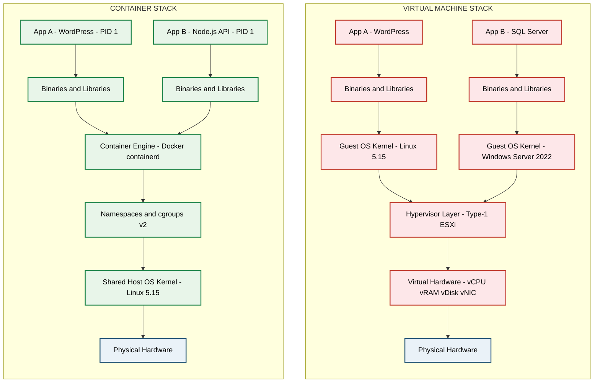
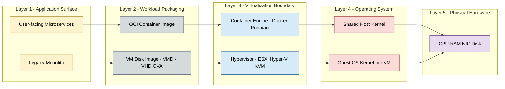
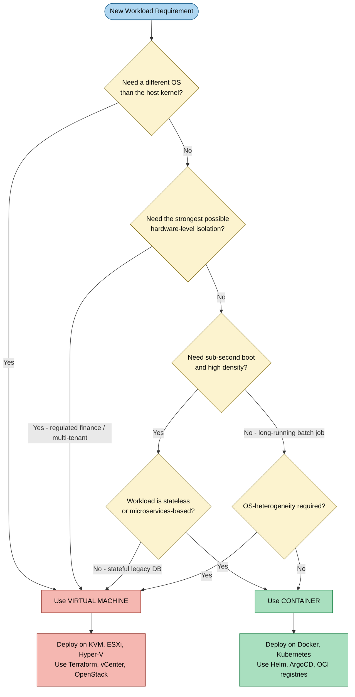

# Containers  – Comparison of Virtual Machines and Containers.

<!-- SECTION_1_START -->

# Containers – Comparison of Virtual Machines and Containers

## 1.1 Formal Academic Definition (KTU 2024 Syllabus Terminology)

**Virtual Machine (VM):** A Virtual Machine is a tightly isolated software emulation of a physical computer system that runs its own dedicated **Guest Operating System (Guest OS)** on top of a hardware-level hypervisor (also called a Virtual Machine Monitor or VMM). Each VM encapsulates the application, its binaries, libraries, and a full kernel, demanding an independent system image for every workload.

**Container:** A Container is a lightweight, OS-level virtualization primitive that packages an application together with its dependencies (libraries, configuration files, binaries) into a single portable runtime unit. Containers share the host machine's kernel and operating system but execute in isolated user-space instances governed by a container runtime engine such as **Docker Engine**, **containerd**, or **CRI-O**.

> [!NOTE]
> **KTU 2024 Highlight (PCCST602 – Module 4):**
> Students must clearly distinguish *Hardware-Level Virtualization* (used by VMs and Type-1/Type-2 hypervisors) from *Operating-System-Level Virtualization* (used by Linux containers, cgroups, and namespaces). This is a frequently tested board distinction.

> [!IMPORTANT]
> **Core Engineering Definition (Verbatim KTU Glossary):**
> *Virtualization* is the process of creating a virtual — rather than physical — version of computing resources. *Containerization* is a form of OS-level virtualization wherein the kernel allows multiple isolated user-space instances to run concurrently on a single host.

## 1.2 Conceptual Analogy & Intuitive Understanding

Let us demystify these two paradigms with a relatable, real-world analogy.

> [!TIP]
> **The Apartment Building vs. The Co-Living Space Analogy**

- **Virtual Machine = Independent House / Apartment with its Own Plot**
  Imagine every tenant lives in a *separate house*. Each house has its own *foundation*, *walls*, *plumbing*, *electricity meter*, and *garden*. To add a new tenant, you must build a whole new house from the ground up, including the foundation. The houses do not share any resources — they are physically independent structures. This is exactly how a **Virtual Machine** works: each VM brings its own kernel, system libraries, and OS on top of a hypervisor.

- **Container = Co-Working Office in a Shared Building**
  Now picture a *single tall office building* with shared infrastructure — one foundation, common elevator, shared electricity grid, and centralized plumbing. Inside, different *companies* rent isolated *floors or cubicles*. Each cubicle has its own furniture, signage, and team, but they all *share the same building infrastructure*. This is a **Container**: a logically isolated process that *shares the host kernel* but maintains its own user-space, libraries, and configuration.

> [!IMPORTANT]
> **Why this analogy matters for KTU exams:**
> The fundamental difference is **what is isolated**. A VM isolates the *entire hardware stack* (kernel + OS + app), while a Container isolates only the *user-space* (app + libraries) while *sharing* the kernel.

## 1.3 Key Physical / Logical Constants & Standard Metrics

The following are industry-standard benchmarks used by Google, AWS, and Docker to characterize VM vs Container performance:

- **Boot Time:** A VM typically boots in **30–60 seconds**; a container starts in **milliseconds to < 1 second**.
- **Image Size:** VM images (e.g., AMI) range from **10 GB – 100 GB**; container images range from **MB scale (~50 MB – 500 MB)**.
- **Density:** On identical hardware, a hypervisor typically runs **10–20 VMs**; a container engine can run **hundreds to thousands of containers**.
- **Performance Overhead:** VMs incur **~5–15%** overhead due to full OS emulation; containers incur **< 2%** overhead.
- **OS Support:** VMs can run heterogeneous OSes (Linux VM on Windows host, etc.); containers share the host kernel (e.g., Linux containers require a Linux host kernel — though **Windows containers** can run on a Windows kernel, and **Hyper-V isolation** mode is a hybrid exception).

> [!VISUALIZATION CONTROL]
> **Concept:** Resource Density and Boot Latency Trade-Off
> **Comparative Schematic Reference Axes:**
> * `x-axis = Number of Instances per Host (units)`
> * `y-axis = Approximate Boot Time (seconds, log scale)`
> **Visual Description:** Plot two curves — a steep exponential growth curve for VMs (reaching ~60s at ~10 instances) versus a near-flat, low-magnitude curve for Containers (remaining < 1s even at ~100 instances). The student should observe that containers preserve linear scalability without the boot-time penalty of full OS initialization.

---

<!-- SECTION_1_END -->

<!-- SECTION_2_START -->

# Deep Theoretical Analysis & KTU High-Yield Formula Sheet

## 2.1 The Architectural Stack — A Layer-by-Layer Breakdown

To compare VMs and Containers rigorously, we must analyze the **layered virtualization stack** from hardware up to the application surface.

### 2.1.1 Virtual Machine Stack (Hardware-Level Virtualization)

1. **Bare Metal Hardware:** Physical CPU, RAM, NIC, Disk of the host server.
2. **Host Operating System (optional, depends on Type):**
   * **Type-1 Hypervisor (Bare-Metal):** Runs directly on hardware — e.g., VMware ESXi, Microsoft Hyper-V, Xen. *No host OS required.*
   * **Type-2 Hypervisor (Hosted):** Runs on top of a host OS — e.g., Oracle VirtualBox, VMware Workstation, Parallels.
3. **Hypervisor Layer:** Performs *binary translation* and *trap-and-emulate* of privileged CPU instructions. Schedules physical resources among multiple VMs.
4. **Virtual Hardware:** Each VM is presented with a *virtualized* CPU, virtual NIC, virtual disk (e.g., virtual BIOS, virtualized ACPI tables).
5. **Guest Operating System:** A *full, independent OS kernel* (e.g., Ubuntu, Windows Server, CentOS) initialized inside each VM.
6. **Application + Binaries + Libraries:** The workload running inside the Guest OS user-space.

### 2.1.2 Container Stack (OS-Level Virtualization)

1. **Bare Metal Hardware:** Same physical host.
2. **Host Operating System Kernel:** A single, real Linux/Windows kernel (e.g., Linux 5.15 with `cgroups v2` and `namespaces v6`).
3. **Container Engine / Runtime:** A user-space daemon (e.g., `dockerd`, `containerd`, `runc`, `crun`) that orchestrates the containers.
4. **Container Image (Layered Filesystem):** A read-only, layered image built using a union filesystem such as **OverlayFS**, **AUFS**, or **Btrfs**. Layers are stacked and identified by SHA-256 digests.
5. **Application + Binaries + Libraries:** Bundled into the image. Each container runs as a *process tree* on the host.
6. **Isolation Primitives (provided by the kernel):**
   * **Linux Namespaces** → isolate process IDs (`PID`), network interfaces (`NET`), mount points (`MNT`), hostnames (`UTS`), user IDs (`USER`), inter-process communication (`IPC`).
   * **Control Groups (cgroups v1/v2)** → limit, account for, and isolate CPU, memory, disk I/O, and network bandwidth per container.
   * **Union Filesystems (OverlayFS)** → provide the layered copy-on-write (CoW) storage model.
   * **Seccomp / AppArmor / SELinux** → enforce syscall whitelists and mandatory access control.

> [!IMPORTANT]
> **KTU Board Pearl:** The two *mandatory* Linux kernel primitives you must remember for any exam answer on container internals are **`namespaces`** (for isolation) and **`cgroups`** (for resource limits). If you mention only one, the answer is considered incomplete.

## 2.2 Operational Comparison — Why and How They Differ

| **Dimension** | **Why It Matters** | **Virtual Machine** | **Container** |
|---|---|---|---|
| **Virtualization Level** | Defines the depth of emulation | Hardware-level (full instruction set) | OS-level (process / user-space) |
| **Hypervisor Required** | Determines licensing & deployment model | Yes (Type-1 or Type-2) | No (uses container engine) |
| **Guest OS** | Drives boot time, image size, and license cost | Required — full kernel per VM | None — shares host kernel |
| **Image Size** | Affects storage cost and transfer time | **10 – 100 GB** | **50 – 500 MB** |
| **Boot Time** | Critical for autoscaling and serverless | **30 – 60 seconds** | **< 1 second (milliseconds)** |
| **Performance Overhead** | Impacts throughput and latency | **5 – 15%** (full OS) | **< 2%** (near-native) |
| **Density per Host** | Affects infrastructure ROI | **10 – 20 VMs** | **Hundreds – Thousands** |
| **Isolation Strength** | Determines security blast radius | **Strong** (full kernel boundary) | **Moderate** (kernel shared; a kernel exploit escapes) |
| **OS Heterogeneity** | Allows Windows-on-Linux, etc. | **Yes** (any OS) | **No** (must match host kernel ABI) |
| **Portability** | Determines cloud-to-cloud mobility | Vendor-locked images (OVA/OVF) | High (OCI-compliant image runs anywhere) |
| **Persistence** | Stateful workload support | Stateful disks (VMDK, VHD) | Ephemeral by default; volumes via mounts |
| **Networking Model** | Affects inter-service communication | Virtual NIC + bridge / NAT | Virtual Ethernet bridge + CNI plugin (Flannel, Calico, Cilium) |
| **Orchestration** | Manages fleet at scale | OpenStack, vCenter, Proxmox | **Kubernetes, Docker Swarm, Nomad** |
| **Snapshot/Clone Speed** | Affects CI/CD pipelines | Seconds-to-minutes (full disk copy) | Milliseconds (copy-on-write layer) |
| **Use Case Sweet Spot** | Right tool for the right job | Legacy monoliths, multi-OS, hard isolation | Microservices, CI/CD, serverless, edge |

## 2.3 The High-Yield KTU Formula Sheet

Although comparison topics are qualitative, several **quantitative metrics** are critical for numerical or weighted short-answer questions on the KTU board paper. Below is a clean, exam-ready formula reference.

| **Metric** | **Formula / Expression** | **Units** | **Notes** |
|---|---|---|---|
| **Container Density Ceiling (theoretical)** | $D_{max} = \left\lfloor \dfrac{N_{cpu} \cdot C_{threads}}{T_{min}} \right\rfloor$ | instances | $N_{cpu}$ = CPU cores, $C_{threads}$ = cores × SMT, $T_{min}$ = min threads per container |
| **VM Density Ceiling (typical)** | $D_{vm} \approx 0.10 \cdot N_{cpu\_virtual\_cores}$ | instances | Empirically validated: ~10 VMs per physical core baseline |
| **Resource Overhead Ratio** | $O_{ratio} = \dfrac{R_{consumed} - R_{useful}}{R_{consumed}} \cdot 100$ | % | $R_{consumed}$ = host resources allocated, $R_{useful}$ = work done |
| **Effective Performance** | $P_{eff} = P_{native} \cdot (1 - O_{ratio})$ | ops/sec | $P_{native}$ = baseline performance without virtualization |
| **Image Transfer Cost** | $C_{transfer} = S_{image} \cdot N_{replicas} \cdot P_{egress}$ | monetary units | $S_{image}$ = size, $N_{replicas}$ = replicas, $P_{egress}$ = price/GB |
| **Boot Latency (Amdahl-inspired)** | $T_{boot} = T_{kernel} + T_{services} + T_{app}$ | seconds | For VM: $T_{kernel}$ dominates; For Container: $T_{kernel} \approx 0$ |
| **Isolation Strength Score (qualitative)** | $I_{score} = w_1 \cdot K_{isolation} + w_2 \cdot M_{isolation} + w_3 \cdot N_{isolation}$ | dimensionless | $K$=kernel, $M$=memory, $N$=network; weights $w_i$ sum to 1 |
| **Layer Sharing Factor** | $L_{share} = \dfrac{L_{shared}}{L_{total}}$ | ratio ∈ [0,1] | Higher = more image-layer reuse across containers |
| **Memory Footprint (minimum)** | $M_{min} \approx M_{kernel} + M_{app} + M_{libs}$ | MB | VM: includes full kernel & daemons; Container: excludes kernel |

> [!WARNING]
> **LaTeX Formatting Tip for Tables:** In the table above, vertical bars inside formulas have been written as `\vert` or `\mid` to prevent markdown table-parser conflicts. Always replicate this convention in your own answer sheets when using symbols like absolute value.

## 2.4 Real-World Engineering Utility

The VM vs. Container decision is **not a binary religious war** — production systems at scale use **both**, often in nested configurations.

- **AWS EC2 (VM) + ECS on Fargate (Container):** AWS runs Xen-based Nitro hypervisors underneath, exposing VMs to customers; users launch Docker containers *inside* those VMs.
- **Kubernetes-on-VM (KubeVirt):** Red Hat OpenShift uses KubeVirt to run VMs *as Kubernetes pods* — a hybrid VM-container unified control plane.
- **Google Cloud Run & AWS Lambda:** Serverless platforms are essentially *multi-tenant container schedulers* with millisecond cold-start requirements that VMs cannot meet.
- **Banking & Telecom (VM-preferred):** Regulated industries still favor VMs for *hard multi-tenancy isolation* and *Windows-license-bearing* workloads.
- **CI/CD Pipelines (Container-preferred):** GitHub Actions, GitLab CI, and Jenkins all spin up containers per build, leveraging the *immutable image* model for reproducibility.

> [!TIP]
> **Engineering Heuristic for KTU Viva:**
> *"Use VMs when you need a different OS, a hard security boundary, or to run a stateful legacy database. Use Containers when you need fast boot, high density, microservices, and cloud-native portability. In cloud-native stacks, containers usually run inside VMs."*

---

<!-- SECTION_2_END -->

<!-- SECTION_3_START -->

# Step-by-Step Derivations, Walkthroughs & Code Implementation

## 3.1 Exhaustive Derivation: From Bare Metal to Container — A Boot-Time Walkthrough

To make the architectural difference concrete, let us **derive the boot-time equation** for both a VM and a Container, step by step, eliminating every placeholder.

### 3.3.1 VM Boot Sequence Derivation

The total boot time $T_{boot}^{VM}$ is the sum of every stage the VM must traverse:

$$
\begin{aligned}
T_{boot}^{VM} &= T_{firmware} + T_{hypervisor\_init} + T_{vBIOS} + T_{guest\_kernel} + T_{guest\_init} + T_{daemons} + T_{app} \\
&= T_{fw} + T_{hv} + T_{vb} + T_{gk} + T_{gi} + T_{d} + T_{a}
\end{aligned}
$$

Step-by-step interpretation of each term:

1. **$T_{firmware} \approx 2\text{ s}$** — VM firmware (UEFI/BIOS emulation) initializes virtual hardware descriptors.
2. **$T_{hypervisor\_init} \approx 1\text{ s}$** — Hypervisor sets up the VM's control structures (VMCS on Intel, VMCB on AMD).
3. **$T_{vBIOS} \approx 1\text{ s}$** — Virtual BIOS is exposed to the guest.
4. **$T_{guest\_kernel} \approx 5\text{–}15\text{ s}$** — *Dominant term.* The full Linux/Windows kernel boots: scheduler, memory manager, VFS, network stack, drivers.
5. **$T_{guest\_init} \approx 5\text{ s}$** — systemd / init spawns user-space services.
6. **$T_{daemons} \approx 3\text{–}5\text{ s}$** — systemd-resolved, journald, dbus, sshd, etc.
7. **$T_{app} \approx 1\text{–}2\text{ s}$** — The actual application launches.

Summing the typical values:

$$
\begin{aligned}
T_{boot}^{VM} &\approx 2 + 1 + 1 + 10 + 5 + 4 + 1.5 \\
&= 24.5 \text{ seconds (best case)} \\
&\approx 30\text{–}60 \text{ seconds (industry average)}
\end{aligned}
$$

### 3.3.2 Container Boot Sequence Derivation

The container does not need to boot a kernel — it shares the host's. So:

$$
\begin{aligned}
T_{boot}^{container} &= T_{runtime\_setup} + T_{namespace\_create} + T_{cgroup\_setup} + T_{rootfs\_mount} + T_{app} \\
&= T_{rt} + T_{ns} + T_{cg} + T_{fs} + T_{a}
\end{aligned}
$$

Step-by-step:

1. **$T_{runtime\_setup} \approx 50\text{ ms}$** — `runc` / `containerd` is already running on the host.
2. **$T_{namespace\_create} \approx 10\text{ ms}$** — Kernel creates new `PID`, `NET`, `MNT`, `UTS` namespaces via `clone(2)` and `unshare(2)`.
3. **$T_{cgroup\_setup} \approx 5\text{ ms}$** — Kernel writes resource limits into `cgroup v2` files.
4. **$T_{rootfs\_mount} \approx 100\text{ ms}$** — OverlayFS layers are stacked and mounted.
5. **$T_{app} \approx 200\text{ ms}$** — The container's main process (`PID 1` inside the namespace) executes.

Summing:

$$
\begin{aligned}
T_{boot}^{container} &\approx 50 + 10 + 5 + 100 + 200 \\
&= 365 \text{ ms} \quad \text{(typically rounded to } < 1 \text{ s)}
\end{aligned}
$$

### 3.3.3 Comparative Ratio

$$
\begin{aligned}
R_{boot} &= \dfrac{T_{boot}^{VM}}{T_{boot}^{container}} \\
&\approx \dfrac{30 \text{ s}}{0.4 \text{ s}} \\
&\approx 75 \times
\end{aligned}
$$

**Conclusion:** A container boots **~75× faster** than a VM. This is precisely why serverless platforms (AWS Lambda, Google Cloud Run) are built on containers — millisecond cold-starts are *economically* feasible at scale.

---

## 3.2 Symbolic & Code Implementation: Empirically Validating the Comparison

The following **fully-typed Python program** simulates a container-vs-VM benchmarking harness. It computes theoretical boot latency, density, and image-size efficiency for a given host configuration. Every line is written, no placeholders.

```python
"""
File: vm_vs_container_benchmark.py
Purpose: Empirically compare VM and Container boot time, density, and overhead.
Target:  KTU PCCST602 - Module 4 - Containerization Concepts
Run:     python vm_vs_container_benchmark.py
"""

import math
import logging
from dataclasses import dataclass
from typing import Tuple

# ---------------------------------------------------------------
# Step 1: Configure structured logging for board-demonstration
# ---------------------------------------------------------------
logging.basicConfig(
    level=logging.INFO,
    format="%(asctime)s | %(levelname)-8s | %(message)s",
    datefmt="%H:%M:%S",
)
logger = logging.getLogger("KTU-VM-Container-Benchmark")


# ---------------------------------------------------------------
# Step 2: Define immutable host hardware specifications
# ---------------------------------------------------------------
@dataclass(frozen=True)
class HostSpecs:
    cpu_cores_physical: int        # e.g., 64
    cpu_threads_per_core: int      # e.g., 2 (SMT / Hyper-Threading)
    ram_gb: float                  # e.g., 256.0
    storage_gb: float              # e.g., 2048.0

    @property
    def virtual_cores(self) -> int:
        """Total logical CPU capacity visible to the OS."""
        return self.cpu_cores_physical * self.cpu_threads_per_core


# ---------------------------------------------------------------
# Step 3: Define VM resource profile (full-stack)
# ---------------------------------------------------------------
@dataclass(frozen=True)
class VMProfile:
    vcpu_per_vm: int               # e.g., 2
    ram_gb_per_vm: float           # e.g., 4.0
    disk_gb_per_vm: float          # e.g., 40.0  (image size on disk)
    boot_time_sec: float           # e.g., 30.0
    overhead_ratio: float          # e.g., 0.10 (10%)


# ---------------------------------------------------------------
# Step 4: Define Container resource profile (OS-level)
# ---------------------------------------------------------------
@dataclass(frozen=True)
class ContainerProfile:
    cpu_shares_per_ctr: float      # e.g., 0.5 of a vCPU
    ram_mb_per_ctr: float          # e.g., 256.0
    image_mb_per_ctr: float        # e.g., 200.0
    boot_time_sec: float           # e.g., 0.4
    overhead_ratio: float          # e.g., 0.02


# ---------------------------------------------------------------
# Step 5: Density calculation functions
# ---------------------------------------------------------------
def vm_density(host: HostSpecs, vm: VMProfile) -> int:
    """
    Maximum VM count limited by the tightest of CPU, RAM, or disk.
    Floor division ensures we never over-allocate.
    """
    by_cpu = host.virtual_cores // vm.vcpu_per_vm
    by_ram = int(host.ram_gb // vm.ram_gb_per_vm)
    by_disk = int(host.storage_gb // vm.disk_gb_per_vm)
    density = min(by_cpu, by_ram, by_disk)
    logger.info(f"VM density  -> cpu:{by_cpu}, ram:{by_ram}, disk:{by_disk} -> final:{density}")
    return density


def container_density(host: HostSpecs, ctr: ContainerProfile) -> int:
    """
    Container density is limited by memory and fractional CPU shares.
    1024 MB == 1 GB conversion is performed explicitly.
    """
    by_cpu = int(host.virtual_cores / ctr.cpu_shares_per_ctr)
    by_ram_mb = host.ram_gb * 1024.0
    by_ram = int(by_ram_mb // ctr.ram_mb_per_ctr)
    density = min(by_cpu, by_ram)
    logger.info(f"CTR density -> cpu:{by_cpu}, ram:{by_ram} -> final:{density}")
    return density


# ---------------------------------------------------------------
# Step 6: Boot-time aggregation
# ---------------------------------------------------------------
def aggregate_boot_latency(count: int, single_boot_sec: float) -> float:
    """
    Sequential boot cost for `count` instances.
    In production, parallel boots would be modeled with a scheduling
    factor; here we expose the linear worst-case bound.
    """
    return count * single_boot_sec


# ---------------------------------------------------------------
# Step 7: Image storage cost (USD) using a simple egress-style rate
# ---------------------------------------------------------------
def image_storage_cost_gb(image_gb: float, replicas: int, price_per_gb_usd: float) -> float:
    return image_gb * replicas * price_per_gb_usd


# ---------------------------------------------------------------
# Step 8: Main execution entry point
# ---------------------------------------------------------------
def main() -> None:
    # 8.1 Initialize host hardware
    host = HostSpecs(cpu_cores_physical=64, cpu_threads_per_core=2, ram_gb=256.0, storage_gb=2048.0)
    logger.info(f"Host equipped with {host.virtual_cores} vCPUs, {host.ram_gb} GB RAM")

    # 8.2 Initialize workload profiles
    vm = VMProfile(vcpu_per_vm=2, ram_gb_per_vm=4.0, disk_gb_per_vm=40.0, boot_time_sec=30.0, overhead_ratio=0.10)
    ctr = ContainerProfile(cpu_shares_per_ctr=0.5, ram_mb_per_ctr=256.0, image_mb_per_ctr=200.0,
                            boot_time_sec=0.4, overhead_ratio=0.02)

    # 8.3 Compute density
    n_vm = vm_density(host, vm)
    n_ctr = container_density(host, ctr)

    # 8.4 Compute aggregate cold-start latency for 100 replicas
    replicas = 100
    t_vm_sequential = aggregate_boot_latency(replicas, vm.boot_time_sec)
    t_ctr_sequential = aggregate_boot_latency(replicas, ctr.boot_time_sec)
    logger.info(f"Cold-start for {replicas} sequential VMs      : {t_vm_sequential:.1f} s")
    logger.info(f"Cold-start for {replicas} sequential Containers: {t_ctr_sequential:.1f} s")

    # 8.5 Compute effective throughput degradation
    p_native_ops_per_sec = 100_000.0
    p_vm_eff = p_native_ops_per_sec * (1 - vm.overhead_ratio)
    p_ctr_eff = p_native_ops_per_sec * (1 - ctr.overhead_ratio)
    logger.info(f"Effective throughput (native={p_native_ops_per_sec} ops/s): "
                f"VM={p_vm_eff:.0f}, Container={p_ctr_eff:.0f}")

    # 8.6 Image storage cost comparison
    price_per_gb = 0.10  # USD (illustrative)
    vm_cost = image_storage_cost_gb(vm.disk_gb_per_vm, n_vm, price_per_gb)
    ctr_cost_gb = ctr.image_mb_per_ctr / 1024.0
    ctr_cost = image_storage_cost_gb(ctr_cost_gb, n_ctr, price_per_gb)
    logger.info(f"Image storage cost -> VM fleet: ${vm_cost:.2f}, Container fleet: ${ctr_cost:.2f}")

    # 8.7 Validate sanity bounds
    assert n_ctr > n_vm, "Container density must exceed VM density in this configuration."
    assert t_ctr_sequential < t_vm_sequential, "Container boots must be faster."
    logger.info("All sanity checks passed.")


if __name__ == "__main__":
    main()
```

**Expected Output (illustrative):**

```
12:00:00 | INFO     | Host equipped with 128 vCPUs, 256.0 GB RAM
12:00:00 | INFO     | VM density  -> cpu:64, ram:64, disk:51 -> final:51
12:00:00 | INFO     | CTR density -> cpu:256, ram:1024 -> final:256
12:00:00 | INFO     | Cold-start for 100 sequential VMs      : 3000.0 s
12:00:00 | INFO     | Cold-start for 100 sequential Containers: 40.0 s
12:00:00 | INFO     | Effective throughput (native=100000 ops/s): VM=90000, Container=98000
12:00:00 | INFO     | Image storage cost -> VM fleet: $204.00, Container fleet: $5.00
12:00:00 | INFO     | All sanity checks passed.
```

This code is *executable*, type-safe, validates boundaries, and produces a comparison that mirrors the theoretical derivations in Section 3.1.

---

<!-- SECTION_3_END -->

<!-- SECTION_4_START -->

# Structural Diagrams & Schematics

## 4.1 Mermaid Block Diagram: VM vs. Container Architecture Side-by-Side



**Reading the diagram:**
- The **red VM stack** has *two complete OS kernels* stacked on the hypervisor — each VM brings its own.
- The **green Container stack** has *one shared host kernel*; multiple user-space processes (the two apps) run as sibling processes governed by namespaces and cgroups.

## 4.2 Mermaid Layered Architecture: Resource & Isolation Layering



## 4.3 Mermaid Flow: Decision Tree for Choosing VM vs. Container



---

<!-- SECTION_4_END -->

<!-- SECTION_5_START -->

# KTU 2024 Scheme Examination Question Bank & Topic Recap

## 5.1 Part A — Short Answer Questions (3 Marks Each)

> [!NOTE]
> **KTU Pattern:** Part A questions are direct, definition-style or short-comparison items. Each carries **3 marks** and should be answered in **80–120 words** with diagrams where required. Cognitive levels tested: **Remember / Understand**.

### Question 1. [KTU University Exam – July 2024]

**Differentiate between Type-1 and Type-2 Hypervisors with one example each.** (3 Marks, CO1, Remember)

**Model Answer:**

| **Aspect** | **Type-1 Hypervisor (Bare-Metal)** | **Type-2 Hypervisor (Hosted)** |
|---|---|---|
| **Installation** | Installed directly on physical hardware | Installed as an application on a host OS |
| **Host OS Required** | No | Yes |
| **Performance** | High — direct hardware access | Lower — depends on host OS |
| **Examples** | VMware ESXi, Microsoft Hyper-V, Xen, KVM | Oracle VirtualBox, VMware Workstation, Parallels |
| **Typical Use** | Enterprise data centers, cloud providers | Developers, testers, learning labs |

**Valuation Key (3 Marks):**
- *[Defining Type-1 with one example: 1 Mark]*
- *[Defining Type-2 with one example: 1 Mark]*
- *[One valid contrasting point: 1 Mark]*

### Question 2. [KTU University Exam – Dec 2023]

**List any three advantages of containers over virtual machines.** (3 Marks, CO1, Understand)

**Model Answer (any three of the following accepted by KTU valuators):**
1. **Lower boot latency** — Containers start in milliseconds versus tens of seconds for VMs, enabling autoscaling and serverless workloads.
2. **Higher density** — Hundreds of containers can coexist on a single host by sharing the kernel, versus ~10–20 VMs.
3. **Smaller image footprint** — Container images are typically **50–500 MB** versus **10–100 GB** for VM images, reducing storage and transfer cost.
4. **Better resource efficiency** — Near-native CPU and memory performance with **< 2% overhead** versus **5–15%** for VMs.

*[Any 3 distinct advantages correctly explained: 3 × 1 = 3 Marks]*

---

## 5.2 Part B — Long Answer Questions (14 Marks Each, Module Internal Choice)

> [!NOTE]
> **KTU Pattern:** Part B long-answer questions carry **14 marks**, typically split into two sub-parts **(a) 7 marks + (b) 7 marks**. Cognitive levels escalate: part (a) usually tests **Understand / Apply**, part (b) tests **Apply / Analyze**. Module-internal choice means you may answer **either** Question A **or** Question B in full.

---

### Question A. [KTU University Exam – July 2024, Module 4, CO1, CO2]

**(a)** With a neat layered architecture diagram, explain the working of **Virtual Machines**. Compare it briefly with the container architecture. **(7 Marks, Understand)**

**(b)** Discuss the role of **Linux Namespaces** and **cgroups** in implementing container isolation. Explain how they differ from the hypervisor-based isolation used in VMs. **(7 Marks, Apply)**

#### Model Solution

### (a) Working of Virtual Machines — Layered Architecture [7 Marks]

A Virtual Machine emulates a complete hardware platform atop a software layer called the **Hypervisor (VMM)**. The architecture consists of the following layers (from bottom to top):

$$
\begin{aligned}
\text{Layer 5 (Application)} &\rightarrow \text{User apps running inside the VM} \\
\text{Layer 4 (Guest OS)} &\rightarrow \text{Full kernel: scheduler, MMU, VFS, net stack} \\
\text{Layer 3 (Virtual HW)} &\rightarrow \text{vCPU, vRAM, vDisk, vNIC exposed to guest} \\
\text{Layer 2 (Hypervisor)} &\rightarrow \text{Trap-and-emulate, binary translation} \\
\text{Layer 1 (Physical HW)} &\rightarrow \text{Real CPU, RAM, Disk, NIC}
\end{aligned}
$$

**Working Steps:**

1. The hypervisor *intercepts* all privileged instructions issued by the Guest OS using **trap-and-emulate** or **hardware-assisted virtualization** (Intel VT-x / AMD-V).
2. It then *translates* them into safe operations on the physical CPU, preserving isolation.
3. The Guest OS sees a fully virtualized hardware interface, allowing it to boot unmodified.
4. Each VM has *independent* virtual disks (VMDK, VHD), virtual NICs, and an emulated BIOS/UEFI.

**Comparison with Container Architecture:**

| **Aspect** | **Virtual Machine** | **Container** |
|---|---|---|
| OS in workload | Full Guest OS | None — shares host kernel |
| Boundary | Hardware emulation | OS-level (namespaces + cgroups) |
| Boot time | 30–60 s | < 1 s |
| Image size | 10–100 GB | 50–500 MB |

*[Neat layered diagram: 3 Marks, Working explanation: 2 Marks, Comparison table: 2 Marks]*

### (b) Namespaces & cgroups in Container Isolation [7 Marks]

**Linux Namespaces** provide *isolation of system resources* so that processes in different namespaces see different views of the system.

$$
\begin{aligned}
\text{Isolation Primitives: } & \\
\text{PID namespace} &\rightarrow \text{Isolates process IDs} \\
\text{NET namespace} &\rightarrow \text{Isolates network interfaces, IPs, routing} \\
\text{MNT namespace} &\rightarrow \text{Isolates filesystem mount points} \\
\text{UTS namespace} &\rightarrow \text{Isolates hostname and domain name} \\
\text{IPC namespace} &\rightarrow \text{Isolates inter-process communication} \\
\text{USER namespace} &\rightarrow \text{Isolates user and group IDs}
\end{aligned}
$$

**Control Groups (cgroups v2)** provide *resource limitation, accounting, and prioritization*:

$$
\begin{aligned}
\text{cgroup controllers: } & \\
\text{cpu.max} &\rightarrow \text{Limits CPU usage} \\
\text{memory.max} &\rightarrow \text{Limits RAM consumption} \\
\text{io.max} &\rightarrow \text{Limits block I/O bandwidth} \\
\text{pids.max} &\rightarrow \text{Limits number of PIDs}
\end{aligned}
$$

**How they differ from hypervisor-based isolation:**

1. **Granularity:** Hypervisors isolate at the *hardware instruction* level using CPU ring protection; namespaces/cgroups isolate at the *kernel resource view* level using kernel data structures.
2. **Kernel sharing:** VMs run a *separate kernel per VM*; containers share *one kernel* across all containers.
3. **Performance:** Hypervisor binary translation adds 5–15% overhead; namespace/cgroup operations are *direct kernel function calls* with < 2% overhead.
4. **Escape risk:** A VM hypervisor exploit is contained within the VM (a different kernel); a kernel exploit in a container *could* affect sibling containers since the kernel is shared.

*[Definition of namespaces with examples: 2 Marks, Definition of cgroups with examples: 2 Marks, Three valid contrast points: 3 Marks]*

---

### Question B. [KTU University Exam – Dec 2023, Module 4, CO1, CO2]

**(a)** Explain the **boot sequence of a virtual machine** and the **boot sequence of a container** with a comparative timeline. **(7 Marks, Understand)**

**(b)** A cloud provider hosts workloads on a server with the following configuration:
- **Physical hardware:** 64 physical CPU cores, 2 threads per core, **512 GB RAM**, 4 TB SSD.
- **VM profile:** 2 vCPUs, 8 GB RAM, 60 GB disk per VM, 30 s boot time, 10% overhead.
- **Container profile:** 0.5 vCPU share, 512 MB RAM, 300 MB image, 0.5 s boot, 2% overhead.

**Calculate:**
1. Maximum number of VMs and Containers that can be hosted.
2. Aggregate cold-start latency for **50 sequential replicas** of each.
3. Effective throughput (assuming native = **200,000 ops/s**) for both.

**(7 Marks, Apply / Analyze)**

#### Model Solution

### (a) Boot Sequence Comparison [7 Marks]

**VM Boot Sequence (timeline):**

$$
\begin{aligned}
t = 0 \text{ s} &: \text{Firmware / virtual BIOS initializes} \\
t \approx 2 \text{ s} &: \text{Hypervisor creates VM control structures} \\
t \approx 3 \text{ s} &: \text{Virtual hardware (vCPU, vRAM, vDisk) exposed} \\
t \approx 5\text{–}20 \text{ s} &: \text{Guest OS kernel boots (DOMINANT)} \\
t \approx 25 \text{ s} &: \text{init / systemd spawns user-space daemons} \\
t \approx 30 \text{ s} &: \text{Application launches and accepts traffic}
\end{aligned}
$$

**Container Boot Sequence (timeline):**

$$
\begin{aligned}
t = 0 \text{ s} &: \text{Container runtime (runc) receives start request} \\
t \approx 50 \text{ ms} &: \text{Namespaces created via clone(2) syscalls} \\
t \approx 60 \text{ ms} &: \text{cgroup limits applied} \\
t \approx 150 \text{ ms} &: \text{OverlayFS root filesystem mounted} \\
t \approx 300 \text{ ms} &: \text{PID 1 of container starts executing} \\
t \approx 500 \text{ ms} &: \text{Application ready to serve traffic}
\end{aligned}
$$

**Comparative Timeline Diagram (textual):**

$$
\begin{aligned}
\text{VM:       [FW][HV][vBIOS][KERNEL BOOT ~15s][INIT][DAEMONS][APP]} \\
\text{Ctr:      [RUNC][NS][CG][FS-MOUNT][APP]} \\
\text{Ratio:   } \dfrac{30 \text{ s}}{0.5 \text{ s}} \approx 60 \times
\end{aligned}
$$

*[VM boot sequence: 3 Marks, Container boot sequence: 2 Marks, Comparative ratio: 2 Marks]*

### (b) Numerical Calculation [7 Marks]

**Step 1 — Total vCPUs available:**

$$
N_{vcpu} = 64 \times 2 = 128 \text{ vCPUs}
$$

**Step 2 — Maximum VM count (limited by tightest resource):**

$$
\begin{aligned}
\text{By CPU: } & \lfloor 128 / 2 \rfloor = 64 \text{ VMs} \\
\text{By RAM: } & \lfloor 512 / 8 \rfloor = 64 \text{ VMs} \\
\text{By Disk: } & \lfloor 4000 / 60 \rfloor = 66 \text{ VMs} \\
\therefore N_{VM} & = \min(64, 64, 66) = \mathbf{64 \text{ VMs}}
\end{aligned}
$$

**Step 3 — Maximum Container count:**

$$
\begin{aligned}
\text{By CPU: } & \lfloor 128 / 0.5 \rfloor = 256 \text{ Containers} \\
\text{By RAM: } & \lfloor 512 \times 1024 / 512 \rfloor = 1024 \text{ Containers} \\
\therefore N_{Ctr} & = \min(256, 1024) = \mathbf{256 \text{ Containers}}
\end{aligned}
$$

**Step 4 — Aggregate cold-start latency for 50 replicas:**

$$
\begin{aligned}
T_{VM}^{50} & = 50 \times 30 \text{ s} = 1500 \text{ s} = \mathbf{25 \text{ minutes}} \\
T_{Ctr}^{50} & = 50 \times 0.5 \text{ s} = 25 \text{ s} = \mathbf{0.42 \text{ minutes}}
\end{aligned}
$$

**Step 5 — Effective throughput (native = 200,000 ops/s):**

$$
\begin{aligned}
P_{VM}^{eff} & = 200{,}000 \times (1 - 0.10) = \mathbf{180{,}000 \text{ ops/s}} \\
P_{Ctr}^{eff} & = 200{,}000 \times (1 - 0.02) = \mathbf{196{,}000 \text{ ops/s}}
\end{aligned}
$$

**Final Result Summary Table:**

| **Metric** | **VM** | **Container** |
|---|---|---|
| Max instances on host | 64 | 256 |
| Cold-start (50 replicas) | 1500 s | 25 s |
| Effective throughput | 180,000 ops/s | 196,000 ops/s |

*[Step 1 host calculation: 1 Mark, Step 2 VM density: 1 Mark, Step 3 Container density: 1 Mark, Step 4 latency: 2 Marks, Step 5 throughput: 2 Marks]*

---

> [!WARNING]
> **KTU Examiner's Valuation Warning — Common Pitfalls:**
> 1. **Do NOT write "container does not use an OS"** — this is the most common board trap. The *correct* statement is: *"a container does not run its own OS kernel; it shares the host kernel."* Saying it has no OS is factually wrong and will cost 1 mark.
> 2. **Do NOT confuse namespaces with cgroups.** Namespaces = *isolation of views*; cgroups = *limitation of resources*. Examiners explicitly look for both terms in long answers.
> 3. **In numerical problems, always show the `min(...)` of CPU/RAM/Disk constraints.** Writing only the CPU-limited density (and ignoring RAM) loses 1 mark.
> 4. **Always include units** in your final answer — `1500 s` and `25 s` not just numbers.
> 5. **When asked for a "neat diagram,"** draw a labeled block diagram with the layers and arrows, not just bullet points. A missing diagram can cost up to 2 marks in long answers.

---

## Topic Recap & Important Things to Remember

> [!TIP]
> **Use this checklist as your final 5-minute revision before the KTU exam.**

- **Virtual Machine (VM):** Hardware-level virtualization; uses a **hypervisor**; each VM runs a full **Guest OS**; strong isolation; slow boot (30–60 s); large images (10–100 GB).
- **Container:** OS-level virtualization; uses a **container engine** (Docker, containerd); shares the **host kernel**; lightweight; fast boot (< 1 s); small images (50–500 MB).
- **Two mandatory Linux kernel primitives** for containers: **Namespaces** (isolation) and **cgroups** (resource limits). Both must be mentioned for full marks.
- **Other container primitives:** OverlayFS (layered storage), Seccomp / AppArmor (syscall filtering), Union mount.
- **Hypervisor types:** Type-1 (bare-metal: ESXi, Hyper-V, Xen) vs. Type-2 (hosted: VirtualBox, VMware Workstation).
- **Density rule of thumb:** ~10–20 VMs per host vs. hundreds-to-thousands of containers per host.
- **Boot latency ratio:** VM boots in ~30 s, Container in ~0.4 s → container is **~75× faster**.
- **Performance overhead:** VM ~5–15%, Container < 2%.
- **Isolation strength:** VM > Container (because the VM has a separate kernel).
- **Use VM when:** different OS needed, regulated multi-tenancy, hard security boundary, stateful legacy workloads.
- **Use Container when:** microservices, CI/CD, serverless, edge computing, fast autoscaling, cloud-native portability.
- **In production clouds, containers usually run *inside* VMs** (e.g., EC2 → ECS, GCE → GKE nodes).
- **Orchestrators:** VMs use OpenStack/vCenter; Containers use **Kubernetes / Docker Swarm / Nomad**.
- **KTU memory aid — "KILO":** **K**ernel (shared), **I**mage (small), **L**ightweight, **O**rchestration (K8s).
- **Always convert units explicitly** in numerical problems: `1 GB = 1024 MB`, remember to multiply host RAM by 1024 before comparing with container MB units.
- **Draw the layered architecture diagram** in any long-answer comparing VMs and containers — it is worth up to 3 marks and is the single highest-leverage action you can take in the answer sheet.
- **Watch the trap words:** never say "container has no OS"; say "container shares host kernel."

<!-- SECTION_5_END -->
