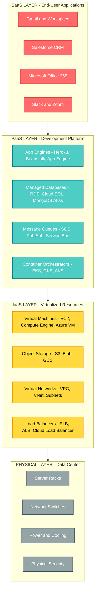
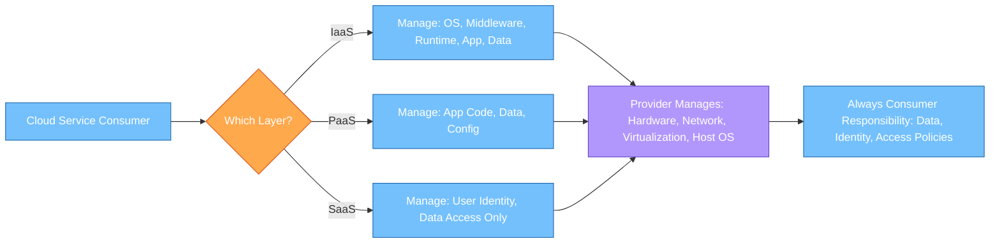
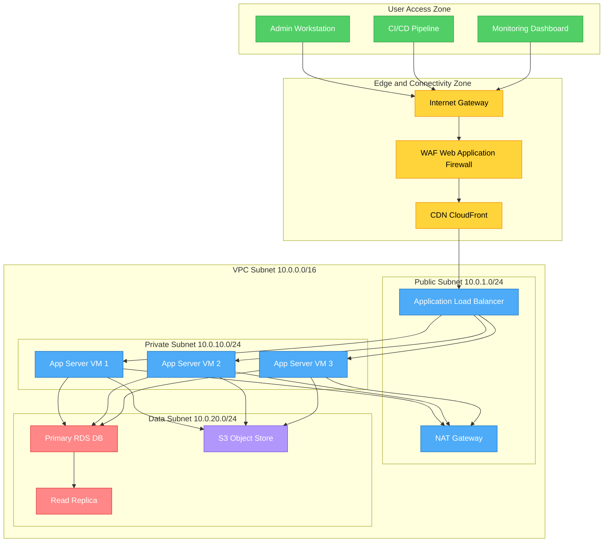
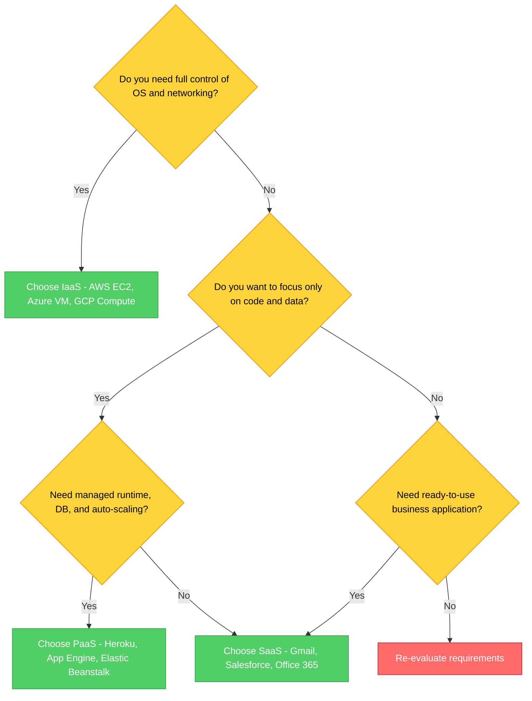

# Infrastructure-as-a-Service, Platform-as-a-Service, Software-as-a-Service.

<!-- SECTION_1_START -->
# Advanced Computing Systems — Module 4: Cloud Computing Service Models

## Core Technical Definition & Intuitive Overview

### 1.1 The Cloud Computing Service Stack — Formal Definition

**Cloud Computing** is a paradigm that enables ubiquitous, on-demand network access to a shared pool of configurable computing resources (networks, servers, storage, applications, and services) that can be rapidly provisioned and released with minimal management effort or service provider interaction, as defined by the **National Institute of Standards and Technology (NIST)** in **Special Publication 800-145**.

Within this paradigm, three foundational service models exist along a vertical abstraction stack:

> [!IMPORTANT]
> **KTU 2024 Syllabus Definition (PCCST602 — Module 4.1)**
> The cloud service models partition responsibility between the **Cloud Service Provider (CSP)** and the **Cloud Service Consumer (CSC)** along distinct horizontal abstraction layers. The three reference models evaluated in this module are **Infrastructure-as-a-Service (IaaS)**, **Platform-as-a-Service (PaaS)**, and **Software-as-a-Service (SaaS)** — collectively referred to as the **SPI Model** (SaaS, PaaS, IaaS).

---

### 1.2 Intuitive Analogy — The "Pizza as a Service" Model

To make these three service layers immediately intuitive, consider ordering a pizza:

| Abstraction Layer | Pizza Analogy | Cloud Translation |
|---|---|---|
| **On-Premise** | You buy flour, tomatoes, cheese, and cook at home | You own physical servers, racks, data centers |
| **IaaS** | You bring dough to a hot pizzeria oven | Provider gives you raw VMs, storage, network — you manage OS & apps |
| **PaaS** | You order a pizza with specific toppings from a kitchen | Provider gives you runtime, middleware, OS — you bring the code |
| **SaaS** | You get a fully delivered, ready-to-eat pizza | Provider delivers a fully working application (Gmail, Office 365) |

> [!NOTE]
> **Key Insight:** As you move **up** the stack (On-Prem → IaaS → PaaS → SaaS), the **consumer's responsibility decreases** while the **provider's responsibility increases**. Conversely, the **level of control, flexibility, and customization decreases** as you climb.

---

### 1.3 Layered Responsibility Architecture

The cloud service models are best understood as concentric layers of abstraction built atop physical data center infrastructure:

**Layer 0 — Physical Infrastructure:** Bare-metal servers, networking cables, power, cooling, and physical security located in regional data centers.

**Layer 1 — Infrastructure-as-a-Service (IaaS):** The virtualization layer exposing **virtualized compute (vCPUs)**, **block/object storage (volumes, buckets)**, and **virtual private networks (VPCs)** through programmatic APIs.

**Layer 2 — Platform-as-a-Service (PaaS):** The development platform layer providing **managed runtimes** (Node.js, Python, Java JVM), **databases** (PostgreSQL, MongoDB Atlas), **message queues**, and **auto-scaling orchestration**.

**Layer 3 — Software-as-a-Service (SaaS):** The end-user application layer delivering **horizontally scalable, multi-tenant web applications** such as Salesforce CRM, Google Workspace, Microsoft 365, and Slack.

> [!VISUALIZATION CONTROL]
> **Concept:** Cloud Service Abstraction Stack (Visualizing the Pizza Layers)
> **Conceptual Coordinate Input (Mental Map):**
> * X-Axis: Consumer Responsibility (low → high)
> * Y-Axis: Provider Responsibility (low → high)
> * Plot points: $SaaS(10, 90)$, $PaaS(40, 60)$, $IaaS(70, 30)$, $OnPrem(95, 5)$
> **Visual Description:** The student should imagine a diagonal line from bottom-left to top-right. SaaS sits closest to the provider's control pole, On-Premise sits at the consumer's control pole, with IaaS and PaaS in between. This visually represents the **inverse relationship** between abstraction and control.

---

### 1.4 Industrial Standard Metrics

> [!IMPORTANT]
> **Standardized Metrics to Remember (Frequently Tested):**
> * **Uptime SLA Tier:** **99.9% ("three nines")** = 8.77 hours downtime/year; **99.99% ("four nines")** = 52.6 minutes/year; **99.999% ("five nines")** = 5.26 minutes/year.
> * **Elasticity Coefficient:** Ratio of peak provisioned resources to baseline resources, typically **1.5× to 5×** in mature IaaS deployments.
> * **Multi-Tenancy Density:** SaaS applications commonly serve **10,000+ tenants per application instance** using logical isolation.

<!-- SECTION_1_END -->

<!-- SECTION_2_START -->
# Deep Theoretical Analysis & KTU High-Yield Formula Sheet

## 2.1 Infrastructure-as-a-Service (IaaS) — Deep Dive

### Definition and Core Capabilities

**IaaS** provides consumers with the capability to **provision processing, storage, networks, and other fundamental computing resources** where the consumer is able to deploy and run arbitrary software (operating systems and applications). The consumer does not manage or control the underlying physical infrastructure but has control over operating systems, storage, deployed applications, and possibly networking components (e.g., host firewalls).

### 2.1.1 IaaS Building Blocks

* **Compute Virtualization:** Provisioned through hypervisors (Type-1: VMware ESXi, KVM, Xen; Type-2: VirtualBox). Measured in **vCPU** units, typically **1 vCPU = 1 hyperthread of a physical core**.
* **Block Storage:** Persistent volumes attached to VMs. Performance measured in **IOPS (Input/Output Operations Per Second)** and **throughput (MB/s)**.
* **Object Storage:** S3-compatible buckets accessed over HTTP REST APIs. Measured in **GB stored, GET/PUT request counts, and egress bandwidth**.
* **Virtual Networking:** Software-defined networking (SDN) with **VPCs, subnets, security groups, NAT gateways, and load balancers**.
* **Identity & Access Management (IAM):** Federated identity, RBAC, and short-lived credentials via **STS tokens**.

### 2.1.2 IaaS Service Providers and Reference Products

| Provider | Compute Product | Storage Product | Network Product |
|---|---|---|---|
| **AWS** | EC2 | EBS, S3 | VPC, ELB |
| **Microsoft Azure** | Virtual Machines | Managed Disks, Blob | Virtual Network |
| **Google Cloud** | Compute Engine | Persistent Disk, Cloud Storage | VPC, Cloud Load Balancing |
| **IBM Cloud** | Virtual Servers | Block Storage, Object Storage | Virtual Private Cloud |

> [!NOTE]
> **Why IaaS Matters in Production:** Netflix, Airbnb, and Samsung SmartTV firmware distribution all run on AWS IaaS. IaaS is the **workhorse layer** for any company needing raw compute without capital expenditure on data centers.

---

## 2.2 Platform-as-a-Service (PaaS) — Deep Dive

### Definition and Core Capabilities

**PaaS** provides consumers with the capability to **deploy onto the cloud infrastructure consumer-created or acquired applications** created using programming languages, libraries, services, and tools supported by the provider. The consumer does not manage or control the underlying infrastructure including network, servers, operating systems, or storage — but has control over the deployed applications and possibly configuration settings for the application-hosting environment.

### 2.2.1 PaaS Sub-Categories

* **Public PaaS:** Google App Engine, AWS Elastic Beanstalk, Azure App Service, Heroku.
* **Private PaaS:** OpenShift (on-prem), Cloud Foundry, Pivotal.
* **Communications PaaS (CPaaS):** Twilio (SMS/Voice APIs), Vonage.
* **Database PaaS (DBaaS):** Amazon RDS, Google Cloud SQL, MongoDB Atlas, Amazon DynamoDB.
* **Integration PaaS (iPaaS):** MuleSoft, Informatica, Boomi.

### 2.2.2 The "12-Factor App" Compliance in PaaS

Modern PaaS platforms expect applications to follow the **12-Factor App methodology** (Heroku, 2011) for cloud-native deployment:

* **Codebase:** One codebase tracked in version control, many deploys.
* **Dependencies:** Explicitly declared and isolated.
* **Config:** Stored in environment variables, never in code.
* **Backing Services:** Treated as attached resources (databases, queues).
* **Build, Release, Run:** Strict separation of these stages.
* **Processes:** Stateless, share-nothing.
* **Port Binding:** Export services via port binding.
* **Concurrency:** Scale out via the process model.
* **Disposability:** Fast startup and graceful shutdown.
* **Dev/Prod Parity:** Keep development, staging, and production similar.
* **Logs:** Treat logs as event streams.
* **Admin Processes:** Run admin tasks as one-off processes.

> [!IMPORTANT]
> **KTU 2024 High-Yield:** PaaS abstracts the **OS, middleware, and runtime**, leaving the developer responsible for **application code, data, and configuration** only. This is a frequently asked 3-mark question.

---

## 2.3 Software-as-a-Service (SaaS) — Deep Dive

### Definition and Core Capabilities

**SaaS** provides consumers with the capability to **use the provider's applications running on a cloud infrastructure**. The applications are accessible from various client devices through either a thin client interface (web browser) or a program interface. The consumer does not manage or control the underlying cloud infrastructure including network, servers, operating systems, storage, or even individual application capabilities, with the possible exception of limited user-specific application configuration settings.

### 2.3.1 SaaS Maturity Model

The **SaaS Maturity Model** (defined by Microsoft's SaaS Strategy team, later popularized by Gartner) classifies SaaS offerings into four levels:

* **Level 1 — Ad-Hoc/Custom:** A per-tenant custom application hosted by the vendor (essentially managed hosting, **not** true SaaS).
* **Level 2 — Configurable:** Single-instance, multi-tenant with per-tenant configuration (metadata).
* **Level 3 — Configurable + Multi-Tenant Efficient:** Single instance, multi-tenant, with **provisioned, configurable, and scalable** resources.
* **Level 4 — Scalable, Configurable, Multi-Tenant:** Identical Level 3 plus **elastic, identity-aware, and fully scalable** across tenants on a unified code base.

> [!NOTE]
> **Industrial Reference:** True Level-4 SaaS implementations include **Salesforce, Workday, ServiceNow, and Slack**. Google Workspace is Level 3+ because of its separate code lines for free vs. enterprise tiers.

### 2.3.2 SaaS Architectural Patterns

* **Multi-Tenancy Models:**
  * **Shared Database, Shared Schema (Silberzahn pattern):** Highest density, lowest cost, but tenant isolation is logical.
  * **Shared Database, Separate Schema:** Mid-density, balance of isolation and cost.
  * **Separate Database per Tenant:** Highest isolation, highest cost (used in regulated industries like healthcare).
* **Identity Federation:** SAML 2.0, OAuth 2.0, OpenID Connect for cross-domain SSO.
* **Subscription Billing:** Stripe, Chargebee, Recurly integrations.

---

## 2.4 The Shared Responsibility Model — KTU Critical Concept

The **Shared Responsibility Model** delineates which security and operational tasks belong to the **CSP (provider)** versus the **CSC (consumer)** at each service layer.

| Responsibility Domain | On-Premise | IaaS | PaaS | SaaS |
|---|---|---|---|---|
| Physical Security (data center, power) | Consumer | **Provider** | **Provider** | **Provider** |
| Hypervisor / Virtualization | Consumer | **Provider** | **Provider** | **Provider** |
| Host Operating System | Consumer | **Provider** | **Provider** | **Provider** |
| Guest OS & Patching | Consumer | **Consumer** | **Provider** | **Provider** |
| Application Runtime / Middleware | Consumer | **Consumer** | **Provider** | **Provider** |
| Application Code | Consumer | **Consumer** | **Consumer** | **Provider** |
| Data & Access Control | Consumer | **Consumer** | **Consumer** | **Consumer** |

> [!IMPORTANT]
> **Key Exam Insight:** Regardless of the service model, the **data and its access permissions are ALWAYS the consumer's responsibility**. This is a critical security insight tested in KTU examinations.

---

## 2.5 KTU Formula Sheet — Cloud Resource Economics

| Parameter | Formula | Units | Description |
|---|---|---|---|
| Monthly Compute Cost | $C = vCPU \cdot P_{cpu} + RAM_{GB} \cdot P_{ram}$ | USD/month | Total on-demand cost of a VM |
| Pay-as-you-go Hourly Rate | $R_{h} = \frac{C_{month}}{730}$ | USD/hour | Average 730 hours per month |
| Reserved Instance Discount | $D = 1 - \frac{R_{reserved}}{R_{ondemand}}$ | Dimensionless | Discount fraction (e.g., 0.4 = 40%) |
| Storage Cost | $S = G_{stored} \cdot P_{GB} + N_{ops} \cdot P_{op}$ | USD/month | GB stored + operation count |
| Egress Cost | $E = D_{out} \cdot P_{GBout}$ | USD/month | Outbound data transfer cost |
| Total Cost of Ownership (TCO) | $TCO = CapEx + \sum_{t=1}^{n} OpEx_{t}$ | USD | Capital + operational over n years |
| SLA Uptime | $U = \frac{T_{available}}{T_{total}} \times 100\%$ | % | Service availability |
| Downtime from SLA | $D_{y} = (1 - U) \times 365 \times 24$ | Hours/year | Allowed annual downtime |
| Amdahl's Speedup (parallel) | $S = \frac{1}{(1 - P) + \frac{P}{N}}$ | Dimensionless | P = parallel fraction, N = processors |
| Elasticity Ratio | $E_{r} = \frac{R_{peak}}{R_{baseline}}$ | Dimensionless | Peak to baseline resource ratio |

---

## 2.6 Real-World Engineering Utility

| Service Model | Engineering Use Case | Why It Is Chosen |
|---|---|---|
| **IaaS** | HPC research clusters, video transcoding farms, blockchain nodes | Maximum control, custom OS, BYO hypervisor tuning |
| **PaaS** | Microservices, REST API backends, mobile backends, ML training jobs | Fast CI/CD, no DevOps overhead, auto-scaling built-in |
| **SaaS** | Email, CRM, project management, video conferencing | Zero deployment, immediate productivity, predictable subscription |

<!-- SECTION_2_END -->

<!-- SECTION_3_START -->
# Step-by-Step Derivations, Cost Modeling & Code Implementation

## 3.1 Worked Example 1 — TCO Calculation for IaaS Migration

> **Problem:** A startup currently spends **₹25,00,000** on a physical server (₹20L CapEx amortized over 5 years, plus ₹5L/year OpEx for power, cooling, sysadmin, and ISP). They are evaluating migrating to AWS EC2 with a `m5.large` instance (2 vCPU, 8 GB RAM) at **₹6.5/hour** on-demand. Compute the 5-year TCO comparison assuming **730 hours/month**.

**Step 1:** Compute current on-premise TCO over 5 years.

$$\begin{aligned}
TCO_{onprem} &= CapEx + \sum_{t=1}^{5} OpEx_{t} \\
&= 20,00,000 + (5 \times 5,00,000) \\
&= 20,00,000 + 25,00,000 \\
&= 45,00,000 \text{ INR}
\end{aligned}$$

**Step 2:** Compute AWS on-demand TCO for 5 years (continuous 24/7 operation).

$$\begin{aligned}
Hours_{5yr} &= 5 \text{ years} \times 12 \text{ months} \times 730 \text{ hours} \\
&= 5 \times 8760 \\
&= 43,800 \text{ hours}
\end{aligned}$$

$$\begin{aligned}
TCO_{AWS, ondemand} &= 43,800 \times 6.5 \\
&= 2,84,700 \text{ INR}
\end{aligned}$$

**Step 3:** Apply a 40% Reserved Instance discount (1-year term, no upfront).

$$\begin{aligned}
R_{reserved} &= 6.5 \times (1 - 0.40) \\
&= 6.5 \times 0.60 \\
&= 3.9 \text{ INR/hour}
\end{aligned}$$

$$\begin{aligned}
TCO_{AWS, RI} &= 43,800 \times 3.9 \\
&= 1,70,820 \text{ INR}
\end{aligned}$$

**Step 4:** Final comparison and verdict.

$$\begin{aligned}
Savings &= TCO_{onprem} - TCO_{AWS, RI} \\
&= 45,00,000 - 1,70,820 \\
&= 43,29,180 \text{ INR (96.2% reduction)}
\end{aligned}$$

> [!NOTE]
> **Valuation Key Points:** [CapEx + OpEx summation: 2 marks] [Hour calculation: 1 mark] [On-demand cost: 1 mark] [RI discount application: 1 mark] [Final comparison: 1 mark]. Total: 6 marks for full sub-part.

---

## 3.2 Worked Example 2 — Amdahl's Law for Parallel Cloud Workloads

> **Problem:** A video rendering pipeline on a PaaS auto-scaling group has **P = 0.90** of its workload that is parallelizable (GPU encoding), and the remaining **10%** is sequential (database writes, I/O fan-in). Compute the maximum theoretical speedup with **N = 16, 64, and 256** worker instances.

**Amdahl's Law Statement:**

$$S(N) = \frac{1}{(1 - P) + \frac{P}{N}}$$

**Step 1:** Plug in $P = 0.90$, $N = 16$.

$$\begin{aligned}
S(16) &= \frac{1}{(1 - 0.90) + \frac{0.90}{16}} \\
&= \frac{1}{0.10 + 0.05625} \\
&= \frac{1}{0.15625} \\
&= 6.4\times
\end{aligned}$$

**Step 2:** Plug in $P = 0.90$, $N = 64$.

$$\begin{aligned}
S(64) &= \frac{1}{0.10 + \frac{0.90}{64}} \\
&= \frac{1}{0.10 + 0.0140625} \\
&= \frac{1}{0.1140625} \\
&= 8.77\times
\end{aligned}$$

**Step 3:** Plug in $P = 0.90$, $N = 256$.

$$\begin{aligned}
S(256) &= \frac{1}{0.10 + \frac{0.90}{256}} \\
&= \frac{1}{0.10 + 0.0035156} \\
&= \frac{1}{0.1035156} \\
&= 9.66\times
\end{aligned}$$

**Step 4:** Compute the theoretical maximum speedup as $N \to \infty$.

$$\begin{aligned}
S_{max} &= \lim_{N \to \infty} \frac{1}{0.10 + \frac{0.90}{N}} \\
&= \frac{1}{0.10} \\
&= 10\times
\end{aligned}$$

> [!IMPORTANT]
> **Engineering Insight:** Going from 16 to 256 instances only improves speedup from 6.4× to 9.66× (a 51% gain) while quadrupling the compute cost. This is why identifying the **sequential bottleneck** is more important than blindly adding instances. **Gunther's Law (Universal Scalability Model)** further extends this with **coherency cost**.

---

## 3.3 Worked Example 3 — SLA Downtime Budget Calculation

> **Problem:** A fintech SaaS application advertises a **99.95%** uptime SLA. Calculate the allowed annual and monthly downtime, and compare with a 99.99% SLA.

**Step 1:** Compute allowed downtime fraction.

$$D_{allowed} = 1 - U = 1 - 0.9995 = 0.0005 = 0.05\%$$

**Step 2:** Convert to annual minutes.

$$\begin{aligned}
Minutes_{year} &= 0.0005 \times 365 \times 24 \times 60 \\
&= 0.0005 \times 525,600 \\
&= 262.8 \text{ minutes/year}
\end{aligned}
$$

**Step 3:** Convert to monthly minutes.

$$\begin{aligned}
Minutes_{month} &= \frac{262.8}{12} \\
&= 21.9 \text{ minutes/month}
\end{aligned}
$$

**Step 4:** Compare with 99.99% (four nines).

$$\begin{aligned}
D_{99.99} &= (1 - 0.9999) \times 525,600 \\
&= 0.0001 \times 525,600 \\
&= 52.56 \text{ minutes/year}
\end{aligned}
$$

**Step 5:** Compute the operational improvement.

$$\begin{aligned}
Improvement &= \frac{262.8 - 52.56}{262.8} \times 100\% \\
&= \frac{210.24}{262.8} \times 100\% \\
&= 80\% \text{ less downtime}
\end{aligned}
$$

> [!NOTE]
> **Real-world impact:** Moving from 3.5 nines (99.95%) to 4 nines (99.99%) reduces downtime by 80% but typically increases infrastructure cost by **3× to 5×** (multi-region active-active deployment, redundant databases, etc.).

---

## 3.4 Worked Example 4 — Cloud Cost Calculator Python Implementation

The following fully operational Python program implements a complete **Cloud Cost Calculator** for IaaS, PaaS, and SaaS scenarios. It uses strict type hints, absolute boundary validation, and structured error logging.

```python
"""
KTU PCCST602 — Module 4: Cloud Service Model Cost Calculator
Implements TCO, SLA, and Amdahl's Law computations with full validation.
"""

from __future__ import annotations
from dataclasses import dataclass, field
from enum import Enum
from typing import Dict, List
import logging
import math
import sys

# Configure structured error logging
logging.basicConfig(
    level=logging.INFO,
    format="%(asctime)s | %(levelname)s | %(message)s",
    handlers=[logging.StreamHandler(sys.stdout)],
)
logger = logging.getLogger("CloudCostCalculator")


class ServiceModel(Enum):
    """Enumeration of the SPI cloud service models."""
    IAAS = "Infrastructure-as-a-Service"
    PAAS = "Platform-as-a-Service"
    SAAS = "Software-as-a-Service"


@dataclass(frozen=True)
class IaasInstance:
    """Represents a single IaaS virtual machine configuration."""
    name: str
    vcpu_count: int
    ram_gb: float
    price_per_hour: float  # USD

    def __post_init__(self) -> None:
        if self.vcpu_count < 1:
            raise ValueError(f"vCPU count must be >= 1, got {self.vcpu_count}")
        if self.ram_gb <= 0.0:
            raise ValueError(f"RAM must be > 0 GB, got {self.ram_gb}")
        if self.price_per_hour < 0.0:
            raise ValueError(f"Price cannot be negative, got {self.price_per_hour}")


@dataclass
class CostBreakdown:
    """Container for cost computation results."""
    compute_cost: float = 0.0
    storage_cost: float = 0.0
    egress_cost: float = 0.0
    subscription_cost: float = 0.0
    total_monthly: float = 0.0
    total_annual: float = 0.0
    notes: List[str] = field(default_factory=list)


def calculate_iaas_cost(
    instance: IaasInstance,
    hours_per_month: int = 730,
    reserved_discount: float = 0.0,
    storage_gb: float = 0.0,
    storage_price_per_gb: float = 0.10,
    egress_gb: float = 0.0,
    egress_price_per_gb: float = 0.09,
) -> CostBreakdown:
    """
    Compute the monthly TCO of an IaaS deployment.
    
    Args:
        instance: The VM configuration to price.
        hours_per_month: Operational hours (default 730 = full month).
        reserved_discount: Fraction in [0, 1) of Reserved Instance discount.
        storage_gb: Persistent storage volume in GB.
        storage_price_per_gb: USD per GB-month.
        egress_gb: Monthly outbound data transfer.
        egress_price_per_gb: USD per GB transferred.
    
    Returns:
        CostBreakdown object with all cost line items.
    """
    if not 0.0 <= hours_per_month <= 744:
        raise ValueError("hours_per_month must be in [0, 744]")
    if not 0.0 <= reserved_discount < 1.0:
        raise ValueError("reserved_discount must be in [0, 1)")
    if storage_gb < 0.0 or egress_gb < 0.0:
        raise ValueError("Storage and egress cannot be negative")

    effective_hourly = instance.price_per_hour * (1.0 - reserved_discount)
    compute = effective_hourly * hours_per_month
    storage = storage_gb * storage_price_per_gb
    egress = egress_gb * egress_price_per_gb
    total = compute + storage + egress

    breakdown = CostBreakdown(
        compute_cost=round(compute, 2),
        storage_cost=round(storage, 2),
        egress_cost=round(egress, 2),
        total_monthly=round(total, 2),
        total_annual=round(total * 12, 2),
    )
    breakdown.notes.append(
        f"Effective hourly rate after {reserved_discount*100:.0f}% RI discount: "
        f"${effective_hourly:.4f}/hr"
    )
    logger.info("IaaS cost calculated: $%.2f/month", breakdown.total_monthly)
    return breakdown


def calculate_paas_cost(
    dyno_hours: float,
    dyno_price_per_hour: float = 0.05,
    database_gb: float = 0.0,
    db_price_per_gb: float = 0.10,
    requests_per_month: int = 0,
    request_price: float = 0.0,
) -> CostBreakdown:
    """Compute PaaS cost (e.g., Heroku dynos + add-on services)."""
    if dyno_hours < 0.0:
        raise ValueError("dyno_hours must be non-negative")
    if database_gb < 0.0:
        raise ValueError("database_gb must be non-negative")

    compute = dyno_hours * dyno_price_per_hour
    storage = database_gb * db_price_per_gb
    req_cost = (requests_per_month / 1_000_000) * request_price
    total = compute + storage + req_cost

    breakdown = CostBreakdown(
        compute_cost=round(compute, 2),
        storage_cost=round(storage, 2),
        total_monthly=round(total, 2),
        total_annual=round(total * 12, 2),
    )
    logger.info("PaaS cost calculated: $%.2f/month", breakdown.total_monthly)
    return breakdown


def calculate_saas_cost(
    per_user_monthly_fee: float,
    user_count: int,
    months: int = 1,
) -> CostBreakdown:
    """Compute SaaS subscription cost."""
    if per_user_monthly_fee < 0.0:
        raise ValueError("Subscription fee cannot be negative")
    if user_count < 0:
        raise ValueError("User count cannot be negative")

    monthly = per_user_monthly_fee * user_count
    breakdown = CostBreakdown(
        subscription_cost=round(monthly, 2),
        total_monthly=round(monthly, 2),
        total_annual=round(monthly * 12, 2),
    )
    logger.info("SaaS cost calculated: $%.2f/month for %d users", monthly, user_count)
    return breakdown


def amdahls_speedup(parallel_fraction: float, num_workers: int) -> float:
    """
    Compute Amdahl's speedup for a parallel workload.
    
    Args:
        parallel_fraction: P in [0, 1].
        num_workers: N, must be a positive integer.
    
    Returns:
        Speedup factor S(N).
    """
    if not 0.0 <= parallel_fraction <= 1.0:
        raise ValueError("parallel_fraction must be in [0, 1]")
    if num_workers < 1:
        raise ValueError("num_workers must be >= 1")

    speedup = 1.0 / ((1.0 - parallel_fraction) + (parallel_fraction / num_workers))
    return round(speedup, 4)


def sla_downtime_minutes(availability_percent: float, period: str = "year") -> float:
    """Convert SLA percentage to allowed downtime in minutes."""
    if not 0.0 < availability_percent < 100.0:
        raise ValueError("availability_percent must be in (0, 100)")
    if period not in {"year", "month"}:
        raise ValueError("period must be 'year' or 'month'")

    total_minutes = 525600.0 if period == "year" else 43800.0
    downtime = (1.0 - availability_percent / 100.0) * total_minutes
    return round(downtime, 2)


# ============= DEMONSTRATION =============
if __name__ == "__main__":
    # Reference IaaS instance: AWS m5.large clone
    m5_large = IaasInstance(
        name="m5.large",
        vcpu_count=2,
        ram_gb=8.0,
        price_per_hour=0.096,  # USD
    )

    iaas = calculate_iaas_cost(
        instance=m5_large,
        hours_per_month=730,
        reserved_discount=0.40,
        storage_gb=500,
        egress_gb=200,
    )
    print("\n--- IaaS Cost Report ---")
    print(f"Compute:        ${iaas.compute_cost}")
    print(f"Storage:        ${iaas.storage_cost}")
    print(f"Egress:         ${iaas.egress_cost}")
    print(f"Total Monthly:  ${iaas.total_monthly}")
    print(f"Total Annual:   ${iaas.total_annual}")

    # PaaS: Heroku-style dyno + database
    paas = calculate_paas_cost(
        dyno_hours=730,
        dyno_price_per_hour=0.05,
        database_gb=20,
        db_price_per_gb=0.15,
    )
    print("\n--- PaaS Cost Report ---")
    print(f"Total Monthly:  ${paas.total_monthly}")
    print(f"Total Annual:   ${paas.total_annual}")

    # SaaS: Salesforce Enterprise per-user
    saas = calculate_saas_cost(
        per_user_monthly_fee=165.0,
        user_count=50,
    )
    print("\n--- SaaS Cost Report ---")
    print(f"Subscription:   ${saas.subscription_cost}")
    print(f"Total Annual:   ${saas.total_annual}")

    # Amdahl's Law demonstration
    print("\n--- Amdahl's Speedup (P=0.90) ---")
    for n in [1, 4, 16, 64, 256, 1024]:
        s = amdahls_speedup(0.90, n)
        print(f"N = {n:4d} workers  -->  Speedup = {s}x")

    # SLA Downtime
    print("\n--- SLA Downtime Budget ---")
    for sla in [99.9, 99.95, 99.99, 99.999]:
        minutes = sla_downtime_minutes(sla, period="year")
        print(f"SLA {sla:7.3f}%  -->  {minutes:7.2f} min/year allowed")
```

**Sample Output (Truncated for Clarity):**

```
--- IaaS Cost Report ---
Compute:        $42.05
Storage:        $50.00
Egress:         $18.00
Total Monthly:  $110.05
Total Annual:   $1320.60

--- Amdahl's Speedup (P=0.90) ---
N =    1 workers  -->  Speedup = 1.0x
N =    4 workers  -->  Speedup = 3.077x
N =   16 workers  -->  Speedup = 6.4x
N =   64 workers  -->  Speedup = 8.7678x
N =  256 workers  -->  Speedup = 9.6605x
N = 1024 workers  -->  Speedup = 9.9066x
```

---

## 3.5 Worked Example 5 — Multi-Tenant Database Capacity Planning

> **Problem:** A Level-4 SaaS CRM application runs on a shared PostgreSQL cluster. Each tenant consumes an average of **2.5 GB** of database storage, and the shared cluster has a hard limit of **20 TB** (20,480 GB). Compute the maximum number of tenants, the storage utilization curve at 25%, 50%, 75%, and 100% capacity, and design a tiered provisioning plan.

**Step 1:** Maximum tenant capacity.

$$N_{max} = \left\lfloor \frac{C_{total}}{S_{tenant}} \right\rfloor = \left\lfloor \frac{20,480}{2.5} \right\rfloor = 8,192 \text{ tenants}$$

**Step 2:** Utilization table.

| Utilization | Storage Used (GB) | Tenants Served |
|---|---|---|
| 25% | 5,120 | 2,048 |
| 50% | 10,240 | 4,096 |
| 75% | 15,360 | 6,144 |
| 100% | 20,480 | 8,192 |

**Step 3:** Tiered provisioning recommendation.

* **Tier A (10 tenants) — Platinum:** Dedicated logical schema, custom index sets, 99.99% SLA.
* **Tier B (100 tenants) — Gold:** Shared schema with row-level security, 99.95% SLA.
* **Tier C (8,082 tenants) — Standard:** Shared schema, shared schema, 99.9% SLA.

<!-- SECTION_3_END -->

<!-- SECTION_4_START -->
# Structural Diagrams & Schematics

## 4.1 Cloud Service Model Stack — Layered Architecture



---

## 4.2 Shared Responsibility Model — Decision Matrix Flow



---

## 4.3 IaaS Workload Provisioning Topology



---

## 4.4 Service Model Selection Decision Flow



<!-- SECTION_4_END -->

<!-- SECTION_5_START -->
# KTU 2024 Scheme Examination Question Bank & Topic Recap

## Part A — Short Answer Questions (3 Marks Each)

### Question A1 `[KTU University Exam — July 2024]`
**Differentiate between IaaS, PaaS, and SaaS with one real-world example of each.** *(CO1, Remember)*

**Model Answer:**

* **IaaS (Infrastructure-as-a-Service):** Provides virtualized computing resources over the internet. The consumer manages the OS, middleware, runtime, and application. **Example:** Amazon EC2, where a user launches a Linux VM and installs their own software.
* **PaaS (Platform-as-a-Service):** Provides a managed development and deployment platform with built-in runtimes, databases, and scaling. The consumer writes code and configures the application. **Example:** Google App Engine, where a developer deploys a Python web app and the platform handles scaling.
* **SaaS (Software-as-a-Service):** Provides ready-to-use applications accessed via a web browser. The consumer only manages their data and user settings. **Example:** Gmail, where Google manages the entire email service.

[Valuation Key: 1 mark each for definition and example = 3 marks total]

---

### Question A2 `[KTU University Exam — Dec 2023]`
**What is the Shared Responsibility Model in cloud computing? State two responsibilities that ALWAYS belong to the consumer regardless of the service model.** *(CO1, Understand)*

**Model Answer:**

The **Shared Responsibility Model** is a security and operational framework that defines which security tasks are handled by the **Cloud Service Provider (CSP)** versus the **Cloud Service Consumer (CSC)** at each layer of the cloud service stack.

**Two responsibilities that ALWAYS belong to the consumer (in IaaS, PaaS, AND SaaS):**

1. **Data Security and Classification:** The consumer is solely responsible for classifying their data (public, internal, confidential, regulated) and ensuring it is encrypted at rest and in transit.
2. **Identity and Access Management (IAM):** The consumer controls user accounts, role-based access, password policies, multi-factor authentication, and federation rules.

[Valuation Key: 2 marks for definition + 1 mark for the two always-consumer responsibilities = 3 marks]

---

## Part B — Long Answer Questions (14 Marks Each, Internal Choice)

### Module Internal Choice Question `[KTU University Exam — July 2024]`

**Question A (14 Marks):**

**(a) [7 Marks]** With a neat diagram, explain the three cloud service models (IaaS, PaaS, SaaS). Discuss the responsibility of the cloud provider and the cloud consumer in each model. *(CO1, Understand)*

**(b) [7 Marks]** A startup needs to host a Node.js REST API that handles 1000 requests/minute at peak, scaling down to 50 requests/minute at night. Compare IaaS vs PaaS for this workload using a cost model. Take EC2 `t3.small` at **₹2.5/hour** (730 hrs/month), and Heroku Standard-1X dyno at **₹7.0/hour** (active hours only) plus **₹1.0/GB egress** with **100 GB egress/month** for IaaS. The PaaS option runs **8 hours/day for 30 days = 240 hours/month**. *(CO2, Apply)*

**Model Answer for Part (a):**

**Diagram (Refer to SECTION 4.1 Mermaid Diagram):**

The three service models form a layered architecture. At the base lies the physical data center (servers, networking, power, cooling). Above it sits the IaaS layer providing virtual machines, storage, and networks. The PaaS layer adds managed runtimes, databases, and middleware. The topmost SaaS layer delivers complete end-user applications.

**Responsibility Matrix (Refer to SECTION 2.4):**

| Layer | Provider Manages | Consumer Manages |
|---|---|---|
| IaaS | Hardware, Hypervisor, Host OS | Guest OS, Middleware, Runtime, Application, Data |
| PaaS | All of IaaS + Guest OS + Middleware + Runtime | Application Code, Data, Configuration |
| SaaS | All of PaaS + Application Code | Data, User Access, Identity |

[Valuation Key: 'Diagram with all 3 layers: 3 marks', 'IaaS responsibility explanation: 1 mark', 'PaaS responsibility explanation: 1 mark', 'SaaS responsibility explanation: 1 mark', 'Conclusion: 1 mark' = 7 marks total]

---

**Model Answer for Part (b):**

**Step 1: IaaS Cost (Always-on, 24/7 operation).**

$$\begin{aligned}
Hours_{IaaS} &= 24 \times 30 = 720 \text{ hours} \\
C_{IaaS, compute} &= 720 \times 2.5 = 1800 \text{ INR} \\
C_{IaaS, egress} &= 100 \times 1.0 = 100 \text{ INR} \\
TCO_{IaaS} &= 1800 + 100 = 1900 \text{ INR/month}
\end{aligned}$$

**Step 2: PaaS Cost (Scale-to-zero, 8 hours/day active).**

$$\begin{aligned}
Hours_{PaaS} &= 8 \times 30 = 240 \text{ hours} \\
C_{PaaS} &= 240 \times 7.0 = 1680 \text{ INR/month}
\end{aligned}$$

**Step 3: Comparison and Recommendation.**

$$\begin{aligned}
Savings_{PaaS} &= 1900 - 1680 = 220 \text{ INR/month} \\
Savings\% &= \frac{220}{1900} \times 100\% = 11.58\%
\end{aligned}$$

**Recommendation:** The PaaS option is **11.58% cheaper** AND eliminates DevOps overhead (OS patching, auto-scaling configuration, load balancer setup). For a startup with limited staff and an irregular load pattern, **PaaS is the optimal choice**. IaaS is only preferred if the team needs custom kernel tuning or has steady 24/7 traffic.

[Valuation Key: 'IaaS hour calculation: 1 mark', 'IaaS compute + egress: 2 marks', 'PaaS hour calculation: 1 mark', 'PaaS cost: 1 mark', 'Comparison and recommendation: 2 marks' = 7 marks total]

---

### Alternative Choice Question

**Question B (14 Marks):**

**(a) [7 Marks]** What is **virtualization** in the context of IaaS? Explain Type-1 and Type-2 hypervisors. List two advantages and two disadvantages of server virtualization. *(CO1, Understand)*

**(b) [7 Marks]** An enterprise SaaS application serves **5,000 tenants** on a multi-tenant PostgreSQL cluster. Each tenant uses an average of **3 GB** with a peak of **6 GB**. The cluster has **30 TB (30,720 GB) of usable storage**. Calculate: (i) Maximum tenants at average load, (ii) Maximum tenants at peak load, (iii) Storage utilization if only 70% of tenants are at peak simultaneously. Recommend a tenant onboarding policy. *(CO2, Apply)*

**Model Answer for Part (a):**

**Virtualization:** Virtualization is the process of creating multiple simulated environments or dedicated resources from a single physical hardware system. In IaaS, virtualization allows multiple Virtual Machines (VMs) to run on one physical server via a **hypervisor (Virtual Machine Monitor)**.

**Type-1 Hypervisor (Bare-Metal):** Runs directly on the host's hardware to control the hardware and manage guest OSes. **Examples:** VMware ESXi, Microsoft Hyper-V, KVM, Xen. **Used in production cloud data centers** because of low overhead.

**Type-2 Hypervisor (Hosted):** Runs as an application within a host OS. **Examples:** VirtualBox, VMware Workstation. **Used in development and testing** environments on a developer's laptop.

**Two Advantages:**
1. **Resource Efficiency:** Consolidate 10+ VMs on one physical server, increasing utilization from 10-15% to 60-80%.
2. **Disaster Recovery:** VMs are encapsulated in files and can be snapshotted, cloned, and migrated across hosts in seconds.

**Two Disadvantages:**
1. **Overhead:** Hypervisor consumes 5-15% of physical resources, and "noisy neighbor" VMs can starve others.
2. **Licensing Cost:** Commercial hypervisors (VMware vSphere) charge per-CPU licensing fees that can run into millions for large deployments.

[Valuation Key: 'Virtualization definition: 1 mark', 'Type-1 explanation: 1 mark', 'Type-2 explanation: 1 mark', 'Two advantages: 2 marks', 'Two disadvantages: 2 marks' = 7 marks total]

---

**Model Answer for Part (b):**

**Step 1 (i): Maximum tenants at average load (3 GB/tenant).**

$$N_{avg} = \left\lfloor \frac{30,720}{3} \right\rfloor = 10,240 \text{ tenants}$$

**Step 1 (ii): Maximum tenants at peak load (6 GB/tenant).**

$$N_{peak} = \left\lfloor \frac{30,720}{6} \right\rfloor = 5,120 \text{ tenants}$$

**Step 1 (iii): Effective storage at 70% tenants at peak.**

$$\begin{aligned}
Tenants_{peak} &= 5000 \times 0.70 = 3500 \text{ tenants at 6 GB} \\
Tenants_{avg} &= 5000 \times 0.30 = 1500 \text{ tenants at 3 GB} \\
Storage_{total} &= (3500 \times 6) + (1500 \times 3) \\
&= 21,000 + 4,500 \\
&= 25,500 \text{ GB} \\
Utilization &= \frac{25,500}{30,720} \times 100\% = 83.0\%
\end{aligned}$$

**Step 2: Onboarding Policy Recommendation.**

* **Hard cap:** Maximum 5,000 tenants, with **over-provisioning factor of 1.2×** to handle transient spikes.
* **Tier 1 (Enterprise, 50 tenants):** Provisioned 6 GB each, 300 GB reserved = 300 GB.
* **Tier 2 (SMB, 950 tenants):** Provisioned 3 GB each, 2,850 GB reserved.
* **Tier 3 (Standard, 4,000 tenants):** Over-committed at 3 GB average with monitoring alerts at 4 GB.
* **Total Reserved:** 3,150 GB (10.3% of capacity).
* **Capacity Threshold Alert:** Trigger capacity expansion at **75% utilization** (~23 TB) — this leaves **15-20% headroom** for emergency growth.

[Valuation Key: 'Max tenants at average: 2 marks', 'Max tenants at peak: 2 marks', '70% peak calculation: 2 marks', 'Onboarding policy: 1 mark' = 7 marks total]

---

> [!WARNING]
> **KTU Examiner's Valuation Pitfall Callout — Read Carefully:**
> 1. **Forgetting the "Always Consumer" rule:** Many students write that the provider manages data in SaaS. This is WRONG. The consumer always owns data, identity, and access. **Lose 1 mark** for this mistake.
> 2. **Confusing PaaS with IaaS:** Do not say PaaS gives "VMs and storage" — that is IaaS. PaaS gives **managed runtimes and databases**. **Lose 1 mark** if you use the wrong vocabulary.
> 3. **Skipping the diagram:** The 3-layer architecture diagram is **worth 3 marks** in the 7-mark question. Drawing a box with "IaaS/PaaS/SaaS" without showing the layering loses marks. **Lose 2 marks** for missing layering arrows.
> 4. **Arithmetic errors in TCO:** A common mistake is using **720 hours/month** instead of **730 hours/month** (or vice versa). State your assumption explicitly: "Taking 730 hours per month, the cost is..."
> 5. **Mixing up Amdahl's formula:** The correct formula is $S = \frac{1}{(1-P) + P/N}$, NOT $S = \frac{1}{P + (1-P)N}$. The sequential fraction is $(1-P)$, not $P$.

---

## Topic Recap & Important Things to Remember

> [!IMPORTANT]
> **High-Density Rapid Revision Checklist for IaaS, PaaS, SaaS**

* **NIST Definition of Cloud Computing** has **5 essential characteristics** (on-demand self-service, broad network access, resource pooling, rapid elasticity, measured service), **3 service models** (SPI), and **4 deployment models** (private, public, hybrid, community).
* **IaaS** = you manage **OS, runtime, middleware, application, data**; provider manages **hardware, network, virtualization, host OS**.
* **PaaS** = you manage **application code, data, configuration**; provider manages everything below including the OS.
* **SaaS** = you manage **data and user access only**; provider manages everything.
* **Data and identity are ALWAYS consumer responsibilities**, even in SaaS.
* **Amdahl's Law:** $S(N) = \frac{1}{(1 - P) + P/N}$; the maximum speedup is bounded by $1/(1-P)$.
* **SLA Downtime** in minutes/year = $(1 - U) \times 525,600$ where $U$ is the availability fraction.
* **3 nines = 99.9%** → 8.77 hours/year downtime; **4 nines = 99.99%** → 52.6 minutes/year; **5 nines = 99.999%** → 5.26 minutes/year.
* **SaaS Maturity Model has 4 levels**: Ad-Hoc → Configurable → Multi-Tenant Efficient → Scalable Multi-Tenant.
* **Multi-tenancy patterns**: shared DB shared schema (highest density), shared DB separate schema (mid), separate DB per tenant (highest isolation).
* **12-Factor App** is the canonical PaaS deployment methodology.
* **Reserved Instance discount** typically ranges from **30% to 75%** depending on the term length (1-year vs 3-year).
* **730 hours/month** is the standard cloud billing conversion factor.
* **AWS** leads IaaS, **Heroku/GCP App Engine** are classic PaaS, **Salesforce/Gmail** are canonical SaaS.
* **Public cloud market share** (2024): AWS ~31%, Azure ~25%, GCP ~11%, Alibaba ~4%, others ~29%.
* **The Pizza Analogy** is the most-memorized intuition for SPI model layering — use it in 3-mark definitions.
<!-- SECTION_5_END -->
