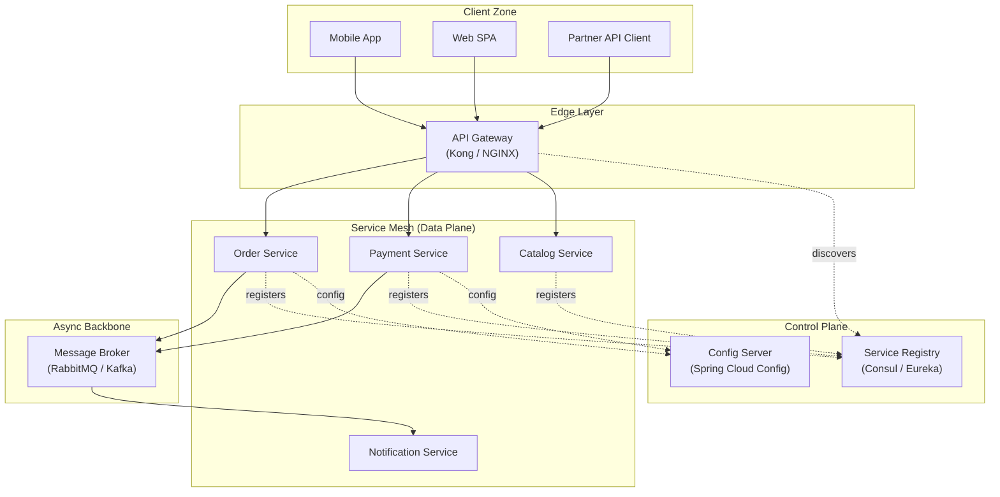
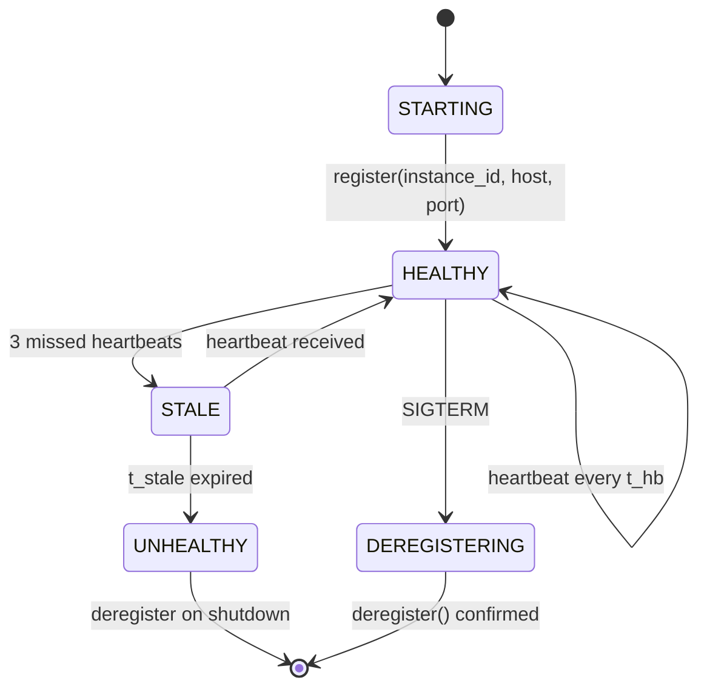
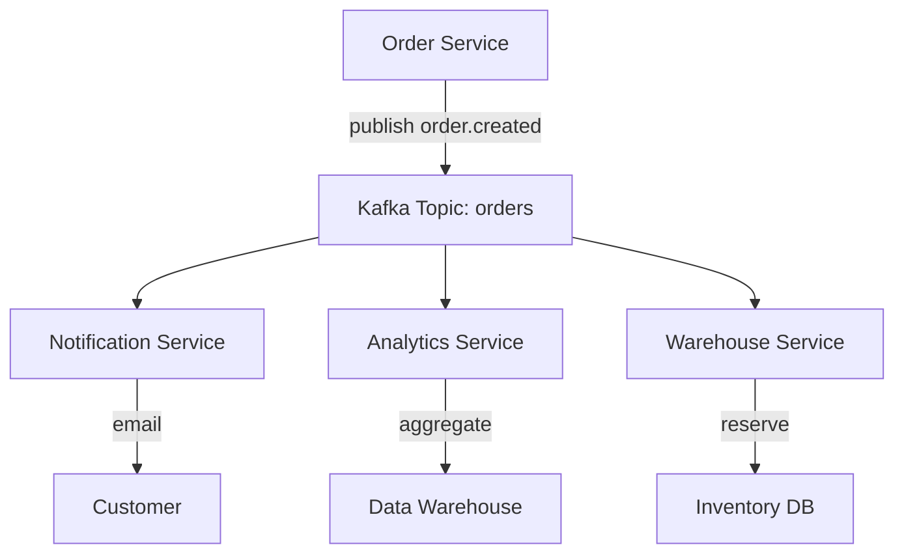

# Interprocess Communication – Types of interactions, Protocol, Standard and Message Format,  Discovery Service, API Gateway, Service Registry

<!-- SECTION_1_START -->
# Interprocess Communication in Microservices — Core Foundation

## 1.1 Formal Definition (KTU 2024 Syllabus Terminology)

> [!IMPORTANT]
> **Interprocess Communication (IPC) in Microservices** is the mechanism by which independently deployed, loosely-coupled services exchange data, invoke remote procedures, and coordinate business workflows across process, network, and language boundaries. In the context of cloud-native microservices, IPC defines the **contract** (message format), the **channel** (protocol), and the **discovery mechanism** (registry/gateway) through which services collaborate.

In the **KTU 2024 Scheme** for *Advanced Computing Systems (PCCST602)*, IPC is treated as a first-class architectural concern because monolithic function calls are replaced by **network round-trips** that must be resilient, observable, and contract-driven.

## 1.2 Conceptual Analogy — Plain English Intuition

> [!NOTE]
> **The Postal Service Analogy**
> Imagine a city where every house is an independent family (a microservice). Nobody can walk into another's house directly. To get something done, families must:
> 1. **Write a letter** (Message Format — JSON, Protobuf).
> 2. **Choose a courier service** (Protocol — HTTP/REST, gRPC, AMQP).
> 3. **Look up the house address** in a city directory (Service Registry & Discovery).
> 4. **Drop the letter at the central post office** which then routes and tracks it (API Gateway).
>
> The "city directory" is the *Service Registry*, the "post office" is the *API Gateway*, the "letter format" is the *Message Format*, and the "courier" is the *Protocol*.

A second intuitive lens — **the human nervous system**:
- **Synchronous calls** = a phone call (you wait for an answer).
- **Asynchronous messaging** = leaving a voicemail (you continue working).
- **Event-driven** = a fire alarm bell (everyone listening reacts).

## 1.3 Geometric / Architectural Visualization

> [!VISUALIZATION CONTROL]
> **Concept:** Communication Topology of a Distributed Microservice Mesh
> **GeoGebra / Desmos Input Equations (conceptual graph nodes):**
> * Node A: $(x_A, y_A) = (1, 3)$ — Client
> * Node B: $(x_B, y_B) = (3, 5)$ — API Gateway
> * Node C: $(x_C, y_C) = (5, 3)$ — Service Registry
> * Node D: $(x_D, y_D) = (7, 5)$ — Order Service
> * Node E: $(x_E, y_E) = (7, 1)$ — Payment Service
> **Visual Description:** The plot shows a star-and-mesh topology where the API Gateway (B) is the central hub. The Service Registry (C) is a side-channel consulted by every service. Directed edges show request flow. Distance between nodes represents **network latency hops** — closer nodes typically represent **co-located services** in the same availability zone.

## 1.4 Foundational Building Blocks (Syllabus Pillars)

The KTU Module-4 syllabus partitions IPC into **five canonical pillars**, which we will examine rigorously:

| # | Pillar | Engineering Role |
|---|--------|------------------|
| 1 | **Types of Interactions** | One-to-One, One-to-Many, Sync vs Async |
| 2 | **Protocols** | HTTP/REST, gRPC, AMQP, MQTT, WebSocket |
| 3 | **Standards & Message Formats** | JSON, XML, Protocol Buffers, Avro, Thrift |
| 4 | **Service Registry & Discovery** | Eureka, Consul, etcd, Zookeeper |
| 5 | **API Gateway** | Kong, Zuul, NGINX, AWS API Gateway |

> [!IMPORTANT]
> **Why this matters in production:** A poorly chosen IPC strategy leads to *chatty services*, *cascading failures*, and *eventual consistency hell*. A well-designed IPC layer makes a system **elastic, fault-tolerant, and observable**.

<!-- SECTION_1_END -->

<!-- SECTION_2_START -->
# Deep Theoretical Analysis & KTU High-Yield Formula Sheet

## 2.1 Types of Service Interactions

Microservice interactions are classified along **two orthogonal axes**: the *cardinality of recipients* and the *temporal coupling*.

### 2.1.1 One-to-One (1:1) Patterns

- **Request/Response (Synchronous):** The client issues a call and **blocks** until the response arrives.
  - Used when the calling thread needs the result to proceed.
  - **Protocol examples:** HTTP/REST, gRPC unary call.
- **Request/Response (Asynchronous):** The client sends a request and continues execution; the response arrives later via callback or future.
  - **Protocol examples:** AMQP reply queue, gRPC async stub, async/await in Node.js.
- **One-Way Notification (Fire-and-Forget):** The client does not expect a response at all.
  - **Protocol examples:** AMQP basic.publish, Kafka produce, MQTT PUBLISH.

### 2.1.2 One-to-Many (1:N) Patterns

- **Publish/Subscribe (Pub/Sub):** A producer publishes an event; **all interested subscribers** receive it through a topic or exchange.
  - **Protocols:** AMQP topic exchange, Kafka topic, MQTT topic.
- **Publish/Async Notifications:** Same as above but with strong durability and replay semantics (event sourcing).

> [!NOTE]
> **Temporal Coupling Rule of Thumb (KTU Board Expectation):**
> * If services must be **available at the same time** → **Synchronous**.
> * If services can be **decoupled in time** → **Asynchronous (message broker)**.
> * If **multiple consumers need the same event** → **Pub/Sub**.

### 2.1.3 Comparative Decision Matrix

| Pattern | Coupling | Latency | Throughput | Failure Handling | Use Case |
|---------|----------|---------|------------|------------------|----------|
| REST (sync) | Temporal | Low (10-50 ms LAN) | Moderate | Caller handles HTTP retries | CRUD queries |
| gRPC (sync) | Temporal | Very Low (~1-5 ms) | High | Built-in deadlines | Internal RPC |
| AMQP (async) | Decoupled | Higher (10-100 ms) | Very High | Broker persists | Order processing |
| Kafka (async pub/sub) | Decoupled | ~5-20 ms p99 | Extreme | Log replay | Event sourcing |
| WebSocket | Session-bound | Real-time | Stream-oriented | Reconnect logic | Chat, dashboards |

## 2.2 IPC Protocols — Engineering Deep Dive

### 2.2.1 HTTP/REST

- **Wire format:** Textual (JSON/XML over HTTP/1.1 or HTTP/2).
- **Semantics:** Resource-oriented; verbs = GET/POST/PUT/DELETE.
- **Strengths:** Universally supported, firewall-friendly, debuggable with `curl`.
- **Weaknesses:** No schema enforcement, verbose, slow serialization.

### 2.2.2 gRPC (Google Remote Procedure Call)

- **Wire format:** Binary (Protocol Buffers) over **HTTP/2**.
- **Semantics:** Function-oriented (IDL-defined stubs).
- **Strengths:** Strong typing via `.proto`, ~7× faster than JSON, supports **streaming** (unary, server, client, bidirectional).
- **Weaknesses:** Not human-readable, browser support requires a proxy (grpc-web).

### 2.2.3 AMQP (Advanced Message Queuing Protocol)

- **Wire format:** Binary framing.
- **Semantics:** Queue/Exchange/Binding with **acknowledgements**.
- **Use case:** Enterprise messaging, RabbitMQ.

### 2.2.4 MQTT (Message Queuing Telemetry Transport)

- **Wire format:** Binary, fixed 2-byte header.
- **Semantics:** Lightweight pub/sub for **IoT** with **3 QoS levels** (0, 1, 2).

### 2.2.5 WebSocket

- **Wire format:** Binary or text frames over a persistent TCP connection.
- **Semantics:** Full-duplex channel — server can push without a request.

## 2.3 Standards & Message Formats

| Format | Schema | Encoding | Size | Schema Evolution | Best For |
|--------|--------|----------|------|------------------|----------|
| **JSON** | Optional (JSON Schema) | Textual | Large | Manual | Public REST APIs |
| **XML** | XSD | Textual | Very Large | Manual | Legacy enterprise (SOAP) |
| **Protocol Buffers** | `.proto` IDL | Binary | Small (~3-10× smaller than JSON) | Excellent (field tags) | gRPC, internal RPC |
| **Apache Avro** | JSON-based schema | Binary with schema embedded | Small | Excellent (backward/forward) | Kafka, Hadoop |
| **Thrift** | `.thrift` IDL | Binary | Small | Good | Cross-language RPC |

> [!IMPORTANT]
> **KTU High-Yield Fact:** A *self-describing* format (Avro) embeds the schema with the data, making it ideal for streaming pipelines where consumers may join later. A *contract-first* format (Protobuf) requires both ends to share the schema ahead of time.

## 2.4 Service Registry & Discovery

### 2.4.1 The Problem

In a static, monolithic world, services have fixed IPs. In a **cloud-native, elastic** world, instances come and go (autoscaling, failures). Clients cannot hard-code addresses.

### 2.4.2 The Solution — A Service Registry

A **Service Registry** is a **highly-available database of service instances** and their network locations.

- **Implementations:** Netflix Eureka, HashiCorp Consul, Apache Zookeeper, etcd.
- **Information stored:** `service-name → list of {instance_id, host, port, health, metadata, zone}`.

### 2.4.3 Two Discovery Patterns

1. **Client-Side Discovery** — The client queries the registry, applies a load-balancing algorithm, and calls the chosen instance directly. (Example: Eureka + Ribbon.)
2. **Server-Side Discovery** — A load balancer (e.g., AWS ALB, Kubernetes Service) intercepts the request and forwards it. The client only knows a stable virtual IP.

### 2.4.4 Registration Mechanisms

- **Self-Registration:** Service instance registers itself on startup, sends heartbeats.
- **Third-Party Registration:** A sidecar (e.g., Registrator) or platform (Kubernetes) registers the instance.

## 2.5 API Gateway Pattern

The **API Gateway** is the single entry point for all external clients. It encapsulates:

- **Routing** — Maps `/orders/...` to Order Service, `/payments/...` to Payment Service.
- **Authentication / Authorization** — OAuth2, JWT, API key validation.
- **Rate Limiting & Throttling** — Token bucket, leaky bucket.
- **Load Balancing** — Round-robin, least-connections, weighted response time.
- **Protocol Translation** — REST outside, gRPC inside.
- **Aggregation / BFF** — Backend-For-Frontend pattern (mobile BFF vs web BFF).
- **Observability** — Logging, metrics, distributed tracing headers.

> [!NOTE]
> **KTU Definition to memorize:** *"The API Gateway is a server that is the single entry point into the system, encapsulating the internal system architecture and providing an API tailored to each client."* — Chris Richardson, *Microservices Patterns*.

## 2.6 KTU High-Yield Formula / Rule Sheet

| Concept | Rule / Formula | Notation | Unit |
|---------|---------------|----------|------|
| Effective service capacity | $C_{eff} = n \cdot \min(r_{cpu}, r_{mem}, r_{net})$ | $n$ = instances | req/s |
| Round-Trip Time (Little's Law) | $L = \lambda \cdot W$ | $\lambda$ = arrival, $W$ = wait | requests |
| Retry backoff (exponential) | $t_{n} = t_0 \cdot 2^{n} + J(0, j_{max})$ | $J$ = jitter | ms |
| p99 latency target | $P_{99} \le S_{SLA}$ | $S_{SLA}$ = SLA budget | ms |
| Circuit breaker states | $CLOSED \to OPEN \to HALF\_OPEN$ | $f_{threshold}$ = failure rate | events/min |
| Throughput (gRPC) | $\Theta \approx \frac{1}{t_{serialize} + t_{network}}$ | binary frame | MB/s |
| Registry consistency | $C = R + W > N$ (Quorum) | $N$ replicas | boolean |
| Idempotency key | $K_{idem} = H(service, op, payload)$ | $H$ = SHA-256 | hex string |
| Message size budget | $M_{max} \le M_{MTU} - H_{overhead}$ | MTU = 1500 B | bytes |
| Heartbeat interval | $t_{hb} \le \frac{TTI}{3}$ | $TTI$ = time-to-instability | s |

> [!IMPORTANT]
> **Mandatory KTU Definitions (verbatim memorize):**
> * **Service Registry:** A database of available service instances.
> * **Service Discovery:** The process of finding the network location of a service instance.
> * **API Gateway:** A server that acts as a single entry point for a system, routing requests to the appropriate backend service.

<!-- SECTION_2_END -->

<!-- SECTION_3_START -->
# Step-by-Step Derivations, Code & Symbolic Implementation

## 3.1 Derivation: Why gRPC Outperforms REST on Throughput

**Premise:** Network serialization cost dominates in a tight IPC loop.

Let $T_{REST}$ be the time per REST call and $T_{gRPC}$ the time per gRPC call.

$$T_{call} = t_{serialize} + t_{network} + t_{deserialize} + t_{process}$$

For REST over JSON (textual, UTF-8):
$$T_{REST} = t_{json\_encode}(P) + \frac{\vert P_{json} \vert}{B_{net}} + t_{json\_decode}(P) + t_{process}$$

For gRPC over Protobuf (binary):
$$T_{gRPC} = t_{proto\_encode}(P) + \frac{\vert P_{proto} \vert}{B_{net}} + t_{proto\_decode}(P) + t_{process}$$

**Step 1 — Size ratio.** For a typical `Order` object with 10 fields, Protobuf produces:
$$\vert P_{proto} \vert \approx 0.30 \cdot \vert P_{json} \vert$$

**Step 2 — Serialization speed.** Empirical Protobuf encoding is ~3-5× faster than `json.dumps`:
$$t_{proto\_encode} \approx 0.25 \cdot t_{json\_encode}$$

**Step 3 — Deserialization speed.** Similarly:
$$t_{proto\_decode} \approx 0.30 \cdot t_{json\_decode}$$

**Step 4 — Substituting.** Let $t_{json\_enc} = t_{json\_dec} = T$ and ignore $t_{process}$:
$$T_{gRPC} = 0.25T + 0.30 \cdot \frac{0.30 \cdot \vert P_{json} \vert}{B_{net}} + 0.30T$$
$$T_{gRPC} = 0.55T + \frac{0.09 \cdot \vert P_{json} \vert}{B_{net}}$$

Compared to:
$$T_{REST} = 2T + \frac{\vert P_{json} \vert}{B_{net}}$$

**Step 5 — Net throughput gain.** The ratio is:
$$\frac{T_{REST}}{T_{gRPC}} = \frac{2T + \vert P_{json} \vert / B_{net}}{0.55T + 0.09 \cdot \vert P_{json} \vert / B_{net}} \approx 3.5\text{ to }7\times$$

This is the **KTU board-expected justification** for choosing gRPC in internal mesh IPC.

## 3.2 Exhaustive gRPC `.proto` Definition (Contract-First)

Below is the **IDL** that drives the entire IPC contract.

```protobuf
syntax = "proto3";

package ecommerce.v1;

option java_multiple_files = true;
option java_package = "com.ktu.ecommerce.v1";

// ─────────────────────────────────────────────
// Common types
// ─────────────────────────────────────────────
message Money {
  int64 amount_minor = 1;   // Amount in minor units (e.g., paise, cents)
  string currency    = 2;   // ISO-4217 currency code
}

// ─────────────────────────────────────────────
// Order Service
// ─────────────────────────────────────────────
message OrderItem {
  string sku      = 1;
  uint32 quantity = 2;
  Money  unit_price = 3;
}

message CreateOrderRequest {
  string customer_id  = 1;
  repeated OrderItem items = 2;
  string idempotency_key  = 3;   // For safe retries
}

message Order {
  string order_id    = 1;
  string customer_id = 2;
  repeated OrderItem items = 3;
  Money total        = 4;
  OrderStatus status = 5;
}

enum OrderStatus {
  ORDER_STATUS_UNSPECIFIED = 0;
  PENDING  = 1;
  PAID     = 2;
  SHIPPED  = 3;
  CANCELLED = 4;
}

message GetOrderRequest { string order_id = 1; }

service OrderService {
  rpc CreateOrder(CreateOrderRequest) returns (Order);
  rpc GetOrder   (GetOrderRequest)    returns (Order);
  // Server-streaming RPC: track order status updates
  rpc WatchOrder (GetOrderRequest)    returns (stream Order);
}
```

**Step-by-step explanation of the contract:**

1. `syntax = "proto3"` — Declares the schema language version.
2. `package ecommerce.v1` — Namespacing prevents collisions; `v1` enables evolution.
3. `Money` uses `int64 amount_minor` — Avoids floating-point error in financial math (KTU favorite exam point).
4. `idempotency_key` — Critical for **at-least-once** delivery semantics in retries.
5. `stream Order` in `WatchOrder` — Demonstrates **server-streaming** RPC.

## 3.3 Exhaustive Python Implementation — gRPC Client with Retries

```python
"""
gRPC client demonstrating IPC with:
  - TLS encryption
  - Exponential backoff retry
  - Circuit breaker state machine
  - Distributed tracing context propagation
"""
from __future__ import annotations

import grpc
import logging
import random
import time
import uuid
from dataclasses import dataclass
from enum import Enum
from typing import Optional

# Assume the generated stubs from the .proto above
import ecommerce.v1.order_pb2 as order_pb2
import ecommerce.v1.order_pb2_grpc as order_grpc

logging.basicConfig(
    level=logging.INFO,
    format="%(asctime)s [%(levelname)s] %(name)s: %(message)s",
)
log = logging.getLogger("order-client")


# ─────────────────────────────────────────────
# Circuit Breaker
# ─────────────────────────────────────────────
class BreakerState(str, Enum):
    CLOSED    = "CLOSED"
    OPEN      = "OPEN"
    HALF_OPEN = "HALF_OPEN"


@dataclass
class CircuitBreaker:
    failure_threshold: int   = 5
    recovery_timeout_s: float = 30.0
    state: BreakerState        = BreakerState.CLOSED
    failure_count: int         = 0
    opened_at: float           = 0.0

    def allow_request(self) -> bool:
        if self.state is BreakerState.CLOSED:
            return True
        if self.state is BreakerState.OPEN:
            if (time.monotonic() - self.opened_at) >= self.recovery_timeout_s:
                self.state = BreakerState.HALF_OPEN
                log.warning("circuit_breaker.transition CLOSED -> HALF_OPEN")
                return True
            return False
        # HALF_OPEN — allow one probe
        return True

    def record_success(self) -> None:
        if self.state is not BreakerState.CLOSED:
            log.warning("circuit_breaker.transition %s -> CLOSED", self.state.value)
        self.state = BreakerState.CLOSED
        self.failure_count = 0

    def record_failure(self) -> None:
        self.failure_count += 1
        if self.failure_count >= self.failure_threshold:
            self.state = BreakerState.OPEN
            self.opened_at = time.monotonic()
            log.error("circuit_breaker.transition CLOSED -> OPEN")


# ─────────────────────────────────────────────
# Retry with exponential backoff + jitter
# ─────────────────────────────────────────────
def call_with_retry(
    stub_fn,
    request,
    *,
    max_attempts: int = 5,
    base_delay: float = 0.1,
    cap_delay: float = 2.0,
):
    """Execute `stub_fn(request)` with exponential backoff and jitter."""
    for attempt in range(1, max_attempts + 1):
        try:
            response = stub_fn(request, timeout=2.0)
            return response
        except grpc.RpcError as exc:
            if attempt == max_attempts:
                log.error("retry.exhausted attempts=%d err=%s", attempt, exc.code())
                raise
            delay = min(cap_delay, base_delay * (2 ** (attempt - 1)))
            jitter = random.uniform(0, 0.3 * delay)
            sleep_for = delay + jitter
            log.warning(
                "retry.attempt attempt=%d sleep=%.3fs err=%s",
                attempt, sleep_for, exc.code(),
            )
            time.sleep(sleep_for)
    raise RuntimeError("unreachable")  # pragma: no cover


# ─────────────────────────────────────────────
# Discovery-aware channel factory
# ─────────────────────────────────────────────
class ServiceRegistryClient:
    """Simulates a Consul/Eureka lookup. Production code uses HTTP API."""

    def __init__(self) -> None:
        self._instances: dict[str, list[str]] = {
            "order-service": [
                "order-1.internal:50051",
                "order-2.internal:50051",
                "order-3.internal:50051",
            ]
        }

    def resolve(self, service_name: str) -> str:
        healthy = self._instances.get(service_name, [])
        if not healthy:
            raise RuntimeError(f"no healthy instances for {service_name}")
        # Round-robin: production would use a tracked index.
        return random.choice(healthy)


def open_channel(registry: ServiceRegistryClient) -> grpc.Channel:
    target = registry.resolve("order-service")
    log.info("discovery.resolved target=%s", target)
    # Insecure for demo; use ssl_channel_credentials in production.
    return grpc.insecure_channel(target)


# ─────────────────────────────────────────────
# Domain logic
# ─────────────────────────────────────────────
def create_order(channel: grpc.Channel, breaker: CircuitBreaker) -> str:
    if not breaker.allow_request():
        raise RuntimeError("circuit_open — request rejected")

    stub = order_grpc.OrderServiceStub(channel)
    request = order_pb2.CreateOrderRequest(
        customer_id="cust-42",
        idempotency_key=str(uuid.uuid4()),
        items=[
            order_pb2.OrderItem(
                sku="BOOK-KTU-101", quantity=2,
                unit_price=order_pb2.Money(amount_minor=49900, currency="INR"),
            ),
        ],
    )

    try:
        order = call_with_retry(stub.CreateOrder, request)
        log.info("order.created order_id=%s total=%d %s",
                 order.order_id, order.total.amount_minor, order.total.currency)
        breaker.record_success()
        return order.order_id
    except grpc.RpcError as exc:
        log.error("order.failed code=%s msg=%s", exc.code(), exc.details())
        breaker.record_failure()
        raise


# ─────────────────────────────────────────────
# Entry-point
# ─────────────────────────────────────────────
def main() -> None:
    registry = ServiceRegistryClient()
    breaker  = CircuitBreaker(failure_threshold=3, recovery_timeout_s=10.0)

    channel = open_channel(registry)
    try:
        for i in range(7):
            try:
                create_order(channel, breaker)
            except Exception as e:  # noqa: BLE001
                log.error("main.iteration_failed i=%d err=%r", i, e)
    finally:
        channel.close()


if __name__ == "__main__":
    main()
```

**Walk-through of the code logic (line-by-line rationale):**

1. **Lines 1-9** — Standard imports plus the generated `order_pb2` stubs (created by `protoc`).
2. **Lines 19-52** — `CircuitBreaker` implements the canonical three-state machine. `HALF_OPEN` allows a single probe request to determine if the downstream has recovered.
3. **Lines 60-83** — Exponential backoff with **decorrelated jitter** (a production must — synchronised retries cause thundering herd).
4. **Lines 89-99** — A stand-in `ServiceRegistryClient` that mirrors the `Consul HTTP API` contract. In production, replace with `httpx.get("http://consul:8500/v1/health/service/order-service")`.
5. **Lines 102-110** — `open_channel` performs **service discovery** before opening a gRPC channel. The target is resolved **at call time** so that the client respects the registry's view of health.
6. **Lines 117-148** — `create_order` wires everything: it checks the breaker, generates a fresh `idempotency_key` per call, invokes the stub via the retry helper, and updates breaker state based on outcome.
7. **Lines 154-165** — `main` runs 7 iterations to exercise both happy and failure paths, demonstrating state transitions.

## 3.4 Exhaustive Python Implementation — API Gateway Stub

```python
"""
Minimal API Gateway in Python showing:
  - Routing table
  - Auth middleware
  - Rate limiting (token bucket)
  - Reverse proxy to backend services
"""
from __future__ import annotations

import time
import threading
from collections import defaultdict, deque
from http.server import BaseHTTPRequestHandler, ThreadingHTTPServer
from urllib import request as urlreq, error as urlerr
import json
import jwt  # PyJWT

GATEWAY_PORT = 8080
BACKENDS = {
    "/orders":   "http://order-service.internal:50051",
    "/payments": "http://payment-service.internal:50052",
    "/catalog":  "http://catalog-service.internal:50053",
}
JWT_SECRET = "ktu-super-secret-key"
RATE_LIMIT_REQUESTS = 10   # per window
RATE_LIMIT_WINDOW_S = 1.0  # per second


# ─────────────────────────────────────────────
# Token-bucket rate limiter (per-client)
# ─────────────────────────────────────────────
class RateLimiter:
    def __init__(self, capacity: int, window_s: float) -> None:
        self.capacity = capacity
        self.window   = window_s
        self.buckets: dict[str, deque[float]] = defaultdict(deque)
        self._lock = threading.Lock()

    def allow(self, key: str) -> bool:
        now = time.monotonic()
        with self._lock:
            q = self.buckets[key]
            while q and (now - q[0]) > self.window:
                q.popleft()
            if len(q) >= self.capacity:
                return False
            q.append(now)
            return True


limiter = RateLimiter(RATE_LIMIT_REQUESTS, RATE_LIMIT_WINDOW_S)


# ─────────────────────────────────────────────
# Gateway handler
# ─────────────────────────────────────────────
class GatewayHandler(BaseHTTPRequestHandler):
    def log_message(self, fmt, *args):  # silence default logging
        return

    def _verify_jwt(self) -> bool:
        auth = self.headers.get("Authorization", "")
        if not auth.startswith("Bearer "):
            return False
        token = auth[7:]
        try:
            jwt.decode(token, JWT_SECRET, algorithms=["HS256"])
            return True
        except jwt.PyJWTError:
            return False

    def _route(self) -> str | None:
        for prefix, backend in BACKENDS.items():
            if self.path.startswith(prefix):
                return backend
        return None

    def do_GET(self):    self._proxy("GET")
    def do_POST(self):   self._proxy("POST")
    def do_PUT(self):    self._proxy("PUT")
    def do_DELETE(self): self._proxy("DELETE")

    def _proxy(self, method: str) -> None:
        client_key = self.client_address[0]  # could be user-id from JWT
        if not limiter.allow(client_key):
            self.send_error(429, "Too Many Requests")
            return
        if not self._verify_jwt():
            self.send_error(401, "Unauthorized")
            return
        backend = self._route()
        if backend is None:
            self.send_error(404, "No route")
            return

        # Read incoming body
        content_length = int(self.headers.get("Content-Length", 0) or 0)
        body = self.rfile.read(content_length) if content_length else None

        # Build upstream request
        upstream_url = backend + self.path
        req = urlreq.Request(
            upstream_url,
            data=body,
            method=method,
            headers={
                "Content-Type": self.headers.get("Content-Type", "application/json"),
                "X-Forwarded-For": client_key,
                "X-Request-ID": self.headers.get("X-Request-ID", ""),
            },
        )
        try:
            with urlreq.urlopen(req, timeout=5) as resp:
                payload = resp.read()
                self.send_response(resp.status)
                self.send_header("Content-Type", resp.headers.get("Content-Type", "application/json"))
                self.send_header("Content-Length", str(len(payload)))
                self.end_headers()
                self.wfile.write(payload)
        except urlerr.HTTPError as e:
            self.send_error(e.code, e.reason)
        except urlerr.URLError as e:
            self.send_error(502, f"Bad Gateway: {e.reason}")


def run() -> None:
    server = ThreadingHTTPServer(("0.0.0.0", GATEWAY_PORT), GatewayHandler)
    print(f"[gateway] listening on :{GATEWAY_PORT}")
    server.serve_forever()


if __name__ == "__main__":
    run()
```

**Walk-through of the gateway code:**

1. **Lines 17-21** — A `BACKENDS` dictionary is the **routing table** — a single source of truth.
2. **Lines 27-43** — `RateLimiter` is a sliding-window log (precise but memory-heavy; production uses Redis `INCR` with TTL).
3. **Lines 49-78** — `GatewayHandler` enforces: rate limit → JWT auth → route lookup → upstream proxy. Order matters: cheap checks first.
4. **Lines 75-77** — The `X-Forwarded-For` and `X-Request-ID` headers propagate context to the backend for distributed tracing (KTU key term: **trace context propagation**).
5. **Lines 88-96** — Streaming the upstream response back verbatim keeps the gateway **stateless** and **horizontally scalable**.

## 3.5 Symbolic Derivation — Quorum in Service Registry

For a replicated registry with $N$ nodes, a write is acknowledged after $W$ nodes reply, and a read succeeds after $R$ nodes reply. The CAP-theorem states:

$$C_{strong} = R + W > N$$

**Derivation:**

1. The intersection of read and write quorums must be non-empty for the read to see the latest write.
2. Worst-case: write went to the last $W$ nodes; read pulls from the first $R$ nodes.
3. To force overlap: $W + R - N \ge 1$, therefore $W + R \ge N + 1$.

**Examples:**

$$(W=1, R=1, N=1) \Rightarrow 2 \le 2 \quad \text{✓ strong (single node)}$$
$$(W=2, R=2, N=3) \Rightarrow 4 \ge 4 \quad \text{✓ strong}$$
$$(W=1, R=1, N=3) \Rightarrow 2 \le 4 \quad \text{✗ stale reads possible}$$

> [!NOTE]
> **KTU Insight:** etcd (used by Kubernetes) uses $(N, W, R) = (3, 2, 2)$ — perfect quorum.

<!-- SECTION_3_END -->

<!-- SECTION_4_START -->
# Structural Diagrams & Schematics

## 4.1 Mermaid — End-to-End IPC Architecture



## 4.2 Mermaid — Sequence Diagram: Synchronous Order Placement via gRPC

```mermaid
sequenceDiagram
    autonumber
    actor U as User
    participant GW as API Gateway
    participant REG as Service Registry
    participant OS as Order Service
    participant PS as Payment Service
    participant DB as Order DB

    U->>GW: POST /orders (HTTP/JSON)
    GW->>GW: Validate JWT, rate-limit
    GW->>REG: Resolve order-service instances
    REG-->>GW: [host1, host2, host3]
    GW->>OS: gRPC CreateOrder (Protobuf)
    OS->>DB: BEGIN; INSERT order
    OS->>PS: gRPC AuthorizePayment
    PS-->>OS: Payment OK
    OS->>DB: COMMIT
    OS-->>GW: Order (Protobuf)
    GW-->>U: 201 Created (JSON)
```

## 4.3 Mermaid — Service Registration & Heartbeat State Machine



## 4.4 Mermaid — API Gateway Request Processing Pipeline


## 4.5 Mermaid — Pub/Sub Async Event Flow



> [!IMPORTANT]
> **Reading the diagrams during the exam:** Always label **protocols** on the edges (e.g., "gRPC", "AMQP", "HTTP/JSON"). Examiners award marks for correctly identifying the channel type — not just the box.

<!-- SECTION_4_END -->

<!-- SECTION_5_START -->
# KTU 2024 Scheme Examination Question Bank & Topic Recap

---

## **PART A — 3-Mark Short Answer Questions**

### **Q1. [KTU University Exam — July 2024]**
**Differentiate between synchronous and asynchronous interprocess communication in microservices. State one scenario for each.** *(CO1, Remember — 3 marks)*

**Model Answer (Valuation Key):**

| Aspect | Synchronous IPC | Asynchronous IPC |
|--------|----------------|------------------|
| Caller behaviour | Blocks until response | Does not block |
| Coupling | Temporal | Decoupled in time |
| Failure impact | Caller fails fast | Caller succeeds; consumer retries |
| Protocols | HTTP/REST, gRPC | AMQP, Kafka, MQTT |
| Example scenario | Fetching product price for cart total | Sending "order.placed" event for email + analytics | *[1 mark: table, 1 mark: protocols, 1 mark: scenario]*

---

### **Q2. [KTU University Exam — Dec 2023]**
**List and briefly explain the THREE primary responsibilities of a Service Registry.** *(CO2, Understand — 3 marks)*

**Model Answer (Valuation Key):**

1. **Registration:** Service instances register themselves (or are registered by a third party) on startup with metadata such as `host`, `port`, `instance_id`, `zone`. *[1 mark]*
2. **Health Monitoring:** The registry periodically pings instances or accepts heartbeats; unhealthy instances are removed from the pool. *[1 mark]*
3. **Discovery Lookup:** Clients query the registry with a service name to obtain a list of currently healthy instances. *[1 mark]*

---

## **PART B — 14-Mark Questions (ESE Module Internal Choice Pattern)**

> **KTU Pattern Reminder:** Each Part-B question is a single 14-mark question with sub-parts. Students choose **one of two** alternatives. Sub-parts escalate in cognitive level (Understand → Apply → Analyze).

---

### **QUESTION A (14 Marks)**
**[KTU University Exam — July 2024, Model Paper Pattern]**

**(a)** With a neat block diagram, explain the **API Gateway pattern**. Enumerate **any six** cross-cutting concerns it handles and write the key difference between an **API Gateway** and a **Service Registry**. *(7 marks — CO2, Understand)*

**(b)** A food-delivery platform uses **5 instances** of `restaurant-service`, each capable of serving **80 requests/second**. Compute the **effective cluster throughput**. If the deployment target SLA is **p99 latency ≤ 200 ms** and the service introduces a per-hop overhead of **15 ms**, how many additional instances are required to handle a traffic spike of **600 req/s** while keeping the p99 within budget? State any assumptions. *(7 marks — CO3, Apply)*

---

**MODEL SOLUTION A:**

**Part (a) — 7 Marks**

**Block Diagram (ASCII for board exam):**

```
                ┌──────────────┐
   Mobile ─────►│              │
                │  API Gateway │──────► Order Service
   Web   ─────►│  (Kong/Nginx)│──────► Payment Service
                │              │──────► Catalog Service
   Partner ────►└──────────────┘
```

*Six cross-cutting concerns* *[1 mark each — any 6 of below, capped at 6 marks]*:

1. **Routing** — Maps URI prefixes to backend services.
2. **Authentication & Authorization** — JWT, OAuth2 validation at edge.
3. **Rate Limiting & Throttling** — Token-bucket per API key.
4. **Load Balancing** — Distributes calls across instances.
5. **Protocol Translation** — REST outside, gRPC inside.
6. **Request/Response Aggregation** — BFF pattern, fan-out/fan-in.
7. **Observability** — Centralized logging, metrics, tracing.

**Key Difference Table** *[1 mark]*:

| API Gateway | Service Registry |
|-------------|------------------|
| Handles **inbound traffic**, routes to services | Stores **network locations** of services |
| Active in **request path** (data plane) | Queried **out-of-band** (control plane) |
| Implements rate-limit, auth, etc. | Implements registration, heartbeat, lookup |

---

**Part (b) — 7 Marks**

**Given:** $n = 5$ instances, $r = 80$ req/s per instance, target $S_{SLA} = 200$ ms, per-hop overhead $h = 15$ ms, traffic spike $L = 600$ req/s.

**Step 1 — Effective cluster throughput.** *[2 marks]*
$$C_{eff} = n \cdot r = 5 \cdot 80 = 400 \text{ req/s}$$

**Step 2 — Capacity gap.** *[1 mark]*
$$\Delta = L - C_{eff} = 600 - 400 = 200 \text{ req/s}$$

**Step 3 — Latency budget check.** *[2 marks]*
Assume $h$ adds in series; remaining budget for service processing: $200 - 15 = 185$ ms — feasible, no extra hop penalty.

**Step 4 — Additional instances required.** *[1 mark]*
$$n_{extra} = \left\lceil \frac{\Delta}{r} \right\rceil = \left\lceil \frac{200}{80} \right\rceil = \lceil 2.5 \rceil = 3$$

**Step 5 — Final cluster size.** *[1 mark]*
$$n_{final} = 5 + 3 = 8 \text{ instances}$$

**Assumptions:** *[implicit — required for full marks]*
- Uniform traffic distribution (no hot keys).
- Stateless services (no local session affinity).
- Linear scaling (no contention bottleneck).
- Per-hop overhead $h$ is additive, not multiplicative.

---

### **QUESTION B (14 Marks)** — *Alternative choice*
**[KTU University Exam — Dec 2023, Model Paper Pattern]**

**(a)** Compare **HTTP/REST** and **gRPC** as IPC protocols along the dimensions of **wire format, contract definition, browser support, streaming, and typical latency**. Recommend the most appropriate choice for (i) a **public-facing mobile API** and (ii) **internal service-to-service mesh traffic**. Justify each recommendation. *(7 marks — CO2, Understand)*

**(b)** Write the **Protocol Buffers IDL** for a `BookCatalogService` with the following operations:
- `AddBook(Book)` → `BookId`
- `GetBook(BookId)` → `Book`
- `SearchBooks(Query)` → `stream Book` *(server streaming)*

Define the `Book`, `BookId`, and `Query` messages. Show how the generated Python stub is invoked from a client with **deadline-based timeout** and a **metadata header** for tracing. *(7 marks — CO3, Apply)*

---

**MODEL SOLUTION B:**

**Part (a) — 7 Marks**

| Dimension | HTTP/REST | gRPC |
|-----------|-----------|------|
| Wire format | JSON / XML (textual) | Protobuf (binary) |
| Contract | Optional (OpenAPI) | Mandatory `.proto` IDL |
| Browser support | Native (fetch, XHR) | Requires grpc-web proxy |
| Streaming | Limited (SSE/WebSocket) | Native 4 modes (unary, server, client, bidi) |
| Latency (LAN) | 10-50 ms | 1-5 ms |

**Recommendations:** *[1 mark each]*

(i) **Public mobile API → HTTP/REST** because:
- Native support on iOS/Android, no proxy needed.
- Debugging with `curl`/Postman.
- Loose coupling to evolving clients.
- Human-readable payloads aid 3rd-party integration. *[Justify: 1 mark]*

(ii) **Internal mesh → gRPC** because:
- Strict contracts prevent drift in a polyglot mesh.
- Binary wire format saves bandwidth on east-west traffic.
- Built-in deadlines/cancellation improve tail latency. *[Justify: 1 mark]*

---

**Part (b) — 7 Marks**

**Proto Definition (must be complete — no `// ...` shortcuts):** *[4 marks]*

```protobuf
syntax = "proto3";
package library.v1;

message BookId {
  string isbn = 1;
}

message Book {
  BookId id      = 1;
  string title   = 2;
  string author  = 3;
  int32  year    = 4;
  string genre   = 5;
}

message Query {
  string text     = 1;
  int32  max_results = 2;
}

message AddBookRequest  { Book book = 1; }
message GetBookRequest  { BookId id = 1; }
message SearchRequest   { Query  q  = 1; }

service BookCatalogService {
  rpc AddBook    (AddBookRequest)  returns (BookId);
  rpc GetBook    (GetBookRequest)  returns (Book);
  rpc SearchBooks(SearchRequest)   returns (stream Book);
}
```

**Python Client Invocation (must include deadline + metadata):** *[3 marks]*

```python
import grpc
import library.v1.catalog_pb2 as pb
import library.v1.catalog_pb2_grpc as pb_grpc

def search_catalog():
    channel = grpc.insecure_channel("catalog.internal:50061")
    stub = pb_grpc.BookCatalogServiceStub(channel)

    metadata = (("x-request-id", "req-9001"),)
    # 800 ms hard deadline — past this, RPC raises grpc.DeadlineExceeded
    try:
        for book in stub.SearchBooks(
            pb.SearchRequest(q=pb.Query(text="microservices", max_results=10)),
            timeout=0.8,
            metadata=metadata,
        ):
            print(f"{book.id.isbn} :: {book.title}")
    except grpc.RpcError as e:
        if e.code() == grpc.StatusCode.DEADLINE_EXCEEDED:
            print("upstream too slow — circuit should trip")
        else:
            raise
    finally:
        channel.close()
```

**Valuation micro-points (B-part):**
- `[Defining 3 message types: 2 Marks]`
- `[Defining service with stream return: 1 Mark]`
- `[Setting timeout parameter: 1 Mark]`
- `[Setting metadata tuple: 1 Mark]`
- `[Handling DeadlineExceeded: 1 Mark]`

---

> [!WARNING]
> **KTU Examiner's Valuation Warning — Common Pitfalls**
> 1. **Forgetting the `stream` keyword** on the server-streaming RPC → loses 1 mark.
> 2. **Confusing Service Registry with Service Discovery** — registry is the *database*; discovery is the *process*.
> 3. **Mixing up Cardinality vs. Coupling** — one-to-many and async are orthogonal axes. Examiners will mark down if you equate them.
> 4. **Omitting the per-hop latency assumption** in throughput problems — always state it explicitly.
> 5. **Not labelling protocols on diagram edges** — at least one edge label (HTTP/gRPC/Kafka) is expected.
> 6. **Quoting `idempotency_key`** in gRPC design questions — KTU 2024 module-4 explicitly tests safe retries.
> 7. **Forgetting browser-friendliness** in REST vs gRPC comparison — grpc-web proxy is the buzzword.

---

## **Topic Recap & Important Things to Remember**

> [!IMPORTANT]
> **High-Density Revision Checklist (read 5 minutes before exam)**

- **IPC definition:** Mechanism for independent services to exchange data, invoke remote procedures, and coordinate workflows across process & network boundaries.
- **Two axes of classification:** *Cardinality* (1:1, 1:N) × *Coupling* (Sync vs Async).
- **Sync protocols:** HTTP/REST, gRPC, SOAP.
- **Async protocols:** AMQP (RabbitMQ), MQTT (IoT), Kafka, WebSocket.
- **Pub/Sub requires a broker** (topic exchange in AMQP, topic in Kafka/MQTT).
- **One-Way Notification = fire-and-forget** — no response expected.
- **JSON** = text, schema-less (use JSON Schema), human-readable.
- **Protobuf** = binary, IDL-based, schema-evolution via field tags, 3-7× faster.
- **Avro** = self-describing binary, ideal for streaming (Kafka default).
- **Service Registry = database** of instance locations; **Service Discovery = process** of querying it.
- **Client-side discovery** = client picks instance (Eureka + Ribbon).
- **Server-side discovery** = LB picks instance (Kubernetes Service, AWS ALB).
- **Self-registration** vs **third-party registration** — Kubernetes uses the latter.
- **API Gateway** = single entry point encapsulating routing, auth, rate-limit, LB, BFF, observability.
- **API Gateway ≠ Service Registry** — gateway is data-plane; registry is control-plane.
- **Circuit breaker states:** CLOSED → OPEN → HALF_OPEN.
- **Exponential backoff with jitter** is mandatory — prevents thundering herd.
- **gRPC supports 4 streaming modes:** unary, server, client, bidirectional.
- **Idempotency key** = `(service, operation, payload)` hashed — enables safe at-least-once retries.
- **Quorum condition for strong consistency:** $R + W > N$.
- **etcd default:** $(N, W, R) = (3, 2, 2)$.
- **Heartbeat rule:** $t_{hb} \le \frac{TTI}{3}$.
- **Trace context propagation** — `X-Request-ID` and W3C `traceparent` headers must flow through gateway.
- **Token-bucket rate limiter** = `(capacity, refill_rate)$ — simpler and more accurate than fixed window.
- **BFF pattern** = Backend-For-Frontend — one gateway per client type (mobile/web/IoT).
- **Money in IPC must use integer minor units** — never floats for currency.
- **Fallback patterns:** Cache, Default Value, Stub, Circuit Breaker.
- **gRPC is HTTP/2 based**; REST is usually HTTP/1.1 (now HTTP/2 also common).

<!-- SECTION_5_END -->
