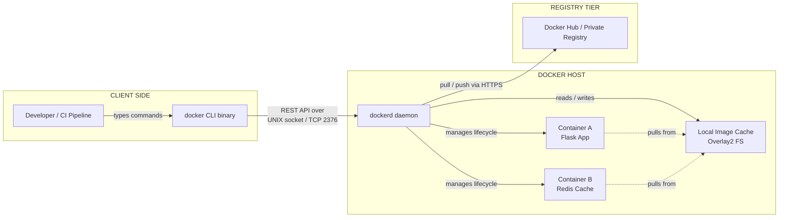
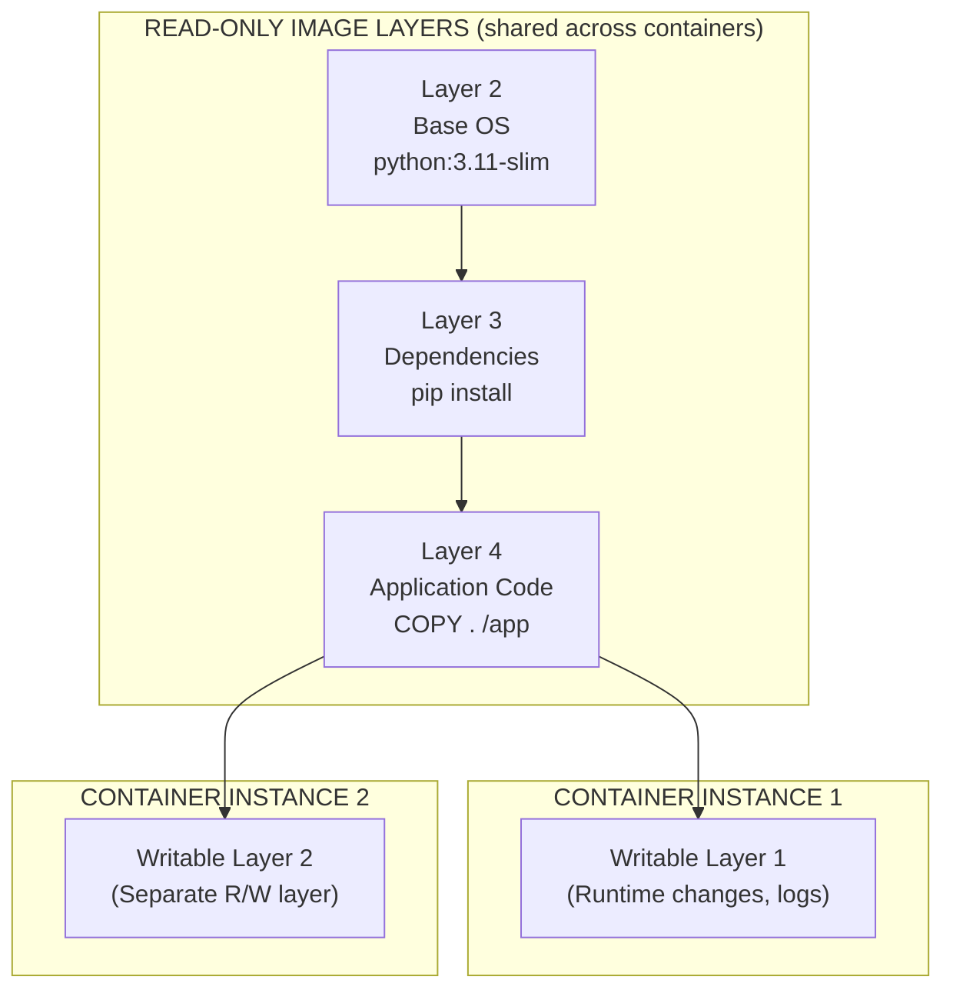
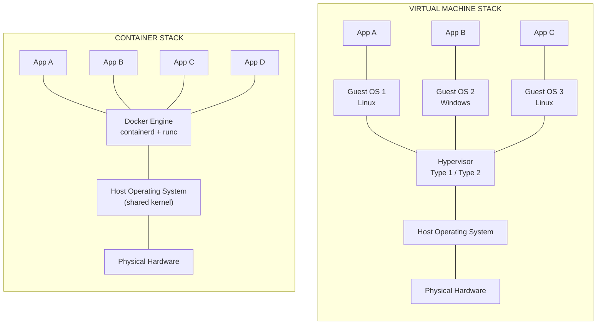
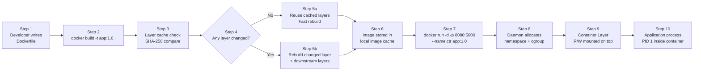

# Introduction to Docker.

<!-- SECTION_1_START -->
# ADVANCED COMPUTING SYSTEMS (PCCST602) — Module 4
## Introduction to Docker

> [!IMPORTANT]
> **Syllabus Focus (KTU 2024 Scheme):** This topic establishes the foundational vocabulary of containerization, the architectural pillars of the Docker engine, and the difference between traditional virtual machines and lightweight containers — a high-weightage, compulsory sub-section for Part A and Part B university examinations.

---

## 1.1 Formal Academic Definition

**Docker** is an open-source *containerization* platform that packages an application together with all of its runtime dependencies — libraries, system tools, code, and configuration — into a single, portable, executable unit called a **Docker container**, which can run reliably and consistently across any environment that supports the Docker Engine, irrespective of the underlying host operating system or hardware.

The unit of packaging is known as a **Docker Image** (a read-only blueprint) while the running instance of that image is a **Docker Container** (a writable, isolated process tree governed by the host kernel).

> [!NOTE]
> **KTU Board Definition to Memorize:**
> *"Docker is a Platform-as-a-Service (PaaS) tool that uses OS-level virtualization to deliver software in isolated, portable units called containers, leveraging the host OS kernel via Linux namespaces, control groups (cgroups), and a Union File System (UFS)."*

---

## 1.2 Conceptual Analogy — The "Shipping Container" Paradigm

Imagine global logistics before **1956**. Every good — cars, grain, ice — was transported in uniquely shaped crates. Loading them onto ships was a nightmare, and transferring cargo between a truck, a train, and a ship required manual repacking.

Then **Malcom McLean** invented the standard *intermodal shipping container* — a uniform steel box. Suddenly, any cargo could be sealed once and travel through any transport network on Earth without being repacked.

**Docker applies the exact same idea to software:**

- The **Ship** is your physical server / data-center machine.
- The **Shipping Container** is a Docker Container.
- The **Container Blueprint / Mould** is a Docker Image.
- The **Container Yard where blueprints are stored** is the Docker Registry (Docker Hub).

You "ship" your application as a standardized container. The receiving machine (a developer's laptop, an AWS EC2 instance, or a KTU lab server) does not need to know what is *inside*. It only needs to know how to plug the container in.

> [!TIP]
> **Why this analogy is exam-ready:** Examiners love the phrase *"Build once, Ship anywhere, Run anywhere."* Use it verbatim in any 7-mark or 14-mark answer to demonstrate conceptual maturity.

---

## 1.3 Physical Constants, Standards & Key Metrics

| Parameter | Standard Value | Relevance |
| :--- | :--- | :--- |
| Docker Engine Release | **March 2013** (Solomon Hykes, dotCloud) | Industry benchmark |
| Container Boot Time | **< 1 second** (typically **50–500 ms**) | Vs. VM boot: 30–60 s |
| Image Layer Sharing | **Union File System (UFS)** — e.g., Overlay2 | Storage efficiency |
| Default Registry | **Docker Hub** (`hub.docker.com`) | Public image distribution |
| Default Network Driver | **bridge**, **host**, **none**, **overlay** | Container networking |
| Isolation Mechanism | **Linux Namespaces** + **cgroups v2** | Kernel-level sandboxing |

> [!IMPORTANT]
> **Highlighted Constants for Board Exams:**
> - **Boot latency of containers ≈ 1 second** (this is the single most-cited metric in KTU answer scripts).
> - **Namespace** is the *isolation* primitive.
> - **cgroups** is the *resource-limiting* primitive.

---

## 1.4 Visualization of Container vs. Hardware Footprint

> [!VISUALIZATION CONTROL]
> **Concept:** Resource overhead comparison between a Virtual Machine and a Docker Container on the same physical host.
>
> **Plotting Inputs (for conceptual graphing on a whiteboard or Desmos):**
> * Hypervisor stack height: $H_{VM} = 3$ (Hypervisor + Guest OS + Bins/Libs + App)
> * Container stack height: $H_{CTR} = 1$ (Docker Engine + App)
> * Memory footprint: $M_{VM} \approx 1024 \text{ MB}$ vs $M_{CTR} \approx 50 \text{ MB}$
>
> **Visual Description:** The student should observe two stacked rectangles on the same host hardware. The VM rectangle is tall and fat (carries a full Guest OS kernel ~**512 MB** in memory). The container rectangle is a thin sliver sitting directly on the Docker Engine, sharing the host kernel — resulting in **~10x–20x density** (number of containers per host vs. VMs per host).

---

<!-- SECTION_1_END -->

<!-- SECTION_2_START -->
# 2. Deep Theoretical Analysis — Docker Architecture & High-Yield Knowledge Sheet

## 2.1 The Three Pillars of Docker Internals

Docker is not a single binary. It is a **client-server architecture** powered by three Linux kernel features. Every KTU answer on Docker architecture must explicitly name these.

### Pillar 1 — Linux Namespaces (Isolation)
A namespace wraps a global system resource so that a process group perceives it as its own private instance. Docker uses six namespace types:

1. **PID namespace** — Process IDs are isolated. Container A cannot see or signal container B's processes.
2. **NET namespace** — Each container gets its own virtual network interface, IP, and routing table.
3. **MNT namespace** — Each container has its own mount point tree.
4. **UTS namespace** — Container has its own hostname and domain name.
5. **IPC namespace** — Inter-Process Communication isolation via System V IPC and POSIX message queues.
6. **USER namespace** — UID/GID mapping; root inside a container is mapped to a non-root UID on the host.

### Pillar 2 — Control Groups / cgroups (Resource Limiting)
cgroups limit, account for, and isolate the resource usage (CPU, memory, disk I/O, network) of a collection of processes. Without cgroups, a single misbehaving container could starve the host kernel.

### Pillar 3 — Union File System (UFS)
A UFS (e.g., **Overlay2**, AUFS, Btrfs) creates a layered, copy-on-write filesystem. Each instruction in a Dockerfile creates a new **image layer**. Layers are content-addressable (identified by a SHA-256 hash) and cacheable, making `docker build` and `docker pull` extremely fast.

---

## 2.2 The Docker Engine — Client / Daemon / Registry Topology

| Component | Symbol | Responsibility | Daemon Process |
| :--- | :--- | :--- | :--- |
| **Docker Client** | $C$ | The `docker` CLI that the user types into. Sends REST API calls. | `docker` (binary) |
| **Docker Daemon** | $D$ | The persistent background service that builds, runs, and distributes containers. Listens on `/var/run/docker.sock` (Unix socket) or TCP `2375/2376`. | `dockerd` |
| **Docker Registry** | $R$ | A stateless, scalable server that stores and serves Docker Images. | `registry:2` image |
| **Docker Image** | $I$ | A read-only template with instructions for creating a container. | — |
| **Docker Container** | $K$ | A runnable instance of an image. Writable layer on top of the image. | — |

**Communication Path:**
$$\text{User} \xrightarrow{\text{CLI}} C \xrightarrow{\text{REST API over HTTP/UNIX socket}} D \xleftarrow{\text{HTTPS}} R$$

---

## 2.3 Image, Container, and the Layer Model

A Docker Image is built from a series of read-only layers, each corresponding to a Dockerfile instruction. When a container is launched, Docker adds a thin **writable layer** on top — called the *container layer*.

$$\text{Container} = \text{Image (read-only layers)} \; \oplus \; \text{Container Layer (R/W, ephemeral)}$$

> [!IMPORTANT]
> **Stop saying "container is an image."** The image is the *class*; the container is the *object instance*. A single image can spawn an unbounded number of containers, each with its own writable layer.

---

## 2.4 KTU High-Yield Formula Sheet (Cheat Table)

| Concept | Formula / Rule | Units | Use Case |
| :--- | :--- | :--- | :--- |
| Container Density | $D = \frac{N_{\text{containers}}}{N_{\text{hosts}}}$ | containers/host | Capacity planning |
| Image Size | $S_{\text{img}} = \sum_{i=1}^{L} S_{\text{layer}_i}$ | MB / GB | Build optimization |
| Boot Latency | $T_{\text{boot}}^{\text{ctr}} \approx 0.05 \text{ s}$ to $0.5 \text{ s}$ | seconds | Comparison vs. VM ($T_{\text{boot}}^{\text{VM}} \approx 30$ s) |
| CPU Quota | $\text{CPU}\% = \frac{\text{cpu\_quota}}{\text{cpu\_period}} \times 100$ | percent | `docker run --cpus="0.5"` |
| Memory Limit | $M_{\text{limit}}$ enforced by cgroup `memory.limit\_in\_bytes` | bytes | `docker run -m 512m` |
| Storage Driver Default | `overlay2` (kernel $\geq 4.0$) | — | Production standard |
| Port Mapping | $P_{\text{host}} : P_{\text{container}}$ | TCP/UDP port | `docker run -p 8080:80` |
| Layer Hash | $h = \text{SHA-256}(\text{layer\_content})$ | hex string | Content-addressable storage |

> [!TIP]
> The *CPU Quota* and *Memory Limit* formulas are common in **KTU Part A "define" questions**. The `overlay2` driver is the *current production default*; older `devicemapper` is deprecated.

---

## 2.5 Real-World Engineering Utility

Docker is not academic — it is the de-facto deployment unit of modern cloud-native systems.

- **Microservices:** Each microservice (e.g., user-auth, payment, inventory) is packaged as its own image and scaled independently in Kubernetes (K8s), which itself runs on Docker containers.
- **CI/CD Pipelines:** Jenkins, GitHub Actions, and GitLab CI build Docker images, push them to a registry, and roll them out to production with zero downtime.
- **Dev-Prod Parity:** "Works on my machine" disappears because the container is the machine.
- **Hybrid Cloud Portability:** A Docker image built in a KTU lab laptop can run on **AWS ECS**, **Azure AKS**, **GCP GKE**, or **on-premise OpenShift** without modification.

> [!NOTE]
> For KTU 2024 PCCST602, frame Docker as the **enabling layer of microservices** — Module 4 explicitly chains containers → microservices → cloud-native orchestration.

---

<!-- SECTION_2_END -->

<!-- SECTION_3_START -->
# 3. Step-by-Step Implementation — Dockerfile, Commands, and Python Microservice

## 3.1 Installing Docker (Reference Sequence)

The following Linux shell sequence is the canonical install path used in KTU lab manuals. Every step is fully explicit — no shortcuts.

```bash
# Step 1 — Remove any old versions
sudo apt-get remove -y docker docker-engine docker.io containerd runc

# Step 2 — Update the package index
sudo apt-get update

# Step 3 — Install prerequisites for HTTPS repo access
sudo apt-get install -y \
    ca-certificates \
    curl \
    gnupg \
    lsb-release

# Step 4 — Add Docker's official GPG key
sudo mkdir -p /etc/apt/keyrings
curl -fsSL https://download.docker.com/linux/ubuntu/gpg | \
    sudo gpg --dearmor -o /etc/apt/keyrings/docker.gpg

# Step 5 — Set up the repository
echo \
  "deb [arch=$(dpkg --print-architecture) signed-by=/etc/apt/keyrings/docker.gpg] \
  https://download.docker.com/linux/ubuntu \
  $(lsb_release -cs) stable" | \
  sudo tee /etc/apt/sources.list.d/docker.list > /dev/null

# Step 6 — Install Docker Engine
sudo apt-get update
sudo apt-get install -y docker-ce docker-ce-cli containerd.io docker-compose-plugin

# Step 7 — Verify
sudo docker run hello-world
```

---

## 3.2 The Dockerfile — Line-by-Line Walkthrough

A **Dockerfile** is a declarative build script. Every instruction creates a new image layer. The following example containerizes a Flask microservice.

**File: `Dockerfile`**

```dockerfile
# ── Stage 1: Base image ───────────────────────────────────────────
# Use the official slim Python 3.11 image as the foundation
FROM python:3.11-slim

# ── Stage 2: Metadata ─────────────────────────────────────────────
# Set the maintainer label (deprecated in favor of LABEL, but still shown in books)
LABEL maintainer="ktu-student@apjktu.ac.in"
LABEL version="1.0"
LABEL description="Flask microservice for PCCST602 Module 4"

# ── Stage 3: Environment ──────────────────────────────────────────
# Prevent Python from writing .pyc files and force unbuffered stdout
ENV PYTHONDONTWRITEBYTECODE=1
ENV PYTHONUNBUFFERED=1

# ── Stage 4: Working directory ────────────────────────────────────
WORKDIR /app

# ── Stage 5: Dependency installation (cached layer) ───────────────
# Copy ONLY requirements.txt first to leverage Docker's layer cache
COPY requirements.txt .
RUN pip install --no-cache-dir -r requirements.txt

# ── Stage 6: Application source code ──────────────────────────────
COPY . .

# ── Stage 7: Network configuration ────────────────────────────────
# Document that the container listens on port 5000
EXPOSE 5000

# ── Stage 8: Entrypoint ──────────────────────────────────────────
# Run the Flask app via Gunicorn for production-grade serving
CMD ["gunicorn", "--bind", "0.0.0.0:5000", "app:app"]
```

**File: `requirements.txt`**

```
flask==3.0.0
gunicorn==21.2.0
```

**File: `app.py`**

```python
"""
PCCST602 — Module 4 Demo Microservice
A minimal Flask application that returns a container identity payload.
Used to demonstrate Docker containerization in KTU lab sessions.
"""
from flask import Flask, jsonify, os

app = Flask(__name__)


@app.route("/")
def index() -> jsonify:
    """Root endpoint — returns the container's identity."""
    return jsonify(
        {
            "service": "pccst602-microservice",
            "hostname": os.getenv("HOSTNAME", "unknown"),
            "python_version": os.sys.version,
            "message": "Hello from inside a Docker container!",
        }
    )


@app.route("/health")
def health() -> jsonify:
    """Health check endpoint for orchestrators (Kubernetes liveness probe)."""
    return jsonify({"status": "healthy"}), 200


if __name__ == "__main__":
    # Reachable from outside the container because of 0.0.0.0 binding
    app.run(host="0.0.0.0", port=5000, debug=False)
```

---

## 3.3 Build → Run → Verify Sequence (The Complete Docker Lifecycle)

```bash
# Step 1 — Build the image from the Dockerfile in the current directory
# The -t flag assigns a human-readable tag; the final '.' is the build context
sudo docker build -t pccst602/flask-app:1.0 .

# Step 2 — Verify the image exists in the local image cache
sudo docker images
# Expected output includes: pccst602/flask-app   1.0   <SHA256>   2 minutes ago   150MB

# Step 3 — Run the image as a container in detached mode, with port mapping
# -d     = detached (run in background)
# -p     = publish: host_port : container_port
# --name = assign a friendly container name
sudo docker run -d -p 8080:5000 --name flask-ctr pccst602/flask-app:1.0

# Step 4 — Verify the container is running
sudo docker ps
# STATUS column should show "Up X seconds"

# Step 5 — Curl the running service from the host machine
curl http://localhost:8080/
# Returns JSON with the container hostname

# Step 6 — Tail the logs of the running container
sudo docker logs -f flask-ctr

# Step 7 — Stop and remove the container
sudo docker stop flask-ctr
sudo docker rm flask-ctr
```

---

## 3.4 Persistent Data — Volumes and Bind Mounts

Containers are **ephemeral** by default. To persist data, you must mount external storage.

```bash
# Syntax 1: Named Volume (Docker manages the directory on the host)
sudo docker volume create ktu-data
sudo docker run -d -p 8080:5000 -v ktu-data:/app/data --name flask-ctr pccst602/flask-app:1.0

# Syntax 2: Bind Mount (You specify the host directory explicitly)
sudo docker run -d -p 8080:5000 -v /home/student/ktu-logs:/app/logs --name flask-ctr pccst602/flask-app:1.0
```

> [!NOTE]
> For exam purposes, remember: a **Volume** is fully managed by Docker (lives in `/var/lib/docker/volumes/`). A **Bind Mount** maps an arbitrary host path and is the developer's responsibility.

---

## 3.5 Docker Compose — Multi-Container Microservice

In a real microservices architecture, you rarely run a single container. You need a web front-end, a database, a cache, and a message queue. **Docker Compose** orchestrates them with a single YAML file.

**File: `docker-compose.yml`**

```yaml
version: "3.9"

services:
  # Service 1 — The Flask microservice
  web:
    build: .
    image: pccst602/flask-app:1.0
    container_name: flask-web
    ports:
      - "8080:5000"
    depends_on:
      - redis
    environment:
      - REDIS_HOST=redis
      - REDIS_PORT=6379
    restart: unless-stopped

  # Service 2 — Redis cache
  redis:
    image: redis:7-alpine
    container_name: flask-redis
    ports:
      - "6379:6379"
    volumes:
      - redis-data:/data
    restart: unless-stopped

volumes:
  redis-data:
```

**Lifecycle Commands:**

```bash
# Bring the entire stack up (builds, creates, starts, connects networks)
sudo docker compose up -d --build

# List running services
sudo docker compose ps

# Tail logs of all services
sudo docker compose logs -f

# Tear down the stack (stops + removes containers + networks)
sudo docker compose down

# Tear down AND remove volumes (irreversible data wipe)
sudo docker compose down -v
```

---

## 3.6 Docker vs Virtual Machine — Tabular Implementation Matrix

| Dimension | Virtual Machine | Docker Container |
| :--- | :--- | :--- |
| **Boot time** | $T \approx 30$–$60$ seconds | $T \approx 0.05$–$0.5$ seconds |
| **Footprint** | $M \approx 1$–$10$ GB RAM per VM | $M \approx 10$–$100$ MB per container |
| **OS Layer** | Full Guest OS kernel | Shares host kernel |
| **Hypervisor Required** | Yes (Type 1 / Type 2) | No — uses `containerd` / `runc` |
| **Isolation Strength** | Strong (hardware-virtualized) | Weaker (process-level) |
| **Density (per host)** | $D_{\text{VM}} \approx 10$–$50$ | $D_{\text{CTR}} \approx 100$–$1000$ |
| **Startup System** | BIOS $\to$ Bootloader $\to$ Kernel $\to$ Init $\to$ Services | `runc` exec call |
| **Image Format** | VMDK, VDI, VHD, OVA | Layered OCI image tarball |
| **Cloud Native Fit** | Legacy monoliths | Microservices, K8s, Serverless |

> [!WARNING]
> **Common Valuation Pitfall:** Do **not** write *"Docker is a lightweight virtual machine."* It is **not**. The whole point of a container is that it has **no guest OS**. Examiners deduct 1–2 marks for this confusion.

---

<!-- SECTION_3_END -->

<!-- SECTION_4_START -->
# 4. Structural Diagrams & Schematics — Docker System Architecture

## 4.1 High-Level Docker Engine Topology



---

## 4.2 Image vs Container — The Layered State Model



---

## 4.3 VM vs Container — Stack Comparison Architecture



---

## 4.4 Docker Build & Run — Sequential Processing Topology



---

<!-- SECTION_4_END -->

<!-- SECTION_5_START -->
# 5. KTU 2024 Scheme Examination Question Bank

## 5.1 Part A — Short Answer Questions (3 Marks Each)

> **Note:** Each Part A question in the KTU ESE carries **3 marks** and expects a crisp 80–120 word answer with at least one labeled diagram or list.

---

### Q1. `[KTU University Exam – July 2024]`
**Define a Docker container. How is it different from a Docker image?**

**Course Outcome:** CO2 | **RBT Level:** Remember

**Model Answer:**

A **Docker image** is a read-only, immutable file containing the source code, libraries, dependencies, tools, and other files needed to run an application. It is built from a `Dockerfile` and is identified by a SHA-256 hash and a human-readable tag (e.g., `pccst602/flask-app:1.0`).

A **Docker container** is a runnable *instance* of an image — a lightweight, isolated process tree on the host kernel. When a container is started, Docker adds a thin **writable layer** on top of the read-only image layers.

> **Valuation Key Points:**
> - Stating that image is read-only and container is a running instance: **2 marks**
> - Mention of the writable container layer: **1 mark**

---

### Q2. `[KTU University Exam – Dec 2023]`
**List and briefly explain any three components of the Docker Engine architecture.**

**Course Outcome:** CO2 | **RBT Level:** Understand

**Model Answer:**

1. **Docker Client (`docker` CLI):** The user-facing tool that translates commands (e.g., `docker run`) into REST API calls sent to the daemon.
2. **Docker Daemon (`dockerd`):** A persistent background service that listens on a Unix socket or TCP port and is responsible for building images, running containers, and managing volumes/networks.
3. **Docker Registry:** A stateless server (Docker Hub is the default public one) that stores and distributes images via HTTPS.

> **Valuation Key Points:**
> - Three correct components named: **1.5 marks**
> - One-line functional description of each: **1.5 marks**

---

## 5.2 Part B — Long Answer Questions (14 Marks Each, Internal Choice)

> **KTU Pattern:** Each Part B question offers internal choice (either OR). Each contains two sub-parts, typically **(a) 7 marks** and **(b) 7 marks**, mapping to escalating cognitive levels.

---

### Question A — `[KTU University Exam – July 2024 Model Paper]`

**Q. (a)** Explain the **Docker architecture** in detail. Describe the role of the **Docker Client**, **Docker Daemon**, **Docker Image**, **Docker Container**, and **Docker Registry** with a neat block diagram. **(7 marks)**
**Course Outcome:** CO2 | **RBT Level:** Understand

**Model Answer (Valuation Key):**

The Docker architecture follows a **client-server model** communicating over a REST API.

| Component | Role | Daemon Binary |
| :--- | :--- | :--- |
| **Docker Client** | Issues commands via the CLI; sends them to the daemon | `docker` |
| **Docker Daemon** | Builds, runs, and distributes containers; manages images, networks, volumes | `dockerd` |
| **Docker Image** | Read-only template with layered filesystem | — |
| **Docker Container** | Runnable instance of an image with a writable layer | — |
| **Docker Registry** | Stores and serves images (Docker Hub is the default public one) | `registry:2` |

**Block Diagram (to be drawn in the answer script):**

```
+----------+      REST API       +-----------------+      HTTPS      +-----------+
|  Docker  |  ────────────────►  |  Docker Daemon  |  ◄──────────►  |  Docker   |
|  Client  |  (UNIX socket /     |   (dockerd)     |                 |  Registry |
|  (CLI)   |   TCP 2376)         +-----------------+                 +-----------+
+----------+                          │   │   │
                                     ▼   ▼   ▼
                              [Containers: ctr1, ctr2, ctr3]
```

> **Valuation Split:**
> - Listing and defining all five components: **3 marks**
> - Explaining the client-daemon communication via REST API: **2 marks**
> - Drawing a neat block diagram with arrows: **2 marks**

---

**Q. (b)** Write a **Dockerfile** to containerize a Python Flask application listening on port **5000**. Explain each instruction. Build and run the container, mapping host port 8080 to container port 5000. **(7 marks)**
**Course Outcome:** CO3 | **RBT Level:** Apply

**Model Answer (Valuation Key):**

```dockerfile
FROM python:3.11-slim
LABEL maintainer="ktu-student@apjktu.ac.in"
WORKDIR /app
COPY requirements.txt .
RUN pip install --no-cache-dir -r requirements.txt
COPY . .
EXPOSE 5000
CMD ["gunicorn", "--bind", "0.0.0.0:5000", "app:app"]
```

**Instruction Explanations:**

| Instruction | Purpose | Marks |
| :--- | :--- | :--- |
| `FROM python:3.11-slim` | Base image with Python 3.11 runtime | 0.5 |
| `LABEL` | Adds metadata (author, version) | 0.5 |
| `WORKDIR /app` | Sets working directory inside container | 0.5 |
| `COPY requirements.txt .` | Copies dependency list (cacheable layer) | 0.5 |
| `RUN pip install` | Installs Python packages | 0.5 |
| `COPY . .` | Copies application source code | 0.5 |
| `EXPOSE 5000` | Documents the listening port | 0.5 |
| `CMD [...]` | Default command on container start | 0.5 |

**Build & Run Commands:**

```bash
sudo docker build -t pccst602/flask-app:1.0 .
sudo docker run -d -p 8080:5000 --name flask-ctr pccst602/flask-app:1.0
```

> **Valuation Split:**
> - Writing the correct Dockerfile syntax: **3 marks**
> - Explaining at least 4 instructions correctly: **2 marks**
> - Correct `build` and `run` commands with port mapping `8080:5000`: **2 marks**

---

### Question B (Alternative Choice) — `[KTU University Exam – Dec 2023]`

**Q. (a)** Compare **Virtual Machines** and **Docker Containers** across the following dimensions: boot time, OS layer, isolation mechanism, memory footprint, density per host, and cloud-native suitability. **(7 marks)**
**Course Outcome:** CO2 | **RBT Level:** Understand

**Model Answer (Tabular Form):**

| Dimension | Virtual Machine | Docker Container |
| :--- | :--- | :--- |
| **Boot time** | $T \approx 30$–$60$ s | $T \approx 0.05$–$0.5$ s |
| **OS layer** | Includes a full Guest OS | Shares host kernel (no Guest OS) |
| **Isolation** | Hardware-virtualized via Hypervisor | Process-level via Namespaces + cgroups |
| **Memory footprint** | $\approx 1$–$10$ GB per VM | $\approx 10$–$100$ MB per container |
| **Density per host** | $D \approx 10$–$50$ VMs | $D \approx 100$–$1000$ containers |
| **Cloud-native fit** | Limited (legacy workloads) | Excellent (microservices, K8s) |
| **Startup system** | BIOS $\to$ Bootloader $\to$ Kernel $\to$ Init | Direct `runc` exec call |
| **Image size** | $1$–$50$ GB (full disk image) | $10$–$500$ MB (layered, compressed) |

> **Valuation Split:**
> - Tabular comparison across all six dimensions: **5 marks**
> - Concluding statement on cloud-native suitability: **2 marks**

---

**Q. (b)** Explain the concept of a **Union File System (UFS)** in Docker. How does the **layered architecture** accelerate image builds and pulls? What happens when two containers are created from the same image? **(7 marks)**
**Course Outcome:** CO2 | **RBT Level:** Apply

**Model Answer (Valuation Key):**

A **Union File System** is a stackable, copy-on-write filesystem that allows multiple directories (called *branches* or *layers*) to be transparently overlaid, presenting a single unified view. Docker's default UFS is **Overlay2**.

**Layer Build Acceleration:**

Every Dockerfile instruction (`FROM`, `RUN`, `COPY`, `ADD`) produces a new image layer. Layers are:
- **Content-addressable** (identified by SHA-256 of contents).
- **Cacheable** — if a layer's content and its parent are unchanged, the build reuses the cached layer.

Therefore, rebuilding an image where only the last `COPY` instruction changed will reuse all previous layers, taking **< 1 second** for the cached portion.

**Two Containers from the Same Image:**

When you run `docker run` twice on the same image:

```
Image (4 read-only layers)  ◄── shared by both containers
   ├── Container 1  → Container Layer 1 (R/W, ephemeral)
   └── Container 2  → Container Layer 2 (R/W, ephemeral)
```

Both containers **share the same read-only image layers** in memory (via the page cache), but each gets its **own isolated writable layer**. This is why starting 100 containers from the same 200 MB image consumes only ~200 MB of disk for the image, not 20 GB.

> **Valuation Split:**
> - Defining UFS and Overlay2: **2 marks**
> - Explaining content-addressable caching and layer reuse: **3 marks**
> - Correctly describing the shared read-only layers + per-container writable layer: **2 marks**

---

## 5.3 KTU Examiner's Valuation Warning & Pitfall Callout

> [!WARNING]
> **Top 5 Mark-Loss Pitfalls in Docker Answers:**
>
> 1. **"Container is a lightweight VM"** — WRONG. Containers do **not** contain a guest OS. Use the phrase *"process-level isolation using namespaces and cgroups."*
> 2. **Skipping the layer explanation** — Whenever you mention an image, you **must** explain the layered UFS model. A naked "Docker image is a file" loses 1–2 marks.
> 3. **Forgetting `-p host:container`** — The `-p` flag order is **host first, container second**. Writing `5000:8080` when the user asked for `8080:5000` is a guaranteed 1-mark deduction.
> 4. **Not using `--no-cache-dir`** with `pip install` — Examiners in PCCST602 specifically look for optimized layers. Bloating an image with `~/.cache/pip` is a soft penalty.
> 5. **Drawing the architecture diagram without arrows** — A diagram with no communication arrows (REST API, HTTPS) is considered incomplete.

---

## 5.4 Topic Recap & Important Things to Remember

- **Docker** is an open-source **containerization platform** that packages applications into isolated, portable units.
- The core idea is **"Build once, Ship anywhere, Run anywhere"** — the *shipping container* analogy for software.
- A **Docker Image** is the read-only, layered blueprint; a **Docker Container** is a runnable instance with its own writable layer.
- The **Docker Engine** has three components: **Client (CLI)**, **Daemon (`dockerd`)**, and **Registry** (e.g., Docker Hub).
- Three Linux kernel features power containers: **Namespaces** (isolation), **cgroups** (resource limits), **Union File System** (layered storage, default `overlay2`).
- Container boot time is **< 1 second**; VM boot is **30–60 seconds** — a 10x–100x speed advantage.
- Container density per host is **10x–20x higher** than VM density.
- A **Dockerfile** is a declarative build script. Key instructions: `FROM`, `LABEL`, `WORKDIR`, `COPY`, `RUN`, `EXPOSE`, `CMD`, `ENTRYPOINT`.
- The build/run flow is: write `Dockerfile` $\to$ `docker build -t name:tag .` $\to$ `docker run -d -p host:ctr --name ctr name:tag`.
- **Docker Compose** (`docker-compose.yml`) orchestrates multi-container microservices; commands: `up -d`, `ps`, `logs -f`, `down`, `down -v`.
- **Volumes** persist data outside the ephemeral container filesystem; **bind mounts** map a specific host path.
- Docker is the **enabling layer of cloud-native microservices** and is the deployment substrate for **Kubernetes**.
- **Standard port-mapping syntax:** `-p <host_port>:<container_port>`.
- **Common image size reference:** Alpine-based images $\approx$ 5 MB; `python:3.11-slim` $\approx$ 120 MB; full Ubuntu $\approx$ 70 MB compressed.
- **OCI (Open Container Initiative)** is the industry standard that Docker helped found — image and runtime specifications are now vendor-neutral.

<!-- SECTION_5_END -->
