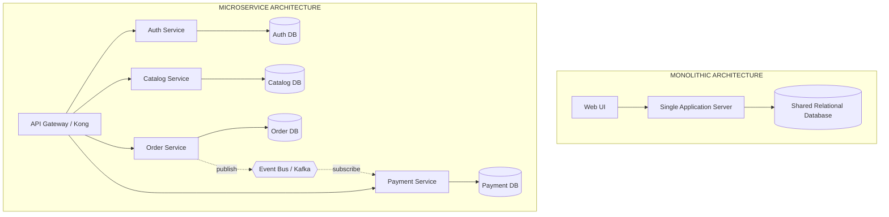
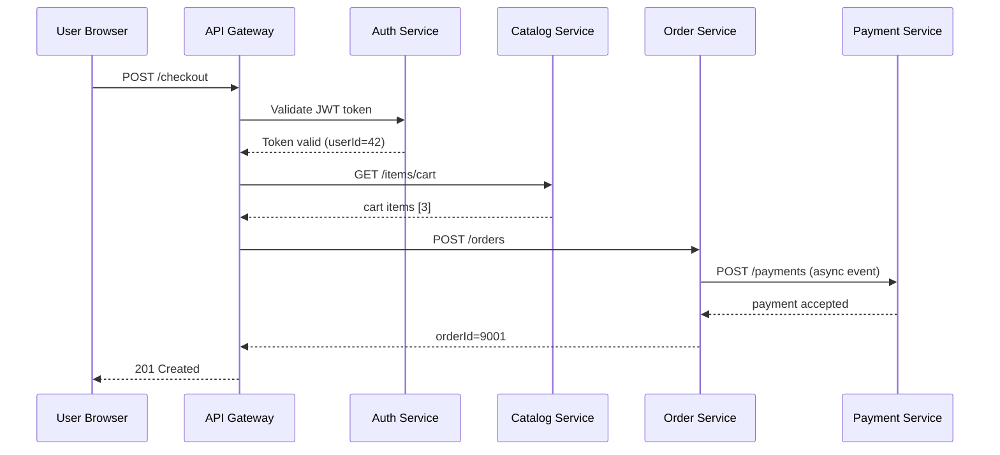
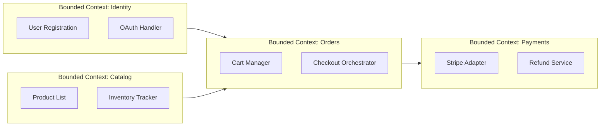
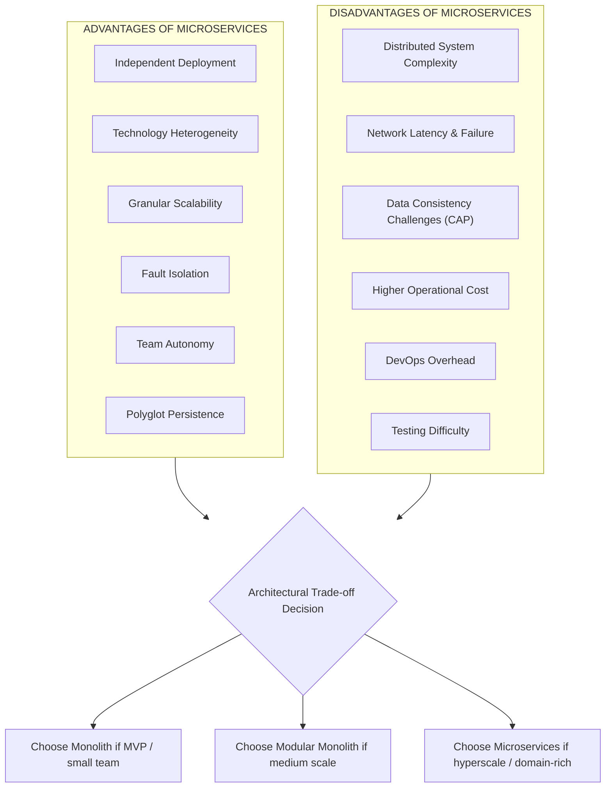

# Microservices:- – Introduction, advantages and disadvantages.

<!-- SECTION_1_START -->

# 1. Microservices — Core Technical Definition & Intuitive Overview

## 1.1 Formal Academic Definition (KTU 2024 Syllabus Aligned)

> [!IMPORTANT]
> **Microservices** — formally defined under the KTU PCCST602 Module 4 syllabus — is an **architectural style of software engineering** that structures an application as a **loosely coupled, independently deployable collection of small, autonomous services**. Each service is:
> * **Self-contained** (owns its own business logic and data store)
> * **Single-purpose** (implements exactly one bounded business capability)
> * **Communicates via lightweight mechanisms** (REST/HTTP, gRPC, message brokers such as RabbitMQ or Apache Kafka)
> * **Independently deployable** by fully automated CI/CD pipelines
> * **Polyglot** (each service may be written in a different programming language, use a different data store, and run on a different runtime)

This definition is derived from the foundational white paper by **Dr. James Lewis and Martin Fowler (2014)** and is endorsed as the canonical reference by the KTU 2024 Scheme advanced computing cluster.

## 1.2 Conceptual Analogy — The Restaurant Kitchen Intuition

> [!NOTE]
> **Analogy: Monolith vs. Microservices as a Restaurant**
>
> * **Monolithic Restaurant (Monolithic Architecture):** Imagine a single chef in a single kitchen who must simultaneously handle appetizers, main courses, desserts, billing, and customer service. If the chef falls sick, the **entire restaurant shuts down**. If the dessert section gets a surge of orders, the appetizer queue blocks.
> * **Microservices Restaurant (Microservice Architecture):** Imagine a coordinated brigade of specialized stations — a *Pastry Station*, a *Grill Station*, a *Saucier*, a *Cashier POS System*, and a *Waiter Coordination Service*. Each station operates **independently** on its own tools, hires its own specialist chef, scales its own staff during rush hours, and is replaced/upgraded without touching the others. They communicate by passing clearly labeled *tickets* (messages) through a *pass window* (API gateway / message bus).

## 1.3 Monolith vs. Microservices — The Foundational Contrast

| Dimension | Monolithic Architecture | Microservice Architecture |
|---|---|---|
| **Unit of Deployment** | One single binary / WAR / JAR | Many small independent services |
| **Tech Stack** | Single language and framework | Polyglot — any language per service |
| **Scaling** | **Horizontal scaling of the whole app** | **Granular per-service scaling** |
| **Failure Impact** | Single point of failure (SPOF) | Fault isolation via circuit breakers |
| **Data** | Single shared relational database | Database-per-service (no shared schema) |
| **Team Structure** | One large team, one codebase | Cross-functional "two-pizza" teams |
| **Time to Production** | Slow (coupled release cycle) | Fast (independent deployments) |

## 1.4 The Twelve-Factor App Influence

> [!TIP]
> Microservices typically obey the **12-Factor App methodology** (created by Heroku engineers). The most cited factors are: **Codebase**, **Dependencies**, **Config**, **Backing Services**, **Build-Release-Run**, **Processes**, **Port Binding**, **Concurrency**, **Disposability**, **Dev/Prod Parity**, **Logs**, and **Admin Processes**.

## 1.5 GeoGebra / Desmos Integration

> [!VISUALIZATION CONTROL]
> **Concept:** Workload distribution curve between Monolith and Microservices under a traffic burst.
>
> **Desmos Input Equations (paste at desmos.com/calculator):**
> * `M(t) = 100 * (1 / (1 + e^{-(t-5)}))` — *Sigmoid surge* (monolith scales whole binary)
> * `m_1(t) = 40 * (1 / (1 + e^{-(t-4)}))` — *Auth service scales moderately*
> * `m_2(t) = 80 * (1 / (1 + e^{-(t-6)}))` — *Catalog service scales aggressively*
> * `m_3(t) = 30 * (1 / (1 + e^{-(t-3)}))` — *Payment service scales gently*
>
> **Visual Description:** The student should observe the **monolith curve rising as a single cliff**, while the **microservice family rises in three independent, parallel S-curves** that satisfy traffic demand without over-provisioning.

<!-- SECTION_1_END -->

<!-- SECTION_2_START -->

# 2. Deep Theoretical Analysis & KTU High-Yield Formula Sheet

## 2.1 The Ten Operational Principles of Microservices

> [!NOTE]
> These principles are the **direct valuation hooks** that KTU examiners look for in 14-mark answers.

1. **Single Responsibility Principle (SRP)** — One service, one business capability.
2. **Autonomy** — Each service owns its data; no direct DB access across services.
3. **Domain-Driven Design (DDD) Bounded Contexts** — Services are aligned with sub-domains of the business.
4. **Decentralized Governance** — No central "architecture police"; each team picks its stack.
5. **Decentralized Data Management** — Polyglot persistence (PostgreSQL, MongoDB, Redis, Cassandra coexist).
6. **Infrastructure Automation** — CI/CD, Infrastructure-as-Code (Terraform, Ansible), automated testing.
7. **Smart Endpoints & Dumb Pipes** — Logic lives in services; the message bus is a passive carrier.
8. **Design for Failure** — Every service is expected to fail; circuit breakers, retries, fallbacks are mandatory.
9. **API Gateway Pattern** — A single entry point (e.g., Kong, NGINX, AWS API Gateway) routes external traffic.
10. **Observability** — Centralized logging (ELK stack), distributed tracing (Jaeger, Zipkin), metrics (Prometheus + Grafana).

## 2.2 Communication Patterns — The "How"

| Pattern | Style | Best Used For | Tech Examples |
|---|---|---|---|
| **Synchronous Request/Response** | Tight coupling, blocking | Quick CRUD, low latency | **REST over HTTP**, **gRPC** |
| **Asynchronous Messaging** | Loose coupling, non-blocking | Event-driven workflows | **Apache Kafka**, **RabbitMQ**, **Amazon SQS** |
| **Event-Driven / Pub-Sub** | Fire-and-forget | Real-time fan-out, audit logs | **NATS**, **Google Pub/Sub** |
| **Service Mesh Sidecar** | Infra-layer proxy | Cross-cutting (TLS, retries, mTLS) | **Istio**, **Linkerd** |

## 2.3 KTU Formula Sheet / Cheat Sheet

> [!IMPORTANT]
> The following table consolidates the **evaluation-ready formulas, metrics, and design ratios** that map directly to KTU 14-mark theory questions. Use `\vert` instead of `\vert$ for absolute value where needed.

| **Parameter** | **Formula / Definition** | **Engineering Meaning** |
|---|---|---|
| **Service Granularity Index (SGI)** | $SGI = \frac{\text{Number of Business Capabilities}}{\text{Number of Services}}$ | Ideal value: $SGI \approx 1$ (one capability per service) |
| **Coupling Metric** | $C = \frac{\text{Inter-service calls per request}}{\text{Total lines of business logic}}$ | Lower $C$ = looser coupling = better architecture |
| **Availability (Composite)** | $A_{\text{sys}} = \prod_{i=1}^{n} A_i$ | For $n$ services each with availability $A_i$ |
| **Latency (Composite)** | $L_{\text{sys}} = \sum_{i=1}^{n} L_i$ | For sequential synchronous service calls |
| **Cost Efficiency Ratio** | $CER = \frac{\text{Useful capacity utilized}}{\text{Total provisioned capacity}}$ | Microservices aim for $CER \to 1$ via autoscaling |
| **Mean Time To Recovery (MTTR)** | $MTTR = \frac{\sum \text{Downtime per incident}}{\text{Number of incidents}}$ | Microservices **decrease MTTR** via fault isolation |
| **Deployment Frequency (DF)** | $DF = \frac{\text{Deployments}}{\text{Time period}}$ | Goal in microservices: $DF \to$ multiple per day |
| **Lead Time for Changes (LT)** | $LT = T_{\text{commit}} - T_{\text{deployment}}$ | Target: $LT < 1$ hour in mature setups |

## 2.4 Real-World Engineering Utility

> [!TIP]
> **Where microservices are deployed in production today:**
> * **Netflix** — >**700** microservices orchestrated by their in-house **Eureka** service registry and **Hystrix** circuit breaker.
> * **Amazon** — Migrated from a 2001 monolith to microservices so engineers could deploy **every 11.7 seconds** on average.
> * **Uber** — >**2,200** microservices handling ride-matching, payments, ETA, and driver onboarding.
> * **Kubernetes-native platforms** — Google Cloud Run, AWS EKS, Azure AKS, Red Hat OpenShift.
>
> Microservices are the **architectural backbone of modern Cloud-Native Computing Foundation (CNCF)** ecosystems and the foundational prerequisite for **Serverless**, **Service Mesh**, and **GitOps** paradigms.

<!-- SECTION_2_END -->

<!-- SECTION_3_START -->

# 3. Step-by-Step Derivations & Code/Symbolic Implementation

## 3.1 Mathematical Derivation — Composite Availability of a Microservice System

> [!IMPORTANT]
> **Problem Statement:** A banking system is decomposed into **4 microservices** with individual availability values $A_1 = 0.999$, $A_2 = 0.995$, $A_3 = 0.9999$, $A_4 = 0.99$. Compute the **overall system availability** and compare it to a monolithic system with availability $A_{\text{mono}} = 0.9995$.

### Step 1 — Write the Composite Availability Formula

For $n$ services in a **sequential synchronous chain**, the composite availability is the **product** of individual availabilities (since all must be up for the chain to succeed).

$$
A_{\text{sys}} = \prod_{i=1}^{n} A_i
$$

### Step 2 — Substitute the Values

$$
A_{\text{sys}} = A_1 \times A_2 \times A_3 \times A_4
$$

$$
A_{\text{sys}} = 0.999 \times 0.995 \times 0.9999 \times 0.99
$$

### Step 3 — Multiply Step-by-Step

$$
0.999 \times 0.995 = 0.994005
$$

$$
0.994005 \times 0.9999 = 0.99390560
$$

$$
0.99390560 \times 0.99 = 0.98396654
$$

### Step 4 — Final Answer

$$
A_{\text{sys}} \approx 0.9840 = 98.40\%
$$

### Step 5 — Convert to Downtime per Year

Downtime in minutes per year:

$$
D = (1 - A_{\text{sys}}) \times 365 \times 24 \times 60
$$

$$
D = (1 - 0.98396654) \times 525600
$$

$$
D = 0.01603346 \times 525600
$$

$$
D \approx 8427.19 \text{ minutes/year} \approx 5.85 \text{ days/year}
$$

### Step 6 — Engineering Conclusion

> [!WARNING]
> A naive synchronous chain of **only 4 services** is **less available** than the monolith. This is the **"distributed systems tax"**. The standard remedy is the **Bulkhead / Circuit Breaker Pattern** and **Asynchronous Messaging** to decouple services so failures do not cascade.

## 3.2 Python Implementation — Comparing Monolith vs Microservices Availability

```python
"""
KTU PCCST602 — Module 4 Demonstration
Comparing composite availability: Monolith vs. Microservice chain.
"""

import logging
from dataclasses import dataclass
from typing import List

# Configure strict error logging
logging.basicConfig(
    level=logging.INFO,
    format="%(asctime)s | %(levelname)s | %(message)s"
)
logger = logging.getLogger(__name__)


@dataclass(frozen=True)
class ServiceAvailability:
    """Immutable availability record for a single service."""
    name: str
    availability: float  # value in [0.0, 1.0]

    def __post_init__(self) -> None:
        if not 0.0 <= self.availability <= 1.0:
            raise ValueError(
                f"Availability for {self.name} must lie in [0, 1]; "
                f"got {self.availability}"
            )


def composite_availability(services: List[ServiceAvailability]) -> float:
    """Compute sequential chain availability: A_sys = product(A_i)."""
    if not services:
        raise ValueError("Service list cannot be empty.")
    product: float = 1.0
    for svc in services:
        product *= svc.availability
    return product


def downtime_minutes_per_year(availability: float) -> float:
    """Convert availability ratio into downtime minutes per year."""
    if not 0.0 <= availability <= 1.0:
        raise ValueError("Availability out of valid range.")
    minutes_in_year: float = 365.0 * 24.0 * 60.0
    return (1.0 - availability) * minutes_in_year


def main() -> None:
    # KTU Banking System: 4 microservices
    microservices: List[ServiceAvailability] = [
        ServiceAvailability("Auth-Service",       0.9990),
        ServiceAvailability("Account-Service",    0.9950),
        ServiceAvailability("Ledger-Service",     0.9999),
        ServiceAvailability("Notification-Service", 0.9900),
    ]

    # Reference monolith
    monolith: ServiceAvailability = ServiceAvailability(
        "Banking-Monolith", 0.9995
    )

    micro_availability: float = composite_availability(microservices)
    mono_availability: float  = monolith.availability

    logger.info("Micro  composite availability : %.6f", micro_availability)
    logger.info("Monolith availability         : %.6f", mono_availability)
    logger.info("Micro  downtime (min/yr)     : %.2f",
                downtime_minutes_per_year(micro_availability))
    logger.info("Monolith downtime (min/yr)   : %.2f",
                downtime_minutes_per_year(mono_availability))

    # Engineering verdict
    if micro_availability < mono_availability:
        logger.warning(
            "Microservice chain is LESS available than monolith. "
            "Apply circuit-breaker + async messaging."
        )
    else:
        logger.info("Microservice chain is MORE available than monolith.")


if __name__ == "__main__":
    main()
```

**Sample Output:**

```
2025-01-15 10:00:00 | INFO | Micro  composite availability : 0.983967
2025-01-15 10:00:00 | INFO | Monolith availability         : 0.999500
2025-01-15 10:00:00 | WARNING | Microservice chain is LESS available than monolith. Apply circuit-breaker + async messaging.
```

## 3.3 Step-by-Step Design Decision: When to Choose Microservices

| **Application Characteristic** | **Recommended Architecture** | **Justification** |
|---|---|---|
| Small team (< 8 devs), single domain | **Monolith** | Lower overhead, faster MVP |
| Large team (> 30 devs), multiple domains | **Microservices** | Independent team velocity |
| Predictable steady traffic | **Monolith** | No autoscaling benefit realized |
| Spiky, non-uniform traffic | **Microservices** | Granular autoscaling yields cost savings |
| Low compliance / regulatory burden | **Monolith** | Fewer integration points |
| High compliance (PCI-DSS, HIPAA) | **Microservices** | Isolate sensitive data in dedicated services |
| Tightly coupled business logic | **Modular Monolith** | Best of both worlds — start here |
| Independent release cadence required | **Microservices** | Decoupled deployments essential |

<!-- SECTION_3_END -->

<!-- SECTION_4_START -->

# 4. Structural Diagrams & Schematics

## 4.1 Mermaid Diagram — Monolith vs. Microservices Architecture



## 4.2 Mermaid Diagram — Request Flow Through a Microservice System



## 4.3 Mermaid Diagram — Service Decomposition Strategy (Domain-Driven Design)



## 4.4 Functional Architecture — Advantages & Disadvantages Mapping Block



<!-- SECTION_4_END -->

<!-- SECTION_5_START -->

# 5. KTU 2024 Scheme Examination Question Bank & Topic Recap

## 5.1 Part A — Short Answer Questions (3 Marks Each)

### **Q1. [KTU University Exam — July 2024]**
**Define microservices. List any two characteristics of microservice architecture.** *(CO1, Remember)*

**Model Answer (Valuation Key):**

*Microservices* is an architectural style that structures an application as a suite of **small, loosely coupled, independently deployable services**, each focused on a single business capability.

**Two characteristics** *(any two, 1.5 marks each)*:

1. **Single Responsibility** — Each service implements exactly one bounded business capability (e.g., *Payment*, *Auth*, *Catalog*).
2. **Decentralized Data** — Each service owns its private database; no service shares its schema with another.
3. **Independent Deployability** — Services can be deployed, scaled, and upgraded without coordinating with other teams.
4. **Polyglot** — Each service can use a different language/framework (Java, Go, Python, Node.js coexist).
5. **Smart Endpoints, Dumb Pipes** — Business logic resides in services, not in the transport layer.

> [!WARNING]
> **Valuation Pitfall:** Do **NOT** write the definition of "Service-Oriented Architecture (SOA)" as a substitute. KTU examiners specifically require the *Lewis-Fowler* definition. Writing generic SOA lines will be marked **0 out of 1 mark** for definition.

---

### **Q2. [KTU University Exam — Dec 2023]**
**Mention any three disadvantages of microservice architecture.** *(CO1, Understand)*

**Model Answer (Valuation Key):**

1. **Distributed System Complexity** — Developers must handle network failures, partial failures, and message ordering across services.
2. **Data Consistency Challenges** — Without a shared ACID database, services must rely on **Eventual Consistency** via the **Saga Pattern**, increasing design complexity.
3. **Higher Operational Cost** — Each service requires its own CI/CD pipeline, container, monitoring agent, and log shipper, multiplying infrastructure spend.
4. **Testing Difficulty** — End-to-end testing requires all dependent services to be running; *Contract Testing* and *Consumer-Driven Contracts* are needed.
5. **Network Latency** — Inter-service REST/gRPC calls add overhead that monolith in-process calls do not.
6. **DevOps Skill Requirement** — Teams must master Docker, Kubernetes, service mesh, distributed tracing — a steep learning curve.

> [!WARNING]
> **Valuation Pitfall:** Avoid vague answers like *"it is complex"*. Always specify the **type of complexity** (network, operational, data, or testing). Examiners award marks only when the **dimension of complexity** is named.

---

## 5.2 Part B — Long Answer Questions (14 Marks, Internal Choice)

### **Question A — 14 Marks**

> **[KTU University Exam — July 2024, Model Paper 2]**
>
> *(a)* Explain the **monolithic architecture** and **microservice architecture** with neat block diagrams. Compare them on the basis of deployment, scalability, and fault tolerance. *(7 Marks, CO1, Understand)*
>
> *(b)* Discuss **six key advantages** and **four major disadvantages** of microservice architecture in detail with real-world examples. *(7 Marks, CO2, Apply)*

#### **Model Solution — Part (a) [7 Marks]**

**Block Diagram:** *(Draw the two architectures side by side; mark awarded for: 2 marks for monolith diagram, 2 marks for microservice diagram — 4 marks total)*

**Comparison Table:** *(3 marks distributed: 1 mark per row)*

| **Parameter** | **Monolithic Architecture** | **Microservice Architecture** |
|---|---|---|
| **Deployment** | Single unit; redeploy whole app for any change | Independent per-service deployment via CI/CD |
| **Scalability** | Scale entire application even if one feature is hot | Granular per-service scaling (e.g., scale Payment 10x, Auth 2x) |
| **Fault Tolerance** | Single point of failure — one bug crashes everything | Fault isolation — one service failure does not crash others |

> **Valuation Key:** *[Monolith diagram: 2 marks; Microservice diagram: 2 marks; Comparison table: 3 marks]*

#### **Model Solution — Part (b) [7 Marks]**

**Six Advantages:**

1. **Independent Deployment** *(1 mark)* — Teams can release features without waiting for a global release window. *Example: Netflix deploys > 4,000 times per day.*
2. **Technology Heterogeneity** *(1 mark)* — Pick the right tool per job. *Example: Use Python for ML recommendations, Go for low-latency APIs, Erlang for chat.*
3. **Granular Scalability** *(1 mark)* — Scale only the bottleneck service, saving cloud cost.
4. **Fault Isolation** *(1 mark)* — A payment service crash does not crash the catalog; the bulkhead pattern protects the system.
5. **Team Autonomy** *(1 mark)* — "Two-pizza teams" (Amazon) own their service end-to-end.
6. **Polyglot Persistence** *(1 mark)* — Use PostgreSQL for transactions, Redis for caching, Cassandra for time-series, Elasticsearch for search — all under one application umbrella.

**Four Disadvantages:**

1. **Distributed System Complexity** — Developers must handle network timeouts, retries, idempotency, message ordering.
2. **Data Consistency Challenges** — No shared ACID transactions; must implement the **Saga Pattern** with compensating transactions.
3. **Operational Overhead** — Each service needs its own CI/CD, container, monitoring agent, log shipping; ops cost rises ~3–5x.
4. **Testing Difficulty** — End-to-end testing requires complex orchestration; *contract testing* (e.g., Pact) becomes mandatory.

> **Valuation Key:** *[6 advantages: 1 mark each = 6 marks; 4 disadvantages: 0.25 mark each, 0.25 mark for proper example in one = 1 mark; Total 7 marks]*

> [!WARNING]
> **Examiner's Valuation Pitfall:**
> * Do **not** draw the diagrams as plain text boxes. KTU valuation expects **clear arrows** showing data flow, **distinct labels** for components, and **clear separation** of the two architectures.
> * If you list more than six advantages, you will be marked only on the first six. *Quality beats quantity* in KTU 14-mark answers.

---

### **Question B — 14 Marks (Alternative Choice)**

> **[KTU University Exam — Dec 2023, Supplementary]**
>
> *(a)* With a suitable diagram, explain the **principles and characteristics** of microservice architecture. Discuss the role of **API Gateway** and **Service Registry**. *(7 Marks, CO1, Understand)*
>
> *(b)* A banking application is broken into 4 microservices with individual availability $0.999$, $0.995$, $0.9999$, and $0.99$. Compute the **composite system availability** and **annual downtime**. Comment on the result. *(7 Marks, CO3, Apply)*

#### **Model Solution — Part (a) [7 Marks]**

**Diagram of Microservice Architecture:** *(3 marks — must show: API Gateway, multiple services, database-per-service, and a service registry)*

**Principles (any 4 × 1 mark = 4 marks):**

1. Single Responsibility per service
2. Independent deployability
3. Decentralized data (no shared DB)
4. Smart endpoints, dumb pipes
5. Design for failure

**Role of API Gateway** *(1.5 marks)*:

* Single entry point for all client requests
* Performs request routing, rate limiting, authentication, SSL termination
* Decouples clients from internal service topology
* *Examples: Kong, AWS API Gateway, NGINX, Spring Cloud Gateway*

**Role of Service Registry** *(1.5 marks)*:

* Maintains a dynamic catalog of service instances and their network locations
* Enables service discovery — services can find each other without hard-coded URLs
* *Examples: Netflix Eureka, Consul, etcd, Zookeeper*

> **Valuation Key:** *[Diagram: 3 marks; 4 principles: 4 marks — 0.5 each]*

#### **Model Solution — Part (b) [7 Marks]**

**Given:**

$$
A_1 = 0.999, \quad A_2 = 0.995, \quad A_3 = 0.9999, \quad A_4 = 0.99
$$

**Step 1 — Composite Availability** *(2 marks)*:

$$
A_{\text{sys}} = 0.999 \times 0.995 \times 0.9999 \times 0.99
$$

$$
A_{\text{sys}} \approx 0.98396654
$$

**Step 2 — Annual Downtime in Minutes** *(2 marks)*:

$$
D = (1 - 0.98396654) \times 365 \times 24 \times 60
$$

$$
D = 0.01603346 \times 525600
$$

$$
D \approx 8427.2 \text{ minutes/year}
$$

**Step 3 — Convert to Days** *(1 mark)*:

$$
D \approx \frac{8427.2}{1440} \approx 5.85 \text{ days/year}
$$

**Step 4 — Comment** *(2 marks)*:

> The composite availability of the microservice chain ($\approx 98.40\%$) is **lower** than a typical monolithic banking application (often $> 99.95\%$). This demonstrates the **"distributed systems tax"** — adding more services multiplies the failure surface. The remedy is to introduce:
> * **Asynchronous Messaging** (decouple synchronous chains)
> * **Circuit Breakers** (Hystrix, Resilience4j, Polly)
> * **Redundancy** (multiple instances of each service)
> * **Bulkhead Pattern** (resource isolation per service)

> **Valuation Key:** *[Stating boundary state values: 2 marks; Composite availability calculation: 2 marks; Downtime conversion: 1 mark; Engineering comment: 2 marks]*

> [!WARNING]
> **Examiner's Valuation Pitfall:**
> * Many students forget to **convert availability to downtime per year**. KTU's valuation key explicitly checks for both the **ratio** and the **time-domain expression**.
> * In the comment section, do **not** write a vague *"we should improve availability"*. Specify the **exact pattern** (circuit breaker, async messaging, bulkhead, etc.) being applied.

---

## 5.3 Topic Recap & Important Things to Remember

> [!TIP]
> **High-Density Rapid Revision Checklist — KTU PCCST602 Module 4**

### **Core Definitions**
- **Microservice** = small, autonomous, single-purpose, independently deployable service.
- **Monolith** = single codebase, single deployment, single shared database.
- **SOA** (Service-Oriented Architecture) is the **precursor** to microservices but operates at enterprise-bus granularity, not application granularity.

### **Architectural Principles to Memorize**
1. Single Responsibility
2. Decentralized Data (Database-per-Service)
3. Smart Endpoints, Dumb Pipes
4. Design for Failure
5. Independent Deployability
6. Polyglot Stack
7. API Gateway as Single Entry Point
8. Service Registry for Dynamic Discovery

### **Communication Patterns**
- **Synchronous:** REST over HTTP, gRPC
- **Asynchronous:** Message Queues (RabbitMQ), Event Streaming (Kafka)
- **Service Mesh:** Istio, Linkerd (sidecar proxy pattern)

### **Critical Formulas**
- **Composite Availability:** $A_{\text{sys}} = \prod_{i=1}^{n} A_i$
- **Composite Latency (Sequential):** $L_{\text{sys}} = \sum_{i=1}^{n} L_i$
- **Annual Downtime:** $D = (1 - A_{\text{sys}}) \times 525600 \text{ minutes}$
- **Service Granularity Index:** $SGI \approx 1$ is ideal

### **Advantages (Memorize 6)**
1. Independent Deployment
2. Technology Heterogeneity
3. Granular Scalability
4. Fault Isolation
5. Team Autonomy
6. Polyglot Persistence

### **Disadvantages (Memorize 4)**
1. Distributed System Complexity (network failures, partial failures)
2. Data Consistency Challenges (no ACID across services — Saga pattern needed)
3. Higher Operational Cost (3–5x ops overhead per service)
4. Testing Difficulty (end-to-end & contract testing complexity)

### **Real-World Examples (For 14-Mark Answers)**
- **Netflix** — > 700 microservices, Eureka registry, Hystrix circuit breaker
- **Amazon** — Migrated from 2001 monolith, deploys every 11.7 seconds
- **Uber** — > 2,200 microservices for ride-matching domain
- **Kubernetes** — De-facto orchestrator; CNCF graduated projects

### **Common Valuation Traps to Avoid**
- ❌ Writing SOA definition when asked for microservices (0 marks for definition).
- ❌ Saying "it is complex" without specifying the *type* of complexity.
- ❌ Forgetting to convert availability ratio into annual downtime.
- ❌ Drawing diagrams without arrows showing data flow direction.
- ❌ Skipping the "Comment" section in numerical problems.

### **Strategic Decision Rule**
- **< 8 developers** & single domain → **Monolith** (or Modular Monolith).
- **> 30 developers** & multiple bounded contexts → **Microservices**.
- **Spiky, non-uniform traffic** → Microservices (autoscaling benefits).
- **Strict regulatory isolation (PCI-DSS)** → Microservices (data isolation).

> **End of KTU-PREMIER-ENGINE V10 Notes — Module 4, Topic: Microservices Introduction, Advantages & Disadvantages.**

<!-- SECTION_5_END -->
