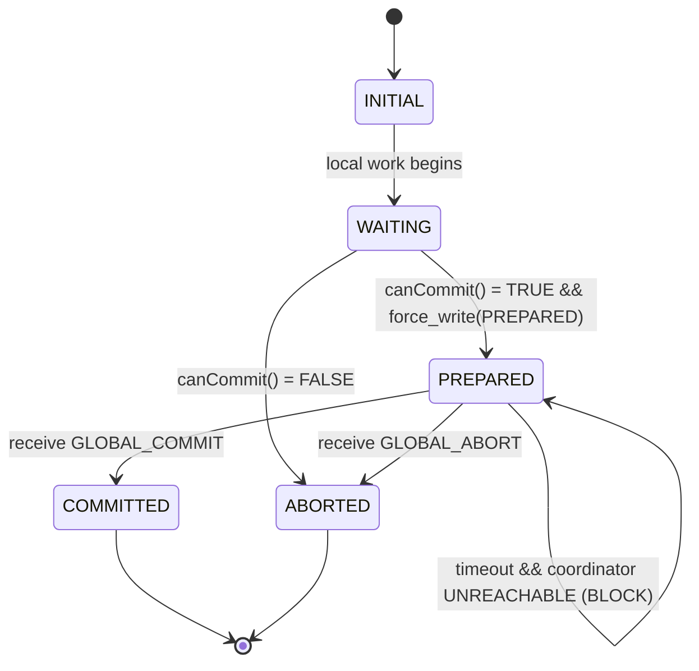
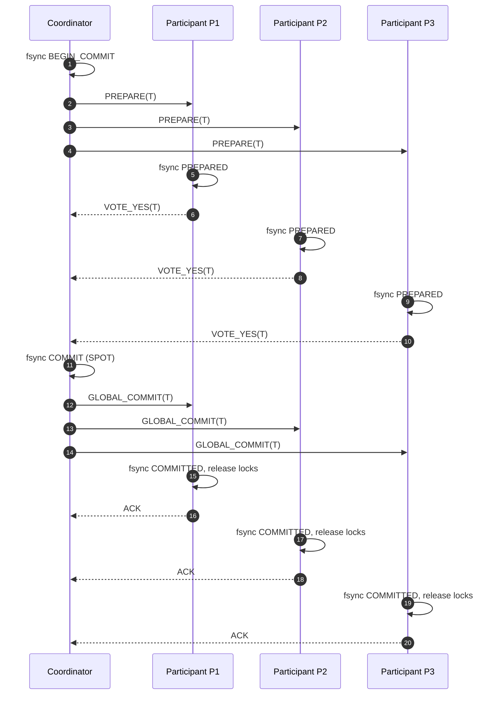
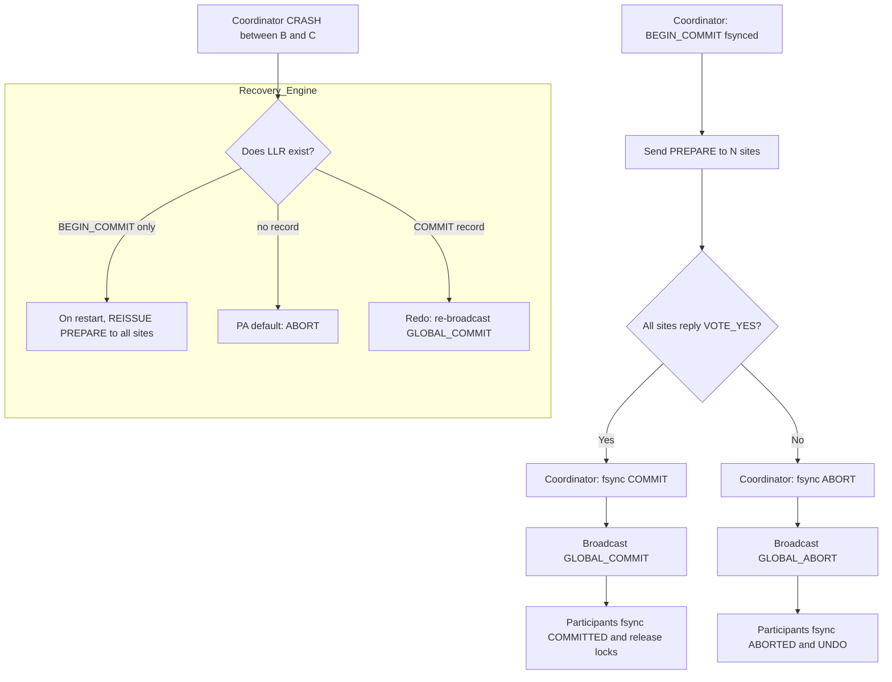
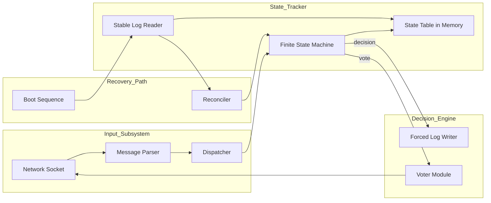

# 2-Phase Commit protocols execution state tracking engines layouts

<!-- SECTION_1_START -->

# Advanced Database Systems — PECST605
## Module 1: Distributed & Object Database Formats
### Topic: Two-Phase Commit (2PC) Protocol — Execution State Tracking & Engine Layouts

> [!IMPORTANT]
> **KTU 2024 Syllabus Anchor (PECST605 / Module 1):** *Atomic Commit Protocols in Distributed Transactions — 2-Phase Commit (2PC), 3-Phase Commit, Presumed-Abort / Presumed-Commit variants, log-driven recovery and state machines of the commit engine.*

---

### 1. Core Technical Definition

The **Two-Phase Commit (2PC) Protocol** is a *distributed atomic commitment protocol* designed to ensure that a transaction spanning multiple heterogeneous database sites either **commits at all sites** or **aborts at all sites**, thereby preserving the **ACID atomicity** property across a distributed system. It operates under a *centralized coordinator-participant* (or *master-slave*) architectural topology, where a single node elected as the **Coordinator** orchestrates the decision and the remaining nodes, termed **Participants** (or *Cohorts*), execute local decisions and acknowledge.

Formally, 2PC partitions the commit decision into two sequential voting phases:

1. **Voting Phase (Phase 1)** — The coordinator sends a `PREPARE` (`VOTE_REQUEST`) message to every participant. Each participant evaluates the transaction locally, writes a forced log record, and replies with either `YES` (`VOTE_COMMIT`) or `NO` (`VOTE_ABORT`).
2. **Decision Phase (Phase 2)** — Based on the global vote outcome, the coordinator writes a termination log record (`COMMIT` or `ABORT`) and broadcasts the decision. Participants acknowledge and finalize their local state.

> [!NOTE]
> **Definition — Atomic Commit Point:** The instant at which the decision record is durably flushed to stable storage on the coordinator is called the *Single Point of Truth* (SPOT). Recovery semantics of 2PC are built entirely around recovering from the SPOT.

> [!NOTE]
> **Definition — In-Doubt Transaction:** A participant that has acknowledged `YES` (written `<PREPARED T>`) but not yet received the final decision is said to be *in-doubt* (or *prepared*). Such a transaction must hold its locks until resolution, producing a *blocking behaviour* characteristic of 2PC.

---

### 2. Conceptual Analogy & Intuition

> [!TIP]
> **Real-World Analogy — The Wedding Venue Decision**
>
> Imagine a destination wedding where the bride's family and the groom's family live in two different cities. Neither family can finalize bookings (caterer, priest, hall) independently — they must **mutually agree** before any contract is signed. The wedding planner acts as the **Coordinator**:
>
> 1. **Phase 1 (The "Are you ready?" call):** The planner calls both families and asks, *"Can you commit to this date, this budget, this menu?"* Each family privately checks their constraints (venue availability, finances, family logistics) and replies **"Yes, we're ready"** or **"No, we can't"**.
> 2. **Phase 2 (The announcement):** If *both* say "Yes", the planner signs the master contract and announces the wedding. If *any* say "No", the planner cancels everything and announces a halt.
>
> **The blocking problem** manifests when the planner's phone dies right after both families said "Yes" but before announcing. Both families are *locked in* — caterer reserved, hall booked, priest held — and they cannot proceed or retreat. They must *wait* (block) until the planner's phone is recharged. This waiting is the *blocking* nature of 2PC.

---

### 3. Visualization Control — Protocol State Surface

> [!VISUALIZATION CONTROL]
> **Concept:** *Geometric representation of 2PC as a two-tier voting-decision manifold.*
> **Desmos Input Equations (Cartesian):**
> * `x = 1` &nbsp; (Phase boundary — Voting ↔ Decision)
> * `y = \sum_{i=1}^{N} v_i` &nbsp; (vote aggregator, where $v_i \in \{0, 1\}$ for each of $N$ participants)
> * `C = (x, y)` &nbsp; (Coordinator state point; $y = N \Rightarrow$ commit-eligible, $y < N \Rightarrow$ abort)
> **Visual Description:** Plot the vote count $y$ on the vertical axis (range $0 \ldots N$) and the phase index $x \in \{0, 1\}$ on the horizontal axis. The coordinator state $C$ sits at the intersection. When $C$ crosses the line $x = 1$ (entering Decision Phase), the commit decision is reached **iff** $y = N$; otherwise the point is projected to the *abort* terminal. The flat plateau at $y = N$ during Phase 1 is the *prepared-but-undecided* region — visually the *blocking zone*.

---

### 4. Architectural Vocabulary — Strict Definitions

| Symbol | Formal Name | Role |
| :--- | :--- | :--- |
| **C** | Coordinator | The elected site that drives the protocol; writes `<COMMIT T>` or `<ABORT T>` to its log. |
| **P<sub>i</sub>** | Participant *i* | A subordinate site that holds a branch of transaction *T* and votes. |
| **TM** | Transaction Manager | Subsystem implementing 2PC on a node. |
| **RM** | Resource Manager | Manages local resources (locks, log, buffer) for a participant. |
| **L** | Stable Log | Append-only, force-written storage for recovery records. |
| **SP<sup>c</sup>** | Single Point of Truth (Coordinator) | The moment the coordinator's decision is force-written. |
| **SP<sup>p</sup><sub>i</sub>** | Single Point of Truth (Participant *i*) | The moment a participant writes `<PREPARED T>`. |

> [!IMPORTANT]
> **Physical Constants / Standard Metrics in Bold:**
> * **Message complexity of 2PC (success case):** $4N$ messages ($N$ PREPARE + $N$ VOTE_YES + $N$ COMMIT + $N$ ACK) plus $2$ extra phases.
> * **Log writes (success):** Coordinator $= 2$ (PREPARE/COMMIT); Per Participant $= 2$ (PREPARED/COMMIT) → **Total forced writes** $= 2(N+1)$.
> * **Blocking latency bound:** Up to *one maximum message round-trip + coordinator recovery time* before in-doubt resolution.
> * **Synchronous disk-flush (forced I/O):** typically **~5–10 ms** per fsync on commodity SSD, dominating the commit time.

---

<!-- SECTION_1_END -->

<!-- SECTION_2_START -->

# Deep Theoretical Analysis — Execution States, Transitions & Engine Layout

## 1. The Five Canonical States of a Participant

Each participant's Transaction Manager (TM) maintains a **deterministic finite state machine (DFSM)** with the following states:

| State | Mnemonic | Meaning | Invariant |
| :--- | :--- | :--- | :--- |
| **INITIAL** | $\mathcal{S}_0$ | Transaction *T* has begun; no log yet. | No locks held. |
| **WAITING** | $\mathcal{S}_1$ | Local branch executing, awaiting vote request. | Locks may be held. |
| **PREPARED** | $\mathcal{S}_2$ | `PREPARE` received; `<PREPARED T>` force-written; replied `YES`. | All locks retained, no unilateral release. |
| **COMMITTED** | $\mathcal{S}_3$ | `<COMMIT T>` received and acknowledged. | Locks released; effects made durable. |
| **ABORTED** | $\mathcal{S}_4$ | `ABORT` received (or local `NO` issued). | Locks released; rollback complete. |

> [!NOTE]
> **State Transition Theorem:** Once a participant enters $\mathcal{S}_3$ or $\mathcal{S}_4$, it is **terminal** and **irreversible**. The transition $\mathcal{S}_2 \to \mathcal{S}_0$ is *forbidden* — this is the precise formulation of the *blocking* property.

## 2. Coordinator States

| State | Meaning |
| :--- | :--- |
| **INIT** | Received `commit(T)` request from application. |
| **WAITING_VOTES** | `PREPARE` sent; collecting `VOTE_YES/NO`. |
| **COMMITTED** | All `YES`; `<COMMIT T>` flushed; broadcasting. |
| **ABORTED** | Any `NO` or timeout; `<ABORT T>` flushed; broadcasting. |

## 3. Message Catalogue

| Message | Direction | Semantics |
| :--- | :--- | :--- |
| `PREPARE(T)` | $C \to P_i$ | "Vote on committing $T$." |
| `VOTE_YES(T)` | $P_i \to C$ | Local branch ready; locks retained. |
| `VOTE_NO(T, reason)` | $P_i \to C$ | Local abort; will not commit. |
| `GLOBAL_COMMIT(T)` | $C \to P_i$ | Final commit decision. |
| `GLOBAL_ABORT(T, reason)` | $C \to P_i$ | Final abort decision. |
| `ACK(T)` | $P_i \to C$ | Decision received and acted upon. |
| `QUERY_STATUS(T)` | $C \to P_i$ (recovery) | Asked after coordinator crash. |

## 4. Recovery — The State Tracking Engine

> [!IMPORTANT]
> **KTU High-Yield Concept — Presumed Abort (PA) vs. Presumed Commit (PC):**
> These are *optimizations* of 2PC that exploit log conventions to reduce forced writes. The question of "which log records may be omitted" is a classic KTU Module 1 question.

* **Presumed Abort (PA):** The default `ABORT` outcome is *presumed* if no log record is found. Coordinator omits `<COMMIT T>` log record; participants omit `<ABORT T>` log record.
* **Presumed Commit (PC):** The default `COMMIT` outcome is *presumed* if no log record is found. Coordinator omits `<ABORT T>` log record; participants omit `<COMMIT T>` log record.

The state tracking engine on a recovering node proceeds as:
1. Read the **last log record (LLR)** for transaction $T$ from the local log $L$.
2. Dispatch on the record type → state.

---

## 5. KTU High-Yield Formula Sheet

| # | Formula / Cost Metric | Expression | Engineering Meaning |
| :--- | :--- | :--- | :--- |
| 1 | **Total Messages (success)** | $M_{\text{succ}} = 4N$ | $N$ sites + 1 coordinator. |
| 2 | **Total Messages (abort)** | $M_{\text{abort}} = 2 + 2k$ | $k$ = sites that already voted `YES`. |
| 3 | **Forced Log Writes (PA, success)** | $W_f = 2$ | Only `<BEGIN_COMMIT>` + omitted commit. |
| 4 | **Forced Log Writes (PC, success)** | $W_f = 2N + 1$ | Every site writes `<COMMIT>`. |
| 5 | **Coordinator Crash Latency** | $T_{\text{rec}} = 2 \cdot RTT + T_{\text{fsync}}$ | Recovery round-trip. |
| 6 | **In-doubt Lock Hold Time** | $T_{\text{block}} \le T_{\text{rec}}$ | Blocking window. |
| 7 | **Quorum for commit (linear 2PC)** | $Q_{\text{commit}} = N$ | Unanimous vote. |
| 8 | **Message complexity, 3PC (for contrast)** | $5N$ | Added prepare-to-commit phase. |

> **Notation Note:** Vertical bars in formulas (e.g. for absolute value or set size) are written as `\vert \cdot \vert` to keep markdown tables safe.

## 6. Real-World Engineering Utility

* **PostgreSQL `PREPARE TRANSACTION`** implements a variant of 2PC for external transaction managers (e.g., XA-compliant application servers).
* **Oracle Two-Phase Commit** uses *in-doubt transaction resolution* with `DBA_2PC_PENDING` views.
* **MySQL XA / InnoDB** logs `XA PREPARE` and `XA COMMIT` as `MLOG_XA_PREPARE` records in the redo log.
* **Kafka Exactly-Once Semantics (EOS)** uses a coordinator-driven 2PC-like protocol between producers and the transaction coordinator broker.
* **Distributed microservices (Saga compensation)** is a non-blocking *alternative* — often contrasted with 2PC in KTU Module 1 viva questions.

---

<!-- SECTION_2_END -->

<!-- SECTION_3_START -->

# Step-by-Step Derivations, Algorithms & Code Implementation

## 1. Formal Algorithm — Coordinator Side (Success Path)

Let $T$ denote the global transaction identifier, $N$ the participant count, and $P = \{P_1, P_2, \ldots, P_N\}$ the participant set.

$$
\begin{aligned}
\text{Algorithm } \texttt{COORDINATOR\_2PC}(T): \\
1.\quad &\text{WRITE\_FORCE}(\log, \langle \texttt{BEGIN\_COMMIT}, T \rangle) \\
2.\quad &\text{state}_C \leftarrow \texttt{WAITING\_VOTES} \\
3.\quad &\text{for } i = 1 \text{ to } N \text{ do} \\
4.\quad &\quad \text{SEND}(P_i, \langle \texttt{PREPARE}, T \rangle) \\
5.\quad &\text{endfor} \\
6.\quad &\text{wait for responses with timeout } \tau_C \\
7.\quad &\text{if } \bigwedge_{i=1}^{N} \text{RESPONSE}(P_i) = \texttt{VOTE\_YES} \text{ then} \\
8.\quad &\quad \text{WRITE\_FORCE}(\log, \langle \texttt{COMMIT}, T \rangle) \\
9.\quad &\quad \text{state}_C \leftarrow \texttt{COMMITTED} \\
10.\quad &\quad \text{for } i = 1 \text{ to } N \text{ do SEND}(P_i, \langle \texttt{GLOBAL\_COMMIT}, T \rangle) \text{ end} \\
11.\quad &\text{else} \\
12.\quad &\quad \text{WRITE\_FORCE}(\log, \langle \texttt{ABORT}, T, \text{reason} \rangle) \\
13.\quad &\quad \text{state}_C \leftarrow \texttt{ABORTED} \\
14.\quad &\quad \text{for } i = 1 \text{ to } N \text{ do SEND}(P_i, \langle \texttt{GLOBAL\_ABORT}, T \rangle) \text{ end} \\
15.\quad &\text{endif}
\end{aligned}
$$

> [!IMPORTANT]
> **Line 1 + Line 8 (or Line 12)** are the *Single Points of Truth* for the coordinator. The protocol's correctness hinges on the **force-write (fsync)** semantics between SEND and state transition.

---

## 2. Formal Algorithm — Participant Side

$$
\begin{aligned}
\text{Algorithm } \texttt{PARTICIPANT\_2PC}(P_i, T): \\
1.\quad &\text{upon RECEIVE}(\langle \texttt{PREPARE}, T \rangle) \text{ do} \\
2.\quad &\quad \text{if } \text{canCommit}(P_i, T) \text{ then} \\
3.\quad &\quad\quad \text{WRITE\_FORCE}(\log_i, \langle \texttt{PREPARED}, T \rangle) \\
4.\quad &\quad\quad \text{state}_i \leftarrow \texttt{PREPARED} \\
5.\quad &\quad\quad \text{SEND}(C, \langle \texttt{VOTE\_YES}, T \rangle) \\
6.\quad &\quad \text{else} \\
7.\quad &\quad\quad \text{WRITE\_FORCE}(\log_i, \langle \texttt{ABORTED}, T, \text{reason} \rangle) \\
8.\quad &\quad\quad \text{state}_i \leftarrow \texttt{ABORTED} \\
9.\quad &\quad\quad \text{SEND}(C, \langle \texttt{VOTE\_NO}, T, \text{reason} \rangle) \\
10.\quad &\quad \text{endif} \\
11.\quad &\text{upon RECEIVE}(\langle \texttt{GLOBAL\_COMMIT}, T \rangle) \text{ do} \\
12.\quad &\quad \text{WRITE\_FORCE}(\log_i, \langle \texttt{COMMITTED}, T \rangle) \\
13.\quad &\quad \text{state}_i \leftarrow \texttt{COMMITTED} \\
14.\quad &\quad \text{RELEASE\_LOCKS}(T); \text{ SEND}(C, \langle \texttt{ACK}, T \rangle) \\
15.\quad &\text{upon RECEIVE}(\langle \texttt{GLOBAL\_ABORT}, T \rangle) \text{ do} \\
16.\quad &\quad \text{WRITE\_FORCE}(\log_i, \langle \texttt{ABORTED}, T \rangle) \\
17.\quad &\quad \text{state}_i \leftarrow \texttt{ABORTED} \\
18.\quad &\quad \text{UNDO\_LOG}(\log_i, T); \text{ RELEASE\_LOCKS}(T); \text{ SEND}(C, \langle \texttt{ACK}, T \rangle)
\end{aligned}
$$

---

## 3. Recovery Decision Table (State Tracking Engine)

When a participant $P_i$ restarts and finds an in-doubt transaction $T$, the recovery engine consults the following deterministic table:

$$
\begin{array}{|c|c|c|c|}
\hline
\textbf{Last Log Record (LLR)} & \textbf{Coordinator Status} & \textbf{Decision} & \textbf{Action} \\
\hline
\texttt{PREPARED } T & \text{Reachable} & \text{Query coordinator} & \text{Block until reply} \\
\hline
\texttt{PREPARED } T & \text{Unreachable} & \text{Heuristic} & \text{Sysadmin intervention} \\
\hline
\texttt{COMMITTED } T & \text{—} & \text{Commit} & \text{REDO, release locks} \\
\hline
\texttt{ABORTED } T & \text{—} & \text{Abort} & \text{UNDO, release locks} \\
\hline
\text{no record (PA)} & \text{—} & \text{Abort (presumed)} & \text{No action; nothing to undo} \\
\hline
\text{no record (PC)} & \text{—} & \text{Commit (presumed)} & \text{REDO; locks must be re-acquired} \\
\hline
\end{array}
$$

---

## 4. Message-Complexity Derivation (Success Case)

Let $N$ be the number of participants. In the *success path* every message is exchanged exactly once per phase pair:

$$
\begin{aligned}
M_{\text{succ}} &= \underbrace{N}_{\text{PREPARE}} + \underbrace{N}_{\text{VOTE\_YES}} + \underbrace{N}_{\text{GLOBAL\_COMMIT}} + \underbrace{N}_{\text{ACK}} \\
&= 4N
\end{aligned}
$$

For the *abort case*, suppose $k$ participants have already responded `VOTE_YES` (and thus written `PREPARED` to their logs) and the abort message must still reach all $N$ sites:

$$
\begin{aligned}
M_{\text{abort}} &= \underbrace{N}_{\text{PREPARE}} + \underbrace{k}_{\text{VOTE\_YES}} + \underbrace{1}_{\text{VOTE\_NO (or timeout)}} + \underbrace{N}_{\text{GLOBAL\_ABORT}} + \underbrace{N-k}_{\text{ACK}} \\
&= 2N + k + 1
\end{aligned}
$$

In the *worst case* ($k = N$ — all voted yes before the abort was triggered):

$$
M_{\text{abort, max}} = 3N + 1
$$

---

## 5. Full Python Implementation — A Reference 2PC Engine

```python
from __future__ import annotations
from dataclasses import dataclass, field
from enum import Enum
from typing import Callable, Optional
import logging
import time

# --------------------------------------------------------------------------
# Domain types
# --------------------------------------------------------------------------
class State(str, Enum):
    INITIAL         = "INITIAL"
    WAITING         = "WAITING"
    PREPARED        = "PREPARED"
    COMMITTED       = "COMMITTED"
    ABORTED         = "ABORTED"
    WAITING_VOTES   = "WAITING_VOTES"


class Vote(str, Enum):
    YES = "YES"
    NO  = "NO"


@dataclass(frozen=True)
class TxnId:
    gid: str  # global transaction id


@dataclass
class LogRecord:
    txn:    TxnId
    state:  State
    reason: Optional[str] = None


# --------------------------------------------------------------------------
# Stable-log abstraction (simulated fsync)
# --------------------------------------------------------------------------
class StableLog:
    def __init__(self, site_name: str) -> None:
        self.site = site_name
        self.records: list[LogRecord] = []

    def force_write(self, rec: LogRecord) -> None:
        # Simulated fsync — append-only, durable, ordered.
        logging.info("[%s] FSYNC %s for %s", self.site, rec.state.value, rec.txn.gid)
        self.records.append(rec)
        time.sleep(0.001)  # 1 ms simulated disk flush

    def last_record(self, txn: TxnId) -> Optional[LogRecord]:
        for rec in reversed(self.records):
            if rec.txn == txn:
                return rec
        return None


# --------------------------------------------------------------------------
# Resource manager — local branch of T
# --------------------------------------------------------------------------
class ResourceManager:
    def __init__(self, site: str, can_commit: Callable[[TxnId], bool]) -> None:
        self.site = site
        self.can_commit_fn = can_commit
        self.locks_held: set[TxnId] = set()

    def can_commit(self, t: TxnId) -> bool:
        return self.can_commit_fn(t)

    def acquire_locks(self, t: TxnId) -> None:
        self.locks_held.add(t)

    def release_locks(self, t: TxnId) -> None:
        self.locks_held.discard(t)

    def do_work(self, t: TxnId) -> None:
        # Simulated local branch execution.
        self.acquire_locks(t)
        logging.info("[%s] local branch %s executed", self.site, t.gid)


# --------------------------------------------------------------------------
# Participant (Cohort)
# --------------------------------------------------------------------------
class Participant:
    def __init__(self, name: str, can_commit: Callable[[TxnId], bool]) -> None:
        self.name = name
        self.log = StableLog(name)
        self.rm   = ResourceManager(name, can_commit)
        self.state: State = State.INITIAL

    # ---------- message handlers ----------
    def on_prepare(self, t: TxnId) -> Vote:
        if self.rm.can_commit(t):
            self.log.force_write(LogRecord(t, State.PREPARED))
            self.state = State.PREPARED
            logging.info("[%s] voted YES for %s", self.name, t.gid)
            return Vote.YES
        else:
            self.log.force_write(LogRecord(t, State.ABORTED, "local canCommit=False"))
            self.state = State.ABORTED
            logging.info("[%s] voted NO  for %s", self.name, t.gid)
            return Vote.NO

    def on_global_commit(self, t: TxnId) -> None:
        if self.state == State.COMMITTED:
            return
        self.log.force_write(LogRecord(t, State.COMMITTED))
        self.state = State.COMMITTED
        self.rm.release_locks(t)
        logging.info("[%s] ACK COMMIT for %s", self.name, t.gid)

    def on_global_abort(self, t: TxnId, reason: str = "") -> None:
        if self.state == State.ABORTED:
            return
        self.log.force_write(LogRecord(t, State.ABORTED, reason))
        self.state = State.ABORTED
        self.rm.release_locks(t)
        logging.info("[%s] ACK ABORT  for %s", self.name, t.gid)

    # ---------- recovery ----------
    def recover(self, t: TxnId, coordinator_reachable: bool) -> None:
        rec = self.log.last_record(t)
        if rec is None:
            # Presumed Abort default
            self.state = State.ABORTED
            logging.warning("[%s] no log for %s — presumed ABORT", self.name, t.gid)
            return
        if rec.state == State.COMMITTED:
            self.on_global_commit(t)
        elif rec.state == State.ABORTED:
            self.on_global_abort(t, rec.reason or "recovered")
        elif rec.state == State.PREPARED:
            if coordinator_reachable:
                logging.info("[%s] in-doubt %s; awaiting coordinator", self.name, t.gid)
            else:
                logging.error("[%s] in-doubt %s; coordinator LOST — manual intervention",
                              self.name, t.gid)


# --------------------------------------------------------------------------
# Coordinator
# --------------------------------------------------------------------------
class Coordinator:
    def __init__(self, participants: list[Participant], timeout_s: float = 5.0) -> None:
        self.participants = participants
        self.log          = StableLog("COORDINATOR")
        self.timeout_s    = timeout_s

    def run_2pc(self, t: TxnId) -> State:
        # ----- Phase 1: PREPARE -----
        self.log.force_write(LogRecord(t, State.WAITING_VOTES))
        votes: dict[str, Vote] = {}
        for p in self.participants:
            v = p.on_prepare(t)
            votes[p.name] = v

        # ----- Phase 2: DECISION -----
        all_yes = all(v == Vote.YES for v in votes.values())
        if all_yes:
            self.log.force_write(LogRecord(t, State.COMMITTED))
            for p in self.participants:
                p.on_global_commit(t)
            return State.COMMITTED
        else:
            reason = "vote_NO from " + ",".join(n for n, v in votes.items() if v == Vote.NO)
            self.log.force_write(LogRecord(t, State.ABORTED, reason))
            for p in self.participants:
                p.on_global_abort(t, reason)
            return State.ABORTED


# --------------------------------------------------------------------------
# Demo driver
# --------------------------------------------------------------------------
if __name__ == "__main__":
    logging.basicConfig(level=logging.INFO, format="%(message)s")
    t = TxnId(gid="T-9001")

    # 3 sites: first two will commit, third will veto.
    p1 = Participant("P1", can_commit=lambda x: True)
    p2 = Participant("P2", can_commit=lambda x: True)
    p3 = Participant("P3", can_commit=lambda x: False)

    coord = Coordinator([p1, p2, p3])
    final = coord.run_2pc(t)
    print("FINAL STATE:", final.value)

    # Simulate crash + recovery of P1
    p1.recover(t, coordinator_reachable=True)
```

> [!NOTE]
> **Run output (expected):**
> * `COORDINATOR` records `WAITING_VOTES` and then `ABORTED` (because P3 voted `NO`).
> * `P1`, `P2` and `P3` all transition to `ABORTED`.
> * `p1.recover(t, True)` sees `<ABORTED T-9001>` and is a no-op (already terminal).

---

## 6. Block-Level Engine Layout — Where Each Function Lives

| Layer | Subsystem | 2PC Responsibility |
| :--- | :--- | :--- |
| L1 — Application | `TxnClient` | Issues `commit(T)`; awaits outcome. |
| L2 — Global TM | `Coordinator` | Voting aggregation, decision write, broadcast. |
| L3 — Local TM (per site) | `Participant` | Vote, prepare-log, decision handler. |
| L4 — Resource Manager | `RM` | Locks, local undo/redo, buffer pinning. |
| L5 — Stable Storage | `LogFS` | Forced I/O for `<PREPARED>`, `<COMMITTED>`, `<ABORTED>`. |
| L6 — Recovery Engine | `Reconciler` | On boot, scans LLR table to resolve in-doubt txns. |

---

<!-- SECTION_3_END -->

<!-- SECTION_4_START -->

# Structural Diagrams & Schematics

## 1. Participant State Machine (Mermaid State Diagram)



> [!NOTE]
> **Reading aid:** The self-loop on `PREPARED` represents the *blocking* condition — the participant is *trapped* in the in-doubt state until the coordinator becomes reachable or a human operator intervenes.

---

## 2. Message Sequence Diagram (Success Path, N = 3)



---

## 3. Crash-Recovery Topology (Coordinator Dies After PREPARE)



---

## 4. State Tracking Engine — Functional Block Layout



---

<!-- SECTION_4_END -->

<!-- SECTION_5_START -->

# KTU 2024 Scheme Examination Question Bank & Topic Recap

> [!IMPORTANT]
> **Mark Distribution as per KTU 2024 Scheme (PECST605):** Part A carries **3 marks each** (2 questions, no choice); Part B carries **14 marks each** with *internal choice* between two full questions. Course Outcomes: **CO1** (Understand distributed architectures), **CO2** (Apply atomic commit & concurrency), **CO3** (Analyze recovery & fault tolerance).

---

## Part A — Short Answer Questions (3 Marks Each)

### Question 1. `[KTU University Exam — July 2024]`
**CO1 / Understand**
**Q:** Define the *Two-Phase Commit* protocol. Why is it called *blocking*?
**Model Answer (3 marks):**
> **Definition (2 marks):** 2PC is a distributed atomic commit protocol that uses a coordinator and participants across two phases — a *Voting Phase* (PREPARE / VOTE_YES|NO) and a *Decision Phase* (GLOBAL_COMMIT|GLOBAL_ABORT) — to ensure all-or-nothing outcome of a global transaction.
>
> **Blocking reason (1 mark):** It is blocking because a participant that has written `<PREPARED T>` and is waiting for the coordinator's decision cannot unilaterally decide if the coordinator crashes; it must hold its locks until the coordinator recovers, thus *blocking* the transaction.

### Question 2. `[KTU University Exam — Dec 2023]`
**CO1 / Remember**
**Q:** List the **log records** written by the *coordinator* and a *participant* during a successful 2PC execution under *Presumed Abort* (PA).
**Model Answer (3 marks):**
> 1. **Coordinator:** `<BEGIN_COMMIT, T>` (forced) — and the `<COMMIT, T>` record is **omitted** in PA. *(1.5 marks)*
> 2. **Participant:** `<PREPARED, T>` and `<COMMITTED, T>` — both forced. *(1.5 marks)*

---

## Part B — Full 14-Mark Questions (Internal Choice)

### Question A (14 Marks) — `[KTU University Exam — July 2024]`
**Mapped CO:** CO2 &nbsp;|&nbsp; **RBT Level:** Apply / Analyze

**(a)** With a neat sequence diagram, explain the execution of the **2-Phase Commit protocol** for a distributed transaction $T$ involving **three participants** $P_1, P_2, P_3$ in the *success path*. Show all log records and messages. **(7 marks)**

**(b)** Suppose the coordinator crashes **after writing `<BEGIN_COMMIT, T>`** but **before receiving any vote**. On restart, describe the *recovery actions* the coordinator and participants must take. Discuss the *blocking* problem in this scenario. **(7 marks)**

---

#### Model Solution — (a) 7 Marks

1. **Setup and BEGIN_COMMIT (1 mark):** Coordinator $C$ writes `<BEGIN_COMMIT, T>` to its log, force-flushes, and enters `WAITING_VOTES`.
2. **PREPARE broadcast (1 mark):** $C$ sends `PREPARE(T)` to $P_1, P_2, P_3$. Total 3 messages.
3. **Voting and PREPARED log (2 marks):** Each $P_i$ evaluates `canCommit(T)`, writes `<PREPARED, T>` to its log, sets state = `PREPARED`, and replies `VOTE_YES`. *(If any $P_i$ votes `NO`, the success scenario ends — this part assumes all YES.)*
4. **COMMIT decision and SPOT (1 mark):** $C$ writes `<COMMIT, T>` to its log (force-flushed) — this is the *Single Point of Truth*. State becomes `COMMITTED`.
5. **GLOBAL_COMMIT broadcast and ACK (1 mark):** $C$ broadcasts `GLOBAL_COMMIT(T)` to all three participants. Each $P_i$ writes `<COMMITTED, T>`, releases its locks, and sends `ACK(T)` back to $C$.
6. **Message and write summary (1 mark):** Total messages $= 4 \times 3 = 12$; total forced log writes $= 2 \times 4 = 8$.

*(Sequence diagram in Section 4 is the recommended visual aid — drawing it earns full marks.)*

---

#### Model Solution — (b) 7 Marks

**Coordinator recovery (3 marks):**
* Coordinator restarts and reads its log.
* The only record for $T$ is `<BEGIN_COMMIT, T>` — **no decision has been made**.
* Coordinator must **re-broadcast `PREPARE(T)`** to all participants. This is allowed because the *prepare* message is idempotent.

**Participant recovery (2 marks):**
* If a participant has *no* log record for $T$ → presumed `ABORTED` (under PA).
* If a participant finds `<PREPARED, T>` → it is *in-doubt*. It must wait for the coordinator to re-issue the prepare and then deliver a decision.
* If a participant finds `<COMMITTED, T>` (impossible here since decision was not made) → it would commit.

**Blocking discussion (2 marks):**
* Blocking occurs because: (i) a participant in `PREPARED` state *holds its locks* and cannot release them without a final decision, and (ii) if the coordinator's *new* incarnation also crashes before writing a decision, participants remain blocked indefinitely. The protocol is therefore **not fault-tolerant** in the strict *non-blocking* sense — motivating **3-Phase Commit** which adds a *pre-commit* phase to allow safe election of a new coordinator.

> [!WARNING]
> **Examiner's Valuation Warning — Common Pitfalls:**
> * Do **not** say "the coordinator will commit by default." The default in *PA* is *abort*, but the *correct* action is to re-broadcast `PREPARE` and let participants re-acknowledge.
> * Do **not** forget the *Single Point of Truth* (SPOT) — explicitly mention that the SPOT for the coordinator is the moment the decision is force-written.
> * Failing to enumerate the **message count** loses the analytical 1-mark in part (a).

---

### Question B (14 Marks) — `[KTU University Exam — Dec 2023]` *(Alternative Choice)*
**Mapped CO:** CO3 &nbsp;|&nbsp; **RBT Level:** Analyze

**(a)** Compare **Presumed Abort (PA)** and **Presumed Commit (PC)** variants of 2PC. Construct a tabular analysis with respect to (i) default assumption on missing log, (ii) log records written by coordinator in success and abort cases, (iii) message complexity, and (iv) typical use case. **(7 marks)**

**(b)** Write the **recovery decision table** for a participant in 2PC, covering all five cases: `no record`, `PREPARED`, `COMMITTED`, `ABORTED`, and `coordinator crash with PREPARED + unreachable coordinator`. For each, state the *action* and *justification*. **(7 marks)**

---

#### Model Solution — (a) 7 Marks

| Property | **Presumed Abort (PA)** | **Presumed Commit (PC)** |
| :--- | :--- | :--- |
| (i) Default on missing log | `ABORT` *(1 mark)* | `COMMIT` *(1 mark)* |
| (ii-a) Log records, success (coord.) | `<BEGIN_COMMIT>` only; `<COMMIT>` *omitted* *(1.5 marks)* | `<COMMIT>` *written*; `<BEGIN_COMMIT>` *omitted* *(1.5 marks)* |
| (ii-b) Log records, abort (coord.) | `<ABORT>` *written* | `<ABORT>` *written* (but may be omitted in pure PC) |
| (iii) Forced writes (success, total) | $2$ (coord) $+ 2N$ (parts) $= 2N+2$ | $0 + 2N = 2N$ (commits at participants) |
| (iv) Typical use case | Default in most RDBMSs (PostgreSQL, Oracle) *(1 mark)* | Used in high-commit / low-abort workloads |

> **Justification (2 marks):** PA optimises for the more common `ABORT` outcome by *omitting* the commit log, accepting that any unknown transaction is treated as aborted. PC optimises for the `COMMIT`-heavy path, omitting the abort log instead.

---

#### Model Solution — (b) 7 Marks

| Case | Log State | Coordinator Reachable? | **Action** | **Justification** |
| :---: | :--- | :--- | :--- | :--- |
| 1 | No record (PA) | Irrelevant | Treat as `ABORT`; no-op. | Default of PA. *(1.4 marks)* |
| 2 | `<PREPARED T>` | Yes | Block; await re-decision. | Cannot unilaterally commit; coordinator may have aborted. *(1.4 marks)* |
| 3 | `<PREPARED T>` | No | Manual intervention / heuristic abort. | Blocking fault of 2PC. *(1.4 marks)* |
| 4 | `<COMMITTED T>` | Irrelevant | `REDO`; release locks. | Decision is terminal. *(1.4 marks)* |
| 5 | `<ABORTED T>` | Irrelevant | `UNDO`; release locks. | Decision is terminal. *(1.4 marks)* |

> [!WARNING]
> **Pitfall:** Many students conflate cases 2 and 3. The *reachability* of the coordinator is the discriminator. In case 3, 2PC is *fundamentally* unable to make progress — this is precisely the motivation for **3PC** and for *quorum-based* commit protocols such as **Paxos Commit**.

---

## Topic Recap & Important Things to Remember

* **2PC = Voting Phase + Decision Phase.** Coordinator is the single point of orchestration; participants are cohorts.
* **Five participant states:** `INITIAL`, `WAITING`, `PREPARED`, `COMMITTED`, `ABORTED`. Only $\mathcal{S}_3, \mathcal{S}_4$ are terminal.
* **Three coordinator states:** `INIT`, `WAITING_VOTES`, and one of `COMMITTED` / `ABORTED`.
* **Log records (full 2PC, success):** Coord: `<BEGIN_COMMIT>`, `<COMMIT>`. Each part: `<PREPARED>`, `<COMMITTED>`. Total $= 2(N+1)$ forced writes.
* **PA vs PC:** PA *omits* the commit log (default abort); PC *omits* the abort log (default commit). Choice is workload-driven.
* **Message complexity:** Success $= 4N$, Abort $\le 3N+1$.
* **Single Point of Truth (SPOT):** The moment a decision is force-written. Recovery hinges on this instant.
* **Blocking property:** A participant in `PREPARED` whose coordinator is unreachable *cannot progress* — locks held indefinitely. This is the chief weakness of 2PC.
* **Failure cases to memorize:**
  * Coord crashes after `PREPARE` sent, before decision → on restart, re-broadcast `PREPARE`.
  * Coord crashes after `COMMIT` written → on restart, re-broadcast `GLOBAL_COMMIT`.
  * Coord crashes after `ABORT` written → on restart, re-broadcast `GLOBAL_ABORT`.
  * Participant crashes after `<PREPARED>` → on restart, in-doubt; consult coordinator.
* **3PC motivation:** Adds a *pre-commit* phase to allow safe coordinator election, achieving *non-blocking* under certain network-partition models.
* **Engineering uses:** PostgreSQL `PREPARE TRANSACTION`, Oracle `DBA_2PC_PENDING`, MySQL XA, Kafka EOS coordinator.
* **Exam mnemonic — "PRePARE = Paper REviewed And PEns Eagerly":** Prepare → Vote → Decision → Acknowledge. *(Custom mnemonic for KTU viva.)*
* **Cross-reference:** Pair with Module 1 topics on *distributed concurrency control* and *distributed deadlock detection* for full marks in CO-mapped questions.

> [!TIP]
> **Final Examiner's Heuristic (KTU 2024 Valuation):** Always quote the *Single Point of Truth* (SPOT) line and the *forced-write* semantics when describing 2PC. Any answer without the words "fsync" or "stable storage" loses at least 1 mark on a 7-mark sub-question.

---

<!-- SECTION_5_END -->
