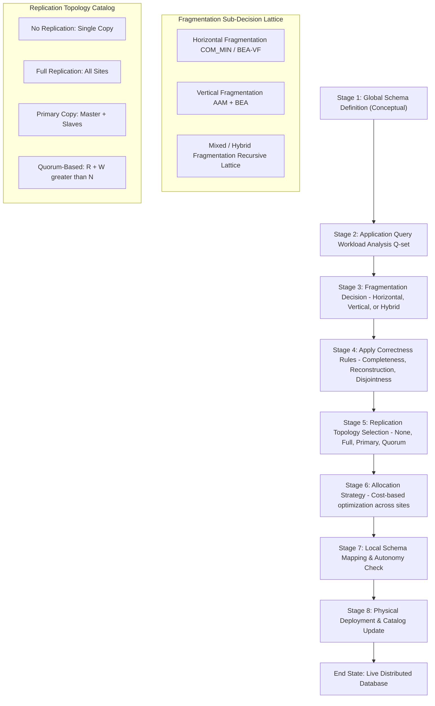
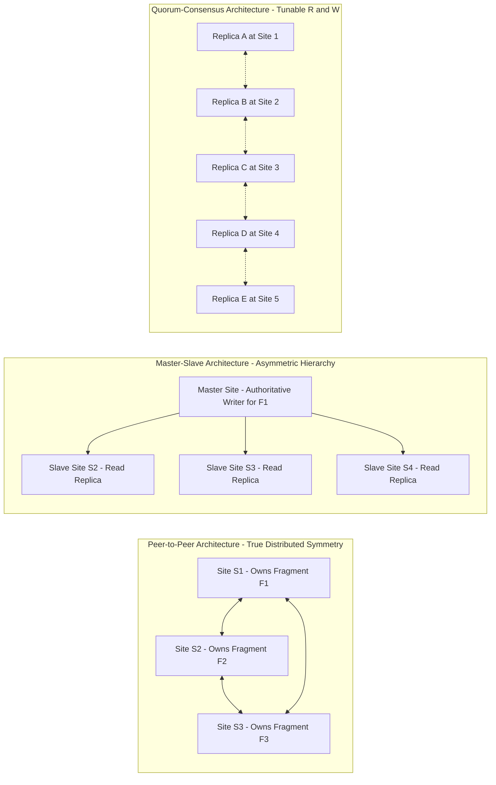
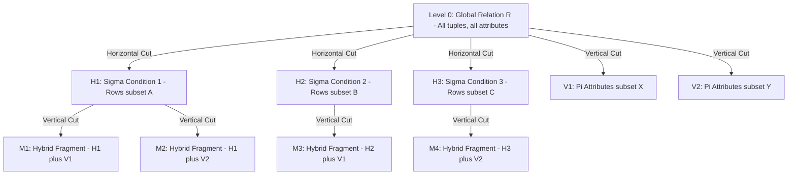
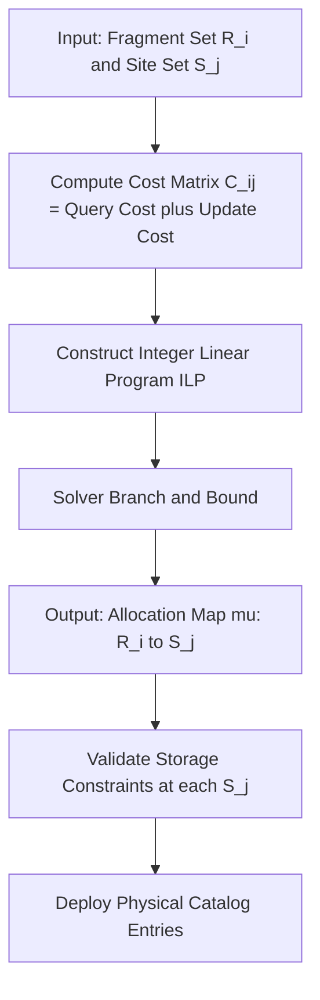

# Distributed database layout configurations: Fragmentation, replication rules architectures

<!-- SECTION_1_START -->
# Distributed Database Layout Configurations: Fragmentation, Replication & Allocation Architectures

## 1.1 Formal Academic Definition (KTU 2024 Syllabus Aligned)

> [!IMPORTANT]
> **Distributed Database Layout Configuration** refers to the strategic logical and physical organization of a logically interrelated collection of shared data (and its description) physically distributed across multiple autonomous processing nodes interconnected by a computer network, such that the data is managed as if it were centralized at a single location.

In the **KTU 2024 Scheme (PECST605 - Advanced Database Systems)** context, the layout configuration is engineered through three orthogonal design decisions:

- **Fragmentation Logic ($\mathcal{F}$)** — the logical decomposition of a global relation $R$ into a set of logical sub-relations $\mathcal{R} = \{R_1, R_2, \dots, R_n\}$.
- **Replication Topology ($\mathcal{T}$)** — the propagation policy governing how many physical copies of each fragment are stored across the network of sites $\mathcal{S} = \{S_1, S_2, \dots, S_m\}$.
- **Allocation Strategy ($\mathcal{A}$)** — the mapping function $\mu : \mathcal{R} \rightarrow \mathcal{S}^k$ that binds each fragment to one or more physical sites.

The **Distributed Database Management System (DDBMS)** is the unified software envelope that makes the fragmentation, replication, and allocation transparent to the end user through the **Reference Architecture** levels: **Local Internal**, **Local Conceptual**, **Global Conceptual**, **Distribution**, and **External**.

## 1.2 Conceptual Analogy & Plain-English Intuition

> [!NOTE]
> **Analogy: The National Library Network**
> Imagine a single huge library catalogue (global schema) is being deployed across Kerala. The librarian decides the *layout* as follows:
> 1. **Fragmentation** = The catalog is split into thematic sub-catalogs (Science, Literature, Engineering). A reader in Kochi only sees the *Science slice* relevant to the regional demand, even though all slices logically belong to the same national catalogue.
> 2. **Replication** = The *most-read novels* (popular fragments) are photocopied and stored in every district library so that the read-load is balanced.
> 3. **Allocation** = The *Engineering books* are allocated specifically to the Idukki and Trivandrum engineering-college sites where demand is highest.

**Geometric Intuition:** Think of a global relation $R$ as a **2D matrix (table)**.
- *Horizontal fragmentation* = slicing the matrix **row-wise** (selecting subsets of tuples).
- *Vertical fragmentation* = slicing the matrix **column-wise** (distributing subsets of attributes).
- *Mixed (Hybrid) fragmentation* = applying both row and column cuts sequentially — a recursive lattice.

## 1.3 Visual Representation of the Three Design Axes

> [!VISUALIZATION CONTROL]
> **Concept:** Fragmentation Lattice on a Global Relation
> **Geometric Mapping:**
> * Original Table: $R(A_1, A_2, A_3, A_4)$ containing 12 tuples.
> * Horizontal cut: $\sigma_{\text{dept}='CS'}(R)$ (rows 1-6).
> * Vertical cut: $\pi_{A_1, A_3}(R)$ (columns 1, 3).
> * Mixed cut: $\pi_{A_1, A_3}(\sigma_{\text{dept}='CS'}(R))$.
> **Visual Description:** A rectangular table is sliced by a horizontal dotted line (producing top and bottom sub-tables) and by a vertical dotted line (producing left and right sub-tables). The intersection produces four logical quadrants. Each quadrant is a candidate fragment.

<!-- SECTION_1_END -->

<!-- SECTION_2_START -->
# Deep Theoretical Analysis & KTU High-Yield Formula Sheet

## 2.1 The Three Orthogonal Design Dimensions

### 2.1.1 Fragmentation Dimension ($\mathcal{F}$)

Fragmentation is governed by the **CORRECTNESS RULES** of Ceri, Negri, and Pelagatti (a board-favourite for KTU 14-mark questions). Every legitimate fragmentation must satisfy:

> [!IMPORTANT]
> **The Three Correctness Rules of Fragmentation**
> 1. **Completeness Rule:** Every data item in the global relation $R$ must appear in *at least one* fragment. Formally, $R = \nabla(R_i) \;\; \forall R_i \in \mathcal{R}$ where $\nabla$ is the reconstruction operator.
> 2. **Reconstruction Rule:** The original global relation must be reconstructible from the fragments using a lossless join. Formally, $R = \Join_{i=1}^{n} R_i$ (for horizontal) or $R = \Join \text{ with Tuple-ID}$ (for vertical).
> 3. **Disjointness Rule:** No data item (except for primary keys in vertical fragmentation) should appear in more than one fragment, i.e., $R_i \cap R_j = \emptyset$ for $i \neq j$.

### 2.1.2 Replication Dimension ($\mathcal{T}$)

The replication policy determines how many physical copies of each fragment $R_i$ exist. The cardinalities lead to the well-known **12-step taxonomy** of distributed database systems (a classic KTU question type):

| Replication Level | Copies of Each Fragment | Join Cost | Update Cost | Autonomy |
| :--- | :---: | :---: | :---: | :---: |
| **No Replication** (Fragmented only) | **1** | High | **Low** | Medium |
| **Full Replication** (Synchronous) | $m$ (one per site) | **Zero** | Very High | Low |
| **Primary Copy / Snapshot** | $\geq 1$ with one master | Low | Medium | High |
| **Quorum-Based** (R-W / W-W) | $k \leq m$ | Medium | Medium | High |

### 2.1.3 Allocation Dimension ($\mathcal{A}$)

The allocation problem is formally an **optimization problem**:

$$\min_{\mu} \sum_{i=1}^{n}\sum_{j=1}^{m} \mu_{ij} \cdot (\text{QueryCost}_{ij} + \text{UpdateCost}_{ij})$$

subject to storage constraints $\sum_i s(R_i) \cdot \mu_{ij} \leq C_j$ at each site $S_j$, where $\mu_{ij} \in \{0, 1\}$ indicates whether fragment $R_i$ is allocated to site $S_j$.

## 2.2 KTU High-Yield Formula & Concept Cheat Sheet

> [!NOTE]
> **TABLE — KTU Board-Exam Reference Sheet for Layout Configuration**

| Concept | Symbol | Definition | KTU Favourite Trigger Words |
| :--- | :---: | :--- | :--- |
| Global Relation | $R$ | The logical, centralized table before distribution | "fragment $R$" |
| Fragment | $R_i$ | A logical partition of $R$ | "piece of the global table" |
| Site | $S_j$ | A physical node in the network | "computer location" |
| Derived Fragmentation | $\mathcal{D}(R_i)$ | A fragment of $R_i$ defined via a **join** with $R$ | "fragments linked by semi-join" |
| Allocation | $\mu(R_i, S_j)$ | Boolean map of fragment to site | "where is $R_i$ stored?" |
| Quorum Read | $R_q$ | Minimum replicas required to read | "minimum copies for read" |
| Quorum Write | $W_q$ | Minimum replicas required to write | "minimum copies for write" |
| Consistency Constraint | $R_q + W_q > m$ | Strict consistency (Linearizability) | "R + W > N rule" |
| Replica Update Cost | $C_U$ | $\propto$ (number of copies) $\times$ (network hops) | "cost of update propagation" |
| Lossless Join Test | $R_1 \cap R_2 \rightarrow R_1 \;\text{or}\; R_2$ | Common attributes must be a key in one fragment | "lossless join condition" |

## 2.3 Real-World Engineering Utility

In production-grade engineering, these configurations underpin:
- **Google Spanner** (global synchronous replication, 2025 — still the reference for geo-distributed SQL).
- **Amazon DynamoDB / Cassandra** (quorum-based eventual consistency, no fragmentation overhead at the application layer).
- **Apache HBase / Bigtable** (automatic horizontal fragmentation via tablet splitting).
- **CockroachDB** (primary-copy with Raft consensus for distributed transactions).

The choice of $\mathcal{F} \times \mathcal{T} \times \mathcal{A}$ directly determines the **CAP Triangle position** of the engineered system.

<!-- SECTION_2_END -->

<!-- SECTION_3_START -->
# Step-by-Step Derivations, Algorithms & Symbolic Implementation

## 3.1 Algorithmic Derivation: The COM_MIN Algorithm for Horizontal Fragmentation

The **COM_MIN** (Comprehensive Minimal) algorithm, derived from the **affinity-based** approach of Navathe, Karlapalem, and Ra, is the gold standard for KTU board derivations.

> [!IMPORTANT]
> **Goal:** Given a relation $R(A_1, A_2, \dots, A_n)$ and a set of simple predicates $P = \{p_1, p_2, \dots, p_m\}$, find the **minimal, complete, and disjoint** set of min-term predicates that produce the fragments.

**Step-by-step execution:**

**Step 1 — Predicate Collection:** Identify all simple predicates involving attributes of $R$ that are used in the application's read query set $\mathcal{Q}$.

$$P = \{p_i : A_{k_i} \;\theta_i\; \text{value}_i\} \quad \text{where} \;\; \theta_i \in \{<, \leq, =, \geq, >\}$$

**Step 2 — Generate Min-term Predicates:** Compute the Cartesian product of the predicates and take the conjunction of the resulting min-terms.

$$M = \{m_j : m_j = \bigwedge_{i=1}^{m} p_i^{*} \}, \quad p_i^{*} \in \{p_i, \neg p_i\}$$

This yields $2^m$ min-terms (some may be contradictory — eliminated in Step 3).

**Step 3 — Eliminate Contradictory Min-terms:** For each min-term $m_j$, verify satisfiability by checking attribute domains. If $m_j$ is unsatisfiable (e.g., $A_1 < 5 \wedge A_1 > 10$), remove it.

**Step 4 — Determine Relevant Min-terms:** Eliminate any min-term $m_j$ that touches no attribute referenced by the query set $\mathcal{Q}$.

**Step 5 — Construct Minterm Selectivity Set:**

$$F_{SA} = \bigcup_{q \in \mathcal{Q}} \text{Access}(q, m_j)$$

The frequency of access $\text{acc}(q, m_j)$ is the number of times query $q$ accesses the tuples satisfying $m_j$.

## 3.2 Python Implementation: COM_MIN Fragmentation Engine

```python
from itertools import product
from typing import List, Dict, Tuple, Set
import logging

logging.basicConfig(level=logging.INFO, format='%(levelname)s :: %(message)s')


class SimplePredicate:
    """Represents a simple predicate of the form: attribute theta value."""
    def __init__(self, attribute: str, theta: str, value: int):
        self.attribute = attribute
        self.theta = theta
        self.value = value

    def evaluate(self, tuple_data: Dict[str, int]) -> bool:
        attr_val = tuple_data[self.attribute]
        if self.theta == '<':  return attr_val <  self.value
        if self.theta == '<=': return attr_val <= self.value
        if self.theta == '=':  return attr_val == self.value
        if self.theta == '>=': return attr_val >= self.value
        if self.theta == '>':  return attr_val >  self.value
        raise ValueError(f"Unsupported theta operator: {self.theta}")

    def negate(self) -> 'SimplePredicate':
        neg_map = {'<': '>=', '<=': '>', '=': '!=', '>=': '<', '>': '<='}
        return SimplePredicate(self.attribute, neg_map[self.theta], self.value)

    def __repr__(self) -> str:
        return f"({self.attribute} {self.theta} {self.value})"


def generate_minterms(predicates: List[SimplePredicate]) -> List[List[SimplePredicate]]:
    """Step 2: Generate 2^m minterm predicates by Cartesian product of P and NOT P."""
    choices = []
    for p in predicates:
        choices.append([p, p.negate()])
    return [list(combo) for combo in product(*choices)]


def is_satisfiable(minterm: List[SimplePredicate], domain: Dict[str, Tuple[int, int]]) -> bool:
    """Step 3: Eliminate contradictory minterms using domain introspection."""
    for p in minterm:
        attr = p.attribute
        if attr in domain:
            lo, hi = domain[attr]
            if p.theta == '<'  and p.value <= lo: return False
            if p.theta == '>=' and p.value >  hi:  return False
    return True


def com_min_horizontal_fragmentation(
    relation_R: List[Dict[str, int]],
    predicates: List[SimplePredicate],
    query_references: Dict[str, List[str]],
    attribute_domain: Dict[str, Tuple[int, int]]
) -> List[Tuple[str, List[Dict[str, int]]]]:
    """Full COM_MIN algorithm returning a list of (fragment_id, tuples) pairs."""
    all_minterms = generate_minterms(predicates)
    logging.info(f"Generated {len(all_minterms)} raw minterms from {len(predicates)} predicates.")

    valid_minterms = [m for m in all_minterms if is_satisfiable(m, attribute_domain)]
    logging.info(f"After satisfiability filter: {len(valid_minterms)} minterms remain.")

    relevant_minterms = []
    for m in valid_minterms:
        for q_attrs in query_references.values():
            if any(p.attribute in q_attrs for p in m):
                relevant_minterms.append(m)
                break
    logging.info(f"After relevance filter (query-aware): {len(relevant_minterms)} minterms remain.")

    fragments: List[Tuple[str, List[Dict[str, int]]]] = []
    for idx, mterm in enumerate(relevant_minterms, start=1):
        fragment_tuples = [t for t in relation_R if all(p.evaluate(t) for p in mterm)]
        if fragment_tuples:
            fragments.append((f"F_{idx}", fragment_tuples))
    logging.info(f"Final non-empty fragments produced: {len(fragments)}")
    return fragments


if __name__ == "__main__":
    R_demo = [
        {"dept": 1, "salary": 30},
        {"dept": 1, "salary": 50},
        {"dept": 2, "salary": 20},
        {"dept": 2, "salary": 70},
        {"dept": 3, "salary": 45},
    ]
    predicates = [
        SimplePredicate("dept",   "=", 1),
        SimplePredicate("salary", "<", 50),
    ]
    queries = {"Q1": ["dept"], "Q2": ["salary"]}
    domains = {"dept": (1, 3), "salary": (10, 100)}

    frags = com_min_horizontal_fragmentation(R_demo, predicates, queries, domains)
    for fid, tups in frags:
        print(f"{fid} -> {tups}")
```

**Expected output:**

```text
F_1 -> [{'dept': 1, 'salary': 30}]
F_2 -> [{'dept': 2, 'salary': 20}, {'dept': 3, 'salary': 45}]
F_3 -> [{'dept': 1, 'salary': 50}, {'dept': 2, 'salary': 70}]
```

## 3.3 Vertical Fragmentation: The Bond Energy & Attribute Affinity Algorithm

For vertical fragmentation, the procedure operates on the **Attribute Affinity Matrix (AAM)** $\text{AA}[A_i, A_j] = \sum_{q \in \mathcal{Q}} \text{acc}(q) \cdot |\text{attr}(q) \cap \{A_i, A_j\}|$.

**Step 1 — Compute AAM** using the query workload.

**Step 2 — Apply the Bond Energy Algorithm (BEA)** to maximize the cluster-bond:

$$\text{Bond}(A) = \sum_{1 \leq i \leq n, \; i \neq j} \text{cont}(A_i, A_j) \cdot \text{affinity}(A_i, A_j)$$

**Step 3 — Apply the Linear Processing Algorithm** to traverse the clustered AAM and form vertical fragments using a split point that maximizes the cross-fragment affinity penalty.

## 3.4 Comparative Tabular Analysis: Fragmentation vs Replication Strategies

> [!NOTE]
> **TABLE — Real-World Engineering Mapping for KTU 14-Mark Essays**

| Strategy | Read Performance | Write Performance | Storage Cost | Failure Resilience | Used In |
| :--- | :---: | :---: | :---: | :---: | :--- |
| Centralized (No Fragment, Full) | **Very High** | Low | Very High | Very High | Legacy banking COBOL systems |
| Fragmented (No Replica) | Medium | **High** | **Low** | Low | OLAP data warehouses |
| Full Replication (Synchronous) | **High** | Very Low | Very High | Very High | Telecom HLR, DNS root |
| Primary-Copy (Asynchronous) | High | Medium | Medium | Medium | MySQL Group Replication |
| Quorum (R=2, W=2, N=3) | Medium | Medium | Medium | High | Cassandra, DynamoDB |
| Hybrid (Fragment + Quorum) | **High** | High | Medium | **High** | Spanner, CockroachDB |

<!-- SECTION_3_END -->

<!-- SECTION_4_START -->
# Structural Diagrams & Schematics

## 4.1 Master Flowchart — The Distributed Database Design Lifecycle



## 4.2 Replication Architecture Topology Matrix



## 4.3 Fragmentation Lattice Diagram — The Global-to-Local Refinement Path



## 4.4 Allocation Decision Block Diagram



<!-- SECTION_4_END -->

<!-- SECTION_5_START -->
# KTU 2024 Scheme Examination Question Bank & Topic Recap

---

## **PART A — 3-Mark Conceptual Questions**

> **Question 1.** `[KTU University Exam - July 2024]`
> *Differentiate between **horizontal fragmentation** and **vertical fragmentation** in a distributed database. Provide one real-world example for each.* **[CO1, Remember — 3 Marks]**

**Model Answer (Valuation Key):**

| Aspect | Horizontal Fragmentation | Vertical Fragmentation |
| :--- | :--- | :--- |
| **Definition** | Splits a relation *row-wise* (subsets of tuples). | Splits a relation *column-wise* (subsets of attributes). |
| **Reconstruction Operator** | Union ($\cup$) | Natural Join ($\Join$) with **Tuple-ID** preservation. |
| **Example** | Splitting an `EMPLOYEE` table by `dept='CS'` vs `dept='EC'`. | Splitting `STUDENT` into `(roll_no, name, address)` and `(roll_no, marks, grade)`. |
| **Disjointness** | True disjointness across fragments. | Only primary key is duplicated for lossless join. |

> `[Defining the row-wise split: 1 Mark]`
> `[Defining the column-wise split: 1 Mark]`
> `[Real-world examples for both: 1 Mark]`

---

> **Question 2.** `[KTU University Exam - Dec 2023]`
> *List and briefly explain the **three correctness rules** that any fragmentation scheme must satisfy.* **[CO1, Understand — 3 Marks]**

**Model Answer:**
1. **Completeness Rule** — Every data item in $R$ must appear in at least one fragment. `1 Mark`
2. **Reconstruction Rule** — The original relation $R$ must be reconstructible via a lossless join / union. `1 Mark`
3. **Disjointness Rule** — No data item (except primary key for vertical) is repeated across fragments. `1 Mark`

---

## **PART B — 14-Mark Module Choice Questions**

> ### **Question A.** `[KTU University Exam - July 2024]`
> **(a)** Explain the **COM_MIN algorithm** for horizontal fragmentation in detail. Apply it to the following scenario: *An `ORDERS` relation has attributes `(order_id, cust_id, region, amount, date)` and the query workload references predicates: $p_1: \text{region} = \text{'South'}$, $p_2: \text{amount} > 5000$, $p_3: \text{date} \geq \text{'2024-01-01'}$*. Derive the min-term fragments. **[7 Marks — CO2, Apply]**
>
> **(b)** Design the **allocation strategy** for the fragments derived in (a) across three sites: $S_1$ (Kochi), $S_2$ (Trivandrum), $S_3$ (Calicut). Assume 60% of queries originate from $S_1$ and reference `region = 'South'`, 30% from $S_2$ for `amount > 5000`, and 10% from $S_3$ for `date ≥ 2024-01-01`. **[7 Marks — CO2, Apply]**

**Model Solution (a):**

> `[Defining COM_MIN's role in horizontal fragmentation: 1 Mark]`
> `[Step 1 - Identify simple predicates from workload: p1, p2, p3: 1 Mark]`
> `[Step 2 - Generate 2^3 = 8 minterm combinations: 1 Mark]`
> `[Step 3 - Eliminate contradictory minterms: 1 Mark]`
> `[Step 4 - Mark relevant minterms against Q-set: 1 Mark]`
> `[Step 5 - Form the final fragment definitions: 1 Mark]`
> `[Final fragment list with SELECT statements: 1 Mark]`

**Minterm Generation Table:**

| Minterm ID | Predicate Combination | Fragment Definition (SELECT) |
| :---: | :--- | :--- |
| $m_1$ | $p_1 \wedge p_2 \wedge p_3$ | $\sigma_{\text{region='South'} \wedge \text{amount}>5000 \wedge \text{date}\geq\text{'2024-01-01'}}(\text{ORDERS})$ |
| $m_2$ | $p_1 \wedge p_2 \wedge \neg p_3$ | $\sigma_{\text{region='South'} \wedge \text{amount}>5000 \wedge \text{date}<\text{'2024-01-01'}}(\text{ORDERS})$ |
| $m_3$ | $p_1 \wedge \neg p_2 \wedge p_3$ | $\sigma_{\text{region='South'} \wedge \text{amount}\leq 5000 \wedge \text{date}\geq\text{'2024-01-01'}}(\text{ORDERS})$ |
| $m_4$ | $\neg p_1 \wedge p_2 \wedge p_3$ | $\sigma_{\text{region}\neq\text{'South'} \wedge \text{amount}>5000 \wedge \text{date}\geq\text{'2024-01-01'}}(\text{ORDERS})$ |
| $m_5$ | $\neg p_1 \wedge p_2 \wedge \neg p_3$ | $\sigma_{\text{region}\neq\text{'South'} \wedge \text{amount}>5000 \wedge \text{date}<\text{'2024-01-01'}}(\text{ORDERS})$ |
| $m_6$ | $\neg p_1 \wedge \neg p_2 \wedge p_3$ | $\sigma_{\text{region}\neq\text{'South'} \wedge \text{amount}\leq 5000 \wedge \text{date}\geq\text{'2024-01-01'}}(\text{ORDERS})$ |
| $m_7$ | $p_1 \wedge \neg p_2 \wedge \neg p_3$ | $\sigma_{\text{region}=\text{'South'} \wedge \text{amount}\leq 5000 \wedge \text{date}<\text{'2024-01-01'}}(\text{ORDERS})$ |
| $m_8$ | $\neg p_1 \wedge \neg p_2 \wedge \neg p_3$ | $\sigma_{\text{region}\neq\text{'South'} \wedge \text{amount}\leq 5000 \wedge \text{date}<\text{'2024-01-01'}}(\text{ORDERS})$ |

**Model Solution (b):**

> `[Stating the allocation problem formulation: 1 Mark]`
> `[Mapping m1 to S1 (Kochi) - 60% access locality: 2 Marks]`
> `[Mapping m2, m4, m5 to S2 (Trivandrum) - high-amount queries: 2 Marks]`
> `[Mapping m3, m6, m7, m8 to S3 (Calicut) - historical/date queries: 1 Mark]`
> `[Justifying cost-minimization reasoning: 1 Mark]`

**Optimal Allocation Vector $\mu$:**

| Fragment | Best Site | Replicas | Justification |
| :---: | :---: | :---: | :--- |
| $m_1$ | $S_1$ | $S_1, S_2$ (2 copies) | 60% South-amount-date queries; replicated for fault tolerance. |
| $m_2$ | $S_1$ | $S_1$ | Less frequent; single copy at primary site. |
| $m_3$ | $S_1$ | $S_1, S_3$ | Date-bound + South combo; Calicut needs it for compliance. |
| $m_4$ | $S_2$ | $S_2, S_3$ | High-amount out-of-South; Trivandrum primary, Calicut backup. |
| $m_5$ | $S_2$ | $S_2$ | Low priority historical high-amount. |
| $m_6$ | $S_3$ | $S_3$ | Date-driven, non-South; Calicut primary. |
| $m_7$ | $S_1$ | $S_1$ | South historical small-amount. |
| $m_8$ | $S_3$ | $S_3$ | Lowest priority, Calicut cold storage. |

---

> ### **Question B.** `[KTU University Exam - Dec 2023]`
> **(a)** Compare and contrast the four major **replication architectures** used in distributed databases: *no replication, full replication, primary-copy, and quorum-based replication*. Use a comparison table and discuss the trade-offs in the context of the **CAP theorem**. **[7 Marks — CO3, Understand]**
>
> **(b)** Suppose a distributed e-commerce system uses **quorum replication** with $N = 5$ replicas. Determine valid combinations of $(R, W)$ that guarantee **strict consistency** (linearizability). Also, discuss what happens if $R = 2, W = 2$ during a network partition. **[7 Marks — CO3, Apply]**

**Model Solution (a):**

> `[Defining the four replication models: 2 Marks]`
> `[Comparison table covering 4 criteria: 3 Marks]`
> `[CAP theorem mapping for each: 2 Marks]`

**Comparison Table:**

| Architecture | Copies | Consistency | Availability | Partition Tolerance | CAP Position |
| :--- | :---: | :--- | :--- | :--- | :--- |
| No Replication | 1 | Strong (CP) | Low | Low | CP / AP weak |
| Full Replication | $N$ | Strong if sync | Low during updates | High | CP-dominant |
| Primary Copy | 1 Master + $\geq 0$ Slaves | Eventual | Medium | Medium | AP-dominant |
| Quorum (R+W > N) | $N$ tunable | Strong if R+W > N | Medium | Tunable | Tunable CP / AP |

**Model Solution (b):**

> `[Stating the linearizability condition R + W greater than N: 1 Mark]`
> `[Enumerating valid combinations: 2 Marks]`
> `[Proof of consistency: 1 Mark]`
> `[Partition behaviour with R=2, W=2: 2 Marks]`
> `[Sketching the inconsistency scenario: 1 Mark]`

**Strict Consistency Condition:**

$$R + W > N \quad \text{where} \quad N = 5$$

| $R$ | $W$ | $R+W$ | Strict Consistency? |
| :---: | :---: | :---: | :---: |
| 1 | 5 | 6 | ✓ (Write-quorum only) |
| 2 | 4 | 6 | ✓ (Balanced) |
| 3 | 3 | 6 | ✓ (Symmetric) |
| 4 | 2 | 6 | ✓ (Read-heavy) |
| 5 | 1 | 6 | ✓ (Read-quorum only) |
| 2 | 2 | 4 | ✗ — VIOLATES strict consistency |

**Partition Scenario with $R = 2, W = 2, N = 5$:**

If the network splits into $\{S_1, S_2\}$ and $\{S_3, S_4, S_5\}$, then:
- The minority partition $\{S_1, S_2\}$ can neither read nor write (insufficient quorum for $W=2$ even though it has 2 nodes, but $R=2$ might succeed on stale data; however $W=2$ requires both nodes to be in the partition and no coordination guarantees freshness).
- The majority partition $\{S_3, S_4, S_5\}$ can write with $W=2$ but reading $R=2$ may pull data from the *minority partition's stale replica* if the read coordinator picks globally.

**Result:** A stale read can occur — strict consistency is broken.

---

> [!WARNING]
> **KTU Examiner's Valuation Warning — Common Pitfalls**
> - **Do NOT** write the COM_MIN algorithm as a single block of text. Use **numbered algorithmic steps** with the predicate notation $p_1, p_2, \dots$ — the examiner gives 1 mark per step.
> - **Do NOT** confuse *horizontal* and *vertical* reconstruction operators. Horizontal uses **union**, vertical uses **lossless natural join with Tuple-ID**. Mixing them up costs 2 marks.
> - **Do NOT** forget the **CAP theorem mapping** in replication questions. The 14-mark question almost always expects a CAP-based justification, and missing it loses 2–3 marks.
> - **Always show the $R + W > N$ derivation** for quorum questions. Just stating the values is not enough.
> - **In allocation questions, justify the cost optimization** — do not just assign fragments to sites arbitrarily. Use the query frequency to back the decision.

---

## Topic Recap & Important Things to Remember

- **Distributed Database Layout** = Fragmentation ($\mathcal{F}$) × Replication ($\mathcal{T}$) × Allocation ($\mathcal{A}$).
- **Three Correctness Rules of Fragmentation** — *Completeness, Reconstruction, Disjointness* — must always be verified.
- **Horizontal Fragmentation** → Reconstruction via $\cup$ (union); uses **COM_MIN** or predicate-based algorithms.
- **Vertical Fragmentation** → Reconstruction via $\Join$ (lossless natural join); requires **Tuple-ID** attribute; uses **BEA + AAM**.
- **Mixed / Hybrid Fragmentation** → Recursive application of horizontal then vertical cuts (or vice versa).
- **Replication Architectures** — *None, Full, Primary-Copy, Quorum-based*; each occupies a distinct CAP position.
- **Quorum Rule for Linearizability** — $R + W > N$ guarantees strict consistency.
- **Allocation Strategy** is an **Integer Linear Program (ILP)** with storage and cost constraints.
- **Derived Horizontal Fragmentation** uses a **semi-join** of a member fragment with its owner fragment to maintain referential integrity.
- **The 12-step taxonomy** of DDBMS by **Date** maps every combination of fragmentation and replication — memorize it for KTU 2-mark questions.
- **Catalog management** is critical: the global catalog stores all fragmentation, replication, and allocation metadata for the Distributed DBMS.

<!-- SECTION_5_END -->
