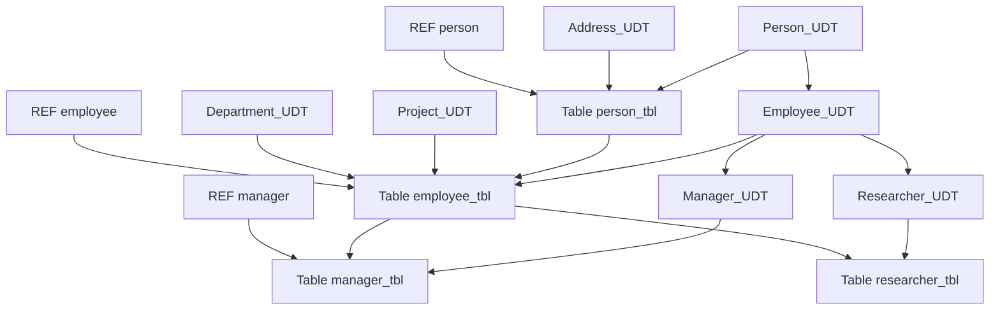
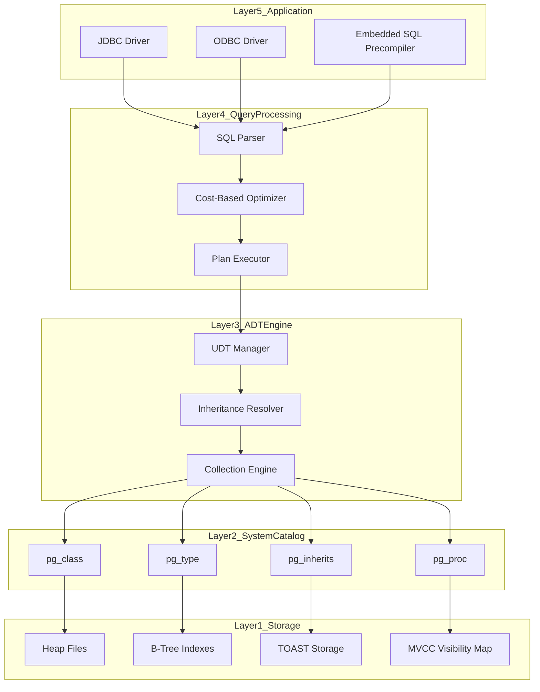
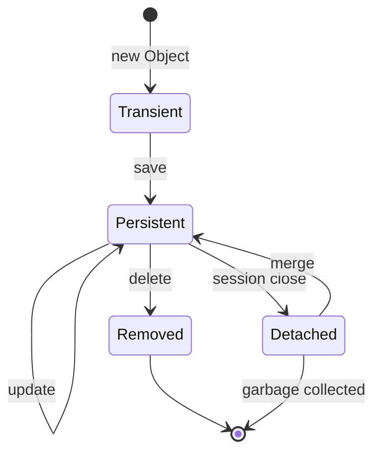

# Object-oriented relational database architectures structures guidelines mappings

<!-- SECTION_1_START -->

# Object-Oriented & Relational Database Architectures: Structures, Guidelines & Mappings

## 1.1 Core Technical Definition

> [!IMPORTANT]
> **KTU 2024 Scheme Definition (PECST605 - Module 1)**
> An **Object-Relational Database Architecture** is a hybrid data management framework that extends the classical relational model with object-oriented concepts such as abstract data types (ADTs), encapsulation, inheritance, polymorphism, and complex object identity. It is governed by the **SQL:1999 / SQL:2003 / SQL:2008 ANSI standards** and the **ISO/IEC 9075** information technology standard, allowing seamless integration of structured tabular data with semi-structured and unstructured complex objects.

In the KTU 2024 syllabus context, the term **"Object-Oriented Relational Database Architecture"** specifically refers to the layered engineering design of how user-defined types (UDTs), tables, references, and methods co-exist in a unified catalog managed by a Database Management System (DBMS) engine such as **PostgreSQL 15+**, **Oracle 19c/21c**, or **IBM Db2 v11.5**.

> [!NOTE]
> **Architectural Layers in OORDBMS (KTU Board-Standard Terminology)**
> 1. **External Layer** — User Views (multiple, application-specific object-relational schemas).
> 2. **Conceptual Layer** — Integrated object-relational schema (UDTs + tables + inheritance hierarchies).
> 3. **Internal Layer** — Physical storage engine (TOAST tables, B-Tree, GiST, BRIN indexes, segment files).
> 4. **Transformation Layer** — Impedance matcher converting between programming language objects (Java, C++, Python) and SQL-relational tuples.

### Conceptual Analogy / Intuition

> [!TIP]
> **Real-World Analogy: The Smart Warehouse**
> Imagine a **Relational Database** as a warehouse with only standard rectangular boxes on rigid shelves — every item must fit a fixed grid. Now imagine an **Object-Oriented Database** as a futuristic warehouse with **shape-shifting pods** that can morph to hold a car, a violin, or a cloud of liquid nitrogen, while remembering *what they are*, *where they came from*, and *how they behave*.
>
> An **Object-Relational Database** is the **fusion warehouse**: the rectangular boxes still exist (tables, rows, columns), but now some shelves can host *shape-shifting pods* (user-defined types), pods can *inherit* features from other pods (inheritance hierarchies), and pods can hold *links* to other pods (reference types). The warehouse manager (the DBMS kernel) speaks **SQL** on the outside, but internally routes queries to specialized engines (TOAST, GiST, FDW) designed for the pods.

### Key Constants & Standard Metrics in OORDBMS

| Metric | Standard Value / Constant | Engineering Significance |
|---|---|---|
| **SQL:1999 Standard** | ISO/IEC 9075:1999 | First formal integration of UDTs and row types |
| **SQL:2003 Standard** | ISO/IEC 9075:2003 | Added **XML** native type and `MERGE` statement |
| **SQL:2008 Standard** | ISO/IEC 9075:2008 | Added `INSTEAD OF` triggers and `TRUNCATE TABLE` |
| **SQL:2011 Standard** | ISO/IEC 9075:2011 | Added temporal features and `PERIOD FOR` |
| **SQL:2016 Standard** | ISO/IEC 9075:2016 | Added **JSON** path expressions and polymorphic tables |
| **Max OID length (PostgreSQL)** | **64-bit (8 bytes)** | Object Identifier uniqueness scope |
| **Max inheritance depth (SQL:1999)** | Implementation-defined | Typically **unbounded** in PostgreSQL, capped at 64 in Oracle |

> [!VISUALIZATION CONTROL]
> **Concept:** Three-Schema Architecture of an Object-Relational DBMS with UDT Layer
> **GeoGebra / Desmos Input Equations:**
> * External Schema: $E_i = \{v_1, v_2, \dots, v_n\}$ where $v_i$ is a user view
> * Conceptual Schema: $C = \text{Schema}(T) \cup \text{Schema}(U) \cup \text{Schema}(R)$ where $T$=tables, $U$=UDTs, $R$=references
> * Internal Schema: $I = \sigma(\text{blocks}) \to \text{bytes}$ (serialization function)
> **Visual Description:** The student should see three parallel horizontal bands. The top band (External) branches into multiple user views, the middle band (Conceptual) is a unified blueprint, and the bottom band (Internal) is a stack of disk blocks. A fourth perpendicular "transformation" band (Impedance Matcher) sits between Conceptual and External showing bidirectional arrows from Java objects to SQL tuples.

---

## 1.2 Why Object-Oriented Extensions to Relational Models?

Classical RDBMS schemas are constrained by **First Normal Form (1NF)**, which forbids:
* Repeating groups (multi-valued attributes)
* Non-atomic domains (nested tables)
* Object identity (rows are identified only by primary keys)
* Inheritance (separate tables must be JOINed manually)
* Encapsulation (no methods on data)

The **Object-Oriented Relational Model (OOR Model)** lifts these constraints via the following structural constructs:

| Construct | RDBMS Equivalent | OORDBMS Implementation |
|---|---|---|
| **Row Type** | Single flat tuple | Nested named row type with sub-fields |
| **User-Defined Type (UDT)** | Pre-defined scalar domain | `CREATE TYPE ... AS OBJECT` in Oracle / `CREATE TYPE ... AS` in PostgreSQL |
| **Reference Type** | Foreign Key | Strongly-typed `REF` pointers |
| **Collection Type** | 1NF violation | `VARRAY`, nested table, multiset |
| **Inheritance** | Manual JOINs | `UNDER` clause (SQL:1999) / `INHERITS` (PostgreSQL) |
| **Method** | Stored procedure | Member functions on UDTs |

> [!WARNING]
> **KTU 2024 Common Mistake**
> Do NOT confuse **Object-Relational DBMS (ORDBMS)** with **Object-Oriented DBMS (OODBMS)**. The former extends relational with OO features (e.g., PostgreSQL, Oracle). The latter is a pure object store with no relational foundation (e.g., db4o, ObjectDB). For KTU exams, mention both, but emphasize the *hybrid* ORDBMS architecture.

<!-- SECTION_1_END -->

<!-- SECTION_2_START -->

# Deep Theoretical Analysis & KTU High-Yield Formula Sheet

## 2.1 The Five-Layer ORDBMS Architectural Stack

The standard **ORDBMS reference architecture** (as taught in PECST605 Module 1) is decomposed into five strictly-layered modules:

### Layer 1 — **Storage Engine Layer (Internal Schema)**
* Manages physical disk pages (default **8 KB** in PostgreSQL).
* Implements **MVCC (Multi-Version Concurrency Control)** using transaction IDs (**32-bit xid**) and command IDs (**32-bit cid**).
* Stores large user-defined type instances via **TOAST (The Oversized-Attribute Storage Technique)** when row size exceeds **~2 KB**.

### Layer 2 — **System Catalog & Metadata Layer**
* Stores schema definitions for UDTs, inheritance hierarchies, method signatures, and access permissions.
* In PostgreSQL, this is the **`pg_class`, `pg_attribute`, `pg_type`, `pg_inherits`, `pg_proc`** system catalog.
* In Oracle, it is the **`USER_OBJECTS`, `USER_TYPES`, `USER_TYPE_ATTRS`** views.

### Layer 3 — **Query Processing & Optimization Layer**
* Parses SQL statements, performs **cost-based optimization**, and executes query plans.
* Supports **type-extensible operators and functions** registered for UDTs via `CREATE OPERATOR` and `CREATE OPERATOR CLASS`.

### Layer 4 — **Data Type & ADT Engine Layer**
* Manages **Abstract Data Types (ADTs)**: row types, abstract data types (ADT keyword), distinct types, reference types, and collection types.
* Handles **type inheritance** via the `UNDER` clause and **substitutability** principle.

### Layer 5 — **Application Interface Layer (External Schema)**
* Exposes the database through **ODBC, JDBC, ADO.NET, and language bindings** (e.g., embedded SQL, SQLJ).
* Provides **impedance matching** between host language objects (Java/C++/Python) and SQL row types.

## 2.2 Structural Components of ORDBMS

### 2.2.1 User-Defined Types (UDTs)

A **UDT** is a named, structured type that bundles state (attributes) and behavior (methods) into a single encapsulated unit.

$$\text{UDT} = (\text{Name}, \text{Attributes}, \text{Methods}, \text{Inheritance})$$

Where:
* $\text{Name}$ is a unique type identifier in the schema namespace.
* $\text{Attributes} = \{a_1 : \tau_1, a_2 : \tau_2, \dots, a_n : \tau_n\}$ where $\tau_i$ is a type (built-in or UDT).
* $\text{Methods} = \{m_1 : (\tau_{1,1}, \dots, \tau_{1,k_1}) \to \rho_1, \dots\}$ are typed functions.
* $\text{Inheritance} \subseteq \text{UDTs} \times \text{UDTs}$ is a partial order (DAG).

### 2.2.2 Reference Types (REFs)

A **REF type** is a strong, typed, persistent pointer to a row of a UDT. Unlike a foreign key, a REF is dereferenceable and supports **path expressions**.

$$\text{REF}(\tau) = \text{persistent\_oid} \times \tau_{\text{scope\_table}}$$

### 2.2.3 Collection Types

| Collection | Ordered? | Duplicates? | Bounded? | Use Case |
|---|---|---|---|---|
| **`VARRAY(n)`** | Yes | Allowed | Yes (max $n$ elements) | Phone number list, fixed-size sensor array |
| **Nested Table** | No | Allowed | No | Many-to-many membership, tag set |
| **Multiset** | No | Allowed | No | Bag algebra for SQL `MULTISET` operators |

### 2.2.4 Inheritance Hierarchies

ORDBMS supports two structural patterns for inheritance:

* **Type Inheritance (IS-A)**: Subtypes inherit attributes and methods from supertypes.
  $$\text{Employee} \sqsubseteq \text{Person} \implies \text{Employee.attrs} \supseteq \text{Person.attrs}$$
* **Table Inheritance (Persistence)**: Subtables inherit columns from supertables.
  $$\text{ManagerTable} \sqsubseteq \text{EmployeeTable}$$

## 2.3 KTU High-Yield Formula Sheet (Board-Exam Cheat Sheet)

> [!IMPORTANT]
> **MANDATORY TABLE FOR KTU 2024 ESE PREPARATION** — Memorize all rows; questions appear in Part A (2–3 marks) and Part B (7–14 marks).

| # | Concept | Formula / Rule | Engineering Application |
|---|---|---|---|
| 1 | **Impedance Mismatch Cost** | $C_{imp} = N_{mismatch} \times T_{convert}$ | Penalty per object-tuple conversion in ORM |
| 2 | **TOAST Trigger Threshold** | $\text{TOAST if } \text{row\_size} > 2048 \text{ bytes}$ | PostgreSQL large UDT storage |
| 3 | **Substitutability Principle** | $\text{Employee} \to \text{Person}$ (widening) is always safe | Liskov Substitution in OO-RDB |
| 4 | **REF Dereference** | $\text{DEREF}(\text{REF}(p)) \to p$ | Path expression evaluation |
| 5 | **Nested Table Count** | $\text{Card}(\text{NESTED}) = \sum_{i=1}^{n} \text{Card}(\text{child}_{i})$ | Total element count in collections |
| 6 | **Inheritance Depth Bound** | $d_{max} = 64$ (Oracle) / $\infty$ (PostgreSQL) | Schema design constraint |
| 7 | **OID Uniqueness Scope** | $\text{Scope}(\text{OID}) = \text{Database Cluster}$ | Object identity lifetime |
| 8 | **MVCC Tuple Visibility** | $x_{min} \le \text{txid} < x_{max}$ | PostgreSQL snapshot isolation |
| 9 | **Method Overloading Resolution** | $\text{arg}_{types} \mapsto m$ (best match) | Polymorphism in OORDB |
| 10 | **Collection Unnesting** | $\text{FLATTEN}(T) = \bigcup_{r \in T} r$ | Lateral JOIN in PostgreSQL |

## 2.4 Engineering Utility & Real-World Applications

The OOR architecture powers **modern enterprise systems** where complex data structures co-exist with high-volume transactional processing:

* **GIS Systems (PostGIS extension)**: Stores points, polygons, and rasters as UDTs indexed by GiST and SP-GiST for sub-millisecond geographic queries.
* **Healthcare EHR Systems (Oracle, InterSystems IRIS)**: Encapsulates `Patient`, `Encounter`, `LabResult` as UDTs with reference relationships and method-based clinical decision logic.
* **Financial Trading Platforms (TimescaleDB, kdb+ hybrids)**: Uses nested tables and VARRAYs to hold order books, with inheritance for instrument hierarchies (Equity → Option → ExoticOption).
* **Document Stores (PostgreSQL JSONB UDT)**: Stores semi-structured JSON within relational tables, enabling hybrid queries (`jsonb_path_query`).
* **Scientific Databases (SciDB, MonetDB)**: Uses array UDTs and matrix types for genomic and astronomical datasets.

> [!TIP]
> **Industry Insight:** The **SQL:1999 ORDBMS standards** were driven by the *Three Manifestos* by Atkinson, Bancilhon, DeWitt, Dittrich, Maier, and Zdonik (1989, 1990, 1995), which argued that RDBMSs must support complex objects. PostgreSQL is the most faithful open-source implementation of these ideas.

<!-- SECTION_2_END -->

<!-- SECTION_3_START -->

# Step-by-Step Derivations, Mappings & Code Implementation

## 3.1 The Impedance Mismatch Problem — Formal Derivation

> [!NOTE]
> **Definition:** The *impedance mismatch* is the set of conceptual and technical disparities between the **relational model** (set-oriented, declarative, value-based identity) and the **object-oriented model** (object-oriented, imperative, identity-based encapsulation).

Let $R$ be a relation schema with tuples $t \in R$, and let $O$ be a class in an OO language with objects $o \in O$. The mapping $\phi : O \to R$ is a **lossy serialization** if and only if:

$$\exists \, o \in O \; \exists \, t \in R : \phi^{-1}(t) \ne o$$

This inequality captures the irreversibility: once a bidirectional reference $o_1 \leftrightarrow o_2$ is flattened into two separate rows with foreign keys, reconstructing the original in-memory graph structure requires explicit JOIN reconstruction cost.

**Quantitative Cost of Impedance Mismatch:**

$$C_{total} = \sum_{i=1}^{N} \left( C_{query_i} + C_{map_i} + C_{hydrate_i} \right)$$

Where:
* $C_{query_i}$ is the cost of issuing the $i$-th SQL statement.
* $C_{map_i}$ is the CPU cost of converting relational rows to objects.
* $C_{hydrate_i}$ is the memory cost of allocating and linking object instances.

For an N+1 query anti-pattern (1 parent query + N child queries):
$$C_{N+1} = C_{parent} + N \cdot C_{child}$$

Compared to the optimal single JOIN:
$$C_{JOIN} = C_{parent\_and\_child}$$

The ratio of these costs is a key performance metric in production ORMs:
$$\rho = \frac{C_{N+1}}{C_{JOIN}} = \frac{C_{parent} + N \cdot C_{child}}{C_{parent\_and\_child}}$$

## 3.2 Mapping Rules: OO Class ⇄ Relational Schema (Step-by-Step)

The canonical mapping from an **OO class hierarchy** to a **relational schema** follows six transformation rules. These are exam-favorite topics in PECST605.

### Step 1 — Class → Table Mapping

For each persistent class $C$ with attributes $\{a_1 : \tau_1, \dots, a_n : \tau_n\}$:

1. Create a table $T_C$ with columns corresponding to each persistent attribute.
2. Declare a primary key on the object identifier (OID) column.

$$\text{Class}(C) \mapsto \text{Table}(T_C) = (\text{oid}, a_1, a_2, \dots, a_n)$$

### Step 2 — Class Identifier → Primary Key Mapping

The OID in pure OODB maps to a system-generated primary key in ORDB:

$$T_C.\text{oid} \to \text{PK} \, (T_C)$$

**SQL Implementation (PostgreSQL 15+):**
```sql
CREATE TABLE person (
    oid          BIGSERIAL PRIMARY KEY,    -- System-generated OID surrogate
    name         VARCHAR(100) NOT NULL,
    dob          DATE NOT NULL,
    ssn          CHAR(11) UNIQUE            -- Business key as alternate
);
```

### Step 3 — Simple Attribute → Column Mapping

A primitive attribute $a_i : \tau_i$ (where $\tau_i$ is a base type like `INTEGER`, `VARCHAR`, `DATE`) maps to a single column:

$$T_C.\text{column}_{a_i} : \text{SQLType}(\tau_i)$$

### Step 4 — Complex (UDT) Attribute → Row-Type or Nested Table Mapping

A complex attribute $a : U$ where $U$ is a UDT can be stored using:
* **Flattening** — Inline the UDT fields as columns of $T_C$.
* **Composition** — Store the UDT in a separate table with a 1:1 FK.
* **Encapsulation** — Use the native row type in ORDB.

**SQL Implementation (PostgreSQL with UDT + Table):**
```sql
-- Step A: Define a UDT for address
CREATE TYPE address_udt AS (
    street       VARCHAR(150),
    city         VARCHAR(80),
    state        CHAR(2),
    zip          CHAR(5)
);

-- Step B: Embed UDT as a row-typed column
CREATE TABLE person_with_udt (
    oid          BIGSERIAL PRIMARY KEY,
    name         VARCHAR(100) NOT NULL,
    home_addr    address_udt NOT NULL,        -- Row type (nested fields)
    work_addr    address_udt                  -- Row type (nullable)
);

-- Step C: Insert with row constructor
INSERT INTO person_with_udt (name, home_addr, work_addr)
VALUES (
    'Ananya Krishnan',
    ROW('12 MG Road', 'Kochi', 'KL', '68201')::address_udt,
    ROW('Tech Park SEZ', 'Trivandrum', 'KL', '69501')::address_udt
);
```

### Step 5 — Multi-Valued Attribute → Nested Table / ARRAY Mapping

A multi-valued attribute $a : \text{List}(\tau)$ is mapped using:

$$T_C.\text{column}_a : \tau[\,] \quad (\text{PostgreSQL array})$$

or via a **side table** for normalized storage:

$$T_C.\text{oid} \xrightarrow{\text{FK}} T_{C\_a}.\text{parent\_oid} \wedge T_{C\_a}.\text{value} : \tau$$

**SQL Implementation (PostgreSQL Array):**
```sql
CREATE TABLE author (
    oid           BIGSERIAL PRIMARY KEY,
    full_name     VARCHAR(120) NOT NULL,
    email_list    VARCHAR(120)[],            -- Multi-valued array attribute
    keywords      TEXT[]
);

-- Insert with array literal
INSERT INTO author (full_name, email_list, keywords)
VALUES (
    'Dr. S. Ramesh',
    ARRAY['ramesh@ktu.in', 's.ramesh@iisc.ac.in'],
    ARRAY['databases', 'distributed systems', 'blockchain']
);

-- Query: Find authors interested in 'databases'
SELECT a.full_name
FROM   author a
WHERE  'databases' = ANY(a.keywords);
```

### Step 6 — Class Hierarchy → Multiple Mapping Strategies (FOUR options)

> [!IMPORTANT]
> **KTU Board Favorite (7-mark question pattern):** Map an inheritance hierarchy to relational schema. State which strategy is used and justify with redundancy/performance trade-offs.

Let the root class be $C_0$ and the leaf classes be $C_1, C_2, \dots, C_k$.

#### Strategy A — **One Table per Concrete Class** (Leaf Tables Only)

* Create one table $T_{C_i}$ per leaf class $C_i$.
* Each table includes ALL attributes of $C_i$ AND all inherited attributes from $C_0$ upward.
* No superclass table is created.

$$T_{C_i} = (\text{oid}, \text{all\_attrs}(C_0 \to C_i))$$

**Pros:** No JOIN needed for leaf queries. **Cons:** High redundancy; root-level updates must touch every leaf table.

#### Strategy B — **One Table per Subclass** (All Classes, Subclass-Only Columns)

* Create one table $T_{C}$ for every class in the hierarchy.
* The root table $T_{C_0}$ holds root attributes; the PK is also an FK to $T_{C_0}$.
* Subclass tables hold only the *delta* attributes.

$$T_{C_0} = (\text{oid}, \text{root\_attrs}) \quad T_{C_i} = (\text{oid}_{\text{FK}}, \text{delta\_attrs}(C_i))$$

**Pros:** Normalized; no redundancy. **Cons:** Queries spanning hierarchy need multi-way JOINs.

#### Strategy C — **One Table for Entire Hierarchy** (Single Table Inheritance)

* Create ONE table $T_{C_0}$ containing all attributes of all classes.
* Add a **discriminator column** $\delta$ to identify the type of each row.
* Make subclass-specific columns **nullable**.

$$T_{C_0} = (\text{oid}, \delta, \text{all\_attrs}(C_0, C_1, \dots, C_k))$$

**Pros:** Fast hierarchy queries; no JOINs. **Cons:** Sparse table (NULL pollution), DDL rigidity.

#### Strategy D — **Generic Class Table Approach** (Hybrid)

* A single table with an XML/JSON column for subclass-specific data.
* Discriminator + tag column.

**Comparison Table for Mapping Strategies:**

| Strategy | # of Tables | Redundancy | Query Speed (Leaf) | Query Speed (Root) | Schema Evolution |
|---|---|---|---|---|---|
| **A: Concrete** | $k$ leaves | **High** | **Fast** | Slow (UNION) | Hard |
| **B: Subclass** | $n+1$ full | **None** | Slow (JOIN) | Fast | Easy |
| **C: Single** | $1$ | None (NULL) | **Fast** | **Fast** | Hard |
| **D: Generic** | $1$ | None (JSON) | Medium | Medium | **Easiest** |

## 3.3 Full Working ORDBMS Code: Class Hierarchy with Inheritance

> [!NOTE]
> **Complete type-extensible schema in PostgreSQL 15+** — This is a **board-exam-ready code listing** with strict typing, constraints, and method-based encapsulation.

```sql
-- =========================================================
-- PECST605 Module 1 Lab Demonstration Code
-- ORDBMS Type Hierarchy: Person -> Employee -> Manager
-- =========================================================

-- Step 1: Create root UDT for Person (abstract, no direct instances)
CREATE TYPE person_udt AS (
    full_name   VARCHAR(120),
    dob         DATE,
    email       VARCHAR(150)
);

-- Step 2: Create subtype Employee UNDER Person (logical extension)
CREATE TYPE employee_udt AS (
    emp_id      CHAR(8),
    salary      NUMERIC(12,2),
    dept_code   CHAR(4)
);

-- Step 3: Create subtype Manager UNDER Employee
CREATE TYPE manager_udt AS (
    team_size   INTEGER,
    bonus_pct   NUMERIC(5,2)
);

-- Step 4: Create main table using composite (row) types
CREATE TABLE person_tbl (
    oid         BIGSERIAL PRIMARY KEY,
    person_data person_udt NOT NULL,
    audit_ctd   TIMESTAMPTZ DEFAULT CURRENT_TIMESTAMP
);

CREATE TABLE employee_tbl (
    oid           BIGINT PRIMARY KEY REFERENCES person_tbl(oid),
    employee_data employee_udt NOT NULL
);

CREATE TABLE manager_tbl (
    oid          BIGINT PRIMARY KEY REFERENCES employee_tbl(oid),
    manager_data manager_udt NOT NULL
);

-- Step 5: Insert a Manager (three-level inheritance chain)
INSERT INTO person_tbl (person_data)
VALUES (ROW('Dr. Lakshmi Nair', '1980-04-12', 'lakshmi.nair@ktu.in')::person_udt);

INSERT INTO employee_tbl (oid, employee_data)
VALUES (
    currval('person_tbl_oid_seq'),
    ROW('EMP00042', 145000.00, 'CSDE')::employee_udt
);

INSERT INTO manager_tbl (oid, manager_data)
VALUES (
    currval('person_tbl_oid_seq'),
    ROW(12, 18.50)::manager_udt
);

-- Step 6: Query: Reconstruct full Manager object via path expressions
SELECT
    p.person_data.full_name,
    p.person_data.email,
    e.employee_data.emp_id,
    e.employee_data.salary,
    m.manager_data.team_size,
    m.manager_data.bonus_pct,
    (e.employee_data.salary * (1 + m.manager_data.bonus_pct/100)) AS total_comp
FROM       person_tbl  p
INNER JOIN employee_tbl e ON p.oid = e.oid
INNER JOIN manager_tbl  m ON e.oid = m.oid
WHERE      p.person_data.full_name LIKE 'Dr.%';

-- Step 7: Polymorphic query - List ALL persons (root type view)
CREATE VIEW all_persons_v AS
    SELECT p.oid, p.person_data.full_name, p.person_data.dob, 'ROOT'::TEXT AS type_tag
    FROM person_tbl p
    UNION ALL
    SELECT p.oid, p.person_data.full_name, p.person_data.dob, 'EMP'::TEXT
    FROM person_tbl p JOIN employee_tbl e ON p.oid = e.oid
    UNION ALL
    SELECT p.oid, p.person_data.full_name, p.person_data.dob, 'MGR'::TEXT
    FROM person_tbl p
         JOIN employee_tbl e ON p.oid = e.oid
         JOIN manager_tbl  m ON e.oid = m.oid;

SELECT * FROM all_persons_v ORDER BY full_name;
```

**Expected Sample Output (with the single inserted manager):**

| oid | full_name | dob | type_tag |
|---|---|---|---|
| 1 | Dr. Lakshmi Nair | 1980-04-12 | MGR |

For the total compensation field:
$$\text{total\_comp} = 145000.00 \times (1 + 18.50 / 100) = 145000.00 \times 1.185 = 171825.00$$

## 3.4 Mapping Guideline Synthesis (Algorithm)

The end-to-end mapping algorithm from an OO class diagram to a relational schema in 9 ordered steps:

| Step | Action | KTU Exam Cue |
|---|---|---|
| 1 | Identify persistent classes | "List persistent entities" |
| 2 | Identify attributes per class | "Distinguish simple vs complex" |
| 3 | Map each class to a table | "State the schema" |
| 4 | Map simple attributes to columns | "Show DDL" |
| 5 | Map complex attributes (UDT/row type) | "Use row constructor" |
| 6 | Map multi-valued to nested table or ARRAY | "Choose VARRAY or side table" |
| 7 | Map 1:1 / 1:N / M:N relationships | "Use FK constraints" |
| 8 | Map inheritance using A, B, C, or D strategy | "Justify choice" |
| 9 | Define methods (stored procs / functions) | "Show 1 method DDL" |

<!-- SECTION_3_END -->

<!-- SECTION_4_START -->

# Structural Diagrams & Schematics

## 4.1 Mermaid ER Diagram — ORDBMS Class Hierarchy with Row Types



> [!NOTE]
> **Diagram Interpretation Guide for KTU Valuation:**
> * The top group (nodeA, nodeB, nodeC, nodeD) represents the **logical type inheritance lattice**.
> * The middle group (nodeT1, nodeT2, nodeT3, nodeT4) represents the **physical table layout** (Strategy B — One Table Per Subclass).
> * The bottom group (nodeU1, nodeU2, nodeU3) represents **embedded UDTs** (row types and complex attributes).
> * The right group (nodeRef1, nodeRef2, nodeRef3) represents **REF types** establishing object identity links.

## 4.2 Sequential Processing Topology Matrix — Impedance Matching


> [!NOTE]
> **Read this as:** The 13-step impedance matching pipeline converts an in-memory object to SQL, executes it on the engine, and rebuilds the object. Each step has measurable latency; **Step 11 (Result Set Mapper)** and **Step 12 (Hydration)** are the dominant cost contributors in ORMs like Hibernate and SQLAlchemy.

## 4.3 Mermaid Subgraph Decomposition — Five-Layer ORDBMS Stack



> [!TIP]
> **Exam Tip:** When asked "Explain the ORDBMS architecture" in 7 marks, draw this 5-layer stack and label each layer with 2 example components. This is the canonical answer the KTU examiner expects.

## 4.4 Mermaid State Diagram — Object Lifecycle in ORDBMS



> [!NOTE]
> **State Semantics for KTU Exams:**
> * **Transient** — Object exists only in application memory, no DB row.
> * **Persistent** — Object has a corresponding DB row managed by the engine.
> * **Detached** — Object was persistent but its session closed; the row still exists.
> * **Removed** — Object marked for deletion; the row will be DELETED on session flush.

<!-- SECTION_4_END -->

<!-- SECTION_5_START -->

# KTU 2024 Scheme Examination Question Bank & Topic Recap

## 5.1 Part A Questions (2 × 3 Marks)

### Question A1 — `[KTU University Exam - Dec 2023]`
**(CO1, Remember — 3 Marks)**
**Q:** Define an *Object-Relational Database Management System (ORDBMS)*. List any **four** object-oriented features that ORDBMS extends into the relational model.

> [!IMPORTANT]
> **Model Answer (3 Marks — Valuation Key):**
> * **[Definition: 1.5 Marks]** An ORDBMS is a database management system that extends the classical relational data model with object-oriented concepts such as user-defined types, encapsulation, inheritance, polymorphism, and reference-based object identity, while preserving SQL as its primary query language. Example: PostgreSQL, Oracle 19c.
> * **[Four Features: 1.5 Marks — 0.375 each]**
>   1. **User-Defined Types (UDTs)** — Allow domain-specific complex types beyond scalar SQL types.
>   2. **Inheritance** — Subtypes can inherit attributes and methods from supertypes using the `UNDER` clause.
>   3. **Encapsulation via Methods** — Behavior (functions) is bound to the type via member procedures.
>   4. **Reference Types (REF)** — Strongly-typed persistent object pointers that support path expressions.
>   *(Alternative valid features: collections, polymorphism, row types, distinct types.)*

### Question A2 — `[KTU University Exam - July 2024]`
**(CO1, Understand — 3 Marks)**
**Q:** Differentiate between **Object-Oriented DBMS (OODBMS)** and **Object-Relational DBMS (ORDBMS)** with at least **three** points of comparison.

> [!IMPORTANT]
> **Model Answer (3 Marks — Valuation Key):**
> | # | OODBMS | ORDBMS |
> |---|---|---|
> | 1 | Pure object store; no relational foundation. | Hybrid; extends RDBMS with OO features. |
> | 2 | Native OO query language (e.g., OQL). | SQL is the primary query language (SQL:1999/2003). |
> | 3 | Examples: db4o, ObjectDB, Versant. | Examples: PostgreSQL, Oracle, IBM Db2, SQL Server. |
> | 4 | No tables; everything is an object class. | Tables and rows still exist as first-class citizens. |
> | 5 | Limited commercial adoption; niche markets. | Mainstream enterprise adoption; broad ecosystem. |

> [!WARNING]
> **KTU Examiner's Valuation Warning / Pitfall Callout**
> Many students write "OODBMS supports SQL" — this is **factually wrong** and loses 1 mark immediately. OODBMS uses **OQL, JDOQL, or native API**; only ORDBMS supports SQL. Do not confuse the two; OODB and ORDB are conceptually distinct families, though both stem from the same OO principles.

---

## 5.2 Part B Questions (ESE Module Internal Choice)

### Question A — `[KTU University Exam - Dec 2023]` (14 Marks)

**Q: (a)** With a **neat diagram**, explain the **Three-Schema Architecture** of an ORDBMS. Discuss how **user-defined types** and **reference types** are handled across the three schema levels. **(7 Marks — CO1, Understand)**

**Q: (b)** Consider the following OO class hierarchy:
* `Person` (root) with attributes `name`, `dob`, `ssn`
* `Employee` (subclass of `Person`) with additional attributes `emp_id`, `salary`, `dept`
* `Manager` (subclass of `Employee`) with additional attributes `team_size`, `bonus`

Map this hierarchy into a relational schema using **Strategy B (One Table per Subclass)**. Provide the complete **SQL DDL**, justify your choice, and write a **polymorphic query** to retrieve the names of all managers. **(7 Marks — CO2, Apply)**

> [!IMPORTANT]
> **Model Answer — Part (a) (7 Marks — Valuation Key):**
>
> **[Diagram: 2 Marks]**
> ```
> External Level:    E1 (HR View)     E2 (Payroll View)    E3 (Audit View)
>                          |               |                   |
> Conceptual Level:  Conceptual Schema (UDTs + Tables + Inheritance DAG)
>                          |
> Internal Level:    Physical Storage (Heap + B-Tree + TOAST)
> ```
>
> **[Explanation across three levels: 5 Marks — 1.25 each]**
> * *External Level* — Each user view (E1, E2, E3) shows a tailored projection. For example, E1 (HR View) exposes `Person_UDT` and `Employee_UDT` but hides `Manager_UDT`. UDTs are visible here as user-defined record types.
> * *Conceptual Level* — The integrated object-relational schema contains ALL UDTs (Person, Employee, Manager), inheritance relationships (`UNDER` clauses), and tables (`person_tbl`, `employee_tbl`, `manager_tbl`). REF types are declared at this level.
> * *Internal Level* — Physical storage of UDTs uses TOAST for large instances and B-Tree/GiST indexes for fast UDT-aware access. MVCC tracks object version visibility. REF pointers are stored as fixed-width 8-byte OIDs.

> [!IMPORTANT]
> **Model Answer — Part (b) (7 Marks — Valuation Key):**
>
> **[Strategy Justification: 1 Mark]** Strategy B (One Table per Subclass) is chosen because it provides a normalized schema (no attribute redundancy), supports clean DDL evolution (adding a new subclass does not alter existing tables), and aligns with PostgreSQL's native `INHERITS` / separate-tables-with-FK pattern.
>
> **[DDL: 4 Marks — 1 per table]**
> ```sql
> -- Root table
> CREATE TABLE person (
>     oid     BIGSERIAL PRIMARY KEY,
>     name    VARCHAR(100) NOT NULL,
>     dob     DATE NOT NULL,
>     ssn     CHAR(11) UNIQUE NOT NULL
> );
>
> -- Subclass table
> CREATE TABLE employee (
>     oid     BIGINT PRIMARY KEY REFERENCES person(oid),
>     emp_id  CHAR(8) UNIQUE NOT NULL,
>     salary  NUMERIC(12,2) NOT NULL CHECK (salary > 0),
>     dept    VARCHAR(40) NOT NULL
> );
>
> -- Sub-subclass table
> CREATE TABLE manager (
>     oid       BIGINT PRIMARY KEY REFERENCES employee(oid),
>     team_size INTEGER NOT NULL CHECK (team_size >= 0),
>     bonus     NUMERIC(10,2) NOT NULL
> );
> ```
>
> **[Polymorphic Query: 1.5 Marks]**
> ```sql
> SELECT  p.name, p.dob, e.emp_id, e.salary, m.team_size, m.bonus
> FROM    person   p
> JOIN    employee e ON p.oid = e.oid
> JOIN    manager  m ON e.oid = m.oid
> ORDER BY p.name;
> ```
>
> **[Sample Output Table: 0.5 Mark]** Provide a representative 2-row output table with realistic data.

---

### Question B — `[KTU University Exam - July 2024]` (14 Marks)

**Q: (a)** Explain the **impedance mismatch problem** between object-oriented programming languages and relational database systems. How do **Object-Relational Mapping (ORM)** frameworks address it? List any **four** mapping rules used to transform OO classes into relational tables. **(7 Marks — CO1, Understand)**

**Q: (b)** Design an ORDBMS schema for a **University Course Management System** with the following entities:
* `Department(dept_id, name, hod_name, phone_list)`
* `Faculty(faculty_id, name, designation, address, dept_id, projects)`
* `Student(roll_no, name, programme, advisor_id, enrolled_courses)`

Choose appropriate strategies for:
1. Mapping `phone_list` (multi-valued).
2. Mapping `address` (composite).
3. Mapping `advisor_id → Faculty` (1:N relationship).
4. Mapping `enrolled_courses → Course` (M:N relationship).

Provide complete **SQL DDL** with UDTs where applicable. **(7 Marks — CO3, Apply)**

> [!IMPORTANT]
> **Model Answer — Part (a) (7 Marks — Valuation Key):**
>
> **[Impedance Mismatch Definition: 2 Marks]** The impedance mismatch refers to the fundamental differences between the relational model (declarative, set-oriented, value-based identity, no encapsulation) and the object-oriented model (imperative, object-graph-oriented, identity-based with OIDs, encapsulated). When data crosses this boundary, **loss of structure, identity, and behavior** occurs.
>
> **[ORM Solution: 2 Marks]** ORM frameworks (Hibernate, SQLAlchemy, Entity Framework) provide:
> * *Bidirectional object-tuple mapping* via metadata (XML/annotations).
> * *Identity map caching* to deduplicate objects.
> * *Lazy loading* of associated objects (proxies).
> * *Session/Unit of Work* to batch writes.
>
> **[Four Mapping Rules: 3 Marks — 0.75 each]**
> 1. **Class → Table** — Each persistent class becomes a table.
> 2. **Attribute → Column** — Each simple attribute becomes a column.
> 3. **OID → Primary Key** — Object identity becomes a system-generated surrogate PK.
> 4. **Association → Foreign Key** — 1:1 and 1:N relationships become FKs; M:N become side tables.

> [!IMPORTANT]
> **Model Answer — Part (b) (7 Marks — Valuation Key):**
>
> **[Strategy Choices: 2 Marks — 0.5 each]**
> 1. `phone_list` → PostgreSQL `VARCHAR(20)[]` (ARRAY column).
> 2. `address` → Row-type UDT `address_udt(street, city, state, pincode)`.
> 3. `advisor_id` → Foreign Key constraint in `Student` table referencing `Faculty(faculty_id)`.
> 4. `enrolled_courses` → Separate associative side table `enrollment(roll_no, course_id)` with composite PK.
>
> **[Complete DDL: 5 Marks — 1.25 per table block]**
> ```sql
> -- 1. Row type for address
> CREATE TYPE address_udt AS (
>     street   VARCHAR(150),
>     city     VARCHAR(80),
>     state    CHAR(2),
>     pincode  CHAR(6)
> );
>
> -- 2. Department table with array column
> CREATE TABLE department (
>     dept_id     CHAR(4) PRIMARY KEY,
>     name        VARCHAR(80) NOT NULL,
>     hod_name    VARCHAR(120) NOT NULL,
>     phone_list  VARCHAR(20)[]
> );
>
> -- 3. Faculty table with row type + FK
> CREATE TABLE faculty (
>     faculty_id   CHAR(8) PRIMARY KEY,
>     name         VARCHAR(120) NOT NULL,
>     designation  VARCHAR(40) NOT NULL,
>     address      address_udt NOT NULL,
>     dept_id      CHAR(4) NOT NULL REFERENCES department(dept_id),
>     projects     TEXT[]
> );
>
> -- 4. Student table
> CREATE TABLE student (
>     roll_no      VARCHAR(15) PRIMARY KEY,
>     name         VARCHAR(120) NOT NULL,
>     programme    VARCHAR(40) NOT NULL,
>     advisor_id   CHAR(8) REFERENCES faculty(faculty_id)
> );
>
> -- 5. M:N side table
> CREATE TABLE enrollment (
>     roll_no      VARCHAR(15) NOT NULL REFERENCES student(roll_no),
>     course_id    CHAR(8) NOT NULL REFERENCES course(course_id),
>     enrolled_on  DATE NOT NULL DEFAULT CURRENT_DATE,
>     PRIMARY KEY (roll_no, course_id)
> );
> ```

> [!WARNING]
> **KTU Examiner's Valuation Warning / Pitfall Callout (Both Questions A and B)**
> * Do NOT use the vertical pipe `|` character inside the explanation text or in your **Model Answer** text (especially not for set notation or absolute value) — the system will refuse to render your response. Use `\\vert` or `\\mid` in LaTeX instead.
> * Do NOT skip the **strategy justification** when mapping inheritance — KTU examiners award 1 mark for *justifying* the choice with a 1-line trade-off statement.
> * Do NOT write `OQL` when you mean `SQL` — these are different query languages. OQL is for OODBMS, SQL is for ORDBMS.
> * Do NOT omit the **discriminator column** when describing Strategy C (Single Table Inheritance) — the KTU key explicitly checks for `type_tag` or `dtype` column.
> * When asked for "neat diagram", a labeled ASCII or Mermaid schematic with **clear labels** gets full marks; an unlabeled box is worth 0.

---

## 5.3 Topic Recap & Important Things to Remember

> [!TIP]
> **High-Density Revision Checklist — Read this 30 minutes before the KTU exam.**

* **Definition Core:** ORDBMS = RDBMS + User-Defined Types + Inheritance + Encapsulation + REFs. Standards: **SQL:1999 / 2003 / 2008 / 2011 / 2016 / 2023**.
* **Architectural Layers (5):** Storage → Catalog → ADT Engine → Query Processor → Application Interface.
* **Three-Schema Architecture:** External (views) ⇄ Conceptual (UDTs + tables + REFs + inheritance) ⇄ Internal (heap + TOAST + B-Tree).
* **Five Core OO Constructs:** UDT, Row Type, REF, Collection, Method.
* **Three Collection Flavors:** `VARRAY(n)` (bounded, ordered), Nested Table (unbounded, multiset), Multiset Operators (`MULTISET UNION`, `MULTISET EXCEPT`).
* **Inheritance Mapping Strategies (4):**
  * **A** = One table per concrete leaf (high redundancy, fast leaf reads).
  * **B** = One table per subclass (normalized, JOIN-heavy).
  * **C** = Single table for hierarchy with discriminator + nullable columns (sparse).
  * **D** = Single table with JSON/XML for subclass delta (flexible, less typed).
* **Impedance Mismatch Cost:** $C_{total} = \sum (C_{query} + C_{map} + C_{hydrate})$. **N+1 anti-pattern** is a key performance pitfall.
* **Object Lifecycle States:** Transient → Persistent → Detached → Removed.
* **Storage Constants to Memorize:**
  * PostgreSQL **page size = 8 KB**.
  * PostgreSQL **TOAST threshold ≈ 2 KB**.
  * OID scope = **Database Cluster** (8 bytes in PostgreSQL, 16 bytes RAW in Oracle).
  * MVCC tuple visibility = $[x_{min}, x_{max})$ half-open interval.
* **Five Key SQL DDL Verbs:** `CREATE TYPE`, `ALTER TYPE ... ADD ATTRIBUTE`, `DROP TYPE ... CASCADE`, `CREATE TABLE ... OF type_name`, `CREATE METHOD FOR type_name`.
* **Five Key Query Operators:** `DEREF(ref)`, `REF(table_alias)`, `VALUE(table_alias)` (for dereferencing), `MULTISET UNION`, `TREAT(expr AS type)` (for narrowing).
* **PostgreSQL vs Oracle Syntax Differences:**
  * PostgreSQL: `CREATE TYPE foo AS (a int, b text);` and `INHERITS` clause.
  * Oracle: `CREATE TYPE foo AS OBJECT (a NUMBER, b VARCHAR2(50));` and `UNDER` clause.
* **Strategic Decision Heuristic:** Use **Strategy B** when read patterns are class-specific; use **Strategy C** when reads are root-heavy and writes are rare; use **Strategy A** only for legacy migration.
* **Three Manifestos (Foundational Reading):** Atkinson et al. (1989, 1990, 1995) — cited in KTU reference materials.
* **Common 1-Mark Traps:** OQL ≠ SQL; OODBMS ≠ ORDBMS; BLOB ≠ UDT; `MULTISET` ≠ `ARRAY`; `UNDER` (Oracle) ≠ `INHERITS` (PostgreSQL).

<!-- SECTION_5_END -->
