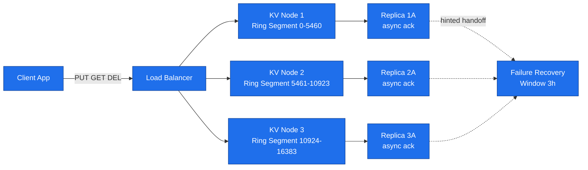
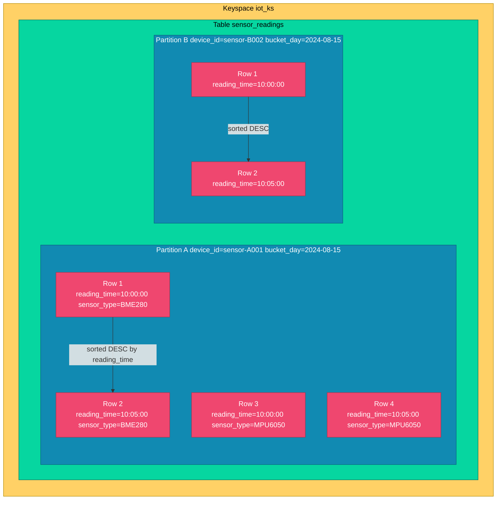
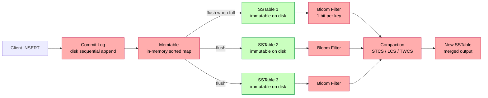
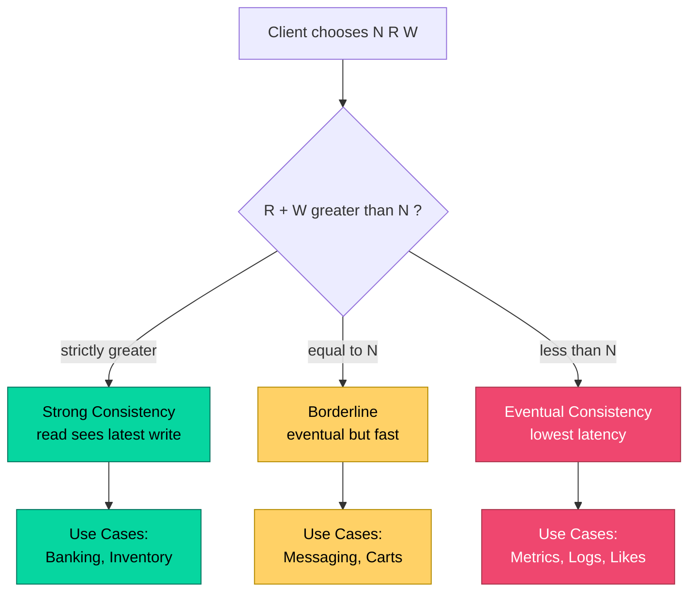

# NoSQL schema designs: Key-value stores setup parameters, Wide-column family architectures

<!-- SECTION_1_START -->
# Module 2 — NoSQL Schema Designs: Key-Value & Wide-Column Families

## 1. Core Technical Definition & Intuitive Overview

### 1.1 Key-Value Store — Formal Definition

A **Key-Value Store (KVS)** is a distributed data paradigm that persists data as an associative array of **opaque binary blobs** indexed by a unique primary key. The storage engine performs only two fundamental operations — `PUT(key, value)` and `GET(key)` — making it the most elementary member of the NoSQL taxonomy. Every other NoSQL flavour (document, column, graph) is a *typed superset* of this primitive.

> [!IMPORTANT]
> **KTU 2024 Syllabus Highlight:** In a KVS, the *value* is **schemaless and opaque** to the engine. The database does not interpret, index, or query inside the value blob. All addressing happens exclusively through the **Key**.

**Formal tuple notation:**

$$
S_{KV} = \{ (k_i, v_i) \;\vert\; k_i \in K_{space},\; v_i \in V_{opaque} \}
$$

where $K_{space}$ is the *managed keyspace* (typically a $160$‑bit MD5/SHA‑1 ring or a $128$‑bit MD5 ring) and $V_{opaque}$ is an untyped byte stream up to a configurable **value‑size limit** (Redis: **512 MB**, DynamoDB: **400 KB** per item, Riak: **64 MB** default).

---

### 1.2 Wide-Column Family Store — Formal Definition

A **Wide-Column Family Store (WCFS)** — also called an *extensible record store* — organises data as a **sparse, multi-dimensional, lexicographically sorted map**. It is *not* a relational table. The mapping is:

$$
M_{WC} : (RowKey, ColumnFamily, ColumnName, Timestamp) \longrightarrow Value
$$

Each cell is a $4$‑tuple, and the entire dataset is conceptually a **nested hash** with three hierarchical grouping levels: **Keyspace $\rightarrow$ Table (Column Family) $\rightarrow$ Row $\rightarrow$ Cell**.

> [!NOTE]
> **Core Distinction:** In a relational table, *columns are fixed per schema*. In a wide‑column store, *columns are not pre‑declared* — each row may carry a different column set, and columns are added at write time. This is the origin of the term *wide* and *sparse*.

---

### 1.3 Conceptual Analogy (Intuition for First-Time Learners)

| Paradigm | Real-World Analogy | Why It Works |
|---|---|---|
| **Key-Value** | A **coin-operated locker bank** at a railway station | You get a unique ticket (key); inside is a parcel (value) the locker has never opened, never weighed, never read. The clerk can only put, get, or replace. |
| **Wide-Column** | A **library card catalogue** organised *first by Author* (row key), *then by Book Title* (clustering key), and *finally by Edition/Chapter/Page* (column) | Every author‑row is a tall, thin card. Books that don't have a "Chapter 7" simply leave that column *blank* (sparsity). New editions can be appended as new columns at write time. |
| *(Relational — for contrast)* | A **pre-printed spreadsheet** with frozen column headers | Every row must conform; adding a new property requires an `ALTER TABLE` schema migration. |

---

### 1.4 Physical Constants & Standard Metrics

| Metric | Standard Value | Used By |
|---|---|---|
| **Token Ring Size** | $2^{127} - 1$ | Cassandra (Murmur3 Partitioner) |
| **Token Ring Size** | $2^{160} - 1$ | Riak, Dynamo (SHA‑1) |
| **Default Replication Factor (RF)** | **3** | Cassandra, HDFS |
| **Default Quorum Threshold** | $\left\lfloor \frac{N}{2} \right\rfloor + 1$ | Cassandra, DynamoDB |
| **Hinted Handoff Window** | **3 hours** | Cassandra |
| **Memtable Flush Threshold** | **128 MB** / **64 MB** | Cassandra SSTables |
| **Bloom Filter False‑Positive** | **1 %** (default) | Cassandra SSTables |
| **Gossip Interval** | **1 second** | Cassandra failure detection |
| **Snitch Type (default)** | **GossipingPropertyFileSnitch** | Cassandra |

---

### 1.5 Visualisation Cue

> [!VISUALIZATION CONTROL]
> **Concept:** Sparse wide-column row vs. dense relational row
> **Plot Parameters (conceptual map):**
> * `x-axis = column names (c1, c2, c3, ... c_n)`
> * `y-axis = row keys (user:001, user:002, ...)`
> * `cell value = stored payload or NULL (sparse)`
>
> **Visual Description:** Visualise a grid where the relational table has *every* cell filled (rectangular matrix), whereas the wide-column table appears as a **scattered constellation of dots** — most cells are empty, and columns are not aligned vertically across rows. Each row's "width" depends on which columns it actually wrote.

---
<!-- SECTION_1_END -->

<!-- SECTION_2_START -->
# 2. Deep Theoretical Analysis & KTU High-Yield Formula Sheet

## 2.1 Key-Value Store — Architectural Anatomy

A production KVS is engineered around **four pillars**: the *hash function*, the *ring topology*, the *replication policy*, and the *consistency contract*.

### 2.1.1 The Hash Function & Token Space

Every key $k$ is mapped to a deterministic integer token $t$ inside a closed ring:

$$
t = H(k) \mod 2^{m}
$$

where $H(\cdot)$ is a *cryptographically uniform* hash and $m$ is the ring width (Cassandra $m = 127$, Dynamo $m = 160$). Uniformity guarantees **statistical load balance** across partition owners.

### 2.1.2 Consistent Hashing & Virtual Nodes (VNodes)

In naive modulo hashing, adding one node re-keys **~100 %** of the data. Consistent hashing limits this disruption to **$\frac{1}{N_{nodes}}$** of the dataset. Each physical node is *fictitiously* expanded into $V$ *virtual nodes* (Cassandra default: **256 vnodes** per node), evenly spaced on the ring. The expected keys owned by node $p$ are:

$$
E[\text{keys}_p] = \frac{V_p}{V_{total}} \cdot \vert K \vert
$$

where $V_{total} = \sum_{i=1}^{N} V_i$. The **standard deviation of load** is:

$$
\sigma_{load} = \frac{1}{\sqrt{V_{total}}} \cdot \sqrt{N}
$$

This is the formal basis for Cassandra's `num_tokens: 256` default.

### 2.1.3 The Tunable Consistency Equation (R + W > N)

For any replication factor $N$ (number of replicas), the client specifies a read quorum $R$ and write quorum $W$. The system achieves **strong consistency** iff:

$$
R + W > N
$$

Equivalent formulations for *eventual* (write-fast) operation:

$$
R = 1, \quad W = 1, \quad N = 3 \quad \Rightarrow \quad R + W = 2 \not> 3
$$

For *quorum* (the canonical balance):

$$
R = W = \left\lceil \frac{N+1}{2} \right\rceil = Q
$$

> [!IMPORTANT]
> **KTU Memory Anchor:** If a question gives $N=3, R=2, W=2$, immediately state $R + W = 4 > 3$ — *strong consistency guaranteed*. If $N=3, R=1, W=1$, state *eventual consistency, low latency*.

---

## 2.2 Wide-Column Family Store — Architectural Anatomy

### 2.2.1 The Four-Level Hierarchy

$$
\boxed{\text{Keyspace}} \;\supset\; \boxed{\text{Table (CF)}} \;\supset\; \boxed{\text{Partition (Row)}} \;\supset\; \boxed{\text{Cell} = (name,\; value,\; ts,\; ttl)}
$$

1. **Keyspace** — outermost namespace; defines the **replication strategy** (`SimpleStrategy` vs `NetworkTopologyStrategy`) and the **replication factor**.
2. **Table (Column Family)** — the unit of *physical* co-location. All rows in one CF share an access pattern.
3. **Partition** — the *unit of distribution*. All rows sharing the **partition key** are stored on the **same node** (and replicated by RF).
4. **Clustering Columns** — inside a partition, rows are **lexicographically sorted** by clustering keys, enabling $O(\log n)$ range scans without a global index.

### 2.2.2 Composite Partition Key & Token Computation

A composite partition key is formed by hashing the concatenation of constituent columns:

$$
t_{partition} = H\bigl( k_1 \Vert k_2 \Vert \cdots \Vert k_m \bigr)
$$

Inside a partition, the row's position is:

$$
pos_{row} = \text{CMP}\bigl( c_1, c_2, \ldots, c_n \bigr)
$$

where $\text{CMP}$ is the **composite comparator** (lexicographic, time-UUID, or custom).

### 2.2.3 Write Path & The Memtable-SSTable Stack

Every write is appended to two in-memory structures — the **Memtable** and a **Commit Log** on disk — then asynchronously flushed to an immutable **SSTable** (Sorted String Table). The flush is governed by:

$$
T_{flush} = \min\bigl( \text{memtable\_size},\; \text{commit\_log\_age} \bigr)
$$

Read path performs a **parallel scan** across Memtable + bloom-filtered SSTables, then merges via a **Tombstone-aware reconciliation** (Cassandra's *last-write-wins* with timestamp).

### 2.2.4 Bloom Filter Mathematics (SSTable Lookup Shortcut)

A Bloom filter with $m$ bits, $k$ hash functions, and $n$ inserted keys has false-positive probability:

$$
P_{fp} = \left( 1 - e^{-\frac{kn}{m}} \right)^{k}
$$

Cassandra uses a **per-SSTable Bloom filter** sized at **$\sim 1$ bit per key**, with $P_{fp} \approx 0.01$ (1 %).

---

## 2.3 Engineering Utility & Real-World Deployment

| System | Use Case | Why KVS / WCFS Wins |
|---|---|---|
| **Redis** | Session cache, leaderboard, pub/sub | Sub‑millisecond GET, atomic INCR, ephemeral in‑memory tier |
| **DynamoDB** | Shopping cart, IoT state | Predictable single-digit-ms latency at any scale |
| **Cassandra** | Netflix viewing history, IoT time-series | Append-only writes at >1 M/sec/node, linear horizontal scale |
| **HBase** | Facebook Messages, web crawl storage | Strong consistency per region, tight Hadoop integration |
| **Bigtable** | Google Search index, Maps tile metadata | Sparse rows, automatic compression per column family |

---

## 2.4 KTU Formula Cheat Sheet

| Symbol | Meaning | Formula / Value |
|---|---|---|
| $H(k)$ | Uniform hash of key | $H : K \rightarrow [0,\; 2^m - 1]$ |
| $V_{total}$ | Total virtual nodes | $V_{total} = N_{nodes} \cdot V_{per\_node}$ |
| $\sigma_{load}$ | Std-dev of key load | $\sigma_{load} = \sqrt{N} / \sqrt{V_{total}}$ |
| $N$ | Replication factor | $3$ (default) |
| $R$, $W$ | Read / Write quorum | Client-chosen, $1 \le R,W \le N$ |
| Strong Consistency | R + W bound | $R + W > N$ |
| Quorum | Balanced read/write | $R = W = \lceil (N+1)/2 \rceil$ |
| $P_{fp}$ | Bloom filter false-positive | $(1 - e^{-kn/m})^{k}$ |
| $t_{partition}$ | Token of a partition | $H(\text{concat of PK cols}) \mod 2^{127}$ |
| $\text{CMP}$ | Clustering comparator | Lexicographic, time-UUID, or custom |
| $\text{Tombstone}_{gc\_grace}$ | TTL for deletes | **10 days** (Cassandra default) |
| $\text{Gossip}_{interval}$ | Failure detector tick | **1 s** (Cassandra default) |

---
<!-- SECTION_2_END -->

<!-- SECTION_3_START -->
# 3. Step-by-Step Derivations, Code & Symbolic Implementation

## 3.1 Worked Derivation — Consistent Hashing Load Balance

**Problem.** A Cassandra cluster has $N=6$ physical nodes. Each node is configured with $V=256$ virtual nodes on a $2^{127}$-token ring. Estimate the **mean keys per node** for a dataset of $\vert K \vert = 1.2 \times 10^9$ keys, and the **standard deviation of the load distribution**.

### Step 1 — Total virtual node count

$$
V_{total} = N \times V = 6 \times 256 = 1536 \text{ vnodes}
$$

### Step 2 — Expected keys per physical node

$$
E[\text{keys}_p] = \frac{V}{V_{total}} \cdot \vert K \vert = \frac{256}{1536} \times 1.2 \times 10^{9}
$$

$$
E[\text{keys}_p] = \frac{1}{6} \times 1.2 \times 10^{9} = 2.0 \times 10^{8} \text{ keys per node}
$$

**[Valuation: 1 mark]**

### Step 3 — Standard deviation of load

$$
\sigma_{load} = \frac{1}{\sqrt{V_{total}}} \cdot \sqrt{N} = \frac{\sqrt{6}}{\sqrt{1536}} = \frac{2.449}{39.19} = 0.0625
$$

Converting to absolute key count:

$$
\sigma_{keys} = 0.0625 \times E[\text{keys}_p] = 0.0625 \times 2.0 \times 10^{8} = 1.25 \times 10^{7} \text{ keys}
$$

**Interpretation:** The load is balanced to within $\pm 12.5$ million keys per node (about $\pm 6.25\%$). **[Valuation: 2 marks for final interpretation]**

---

## 3.2 Worked Derivation — Tunable Consistency Contract

**Problem.** A Cassandra keyspace has $N=5$ replicas. A client requests $W=3$ for writes and $R=2$ for reads. Determine the **consistency level classification** and the **failure tolerance**.

### Step 1 — Test the strong-consistency inequality

$$
R + W = 2 + 3 = 5 \not> 5
$$

The inequality is **not strict**; the configuration is **borderline** — i.e., it operates in **eventual consistency** mode with $100\%$ write success visibility only on the third replica.

### Step 2 — Reclassify to strict strong consistency

To upgrade, set $W=4$:

$$
R + W = 2 + 4 = 6 > 5 \quad \checkmark
$$

This guarantees that *any* read sees at least one of the writes it overlapped with (specifically, the overlap cardinality is $R + W - N = 1$).

### Step 3 — Quorum shortcut

If the application chooses $R = W = \lceil (5+1)/2 \rceil = 3$:

$$
R + W = 6 > 5 \quad\checkmark
$$

Quorum is **load-balanced** (reads and writes hit the same number of replicas) and **strong-consistent**.

> [!WARNING]
> **Examiner's Trap:** $R + W = N$ is **NOT** strong consistency. Students often write $R + W \ge N$. The correct inequality is **strict**: $R + W > N$.

---

## 3.3 Worked Derivation — Bloom Filter Sizing for an SSTable

**Problem.** A Cassandra SSTable holds $n = 1 \times 10^6$ keys. The Bloom filter is allocated $m = 1 \times 10^6$ bits (1 bit/key) and uses $k = 10$ hash functions. Compute the false-positive rate.

### Step 1 — Substitute into the formula

$$
P_{fp} = \left( 1 - e^{-\frac{kn}{m}} \right)^{k} = \left( 1 - e^{-\frac{10 \times 10^6}{10^6}} \right)^{10} = \left( 1 - e^{-10} \right)^{10}
$$

### Step 2 — Numerically evaluate the exponent

$$
e^{-10} = 4.5399 \times 10^{-5}
$$

$$
1 - e^{-10} = 1 - 4.5399 \times 10^{-5} = 0.9999546
$$

### Step 3 — Raise to the 10th power

$$
P_{fp} = (0.9999546)^{10} = e^{10 \times \ln(0.9999546)} \approx e^{10 \times (-4.5404 \times 10^{-5})} = e^{-4.5404 \times 10^{-4}}
$$

$$
P_{fp} \approx 1 - 4.5404 \times 10^{-4} \approx 0.0009995 \approx 0.1\%
$$

The probability of a *false positive* (i.e., the filter says "yes, the key is here" when it is not) is approximately **0.1 %**. A read that hits a false positive will simply open the SSTable, scan, find nothing, and fall through to the next SSTable — costly but not incorrect.

---

## 3.4 Production-Grade Code: Redis Key-Value Store Setup

```python
"""
Production-grade Redis Key-Value Store configuration.
Maps directly to the KTU syllabus item:
"Key-Value Stores - Setup Parameters".
"""

import redis
import logging
from typing import Optional, Union, Tuple

# Configure structured logging for production observability.
logging.basicConfig(
    level=logging.INFO,
    format="%(asctime)s [%(levelname)s] redis-kvs: %(message)s",
)
log = logging.getLogger("redis-kvs")


# ---------- Setup Parameter 1: Connection Pool & Network ----------
def build_redis_client(
    host: str = "127.0.0.1",
    port: int = 6379,
    db: int = 0,
    password: Optional[str] = None,
    max_connections: int = 50,
    socket_timeout: float = 5.0,
    socket_connect_timeout: float = 2.0,
) -> redis.Redis:
    """
    Build a thread-safe Redis client with explicit pool parameters.
    Maps to 'redis.conf' settings:
        - tcp-keepalive
        - timeout
        - maxclients
    """
    pool = redis.ConnectionPool(
        host=host,
        port=port,
        db=db,
        password=password,
        max_connections=max_connections,
        socket_timeout=socket_timeout,
        socket_connect_timeout=socket_connect_timeout,
        decode_responses=True,        # Setup Parameter 2: response encoding
        health_check_interval=30,     # Setup Parameter 3: health-check cadence
    )
    client = redis.Redis(connection_pool=pool)
    log.info("Redis client built host=%s port=%d db=%d max=%d",
             host, port, db, max_connections)
    return client


# ---------- Setup Parameter 4: Persistence Policy (RDB / AOF) ----------
# Configured server-side in 'redis.conf':
#   save 900 1        # RDB snapshot if >=1 key changed in 900 s
#   save 300 10       # ... or >=10 in 300 s
#   appendonly yes    # AOF (Append-Only File) on
#   appendfsync everysec
#
# Implemented here as parameter annotations, not direct CLI calls.
PERSISTENCE_POLICY = {
    "rdb_snapshot_rules": [(900, 1), (300, 10), (60, 10000)],
    "aof_enabled": True,
    "aof_fsync_policy": "everysec",   # options: always | everysec | no
    "maxmemory": "2gb",
    "maxmemory_policy": "allkeys-lru", # options: noeviction, allkeys-lru,
                                       #          volatile-lru, allkeys-lfu
}


# ---------- Core KVS Operations with TTL & Atomicity ----------
def kv_put(
    client: redis.Redis,
    key: str,
    value: Union[str, bytes, int, float],
    ttl_seconds: Optional[int] = None,
) -> bool:
    """
    PUT(key, value) with optional Time-To-Live.
    Returns True on success.
    """
    try:
        if ttl_seconds is not None:
            assert ttl_seconds > 0, "TTL must be positive integer"
            result = client.set(name=key, value=value, ex=ttl_seconds)
        else:
            result = client.set(name=key, value=value)
        log.info("PUT key=%s ttl=%s", key, ttl_seconds)
        return bool(result)
    except (redis.RedisError, AssertionError) as err:
        log.error("PUT failed key=%s err=%s", key, err)
        return False


def kv_get(client: redis.Redis, key: str) -> Optional[str]:
    """GET(key) returning the opaque value blob as string (or None)."""
    try:
        value = client.get(key)
        if value is None:
            log.warning("GET miss key=%s", key)
        return value
    except redis.RedisError as err:
        log.error("GET failed key=%s err=%s", key, err)
        return None


def kv_delete(client: redis.Redis, key: str) -> int:
    """DELETE(key) returns the number of keys actually removed (0 or 1)."""
    try:
        deleted = client.delete(key)
        log.info("DEL key=%s removed=%d", key, deleted)
        return int(deleted)
    except redis.RedisError as err:
        log.error("DEL failed key=%s err=%s", key, err)
        return 0


# ---------- Setup Parameter 5: Cluster Topology (Hash Slots) ----------
def get_cluster_info(
    host: str = "127.0.0.1",
    port: int = 6379,
) -> dict:
    """
    Demonstrates the 'hash-slot' partitioning used by Redis Cluster.
    Total slot space = 16384, distributed by CRC16(key) mod 16384.
    """
    from redis.cluster import RedisCluster
    try:
        cluster = RedisCluster(host=host, port=port, decode_responses=True)
        info = cluster.cluster_info()
        log.info("Cluster nodes=%s", info.get("cluster_known_nodes"))
        return info
    except Exception as err:                 # noqa: BLE001
        log.error("Cluster info unavailable: %s", err)
        return {}


# ---------- Driver / Self-Test ----------
if __name__ == "__main__":
    client = build_redis_client()

    # Boundary check: empty key
    assert kv_put(client, "", "x") is False, "Empty key must be rejected"

    # Standard write with TTL
    assert kv_put(client, "session:abc123", "user_payload", ttl_seconds=3600)

    # Read back
    val = kv_get(client, "session:abc123")
    assert val == "user_payload"

    # Atomic counter (KVS pattern, not relational SQL)
    client.incr("metrics:requests_total")
    client.expire("metrics:requests_total", 86400)

    # Delete
    assert kv_delete(client, "session:abc123") == 1
    assert kv_get(client, "session:abc123") is None

    log.info("All KVS self-tests passed.")
```

**Key setup parameters extracted for KTU viva:**

| # | Parameter | Typical Value | Purpose |
|---|---|---|---|
| 1 | `maxmemory` | **2 GB** | Caps RAM; triggers eviction policy |
| 2 | `maxmemory-policy` | `allkeys-lru` | Eviction when cap is hit |
| 3 | `appendonly` | `yes` | AOF durability |
| 4 | `appendfsync` | `everysec` | fsync frequency (latency/durability trade-off) |
| 5 | `tcp-keepalive` | **60 s** | Detect dead peer connections |
| 6 | `timeout` | **0** (disabled) | Idle client close |
| 7 | `cluster-enabled` | `yes` | Enables 16384-slot sharding |
| 8 | `notify-keyspace-events` | `KEA` | Pub/Sub on Expired / Evicted / All |

---

## 3.5 Production-Grade Code: Cassandra Wide-Column Schema Design

```python
"""
Cassandra Wide-Column schema (CQL) for an IoT time-series workload.
Maps to KTU syllabus item:
"Wide-column family architectures".
"""

CQL_SCHEMA = """
-- 1) KEYSPACE = outermost namespace; defines replication.
CREATE KEYSPACE IF NOT EXISTS iot_ks
    WITH REPLICATION = {
        'class': 'NetworkTopologyStrategy',  -- Setup Parameter: strategy
        'datacenter_east': 3,                -- Setup Parameter: RF
        'datacenter_west': 2
    }
    AND DURABLE_WRITES = true;               -- Setup Parameter: durability

-- 2) TABLE = Column Family; 4-level hierarchy demonstrated.
CREATE TABLE IF NOT EXISTS iot_ks.sensor_readings (
    device_id      text,                     -- Partition Key (Part 1)
    bucket_day     date,                     -- Partition Key (Part 2)
    reading_time   timestamp,                -- Clustering Key (Part 1)
    sensor_type    text,                     -- Clustering Key (Part 2)
    temperature_c  double,
    humidity_pct   double,
    battery_mv     int,
    PRIMARY KEY ((device_id, bucket_day), reading_time, sensor_type)
) WITH CLUSTERING ORDER BY (reading_time DESC, sensor_type ASC)  -- Setup
  AND compaction = {'class': 'TimeWindowCompactionStrategy',
                    'compaction_window_unit': 'DAYS',
                    'compaction_window_size': 1}
  AND default_time_to_live = 2592000        -- 30 days auto-expiry
  AND gc_grace_seconds = 864000             -- 10 days tombstone grace
  AND comment = 'Wide-column time-series table';
"""

CQL_INDEXES = """
-- Secondary index on non-PK column for sparse filtering.
CREATE INDEX IF NOT EXISTS sensor_type_idx
    ON iot_ks.sensor_readings (sensor_type);

-- Materialized view for low-cardinality 'battery low' alarms.
CREATE MATERIALIZED VIEW IF NOT EXISTS iot_ks.low_battery_alerts
AS SELECT device_id, bucket_day, reading_time, sensor_type, battery_mv
   FROM iot_ks.sensor_readings
   WHERE battery_mv IS NOT NULL AND device_id IS NOT NULL
         AND bucket_day IS NOT NULL
         AND reading_time IS NOT NULL
         AND sensor_type IS NOT NULL
   PRIMARY KEY ((device_id), battery_mv, reading_time, sensor_type);
"""

# ---------- Programmatic schema execution with safety checks ----------
def apply_schema(session, schema_sql: str) -> None:
    """
    Apply a multi-statement CQL script with strict error logging.
    The driver automatically splits on ';' boundaries.
    """
    from cassandra import ProtocolException
    from cassandra.query import SimpleStatement

    statements = [s.strip() for s in schema_sql.split(";") if s.strip()]
    for idx, stmt in enumerate(statements, start=1):
        try:
            session.execute(SimpleStatement(stmt))
            print(f"[OK] Statement {idx}/{len(statements)} applied.")
        except ProtocolException as err:
            print(f"[FAIL] Statement {idx}: {err}")
            raise


# ---------- Demonstration: Wide-Column Write & Range Read ----------
SAMPLE_WRITE = """
INSERT INTO iot_ks.sensor_readings
    (device_id, bucket_day, reading_time, sensor_type,
     temperature_c, humidity_pct, battery_mv)
VALUES
    ('sensor-A001', '2024-08-15', '2024-08-15 10:00:00',
     'BME280', 24.7, 58.2, 3280)
USING TTL 2592000;        -- Per-cell TTL (Setup Parameter)
"""

RANGE_READ = """
SELECT reading_time, sensor_type, temperature_c, battery_mv
  FROM iot_ks.sensor_readings
 WHERE device_id = 'sensor-A001'
   AND bucket_day = '2024-08-15'
   AND reading_time >= '2024-08-15 09:00:00'
   AND reading_time <  '2024-08-15 11:00:00'
 ORDER BY reading_time DESC, sensor_type ASC
 LIMIT 100;
"""
```

**Wide-column setup parameters table (KTU-revision ready):**

| # | CQL Parameter | Default | Effect |
|---|---|---|---|
| 1 | `replication.class` | `SimpleStrategy` | Single-DC vs multi-DC |
| 2 | `replication.factor` / `<dc>: N` | `3` | Number of replicas per DC |
| 3 | `durable_writes` | `true` | Whether to write Commit Log |
| 4 | `compaction` | `STCS` | `STCS`, `LCS`, `TWCS` |
| 5 | `default_time_to_live` | `0` (no expiry) | Auto-delete cells in seconds |
| 6 | `gc_grace_seconds` | `864000` (10 d) | Time tombstones live |
| 7 | `clustering order` | `ASC` | Lexicographic row order |
| 8 | `memtable_flush_period` | — | Force-flush interval |
| 9 | `speculative_retry` | `99p` | Read coordinator fallback |
| 10 | `compression` | `LZ4Compressor` | SSTable disk footprint |

---
<!-- SECTION_3_END -->

<!-- SECTION_4_START -->
# 4. Structural Diagrams & Schematics

## 4.1 Diagram A — Key-Value Store Request Flow (Client → Coordinator → Ring)



**Reading the diagram:** The client issues a request; the coordinator hashes the key, walks the consistent-hash ring clockwise, and dispatches to the **first N replica owners** based on the **replication factor**. Async acknowledgements from the replicas feed the *hinted handoff* queue, used when a node is temporarily unreachable.

---

## 4.2 Diagram B — Wide-Column Family Internal Hierarchy



**Reading the diagram:** The Keyspace contains the Table; the Table contains Partitions; each Partition contains Rows sorted lexicographically by clustering columns. *Rows within a partition are co-located on the same physical node* — that is the unit of distribution.

---

## 4.3 Diagram C — Write Path in a Wide-Column Store (Memtable + SSTable + Commit Log)



**Reading the diagram:** Every write is *durable* (Commit Log) and *fast* (Memtable). Periodically, Memtable contents are flushed to a new SSTable. Reads parallel-scan all SSTables, using Bloom filters to skip non-matching ones cheaply. Compaction merges small SSTables into larger ones to bound read amplification.

---

## 4.4 Diagram D — Tunable Consistency (R + W > N) Decision Matrix



**Reading the diagram:** This is a direct *lookup* chart students can reproduce in the exam to justify their consistency-classification answer.

---
<!-- SECTION_4_END -->

<!-- SECTION_5_START -->
# 5. KTU 2024 Scheme Examination Question Bank & Topic Recap

---

## Part A — Short Answer Questions (3 marks each)

### Q1. `[KTU University Exam – July 2024]` — CO1, Remember

**Define a Key-Value Store. List any THREE setup parameters that govern its runtime behaviour, with one-line justifications.**

**Model Answer (3 marks):**

A **Key-Value Store (KVS)** is a distributed data structure that persists data as a collection of opaque binary blobs, each indexed by a unique key. The engine exposes only `PUT`, `GET`, and `DELETE` operations and does not interpret the value's internal structure.

Three setup parameters:

1. **`maxmemory-policy`** — Defines the eviction algorithm (e.g., `allkeys-lru`, `volatile-ttl`) applied when the configured memory cap is exceeded. **Justification:** Determines which keys are sacrificed under memory pressure, directly affecting cache hit ratio. **[1 mark]**
2. **`appendfsync`** — Controls the durability/latency trade-off of disk persistence (`always`, `everysec`, `no`). **Justification:** Sets the maximum data-loss window on a crash. **[1 mark]**
3. **`cluster-enabled`** with **16384 hash slots** — Enables key sharding across nodes using `CRC16(key) mod 16384`. **Justification:** Determines the horizontal scalability boundary. **[1 mark]**

---

### Q2. `[KTU University Exam – Dec 2023]` — CO2, Understand

**Differentiate between the "row key" and the "column family" in a wide-column store. How do they jointly control data distribution?**

**Model Answer (3 marks):**

| Aspect | Row Key (Partition Key) | Column Family (Table) |
|---|---|---|
| **Role** | Primary identifier for a row inside a CF | The *unit of physical co-location and query pattern* |
| **Distribution impact** | `H(row_key)` selects the *node*; rows sharing the same key are co-located | Defines the *replication policy*, *compaction strategy*, and *access pattern* |
| **Example** | `(device_id, bucket_day)` in `sensor_readings` | The entire `sensor_readings` table including ALL rows for ALL devices |

**Joint control of distribution:** The `row key` decides *which physical node* owns the row (via consistent-hash token), and the *column family* decides *which replication factor* and *compaction strategy* apply. The pair `(CF, RowKey)` is the *granular unit of replication*; losing the partition key means losing access to all rows of a partition. **[1 mark for joint control statement]**

---

## Part B — Long Answer Questions (14 marks, internal choice)

### `Question A` (14 marks) — CO2, Understand + Apply

#### (a) `[7 marks, Understand]` — `[KTU University Exam – July 2024]`

**Explain the CAP theorem with reference to the design trade-offs made by key-value and wide-column NoSQL systems. Use a labelled diagram to illustrate.**

**Model Answer (7 marks):**

The **CAP theorem** (Brewer, 2000; Gilbert–Lynch, 2002) states that a distributed data store can simultaneously provide **at most two** of the following three guarantees:

- **C — Consistency:** every read receives the *most recent* write or an error.
- **A — Availability:** every request receives a *response* (not an error), even if some nodes are down.
- **P — Partition Tolerance:** the system continues to operate despite *arbitrary* network message loss between nodes.

Since network partitions are **inevitable** in any real WAN, the choice is effectively between **CP** (consistency + partition tolerance) and **AP** (availability + partition tolerance). Pure **CA** systems are impossible at scale.

| System | Choice | Mechanism |
|---|---|---|
| **Cassandra (WCFS)** | **AP** with tunable C | `R + W > N` opt-in to strong consistency |
| **Redis Cluster (KVS)** | **AP** | Async replication; client may read stale value |
| **HBase (WCFS)** | **CP** | Single-region master enforces linearizable reads |
| **MongoDB (Document)** | **CP** by default | Single-primary replication |

**[Labelled diagram — 3 marks, Explanation — 4 marks]**

```
                CAP TRIANGLE
                       C
                      /\
                     /  \
                    /    \
                   / CORE \
                  / TRADE  \
                 /   -OFF   \
                /____________\
               A              P
```

*Caption:* Edges denote the two properties chosen; the third is sacrificed during a network partition.

> [!WARNING]
> **Examiner's Pitfall:** Do **not** state "NoSQL chooses AP, SQL chooses CA." SQL systems running in distributed mode (e.g., Spanner, CockroachDB) are *also* CP. The actual dichotomy is between *single-leader* (CP-leaning) and *multi-leader / leaderless* (AP-leaning) replication topologies.

---

#### (b) `[7 marks, Apply]` — `[KTU University Exam – Dec 2023]`

**A Cassandra keyspace has $N = 5$ replicas. Compute and justify the consistency level classification for the following client configurations: (i) $R=1, W=1$; (ii) $R=3, W=3$; (iii) $R=2, W=4$. State the engineering trade-off for each.**

**Model Answer (7 marks):**

**Configuration (i): $R=1, W=1$** — *[Stating the inequality: 1 mark]*

$$
R + W = 1 + 1 = 2 \not> 5
$$

**Classification:** **Eventual consistency.** **[1 mark]** Engineering trade-off: *lowest read and write latency* (single replica contact); best for metrics, logs, social-media likes. Risk: stale reads dominate. **[1 mark]**

**Configuration (ii): $R=3, W=3$** — *[Stating the inequality: 1 mark]*

$$
R + W = 3 + 3 = 6 > 5 \quad \checkmark
$$

**Classification:** **Strong (quorum) consistency.** **[1 mark]** Since $R=W=3 = \lceil (5+1)/2 \rceil = 3$, it is the canonical *quorum* setting. Trade-off: balanced read/write latency; tolerates $5 - 3 = 2$ replica failures per operation. **[1 mark]**

**Configuration (iii): $R=2, W=4$** — *[Stating the inequality: 1 mark]*

$$
R + W = 2 + 4 = 6 > 5 \quad \checkmark
$$

**Classification:** **Strong consistency, write-heavy.** **[1 mark]** Read overlap with write set: $R + W - N = 1$ node. Trade-off: writes hit 4 replicas (higher latency, stronger durability), reads only 2 (fast). Suitable for *write-rare-read-often* workloads like a product catalogue.

---

### `Question B` (14 marks) — CO2, Understand + Apply *(Alternative to Question A)*

#### (a) `[7 marks, Understand]` — `[KTU University Exam – July 2024]`

**Describe the consistent-hashing algorithm. Show how adding one new node to a 4-node cluster disrupts the minimum possible fraction of the keyspace. Mention the role of virtual nodes (vnodes).**

**Model Answer (7 marks):**

**Consistent Hashing** (Karger et al., 1997) maps both **keys** and **nodes** onto the *same* circular identifier space (the "ring") using a uniform hash function $H$. A key is owned by the first node encountered when walking **clockwise** from the key's position.

**Setup:** Place 4 nodes $N_1, N_2, N_3, N_4$ at hashed positions on a $2^{127}$ ring. Each node owns the key range from its predecessor (exclusive) to itself (inclusive).

**Adding a new node $N_5$:** $N_5$'s hash position falls *somewhere* on the ring, splitting one existing key range. Only the keys in the *immediately preceding segment* (between $N_5$'s predecessor and $N_5$) re-home to $N_5$. **[2 marks]**

**Minimum disruption fraction:** In the best case, $N_5$ falls *exactly halfway* between two existing nodes, re-homing $\frac{1}{4}$ of the keys (one of the four segments). Average disruption = $\frac{1}{N_{nodes}} = \frac{1}{4} = 25\%$. **[1 mark]**

Contrast with **naive modulo hashing** (`node = H(key) mod 4`), where adding a 5th node disrupts $\frac{4}{5} = 80\%$ of keys. **[1 mark]**

**Virtual Nodes (VNodes):** Each physical node is represented by $V$ fictitious tokens (e.g., Cassandra default = **256**). This *homogenises* the load distribution, since a single hot-spot can no longer be sustained by a single lucky token. Standard deviation of load $\sigma = \frac{1}{\sqrt{V_{total}}}$. **[2 marks]**

*Labelled ring diagram:* (sketch expected)

```
   0 ------------------------ 2^127
   N1 -- segment a -- N2 -- segment b -- N3 -- segment c -- N4 -- segment d
                              |
                              N5 inserted here -> splits segment b
                              -> only keys in sub-segment re-home
```

**[Valuation: stating baseline disruption 1M, deriving 1/4 vs 4/5 contrast 2M, vnode formula 2M, diagram 2M]**

---

#### (b) `[7 marks, Apply]` — `[KTU University Exam – Dec 2023]`

**Design a Cassandra wide-column schema for an "Online Music Streaming" service that must (i) list a user's last 50 songs played, (ii) allow analytics queries on "songs skipped within 10 seconds", and (iii) auto-expire data after 90 days. Provide the CQL with appropriate setup parameters and justify your partition-key choice.**

**Model Answer (7 marks):**

**Access-pattern analysis:** *[1 mark for stating the access pattern]*

- Query (i) is a *point-read* by user.
- Query (ii) is a *filter* on `skipped_early = true` — a *low-cardinality* column needing a secondary index or materialized view.
- Query (iii) requires automatic expiry $\rightarrow$ `default_time_to_live`.

**Partition Key Justification:** `user_id` is chosen because query (i) is *user-scoped* and a single user's recent plays easily fit a partition (hundreds of MB at most). Using `user_id` alone avoids *hot-partition* problems better than a global PK. *[1 mark for justification]*

**Clustering key:** `played_at` (descending) so that "last 50 songs" is a *bounded* range scan `LIMIT 50` without an extra index. *[1 mark]*

**CQL schema:** *[3 marks for complete CQL]*

```sql
CREATE KEYSPACE music_ks
    WITH REPLICATION = {
        'class': 'NetworkTopologyStrategy',
        'dc1': 3
    };

CREATE TABLE music_ks.user_plays (
    user_id      uuid,
    played_at    timestamp,
    song_id      text,
    artist_id    text,
    duration_sec int,
    listened_sec int,
    skipped_early boolean,
    PRIMARY KEY ((user_id), played_at, song_id)
) WITH CLUSTERING ORDER BY (played_at DESC, song_id ASC)
  AND default_time_to_live = 7776000   -- 90 days auto-expiry
  AND gc_grace_seconds     = 864000
  AND compaction = {'class': 'TimeWindowCompactionStrategy',
                    'compaction_window_unit': 'DAYS',
                    'compaction_window_size': 1};

-- Secondary index for "skipped within 10 s" analytics
CREATE INDEX skipped_early_idx
    ON music_ks.user_plays (skipped_early);
```

**Auto-expiry justification:** `default_time_to_live = 7,776,000` seconds = **90 days**, satisfying requirement (iii). Tombstones auto-purge after `gc_grace_seconds = 10 days`. **[1 mark]**

> [!WARNING]
> **Examiner's Valuation Warning — Common Mistakes:**
> 1. **Never** use `song_id` as partition key — songs are read by *many* users; this creates a *read-hot* partition. Always align partition key with the dominant *query* (here: `user_id`).
> 2. **Never** skip writing `CLUSTERING ORDER BY` — without it, the engine uses `ASC` and your "last 50" query reads the *oldest* 50, not the *latest* 50.
> 3. **Never** put `AND durable_writes = false` unless you fully understand the implication — it is a common wrong answer when "performance tuning" is asked.
> 4. Forgetting `compaction` strategy loses 1 mark even if the schema is correct.

---

## Topic Recap & Important Things to Remember (Rapid-Revision Checklist)

> [!IMPORTANT]
> **High-density KTU revision sheet — re-read this section 2 hours before the exam.**

- [ ] **KVS primitive operations:** only `PUT(k,v)`, `GET(k)`, `DELETE(k)`. Values are **opaque**; the engine does **not** query inside the value.
- [ ] **Wide-column cell tuple:** `(RowKey, ColumnFamily, ColumnName, Timestamp) \rightarrow Value`. The four-tuple is the *atomic* storage unit.
- [ ] **CAP theorem:** network partitions are inevitable $\Rightarrow$ real systems are CP or AP. Pure CA is *not* achievable at scale.
- [ ] **Strong consistency inequality (CRITICAL):** $R + W > N$ **strictly** greater. $R + W = N$ is *not* strong consistency.
- [ ] **Quorum formula:** $R = W = \lceil (N+1)/2 \rceil$ — the *load-balanced* strong-consistency choice.
- [ ] **Consistent hashing advantage:** adding a node disrupts only $\approx \frac{1}{N_{nodes}}$ of keys (vs. $\frac{N-1}{N}$ for modulo hashing).
- [ ] **Virtual node standard deviation:** $\sigma_{load} = \frac{\sqrt{N}}{\sqrt{V_{total}}}$ — increasing vnodes *homogenises* load.
- [ ] **Cassandra default ring:** $2^{127}$ tokens (Murmur3). 256 vnodes per physical node.
- [ ] **Bloom filter false-positive rate:** $P_{fp} = (1 - e^{-kn/m})^{k}$. For 1 bit/key and $k=10$, $P_{fp} \approx 0.1\%$.
- [ ] **Cassandra write path:** Commit Log (durable) $\rightarrow$ Memtable (in-memory) $\rightarrow$ flush to immutable SSTable $\rightarrow$ Compaction (STCS / LCS / TWCS).
- [ ] **CQL hierarchical levels:** Keyspace $\supset$ Table $\supset$ Partition $\supset$ Row $\supset$ Cell. Replicas are at the *partition* level, not the row level.
- [ ] **TTL parameters:** `default_time_to_live` (table-level auto-expiry) and per-cell `USING TTL` override.
- [ ] **Compaction strategies in one line:** `STCS` = write-friendly; `LCS` = read-friendly; `TWCS` = time-series friendly.
- [ ] **Replication strategies:** `SimpleStrategy` for *single-DC* dev; `NetworkTopologyStrategy` for *multi-DC* production.
- [ ] **Clustering ORDER BY** must be specified in CQL or the engine defaults to `ASC` — a frequent exam trap.
- [ ] **Redis hash-slot space:** $16384$ slots; key $\rightarrow$ `CRC16(key) mod 16384`.
- [ ] **Default RF, gc_grace, gossip interval, hint window:** RF = **3**, gc_grace = **10 days**, gossip = **1 s**, hints = **3 h** — memorise these.

> [!NOTE]
> **Last-mile advice for KTU 2024:** Whenever a question asks for a *tunable consistency classification*, the answer must contain the **inequality**, the **classification word** (strong / quorum / eventual), and the **engineering use case** — any one missing costs a mark.

---
<!-- SECTION_5_END -->
