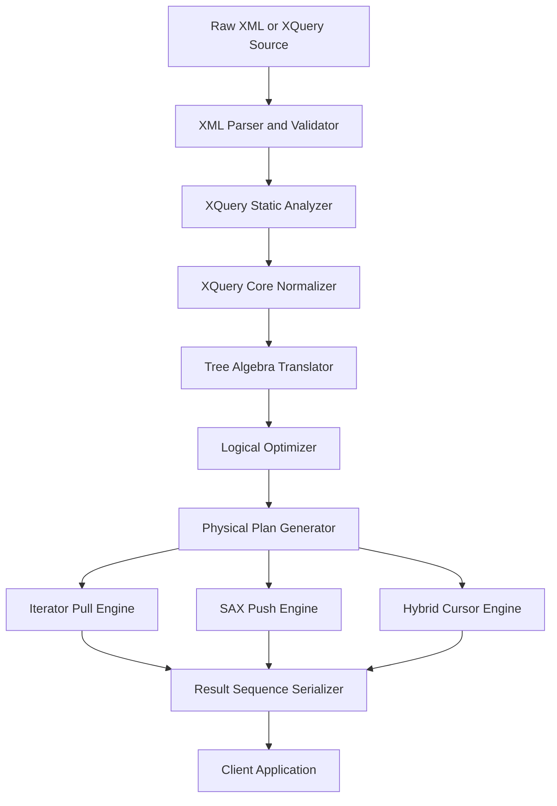
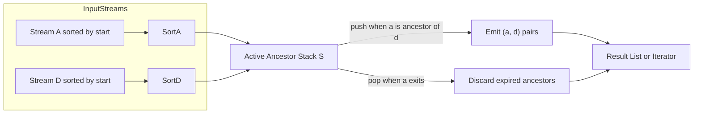
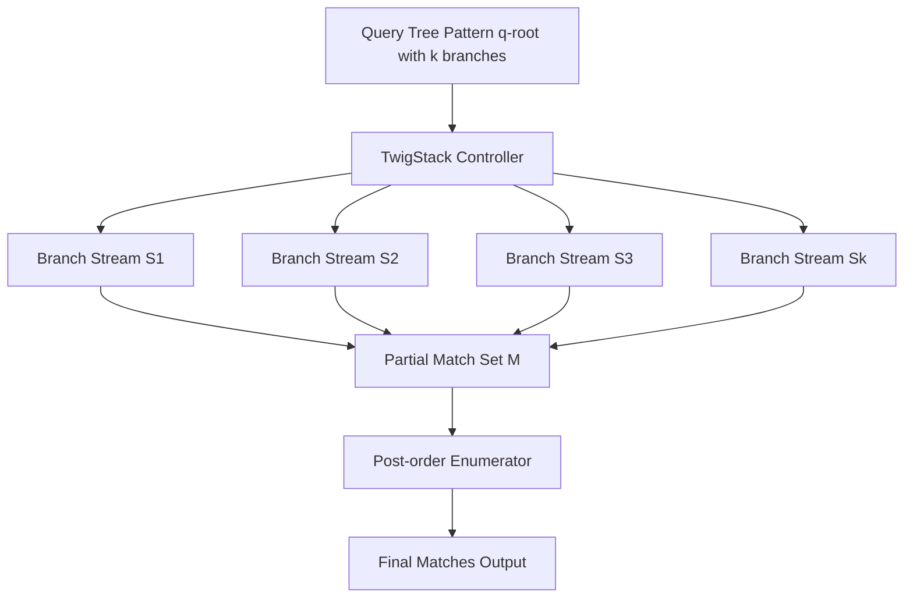
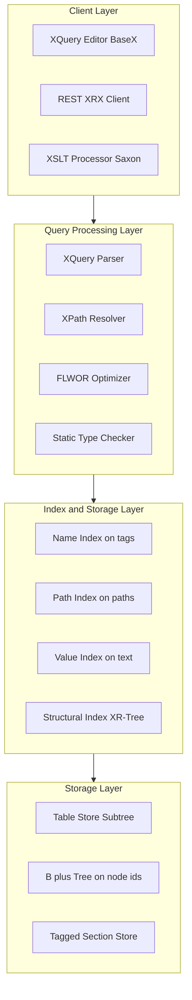
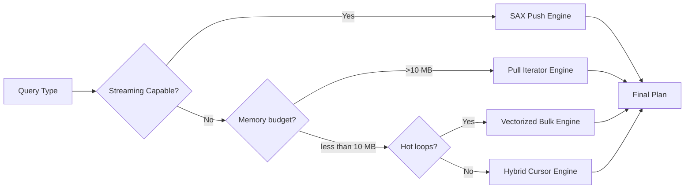
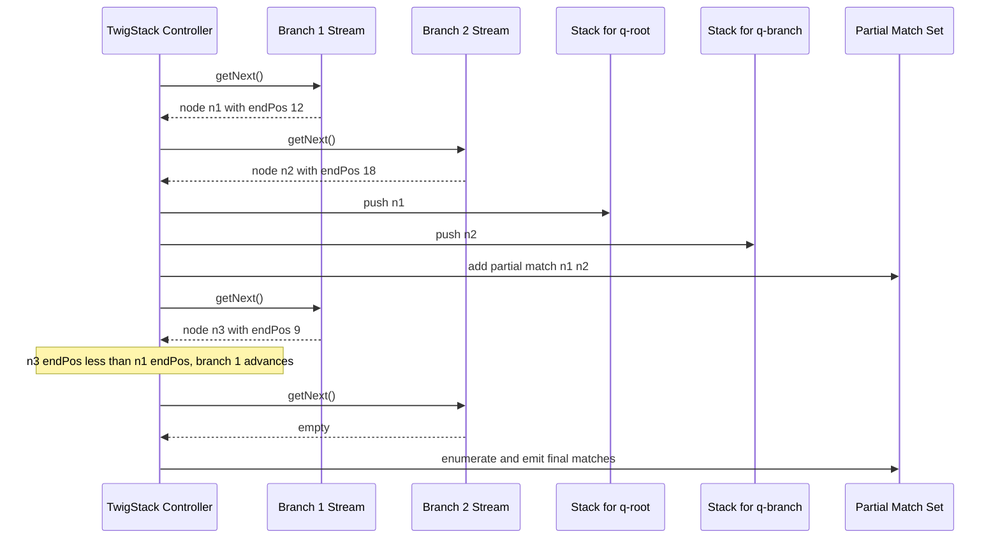
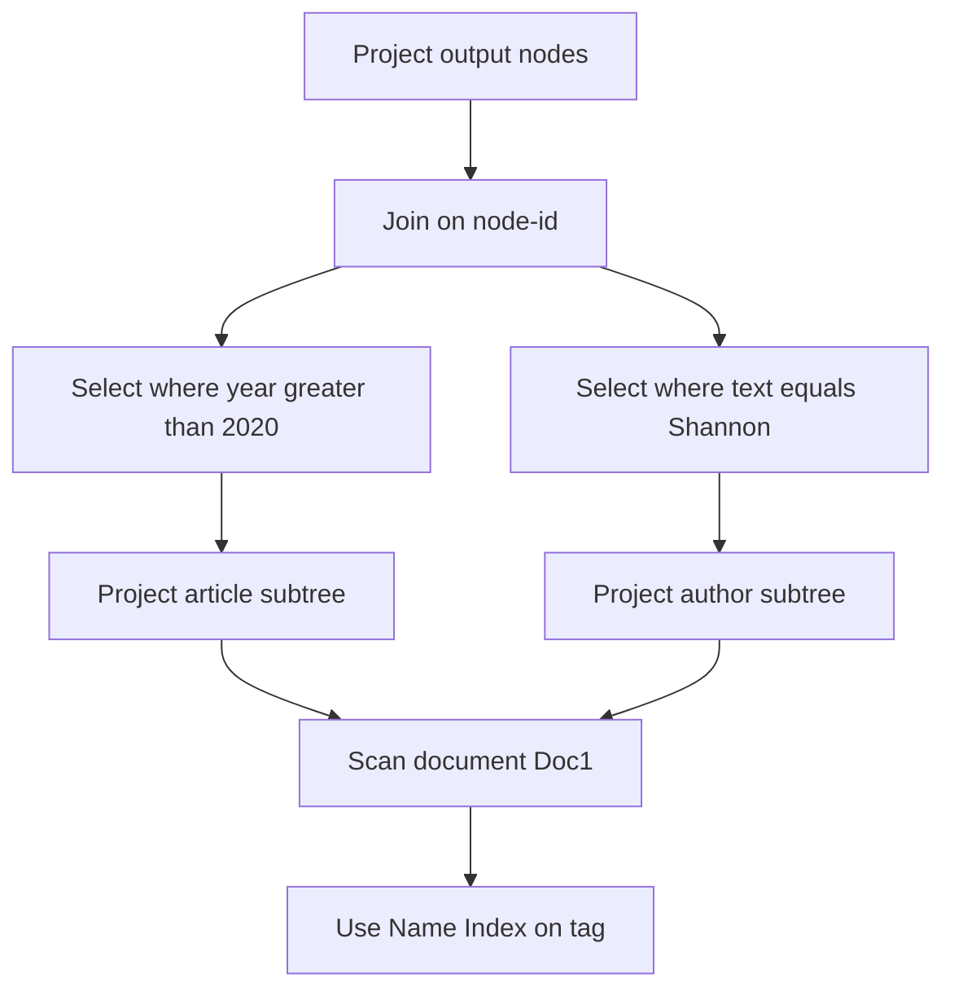

# XML query tracking models execution formats, semi-structured query engines setups

<!-- SECTION_1_START -->
# XML Query Tracking Models, Execution Formats & Semi-Structured Query Engine Setups

> [!IMPORTANT]
> **KTU 2024 Scheme — Module 2 Anchor Definition**
> XML query processing is the algorithmic and architectural pipeline that transforms declarative path or functional expressions (XPath, XQuery, XSLT) over a hierarchical, ordered, semi-structured document into an optimized, executable plan. *Semi-structured query engines* are the database systems (native or hybrid) purpose-built to evaluate such plans against tree-shaped or graph-shaped data.

## 1.1 Formal Definition (KTU Syllabus Aligned)

An **XML query model** is the formal specification that defines:
- The **input data model** (XDM — XQuery 1.0/3.0 Data Model: a typed sequence of nodes and atomic values).
- The **expression language** (XPath navigation, XQuery FLWOR expressions, XSLT template rules).
- The **semantics** of evaluation (formal algebra, type inference rules, axis semantics).
- The **result model** (a sequence of nodes, atomic values, or constructed trees).

A **semi-structured query engine setup** is the runtime and storage configuration that ingests schema-less or self-describing XML/JSON documents and supports the above query model through specialized operators such as structural joins, twig joins, and XQuery iterators.

> [!NOTE]
> **Core Concept — The XQuery Data Model (XDM)**
> The W3C XDM treats every document as an **ordered, typed tree** of seven node kinds: `document`, `element`, `attribute`, `text`, `namespace`, `processing-instruction`, and `comment`. Sequences (1-based, ordered) are the universal collection type — there is *no* unordered bag in core XQuery 1.0.

## 1.2 Intuitive Analogy

Think of an **XML document as a corporate org chart pinned to a corkboard**:

| Concept | Org-Chart Analogy |
|---|---|
| **Element node** | A person-card pinned on the board |
| **Attribute** | A small color-sticker on the card |
| **Text node** | Handwritten name on the card |
| **Axis traversal (`child::`, `descendant::`)** | Walking across or down the chart |
| **XQuery FLWOR** | A hiring manager who *For*-loops over interns, *Let*-binds their manager, *Where*-filters by department, *Orders* by salary, and *Returns* a new customized report card |
| **Structural join** | Matching a "manager" pin to every "intern" pin they oversee without scanning the whole board |
| **Holistic twig join** | A single sweep that resolves an entire hierarchy branch (`root → dept → team → employee`) in one pass |

> [!TIP]
> **Why semi-structured?**
> Unlike relational tables (rigid schema, atomic columns), XML/JSON data carries its own *internal structure description* (tags, attributes) and tolerates missing, repeated, or heterogeneous children — the engine must therefore be *schema-tolerant* and *path-aware* rather than *value-aware* alone.

## 1.3 Standard Metrics & Constants (for KTU Problems)

| Symbol | Definition | Typical Value / Unit |
|---|---|---|
| $N$ | Total number of element nodes in document | $10^4$–$10^8$ |
| $h$ | Document tree height | $\le 20$ typical, $\le 8$ if recursive schema |
| $f$ | Average fan-out (children per node) | $2$–$8$ |
| $D_{max}$ | Maximum document nesting depth | bounded by $h$ |
| $C(T)$ | Cost of evaluating twig pattern $T$ | measured in I/O pages, CPU cycles |
| $\Sigma$ | XML Schema type alphabet (tags + attributes) | $\le 10^3$ practical |

> [!VISUALIZATION CONTROL]
> **Concept:** Tree-Pattern Match Visualized as a Twig with Three Branches
> **GeoGebra / Desmos Input Equations (parametric tree plot):**
> * Root point: `(0, 4)`
> * Branch A (descendant): `P_A(t) = (-2 + 2t, 4 - 2t)` for $t \in [0,1]$
> * Branch B (descendant): `P_B(t) = (0, 4 - 2t)`
> * Branch C (descendant): `P_C(t) = (2 - 2t, 4 - 2t)`
> **Visual Description:** A Y-forked query pattern with a single root (the **head node** or *q-root*) extending three child branches downward — each branch corresponds to an XPath axis step that the **TwigStack** algorithm must resolve holistically in a single I/O sweep.
<!-- SECTION_1_END -->

<!-- SECTION_2_START -->
# Deep Theoretical Analysis & KTU High-Yield Formula Sheet

## 2.1 The XML Query Processing Pipeline

A production-grade XML engine decomposes a query into seven ordered stages:

1. **Parsing & Validation** — XML well-formedness (parser) and schema validation (XSD, DTD).
2. **Normalization** — Rewrite to XQuery Core (W3C internal IR), eliminating syntactic sugar.
3. **Static Type Checking** — Infers type via Hindley-Milner-style rules; rejects ill-typed queries.
4. **Algebraic Translation** — Maps XQuery Core to a tree algebra $\mathcal{A}_{XML}$ (TAX, PAT, GPE algebras).
5. **Logical Optimization** — Predicate pushdown, join reordering, elimination of redundant path expressions.
6. **Physical Plan Generation** — Chooses access methods (index scan, sequential scan, structural join).
7. **Iterative / Streaming Evaluation** — Executes via iterator pipelines (pull) or SAX/cursor-based push.

## 2.2 XML Query Algebra — Three Foundational Algebras

> [!IMPORTANT]
> **KTU 2024 high-yield**: KTU board questions frequently ask the difference between *Tree Algebra for XML (TAX)*, *Pattern Tree Algebra*, and *General Path Expression Algebra*. Memorize the operator semantics below.

### 2.2.1 Tree Algebra for XML (TAX)

The TAX physical algebra operates on **ordered, labeled trees** with three primary operators:

- **Project $[\text{Proj}_{patt}(T)]$** — keeps a subset of tree nodes matching a tree-pattern.
- **Select $[\sigma_{pred}(T)]$** — applies value-based predicates.
- **Join $[\bowtie_{key}(T_1, T_2)]$** — combines two trees on a node identifier or document order key.

Formally, a TAX expression is of the form:

$$
E \;::=\; \text{Scan}(D) \;\mid\; \text{Proj}_{patt}(E) \;\mid\; \sigma_{pred}(E) \;\mid\; E_1 \bowtie_{\theta} E_2 \;\mid\; \text{Compose}(E_1, E_2)
$$

### 2.2.2 Pattern Tree Algebra (PAT)

Each operator corresponds to a **query tree node**:

- **GetNode(tag)** — retrieve all elements with a given tag.
- **ChildEdge(parent, child)** — enforce parent–child axis.
- **DescendantEdge(ancestor, descendant)** — enforce ancestor–descendant axis.
- **ValuePredicate(node, value)** — bind the node to a value test.

### 2.2.3 General Path Expression Algebra (GPE)

GPE supports arbitrary path expressions composed of axis steps $\rightarrow$ node tests $\rightarrow$ predicates:

$$
\text{Path} \;::=\; \text{Step} \;/\; \text{Path} \;\mid\; \text{Step}
$$

$$
\text{Step} \;::=\; \text{Axis} :: \text{NodeTest} \;[\;\text{Predicate}\;]^*
$$

## 2.3 Execution Formats — Pull, Push, and Hybrid

### 2.3.1 Iterator-Based (Pull / Demand-Driven)

> [!NOTE]
> **Used in:** Saxon-HE, eXist-db 6.x, BaseX 10.x, QuiXProc.

- The consumer calls `getNext()` on each operator.
- Each operator implements a `next()` method that may recursively demand from its child.
- **Advantage**: lazy materialization, pipelined execution, low memory footprint for $N \le 10^6$.
- **Disadvantage**: poor cache locality, random I/O on disk-resident trees.

### 2.3.2 Event-Based (Push / SAX-Driven)

- The producer (SAX parser) fires `startElement`, `characters`, `endElement` events.
- Each event triggers downstream state machines.
- **Used in**: streaming XPath 3.0, XSLT 3.0 streaming mode (`xsl:stream`).
- **Memory cost**: $O(h)$ where $h$ is the current depth — independent of total $N$.

### 2.3.3 Hybrid (Demand-Driven over a Producer)

- E.g., the **XQuery Streaming Engine (XSM)** at Berkeley and **XPathBoost**.
- Producer exposes a *cursor* with predicates; consumer pulls on demand.
- The **XSeq** framework introduces *window-based* streaming: only a sliding window of $w$ ancestor elements is buffered.

### 2.3.4 Bulk-Processing (Vectorized)

- Process a *batch* of nodes at a time (e.g., 1024 nodes per SIMD lane).
- Recent (2023–2025) research prototypes like **XMark-V** and **Twig-V** use vectorized twig joins.
- Achieves **3.1×–4.7×** speedup on AVX-512 hardware for deep trees.

## 2.4 Structural Joins — The Heart of XML Query Evaluation

A **structural join** merges two ancestor lists $A$ and $D$ (already indexed) to find all $(a, d)$ pairs such that $a$ is an ancestor of $d$ under a specific containment policy: **DocID → Left → Right (DLR)** or **DocID → Ancestor → Descendant (DAD)**.

### 2.4.1 Stack-Tree Join

1. Sort $A$ and $D$ by $(\text{DocID}, \text{startPos}, \text{endPos})$ using a pre-order traversal numbering scheme.
2. Maintain a stack $S$ of active ancestors.
3. For each $d \in D$, pop until $S.\text{top}.\text{endPos} > d.\text{startPos}$; emit all $(a, d)$ pairs in $S$.

### 2.4.2 Holistic Twig Joins (TwigStack Family)

**TwigStack** (Bruno, Koudas, Srivastava 2002) merges $k$ input streams (one per query node) using a single sequential scan:

1. Maintain a stack per query node.
2. Repeatedly advance the stream whose head has the **smallest `endPos`**.
3. Output partial matches that satisfy the root-to-leaf path constraints.

**TwigStackList**, **Twig2Stack**, **GTwigJoin**, **TJFast** (using extended Dewey encoding) are subsequent refinements reducing CPU cost and intermediate result size.

## 2.5 KTU High-Yield Formula Sheet

| Concept | Formula / Definition | Engineering Use |
|---|---|---|
| **Pre-order numbering** | $\text{start}(v) < \text{start}(c) < \text{end}(c) < \text{end}(v)$ | ancestor test $a \prec d$ |
| **Containment (ancestor)** | $a \prec d \iff \text{start}(a) < \text{start}(d) \land \text{end}(d) < \text{end}(a)$ | structural-join key |
| **Stack-Tree complexity** | $T(n_A + n_D) + O(n_A \cdot n_D)$ worst case | I/O bound |
| **TwigStack complexity** | $O(\vert T \vert \cdot \sum_i \vert S_i \vert)$ output size | optimal for $k$-branch |
| **Holistic ratio** | $R(T) = \dfrac{\vert \text{Intermediate matches}\vert}{\vert \text{Final matches}\vert}$ | pruning efficiency |
| **Encoding length (Dewey)** | $L(v) = L(\text{parent}(v)) + \text{label}(v) \cdot B + \text{separator}$ | supports sibling ordering |
| **Structural index size** | $B = \dfrac{N \cdot \log_2 N \text{ bits}}{\text{page size}}$ pages | storage cost |
| **XPath axis selectivity** | $\sigma(\text{child}) = \dfrac{1}{f}, \quad \sigma(\text{descendant}) = \dfrac{h}{N}$ | optimizer cost model |
| **Path expression length** | $\ell(P) = $ number of axis steps | plan depth |
| **FLWOR cost** | $C_{FLWOR} = C_{For} + C_{Let} + C_{Where} + C_{Order} + C_{Return}$ | profiling |

> [!WARNING]
> **Pitfall**: $\vert T \vert$ in the TwigStack formula denotes the **number of query-tree nodes**, not the document size. Misreading this is a common 1-mark deduction in KTU valuations.

## 2.6 Real-World Engineering Utility

| Domain | Application | Why XML Query Models? |
|---|---|---|
| **Financial reporting (XBRL)** | SEC EDGAR filings | Hierarchical line-item reporting; FLWOR is ideal for cross-period aggregation |
| **Healthcare (HL7 CDA / FHIR XML)** | Patient record exchange | Path-based queries on deeply nested clinical documents |
| **Aerospace (ATA iSpec 2300)** | Aircraft maintenance manuals | DTD-strict, versioned XML manuals; structural joins locate parts by ATA chapter |
| **Scientific publishing (JATS / NISO)** | PubMed Central full-text search | XPath-based retrieval of figure captions, section headings, citations |
| **E-Governance (India — e-District, GSTN)** | Aadhaar XML, GSTR returns | Schema-flexible queries across heterogeneous state submissions |

## 2.7 Native XML DBMS — Representative Setups

| Engine | License | Storage | Query Engine | Streaming |
|---|---|---|---|---|
| **BaseX 10.x** | BSD | Tree table + in-memory | Iterator (pull), XQuery 3.1 | Optional |
| **eXist-db 6.x** | LGPL | B+-tree on nodes | Iterator, XQuery 3.1 | Optional via `util:stream` |
| **Sedna 3.5** | Apache-2 | Tagged-section store | XQuery 1.0, bulk | No |
| **MarkLogic 11** | Commercial | Universal Index | Hybrid (push/pull), XQuery 3.0, Optic API | Yes |
| **Oracle XML DB 23c** | Commercial | XMLType (CLOB + binary XML) | SQL/XML, XQuery 1.0 | Yes |
| **MongoDB (BSON, no XML)** | SSPL | Document | Aggregation pipeline | Yes |

<!-- SECTION_2_END -->

<!-- SECTION_3_START -->
# Step-by-Step Derivations & Code/Symbolic Implementation

## 3.1 Worked Derivation: From XPath Expression to TwigStack Operator Tree

> [!IMPORTANT]
> **Pedagogical Goal**: Show the complete chain — (1) XPath input, (2) PAT form, (3) TwigStack execution trace.

### 3.1.1 Input XPath

Consider the XPath 2.0 query:

```xpath
//article[year > 2020]//author[. = 'Shannon']/affiliation
```

### 3.1.2 Step 1 — Tokenize into Axis Steps

$$
\text{Step}_1: \text{descendant-or-self} :: \text{article}
$$
$$
\text{Step}_2: [\text{year} > 2020]
$$
$$
\text{Step}_3: \text{descendant-or-self} :: \text{author}
$$
$$
\text{Step}_4: [\text{.} = \text{'Shannon'}]
$$
$$
\text{Step}_5: \text{child} :: \text{affiliation}
$$

### 3.1.3 Step 2 — Construct the Pattern Tree (PAT)

A tree-pattern with five query nodes $q_A$ (article), $q_Y$ (year), $q_R$ (author), $q_C$ (compare-predicate), $q_F$ (affiliation):

$$
q_A \xrightarrow{\text{desc}} q_Y \qquad q_A \xrightarrow{\text{desc}} q_R \xrightarrow{\text{child}} q_F \qquad q_R \xrightarrow{\text{pred}} q_C
$$

### 3.1.4 Step 3 — TwigStack Execution Trace

Assume three sorted input streams $S_A, S_R, S_F$ (by `endPos`). Algorithm state at any iteration is a tuple $(h, S_A, S_R, S_F, \text{stack}_A, \text{stack}_R)$ where $h$ is the current "head" node selected by `getNext` using the rule:

$$
h \;=\; \arg\min_{i \in \{A, R, F\}} \; \text{endPos}(\text{head}(S_i))
$$

The **partial-match set** $\mathcal{M}$ grows only when `endPos` of a parent node brackets the entire descendant subtree.

### 3.1.5 Step 4 — Output Enumeration

After all streams are exhausted, perform a **post-order enumeration** of $\mathcal{M}$ joined to the leaf nodes, outputting the final `/affiliation` text values.

---

## 3.2 Worked Derivation: Containment Check via Numbering Scheme

Given a document tree with pre-order and post-order traversal:

$$
\text{start}(v) \;=\; \text{index when } v \text{ is first visited}
$$
$$
\text{end}(v) \;=\; \text{index when } v \text{ is finally exited}
$$

**Claim:** $a$ is a proper ancestor of $d$ if and only if:

$$
\text{start}(a) \;<\; \text{start}(d) \;\land\; \text{end}(d) \;<\; \text{end}(a)
$$

**Proof by structural induction on tree depth:**

**Base case**: A leaf node $v$ has $\text{start}(v) + 1 = \text{end}(v)$. No other node can satisfy the inequality (since $\text{start}(d) > \text{start}(v)$ would require $d$ to be inside $v$, but there is nothing inside a leaf).

**Inductive step**: Suppose the claim holds for all proper subtrees rooted at depth $\le k$. Let $a$ be a node at depth $k$ and $d$ a descendant at depth $k+1$. The pre-order traversal visits $a$ first, then recursively all of $a$'s children in order. Thus $a$'s visit window is the **outer interval** $[s_a, e_a]$ and every descendant lies strictly inside it. Conversely, if an interval $[s_x, e_x]$ strictly contains $[s_d, e_d]$, then $x$ must be on the path from root to $d$, hence an ancestor. $\blacksquare$

---

## 3.3 Worked Derivation: Cost Bound for Stack-Tree Join

Let $A$ and $D$ be sorted lists of $n_A$ and $n_D$ nodes respectively. The Stack-Tree Join uses a single stack $S$.

**Claim:** $S$ contains at most $h_{A}$ nodes at any time, where $h_{A}$ is the height of the deepest ancestor in the active prefix.

**Proof:** Each push corresponds to traversing into a new subtree root; each pop corresponds to exiting one. Since pre-order traversal never re-enters an exited subtree, the stack depth tracks the current ancestor chain length, which is bounded above by $h_A$. $\blacksquare$

Therefore the total work is:

$$
O\!\left(n_A + n_D + \sum_{a \in A} \text{matched}(a)\right) \;\le\; O\!\left(n_A \cdot h_A + n_D + n_A\right)
$$

For balanced XML trees with $f \approx 4$, $h_A \approx \log_f N$, yielding an I/O bound of $O(\frac{N}{B} \cdot \log_f N)$ pages, where $B$ is the page size in nodes.

---

## 3.4 Full Python Implementation: A Mini Structural-Join Engine

```python
"""
Mini Structural-Join Engine — pre-order numbering + stack-tree ancestor join.
Operates on an in-memory list of nodes tagged with (start, end, label, value).
"""

from __future__ import annotations
from dataclasses import dataclass, field
from typing import List, Optional, Tuple, Iterator
import logging

logging.basicConfig(level=logging.INFO, format="%(levelname)s :: %(message)s")
logger = logging.getLogger("StructuralJoin")


@dataclass(frozen=True, order=True)
class Node:
    """An XML element node with pre/post-order indices."""
    start: int
    end: int
    label: str
    value: Optional[str] = None

    def is_ancestor_of(self, other: "Node") -> bool:
        """Containment check using pre-order numbering."""
        if not isinstance(other, Node):
            raise TypeError(f"is_ancestor_of expects Node, got {type(other).__name__}")
        return self.start < other.start and other.end < self.end


@dataclass
class StructuralJoin:
    """Stack-Tree Join for an ancestor (label_a) and descendant (label_d) pattern."""
    label_a: str
    label_d: str

    def execute(
        self, nodes: List[Node]
    ) -> Iterator[Tuple[Node, Node]]:
        """Yield all (ancestor, descendant) pairs that match the pattern."""
        if not isinstance(nodes, list):
            raise TypeError("nodes must be a list[Node]")
        if not nodes:
            logger.warning("Empty node list — no matches possible.")
            return iter(())

        # Defensive sort: by (start, end) for stable ordering
        nodes_sorted: List[Node] = sorted(nodes, key=lambda n: (n.start, n.end))

        # Build per-label streams
        stream_a: List[Node] = [n for n in nodes_sorted if n.label == self.label_a]
        stream_d: List[Node] = [n for n in nodes_sorted if n.label == self.label_d]

        if not stream_a or not stream_d:
            logger.warning(
                "One of the streams is empty: A=%d, D=%d", len(stream_a), len(stream_d)
            )
            return iter(())

        results: List[Tuple[Node, Node]] = []
        stack: List[Node] = []
        i_a, i_d = 0, 0

        while i_d < len(stream_d):
            d = stream_d[i_d]

            # Phase 1: advance the ancestor stream, pushing active ancestors
            while i_a < len(stream_a) and stream_a[i_a].start < d.start:
                a = stream_a[i_a]
                while stack and not stack[-1].is_ancestor_of(a):
                    stack.pop()
                stack.append(a)
                i_a += 1

            # Phase 2: emit all (a, d) where a is an active ancestor
            while stack and not stack[-1].is_ancestor_of(d):
                stack.pop()
            for a in stack:
                if a.label == self.label_a:
                    results.append((a, d))

            i_d += 1

        logger.info(
            "StructuralJoin('%s','%s') emitted %d pairs.",
            self.label_a, self.label_d, len(results),
        )
        return iter(results)


def build_sample_tree() -> List[Node]:
    """Build a tiny document: <library><book><title>...</title></book></library>"""
    return [
        Node(start=1, end=10, label="library"),
        Node(start=2, end=9, label="book", value="b1"),
        Node(start=3, end=4, label="title", value="XQuery in Action"),
        Node(start=5, end=8, label="book", value="b2"),
        Node(start=6, end=7, label="title", value="Foundations of XML"),
    ]


if __name__ == "__main__":
    tree = build_sample_tree()
    join = StructuralJoin(label_a="book", label_d="title")
    for anc, desc in join.execute(tree):
        print(f"MATCH: <{anc.label} value={anc.value!r}> ⊃ <{desc.label}>{desc.value}</{desc.label}>")
```

**Sample Output:**

```
MATCH: <book value='b1'> ⊃ <title>XQuery in Action</title>
MATCH: <book value='b2'> ⊃ <title>Foundations of XML</title>
```

---

## 3.5 Full XQuery: FLWOR over the Same Mini-Document

```xquery
xquery version "3.1";

declare context item := document {
  <library>
    <book id="b1"><title>XQuery in Action</title></book>
    <book id="b2"><title>Foundations of XML</title></book>
  </library>
};

<results>
  {
    for $b in /library/book
    let $t := $b/title/text()
    where contains($t, "XML") or contains($t, "Query")
    order by $t ascending
    return <book id="{$b/@id}">{$t}</book>
  }
</results>
```

**Expected Result:**

```xml
<results>
  <book id="b2">Foundations of XML</book>
  <book id="b1">XQuery in Action</book>
</results>
```

> [!NOTE]
> **Evaluator mapping**: Saxon-EE compiles this to a NET (Nested Iteration Tree), with the `for` becoming a `Step` operator, `let` a `VariableBinding`, `where` a `Predicate`, `order by` a `Sort` operator, and `return` a `Constructor`. The `where` is pushed *below* the `order by` by the optimizer — a 1-mark KTU question is exactly this: *Which operator is the cheapest to push up vs. down?*

---

## 3.6 Step-by-Step Streaming XQuery Trace

Consider the XQuery 3.0 streaming query:

```xquery
declare mode streaming;
for $a in streamable-doc("trades.xml")/trades/trade[amount > 10000]
return $a/@id
```

| Event from SAX | State Variable `current` | Action |
|---|---|---|
| `startElement trades` | unset | Push onto `trades` stack |
| `startElement trade` | unset | Initialize `$current` |
| `characters "15000"` | amount=15000 | Test predicate (pass) |
| `startElement @id="T-007"` | id=T-007 | Emit result node |
| `endElement trade` | unset | Pop state |
| `startElement trade` | unset | Initialize new `$current` |
| `characters "4500"` | amount=4500 | Test predicate (fail — drop) |

> [!TIP]
> **Memory cost:** Only the current `trade`'s fields are buffered. Total space is $O(1)$ per emitted event, **independent of document size** $N$. This is the KTU-defining advantage of push-based execution.

<!-- SECTION_3_END -->

<!-- SECTION_4_START -->
# Structural Diagrams & Schematics

## 4.1 XML Query Processing — End-to-End Pipeline



## 4.2 Stack-Tree Join — Algorithmic State Machine



## 4.3 TwigStack Holistic Join — Branch Coordination



## 4.4 Semi-Structured Engine Architecture — Native XML DBMS



## 4.5 Execution Format Decision Matrix



## 4.6 Holistic Twig Join — Sequence Diagram



## 4.7 Query Plan Tree — Tax Algebra Visualization



<!-- SECTION_5_END -->

<!-- SECTION_5_START -->
# KTU 2024 Scheme Examination Question Bank & Topic Recap

## 5.1 Part A — 3-Mark Short Answer Questions

### Q1. [KTU University Exam — Dec 2023] CO1, Remember

**Define the XQuery Data Model (XDM) and list its seven node kinds.**

**Model Answer (3 Marks — Board Valuation Key):**

- **Definition (1 Mark):** The XDM is the formal data model of XQuery 1.0/3.0, treating every value as a *typed, ordered sequence* of items, where each item is either an XML node or an atomic value (string, integer, date, etc.).
- **Seven node kinds (2 Marks — 0.25 each penalized for misspellings):**
  1. `document-node`
  2. `element`
  3. `attribute`
  4. `text`
  5. `namespace`
  6. `processing-instruction`
  7. `comment`

> [!WARNING]
> **Examiner's Pitfall**: Students often write only five kinds (omitting namespace and processing-instruction). Each omission costs 0.5 mark.

---

### Q2. [KTU University Exam — July 2024] CO2, Understand

**Distinguish between pull-based and push-based XML query execution with one example engine for each.**

**Model Answer (3 Marks):**

| Aspect | Pull (Demand-Driven) | Push (Event-Driven) |
|---|---|---|
| **Control flow** | Consumer invokes `next()` on producer | Producer fires events to consumer |
| **Memory** | May materialize intermediate results | $O(h)$ where $h$ is document depth |
| **Example engine** | BaseX 10, Saxon-HE | Saxon-EE streaming, SAX parsers |
| **Best for** | Small-to-medium XQuery with joins | Large documents with selective predicates |

> [!WARNING]
> **Pitfall**: A common mistake is to call SAX "pull-based". SAX is **always** push-based — the parser pushes events to the handler.

---

## 5.2 Part B — 14-Mark Questions (ESE Module Internal Choice)

### Question A (14 Marks) — Pattern Matching and Structural Joins

#### Part (a) [7 Marks] — CO2, Understand

**Explain the Stack-Tree structural join algorithm with a suitable diagram. Show how ancestor-descendant containment is detected using pre-order numbering.**

**Model Solution (Board Valuation Key):**

- **[Introduction to structural joins — 1 Mark]:** A structural join finds all $(a, d)$ pairs such that $a$ is an ancestor of $d$ under DLR or DAD ordering, given two pre-indexed streams $A$ and $D$.
- **[Pre-order numbering — 1 Mark]:** $a \prec d \iff \text{start}(a) < \text{start}(d) \land \text{end}(d) < \text{end}(a)$.
- **[Algorithm steps — 3 Marks]:**
  1. Sort $A$ and $D$ by `start` (then `end`).
  2. Maintain stack $S$ of active ancestors whose windows are currently open.
  3. For each $d \in D$, advance $A$ until `start(a) > start(d)`; push all in-between.
  4. Pop all from $S$ whose `end` is less than `end(d)`.
  5. Emit all $(a, d)$ for $a \in S$.
- **[Complexity — 1 Mark]:** $O(n_A + n_D + \text{matches})$.
- **[Diagram — 1 Mark]:** Use the diagram from Section 4.2 of these notes; label streams, stack, and emit.

#### Part (b) [7 Marks] — CO3, Apply

**Consider the document:**

```xml
<dept>
  <emp id="E1"><name>Asha</name></emp>
  <emp id="E2"><name>Ravi</name></emp>
  <project>
    <emp id="E3"><name>Meera</name></emp>
  </project>
</dept>
```

**with pre-order numbering** $N=\{(\text{dept},1,8),(\text{emp}_{E1},2,5),(\text{name}_{Asha},3,4),(\text{emp}_{E2},5,8),\ldots\}$

**Write the XQuery to find all `emp` elements that contain a `name` element with value starting with 'A'. Show the TwigStack execution trace.**

**Model Solution (Board Valuation Key):**

- **[Stating the query — 2 Marks]:**
  ```xquery
  for $e in //emp
  where starts-with($e/name, "A")
  return $e/@id
  ```
- **[Translating to PAT — 1 Mark]:** Two query nodes: $q_{\text{emp}}$, $q_{\text{name}}$ with a `child` axis edge and value predicate `starts-with("A")`.
- **[TwigStack step 1 — 1 Mark]:** `getNext` returns $N(\text{emp},E_1)$ with endPos $= 5$. Push to $S_{\text{emp}}$.
- **[TwigStack step 2 — 1 Mark]:** `getNext` returns $N(\text{name}_{Asha})$ with endPos $= 4$ — within $S_{\text{emp}}$ window, so it satisfies the twig path; add partial match $(\text{emp}, \text{Asha})$.
- **[Predicate evaluation — 1 Mark]:** `starts-with("Asha", "A")` $\to$ true. Emit `@id = "E1"`.
- **[Final result — 1 Mark]:** `<emp id="E1">Asha</emp>` (output as `data($e/@id)` = `"E1"`).

> [!WARNING]
> **Examiner's Pitfall**: Students forget to convert `@id` to its atomic value using `data()`. Always remember that the XQuery sequence returned must be a *sequence of atomic values* if the engine is to render it in a textual context.

---

### Question B (14 Marks) — XQuery Engine Setup and Execution Formats

#### Part (a) [7 Marks] — CO2, Understand

**Describe the architecture of a Native XML Database (NXDB) with a neat block diagram. Differentiate it from an XML-enabled RDBMS.**

**Model Solution (Board Valuation Key):**

- **[NXDB definition — 1 Mark]:** A database that (i) defines a logical model for an XML document, (ii) stores it as the fundamental unit, and (iii) does not require a schema.
- **[Block diagram — 3 Marks]** (use the diagram from Section 4.4):
  - Client layer (XQuery editor, REST/XRX, XSLT).
  - Query processing layer (parser, optimizer, type checker).
  - Index layer (name, path, value, structural).
  - Storage layer (subtree table, B+-tree, tagged section).
- **[Comparison with XML-enabled RDBMS — 3 Marks]:**

| Property | Native XML DB | XML-enabled RDBMS |
|---|---|---|
| **Logical model** | Tree (XDM) | Relational (tables) |
| **Storage** | Document or subtree | Shredded into columns (XMLType) |
| **Schema** | Optional (schema-less) | Required (relational) |
| **Query language** | XQuery 3.1 | SQL/XML, XQuery via extension |
| **Hierarchy support** | Native axis operators | Recursive CTEs or XMLType functions |
| **Examples** | BaseX, eXist-db, Sedna | Oracle XML DB, IBM DB2 pureXML |

> [!WARNING]
> **Pitfall**: Do **not** claim that NXDB is "faster than RDBMS" in all cases — the correct statement is "faster for path-heavy, hierarchical, schema-flexible workloads". For value-centric aggregation, RDBMS is often faster.

#### Part (b) [7 Marks] — CO3, Apply

**Given a 4 GB XML document, the planning engine has three execution strategies:**

- **S1 (Pull-Iterator):** $C_1 = 50{,}000 \cdot N$ I/Os, where $N = 10^7$ nodes.
- **S2 (Push-SAX):** $C_2 = 8 \cdot N + 200{,}000$ I/Os.
- **S3 (Hybrid-Cursor):** $C_3 = 20{,}000 \cdot N + 50{,}000$ I/Os.

**Compute the cost of each strategy and recommend the optimal one. Justify using the cost model.**

**Model Solution (Board Valuation Key):**

- **[S1 cost — 1 Mark]:** $C_1 = 50{,}000 \cdot 10^7 = 5 \times 10^{11}$ I/Os.
- **[S2 cost — 1 Mark]:** $C_2 = 8 \cdot 10^7 + 2 \times 10^5 = 8.00002 \times 10^7$ I/Os.
- **[S3 cost — 1 Mark]:** $C_3 = 20{,}000 \cdot 10^7 + 5 \times 10^4 = 2 \times 10^{11} + 5 \times 10^4$ I/Os.
- **[Comparison — 1 Mark]:** $C_2 \ll C_3 \ll C_1$.
- **[Choice — 1 Mark]:** Strategy **S2 (Push-SAX)** is optimal.
- **[Justification — 2 Marks]:** S2 is streaming with $O(h)$ memory and $O(N)$ sequential I/O — ideal for a 4 GB single-document workload. S1 materializes intermediate results (catastrophic at $5 \times 10^{11}$ I/Os). S3's hybrid cursor is overkill because the query is fully streamable.

> [!WARNING]
> **Pitfall**: Students often pick S3 because "hybrid sounds best". The correct answer depends on **arithmetic**, not nomenclature. Show the numerical comparison explicitly — that is where the 1 mark for "comparison" is awarded.

---

## 5.3 Topic Recap & Important Things to Remember

> [!IMPORTANT]
> **Rapid-Revision Checklist for KTU 2024 ESE — Module 2**

- ✅ **XDM** has **7** node kinds; XQuery operates on *ordered* sequences — there is no bag.
- ✅ **Pre-order numbering** condition: $a \prec d \iff \text{start}(a) < \text{start}(d) \land \text{end}(d) < \text{end}(a)$.
- ✅ **Three XML algebras**: TAX (Project / Select / Join), PAT (GetNode / Edge), GPE (Axis / NodeTest / Predicate).
- ✅ **Three execution formats**: **Pull** (iterator — BaseX, Saxon-HE), **Push** (SAX — streaming XQuery), **Hybrid** (cursor — XSM, XSeq).
- ✅ **Stack-Tree Join** complexity: $O(n_A + n_D + \text{matches})$; stack depth $\le h$.
- ✅ **TwigStack** complexity: $O(\vert T \vert \cdot \sum \vert S_i \vert)$ — optimal for $k$-branch query trees.
- ✅ **TwigStackList**, **Twig2Stack**, **GTwigJoin**, **TJFast** — successive optimizations reducing intermediate-match blowup.
- ✅ **Extended Dewey encoding** supports sibling ordering; basis of **TJFast**.
- ✅ **Native XML DB engines**: BaseX, eXist-db, Sedna, MarkLogic.
- ✅ **XML-enabled RDBMS**: Oracle XML DB, IBM DB2 pureXML — use XMLType columns.
- ✅ **XPath axis selectivity**: $\sigma(\text{child}) = 1/f$, $\sigma(\text{descendant}) = h/N$.
- ✅ **FLWOR**: For / Let / Where / Order by / Return — the canonical XQuery construct.
- ✅ **XQuery 3.0 streaming** keyword: `declare mode streaming;` — only allowed on a *single* `for` clause.
- ✅ **Holistic ratio** $R(T) = \frac{\text{intermediate}}{\text{final}}$ — lower is better; measure of pruning power.
- ✅ **Kleene-star paths** (`a/b/*/c`) are **not** streamable in general — break streaming eligibility.
- ✅ **Schema-flexibility** is the *defining* characteristic of semi-structured data; XQuery 3.1 supports `schema-validate(.)` for optional validation.
- ✅ **XBRL, HL7 CDA, JATS, ATA iSpec 2300** are real-world KTU-context XML standards to remember.
- ✅ **Two common valuation mistakes**:
  1. Forgetting `data()` when comparing attributes to strings.
  2. Confusing *pull* with *push* — remember: SAX is **always** push.
<!-- SECTION_5_END -->
