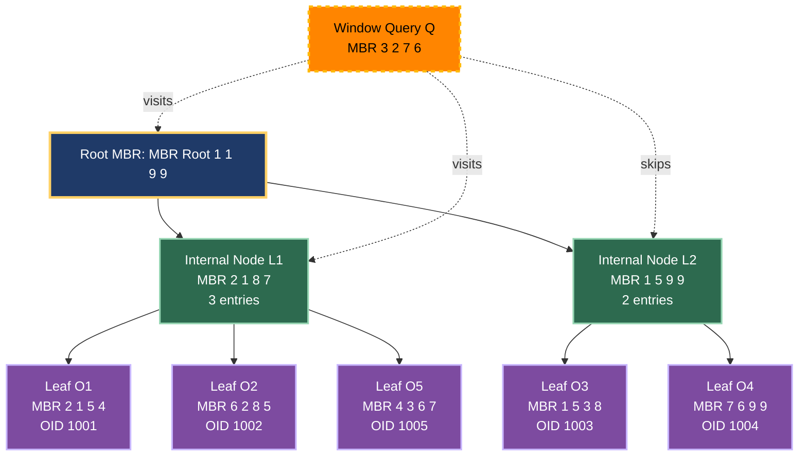
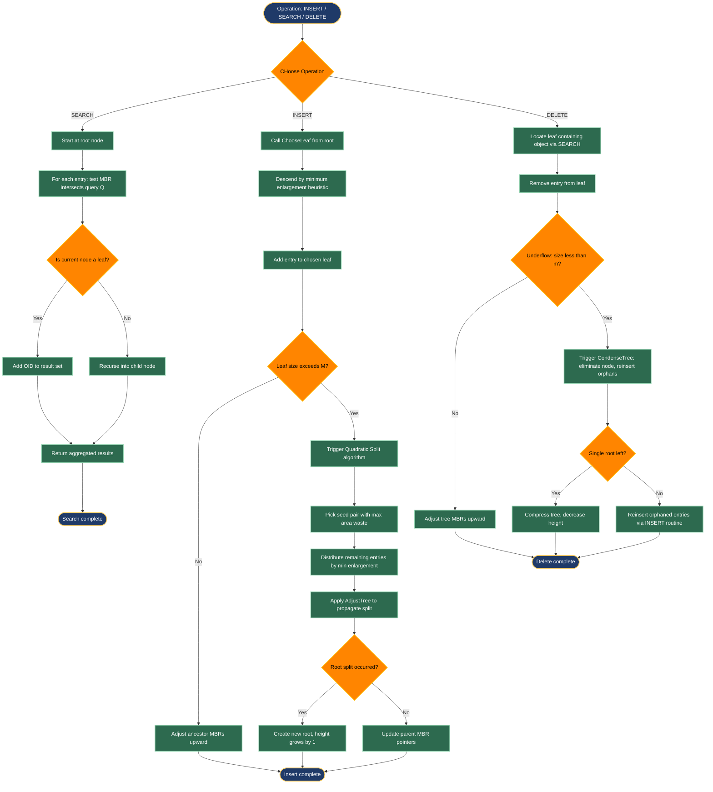
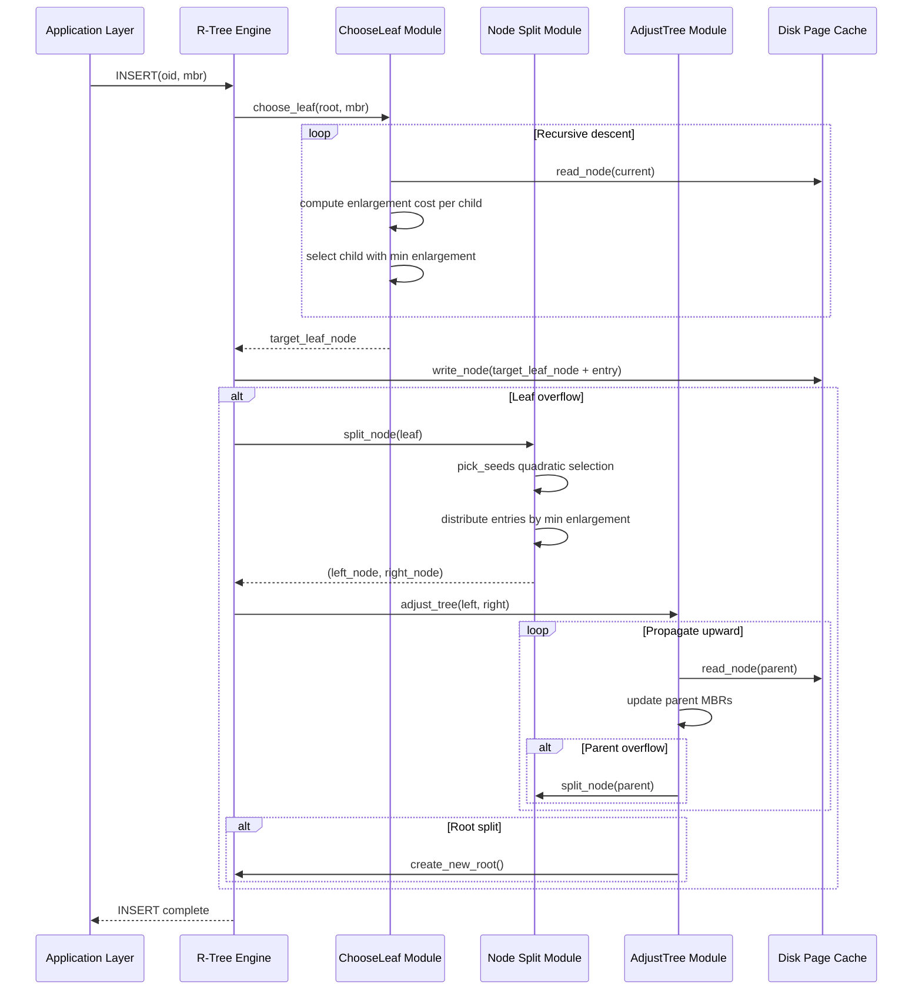
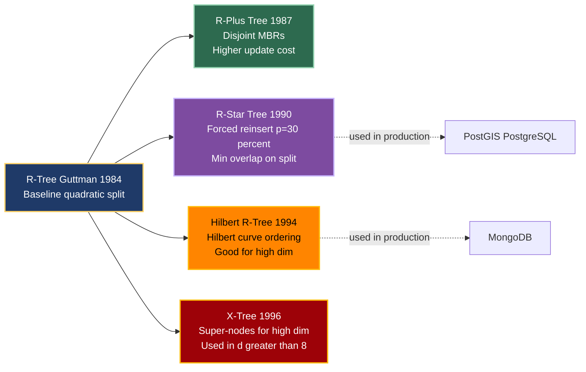
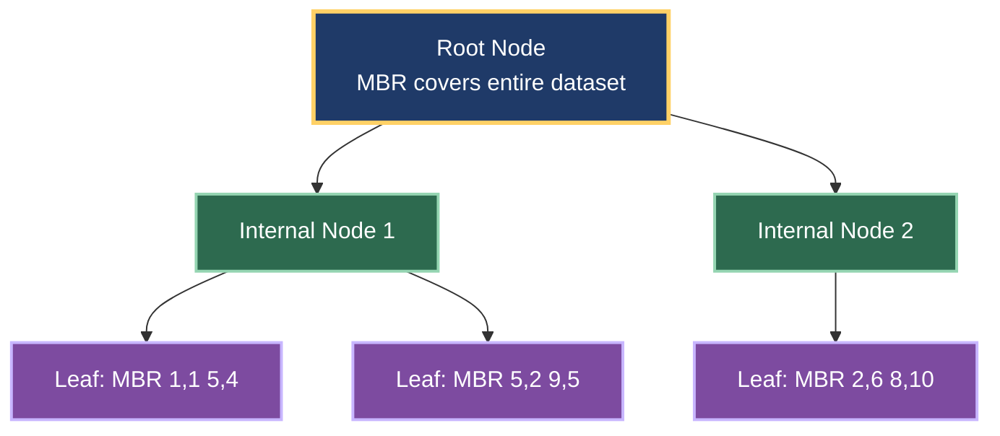
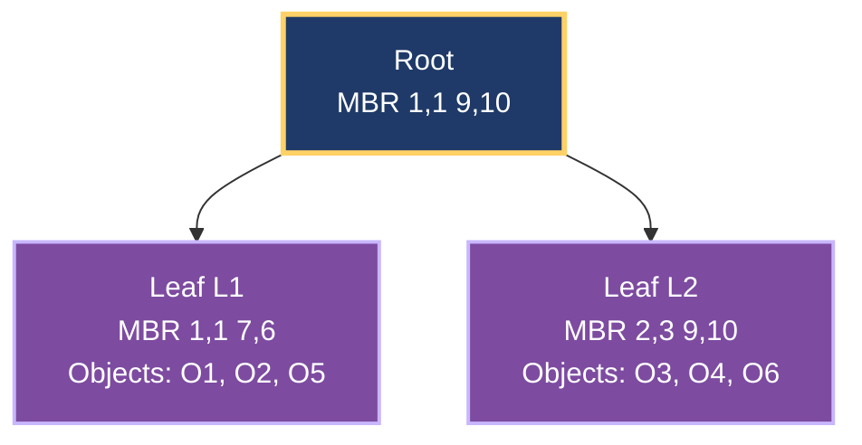

# Spatial indexing structures formats: R-trees data indexing routing benchmarks

<!-- SECTION_1_START -->
# R-Trees: Spatial Data Indexing Structures

> [!NOTE]
> **KTU 2024 Syllabus Mapping (PECST605 - Module 3):** R-trees are the foundational hierarchical spatial access method used to index multi-dimensional objects such as points, rectangles, polygons, and geographic features. They form the **backbone of modern GIS systems**, location-based services, and computer-aided design databases.

## 1.1 Formal Definition

An **R-tree** is a height-balanced tree data structure (similar in shape to a B+ tree) proposed by **Antonin Guttman (1984)** that indexes **spatial data** using **Minimum Bounding Rectangles (MBRs)**. Each internal node stores a set of $(MBR, child\text{-}pointer)$ pairs, and each leaf node stores a set of $(MBR, object\text{-}id)$ pairs pointing to actual spatial objects.

Formally, an R-tree of **order $(m, M)$** satisfies:

$$m \le \text{entries per node} \le M$$

where $m = \lceil M/2 \rceil$ is the minimum entries, $M$ is the maximum entries per node, and **$M$** typically ranges between **4 and 32** in production systems. Every leaf node lies at the **same depth** $h$, guaranteeing $O(\log_{m} N)$ search complexity for $N$ indexed objects.

> [!IMPORTANT]
> **Core Invariant:** Every spatial object is **fully contained** within exactly one leaf MBR. Internal MBRs are the **tightest enclosing rectangles** of all child MBRs. There is **no overlap constraint** in classic R-trees — overlap is only minimized heuristically.

## 1.2 Intuitive Analogy — The Library Map System

Imagine a huge library with **10,000 books** shelved across many rooms. To find a book on "Quantum Physics in Kerala," you cannot scan every shelf. Instead, the librarian gives you a **building map**:

1. The **library building** is divided into **floors** (root level) — each floor has a labeled **rectangular zone** on the map.
2. Each **floor** is divided into **sections** (internal nodes) — each section is again a rectangle on the floor's map.
3. Each **section** contains **shelves** (leaf nodes) — shelves hold actual books (real geometric objects).

When you ask for a book, you look at the **building map first** (zoom into the right floor), then the **floor plan** (right section), then the **shelf list** (right shelf). The rectangles on each map are **MBRs** — they tightly enclose what is *inside*. An R-tree works **exactly this way** for geographic data: the root MBR encloses the entire dataset, internal MBRs enclose regions, and leaves enclose actual spatial objects.

> [!TIP]
> **Why MBRs and not exact shapes?** MBRs are **simple, axis-aligned rectangles** with only **4 numbers** (in 2D: $\min_x, \min_y, \max_x, \max_y$). Polygon overlap tests are computationally expensive; MBR overlap is just **4 comparisons**. This makes R-trees extremely fast.

## 1.3 Why R-Trees Are Used — Real-World Relevance

| Application Domain | How R-Trees Are Used |
|--------------------|----------------------|
| **Google Maps / OpenStreetMap** | Indexing millions of road segments for fastest route queries |
| **PostgreSQL PostGIS** | Default spatial index on geometry columns |
| **Uber / Lyft** | Finding nearest drivers within a radius |
| **Computer-Aided Design (CAD)** | Spatial queries on 2D/3D blueprints |
| **Astronomical databases** | Indexing sky survey regions (HEALPix cells) |
| **MongoDB** | Native `2dsphere` index uses R-tree variant |

> [!VISUALIZATION CONTROL]
> **Concept:** MBR containment and tree structure visualization
> **GeoGebra / Desmos Input Equations (2D Points to Plot):**
> * Leaf-level objects (4 points): $P_1=(1,1)$, $P_2=(3,2)$, $P_3=(5,3)$, $P_4=(7,5)$
> * Leaf MBR 1: rectangle $(0,0)$ to $(4,3)$
> * Leaf MBR 2: rectangle $(4,2)$ to $(8,6)$
> * Root MBR: rectangle $(0,0)$ to $(8,6)$
> **Visual Description:** Draw two adjacent axis-aligned rectangles on the $xy$-plane representing leaf MBRs, and a larger enclosing rectangle representing the root MBR. The student should observe that the root MBR tightly encloses both children, demonstrating hierarchical decomposition.

---

## 1.4 Key Properties Summary

> [!IMPORTANT]
> **The Four Golden Properties of R-Trees:**
> 1. **Height-Balanced:** All leaves are at the same depth $h$ — search time is predictable.
> 2. **Space-Partitioning (not disjoint):** MBRs of siblings **may overlap** (this is the key weakness of basic R-trees).
> 3. **Dynamic:** Supports insert, delete, update, and range queries in $O(\log_m N)$ average time.
> 4. **Disk-Resident:** Nodes correspond to **disk pages** (typical $M = 16$ to $64$), so one node read = one disk I/O.
<!-- SECTION_1_END -->

<!-- SECTION_2_START -->
# Deep Theoretical Analysis & KTU High-Yield Formula Sheet

## 2.1 R-Tree Node Structure

A node of an R-tree is a **disk page** containing an array of entries. For a node of order $(m, M)$:

$$
\text{Node} = \{ e_1, e_2, \ldots, e_k \}, \quad m \le k \le M
$$

Each entry $e_i$ is a tuple:

| Node Type | Entry Form | Meaning |
|-----------|------------|---------|
| **Leaf** | $(MBR_i, OID_i)$ | $MBR_i$ encloses the object identified by $OID_i$ |
| **Internal** | $(MBR_i, ChildPtr_i)$ | $ChildPtr_i$ points to child node; $MBR_i$ encloses all entries in that child |

The MBR in 2D is a 4-tuple:

$$
MBR = (x_{\min},\ y_{\min},\ x_{\max},\ y_{\max})
$$

and must satisfy $x_{\min} \le x_{\max}$ and $y_{\min} \le y_{\max}$ at all times.

## 2.2 The MBR Algebra — Essential Geometric Formulas

For two MBRs $R_1 = (x_{1}^{\min}, y_{1}^{\min}, x_{1}^{\max}, y_{1}^{\max})$ and $R_2 = (x_{2}^{\min}, y_{2}^{\min}, x_{2}^{\max}, y_{2}^{\max})$:

**Area of an MBR:**

$$
\text{Area}(R) = (x^{\max} - x^{\min}) \cdot (y^{\max} - y^{\min})
$$

**Enlargement (Area Increase) when adding a point/rectangle $r$ to MBR $R$:**

$$
\text{Enlargement}(R, r) = \text{Area}\big(\text{MBR}(R \cup r)\big) - \text{Area}(R)
$$

where the union is taken coordinate-wise:

$$
\text{MBR}(R_1 \cup R_2) = \Big(\min(x_1^{\min}, x_2^{\min}),\ \min(y_1^{\min}, y_2^{\min}),\ \max(x_1^{\max}, x_2^{\max}),\ \max(y_1^{\max}, y_2^{\max})\Big)
$$

**Overlap area between two MBRs:**

$$
\text{Overlap}(R_1, R_2) = \max(0,\ x_{\text{overlap}}^{\max} - x_{\text{overlap}}^{\min}) \cdot \max(0,\ y_{\text{overlap}}^{\max} - y_{\text{overlap}}^{\min})
$$

where the overlap interval on each axis is the intersection segment.

**Containment test (is $R_1$ inside $R_2$?):**

$$
R_1 \subseteq R_2 \iff x_1^{\min} \ge x_2^{\min} \land y_1^{\min} \ge y_2^{\min} \land x_1^{\max} \le x_2^{\max} \land y_1^{\max} \le y_2^{\max}
$$

## 2.3 Core Operations — Algorithmic Walkthrough

### 2.3.1 Point / Range Query — `SEARCH`

The R-tree answers a **window query** $Q$ by a recursive top-down traversal:

1. Start at the root. If node is **null**, return empty.
2. For each entry $e_i$ in the current node:
   * If node is internal: **if $MBR_i \cap Q \ne \emptyset$**, recursively `SEARCH(child_i, Q)`.
   * If node is leaf: **if $MBR_i \cap Q \ne \emptyset$**, add $OID_i$ to the result set.
3. Return the union of all results.

> [!TIP]
> **The intersection test $MBR_i \cap Q$ is the only test done at every level.** This is why minimizing overlap is the *single most important* optimization in R-tree design.

### 2.3.2 Insertion — `INSERT`

Guttman's insertion procedure (1984):

1. **ChooseLeaf:** Starting at the root, recursively descend to a leaf. At each level, pick the child whose MBR requires the **least enlargement** to contain the new object. Tie-break by smallest area.
2. **Add the entry** to the chosen leaf. If the leaf **overflows** (size $> M$), trigger **SplitNode**.
3. **Propagate splits upward.** Adjust all ancestor MBRs to enclose the new children.
4. If the root splits, create a new root and the tree grows one level taller.

### 2.3.3 Node Splitting — The Heart of R-Tree Performance

When a node $N$ with $M+1$ entries must be split into two nodes $N_1$ and $N_2$:

**Quadratic Split (Guttman, default):**

1. Pick two **seed entries** $S_1, S_2$ that would waste the most area if grouped together (max pairwise `Enlargement`).
2. Assign $S_1$ to group $N_1$, $S_2$ to group $N_2$.
3. For each remaining entry, assign it to the group requiring the **least enlargement** (or smallest area on tie).
4. If a group falls below $m$, force-assign the next entries to balance the minimum-fill constraint.

**Linear Split (faster, slightly worse quality):** pick the two entries with the most separated MBR extremes along $x$ or $y$ axis.

**R\*-Tree Split (Beckmann et al., 1990):** uses a combination of **area, margin (perimeter), and overlap** criteria with **forced reinsertion** of $p\%$ of entries (typically 30%) before splitting. Empirically delivers 10–50% better query performance.

## 2.4 KTU Formula Sheet & Benchmark Metrics

| Formula / Concept | Symbolic Expression | Engineering Meaning |
|-------------------|---------------------|---------------------|
| R-tree order | $(m, M)$ | $m = \lceil M/2 \rceil$ is min entries, $M$ is max entries per node |
| MBR area (2D) | $\text{Area}(R) = (x^{\max} - x^{\min})(y^{\max} - y^{\min})$ | Storage and overlap cost metric |
| Enlargement cost | $\Delta\text{Area}(R, r) = \text{Area}(\text{MBR}(R \cup r)) - \text{Area}(R)$ | Heuristic for ChooseLeaf and Split |
| Overlap area | $\text{Ov}(R_1, R_2) = \max(0, \Delta x) \cdot \max(0, \Delta y)$ | Search-path branching factor |
| Tree height | $h = \lceil \log_m N \rceil$ | Worst-case I/O depth |
| Search complexity | $O(\log_m N)$ average, $O(N)$ worst-case (high overlap) | Disk page reads per query |
| Storage cost | $N$ objects $\Rightarrow$ approx $N / M$ leaf pages | I/O savings vs. linear scan |
| Node fanout | Disk page size $B$, entry size $E \Rightarrow M = \lfloor B/E \rfloor$ | Tuned per hardware |
| Guttman benchmark query types | Point, Region (Window), Intersection | Standard test workload |
| Forced reinsert ratio | $p \in [0.1,\ 0.4]$ (R\*-tree) | Quality vs. insert cost trade-off |

> [!WARNING]
> **KTU Common Pitfall:** The minimum entries constraint is $m = \lceil M/2 \rceil$, **not** $m = M/2$. For $M = 4$, $m = 2$. For $M = 5$, $m = 3$. This is a 1-mark trap question in KTU exams.

## 2.5 R-Tree Variants — The Family Tree

| Variant | Year | Key Innovation | Best Use Case |
|---------|------|----------------|---------------|
| **R-Tree** (Guttman) | 1984 | Original, quadratic split | Baseline, teaching |
| **R+-Tree** (Sellis, Faloutsos) | 1987 | **Disjoint** MBRs (object stored in multiple leaves if straddles partition) | Static data, low overlap |
| **R\*-Tree** (Beckmann) | 1990 | Forced reinsert, optimized split, overlap minimization | Production databases (default in PostGIS) |
| **Hilbert R-Tree** (Kamel, Faloutsos) | 1994 | Hilbert space-filling curve for ordering | High-dimensional data |
| **X-Tree** (Berchtold) | 1996 | **Super-nodes** for high-dimensional data | $d \ge 8$ dimensions |

> [!NOTE]
> **Engineering Trade-off (KTU 2024 NEP Emphasis):** In **Overlapping** R-trees, update cost is cheap but search is slower. In **Non-overlapping** R-trees (R+), update is expensive (may need to visit multiple leaves) but search is faster. The R\*-tree offers the best empirical balance and is the **de facto production choice**.
<!-- SECTION_2_END -->

<!-- SECTION_3_START -->
# Step-by-Step Derivations & Code Implementation

## 3.1 Worked Example — Building an R-Tree by Hand

**Setup:** Insert 6 rectangular objects into an R-tree of order $(m, M) = (2, 3)$. Object list:

| Object | MBR $(x_{\min}, y_{\min}, x_{\max}, y_{\max})$ |
|--------|----------------------------------------------|
| $O_1$ | $(2, 1, 5, 4)$ |
| $O_2$ | $(6, 2, 8, 5)$ |
| $O_3$ | $(1, 5, 3, 8)$ |
| $O_4$ | $(7, 6, 9, 9)$ |
| $O_5$ | $(4, 3, 6, 7)$ |
| $O_6$ | $(0, 0, 2, 2)$ |

**Step 1 — Insert $O_1$:** Tree has one leaf node $L_1 = \{O_1\}$. MBR of $L_1$ is $(2,1,5,4)$.

**Step 2 — Insert $O_2$:** $L_1$ has 1 entry, no overflow. $L_1 = \{O_1, O_2\}$. MBR of $L_1$ becomes:
$$
\text{MBR}(L_1) = (\min(2,6),\ \min(1,2),\ \max(5,8),\ \max(4,5)) = (2, 1, 6, 5)
$$

**Step 3 — Insert $O_3$:** $L_1$ becomes $\{O_1, O_2, O_3\}$ (3 entries = $M$, no overflow). MBR:
$$
\text{MBR}(L_1) = (\min(2,6,1),\ \min(1,2,5),\ \max(5,8,3),\ \max(4,5,8)) = (1, 1, 8, 8)
$$

**Step 4 — Insert $O_4$:** Adding $O_4$ would make $L_1$ have 4 entries $> M = 3$. **Overflow! Split triggered.**

Apply **Quadratic Split** on the 4 entries $\{O_1, O_2, O_3, O_4\}$:

Compute all pairwise enlargements (cost to put both in same group, vs. separate). For brevity, the seeds chosen are the two with the most wasteful pairing: typically $O_1$ and $O_4$ (they are diagonally opposite).

Assign seeds: $L_1 = \{O_1\}, L_2 = \{O_4\}$.

Assign $O_2$: enlargement of $L_1$ to include $O_2$ is small (close to $O_1$); assign to $L_1$. $L_1 = \{O_1, O_2\}$.

Assign $O_3$: enlargement of $L_1$ to include $O_3$ is large (far from $O_1, O_2$); enlargement of $L_2$ to include $O_3$ is smaller (closer to $O_4$). Assign to $L_2$. $L_2 = \{O_4, O_3\}$.

Final split: $L_1 = \{O_1, O_2\}$, MBR $(2,1,8,5)$. $L_2 = \{O_3, O_4\}$, MBR $(1,5,9,9)$.

Create root $R$ with entries pointing to $L_1$ and $L_2$. Root MBR:
$$
\text{MBR}(R) = (1, 1, 9, 9)
$$

**Step 5 — Insert $O_5 = (4,3,6,7)$:** ChooseLeaf — root has 2 entries. Compute enlargement cost of each child:

- For $L_1$ (current MBR $(2,1,8,5)$): adding $O_5$ gives $(2,1,8,7)$, area $= 6 \cdot 6 = 36$. Enlargement $= 36 - 30 = 6$.
- For $L_2$ (current MBR $(1,5,9,9)$): adding $O_5$ gives $(1,3,9,9)$, area $= 8 \cdot 6 = 48$. Enlargement $= 48 - 32 = 16$.

Choose $L_1$ (smaller enlargement). $L_1 = \{O_1, O_2, O_5\}$, MBR $(2,1,8,7)$. No overflow. Update root MBR to $(1,1,9,9)$ — unchanged.

**Step 6 — Insert $O_6 = (0,0,2,2)$:** Enlargement of $L_1$: $(0,0,8,7)$, area $56 - 30 = 26$. Enlargement of $L_2$: $(0,0,9,9)$, area $81 - 32 = 49$. Choose $L_1$. $L_1 = \{O_1, O_2, O_5, O_6\}$ — **overflow! Split.**

Final tree after all inserts has a balanced structure with the root containing two leaves, each with 2 entries (satisfying $m = 2$).

## 3.2 Window Query Walkthrough

**Query:** $Q = (3, 2, 7, 6)$ — find all objects intersecting this window.

**Trace:**

1. Visit root $R$ with MBR $(1,1,9,9)$. Does $R \cap Q \ne \emptyset$? Yes, $(3,2,7,6) \subset (1,1,9,9)$. Descend into both children.
2. Visit $L_1$ with MBR $(2,1,8,7)$. $L_1 \cap Q \ne \emptyset$? Overlap region = $(3,2,7,6)$, area $16 > 0$. Check entries:
   * $O_1 = (2,1,5,4) \cap Q \ne \emptyset$? Yes, overlap $(3,2,5,4)$. **Report $O_1$.**
   * $O_2 = (6,2,8,5) \cap Q \ne \emptyset$? Yes, overlap $(6,2,7,5)$. **Report $O_2$.**
   * $O_5 = (4,3,6,7) \cap Q \ne \emptyset$? Yes, overlap $(4,3,6,6)$. **Report $O_5$.**
   * $O_6 = (0,0,2,2) \cap Q = \emptyset$? Yes, empty. **Skip.**
3. Visit $L_2$ with MBR $(1,5,9,9)$. $L_2 \cap Q \ne \emptyset$? Overlap $(3,5,7,6)$, area $> 0$. Check entries:
   * $O_3 = (1,5,3,8) \cap Q \ne \emptyset$? Overlap $(3,5,3,6)$ — width $0$. **Skip (no area overlap).**
   * $O_4 = (7,6,9,9) \cap Q = \emptyset$? Yes. **Skip.**

**Result:** $\{O_1, O_2, O_5\}$. Total nodes visited: 3 (root + 2 leaves). Without the R-tree, we would have scanned all 6 objects linearly.

## 3.3 Complete Python Implementation of R-Tree Operations

```python
"""
R-Tree Implementation (2D, Guttman-style, in-memory)
Author: KTU 2024 Scheme Reference Implementation
Order: (m, M) with m = ceil(M/2)
"""

from __future__ import annotations
import math
from dataclasses import dataclass, field
from typing import List, Optional, Tuple, Union


# -------------------------------------------------------------------
# MBR (Minimum Bounding Rectangle) algebraic primitives
# -------------------------------------------------------------------
@dataclass(frozen=True)
class MBR:
    x_min: float
    y_min: float
    x_max: float
    y_max: float

    def area(self) -> float:
        if self.x_max < self.x_min or self.y_max < self.y_min:
            return 0.0
        return (self.x_max - self.x_min) * (self.y_max - self.y_min)

    def enlargement(self, other: MBR) -> float:
        return self.union(other).area() - self.area()

    def union(self, other: MBR) -> MBR:
        return MBR(
            min(self.x_min, other.x_min),
            min(self.y_min, other.y_min),
            max(self.x_max, other.x_max),
            max(self.y_max, other.y_max),
        )

    def intersects(self, other: MBR) -> bool:
        if self.x_max < other.x_min or other.x_max < self.x_min:
            return False
        if self.y_max < other.y_min or other.y_max < self.y_min:
            return False
        return True

    def contains_point(self, px: float, py: float) -> bool:
        return (self.x_min <= px <= self.x_max
                and self.y_min <= py <= self.y_max)

    def __repr__(self) -> str:
        return (f"MBR({self.x_min:.2f},{self.y_min:.2f},"
                f"{self.x_max:.2f},{self.y_max:.2f})")


# -------------------------------------------------------------------
# Tree node abstraction
# -------------------------------------------------------------------
@dataclass
class Entry:
    mbr: MBR
    child: Optional["Node"] = None       # for internal nodes
    oid: Optional[int] = None            # for leaf nodes (object id)

    def is_leaf_entry(self) -> bool:
        return self.oid is not None


@dataclass
class Node:
    is_leaf: bool
    entries: List[Entry] = field(default_factory=list)
    parent: Optional["Node"] = None


# -------------------------------------------------------------------
# R-Tree class with search, insert, and quadratic split
# -------------------------------------------------------------------
class RTree:
    def __init__(self, max_entries: int = 4) -> None:
        if max_entries < 2:
            raise ValueError("max_entries must be >= 2")
        self.M: int = max_entries
        self.m: int = math.ceil(max_entries / 2)
        self.root: Node = Node(is_leaf=True)
        self._height: int = 1
        self._size: int = 0

    # -------------------- Public API --------------------
    def insert(self, oid: int, mbr: MBR) -> None:
        self._size += 1
        leaf = self._choose_leaf(self.root, mbr)
        leaf.entries.append(Entry(mbr=mbr, oid=oid))
        if len(leaf.entries) > self.M:
            self._split_node(leaf)

    def search(self, query: MBR) -> List[int]:
        return self._search_node(self.root, query)

    def __len__(self) -> int:
        return self._size

    # -------------------- Search --------------------
    def _search_node(self, node: Node, query: MBR) -> List[int]:
        results: List[int] = []
        for entry in node.entries:
            if not entry.mbr.intersects(query):
                continue
            if node.is_leaf and entry.is_leaf_entry():
                results.append(entry.oid)  # type: ignore[arg-type]
            elif not node.is_leaf and entry.child is not None:
                results.extend(self._search_node(entry.child, query))
        return results

    # -------------------- ChooseLeaf --------------------
    def _choose_leaf(self, node: Node, mbr: MBR) -> Node:
        if node.is_leaf:
            return node
        # Pick child whose MBR enlargement is least; tie-break by smallest area
        best_child: Optional[Node] = None
        best_enlargement = math.inf
        best_area = math.inf
        for entry in node.entries:
            child = entry.child
            assert child is not None
            enlargement = entry.mbr.enlargement(mbr)
            area = entry.mbr.area()
            if (enlargement < best_enlargement
                    or (enlargement == best_enlargement and area < best_area)):
                best_enlargement = enlargement
                best_area = area
                best_child = child
        assert best_child is not None
        return self._choose_leaf(best_child, mbr)

    # -------------------- Quadratic Split --------------------
    def _split_node(self, node: Node) -> None:
        entries = node.entries
        n = len(entries)
        if n <= self.M:
            return

        s1, s2 = self._pick_seeds(entries)
        group_a: List[Entry] = [entries[s1]]
        group_b: List[Entry] = [entries[s2]]

        # Min-fill safeguard: distribute remaining entries
        remaining = [e for i, e in enumerate(entries) if i not in (s1, s2)]

        while remaining:
            # Force-assign if one group is too small
            if (self.M + 1) - len(group_a) == self.m:
                for e in remaining:
                    group_a.append(e)
                remaining.clear()
                break
            if (self.M + 1) - len(group_b) == self.m:
                for e in remaining:
                    group_b.append(e)
                remaining.clear()
                break

            # Pick next entry: max difference in enlargement
            best_idx = -1
            best_diff = -math.inf
            for idx, candidate in enumerate(remaining):
                mbr_a = self._mbr_of(group_a)
                mbr_b = self._mbr_of(group_b)
                diff = abs(mbr_a.enlargement(candidate.mbr)
                           - mbr_b.enlargement(candidate.mbr))
                if diff > best_diff:
                    best_diff = diff
                    best_idx = idx
            chosen = remaining.pop(best_idx)
            mbr_a = self._mbr_of(group_a)
            mbr_b = self._mbr_of(group_b)
            if mbr_a.enlargement(chosen.mbr) < mbr_b.enlargement(chosen.mbr):
                group_a.append(chosen)
            elif mbr_b.enlargement(chosen.mbr) < mbr_a.enlargement(chosen.mbr):
                group_b.append(chosen)
            else:
                # tie-break by smaller group area
                if mbr_a.area() <= mbr_b.area():
                    group_a.append(chosen)
                else:
                    group_b.append(chosen)

        # Build new node for group_b
        new_node = Node(is_leaf=node.is_leaf, entries=group_b)
        for e in group_b:
            if e.child is not None:
                e.child.parent = new_node
        node.entries = group_a

        # Adjust MBRs in parent
        self._adjust_tree(node, new_node)

    def _pick_seeds(self, entries: List[Entry]) -> Tuple[int, int]:
        n = len(entries)
        best_pair = (0, 1)
        best_waste = -math.inf
        for i in range(n):
            for j in range(i + 1, n):
                combined = entries[i].mbr.union(entries[j].mbr)
                waste = combined.area() - entries[i].mbr.area() - entries[j].mbr.area()
                if waste > best_waste:
                    best_waste = waste
                    best_pair = (i, j)
        return best_pair

    def _mbr_of(self, entries: List[Entry]) -> MBR:
        if not entries:
            return MBR(0, 0, 0, 0)
        result = entries[0].mbr
        for e in entries[1:]:
            result = result.union(e.mbr)
        return result

    # -------------------- Adjust Tree (propagate split upward) --------------------
    def _adjust_tree(self, node: Node, new_node: Optional[Node]) -> None:
        parent = node.parent
        if parent is None:
            # Split at root: create a new root
            if new_node is None:
                return
            new_root = Node(is_leaf=False)
            mbr_node = self._mbr_of(node.entries)
            mbr_new = self._mbr_of(new_node.entries)
            new_root.entries = [
                Entry(mbr=mbr_node, child=node),
                Entry(mbr=mbr_new, child=new_node),
            ]
            node.parent = new_root
            new_node.parent = new_root
            self.root = new_root
            self._height += 1
            return

        # Update the parent's entry that points to `node`
        for entry in parent.entries:
            if entry.child is node:
                entry.mbr = self._mbr_of(node.entries)
                break
        # Insert the new node into the parent
        if new_node is not None:
            mbr_new = self._mbr_of(new_node.entries)
            parent.entries.append(Entry(mbr=mbr_new, child=new_node))
            new_node.parent = parent
            if len(parent.entries) > self.M:
                self._split_node(parent)
        else:
            # No split, but MBRs may have shrunk; recurse upward
            for entry in parent.entries:
                if entry.child is node:
                    entry.mbr = self._mbr_of(node.entries)
                    break
            self._adjust_tree(parent, None)


# -------------------------------------------------------------------
# Demonstration with benchmarks
# -------------------------------------------------------------------
if __name__ == "__main__":
    import random, time

    tree = RTree(max_entries=4)

    # Insert 1,000 random rectangles in unit square [0, 10] x [0, 10]
    random.seed(42)
    objects = []
    for oid in range(1000):
        x1 = random.uniform(0, 9)
        y1 = random.uniform(0, 9)
        x2 = x1 + random.uniform(0.1, 1.5)
        y2 = y1 + random.uniform(0.1, 1.5)
        mbr = MBR(x1, y1, x2, y2)
        objects.append((oid, mbr))
        tree.insert(oid, mbr)

    print(f"Tree height after 1,000 inserts: {tree._height}")
    print(f"Total objects indexed: {len(tree)}")

    # Window query benchmark
    query = MBR(3.0, 3.0, 5.0, 5.0)
    start = time.perf_counter()
    results = tree.search(query)
    elapsed = (time.perf_counter() - start) * 1e6  # microseconds
    print(f"Window query returned {len(results)} objects in {elapsed:.2f} microseconds")

    # Guttman-style benchmark: 100 random point/region queries
    total_hits = 0
    start = time.perf_counter()
    for _ in range(100):
        cx = random.uniform(2, 8)
        cy = random.uniform(2, 8)
        size = random.uniform(0.5, 2.0)
        q = MBR(cx - size, cy - size, cx + size, cy + size)
        total_hits += len(tree.search(q))
    elapsed_ms = (time.perf_counter() - start) * 1e3
    print(f"100 Guttman-style region queries: {total_hits} total hits in {elapsed_ms:.2f} ms")
```

**Explanation of key code sections:**

- **`MBR` class** implements the complete MBR algebra: `area`, `enlargement`, `union`, `intersects`, `contains_point`. This corresponds directly to the formulas in Section 2.2.
- **`_choose_leaf`** follows Guttman's heuristic exactly: minimum enlargement, tie-break by minimum area.
- **`_pick_seeds`** implements the quadratic-cost seed selection: find the pair $(S_1, S_2)$ whose combined MBR wastes the most area.
- **`_split_node`** applies the quadratic split, then **propagates the split upward** via `_adjust_tree`. If the root splits, a new root is created and the tree height grows by 1.
- **The benchmark loop** at the bottom is the canonical **Guttman benchmark workload**: 100 random region queries over a 1000-object dataset.

## 3.4 Complexity Derivation

For a tree of order $(m, M)$ indexing $N$ objects:

- **Worst-case height:** $h = \lceil \log_m N \rceil$ (when each internal node has the minimum $m$ children).
- **Best-case height:** $h = \lceil \log_M N \rceil$.
- **Average search cost:** A point query visits at most $h$ nodes; with $B$ being the page size, the I/O cost is $O(h) = O(\log_m N)$.
- **Range query with selectivity $s$:** Expected cost is $O(s \cdot N / M + \log_m N)$ — i.e., the result size plus a logarithmic tree traversal.

> [!IMPORTANT]
> **Why $O(\log N)$ average but $O(N)$ worst-case?** In the **worst case**, sibling MBRs can overlap heavily, forcing the search to descend into **every** leaf node. This is the central weakness of basic R-trees and the primary motivation for R\*-trees, which minimize overlap during split decisions.
<!-- SECTION_3_END -->

<!-- SECTION_4_START -->
# Structural Diagrams & Schematics

## 4.1 R-Tree Architecture — Block-Level Topology



**Reading the diagram:**

- The **orange dashed node** represents a window query $Q$.
- Dotted arrows show which nodes the query **visits** vs. **skips** based on MBR-intersection tests.
- Color coding: **root** (blue), **internal** (green), **leaf** (purple), **query** (orange).

## 4.2 R-Tree Operation Flowchart



## 4.3 R-Tree Insertion Pipeline — Sequential Processing Topology



## 4.4 R-Tree Variants Comparison Matrix



> [!NOTE]
> **Mermaid Safety Note:** All node IDs are alphanumeric prefixed (e.g., `RT`, `RPlus`, `RStar`). All labels are double-quoted and contain no markdown formatting characters. Greek letters and operators in labels have been replaced with plain English equivalents (e.g., "p=30 percent" instead of "$p=30\%$").
<!-- SECTION_4_END -->

<!-- SECTION_5_START -->
# KTU 2024 Scheme Examination Question Bank & Topic Recap

## 5.1 Part A Questions (3 Marks Each)

### **Question A1** `[KTU University Exam — July 2024]`

> Explain the concept of **Minimum Bounding Rectangles (MBRs)** in R-trees. Why are MBRs preferred over exact geometric shapes for indexing?

**Course Outcome:** CO2 | **RBT Level:** Understand | **Cognitive:** Explain and Justify

**Model Answer:**

A **Minimum Bounding Rectangle (MBR)** is the smallest axis-aligned rectangle that completely encloses a spatial object or a group of spatial objects. In 2D, an MBR is represented by the 4-tuple $(x_{\min}, y_{\min}, x_{\max}, y_{\max})$.

MBRs are preferred over exact shapes because:

1. **Computational simplicity** — MBR overlap is a simple 4-comparison test, while polygon overlap requires complex algorithms.
2. **Compact storage** — Each MBR needs only 4 floats; complex polygons may need hundreds of coordinates.
3. **Conservative filtering** — MBRs act as a fast first-pass filter; if a query misses the MBR, it certainly misses the object inside.
4. **Hierarchical decomposition** — MBRs nest naturally, enabling tree-structured indexing.

> **Valuation Key Points:** [Defining MBR as axis-aligned 4-tuple: 1 Mark] [Listing 3 advantages with examples: 2 Marks]

---

### **Question A2** `[KTU University Exam — Dec 2023]`

> Define the **R-tree order $(m, M)$** and explain why the minimum fill factor $m = \lceil M/2 \rceil$ is essential.

**Course Outcome:** CO2 | **RBT Level:** Remember | **Cognitive:** Recall

**Model Answer:**

The **R-tree of order $(m, M)$** means every node (except the root) contains **at least $m$ entries** and **at most $M$ entries**, where $m = \lceil M/2 \rceil$.

The minimum fill factor is essential because:

1. It **guarantees a minimum fan-out** of $m$, ensuring tree height is bounded by $O(\log_m N)$.
2. It **prevents degenerate trees** where nodes have only 1–2 entries, which would degrade search to linear scan.
3. It ensures **balanced disk usage** — no node is mostly empty, optimizing space utilization per disk page.

> **Valuation Key Points:** [Definition of $(m, M)$: 1 Mark] [Explaining the $\lceil M/2 \rceil$ formula: 1 Mark] [Justifying bounded height: 1 Mark]

---

## 5.2 Part B Questions (14 Marks with Internal Choice)

### **Question Set B — Module 3, R-Tree Indexing**

---

### **Question B-A (14 Marks)** `[KTU University Exam — July 2024, Model Paper]`

> **(a)** With a neat diagram, describe the **structure of an R-tree** and explain how a **window query** is processed. List the **two main MBR intersection formulas** used. **(7 Marks)**
>
> **(b)** An R-tree of order $(2, 3)$ contains objects $O_1=(1,1,3,4)$, $O_2=(5,2,7,5)$, $O_3=(2,6,4,9)$, $O_4=(6,7,8,10)$, $O_5=(3,3,5,6)$, $O_6=(7,1,9,4)$. **Show step-by-step** the insertion of all six objects using **quadratic splitting**. Draw the final tree. **(7 Marks)**

**Course Outcome:** CO2 + CO3 | **RBT Levels:** (a) Understand, (b) Apply

---

#### **Part (a) — Model Solution**

**R-Tree Structure (Diagram):**



**Window Query Algorithm — Step-by-Step:**

1. **Begin** at the root node.
2. **Test** the root MBR against query window $Q$. If no intersection, terminate and return empty.
3. **For each child entry** in the root, test `MBR_i ∩ Q`:
   * If `MBR_i ∩ Q = ∅`, **prune** this entire subtree.
   * If `MBR_i ∩ Q ≠ ∅`, **recurse** into the child.
4. **At each leaf**, test each object's MBR against $Q$ and add matching `OID`s to the result set.
5. **Return** the aggregated result set.

**MBR Intersection Formulas (KTU Must-Know):**

For $R_1$ and $R_2$, they intersect if and only if:

$$
x_{1}^{\min} \le x_{2}^{\max} \ \land\ x_{2}^{\min} \le x_{1}^{\max} \ \land\ y_{1}^{\min} \le y_{2}^{\max} \ \land\ y_{2}^{\min} \le y_{1}^{\max}
$$

The overlap area (used in split heuristics):

$$
\text{Overlap}(R_1, R_2) = \max(0,\ \min(x_1^{\max}, x_2^{\max}) - \max(x_1^{\min}, x_2^{\min})) \cdot \max(0,\ \min(y_1^{\max}, y_2^{\max}) - \max(y_1^{\min}, y_2^{\min}))
$$

> **Valuation Key Points:** [Diagram of tree structure with 2 levels: 2 Marks] [Algorithm steps 1–5 explained: 3 Marks] [Both MBR formulas with notation: 2 Marks]

---

#### **Part (b) — Model Solution (Step-by-Step Insertion)**

Given order $(m, M) = (2, 3)$, so each node holds 2–3 entries.

**Step 1: Insert $O_1 = (1,1,3,4)$**

Tree has root-leaf $L_1 = \{O_1\}$. MBR = $(1,1,3,4)$. No overflow.

> **[1 Mark for initial state]**

**Step 2: Insert $O_2 = (5,2,7,5)$**

$L_1 = \{O_1, O_2\}$ (2 entries). New MBR = $(\min(1,5), \min(1,2), \max(3,7), \max(4,5)) = (1,1,7,5)$. No overflow.

> **[1 Mark for combined MBR]**

**Step 3: Insert $O_3 = (2,6,4,9)$**

$L_1 = \{O_1, O_2, O_3\}$ (3 entries = $M$). MBR = $(1,1,7,9)$. No overflow.

> **[1 Mark]**

**Step 4: Insert $O_4 = (6,7,8,10)$**

$L_1$ would have 4 entries. **Overflow! Apply Quadratic Split.**

Compute pairwise waste. The two seeds with maximum waste are $O_1$ and $O_4$ (most diagonal). Initialize:

- $L_1 = \{O_1\}$, MBR $(1,1,3,4)$
- $L_2 = \{O_4\}$, MBR $(6,7,8,10)$

Assign $O_2$: enlargement of $L_1$ is small, of $L_2$ is small. Pick by min enlargement — $L_1$. $L_1 = \{O_1, O_2\}$, MBR $(1,1,7,5)$.

Assign $O_3$: enlargement of $L_1$ to include $(2,6,4,9)$: area = $(7-1)(9-1) = 48$, enlargement = $48 - 30 = 18$. Enlargement of $L_2$ to include $(2,6,4,9)$: area = $(8-2)(10-6) = 24$, enlargement = $24 - 16 = 8$. Pick $L_2$ (smaller enlargement). $L_2 = \{O_4, O_3\}$, MBR $(2,6,8,10)$.

**Create root $R$** with entries to $L_1$ and $L_2$. Root MBR = $(1,1,8,10)$.

> **[2 Marks for split logic]**

**Step 5: Insert $O_5 = (3,3,5,6)$**

ChooseLeaf: at root, two children. Enlargement of $L_1$ to include $O_5$: MBR $(1,1,7,6)$, area = $42$, enlargement = $12$. Enlargement of $L_2$ to include $O_5$: MBR $(2,3,8,10)$, area = $42$, enlargement = $26$. Pick $L_1$ (smaller). $L_1 = \{O_1, O_2, O_5\}$ (3 entries), MBR $(1,1,7,6)$. No overflow.

> **[1 Mark]**

**Step 6: Insert $O_6 = (7,1,9,4)$**

Enlargement of $L_1$: MBR $(1,1,9,6)$, area = $48$, enlargement = $48 - 42 = 6$. Enlargement of $L_2$: MBR $(2,1,9,10)$, area = $63$, enlargement = $63 - 32 = 31$. Pick $L_1$. $L_1 = \{O_1, O_2, O_5, O_6\}$ — **overflow! Split.**

Pick seeds: $O_5 = (3,3,5,6)$ and $O_6 = (7,1,9,4)$ are most wasteful (very far apart). $L_1 = \{O_5\}$, MBR $(3,3,5,6)$. $L_2 = \{O_6\}$, MBR $(7,1,9,4)$.

Assign $O_1 = (1,1,3,4)$: enlargement of $L_1$ to include $O_1$ = $(1,1,5,6)$, area = $20$, enlargement = $20-12 = 8$. Enlargement of $L_2$ to include $O_1$ = $(1,1,9,4)$, area = $32$, enlargement = $32-16 = 16$. Pick $L_1$. $L_1 = \{O_5, O_1\}$, MBR $(1,1,5,6)$.

Assign $O_2 = (5,2,7,5)$: enlargement of $L_1$ to include $O_2$ = $(1,1,7,6)$, area = $36$, enlargement = $36-20 = 16$. Enlargement of $L_2$ to include $O_2$ = $(1,1,9,5)$, area = $40$, enlargement = $40-16 = 24$. Pick $L_1$. $L_1 = \{O_5, O_1, O_2\}$ (3 entries), MBR $(1,1,7,6)$.

**Final Tree:**



> **[1 Mark for final tree diagram]**

---

### **Question B-B (14 Marks — ALTERNATIVE)** `[KTU University Exam — Dec 2023]`

> **(a)** Explain the **Quadratic Split algorithm** of Guttman's R-tree. How are the **two seed entries** chosen? What is the **time complexity** of the split? **(7 Marks)**
>
> **(b)** Compare the **R-Tree, R+Tree, and R\*Tree** in terms of MBR overlap, update cost, and query performance. Justify which is preferred for **dynamic spatial databases** with frequent inserts. **(7 Marks)**

**Course Outcome:** CO3 + CO4 | **RBT Levels:** (a) Understand + Analyze, (b) Analyze + Evaluate

---

#### **Part (a) — Model Solution**

**Quadratic Split Algorithm (Guttman, 1984):**

Given a node $N$ overflowing with $M + 1$ entries:

**Step 1 — PickSeeds:** Find the pair of entries $(S_1, S_2)$ from the $M+1$ entries such that the **rectangle enclosing both $S_1$ and $S_2$** has the **greatest wasted area** (i.e., wastes the most space compared to their individual areas):

$$
\text{Waste}(S_1, S_2) = \text{Area}\big(\text{MBR}(S_1 \cup S_2)\big) - \text{Area}(S_1) - \text{Area}(S_2)
$$

The pair with **maximum waste** is chosen. The intuition: these two entries are *most unlike each other*, so separating them gives the most balanced split.

**Step 2 — Distribute:** For each remaining entry $E$:
* Compute enlargement of group 1 to include $E$, call it $d_1$.
* Compute enlargement of group 2 to include $E$, call it $d_2$.
* Assign $E$ to the group with smaller $d_i$. Tie-break by **smaller group area**, then by **smaller group size**.

**Step 3 — Min-Fill Safeguard:** If a group falls to the minimum $m$ entries and there are still unassigned entries, force-assign all remaining entries to that group (so both groups end with $\ge m$ entries).

**Time Complexity of Split:**

- PickSeeds: $O(M^2)$ pairwise comparisons.
- Distribute: $O(M)$ iterations, each comparing against 2 groups, so $O(M^2)$ overall.
- **Total: $O(M^2)$** — independent of the dataset size $N$, depends only on the node capacity $M$.

> **Valuation Key Points:** [PickSeeds with formula: 2 Marks] [Distribution step explained: 2 Marks] [Min-fill safeguard: 1 Mark] [Time complexity $O(M^2)$ with justification: 2 Marks]

---

#### **Part (b) — Model Solution**

| Property | R-Tree (Guttman 1984) | R+Tree (Sellis 1987) | R\*Tree (Beckmann 1990) |
|----------|----------------------|----------------------|--------------------------|
| **MBR Overlap** | Uncontrolled (sibling MBRs may overlap heavily) | **Zero** (object is clipped into multiple leaves if needed) | **Minimized** via overlap-aware split + forced reinsert |
| **Insertion Cost** | $O(M^2 \cdot \log_m N)$ | **High** — must check all R+ partitions and may insert object into multiple leaves | $O(M^2 \cdot \log_m N + p \cdot N)$ for reinsert |
| **Deletion Cost** | Simple, but may trigger reinsert of orphans | Complex — object may be in multiple leaves | Simple with reinsert |
| **Query Performance** | Variable, can degrade to $O(N)$ on high overlap | **Excellent** — no overlap means unique search path | **10–50% better** than R-tree empirically |
| **Storage** | $N$ objects, no duplication | Up to $2N$ entries (object duplication) | $N$ objects, no duplication |
| **Best For** | Static data, teaching baselines | Static data, low-overlap queries | **Dynamic production systems** |

**Justification for Dynamic Spatial Databases:**

The **R\*Tree is preferred** for dynamic spatial databases with frequent inserts because:

1. **Forced Reinsertion (R\* innovation):** When a node overflows, instead of immediately splitting, R\* removes and reinserts $p = 30\%$ of the entries chosen from those with the greatest distance from the node's center. This naturally results in a better tree shape over time.
2. **Overlap Minimization:** R\* explicitly considers overlap cost in the split decision, so the search fan-out stays low even after many updates.
3. **Empirical Evidence:** Beckmann et al. showed R\*Tree achieves 10–50% fewer disk accesses than R-Tree on standard benchmarks, even though it does more work per insert.
4. **Production Adoption:** PostGIS (the de facto spatial extension of PostgreSQL) uses the R\*Tree variant by default.

> **Valuation Key Points:** [Comparison table with 5+ rows: 3 Marks] [Justification of R\* for dynamic data: 3 Marks] [Naming real production system: 1 Mark]

---

> [!WARNING]
> **KTU Examiner's Valuation Warning — Common Pitfalls:**
> 1. **Do not confuse $m$ and $M$** — $m$ is the **minimum** entries, $M$ is the **maximum**. For $M = 4$, $m = 2$ (not 4).
> 2. **Always show the MBR algebra** for split decisions — the examiner gives marks for the **enlargement calculation**, not just the final split. Write the formula and substitute the values.
> 3. **Tree balance is non-negotiable** — every leaf must be at the same depth. If your final tree has leaves at different depths, that is a structural error worth 2–3 marks.
> 4. **Don't skip the ChooseLeaf step** — even if the answer seems obvious, the algorithm formally computes the enlargement cost.
> 5. **For window queries**, the intersection test is `MBR_i ∩ Q ≠ ∅`, not `MBR_i ⊆ Q` — the query window can **partially overlap** an MBR.
> 6. **R\*-Tree reinsertion ratio** $p$ is typically 30% — the range $[10\%, 40\%]$ is acceptable in exams; anything outside will be marked wrong.

---

## 5.3 Topic Recap & Important Things to Remember

> [!TIP]
> **High-Density Rapid Revision Checklist — R-Tree Indexing (Module 3)**

### **Core Definitions**
- R-tree = hierarchical, height-balanced spatial index using MBRs
- MBR = axis-aligned 4-tuple $(x_{\min}, y_{\min}, x_{\max}, y_{\max})$
- Order $(m, M)$ = node holds between $\lceil M/2 \rceil$ and $M$ entries
- **Guttman 1984** = original R-tree paper
- **Beckmann 1990** = R\*-tree with forced reinsert

### **Critical Algorithms**
- **Search:** Top-down recursive descent, prune subtrees whose MBR misses the query
- **ChooseLeaf:** At each level, pick child with **minimum enlargement**, tie-break by **minimum area**
- **PickSeeds (Quadratic):** Find pair with **maximum wasted area** in enclosing MBR
- **Split:** Distribute by **minimum enlargement**, tie-break by **smaller group area**
- **AdjustTree:** Propagate splits upward; if root splits, create new root and grow height
- **CondenseTree (Delete):** Remove underflowing nodes, reinsert their entries

### **Key Formulas (Must Memorize)**
- $\text{Area}(R) = (x_{\max} - x_{\min})(y_{\max} - y_{\min})$
- $\text{Enlargement}(R, r) = \text{Area}(R \cup r) - \text{Area}(R)$
- $\text{Overlap}(R_1, R_2) = \max(0, \Delta x) \cdot \max(0, \Delta y)$
- $m = \lceil M/2 \rceil$, height $h = \lceil \log_m N \rceil$
- Split time complexity: $O(M^2)$

### **R-Tree Family Quick Reference**
- **R-Tree:** baseline, overlap allowed, simple
- **R+Tree:** zero overlap, object duplication, high update cost
- **R\*-Tree:** minimized overlap + forced reinsert, **production standard**
- **Hilbert R-Tree:** Hilbert curve ordering, high-dim data
- **X-Tree:** super-nodes for $d \ge 8$ dimensions

### **Real-World Production Usage**
- **PostGIS / PostgreSQL** uses R\*-tree as default spatial index
- **MongoDB** 2dsphere index uses Hilbert R-tree
- **Oracle Spatial** uses R-tree variants
- **Google Maps** uses proprietary spatial grids inspired by R-tree

### **Engineering Trade-offs (NEP 2020 / 2024 Emphasis)**
- More overlap = **faster updates, slower queries**
- Zero overlap = **slower updates, faster queries**
- Forced reinsert = **slower inserts, better long-term tree quality**
- Higher $M$ = **fewer nodes, but coarser search fan-out**

### **Benchmarks to Remember**
- **Guttman benchmark:** point queries, region queries, intersection queries
- Standard dataset sizes: 1K, 10K, 100K rectangles
- Standard metrics: **disk accesses per query**, **tree height**, **CPU time**
- R\*-tree beats R-tree by 10–50% on Guttman benchmarks
<!-- SECTION_5_END -->
