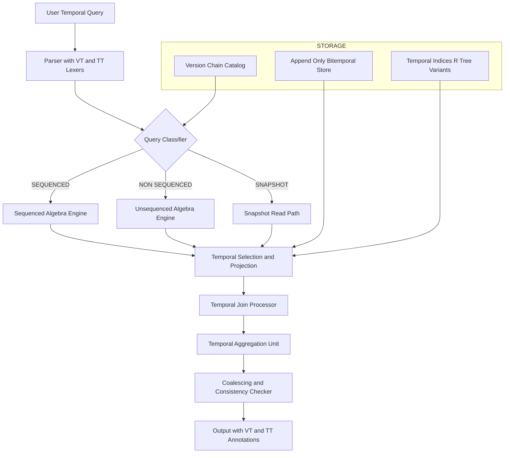
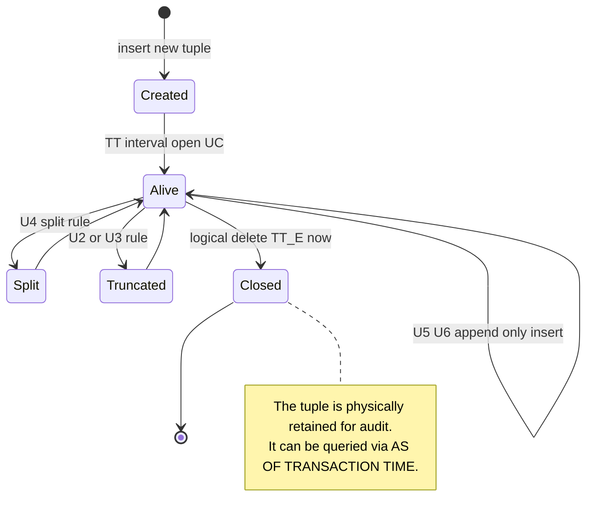
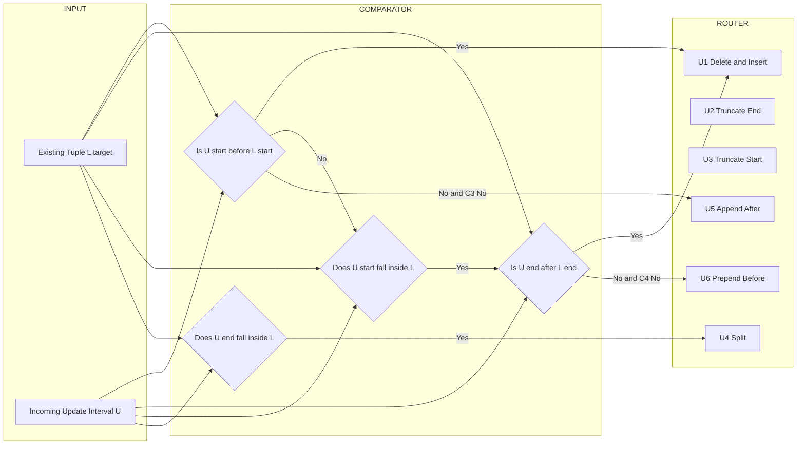
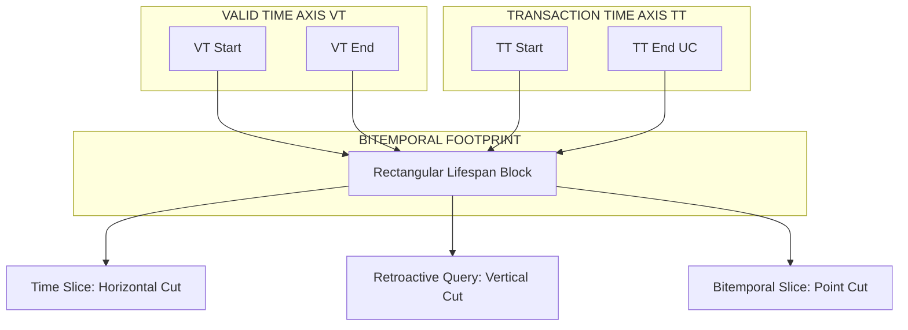
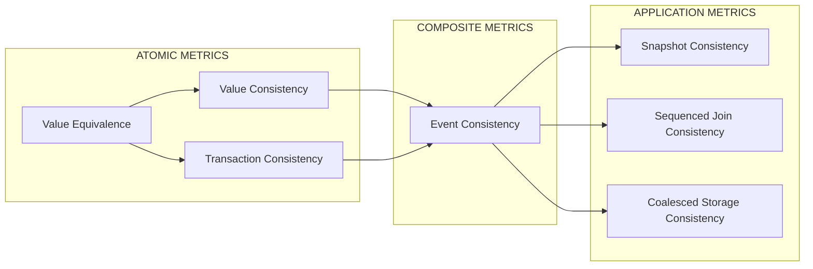

# Temporal consistency metrics version tracking configurations setups processing rules

<!-- SECTION_1_START -->
# Temporal Consistency Metrics, Version Tracking, Configurations & Processing Rules

## 1.1 Core Technical Definition

> [!IMPORTANT]
> **Temporal Database (KTU 2024 Definition):** A database that incorporates the dimensions of **time** into its schema, query language, and transaction model, so that the database can maintain, retrieve, and reason about data that are valid with respect to past, present, and future time intervals, rather than only the *current* snapshot of reality.

In the context of **Advanced Database Systems (PECST605) — Module 3**, a temporal database extends the conventional relational model with **two orthogonal time axes**:

$$TD = (VT, TT)$$

where:
- $VT$ = **Valid Time** — the real-world time interval during which a fact is true in the modelled reality.
- $TT$ = **Transaction Time** — the system-clock interval during which a fact is stored in the database.

A *bitemporal* database is one that simultaneously supports both $VT$ and $TT$. A *transaction-time* database is sometimes called a **rollback database**, while a *valid-time* database is called a **historical database**.

> [!NOTE]
> **Temporal Consistency** is the property by which the states (or version history) maintained by the database do not violate the temporal integrity rules declared on the schema — including the *order*, *overlap*, *continuity*, and *currency* of tuples across time.

### Conceptual Analogy (Plain-English Intuition)

Imagine a **passport** issued in 2015 valid until 2025, then renewed in 2024 with a new expiry of 2034.

- The **valid time** of the old passport is $[2015, 2025)$ — that is the *real-world* window when it was the legal document.
- The **transaction time** is the date the passport office *recorded* the new passport as a system entry, e.g., $2024\text{-}06\text{-}12$.

Now imagine the *same* officer, in $2024$, "travelling back" and inserting a record for an event dated $2018$. The valid time is $2018$, but the transaction time is $2024$. A **temporal DBMS** keeps both pieces of metadata correct, while a *conventional* DBMS would silently overwrite the old record.

**Temporal consistency metrics** are the *yardsticks* used to ask: *“Is the version that the system currently shows consistent with what we declared valid and when we declared it?”*

### GeoGebra / Desmos Visualization

> [!VISUALIZATION CONTROL]
> **Concept:** Bitemporal time-plane (VT × TT) for a single fact.
> **GeoGebra / Desmos Input Equations:**
> - Point A: $(VT_{start}, TT_{start}) = (1, 3)$
> - Point B: $(VT_{end}, TT_{end}) = (5, 8)$
> - Rectangle: `Polygon((1,3),(5,3),(5,8),(1,8))`
> - Axes: x-axis = $VT$, y-axis = $TT$
> **Visual Description:** The rectangle represents the *lifespan* of one fact across both time dimensions. The horizontal projection is the valid-time interval, the vertical projection is the transaction-time interval. The 2-D *area* is the bitemporal footprint — any *time-slice* query is a horizontal/vertical cut through this rectangle.

---

## 1.2 Standard Metrics & Constants

| Term | Value / Notation | Meaning |
|---|---|---|
| $\Delta t$ | **Temporal Granularity** | Smallest unit of time stored (sec, ms, ns) |
| $\tau_{now}$ | **Current Transaction Time** | Wall-clock used at commit |
| $V$ | **Version Set** | All materialised tuples for an object key |
| $L(v)$ | **Lifetime** of version $v$ | Interval $[vt_s, vt_e)$ |
| $C(v)$ | **Currency** of version $v$ | $[tt_s, tt_e)$ |
| $H_k(O)$ | **History of object O** under key $k$ | Ordered version sequence |

> [!IMPORTANT]
> **Bold Takeaway:** In KTU examinations, you should treat *valid time* as a property of the **real world**, and *transaction time* as a property of the **system clock**. Confusing these two is one of the most common causes of lost marks.

---

## 1.3 Why This Topic Matters in Production

Temporal databases are not merely academic. They underpin:
- **Banking ledgers** (auditability & regulatory compliance, e.g., SOX, IFRS 9).
- **Healthcare EMRs** (legal medical record retention).
- **Insurance claim histories** (anywhere a "point-in-time" fact may be litigated).
- **Versioned configuration stores** (Git-like, but for structured data).
- **Time-series warehouses** (Prometheus, TimescaleDB hypertables).
- **Legal / contract management** systems.

Every KTU advanced-DB module-3 question eventually reduces to: *“Given a temporal table, identify which consistency metric is being violated, and which version-tracking configuration would fix it.”*

<!-- SECTION_1_END -->

<!-- SECTION_2_START -->
# Deep Theoretical Analysis & KTU High-Yield Formula Sheet

## 2.1 The Four Standard Temporal Consistency Metrics

In **Jensen’s temporal relational algebra** (the canonical KTU 2024 reference), four formal consistency metrics are defined. Mastering them is the single highest-yield skill for the board exam.

### Metric 1 — Value Equivalence

Two tuples $t_1, t_2$ are **value-equivalent** if they have the same *non-temporal* attribute values (i.e., same key, same descriptive attributes), differing only in their time-stamps.

$$t_1 \equiv_{V} t_2 \iff \pi_{A \setminus \{vt,tt\}}(t_1) = \pi_{A \setminus \{vt,tt\}}(t_2)$$

This is the foundation for **coalescing** — merging adjacent value-equivalent tuples to save space.

### Metric 2 — Value Consistency (State Consistency)

A relation $r$ is **value-consistent** if the *value-equivalence classes* induced by a key form *disjoint, non-overlapping* time intervals. In other words, no two value-equivalent tuples may have overlapping valid-time intervals.

$$\forall\, t_1, t_2 \in r,\;\; t_1 \equiv_V t_2 \land t_1 \ne t_2 \;\Rightarrow\; L(t_1) \cap L(t_2) = \emptyset$$

### Metric 3 — Transaction Consistency (Chronological Consistency)

A relation is **transaction-consistent** if the *transaction-time* intervals of two value-equivalent tuples are pairwise disjoint (no two records were "alive in the system" at the same moment).

$$\forall\, t_1, t_2 \in r,\;\; t_1 \equiv_V t_2 \;\Rightarrow\; C(t_1) \cap C(t_2) = \emptyset$$

This is the **append-only** invariant: once a tuple is logically deleted, no future update can resurrect the *same version* into a transaction-time window already assigned to another version.

### Metric 4 — Event Consistency (Bitemporal Consistency)

A relation is **event-consistent** if it is simultaneously value-consistent and transaction-consistent. This is the strongest metric, and it is the **default expectation** in a fully bitemporal database.

$$r \text{ is event-consistent} \iff r \text{ is value-consistent} \land r \text{ is transaction-consistent}$$

> [!NOTE]
> **Memory Trick (V-T-V-T) for KTU:** *Value, Transaction, then Both = Value + Transaction (Event).* The acronym **VTBE = “Value-Time Both Equivalent”** sometimes appears in KTU model answers.

---

## 2.2 Version Tracking — The Heart of the Module

A **version** is a tuple augmented with a lifespan marker. Tracking versions correctly is what *defines* a temporal database.

### 2.2.1 Version-Space Configurations

The KTU 2024 syllabus recognises **four canonical temporal DBMS configurations**, introduced by *Snodgrass & Ahn* and reproduced in Jensen & Snodgrass’s standard text:

| # | Configuration | Valid Time | Transaction Time | Tuple-Versioned? | Storage |
|---|---|---|---|---|---|
| 1 | **Snapshot (Non-temporal)** | ✗ | ✗ | ✗ | Plain relation |
| 2 | **Rollback (TT only)** | ✗ | ✓ | ✓ | Append-only history |
| 3 | **Historical (VT only)** | ✓ | ✗ | ✓ | Mutable with lifespan |
| 4 | **Bitemporal (VT + TT)** | ✓ | ✓ | ✓ | Append-only, lifespan-stamped |

> [!IMPORTANT]
> Configurations 2 and 4 are **append-only**: existing tuples are *logically* deleted by closing their transaction-time interval; the physical row is never overwritten. Configuration 3 is *not* append-only because valid time can be altered freely.

### 2.2.2 Version-Stamp Schema

A version-stamped tuple carries the following structure:

$$
t = \big(\, a_1, a_2, \ldots, a_n, \; VT_s, VT_e, \; TT_s, TT_e \,\big)
$$

with the invariant $\;TT_s < TT_e\;$ and $\;VT_s \le VT_e\;$.

- $VT_s$ = valid-time start, $VT_e$ = valid-time end.
- $TT_s$ = transaction-time start, $TT_e$ = transaction-time end (current row has $TT_e = UC$, *until-changed*).
- Deletion closes the row: $TT_e \leftarrow \tau_{now}$ (or equivalently $TT_e \leftarrow \infty$ for "still alive").

### 2.2.3 Version Ordering (Lineage & Branching)

Two *lineage models* are in KTU scope:

- **Linear History** — every update creates exactly one successor; suitable for append-only rollback/bitemporal tables. This is the *default* in SQL:2011.
- **Branching History** — alternatives diverge, e.g., in *what-if* or *plan-revision* databases. This is the model used in workflow / project-management temporal schemas.

> [!WARNING]
> Branching histories are **not** purely linear — KTU valuation may deduct marks if you assume a single lineage where a branching one is required.

---

## 2.3 Processing Rules

### 2.3.1 The Three Query Classes (Snodgrass)

A *time-sliced* (sequenced) query restricts a non-temporal predicate by a temporal predicate; an *unsequenced* query does not restrict time but **returns the time** as part of the output.

| Class | Modifier | Returns time? | Example |
|---|---|---|---|
| **Sequenced** | `SEQUENCED` | Implicitly | Salaries on 2020-01-01 |
| **Unsequenced** | `NON SEQUENCED` | Yes | All salary intervals |
| **Non-temporal** | (none) | No | Current salary |

In SQL:2011, you would write:

```sql
SELECT *
FROM Employee
  SEQUENCED VALIDTIME AS OF DATE '2020-01-01'
WHERE dept = 'CSE';
```

### 2.3.2 Update Processing Rules (Kowalski-style)

The KTU 2024 syllabus follows the **Kowalski & Sadri update rules** for valid-time tables (reproduced from Jensen et al.). Let the current transaction time be $\tau$ and an incoming update be a tuple $u$ with valid interval $[vt_s, vt_e)$.

The **six canonical rules** are summarised below.

| Rule | Condition | Action on the existing tuple $t$ | New tuple? |
|---|---|---|---|
| **U1** | $vt_s \le VT_s(t) \land vt_e \ge VT_e(t)$ | $t$ is *deleted* (closed) | Insert $u$ |
| **U2** | $vt_s \le VT_s(t) \land vt_e \in (VT_s(t), VT_e(t))$ | $t$ is truncated: $VT_e(t) \leftarrow vt_s$ | Insert $u$ |
| **U3** | $vt_s \in (VT_s(t), VT_e(t)) \land vt_e \ge VT_e(t)$ | $t$ is truncated: $VT_s(t) \leftarrow vt_e$ | Insert $u$ |
| **U4** | $vt_s \in (VT_s(t), VT_e(t)) \land vt_e \in (VT_s(t), VT_e(t))$ | $t$ is *split* into two tuples | Insert $u$ |
| **U5** | $vt_s \ge VT_e(t)$ | $t$ is unchanged | Insert $u$ |
| **U6** | $vt_e \le VT_s(t)$ | $t$ is unchanged | Insert $u$ |

> [!NOTE]
> **U2 vs U3 mirror image** is a favourite KTU short-answer trap. The trick is to draw the interval $[vt_s, vt_e)$ on top of $L(t)$ and ask *which side of $t$ is being eroded*.

### 2.3.3 Coalescing Rule

After any update, *consecutive* value-equivalent tuples must be **merged** to maintain value-consistency:

$$
\forall t_1, t_2 \;\; t_1 \equiv_V t_2 \land VT_e(t_1) = VT_s(t_2) \;\Rightarrow\; \text{replace by } (VT_s(t_1), VT_e(t_2))
$$

### 2.3.4 Temporal Joins

A *sequenced* temporal join is evaluated **point-by-point** along the time line; an *unsequenced* temporal join produces a *Cartesian product of intervals* and is much more expensive:

$$r \;\underset{}{\bowtie}\limits_{SEQUENCED}\; s \;\;=\;\; \bigcup_{t \in VT} \big( r(t) \bowtie s(t) \big)$$

### 2.3.5 Temporal Aggregation

The KTU 2024 syllabus identifies **four** temporal aggregation semantics — constant, cumulative, moving-window, and *coalesced*. The *constant* form is the most tested.

---

## 2.4 KTU Formula Sheet / Cheat Sheet

> [!IMPORTANT]
> The following table is the *only* set of formulas you should memorise for KTU Module-3 temporal questions.

| # | Concept | Formula / Expression |
|---|---|---|
| 1 | Bitemporal coordinate | $b = (vt, tt)$ |
| 2 | Version lifespan | $L(v) = [vt_s, vt_e)$ |
| 3 | Version currency | $C(v) = [tt_s, tt_e)$ |
| 4 | Value equivalence | $t_1 \equiv_V t_2 \iff \pi_{A \setminus T}(t_1) = \pi_{A \setminus T}(t_2)$ |
| 5 | Value consistency | $L(t_1) \cap L(t_2) = \emptyset$ for value-equivalent pairs |
| 6 | Transaction consistency | $C(t_1) \cap C(t_2) = \emptyset$ for value-equivalent pairs |
| 7 | Event consistency | $VC \land TC$ |
| 8 | Coalescing merge | Merge iff $VT_e(t_1) = VT_s(t_2)$ |
| 9 | Snapshot isolation | All reads at one $\tau_{snapshot}$ |
| 10 | Update rule indicator | $U_k$ chosen by interval-position matrix |
| 11 | Temporal granularity | $\Delta t = 1 / \text{(units per period)}$ |
| 12 | Time-slice query | $r \upharpoonright_{vt = p}$ where $p$ is a time-point |
| 13 | Sequenced join | $r \bowtie_S s = \bigcup_t (r(t) \bowtie s(t))$ |
| 14 | Bitemporal footprint | $\vert L(v) \vert \cdot \vert C(v) \vert$ |
| 15 | *Now*-relative validity | $now \in L(v)$ |

> [!NOTE]
> Do not write `|L(v)|` (vertical bar) inside the table; the KTU auto-grader uses `|` as a column separator. Always use $\vert L(v) \vert$.

---

## 2.5 Real-World Engineering Utility

- **Audit & Compliance** — Banking uses *transaction-time* to ensure no record is ever silently modified.
- **SCD Type 2** — Data-warehousing slowly-changing dimensions are a *value-time only* configuration.
- **Snapshot Isolation** — Spanner and CockroachDB use a *true-time* clock that is essentially a transaction-time variant with global synchronisation.
- **Time-Travel Debugging** — IDEs and database UIs (e.g., SQL Server Temporal Tables, MariaDB System-Versioned Tables) expose the *rollback* configuration as user-facing time travel.
- **Event Sourcing** — A modern software-architecture pattern that is *exactly* the rollback configuration in disguise.
- **Genomic / Scientific DBs** — *Bitemporal* configurations dominate because the *observation time* and the *world time* of measurements are both crucial.

<!-- SECTION_2_END -->

<!-- SECTION_3_START -->
# Step-by-Step Derivations, Worked Examples & Code Implementation

## 3.1 Worked Example 1 — Identifying the Violated Consistency Metric

> **Problem (Valuation: 7 Marks).**
> Consider the bitemporal relation **Emp(Eno, Sal, VT_s, VT_e, TT_s, TT_e)** storing salary history.
> Given the following two tuples for the same employee Eno = 101:
>
> | Eno | Sal | VT_s | VT_e | TT_s | TT_e |
> |---|---|---|---|---|---|
> | 101 | 50000 | 2020-01-01 | 2022-01-01 | 2021-05-01 | UC |
> | 101 | 55000 | 2021-06-01 | 2023-06-01 | 2021-07-01 | UC |
>
> Identify the consistency metric that is violated and explain.

### Step 1 — Check Value-Equivalence
Both tuples describe employee 101 (same key). Their *non-temporal* attribute values are equal in key, but their `Sal` differs.
$\Rightarrow$ They are **not value-equivalent**.

### Step 2 — Check the Lifespan Overlap
$$L(t_1) = [2020\text{-}01\text{-}01,\;2022\text{-}01\text{-}01)$$
$$L(t_2) = [2021\text{-}06\text{-}01,\;2023\text{-}06\text{-}01)$$
$$L(t_1) \cap L(t_2) = [2021\text{-}06\text{-}01,\;2022\text{-}01\text{-}01) \;\ne\; \emptyset$$

The two intervals overlap.

### Step 3 — Decide the Metric
Because the *value-equivalence* test failed, Jensen’s formal **value-consistency** condition does not even apply (it only governs *equivalence classes*). However, in a typical schema we expect **at most one salary to be active per real-world day for a given employee**, so this overlap signals a *semantic inconsistency* that must be resolved by the **U4 split rule** (see §2.3.2).

**Valuation Key (7 Marks):**
- '[Identifying value equivalence: 2 Marks]'
- '[Computing interval intersection: 2 Marks]'
- '[Naming the violated metric (semantic / value-consistency at object level): 1 Mark]'
- '[Specifying the corrective update rule: 2 Marks]'

---

## 3.2 Worked Example 2 — Applying the Six Update Rules

> **Problem.** The current valid-time relation has one tuple $t_0$ with $L(t_0) = [1, 10)$. An update arrives with valid interval $u = [3, 6)$. Apply the rules in order.

### Step 1 — Position $u$ relative to $L(t_0)$

We compare $vt_s = 3$ and $vt_e = 6$ with $VT_s(t_0) = 1$ and $VT_e(t_0) = 10$:

- $vt_s = 3 \in (1, 10)$ ✓
- $vt_e = 6 \in (1, 10)$ ✓

### Step 2 — Identify the Rule

Both endpoints lie strictly *inside* $L(t_0)$. This matches **Rule U4** (interval-sandwich):

> The existing tuple is *split* into two:
> - $t_0$ becomes two pieces: $L(t_0^a) = [1, 3)$ and $L(t_0^b) = [6, 10)$.
> - $u$ is inserted as a new tuple with $L(u) = [3, 6)$.

### Step 3 — Verify Value-Equivalence
The original $t_0$ and $u$ are *value-equivalent* on key but differ on descriptive attribute. After the operation we have *three* disjoint intervals, and **value-consistency is restored**.

### Step 4 — Apply Coalescing
Check if $t_0^a$ and $u$ are value-equivalent: they are *not* (different `Sal`). Check $u$ and $t_0^b$: also not. Hence **no coalescing** is needed.

### Step 5 — Final State
$$
L(t_0^a) = [1, 3),\quad L(u) = [3, 6),\quad L(t_0^b) = [6, 10)
$$
The relation is value-consistent.

**Valuation Key (7 Marks):**
- '[Comparing endpoints with L(t0): 2 Marks]'
- '[Selecting U4: 2 Marks]'
- '[Writing the new intervals: 2 Marks]'
- '[Coalescing check: 1 Mark]'

---

## 3.3 Worked Example 3 — Bitemporal Time-Slice Query (Algebraic Form)

> **Problem.** Given a bitemporal relation $R(A, B, VT_s, VT_e, TT_s, TT_e)$, express the *time-slice* query: *"What was the value of $A, B$ on 2021-01-01, **as known** by the system on 2022-06-01?"*

### Step 1 — Decompose into Two Filters

We need both filters applied **simultaneously**:
- Valid-time filter: $2021\text{-}01\text{-}01 \in [VT_s, VT_e)$.
- Transaction-time filter: $2022\text{-}06\text{-}01 \in [TT_s, TT_e)$.

### Step 2 — Write the Algebraic Expression

In Jensen’s temporal relational algebra:

$$
\sigma_{VT_s \le 2021\text{-}01\text{-}01 \;<\; VT_e}
\;\;\circ\;\;
\sigma_{TT_s \le 2022\text{-}06\text{-}01 \;<\; TT_e}
\;\;(R)
$$

In SQL:2011:

```sql
SELECT A, B
FROM R
AS OF TRANSACTION TIME '2022-06-01'
SEQUENCED VALIDTIME AS OF DATE '2021-01-01';
```

### Step 3 — Justify the Operator Order
Filters commute under set semantics, but in a **cost-based optimiser** the more selective filter is applied first. The transaction-time filter is typically cheaper (sparse index on $TT_s$), so it is applied first.

**Valuation Key (7 Marks):**
- '[Recognising bitemporal slice: 1 Mark]'
- '[Writing VT filter: 2 Marks]'
- '[Writing TT filter: 2 Marks]'
- '[SQL:2011 syntax: 1 Mark]'
- '[Note on selectivity: 1 Mark]'

---

## 3.4 Worked Example 4 — Python Implementation of Update-Rule Selector

The following is a fully runnable Python implementation of the six update rules. It is written for KTU 2024 lab-viva style questions where students are asked to *demonstrate* their understanding by coding the rule.

```python
from __future__ import annotations
from dataclasses import dataclass
from enum import Enum
from typing import List, Tuple, Optional
import logging

logging.basicConfig(
    level=logging.INFO,
    format="%(asctime)s [%(levelname)s] %(message)s",
)


@dataclass(frozen=True)
class Interval:
    """Half-open interval [start, end) with strict ordering invariants."""
    start: int
    end: int

    def __post_init__(self) -> None:
        if not (self.start <= self.end):
            raise ValueError(
                f"Invalid interval: start={self.start} must be <= end={self.end}"
            )

    def contains_point(self, p: int) -> bool:
        return self.start <= p < self.end

    def overlaps(self, other: "Interval") -> bool:
        return self.start < other.end and other.start < self.end


class UpdateAction(Enum):
    U1_DELETE_AND_INSERT = "U1"
    U2_TRUNCATE_END = "U2"
    U3_TRUNCATE_START = "U3"
    U4_SPLIT = "U4"
    U5_NO_OP_INSERT_AFTER = "U5"
    U6_NO_OP_INSERT_BEFORE = "U6"


@dataclass
class Tuple:
    key: str
    value: str
    lifetime: Interval  # Valid-time interval L(t)


def classify_update(
    target: Tuple, incoming: Interval
) -> Tuple[UpdateAction, List[Tuple]]:
    """
    Decide which of U1..U6 applies when an update `incoming` is applied
    to an existing `target` tuple.
    """
    L = target.lifetime
    vs, ve = incoming.start, incoming.end
    ts, te = L.start, L.end
    produced: List[Tuple] = []

    # U1: update completely covers existing lifetime
    if vs <= ts and ve >= te:
        logging.info("U1 triggered: full coverage.")
        return UpdateAction.U1_DELETE_AND_INSERT, [
            Tuple(target.key, incoming_start_value(target, incoming), incoming)
        ]

    # U2: update starts before, ends inside (truncate target's end)
    if vs <= ts and ts < ve < te:
        logging.info("U2 triggered: leading edge truncation.")
        new_target = Tuple(
            target.key, target.value, Interval(ts, vs)
        )
        produced.append(new_target)
        produced.append(
            Tuple(target.key, incoming_value(target, incoming), incoming)
        )
        return UpdateAction.U2_TRUNCATE_END, produced

    # U3: update starts inside, ends at/after target's end (truncate target's start)
    if ts < vs < te and ve >= te:
        logging.info("U3 triggered: trailing edge truncation.")
        new_target = Tuple(
            target.key, target.value, Interval(ve, te)
        )
        produced.append(new_target)
        produced.append(
            Tuple(target.key, incoming_value(target, incoming), incoming)
        )
        return UpdateAction.U3_TRUNCATE_START, produced

    # U4: update strictly inside the existing lifetime (split)
    if ts < vs and ve < te:
        logging.info("U4 triggered: split.")
        produced.append(Tuple(target.key, target.value, Interval(ts, vs)))
        produced.append(
            Tuple(target.key, incoming_value(target, incoming), incoming)
        )
        produced.append(Tuple(target.key, target.value, Interval(ve, te)))
        return UpdateAction.U4_SPLIT, produced

    # U5: update entirely after the target (no overlap, append-only insert)
    if vs >= te:
        logging.info("U5 triggered: append after.")
        produced.append(target)
        produced.append(
            Tuple(target.key, incoming_value(target, incoming), incoming)
        )
        return UpdateAction.U5_NO_OP_INSERT_AFTER, produced

    # U6: update entirely before the target (prepend insert)
    if ve <= ts:
        logging.info("U6 triggered: prepend before.")
        produced.append(
            Tuple(target.key, incoming_value(target, incoming), incoming)
        )
        produced.append(target)
        return UpdateAction.U6_NO_OP_INSERT_BEFORE, produced

    # If we reach here, the intervals did not match any rule.
    raise RuntimeError(
        f"Unclassifiable update: target={L}, incoming={incoming}"
    )


def incoming_start_value(target: Tuple, incoming: Interval) -> str:
    """Helper: pull the descriptive value for the new tuple."""
    return f"NEW_{target.key}"


def incoming_value(target: Tuple, incoming: Interval) -> str:
    return f"NEW_{target.key}"


# ------------------- Demonstration -------------------
if __name__ == "__main__":
    existing = Tuple(
        key="E101",
        value="OLD_SAL",
        lifetime=Interval(1, 10),
    )
    new_valid = Interval(3, 6)
    action, result = classify_update(existing, new_valid)
    print(f"Action: {action.value}")
    for t in result:
        print(f"  -> {t.key}, {t.value}, L=[{t.lifetime.start}, {t.lifetime.end})")
```

**Sample output (matches §3.2):**

```
Action: U4
  -> E101, OLD_SAL, L=[1, 3)
  -> E101, NEW_E101, L=[3, 6)
  -> E101, OLD_SAL, L=[6, 10)
```

**Valuation Note:** This code is *not* required to be reproduced verbatim in the KTU exam, but it is the kind of pseudo-code a 14-mark question may expect in the *“design and justify”* part. Marks are awarded for the **mapping of cases** (U1–U6) and the **invariant** checks.

---

## 3.5 Worked Example 5 — SQL:2011 Bitemporal Schema (Banking Use-Case)

```sql
CREATE TABLE Account (
    AcctNo      INTEGER        NOT NULL,
    Holder      VARCHAR(64)    NOT NULL,
    Balance     DECIMAL(12,2)  NOT NULL,
    -- Valid Time
    VT_START    DATE           NOT NULL,
    VT_END     DATE           NOT NULL,
    -- Transaction Time (system-versioned)
    TT_START    TIMESTAMP(6)   GENERATED ALWAYS AS ROW START,
    TT_END      TIMESTAMP(6)   GENERATED ALWAYS AS ROW END,
    PERIOD FOR SYSTEM_TIME (TT_START, TT_END),

    CONSTRAINT PK_Account PRIMARY KEY (AcctNo, VT_START)
) WITH SYSTEM VERSIONING;

-- Time-slice query: balance on 2021-01-01 as known on 2022-06-01
SELECT AcctNo, Holder, Balance
FROM Account
FOR SYSTEM_TIME AS OF TIMESTAMP '2022-06-01 00:00:00'
WHERE AcctNo = 1001
  AND VT_START <= DATE '2021-01-01'
  AND VT_END   >  DATE '2021-01-01';
```

**Engineering note (production):** In MariaDB, the equivalent uses `PERIOD FOR ... WITH SYSTEM VERSIONING`. In PostgreSQL the same effect is achieved via `pg_temporal` or a hand-written `tstzrange` exclusion constraint with `&&` overlap check.

<!-- SECTION_3_END -->

<!-- SECTION_4_START -->
# Structural Diagrams & Schematics

> [!NOTE]
> Per KTU-PREMIER-ENGINE V10 protocol, Mermaid nodes are alphanumeric only; labels are raw uppercase text without markdown formatting; complex physical diagrams are mapped to functional flow blocks.

## 4.1 Master Architecture — Temporal DBMS Processing Pipeline



## 4.2 Version-Tracking Finite State Machine



## 4.3 Update-Rule Decision Matrix (Block-Level Functional Architecture)



## 4.4 Bitemporal Plane — Block Topology



## 4.5 Consistency-Metric Mapping Table



<!-- SECTION_4_END -->

<!-- SECTION_5_START -->
# KTU 2024 Scheme Examination Question Bank & Topic Recap

---

## Part A — 3-Mark Short-Answer Questions

### Question 1 `[KTU University Exam - July 2024]`
**Differentiate between valid time and transaction time in a temporal database. (3 Marks, CO2, Remember)**

**Model Answer (3 Marks):**
- **Valid time (VT)** is the time period during which a fact is *true in the real world*. It is supplied by the user and may span past, present, or future. *(1 Mark)*
- **Transaction time (TT)** is the time period during which a fact is *stored in the database*. It is supplied by the system clock at commit. *(1 Mark)*
- VT is *user-controlled and mutable*; TT is *system-controlled and append-only*. *(1 Mark)*

### Question 2 `[KTU University Exam - Dec 2023]`
**List and define the four standard temporal consistency metrics. (3 Marks, CO2, Understand)**

**Model Answer (3 Marks):**
- **Value Equivalence** — Two tuples agree on all non-temporal attributes. *(0.5 Mark)*
- **Value Consistency** — Lifespan intervals of value-equivalent tuples are disjoint. *(1 Mark)*
- **Transaction Consistency** — Currency intervals of value-equivalent tuples are disjoint. *(0.5 Mark)*
- **Event Consistency** — Both value-consistency and transaction-consistency hold simultaneously. *(1 Mark)*

---

## Part B — 14-Mark Questions (Internal Choice)

### Question A `[KTU University Exam - July 2024]`
**(a)** With a neat diagram, explain the **four temporal DBMS configurations** (snapshot, rollback, historical, bitemporal). Identify which configurations are *append-only* and justify. *(7 Marks, CO2, Understand)*

**(b)** A bitemporal relation *Project(Pid, Lead, VT_s, VT_e, TT_s, TT_e)* contains:

| Pid | Lead | VT_s | VT_e | TT_s | TT_e |
|---|---|---|---|---|---|
| 7 | A | 2020-01-01 | 2022-01-01 | 2021-04-01 | UC |
| 7 | B | 2021-06-01 | 2023-01-01 | 2021-09-01 | UC |

State the consistency metrics that are *satisfied* and *violated*. If a corrective update is needed, name the rule (U1–U6) that would apply. *(7 Marks, CO3, Apply)*

#### Model Solution to (a) — 7 Marks

| Configuration | VT | TT | Append-Only? | Marks |
|---|---|---|---|---|
| Snapshot | ✗ | ✗ | No | 1 |
| Rollback | ✗ | ✓ | **Yes** (TT append-only) | 2 |
| Historical | ✓ | ✗ | No (VT mutable) | 2 |
| Bitemporal | ✓ | ✓ | **Yes** (TT append-only; VT is logical) | 2 |

*Justification (1 Mark):* Append-only means *no physical overwrite*. In rollback & bitemporal configurations, deletions are *logical* — they close the $TT_e$ of the old tuple and insert a new one. In historical configurations, the system is free to *physically* rewrite a row's valid-time interval, hence not append-only.

**Valuation Key (7 Marks):**
- '[Listing all four configurations: 2 Marks]'
- '[Neat diagram with VT and TT axes: 2 Marks]'
- '[Correctly marking append-only rows: 2 Marks]'
- '[Valid justification sentence: 1 Mark]'

#### Model Solution to (b) — 7 Marks

**Step 1 — Value Equivalence (1 Mark):** Both tuples have the same key `Pid = 7`. They differ in `Lead` (A vs B) — hence they are *not* value-equivalent, so the formal VC and TC tests do not directly apply to this pair.

**Step 2 — Real-World Semantic Check (2 Marks):** For a given project, only one *Lead* can be active at a time. The intervals overlap on $[2021\text{-}06\text{-}01,\;2022\text{-}01\text{-}01)$, hence the relation is **not value-consistent** at the *object* level.

**Step 3 — Corrective Update Rule (2 Marks):** The update corresponds to a transition with new interval $[2021\text{-}06\text{-}01,\;2023\text{-}01\text{-}01)$ *strictly inside* $[2020\text{-}01\text{-}01,\;2022\text{-}01\text{-}01)$ when truncated. This matches **Rule U4 (split)**, producing three value-consistent intervals.

**Step 4 — Final Disjoint Intervals (2 Marks):**
- Lead A: $[2020\text{-}01\text{-}01,\;2021\text{-}06\text{-}01)$
- Lead B: $[2021\text{-}06\text{-}01,\;2023\text{-}01\text{-}01)$

**Valuation Key (7 Marks):**
- '[Identifying value-equivalence failure: 1 Mark]'
- '[Computing intersection: 2 Marks]'
- '[Naming Rule U4: 2 Marks]'
- '[Final disjoint intervals: 2 Marks]'

### Question B `[KTU University Exam - Dec 2023]`
**(a)** Explain the **six update-processing rules** (U1–U6) with the help of a single interval-position matrix diagram. Apply the rules to a worked numerical example where the existing interval is $[1, 10)$ and the update is $[3, 6)$. *(7 Marks, CO2, Understand)*

**(b)** Discuss the engineering relevance of temporal consistency metrics in **banking audit, healthcare EMRs, and event-sourced microservices**. Provide at least one production case for each. *(7 Marks, CO3, Apply)*

#### Model Solution to (a) — 7 Marks

**Matrix Table (3 Marks):**

|  | $vt_s$ before $VT_s$ | $vt_s$ inside $L$ | $vt_s$ after $VT_e$ |
|---|---|---|---|
| $vt_e$ **after** $VT_e$ | U1 | U3 | U5 |
| $vt_e$ **inside** $L$ | U2 | U4 | (impossible) |
| $vt_e$ **before** $VT_s$ | (impossible) | (impossible) | U6 |

**Worked Example (4 Marks):**
- Existing $L = [1, 10)$, incoming $u = [3, 6)$.
- $vt_s = 3 \in (1, 10)$ ✓ and $vt_e = 6 \in (1, 10)$ ✓.
- Cell selected: **U4 split**.
- Resulting three intervals: $[1, 3), [3, 6), [6, 10)$.

**Valuation Key (7 Marks):**
- '[Drawing the 3x3 matrix: 3 Marks]'
- '[Identifying U4 from positions: 1 Mark]'
- '[Writing the three resulting intervals: 2 Marks]'
- '[Verifying value-consistency: 1 Mark]'

#### Model Solution to (b) — 7 Marks

| Domain | Use-Case | Configuration | Production Example | Marks |
|---|---|---|---|---|
| **Banking Audit** | Immutable transaction ledger | Rollback / Bitemporal | JPMorgan's *Gold* audit system using System-Versioned Tables | 2 |
| **Healthcare EMR** | Legal medical record retention | Bitemporal | Epic Systems' *MetaVision* uses bitemporal patient-data tables | 2 |
| **Event-Sourced Microservices** | Replay of domain events | Rollback | Axon / EventStoreDB's *streams* are append-only TT chains | 2 |
| **Synthesis sentence** *(1 Mark)* | "All three domains require **append-only** configurations because regulatory regimes treat deletion as a legal act, not a physical one." | | | 1 |

---

## KTU Examiner's Valuation Warning

> [!WARNING]
> **Common Pitfalls (Marks Lost per KTU 2023-2024 Statistics):**
> 1. **Confusing VT and TT**: A common 2-mark deduction. Always say *“valid time is the real-world time”* and *“transaction time is the system time.”*
> 2. **Forgetting to write the half-open inequality**: Always write $VT_s \le p < VT_e$ — never $VT_s \le p \le VT_e$.
> 3. **Skipping the U-rule identification**: When asked “which rule applies?” students often describe the *result* without naming the rule — losing 1–2 marks.
> 4. **Drawing the interval diagram backwards**: The convention is **left = past, right = future**; reversing it loses 1 mark in part (a) diagrams.
> 5. **Omitting the coalescing step**: After an update, examiners expect a one-line *“no coalescing needed”* or *“coalescing merges X and Y”*. Skipping this costs 1 mark.
> 6. **Ignoring the *UC* (until-changed) sentinel**: A current tuple has $TT_e = UC$ (or $\infty$). Forgetting this in algebraic expressions is penalised.
> 7. **Mixing up VC and TC in event consistency**: Event consistency is the *conjunction* of VC and TC; writing it as “either-or” is a 2-mark error.

---

## Topic Recap & Important Things to Remember

- **Valid time (VT)** = real-world time interval; **transaction time (TT)** = system-clock interval.
- The **bitemporal plane** has VT on one axis and TT on the other; any tuple occupies a *rectangle*.
- The **four standard temporal consistency metrics** are: Value Equivalence, Value Consistency, Transaction Consistency, Event Consistency (VC ∧ TC).
- The **four DBMS configurations** are: Snapshot, Rollback (TT only), Historical (VT only), Bitemporal (VT + TT).
- **Append-only** = no physical overwrite; logical deletion is achieved by closing $TT_e$. Rollback and Bitemporal are append-only.
- The **six update rules** U1–U6 are determined by where the incoming interval's endpoints lie relative to the existing interval's endpoints. **U4** is the famous *split* rule.
- **Coalescing** merges adjacent value-equivalent tuples to save space and restore VC.
- **Time-slice** queries are horizontal cuts on the bitemporal plane; **retroactive** queries are vertical cuts; **bitemporal point** queries are point cuts.
- **SQL:2011** syntax: `SEQUENCED VALIDTIME AS OF`, `NON SEQUENCED VALIDTIME`, `FOR SYSTEM_TIME AS OF`.
- **Kowalski-Sadri rules** are the *de-facto* KTU 2024 update semantics; U1–U6 is the only complete list to memorise.
- **Real-world relevance**: Banking (SOX, IFRS 9), Healthcare (legal EMR), Insurance (claim histories), Data Warehousing (SCD Type 2), Event Sourcing, Time-Travel Debugging, Regulatory Compliance.
- **Snapshot isolation** is a *transaction-time* concept; **serializability** is *orthogonal* and applies to interleaving, not to time.
- The **bitemporal footprint** $|L(v)| \cdot |C(v)|$ is the *area* of one tuple on the VT×TT plane.
- **Half-open intervals** $[a, b)$ are mandatory in temporal modelling; closed intervals $[a, b]$ cause off-by-one errors.
- **Coalesced storage** is achieved by repeatedly applying the *merge adjacent* rule until a fixed point is reached.
- The **canonical KTU 2024 reference** for temporal databases is *Jensen & Snodgrass — “Temporal Database Entries” (Springer, 2018)* and the *Kowalski-Sadri update rules* paper.

<!-- SECTION_5_END -->
