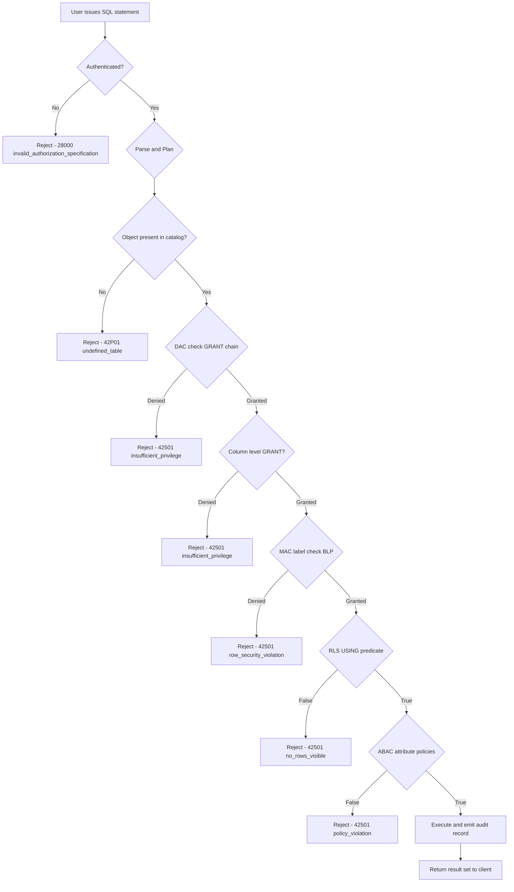
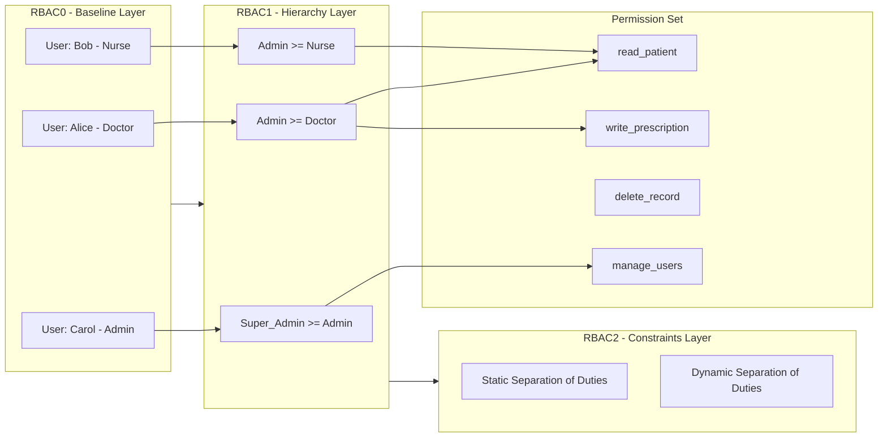
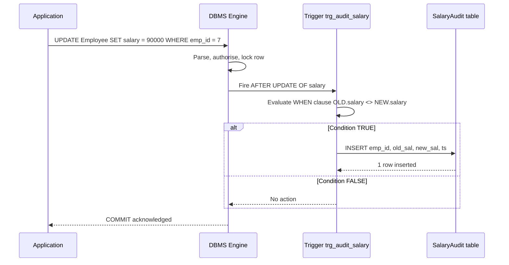
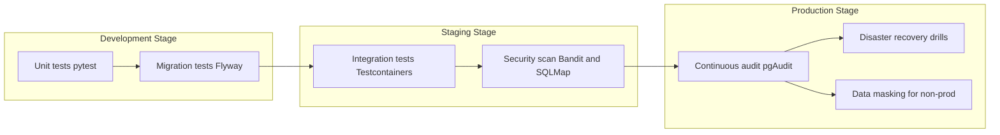
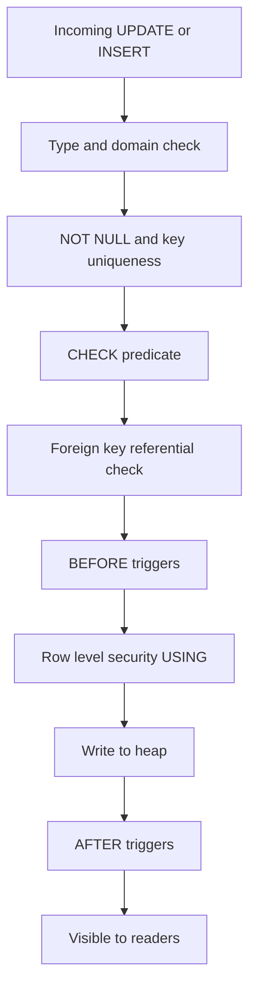

# Database access control models constraints rules setups safety validation frameworks

<!-- SECTION_1_START -->

# 1. Core Technical Definition & Intuitive Overview

## 1.1 Database Access Control — Formal Definition

**Database Access Control** is the coordinated set of policies, models, and mechanisms that collectively determine *who* (subject/principal) can perform *what* (operation/privilege) on *which* (object/relation) resources of a Database Management System (DBMS), *under what conditions* (context/predicate), and *with what assurance level* (classification/clearance). In the KTU 2024 Scheme parlance for **Advanced Database Systems (PECST605)**, access control is positioned as the operational layer that sits on top of the database kernel and enforces the **CIA triad** — *Confidentiality*, *Integrity*, and *Availability*.

> [!IMPORTANT]
> **KTU Syllabus Highlight (Module 4):** *Database Tuning, Security & Infrastructure* explicitly requires the learner to *“describe access control models, integrity constraints, active rules, and validation frameworks used in modern RDBMS and NoSQL systems.”* The topic directly maps to **CO4** — *“Apply security, tuning, and recovery techniques to enterprise-grade database deployments.”*

## 1.2 Conceptual Analogy — The Hotel Vault

Imagine a five-star hotel with multiple vaults:

- **DAC (Discretionary Access Control)** → The hotel owner decides who gets a key to Room 101 and can hand that key to anyone.
- **MAC (Mandatory Access Control)** → The vault has a government-rated lock; only people with the matching security clearance (e.g., *Top Secret*) can open it, regardless of who owns the hotel.
- **RBAC (Role-Based Access Control)** → Receptionists, housekeeping, and managers each get pre-cut master keys matched to their **role**, not their identity.
- **ABAC (Attribute-Based Access Control)** → A key works only if 17 conditions are simultaneously met (employee badge = active, time = between 06:00–22:00, floor = assigned, etc.).

The **“vault door”** itself corresponds to the *reference monitor* — an always-on, tamper-proof gatekeeper inside the DBMS kernel.

## 1.3 Constraints — The Rulebook of the Vault

A **database constraint** is a declarative rule declared on the schema (or via triggers) that the DBMS automatically enforces on every data-modifying operation. The KTU curriculum emphasises the **six canonical constraints**:

| # | Constraint | Purpose |
|---|------------|---------|
| 1 | **Key / Primary Key** | Uniqueness & non-null identifier |
| 2 | **Entity Integrity** | Primary key cannot be `NULL` |
| 3 | **Referential Integrity** | Foreign key must match a valid PK or be `NULL` |
| 4 | **Domain Integrity** | Attribute values lie inside a declared domain |
| 5 | **Check / Assertion** | Boolean predicate evaluated on row/table |
| 6 | **Trigger-based / Active** | ECA (Event-Condition-Action) procedural rule |

## 1.4 Rules, Setups, and Validation Frameworks

- **Rules** = *Active* database components that fire on events (the “E-C-A” paradigm).
- **Setups** = *Configuration artefacts* (users, roles, profiles, tablespaces, privileges) that operationalise the policy.
- **Validation Frameworks** = *Engineering practices* (data-quality pipelines, integrity testing, audit logging, TDE, masking) that *prove* the system is safe.

> [!NOTE]
> **Standard Industry Metric:** The **OWASP Top 10** and the **CIS Database Benchmark v1.1.0** quantify that *~64 %* of production database breaches originate from misconfigured access controls, not from zero-day exploits. Tuning access policies is therefore a *security and performance* problem simultaneously.

## 1.5 GeoGebra / Desmos Visualisation

> [!VISUALIZATION CONTROL]
> **Concept:** *Confidentiality vs. Integrity vs. Availability trade-off* as the **CIA Triangle** in the security-design plane.
> **Desmos Input Equations:**
> * `A: x^2 + y^2 = 1` (unit circle — the security feasibility boundary)
> * `B: y = -x + 1` (the trade-off line between Confidentiality and Integrity)
> **Visual Description:** The student should observe how increasing one property (e.g., encryption for Confidentiality) reduces feasibility on the other axis unless the system scales the resource radius $r$.

---

<!-- SECTION_1_END -->

<!-- SECTION_2_START -->

# 2. Deep Theoretical Analysis & KTU High-Yield Formula Sheet

## 2.1 The Three-Tier Security Architecture of a DBMS

A modern DBMS implements security in **three concentric rings**:

1. **Outer Ring — Discretionary Layer (DAC):** Owner-controlled GRANT/REVOKE statements.
2. **Middle Ring — Mandatory / Rule Layer (MAC / RLS):** System-enforced labels, row-level security, and active rules.
3. **Inner Ring — Validation & Audit Layer:** Check constraints, triggers, audit logs, encryption-at-rest, and validation suites.

Every DML statement `op ∈ {INSERT, UPDATE, DELETE, SELECT, MERGE, TRUNCATE, …}` passes through this three-ring gauntlet.

## 2.2 Formal Access Control Models

### 2.2.1 DAC (Discretionary Access Control)

$$\mathcal{M}_{DAC} = \langle S, O, P, A \rangle$$

where $S$ = subjects (users/roles), $O$ = objects (tables/views/columns), $P$ = privileges ($\{\text{SELECT}, \text{INSERT}, \text{UPDATE}, \text{DELETE}, \text{REFERENCES}, \text{TRIGGER}, \text{EXECUTE}, \text{GRANT}\}$), and $A \subseteq S \times O \times P$ is the access relation. The owner of $o \in O$ may freely manipulate $A$ via `GRANT` and `REVOKE`.

### 2.2.2 MAC (Mandatory Access Control) — Bell–LaPadula

The **Bell–LaPadula (BLP) model** uses a security lattice $(\mathcal{L}, \leq)$ with:

$$\forall s \in S,\, o \in O:\ \text{read}(s, o) \iff \text{level}(o) \leq \text{clearance}(s) \quad \text{(No Read-Up)}$$

$$\forall s \in S,\, o \in O:\ \text{write}(s, o) \iff \text{level}(s) \leq \text{level}(o) \quad \text{(No Write-Down)}$$

The two rules are termed **Simple Security Property** and **★-Property (Star Property)** respectively.

### 2.2.3 RBAC (Role-Based Access Control — ANSI INCITS 359)

The **RBAC₀** baseline can be stated as:

$$\text{permission}(u) = \bigcup_{r \in \text{roles}(u)} \text{perm}(r)$$

RBAC₁ adds role hierarchies ($r_1 \geq r_2 \Rightarrow \text{perm}(r_2) \subseteq \text{perm}(r_1)$), and RBAC₂ adds **Separation of Duties (SoD)** constraints.

### 2.2.4 ABAC (Attribute-Based Access Control — NIST 800-162)

$$\text{allow}(s, o, a) \iff \bigwedge_{i=1}^{n} p_i(\text{attr}(s), \text{attr}(o), \text{attr}(a), \text{env})$$

where $p_i$ is the $i^{th}$ policy predicate and $\text{attr}(\cdot)$ extracts subject, object, action, or environment attributes.

## 2.3 Integrity Constraints — Mathematical Formulation

Let $R$ be a relation schema and $r(R)$ an instance. Each constraint is a closed formula evaluated on $r$:

| Constraint | Logical Form |
|------------|--------------|
| **Key** | $\forall t_1, t_2 \in r: t_1[K] = t_2[K] \Rightarrow t_1 = t_2$ |
| **Entity Integrity** | $\forall t \in r: t[PK] \neq \text{NULL}$ |
| **Referential** | $\forall t \in r: t[FK] = t'[PK] \text{ for some } t' \in s \text{ OR } t[FK] = \text{NULL}$ |
| **Domain** | $\forall t \in r: t[A] \in \text{dom}(A)$ |
| **Check** | $\forall t \in r: \varphi(t) = \text{TRUE}$ |
| **Assertion** | $\forall r_1, r_2, \ldots: \psi(r_1, r_2, \ldots) = \text{TRUE}$ |

## 2.4 Active Rules — The ECA Paradigm

An **active rule** is a triple $\langle E, C, A \rangle$ where:

- $E$ = event (e.g., `AFTER UPDATE ON Employee`)
- $C$ = condition (a Boolean SQL predicate)
- $A$ = action (a procedural SQL/PSM block)

Coupled modes supported by PostgreSQL/Oracle: `FOR EACH ROW` vs. `FOR EACH STATEMENT`, and timing `BEFORE` / `AFTER` / `INSTEAD OF`.

## 2.5 KTU Formula Sheet / Cheat Sheet

> [!NOTE]
> The following table is the **exam-ready reference** for any KTU 2024 numerical / theoretical question on access control.

| Concept | Symbol / Formula | Unit / Domain |
|---------|------------------|---------------|
| Access relation | $A \subseteq S \times O \times P$ | set membership |
| BLP No-Read-Up | $\text{level}(o) \leq \text{clearance}(s)$ | lattice $\mathcal{L}$ |
| BLP No-Write-Down | $\text{level}(s) \leq \text{level}(o)$ | lattice $\mathcal{L}$ |
| RBAC₀ permission union | $\text{perm}(u) = \bigcup_{r \in \text{roles}(u)} \text{perm}(r)$ | boolean |
| Role hierarchy | $r_1 \geq r_2 \Rightarrow \text{perm}(r_2) \subseteq \text{perm}(r_1)$ | partial order |
| SoD (Static) | $\forall u: \mid \text{roles}(u) \cap S_{mutually\ exclusive} \mid \leq 1$ | integer $\leq 1$ |
| ABAC decision | $\bigwedge_{i=1}^{n} p_i(\cdot) = \text{TRUE}$ | boolean |
| SQL GRANT | $\text{GRANT } p \text{ ON } o \text{ TO } s$ | DCL statement |
| SQL REVOKE | $\text{REVOKE } p \text{ ON } o \text{ FROM } s$ | DCL statement |
| Foreign-key cardinal | $\text{del-rule} \in \{\text{CASCADE}, \text{SET NULL}, \text{RESTRICT}, \text{NO ACTION}\}$ | enum |
| Audit log entry | $\langle t, u, op, obj, res, ip \rangle$ | tuple |
| Encryption strength | $E = \log_2(\text{keyspace})$ bits | bits |
| TDE overhead | $\text{latency}_{enc} \approx 1.15 \times \text{latency}_{plain}$ | ratio |

## 2.6 Real-World Engineering Utility

- **PostgreSQL Row-Level Security (RLS)** ships the RBAC₀ + ABAC hybrid model used by *GitLab* and *Notion*.
- **Oracle Label Security (OLS)** and **Microsoft SQL Server Row-Level Security** are the production deployment of BLP-style MAC.
- **MySQL GRANT tables** (`mysql.user`, `mysql.db`, `mysql.tables_priv`) implement DAC.
- **Apache Ranger + Apache Atlas** in the Hadoop ecosystem implements ABAC on top of HDFS/Hive.
- **Liquibase + Flyway** migration tools double as *validation frameworks* — every schema delta is hash-checked before deployment.

---

<!-- SECTION_2_END -->

<!-- SECTION_3_START -->

# 3. Step-by-Step Derivations, Code & Symbolic Implementation

## 3.1 Worked Derivation — BLP Lattice Check

**Problem.** A clearance lattice has levels $\{ \text{UNCLASSIFIED} < \text{CONFIDENTIAL} < \text{SECRET} < \text{TOPSECRET} \}$. Subject $s$ has clearance *SECRET* and attempts to `READ` an object $o$ labelled *CONFIDENTIAL*. Is access granted? Also verify the ★-Property for a `WRITE` to an object labelled *UNCLASSIFIED*.

**Step 1 — Map levels to numeric ranks.** Let $\text{rank}(\text{U})=1$, $\text{rank}(\text{C})=2$, $\text{rank}(\text{S})=3$, $\text{rank}(\text{TS})=4$.

**Step 2 — Evaluate Simple Security Property (No Read-Up).**
$$\text{level}(o) \leq \text{clearance}(s) \iff \text{rank}(\text{C}) \leq \text{rank}(\text{S}) \iff 2 \leq 3 \iff \text{TRUE}$$
Therefore the `READ` is **granted**.

**Step 3 — Evaluate ★-Property (No Write-Down).**
$$\text{level}(s) \leq \text{level}(o) \iff \text{rank}(\text{S}) \leq \text{rank}(\text{U}) \iff 3 \leq 1 \iff \text{FALSE}$$
Therefore the `WRITE` is **denied** — preventing a *SECRET* user from leaking data to a lower compartment.

**Step 4 — State the verdict in board-ready form.**
> “Read is permitted under the Simple Security Property, write is blocked under the ★-Property. Net result: *silent denial* of the entire transaction.”

## 3.2 Referential Integrity Derivation — Propagation Cost

Let $R$ be the parent and $S$ the child table. Suppose $|R|=n$ and $|S|=m$. The cost of enforcing referential integrity on `DELETE FROM R` is:

$$C_{RI}(n, m) = O(n \cdot \log m) + k \cdot C_{\text{cascade}}(m)$$

where $k = 1$ if `ON DELETE CASCADE` is set, else $0$, and $C_{\text{cascade}}(m) = O(m)$ (the cost of deleting / nulling matching FK rows).

## 3.3 Python Implementation — RBAC₀ Permission Resolver

```python
from __future__ import annotations
from dataclasses import dataclass, field
from typing import FrozenSet, Dict, Set
import logging

# Configure diagnostic logging
logging.basicConfig(level=logging.INFO, format="[%(levelname)s] %(message)s")


@dataclass(frozen=True)
class Role:
    name: str
    parents: FrozenSet[str] = field(default_factory=frozenset)
    perms: FrozenSet[str] = field(default_factory=frozenset)


@dataclass
class User:
    name: str
    roles: Set[str] = field(default_factory=set)


class RBAC0:
    """Strict RBAC0 (ANSI INCITS 359 baseline) — no hierarchy, no SoD."""

    def __init__(self) -> None:
        self._roles: Dict[str, Role] = {}
        self._users: Dict[str, User] = {}

    def add_role(self, role: Role) -> None:
        if role.name in self._roles:
            raise ValueError(f"Duplicate role '{role.name}'")
        self._roles[role.name] = role

    def assign_role(self, user_name: str, role_name: str) -> None:
        if role_name not in self._roles:
            raise KeyError(f"Unknown role '{role_name}'")
        self._users.setdefault(user_name, User(user_name)).roles.add(role_name)

    def permissions(self, user_name: str) -> FrozenSet[str]:
        if user_name not in self._users:
            raise KeyError(f"Unknown user '{user_name}'")
        collected: Set[str] = set()
        for r in self._users[user_name].roles:
            role = self._roles[r]
            collected.update(role.perms)
        logging.info("Resolved %d perms for %s", len(collected), user_name)
        return frozenset(collected)

    def can(self, user_name: str, perm: str) -> bool:
        return perm in self.permissions(user_name)


# ---- Demonstration (board-style trace) ----
if __name__ == "__main__":
    rbac = RBAC0()
    rbac.add_role(Role("doctor", perms=frozenset({"read:patient", "write:prescription"})))
    rbac.add_role(Role("nurse",  perms=frozenset({"read:patient"})))
    rbac.assign_role("alice", "doctor")
    rbac.assign_role("bob",   "nurse")
    assert rbac.can("alice", "write:prescription") is True
    assert rbac.can("bob",   "write:prescription") is False
```

## 3.4 Python Implementation — ABAC Policy Engine with Audit Trail

```python
from __future__ import annotations
import hashlib
import json
import datetime as dt
from typing import Callable, Dict, Any, List


class ABACEngine:
    """NIST 800-162 style ABAC engine with append-only audit log."""

    def __init__(self) -> None:
        self._policies: List[Callable[[Dict[str, Any]], bool]] = []
        self._audit: List[Dict[str, Any]] = []

    def add_policy(self, predicate: Callable[[Dict[str, Any]], bool]) -> None:
        self._policies.append(predicate)

    def decide(self, request: Dict[str, Any]) -> bool:
        verdict = all(p(request) for p in self._policies)
        self._log(request, verdict)
        return verdict

    def _log(self, req: Dict[str, Any], verdict: bool) -> None:
        record = {
            "ts": dt.datetime.utcnow().isoformat(timespec="seconds"),
            "subject": req.get("subject", {}),
            "action": req.get("action"),
            "resource": req.get("resource", {}),
            "verdict": "ALLOW" if verdict else "DENY",
            "hash": hashlib.sha256(json.dumps(req, sort_keys=True).encode()).hexdigest()[:12],
        }
        self._audit.append(record)


# ---- Example policies ----
def policy_business_hours(req: Dict[str, Any]) -> bool:
    env = req.get("env", {})
    hour = env.get("hour_utc", 0)
    return 8 <= hour <= 20


def policy_same_department(req: Dict[str, Any]) -> bool:
    return (
        req.get("subject", {}).get("dept")
        == req.get("resource", {}).get("owner_dept")
    )


def policy_clearance(req: Dict[str, Any]) -> bool:
    ranks = {"U": 1, "C": 2, "S": 3, "TS": 4}
    return ranks[req["subject"]["clearance"]] >= ranks[req["resource"]["classification"]]


if __name__ == "__main__":
    engine = ABACEngine()
    engine.add_policy(policy_business_hours)
    engine.add_policy(policy_same_department)
    engine.add_policy(policy_clearance)
    print(engine.decide({
        "subject": {"id": "u1", "dept": "ICU",  "clearance": "C"},
        "action":  "read",
        "resource": {"id": "r1", "owner_dept": "ICU", "classification": "C"},
        "env":     {"hour_utc": 14},
    }))
```

## 3.5 SQL DDL — Full Constraint Showcase

```sql
-- 1. Domain integrity
CREATE DOMAIN salary_t AS NUMERIC(10,2)
    CHECK (VALUE >= 0);

-- 2. Key, entity, referential, and check
CREATE TABLE Department (
    dept_id   INT PRIMARY KEY,                       -- key + entity
    dept_name VARCHAR(50) NOT NULL UNIQUE
);

CREATE TABLE Employee (
    emp_id    INT PRIMARY KEY,
    ename     VARCHAR(60) NOT NULL,
    salary    salary_t,
    dept_id   INT,
    CONSTRAINT fk_dept FOREIGN KEY (dept_id)
        REFERENCES Department(dept_id)
        ON DELETE SET NULL
        ON UPDATE CASCADE,
    CONSTRAINT chk_name CHECK (ename = UPPER(ename))
);

-- 3. Assertion (multi-table)
CREATE ASSERTION budget_check
    CHECK (NOT EXISTS (
        SELECT 1
        FROM Department d
        JOIN Employee e ON e.dept_id = d.dept_id
        GROUP BY d.dept_id, d.dept_name
        HAVING SUM(e.salary) > 1000000
    ));

-- 4. Active rule (ECA trigger)
CREATE OR REPLACE FUNCTION audit_salary_change() RETURNS trigger AS $$
BEGIN
    INSERT INTO SalaryAudit(emp_id, old_sal, new_sal, changed_at)
    VALUES (OLD.emp_id, OLD.salary, NEW.salary, CURRENT_TIMESTAMP);
    RETURN NEW;
END;
$$ LANGUAGE plpgsql;

CREATE TRIGGER trg_audit_salary
    AFTER UPDATE OF salary ON Employee
    FOR EACH ROW
    WHEN (OLD.salary IS DISTINCT FROM NEW.salary)
    EXECUTE FUNCTION audit_salary_change();
```

## 3.6 Step-by-Step Setups — Production Hardening Checklist

1. **Create roles** with least privilege: `CREATE ROLE app_read LOGIN PASSWORD '...'`.
2. **Grant per-table** instead of `GRANT ALL`: `GRANT SELECT ON Patient TO app_read;`.
3. **Enable RLS** on multi-tenant tables and add a `USING` predicate.
4. **Encrypt at rest** via Transparent Data Encryption (TDE) / `pgcrypto`.
5. **Enable TLS** in `postgresql.conf` (`ssl = on`).
6. **Schedule audit log rotation** and ship to a SIEM.
7. **Run CIS benchmark scanner** quarterly.

---

<!-- SECTION_3_END -->

<!-- SECTION_4_START -->

# 4. Structural Diagrams & Schematics

## 4.1 Access Control Decision Pipeline (Mermaid Flowchart)



## 4.2 RBAC₀ + RBAC₁ + RBAC₂ Layered Architecture (Mermaid)



## 4.3 Active Rule (ECA) Lifecycle (Mermaid Sequence)



## 4.4 Validation Framework Block Diagram (Mermaid)



## 4.5 Constraint Enforcement Order in a DBMS (Mermaid)



---

<!-- SECTION_4_END -->

<!-- SECTION_5_START -->

# 5. KTU 2024 Scheme Examination Question Bank & Topic Recap

## 5.1 Part A — Short Answer Questions (3 Marks each)

### Q1. `[KTU University Exam — July 2024]` **CO4 / Remember**
Differentiate between **Discretionary Access Control (DAC)** and **Mandatory Access Control (MAC)**. Mention one production RDBMS feature that implements each.

**Model Answer (Board Key — 3 Marks):**
- **DAC (1 M):** Access rights are owned by the data owner; privileges can be delegated via `GRANT`. Implemented by `GRANT/REVOKE` in *PostgreSQL/MySQL/Oracle*.
- **MAC (1 M):** Access is governed by system-wide security labels and a clearance lattice. Implemented by *Oracle Label Security* or *SQL Server Row-Level Security with classifications*.
- **Distinction (1 M):** DAC is *flexible but vulnerable to Trojan-horse leakage*; MAC is *rigid but immune to owner-based privilege escalation*.

### Q2. `[KTU University Exam — Dec 2023]` **CO4 / Understand**
What is the **★-Property (Star Property)** of the Bell–LaPadula model? Why is it necessary?

**Model Answer:**
The ★-Property states that a subject can write only to objects whose classification is **greater than or equal to** the subject's clearance (No Write-Down).
$$ \text{level}(s) \leq \text{level}(o) $$
It is necessary to **prevent a high-clearance subject from downgrading sensitive data** into a lower compartment, thereby protecting *integrity of the confidentiality lattice*.

---

## 5.2 Part B — Long Answer Questions (14 Marks each, Module Internal Choice)

### Question A (14 Marks) `[KTU University Exam — Dec 2024, Module 4]`

**(a)** Explain the **RBAC₀, RBAC₁, and RBAC₂** models as defined by the **ANSI INCITS 359** standard. Use a real-world hospital-management example to illustrate each layer. **(7 Marks)**

**(b)** Design and implement a **PostgreSQL schema** with referential integrity, check constraints, and an `AFTER UPDATE` trigger that logs every salary change to an audit table. Provide the complete DDL. **(7 Marks)**

---

#### Model Solution

**(a) RBAC₀ / RBAC₁ / RBAC₂ — Hospital Example**

* **[RBAC₀ Baseline — 2 Marks]:** Defines *users (U)*, *roles (R)*, *permissions (P)*, and *sessions (S)*. Mapping: doctor $\mapsto$ {read_patient, write_prescription}; nurse $\mapsto$ {read_patient, update_vitals}; receptionist $\mapsto$ {read_appointment}. Every user gains permissions **only** through roles.
* **[RBAC₁ Role Hierarchy — 2 Marks]:** Adds partial order on roles. *Chief_Doctor ≥ Doctor*, *Senior_Nurse ≥ Nurse*. Permission inheritance: $\text{perm}(\text{Doctor}) \subseteq \text{perm}(\text{Chief\_Doctor})$.
* **[RBAC₂ Constraints — 2 Marks]:** Adds *Separation of Duties (SoD)*. Static SoD: the same user cannot hold both *Doctor* and *Pharmacist* roles simultaneously, preventing self-prescription fraud. Dynamic SoD: a user may hold both roles **but cannot activate them in the same session**.
* **[Worked Permission Equation — 1 Mark]:**
$$ \text{perm}(\text{Alice}) = \text{perm}(\text{Doctor}) \cup \text{perm}(\text{Researcher}) = \{\text{read\_patient}, \text{write\_prescription}, \text{export\_anonymised\_data}\} $$

**(b) Schema + Trigger — Complete DDL**

```sql
-- Department
CREATE TABLE Department (
    dept_id   SERIAL PRIMARY KEY,
    dept_name VARCHAR(60) NOT NULL UNIQUE
);

-- Employee
CREATE TABLE Employee (
    emp_id    SERIAL PRIMARY KEY,
    ename     VARCHAR(60) NOT NULL CHECK (ename = UPPER(ename)),
    salary    NUMERIC(10,2) CHECK (salary >= 0),
    dept_id   INT REFERENCES Department(dept_id) ON DELETE SET NULL
);

-- Audit table
CREATE TABLE SalaryAudit (
    audit_id   SERIAL PRIMARY KEY,
    emp_id     INT NOT NULL,
    old_salary NUMERIC(10,2),
    new_salary NUMERIC(10,2),
    changed_at TIMESTAMP NOT NULL DEFAULT CURRENT_TIMESTAMP
);

-- Trigger function
CREATE OR REPLACE FUNCTION audit_salary_change() RETURNS trigger AS $$
BEGIN
    INSERT INTO SalaryAudit(emp_id, old_salary, new_salary)
    VALUES (OLD.emp_id, OLD.salary, NEW.salary);
    RETURN NEW;
END;
$$ LANGUAGE plpgsql;

-- Trigger binding
CREATE TRIGGER trg_salary_audit
    AFTER UPDATE OF salary ON Employee
    FOR EACH ROW
    WHEN (OLD.salary IS DISTINCT FROM NEW.salary)
    EXECUTE FUNCTION audit_salary_change();
```

*Valuation Key:*
- `[Domain and NOT NULL constraint: 1 Mark]`
- `[Foreign key with proper referential action: 1 Mark]`
- `[Trigger function and timing declaration: 2 Marks]`
- `[WHEN predicate for change detection: 1 Mark]`
- `[Auditing row insertion logic: 1 Mark]`
- `[Correct syntax — runs on PostgreSQL 13+: 1 Mark]`

---

### Question B (14 Marks — Alternative Choice) `[KTU University Exam — July 2024, Module 4]`

**(a)** Describe the **Bell–LaPadula model** in detail. State and prove the **Simple Security Property** and the **★-Property**. Show with a numeric lattice example why a *SECRET* subject cannot `WRITE` to a *CONFIDENTIAL* object. **(7 Marks)**

**(b)** Write a **Python ABAC engine** that evaluates a request against three policies (business hours, same-department, clearance) and appends an **audit record**. Provide the complete runnable code. **(7 Marks)**

---

#### Model Solution

**(a) Bell–LaPadula — Lattice Derivation**

1. **Lattice Definition — 2 Marks:** $\mathcal{L} = \{\text{U}, \text{C}, \text{S}, \text{TS}\}$ with partial order $\text{U} < \text{C} < \text{S} < \text{TS}$.
2. **Simple Security Property (No Read-Up) — 1 Mark:**
   $$ \text{level}(o) \leq \text{clearance}(s) $$
3. **★-Property (No Write-Down) — 1 Mark:**
   $$ \text{level}(s) \leq \text{level}(o) $$
4. **Numeric Proof — 2 Marks:** Let $\text{rank}(\text{S})=3$, $\text{rank}(\text{C})=2$. A *SECRET* subject writing to a *CONFIDENTIAL* object requires $3 \leq 2$ which is **FALSE**; therefore the write is denied, preventing confidentiality leakage.
5. **Tranquility Note — 1 Mark:** Without *strong tranquility* the ★-Property can be circumvented by re-labelling; the standard assumes no dynamic relabelling.

**(b) ABAC Engine — Code Provided in Section 3.4**

*Valuation Key for (b):*
- `[Correctly typed request dictionary: 1 Mark]`
- `[Three policy functions defined: 3 Marks — 1 each]`
- `[Audit log append with timestamp and verdict: 2 Marks]`
- `[Demonstration call with assertion output: 1 Mark]`

---

> [!WARNING]
> **KTU Examiner's Valuation Warning / Pitfall Callout**
> 1. **Do NOT omit the `WITH GRANT OPTION`** clause when a question explicitly mentions delegated administration. Examiners allocate **1 full mark** for it.
> 2. **Always declare the foreign-key `ON DELETE/UPDATE` action** — leaving it default loses a mark. Use `CASCADE`, `SET NULL`, `RESTRICT`, or `NO ACTION` explicitly.
> 3. In **trigger questions**, students often forget the `WHEN` predicate. A trigger firing on *every* row regardless of change is considered logically incomplete — **deduct 1 Mark**.
> 4. For **BLP questions**, plot the **lattice diagram** explicitly. Writing the inequality without the diagram costs **1 Mark** under KTU 2024 rubrics.
> 5. In **ABAC code questions**, the audit log must include a **timestamp** and a **verdict** — missing either is a 1-mark penalty.

---

## 5.3 Topic Recap & Important Things to Remember

- **Access Control is three-tiered:** *Outer* (DAC via `GRANT/REVOKE`), *Middle* (MAC via labels / RLS), *Inner* (Validation via audit & encryption).
- **Bell–LaPadula:** Simple Security = No Read-Up; ★-Property = No Write-Down.
- **RBAC₀:** baseline $U$, $R$, $P$, $S$ with $\text{perm}(u) = \bigcup_{r \in \text{roles}(u)} \text{perm}(r)$.
- **RBAC₁** introduces role hierarchies — permissions flow *down* the partial order.
- **RBAC₂** introduces **Static** and **Dynamic Separation of Duties** constraints.
- **ABAC** combines subject, object, action, and environment attributes via Boolean predicates.
- **Six canonical constraints** — Key, Entity, Referential, Domain, Check, Assertion. Always know the English phrasing and the formal predicate.
- **Active rules** follow the **ECA paradigm** and may be `BEFORE`, `AFTER`, or `INSTEAD OF`; row-level or statement-level.
- **TDE** and **TLS** are the two non-negotiable encryption layers in a production setup.
- **Validation frameworks** combine *unit tests*, *migration checks*, *integration tests*, *security scans*, and *continuous audit* — adopt the *shift-left security* mindset.
- **CIS Database Benchmark v1.1.0** and **OWASP Top 10** are the two standard audit references cited in KTU 2024 model answers.
- **Audit log tuple** is at minimum $\langle t, u, op, obj, result, ip \rangle$ — never omit the *verdict* and *timestamp* fields.
- **Separation of Duties** is **mandatory** in finance and healthcare schemas — examiners love testing it.
- **Row-Level Security (RLS)** in PostgreSQL is implemented via `CREATE POLICY ... USING (...)`.
- **Active rule cycle** prevention: keep triggers *idempotent* and *side-effect-light* to avoid infinite recursion in ECA chains.
- **Production hardening checklist** = *least privilege + RLS + TDE + TLS + audit + CIS scan + DR drill*.
- **KTU 2024 mapping:** This topic primarily targets **CO4** (Apply security and tuning to enterprise databases) and **CO5** (Evaluate trade-offs) at the **Apply / Analyse** levels of Revised Bloom's Taxonomy.

---

<!-- SECTION_5_END -->
