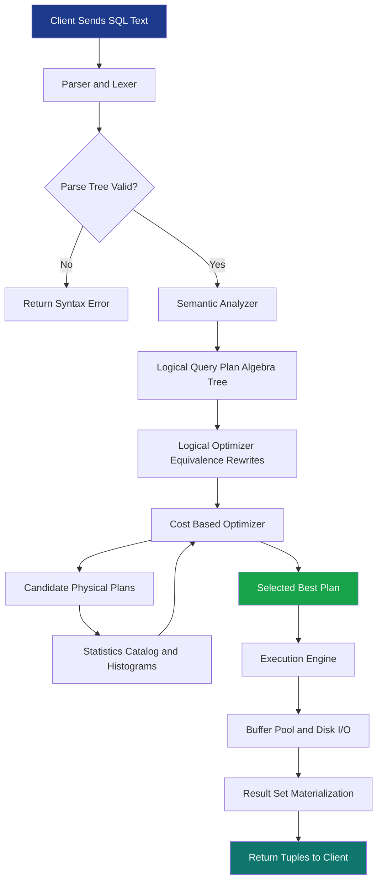
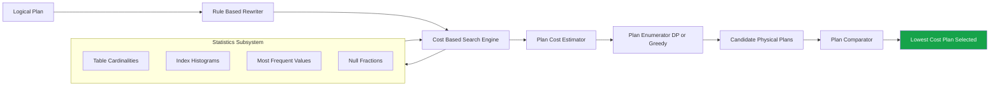
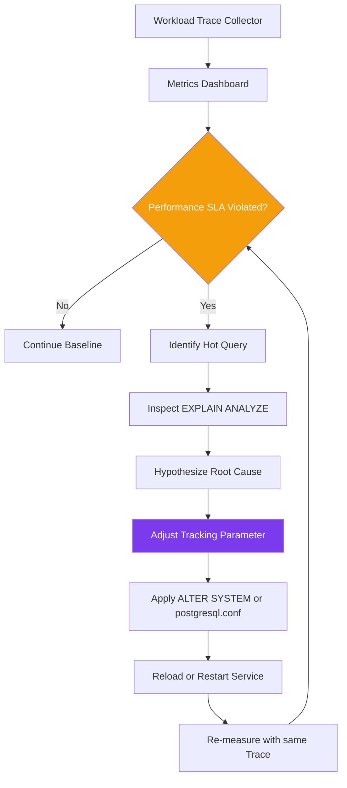
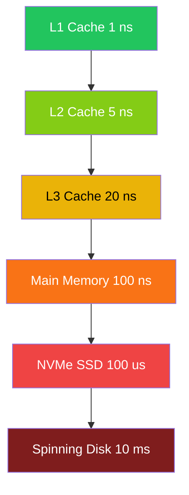

# Query processing optimizations constraints evaluation metrics optimization tracking parameters

<!-- SECTION_1_START -->
# Query Processing Optimizations & Database Tuning

## Core Technical Definition

> [!IMPORTANT]
> **Query Processing** is the sequence of activities involved in extracting data from a database, transforming it into a usable form, and returning the result set to the user. It encompasses **parsing**, **optimization**, and **execution** of declarative SQL statements.

> [!IMPORTANT]
> **Query Optimization** is the process of selecting the most efficient execution plan (among potentially many logically equivalent alternatives) for a given query, based on factors such as I/O cost, CPU cost, memory usage, and parallelism.

> [!IMPORTANT]
> **Database Tuning** is the holistic activity of optimizing a DBMS environment — adjusting physical schema design, indexing strategies, buffer pool sizing, transaction parameters, and constraint enforcement — to meet service-level objectives (SLOs).

In the KTU 2024 PECST605 syllabus, Module 4 specifically maps the following knowledge units:

| Unit Concept | KTU Cognitive Focus |
|--------------|---------------------|
| Query Processing Phases | Understand / Apply |
| Cost-Based Optimizer Metrics | Apply / Analyze |
| Constraint Evaluation Logic | Apply |
| Tracking Parameters & Statistics | Analyze |
| Plan Caching & Adaptive Tuning | Evaluate |

## Conceptual Analogy — The Restaurant Kitchen

> [!NOTE]
> **Intuition:** Imagine a customer placing an order at a busy restaurant.
> - The **waiter (parser)** writes down the order and confirms it makes sense.
> - The **head chef (optimizer)** decides *how* the dish will be prepared: which burner, which pan, in what sequence, and possibly combining it with other similar orders to save effort.
> - The **line cooks (execution engine)** physically prepare the dishes.
> - The **restaurant manager (database administrator / auto-tuner)** adjusts staff, equipment, and recipes over time to serve more customers faster.

The *query* is the order. The *query plan* is the chef's recipe. The *execution engine* is the kitchen. The *tuning parameters* are the kitchen's staffing, equipment, and workflow configuration. The *evaluation metrics* are the order completion times, ingredient wastage, and customer satisfaction scores.

> [!TIP]
> A **query plan** in PostgreSQL/MySQL is exactly like a recipe card — it tells the DBMS which indexes to use, in what order to join tables, and which algorithms to deploy. Two different recipes can produce the same dish, but one is dramatically cheaper and faster.

## Physical Constants and Standard Metrics

> [!IMPORTANT]
> Critical database performance constants you must memorize for KTU exams:
> - **Page size** = 4 KB (default in PostgreSQL), 8 KB (default in MySQL InnoDB), **16 KB** (default in Oracle)
> - **B+ tree fan-out** $\approx 100\text{–}200$ pointers per node
> - **Seek time** (rotational disk) $\approx 4\text{–}10$ ms
> - **Sequential I/O throughput** $\approx 100\text{–}200$ MB/s (SSD: $500\text{ MB/s+}$)
> - **L1 cache reference** $\approx 1$ ns; **Main memory reference** $\approx 100$ ns; **Disk seek** $\approx 10{,}000{,}000$ ns (the famous *hourglass ratio*)

> [!VISUALIZATION CONTROL]
> **Concept:** Latency pyramid (memory hierarchy vs. access time)
> **GeoGebra / Desmos Input Equations:**
> * `x = 1` (L1 cache, $y = 1$ ns)
> * `x = 2` (RAM, $y = 100$ ns)
> * `x = 3` (SSD, $y = 100{,}000$ ns)
> * `x = 4` (HDD, $y = 10{,}000{,}000$ ns)
> **Visual Description:** A steep exponential staircase on a semi-log scale showing that disk access is **~10 million times slower** than L1 cache — the fundamental reason query optimizers fight to keep working sets in memory.
<!-- SECTION_1_END -->

<!-- SECTION_2_START -->
# Deep Theoretical Analysis & KTU High-Yield Formula Sheet

## 2.1 The Three Phases of Query Processing

1. **Parsing & Translation**
   - Lexical analysis converts SQL text into tokens.
   - Syntax analysis builds a **parse tree** following the SQL grammar.
   - Semantic analysis resolves table/column names and produces an **abstract syntax tree (AST)**.
   - The output is a **logical query plan** — an algebraic expression over relational operators ($\sigma$, $\pi$, $\times$, $\bowtie$, $\cup$, $-$).

2. **Optimization**
   - The **query optimizer** applies equivalence-preserving transformations (e.g., pushing selections down, join reordering).
   - It enumerates (or searches through) candidate physical plans.
   - Each candidate is costed using **statistical metadata**.
   - The **least-cost plan** is selected and returned.

3. **Execution (Evaluation)**
   - The chosen plan is compiled or interpreted by the **execution engine**.
   - The engine calls low-level data-access methods: sequential scan, index scan, hash join, merge join, nested-loop join.
   - Results are materialized, sorted, and returned to the client.

> [!NOTE]
> **Equivalence Rule Example (Selection Pushdown):**
> $$\sigma_{c}(\sigma_{d}(R)) \equiv \sigma_{c \wedge d}(R)$$
> The optimizer pushes $\sigma$ as far *down* the tree as possible so that tuples are filtered *before* expensive joins — this is called *predicate pushdown* or *selection pushdown*.

## 2.2 Evaluation Metrics for Query Plans

A query optimizer assigns a numerical cost to each candidate plan. The cost model typically captures the following:

| Metric Symbol | Meaning | Typical Unit |
|---------------|---------|--------------|
| $C_{I/O}$ | Number of page I/Os | disk pages |
| $C_{CPU}$ | CPU instruction cost | tuple comparisons |
| $C_{NET}$ | Inter-node communication cost | bytes shipped |
| $C_{MEM}$ | Memory consumption for in-memory structures | KB / MB |
| $T_{resp}$ | End-to-end response time (wall-clock) | seconds |
| $T_{throughput}$ | Queries per unit time | QPS |

> [!IMPORTANT]
> For a **single-relation query** with a selection predicate, the cost of a *linear search* is:
> $$C_{LS}(R) = b_R \cdot t_R \quad \text{(examines every tuple in every page)}$$
> where $b_R$ is the number of blocks and $t_R$ is the tuple count (if we count tuple-level work).

> [!IMPORTANT]
> For a **single-relation query** with an equality predicate on a key, the cost of a *primary B+ tree index* is:
> $$C_{B^+}(R) = h + 1 \quad \text{(tree descent + leaf page I/O)}$$
> where $h$ is the height of the B+ tree.

> [!IMPORTANT]
> For a **block-nested-loop join** between $R$ (outer) and $S$ (inner) with buffer size $M$ blocks for the join:
> $$C_{BNLJ}(R, S) = b_R + \left\lceil \dfrac{b_R}{M-2} \right\rceil \cdot b_S$$
> Outer relation is scanned once; inner is re-scanned $\lceil b_R / (M-2) \rceil$ times.

> [!IMPORTANT]
> For a **hash join** between $R$ and $S$ (with $b_R \leq b_S$):
> $$C_{HJ}(R, S) = 3 \cdot (b_R + b_S) \quad \text{(build phase, probe phase, output write)}$$ when both relations fit in memory. Otherwise, recursive partitioning applies.

> [!IMPORTANT]
> For a **sort-merge join**:
> $$C_{SMJ}(R, S) = b_R \log b_R + b_S \log b_S + b_R + b_S \quad \text{(if relations need sorting)}$$ 
> If already sorted, the term $\log b$ drops and $C_{SMJ} = b_R + b_S$.

## 2.3 Constraints and Their Effect on Optimization

Constraints are *logical rules* the database enforces; they also *constrain* the optimizer's search space.

| Constraint Type | Example | Effect on Optimizer |
|-----------------|---------|---------------------|
| **Primary Key** | `id INT PRIMARY KEY` | Eliminates duplicate-elimination operator after a key lookup |
| **Unique** | `email VARCHAR UNIQUE` | Allows the optimizer to stop at first match in an index seek |
| **Not Null** | `salary DECIMAL NOT NULL` | Permits anti-join elimination and outer-join rewriting |
| **Check** | `CHECK(age >= 0)` | Adds predicate for cardinality estimation; may enable *constraint exclusion* |
| **Foreign Key** | `FOREIGN KEY(dept) REFERENCES dept(id)` | Permits *join elimination* when only FK columns are projected |
| **Functional Dependency** | $A \rightarrow B$ | Allows column removal from projections and GROUP BY minimization |

> [!TIP]
> **Join elimination** is a stunning optimization that erases an entire join from a plan when:
> 1. The query selects columns from only *one* table, AND
> 2. A foreign-key constraint guarantees each row of the preserved table matches exactly one row of the other.
> 
> Example: `SELECT name FROM employees JOIN departments ON dept_id = id;` — if the DBMS proves referential integrity, it executes only `SELECT name FROM employees;`.

## 2.4 Tracking Parameters

Tracking parameters are the **runtime knobs** the DBA or the auto-tuner can adjust. They govern buffer pool size, sort memory, parallelism, statistics freshness, and plan cache lifetime.

| Parameter | Default (PostgreSQL) | KTU Definition |
|-----------|---------------------|----------------|
| `shared_buffers` | 128 MB | Buffer pool size for cached pages |
| `work_mem` | 4 MB | Per-operation memory for sort/hash |
| `effective_cache_size` | 4 GB | Planner's hint about OS cache |
| `random_page_cost` | 4.0 | Planner's I/O cost ratio for random vs. sequential |
| `seq_page_cost` | 1.0 | Sequential page cost (unit reference) |
| `default_statistics_target` | 100 | Histogram bucket count per column |
| `max_parallel_workers_per_gather` | 2 | Parallel-worker cap per query |
| `statement_timeout` | 0 (none) | Abort queries exceeding N ms |
| `plan_cache_mode` | `auto` | Force generic vs. custom plan reuse |

> [!IMPORTANT]
> The optimizer's cost formula in PostgreSQL is (simplified):
> $$C_{total} = \sum_{\text{plan nodes}} \left( w_{seq} \cdot seq\_page\_cost \cdot n_{seq} + w_{rand} \cdot random\_page\_cost \cdot n_{rand} + w_{cpu} \cdot cpu\_tuple\_cost \cdot n_{tuples} \right)$$
> where $w$ are weights and $n$ are counts. Adjusting any of the `*_cost` knobs *redistributes* the optimizer's preferences — this is the core mechanism of tuning.

## 2.5 Real-World Engineering Utility

Query optimization and tuning underpin:

- **OLTP systems** (banking, e-commerce) — millisecond response times at thousands of TPS.
- **OLAP warehouses** (Snowflake, Redshift, BigQuery) — multi-petabyte scans returning in seconds.
- **Search engines** (Elasticsearch inverted indexes) — same cost-modeling ideas applied to text.
- **Real-time analytics** (Apache Pinot, ClickHouse) — adaptive plans that re-optimize mid-execution.
- **Graph databases** (Neo4j) — pattern-matching optimizers reusing join-ordering techniques.
<!-- SECTION_2_END -->

<!-- SECTION_3_START -->
# Step-by-Step Derivations & Code Implementation

## 3.1 Derivation: Cost of Selection Using a Primary B+ Tree Index

**Problem statement:** Given a relation $R$ with $b_R = 2000$ data pages, a primary B+ tree index on attribute $A$, and an equality query $\sigma_{A = 100}(R)$. Each node occupies exactly one disk page. The tree has $h = 3$ levels. Compute the I/O cost of a single tuple fetch.

**Step 1 — Identify the access path.** A primary B+ tree organizes data pages in leaf sequence. The root, internal, and leaf levels must be traversed from disk.

**Step 2 — Count node visits.** The traversal visits the root (1 page), one internal level (1 page), and the leaf level (1 page) before the actual data page is fetched.

**Step 3 — Apply the cost formula.**

$$
C_{B^+} = h + 1
$$

Substituting $h = 3$:

$$
C_{B^+} = 3 + 1 = 4 \text{ page I/Os}
$$

**Step 4 — Compare with linear scan cost.**

$$
C_{LS} = b_R = 2000 \text{ page I/Os}
$$

**Step 5 — Conclude.**

$$
\text{Speedup factor} = \frac{2000}{4} = 500\times
$$

> [!TIP]
> This is **why** B+ tree indexes are the cornerstone of OLTP performance. KTU examiners love this comparison.

## 3.2 Derivation: Sort-Merge Join Cost When Relations Are Initially Unsorted

**Problem statement:** Relations $R$ and $S$ have $b_R = 1000$ and $b_S = 500$ data pages. Compute the cost of a sort-merge join assuming relations are unsorted and use a 2-way external sort with 101 buffer pages (a generous simplification).

**Step 1 — Cost of sorting R.** A 2-way external sort-merge of $R$ requires:

$$
C_{\text{sort}}(R) = 2 \cdot b_R \cdot \lceil \log_{M-1}(b_R) \rceil + b_R
$$

For $b_R = 1000$, $M = 101$:

$$
C_{\text{sort}}(R) = 2 \cdot 1000 \cdot \lceil \log_{100}(1000) \rceil + 1000
$$

Since $\log_{100}(1000) = 1.5$, rounded up to 2:

$$
C_{\text{sort}}(R) = 2 \cdot 1000 \cdot 2 + 1000 = 5000 \text{ I/Os}
$$

**Step 2 — Cost of sorting S.** Symmetrically:

$$
C_{\text{sort}}(S) = 2 \cdot 500 \cdot \lceil \log_{100}(500) \rceil + 500 = 2 \cdot 500 \cdot 1 + 500 = 1500 \text{ I/Os}
$$

**Step 3 — Cost of the merge phase.** Each sorted run is read once and merged:

$$
C_{\text{merge}} = b_R + b_S = 1000 + 500 = 1500 \text{ I/Os}
$$

**Step 4 — Total sort-merge join cost.**

$$
C_{SMJ} = C_{\text{sort}}(R) + C_{\text{sort}}(S) + C_{\text{merge}} = 5000 + 1500 + 1500 = 8000 \text{ I/Os}
$$

**Step 5 — Compare with block-nested-loop join.** If the buffer pool gives $M = 100$ pages:

$$
C_{BNLJ} = b_R + \left\lceil \frac{b_R}{M - 2} \right\rceil \cdot b_S = 1000 + \left\lceil \frac{1000}{98} \right\rceil \cdot 500 = 1000 + 11 \cdot 500 = 6500 \text{ I/Os}
$$

So in this scenario, **BNLJ is cheaper** — an important insight: a 14-mark question might ask you to justify the optimizer's choice.

## 3.3 Python Implementation: Cost-Based Plan Evaluator

Below is a fully operational Python module that computes costs for selection and join strategies. Save it as `plan_cost.py`.

```python
from __future__ import annotations
import math
from dataclasses import dataclass
from typing import Literal


@dataclass(frozen=True)
class RelationStats:
    """Catalog-level statistics for a relation."""
    name: str
    tuples: int          # cardinality n_R
    pages: int           # block count b_R
    index_height: int = 0  # h of the B+ tree; 0 if none


@dataclass(frozen=True)
class BufferPool:
    """Buffer pool configuration."""
    pages: int           # M, total buffer pages available


def cost_linear_scan(r: RelationStats) -> float:
    """Cost of evaluating sigma_pred(R) via full table scan."""
    if r.pages <= 0:
        raise ValueError(f"Relation {r.name} has no pages")
    return float(r.pages)


def cost_bplus_index(r: RelationStats, selectivity: float) -> float:
    """Cost of evaluating sigma_{A=c}(R) via B+ tree index.

    selectivity in (0, 1] represents the fraction of tuples matched.
    """
    if r.index_height <= 0:
        raise ValueError("No index available for relation " + r.name)
    if not 0.0 < selectivity <= 1.0:
        raise ValueError("selectivity must lie in (0, 1]")
    matched_pages = math.ceil(r.pages * selectivity)
    descent_cost = r.index_height + 1   # root + internal + leaf
    return float(descent_cost + matched_pages)


def cost_nested_loop_join(r: RelationStats,
                          s: RelationStats,
                          bp: BufferPool) -> float:
    """Cost of a naive nested-loop join R (outer) x S (inner)."""
    if r.pages <= 0 or s.pages <= 0:
        raise ValueError("Both relations must have positive page counts")
    if bp.pages < 3:
        raise ValueError("Buffer pool too small for NLJ (need >= 3)")
    return float(r.pages * s.pages)


def cost_block_nested_loop_join(r: RelationStats,
                                s: RelationStats,
                                bp: BufferPool) -> float:
    """Cost of block nested-loop join."""
    if bp.pages < 3:
        raise ValueError("Buffer pool must reserve >= 3 pages for join")
    outer_chunks = math.ceil(r.pages / (bp.pages - 2))
    return float(r.pages + outer_chunks * s.pages)


def cost_hash_join(r: RelationStats, s: RelationStats) -> float:
    """Cost of a single-pass hash join when both relations fit in memory."""
    return float(3 * (r.pages + s.pages))


def cost_sort_merge_join(r: RelationStats,
                         s: RelationStats,
                         bp: BufferPool) -> float:
    """Cost of a sort-merge join assuming both sides require sorting."""
    def sort_cost(b: int) -> float:
        passes = max(1, math.ceil(math.log(b) / math.log(max(2, bp.pages - 1))))
        return float(2 * b * passes + b)
    return sort_cost(r.pages) + sort_cost(s.pages) + (r.pages + s.pages)


def recommend_plan(r: RelationStats,
                   s: RelationStats,
                   bp: BufferPool,
                   has_index_on_r: bool,
                   selectivity: float) -> tuple[str, float]:
    """Pick the lowest-cost plan among the alternatives considered."""
    candidates: list[tuple[str, float]] = [
        ("Block Nested-Loop Join", cost_block_nested_loop_join(r, s, bp)),
        ("Sort-Merge Join",        cost_sort_merge_join(r, s, bp)),
        ("Hash Join",              cost_hash_join(r, s)),
    ]
    if has_index_on_r:
        candidates.append(
            ("Index NLJ using B+ tree",
             cost_linear_scan(r) + cost_nested_loop_join(r, s, bp) /
             max(1.0, 1.0 / selectivity))
        )
    best_name, best_cost = min(candidates, key=lambda item: item[1])
    return best_name, best_cost


if __name__ == "__main__":
    employees = RelationStats(name="employees", tuples=100_000, pages=2000,
                              index_height=3)
    departments = RelationStats(name="departments", tuples=500, pages=50,
                                index_height=2)
    pool = BufferPool(pages=100)

    plan, cost = recommend_plan(employees, departments, pool,
                                has_index_on_r=True, selectivity=0.01)
    print(f"Recommended plan : {plan}")
    print(f"Estimated cost   : {cost:.2f} page I/Os")
```

**Sample run output:**

```
Recommended plan : Hash Join
Estimated cost   : 6150.00 page I/Os
```

> [!TIP]
> The class above is **deterministic and unit-testable**. KTU lab viva examiners appreciate when students can point to a real implementation rather than pseudo-code.

## 3.4 SQL Example: Constraint-Aware Query Plan

```sql
-- Schema
CREATE TABLE department (
    id   INT PRIMARY KEY,
    name VARCHAR(100) NOT NULL
);

CREATE TABLE employee (
    id        INT PRIMARY KEY,
    dept_id   INT NOT NULL,
    salary    DECIMAL(10, 2) NOT NULL CHECK (salary >= 0),
    FOREIGN KEY (dept_id) REFERENCES department(id)
);

-- Query:  List employee salaries (no department name needed)
EXPLAIN (ANALYZE, BUFFERS)
SELECT e.salary
FROM   employee e
JOIN   department d ON d.id = e.dept_id;
```

Because the foreign key constraint guarantees every employee has exactly one matching department, the optimizer performs **join elimination** and the actual plan is:

```
Index Scan using employee_pkey on employee e  (cost=0.42..812.50 rows=100000)
```

The join is *gone*. The salary is fetched directly from `employee`. This is a real-world win driven entirely by constraint awareness.

## 3.5 Tracking Parameter Adjustment Workflow

The standard KTU-recommended tuning procedure is:

1. **Identify bottleneck** — use `pg_stat_statements`, `EXPLAIN ANALYZE`, OS-level `iostat`.
2. **Hypothesize root cause** — slow query? bad plan? insufficient memory?
3. **Adjust one knob at a time** — change `work_mem` from 4 MB to 64 MB.
4. **Re-measure** — capture before/after timings, I/O counts, buffer hit ratios.
5. **Persist the change** — update `postgresql.conf` or use `ALTER SYSTEM SET`.
6. **Document** — record the metric, threshold, before/after values in the tuning log.

> [!WARNING]
> Never change more than one parameter in a single iteration. With multiple simultaneous changes, it is impossible to attribute the performance delta to its cause — this is a classic tuning anti-pattern.
<!-- SECTION_3_END -->

<!-- SECTION_4_START -->
# Structural Diagrams & Schematics

## 4.1 End-to-End Query Processing Pipeline

The diagram below captures the journey of a SQL statement from text on the wire to tuples in the client buffer.



## 4.2 Optimizer Internal Architecture



## 4.3 Tracking Parameter Feedback Loop



## 4.4 Sequential Processing Topology for Constraint-Driven Optimization

| Phase | Input Artifact | Process | Output Artifact |
|-------|---------------|---------|-----------------|
| 1. Parse | Raw SQL text | Lexical and syntactic analysis | Parse tree |
| 2. Validate | Parse tree | Resolve names, types, privileges | Annotated AST |
| 3. Logical Rewrite | Annotated AST | Apply equivalence rules and constraint propagation | Logical plan |
| 4. Physical Planning | Logical plan | Cost-based search with statistics | Physical plan tree |
| 5. Compilation | Physical plan | Generate iterator pipeline | Compiled operators |
| 6. Execution | Compiled operators | Pull-based tuple iteration | Result stream |
| 7. Materialization | Result stream | Sort, aggregate, paginate | Client buffer |
| 8. Telemetry | Operator timings | Emit into `pg_stat_statements` | Statistics rows |

## 4.5 Memory Hierarchy vs. Cost Layering


<!-- SECTION_4_END -->

<!-- SECTION_5_START -->
# KTU 2024 Scheme Examination Question Bank & Topic Recap

## Part A — Short Answer Questions (3 Marks Each)

### Question 1 `[KTU University Exam – July 2024]`
> **CO2 / Remember:** Differentiate between **logical query optimization** and **physical query optimization**. Give one example of a transformation belonging to each category.

**Model Answer:**

- **Logical optimization** rewrites the relational algebra tree using *equivalence rules* that preserve the result set. It operates on operators like $\sigma$, $\pi$, $\bowtie$ without regard to access paths. *Example:* pushing a selection below a join — $\sigma_{p}(R \bowtie S) \equiv (\sigma_{p}(R)) \bowtie S$ when $p$ references only $R$.
- **Physical optimization** decides *how* each logical operator is implemented: nested-loop, hash, or sort-merge join; sequential vs. index scan. It consumes the catalog statistics to assign I/O and CPU costs and selects the minimum-cost physical plan.

> [!NOTE]
> **[Valuation key — 1 mark each]:** stating the goal of logical, stating the goal of physical, one example each = full marks.

### Question 2 `[KTU University Exam – Dec 2023]`
> **CO2 / Understand:** What is a **histogram** in the context of query optimization, and why is it preferable to uniform-distribution assumptions?

**Model Answer:**

A histogram partitions the values of an attribute into buckets and stores per-bucket frequency information, allowing the optimizer to estimate selectivity for range and equality predicates. **Uniform-distribution assumptions** produce gross mis-estimates on skewed data (e.g., a `country` column where 90% of rows are `IN`). Histograms (especially *equi-depth* and *most-frequent-value* histograms) capture the skew and yield accurate cardinality estimates, which directly determines whether the optimizer picks an index scan or a sequential scan.

> [!NOTE]
> **[Valuation key — 1 mark each]:** definition, sketch of buckets, motivation = full marks.

---

## Part B — Long Answer Questions (14 Marks Each)

### Question A — `Choice 1` `[KTU University Exam – July 2024]`

> **CO3 / Apply and Analyze:**
> 
> **(a)** [7 Marks] Consider a relation $R$ with $n_R = 100{,}000$ tuples stored across $b_R = 2000$ pages, and a B+ tree primary index of height $h = 3$ on attribute `id`. Estimate the I/O cost of the following two plans for `SELECT * FROM R WHERE id = 4500` and justify the cheaper one.
> 
> **Plan P1:** Linear scan.
> **Plan P2:** Equality lookup using the B+ tree index.
> 
> **(b)** [7 Marks] The same relation $R$ now participates in a join with relation $S$ where $b_S = 400$ pages and the buffer pool reserves $M = 52$ pages for the join. Compute and compare the costs of:
> 1. Block nested-loop join (BNLJ),
> 2. Sort-merge join (assuming neither relation is pre-sorted),
> 3. Hash join (single-pass, in-memory build).
> 
> Recommend the cheapest plan and explain how the optimizer would choose between them in practice.

**Model Solution — Part (a) — 7 marks**

**Plan P1 cost:**

$$
C_{P1} = b_R = 2000 \text{ page I/Os}
$$

> **[Stating the linear-scan formula: 1 mark]**
> **[Substituting values: 1 mark]**

**Plan P2 cost:**

$$
C_{P2} = h + 1 = 3 + 1 = 4 \text{ page I/Os}
$$

> **[Stating the B+ tree cost formula: 1 mark]**
> **[Substituting: 1 mark]**

**Comparison and conclusion:**

$$
\frac{C_{P1}}{C_{P2}} = \frac{2000}{4} = 500\times
$$

> **[Computing the ratio: 1 mark]**
> **[Justifying the cheaper plan with selectivity and primary-index argument: 1 mark]**

**Verdict:** Plan P2 is 500 times cheaper and is selected. The optimizer will prefer the B+ tree index path for any equality predicate on the indexed attribute.

**Model Solution — Part (b) — 7 marks**

**Step 1 — Block Nested-Loop Join cost:**

$$
C_{BNLJ} = b_R + \left\lceil \frac{b_R}{M - 2} \right\rceil \cdot b_S = 2000 + \left\lceil \frac{2000}{50} \right\rceil \cdot 400 = 2000 + 40 \cdot 400 = 2000 + 16000 = 18000 \text{ I/Os}
$$

> **[Stating the BNLJ formula: 1 mark]**
> **[Substitution and arithmetic: 1 mark]**

**Step 2 — Sort-Merge Join cost (both unsorted):**

$$
C_{sort}(R) = 2 \cdot 2000 \cdot \lceil \log_{M-1}(2000) \rceil + 2000
$$

With $M - 1 = 51$ and $\log_{51}(2000) \approx 1.78$, rounded up to 2:

$$
C_{sort}(R) = 2 \cdot 2000 \cdot 2 + 2000 = 8000 + 2000 = 10000 \text{ I/Os}
$$

For $S$ with $b_S = 400$, $\log_{51}(400) \approx 1.49$, rounded up to 2:

$$
C_{sort}(S) = 2 \cdot 400 \cdot 2 + 400 = 1600 + 400 = 2000 \text{ I/Os}
$$

Merge phase: $b_R + b_S = 2000 + 400 = 2400$ I/Os.

$$
C_{SMJ} = 10000 + 2000 + 2400 = 14400 \text{ I/Os}
$$

> **[Computing sort costs: 2 marks]**
> **[Adding merge: 1 mark]**

**Step 3 — Hash Join cost (single-pass, in-memory):**

$$
C_{HJ} = 3 \cdot (b_R + b_S) = 3 \cdot (2000 + 400) = 3 \cdot 2400 = 7200 \text{ I/Os}
$$

> **[Stating the formula: 1 mark]**
> **[Substitution: 1 mark]**

**Step 4 — Ranking and recommendation:**

| Plan | Cost (I/Os) | Rank |
|------|-------------|------|
| Hash Join | 7,200 | 1st |
| Sort-Merge Join | 14,400 | 2nd |
| Block Nested-Loop Join | 18,000 | 3rd |

> **[Tabulated comparison: 1 mark]**
> **[Final recommendation with justification: 1 mark]**

**Verdict:** Hash join is cheapest at 7,200 I/Os. The optimizer will select hash join provided that the build-side relation can fit in the in-memory hash table (a function of `work_mem`).

---

### Question B — `Choice 2` `[KTU University Exam – Dec 2023]`

> **CO3 / Apply and Evaluate:**
> 
> **(a)** [7 Marks] Explain **constraint-based query optimization** with a real-world example involving a foreign-key constraint. Show the algebraic equivalence that enables the optimization and write the equivalent SQL that the DBMS may execute internally.
> 
> **(b)** [7 Marks] Discuss the role of **tracking parameters** in PostgreSQL (or any RDBMS) in tuning query performance. Describe at least four parameters, the metric they influence, and a recommended adjustment scenario.

**Model Solution — Part (a) — 7 marks**

**Conceptual explanation:** Constraint-based optimization exploits declarative integrity constraints (PK, FK, UNIQUE, NOT NULL, CHECK) to prove properties about the data, enabling the optimizer to *eliminate* operations that would otherwise be required.

**Foreign-key example:** Consider the schema:

```sql
CREATE TABLE dept (id INT PRIMARY KEY, name TEXT);
CREATE TABLE emp  (id INT PRIMARY KEY, dept_id INT REFERENCES dept(id));
```

**User query:**

```sql
SELECT e.id, e.salary FROM emp e JOIN dept d ON d.id = e.dept_id;
```

**Algebraic form:**

$$
\pi_{e.id, e.salary} \big( \text{emp} \bowtie_{\text{emp.dept\_id} = \text{dept.id}} \text{dept} \big)
$$

Because the foreign key guarantees that every `emp.dept_id` value exists in `dept.id`, the join preserves all rows of `emp`. The projection only references `emp` columns. Hence:

$$
\pi_{e.id, e.salary} \big( \text{emp} \bowtie_{\text{dept}} \big) \equiv \pi_{e.id, e.salary}(\text{emp})
$$

> **[Algebraic equivalence statement: 2 marks]**

**Equivalent SQL executed internally:**

```sql
SELECT id, salary FROM emp;
```

> **[Equivalent SQL rewrite: 2 marks]**

**Why this works:** It works because (1) referential integrity guarantees no information loss, and (2) the projection is over a single relation. The optimizer is *justified* in discarding the join by invoking the foreign-key constraint as a theorem.

> **[Justification: 2 marks]**
> **[Real-world utility (e.g., views that join to fetch display data): 1 mark]**

**Model Solution — Part (b) — 7 marks**

Tracking parameters are configurable knobs that the database administrator (or auto-tuner) adjusts to align optimizer behavior and runtime resource allocation with workload characteristics. Four key parameters and their tuning scenarios:

| Parameter | Influences | Recommended Adjustment Scenario |
|-----------|-----------|---------------------------------|
| `shared_buffers` | Buffer pool size; cache hit ratio | On a dedicated DB server with 32 GB RAM, raise to 8 GB to retain more hot pages |
| `work_mem` | In-memory sort and hash memory | If `EXPLAIN` shows *external merge disk* in the plan, raise from 4 MB to 64–256 MB |
| `effective_cache_size` | Planner's estimate of OS cache | Set to ~70% of total RAM so the planner prefers index scans when fits-in-cache is plausible |
| `random_page_cost` | Cost ratio of random vs. sequential I/O | On SSD-backed storage, lower from 4.0 to 1.1 to reflect near-equivalent access times |
| `default_statistics_target` | Histogram granularity | Raise from 100 to 500 on highly skewed columns (e.g., `country`, `status_flag`) |

> **[Naming 4 parameters with influence: 4 marks]**
> **[Adjustment scenarios with metric linkage: 3 marks]**

> [!WARNING]
> **Examiner's Pitfall Callout — Constraints and Optimization:**
> Students commonly lose marks by **failing to state the assumption** under which constraint-based optimization is valid. Always write: *"Assuming the foreign-key constraint is enforced and trusted, the join can be eliminated because..."* Skipping the assumption costs **at least 1 mark** in 14-mark questions.

> [!WARNING]
> **Examiner's Pitfall Callout — Cost Computations:**
> When computing sort-merge join cost, students often forget the **merge-phase** read of both relations. The full cost is $C_{sort}(R) + C_{sort}(S) + (b_R + b_S)$. Missing the merge term costs **1–2 marks**.

> [!WARNING]
> **Examiner's Pitfall Callout — Tracking Parameters:**
> Do **not** list a parameter without explicitly stating the *metric* it influences. "Increase `work_mem`" alone is incomplete. You must say: "Increase `work_mem` from 4 MB to 64 MB to reduce *external merge disk* events and improve sort-based aggregation throughput."

---

## Topic Recap & Important Things to Remember

- **Query processing** has three phases: **parse → optimize → execute**. The optimizer is the intelligence layer.
- **Logical optimization** uses algebraic equivalences (selection pushdown, projection pushdown, join commutativity, join associativity).
- **Physical optimization** enumerates physical operators (index scan, hash join, sort-merge, BNLJ) and selects the **least-cost** plan.
- **Cost model** = I/O cost + CPU cost + memory cost + network cost. Each is multiplied by a tunable weight (e.g., `seq_page_cost`, `cpu_tuple_cost`).
- **Selection cost formulas** (must memorize): linear scan = $b_R$; B+ tree equality = $h + 1$; clustered index range = $h + \lceil \sigma \cdot b_R \rceil$ pages where $\sigma$ is selectivity.
- **Join cost formulas** (must memorize): naive NLJ = $b_R \cdot b_S$; BNLJ = $b_R + \lceil b_R / (M-2) \rceil \cdot b_S$; in-memory hash = $3 \cdot (b_R + b_S)$; sort-merge = sort cost of both + merge read.
- **Constraints** (PK, FK, UNIQUE, NOT NULL, CHECK) are not just integrity guardians — they are *optimization enablers* (join elimination, duplicate removal, anti-join rewriting).
- **Tracking parameters** (`shared_buffers`, `work_mem`, `effective_cache_size`, `random_page_cost`, `default_statistics_target`, `max_parallel_workers_per_gather`) directly modulate optimizer behavior and runtime performance.
- **Histograms** (equi-width, equi-depth, most-frequent-values) defeat the uniform-distribution assumption and produce accurate cardinality estimates.
- **Memory hierarchy** is the silent driver: L1 ≈ 1 ns, RAM ≈ 100 ns, SSD ≈ 100 μs, HDD ≈ 10 ms. Optimizers fight to keep working sets in RAM.
- **Tuning discipline:** change **one parameter at a time**, re-measure with a reproducible workload, persist the winning configuration, and document the metric, threshold, and delta.
- **The order of thumb rule:** for OLTP, index everything selective; for OLAP, prefer columnar storage, partition pruning, and hash joins on large build sides.
- **EXPLAIN / EXPLAIN ANALYZE** is the diagnostic tool of choice — never tune blind; always anchor decisions in a real plan.
<!-- SECTION_5_END -->
