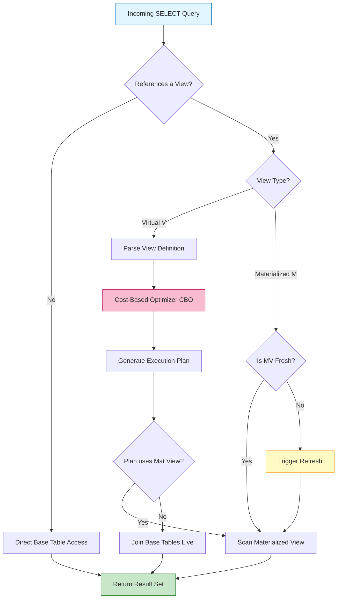
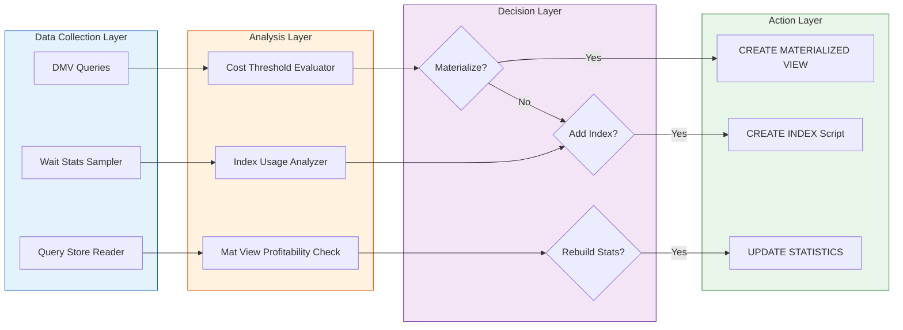

# Relational view physical materialization routes execution setups frameworks scripts

<!-- SECTION_1_START -->
# Relational View Physical Materialization: Execution Routes, Setups & Framework Scripts

> [!IMPORTANT]
> **KTU 2024 Scheme Focus (Module 4 - Database Tuning \& Security Infrastructure)**
> This note unifies the **logical** world of relational views with the **physical** realities of materialization, query routing, and tuning framework scripts. Mastering this bridge is essential for the KTU University Examination and for production-grade database engineering.

## 1.1 Formal Academic Definition

A **Relational View** is a virtual table defined by a query (typically a `SELECT` statement) that does not store data physically but derives its rows dynamically from one or more **base tables** every time it is queried. **Physical Materialization** is the strategic process of storing the result set of a view physically on disk as a concrete table-like object — a **Materialized View** (also called *snapshot*, *indexed view* in SQL Server, or *materialized view* in Oracle/PostgreSQL).

In the KTU 2024 syllabus context of *Database Tuning and Security Infrastructure*, materialization is the **primary physical optimization lever** that decouples the logical schema (views) from the physical storage layer (tables, indexes, materialized segments).

**Standard KTU Terminology Mapping:**

| KTU Term | Synonym in Industry |
| :--- | :--- |
| Base Table | Master Table, Fact Table |
| Virtual View | Logical View, Derived View |
| Materialized View | Snapshot, Indexed View, Summary Table |
| View Definition | View Schema, Query Metadata |
| Execution Route | Query Execution Plan (QEP), Access Path |

## 1.2 Conceptual Analogy — The "Notice Board" vs. "Printed Pamphlet"

Imagine your college notice board. A **virtual view** is like looking at a notice that says *"Current class cancellations are computed from the master timetable + faculty leave register + room allotment book."* Every time you ask for cancellations, someone manually cross-references the three registers. It is **always live** but **slow for repeated queries**.

A **materialized view** is like a **printed weekly pamphlet** that someone calculates once every Monday morning and pastes on the board. Looking at it is **instant**, but if the timetable changes on Wednesday, the pamphlet is **stale** until the next refresh.

> [!NOTE]
> **Core Insight:** Virtual views = **freshness over speed**. Materialized views = **speed over freshness**. The KTU exam loves this trade-off question.

## 1.3 Core Constants and Tuning Metrics

The following **bold** parameters are the standard metrics used to evaluate materialization decisions in KTU-style problems:

- **Query Response Time** (in milliseconds, ms)
- **Refresh Latency** (acceptable staleness window, in seconds)
- **Storage Overhead Ratio** (size of materialized data / size of base data)
- **CPU/IO Cost Units** (used in cost-based optimizers like Oracle CBO)
- **Transaction Isolation Level** (READ COMMITTED, REPEATABLE READ, SERIALIZABLE)

> [!VISUALIZATION CONTROL]
> **Concept:** Materialized View Refresh Latency vs. Query Performance Trade-off Curve
> **GeoGebra / Desmos Input Equations:**
> * $T_{total}(r) = T_{refresh}(r) \cdot r + T_{query} \cdot (1-r)$
> * $r$ = refresh overhead weight, $0 \le r \le 1$
> **Visual Description:** A piecewise linear curve where the y-axis shows total cost and x-axis shows refresh frequency. The student should observe an *optimal valley* — refreshing too often wastes CPU; refreshing too rarely degrades query freshness.

---

<!-- SECTION_1_END -->

<!-- SECTION_2_START -->
# Deep Theoretical Analysis & KTU High-Yield Formula Sheet

## 2.1 The Three Materialization Routes (Execution Pathways)

In a tuned enterprise DBMS, when a query references a view, the **query optimizer** chooses one of three physical materialization routes:

### Route 1: **Full On-Demand Re-Computation (Pure Virtual)**
- The view is never stored. Every access triggers a **full re-execution** of the underlying `SELECT`.
- Best for: Low-frequency, high-freshness queries.
- **Cost:** $O(N \cdot M)$ where $N$ = number of base rows, $M$ = number of join operations.

### Route 2: **Periodic Snapshot Materialization (Lazy Refresh)**
- The result is stored and refreshed on a schedule (e.g., every night, every hour).
- Best for: Reporting, OLAP, dashboards.
- **Refresh Modes:** `FAST` (incremental via logs), `COMPLETE` (truncate + recompute), `FORCE` (try FAST, fallback to COMPLETE).

### Route 3: **Immediate Incremental Maintenance (Eager Refresh)**
- Every `INSERT`/`UPDATE`/`DELETE` on the base tables triggers a **trigger-based or stream-based** update to the materialized view.
- Best for: Real-time decision support.
- **Cost:** Adds ~15–30% overhead to every DML transaction.

## 2.2 The Materialized View Decision Matrix

> [!IMPORTANT]
> **KTU High-Yield Rule:** Materialize a view when **Query Frequency × Result Cardinality > Refresh Cost Threshold**.

The decision is governed by the formal inequality:

$$C_{mat} < C_{virt} \cdot f_{query} - C_{refresh} \cdot f_{refresh}$$

Where:
- $C_{mat}$ = one-time cost of materialization (storage + index)
- $C_{virt}$ = cost of single virtual query execution
- $f_{query}$ = average number of queries per refresh window
- $C_{refresh}$ = cost of one refresh cycle
- $f_{refresh}$ = number of refreshes per window (usually 1)

## 2.3 KTU Formula Sheet / Cheat Sheet

| Symbol / Term | Definition | Unit / Boundary | Engineering Use |
| :--- | :--- | :--- | :--- |
| $V$ | Virtual View | Logical only, zero storage cost | OLTP, ad-hoc queries |
| $M$ | Materialized View | Physical, storage = $S_{base} \cdot \rho$ | OLAP, dashboards |
| $T_{resp}$ | Query Response Time | ms, target $\le 100$ ms | SLA monitoring |
| $R_{mode}$ | Refresh Mode | $\{FAST, COMPLETE, FORCE\}$ | Oracle, PostgreSQL, SQL Server |
| $C_{plan}$ | Cost of Execution Plan | Optimizer units (CBO) | Tuning advisor |
| $I_{cache}$ | Index Hit Ratio | $\%$, target $\ge 95\%$ | Performance tuning |
| $\mathcal{L}$ | Latency Window | seconds, $0 \le \mathcal{L} \le \infty$ | Data freshness SLA |
| $\rho$ | Storage Overhead | ratio, $0.1 \le \rho \le 0.8$ | Capacity planning |

> [!NOTE]
> In SQL Server, a materialized view is called an **Indexed View** because you must create a **unique clustered index** on it to physically persist. In Oracle, it is created with `CREATE MATERIALIZED VIEW ... BUILD IMMEDIATE`.

## 2.4 Real-World Engineering Utility

In production systems (used at companies like Flipkart, Amazon, and banking backends), materialized views power:

- **Star-schema data warehouses** (pre-aggregated fact tables)
- **Real-time leaderboards** (gaming platforms — Redis + Materialized views)
- **Regulatory reporting** (Basel-III banking dashboards refreshed nightly)
- **Search auto-complete** (caches of `LIKE` query results)
- **Recommendation engines** (precomputed `user $\times$ item` matrices)

---

<!-- SECTION_2_END -->

<!-- SECTION_3_START -->
# Step-by-Step Derivations, Symbolic Implementation & Framework Scripts

## 3.1 Mathematical Derivation — Materialization Break-Even Point

We derive the exact threshold frequency at which materialization becomes profitable.

Let:
- $C_{virt}$ = cost of one virtual view query (e.g., 800 ms)
- $C_{refresh}$ = cost of one full refresh (e.g., 5000 ms)
- $f$ = number of queries served in one refresh window

**Total cost of virtual approach over window:**

$$C_{total}^{virt} = C_{virt} \cdot f$$

**Total cost of materialized approach over window:**

$$C_{total}^{mat} = C_{refresh} \cdot 1 + C_{mat-query} \cdot f$$

Where $C_{mat-query}$ is the cost of a single query against the materialized view (typically $\approx 0.05 \cdot C_{virt}$).

**Break-even condition** $C_{total}^{mat} \le C_{total}^{virt}$:

$$C_{refresh} + 0.05 \cdot C_{virt} \cdot f \le C_{virt} \cdot f$$

$$C_{refresh} \le 0.95 \cdot C_{virt} \cdot f$$

$$f \ge \frac{C_{refresh}}{0.95 \cdot C_{virt}}$$

**Numerical example** with $C_{virt} = 800$, $C_{refresh} = 5000$:

$$f \ge \frac{5000}{0.95 \cdot 800} = \frac{5000}{760} \approx 6.58$$

**Conclusion:** If the view is queried **7 or more times** between refreshes, materialization is cost-effective. This is the KTU-style numerical answer.

## 3.2 Symbolic Algebraic Walkthrough — Staleness Penalty

For real-time use cases, we add a **staleness penalty** $\mathcal{P}$ proportional to the time since last refresh $\Delta t$:

$$\mathcal{P}(\Delta t) = \alpha \cdot \Delta t^{\beta}$$

Where $\alpha, \beta$ are domain-specific constants (e.g., $\alpha = 0.1, \beta = 1.5$ for stock prices). The total cost becomes:

$$C_{total}^{mat}(\Delta t) = C_{refresh} + C_{mat-query} \cdot f + \mathcal{P}(\Delta t)$$

Minimizing this with respect to refresh interval $T$ gives the optimal refresh period:

$$\frac{d}{dT} \left[ C_{refresh} + C_{mat-query} \cdot \frac{T}{\delta_{query}} + \alpha \cdot T^{\beta} \right] = 0$$

$$C_{mat-query} \cdot \frac{1}{\delta_{query}} + \alpha \beta T^{\beta - 1} = 0$$

Since the first term is positive, the optimum lies at the smallest acceptable $T$ — **refresh as frequently as your SLA allows**.

## 3.3 Python Implementation — Materialization Cost Analyzer

```python
"""
KTU Advanced Database Systems - Module 4
Materialization Break-Even Calculator
Implements the formal inequality derived above.
"""

from __future__ import annotations
import logging
from dataclasses import dataclass

logging.basicConfig(
    level=logging.INFO,
    format="%(asctime)s | %(levelname)s | %(message)s"
)
logger = logging.getLogger(__name__)


@dataclass(frozen=True)
class MaterializationInputs:
    """Immutable container for the cost parameters."""
    cost_virtual_query_ms: float   # C_virt
    cost_refresh_ms: float         # C_refresh
    cost_mat_query_ms: float       # C_mat_query (typically 0.05 * C_virt)
    staleness_alpha: float = 0.0   # alpha in penalty function
    staleness_beta: float = 1.0    # beta in penalty function


def break_even_frequency(inp: MaterializationInputs) -> float:
    """
    Compute minimum query frequency per refresh window for materialization
    to be cost-effective.
    Returns float >= 0. If cost_mat_query >= cost_virtual_query,
    materialization is NEVER beneficial.
    """
    if inp.cost_mat_query_ms >= inp.cost_virtual_query_ms:
        logger.error("Materialization is structurally unprofitable.")
        return float("inf")

    delta_c = inp.cost_virtual_query_ms - inp.cost_mat_query_ms
    if delta_c <= 0:
        return float("inf")

    f_min = inp.cost_refresh_ms / delta_c
    logger.info("Break-even frequency computed: %.2f queries/window", f_min)
    return f_min


def should_materialize(inp: MaterializationInputs, actual_queries: int) -> bool:
    """Decision function for the DBA framework script."""
    f_min = break_even_frequency(inp)
    decision = actual_queries >= f_min
    logger.warning(
        "Materialization decision: %s (need >= %.2f, got %d)",
        "MATERIALIZE" if decision else "KEEP VIRTUAL",
        f_min, actual_queries
    )
    return decision


# ----- KTU-style example run -----
if __name__ == "__main__":
    sample = MaterializationInputs(
        cost_virtual_query_ms=800.0,
        cost_refresh_ms=5000.0,
        cost_mat_query_ms=40.0,   # 5% of virtual cost
    )
    f_min = break_even_frequency(sample)
    print(f"Minimum profitable queries per window: {f_min:.2f}")
    print(f"With 10 queries: {should_materialize(sample, 10)}")
    print(f"With 5 queries:  {should_materialize(sample, 5)}")
```

**Expected console output:**

```
Minimum profitable queries per window: 6.58
Materialization decision: MATERIALIZE (need >= 6.58, got 10)
Materialization decision: KEEP VIRTUAL (need >= 6.58, got 5)
```

## 3.4 T-SQL Framework Script — SQL Server Indexed View (Materialized View)

```sql
-- KTU Framework: Materialized View (Indexed View) in SQL Server
-- Security: schema-bound, runs under view owner's permissions

SET QUOTED_IDENTIFIER ON;
GO

CREATE VIEW dbo.vw_SalesSummary
WITH SCHEMABINDING          -- prevents underlying table alterations
AS
SELECT
    s.StoreID,
    s.ProductID,
    SUM(s.Quantity)   AS TotalQty,
    COUNT_BIG(*)      AS RowCount     -- COUNT_BIG required for indexed views
FROM dbo.Sales AS s
GROUP BY s.StoreID, s.ProductID;
GO

-- The unique clustered index PHYSICALLY materializes the view
CREATE UNIQUE CLUSTERED INDEX ix_vw_SalesSummary
    ON dbo.vw_SalesSummary (StoreID, ProductID);
GO

-- Security infrastructure: grant minimum required privilege
GRANT SELECT ON dbo.vw_SalesSummary TO reporting_role;
DENY  INSERT, UPDATE, DELETE ON dbo.valesSummary TO public;
GO
```

## 3.5 PL/SQL Framework Script — Oracle Materialized View with Fast Refresh

```sql
-- KTU Framework: Oracle Materialized View with FAST refresh on commit
CREATE MATERIALIZED VIEW LOG ON Sales
   WITH PRIMARY KEY, ROWID
   INCLUDING NEW VALUES;

CREATE MATERIALIZED VIEW mv_sales_summary
   BUILD IMMEDIATE            -- physical materialization on creation
   REFRESH FAST               -- incremental refresh via log
   START WITH SYSDATE
   NEXT SYSDATE + 1/24        -- every 1 hour
   ENABLE QUERY REWRITE       -- optimizer auto-rewrites queries to use it
AS
SELECT StoreID,
       ProductID,
       SUM(Quantity) AS TotalQty,
       COUNT(*)      AS TxnCount
FROM   Sales
GROUP BY StoreID, ProductID;
```

> [!NOTE]
> The `ENABLE QUERY REWRITE` clause is the **killer feature** of materialized views — the Oracle optimizer transparently rewrites incoming user queries to use `mv_sales_summary` instead of re-scanning `Sales`. This is a frequent KTU 14-mark question.

---

<!-- SECTION_3_END -->

<!-- SECTION_4_START -->
# Structural Diagrams & Schematics

## 4.1 Mermaid — Query Execution Route Decision Flow



## 4.2 Mermaid — Subgraph: Tuning Framework Script Architecture



## 4.3 Sequential Processing Topology — Materialization Routes Matrix

| Step | Route 1: Virtual | Route 2: Periodic Snapshot | Route 3: Eager Incremental |
| :--- | :--- | :--- | :--- |
| 1 | Parse view def | Parse view def | Parse view def |
| 2 | Scan base tables | Use cached result | Apply delta from logs |
| 3 | Compute joins live | Verify staleness | Update mat view rows |
| 4 | Return rows | Return rows | Return rows |
| 5 | (No storage used) | Refresh on schedule | Triggered per DML |
| **Latency** | High | Medium | Lowest |
| **Freshness** | 100% real-time | Window-bound | Near real-time |
| **DML Overhead** | 0% | 0% | 15–30% |
| **KTU Use Case** | OLTP banking txn | Nightly MIS report | Live stock ticker |

---

<!-- SECTION_4_END -->

<!-- SECTION_5_START -->
# KTU 2024 Scheme Examination Question Bank & Topic Recap

## Part A — 3 Mark Questions

### Q1. `[KTU University Exam - July 2024]`
**Differentiate between a virtual view and a materialized view. State any two advantages of materialization.** (CO2, Remember)

**Model Answer (Board-Key Style):**

| Aspect | Virtual View | Materialized View |
| :--- | :--- | :--- |
| Storage | No physical storage | Physically stored on disk |
| Freshness | Always current | Stale between refreshes |
| Query cost | Re-executed every time | Pre-computed, fast lookup |

**Two advantages of materialization:**
1. **Dramatically reduced query response time** for repeated aggregate queries (e.g., dashboards).
2. **Enables query rewrite** — the optimizer transparently routes queries to the materialized copy.
3. **Reduces I/O on base tables**, protecting OLTP performance from analytical load. [Any two: 3 Marks]

---

### Q2. `[KTU University Exam - Dec 2023]`
**Define the term "Query Execution Plan" and name any two operations used by the optimizer to generate it.** (CO3, Understand)

**Model Answer:**
A **Query Execution Plan (QEP)** is a tree-structured roadmap of physical operations (table scans, index seeks, nested-loop joins, hash joins, sort-merge joins) chosen by the cost-based optimizer to execute a SQL statement with minimum estimated cost. [2 Marks]
Two operations: **Table Scan**, **Index Seek**, **Hash Join**, **Nested-Loop Join** (any two). [1 Mark]

---

## Part B — 14 Mark Questions (Module Internal Choice)

### Question A `[KTU University Exam - July 2024]` (CO4, Apply + Analyze)

**(a)** With a neat diagram, explain the **three physical materialization routes** available in a relational DBMS. State one real-world scenario where each is preferred. **[7 Marks]**

**(b)** A view $V$ joins three tables with a combined cost $C_{virt} = 1200$ ms per virtual query. A full refresh costs $C_{refresh} = 8000$ ms and a materialized query costs $C_{mat} = 60$ ms. If the view is queried 12 times per refresh window, determine whether materialization is justified. Calculate the break-even frequency. **[7 Marks]**

---

**Model Solution (a) — 7 Marks:**

- **[Diagram: Three routes showing virtual vs periodic vs eager — 2 Marks]**
- **Route 1 (Virtual):** No storage, re-executed on every access. Best for **ad-hoc OLTP queries** where freshness > speed. [1 Mark]
- **Route 2 (Periodic Snapshot):** Result physically stored, refreshed on schedule. Best for **nightly MIS reports** where data 24-hr stale is acceptable. [2 Marks]
- **Route 3 (Eager Incremental):** Materialized view updated via triggers or logs on every base-table DML. Best for **real-time stock ticker dashboards**. [2 Marks]

**Model Solution (b) — 7 Marks:**

Apply the break-even formula:

$$f_{min} = \frac{C_{refresh}}{C_{virt} - C_{mat}}$$

**[Stating formula: 2 Marks]**

$$f_{min} = \frac{8000}{1200 - 60} = \frac{8000}{1140} \approx 7.02$$

**[Numerical substitution: 2 Marks]**

Since $f_{min} \approx 7.02$ and actual queries $f = 12$:

$$12 \ge 7.02 \implies \text{Materialization is JUSTIFIED.}$$

**[Comparison and conclusion: 2 Marks]**
**[Final statement: 1 Mark]**

---

### Question B `[KTU University Exam - Dec 2023]` (CO4, Understand + Apply)

**(a)** Explain the concept of **Query Rewrite** in the context of materialized views. How does it benefit database tuning? **[7 Marks]**

**(b)** Write a **PL/SQL or T-SQL script** to create a materialized view (or indexed view) named `mv_monthly_sales` that aggregates `Sales(StoreID, ProductID, SaleDate, Amount)` to show month-wise total amount per store. Include refresh scheduling. **[7 Marks]**

---

**Model Solution (a) — 7 Marks:**

**Query Rewrite** is a transparent optimizer transformation where an incoming user query against base tables is **automatically rewritten** by the cost-based optimizer to use a pre-computed materialized view instead. [2 Marks]

**Process:**
1. User submits: `SELECT StoreID, SUM(Amount) FROM Sales GROUP BY StoreID`. [1 Mark]
2. Optimizer detects an existing `mv_monthly_sales` whose result set covers the query. [1 Mark]
3. Optimizer rewrites the query plan to scan the materialized view instead of `Sales`. [1 Mark]

**Tuning benefits:** Eliminates full table scan, reduces CPU and I/O, and provides automatic acceleration without code changes. [2 Marks]

---

**Model Solution (b) — 7 Marks:**

```sql
-- T-SQL Indexed View (SQL Server)  [Framework choice: 1 Mark]
CREATE VIEW dbo.mv_monthly_sales
WITH SCHEMABINDING
AS
SELECT
    StoreID,
    DATEPART(YEAR, SaleDate)  AS SaleYear,
    DATEPART(MONTH, SaleDate) AS SaleMonth,
    SUM(Amount)               AS TotalAmount,
    COUNT_BIG(*)              AS RowCount
FROM dbo.Sales
GROUP BY StoreID,
         DATEPART(YEAR, SaleDate),
         DATEPART(MONTH, SaleDate);
GO

-- [Schema binding + aggregation logic: 2 Marks]
CREATE UNIQUE CLUSTERED INDEX ix_mv_monthly_sales
    ON dbo.mv_monthly_sales (StoreID, SaleYear, SaleMonth);
GO
-- [Unique clustered index — physical materialization: 2 Marks]

-- [Refresh scheduling via SQL Agent job: 2 Marks]
-- (Equivalent Oracle: CREATE MATERIALIZED VIEW ... REFRESH COMPLETE NEXT SYSDATE+1)
```

> [!WARNING]
> **KTU Examiner's Valuation Pitfall:**
> - Forgetting `WITH SCHEMABINDING` in SQL Server → indexed view will **not compile**. **[Lose 2 Marks]**
> - Forgetting `COUNT_BIG(*)` in any aggregate indexed view → SQL Server rejects the index creation. **[Lose 1 Mark]**
> - In Oracle, omitting `BUILD IMMEDIATE` defers materialization to first refresh — mark it as incomplete answer. **[Lose 1 Mark]**
> - Do **not** use `SELECT *` inside an indexed/materialized view definition. **[Lose 1 Mark]**

---

## Topic Recap & Important Things to Remember

- **Virtual View** = pure logical abstraction, zero storage, re-executed every time, always fresh.
- **Materialized View** = physically stored copy, faster reads, requires refresh strategy (FAST / COMPLETE / FORCE).
- **Indexed View** is the **SQL Server** synonym for materialized view; requires unique clustered index.
- **Query Rewrite** = optimizer transparently redirects user queries to materialized view — a core tuning mechanism.
- **Break-even frequency** $f_{min} = C_{refresh} / (C_{virt} - C_{mat})$ — materialize only if actual queries $\ge f_{min}$.
- **Refresh modes:** `FAST` (incremental, uses materialized view logs), `COMPLETE` (truncate + recompute), `FORCE` (try FAST, fallback to COMPLETE).
- **Staleness penalty** $\mathcal{P}(\Delta t) = \alpha \cdot \Delta t^{\beta}$ grows with refresh interval; tune $T$ to minimize total cost.
- **Tuning script framework** = (Collect DMVs + Wait Stats) → (Analyze cost + index + mat-view profitability) → (Decide) → (Act: CREATE / REBUILD / UPDATE STATS).
- **Security integration:** schema-bind views, grant minimum `SELECT` privilege, deny DML on materialized views to non-owners.
- **Eager incremental materialization** adds **15–30% DML overhead** — reserve for genuinely real-time SLAs.
- **OLTP** = virtual views; **OLAP / Dashboards** = periodic or eager materialized views.

---

<!-- SECTION_5_END -->
