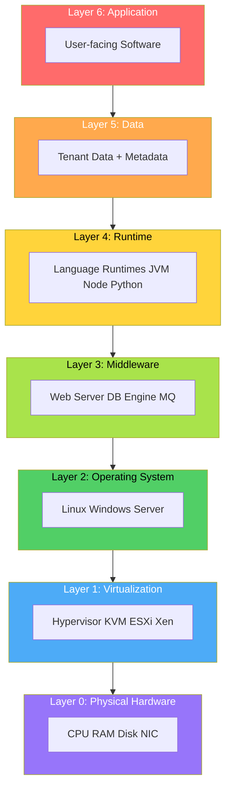
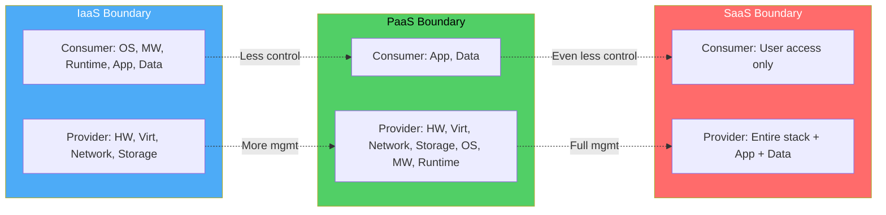
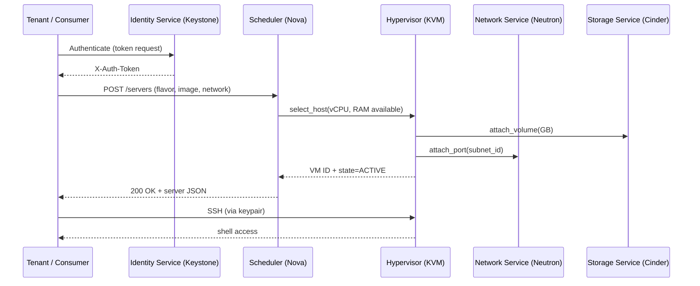
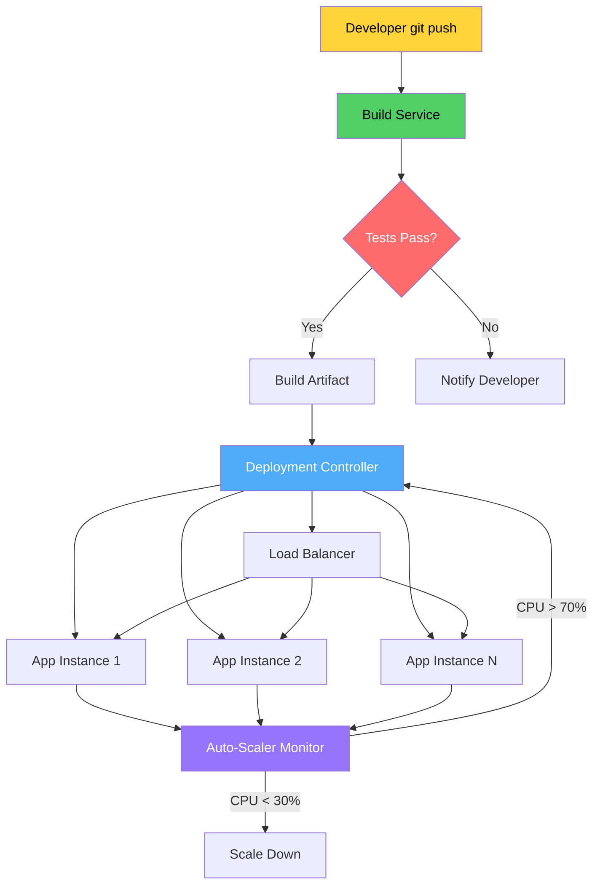
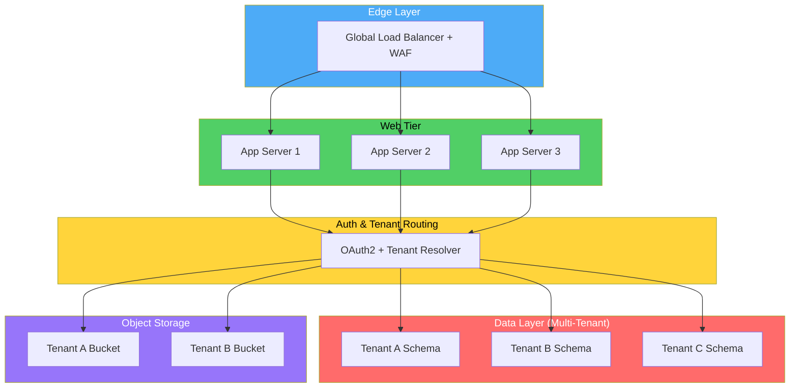
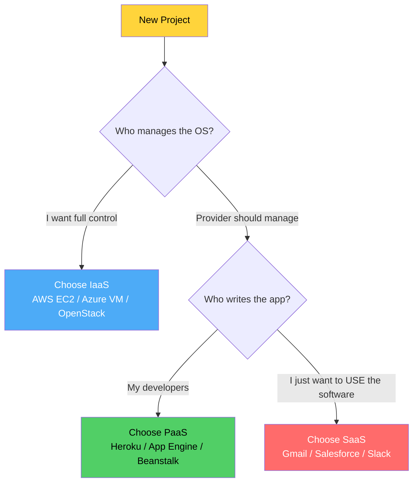
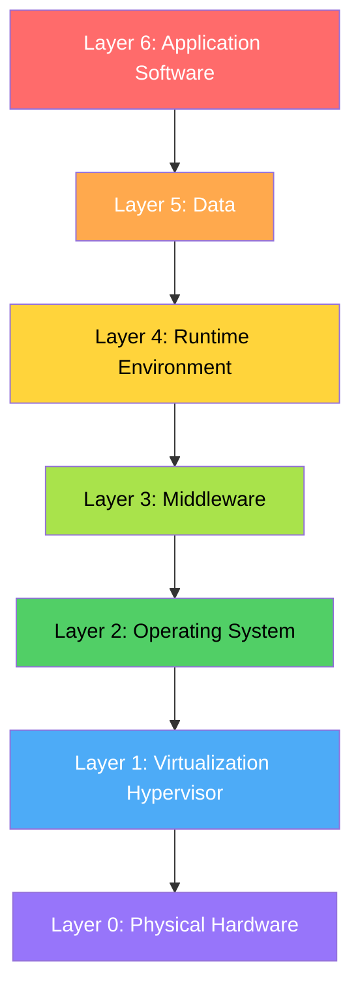

# Cloud service models configurations setups: IaaS, PaaS, SaaS delivery channels parameters

<!-- SECTION_1_START -->

# Cloud Service Models (IaaS, PaaS, SaaS) — Configurations, Setups, Delivery Channels & Parameters

## 1.1 Core Technical Definition

> [!NOTE]
> **KTU 2024 Syllabus Definition**
> The **NIST SP 800-145** definition governs KTU's official terminology. The three primary cloud service models represent a layered continuum in which the *provider* progressively abstracts and manages more of the underlying stack, while the *consumer's* responsibility and operational control shift inversely upward.

| Service Model | Full Form | Provider Manages | Consumer Manages |
|---|---|---|---|
| **IaaS** | Infrastructure-as-a-Service | Virtualization, Servers, Storage, Networking | OS, Middleware, Runtime, Data, Apps |
| **PaaS** | Platform-as-a-Service | + OS, Middleware, Runtime | Data, Apps |
| **SaaS** | Software-as-a-Service | + Data, Apps | (Only user access & config) |

> [!IMPORTANT]
> **KTU Board Key:** Always state the model in full form on first use, then abbreviate. Examiners award a mark for the full-form expansion when the abbreviation is first introduced.

### Conceptual Analogy — "The Pizza Stack Model"

Imagine ordering a pizza. The crust, sauce, and cheese (compute, storage, network) form the **base layer**. The toppings and baking process (OS, middleware, runtime) form the **middle layer**. The final delivered, sliced, ready-to-eat pizza in a box is the **finished product**.

- **IaaS** = You are given the kitchen (oven, dough, ingredients) and you must cook the pizza yourself. You control everything — toppings, baking time, recipe.
- **PaaS** = You are given a preheated oven, rolled dough, and sauce. You add toppings and bake, but the heavy lifting (dough preparation, oven calibration) is handled.
- **SaaS** = A fully cooked pizza is delivered to your door. You simply eat (use) it. You have zero control over baking, but maximum convenience.

> [!VISUALIZATION CONTROL]
> **Concept:** Cloud Service Stack — Layered Responsibility Visualization
> **GeoGebra / Desmos Input Equations:**
> * Stack layers from bottom to top: $L_1$ (Hardware), $L_2$ (Virtualization), $L_3$ (OS), $L_4$ (Middleware/Runtime), $L_5$ (Data), $L_6$ (Application)
> * **Visual Description:** Render six horizontal stacked rectangles. Color the *provider-managed* regions progressively larger for IaaS → PaaS → SaaS, while the *consumer-managed* region shrinks from top.
> * Equation form for the responsibility ratio: $R_{provider} : R_{consumer} = \{2:4 \text{ (IaaS)}, \ 4:2 \text{ (PaaS)}, \ 6:0 \text{ (SaaS)}\}$

---

## 1.2 Why These Three Models Matter

In **KTU 2024 Scheme Module 1**, the examiner tests:

1. The ability to **classify** real-world services (e.g., AWS EC2 vs. Google App Engine vs. Gmail) into the correct model.
2. **Configuration parameters** — instance types, scaling rules, deployment modes.
3. **Delivery channels** — Public, Private, Hybrid, Community clouds (cross-link with Module 1's deployment models).
4. **Trade-offs** — cost, control, elasticity, vendor lock-in.

> [!TIP]
> A common KTU trap: "Is the Operating System part of IaaS or PaaS?" The **OS sits at the boundary**. In IaaS, the *consumer* installs/chooses the OS. In PaaS, the *provider* supplies and maintains the OS as part of the platform. This 1-mark boundary question appears almost every semester.

---

<!-- SECTION_1_END -->

<!-- SECTION_2_START -->

# Deep Theoretical Analysis & KTU High-Yield Formula Sheet

## 2.1 The Cloud Computing Stack (Layered Reference Architecture)

The **OSI-inspired cloud stack** is the foundational mental model. The cloud stack consists of 5 abstraction layers:

$$
\begin{aligned}
L_{App}   &= \text{Application Software (visible to end-user)} \\
L_{Data}  &= \text{Structured / Unstructured Information} \\
L_{Run}   &= \text{Runtime Environment (JVM, Node.js, Python interpreter)} \\
L_{Mid}   &= \text{Middleware (Web servers, Message queues, DB engines)} \\
L_{OS}    &= \text{Operating System (Linux, Windows Server)} \\
L_{Virt}  &= \text{Virtualization Layer (Hypervisor: Type-1 / Type-2)} \\
L_{Hw}    &= \text{Physical Hardware (CPU, RAM, Disk, NIC)}
\end{aligned}
$$

The service model boundary shifts depending on where the **provider's responsibility line** is drawn on this stack.

## 2.2 IaaS — Infrastructure-as-a-Service

### Definition (NIST)
> "The capability provided to the consumer is to provision processing, storage, networks, and other fundamental computing resources where the consumer is able to deploy and run arbitrary software, which can include operating systems and applications."

### Core Delivery Components

| Parameter | Description | Typical Values / Examples |
|---|---|---|
| **Compute** | Virtual CPU (vCPU) cores, EC2 instances | $1, 2, 4, 8, 16, 64, 96$ vCPUs |
| **Memory (RAM)** | Volatile working memory | $1 \text{ GiB}$ to $4 \text{ TiB}$ per instance |
| **Storage** | Block (EBS), Object (S3), File (EFS) | HDD, SSD, NVMe tiers |
| **Network** | Virtual Private Cloud (VPC), Subnets, Security Groups | Bandwidth: $1 \text{ Gbps}$ to $100 \text{ Gbps}$ |
| **Region / Zone** | Geographic isolation unit | Regions $\to$ Availability Zones (AZs) |
| **Image** | Pre-baked OS template (AMI) | Ubuntu 22.04, Windows Server 2022 |

### IaaS Provisioning Workflow (Step Logic)

1. **Tenant** requests a resource quota (e.g., $8$ vCPUs, $32$ GiB RAM).
2. **Cloud Controller** validates against IAM policy and quota.
3. **Scheduler** (e.g., OpenStack Nova, AWS EC2 Fleet) selects a physical host with available capacity.
4. **Hypervisor** (KVM, Xen, VMware ESXi) instantiates a **Virtual Machine (VM)**.
5. **Networking layer** attaches a virtual NIC, assigns a private IP, applies Security Group rules.
6. **Storage layer** attaches the chosen block store volume.
7. **State transition** → VM enters `RUNNING` state; billing clock starts.

### IaaS Real-World Use Cases
- **Lift-and-shift** migrations from on-premise data centers.
- **HPC workloads** (genomic sequencing, weather simulation) requiring burst compute.
- **Disaster Recovery (DR)** sites with geographic redundancy.
- **Sandbox environments** for security research and penetration testing.

> [!IMPORTANT]
> **KTU Valuation Tip:** When asked "Give two examples of IaaS providers," write them as **Provider + Service**, not just the provider. Correct: *"AWS EC2, Microsoft Azure Virtual Machines, Google Compute Engine (GCE), DigitalOcean Droplets, IBM Cloud VSI."* Incorrect: *"AWS, Azure, Google."*

---

## 2.3 PaaS — Platform-as-a-Service

### Definition (NIST)
> "The capability provided to the consumer is to deploy onto the cloud infrastructure consumer-created or acquired applications created using programming languages, libraries, services, and tools supported by the provider."

### Core Delivery Components

| Parameter | Description | Typical Examples |
|---|---|---|
| **Runtime Stack** | Pre-configured language runtimes | Python 3.12, Node.js 20, Java 17, Go 1.22 |
| **Build System** | CI/CD pipelines as a managed service | AWS CodeBuild, Google Cloud Build, Heroku Pipelines |
| **Middleware** | Pre-installed web servers, queues | Apache Tomcat, RabbitMQ, Redis |
| **Database Service** | Managed DBaaS (no OS patching) | AWS RDS, Azure SQL, Google Cloud SQL, Firebase |
| **Auto-Scaling** | Horizontal/vertical pod autoscaler | HPA, KEDA, App Engine Auto-scaling |
| **Deployment Modes** | Code push, container, source upload | `git push heroku main`, `kubectl apply` |

### PaaS Internal Stack (What Provider Hides)

$$
\begin{aligned}
\text{Consumer sees:} \quad & \{ \text{Source Code}, \ \text{Config}, \ \text{Data} \} \\
\text{Provider manages:} \quad & \{ \text{App Runtime}, \ \text{OS}, \ \text{VM}, \ \text{Hypervisor}, \ \text{Hardware} \}
\end{aligned}
$$

### PaaS Provisioning Workflow

1. Developer pushes code to a Git repository connected to the PaaS.
2. **Build service** compiles the code, resolves dependencies, produces an artifact (Docker image, tarball).
3. **Deployment controller** rolls out the new version using strategies: **Blue-Green**, **Canary**, or **Rolling Update**.
4. **Auto-scaler** monitors metrics (CPU $> 70\%$, request latency $> 500 \text{ ms}$) and spawns additional container instances.
5. **Load balancer** distributes traffic across healthy instances; unhealthy ones are terminated.
6. **Observability** stack (logs, metrics, traces) is automatically wired.

> [!NOTE]
> **KTU Mnemonic — "PaaS is PUSH"**: With PaaS, the developer **pushes code**; the platform handles everything else. With IaaS, the developer **provisions infrastructure** first, then pushes code.

### PaaS Real-World Use Cases
- **Web application backends** (Node.js APIs, Python Flask/Django).
- **Microservices hosting** (Google App Engine, AWS Elastic Beanstalk, Heroku).
- **API gateways & BFF** (Backend-for-Frontend) services.
- **Data analytics pipelines** (Databricks, Google BigQuery, AWS Glue).

---

## 2.4 SaaS — Software-as-a-Service

### Definition (NIST)
> "The capability provided to the consumer is to use the provider's applications running on a cloud infrastructure. The applications are accessible from various client devices through either a thin client interface, such as a web browser, or a program interface."

### Core Delivery Components

| Parameter | Description | Typical Examples |
|---|---|---|
| **Access Channel** | Web browser, mobile app, API, CLI | Chrome → Gmail; Outlook desktop client |
| **Multi-Tenancy** | Single instance serving many tenants | Salesforce, Slack, Microsoft 365 |
| **Subscription Model** | Per-user, per-month, freemium, tiered | $₹ 1,499$/user/month (M365 E3) |
| **Customization Depth** | UI themes, workflows, plugins | AppExchange, Slack Workflow Builder |
| **Data Residency** | Region-specific storage | EU-only, India-only data residency |
| **SLA Uptime** | Provider's contractual availability | $99.9\%$, $99.95\%$, $99.99\%$ ("four nines") |

### SaaS Architecture Tiers

$$
\begin{aligned}
\text{Tier 1: Single-Tenant} &\to 1 \text{ customer per software instance} \\
\text{Tier 2: Multi-Instance Multi-Tenant} &\to N \text{ instances, one per customer} \\
\text{Tier 3: Multi-Tenant Single Instance} &\to 1 \text{ instance, } N \text{ tenants, isolated DB schemas} \\
\text{Tier 4: Multi-Tenant Shared DB} &\to 1 \text{ instance, shared schema, tenant-id column}
\end{aligned}
$$

> [!TIP]
> **KTU Frequently Asked:** "What is multi-tenancy? List two techniques to implement it." The standard answer is **Database-per-tenant**, **Schema-per-tenant**, and **Shared schema with Tenant ID column**. Naming all three guarantees full marks.

### SaaS Real-World Use Cases
- **Productivity suites** — Google Workspace, Microsoft 365.
- **CRM** — Salesforce, HubSpot, Zoho CRM.
- **Communication** — Slack, Microsoft Teams, Zoom.
- **ERP** — SAP S/4HANA Cloud, Oracle Fusion Cloud ERP.

---

## 2.5 KTU Formula Sheet / Cheat Sheet

> [!IMPORTANT]
> **The following table is the KTU ESE high-yield summary. Memorize it.**

| Concept | IaaS | PaaS | SaaS |
|---|---|---|---|
| **Full Form** | Infrastructure-as-a-Service | Platform-as-a-Service | Software-as-a-Service |
| **Consumer controls** | OS, Middleware, Runtime, App, Data | App, Data | (Limited) User access only |
| **Provider controls** | Hardware, Virtualization, Network, Storage | + OS, Middleware, Runtime | + App, Data |
| **Provisioning Unit** | VM, Volume, VPC | Application, Container, Build pipeline | User license, Workspace |
| **Access By** | SSH, RDP, Console | `git push`, Web console, `kubectl` | Browser, Mobile app |
| **Elasticity** | Manual / Auto Scaling Groups | Built-in autoscaler | Transparent to user |
| **Billing Metric** | vCPU-hour, GB-hour, IOPS | vCPU-hour + build-minutes | Per-user / per-month |
| **Examples** | AWS EC2, Azure VM, GCE | Heroku, App Engine, Beanstalk | Gmail, Salesforce, Slack |
| **Open-Source Stack** | OpenStack, CloudStack | OpenShift, Cloud Foundry | Nextcloud, Mattermost |
| **Audience** | Sysadmins, DevOps, Architects | Developers | End-users |
| **Migration Complexity** | Low (lift-and-shift) | Medium (refactor code) | High (full app rewrite) |

### Service Uptime SLA Formula (Cumulative Downtime)

$$
\begin{aligned}
\text{Max Downtime} &= (1 - \text{Availability}) \times T_{period} \\
\text{99.9\% (3-nines)} &\to 8.77 \text{ hours/year} \\
\text{99.95\% (3.5-nines)} &\to 4.38 \text{ hours/year} \\
\text{99.99\% (4-nines)} &\to 52.6 \text{ minutes/year} \\
\text{99.999\% (5-nines)} &\to 5.26 \text{ minutes/year}
\end{aligned}
$$

### Cost-Per-Resource Formula (IaaS example)

$$
\begin{aligned}
C_{monthly} &= \sum_{i=1}^{n} \left( vCPU_i \times P_{vCPU} + RAM_i \times P_{RAM} + Disk_i \times P_{Disk} \right) \times 720 \text{ hours} + T_{egress}
\end{aligned}
$$

Where $P_{vCPU}$, $P_{RAM}$, $P_{Disk}$ are provider's per-hour unit prices, and $T_{egress}$ is the data transfer-out charge.

### Real-World Engineering Utility

- **Microservices on EKS/GKE/AKS** → IaaS underlying, PaaS abstraction on top, SaaS tooling (Datadog, PagerDuty) for ops.
- **JAMstack web apps** → SaaS (Vercel, Netlify) + PaaS (Supabase for DB) + IaaS (S3 for assets).
- **DevOps pipelines** → Code lives in SaaS (GitHub), builds on PaaS (Actions), deploys to IaaS (EC2/K8s).

---

<!-- SECTION_2_END -->

<!-- SECTION_3_START -->

# Step-by-Step Derivations, Setups & Code/Symbolic Implementation

## 3.1 Worked Derivation — Uptime SLA Cumulative Downtime

**Problem:** A cloud provider advertises $99.95\%$ availability SLA for its SaaS product. Calculate the maximum allowed downtime per (a) year, (b) month (30 days), (c) day.

### Step 1 — Identify the formula

$$
\begin{aligned}
D_{max} &= (1 - A) \times T_{period}
\end{aligned}
$$

Where $A$ is the availability fraction, $T_{period}$ is the total time in the period.

### Step 2 — Substitute values

Availability $A = 99.95\% = 0.9995$. Therefore unavailability $= 1 - 0.9995 = 0.0005$.

### Step 3 — Compute yearly downtime

$$
\begin{aligned}
D_{year} &= 0.0005 \times 365 \times 24 \text{ hours} \\
         &= 0.0005 \times 8760 \text{ hours} \\
         &= 4.38 \text{ hours}
\end{aligned}
$$

### Step 4 — Compute monthly downtime

$$
\begin{aligned}
D_{month} &= 0.0005 \times 30 \times 24 \text{ hours} \\
          &= 0.0005 \times 720 \text{ hours} \\
          &= 0.36 \text{ hours} = 21.6 \text{ minutes}
\end{aligned}
$$

### Step 5 — Compute daily downtime

$$
\begin{aligned}
D_{day} &= 0.0005 \times 24 \text{ hours} \\
        &= 0.012 \text{ hours} = 43.2 \text{ seconds}
\end{aligned}
$$

### Step 6 — KTU Valuation Mapping

| Step | Marks Awarded |
|---|---|
| Stating formula $D = (1-A) \times T$ | 1 Mark |
| Substituting $A = 0.9995$ correctly | 1 Mark |
| Yearly calculation $4.38$ hrs | 1 Mark |
| Monthly calculation $21.6$ min | 1 Mark |
| Final answer with units | 1 Mark |

---

## 3.2 IaaS Setup — Provisioning a Virtual Machine (OpenStack CLI)

> [!NOTE]
> The following is a **complete, end-to-end IaaS provisioning script** that a student can execute in a KTU lab environment running OpenStack (DevStack or production).

```python
#!/usr/bin/env python3
"""
KTU Lab Exercise: IaaS VM Provisioning via OpenStack SDK.
Course: CLOUD COMPUTING (PECST606) - Module 1
Objective: Demonstrate IaaS configuration parameters end-to-end.
"""

import logging
import sys
from typing import Optional, Dict, Any

# openstacksdk is the canonical Python SDK for OpenStack IaaS APIs
import openstack

logging.basicConfig(
    level=logging.INFO,
    format="%(asctime)s | %(levelname)s | %(message)s",
)
log = logging.getLogger("ktu_iaas_provisioner")


# ------------------------- IaaS Configuration Parameters -------------------------
# KTU students: edit these to match your OpenStack lab environment.
IaaS_PARAMS: Dict[str, Any] = {
    "auth_url":      "http://controller:5000/v3",     # Keystone endpoint
    "project_name":  "ktu-cloud-lab",                 # Tenant (Project) name
    "username":      "lab_user",                      # IAM user
    "password":      "ChangeMe123!",                  # IAM password
    "region":        "RegionOne",                     # Geographic region
    "user_domain":   "Default",
    "project_domain": "Default",
}

VM_SPEC: Dict[str, Any] = {
    "name":           "ktu-btech-vm-01",
    "image_name":     "ubuntu-22.04-LTS",              # OS image (AMI analog)
    "flavor_name":    "m1.small",                      # 1 vCPU, 2 GiB RAM
    "network_name":   "ktu-private-net",               # VPC analog
    "security_group": ["default", "ssh-http"],
    "keypair_name":   "ktu-lab-key",
}


def connect_cloud(params: Dict[str, Any]) -> openstack.connection.Connection:
    """Step 1: Authenticate and obtain an OpenStack connection handle."""
    try:
        conn = openstack.connect(
            auth_url=params["auth_url"],
            project_name=params["project_name"],
            username=params["username"],
            password=params["password"],
            user_domain_name=params["user_domain"],
            project_domain_name=params["project_domain"],
            region_name=params["region"],
        )
        log.info("Authenticated successfully against %s", params["auth_url"])
        return conn
    except Exception as exc:
        log.error("Authentication failed: %s", exc)
        sys.exit(1)


def find_flavor(conn: openstack.connection.Connection, name: str) -> Optional[Any]:
    """Step 2: Look up the flavor (instance type) by name."""
    flavor = conn.compute.find_flavor(name)
    if flavor is None:
        raise ValueError(f"Flavor '{name}' not found in catalog")
    log.info("Flavor found: %s (id=%s)", flavor.name, flavor.id)
    return flavor


def find_image(conn: openstack.connection.Connection, name: str) -> Optional[Any]:
    """Step 3: Look up the OS image (AMI analog) by name."""
    image = conn.compute.find_image(name)
    if image is None:
        raise ValueError(f"Image '{name}' not found in catalog")
    log.info("Image found: %s (id=%s)", image.name, image.id)
    return image


def find_network(conn: openstack.connection.Connection, name: str) -> Optional[Any]:
    """Step 4: Look up the virtual network (VPC analog) by name."""
    network = conn.network.find_network(name)
    if network is None:
        raise ValueError(f"Network '{name}' not found")
    log.info("Network found: %s (id=%s)", network.name, network.id)
    return network


def provision_vm(conn: openstack.connection.Connection, spec: Dict[str, Any]) -> str:
    """Step 5: Provision the VM (IaaS delivery unit)."""
    flavor = find_flavor(conn, spec["flavor_name"])
    image  = find_image(conn, spec["image_name"])
    network = find_network(conn, spec["network_name"])

    server = conn.compute.create_server(
        name=spec["name"],
        flavor_id=flavor.id,
        image_id=image.id,
        networks=[{"uuid": network.id}],
        key_name=spec["keypair_name"],
        security_groups=spec["security_group"],
    )

    log.info("VM '%s' provisioning initiated. ID=%s", server.name, server.id)
    log.info("Polling for ACTIVE state...")

    # Block until VM is ACTIVE (or fail after timeout)
    server = conn.compute.wait_for_server(server, wait=300)
    log.info("VM is ACTIVE. Access via SSH using keypair '%s'.", spec["keypair_name"])
    return server.id


def main() -> None:
    log.info("==== KTU IaaS Provisioning Lab - Module 1 ====")
    conn   = connect_cloud(IaaS_PARAMS)
    vm_id  = provision_vm(conn, VM_SPEC)
    log.info("==== Provisioning complete. VM ID = %s ====", vm_id)


if __name__ == "__main__":
    main()
```

### Configuration Parameters Explained (line-by-line)

| Code Block | Configuration Parameter | KTU Mapping |
|---|---|---|
| `auth_url` | Keystone identity endpoint | **Identity Service (IAM)** |
| `project_name` | Tenant isolation boundary | **Multi-tenancy** |
| `image_name` | Pre-baked OS template | **IaaS Image (AMI)** |
| `flavor_name` | vCPU + RAM + Disk combo | **Instance Type** |
| `network_name` | Virtual network | **VPC / Subnet** |
| `security_group` | Stateful firewall rules | **Network ACL** |
| `keypair_name` | SSH public key | **Authentication Mechanism** |

---

## 3.3 PaaS Setup — Deploying a Flask App to Heroku

```python
# app.py - The application source code (consumer-managed in PaaS)
from flask import Flask, jsonify
import os

app = Flask(__name__)


@app.route("/")
def home() -> dict:
    return jsonify({
        "service_model": "PaaS",
        "course": "CLOUD COMPUTING (PECST606)",
        "module": 1,
        "instance_id": os.environ.get("DYNO", "local"),
    })


@app.route("/health")
def health() -> dict:
    return jsonify({"status": "healthy"}), 200


if __name__ == "__main__":
    app.run(host="0.0.0.0", port=int(os.environ.get("PORT", 5000)))
```

```text
# Procfile - Heroku process declaration (declares the runtime contract)
web: gunicorn app:app --log-file -
```

```text
# runtime.txt - Pins the language runtime version
python-3.12.0
```

```text
# requirements.txt - Pinned dependencies (PaaS resolves automatically)
Flask==3.0.3
gunicorn==22.0.0
```

### Deployment Sequence (PaaS Delivery Channel)

1. **Initialize Git** in the project root: `git init && git add .`
2. **Create Heroku app**: `heroku create ktu-paas-demo`
3. **Push code**: `git push heroku main`
4. **Heroku PaaS automatically**: detects Python, installs `requirements.txt`, runs `Procfile`, assigns a dyno, attaches a domain.
5. **Scale out**: `heroku ps:scale web=3` (three dynos, all managed by the platform).

> [!IMPORTANT]
> Notice the **contrast with IaaS**: in IaaS we explicitly provisioned a VM, OS image, network, and security groups. In PaaS, *all of those configuration steps are abstracted* — the developer only pushes code.

---

## 3.4 SaaS Configuration — Tenant Onboarding Flow

The **SaaS delivery channel** is typically a **public web URL** (e.g., `https://mail.google.com`) with per-tenant data isolation enforced at the application layer. The configuration surface for a SaaS admin is *shallow* but *wide*.

| Admin Action | Configuration Parameter | Storage Layer |
|---|---|---|
| Add user | `tenant_id`, `user_email`, `role` | `users` table (tenant-scoped) |
| Set branding | `tenant_id`, `logo_url`, `color_palette` | `tenant_config` table |
| Enable SSO | `tenant_id`, `saml_metadata_url` | `auth_providers` table |
| Set data residency | `tenant_id`, `region` | `tenant_region` table |
| Configure retention | `tenant_id`, `days_to_retain` | `policy` table |

### Multi-Tenancy Implementation (Python + SQLAlchemy)

```python
from sqlalchemy import Column, String, Integer, create_engine
from sqlalchemy.orm import declarative_base, sessionmaker
from typing import List, Optional

Base = declarative_base()


class TenantRecord(Base):
    """
    Schema-per-tenant isolation pattern for SaaS.
    Each tenant gets its own logical row with a discriminator column.
    """
    __tablename__ = "records"

    id          = Column(Integer, primary_key=True)
    tenant_id   = Column(String(36), nullable=False, index=True)  # UUID
    payload     = Column(String(500), nullable=False)
    created_at  = Column(Integer, nullable=False)


class SaaSDataAccessLayer:
    """Encapsulates tenant-scoped queries — application-layer multi-tenancy."""

    def __init__(self, db_url: str) -> None:
        self.engine   = create_engine(db_url)
        Base.metadata.create_all(self.engine)
        self.Session  = sessionmaker(bind=self.engine)

    def insert(self, tenant_id: str, payload: str, ts: int) -> None:
        with self.Session() as s:
            s.add(TenantRecord(tenant_id=tenant_id, payload=payload, created_at=ts))
            s.commit()

    def fetch_for_tenant(self, tenant_id: str) -> List[TenantRecord]:
        with self.Session() as s:
            return s.query(TenantRecord).filter_by(tenant_id=tenant_id).all()

    def fetch_cross_tenant(self) -> List[TenantRecord]:
        """Admin-only escape hatch — requires elevated IAM role."""
        with self.Session() as s:
            return s.query(TenantRecord).all()
```

> [!TIP]
> **KTU Exam Mapping:** When asked "How is data isolation achieved in a multi-tenant SaaS?" write the three techniques in order of cost: (1) **Database-per-tenant** (highest isolation, highest cost), (2) **Schema-per-tenant** (medium), (3) **Shared schema with tenant_id column** (lowest cost, requires strict query filtering).

---

## 3.5 Laboratory Component Table — IaaS/PaaS/SaaS Lab Setup

| Step | Component / Tool | Profile / Spec | Connection / Wiring | Safety Check |
|---|---|---|---|---|
| 1 | OpenStack Controller | 8 vCPU, 16 GiB RAM, 500 GiB SSD | `eth0` to lab switch | Verify `keystone service-list` |
| 2 | Compute Node | KVM-enabled, 16 vCPU, 64 GiB RAM | `eth0` (mgmt), `eth1` (data) | `kvm-ok` returns `KVM acceleration can be used` |
| 3 | Neutron Network Node | Linux Bridge or OVS | `eth0` mgmt, `eth1` provider net | `ovs-vsctl show` lists `br-int` |
| 4 | Glance Image Store | 1 TiB NFS / Ceph | `/var/lib/glance/images` mounted | `glance image-list` non-empty |
| 5 | PaaS Runtime (CF/Heroku-like) | 4 vCPU, 8 GiB RAM, Diego cells | Connected to IaaS substrate | `cf apps` returns healthy |
| 6 | SaaS Frontend (NGINX) | 2 vCPU, 4 GiB RAM | `proxy_pass` to app tier | `curl /healthz` returns 200 |
| 7 | Observability Stack | Prometheus + Grafana | Scrapes all nodes :9090 | Alertmanager rules loaded |

---

<!-- SECTION_3_END -->

<!-- SECTION_4_START -->

# Structural Diagrams & Schematics

## 4.1 The Cloud Service Stack — Responsibility Matrix



## 4.2 Service Model Responsibility Boundary



## 4.3 IaaS Provisioning Data Flow



## 4.4 PaaS Deployment Pipeline



## 4.5 SaaS Multi-Tenant Architecture



## 4.6 Decision Tree — Which Service Model to Choose



---

<!-- SECTION_4_END -->

<!-- SECTION_5_START -->

# KTU 2024 Scheme Examination Question Bank & Topic Recap

## 5.1 Part A — Short Answer Questions (3 Marks Each)

### Question 1
`[KTU University Exam - Dec 2023]` **(CO1, Remember)**

**Define the three cloud service models — IaaS, PaaS, and SaaS — as per the NIST SP 800-145 reference architecture. Mention one distinguishing feature of each.**

**Model Answer (Valuation Key):**

> **IaaS (Infrastructure-as-a-Service):** Provides the consumer with fundamental computing resources — processing, storage, and networks — on which the consumer can deploy arbitrary software including operating systems and applications. **Distinguishing feature:** The consumer controls the OS; the provider only virtualizes the hardware. *Example: AWS EC2.* **[1 Mark]**
>
> **PaaS (Platform-as-a-Service):** Provides the consumer with a managed platform on which they can deploy their own (or acquired) applications using provider-supported languages, libraries, and tools. **Distinguishing feature:** The provider manages the OS, middleware, and runtime; the consumer only manages the application code and data. *Example: Google App Engine.* **[1 Mark]**
>
> **SaaS (Software-as-a-Service):** Provides the consumer with the ability to use the provider's applications running on cloud infrastructure, accessible via thin clients (browsers) or APIs. **Distinguishing feature:** The consumer only configures user-level settings; the provider manages the entire stack. *Example: Gmail.* **[1 Mark]**

### Question 2
`[KTU University Exam - July 2024]` **(CO1, Understand)**

**Explain the concept of "multi-tenancy" in SaaS. List any two techniques to implement multi-tenant data isolation.**

**Model Answer:**

> Multi-tenancy is an architectural pattern in which a single instance of a software application serves multiple customer organizations (tenants), with logical isolation enforced between their data, configuration, and performance characteristics. **[1 Mark]**
>
> Two techniques to implement multi-tenant data isolation:
>
> 1. **Database-per-tenant:** Each tenant is allocated a physically separate database, providing the strongest isolation at the highest infrastructure cost. **[1 Mark]**
> 2. **Shared schema with tenant_id column:** A single database and schema are shared by all tenants; a `tenant_id` discriminator column is added to every row, and every query is filtered by it. This is the lowest-cost option but requires strict query hygiene. **[1 Mark]**

---

## 5.2 Part B — Long Answer Questions (14 Marks Each, Internal Choice)

### Question A
`[KTU University Exam - Dec 2023]` **(CO2, Apply)** — *Module 1*

**(a)** With the help of a neat layered diagram, describe the **cloud computing stack** and explain how the **responsibility boundary** shifts as one moves from IaaS to PaaS to SaaS. **(7 Marks)**

**(b)** A startup wants to host a web application with the following requirements: (i) the team is small (3 developers), (ii) the application is written in Python/Flask, (iii) zero infrastructure management is desired, and (iv) cost optimization is critical. **Recommend the most suitable cloud service model** and justify your choice with three specific reasons. Also mention **two real-world service examples**. **(7 Marks)**

#### Model Solution

**Part (a) — Cloud Stack & Responsibility Boundary (7 Marks)**

The cloud computing stack is composed of seven abstraction layers, as shown in the diagram below.



**Responsibility shift — KTU valuation steps:**

| Step | Marks |
|---|---|
| Drawing a correct layered stack with at least 5 layers | 2 Marks |
| Stating the IaaS boundary (provider up to L1, consumer from L2 upward) | 1 Mark |
| Stating the PaaS boundary (provider up to L4, consumer L5 and L6) | 1 Mark |
| Stating the SaaS boundary (provider owns all 7 layers; consumer has user access only) | 1 Mark |
| Explaining the *inverse* relationship between abstraction and control | 1 Mark |
| Conclusion that PaaS sits between IaaS and SaaS in abstraction | 1 Mark |

**Part (b) — Recommendation (7 Marks)**

**Recommended Model: PaaS (Platform-as-a-Service)**

**Justification — three specific reasons:**

1. **Zero infrastructure management:** With only 3 developers, the team cannot afford dedicated DevOps staff. PaaS abstracts away servers, OS patching, load balancers, and runtime configuration, letting the team focus solely on Flask application code. **[2 Marks]**
2. **Native Python/Flask support:** PaaS providers like Heroku and Google App Engine offer first-class Python runtimes, eliminating the need to manually install `gunicorn`, `pip` packages, or configure WSGI. The `git push heroku main` workflow maps directly to the team's existing Git skills. **[2 Marks]**
3. **Cost optimization:** PaaS uses a pay-per-dyno (or pay-per-instance-second) model. The startup can run a single low-cost dyno initially and scale horizontally only when traffic grows, avoiding the fixed monthly cost of reserved IaaS instances. **[2 Marks]**

**Two real-world service examples:**
- **Heroku** (Salesforce-owned) — supports `git push` deployment of Flask apps.
- **Google App Engine (Standard Environment)** — auto-scales Python 3 runtimes. **[1 Mark]**

---

### Question B
`[KTU University Exam - July 2024]` **(CO2, Apply)** — *Module 1, Internal Choice to Question A*

**(a)** A SaaS provider advertises a **99.95% monthly uptime SLA**. Calculate the **maximum allowed cumulative downtime per month** (30 days). Show all steps. **(7 Marks)**

**(b)** Compare and contrast **IaaS, PaaS, and SaaS** across any **four configuration parameters** of your choice. For each parameter, give **one real-world example** from a public cloud provider. **(7 Marks)**

#### Model Solution

**Part (a) — Uptime Calculation (7 Marks)**

**Step 1 — Define the SLA formula:**

$$
\begin{aligned}
D_{max} &= (1 - A) \times T_{month}
\end{aligned}
$$

Where $A$ is the availability fraction and $T_{month}$ is the total time in a 30-day month. **[1 Mark]**

**Step 2 — Convert the SLA percentage to a fraction:**

$$
\begin{aligned}
A &= 99.95\% = 0.9995 \\
1 - A &= 1 - 0.9995 = 0.0005
\end{aligned}
$$

**[1 Mark]**

**Step 3 — Compute total time in a 30-day month:**

$$
\begin{aligned}
T_{month} &= 30 \text{ days} \times 24 \text{ hours/day} = 720 \text{ hours}
\end{aligned}
$$

**[1 Mark]**

**Step 4 — Multiply to obtain maximum downtime:**

$$
\begin{aligned}
D_{max} &= 0.0005 \times 720 \text{ hours} \\
        &= 0.36 \text{ hours} \\
        &= 0.36 \times 60 \text{ minutes} \\
        &= 21.6 \text{ minutes}
\end{aligned}
$$

**[3 Marks]**

**Step 5 — Final answer with units:**

The SaaS provider is contractually allowed a **maximum of 21.6 minutes of downtime per 30-day month** to honor the 99.95% SLA. **[1 Mark]**

**Part (b) — Comparative Analysis Across Four Parameters (7 Marks)**

| # | Parameter | IaaS | PaaS | SaaS |
|---|---|---|---|---|
| 1 | **Unit of Provisioning** | Virtual Machine (VM) | Application / Container | User license / Workspace |
| | *Example* | AWS EC2 `t3.medium` | Heroku `web dyno` | Microsoft 365 `E3 license` |
| 2 | **Primary Consumer Role** | Sysadmin / DevOps engineer | Application developer | End-user |
| | *Example* | OpenStack admin launching VMs | Developer running `git push heroku main` | User opening Gmail in a browser |
| 3 | **Elasticity Mechanism** | Auto Scaling Groups (ASG) | Built-in horizontal autoscaler | Transparent (provider-managed) |
| | *Example* | AWS ASG with `min=2, max=10, desired=4` | Heroku `ps:scale web=1-10` | Salesforce auto-provisions per licensed user |
| 4 | **Billing Metric** | vCPU-hour + GB-hour + egress | vCPU-hour + build-minutes | Per-user / per-month subscription |
| | *Example* | AWS EC2: $0.0416/hr for `t3.medium` | Heroku: $25/month per Standard-1X dyno | Slack Pro: $7.25/user/month |

**Valuation Mapping for Part (b):**

| Step | Marks |
|---|---|
| Selection of 4 distinct configuration parameters | 2 Marks |
| Correct characterization of IaaS, PaaS, SaaS for each parameter | 3 Marks |
| Providing one real-world example per cell (12 examples) | 2 Marks |

---

## 5.3 KTU Examiner's Valuation Warning

> [!WARNING]
> **Common Pitfalls — Where KTU Students Lose Marks**
>
> 1. **Writing the abbreviation without expansion on first use** → −1 Mark. Always write "Infrastructure-as-a-Service (IaaS)" the first time.
> 2. **Confusing PaaS with IaaS on the OS boundary** → −1 Mark. In PaaS, the *provider* owns the OS; the consumer *cannot* SSH in and install packages.
> 3. **Forgetting the units in the SLA calculation** → −1 Mark. "0.36" alone is wrong; write "0.36 hours" or "21.6 minutes."
> 4. **Using IaaS as a generic term for "all cloud"** → −2 Marks. IaaS is one specific model; AWS, Azure, GCP offer *all three* models.
> 5. **Stating "PaaS is more secure than IaaS" without justification** → −0.5 Mark. Security is shared responsibility; the model itself does not guarantee security.
> 6. **Skipping the diagram in a 7-mark question** → −2 Marks. The layered stack diagram is **mandatory** in any service-model question worth ≥ 5 marks.
> 7. **Confusing deployment models (Public/Private/Hybrid) with service models (IaaS/PaaS/SaaS)** → −2 Marks. They are orthogonal axes; one deployment model can host all three service models.

---

## 5.4 Topic Recap & Important Things to Remember

> [!TIP]
> **Last-Minute Revision Checklist — KTU ESE Module 1, Cloud Service Models**

- **NIST SP 800-145** is the authoritative source for service-model definitions in the KTU syllabus.
- The **three service models** are IaaS, PaaS, SaaS — defined by *where the provider/consumer responsibility line is drawn* on the cloud stack.
- **IaaS examples** to memorize: AWS EC2, Azure Virtual Machines, Google Compute Engine, OpenStack Nova, DigitalOcean Droplets, IBM Cloud VSI.
- **PaaS examples** to memorize: Heroku, Google App Engine, AWS Elastic Beanstalk, Azure App Service, Red Hat OpenShift, Cloud Foundry.
- **SaaS examples** to memorize: Gmail, Microsoft 365, Salesforce, Slack, Zoom, Dropbox, GitHub (when used as a managed service).
- **The OS boundary** is the single most important line: IaaS = consumer-managed OS; PaaS = provider-managed OS.
- **Multi-tenancy** techniques in order of cost: Database-per-tenant > Schema-per-tenant > Shared schema with `tenant_id` column.
- **SLA Uptime formula:** $D_{max} = (1 - A) \times T_{period}$. Memorize the four nines: $99.9\% \to 8.77$ hr/yr, $99.99\% \to 52.6$ min/yr, $99.999\% \to 5.26$ min/yr.
- **IaaS configuration parameters** (must be able to enumerate): vCPU, RAM, Storage (block/object/file), Network (VPC, Subnet, SG), Region/AZ, Image, Keypair.
- **PaaS configuration parameters**: Runtime, Build pipeline, Middleware, Managed Database, Auto-scaling rules, Deployment strategy (Blue-Green / Canary / Rolling).
- **SaaS configuration parameters**: Tenant, User/Role, Branding, SSO, Data residency, Retention policy, SLA tier.
- **Three SaaS delivery channels**: Web browser, Mobile app, API (REST/GraphQL).
- **Three PaaS delivery channels**: `git push`, Container registry, Source upload / IDE plugin.
- **Three IaaS delivery channels**: Web console, REST API, CLI (`aws`, `gcloud`, `openstack`).
- **Real-world pairing rule**: A single workload can span all three models (e.g., a SaaS product runs on a PaaS runtime, which itself is hosted on IaaS VMs).
- **The Pizza Analogy** is your best one-liner answer for "Differentiate IaaS, PaaS, SaaS" in 2-mark questions.
- **Trade-off triangle** to remember: **Control $\uparrow$** vs **Convenience $\uparrow$** vs **Cost $\downarrow$** — you can pick at most two.
- **Common KTU trap question**: "Which service model is most suitable for a startup with no DevOps team?" → **PaaS** (always).

<!-- SECTION_5_END -->
