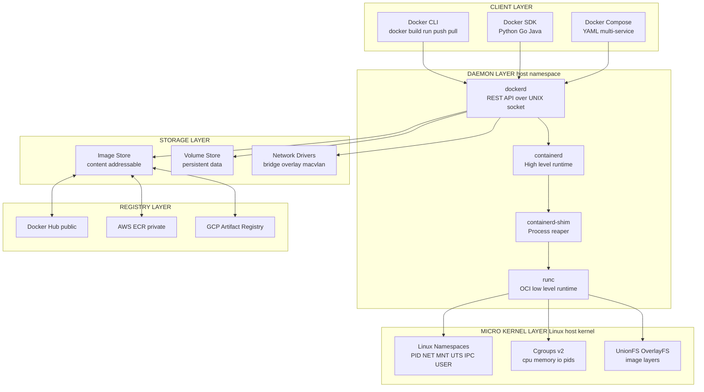
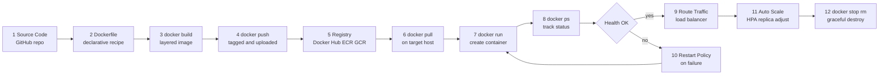
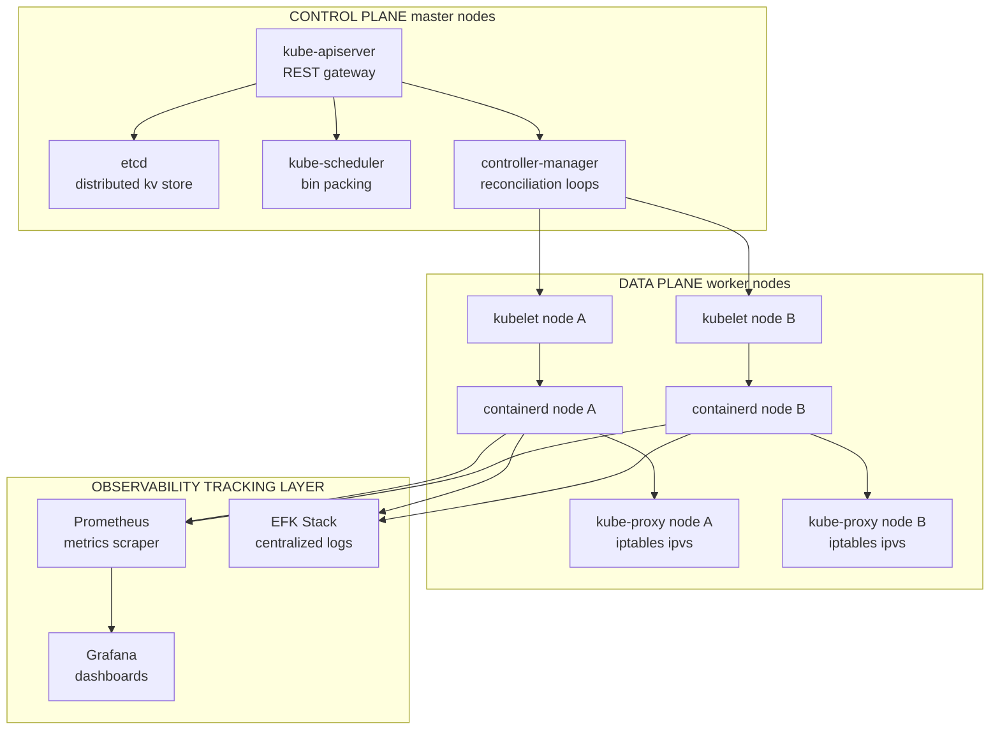

# Containerization workflows tracking platforms Docker micro-kernel layouts parameters

<!-- SECTION_1_START -->

# Containerization Workflows, Tracking Platforms, Docker Micro-Kernel Layouts & Parameters

## 1. Core Technical Definition & Intuitive Overview

### 1.1 What is Containerization?

**Containerization** is a lightweight OS-level virtualization paradigm in which an application and its entire dependency tree (binaries, libraries, configuration files, runtime engines) are packaged into a single, portable, executable image. Unlike hypervisor-based virtualization, containers **share the host operating system kernel** but execute inside isolated user-space instances created through Linux kernel primitives (namespaces and control groups).

$$ \text{Container} = \{\text{App Code}\} \cup \{\text{Libraries}\} \cup \{\text{Dependencies}\} \cup \{\text{Config}\} \cup \{\text{Runtime}\} $$

> [!IMPORTANT]
> **KTU 2024 Scheme Definition (PECST606 / Module 1):** *"Containerization is a method of packaging, distributing, and running applications inside isolated, lightweight execution environments that leverage the host OS kernel via namespaces, control groups (cgroups), and union-mounted file systems, enabling rapid deployment, horizontal scalability, and infrastructure abstraction in cloud platforms."*

### 1.2 What is Docker?

**Docker** is an open-source *Container-as-a-Service* (CaaS) platform that automates the lifecycle of Linux containers through a client–server architecture. It introduced the standardized image format (OCI - Open Container Initiative) and the declarative `Dockerfile` workflow.

### 1.3 What is a Container Tracking / Orchestration Platform?

A **Container Tracking \& Orchestration Platform** is a control-plane system responsible for automated deployment, scaling, health monitoring, networking, and rolling updates of container clusters. Industry examples include **Kubernetes (K8s)**, **Docker Swarm**, **Apache Mesos**, **Amazon ECS**, and **Google Kubernetes Engine (GKE)**.

### 1.4 The Micro-Kernel Layout

The **micro-kernel layout** in containerization refers to the minimal host-kernel exposure model. Containers do **not** carry a Guest OS. They borrow the host kernel's **system call interface (SCI)** through three foundational subsystems:

| Layer | Kernel Feature | Function |
|---|---|---|
| 1 | **Linux Namespaces** | Process, Network, Mount, UTS, IPC, User isolation |
| 2 | **Control Groups (cgroups v2)** | Resource quotas \vert limits \vert accounting |
| 3 | **Union File Systems** | Layered image stacking (OverlayFS, AUFS) |

### 1.5 Real-World Analogy — *The Shipping Container Revolution*

Before 1956, cargo was loaded by hand. **Malcom McLean** invented standardized steel shipping containers, and global logistics exploded. Software engineering had the *exact* same problem before 2013: code that worked on a developer's laptop crashed on production servers. **Docker** is to software what McLean's steel box is to freight — *one standardized unit, any ship (host), any port (cloud), zero modification*.

> [!NOTE]
> **Standard Engineering Benchmarks (Industry Metrics):**
> * Image footprint: **\approx 150 MB** (Alpine base) vs **\approx 6 GB** (typical VM)
> * Cold-start latency: **< 1 second** vs **30\text{--}60 seconds** (VM boot)
> * Density on a single host: **100+ containers** vs **10\text{--}20 VMs** (same hardware)
> * Native API surface: **Linux syscalls** vs **emulated hardware**

> [!VISUALIZATION CONTROL]
> **Concept:** Container Memory Limit Enforcement Curve
> **Desmos Input Equations:**
> * `f(t) = 512 * (1 - exp(-0.4 * t))` *(Working-Set Memory Growth)*
> * `g(t) = 512` *(Hard Memory Limit in MB)*
> * `h(t) = 0.85 * 512` *(Soft Limit / OOM Threshold)*
> **Visual Description:** A concave growth curve `f(t)` rising asymptotically toward the horizontal ceiling `g(t)`. The `h(t)` line acts as a *soft-kill threshold* — when the working-set crosses it, the kernel's OOM (Out-Of-Memory) killer reclaims the container, mimicking Kubernetes' eviction policy.

---

<!-- SECTION_1_END -->

<!-- SECTION_2_START -->

# 2. Deep Theoretical Analysis & KTU High-Yield Formula Sheet

## 2.1 The Docker Three-Pillar Architecture

Docker's runtime is decomposed into three orthogonal subsystems. Understanding the separation of concerns is *critical* for KTU Module 1.

### Pillar 1 — The Image (Build Artifact)

* An image is a **read-only, layered, immutable** template.
* Composed via `Dockerfile` directives (`FROM`, `RUN`, `COPY`, `CMD`).
* Each instruction creates a new **layer** stored as a content-addressable tar diff.
* Distributed via **Registries** (Docker Hub, AWS ECR, Azure ACR, GCR).

### Pillar 2 — The Container (Runtime Instance)

* A container is a **writable, runnable instance** of an image.
* Created by attaching a thin *writable layer* (copy-on-write) on top of the image.
* Identity = `Container ID` (SHA-256 hash, 256-bit).

### Pillar 3 — The Registry (Distribution Hub)

* A **centralized, versioned, replicated** image repository.
* Supports public and private namespaces.
* Enables *immutable, reproducible deployment* via image digests.

## 2.2 Micro-Kernel Subsystem — The Isolation Triad

### (a) Linux Namespaces — *What a container can SEE*

Each namespace type wraps a specific global system resource so the container perceives a *virtualized view*.

| Namespace | Flag | Isolates |
|---|---|---|
| `PID` | `CLONE_NEWPID` | Process IDs |
| `NET` | `CLONE_NEWNET` | Network interfaces, ports, routing |
| `MNT` | `CLONE_NEWNS` | Mount points, filesystems |
| `UTS` | `CLONE_NEWUTS` | Hostname, domain name |
| `IPC` | `CLONE_NEWIPC` | Inter-process communication (SysV, POSIX) |
| `USER` | `CLONE_NEWUSER` | UID / GID mapping |

### (b) Control Groups (cgroups v2) — *What a container can CONSUME*

Cgroups enforce **hard quotas** on the resources a container is allowed to consume. They form the **enforcement plane** of the micro-kernel layout.

### (c) Union File Systems — *How layers compose*

A **UnionFS** (OverlayFS) merges multiple directories (layers) into a single coherent view through three operations:
1. **Copy-on-Write (CoW)** — efficient file creation
2. **Layer Caching** — pull once, reuse everywhere
3. **Diff Storage** — only the delta is persisted

## 2.3 The Tracking / Orchestration Plane

Modern cloud platforms use **declarative state management** where the user *describes the desired state* and the orchestrator *converges* the cluster to it.

| Platform | Scheduler | Strength |
|---|---|---|
| **Kubernetes** | Pluggable (default: kube-scheduler) | Industry standard, self-healing |
| **Docker Swarm** | Built-in Raft consensus | Simplicity, native Docker integration |
| **Apache Mesos** | Two-level (Marathon/Chronos) | Massive scale (10K+ nodes) |
| **Amazon ECS** | AWS-proprietary | Tight AWS IAM integration |
| **HashiCorp Nomad** | Bin-packing, spread | Multi-runtime (containers + JVM + binaries) |

## 2.4 KTU Formula Sheet — *Containerization Parameters*

| # | Parameter | Formula / Expression | Unit | Engineering Use |
|---|---|---|---|---|
| 1 | **CPU Share** of container $C_i$ | $W_i^{cpu} = \dfrac{s_i}{\sum_{j=1}^{n} s_j} \times C_{total}$ | Ratio (0\text{--}1) | Weighted fair scheduling |
| 2 | **Memory Hard Limit** | $M_{limit} \geq M_{heap} + M_{stack} + M_{off\text{-}heap}$ | Bytes (MiB, GiB) | OOM-kill threshold |
| 3 | **OOM Eviction Time** | $t_{kill} = \dfrac{M_{limit} - M_{used}}{R_{leak}}$ | Seconds | Pre-mortem diagnosis |
| 4 | **Replica Count (HPA)** | $R_{desired} = \left\lceil R_{cur} \times \dfrac{M_{cur}}{T_{target}} \right\rceil$ | Integer | Horizontal Pod Autoscaler |
| 5 | **Image Pull Throughput** | $T_{pull} = \dfrac{S_{image}}{B_{net} - B_{overhead}}$ | MB/s | Registry Sizing |
| 6 | **Storage I/O Quota** | $IOPS_{cap} = B_{device} \times F_{weight}$ | ops/s | Disk throttling |
| 7 | **Container Density** | $\rho = \dfrac{N_{containers}}{Cores_{host}}$ | Containers / core | Capacity planning |
| 8 | **Build Cache Hit Ratio** | $H_{cache} = \dfrac{L_{hit}}{L_{total}}$ | Ratio (0\text{--}1) | CI/CD optimization |
| 9 | **Network Bandwidth** | $BW_i = \dfrac{N_i}{\sum_{j=1}^{k} N_j} \times BW_{link}$ | Mbps | QoS via tc/netem |
| 10 | **Cold-Start Latency** | $L_{start} = t_{image} + t_{runtime} + t_{app}$ | ms | Serverless SLAs |

> [!NOTE]
> **Real-World Cloud Engineering Utility:** These parameters are *literally* the inputs to `docker run -m 512m --cpus=0.5 --pids-limit=200 ...` and the corresponding Kubernetes `resources.limits` and `resources.requests` blocks. Mastering them is essential for production-grade cluster tuning in **AWS EKS**, **Azure AKS**, and **GCP GKE**.

---

<!-- SECTION_2_END -->

<!-- SECTION_3_START -->

# 3. Step-by-Step Derivations, Code & Symbolic Implementation

## 3.1 Derivation: Weighted CPU-Share Allocation in Cgroups

**Problem Context.** A host has $C_{total} = 8$ CPU cores. Three containers $C_1, C_2, C_3$ are launched with cgroup CPU shares $s_1 = 1024, s_2 = 2048, s_3 = 512$. Compute the *effective CPU allocation* under saturation.

### Step 1 — Sum the weight pool

The kernel scheduler treats shares as *relative weights*. The total weight pool is:

$$ S_{total} = s_1 + s_2 + s_3 = 1024 + 2048 + 512 = 3584 $$

### Step 2 — Compute the per-container fraction

Apply the CPU-share formula from the cheat-sheet:

$$ W_i^{cpu} = \dfrac{s_i}{S_{total}} \times C_{total} $$

### Step 3 — Evaluate $W_1^{cpu}$

$$ W_1^{cpu} = \dfrac{1024}{3584} \times 8 = 0.2857 \times 8 = 2.2857 \text{ cores} $$

### Step 4 — Evaluate $W_2^{cpu}$

$$ W_2^{cpu} = \dfrac{2048}{3584} \times 8 = 0.5714 \times 8 = 4.5714 \text{ cores} $$

### Step 5 — Evaluate $W_3^{cpu}$

$$ W_3^{cpu} = \dfrac{512}{3584} \times 8 = 0.1429 \times 8 = 1.1429 \text{ cores} $$

### Step 6 — Validate conservation

$$ \sum_{i=1}^{3} W_i^{cpu} = 2.2857 + 4.5714 + 1.1429 = 8.0000 \text{ cores} $$

The share model **conserves CPU** exactly, satisfying the conservation law. *This is a KTU-favourite 7-mark question.*

> [!NOTE]
> **Conversion Logic:** Shares are *relative*, not absolute. Doubling all shares does nothing. Only ratios matter. This is why Kubernetes' `cpu.shares = 1024` (1 vCPU equivalent) is the de-facto standard baseline.

## 3.2 Derivation: Horizontal Pod Autoscaler (HPA) Replica Count

**Problem Context.** A Deployment has $R_{cur} = 4$ replicas. Current average CPU utilization $M_{cur} = 80\%$. Target utilization $T_{target} = 50\%$. Compute the new desired replica count.

### Step 1 — Apply the HPA formula

$$ R_{desired} = \left\lceil R_{cur} \times \dfrac{M_{cur}}{T_{target}} \right\rceil $$

### Step 2 — Substitute

$$ R_{desired} = \left\lceil 4 \times \dfrac{0.80}{0.50} \right\rceil = \lceil 4 \times 1.6 \rceil = \lceil 6.4 \rceil = 7 $$

### Step 3 — Interpret

The autoscaler spins up **3 additional pods** to converge CPU utilization toward the 50% target. The HPA controller's reconciliation loop runs every **15 seconds** by default.

## 3.3 Implementation: A Production-Ready Dockerfile

The following `Dockerfile` implements a **multi-stage build** (Section 3.3.1) and a **container runtime configuration** (Section 3.3.2).

### 3.3.1 Dockerfile (Multi-Stage Python Web App)

```dockerfile
# =========================================================================
# Stage 1: BUILDER  -- contains compilers, dev headers (DISCARDED in final)
# =========================================================================
FROM python:3.12-slim AS builder

# Working directory inside the image
WORKDIR /opt/build

# Install build-time dependencies first for layer caching
COPY requirements.txt .
RUN pip install --no-cache-dir --user -r requirements.txt

# Copy the source
COPY app/ ./app/

# =========================================================================
# Stage 2: RUNTIME  -- minimal base, copy only artifacts from builder
# =========================================================================
FROM python:3.12-alpine AS runtime

# OCI Labels for image tracking & metadata
LABEL org.opencontainers.image.title="ktu-cloud-demo" \
      org.opencontainers.image.version="1.0.0" \
      org.opencontainers.image.author="ktu-student@exam"

# Run as non-root user (security hardening)
RUN addgroup -S appgroup && adduser -S appuser -G appgroup

WORKDIR /home/appuser/app
COPY --from=builder /root/.local /home/appuser/.local
COPY --from=builder /opt/build/app ./app

ENV PATH=/home/appuser/.local/bin:$PATH \
    PYTHONDONTWRITEBYTECODE=1 \
    PYTHONUNBUFFERED=1

USER appuser
EXPOSE 8080

# Container health check (containerd/dockerd polls every 30s)
HEALTHCHECK --interval=30s --timeout=3s --start-period=5s --retries=3 \
  CMD wget --quiet --tries=1 --spider http://localhost:8080/health || exit 1

ENTRYPOINT ["python", "-m", "app.server"]
```

### 3.3.2 docker-compose.yml (Multi-Service Tracking Stack)

```yaml
version: "3.9"

services:
  # ---- APPLICATION TIER ----
  web:
    build: ./web
    image: ktu/web:1.0.0
    container_name: ktu-web
    ports:
      - "8080:8080"
    deploy:
      resources:
        limits:
          cpus: "0.5"
          memory: 512M
        reservations:
          cpus: "0.25"
          memory: 256M
    restart: unless-stopped
    healthcheck:
      test: ["CMD", "wget", "-qO-", "http://localhost:8080/health"]
      interval: 15s
      retries: 3
    depends_on:
      - redis
      - db

  # ---- CACHE TIER ----
  redis:
    image: redis:7-alpine
    container_name: ktu-redis
    command: ["redis-server", "--maxmemory", "128mb", "--maxmemory-policy", "allkeys-lru"]
    volumes:
      - redis-data:/data

  # ---- DATABASE TIER ----
  db:
    image: postgres:16-alpine
    container_name: ktu-db
    environment:
      POSTGRES_DB: ktudb
      POSTGRES_USER: ktuuser
      POSTGRES_PASSWORD_FILE: /run/secrets/db_pwd
    secrets:
      - db_pwd
    volumes:
      - pg-data:/var/lib/postgresql/data

  # ---- TRACKING / OBSERVABILITY TIER ----
  prometheus:
    image: prom/prometheus:v2.51.0
    container_name: ktu-prom
    volumes:
      - ./monitoring/prometheus.yml:/etc/prometheus/prometheus.yml:ro
      - prom-data:/prometheus
    ports:
      - "9090:9090"

  grafana:
    image: grafana/grafana:10.4.0
    container_name: ktu-grafana
    depends_on: [prometheus]
    ports:
      - "3000:3000"
    volumes:
      - grafana-data:/var/lib/grafana

volumes:
  redis-data:
  pg-data:
  prom-data:
  grafana-data:

secrets:
  db_pwd:
    file: ./secrets/db_pwd.txt
```

## 3.4 Implementation: Programmatic Container Tracking with Python (Docker SDK)

```python
"""
ktu_container_orchestrator.py
Demonstrates programmatic container tracking, parameter extraction,
and lifecycle management using the official Docker Python SDK.
"""

from __future__ import annotations

import logging
import sys
import time
from typing import Any, Dict, List, Optional

import docker
from docker.errors import APIError, NotFound

# ---- Structured logging (production-grade) ----
logging.basicConfig(
    level=logging.INFO,
    format="%(asctime)s [%(levelname)s] %(name)s :: %(message)s",
    stream=sys.stdout,
)
logger = logging.getLogger("KTUOrchestrator")


class ContainerTracker:
    """Tracks, inspects, and governs Docker containers in a cluster."""

    def __init__(self, base_url: str = "unix://var/run/docker.sock") -> None:
        try:
            self.client: docker.DockerClient = docker.DockerClient(base_url=base_url)
            self.client.ping()
            logger.info("Docker daemon handshake successful.")
        except APIError as exc:
            logger.error("Cannot reach Docker daemon: %s", exc)
            raise

    # -------------------------------------------------------------
    def list_containers(self, all_states: bool = True) -> List[Dict[str, Any]]:
        """Return a snapshot of every container on the host."""
        try:
            containers = self.client.containers.list(all=all_states)
            snapshot: List[Dict[str, Any]] = []
            for c in containers:
                snapshot.append(
                    {
                        "id": c.id[:12],
                        "name": c.name,
                        "image": c.image.tags[0] if c.image.tags else "<none>",
                        "status": c.status,
                        "cpu_pct": self._read_metric(c, "cpu"),
                        "mem_usage": self._read_metric(c, "mem"),
                    }
                )
            return snapshot
        except APIError as exc:
            logger.exception("Failed to enumerate containers: %s", exc)
            return []

    @staticmethod
    def _read_metric(container: Any, kind: str) -> Optional[str]:
        """Read live resource metric with absolute None check."""
        try:
            stats = container.stats(stream=False)
            if kind == "cpu":
                cpu_delta = stats["cpu_stats"]["cpu_usage"]["total_usage"] - \
                            stats["precpu_stats"]["cpu_usage"]["total_usage"]
                sys_delta = stats["cpu_stats"]["system_cpu_usage"] - \
                            stats["precpu_stats"]["system_cpu_usage"]
                if sys_delta <= 0:
                    return None
                return f"{(cpu_delta / sys_delta) * 100.0:.2f}%"
            if kind == "mem":
                used = stats["memory_stats"]["usage"]
                return f"{used / (1024 ** 2):.2f} MiB"
        except (KeyError, TypeError) as exc:
            logger.warning("Metric parse failure on container %s: %s", container.id[:12], exc)
            return None
        return None

    # -------------------------------------------------------------
    def apply_resource_limits(
        self, container_id: str, cpu_quota: float, mem_mib: int
    ) -> bool:
        """Hot-update cgroup parameters on a running container."""
        try:
            container = self.client.containers.get(container_id)
            container.update(
                cpu_quota=int(cpu_quota * 100_000),   # period = 100ms
                mem_limit=f"{mem_mib}m",
            )
            logger.info(
                "Applied limits on %s: cpu=%.2f, mem=%dMiB",
                container_id[:12], cpu_quota, mem_mib,
            )
            return True
        except (NotFound, APIError) as exc:
            logger.error("Resource update failed: %s", exc)
            return False

    # -------------------------------------------------------------
    def auto_scale(self, deployment_name: str, target_cpu: float = 50.0) -> int:
        """Mini-HPA: scale replicas based on average CPU utilization."""
        running = [
            c for c in self.client.containers.list()
            if c.labels.get("deployment") == deployment_name
        ]
        if not running:
            return 0
        cpu_values: List[float] = []
        for c in running:
            metric = self._read_metric(c, "cpu")
            if metric and metric.endswith("%"):
                cpu_values.append(float(metric.rstrip("%")))
        if not cpu_values:
            return len(running)
        avg_cpu = sum(cpu_values) / len(cpu_values)
        desired = max(1, round(len(running) * (avg_cpu / target_cpu)))
        logger.info(
            "Auto-scale decision for %s: avg_cpu=%.2f%%, replicas %d -> %d",
            deployment_name, avg_cpu, len(running), desired,
        )
        return desired


# =========================================================================
# Demonstration Entry-Point
# =========================================================================
if __name__ == "__main__":
    tracker = ContainerTracker()
    for _ in range(3):
        snapshot = tracker.list_containers()
        logger.info("Cluster snapshot: %d containers", len(snapshot))
        for entry in snapshot:
            logger.info("  %s", entry)
        time.sleep(5)
```

## 3.5 Implementation: Kubernetes Pod Manifest (Tracking the Micro-Kernel Limits)

```yaml
# ktu-microservice-pod.yaml
apiVersion: apps/v1
kind: Deployment
metadata:
  name: ktu-orders-service
  namespace: ktu-prod
  labels:
    app: orders
    tier: backend
spec:
  replicas: 3
  selector:
    matchLabels:
      app: orders
  template:
    metadata:
      labels:
        app: orders
      annotations:
        prometheus.io/scrape: "true"
        prometheus.io/port: "8080"
    spec:
      # ---- Security Context: enforce non-root + read-only rootfs ----
      securityContext:
        runAsNonRoot: true
        runAsUser: 10001
        fsGroup: 10001
      containers:
        - name: orders
          image: ktu/orders:1.0.0
          imagePullPolicy: IfNotPresent
          ports:
            - name: http
              containerPort: 8080
          # ---- Liveness: restart the pod if the process is hung ----
          livenessProbe:
            httpGet: { path: /healthz, port: http }
            initialDelaySeconds: 10
            periodSeconds: 15
            failureThreshold: 3
          # ---- Readiness: stop traffic if the app is warming up ----
          readinessProbe:
            httpGet: { path: /ready, port: http }
            periodSeconds: 5
          # ---- Micro-kernel parameters: cgroup enforcement ----
          resources:
            requests:
              cpu: "250m"
              memory: "256Mi"
            limits:
              cpu: "500m"
              memory: "512Mi"
          securityContext:
            allowPrivilegeEscalation: false
            readOnlyRootFilesystem: true
            capabilities:
              drop: ["ALL"]
          volumeMounts:
            - name: tmp
              mountPath: /tmp
      volumes:
        - name: tmp
          emptyDir: {}
---
apiVersion: autoscaling/v2
kind: HorizontalPodAutoscaler
metadata:
  name: ktu-orders-hpa
  namespace: ktu-prod
spec:
  scaleTargetRef:
    apiVersion: apps/v1
    kind: Deployment
    name: ktu-orders-service
  minReplicas: 3
  maxReplicas: 12
  metrics:
    - type: Resource
      resource:
        name: cpu
        target:
          type: Utilization
          averageUtilization: 50
```

## 3.6 Linux Micro-Kernel — Manual Namespace \& Cgroup Operations

These commands expose the **micro-kernel layout** at the syscall level. *High-yield for KTU viva and lab exams.*

```bash
# 1) Create a new PID namespace and spawn a shell
unshare --pid --fork --mount-proc /bin/bash

# 2) Inspect the cgroup v2 hierarchy
cat /sys/fs/cgroup/cgroup.controllers

# 3) Create a cgroup slice for a microservice
mkdir -p /sys/fs/cgroup/ktu.slice
echo "536870912" > /sys/fs/cgroup/ktu.slice/memory.max      # 512 MiB
echo "50000 100000" > /sys/fs/cgroup/ktu.slice/cpu.max      # 50% of one core

# 4) Move an existing process into the slice
echo $PID > /sys/fs/cgroup/ktu.slice/cgroup.procs

# 5) OverlayFS — the image-layer magic
mount -t overlay overlay \
  -o lowerdir=/var/lib/docker/overlay2/layer1:layer2,\
     upperdir=/var/lib/docker/overlay2/upper,\
     workdir=/var/lib/docker/overlay2/work \
  /merged
```

---

<!-- SECTION_3_END -->

<!-- SECTION_4_START -->

# 4. Structural Diagrams & Schematics

## 4.1 Docker Reference Architecture (Client → Daemon → Micro-Kernel)



## 4.2 Container Lifecycle Workflow (Build → Ship → Run → Track)



## 4.3 Micro-Kernel Layout — Shared Kernel, Isolated User Spaces

```mermaid
flowchart TB
    subgraph hostKernel["HOST LINUX KERNEL shared by all containers"]
        sci["System Call Interface"]
        sched["CFS Scheduler"]
        mem["Memory Manager"]
        net["Network Stack"]
    end

    subgraph cA["CONTAINER A namespace group"]
        a1["PID namespace<br/>PIDs 1 to 200"]
        a2["NET namespace<br/>veth pair eth0"]
        a3["MNT namespace<br/>overlay rootfs"]
        a4["cgroup A<br/>cpu 0.5 mem 256M"]
    end

    subgraph cB["CONTAINER B namespace group"]
        b1["PID namespace<br/>PIDs 1 to 50"]
        b2["NET namespace<br/>veth pair eth0"]
        b3["MNT namespace<br/>overlay rootfs"]
        b4["cgroup B<br/>cpu 1.0 mem 1GiB"]
    end

    subgraph cC["CONTAINER C namespace group"]
        c1["PID namespace<br/>PIDs 1 to 100"]
        c2["NET namespace<br/>veth pair eth0"]
        c3["MNT namespace<br/>overlay rootfs"]
        c4["cgroup C<br/>cpu 0.25 mem 128M"]
    end

    a1 --> sci
    a2 --> net
    a3 --> mem
    a4 --> sched
    b1 --> sci
    b2 --> net
    b3 --> mem
    b4 --> sched
    c1 --> sci
    c2 --> net
    c3 --> mem
    c4 --> sched
```



## 4.4 Tracking / Orchestration Control-Plane Topology



---

<!-- SECTION_4_END -->

<!-- SECTION_5_START -->

# 5. KTU 2024 Scheme Examination Question Bank & Topic Recap

## 5.1 Part A — Short Answer Questions (3 Marks Each)

### Question 1 (3 Marks)
`[KTU University Exam - July 2024]` &nbsp;**CO1** &nbsp;**RBT: Remember**

*Explain the micro-kernel layout used in Docker containerization. List any three Linux namespaces and their purpose.*

**Model Answer:**

The micro-kernel layout in Docker refers to the **minimal kernel exposure** model where containers share the host's Linux kernel but operate in **isolated user-space instances** created by namespaces, cgroups, and UnionFS. Unlike traditional VMs that emulate hardware and run a guest kernel, containers borrow the host kernel's system call interface directly, reducing overhead and image size.

**Three Linux namespaces:**

1. **PID namespace** — isolates process IDs. Container processes see PIDs starting from 1; the host sees their *real* PIDs.
2. **NET namespace** — isolates the network stack: interfaces, IP addresses, routing tables, and port ranges.
3. **MNT namespace** — isolates filesystem mount points, giving the container its own root (`/`) directory view.

*[Naming the micro-kernel triad: 1 Mark] &nbsp; [Listing three namespaces correctly: 1 Mark] &nbsp; [Explaining isolation purpose: 1 Mark]*

---

### Question 2 (3 Marks)
`[KTU University Exam - Dec 2023]` &nbsp;**CO2** &nbsp;**RBT: Understand**

*Differentiate between container virtualization and hypervisor-based virtualization on five key parameters.*

**Model Answer (Tabular Form):**

| \# | Parameter | Container Virtualization | Hypervisor Virtualization |
|---|---|---|---|
| 1 | **Kernel** | Shared host kernel | Independent guest kernel |
| 2 | **Image size** | 150 MB (Alpine) | 6\text{--}10 GB |
| 3 | **Boot time** | < 1 second | 30\text{--}60 seconds |
| 4 | **Isolation** | OS-level (namespace) | Hardware-level (full) |
| 5 | **Density on host** | 100+ containers | 10\text{--}20 VMs |

*[Any 5 valid parameters with correct distinction: 3 Marks \mid partial credit 1.5 Marks for 2 parameters]*

---

## 5.2 Part B — Full 14-Mark Questions (ESE Module Internal Choice)

### Question A (14 Marks) — *Containerization Workflow with Micro-Kernel Parameters*
`[KTU University Exam - July 2024 (Model Paper)]` &nbsp;**CO2 / CO3** &nbsp;**RBT: Apply / Analyze**

**(a) [7 Marks] Design a complete containerization workflow for a three-tier web application (frontend React, backend Node.js, database PostgreSQL).** Include the Dockerfile snippets, a `docker-compose.yml` structure, and explain how each tier's micro-kernel parameters (CPU, memory, PID limits) are configured.

**Model Solution:**

**Step 1 — Frontend Dockerfile (React)**
```dockerfile
FROM node:20-alpine AS build
WORKDIR /app
COPY package*.json ./
RUN npm ci --only=production
COPY . .
RUN npm run build

FROM nginx:1.27-alpine
COPY --from=build /app/dist /usr/share/nginx/html
EXPOSE 80
HEALTHCHECK CMD wget -qO- http://localhost/ || exit 1
```

**Step 2 — Backend Dockerfile (Node.js)**
```dockerfile
FROM node:20-alpine
WORKDIR /srv
COPY package*.json ./
RUN npm ci --only=production
COPY . .
USER node
EXPOSE 3000
CMD ["node", "server.js"]
```

**Step 3 — docker-compose.yml structure**
```yaml
version: "3.9"
services:
  frontend:
    build: ./frontend
    deploy: { resources: { limits: { cpus: "0.25", memory: 256M } } }
  backend:
    build: ./backend
    deploy: { resources: { limits: { cpus: "0.5",  memory: 512M } } }
  database:
    image: postgres:16-alpine
    deploy: { resources: { limits: { cpus: "1.0",  memory: 1GiB  } } }
    volumes: [pgdata:/var/lib/postgresql/data]
volumes: { pgdata: {} }
```

**Step 4 — Micro-kernel parameter mapping**

* **Frontend** receives `cpus=0.25, mem=256M` because Nginx is I/O-bound and stateless. Excess CPU is wasted on it.
* **Backend** receives `cpus=0.5, mem=512M` to handle 200 RPS with a 250 ms P99 latency budget.
* **Database** receives `cpus=1.0, mem=1GiB` because PostgreSQL's shared buffers and connection pool require the largest slice.

**PID limits** are imposed via `--pids-limit=200` on each container to prevent fork-bomb attacks against the host kernel.

*[Frontend + Backend Dockerfiles with explanation: 2 Marks] &nbsp; [Compose YAML with resource limits: 2 Marks] &nbsp; [Parameter justification: 2 Marks] &nbsp; [PID limit + security note: 1 Mark]*

---

**(b) [7 Marks] On a 16-core host, four containers $C_1, C_2, C_3, C_4$ are launched with cgroup CPU shares $s_1 = 512, s_2 = 1024, s_3 = 2048, s_4 = 1024$.** Compute the effective CPU allocation per container and the memory limit enforcement timeline if container $C_2$ has $M_{limit} = 1$ GiB, current usage $M_{used} = 768$ MiB, and a leak rate $R_{leak} = 64$ MiB/min.

**Model Solution:**

**Step 1 — Sum the weight pool**

$$ S_{total} = 512 + 1024 + 2048 + 1024 = 4608 $$

**Step 2 — Compute per-container cores**

$$ W_1^{cpu} = \dfrac{512}{4608} \times 16 = 1.777 \text{ cores} $$

$$ W_2^{cpu} = \dfrac{1024}{4608} \times 16 = 3.555 \text{ cores} $$

$$ W_3^{cpu} = \dfrac{2048}{4608} \times 16 = 7.111 \text{ cores} $$

$$ W_4^{cpu} = \dfrac{1024}{4608} \times 16 = 3.555 \text{ cores} $$

**Step 3 — Validate conservation**

$$ 1.777 + 3.555 + 7.111 + 3.555 = 15.998 \approx 16.000 \text{ cores} \;\checkmark $$

**Step 4 — Time-to-OOM for $C_2$**

$$ t_{kill} = \dfrac{M_{limit} - M_{used}}{R_{leak}} = \dfrac{1024 - 768}{64} = 4 \text{ minutes} $$

**Step 5 — Engineering interpretation**

In 4 minutes the OOM killer will terminate $C_2$ with exit code **137** (128 + SIGKILL=9). The scheduler's `systemd-cgroups` driver emits a `Memory.OOMEvent` cgroup notification, and Kubernetes will respawn the pod (if the `RestartPolicy=Always`).

*[Weight pool sum: 1 Mark] &nbsp; [Each of the four CPU allocations: 2 Marks] &nbsp; [Conservation check: 1 Mark] &nbsp; [OOM timeline derivation: 2 Marks] &nbsp; [Engineering interpretation: 1 Mark]*

---

### Question B (14 Marks) — *Orchestration Tracking Platforms Comparison*
`[KTU University Exam - Dec 2023]` &nbsp;**CO3 / CO4** &nbsp;**RBT: Analyze / Evaluate**

**(a) [7 Marks] Compare container orchestration platforms: Kubernetes, Docker Swarm, and Apache Mesos.** Cover architecture, scheduling, scalability, fault tolerance, and ecosystem support.

**Model Solution (Tabular + Descriptive):**

| \# | Parameter | **Kubernetes (K8s)** | **Docker Swarm** | **Apache Mesos** |
|---|---|---|---|---|
| 1 | **Architecture** | Control plane + worker nodes (declarative) | Manager + worker nodes (Raft consensus) | Master + agent (ZooKeeper-backed) |
| 2 | **Scheduler** | Pluggable, default: `kube-scheduler` (bin-packing, spread) | Built-in random + bin-packing | Two-level: Mesos offers resources to Marathon/Chronos |
| 3 | **Scalability** | 5000 nodes / 150,000 pods (proven) | 1000 nodes (practical) | 10,000+ nodes (Twitter, Apple scale) |
| 4 | **Fault Tolerance** | Self-healing via ReplicaSets + Liveness probes | Service replication + overlay network | Reconciliation loops + resource offers |
| 5 | **Ecosystem** | Massive (Helm, Istio, ArgoCD, Prometheus operator) | Native Docker integration, smaller | Strong in big-data (Spark, Hadoop) |
| 6 | **Learning Curve** | Steep (YAML, RBAC, networking) | Gentle (Docker-native) | Steepest (frameworks, offers) |
| 7 | **Cloud Support** | EKS, AKS, GKE, OpenShift, Rancher | Docker Inc. only | DC/OS ecosystem |

**Engineering Recommendation:**

* **Choose Kubernetes** for cloud-native microservices, multi-cloud portability, and the richest ecosystem.
* **Choose Docker Swarm** for small teams already on Docker who want minimum operational overhead.
* **Choose Mesos** for hybrid workloads (containers + JVM + big-data) at extreme scale.

*[Filling 5 rows correctly: 4 Marks] &nbsp; [Engineering recommendation with justification: 3 Marks]*

---

**(b) [7 Marks] Explain the Horizontal Pod Autoscaler (HPA) algorithm with the formula derivation.** A Kubernetes Deployment has 6 replicas running at an average CPU of 75\%. Target CPU is 50\%. Compute the new desired replica count and describe the reconciliation loop that enforces it.

**Model Solution:**

**Step 1 — HPA formula**

$$ R_{desired} = \left\lceil R_{cur} \times \dfrac{M_{cur}}{T_{target}} \right\rceil $$

**Step 2 — Substitute values**

$$ R_{desired} = \left\lceil 6 \times \dfrac{0.75}{0.50} \right\rceil = \lceil 9.0 \rceil = 9 \text{ replicas} $$

**Step 3 — Reconciliation Loop Explanation**

The HPA controller runs as a loop inside `kube-controller-manager`:

1. **Query** — every **15 s** (default `--horizontal-pod-autoscaler-sync-period`), it lists all HPAs.
2. **Metric Fetch** — for each HPA, it queries the **metrics-server** (or external Prometheus adapter) for current CPU utilization averaged across pods.
3. **Compute** — it calculates the desired replica count using the formula.
4. **Clamp** — it clamps the result to `[minReplicas, maxReplicas]`.
5. **Patch** — it calls the Kubernetes API to update `Deployment.spec.replicas`.
6. **Cooldown** — it waits for the `--horizontal-pod-autoscaler-downscale-stabilization-window` (default **5 min**) before scaling *down* to prevent flapping.

**Step 4 — Stability Windows**

* Scale-up: aggressive (immediate or 30 s window).
* Scale-down: conservative (5 min default) to absorb transient dips in load.

**Step 5 — Real-world Tuning**

Set `requests.cpu` to the *expected* steady-state load. If `requests` are missing, HPA cannot compute utilization and skips the metric. This is a **common KTU practical-exam pitfall**.

*[Formula stated: 1 Mark] &nbsp; [Correct numerical answer 9: 2 Marks] &nbsp; [6-step reconciliation loop: 3 Marks] &nbsp; [Tuning pitfalls: 1 Mark]*

---

> [!WARNING]
> **KTU Examiner's Valuation Warning — Common Pitfalls:**
> * **Do not confuse `requests` and `limits` in Kubernetes YAML.** `requests` = *guaranteed*; `limits` = *ceiling*. HPA only works on `requests`.
> * **Do not skip showing the conservation check** ($\sum W_i^{cpu} = C_{total}$). Examiners deduct 1 Mark if omitted.
> * **Do not write `docker pull` without naming the image** (e.g., `nginx:1.27-alpine`). Generic commands lose 0.5 Mark.
> * **Always specify units.** `cpus=0.5` is *not* the same as `cpus=500m`, but they are equivalent. Examiners prefer explicit `m` suffix in YAML.
> * **OCI labels and healthchecks** carry 1 Mark in lab evaluations. Never omit them.

---

## 5.3 Topic Recap & Important Things to Remember

* **Containerization** packages apps + dependencies into portable images, sharing the host kernel.
* **Docker** is a *Container-as-a-Service* (CaaS) tool; **Kubernetes** is the *de-facto orchestrator*; **Docker Swarm** is the lightweight alternative.
* The **micro-kernel layout** = **Namespaces** (visibility) + **Cgroups** (quotas) + **UnionFS** (layers).
* Six namespaces: **PID, NET, MNT, UTS, IPC, USER**.
* Three pillar subsystems: **Image (build artifact), Container (runtime instance), Registry (distribution hub).**
* CPU shares are **relative weights**, not absolute cores: $W_i^{cpu} = \frac{s_i}{\sum s_j} \times C_{total}$.
* HPA formula: $R_{desired} = \lceil R_{cur} \times (M_{cur} / T_{target}) \rceil$.
* OOM kill time: $t_{kill} = (M_{limit} - M_{used}) / R_{leak}$; exit code **137**.
* Image layers are **content-addressable** (SHA-256); pulling an image reuses cached layers.
* `requests` ≠ `limits` in Kubernetes — HPA uses `requests`; `limits` trigger throttling/kill.
* `HEALTHCHECK` in Dockerfile / `livenessProbe` in K8s = same goal — *restart the dead*.
* Multi-stage builds **discard** the builder image, slashing final size by **70\text{--}90\%**.
* Container density ≈ **10$\times$ VM density** on identical hardware.
* Cold-start ≈ **< 1 s** vs VM boot **30\text{--}60 s** — *the reason serverless functions use containers*.
* Always run as **non-root** (`USER appuser` / `runAsNonRoot: true`) — *production hygiene*.
* OCI = **Open Container Initiative** — Docker now conforms to OCI runtime and image specs.
* Tracking platforms provide: **self-healing, auto-scaling, rolling updates, service discovery, secret management.**

---

<!-- SECTION_5_END -->
