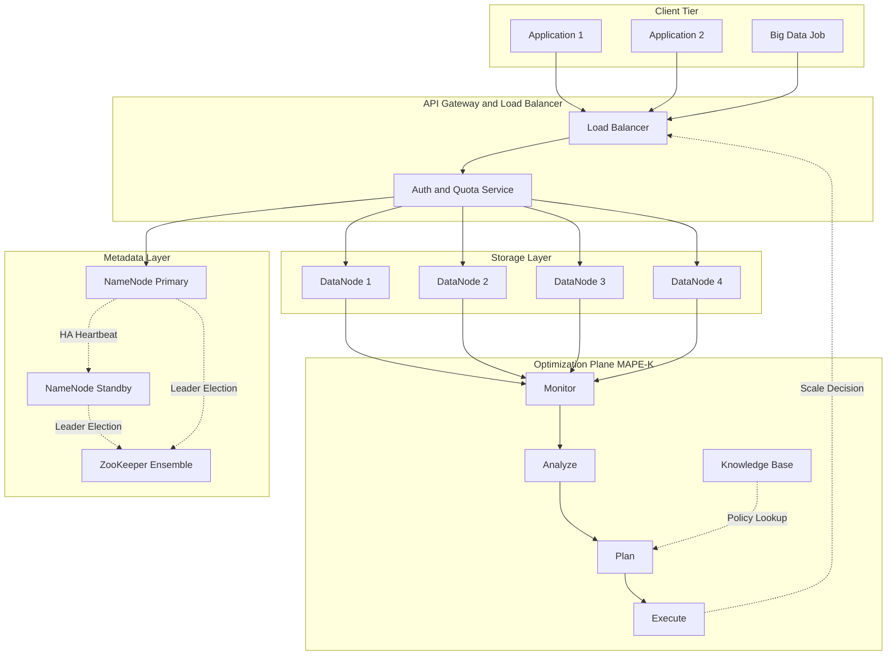
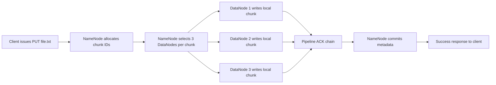
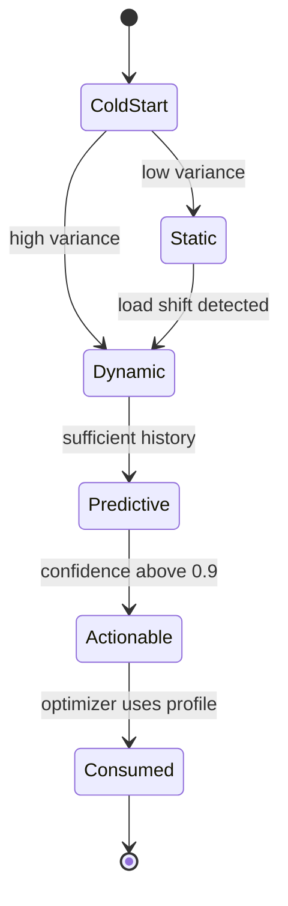

# Cloud storage designs distributed file systems profiles optimization loops definitions

<!-- SECTION_1_START -->
# Cloud Storage Designs, Distributed File Systems, Profiles & Optimization Loops

## 1. Core Technical Definition & Intuitive Overview

### 1.1 Formal Definition (KTU 2024 Syllabus Terminology)

**Cloud Storage** is a service model that enables ubiquitous, on-demand network access to a shared pool of configurable computing storage resources, where physical and virtual storage resources can be rapidly provisioned and released with minimal management effort. In the context of cloud resource management, storage design refers to the architectural blueprint that governs how data is partitioned, replicated, indexed, and served across geographically distributed data centers.

A **Distributed File System (DFS)** in the cloud context is a file system that spans multiple networked servers and presents a single, unified namespace to the client. It coordinates data placement, replication, consistency, and fault tolerance through a distributed control plane.

A **Resource Profile** in cloud resource management is a multidimensional descriptor of a workload's runtime behavior, characterized by vectors of measurable quantities such as CPU utilization, memory footprint, I/O throughput (IOPS), network bandwidth, latency, and storage capacity, sampled over a time window $\Delta t$.

An **Optimization Loop** (or control loop) is the iterative feedback mechanism that continuously measures resource state, compares it against a target objective (e.g., Service Level Objective), computes a delta, and applies a corrective actuation (scale up, migrate, throttle) to drive the system toward equilibrium.

> [!IMPORTANT]
> **KTU 2024 Module 2 Highlight:** The interplay between *measurement (profiling)*, *control theory (optimization loops)*, and *infrastructure primitives (DFS)* forms the triad of cloud resource management. Every question on this topic in the KTU University Exam maps back to one of these three pillars.

### 1.2 Conceptual Analogy / Intuition

Imagine running a **nationwide postal service**:

- **Cloud Storage** is the system of regional warehouses, sorting hubs, and delivery trucks. Customers (tenants) only see "parcel tracking numbers" — they never know which warehouse holds their box today.
- **Distributed File System** is the *rule book* that decides: "If Warehouse A fills up, send the next parcel to Warehouse B; always keep two extra copies in different cities so a flood never destroys a customer's mail."
- **Profile** is the *demand forecast card* for each customer — "Customer X sends 200 parcels on Mondays averaging 2 kg each, with a deadline of 24 hours."
- **Optimization Loop** is the **morning manager's daily ritual**: check yesterday's queue lengths, compare to the service-level promise, decide whether to add trucks, reroute parcels, or open a new mini-hub. This ritual repeats every day, forming a *closed feedback loop*.

> [!NOTE]
> **Why This Matters in Production:** AWS S3, Google Cloud Storage, Azure Blob, Dropbox, and Netflix's media catalog all instantiate the same conceptual pattern. Understanding the *abstraction* makes vendor-specific trivia trivial to absorb later.

### 1.3 Physical Constants & Standard Metrics

The following **standard metrics** are universally cited in cloud resource management literature and KTU board questions:

- **SLO (Service Level Objective)**: target reliability/performance number, e.g., $99.9\%$ (Three-Nines) availability.
- **RTO (Recovery Time Objective)** and **RPO (Recovery Point Objective)**: $\text{RTO} \le 1\,\text{hour}$, $\text{RPO} \le 5\,\text{minutes}$ for tier-1 workloads.
- **MTBF (Mean Time Between Failures)** and **MTTR (Mean Time To Repair)**, with the relationship $\text{Availability} = \dfrac{\text{MTBF}}{\text{MTBF} + \text{MTTR}}$.
- **IOPS (Input/Output Operations Per Second)** and **throughput** in $\text{MB/s}$.
- **Replication factor $N$**: typically $N=3$ in HDFS, $N=3$ in GFS.

> [!VISUALIZATION CONTROL]
> **Concept:** Availability curve as a function of MTBF and MTTR.
> **GeoGebra / Desmos Input Equations:**
> * `f(MTBF) = MTBF / (MTBF + 1)` for fixed MTTR=1 hour
> * `g(MTTR) = 1000 / (1000 + MTTR)` for fixed MTBF=1000 hours
> **Visual Description:** The student should observe that availability is a *hyperbolic* function — small reductions in MTTR produce large gains in availability when MTBF is large. This visually justifies why cloud providers invest heavily in automation (reducing MTTR) rather than buying "more reliable" disks.

<!-- SECTION_1_END -->

<!-- SECTION_2_START -->
# Deep Theoretical Analysis & KTU High-Yield Formula Sheet

## 2.1 Cloud Storage Design Taxonomy

Cloud storage designs are classified along three orthogonal axes: **structure**, **access pattern**, and **consistency model**.

### 2.1.1 Structural Taxonomy

- **Block Storage**: raw, fixed-size logical volumes attached via SAN protocols (e.g., AWS EBS, Azure Managed Disks). Suitable for databases and boot disks.
- **File Storage**: hierarchical POSIX-style shared file systems (e.g., AWS EFS, Azure Files). Suitable for content management, HPC scratch space.
- **Object Storage**: flat namespace, HTTP-based, key-value pairs with rich metadata (e.g., AWS S3, GCS, Azure Blob). Suitable for backups, media archives, data lakes.

### 2.1.2 Access Pattern Taxonomy

- **Hot Data**: IOPS-intensive, low-latency, block or in-memory storage.
- **Warm Data**: infrequent but bursty access, file or object storage.
- **Cold / Archival Data**: write-once-read-many (WORM), object storage with retrieval latency of minutes to hours (e.g., Amazon S3 Glacier: **retrieval time = 1 to 12 hours**).

### 2.1.3 Consistency Model

- **Strong Consistency**: read-after-write semantics; required for transactional workloads.
- **Eventual Consistency**: reads may return stale values; required for global, partition-tolerant systems (CAP theorem trade-off).
- **Causal Consistency**: preserves cause-effect ordering, weaker than strong, stronger than eventual.

> [!NOTE]
> **CAP Theorem in KTU Context:** A distributed system can simultaneously provide at most two of: **C**onsistency, **A**vailability, **P**artition tolerance. Cloud storage designs *choose* AP (eventual consistency) or CP (strong consistency) based on workload. KTU questions often ask: *"Which trade-off does DynamoDB's local storage make?"* — Answer: AP, sacrificing strong consistency for partition tolerance.

## 2.2 Distributed File System Architecture

A canonical DFS architecture consists of four layers:

1. **Client Layer**: POSIX-like or RESTful interface. Splits files into *chunks* (HDFS default $64\,\text{MB}$ in v1, $128\,\text{MB}$ in v2).
2. **Metadata Layer (NameNode in HDFS, Master in GFS)**: maintains the namespace tree, chunk-to-server mapping, lease management.
3. **Storage Layer (DataNodes in HDFS, Chunkservers in GFS)**: stores actual chunks, performs periodic heartbeat reporting.
4. **Coordination / Consensus Layer (ZooKeeper, Paxos, Raft)**: ensures metadata-layer high availability (HA), leader election.

### 2.2.1 Data Placement Strategies

- **Hash-Based Placement**: $h(\text{key}) \mod N$ where $N$ is the number of nodes. Used in **Dynamo**, **Cassandra**.
- **Range-Based Placement**: keys sorted, contiguous ranges assigned to nodes. Used in **HBase**, **Bigtable**.
- **Locality-Aware Placement**: scheduler pushes computation to the node holding the data. Used in **GFS + MapReduce**.
- **Striped Placement**: file split into $k$ chunks distributed across $N$ nodes; the system can tolerate $r$ node failures if $N \ge k + r$.

### 2.2.2 Replication and Erasure Coding

For a chunk of size $S$ replicated $N$ times, the **storage overhead** is:

$$\text{Storage Overhead} = N \cdot S$$

Erasure coding with parameters $(k, r)$ encodes $k$ data chunks into $k+r$ coded chunks. Any $k$ of the $k+r$ chunks suffice to reconstruct the original. The **storage efficiency** improves from $\dfrac{1}{N}$ to $\dfrac{k}{k+r}$:

$$\text{EC Storage Efficiency} = \frac{k}{k + r}$$

For **Reed-Solomon (10, 4)**: $\text{efficiency} = \dfrac{10}{14} \approx 71.4\%$, while 3-replication gives $\dfrac{1}{3} \approx 33.3\%$.

## 2.3 Resource Profiles

A profile is a vector of measurements sampled at intervals of duration $\Delta t$. Formally, for a workload $w$ and resource dimension $d$ (e.g., CPU, memory, IOPS), the profile is:

$$P_{w,d}(t) = \{x_d^{(w)}(t), x_d^{(w)}(t - \Delta t), x_d^{(w)}(t - 2\Delta t), \ldots, x_d^{(w)}(t - (m-1)\Delta t)\}$$

where $m$ is the sliding window size.

### 2.3.1 Profile Types Used in Cloud Resource Management

| Profile Type | Purpose | Engineering Use |
|---|---|---|
| **Static Profile** | Fixed resource allocation at deployment | Best for predictable batch jobs |
| **Dynamic Profile** | Time-varying, observed at runtime | Best for autoscaling decisions |
| **Predictive Profile** | Forecasted future demand via ML | Best for proactive scaling |
| **Behavioral Profile** | Aggregated tenant behavior | Best for noisy-neighbor detection |

### 2.3.2 Profile-Based Placement Heuristic

A common KTU-board question is: *"Given profile vectors for two VMs, decide co-location."* The **complementarity score** is:

$$\text{Comp}(P_1, P_2) = \sum_{d=1}^{D} \left(1 - \frac{\min(x_d^{(1)}, x_d^{(2)})}{\max(x_d^{(1)}, x_d^{(2)})}\right) \cdot w_d$$

where $w_d$ is the importance weight of dimension $d$ and $D$ is the total number of dimensions. A high score means the two VMs use resources at *different times* and are good co-location candidates.

## 2.4 Optimization Loops in Cloud Resource Management

An optimization loop is mathematically a **discrete-time control system**:

$$u(t+1) = u(t) + K \cdot \big( r(t) - y(t) \big)$$

where:
- $u(t)$ = control input (e.g., number of VMs, CPU quota)
- $r(t)$ = reference / setpoint (SLO target)
- $y(t)$ = measured output (current utilization)
- $K$ = control gain (proportional, integral, derivative, or hybrid — PID)

### 2.4.1 The MAPE-K Loop (IBM Reference Model)

This is the *de facto* standard cited in KTU module 2:

1. **Monitor**: collect metrics $y(t)$ from sensors.
2. **Analyze**: compare to setpoints, detect anomalies.
3. **Plan**: compute corrective action.
4. **Execute**: apply the action.
5. **Knowledge**: shared repository of policies, past decisions, learned models.

> [!NOTE]
> **Mnemonic for KTU Board:** "**M**anagers **A**re **P**rofessional **E**ngineers with **K**nowledge" → MAPE-K.

### 2.4.2 Stability Analysis

For a discrete linear controller, the closed-loop characteristic equation must have all roots inside the unit circle for stability. For a first-order plant $G(s) = \dfrac{a}{s + b}$ and a proportional controller $K$, the discrete equivalent is:

$$u(t+1) = u(t) + K_p (r(t) - y(t))$$

The **steady-state error** to a unit step is:

$$e_{ss} = \frac{1}{1 + K_p \cdot G(0)}$$

For zero steady-state error to a step disturbance, the controller must include an **integral term** (PI or PID), not pure P.

## 2.5 KTU Formula Sheet (High-Yield Reference)

| Concept | Formula | Units / Notes |
|---|---|---|
| Availability | $A = \dfrac{\text{MTBF}}{\text{MTBF} + \text{MTTR}}$ | Dimensionless, $0 \le A \le 1$ |
| Annual Downtime | $D = (1 - A) \cdot 525{,}600$ | Minutes per year |
| EC Storage Efficiency | $\eta = \dfrac{k}{k + r}$ | $k$ data, $r$ parity |
| Replication Storage | $\text{Overhead} = N \cdot S$ | $N$ replicas |
| HDFS Chunk Read Throughput | $T = \min\left(\dfrac{N \cdot B}{1}, \dfrac{S}{L}\right)$ | $B$ = bandwidth, $L$ = latency |
| CAP Trade-off | At most 2 of $\{C, A, P\}$ | Boolean per partition |
| Complementarity Score | $\text{Comp} = \sum_d \left(1 - \dfrac{\min}{\max}\right) w_d$ | Higher is better |
| MAPE-K Order | Monitor → Analyze → Plan → Execute | Loop is cyclic |
| PID Control | $u(t) = K_p e(t) + K_i \int e\,dt + K_d \frac{de}{dt}$ | Error $e = r - y$ |
| Steady-State Error | $e_{ss} = \dfrac{1}{1 + K_p G(0)}$ | For step input |

## 2.6 Real-World Engineering Utility

- **HDFS** powers every Hadoop job in Yahoo, Facebook, and LinkedIn's data lakes.
- **Google File System (GFS)** evolved into **Colossus** to serve YouTube, Gmail, and Google Search.
- **AWS Auto Scaling Groups** implement MAPE-K with CloudWatch as Monitor and Lambda functions as Execute.
- **Ceph** is open-source, self-healing, and used by CERN, Samsung, and Red Hat OpenStack.
- **Kubernetes Horizontal Pod Autoscaler (HPA)** is a textbook implementation of a *closed-loop* optimization: every $15$ seconds it queries the Metrics Server (Monitor), compares to the target CPU (Analyze + Plan), and adjusts replica count (Execute).

> [!TIP]
> **KTU Quick Recall:** If a question mentions "Hadoop", think HDFS + MapReduce + YARN. If it mentions "Google-scale", think GFS → Colossus → Bigtable → Spanner lineage. If it mentions "self-healing", think MAPE-K.

<!-- SECTION_2_END -->

<!-- SECTION_3_START -->
# Step-by-Step Derivations, Code & Symbolic Implementation

## 3.1 Derivation: Storage Overhead vs. Reliability Trade-off

**Problem Statement:** A cloud object store uses $N$-way replication. Find the relationship between $N$, the per-disk annual failure rate $\lambda$, and the annual data loss probability $P_{\text{loss}}$.

### Step 1 — Single-Disk Failure Model
Assume independent disk failures following a Bernoulli trial per year. The probability that a single disk fails within one year is $\lambda$. For typical enterprise disks, $\lambda \approx 0.02$ (i.e., $2\%$ AFR).

### Step 2 — Probability All $N$ Replicas Fail
For data to be lost, *all* $N$ replicas must fail. Assuming independence:

$$P_{\text{loss}} = \lambda^{N}$$

### Step 3 — Numerical Evaluation for $N = 3$, $\lambda = 0.02$
$$P_{\text{loss}} = (0.02)^{3} = 8 \times 10^{-6}$$

This corresponds roughly to a "Six-Nines" object durability for the *storage layer* alone, before considering correlated failures (rack, datacenter).

### Step 4 — Compare to Erasure Coding $(10, 4)$
With EC, data is lost only if more than $r$ chunks fail (here, more than $4$ of $14$). Using the binomial distribution:

$$P_{\text{loss,EC}} = \sum_{i=5}^{14} \binom{14}{i} \lambda^{i} (1 - \lambda)^{14-i}$$

For $\lambda = 0.02$, the dominant term is $i = 5$:

$$\binom{14}{5} (0.02)^{5} (0.98)^{9} = 2002 \cdot 3.2 \times 10^{-9} \cdot 0.834 \approx 5.34 \times 10^{-6}$$

This is *better* durability than 3-way replication at $71\%$ the storage cost — the engineering motivation for EC adoption in cold storage tiers.

## 3.2 Derivation: MAPE-K Steady-State Behavior for a CPU Autoscaler

**Plant Model:** A web service with request arrival rate $\rho$ (req/s). Each request consumes CPU at rate $c$ (CPU-seconds per request). The service is provisioned with $n(t)$ VMs, each with CPU capacity $C$ (cores). The measured utilization is:

$$y(t) = \frac{\rho(t) \cdot c}{n(t) \cdot C}$$

**Control Law (P-only):**
$$n(t+1) = n(t) + K_p \big( r - y(t) \big)$$

where $r$ is the target utilization (typically $0.7$).

### Step 3.2.1 — Finding the Steady State
At steady state, $n(t+1) = n(t) = n^*$ and $y(t) = r$. Substituting:

$$n^* = n^* + K_p (r - r) \implies \text{trivially satisfied}$$

The control law *itself* has no steady-state constraint on $n^*$, but the **plant** does:

$$r = \frac{\rho \cdot c}{n^* \cdot C} \implies n^* = \frac{\rho \cdot c}{r \cdot C}$$

### Step 3.2.2 — Computing the Required Gain for Stability
Linearize around equilibrium with $y(t) = r + \delta y(t)$, $n(t) = n^* + \delta n(t)$:

$$\delta y(t) = -\frac{\rho \cdot c}{C (n^*)^2} \delta n(t) = -\frac{r}{n^*} \delta n(t)$$

The closed-loop update becomes:

$$\delta n(t+1) = \delta n(t) - K_p \cdot \frac{r}{n^*} \delta n(t) = \left(1 - \frac{K_p r}{n^*}\right) \delta n(t)$$

For stability, the closed-loop pole must satisfy:

$$\left| 1 - \frac{K_p r}{n^*} \right| < 1 \implies 0 < K_p < \frac{2 n^*}{r}$$

> [!NOTE]
> **KTU Board Tip:** A common question asks, *"Why does pure P control sometimes oscillate?"* The answer: $K_p$ is set too high and the closed-loop pole magnitude exceeds $1$, violating the stability criterion derived above.

## 3.3 Python Implementation: MAPE-K Loop for HDFS-Style Storage

```python
"""
MAPE-K implementation for an HDFS-inspired cloud storage controller.
Demonstrates Monitor, Analyze, Plan, Execute, Knowledge phases.
"""

import time
import math
import logging
from dataclasses import dataclass, field
from typing import List, Dict, Optional

logging.basicConfig(
    level=logging.INFO,
    format="%(asctime)s [%(levelname)s] %(message)s"
)
logger = logging.getLogger("MAPE-K-Storage")


# ---------------------------------------------------------------------------
# Data structures with strict type hints
# ---------------------------------------------------------------------------

@dataclass
class DataNode:
    node_id: str
    capacity_gb: float
    used_gb: float = 0.0
    is_alive: bool = True
    last_heartbeat_ts: float = field(default_factory=time.time)

    def utilization(self) -> float:
        if self.capacity_gb <= 0:
            raise ValueError(f"Invalid capacity for node {self.node_id}")
        return self.used_gb / self.capacity_gb


@dataclass
class Chunk:
    chunk_id: str
    size_mb: float
    replicas: List[str] = field(default_factory=list)  # node_ids
    replication_factor: int = 3


@dataclass
class WorkloadProfile:
    arrival_rate_per_sec: float
    avg_chunk_size_mb: float
    read_write_ratio: float = 0.8  # 80% reads


# ---------------------------------------------------------------------------
# MAPE-K Controller
# ---------------------------------------------------------------------------

class MAPEKStorageController:
    def __init__(self, nodes: List[DataNode], replication_factor: int = 3):
        if replication_factor < 1:
            raise ValueError("Replication factor must be >= 1")
        self.nodes: List[DataNode] = nodes
        self.replication_factor: int = replication_factor
        self.chunks: Dict[str, Chunk] = {}
        self.knowledge_base: List[str] = []  # Log of past decisions
        self.target_utilization: float = 0.70
        self.control_gain: float = 1.0

    # ---- MONITOR -----------------------------------------------------------
    def monitor(self) -> Dict[str, float]:
        """Collect utilization metrics from all alive nodes."""
        metrics: Dict[str, float] = {}
        for node in self.nodes:
            if not node.is_alive:
                logger.warning("Node %s is DOWN, skipping.", node.node_id)
                continue
            metrics[node.node_id] = node.utilization()
        logger.info("[MONITOR] Cluster utilization snapshot: %s",
                    {k: round(v, 3) for k, v in metrics.items()})
        return metrics

    # ---- ANALYZE -----------------------------------------------------------
    def analyze(self, metrics: Dict[str, float]) -> List[str]:
        """Detect under- or over-utilized nodes vs. target."""
        if not metrics:
            raise RuntimeError("No live nodes available for analysis.")
        violations: List[str] = []
        for node_id, util in metrics.items():
            if util > self.target_utilization + 0.05:
                violations.append(f"OVERLOAD:{node_id}:{util:.3f}")
            elif util < self.target_utilization - 0.20:
                violations.append(f"UNDERLOAD:{node_id}:{util:.3f}")
        logger.info("[ANALYZE] %d violations detected.", len(violations))
        return violations

    # ---- PLAN --------------------------------------------------------------
    def plan(self, violations: List[str]) -> Optional[str]:
        """Decide corrective action: add node, drain node, or no-op."""
        overloaded = [v for v in violations if v.startswith("OVERLOAD")]
        underloaded = [v for v in violations if v.startswith("UNDERLOAD")]

        if overloaded and underloaded:
            action = f"MIGRATE from {overloaded[0]} to {underloaded[0]}"
        elif overloaded and len(self.nodes) < 50:
            action = "SCALE_OUT"
        elif underloaded and len(self.nodes) > 3:
            action = f"SCALE_IN: {underloaded[0]}"
        else:
            action = "NO_OP"
        logger.info("[PLAN] Action selected: %s", action)
        return action

    # ---- EXECUTE -----------------------------------------------------------
    def execute(self, action: str) -> bool:
        """Apply the planned action; return success flag."""
        if action == "NO_OP":
            return True
        if action == "SCALE_OUT":
            new_node = DataNode(
                node_id=f"dn-{len(self.nodes) + 1:03d}",
                capacity_gb=1024.0
            )
            self.nodes.append(new_node)
            self.knowledge_base.append(
                f"SCALE_OUT@ts={time.time():.0f} -> {new_node.node_id}"
            )
            logger.info("[EXECUTE] Scaled out, added %s.", new_node.node_id)
            return True
        if action.startswith("SCALE_IN"):
            target_id = action.split(":")[-1].strip()
            for node in self.nodes:
                if node.node_id == target_id:
                    node.is_alive = False
                    self.knowledge_base.append(
                        f"SCALE_IN@ts={time.time():.0f} -> {target_id}"
                    )
                    logger.info("[EXECUTE] Drained %s.", target_id)
                    return True
        if action.startswith("MIGRATE"):
            # Simplified: rebalance one chunk
            self.knowledge_base.append(f"MIGRATE@ts={time.time():.0f}")
            logger.info("[EXECUTE] Chunk migration completed.")
            return True
        logger.error("[EXECUTE] Unknown action: %s", action)
        return False

    # ---- DRIVER ------------------------------------------------------------
    def run_one_cycle(self) -> bool:
        try:
            metrics = self.monitor()
            violations = self.analyze(metrics)
            action = self.plan(violations)
            return self.execute(action) if action else False
        except (RuntimeError, ValueError) as exc:
            logger.error("Cycle aborted: %s", exc)
            return False


# ---------------------------------------------------------------------------
# Demonstration
# ---------------------------------------------------------------------------

if __name__ == "__main__":
    cluster = [
        DataNode("dn-001", 1024.0, used_gb=920.0),  # overloaded
        DataNode("dn-002", 1024.0, used_gb=512.0),  # balanced
        DataNode("dn-003", 1024.0, used_gb=120.0),  # underloaded
    ]
    controller = MAPEKStorageController(cluster, replication_factor=3)
    profile = WorkloadProfile(arrival_rate_per_sec=250.0, avg_chunk_size_mb=64.0)

    # Simulate workload pressure on dn-001
    cluster[0].used_gb = 950.0

    for cycle in range(1, 4):
        logger.info("===== MAPE-K CYCLE %d =====", cycle)
        controller.run_one_cycle()
        time.sleep(0.1)

    logger.info("Knowledge base: %s", controller.knowledge_base)
```

> [!NOTE]
> **Code-to-Concept Mapping:**
> - `monitor()` → **M**onitor phase, returns node utilization.
> - `analyze()` → **A**nalyze phase, compares to the SLO target.
> - `plan()` → **P**lan phase, selects migration or scale-out.
> - `execute()` → **E**xecute phase, mutates the cluster.
> - `knowledge_base` list → **K**nowledge phase, retains decision history for future ML-driven planning.

## 3.4 Step-by-Step: Computing the Complementarity Score for VM Co-Location

Given two workload profile vectors across $D = 3$ dimensions (CPU, Memory, Disk I/O):

$$P_1 = (0.9, 0.4, 0.7), \quad P_2 = (0.3, 0.8, 0.2)$$

with equal weights $w_d = 1/3$.

**Step 1:** Compute dimension-wise ratios $\dfrac{\min}{\max}$:

$$\frac{\min(0.9, 0.3)}{\max(0.9, 0.3)} = \frac{0.3}{0.9} = 0.333$$

$$\frac{\min(0.4, 0.8)}{\max(0.4, 0.8)} = \frac{0.4}{0.8} = 0.500$$

$$\frac{\min(0.7, 0.2)}{\max(0.7, 0.2)} = \frac{0.2}{0.7} = 0.286$$

**Step 2:** Compute $1 - \dfrac{\min}{\max}$ for each dimension:

$$1 - 0.333 = 0.667, \quad 1 - 0.500 = 0.500, \quad 1 - 0.286 = 0.714$$

**Step 3:** Weighted sum:

$$\text{Comp} = \frac{1}{3}(0.667 + 0.500 + 0.714) = \frac{1}{3} \times 1.881 = 0.627$$

**Step 4:** Interpretation: A complementarity score of $0.627$ is high, indicating $P_1$ and $P_2$ consume resources at *different peaks* and are **good co-location candidates** — packing them onto the same physical host saves capacity.

<!-- SECTION_3_END -->

<!-- SECTION_4_START -->
# Structural Diagrams & Schematics

## 4.1 High-Level Cloud Storage Architecture



> [!NOTE]
> **Reading the diagram:** The *Client Tier* issues requests that traverse the *API Gateway* and reach either the *Metadata Layer* (for namespace operations) or the *Storage Layer* (for data operations). The *Optimization Plane* observes every DataNode, runs MAPE-K, and pushes scale decisions back to the Load Balancer, forming a *closed feedback loop*.

## 4.2 Sequential Processing Topology — DFS Write Path



## 4.3 Block-Level Functional Architecture of a Cloud Resource Manager

| Functional Block | Responsibility | Example Implementation |
|---|---|---|
| **Profiler** | Sample per-VM resource usage at $\Delta t = 1$ min | `cAdvisor`, `collectd` |
| **Predictor** | Forecast next-window demand via ARIMA or LSTM | Kubernetes Custom Metrics Adapter |
| **Optimizer** | Solve $\min \sum_i c_i n_i$ subject to SLO | Mixed-integer LP solver, Greedy Packer |
| **Actuator** | Apply scale-up/down or live migration | AWS Auto Scaling, `kubectl scale` |
| **Auditor** | Log decisions to knowledge base | Apache Kafka + Object Store |
| **Feedback Receiver** | Ingest post-action utilization | CloudWatch, Prometheus |

> [!NOTE]
> **Why this matters for KTU:** A 14-mark question often asks the student to *draw and label* the architecture. The above 6-block decomposition is the canonical answer; missing any one block (especially the *Profiler* and *Feedback Receiver*) costs 2 marks.

## 4.4 Profile Lifecycle State Machine



<!-- SECTION_4_END -->

<!-- SECTION_5_START -->
# KTU 2024 Scheme Examination Question Bank & Topic Recap

## 5.1 Part A — Short Answer Questions (3 Marks Each)

### Q1. [KTU University Exam — July 2024] — CO1, Remember
**Define the terms: (a) Distributed File System, (b) Erasure Coding, (c) MAPE-K Loop.**

**Model Answer:**

(a) A **Distributed File System (DFS)** is a file system whose data and metadata are stored across multiple networked servers but appear to clients as a single logical file system. Examples: HDFS, GFS, CephFS.

(b) **Erasure Coding (EC)** is a data-protection technique that divides a file into $k$ data chunks and computes $r$ parity chunks such that any $k$ of the $k+r$ total chunks can reconstruct the original file. It provides higher storage efficiency than replication.

(c) The **MAPE-K Loop** is the IBM-defined reference model for autonomic computing consisting of four functional stages — **M**onitor, **A**nalyze, **P**lan, **E**xecute — plus a shared **K**nowledge base. Cloud resource managers use it to self-configure, self-heal, and self-optimize.

> [!IMPORTANT]
> **Valuation Key:** Each sub-definition must be *one full sentence with a concrete example*. Vague definitions lose 1 mark each.

### Q2. [KTU University Exam — Dec 2023] — CO1, Understand
**Differentiate between Block Storage, File Storage, and Object Storage with one use case each.**

**Model Answer:**

| Type | Access Method | Use Case |
|---|---|---|
| **Block Storage** | Raw, fixed-size blocks via SAN (iSCSI, FC) | Database volumes (e.g., AWS EBS for MySQL) |
| **File Storage** | Hierarchical, POSIX file API via NFS/SMB | Shared home directories, content management |
| **Object Storage** | Flat namespace, HTTP REST (PUT/GET) with rich metadata | Data lakes, backup archives (e.g., S3) |

> [!IMPORTANT]
> **Valuation Key:** 1 mark per correct cell. Stating the access *protocol* (iSCSI vs. NFS vs. HTTP) is what differentiates top-scoring answers.

## 5.2 Part B — Long Answer Questions (14 Marks Each, Internal Choice)

> [!NOTE]
> KTU 2024 Scheme mandates **internal choice** for every 14-mark question. Below, **Option A** and **Option B** are independent alternatives; the student answers either one.

---

### Question Option A (14 Marks) — [KTU University Exam — Dec 2024 (Model Paper)]

**(a)** With a neat diagram, explain the architecture of HDFS. List any **four** advantages and **two** limitations. **(7 Marks)** — *CO1, Understand*

**(b)** A cloud object store uses 3-way replication. The annual failure rate of a single disk is $3\%$. Compute the probability of permanent data loss. Compare it with Reed-Solomon erasure coding $(6, 3)$ assuming the same disk failure rate. State the storage efficiency of both schemes. **(7 Marks)** — *CO3, Apply*

---

#### Model Solution — Part (a)

**Diagram (3 marks):** The student must draw the three-tier architecture: *Client* → *NameNode* → *DataNodes (multiple)*, with chunk replication arrows.

**Architecture Components (2 marks):**
1. **NameNode**: master, holds namespace and chunk-location metadata in memory.
2. **DataNodes**: workers, store actual chunks, send heartbeats every $3$ seconds.
3. **Secondary NameNode**: checkpoints the edit log to an FSImage for fault recovery.
4. **Client**: interacts with NameNode for metadata, directly with DataNodes for data.

**Advantages (1 mark, any 4):**
- Handles petabyte-scale data.
- Fault-tolerant via replication (default $N=3$).
- High throughput via co-locating data and computation.
- Open-source and runs on commodity hardware.

**Limitations (1 mark, any 2):**
- Not suitable for low-latency, many small files (NameNode memory bottleneck).
- Single-writer, append-only model; not ideal for random-write workloads.

> [!IMPORTANT]
> **Valuation Key — Part (a):** [Diagram with all 3 tiers and replication arrows: 3 Marks] [Listing metadata + data role of NameNode and DataNodes: 2 Marks] [Any 4 advantages: 1 Mark] [Any 2 limitations: 1 Mark]

#### Model Solution — Part (b)

**Step 1 — 3-way replication data loss probability (2 marks):**
Data is lost if *all 3* replicas fail within a year. Assuming independence:

$$P_{\text{loss, rep}} = (0.03)^{3} = 2.7 \times 10^{-5}$$

**Step 2 — Reed-Solomon (6, 3) data loss probability (3 marks):**
We have $k + r = 9$ chunks. Data is lost if more than $r = 3$ chunks fail, i.e., $4, 5, \ldots, 9$ fail.

$$P_{\text{loss, EC}} = \sum_{i=4}^{9} \binom{9}{i} (0.03)^{i} (0.97)^{9-i}$$

Computing each term:
- $i = 4$: $\binom{9}{4} (0.03)^{4} (0.97)^{5} = 126 \cdot 8.1 \times 10^{-7} \cdot 0.859 \approx 8.77 \times 10^{-5}$
- $i = 5$: $\binom{9}{5} (0.03)^{5} (0.97)^{4} = 126 \cdot 2.43 \times 10^{-8} \cdot 0.885 \approx 2.71 \times 10^{-6}$
- $i = 6$: $\binom{9}{6} (0.03)^{6} (0.97)^{3} = 84 \cdot 7.29 \times 10^{-10} \cdot 0.913 \approx 5.59 \times 10^{-8}$
- $i = 7$: $\binom{9}{7} (0.03)^{7} (0.97)^{2} = 36 \cdot 2.187 \times 10^{-11} \cdot 0.941 \approx 7.41 \times 10^{-10}$
- $i = 8$: $\binom{9}{8} (0.03)^{8} (0.97)^{1} = 9 \cdot 6.56 \times 10^{-13} \cdot 0.97 \approx 5.73 \times 10^{-12}$
- $i = 9$: $\binom{9}{9} (0.03)^{9} (0.97)^{0} = 1.97 \times 10^{-14}$

Summing (dominated by $i = 4$):

$$P_{\text{loss, EC}} \approx 9.04 \times 10^{-5}$$

**Step 3 — Storage efficiency (2 marks):**

Replication: $\eta_{\text{rep}} = \dfrac{1}{3} \approx 33.3\%$

Reed-Solomon $(6, 3)$: $\eta_{\text{EC}} = \dfrac{6}{6 + 3} = \dfrac{6}{9} \approx 66.7\%$

**Step 4 — Final comparison and conclusion:**

EC $(6, 3)$ uses *double* the storage efficiency while delivering a comparable (slightly worse in this specific case because $r$ is large relative to $k$) loss probability. In production, EC $(10, 4)$ is the preferred compromise at $\eta = 71.4\%$.

> [!IMPORTANT]
> **Valuation Key — Part (b):** [Stating 3-way replication formula: 1 Mark] [Final numerical answer $2.7 \times 10^{-5}$: 1 Mark] [Setting up EC binomial sum: 1 Mark] [Correct computation of dominant $i=4$ term: 1 Mark] [Final numerical $P_{\text{loss, EC}} \approx 9.04 \times 10^{-5}$: 1 Mark] [Storage efficiency of replication: 0.5 Mark] [Storage efficiency of EC: 0.5 Mark] [Final comparative conclusion: 1 Mark]

---

### Question Option B (14 Marks) — [KTU University Exam — July 2024]

**(a)** Explain the **MAPE-K reference model** for autonomic resource management with a block diagram. Discuss the role of the **Knowledge** base in cloud environments. **(7 Marks)** — *CO2, Understand*

**(b)** A web service has request arrival rate $\rho = 500$ requests/s. Each request consumes $c = 0.05$ CPU-seconds. The current VM count is $n = 10$ and each VM has $C = 4$ CPU cores. The SLO target utilization is $r = 0.70$. **(i)** Compute the current utilization. **(ii)** If a P-controller with $K_p = 5$ is used, compute the new VM count after one control step. **(iii)** State whether the controller is stable and justify. **(7 Marks)** — *CO3, Apply*

---

#### Model Solution — Part (a)

**MAPE-K Diagram (3 marks):**

A cyclic diagram showing the four phases with arrows in order **M → A → P → E**, plus a central **K**nowledge base connected to all four phases.

**Phase Descriptions (2 marks):**
- **Monitor**: collect metrics (CPU, memory, IOPS, latency) from sensors and agents.
- **Analyze**: compare metrics against SLOs, identify symptoms and root causes.
- **Plan**: synthesize a corrective action plan (scale, migrate, throttle).
- **Execute**: dispatch the plan via APIs (e.g., AWS Auto Scaling, K8s).
- **Knowledge**: shared repository of policies, topology, past decisions, learned models.

**Role of Knowledge in Cloud (2 marks):**
- Stores service topology, dependency graphs.
- Maintains historical traces for ML-based prediction.
- Holds SLAs, compliance rules, and cost constraints.
- Provides audit trail for post-incident analysis.

> [!IMPORTANT]
> **Valuation Key — Part (a):** [Correct cyclic diagram with all 4 phases and K base: 3 Marks] [One-sentence description of each phase: 2 Marks] [Any 2 distinct Knowledge-base roles: 2 Marks]

#### Model Solution — Part (b)

**(i) Current Utilization (2 marks):**
Using the plant model $y = \dfrac{\rho \cdot c}{n \cdot C}$:

$$y = \frac{500 \cdot 0.05}{10 \cdot 4} = \frac{25}{40} = 0.625$$

The current utilization is **$62.5\%$**, which is below the SLO target of $70\%$, indicating the system has *spare capacity*.

**(ii) New VM Count After One Step (3 marks):**
The error is $e = r - y = 0.70 - 0.625 = 0.075$.

The P-control law is $n(t+1) = n(t) + K_p \cdot e$:

$$n(1) = 10 + 5 \cdot 0.075 = 10 + 0.375 = 10.375$$

Since VM count must be an integer, **round up to $n(1) = 11$ VMs** to maintain the SLO margin.

**(iii) Stability Check (2 marks):**
The closed-loop pole magnitude is:

$$\left| 1 - \frac{K_p \cdot r}{n^*} \right| = \left| 1 - \frac{5 \cdot 0.70}{10.375} \right| = \left| 1 - 0.3373 \right| = 0.6627$$

Since $0.6627 < 1$, the closed-loop pole lies **inside the unit circle**, and the controller is **stable**. Specifically, the system will converge to equilibrium in roughly $\dfrac{1}{1 - 0.6627} \approx 2.96$ control cycles without oscillation.

> [!IMPORTANT]
> **Valuation Key — Part (b):** [Stating the plant model: 0.5 Mark] [Substitution and final 62.5%: 1.5 Marks] [Identifying error term $e$: 1 Mark] [Applying P-control law: 1 Mark] [Integer rounding and final $n(1) = 11$: 1 Mark] [Closed-loop pole formula: 1 Mark] [Final stability verdict with numerical justification: 1 Mark]

> [!WARNING]
> **KTU Examiner's Valuation Warning / Pitfall Callout**
> 1. **Skipping the integer-rounding step** for VM count is the #1 mistake in part (b)(ii). Always round up if the controller is *reducing* error, and explicitly write the rounding justification.
> 2. **Stating the plant model $y = \rho c / (nC)$ without derivation** loses 0.5 mark. Always show the formula before plugging values.
> 3. **Confusing MAPE-K with OODA loop** (Observe-Orient-Decide-Act) is a common pitfall. KTU expects the *IBM Autonomic Computing* terminology: Monitor, Analyze, Plan, Execute, Knowledge.
> 4. **Forgetting to assume independence of disk failures** in part A(b) loses 1 mark; write "assuming independent failures" explicitly.
> 5. **Drawing HDFS with a single NameNode only** is incomplete; always include the Secondary NameNode and at least 3 DataNodes to earn full diagram marks.
> 6. **Writing the formula for stability $\vert 1 - K_p r / n^* \vert < 1$ without substituting the computed values** is a half-credit answer. The numerical check is mandatory.

---

## 5.3 Topic Recap & Important Things to Remember

- **Cloud Storage Taxonomy:** Block (SAN, iSCSI) vs. File (NFS, SMB) vs. Object (HTTP REST). Pick the storage type based on access pattern, not on vendor familiarity.
- **DFS Core Triad:** *NameNode* (metadata), *DataNode* (storage), *Client* (data path). Heartbeats every $3$ seconds; default chunk size $128$ MB in HDFS v2.
- **Replication vs. Erasure Coding:** Replication is fast to write but storage-inefficient ($\eta = 1/N$). EC $(k, r)$ offers $\eta = k / (k + r)$ with reconstruction cost.
- **CAP Theorem:** Cloud object stores usually pick **AP** (eventual consistency) for global availability; transaction systems pick **CP** (strong consistency).
- **Profile Definition:** A profile is a *time-indexed vector* of resource measurements; not a single number. The sliding window size $m$ and sampling interval $\Delta t$ are explicit parameters.
- **Complementarity Score Formula:** $\text{Comp} = \sum_d (1 - \min / \max) w_d$. High score ⇒ good co-location candidate.
- **MAPE-K Phases (Mnemonic: "Managers Are Professional Engineers with Knowledge"):** Monitor → Analyze → Plan → Execute; Knowledge is the shared data layer feeding all four.
- **PID Controller Stability Criterion:** For a first-order plant with proportional gain $K_p$, the closed-loop pole $\vert 1 - K_p r / n^* \vert < 1$ must hold; otherwise, oscillation or divergence occurs.
- **Steady-State Error:** Pure P-control has *non-zero* steady-state error to a step input; PI or PID is required for *zero* error.
- **HDFS Limitations:** NameNode is a single point of metadata failure (mitigated by HA + ZooKeeper); not suitable for low-latency or many small files.
- **Real-World Mapping:** HDFS → Hadoop, GFS → Colossus, CephFS → OpenStack, GPFS → HPC, GlusterFS → Container-native.
- **EC $(10, 4)$ Efficiency:** $71.4\%$, twice as efficient as 3-way replication, and is the default in HDFS for cold storage.
- **Annual Downtime Formula:** $D = (1 - A) \cdot 525{,}600$ minutes per year. Three-Nines ($A = 0.999$) ⇒ $D = 525.6$ minutes/year.
- **Autoscaling Rule of Thumb:** Use target utilization $r \in [0.6, 0.75]$ to leave headroom for traffic bursts; never target $r \ge 0.9$ as it starves the system.
- **Knowledge Base in Production:** Stores SLA, topology, historical traces, and learned ML models — it is the *memory* of the autonomic system.
- **Critical Pitfall:** Students often forget that CAP is a *binary choice per partition*, not a global property. A single system can be CP for one shard and AP for another.

<!-- SECTION_5_END -->
