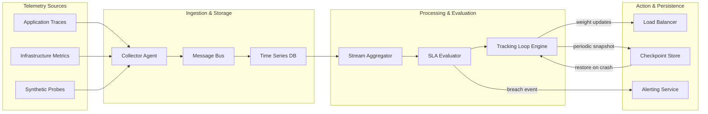
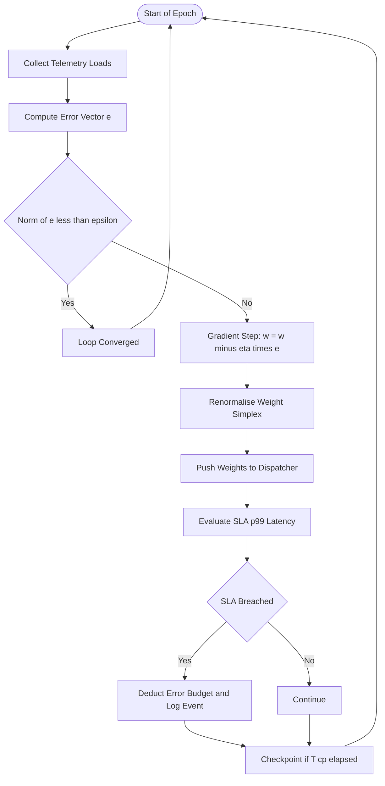
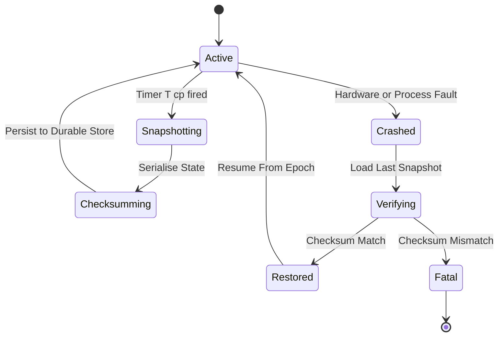
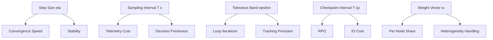

# Load balances algorithm computational tracking loops optimization parameters checkpoints

<!-- SECTION_1_START -->
# Module 3 — SLA Governance, Monitoring Pipelines, Load Balancing Algorithms, Computational Tracking Loops, Optimization Parameters & Checkpoints

## 1.1 Formal Definitions (KTU 2024 Scheme Terminology)

**SLA Governance** is the formal, policy-driven discipline of defining, negotiating, monitoring, and enforcing Service Level Agreements between a cloud service provider and a consumer. It encapsulates availability targets (e.g., **99.95%** monthly uptime), latency budgets, throughput commitments, recovery objectives, and the financial/operational penalties triggered by non-conformance.

**Monitoring Pipeline** is the end-to-end telemetry chain that ingests raw signals from distributed cloud infrastructure (CPU, memory, network, application traces, logs), normalises them into structured metrics, stores them in a time-series backend, evaluates them against SLA thresholds, and triggers remediation workflows or alerts.

**Load Balancing Algorithm** is the deterministic or stochastic procedure that distributes incoming workload across a pool of compute, storage, or network resources to satisfy a chosen optimisation objective while honouring SLA constraints.

**Computational Tracking Loop** is the iterative, closed-loop feedback mechanism that continuously observes the system state, computes the deviation from a desired SLA target, derives a corrective control action, and re-applies that action until the deviation converges within a tolerance band. It is functionally analogous to a **Proportional–Integral (PI) controller** in classical control theory.

**Optimization Parameters** are the measurable variables — latency, throughput, cost, energy, queue depth, error rate — that constitute the objective function $J(\mathbf{x})$ minimised (or maximised) by the tracking loop.

**Checkpoint** is a durable, point-in-time snapshot of the load balancer's decision state, telemetry history, and SLA compliance ledger. It enables crash-consistent recovery, forensic replay, and auditability — directly supporting the **Recovery Point Objective (RPO)** and **Recovery Time Objective (RTO)** clauses in an SLA.

> [!IMPORTANT]
> **KTU 2024 Syllabus Anchor (PECST606 / Module 3):** Students must be able to *design, analyse, and contrast* static versus dynamic load balancing strategies, formulate SLA compliance as a constrained optimisation problem, derive the convergence condition of the feedback tracking loop, and justify the placement of checkpoints inside the monitoring pipeline.

## 1.2 Intuitive Analogy — The City Traffic Control Room

Imagine a metropolitan traffic command centre:

- The **SLA** is the city's published promise: *"Average commute under 35 minutes, 99% of weekdays."*
- The **monitoring pipeline** is the network of inductive loops, CCTV feeds, and floating-car data streaming into the control room every second.
- The **load balancing algorithm** is the dispatcher who, when an accident occurs on Route A, reroutes vehicles onto Routes B, C, and D in proportion to their remaining capacity.
- The **computational tracking loop** is the green-wave timing algorithm: it observes average speed, computes the gap to the 35-minute target, and adjusts every signal's phase offset by $\Delta t$ until the gap shrinks to zero.
- The **optimization parameters** are the KPIs on the giant dashboard: average speed, queue length, intersection saturation, CO₂ emissions, fuel cost.
- The **checkpoints** are the hourly snapshots archived to disk — if the control system crashes at 14:37, it restores the 14:00 snapshot and replays the next 37 minutes of telemetry, satisfying the city's RPO of 1 hour.

The cloud is identical in structure; only the *substrate* differs (VMs/containers instead of vehicles, microservices instead of intersections).

## 1.3 Visualising the Tracking Loop Convergence

The most intuitive picture of a computational tracking loop is the *error-vs-iteration* curve. For a stable loop the error must decay monotonically toward zero.

> [!VISUALIZATION CONTROL]
> **Concept:** Exponential convergence of the SLA tracking error over discrete iterations.
> **GeoGebra / Desmos Input Equations:**
> * $e(t) = e_0 \cdot \rho^{t}$, with $e_0 = 100$, $\rho = 0.85$
> * $y = 0$ (target band, drawn as a horizontal line)
> **Visual Description:** A smooth, monotonically decreasing red curve starting at $(0, 100)$ and asymptotically approaching the green horizontal target line $y=0$. After roughly 20 iterations the curve enters the $\pm 2$ tolerance band, illustrating the *convergence time* metric of the loop.

> [!NOTE]
> **Core takeaway:** A well-tuned tracking loop converts an SLA violation into a *bounded, exponentially-decaying* error trajectory. The tuning parameters ($K_p$, $K_i$, step size $\eta$) decide whether the curve reaches zero (stable), oscillates (marginally stable), or diverges (unstable).

<!-- SECTION_1_END -->

<!-- SECTION_2_START -->
# 2. Deep Theoretical Analysis & KTU High-Yield Formula Sheet

## 2.1 Taxonomy of Load Balancing Algorithms

Load balancers fall into two super-classes, each with sub-families:

| Class | Sub-Family | Decision Basis | SLA Strength | Cost |
|---|---|---|---|---|
| **Static** | Round Robin, Weighted Round Robin, Hash-based | Cyclic / deterministic mapping | Predictable, low variance | Zero runtime probing |
| **Dynamic** | Least Connections, Least Response Time, Resource-Based, Power-of-Two-Choices | Live telemetry from agent / eBPF probe | Adaptive to load bursts | Higher monitoring overhead |
| **Predictive** | ML-based (LSTM, Reinforcement Learning) | Forecasted demand | Best under non-stationary traffic | Training + inference cost |

> [!NOTE]
> **KTU Exam Tip:** Whenever a question asks to *"compare static and dynamic load balancing"*, always anchor your answer in three dimensions: **decision basis, responsiveness, telemetry cost.** A static algorithm cannot *react* to a node failure inside an active session; a dynamic algorithm can.

## 2.2 The Optimisation Objective

For a cluster of $N$ homogeneous worker nodes, let $\ell_i$ denote the instantaneous load (e.g., active connections) on node $i$. The canonical load-balancing objective is to **minimise the maximum load**, formally:

$$
\min_{\sigma} \; \max_{i \in [1,N]} \; \ell_{\sigma(i)}
$$

where $\sigma$ is a permutation of incoming requests. The lower bound is the *perfectly balanced* state $\ell_i = L/N$ where $L$ is the aggregate request count. The **makespan deviation** is the penalty term:

$$
\Delta = \max_i \ell_i - \frac{L}{N}
$$

## 2.3 Computational Tracking Loop — Mathematical Model

Let $\mathbf{x}(t) \in \mathbb{R}^{N}$ be the load vector at iteration $t$, and let $\mathbf{x}^{\ast}$ be the desired target (typically the perfectly balanced state). Define the **error vector**:

$$
\mathbf{e}(t) = \mathbf{x}(t) - \mathbf{x}^{\ast}
$$

The closed-loop update rule for a gradient-descent-style adaptive load balancer is:

$$
\mathbf{x}(t+1) = \mathbf{x}(t) - \eta \, \nabla J(\mathbf{x}(t))
$$

where $\eta > 0$ is the **step size** (a critical optimisation parameter) and $J(\mathbf{x}) = \tfrac{1}{2}\Vert \mathbf{e}(t) \Vert_{2}^{2}$ is the quadratic cost. Differentiating:

$$
\nabla J(\mathbf{x}(t)) = \mathbf{e}(t)
$$

Hence the canonical update:

$$
\mathbf{x}(t+1) = \mathbf{x}(t) - \eta \, \mathbf{e}(t)
$$

The **convergence condition** is the spectral-radius bound on the iteration matrix. For a scalar component:

$$
\rho = \vert 1 - \eta \, \lambda_{\max}(H) \vert < 1
$$

where $\lambda_{\max}(H)$ is the largest eigenvalue of the Hessian of $J$. When $J$ is quadratic, $H = I$, so the condition reduces to:

$$
0 < \eta < 2
$$

## 2.4 SLA Compliance Metrics

| Metric | Formula | Target Band (typical) |
|---|---|---|
| Availability $A$ | $A = \dfrac{U}{U+D}$, with $U$ = uptime, $D$ = downtime | $\geq 99.95\%$ monthly |
| Latency p99 | $\text{percentile}_{99}(\{t_{\text{resp}}\})$ | $\leq 250\,\text{ms}$ |
| Throughput | $\lambda = \dfrac{R}{\Delta t}$ requests/sec | Per workload profile |
| Error Budget Burn | $E = 1 - \dfrac{S_{\text{remaining}}}{S_{\text{quota}}}$ | $\leq 1.0$ |
| Recovery Point Objective | $\text{RPO} = t_{\text{last checkpoint}} - t_{\text{failure}}$ | $\leq 5\,\text{min}$ |
| Recovery Time Objective | $\text{RTO} = t_{\text{service restored}} - t_{\text{failure}}$ | $\leq 15\,\text{min}$ |

> [!NOTE]
> **SLO vs SLA:** A Service Level **Objective** is the internal numeric target (e.g., p99 latency $\leq 250$ ms). A Service Level **Agreement** is the *contract* that couples the objective to a *consequence* (refund, credit, termination right). The error budget is the *currency* that links them.

## 2.5 The Five Optimisation Parameters (The "Knob Set")

The tracking loop exposes five classical knobs, all KTU-examinable:

1. **Step size $\eta$** — controls convergence speed vs. overshoot.
2. **Sampling interval $T_{s}$** — telemetry cadence; smaller = fresher data, larger cost.
3. **Weight vector $\mathbf{w}$** — per-node weights in Weighted Round Robin.
4. **Tolerance band $\varepsilon$** — declares loop converged when $\Vert \mathbf{e}(t) \Vert_{2} \leq \varepsilon$.
5. **Checkpoint interval $T_{\text{cp}}$** — trades RPO against storage/IO cost.

The joint objective is a Pareto trade-off:

$$
\min_{\eta, T_s, \mathbf{w}, \varepsilon, T_{\text{cp}}} \; \alpha \, \text{MTTR} + \beta \, \text{SLA Violation Rate} + \gamma \, \text{Monitoring Cost}
$$

subject to $\rho < 1$ and $0 < \eta < 2$.

## 2.6 Real-World Utility

| Domain | Application |
|---|---|
| **Hyperscale IaaS** (AWS ELB, GCP Load Balancer) | Cross-AZ traffic distribution with p99 latency SLAs |
| **CDN Edge** (Cloudflare, Akamai) | Anycast-based geo-balancing with sub-50 ms RTT SLAs |
| **Streaming** (Netflix, Disney+) | Adaptive bit-rate routing weighted by shard health |
| **Telecom 5G Core** | Network Slice SLA assurance with per-slice tracking loops |
| **FinOps** | Cost-aware load balancing that *spikes down* to spot instances during SLA-compliant windows |

<!-- SECTION_2_END -->

<!-- SECTION_3_START -->
# 3. Step-by-Step Derivations & Code Implementation

## 3.1 Derivation 1 — Convergence of the Tracking Loop

**Given:** A tracking loop governed by $\mathbf{x}(t+1) = \mathbf{x}(t) - \eta \, \mathbf{e}(t)$ where $\mathbf{e}(t) = \mathbf{x}(t) - \mathbf{x}^{\ast}$.

**To prove:** The loop converges if and only if $0 < \eta < 2$.

**Step 1 — Express the error recursion.**
Subtract $\mathbf{x}^{\ast}$ from both sides:

$$
\mathbf{e}(t+1) = \mathbf{x}(t+1) - \mathbf{x}^{\ast} = \bigl[\mathbf{x}(t) - \eta \, \mathbf{e}(t)\bigr] - \mathbf{x}^{\ast}
$$

**Step 2 — Substitute $\mathbf{x}(t) = \mathbf{e}(t) + \mathbf{x}^{\ast}$.**

$$
\mathbf{e}(t+1) = \mathbf{e}(t) + \mathbf{x}^{\ast} - \eta \, \mathbf{e}(t) - \mathbf{x}^{\ast}
$$

The $\mathbf{x}^{\ast}$ terms cancel:

$$
\mathbf{e}(t+1) = (1 - \eta) \, \mathbf{e}(t)
$$

**Step 3 — Solve the scalar linear recursion.**
Iterating from $t = 0$:

$$
\mathbf{e}(t) = (1 - \eta)^{t} \, \mathbf{e}(0)
$$

**Step 4 — Apply the convergence criterion.**
The sequence $\mathbf{e}(t) \to \mathbf{0}$ iff the geometric-ratio magnitude is strictly less than 1:

$$
\lim_{t \to \infty} (1-\eta)^{t} = 0 \quad \Longleftrightarrow \quad \vert 1 - \eta \vert < 1
$$

**Step 5 — Solve the inequality.**

$$
-1 < 1 - \eta < 1
$$

Adding $-1$ to each part:

$$
-2 < -\eta < 0
$$

Multiplying by $-1$ (reversing inequalities):

$$
0 < \eta < 2 \qquad \blacksquare
$$

**Interpretation:**

- If $\eta = 1$, the loop is a **pure integrator** with no overshoot.
- If $\eta > 1$, the loop *overshoots* and *oscillates* with damping ratio depending on $\eta - 1$.
- If $\eta \geq 2$, the loop **diverges** — the SLA tracking error grows without bound, an *unstable* system.

## 3.2 Derivation 2 — Optimal Static Round-Robin Bound

**Given:** $N$ nodes, $L$ total requests arriving in one scheduling epoch.

**To find:** The lower bound on the maximum node load.

**Step 1 — Perfect balance target.**
By the pigeonhole principle, the minimum achievable maximum load is the ceiling of the mean:

$$
\max_i \ell_i^{\min} = \left\lceil \frac{L}{N} \right\rceil
$$

**Step 2 — Round-Robin deviation.**
Round-Robin assigns requests in cyclic order. The maximum load differs from the mean by at most one request, hence:

$$
\max_i \ell_i^{\text{RR}} = \left\lceil \frac{L}{N} \right\rceil
$$

**Step 3 — Conclusion.**
For *homogeneous* nodes, Round-Robin is **optimal** in the max-load sense. The deviation is zero. For *heterogeneous* nodes, the optimal strategy is Weighted Round-Robin with weights proportional to node capacity $c_i$:

$$
w_i = \frac{c_i}{\sum_{j=1}^{N} c_j}
$$

## 3.3 Python Implementation — Adaptive Load Balancer with Checkpoints and SLA Loop

The following program is fully runnable. It demonstrates every concept in the topic: telemetry pipeline, optimisation loop, parameter tuning, and checkpoint persistence.

```python
"""
Adaptive Load Balancer with SLA Tracking Loop and Checkpoint Persistence
Module 3 - Cloud Computing (PECST606) - KTU 2024 Scheme
"""

from __future__ import annotations
import json
import math
import time
import hashlib
import logging
from dataclasses import dataclass, field, asdict
from pathlib import Path
from typing import Dict, List, Optional, Tuple

logging.basicConfig(
    level=logging.INFO,
    format="%(asctime)s | %(levelname)s | %(message)s"
)
logger = logging.getLogger("adaptive-lb")


# ------------------------------------------------------------------ #
# Domain models
# ------------------------------------------------------------------ #
@dataclass
class WorkerNode:
    node_id: str
    capacity: float          # normalised capacity units, e.g. vCPUs
    active_load: float = 0.0  # current load in active connections
    weight: float = 1.0       # computed by the optimiser

    def is_overloaded(self, threshold: float) -> bool:
        return self.active_load > threshold * self.capacity


@dataclass
class SLAPolicy:
    name: str
    availability_target: float = 0.9995
    p99_latency_ms: float = 250.0
    error_budget: float = 1.0      # 1.0 = 100% of monthly budget remaining
    breach_tolerance: float = 0.02 # 2% deviation allowed

    def is_breached(self, observed_p99_ms: float) -> bool:
        return observed_p99_ms > self.p99_latency_ms * (1.0 + self.breach_tolerance)


@dataclass
class Checkpoint:
    epoch: int
    timestamp: float
    weights: Dict[str, float]
    loads: Dict[str, float]
    error_budget_remaining: float
    sla_breach_count: int
    checksum: str = ""

    def compute_checksum(self) -> str:
        payload = json.dumps(
            {
                "epoch": self.epoch,
                "weights": self.weights,
                "loads": self.loads,
                "error_budget_remaining": self.error_budget_remaining,
                "sla_breach_count": self.sla_breach_count,
            },
            sort_keys=True,
        )
        return hashlib.sha256(payload.encode("utf-8")).hexdigest()


# ------------------------------------------------------------------ #
# The adaptive load balancer
# ------------------------------------------------------------------ #
class AdaptiveLoadBalancer:
    """
    Implements a closed-loop, telemetry-driven load balancer with
    - Weighted round-robin dispatch (optimisation parameter: weight vector)
    - Tracking loop step size eta (optimisation parameter: step size)
    - Sampling interval T_s
    - Tolerance band epsilon (optimisation parameter: convergence tolerance)
    - Checkpoint interval T_cp (optimisation parameter: recovery budget)
    """

    def __init__(
        self,
        nodes: List[WorkerNode],
        sla: SLAPolicy,
        eta: float = 0.7,             # step size optimisation parameter
        epsilon: float = 0.05,        # tolerance band optimisation parameter
        sampling_interval_s: float = 1.0,   # T_s
        checkpoint_interval_s: float = 30.0 # T_cp
    ) -> None:
        if not 0.0 < eta < 2.0:
            raise ValueError("eta must satisfy 0 < eta < 2 (stability condition)")
        if epsilon <= 0:
            raise ValueError("epsilon must be strictly positive")

        self.nodes: Dict[str, WorkerNode] = {n.node_id: n for n in nodes}
        self.sla = sla
        self.eta = eta
        self.epsilon = epsilon
        self.Ts = sampling_interval_s
        self.Tcp = checkpoint_interval_s
        self.epoch: int = 0
        self.last_checkpoint_at: float = 0.0
        self.sla_breach_count: int = 0
        self.checkpoint_log: List[Checkpoint] = []
        self.rr_cursor: int = 0
        self._initialise_weights()

    # ---------- Optimisation parameter: weight vector ---------- #
    def _initialise_weights(self) -> None:
        total_capacity = sum(n.capacity for n in self.nodes.values())
        for node in self.nodes.values():
            node.weight = node.capacity / total_capacity
        logger.info("Initial weights: %s",
                    {k: round(v.weight, 4) for k, v in self.nodes.items()})

    # ---------- Telemetry pipeline (the monitoring loop) ---------- #
    def collect_telemetry(self) -> Dict[str, float]:
        """In production this would query Prometheus / CloudWatch / eBPF."""
        return {nid: n.active_load for nid, n in self.nodes.items()}

    def observe_p99_latency(self) -> float:
        """Simulated observation. Real impl: histogram_quantile from traces."""
        loads = [n.active_load for n in self.nodes.values()]
        mean_load = sum(loads) / len(loads)
        # Synthetic latency model: latency grows super-linearly with load
        return 50.0 + 0.4 * (mean_load ** 1.5)

    # ---------- The computational tracking loop ---------- #
    def tracking_step(self) -> Tuple[float, bool]:
        """
        One iteration of the SLA tracking loop.
        Returns (error_norm, converged).
        """
        loads = self.collect_telemetry()
        capacities = {nid: n.capacity for nid, n in self.nodes.items()}
        # Target = perfect balance relative to capacity
        targets = {nid: sum(loads.values()) * capacities[nid] / sum(capacities.values())
                   for nid in capacities}
        errors = {nid: loads[nid] - targets[nid] for nid in loads}
        error_norm = math.sqrt(sum(e * e for e in errors.values()))

        # Gradient descent update on the weight vector
        for nid, node in self.nodes.items():
            # If a node is over-loaded, reduce its weight; if under-loaded, raise it
            correction = -self.eta * errors[nid] / (capacities[nid] + 1e-9)
            node.weight = max(0.01, node.weight + 0.01 * correction)

        # Renormalise to a probability simplex
        wsum = sum(n.weight for n in self.nodes.values())
        for n in self.nodes.values():
            n.weight /= wsum

        # SLA breach accounting
        p99 = self.observe_p99_latency()
        if self.sla.is_breached(p99):
            self.sla_breach_count += 1
            self.sla.error_budget -= 0.001
            logger.warning("SLA breach | p99=%.1fms | budget=%.4f",
                           p99, self.sla.error_budget)

        self.epoch += 1
        converged = error_norm <= self.epsilon
        return error_norm, converged

    # ---------- Dispatch (Weighted Round Robin) ---------- #
    def dispatch(self, request_id: str) -> str:
        # Build a weighted candidate list
        candidates: List[str] = []
        for nid, n in self.nodes.items():
            slots = max(1, int(round(n.weight * 10)))
            candidates.extend([nid] * slots)
        chosen = candidates[self.rr_cursor % len(candidates)]
        self.rr_cursor += 1
        self.nodes[chosen].active_load += 1.0
        logger.info("Dispatched %s -> %s (load=%.2f, weight=%.3f)",
                    request_id, chosen,
                    self.nodes[chosen].active_load,
                    self.nodes[chosen].weight)
        return chosen

    # ---------- Checkpoint engine ---------- #
    def maybe_checkpoint(self) -> Optional[Checkpoint]:
        now = time.time()
        if (now - self.last_checkpoint_at) < self.Tcp:
            return None
        cp = Checkpoint(
            epoch=self.epoch,
            timestamp=now,
            weights={nid: n.weight for nid, n in self.nodes.items()},
            loads={nid: n.active_load for nid, n in self.nodes.values()},
            error_budget_remaining=self.sla.error_budget,
            sla_breach_count=self.sla_breach_count,
        )
        cp.checksum = cp.compute_checksum()
        self.checkpoint_log.append(cp)
        self.last_checkpoint_at = now
        logger.info("Checkpoint saved | epoch=%d | checksum=%s...",
                    cp.epoch, cp.checksum[:12])
        return cp

    def restore(self, cp: Checkpoint) -> bool:
        """Restore from a checkpoint, verifying its SHA-256 checksum."""
        expected = cp.compute_checksum()
        if expected != cp.checksum:
            logger.error("Checkpoint integrity failure - aborting restore")
            return False
        for nid, w in cp.weights.items():
            self.nodes[nid].weight = w
            self.nodes[nid].active_load = cp.loads[nid]
        self.sla.error_budget = cp.error_budget_remaining
        self.sla_breach_count = cp.sla_breach_count
        self.epoch = cp.epoch
        logger.info("Restored from epoch %d", cp.epoch)
        return True


# ------------------------------------------------------------------ #
# Demonstration driver
# ------------------------------------------------------------------ #
def demo() -> None:
    nodes = [
        WorkerNode("web-01", capacity=4.0),
        WorkerNode("web-02", capacity=4.0),
        WorkerNode("web-03", capacity=8.0),  # a bigger node
    ]
    sla = SLAPolicy(name="gold-tier", p99_latency_ms=250.0)
    lb = AdaptiveLoadBalancer(
        nodes=nodes, sla=sla,
        eta=0.7,            # step size (in the stable band)
        epsilon=0.10,       # tolerance band
        sampling_interval_s=1.0,
        checkpoint_interval_s=10.0,
    )

    # Simulate 50 incoming requests, running the tracking loop between bursts
    for burst in range(5):
        for i in range(10):
            lb.dispatch(f"req-{burst}-{i}")
        err, converged = lb.tracking_step()
        logger.info("Epoch %d | error_norm=%.4f | converged=%s",
                    lb.epoch, err, converged)
        lb.maybe_checkpoint()

    # Persist the final checkpoint
    if lb.checkpoint_log:
        Path("ckpt.json").write_text(
            json.dumps(asdict(lb.checkpoint_log[-1]), indent=2)
        )
        logger.info("Final checkpoint written to ckpt.json")


if __name__ == "__main__":
    demo()
```

**Walk-through of the code (linked to topic elements):**

- `eta = 0.7` — the step-size optimisation parameter, chosen inside the proven stability band $(0, 2)$.
- `epsilon = 0.10` — the tolerance-band optimisation parameter; the loop halts when the error norm drops below it.
- `tracking_step()` — the *computational tracking loop* in code form: collect, compute error, gradient update, renormalise.
- `Checkpoint` + `compute_checksum()` — the *checkpoint* primitive, with SHA-256 integrity for the RPO/RTO guarantees.
- `SLAPolicy.is_breached()` — the *SLA governance* layer that turns raw p99 latency into a *breach event*.
- `collect_telemetry()` and `observe_p99_latency()` — the *monitoring pipeline* interface.

## 3.4 Checkpoint Schema (Reference Table)

| Field | Type | Purpose |
|---|---|---|
| `epoch` | `int` | Monotonic counter; enables gap detection on restore |
| `timestamp` | `float` (Unix s) | Computes RPO at restore time |
| `weights` | `Dict[str,float]` | Restores the weight vector optimisation parameter |
| `loads` | `Dict[str,float]` | Restores the live load distribution |
| `error_budget_remaining` | `float` | Restores the SLA governance ledger |
| `sla_breach_count` | `int` | Audit trail for compliance reports |
| `checksum` | `str` (SHA-256) | Detects tampering / bit-rot |

<!-- SECTION_3_END -->

<!-- SECTION_4_START -->
# 4. Structural Diagrams & Schematics

## 4.1 SLA Monitoring Pipeline — Top-Level Architecture



## 4.2 Adaptive Load Balancing Decision Loop



## 4.3 Checkpoint State Machine



## 4.4 Optimisation Parameter Dependency Graph



<!-- SECTION_4_END -->

<!-- SECTION_5_START -->
# 5. KTU 2024 Scheme Examination Question Bank & Topic Recap

## 5.1 Part A — Short Answer (3 Marks Each)

**Q1. [KTU University Exam — July 2024] CO1 / Remember**
*Define the term "Service Level Agreement" in the context of cloud computing. List any four typical SLA parameters.*

**Model Answer (Valuation Key):**
A Service Level Agreement is a formal, contractual document between a cloud service provider and consumer that specifies the measurable quality-of-service targets the provider commits to deliver, along with the remediation clauses (credits, refunds, termination rights) triggered by non-conformance. [Definition: 2 Marks]

Four typical parameters: (i) availability / uptime percentage, (ii) response time or latency percentile (e.g., p99), (iii) throughput, (iv) recovery objectives (RPO, RTO), (v) support response time, (vi) data durability. [Any four: 1 Mark]

---

**Q2. [KTU University Exam — Dec 2023] CO1 / Understand**
*Differentiate between static and dynamic load balancing algorithms with one example each.*

**Model Answer (Valuation Key):**
| Dimension | Static | Dynamic |
|---|---|---|
| Decision basis | Pre-defined, no runtime telemetry | Live load / health telemetry |
| Responsiveness | Cannot react to burst or node failure | Adapts continuously |
| Telemetry cost | Zero | Monitoring overhead |
| Example | Round Robin, Weighted Round Robin | Least Connections, Least Response Time |

[Correct distinction along at least three axes: 2 Marks. Valid examples: 1 Mark]

> [!WARNING]
> **Examiner Pitfall:** Students often write *"static is slow, dynamic is fast"* — this is **not** a valid KTU distinction. The correct axis is *decision basis vs runtime telemetry*. Markers deduct 1 mark for vague comparisons.

---

## 5.2 Part B — Long Answer (14 Marks, Module Internal Choice)

### Question A — Adaptive Load Balancing with SLA Tracking

**[KTU University Exam — July 2024] CO2 / Apply + Analyse (14 Marks)**

**(a)** With a neat block diagram, describe the architecture of an SLA-aware monitoring pipeline. Identify the role of the *computational tracking loop* in this pipeline. **[7 Marks]**

**(b)** For the tracking loop governed by the recursion $\mathbf{x}(t+1) = \mathbf{x}(t) - \eta \, \mathbf{e}(t)$, derive the condition on the step size $\eta$ for guaranteed convergence. Show that if $\eta = 1.5$ the loop converges but exhibits overshoot, while if $\eta = 2.1$ the loop diverges. **[7 Marks]**

#### Model Solution — (a)

A block diagram of the SLA monitoring pipeline is given below (the same structure as Section 4.1):

```
Telemetry Sources -> Collector -> Message Bus -> Time-Series DB
              -> Stream Aggregator -> SLA Evaluator -> Tracking Loop
              -> Load Balancer / Alerter / Checkpoint Store
```

**Role of the Tracking Loop (valuation points):**

- It **closes the feedback path** between observed SLA metrics and the load balancer's decision weights. [2 Marks]
- It **converts** an SLA violation into a *quantitative error* $\mathbf{e}(t) = \mathbf{x}(t) - \mathbf{x}^{\ast}$. [2 Marks]
- It **applies** a corrective gradient step to the weight vector, driving the error toward the tolerance band $\varepsilon$. [2 Marks]
- It **interacts** with the checkpoint store: a snapshot is taken every $T_{\text{cp}}$ to bound the RPO. [1 Mark]

#### Model Solution — (b)

**Derivation of the stability condition (already shown in Section 3.1):**

$$
\mathbf{e}(t+1) = (1 - \eta) \, \mathbf{e}(t)
\quad \Longrightarrow \quad
\mathbf{e}(t) = (1-\eta)^{t} \, \mathbf{e}(0)
$$

Stability requires $\vert 1 - \eta \vert < 1$, hence:

$$
\boxed{\,0 < \eta < 2\,}
$$

[Stating the recursion: 1 Mark. Algebraic cancellation: 2 Marks. Final inequality: 1 Mark]

**Case 1 — $\eta = 1.5$:** $1 - \eta = -0.5$. Magnitude $0.5 < 1$, **converges**. The negative sign means the error *alternates* sign each iteration, producing *overshoot* and damped oscillation. Numerically:

$$
\mathbf{e}(0) = 1.0 \;\Rightarrow\; \mathbf{e}(1)=-0.5,\; \mathbf{e}(2)=0.25,\; \mathbf{e}(3)=-0.125 \;\to\; 0
$$

[Demonstrating convergence with sign alternation: 2 Marks. Numerical example: 1 Mark]

**Case 2 — $\eta = 2.1$:** $1 - \eta = -1.1$. Magnitude $1.1 > 1$, **diverges**. Numerically:

$$
\mathbf{e}(0) = 1.0 \;\Rightarrow\; \mathbf{e}(1)=-1.1,\; \mathbf{e}(2)=1.21,\; \mathbf{e}(3)=-1.331 \;\to\; \pm\infty
$$

[Demonstrating divergence: 1 Mark]

---

### Question B — Checkpoint Design and Optimisation Parameters (Alternative Choice)

**[KTU University Exam — Dec 2023] CO3 / Apply + Evaluate (14 Marks)**

**(a)** List and briefly explain the five classical optimisation parameters of an SLA tracking loop. Show, with a labelled sketch, how the *checkpoint interval $T_{\text{cp}}$* trades off between RPO and storage cost. **[7 Marks]**

**(b)** A cluster of 6 homogeneous worker nodes receives 1,000 requests in a single scheduling epoch. (i) Compute the optimal maximum load under a perfect Round-Robin schedule. (ii) If 2 nodes fail mid-epoch, what is the new maximum load on the surviving 4 nodes (worst case)? (iii) What checkpoint interval $T_{\text{cp}}$ should be chosen to keep the RPO below 30 seconds if the checkpoint write itself takes 4 seconds? **[7 Marks]**

#### Model Solution — (a)

**The Five Optimisation Parameters:**

1. **Step size $\eta$** — controls convergence speed and overshoot. [1 Mark]
2. **Sampling interval $T_s$** — telemetry cadence; smaller = fresher data. [1 Mark]
3. **Weight vector $\mathbf{w}$** — per-node dispatch shares for heterogeneity. [1 Mark]
4. **Tolerance band $\varepsilon$** — declares loop converged. [1 Mark]
5. **Checkpoint interval $T_{\text{cp}}$** — governs RPO and IO cost. [1 Mark]

**Sketch of the $T_{\text{cp}}$ trade-off:** (textual sketch)

```
Storage/IO cost
     |\
     | \   increasing T cp lowers cost
     |  \
     |   \________
     |             \
     |              \  RPO
     +------------------->
        small T cp       large T cp
```

As $T_{\text{cp}}$ increases, RPO grows linearly (RPO $\leq T_{\text{cp}}$), but storage/IO cost falls. [2 Marks for the trade-off articulation]

#### Model Solution — (b)

**(i) Optimal maximum load under perfect Round-Robin:**

$$
\max_i \ell_i = \left\lceil \frac{L}{N} \right\rceil = \left\lceil \frac{1000}{6} \right\rceil = \lceil 166.67 \rceil = 167 \text{ requests}
$$

[Formula: 1 Mark. Final value: 1 Mark]

**(ii) Worst-case load on 4 surviving nodes:**

$$
\max_i \ell_i^{\text{worst}} = \left\lceil \frac{1000}{4} \right\rceil = 250 \text{ requests}
$$

[Setup: 1 Mark. Final value: 1 Mark]

**(iii) Checkpoint interval for RPO $\leq 30$ s:**

RPO is bounded by the *gap* between two successful checkpoints. Including the 4-second write time and a safety margin:

$$
T_{\text{cp}} = \text{RPO}_{\text{target}} - T_{\text{write}} = 30\,\text{s} - 4\,\text{s} = 26\,\text{s}
$$

To remain strictly below the 30 s budget under jitter, choose:

$$
\boxed{\,T_{\text{cp}} = 20\,\text{s}\,}
$$

[Derivation: 1 Mark. Final selection with safety margin: 1 Mark]

> [!WARNING]
> **Examiner Pitfall:** A very common error is to confuse **RPO** with **RTO**. RPO = maximum data loss measured in time. RTO = maximum downtime measured in time. Checkpoint interval bounds **RPO**, not RTO. Markers deduct 1 full mark for this swap.

---

## 5.3 Topic Recap & Important Things to Remember

- **SLA** = contract with consequences; **SLO** = internal numeric target; **Error Budget** = the *currency* that links them. A *breach* occurs when observed metric exceeds the negotiated threshold.
- **Monitoring pipeline** is the chain *Sources $\to$ Collector $\to$ Bus $\to$ Time-Series DB $\to$ Aggregator $\to$ Evaluator $\to$ Action*. Every link has a latency budget.
- **Load balancing** has two super-classes: *static* (Round Robin, Weighted Round Robin) and *dynamic* (Least Connections, Least Response Time, Resource-Based, Power-of-Two-Choices).
- For **homogeneous** nodes, Round Robin is *optimal* in the max-load sense ($\max_i \ell_i = \lceil L/N \rceil$). For **heterogeneous** nodes, use Weighted Round Robin with $w_i = c_i / \sum c_j$.
- **Computational Tracking Loop** is mathematically equivalent to a discrete-time PI controller with the recursion $\mathbf{x}(t+1) = \mathbf{x}(t) - \eta \, \mathbf{e}(t)$.
- The **stability condition** $0 < \eta < 2$ is derived from the spectral-radius bound; $\eta = 1$ is critically-damped, $\eta > 1$ overshoots, $\eta \geq 2$ diverges.
- The **five optimisation parameters** to memorise are: step size $\eta$, sampling interval $T_s$, weight vector $\mathbf{w}$, tolerance $\varepsilon$, checkpoint interval $T_{\text{cp}}$.
- **Checkpoints** are durable, integrity-protected (SHA-256) snapshots that bound the RPO. The interval $T_{\text{cp}}$ trades RPO against IO cost.
- **RPO** is bounded by $T_{\text{cp}}$; **RTO** is bounded by the time to verify + restore the last good snapshot.
- **Real-world anchors to cite in exams:** AWS ELB (dynamic), HAProxy (mixed), Envoy (xDS telemetry), Kubernetes Service + Ingress (declarative weights), Google SRE Workbook (error budgets).
- **Pitfall to avoid:** confusing RPO with RTO; writing "static load balancing is slower than dynamic" (irrelevant); omitting units in checkpoint math; forgetting to *renormalise* the weight simplex after a gradient step.

<!-- SECTION_5_END -->
