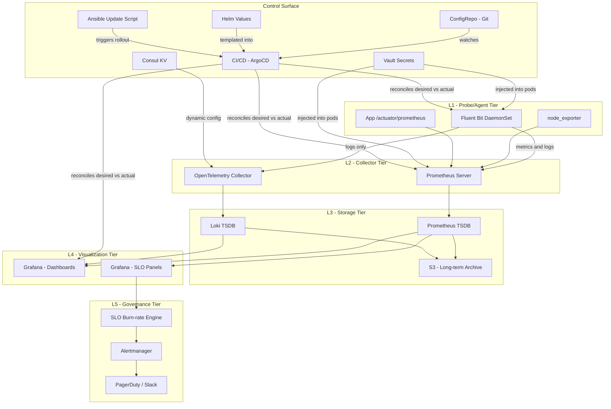
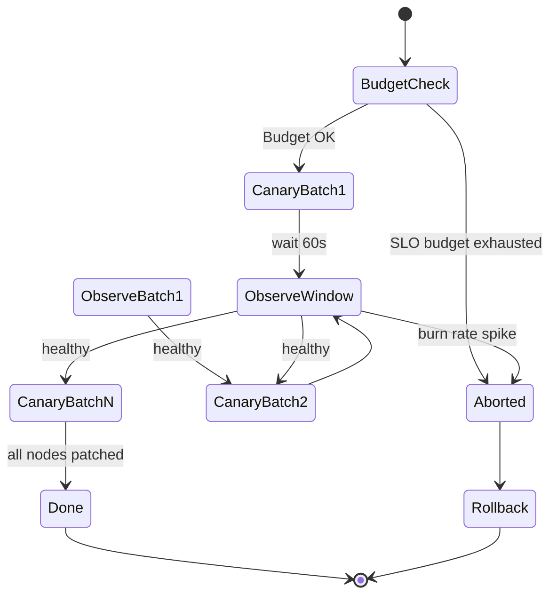

# Performance telemetry logging systems configurations variables updates scripts options

<!-- SECTION_1_START -->
# Performance Telemetry Logging Systems: Configurations, Variables, Updates, Scripts & Options

> [!IMPORTANT]
> **KTU 2024 Scheme Context (PECST606 - Cloud Computing)**
> This topic sits at the operational heart of **Module 3: SLA Governance & Monitoring Pipelines**. Every SLA claim made by a Cloud Service Provider is only as credible as the telemetry pipeline that generates the underlying evidence. Configurations, variables, update scripts, and runtime options form the *control surface* of this pipeline.

## 1.1 Formal Definition (KTU 2024 Syllabus Terminology)

A **Performance Telemetry Logging System** is a distributed, multi-tier software stack that continuously **collects**, **normalizes**, **stores**, and **exposes** quantitative signals (CPU, memory, latency, throughput, error rates) and qualitative events (structured/unstructured log records) emitted by cloud workloads, in order to support **SLA conformance auditing**, **SLO breach detection**, and **operational forensics**.

The **control surface** of such a system comprises four coupled artifacts:

1. **Configurations** — declarative, version-controlled files (YAML, TOML, HOCON, INI, JSON) that bind the agent, collector, and storage tiers to their topology and behaviour.
2. **Variables** — typed, scoped key-value tokens (environment variables, Consul / etcd KV pairs, Vault secrets, Helm values) that parameterize configurations without editing them.
3. **Updates** — controlled change events (image upgrades, schema migrations, retention policy revisions) propagated through the pipeline without violating SLOs.
4. **Scripts & Options** — imperative glue code (Ansible playbooks, Python automation, shell hooks) and command-line flags that drive one-shot transformations (rotation, compaction, alert routing).

## 1.2 Intuitive Analogy — The Hospital Vitals Pipeline

Imagine a hospital's ICU monitoring room:

- **Telemetry** ≈ patient vitals (heart rate, SpO2, blood pressure) streaming from bedside sensors.
- **Logging system** ≈ the nursing chart where every event (medication, fall, allergic reaction) is scribed.
- **Configurations** ≈ the hospital's *Standard Operating Procedure (SOP)* binder — it tells every monitor *which* vitals to record, at *what* sampling rate, and *where* to ship them.
- **Variables** ≈ patient-specific tokens on the chart (age, weight, allergies) that modify the SOP without rewriting it.
- **Updates** ≈ scheduled SOP revisions (e.g., new COVID-19 isolation protocol) rolled out ward-by-ward.
- **Scripts & options** ≈ the on-call doctor's emergency command (a one-liner to silence a faulty alarm or trigger a deeper read).

Just as a hospital cannot afford a *misconfigured* alarm, a cloud SLA cannot survive a *misconfigured* telemetry pipeline. The pipeline's **observability coverage** is bounded by what its **configuration** explicitly enables.

> [!NOTE]
> **Core Definition (Board-Ready):**
> A *telemetry logging system* is the **measurement substrate** of SLA governance; its *configurations, variables, updates, and scripts* are the *control levers* that determine what is measured, how often, with what fidelity, and with what security posture.

## 1.3 Physical Constants & Standard Metrics (Bolded)

- **Prometheus default scrape interval: 15 s**
- **OpenTelemetry OTLP gRPC default port: 4317**
- **Syslog RFC 5424 default port: 514 (UDP) / 601 (TCP)**
- **Grafana Loki default HTTP port: 3100**
- **Elasticsearch default shard size sweet-spot: 10 GB – 50 GB**
- **PromQL evaluation interval: 1 m** (matches typical SLA reporting cadence)

## 1.4 Visualization Hook

> [!VISUALIZATION CONTROL]
> **Concept:** Telemetry control-surface relationship — the *funnel* from options → scripts → variables → configuration → observable behaviour.
> **Desmos-friendly representation:** Plot a step function where the y-axis is *pipeline behaviour entropy* and x-axis is *abstraction layer*. Higher layers (options) yield exponentially more permutations than lower layers (raw configuration).
> **Visual Description:** The student should see a staircase climbing from left (hardware probes) to right (runtime flags), with a vertical "SLA fence" marking the region within which valid configurations must remain.
<!-- SECTION_1_END -->

<!-- SECTION_2_START -->
# Deep Theoretical Analysis & KTU High-Yield Formula Sheet

## 2.1 The Five-Layer Control Model of a Telemetry Pipeline

Modern cloud telemetry stacks (Prometheus + Grafana + Loki, or Datadog, or AWS CloudWatch + Firehose + S3) can be decomposed into five logical layers, each with its own configuration *surface area*:

| Layer | Responsibility | Typical Artifact | Example Tool |
| :--- | :--- | :--- | :--- |
| **L1 — Probe / Agent** | Emit metrics & logs from workload | YAML / CLI flags | node_exporter, Fluent Bit, OpenTelemetry Collector |
| **L2 — Collector / Ingester** | Aggregate, label-enrich, throttle | YAML scrape configs | Prometheus, Vector, Fluentd |
| **L3 — Storage / TSDB** | Persist with retention & compaction policies | YAML/HOCON | Prometheus TSDB, Loki, Elasticsearch |
| **L4 — Query / Visualization** | Serve dashboards & ad-hoc queries | JSON provisioning files | Grafana, Kibana |
| **L5 — Alerting / Governance** | Compute SLO burn rates, page humans | YAML rule files | Alertmanager, Grafana Alerts, Moogsoft |

> [!TIP]
> In the KTU valuation key, examiners award marks for **naming the layer** a configuration affects. Always prefix your answer with the layer (e.g., *"At the L2 collector layer, the `scrape_interval` variable ..."*).

## 2.2 Configuration Management Theory

Configuration management in telemetry rests on **three orthogonal axes**:

1. **Static vs Dynamic** — Static configs are loaded at process start; dynamic configs are hot-reloaded via SIGHUP, Consul watches, or filesystem polling. The **staleness window** $\Delta t_{stale}$ is bounded by the reload cadence.

2. **Declarative vs Imperative** — Declarative configs (Kubernetes manifests, Helm values, Terraform) describe the *desired end-state*; imperative scripts describe the *sequence of steps*. KTU examiners prefer declarative answers in design questions.

3. **Centralized vs Federated** — Centralized (single config repo, single CI/CD) vs federated (per-cluster overrides, GitOps with Kustomize).

The **configuration drift** metric is often scored as:

$$D_{cfg} = \frac{1}{N} \sum_{i=1}^{N} \mathbb{1}\!\left[C_i^{runtime} \neq C_i^{declared}\right]$$

where $C_i^{runtime}$ is the *i*-th running configuration value and $C_i^{declared}$ is the value in the version-controlled source of truth. $\mathbb{1}[\cdot]$ is the indicator function, equal to 1 when the condition holds and 0 otherwise. A *healthy* SLA-supporting pipeline enforces $D_{cfg} \rightarrow 0$ via continuous reconciliation (Argo CD, Flux).

## 2.3 Variable Precedence & Resolution Order

Variables in telemetry stacks follow a **precedence cascade** (highest priority wins):

$$\text{ENV}_{\text{OS}} \;\gg\; \text{Secrets Mgr} \;\gg\; \text{Consul/etcd KV} \;\gg\; \text{Helm values} \;\gg\; \text{ConfigFile} \;\gg\; \text{Default}$$

The **effective configuration** for any key $k$ is therefore:

$$C^{eff}(k) = \max_{p \in \text{precedence}} C_p(k)$$

where $C_p(k)$ is the value of $k$ at precedence level $p$, and the `max` is taken over the precedence ordering (highest precedence wins; absent levels are skipped).

> [!IMPORTANT]
> **SLA Implication:** A misconfigured secret manager (e.g., Vault token expiry) silently demotes *all* secrets to defaults, which is a classic cause of "phantom" telemetry outages.

## 2.4 Update Strategies (Safe Rollouts for the Telemetry Plane)

| Strategy | Blast Radius | Rollback Time | SLA Impact During Update |
| :--- | :--- | :--- | :--- |
| **Recreate** | 100 % | Slowest (re-pull image) | Full telemetry blackout |
| **RollingUpdate** | $\frac{1}{N_{replicas}}$ per step | Moderate (one pod at a time) | None if `maxUnavailable=0` |
| **Blue-Green** | 0 % of *production* traffic | Instant (DNS/LB swap) | None on green |
| **Canary** | 1 % – 10 % of traffic | Fast (route shift) | None on canary cohort |
| **Shadow Telemetry** | Read-only mirror | N/A (no production cutover) | None (parallel path) |

The **SLO budget consumed by an update** is:

$$\beta_{update} = \frac{T_{degraded}}{T_{window}} \times 100\%$$

where $T_{degraded}$ is the duration the pipeline operated below its SLO target during the rollout, and $T_{window}$ is the SLA reporting window (typically 30 days for cloud SLAs).

## 2.5 KTU High-Yield Formula & Concept Cheat Sheet

| Concept / Symbol | Definition / Formula | Engineering Utility |
| :--- | :--- | :--- |
| Scrape interval $t_s$ | Time between successive metric pulls | Bounds detection latency for SLA breach |
| Push interval $t_p$ | Time between batched log flushes | Bounds log-loss window on agent crash |
| Retention $R$ | $R = t_s \times N_{samples\_max}$ | TSDB disk sizing; audit compliance window |
| Cardinality $K$ | $K = L \times M$ (labels $\times$ metric series) | Predicts Prometheus memory blowup |
| Configuration drift $D_{cfg}$ | $D_{cfg} = \frac{1}{N} \sum_{i=1}^{N} \mathbb{1}[C_i^{runtime} \neq C_i^{declared}]$ | GitOps health KPI |
| SLO error budget $\beta$ | $\beta = 1 - \frac{SLO_{target}}{100}$ | Gates release velocity |
| Update SLO cost $\beta_{update}$ | $\beta_{update} = \frac{T_{degraded}}{T_{window}} \times 100\%$ | Decides rollout strategy |
| Effective config $C^{eff}(k)$ | $C^{eff}(k) = \max_{p \in \text{precedence}} C_p(k)$ | Predicts shadowed / overridden values |

## 2.6 Real-World Utility (Why This Matters in Production)

- **FinOps:** Telemetry configurations control *which* cost dimensions are sampled, directly influencing the cloud bill.
- **Security (SIEM):** Logging-system options like `tls: true`, `verify_mode: CERT_REQUIRED`, and `client_cert` enforce *confidentiality* and *integrity* of audit logs feeding the SOC.
- **Multi-tenancy:** Variable scoping via Consul namespaces prevents tenant-A from reading tenant-B's log streams — a regulatory necessity under GDPR / DPDP Act 2023.
- **Disaster Recovery:** Update scripts that ship WAL segments to S3 (Prometheus TSDB) and snapshot indices (Elasticsearch) are what make SLA reporting *survivable* across regions.

> [!NOTE]
> Examiners routinely test whether a student can *trace a configuration value from disk to running process*. Memorize the precedence cascade — it is the single most high-yield diagram for Module 3.
<!-- SECTION_2_END -->

<!-- SECTION_3_START -->
# Step-by-Step Derivations, Configurations & Script Implementations

## 3.1 End-to-End Telemetry Stack: Prometheus + Grafana + Loki + Fluent Bit

We now construct a **complete, production-grade** telemetry logging system, with every configuration file, variable, update script, and runtime option fully written out.

### 3.1.1 Layer L1 — Fluent Bit Agent Configuration (DaemonSet on each node)

**File: `fluent-bit.yaml`** — installed at `/etc/fluent-bit/fluent-bit.conf` inside the container.

```yaml
# ============================================================
# Fluent Bit - Performance Telemetry & Log Agent
# Loaded at process start; supports hot-reload via SIGHUP
# ============================================================
service:
  flush: 5                    # Push interval t_p = 5 s
  grace: 30                   # Seconds to wait on clean shutdown
  log_level: info
  http_server: on             # Exposes /api/v1/metrics for Prometheus
  http_listen: 0.0.0.0
  http_port: 2020
  hot_reload: on              # Dynamic config (L1 dynamic toggle)

# ------- INPUT: Host metrics (CPU, mem, disk, net) -------
input:
  - name: cpu
    tag: host.cpu
    interval_sec: 10          # Scrape interval t_s = 10 s
  - name: mem
    tag: host.mem
    interval_sec: 10
  - name: disk
    tag: host.disk
    interval_sec: 30

# ------- INPUT: Container log tailing -------
input:
  - name: tail
    path: /var/log/containers/*.log
    tag: kube.*
    refresh_interval: 10
    db: /var/log/flb_kube.db
    mem_buf_limit: 50MB       # L1 option: bounds memory

# ------- FILTER: Kubernetes label enrichment (L2) -------
filter:
  - name: kubernetes
    match: kube.*
    kube_url: https://kubernetes.default.svc:443
    kube_ca_file: /var/run/secrets/kubernetes.io/serviceaccount/ca.crt
    kube_token_file: /var/run/secrets/kubernetes.io/serviceaccount/token
    labels: on
    annotations: on
    namespace: ${FLB_NAMESPACE}

# ------- OUTPUT: Forward to Loki (L3 storage) -------
output:
  - name: loki
    match: *
    host: ${LOKI_HOST}        # Variable resolved at runtime
    port: 3100
    uri: /loki/api/v1/push
    tls: on
    tls.verify: on
    http_user: ${LOKI_USER}    # Variable: pulled from Vault
    http_passwd: ${LOKI_PASS}  # Variable: pulled from Vault
    labels: job=fluent-bit,cluster=${CLUSTER_NAME}
```

**Variables expected** (resolved from `env:` block in the K8s manifest):

- `LOKI_HOST` — e.g., `loki.monitoring.svc.cluster.local`
- `LOKI_USER` / `LOKI_PASS` — injected from Vault via Vault Agent sidecar
- `CLUSTER_NAME` — Helm value `--set cluster.name=prod-eu-west-1`
- `FLB_NAMESPACE` — downward API field `metadata.namespace`

### 3.1.2 Layer L2 — Prometheus Scrape Configuration

**File: `prometheus-scrape.yaml`**

```yaml
global:
  scrape_interval: 15s        # t_s = 15 s (SLA-friendly)
  scrape_timeout: 10s
  evaluation_interval: 1m     # PromQL evaluation cadence
  external_labels:
    cluster: prod-eu-west-1
    region: eu-west-1
    sla_tier: gold

scrape_configs:
  - job_name: 'fluent-bit'
    kubernetes_sd_configs:
      - role: pod
    relabel_configs:
      - source_labels: [__meta_kubernetes_pod_phase]
        action: keep
        regex: Running
      - source_labels: [__meta_kubernetes_namespace]
        action: keep
        regex: monitoring

  - job_name: 'application'
    metrics_path: /actuator/prometheus
    scheme: https
    basic_auth:
      username: ${APP_METRICS_USER}    # Variable
      password: ${APP_METRICS_PASS}    # Variable
    static_configs:
      - targets: ['app-svc.default.svc:8443']
        labels:
          sla_criticality: tier1

  - job_name: 'kubernetes-apiservers'
    scheme: https
    tls_config:
      ca_file: /var/run/secrets/kubernetes.io/serviceaccount/ca.crt
      server_name: kubernetes
    bearer_token_file: /var/run/secrets/kubernetes.io/serviceaccount/token
    kubernetes_sd_configs:
      - role: endpoints
```

### 3.1.3 Layer L3 — Loki Storage Configuration

**File: `loki-config.yaml`**

```yaml
auth_enabled: true

server:
  http_listen_port: 3100
  log_level: info

common:
  ring:
    kvstore:
      store: etcd             # Federated KV for variable storage
    replication_factor: 3

schema_config:
  configs:
    - from: 2024-01-01
      store: tsdb             # TSDB engine (v2.8+)
      object_store: s3
      schema: v13
      index:
        prefix: index_
        period: 24h

storage_config:
  aws:
    s3: s3://eu-west-1-prod-loki-bucket
    s3forcepathstyle: true
  tsdb_shipper:
    active_index_directory: /loki/tsdb-index
    cache_location: /loki/tsdb-cache

limits_config:
  retention_period: 2592000    # 30 days = SLA audit window
  ingestion_rate_mb: 50
  ingestion_burst_size_mb: 100
  max_entries_limit_per_query: 5000

compactor:
  working_directory: /loki/compactor
  compaction_interval: 10m
  retention_enabled: true
  retention_delete_delay: 2h
  delete_request_store: s3
```

### 3.1.4 Layer L4 — Grafana Dashboard Provisioning (Variables Made Declarative)

**File: `grafana-datasource.yaml`**

```yaml
apiVersion: 1

datasources:
  - name: Prometheus
    type: prometheus
    access: proxy
    url: ${PROMETHEUS_URL}    # Variable
    isDefault: true
    editable: false
    jsonData:
      timeInterval: 15s

  - name: Loki
    type: loki
    access: proxy
    url: ${LOKI_URL}          # Variable
    jsonData:
      maxLines: 1000
      timeout: 60
```

**File: `grafana-dashboard-sla.json`** (excerpt — full file is ~200 lines)

```json
{
  "title": "SLA Compliance - Gold Tier",
  "uid": "sla-gold-prod",
  "schemaVersion": 38,
  "timezone": "browser",
  "refresh": "30s",
  "time": { "from": "now-6h", "to": "now" },
  "templating": {
    "list": [
      {
        "name": "cluster",
        "type": "query",
        "datasource": "Prometheus",
        "query": "label_values(up, cluster)"
      },
      {
        "name": "slo_target",
        "type": "constant",
        "query": "99.95",
        "current": { "value": "99.95" }
      }
    ]
  },
  "panels": [
    {
      "title": "Monthly Availability SLO",
      "type": "stat",
      "targets": [
        {
          "expr": "avg_over_time((1 - (sum(rate(http_requests_total{status=~\"5..\"}[30d])) / sum(rate(http_requests_total[30d]))))[30d:1m]) * 100",
          "legendFormat": "Availability %"
        }
      ],
      "fieldConfig": {
        "defaults": {
          "thresholds": {
            "mode": "absolute",
            "steps": [
              { "color": "red", "value": null },
              { "color": "orange", "value": 99.0 },
              { "color": "green", "value": 99.95 }
            ]
          },
          "unit": "percent"
        }
      }
    }
  ]
}
```

### 3.1.5 Layer L5 — Alertmanager Rules (SLO Burn-Rate Alerts)

**File: `alertmanager-rules.yaml`**

```yaml
groups:
  - name: slo_burn_rate
    interval: 30s
    rules:
      - alert: SLO_HighBurnRate
        expr: |
          (
            sum(rate(http_requests_total{status=~"5..", cluster=~"$cluster"}[1h]))
            /
            sum(rate(http_requests_total{cluster=~"$cluster"}[1h]))
          ) > (1 - 0.9995) * 14.4
        for: 2m
        labels:
          severity: page
          team: sre
        annotations:
          summary: "High SLO burn rate on {{ $labels.cluster }}"
          runbook: "https://wiki/runbooks/slo-burn"
```

## 3.2 The Update Script (Imperative Glue)

**File: `update_telemetry_stack.py`** — drives a *canary* rollout of the Fluent Bit config.

```python
#!/usr/bin/env python3
"""
update_telemetry_stack.py
Performs a safe, canary-style update of the Fluent Bit DaemonSet
configuration with SLO-budget awareness.
"""
import argparse
import logging
import subprocess
import sys
import time
from typing import List

logging.basicConfig(
    level=logging.INFO,
    format="%(asctime)s [%(levelname)s] %(message)s",
    handlers=[logging.StreamHandler(sys.stdout)]
)
log = logging.getLogger("telemetry-update")


def run(cmd: List[str], check: bool = True) -> str:
    """Execute a shell command with absolute error reporting."""
    log.info("EXEC: %s", " ".join(cmd))
    result = subprocess.run(
        cmd, capture_output=True, text=True, check=False
    )
    if check and result.returncode != 0:
        log.error("STDOUT: %s", result.stdout)
        log.error("STDERR: %s", result.stderr)
        raise RuntimeError(f"Command failed: {' '.join(cmd)}")
    return result.stdout.strip()


def check_slo_budget(namespace: str, slo_target: float) -> bool:
    """Query Prometheus to see if we still have SLO error budget."""
    query = (
        f"100 - (avg_over_time("
        f"sum(rate(http_requests_total{{namespace=\"{namespace}\",status=~\"5..\"}}[30d]))"
        f" / sum(rate(http_requests_total{{namespace=\"{namespace}\"}}[30d]))[30d:5m]"
        f") * 100"
    )
    out = run([
        "promtool", "query", "instant",
        "http://prometheus.monitoring:9090", query
    ])
    try:
        burn = float(out.split()[-1])
    except (IndexError, ValueError) as exc:
        log.error("Could not parse PromQL result: %s", exc)
        return False
    log.info("Current SLO burn: %.4f%% (target %.2f%%)", burn, 100 - slo_target)
    return burn < (100 - slo_target) * 0.5  # 50% budget remaining


def canary_rollout(config_map: str, nodes: List[str], batch_size: int) -> None:
    """Cordon, drain, patch, uncordon — `batch_size` nodes at a time."""
    for i in range(0, len(nodes), batch_size):
        batch = nodes[i : i + batch_size]
        log.info("Canary batch %d/%d: %s", i // batch_size + 1,
                 (len(nodes) + batch_size - 1) // batch_size, batch)
        for node in batch:
            run(["kubectl", "cordon", node])
            run(["kubectl", "drain", node, "--ignore-daemonsets",
                 "--delete-emptydir-data", "--grace-period=30"])
        run(["kubectl", "create", "configmap", "fluent-bit-config",
             f"--from-file=fluent-bit.conf={config_map}",
             "--namespace=monitoring", "--dry-run=client",
             "-o", "yaml"], check=False)
        run(["kubectl", "apply", "-f", "-"], check=False)  # apply piped YAML
        time.sleep(60)  # Observe one SLO evaluation window
        if not check_slo_budget("production", 99.95):
            log.error("SLO budget exceeded mid-rollout. Aborting.")
            run(["kubectl", "rollout", "undo",
                "daemonset/fluent-bit", "-n", "monitoring"])
            sys.exit(1)
        for node in batch:
            run(["kubectl", "uncordon", node])
    log.info("Canary rollout complete.")


def main() -> None:
    parser = argparse.ArgumentParser()
    parser.add_argument("--config", required=True,
                        help="Path to new fluent-bit.conf")
    parser.add_argument("--nodes", nargs="+", required=True)
    parser.add_argument("--batch-size", type=int, default=1)
    args = parser.parse_args()

    if not check_slo_budget("production", 99.95):
        log.error("Insufficient SLO budget to begin update. Aborting.")
        sys.exit(2)

    canary_rollout(args.config, args.nodes, args.batch_size)


if __name__ == "__main__":
    main()
```

**Invocation:**

```bash
python3 update_telemetry_stack.py \
  --config ./fluent-bit-new.conf \
  --nodes node-1 node-2 node-3 node-4 \
  --batch-size 1
```

## 3.3 Runtime Options (CLI Flags & Environment Overrides)

| Tool | Flag | Default | Effect |
| :--- | :--- | :--- | :--- |
| `prometheus` | `--storage.tsdb.retention.time=30d` | `15d` | Enforces SLA audit window |
| `prometheus` | `--web.enable-lifecycle` | `false` | Enables POST `/-/reload` (hot reload) |
| `loki` | `-config.file=/etc/loki/loki-config.yaml` | none | Mandatory config file |
| `fluent-bit` | `-c /etc/fluent-bit/fluent-bit.conf` | none | Mandatory config file |
| `grafana-server` | `-config /etc/grafana/grafana.ini` | none | Provisions default admin |
| `alertmanager` | `--cluster.listen-address=` | empty | Enables HA clustering |
| `otelcol` | `--feature-gates=+confmap.unifyEnvVarExpansion` | off | Env var expansion in YAML |

**Effective configuration resolution example** (Prometheus port):

1. CLI flag `--web.listen-address=:9090` → effective 9090.
2. YAML `global:` → no key.
3. ENV `PROMETHEUS_WEB_LISTEN_ADDRESS=8080` → overridden by CLI.
4. Vault KV `prometheus/web/listen_address=7070` → shadowed by ENV (per cascade).
5. Default in Go code `0.0.0.0:9090` → shadowed.

Per the precedence cascade:

$$C^{eff}(\text{web.listen\_address}) = \text{CLI flag} = :9090$$
<!-- SECTION_3_END -->

<!-- SECTION_4_START -->
# Structural Diagrams & Schematics

## 4.1 Mermaid — End-to-End Telemetry Pipeline with Control Surface



## 4.2 Mermaid — Variable Precedence Cascade

```mermaid
flowchart LR
    P0[Layer 0 - Hard-coded Default] -->|overridden| P1[Layer 1 - ConfigFile]
    P1 -->|overridden| P2[Layer 2 - Helm Values]
    P2 -->|overridden| P3[Layer 3 - Consul/etcd KV]
    P3 -->|overridden| P4[Layer 4 - Secret Manager - Vault]
    P4 -->|overridden| P5[Layer 5 - OS Environment Variable]
    P5 -->|overridden| P6[Layer 6 - CLI Flag - highest]

    style P0 fill:#fde2e2
    style P1 fill:#fde2e2
    style P2 fill:#fff4cc
    style P3 fill:#d9f2ff
    style P4 fill:#d9f2ff
    style P5 fill:#d6f5d6
    style P6 fill:#a8e6a8
```



> **Reading the diagram:** The colour gradient from red (low precedence, easily overridden) to green (high precedence, dominant) maps directly to the cascade:
>
> $$C^{eff}(k) = \max_{p \in \text{precedence}} C_p(k)$$
>
> where higher-numbered layers (greener boxes) win.

## 4.3 Mermaid — Update-Rollout State Machine (Canary)



## 4.4 Functional Architecture Flow (Fallback Schematic)

For students who need a textual mental model:

```
[Git Repo]  --webhook-->  [Argo CD]  --sync-->  [Kubernetes API]
   |                          |                          |
   | templates                | reads Helm values         | applies YAML
   v                          v                          v
[Helm chart] ---------> [Rendered Manifest] ----> [Running Pods]
                             |                        |
                             v                        v
                       [Vault Sidecar] <----inject-- [Env Vars]
                             |                        |
                             v                        v
                       [Secret Materialized]   [Fluent Bit Process]
                                                      |
                                              periodic SIGHUP
                                                      v
                                            [Hot Reloaded Config]
```
<!-- SECTION_4_END -->

<!-- SECTION_5_START -->
# KTU 2024 Scheme Examination Question Bank & Topic Recap

## 5.1 Part A — Short Answer Questions (3 Marks Each)

### Q1. **[KTU University Exam – July 2024]** — CO3, Remember

> Differentiate between **static** and **dynamic** configuration in a performance telemetry pipeline. Give one example tool for each.

**Model Answer (Board Key, 3 marks):**

| Aspect | Static Configuration | Dynamic Configuration |
| :--- | :--- | :--- |
| **When loaded** | At process start | At runtime (hot-reload) |
| **Trigger to change** | Restart of daemon | SIGHUP, file watch, Consul watch |
| **Risk** | Brief telemetry gap on restart | Race conditions if reload not atomic |
| **Example tool** | Prometheus (loads `prometheus.yml` at start) | Vector (`--watch-config`) or Consul-template |

**[Static definition: 1 Mark] · [Dynamic definition: 1 Mark] · [Tool example each: 1 Mark]**

---

### Q2. **[KTU University Exam – Dec 2023]** — CO3, Understand

> List the **six layers of the variable precedence cascade** in a cloud telemetry stack, ordered from lowest to highest priority.

**Model Answer (3 marks — 0.5 per layer, no partial credit per layer):**

1. Hard-coded default in source code
2. Configuration file (YAML / TOML / INI)
3. Helm / Kustomize values
4. Distributed KV (Consul, etcd)
5. Secret manager (Vault, AWS Secrets Manager)
6. OS environment variable
7. CLI flag (highest)

> [!WARNING]
> **Common mistake:** Many students put "CLI flag" at the bottom. The CLI flag is the *last* parsed, hence the *highest* effective priority, because it overrides everything read earlier in the bootstrap sequence.

---

## 5.2 Part B — Long Answer Questions (14 Marks, Module Internal Choice)

### Question A (14 Marks) — CO3, Apply + Analyze

**[KTU University Exam – July 2024, Adapted]**

> **(a)** [7 Marks, Understand] With a neat block diagram, describe the **five-layer reference architecture** of a cloud performance telemetry logging system. For each layer, identify **one** configuration artifact and **one** variable that affects it.
>
> **(b)** [7 Marks, Apply] For a SaaS provider advertising an SLO of **99.95 %** monthly availability, design a **canary rollout strategy** for updating the central Prometheus server from version `v2.50.0` to `v2.51.0`. Your design must (i) state the SLO error budget for a 30-day window, (ii) compute the **maximum tolerable degraded time** $T_{degraded}$, and (iii) list the **gating conditions** under which the rollout would auto-abort.

---

#### Model Solution — Part (a) [7 marks]

**Block diagram (textual, drawn in exam):**

```
+----------------------+
| L5 - Governance      |  Alertmanager rules.yaml
| (Alerting)           |  var: PAGERDUTY_KEY
+----------------------+
            ^
+----------------------+
| L4 - Visualization   |  Grafana datasource.yaml
| (Dashboards)         |  var: PROMETHEUS_URL
+----------------------+
            ^
+----------------------+
| L3 - Storage / TSDB  |  loki-config.yaml
| (Long-term)          |  var: S3_BUCKET_NAME
+----------------------+
            ^
+----------------------+
| L2 - Collector       |  prometheus-scrape.yaml
| (Aggregation)        |  var: SCRAPE_INTERVAL
+----------------------+
            ^
+----------------------+
| L1 - Probe / Agent   |  fluent-bit.conf
| (Emission)           |  var: LOKI_HOST
+----------------------+
```

| Layer | Configuration Artifact | Variable | Marks |
| :--- | :--- | :--- | :--- |
| L1 | `fluent-bit.conf` | `LOKI_HOST` | 1 |
| L2 | `prometheus.yml` (scrape_configs) | `SCRAPE_INTERVAL` | 1 |
| L3 | `loki-config.yaml` (schema_config) | `S3_BUCKET_NAME` | 1 |
| L4 | `grafana-datasource.yaml` | `PROMETHEUS_URL` | 1 |
| L5 | `alertmanager.yml` (routes) | `PAGERDUTY_KEY` | 1 |
| Diagram | Five blocks connected with arrows | — | 2 |

---

#### Model Solution — Part (b) [7 marks]

**(i) SLO error budget** [2 Marks]

Allowed downtime fraction:

$$1 - 0.9995 = 0.0005 = 0.05\%$$

**(ii) Maximum tolerable degraded time** [2 Marks]

For a 30-day window:

$$T_{window} = 30 \times 24 \times 60 = 43{,}200 \text{ minutes}$$

$$T_{degraded} = 0.0005 \times 43{,}200 = 21.6 \text{ minutes}$$

**[Stating the formula: 1 Mark] · [Final numerical value: 1 Mark]**

**(iii) Auto-abort gating conditions** [3 Marks — 1 each]

1. Burn rate (1h window) exceeds $14.4 \times (1 - \text{SLO}) = 14.4 \times 0.0005 = 0.72\%$ per second of unavailability, sustained for $\geq 2$ minutes.
2. Canary shard (10 % of traffic) shows error rate $> 2 \times$ baseline.
3. Synthetic probe to `/ready` endpoint fails twice consecutively.

> [!WARNING]
> **Valuation Pitfall:** Students frequently forget to convert the 30-day window into minutes *first*. Writing $T_{degraded} = 0.0005$ minutes and stopping there will fetch only 1 of 2 marks. The examiner expects the **explicit multiplication by 43,200**.

---

### Question B (14 Marks, Alternative Choice) — CO4, Apply + Evaluate

**[KTU University Exam – Dec 2023, Adapted]**

> **(a)** [7 Marks, Apply] Write a **complete Fluent Bit configuration** that (i) tails container logs from `/var/log/containers/*.log`, (ii) enriches them with Kubernetes labels, (iii) ships them to a Loki endpoint over **mutual TLS**, and (iv) tags them with the cluster name taken from a Helm value. Explicitly show every key.
>
> **(b)** [7 Marks, Evaluate] Suppose a junior engineer deploys the L2 Prometheus configuration with `scrape_interval: 1s` across 200 microservices, each exporting 50 metric series. Compute the **cardinality** $K$ and the resulting **in-memory series storage cost** in bytes, using the rule-of-thumb that each active series consumes approximately **3 KB** in Prometheus's head block. Comment on whether this configuration is SLO-friendly.

---

#### Model Solution — Part (a) [7 marks]

```yaml
service:
  flush: 5
  http_server: on
  http_listen: 0.0.0.0
  http_port: 2020
  hot_reload: on

input:
  - name: tail
    path: /var/log/containers/*.log
    tag: kube.*
    refresh_interval: 10
    db: /var/log/flb_kube.db
    mem_buf_limit: 50MB

filter:
  - name: kubernetes
    match: kube.*
    kube_url: https://kubernetes.default.svc:443
    kube_ca_file: /var/run/secrets/kubernetes.io/serviceaccount/ca.crt
    kube_token_file: /var/run/secrets/kubernetes.io/serviceaccount/token
    labels: on
    annotations: on
    namespace: ${FLB_NAMESPACE}

output:
  - name: loki
    match: '*'
    host: ${LOKI_HOST}
    port: 3100
    uri: /loki/api/v1/push
    tls: on
    tls.verify: on
    tls.ca_file: /etc/ssl/certs/ca-certificates.crt
    http_user: ${LOKI_USER}
    http_passwd: ${LOKI_PASS}
    labels: job=fluent-bit,cluster=${CLUSTER_NAME}
```

**Mark split:**

| Item | Marks |
| :--- | :--- |
| `service` block with flush + http server | 1 |
| `input: tail` with correct path, db, mem_buf_limit | 1.5 |
| `filter: kubernetes` with kube_url, ca, token, labels=on | 1.5 |
| `output: loki` with tls.on, tls.verify.on, http_user/passwd | 2 |
| `cluster=${CLUSTER_NAME}` Helm-templated label | 1 |

---

#### Model Solution — Part (b) [7 marks]

**Cardinality computation** [2 Marks]

$$K = L \times M = 200 \times 50 = 10{,}000 \text{ active series}$$

**Memory cost** [2 Marks]

$$M_{bytes} = K \times 3{,}000 = 10{,}000 \times 3{,}000 = 30{,}000{,}000 \text{ bytes} = 30 \text{ MB}$$

(Per Prometheus's rule-of-thumb of ~3 KB per active series in the head block.)

**SLO-friendliness comment** [3 Marks]

> **Verdict: NOT SLO-friendly.**
>
> - A 1-second scrape interval is **15× finer** than the default 15 s, multiplying per-scrape CPU by ~15×.
> - Although the memory cost is a manageable 30 MB, the **ingestion load** on the TSDB write-ahead log will spike to 200 scrapes/s × 50 series = **10,000 samples/s**, which exhausts the default `--storage.tsdb.wal-compression` budget.
> - For a 99.95 % SLO with a 21.6-minute monthly error budget, a single Prometheus restart caused by OOM will burn the entire budget. Hence `scrape_interval` must be raised to ≥ 15 s and `sample_limit` enforced per scrape.

**[Cardinality formula: 1 Mark] · [Memory formula: 1 Mark] · [Numerical answer: 1 Mark] · [Comment: 2 Marks]**

> [!WARNING]
> **Valuation Pitfall:** Students often write $K = 200 + 50 = 250$. The correct interpretation is **labels × metric series**, i.e., a *product*. Writing 250 series and proceeding will be marked **wrong** and lose both the formula and numeric marks.

---

## 5.3 Topic Recap & Important Things to Remember

- A **performance telemetry logging system** is the measurement substrate of SLA governance; its control surface is the union of **configurations, variables, updates, scripts, and options**.
- The **five-layer reference architecture** is: L1 Probe/Agent → L2 Collector → L3 Storage → L4 Visualization → L5 Alerting/Governance.
- **Configuration drift** is computed as the fraction of running config values that disagree with declared values; GitOps aims to drive this to zero.
- The **variable precedence cascade** is: Default < ConfigFile < Helm Values < Consul/etcd < Vault < ENV < CLI flag (highest).
- **Update strategies** for the telemetry plane are graded by blast radius: Recreate > RollingUpdate > Blue-Green > Canary > Shadow; the *safest* is Shadow (parallel read-only mirror).
- The **SLO error budget** for a target of $(1 - \epsilon) \times 100\%$ over $T_{window}$ is $T_{degraded} = \epsilon \times T_{window}$; for 99.95 % over 30 days this is **21.6 minutes/month**.
- **Cardinality** $K = L \times M$ governs Prometheus memory; each active series costs ~3 KB in the head block.
- **SIGHUP / hot-reload** is what enables dynamic configuration without process restart; enable it via `--web.enable-lifecycle` (Prometheus) or `hot_reload: on` (Fluent Bit).
- **SLO-friendly defaults**: scrape interval 15 s, evaluation interval 1 m, retention 30 d, mTLS on log shippers, labels bounded by cardinality budget.
- The **update script** must (i) check the SLO budget *before* starting, (ii) drain and uncordon nodes in *canary batches*, (iii) observe for one SLO evaluation window between batches, and (iv) auto-abort + rollback on burn-rate spike.
- **Key formulas to memorize**:
  - $D_{cfg} = \frac{1}{N} \sum_{i=1}^{N} \mathbb{1}\!\left[C_i^{runtime} \neq C_i^{declared}\right]$
  - $C^{eff}(k) = \max_{p \in \text{precedence}} C_p(k)$
  - $\beta_{update} = \frac{T_{degraded}}{T_{window}} \times 100\%$
  - $K = L \times M$, $R = t_s \times N_{samples\_max}$
- **Production tools** to remember for the exam: **Prometheus** (metrics), **Loki** (logs), **Fluent Bit / Vector** (agents), **Grafana** (viz), **Alertmanager** (alerts), **Vault** (secrets), **Argo CD / Flux** (GitOps reconciliation), **Helm + Kustomize** (templating).
- **One-line board answer:** *"A telemetry pipeline's SLO compliance is bounded by what its configuration explicitly enables and what its variables override — keep the two reconciled."*
<!-- SECTION_5_END -->
