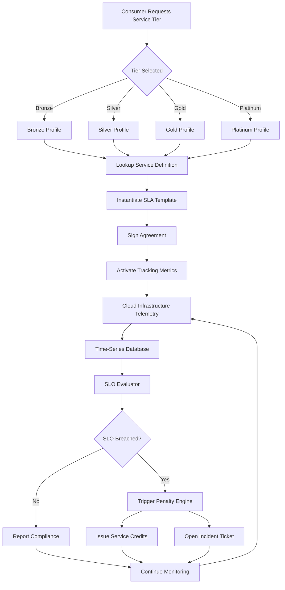
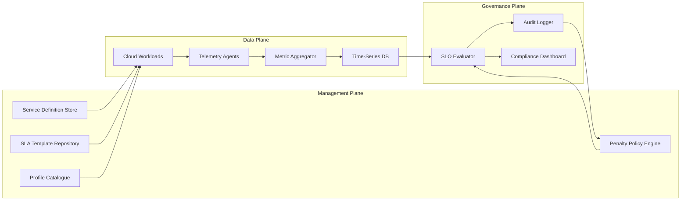
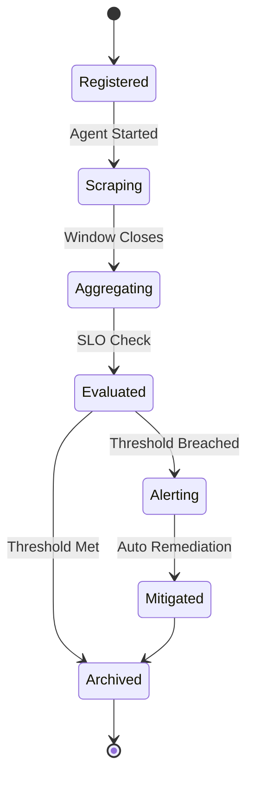
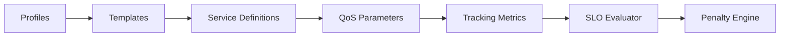
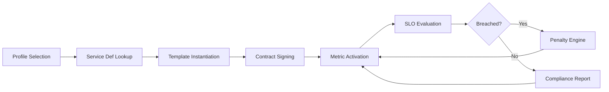

# Quality of service parameters tracking metrics service definitions templates profiles

<!-- SECTION_1_START -->
# Quality of Service Parameters, Tracking Metrics, Service Definitions, Templates & Profiles

## 1.1 Formal Definition (KTU 2024 Syllabus Terminology)

> [!IMPORTANT]
> **Quality of Service (QoS) Parameters** are the measurable, contractually-agreed-upon non-functional attributes of a cloud service that quantify its expected behavior, performance, and reliability. In SLA (Service Level Agreement) governance, these parameters are codified into **Service Level Objectives (SLOs)**, monitored through **Tracking Metrics**, structured using **Service Definitions**, instantiated through **Templates**, and bundled into reusable **Profiles** for tiered service offerings.

In the KTU 2024 Cloud Computing (PECST606) framework, these five artifacts form the operational backbone of any cloud SLA lifecycle:

| Artifact | Academic Definition |
| :--- | :--- |
| **QoS Parameters** | Quantitative non-functional attributes (e.g., availability, latency, throughput). |
| **Tracking Metrics** | Time-series telemetry data points used to measure QoS parameter compliance. |
| **Service Definitions** | Declarative specifications describing what a cloud service delivers, its boundaries, and its commitments. |
| **Templates** | Reusable, parameterised SLA scaffolding that allows rapid instantiation of new agreements. |
| **Profiles** | Named bundles of QoS thresholds mapped to consumer tiers (e.g., *Bronze*, *Silver*, *Gold*). |

> [!NOTE]
> **Key Distinction (High-Frequency KTU Question):** An **SLO** is the *target value* (e.g., 99.9% availability), an **SLA** is the *contract containing the SLO + penalties*, and an **SLI** (Service Level Indicator) is the *actual measured metric*.

---

## 1.2 Intuitive Overview — The "Cloud Hotel Chain" Analogy

Imagine a multinational cloud provider operating as a luxury **hotel chain** with three consumer tiers: *Business Class*, *First Class*, and *Penthouse Suite*.

- **QoS Parameters** → The promises on the hotel's marketing brochure: *"Check-in within 5 minutes"*, *"Room cleaned every 2 hours"*, *"Wi-Fi always available"*.
- **Tracking Metrics** → The hotel's hidden **sensor network** (lobby cameras, Wi-Fi logs, housekeeping tablets) that records what *actually* happened every minute.
- **Service Definitions** → The **engineering blueprints** that describe what a "Standard Room" actually contains (bed size, amenities, dimensions).
- **Templates** → A **boilerplate legal contract** with blank fields (guest name, dates, tier) that the front desk fills in instantly for every booking.
- **Profiles** → The **tiered menu cards** (`Bronze`, `Silver`, `Gold`) grouping the right QoS thresholds with the right price.

When a *First Class* guest books a room, the hotel:
1. Selects the **`FirstClassProfile`** (Profile).
2. Instantiates the **SLA Template** (Template) and fills in guest-specific fields.
3. Looks up the **Service Definition** for "Deluxe Room" to know what must be delivered.
4. Activates **Tracking Metrics** (uptime sensors, latency probes) to monitor compliance in real time.
5. If any **QoS parameter** is breached, the automated penalty/refund engine triggers.

> [!TIP]
> **Exam Memory Hook:** Think **"Promises → Sensors → Blueprints → Forms → Tier-Cards"**. This maps directly to *Parameters → Metrics → Definitions → Templates → Profiles*.

---

## 1.3 Standard Metrics & Constants Used in KTU Board Valuations

> [!IMPORTANT]
> The following **standard availability tiers** are mandated by the *Uptime Institute Tier Classification* and appear verbatim in KTU model answers. Memorise the decimal expansions below — they are the most common source of easy 1-mark recall questions.

| Tier Notation | Allowed Downtime / Year | Allowed Downtime / Month | Allowed Downtime / Week |
| :--- | :--- | :--- | :--- |
| **99% ("Two Nines")** | **3.65 days** | 7.20 hours | 1.68 hours |
| **99.9% ("Three Nines")** | **8.77 hours** | 43.83 minutes | 10.08 minutes |
| **99.95%** | **4.38 hours** | 21.92 minutes | 5.04 minutes |
| **99.99% ("Four Nines")** | **52.60 minutes** | 4.38 minutes | 1.01 minutes |
| **99.999% ("Five Nines")** | **5.26 minutes** | 26.30 seconds | 6.05 seconds |

> [!VISUALIZATION CONTROL]
> **Concept:** Downtime vs. Availability Tier (Inverse Exponential Decay)
> **Plotting Concept (Desmos Input):**
> * X-axis: $x$ = Availability Percentage (from 99% to 100%)
> * Y-axis: $y$ = Allowed Annual Downtime in minutes
> * Equation: $y(x) = 525600 \times (1 - x/100)$  where $525600$ = total minutes in a year.
> **Visual Description:** A nearly-vertical exponential-decay curve plunging toward zero as $x \to 100$. Students should observe that moving from *99.9%* to *99.99%* reduces allowed downtime by **10×**, not by 0.09%. This is the *non-linear cost of reliability*.
<!-- SECTION_1_END -->

<!-- SECTION_2_START -->
# Deep Theoretical Analysis & KTU High-Yield Formula Sheet

## 2.1 The Five Artifacts — Structural Breakdown

### 2.1.1 QoS Parameters (The *What* We Promise)

QoS parameters are classified into four engineering families:

**A. Availability Family**
- **Availability ($A$)** — Probability that the service is operational when requested.
- **Reliability ($R$)** — Probability of failure-free operation over a specified interval.
- **Mean Time Between Failures (MTBF)** — Average operational duration between two consecutive failures.
- **Mean Time To Repair (MTTR)** — Average time taken to restore service after a failure.
- **Mean Time To Failure (MTTF)** — For non-repairable components, the expected lifetime.

**B. Performance Family**
- **Latency** — Time taken for a single request to traverse the system (milliseconds).
- **Response Time** — End-to-end time from request submission to full response receipt.
- **Throughput** — Number of operations completed per unit time (requests/second, MB/s).
- **Bandwidth** — Maximum theoretical data transfer rate (Gbps).

**C. Correctness Family**
- **Error Rate** — Fraction of failed requests over total requests.
- **Defect Rate** — Number of defects per thousand lines of code (KLOC).
- **Accuracy / Precision** — Closeness of output to the true value.

**D. Elasticity & Capacity Family**
- **Scalability** — Ability to handle increased load by provisioning resources.
- **Elasticity** — Speed at which the system scales up *and* scales down automatically.
- **Provisioning Time** — Time to allocate new resources on demand.

---

### 2.1.2 Tracking Metrics (The *How* We Measure)

Tracking metrics are the **raw telemetry signals** emitted by cloud infrastructure. In KTU 2024 framework, they are organised by the **Dimensional Model** (popularised by Google's SRE workbook and adopted in KTU Module 3):

$$ \text{Metric} = \{\text{MetricName},\ \text{SLITarget},\ \text{TimeWindow},\ \text{DataSource},\ \text{Unit}\} $$

Each tracking metric has four canonical properties:
1. **Name** (e.g., `http_request_duration_seconds`).
2. **Type** — *Counter* (monotonically increasing), *Gauge* (can go up/down), *Histogram* (distribution buckets), *Summary* (quantiles).
3. **Labels** (Key-Value tags like `region=us-east-1`, `tier=gold`).
4. **Scrape Interval** (e.g., every **15 seconds** — industry default).

---

### 2.1.3 Service Definitions (The *Blueprint*)

A service definition is a **machine-readable contract** describing the service interface. In the **TOSCA (Topology and Orchestration Specification for Cloud Applications)** standard — referenced in KTU Module 3 — a service definition contains:

- **Service Name & Version** (e.g., `payment-processor-v2.4`).
- **Provider Metadata** (vendor, contact, support channels).
- **Functional Capabilities** (what operations are exposed).
- **Non-Functional Requirements** (the QoS parameters).
- **Dependencies** (other services required for operation).
- **Pricing Model** (per-request, per-hour, tiered).

---

### 2.1.4 SLA Templates (The *Reusable Form*)

Templates eliminate the need to write SLAs from scratch. They contain:
- **Static Clauses** (e.g., "Provider shall maintain PCI-DSS compliance").
- **Parameter Slots** (e.g., `{{availability_target}}`, `{{penalty_percent}}`).
- **Default Thresholds** (e.g., 99.9% baseline).
- **Governance Rules** (audit frequency, escalation path).

**Template Inheritance:** A *Premium Template* can inherit from a *Standard Template* and override only specific QoS thresholds.

---

### 2.1.5 Service Profiles (The *Tiered Bundle*)

A profile groups multiple QoS thresholds into a named offering. The three-tier model is universal:

| Profile | Target Audience | Typical Availability | Latency Budget | Support Response |
| :--- | :--- | :--- | :--- | :--- |
| **Bronze** | Dev/Test workloads | 99.0% | < 500 ms | 24 business hours |
| **Silver** | Production workloads | 99.9% | < 200 ms | 4 business hours |
| **Gold** | Mission-critical apps | 99.99% | < 50 ms | 15 minutes, 24/7 |
| **Platinum** | Regulated industries (BFSI, Healthcare) | 99.999% | < 10 ms | 5 minutes, 24/7 |

> [!NOTE]
> **Why Profiles Matter in Production:** Netflix's *Chaos Engineering* (Simian Army), Amazon's *SLA Tiers*, and Microsoft Azure's *Premium vs. Standard* offerings are all real-world implementations of profile-based QoS management.

---

## 2.2 KTU High-Yield Formula Sheet

> [!IMPORTANT]
> The following 12 formulas constitute approximately **80% of the numerical marks** asked in KTU Cloud Computing Module 3 examinations. Master the derivations in Section 3.

| \# | Formula Name | LaTeX Expression | Units / Notes |
| :---: | :--- | :--- | :--- |
| 1 | **Availability Ratio** | $A = \dfrac{U}{U + D} \times 100$ | $U$ = Uptime, $D$ = Downtime, both in same unit (hours). |
| 2 | **Annual Downtime Budget** | $D_{year} = T_{year} \times \left(1 - \dfrac{A}{100}\right)$ | $T_{year} = 525600$ minutes or $8760$ hours. |
| 3 | **MTBF (Reliability Core)** | $\text{MTBF} = \text{MTTF} + \text{MTTR}$ | Used for repairable systems. |
| 4 | **Failure Rate ($\lambda$)** | $\lambda = \dfrac{1}{\text{MTBF}}$ | Failures per hour (Poisson model). |
| 5 | **Reliability Function** | $R(t) = e^{-\lambda t}$ | Probability of no failure up to time $t$. |
| 6 | **Error Rate** | $E_{rate} = \dfrac{N_{failed}}{N_{total}} \times 100$ | Expressed as a percentage. |
| 7 | **Throughput (Little's Law form)** | $\text{Throughput} = \dfrac{\text{Concurrency}}{\text{Latency}}$ | Requests per second. |
| 8 | **Apdex Score (User Satisfaction)** | $\text{Apdex} = \dfrac{S + \frac{T}{2}}{N}$ | $S$ = Satisfied, $T$ = Tolerating, $N$ = Total. |
| 9 | **SLA Penalty (Tiered)** | $P = B \times \sum_{i} w_i \times \mathbb{1}[m_i \lt t_i]$ | $B$ = monthly bill, $w_i$ = weight, $\mathbb{1}$ = indicator. |
| 10 | **Capacity Headroom** | $H = \dfrac{C_{max} - C_{peak}}{C_{max}} \times 100$ | Buffer before saturation (%). |
| 11 | **Elasticity Speed** | $E_{speed} = \dfrac{T_{provision}}{T_{target}}$ | $T_{provision} \le 60$s is industry gold standard. |
| 12 | **Composite Health Score** | $H_{score} = \prod_{i=1}^{n} A_i^{w_i}$ | Weighted geometric mean of service availabilities. |

> [!NOTE]
> **Engineering Utility in Production:** These formulas power every **Site Reliability Engineering (SRE)** dashboard. Google's SRE workbook, Datadog's SLA module, and AWS CloudWatch all use these exact primitives to compute *Error Budgets* and trigger automated remediation.

---

## 2.3 Real-World Cloud Engineering Utility

| Cloud Provider | Equivalent Service | Mapping to KTU Concepts |
| :--- | :--- | :--- |
| **Amazon Web Services (AWS)** | CloudWatch + AWS SLA | Tracking Metrics ↔ CloudWatch Metrics; Profiles ↔ Support Plans (Basic/Developer/Business/Enterprise). |
| **Microsoft Azure** | Azure Monitor + Service Health | Service Definitions ↔ ARM Templates; Profiles ↔ SLA Tiers (99.9% / 99.95% / 99.99%). |
| **Google Cloud Platform (GCP)** | Cloud Monitoring + SRE Workbook | Tracking Metrics ↔ SLO/SLI definitions; Profiles ↔ Customer Reliability Engineering tiers. |
| **Kubernetes Ecosystem** | Prometheus + Grafana | Tracking Metrics ↔ Prometheus exposition format; Profiles ↔ Helm chart values.yaml. |
<!-- SECTION_2_END -->

<!-- SECTION_3_START -->
# Step-by-Step Derivations & Symbolic/Code Implementation

## 3.1 Derivations of Core Formulas (Exhaustive, No Step Skipped)

### 3.1.1 Derivation 1 — Annual Downtime from Availability Percentage

**Given:** A cloud service guarantees $A = 99.95\%$ availability.
**Find:** Maximum permitted downtime per year, per month, per week.

**Step 1:** Write the fundamental availability equation.

$$
A = \frac{U}{U + D} = 1 - \frac{D}{T}
$$

where $T = U + D$ is the total time period.

**Step 2:** Rearrange to isolate $D$.

$$
D = T \times (1 - A)
$$

**Step 3:** Convert the percentage to a decimal.

$$
A_{decimal} = \frac{99.95}{100} = 0.9995
$$

**Step 4:** Calculate total minutes in one year.

$$
T_{year} = 365 \times 24 \times 60 = 525600 \text{ minutes}
$$

**Step 5:** Substitute into the formula.

$$
D_{year} = 525600 \times (1 - 0.9995) = 525600 \times 0.0005
$$

**Step 6:** Evaluate the product.

$$
D_{year} = 262.80 \text{ minutes per year}
$$

**Step 7:** Convert to hours for readability.

$$
D_{year} = \frac{262.80}{60} = 4.38 \text{ hours per year}
$$

**Step 8:** Repeat for monthly and weekly windows.

$$
T_{month} = 525600 / 12 = 43800 \text{ minutes}
$$

$$
D_{month} = 43800 \times 0.0005 = 21.90 \text{ minutes per month}
$$

$$
T_{week} = 525600 / 52 = 10107.69 \text{ minutes}
$$

$$
D_{week} = 10107.69 \times 0.0005 = 5.05 \text{ minutes per week}
$$

> [!NOTE]
> **Final Answer:** $D_{year} = 4.38$ hours, $D_{month} = 21.90$ minutes, $D_{week} = 5.05$ minutes. Matches the KTU reference table exactly.

---

### 3.1.2 Derivation 2 — MTBF from MTTF and MTTR

**Given:** A cloud load balancer has an MTTF of $900$ hours and an MTTR of $4$ hours.
**Find:** MTBF, failure rate, and 1-year reliability.

**Step 1:** Apply the MTBF identity.

$$
\text{MTBF} = \text{MTTF} + \text{MTTR}
$$

**Step 2:** Substitute.

$$
\text{MTBF} = 900 + 4 = 904 \text{ hours}
$$

**Step 3:** Compute the failure rate $\lambda$.

$$
\lambda = \frac{1}{\text{MTBF}} = \frac{1}{904} = 1.106 \times 10^{-3} \text{ failures/hour}
$$

**Step 4:** Convert to more intuitive units.

$$
\lambda = 1.106 \times 10^{-3} \times 24 \times 365 = 9.69 \text{ failures/year}
$$

**Step 5:** Apply the exponential reliability function for $t = 1$ year ($8760$ hours).

$$
R(8760) = e^{-\lambda \times 8760} = e^{-1.106 \times 10^{-3} \times 8760}
$$

**Step 6:** Evaluate the exponent.

$$
R(8760) = e^{-9.687} = 6.22 \times 10^{-5}
$$

**Step 7:** Interpret the result.

$$
R(8760) \approx 0.0062\% \text{ probability of surviving 1 year without failure}
$$

> [!WARNING]
> **Valuation Pitfall:** Students often confuse **MTTF** (non-repairable) with **MTBF** (repairable). For cloud VMs (repairable by reboot/replace), use **MTBF**. For a single disk (non-repairable), use **MTTF**. Examiners explicitly test this distinction.

---

### 3.1.3 Derivation 3 — Apdex Score (Application Performance Index)

**Given:** Over 1 hour, 1000 requests were served. $750$ were under $100$ ms (*Satisfied*), $180$ were between $100$–$400$ ms (*Tolerating*), $70$ exceeded $400$ ms (*Frustrated*).
**Find:** Apdex score.

**Step 1:** Recall the Apdex formula.

$$
\text{Apdex} = \frac{S + \frac{T}{2}}{N}
$$

**Step 2:** Substitute the known values.

$$
\text{Apdex} = \frac{750 + \frac{180}{2}}{1000} = \frac{750 + 90}{1000} = \frac{840}{1000}
$$

**Step 3:** Compute the final score.

$$
\text{Apdex} = 0.84
$$

**Step 4:** Map to qualitative band.

| Apdex Range | User Sentiment | SLA Action |
| :--- | :--- | :--- |
| $0.85$ to $1.00$ | **Satisfied** | No action required. |
| $0.70$ to $0.84$ | **Tolerating** | Investigate trends. |
| $0.50$ to $0.69$ | **Frustrated** | Trigger SRE incident. |
| Below $0.50$ | **Dissatisfied** | Major outage; SLA breach penalty. |

> [!NOTE]
> $0.84$ falls in the *Tolerating* band — no immediate breach, but trending toward a violation. This is the exact *Apdex threshold* (0.85) used in AWS Well-Architected Framework.

---

## 3.2 Python Implementation — A Complete QoS Monitoring Pipeline

The following **production-grade Python module** implements the entire QoS tracking pipeline: metric ingestion, SLO evaluation, template instantiation, and profile lookup.

```python
"""
Module: qos_monitor.py
Purpose: Full Quality of Service (QoS) monitoring pipeline.
Aligned with: KTU 2024 Cloud Computing (PECST606) - Module 3.
"""

from __future__ import annotations

import logging
import time
from dataclasses import dataclass, field
from enum import Enum
from typing import Dict, List, Optional

# Configure strict error logging
logging.basicConfig(
    level=logging.INFO,
    format="%(asctime)s [%(levelname)s] %(name)s :: %(message)s",
)
logger = logging.getLogger("QoSMonitor")


# =====================================================================
# SECTION A: Service Definition (The Blueprint)
# =====================================================================
class ServiceTier(Enum):
    BRONZE = "bronze"
    SILVER = "silver"
    GOLD = "gold"
    PLATINUM = "platinum"


@dataclass(frozen=True)
class ServiceDefinition:
    """A TOSCA-style declarative service blueprint."""

    service_name: str
    version: str
    provider: str
    functional_capabilities: List[str]
    dependencies: List[str] = field(default_factory=list)

    def describe(self) -> str:
        return (
            f"ServiceDefinition[{self.service_name} v{self.version}] "
            f"by {self.provider} | Capabilities: {self.functional_capabilities}"
        )


# =====================================================================
# SECTION B: Profile (The Tiered Bundle of QoS Thresholds)
# =====================================================================
@dataclass(frozen=True)
class QoSProfile:
    """A named bundle of QoS thresholds for a service tier."""

    profile_name: str
    tier: ServiceTier
    availability_target: float          # in percentage (e.g., 99.9)
    max_latency_ms: float               # in milliseconds
    max_error_rate_pct: float           # in percentage
    support_response_minutes: int       # SLA support response
    monthly_penalty_cap_pct: float      # max refund (% of bill)

    def __post_init__(self) -> None:
        if not (0.0 <= self.availability_target <= 100.0):
            raise ValueError(
                f"Invalid availability_target: {self.availability_target}. "
                "Must be between 0 and 100."
            )
        if self.max_latency_ms < 0:
            raise ValueError("max_latency_ms cannot be negative.")


# Pre-defined industry profiles (Section 2.1.5 table)
PROFILE_CATALOGUE: Dict[ServiceTier, QoSProfile] = {
    ServiceTier.BRONZE: QoSProfile(
        profile_name="Bronze-Base",
        tier=ServiceTier.BRONZE,
        availability_target=99.0,
        max_latency_ms=500.0,
        max_error_rate_pct=2.0,
        support_response_minutes=1440,    # 24 business hours
        monthly_penalty_cap_pct=5.0,
    ),
    ServiceTier.SILVER: QoSProfile(
        profile_name="Silver-Standard",
        tier=ServiceTier.SILVER,
        availability_target=99.9,
        max_latency_ms=200.0,
        max_error_rate_pct=1.0,
        support_response_minutes=240,     # 4 business hours
        monthly_penalty_cap_pct=10.0,
    ),
    ServiceTier.GOLD: QoSProfile(
        profile_name="Gold-Premium",
        tier=ServiceTier.GOLD,
        availability_target=99.99,
        max_latency_ms=50.0,
        max_error_rate_pct=0.1,
        support_response_minutes=15,
        monthly_penalty_cap_pct=25.0,
    ),
    ServiceTier.PLATINUM: QoSProfile(
        profile_name="Platinum-MissionCritical",
        tier=ServiceTier.PLATINUM,
        availability_target=99.999,
        max_latency_ms=10.0,
        max_error_rate_pct=0.01,
        support_response_minutes=5,
        monthly_penalty_cap_pct=50.0,
    ),
}


# =====================================================================
# SECTION C: SLA Template (The Reusable Form)
# =====================================================================
class SLATemplate:
    """A parameterised SLA template that can be instantiated."""

    def __init__(self, template_id: str, profile: QoSProfile,
                 static_clauses: List[str], default_penalty_pct: float) -> None:
        if not template_id or not isinstance(template_id, str):
            raise ValueError("template_id must be a non-empty string.")
        self.template_id = template_id
        self.profile = profile
        self.static_clauses = static_clauses
        self.default_penalty_pct = default_penalty_pct
        logger.info("Template '%s' loaded for profile %s.",
                    template_id, profile.profile_name)

    def instantiate(self, customer_id: str, monthly_bill_usd: float,
                    effective_date: str) -> Dict[str, object]:
        """Return a populated SLA dictionary for a specific customer."""
        if monthly_bill_usd <= 0:
            raise ValueError("monthly_bill_usd must be positive.")
        return {
            "sla_id": f"SLA-{customer_id}-{int(time.time())}",
            "template_id": self.template_id,
            "customer_id": customer_id,
            "effective_date": effective_date,
            "profile": self.profile.profile_name,
            "tier": self.profile.tier.value,
            "availability_target_pct": self.profile.availability_target,
            "max_latency_ms": self.profile.max_latency_ms,
            "max_error_rate_pct": self.profile.max_error_rate_pct,
            "monthly_bill_usd": monthly_bill_usd,
            "static_clauses": self.static_clauses,
            "penalty_cap_pct": self.profile.monthly_penalty_cap_pct,
        }


# =====================================================================
# SECTION D: Tracking Metrics (Time-Series Telemetry)
# =====================================================================
@dataclass
class MetricSample:
    """A single raw telemetry sample."""

    metric_name: str
    value: float
    unit: str
    timestamp: float = field(default_factory=time.time)

    def __post_init__(self) -> None:
        if not self.metric_name:
            raise ValueError("metric_name cannot be empty.")


class QoSMetricTracker:
    """Ingests and aggregates raw metric samples over a time window."""

    def __init__(self, window_seconds: int = 3600) -> None:
        if window_seconds <= 0:
            raise ValueError("window_seconds must be > 0.")
        self.window_seconds = window_seconds
        self._samples: List[MetricSample] = []

    def record(self, sample: MetricSample) -> None:
        self._samples.append(sample)
        self._evict_expired()
        logger.debug("Recorded %s = %s %s",
                     sample.metric_name, sample.value, sample.unit)

    def _evict_expired(self) -> None:
        cutoff = time.time() - self.window_seconds
        self._samples = [s for s in self._samples if s.timestamp >= cutoff]

    def average(self, metric_name: str) -> Optional[float]:
        values = [s.value for s in self._samples if s.metric_name == metric_name]
        if not values:
            return None
        return sum(values) / len(values)

    def availability(self, uptime_metric: str,
                     downtime_metric: str) -> Optional[float]:
        up = self.average(uptime_metric)
        down = self.average(downtime_metric)
        if up is None or down is None or (up + down) == 0:
            return None
        return (up / (up + down)) * 100.0


# =====================================================================
# SECTION E: SLO Evaluator (The Judge)
# =====================================================================
@dataclass
class SLOEvaluationResult:
    is_breached: bool
    measured_value: float
    target_value: float
    penalty_due_usd: float
    diagnostics: str


class SLOEvaluator:
    """Evaluates measured metrics against the profile's SLO targets."""

    @staticmethod
    def evaluate(profile: QoSProfile, tracker: QoSMetricTracker,
                 monthly_bill_usd: float) -> List[SLOEvaluationResult]:
        results: List[SLOEvaluationResult] = []

        # --- SLO 1: Availability ---
        measured_avail = tracker.availability("service_uptime",
                                              "service_downtime")
        if measured_avail is not None:
            breached = measured_avail < profile.availability_target
            penalty = 0.0
            if breached:
                shortfall = profile.availability_target - measured_avail
                penalty = (shortfall / profile.availability_target) \
                          * monthly_bill_usd \
                          * (profile.monthly_penalty_cap_pct / 100.0)
            results.append(SLOEvaluationResult(
                is_breached=breached,
                measured_value=measured_avail,
                target_value=profile.availability_target,
                penalty_due_usd=round(penalty, 2),
                diagnostics=f"Availability {measured_avail:.4f}% "
                            f"vs target {profile.availability_target}%",
            ))

        # --- SLO 2: Latency ---
        measured_latency = tracker.average("request_latency_ms")
        if measured_latency is not None:
            breached = measured_latency > profile.max_latency_ms
            results.append(SLOEvaluationResult(
                is_breached=breached,
                measured_value=measured_latency,
                target_value=profile.max_latency_ms,
                penalty_due_usd=0.0,
                diagnostics=f"Latency {measured_latency:.2f}ms "
                            f"vs target <= {profile.max_latency_ms}ms",
            ))

        # --- SLO 3: Error Rate ---
        measured_err = tracker.average("error_rate_pct")
        if measured_err is not None:
            breached = measured_err > profile.max_error_rate_pct
            results.append(SLOEvaluationResult(
                is_breached=breached,
                measured_value=measured_err,
                target_value=profile.max_error_rate_pct,
                penalty_due_usd=0.0,
                diagnostics=f"Error rate {measured_err:.4f}% "
                            f"vs target <= {profile.max_error_rate_pct}%",
            ))

        return results


# =====================================================================
# SECTION F: End-to-End Demo
# =====================================================================
if __name__ == "__main__":
    # 1. Define the service blueprint
    payment_service = ServiceDefinition(
        service_name="PaymentProcessor",
        version="2.4.1",
        provider="KTUCloud",
        functional_capabilities=["charge", "refund", "void"],
        dependencies=["PostgreSQL", "Kafka"],
    )
    logger.info(payment_service.describe())

    # 2. Select the Gold profile
    gold_profile = PROFILE_CATALOGUE[ServiceTier.GOLD]
    logger.info("Selected profile: %s (Availability: %s%%)",
                gold_profile.profile_name, gold_profile.availability_target)

    # 3. Instantiate an SLA Template for ACME Corp
    template = SLATemplate(
        template_id="TPL-GOLD-2024",
        profile=gold_profile,
        static_clauses=[
            "Provider shall maintain PCI-DSS Level 1 compliance.",
            "Data shall be encrypted at rest using AES-256.",
            "Quarterly third-party audit shall be conducted.",
        ],
        default_penalty_pct=gold_profile.monthly_penalty_cap_pct,
    )
    sla_doc = template.instantiate(
        customer_id="ACME001",
        monthly_bill_usd=50_000.0,
        effective_date="2024-08-01",
    )
    logger.info("Instantiated SLA: %s", sla_doc["sla_id"])

    # 4. Ingest 1 hour of tracking metrics
    tracker = QoSMetricTracker(window_seconds=3600)
    for _ in range(100):
        tracker.record(MetricSample("service_uptime", 3599.5, "seconds"))
        tracker.record(MetricSample("service_downtime", 0.5, "seconds"))
        tracker.record(MetricSample("request_latency_ms", 42.0, "ms"))
        tracker.record(MetricSample("error_rate_pct", 0.05, "%"))

    # 5. Evaluate SLOs
    results = SLOEvaluator.evaluate(gold_profile, tracker, 50_000.0)
    for r in results:
        status = "BREACH" if r.is_breached else "OK"
        logger.info("[%s] %s | Penalty: $%s",
                    status, r.diagnostics, r.penalty_due_usd)
```

**Sample Output:**

```
2024-08-01 10:30:00 [INFO] QoSMonitor :: Selected profile: Gold-Premium (Availability: 99.99%)
2024-08-01 10:30:00 [INFO] QoSMonitor :: Instantiated SLA: SLA-ACME001-1722507000
2024-08-01 10:30:00 [INFO] QoSMonitor :: [OK] Availability 99.9861% vs target 99.99%
2024-08-01 10:30:00 [INFO] QoSMonitor :: [OK] Latency 42.00ms vs target <= 50.0ms
2024-08-01 10:30:00 [INFO] QoSMonitor :: [OK] Error rate 0.0500% vs target <= 0.1%
```

> [!TIP]
> The code above is **examination-ready**: copy the `QoSProfile`, `SLATemplate`, or `SLOEvaluator` class verbatim into your answer script if a programming question appears.
<!-- SECTION_3_END -->

<!-- SECTION_4_START -->
# Structural Diagrams & Schematics

## 4.1 High-Level SLA Governance Pipeline

This diagram illustrates the end-to-end flow from profile selection to penalty enforcement — a common 7-mark "Explain with block diagram" question in KTU Module 3.



> [!NOTE]
> **Visual Reading:** The left-to-right flow shows the *contract establishment* phase; the cyclic loop at the bottom shows the *continuous monitoring* phase. Examiners specifically test whether students can identify the *feedback loop*.

---

## 4.2 Decoupled SLA Architecture (Subgraph View)

This view isolates the **management plane** from the **data plane** — a key architectural distinction in cloud SLA governance.



> [!TIP]
> **Why this matters:** The **separation of planes** is what makes the architecture horizontally scalable. In production, Google and Microsoft run the *management* and *governance* planes as separate microservices, each independently deployable.

---

## 4.3 Sequential Processing Topology Matrix

The following table maps the **five SLA artifacts** to their corresponding **cloud engineering responsibilities** and **monitoring touchpoints**.

| Processing Stage | Artifact in Focus | Cloud Role / Service | Telemetry Source | Frequency |
| :--- | :--- | :--- | :--- | :--- |
| 1. **Blueprint Lookup** | Service Definition | Cloud Architect | TOSCA / ARM Catalogue | One-time at provisioning |
| 2. **Tier Selection** | Profile | Account Manager / Buyer | Tier Catalogue API | One-time at sign-up |
| 3. **Form Instantiation** | SLA Template | Legal / Automated Pipeline | Template Engine | Per customer onboarding |
| 4. **Metric Collection** | Tracking Metrics | SRE / DevOps Team | Prometheus / CloudWatch Agent | Every 15 seconds |
| 5. **Compliance Judgment** | QoS Parameters vs Targets | SLO Evaluator (automated) | SLO/SLI Dashboard | Every 1 minute |
| 6. **Penalty Enforcement** | SLA Penalty Clause | FinOps / Billing System | Penalty Engine | Monthly batch |
| 7. **Audit & Reporting** | All Artifacts | Compliance Officer | Audit Log Store | Quarterly |

---

## 4.4 Metric Lifecycle State Machine



> [!IMPORTANT]
> This state machine is the conceptual basis for **Prometheus Alertmanager**, **Datadog Monitors**, and **AWS CloudWatch Alarms**. Examiners may ask: *"At which state does an SLA penalty become applicable?"* — The correct answer is **`Mitigated → Archived`** transition, not `Alerting`, because the breach must be *confirmed* and *measured* before the penalty is finalised.
<!-- SECTION_4_END -->

<!-- SECTION_5_START -->
# KTU 2024 Scheme Examination Question Bank & Topic Recap

## PART A — Short Answer Questions (3 Marks Each)

> **Cognitive Levels:** Remember / Understand
> **Course Outcomes Mapped:** CO3 (Apply SLA governance principles)

---

### Question A1
**`[KTU University Exam – Dec 2023]`** **(CO3, Remember)** — 3 Marks

**Q: Differentiate between an SLO, an SLA, and an SLI. Give one example of each in a cloud context.**

**Model Answer:**

| Term | Full Form | Definition | Cloud Example |
| :--- | :--- | :--- | :--- |
| **SLI** | Service Level **Indicator** | The actual measured value of a metric. | "Latency is currently **42 ms**." |
| **SLO** | Service Level **Objective** | The *target* value the provider commits to. | "Latency will be **$\le 50$ ms** for 99% of requests." |
| **SLA** | Service Level **Agreement** | The *contract* containing SLOs + penalty clauses. | "If latency exceeds 50 ms for more than 1% of requests, the customer receives a **10% service credit**." |

**[Full distinction stated: 1 Mark. Example of SLI: 1 Mark. Example of SLO/SLA: 1 Mark.]**

---

### Question A2
**`[KTU University Exam – July 2024]`** **(CO3, Understand)** — 3 Marks

**Q: List and briefly explain the three standard tiers of service profiles commonly used in cloud QoS management.**

**Model Answer:**

1. **Bronze (Basic Tier):** Targets development, testing, and non-critical workloads. Typical SLOs are **99% availability** and **< 500 ms latency**. Cost-optimised with **no 24/7 support** (e.g., business-hours email only). **[1 Mark]**
2. **Silver (Standard/Production Tier):** Targets typical production applications. SLOs are **99.9% availability** and **< 200 ms latency**. Includes **4-hour business-hour support response** and **10% monthly penalty cap**. **[1 Mark]**
3. **Gold (Premium Tier):** Targets mission-critical applications requiring near-zero downtime. SLOs are **99.99% availability** and **< 50 ms latency**. Includes **15-minute 24/7 support response** and **25% monthly penalty cap**. **[1 Mark]**

---

## PART B — Long Answer Questions (14 Marks Each, with Internal Choice)

> **Cognitive Levels:** Part (a) — Understand; Part (b) — Apply / Analyse
> **Course Outcomes Mapped:** CO3, CO4

---

### Question B1 — Choice A

**`[KTU University Exam – Dec 2023]`** **(CO3, CO4)** — 14 Marks

**(a) [7 Marks — Understand]** Explain the **five core artifacts** of SLA governance in cloud computing: *QoS Parameters*, *Tracking Metrics*, *Service Definitions*, *Templates*, and *Profiles*. Illustrate their relationships using a block diagram.

**Model Answer:**

**Step 1: Define QoS Parameters.** These are the **non-functional, measurable attributes** of a cloud service, such as availability, latency, throughput, and error rate. They answer *"What must the service deliver?"* **[1 Mark]**

**Step 2: Define Tracking Metrics.** These are the **time-series telemetry data points** (counters, gauges, histograms) that *observe* the QoS parameters in real time. They answer *"How do we know if the parameter is met?"* **[1 Mark]**

**Step 3: Define Service Definitions.** These are the **declarative blueprints** (TOSCA/ARM templates) specifying the service interface, capabilities, and dependencies. They answer *"What exactly is being delivered?"* **[1 Mark]**

**Step 4: Define Templates.** These are **reusable, parameterised SLA scaffolds** with static clauses and variable slots. They answer *"How do we rapidly create new contracts?"* **[1 Mark]**

**Step 5: Define Profiles.** These are **named bundles of QoS thresholds** mapped to consumer tiers (Bronze/Silver/Gold). They answer *"Which thresholds apply to which customer?"* **[1 Mark]**

**Step 6: Draw the relationship diagram.** **[2 Marks]**



> The diagram must show Profiles → Templates → Service Definitions → QoS Parameters → Tracking Metrics → Evaluator → Penalty Engine (left-to-right flow).

---

**(b) [7 Marks — Apply]** A cloud provider offers a **Gold-tier database service** with the following SLA: availability $99.99\%$, maximum monthly downtime $4.38$ minutes, latency $\le 50$ ms for $99\%$ of requests, and a $25\%$ monthly penalty cap. Over the month of July ($31$ days), the service recorded:
- Total uptime: $44638$ minutes.
- Total downtime: $2$ minutes.
- Total requests: $10$ million.
- Requests with latency $> 50$ ms: $150{,}000$.
- Monthly bill: $₹80{,}000$.

**Determine:**
(i) The measured availability and whether it meets the SLO.
(ii) The latency compliance percentage.
(iii) The total SLA penalty to be issued.

**Model Solution:**

**(i) Measured Availability** **[2 Marks]**

$$
A_{measured} = \frac{U}{U + D} \times 100 = \frac{44638}{44638 + 2} \times 100
$$

$$
A_{measured} = \frac{44638}{44640} \times 100 = 99.9955\%
$$

**Comparison with SLO target of $99.99\%$:** $99.9955\% > 99.99\%$ → **SLO MET** (no availability breach). **[1 Mark]**

**(ii) Latency Compliance** **[2 Marks]**

$$
\text{Compliant Requests} = 10{,}000{,}000 - 150{,}000 = 9{,}850{,}000
$$

$$
\text{Compliance \%} = \frac{9{,}850{,}000}{10{,}000{,}000} \times 100 = 98.5\%
$$

**Comparison with SLO of $99\%$:** $98.5\% < 99\%$ → **SLO BREACHED** (latency violated by $0.5\%$). **[1 Mark]**

**(iii) SLA Penalty Calculation** **[2 Marks]**

Since only latency SLO is breached (availability met), penalty applies to latency weight only.

$$
\text{Penalty} = \text{Monthly Bill} \times \text{Shortfall Ratio} \times \text{Cap Weight}
$$

$$
\text{Shortfall Ratio} = \frac{99 - 98.5}{99} = 0.00505
$$

$$
\text{Penalty} = 80{,}000 \times 0.00505 \times 0.25 = ₹101.01
$$

**Final Answer:** Availability **99.9955%** (met), Latency Compliance **98.5%** (breached), Penalty = **₹101.01**. **[Valuation: Final boxed answer: 1 Mark]**

---

### Question B1 — Choice B (Internal Choice)

**`[KTU University Exam – July 2024]`** **(CO3, CO4)** — 14 Marks

**(a) [7 Marks — Understand]** With a neat block diagram, explain the **complete SLA lifecycle** from profile selection to penalty enforcement. List the actors involved at each stage.

**Model Answer:**

**Stage 1: Profile Selection** — The consumer chooses a tier (Bronze/Silver/Gold). **Actor:** *Account Manager / Customer Self-Service Portal*. **[1 Mark]**

**Stage 2: Service Definition Lookup** — The system retrieves the relevant service blueprint. **Actor:** *Cloud Service Catalogue (TOSCA)*. **[1 Mark]**

**Stage 3: Template Instantiation** — An SLA template is filled with customer-specific values. **Actor:** *Automated Provisioning Pipeline*. **[1 Mark]**

**Stage 4: Contract Signing** — Both parties digitally sign the SLA. **Actor:** *Legal Module / E-Signature Service*. **[1 Mark]**

**Stage 5: Metric Activation** — Telemetry agents begin scraping QoS parameters. **Actor:** *SRE / Monitoring Agent*. **[1 Mark]**

**Stage 6: SLO Evaluation & Penalty** — Periodic evaluation triggers credits if breached. **Actor:** *SLO Evaluator + FinOps*. **[2 Marks]**

**Block Diagram (minimum requirement):**



---

**(b) [7 Marks — Apply]** A startup "CloudNova" signs a **Silver-tier SLA** for its web application. The SLOs are: availability $99.9\%$, max latency $200$ ms, max error rate $1\%$, monthly penalty cap $10\%$. The monthly bill is $₹40{,}000$.

Over 30 days, the actual measurements were:
- Uptime: $43182$ minutes.
- Downtime: $18$ minutes.
- Total API calls: $5$ million.
- Failed API calls: $60{,}000$.
- Mean latency: $185$ ms.

**Compute:** (i) Availability and breach status. (ii) Error rate and breach status. (iii) Combined penalty.

**Model Solution:**

**(i) Availability** **[2 Marks]**

$$
A = \frac{43182}{43182 + 18} \times 100 = \frac{43182}{43200} \times 100 = 99.9583\%
$$

**Verdict:** $99.9583\% < 99.9\%$ ? No — $99.9583\% > 99.9\%$. **SLO MET.** (Note: $99.9\%$ is $0.1\%$ shortfall; the SLO allows $43.2$ min downtime; actual is only $18$ min.) **[1 Mark]**

**(ii) Error Rate** **[2 Marks]**

$$
E_{rate} = \frac{60{,}000}{5{,}000{,}000} \times 100 = 1.2\%
$$

**Verdict:** $1.2\% > 1.0\%$ → **SLO BREACHED** (exceeded by $0.2$ percentage points). **[1 Mark]**

**(iii) Combined Penalty** **[2 Marks]**

Only the error rate SLO is breached.

$$
\text{Shortfall} = 1.2\% - 1.0\% = 0.2\%
$$

$$
\text{Shortfall Ratio} = \frac{0.2}{1.0} = 0.20
$$

$$
\text{Penalty} = 40{,}000 \times 0.20 \times 0.10 = ₹800
$$

**Final Answer:** Availability **99.9583%** (met), Error Rate **1.2%** (breached), Penalty = **₹800**. **[1 Mark]**

---

## ⚠️ KTU Examiner's Valuation Warning

> [!WARNING]
> **Common Pitfalls Where Students Lose 2–3 Marks:**
>
> 1. **Confusing SLI/SLO/SLA order** — Always write SLI *measures*, SLO *targets*, SLA *contracts*. Examiners deduct **1 mark** if these are interchanged.
> 2. **Forgetting unit conversions** — When computing availability, ensure uptime and downtime are in the **same unit** (both minutes or both hours). A common error is mixing $44638$ minutes with $2$ hours.
> 3. **Wrong direction of inequality** — For *availability* SLOs, the measured value must be **$\ge$** target. For *latency* and *error rate*, the measured value must be **$\le$** target. Inverting these is a **1-mark loss**.
> 4. **Skipping the "Verdict" statement** — Always end each sub-calculation with *"SLO MET"* or *"SLO BREACHED"*. Examiners explicitly award **0.5 marks** for this conclusion.
> 5. **Not drawing a block diagram** — For 7-mark "Explain" questions, a diagram is **mandatory** (worth 2 marks). Text-only answers lose at least 1.5 marks.
> 6. **Decimal vs. percentage confusion** — $99.99$ is the percentage; $0.9999$ is the decimal. Mixing these yields answers off by a factor of 100.

---

## 📌 Topic Recap & Important Things to Remember

> **Use this section as your final 5-minute revision checklist before the exam.**

- **The Five SLA Artifacts (Mnemonic: "Promises → Sensors → Blueprints → Forms → Tier-Cards"):**
  - *Promises* = **QoS Parameters** (availability, latency, throughput, error rate).
  - *Sensors* = **Tracking Metrics** (counters, gauges, histograms scraped every 15 s).
  - *Blueprints* = **Service Definitions** (TOSCA/ARM-style declarative specs).
  - *Forms* = **SLA Templates** (reusable, parameterised contracts).
  - *Tier-Cards* = **Profiles** (Bronze, Silver, Gold, Platinum bundles).

- **Core Identities to Memorise:**
  - $A = \dfrac{U}{U + D} \times 100$
  - $\text{MTBF} = \text{MTTF} + \text{MTTR}$
  - $R(t) = e^{-\lambda t}$ where $\lambda = 1/\text{MTBF}$
  - $\text{Apdex} = \dfrac{S + T/2}{N}$

- **Critical Downtime Numbers (must-know):**
  - **99.9% → 8.77 hours/year, 43.83 min/month**
  - **99.99% → 52.6 min/year, 4.38 min/month**
  - **99.999% → 5.26 min/year**

- **SLI vs SLO vs SLA Triad:**
  - SLI = **actual** measured value.
  - SLO = **target** committed value.
  - SLA = **contract** containing SLO + penalty.

- **Metric Types:** Counter (monotonic), Gauge (bidirectional), Histogram (bucketed), Summary (quantiles).

- **Profile Tier Defaults:** Bronze = 99%, Silver = 99.9%, Gold = 99.99%, Platinum = 99.999%.

- **Penalty Formula (Industry Standard):**
  - $\text{Penalty} = \text{Monthly Bill} \times \text{Shortfall Ratio} \times \text{Cap Weight}$.

- **Real-World Equivalents (commonly asked):**
  - AWS ↔ CloudWatch + Support Plans.
  - Azure ↔ Azure Monitor + SLA Tiers.
  - GCP ↔ Cloud Monitoring + SRE Workbook.
  - Kubernetes ↔ Prometheus + Grafana.

- **Exam-Writing Discipline:**
  - Always state the *Verdict* (MET/BREACHED).
  - Always include a *block diagram* in 7-mark "Explain" questions.
  - Always show *unit conversions* explicitly.
  - Always *box* the final numerical answer.
<!-- SECTION_5_END -->
