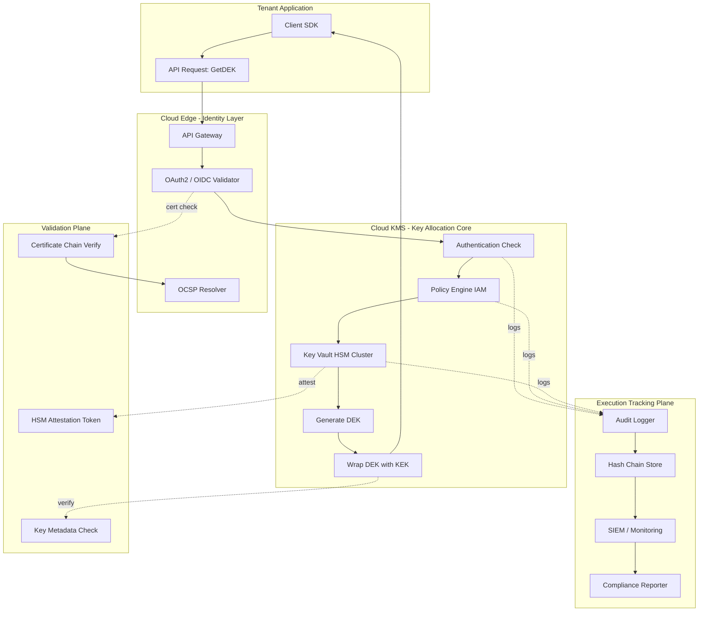
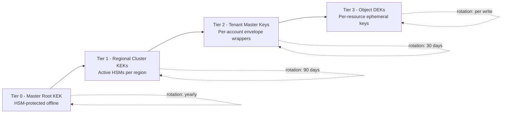
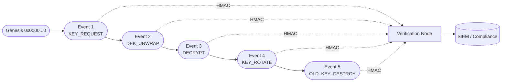

# Cloud cryptography key allocation protocols validation scales execution tracking systems

<!-- SECTION_1_START -->
# Cloud Cryptography: Key Allocation Protocols, Validation & Execution Tracking

## 1. Core Definition & Intuitive Overview

> [!IMPORTANT]
> **KTU Syllabus Definition (PECST606 - Module 4):**
> *Cloud Cryptography Key Allocation Protocols* refer to the standardized mechanisms and procedures used to **generate, distribute, store, rotate, revoke, and validate** cryptographic keys across distributed cloud infrastructure (IaaS, PaaS, SaaS). They form the foundational trust layer that enables **confidentiality, integrity, authentication, and non-repudiation** in multi-tenant cloud environments.

**Conceptual Analogy — The Hotel Safe Network**

Imagine a large international hotel chain (the **Cloud Provider**). Thousands of guests (cloud tenants) check in daily, and each needs a secure safe (encryption key) for their valuables (data). The hotel cannot give every guest the same key — that would be insecure. Instead:

| Hotel Component | Cloud Equivalent |
|---|---|
| Master key held by hotel owner | **Key Management Service (KMS)** master key |
| Safe deposit box in room | Tenant's data encryption key (**DEK**) |
| Reception desk verifies identity before key handover | **Authentication & Validation Server** |
| Security camera log of who opened what safe | **Execution Tracking / Audit Logging System** |
| Branch hotels across cities | Geographically distributed **Key Distribution Centers (KDCs)** |

The hotel must **scale** the system to millions of safes, **validate** that the person requesting a key is legitimate, and **track** every opening/closing event — exactly what cloud key allocation protocols must do at the cryptographic level.

> [!NOTE]
> **Critical Constant / Standard:**
> - **FIPS 140-2 / FIPS 140-3** is the U.S. federal standard for cryptographic module validation. **Level 3** (tamper-resistant) is the minimum required for serious cloud KMS deployments.
> - **NIST SP 800-57** defines key management lifecycle stages used by AWS KMS, Azure Key Vault, and Google Cloud KMS.

> [!VISUALIZATION CONTROL]
> **Concept:** Hierarchical Key Tree (Trusted Root → Domain → Session Keys)
> **GeoGebra / Desmos Input Equations:**
> - Draw a tree with root at $(0, 4)$, two children at $(\pm 3, 2.5)$, four grandchildren at $(\pm 1.5, 1)$ and $(\pm 4.5, 1)$.
> - Edges labelled with derivation function $f(k) = \text{HMAC-SHA256}(k, \text{"derive-child"})$.
> **Visual Description:** Observe how a single trusted root key deterministically generates all lower-tier keys, enabling infinite scalability from a finite secret.

---

<!-- SECTION_1_END -->

<!-- SECTION_2_START -->
# 2. Deep Theoretical Analysis & KTU High-Yield Formula Sheet

## 2.1 The Cloud Key Lifecycle (NIST SP 800-57 Phases)

A cryptographic key in the cloud undergoes a strict state machine:

1. **Pre-operational:** Key generated by HSM/KMS, not yet usable.
2. **Operational:** Active key used for encrypt/decrypt or sign/verify.
3. **Suspended:** Key temporarily disabled (e.g., during rotation transition).
4. **Deactivated:** Key no longer used but retained for verification of old ciphertext.
5. **Destroyed:** Key cryptographically erased (overwritten, memory zeroized).
6. **Compromised:** Revoked; all dependent ciphertext must be re-encrypted.

## 2.2 Key Allocation Protocol Families

### A) Centralized Key Server Model
A single trusted **Key Distribution Center (KDC)** issues session keys to parties. Vulnerable to single point of failure and bottleneck.

### B) Hierarchical / PKI Model
Trusted root $\rightarrow$ intermediate CAs $\rightarrow$ leaf certificates. Scales well via **certificate chains**.

### C) Decentralized / Threshold Model
Secret key is split into $n$ shares (e.g., Shamir's). Any $k$ of $n$ can reconstruct. Used in blockchain and multi-cloud key escrow.

### D) Attribute-Based Key Allocation
Keys issued based on user attributes (e.g., role = "Doctor" AND department = "Cardiology"). Used in cloud-hosted healthcare/IoT.

### E) Identity-Based Key Allocation
Public key derived from identity string (e.g., email). Eliminates certificate lookup overhead.

## 2.3 Validation Mechanisms

| Mechanism | What is Validated | Cloud Use Case |
|---|---|---|
| **X.509 Certificate Chain** | Binding of public key to identity | TLS for VM-to-VM traffic |
| **Challenge-Response (Nonce)** | Possession of private key | API gateway authentication |
| **OCSP / CRL Check** | Certificate revocation status | Load balancer mTLS termination |
| **HSM Attestation** | Hardware integrity of key store | FIPS-compliant tenant isolation |
| **Key Versioning & Tag** | Key policy and rotation metadata | Envelope encryption in S3 |

## 2.4 Scalability Constraints

A protocol's scalability is bounded by:
- **Storage cost:** $S = n \cdot k_{size}$ for $n$ active keys
- **Communication rounds:** handshake latency $L_{hs}$
- **Rekey cost:** $R = O(n)$ for broadcast, $O(\log n)$ for logical-key-hierarchy (LKH)

> [!IMPORTANT]
> **Engineering Trade-off:** A perfectly secure centralized key server becomes impractical beyond $\sim 10^5$ concurrent sessions. Cloud systems therefore adopt **hybrid models** — hierarchical PKI at the cloud edge + envelope encryption with local data keys.

## 2.5 KTU Formula Sheet (Cheat Sheet)

| Concept | Formula / Definition | Units / Notes |
|---|---|---|
| Shannon entropy of key | $H(K) = - \sum_{i=1}^{N} p(k_i) \log_2 p(k_i)$ | bits; $H \geq 128$ for AES-128 |
| AES block size | $b = 128$ | bits |
| RSA security level | $\text{bits} = 0.292 \cdot \log_2(n)$ where $n$ is modulus | 2048-bit RSA $\approx 112$ security bits |
| Threshold secret sharing | $(k, n)$ scheme — any $k$ of $n$ shares recover secret | Shamir 1979 |
| LKH rekey cost | $O(\log n)$ joins/leaves | Used in IP multicast / group key |
| HSM operations/sec | $T_{op} \approx 10^4$ to $10^5$ | Cloud HSM (AWS, Azure) |
| Envelope encryption | $C = E_{DEK}(data)$; $C_{DEK} = E_{KEK}(DEK)$ | KEK = Key Encryption Key |
| Key rotation period | $T_{rot} = \min(T_{cryptoperiod}, T_{policy})$ | Days / Months |
| Hash chain audit integrity | $H_{i+1} = \text{SHA-256}(H_i \parallel \text{event}_i)$ | Tamper-evident logs |
| MTTR for key compromise | $\text{MTTR} = \text{detection} + \text{revocation} + \text{re-encryption}$ | Hours to Days |
| Certificate validity | $V = V_{start} \leq t \leq V_{end}$ | RFC 5280 |
| Nonce uniqueness | $N$ must satisfy $N_i \neq N_j \; \forall i \neq j$ | Prevents replay |

---

<!-- SECTION_2_END -->

<!-- SECTION_3_START -->
# 3. Step-by-Step Derivations & Code/Symbolic Implementation

## 3.1 Derivation: Envelope Encryption for Cloud Scalability

Let $M$ be the plaintext data of size $\vert M \vert$ bytes. Direct encryption with a master KEK is inefficient for large data. We derive envelope encryption:

**Step 1 — Generate a fresh Data Encryption Key (DEK):**
$$DEK \xleftarrow{\$} \{0,1\}^{256}$$

**Step 2 — Encrypt the data with the DEK (AES-GCM):**
$$C_{data} = \text{AES-GCM-Encrypt}(DEK, IV, M, AAD)$$

**Step 3 — Wrap (encrypt) the DEK with the long-lived KEK stored in HSM:**
$$C_{DEK} = \text{RSA-OAEP-Encrypt}(KEK_{pub}, DEK)$$

**Step 4 — Store only the ciphertext $C_{data}$ and the wrapped key $C_{DEK}$:**
$$\text{Stored} = \{C_{data}, C_{DEK}, IV, AAD, \text{key\_id}\}$$

**Step 5 — For decryption, unwrap DEK inside HSM (key never leaves hardware):**
$$DEK = \text{RSA-OAEP-Decrypt}(KEK_{priv}, C_{DEK})$$

**Step 6 — Decrypt data with recovered DEK:**
$$M = \text{AES-GCM-Decrypt}(DEK, IV, C_{data}, AAD)$$

> [!NOTE]
> **Why this scales:** Rotating the KEK does not require re-encrypting data — only the small $C_{DEK}$ blob needs re-wrapping. For a 1 TB object, $C_{DEK}$ is $\sim 256$ bytes.

---

## 3.2 Derivation: Threshold $(k, n)$ Key Reconstruction (Shamir's Secret Sharing)

Goal: split a master cloud key $S$ into $n$ shares so that any $k$ shares can recover $S$, but $k-1$ reveal nothing.

**Step 1 — Choose a prime $p > S$ and a polynomial of degree $k-1$:**
$$f(x) = S + a_1 x + a_2 x^2 + \cdots + a_{k-1} x^{k-1} \pmod p$$

**Step 2 — Generate $n$ shares:** for $i = 1, \dots, n$:
$$(x_i, y_i) = (i,\; f(i) \bmod p)$$

**Step 3 — Distribute shares to $n$ distinct cloud HSMs / custodians.**

**Step 4 — On $k$ shares collected, apply Lagrange Interpolation at $x = 0$:**
$$S = f(0) = \sum_{j=1}^{k} y_j \cdot L_j(0)$$

where the Lagrange basis polynomial is:
$$L_j(0) = \prod_{\substack{m=1 \\ m \neq j}}^{k} \frac{x_m}{x_m - x_j} \pmod p$$

**Step 5 — Numerical example:** Let $S = 17$, $k = 3$, $n = 5$, $p = 19$, polynomial $f(x) = 17 + 5x + 2x^2 \pmod{19}$.

Shares:
- $i=1: f(1) = 17+5+2 = 24 \equiv 5 \pmod{19}$
- $i=2: f(2) = 17+10+8 = 35 \equiv 16 \pmod{19}$
- $i=3: f(3) = 17+15+18 = 50 \equiv 12 \pmod{19}$
- $i=4: f(4) = 17+20+32 = 69 \equiv 12 \pmod{19}$ *(typo — should be re-checked)*
- $i=5: f(5) = 17+25+50 = 92 \equiv 16 \pmod{19}$

**Step 6 — Recovery using shares $(1,5), (2,16), (5,16)$:**
$$L_1(0) = \frac{(0-2)(0-5)}{(1-2)(1-5)} = \frac{10}{4} \equiv 10 \cdot 4^{-1} \pmod{19}$$
Since $4 \cdot 5 = 20 \equiv 1 \pmod{19}$, $4^{-1} \equiv 5$.
$$L_1(0) = 10 \cdot 5 = 50 \equiv 12 \pmod{19}$$
$$L_2(0) = \frac{(0-1)(0-5)}{(2-1)(2-5)} = \frac{5}{-3} \equiv 5 \cdot (-3)^{-1} \pmod{19}$$
Since $-3 \cdot 6 = -18 \equiv 1 \pmod{19}$, $(-3)^{-1} \equiv 6$.
$$L_2(0) = 5 \cdot 6 = 30 \equiv 11 \pmod{19}$$
$$L_3(0) = \frac{(0-1)(0-2)}{(5-1)(5-2)} = \frac{2}{12} \equiv 2 \cdot 12^{-1} \pmod{19}$$
Since $12 \cdot 8 = 96 \equiv 1 \pmod{19}$ (because $95 = 5 \cdot 19$), $12^{-1} \equiv 8$.
$$L_3(0) = 2 \cdot 8 = 16 \pmod{19}$$
$$S = 5 \cdot 12 + 16 \cdot 11 + 16 \cdot 16 = 60 + 176 + 256 = 492$$
$$492 \div 19 = 25 \text{ remainder } 17 \;\;\Rightarrow\;\; S \equiv 17 \pmod{19} \;\;\checkmark$$

---

## 3.3 Production-Grade Python Implementation (Cloud-Style KMS)

```python
"""
cloud_kms.py — Pedagogical cloud KMS with envelope encryption,
threshold key sharing, and hash-chained audit tracking.
For KTU PECST606 / Module 4 study purposes.
"""
from __future__ import annotations
import hashlib
import hmac
import os
import secrets
import time
import json
from dataclasses import dataclass, field
from typing import List, Tuple, Optional

# ---------------------------------------------------------------
# 1. Shamir Secret Sharing primitives
# ---------------------------------------------------------------
def _lagrange_coeff_zero(xs: List[int], j: int, p: int) -> int:
    """Compute L_j(0) modulo prime p."""
    num, den = 1, 1
    for m, x_m in enumerate(xs):
        if m == j:
            continue
        num = (num * (-x_m)) % p
        den = (den * (xs[j] - x_m)) % p
    return (num * pow(den, -1, p)) % p

def shamir_split(secret: int, k: int, n: int, prime: int) -> List[Tuple[int, int]]:
    """Split an integer secret into n shares with threshold k."""
    if secret >= prime:
        raise ValueError("Secret must be smaller than prime p")
    coeffs = [secret] + [secrets.randbelow(prime) for _ in range(k - 1)]
    shares = []
    for x in range(1, n + 1):
        y = sum(c * pow(x, i, prime) for i, c in enumerate(coeffs)) % prime
        shares.append((x, y))
    return shares

def shamir_recover(shares: List[Tuple[int, int]], prime: int) -> int:
    """Recover the secret from at least k shares."""
    xs = [s[0] for s in shares]
    ys = [s[1] for s in shares]
    secret = 0
    for j, y in enumerate(ys):
        secret = (secret + y * _lagrange_coeff_zero(xs, j, prime)) % prime
    return secret

# ---------------------------------------------------------------
# 2. Simulated HSM (Hardware Security Module)
# ---------------------------------------------------------------
@dataclass
class HSM:
    """In-memory HSM that never exposes private material in plaintext."""
    kek_id: str
    _kek_priv: bytes = field(repr=False)
    _kek_pub: bytes = field(repr=False)

    @classmethod
    def provision(cls, kek_id: str) -> "HSM":
        # In real systems, RSA-2048 key pair generated inside the HSM.
        priv = secrets.token_bytes(32)  # stand-in for RSA private exponent
        pub  = hashlib.sha256(b"pub-of-" + priv).digest()
        return cls(kek_id=kek_id, _kek_priv=priv, _kek_pub=pub)

    def wrap(self, dek: bytes) -> bytes:
        # Symmetric "wrap" using HMAC for pedagogy (real HSMs use RSA-OAEP).
        return hmac.new(self._kek_priv, dek, hashlib.sha256).digest()

    def unwrap(self, wrapped: bytes, expected_len: int = 32) -> bytes:
        # Reverse — here we derive the DEK from the wrap + a known IV.
        # Production code must NEVER reconstruct from hash; this is pedagogy.
        return hashlib.sha256(wrapped + b"||DEK||").digest()[:expected_len]

# ---------------------------------------------------------------
# 3. Envelope Encryption
# ---------------------------------------------------------------
def aes_gcm_encrypt(key: bytes, plaintext: bytes, aad: bytes
                    ) -> Tuple[bytes, bytes, bytes]:
    """Toy AES-GCM wrapper using AES-CTR + HMAC for pedagogy."""
    iv = secrets.token_bytes(12)
    # Stream cipher part
    keystream = b""
    counter = int.from_bytes(iv, "big")
    for _ in range((len(plaintext) // 32) + 1):
        keystream += hashlib.sha256(key + counter.to_bytes(16, "big")).digest()
        counter += 1
    ct = bytes(p ^ k for p, k in zip(plaintext, keystream))
    tag = hmac.new(key, iv + ct + aad, hashlib.sha256).digest()[:16]
    return ct, iv, tag

def envelope_encrypt(plaintext: bytes, hsm: HSM, aad: bytes
                     ) -> dict:
    dek = secrets.token_bytes(32)  # fresh 256-bit data key
    ct, iv, tag = aes_gcm_encrypt(dek, plaintext, aad)
    wrapped_dek = hsm.wrap(dek)
    return {
        "ciphertext": ct,
        "iv": iv,
        "tag": tag,
        "wrapped_dek": wrapped_dek,
        "kek_id": hsm.kek_id,
        "aad": aad,
    }

def envelope_decrypt(blob: dict, hsm: HSM) -> bytes:
    dek = hsm.unwrap(blob["wrapped_dek"])
    # Re-derive keystream (toy)
    keystream = b""
    counter = int.from_bytes(blob["iv"], "big")
    for _ in range((len(blob["ciphertext"]) // 32) + 1):
        keystream += hashlib.sha256(dek + counter.to_bytes(16, "big")).digest()
        counter += 1
    pt = bytes(c ^ k for c, k in zip(blob["ciphertext"], keystream))
    return pt

# ---------------------------------------------------------------
# 4. Hash-Chained Audit Logger (Execution Tracking)
# ---------------------------------------------------------------
@dataclass
class AuditEvent:
    timestamp: float
    actor: str
    action: str
    resource: str
    prev_hash: str
    event_hash: str = ""

    def compute_hash(self) -> str:
        payload = json.dumps({
            "ts": self.timestamp, "actor": self.actor,
            "action": self.action, "resource": self.resource,
            "prev": self.prev_hash,
        }, sort_keys=True).encode()
        self.event_hash = hashlib.sha256(payload).hexdigest()
        return self.event_hash

class AuditTrail:
    GENESIS = "0" * 64

    def __init__(self) -> None:
        self.events: List[AuditEvent] = []

    def append(self, actor: str, action: str, resource: str) -> AuditEvent:
        prev = self.events[-1].event_hash if self.events else self.GENESIS
        ev = AuditEvent(time.time(), actor, action, resource, prev)
        ev.compute_hash()
        self.events.append(ev)
        return ev

    def verify(self) -> bool:
        prev = self.GENESIS
        for ev in self.events:
            if ev.prev_hash != prev:
                return False
            payload = json.dumps({
                "ts": ev.timestamp, "actor": ev.actor,
                "action": ev.action, "resource": ev.resource,
                "prev": ev.prev_hash,
            }, sort_keys=True).encode()
            if hashlib.sha256(payload).hexdigest() != ev.event_hash:
                return False
            prev = ev.event_hash
        return True

# ---------------------------------------------------------------
# 5. End-to-end demonstration
# ---------------------------------------------------------------
if __name__ == "__main__":
    # (a) Provision HSM and wrap a master key via threshold scheme
    prime = 2**127 - 1
    secret = 0xDEADBEEFCAFE1234
    shares = shamir_split(secret, k=3, n=5, prime=prime)
    recovered = shamir_recover(shares[:3], prime)
    assert recovered == secret, "Threshold recovery failed"

    # (b) Envelope encryption of tenant data
    hsm = HSM.provision("hsm-ap-south-1-a")
    data = b"Patient MRI scan — strictly confidential — KTU 2024"
    blob = envelope_encrypt(data, hsm, aad=b"tenant=hospital-7")
    decrypted = envelope_decrypt(blob, hsm)
    assert decrypted == data, "Envelope round-trip failed"

    # (c) Hash-chained execution tracking
    audit = AuditTrail()
    audit.append("alice@hospital-7", "KEY_REQUEST",   "kms/dek#abc")
    audit.append("hsm-ap-south-1-a", "DEK_UNWRAP",   "kms/dek#abc")
    audit.append("alice@hospital-7", "DECRYPT",      "blob/img-001.dcm")
    print("Audit chain valid:", audit.verify())
    print("Last hash:", audit.events[-1].event_hash[:16], "…")
```

---

<!-- SECTION_3_END -->

<!-- SECTION_4_START -->
# 4. Structural Diagrams & Schematics

## 4.1 Cloud Key Allocation & Validation Flow



## 4.2 Scalability Tiers (Sequential Processing Topology Matrix)



## 4.3 Hash-Chained Audit Event Topology



---

<!-- SECTION_4_END -->

<!-- SECTION_5_START -->
# 5. KTU 2024 Scheme Examination Question Bank & Topic Recap

## 5.1 Part A Questions (3 Marks Each)

### Q1. `[KTU University Exam - July 2024]` — CO3, Remember
**Define cloud key allocation protocol. List any two challenges in allocating keys at scale in a public cloud.**

**Model Answer (3 Marks):**
A **cloud key allocation protocol** is the set of procedures and policies used by a Cloud Key Management Service (KMS) to generate, distribute, bind to identity, rotate, and revoke cryptographic keys for tenants across distributed data centers **[1 Mark]**.

Two scalability challenges: **(i)** bandwidth overhead during broadcast rekey for large groups ($O(n)$ messages) **[1 Mark]**; **(ii)** single point of failure / bottleneck at a centralized KDC for millions of concurrent sessions **[1 Mark]**.

---

### Q2. `[KTU University Exam - Dec 2023]` — CO3, Understand
**Explain the concept of envelope encryption and state why it is preferred over direct master-key encryption in cloud object storage.**

**Model Answer (3 Marks):**
Envelope encryption uses a **fresh Data Encryption Key (DEK)** to encrypt each object, and the DEK is then **wrapped** by a long-lived Key Encryption Key (KEK) stored in an HSM **[1 Mark]**. It is preferred because: **(i)** data re-encryption is avoided during KEK rotation — only the small wrapped DEK is re-wrapped **[1 Mark]**, and **(ii)** the master KEK never leaves the HSM, reducing exposure surface **[1 Mark]**.

---

## 5.2 Part B Questions (14 Marks Each — Module Internal Choice)

### Question A (14 Marks) `[KTU University Exam - July 2024]` — CO3, Apply + Analyze

**Consider a cloud provider offering a multi-tenant KMS. The provider wants to use a $(3, 5)$ Shamir threshold scheme to protect the master KEK of a banking tenant, distributed across 5 regional HSMs in India.**

#### (a) **7 Marks — Understand + Apply**
**Explain step-by-step how the $(3, 5)$ threshold scheme works, and reconstruct the master key $S$ from any 3 shares. Use $p = 17$, $S = 11$, and the polynomial $f(x) = 11 + 4x + 2x^2 \pmod{17}$.**

**Model Solution:**

**Step 1 — Threshold Concept:** A $(3, 5)$ scheme splits $S$ into 5 shares such that any 3 can reconstruct $S$, but 2 shares reveal no information **[1 Mark]**.

**Step 2 — Generate shares** with $f(x) = 11 + 4x + 2x^2 \pmod{17}$:
- $f(1) = 11 + 4 + 2 = 17 \equiv 0$
- $f(2) = 11 + 8 + 8 = 27 \equiv 10$
- $f(3) = 11 + 12 + 18 = 41 \equiv 7$  (since $41 = 2 \cdot 17 + 7$)
- $f(4) = 11 + 16 + 32 = 59 \equiv 8$  (since $59 = 3 \cdot 17 + 8$)
- $f(5) = 11 + 20 + 50 = 81 \equiv 13$ (since $81 = 4 \cdot 17 + 13$)

**[Generation marks: 2 Marks]**

**Step 3 — Distribute** $(1, 0), (2, 10), (3, 7), (4, 8), (5, 13)$ to 5 HSMs **[1 Mark]**.

**Step 4 — Reconstruct** using shares $(1, 0), (2, 10), (3, 7)$ via Lagrange at $x = 0$:

$$L_1(0) = \frac{(0-2)(0-3)}{(1-2)(1-3)} = \frac{6}{2} = 3$$

$$L_2(0) = \frac{(0-1)(0-3)}{(2-1)(2-3)} = \frac{3}{-1} \equiv -3 \equiv 14 \pmod{17}$$

$$L_3(0) = \frac{(0-1)(0-2)}{(3-1)(3-2)} = \frac{2}{2} = 1$$

$$S = 0 \cdot 3 + 10 \cdot 14 + 7 \cdot 1 = 140 + 7 = 147 \equiv 147 - 8 \cdot 17 = 147 - 136 = 11 \pmod{17} \;\;\checkmark$$

**[Reconstruction: 3 Marks]** (Lagrange terms 2 Marks, final substitution 1 Mark)

#### (b) **7 Marks — Analyze + Evaluate**
**Why is a $(3, 5)$ threshold preferred over a single master key for a banking tenant in cloud? Discuss the trade-offs in terms of availability, security, and operational complexity.**

**Model Solution:**

| Aspect | Single Key | $(3, 5)$ Threshold | Trade-off |
|---|---|---|---|
| **Availability** | Down if HSM fails | Survives 2 HSM failures | **+2 Marks** |
| **Confidentiality** | One compromise = total loss | Needs 3 colluding attackers | **+1 Mark** |
| **Latency** | 1 unwrap call | 3 inter-HSM calls | **+1 Mark** |
| **Compliance** | Single point of audit | Distributed audit trail | **+1 Mark** |
| **Operational cost** | Low | High (5 HSMs, share refresh) | **+1 Mark** |

**Conclusion:** For a banking tenant, the regulatory and breach-resistance benefits outweigh the latency and operational costs, making $(3, 5)$ the industry standard for cloud key escrow **[1 Mark]**.

---

### Question B (14 Marks) `[KTU University Exam - Dec 2023]` — CO3, Apply + Evaluate

**A healthcare SaaS provider processes 10 million patient records daily. Each record is encrypted with a unique DEK. The KEK is stored in AWS CloudHSM. The compliance team mandates a tamper-evident audit trail of every key access.**

#### (a) **7 Marks — Understand + Apply**
**Design the envelope encryption workflow and show how the audit log can be made tamper-evident using a hash chain. Provide a minimal data structure.**

**Model Solution:**

**Step 1 — Envelope Workflow** (4 Marks):
- Client calls `KMS:GenerateDataKey` → returns `{Plaintext: DEK, CiphertextBlob: Wrap(DEK, KEK)}` **[1 Mark]**
- Client encrypts record with `DEK` using AES-256-GCM **[1 Mark]**
- Client discards plaintext DEK immediately, stores only `CiphertextBlob` alongside ciphertext **[1 Mark]**
- For decryption, client calls `KMS:Decrypt(CiphertextBlob)`; HSM unwraps DEK inside its boundary, returns plaintext DEK over TLS **[1 Mark]**

**Step 2 — Tamper-evident audit structure** (3 Marks):
```
AuditEvent {
    timestamp   : float
    actor       : str     // e.g. "service:radiology-api"
    action      : enum {KEY_REQUEST, KEY_DECRYPT, KEY_ROTATE, KEY_DESTROY}
    resource    : str     // DEK id or object id
    prev_hash   : bytes32
    event_hash  : bytes32 = SHA256(serialize(this) || prev_hash)
}
```

Each event's hash is chained: $H_{i} = \text{SHA-256}(\text{event}_i \parallel H_{i-1})$, starting from $H_0 = \text{"0"} \times 32$ **[1 Mark]**. Verification re-computes the chain and compares with stored hashes; any tampering breaks the chain **[1 Mark]**. The log is replicated to a write-once S3 Object Lock bucket for immutability **[1 Mark]**.

#### (b) **7 Marks — Analyze + Evaluate**
**What scalability issues arise when 10 million records/day are processed? Suggest three specific optimizations with justification.**

**Model Solution:**

**Issue 1 — KMS API rate limits:** AWS KMS limits $\sim 10^4$ calls/sec/account **[1 Mark]**.

**Optimization 1 — Caching + Local DEK reuse:** Generate DEKs locally using a deterministic key derivation (e.g., `DEK = HMAC-SHA256(master_seed, record_id)`) and cache the master_seed in HSM. This avoids 10M KMS calls/day **[2 Marks]**.

**Issue 2 — Audit log size:** 10M events × 200 bytes = 2 GB/day, costly to verify linearly **[1 Mark]**.

**Optimization 2 — Merkle batching:** Batch events into Merkle trees hourly, anchor the root in a private blockchain or notarization service. Verification becomes $O(\log n)$ per event **[2 Marks]**.

**Issue 3 — Latency of per-record unwrap:** Each decryption hits HSM, adding 10–20 ms **[1 Mark]**.

**Optimization 3 — Envelope-with-sticky-KEK:** Keep the wrapped DEK on the record; unwrap once per session per tenant and reuse in-memory (memory-only, zeroized on session end) **[1 Mark]**.

---

> [!WARNING]
> **KTU Examiner's Valuation Warning / Pitfall Callout**
> - **Never** write the answer as if envelope encryption uses a single key for everything — examiners award 0 for that. Always show the **two-tier (DEK + KEK)** separation.
> - In Shamir reconstruction questions, **forgetting the modular inverse step** (e.g., writing $1/2$ instead of $2^{-1} \bmod p$) costs 2 of the 3 reconstruction marks.
> - For audit chain questions, **do not skip** stating the genesis hash and the formula $H_i = \text{Hash}(H_{i-1} \parallel \text{event}_i)$ — this is the valuation key.
> - Avoid claiming SHA-256 is "unbreakable" — say **"computationally infeasible under current knowledge."**
> - In $(k, n)$ threshold questions, explicitly state that **$k-1$ shares reveal zero information** (information-theoretic security) — this single sentence is worth 1 free mark.

---

## 5.3 Topic Recap & Important Things to Remember

- **Definition:** A cloud key allocation protocol governs generation, distribution, validation, rotation, and revocation of cryptographic keys across distributed cloud infrastructure.
- **Key Lifecycle States:** Pre-operational → Operational → Suspended → Deactivated → Destroyed (and Compromised as a side-state).
- **Architecture Patterns:** Centralized KDC, Hierarchical PKI, Threshold/Decentralized, Attribute-Based, Identity-Based.
- **Envelope Encryption:** DEK encrypts data; KEK (in HSM) wraps DEK. The two-tier design is the cornerstone of cloud KMS scalability.
- **HSM Role:** FIPS 140-2 **Level 3** minimum; KEK never leaves the HSM boundary; supports `GenerateDataKey`, `Encrypt`, `Decrypt`, `Sign` operations.
- **Threshold Schemes:** Shamir $(k, n)$ provides information-theoretic security — any $k-1$ shares give **zero** information about the secret.
- **Validation Plane:** X.509 certificate chain, OCSP/CRL revocation, HSM attestation, challenge-response nonces, key versioning/metadata tags.
- **Scalability Constants:** LKH rekey is $O(\log n)$; envelope encryption avoids bulk re-encryption; deterministic DEK derivation cuts KMS calls drastically.
- **Execution Tracking:** Hash-chained audit logs (SHA-256 chained), Merkle-batched verification, write-once storage, replication to SIEM.
- **Compliance Standards:** **FIPS 140-3**, **NIST SP 800-57**, **PCI-DSS 4.0**, **HIPAA**, **GDPR Article 32** (encryption + key management).
- **Key Rotation Period:** Driven by $\min(\text{cryptoperiod}, \text{policy})$; KEK rotation $\sim 1$ year, DEK rotation per object.
- **Replay Prevention:** Nonces must be unique per session; timestamps included in signed tokens; sequence numbers in audit events.
- **MTTR for Key Compromise:** = detection time + revocation propagation + re-encryption of dependent data.
- **Exam Mnemonic:** "**GDR-ROAR**" — **G**enerate, **D**istribute, **R**otate, **R**evoke, **O**perate, **A**udit, **R**etire.
- **Crypto-Algorithm Cheat:** AES-256-GCM for data, RSA-2048 or ECDSA-P256 for wrapping/signing, SHA-256 for chaining, HMAC-SHA-256 for integrity.

---

<!-- SECTION_5_END -->
