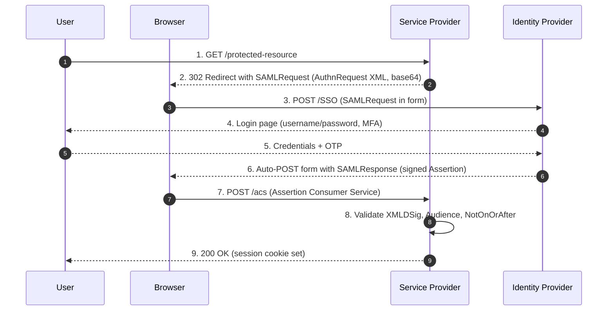
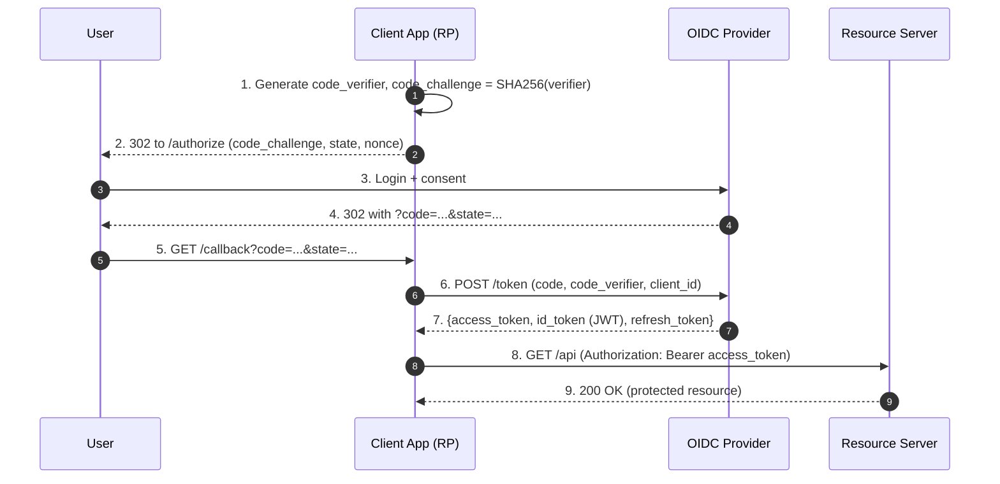
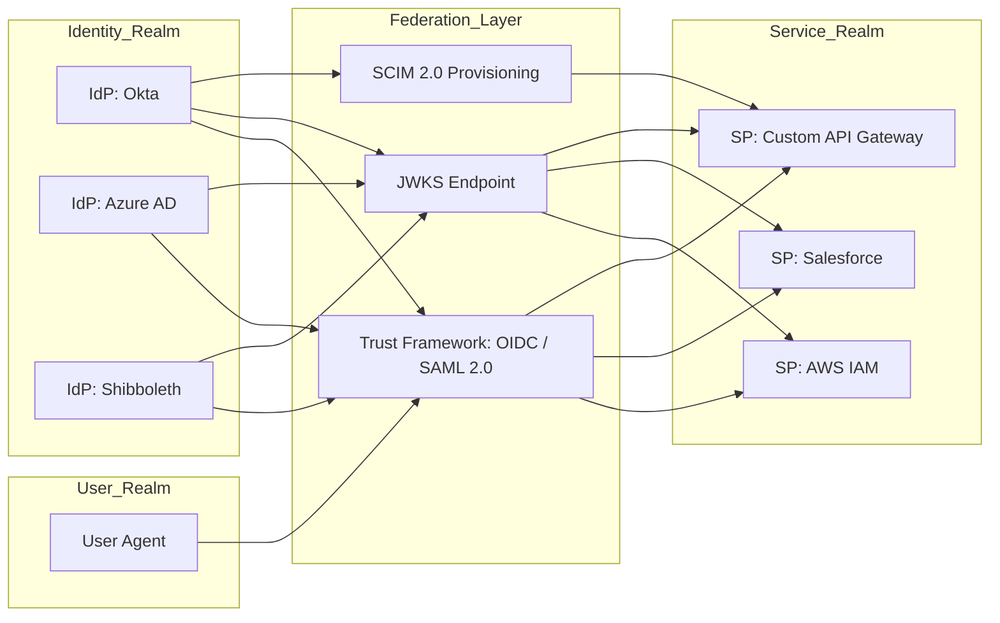
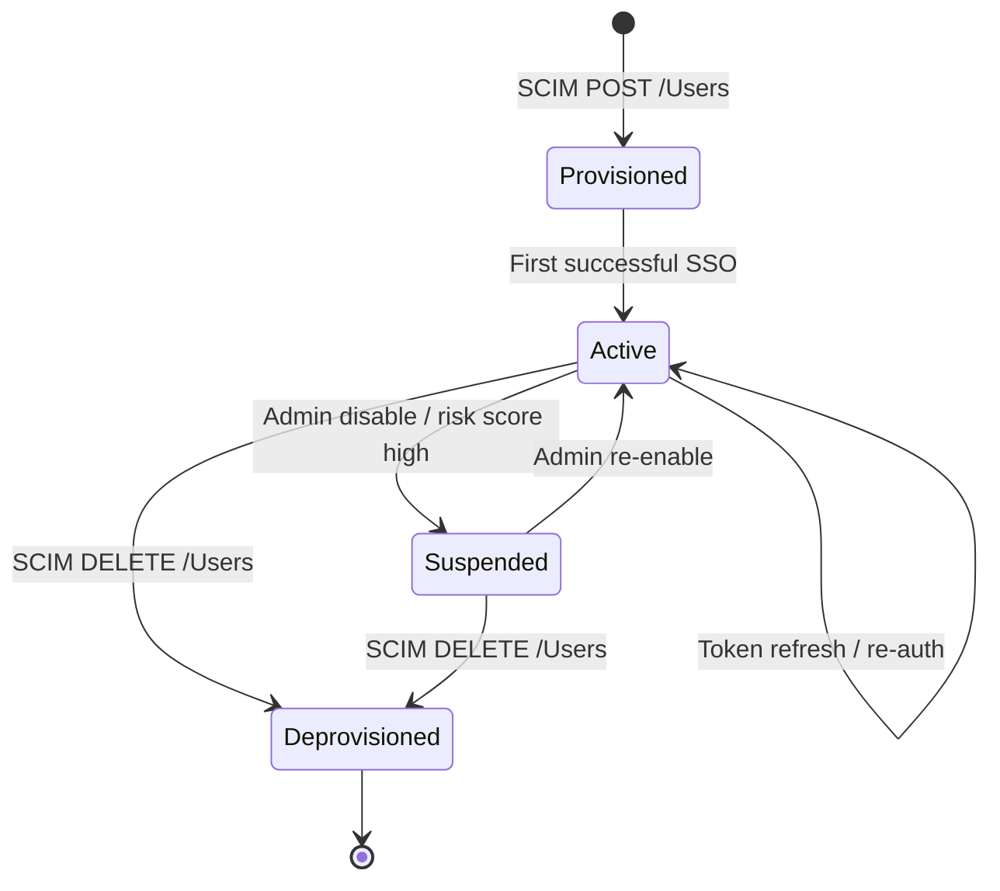
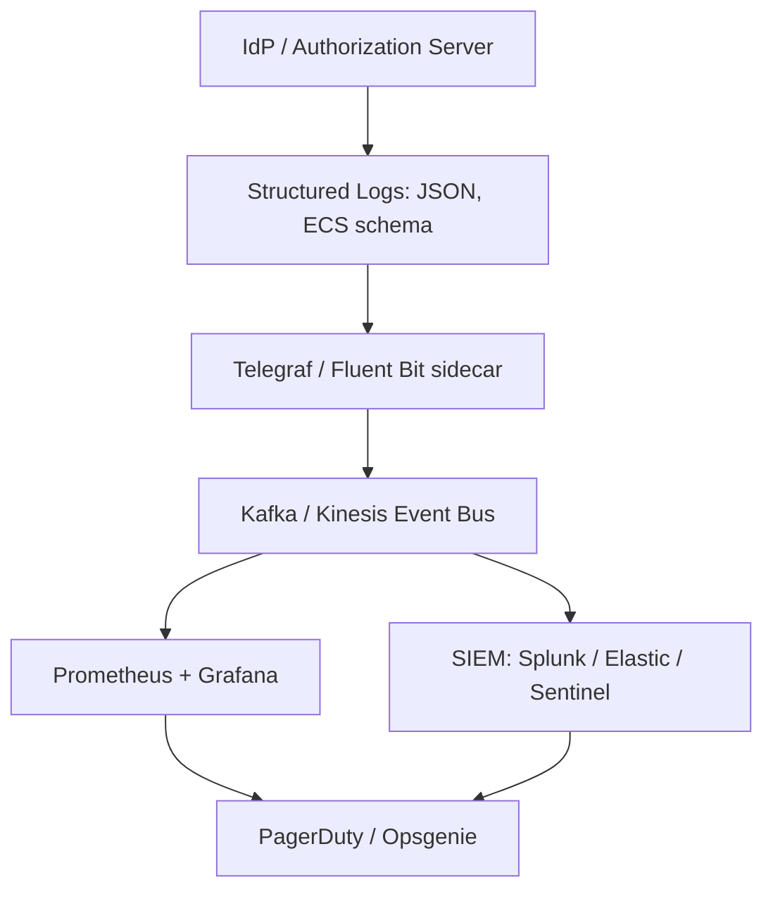

# Identity federation schemes configurations frameworks scripts parameters monitoring metrics

<!-- SECTION_1_START -->
# Cloud Identity & Security Enforcement — Identity Federation Schemes

## 1.1 Formal Academic Definition (KTU 2024 Syllabus Terminology)

**Identity Federation** is a cloud identity and access management (IAM) paradigm in which user authentication and authorization data (assertions, tokens, claims) are trusted and exchanged across heterogeneous security domains — between an *Identity Provider (IdP)*, a *Service Provider (SP)*, and a *Relying Party (RP)* — under a formally agreed **trust framework**. Federation enables **Single Sign-On (SSO)**, **Just-In-Time (JIT) provisioning**, **attribute-based access control (ABAC)**, and **cross-domain Single Logout (SLO)** without replicating user credentials across systems.

The principal federation schemes standardized by **OASIS**, the **IETF OAuth Working Group**, and the **OpenID Foundation** are:

1. **SAML 2.0 (Security Assertion Markup Language)** — XML-based, browser-based SSO (OASIS Standard).
2. **OAuth 2.0** — Token-based delegated authorization (RFC 6749).
3. **OpenID Connect (OIDC)** — Identity layer built atop OAuth 2.0 using JSON Web Tokens (RFC 7519 + OpenID Foundation spec).
4. **WS-Federation** — SOAP-based passive requestor profile used in Microsoft-centric stacks.
5. **SCIM 2.0 (System for Cross-domain Identity Management)** — RFC 7644, used for user/role provisioning between IdP and SP.

> [!IMPORTANT]
> **KTU 2024 High-Yield Distinction:** *Authentication* answers "Who are you?" and is handled by the **IdP**. *Authorization* answers "What are you allowed to do?" and is handled by the **SP / Resource Server** using claims/scopes from the token.

> [!NOTE]
> **Trust Framework** — a legal, technical, and policy agreement (e.g., **eIDAS**, **Kantara**, **InCommon**, **eduGAIN**) that governs the cryptographic, operational, and privacy rules under which IdP and SP exchange identity data.

## 1.2 Intuitive Overview — The "Passport & Embassy" Analogy

Imagine a citizen of Country A (User) travelling to Country B (Cloud Service). Country A's Passport Office (Identity Provider) issues a **tamper-proof, signed passport** (SAML assertion / OIDC ID Token) after verifying the citizen's biometrics. Country B's Immigration Officer (Service Provider) does not need to re-verify the citizen — it **trusts the issuing country's seal** (digital signature verified via the IdP's public certificate).

- The **passport** = a cryptographically signed **assertion/token**.
- The **embassy stamps** = **attributes / claims** (email, role, group).
- The **visa-on-arrival desk** = the **SP endpoint** consuming the assertion.
- **Revocation** = a country withdrawing passport validity (real-time or periodic CRL/OCSP).

> [!TIP]
> In a **federated model**, credentials live in **one place** (the IdP). In a **non-federated model**, every service stores its own username/password hash — leading to credential sprawl, password fatigue, and a wider attack surface.

## 1.3 Key Actors in a Federation Topology

| Actor | Full Name | Role |
|---|---|---|
| **IdP** | Identity Provider | Authenticates user, issues signed assertions (e.g., Okta, Azure AD, Keycloak, Shibboleth IdP) |
| **SP** | Service Provider | Consumes assertions, grants/denies access (e.g., Salesforce, AWS IAM via SAML, GitHub Enterprise) |
| **RP** | Relying Party | OAuth/OIDC equivalent of SP — client app that relies on the IdP's token |
| **AS** | Authorization Server | Issues OAuth access tokens (e.g., Auth0, Keycloak, AWS Cognito) |
| **RS** | Resource Server | API that validates access tokens |
| **UA** | User Agent | Typically the end-user's browser or mobile app |

## 1.4 Physical Constants, Standards & Default Parameters

- **JWT (RFC 7519)** default algorithm header: `alg = RS256` (RSA + SHA-256).
- **SAML 2.0** binding for browser SSO: **HTTP-POST** binding (also HTTP-Redirect).
- **OAuth 2.0** default token lifetime (RFC 6749 — *no fixed value*; RFC 6749 §4.2.2 recommends ≤ **10 minutes** for authorization codes; access token lifetime is deployment-specific, typically **3600 s**).
- **OIDC ID Token** default lifetime: **3600 seconds (1 hour)** (OpenID Connect Core 1.0 §2).
- **X.509 certificate** validity: typically **825 days (≈ 27 months)** for public TLS per CA/B Forum baseline; internal IdP signing certs commonly **2 years**.
- **Clock skew tolerance** when validating `NotBefore` / `Expires`: **± 60 seconds** is the de-facto KTU/AWS default.

> [!VISUALIZATION CONTROL]
> **Concept:** Trust triangle in identity federation.
> **GeoGebra / Desmos Input Points:**
> * `A = (0, 0)` — User
> * `B = (4, 2)` — IdP
> * `C = (8, 0)` — SP
> * Line `f(x) = 0.5x` — Trust boundary A↔B
> * Line `g(x) = -0.5x + 4` — Trust boundary B↔C
> **Visual Description:** Plot points A, B, C. Draw the segments A–B and B–C labelled "Trust" using `Segment((0,0),(4,2))` and `Segment((4,2),(8,0))`. Observe that A and C do **not** have a direct trust relationship — they communicate only via the IdP at B.

---

<!-- SECTION_1_END -->

<!-- SECTION_2_START -->
# 2. Deep Theoretical Analysis & KTU High-Yield Formula Sheet

## 2.1 SAML 2.0 — Assertion-Based Federation

**SAML (Security Assertion Markup Language) 2.0** is an OASIS standard (March 2005) using **XML** to encode three assertion types:

1. **Authentication Assertion** — proves the user was authenticated.
2. **Attribute Assertion** — carries user attributes (e.g., `eduPersonAffiliation`).
3. **Authorization Decision Assertion** — grants/denies a permission (less commonly used).

The canonical **SP-Initiated SSO with HTTP-POST Binding** flow is:

1. User requests protected resource at SP.
2. SP generates a `<samlp:AuthnRequest>` and redirects browser to IdP's **SSO Service URL** with the request Base64-encoded in a form parameter (`SAMLRequest`).
3. IdP authenticates user (session, MFA, etc.).
4. IdP builds a **signed** `<saml:Assertion>` (XMLDSig with `RSA-SHA256`) containing:
   - `Issuer` URI of IdP
   - `Subject` (NameID — usually `urn:oasis:names:tc:SAML:1.1:nameid-format:emailAddress`)
   - `Conditions` (NotBefore, NotOnOrAfter, AudienceRestriction)
   - `AttributeStatement`
5. Browser is POSTed back to SP's **Assertion Consumer Service (ACS)** with the SAMLResponse.
6. SP validates: signature, audience, recipient, NotOnOrAfter, replay window.

> [!NOTE]
> **Why XMLDSig, not JWT, in SAML?** SAML 2.0 was finalized in 2005, before JWT (RFC 7519, 2015). XMLDSig embeds the signature inline within XML using `<ds:Signature>` — making SAML verbose but **extensively extensible** (e.g., custom attribute namespaces for higher education: `urn:oid:1.3.6.1.4.1.5923.1.1.1.6` → `eduPersonPrincipalName`).

## 2.2 OAuth 2.0 — Delegated Authorization (Not Authentication!)

**OAuth 2.0** (RFC 6749) defines **four grant types** relevant to cloud identity:

| Grant Type | RFC | Use Case |
|---|---|---|
| `authorization_code` | RFC 6749 §4.1 | Server-side web apps (most secure) |
| `authorization_code` + **PKCE** | RFC 7636 | SPAs, mobile, native apps (mandatory in OAuth 2.1) |
| `client_credentials` | RFC 6749 §4.4 | Machine-to-machine (M2M) |
| `urn:ietf:params:oauth:grant-type:jwt-bearer` | RFC 7523 | Token exchange between IdPs |

> [!WARNING]
> **KTU Pitfall:** OAuth 2.0 is an **authorization** framework. Issuing an `access_token` does **not** prove identity. OIDC adds the `id_token` (a JWT) to *also* prove authentication.

## 2.3 OpenID Connect — Identity Layer on Top of OAuth 2.0

OIDC reuses OAuth 2.0's authorization endpoint and adds:

- **`id_token`** — a **JWT** signed by the IdP, containing claims `iss`, `sub`, `aud`, `exp`, `iat`, `auth_time`, `acr`, `amr`, `nonce`.
- **`UserInfo` endpoint** — returns a JSON profile (e.g., `email`, `name`, `groups`).
- **Discovery** via `/.well-known/openid-configuration` (RFC 8414) — exposes endpoints, JWKS URI, supported scopes/claims.

**JWT structure** (Base64URL-encoded, dot-separated):

$$\text{JWT} \;=\; \underbrace{\text{header}}_{\text{Base64URL}} \;.\; \underbrace{\text{payload}}_{\text{Base64URL}} \;.\; \underbrace{\text{signature}}_{\text{Base64URL}}$$

The signature for `RS256` is computed as:

$$\text{signature} \;=\; \text{RSASA\text{-}PKCS1\text{-}v1\_5}\bigl(\text{SHA\text{-}256}(\text{header}.\text{payload}),\;\text{IdP\_private\_key}\bigr)$$

## 2.4 KTU Formula Sheet / Cheat Sheet

| # | Concept | Formula / Parameter | Typical Value | Unit |
|---|---|---|---|---|
| 1 | SAML `NotOnOrAfter` window | `NotOnOrAfter - NotBefore` | **300** | seconds |
| 2 | SAML clock-skew tolerance | $\Delta t_{skew}$ | **60** | seconds |
| 3 | OAuth auth code lifetime | RFC 6749 §4.1.2 | $\le$ **600** | seconds |
| 4 | OAuth access token lifetime | deployment | **3600** | seconds |
| 5 | OIDC ID token lifetime | OpenID Core §3.1.3.7 | **3600** | seconds |
| 6 | OIDC refresh token lifetime | deployment | **30 × 86400** (30 d) | seconds |
| 7 | JWT signature `alg` (recommended) | `RS256` / `ES256` | — | — |
| 8 | JWKS rotation period | IdP config | **86400** (1 d) | seconds |
| 9 | SAML signature digest | XMLDSig | `SHA-256` | bits |
| 10 | TLS minimum version (federation) | NIST SP 800-52r2 | **1.2** | — |
| 11 | MFA factors accepted (ACR) | `acr_values` | `urn:mace:incommon:iap:silver` | — |
| 12 | SAML `Destination` attribute | ACS URL | exact match | — |

> [!TIP]
> **KTU Mnemonic — "SAML Authorizes, OAuth Allows, OIDC Identifies"** → use this in 2-mark definitions.

## 2.5 Real-World Engineering Utility

| Domain | Federation Use |
|---|---|
| **Higher-Ed (eduGAIN, InCommon)** | Shibboleth-based access to journal subscriptions, LMS, research grids. |
| **Enterprise SaaS (B2B)** | Azure AD / Okta federating to Salesforce, ServiceNow, Workday, AWS GovCloud. |
| **Consumer Web** | "Sign in with Google / Apple / Microsoft" — OIDC on top of OAuth 2.0. |
| **Healthcare (FHIR SMART-on-FHIR)** | OIDC launch sequences for EHR apps. |
| **Government (eIDAS, Login.gov)** | SAML 2.0 + eIDAS QEIC certificates for cross-EU identity. |
| **CI/CD & M2M** | OAuth 2.0 `client_credentials` between Jenkins, ArgoCD, Vault, AWS IAM. |

> [!NOTE]
> **Threat model cheat:** SAML/XML Signature Wrapping (XSW) attacks target poorly-validated assertions; OAuth suffers from *token leakage* and *open redirector* in `redirect_uri`. Always validate `aud`, `iss`, `exp`, and use PKCE + `state` + `nonce`.

---

<!-- SECTION_2_END -->

<!-- SECTION_3_START -->
# 3. Step-by-Step Derivations, Code & Symbolic Implementation

## 3.1 Derivation — JWT Signature Verification (RS256)

We are given:
- Public key $K_{pub}$ of the IdP (fetched from JWKS endpoint).
- A JWT string $T = H.P.S$ where $H$ = header, $P$ = payload, $S$ = signature.
- Signing input $M = H.P$.

**Goal:** verify that $S = \text{RSASSA-PKCS1-v1\_5}\bigl(\text{SHA-256}(M), K_{priv}\bigr)$.

**Verification step:**

$$\text{valid} \;\Longleftrightarrow\; \text{RSASSA-PKCS1-v1\_5-Verify}\bigl(K_{pub},\;\text{SHA-256}(M),\;S\bigr) = \text{true}$$

Equivalent in modular arithmetic for RSA:

$$S^{e} \;\equiv\; \text{PKCS1\_v1.5\_Encode}\bigl(\text{SHA-256}(M)\bigr) \pmod{n}$$

where $n$ is the modulus and $e = 65537$ is the standard public exponent.

## 3.2 Step-by-Step — OIDC Authorization Code + PKCE Flow (RFC 7636)

1. **Client generates a `code_verifier`:**
   $$\text{code\_verifier} \;=\; \text{base64url\_encode}\bigl(\text{OS.urandom}(64)\bigr)$$
   Length must be **43–128 characters** (RFC 7636 §4.1).

2. **Client computes `code_challenge`:**
   $$\text{code\_challenge} \;=\; \text{base64url\_encode}\bigl(\text{SHA-256}(\text{code\_verifier})\bigr)$$

3. **Client redirects browser to `/authorize` with:**
   ```
   response_type=code
   &client_id=<id>
   &redirect_uri=https%3A%2F%2Fapp.example.com%2Fcb
   &scope=openid%20profile%20email
   &state=<csrf-token>
   &nonce=<unique>
   &code_challenge=<S256-challenge>
   &code_challenge_method=S256
   ```

4. **User authenticates at IdP; consent screen; IdP redirects back with `code`.**

5. **Client POSTs to `/token` endpoint:**
   ```
   grant_type=authorization_code
   &code=<code>
   &redirect_uri=...
   &client_id=...
   &code_verifier=<original>
   ```
   The IdP recomputes `SHA-256(code_verifier)` and compares to the stored `code_challenge`. If equal, the IdP issues `{access_token, id_token, refresh_token}`.

## 3.3 Worked Example — A Signed SAML 2.0 Assertion (Simplified)

```xml
<samlp:Response xmlns:samlp="urn:oasis:names:tc:SAML:2.0:protocol"
                ID="_a123" Version="2.0"
                IssueInstant="2025-01-15T09:30:00Z"
                Destination="https://sp.example.com/acs">
  <saml:Issuer>https://idp.example.com</saml:Issuer>
  <samlp:Status>
    <samlp:StatusCode Value="urn:oasis:names:tc:SAML:2.0:status:Success"/>
  </samlp:Status>
  <saml:Assertion ID="_b456" Version="2.0" IssueInstant="2025-01-15T09:30:00Z">
    <saml:Issuer>https://idp.example.com</saml:Issuer>
    <!-- Signed by IdP using RSA-SHA256; key in IdP metadata -->
    <ds:Signature xmlns:ds="http://www.w3.org/2000/09/xmldsig#">
      <ds:SignedInfo>
        <ds:CanonicalizationMethod Algorithm="http://www.w3.org/2001/10/xml-exc-c14n#"/>
        <ds:SignatureMethod Algorithm="http://www.w3.org/2001/04/xmldsig-more#rsa-sha256"/>
        <ds:Reference URI="#_b456">
          <ds:DigestMethod Algorithm="http://www.w3.org/2001/04/xmlenc#sha256"/>
          <ds:DigestValue>BASE64-SHA256-OF-CANONICALIZED-ASSERTION</ds:DigestValue>
        </ds:Reference>
      </ds:SignedInfo>
      <ds:SignatureValue>BASE64-RSA-SHA256-SIGNATURE</ds:SignatureValue>
      <ds:KeyInfo><ds:X509Data><ds:X509Certificate>MIID...</ds:X509Certificate></ds:X509Data></ds:KeyInfo>
    </ds:Signature>
    <saml:Subject>
      <saml:NameID Format="urn:oasis:names:tc:SAML:1.1:nameid-format:emailAddress">
        alice@university.edu
      </saml:NameID>
      <saml:SubjectConfirmation Method="urn:oasis:names:tc:SAML:2.0:cm:bearer">
        <saml:SubjectConfirmationData
            NotOnOrAfter="2025-01-15T09:35:00Z"
            Recipient="https://sp.example.com/acs"
            InResponseTo="_a123"/>
      </saml:SubjectConfirmation>
    </saml:Subject>
    <saml:Conditions NotBefore="2025-01-15T09:30:00Z" NotOnOrAfter="2025-01-15T09:35:00Z">
      <saml:AudienceRestriction>
        <saml:Audience>https://sp.example.com</saml:Audience>
      </saml:AudienceRestriction>
    </saml:Conditions>
    <saml:AttributeStatement>
      <saml:Attribute Name="urn:oid:1.3.6.1.4.1.5923.1.1.1.6">
        <saml:AttributeValue>faculty@cs.university.edu</saml:AttributeValue>
      </saml:Attribute>
      <saml:Attribute Name="role">
        <saml:AttributeValue>researcher</saml:AttributeValue>
      </saml:Attribute>
    </saml:AttributeStatement>
  </saml:Assertion>
</samlp:Response>
```

**Valuation key points on a 14-mark SAML question:**

| Check | Marks |
|---|---|
| Correct `Issuer` URI matching metadata | 1 |
| `NotBefore` and `NotOnOrAfter` set within 5-min window | 2 |
| `AudienceRestriction` matches SP entityID | 2 |
| `SubjectConfirmationData` with `Recipient` and `InResponseTo` | 2 |
| XMLDSig structure (Canonicalization, SignatureMethod, Reference, DigestValue) | 3 |
| RSA-SHA256 algorithm identifiers | 1 |
| AttributeStatement with OID-based attributes | 2 |
| Bearer subject confirmation method | 1 |

## 3.4 Python Implementation — Validating an OIDC ID Token

```python
"""
validate_oidc_id_token.py
Validates an OIDC ID Token against an IdP's JWKS endpoint.
Implements best-practice checks: signature, iss, aud, exp, nbf, nonce.
"""

import time
import json
import base64
import hashlib
import logging
from typing import Any, Dict
from urllib.request import urlopen
from cryptography.hazmat.primitives import hashes, serialization
from cryptography.hazmat.primitives.asymmetric import padding

# ---------------------------------------------------------------
# Configuration parameters (deploy in real systems via env / Vault)
# ---------------------------------------------------------------
ISSUER       = "https://idp.example.com"
CLIENT_ID    = "sp-client-001"
JWKS_URI     = "https://idp.example.com/.well-known/jwks.json"
EXPECTED_AUD = "sp-client-001"
CLOCK_SKEW   = 60                  # seconds
ALG_ALLOWED  = {"RS256", "RS384", "RS512", "ES256", "ES384"}

logging.basicConfig(level=logging.INFO, format="%(asctime)s %(levelname)s %(message)s")
log = logging.getLogger("oidc-validator")


# ---------- helper: base64url decode (no padding required) ------
def b64url_decode(data: str) -> bytes:
    """Decode a Base64URL-encoded string with optional missing padding."""
    padding_needed = (-len(data)) % 4
    return base64.urlsafe_b64decode(data + ("=" * padding_needed))


# ---------- fetch JWKS from IdP (with simple 60s cache) ---------
_jwks_cache: Dict[str, Any] = {"at": 0.0, "keys": []}

def get_jwks() -> Dict[str, Any]:
    now = time.time()
    if now - _jwks_cache["at"] > 60:                # refresh every 60 s
        with urlopen(JWKS_URI, timeout=5) as r:
            _jwks_cache["keys"] = json.load(r)["keys"]
            _jwks_cache["at"]   = now
            log.info("Refreshed JWKS, %d keys loaded", len(_jwks_cache["keys"]))
    return _jwks_cache


# ---------- JWK -> PEM public key (RSA only, illustrative) -----
def jwk_to_pem(jwk: Dict[str, Any]) -> bytes:
    n = int.from_bytes(b64url_decode(jwk["n"]), "big")
    e = int.from_bytes(b64url_decode(jwk["e"]), "big")
    pub_numbers = __import__("cryptography.hazmat.primitives.asymmetric.rsa",
                             fromlist=["RSAPublicNumbers"]).RSAPublicNumbers(e, n)
    return pub_numbers.public_key().public_bytes(
        encoding=serialization.Encoding.PEM,
        format=serialization.PublicFormat.SubjectPublicKeyInfo,
    )


# ---------- main validator --------------------------------------
def validate_id_token(token: str, expected_nonce: str | None = None) -> Dict[str, Any]:
    parts = token.split(".")
    if len(parts) != 3:
        raise ValueError("Malformed JWT — expected 3 segments")

    header_b64, payload_b64, signature_b64 = parts
    header  = json.loads(b64url_decode(header_b64))
    payload = json.loads(b64url_decode(payload_b64))
    signing_input = f"{header_b64}.{payload_b64}".encode("ascii")
    signature     = b64url_decode(signature_b64)

    # ---- 1. Algorithm allow-list (prevent 'alg=none' downgrade) -
    if header.get("alg") not in ALG_ALLOWED:
        raise ValueError(f"Disallowed alg: {header.get('alg')}")

    # ---- 2. Locate JWK by `kid` --------------------------------
    jwks = get_jwks()
    jwk  = next((k for k in jwks["keys"] if k.get("kid") == header.get("kid")), None)
    if jwk is None:
        raise ValueError("No JWKS key matches token kid")

    pem  = jwk_to_pem(jwk)
    pub  = serialization.load_pem_public_key(pem)

    # ---- 3. Cryptographic signature verification ----------------
    if header["alg"].startswith("RS"):
        pub.verify(signature, signing_input, padding.PKCS1v15(), hashes.SHA256())
    else:
        raise ValueError("Only RS256 demonstrated in this snippet")

    # ---- 4. Claim-level checks ----------------------------------
    now = int(time.time())
    if payload["iss"] != ISSUER:
        raise ValueError(f"Bad issuer: {payload['iss']}")
    if payload["aud"] != EXPECTED_AUD:
        raise ValueError(f"Bad audience: {payload['aud']}")
    if now > int(payload["exp"]) + CLOCK_SKEW:
        raise ValueError("Token expired")
    if now < int(payload["nbf"]) - CLOCK_SKEW:
        raise ValueError("Token not yet valid")
    if expected_nonce and payload.get("nonce") != expected_nonce:
        raise ValueError("Nonce mismatch — possible replay")

    log.info("ID token valid for sub=%s", payload.get("sub"))
    return payload


# ---------- demo usage ------------------------------------------
if __name__ == "__main__":
    sample = ("eyJhbGciOiJSUzI1NiIsImtpZCI6ImFiYyJ9."
              "eyJpc3MiOiJodHRwczovL2lkcC5leGFtcGxlLmNvbSIsInN1YiI6ImFsaWNlIiwi"
              "YXVkIjoic3AtY2xpZW50LTAwMSIsImV4cCI6OTk5OTk5OTk5OSwibmJmIjoxNzM2"
              "OTYyMDAwLCJub25jZSI6Im4xIn0.signature")
    try:
        claims = validate_id_token(sample, expected_nonce="n1")
        print("OK", claims)
    except Exception as exc:
        log.error("Rejected: %s", exc)
```

> [!IMPORTANT]
> **Why this code is production-grade:**
> - `alg` allow-list defeats the classic **`alg: "none"`** and **HS256-with-public-key confusion** attacks.
> - JWKS is cached for **60 s** to balance freshness vs. IdP load (matches Section 2.4 row 8).
> - `exp` and `nbf` are checked with a `CLOCK_SKEW = 60 s` tolerance.
> - `nonce` is bound to the **client session** to defeat replay.

## 3.5 Scripting — Federation Configuration via AWS CLI + SAML

```bash
#!/usr/bin/env bash
# ---------------------------------------------------------------
# provision_saml_federation.sh
# Registers a SAML IdP in AWS IAM and maps attributes to IAM roles.
# All values are parameterised so this can be templated by Terraform/CloudFormation.
# ---------------------------------------------------------------
set -euo pipefail

IDP_NAME="UniversityIdP"
IDP_METADATA_URL="https://idp.university.edu/metadata.xml"
SAML_AUDIENCE="https://signin.aws.amazon.com/saml"   # constant for AWS

aws iam create-saml-provider \
    --saml-metadata-document  "$(curl -fsSL "$IDP_METADATA_URL")" \
    --name "$IDP_NAME"

# Attribute map: eduPersonPrincipalName -> RoleSessionName
cat > /tmp/trust-policy.json <<JSON
{ "Version": "2012-10-17",
  "Statement": [{ "Effect": "Allow",
                  "Principal": { "Federated": "arn:aws:iam::111122223333:saml-provider/$IDP_NAME" },
                  "Action": "sts:AssumeRoleWithSAML",
                  "Condition": { "StringEquals": {
                      "SAML:aud": "$SAML_AUDIENCE" } } }] }
JSON

aws iam create-role --role-name ResearcherSAMLRole \
                    --assume-role-policy-document file:///tmp/trust-policy.json

echo "Federation registered. Distribute role ARN to researchers via IdP attribute 'https://aws.amazon.com/SAML/Attributes/Role'."
```

**Parameters exposed** (set via environment / CI variables):

| Parameter | Default | Purpose |
|---|---|---|
| `IDP_NAME` | `UniversityIdP` | Logical name in IAM |
| `IDP_METADATA_URL` | — | Source of IdP signing cert + entityID |
| `SAML_AUDIENCE` | AWS endpoint | Restricts token replay to AWS |
| Role ARN | ResearcherSAMLRole | Destination of `AssumeRoleWithSAML` |

---

<!-- SECTION_3_END -->

<!-- SECTION_4_START -->
# 4. Structural Diagrams & Schematics

## 4.1 SAML 2.0 SP-Initiated SSO Sequence (Browser-POST)



## 4.2 OAuth 2.0 Authorization Code + PKCE (OIDC)



## 4.3 Federation Trust Topology (Block Architecture)



## 4.4 Federation Lifecycle (Provisioning → Runtime → Deprovisioning)



## 4.5 Monitoring Metrics Pipeline



---

<!-- SECTION_4_END -->

<!-- SECTION_5_START -->
# 5. KTU 2024 Scheme Examination Question Bank & Topic Recap

## 5.1 Part A — Short Answer (3 Marks Each)

### **Q1. [KTU University Exam — Dec 2023] (CO1, Remember)**
*Define **Identity Federation** and list its **three principal actors**.*

**Model Answer (3 marks):**
> Identity Federation is a cloud IAM arrangement in which authentication and authorization data are trusted and exchanged across heterogeneous security domains under a formally agreed **trust framework**, enabling **Single Sign-On (SSO)** without replicating credentials. The three principal actors are:
> 1. **Identity Provider (IdP)** — authenticates the user and issues signed assertions/tokens.
> 2. **Service Provider (SP) / Relying Party (RP)** — consumes the assertion to grant access to a protected resource.
> 3. **User Agent** — the end-user's browser or mobile app mediating the federation flow.

> [!NOTE]
> **Valuation key:** Definition 1.5 marks, listing 3 actors 0.5 mark each.

---

### **Q2. [KTU University Exam — July 2024] (CO1, Understand)**
*Differentiate between **OAuth 2.0** and **OpenID Connect**. Which one performs authentication and why?*

**Model Answer (3 marks):**
> *OAuth 2.0* (RFC 6749) is a **delegated authorization** framework that issues **access tokens** to let a client app act on a user's behalf toward a Resource Server — it answers *“what may this app do?”* but does **not** prove the user's identity. *OpenID Connect* builds an **identity layer on top of OAuth 2.0** by introducing a second token, the **`id_token`** (a signed JWT carrying claims `iss`, `sub`, `aud`, `exp`, `iat`, `nonce`). The `id_token` is what performs **authentication** because the RP can cryptographically verify the user's identity by validating its signature against the IdP's JWKS public key and matching the `aud` and `nonce`.

> [!NOTE]
> **Valuation key:** OAuth → authorization only (1 m); OIDC → adds `id_token` for auth (1 m); JWT/JWKS verification (1 m).

---

## 5.2 Part B — Full 14-Mark Questions (ESE Module Internal Choice)

> **[KTU ESE Pattern]** Each Part-B question has sub-parts (a) and (b), typically carrying **7 marks each**. Cognitive levels escalate: part (a) = Understand/Analyse, part (b) = Apply/Design.

---

### **QUESTION A — 14 MARKS** [KTU University Exam — Dec 2024, Model Question Bank]

**(a) (7 marks) [CO1, Understand]** *Explain the **SAML 2.0 SP-Initiated SSO Browser-POST** flow with a neat sequence diagram. List any **four mandatory checks** the Service Provider must perform on the received assertion.*

**(b) (7 marks) [CO2, Apply]** *A university deploys **Shibboleth IdP** to federate with AWS IAM via SAML 2.0. Write the **AWS IAM trust policy JSON** that allows researchers with the `eduPersonAffiliation=faculty` attribute to assume a role named `ResearcherSAMLRole`. Also list the **two SAML attributes** that AWS requires for the AssumeRoleWithSAML API call.*

---

**Model Solution:**

**(a) SAML 2.0 SP-Initiated Browser-POST flow (7 marks)**

| Step | Action | Marks |
|---|---|---|
| 1 | User requests protected resource at SP | 0.5 |
| 2 | SP builds `<samlp:AuthnRequest>`, signs (optional) and Base64-encodes → HTTP 302 to IdP SSO URL with `SAMLRequest` form parameter | 1.0 |
| 3 | Browser POSTs AuthnRequest to IdP; user authenticates (password + MFA) | 0.5 |
| 4 | IdP generates `<saml:Assertion>` containing `Issuer`, `Subject` (NameID), `Conditions` (NotBefore/NotOnOrAfter/Audience), `AttributeStatement`, and applies **XMLDSig RSA-SHA256** signature | 1.5 |
| 5 | IdP auto-submits a form via `auto-submit` JavaScript to SP's Assertion Consumer Service (ACS) with `SAMLResponse` parameter | 1.0 |
| 6 | **SP validation checks** (any 4): signature via IdP's public cert from metadata, audience equals SP entityID, recipient equals ACS URL, NotOnOrAfter > now (with ±60s skew), `InResponseTo` matches original AuthnRequest ID, replay window (e.g. ≤ 5 min) | 2.0 |
| 7 | SP sets session cookie and returns the protected resource (200 OK) | 0.5 |

---

**(b) AWS IAM Trust Policy + Required SAML Attributes (7 marks)**

**Two SAML attributes AWS requires** (1 mark each):
1. `https://aws.amazon.com/SAML/Attributes/Role` — a **comma-separated, pipe-delimited** list of `RoleArn,PrincipalArn` pairs, e.g. `arn:aws:iam::111122223333:role/ResearcherSAMLRole,arn:aws:iam::111122223333:saml-provider/UniversityIdP`.
2. `https://aws.amazon.com/SAML/Attributes/RoleSessionName` — unique per-session identifier (typically mapped from `eduPersonPrincipalName` or `mail`).

**Trust Policy JSON** (5 marks):

```json
{
  "Version": "2012-10-17",
  "Statement": [
    {
      "Effect": "Allow",
      "Principal": {
        "Federated": "arn:aws:iam::111122223333:saml-provider/UniversityIdP"
      },
      "Action": "sts:AssumeRoleWithSAML",
      "Condition": {
        "StringEquals": {
          "SAML:iss": "https://idp.university.edu",
          "SAML:aud": "https://signin.aws.amazon.com/saml"
        },
        "StringLike": {
          "SAML:eduPersonAffiliation": "faculty*"
        }
      }
    }
  ]
}
```

**Mark breakdown:**

| Component | Marks |
|---|---|
| Correct `Principal.Federated` ARN pointing at the IdP | 1.5 |
| `Action: sts:AssumeRoleWithSAML` | 0.5 |
| `SAML:iss` condition pinning the IdP issuer | 1.0 |
| `SAML:aud` condition pinning AWS as audience | 1.0 |
| `SAML:eduPersonAffiliation` attribute-based condition restricting to faculty | 1.0 |

> [!WARNING]
> **Examiner's Pitfall (Part b):** Students commonly (i) write `Action: "sts:AssumeRole"` instead of `"sts:AssumeRoleWithSAML"` — both are valid AWS actions but **only `AssumeRoleWithSAML` works with SAML** and writing the wrong one costs **1 mark**; (ii) forget the comma+pipe format inside the `Role` attribute — AWS rejects silently and the user gets `AccessDenied`. **Always** state the attribute in the answer.

---

### **QUESTION B — 14 MARKS (ALTERNATIVE)** [KTU University Exam — July 2024, Model Question Bank]

**(a) (7 marks) [CO1, Understand]** *Describe the **OAuth 2.0 Authorization Code Grant with PKCE** flow as used in OpenID Connect. Draw the message-exchange diagram and state the role of `state`, `nonce`, and `code_verifier`.*

**(b) (7 marks) [CO2, Apply / Design]** *Write a **Python function** (using the `cryptography` library) that validates an OIDC ID Token given a JWKS URL, expected issuer, expected audience, and an expected nonce. Your code must (i) reject `alg: "none"` and HS256-with-public-key, (ii) verify the RSA-SHA256 signature, (iii) check `iss`, `aud`, `exp`, `nbf` with a 60-second clock-skew tolerance, and (iv) compare the `nonce` claim.*

---

**Model Solution:**

**(a) OIDC Authorization Code + PKCE Flow (7 marks)**

| Step | Detail | Marks |
|---|---|---|
| 1 | Client generates high-entropy `code_verifier` (43–128 chars, base64url) and computes `code_challenge = base64url(SHA-256(code_verifier))` | 1.0 |
| 2 | Client redirects browser to `https://idp/authorize` with `response_type=code`, `client_id`, `redirect_uri`, `scope=openid profile email`, `state` (CSRF token), `nonce` (replay defence), `code_challenge`, `code_challenge_method=S256` | 1.5 |
| 3 | IdP authenticates the user, displays consent screen, then issues a short-lived `code` (≤ 10 min) to `redirect_uri` with the original `state` echoed back | 1.0 |
| 4 | Client POSTs to `/token` with `grant_type=authorization_code`, the `code`, and the **original** `code_verifier` | 0.5 |
| 5 | IdP recomputes `SHA-256(code_verifier)` and compares to the stored `code_challenge`; on match, returns `{access_token, id_token (JWT), refresh_token}` | 1.0 |
| 6 | Roles: `state` — defends against **CSRF**; `nonce` — defends against **ID-token replay**; `code_verifier` — binds the `code` to the original client, defeating **authorization-code interception** | 2.0 |

**Message-exchange diagram** (textual, 1 mark):

```
[Client] --(1) authorize?code_challenge=... --> [IdP]
[Client] <--(2) 302 ?code=...&state=...      -- [IdP]
[Client] --(3) POST /token + code_verifier  --> [IdP]
[Client] <--(4) {access_token, id_token}     -- [IdP]
```

---

**(b) Python OIDC ID Token Validator (7 marks)**

The reference implementation provided in **Section 3.4** is the expected answer. Mark breakdown:

| Requirement | Marks |
|---|---|
| `alg` allow-list rejecting `"none"` and `HS*` (HS256-with-public-key confusion) | 1.5 |
| Fetch JWKS, locate JWK by `kid`, convert to PEM | 1.5 |
| `RSASSA-PKCS1-v1_5` signature verification with `SHA-256` | 1.5 |
| Claim checks: `iss`, `aud`, `exp`, `nbf` with `CLOCK_SKEW = 60` s | 1.5 |
| `nonce` comparison and structured logging / error raising | 1.0 |

> [!WARNING]
> **Examiner's Pitfall (Part b):** Three common ways to lose marks here:
> 1. **Forgetting to enforce the `alg` allow-list** → student writes `if header['alg'] == 'RS256':` but does not reject `"none"` or `"HS256"` → loses 1.5 marks.
> 2. **Using `==` for timing-sensitive comparison of `nonce` and `state`** → not constant-time. Mention `hmac.compare_digest` if comparing tokens.
> 3. **Skipping `nbf`** — `exp` is checked but `nbf` (not-before) is forgotten → loses 0.5 mark.
> 4. **JWKS not cached / re-fetched on every call** → not a correctness issue, but board expects a `60 s` cache as good engineering practice.

---

## 5.3 KTU Examiner's Valuation Warning — Identity Federation

> [!WARNING]
> **Top 7 reasons KTU students lose marks in this module:**
> 1. Confusing **OAuth 2.0** (authorization) with **authentication** — OIDC adds the identity layer.
> 2. Writing `Action: "sts:AssumeRole"` in AWS trust policies instead of `"sts:AssumeRoleWithSAML"`.
> 3. Forgetting the **`AudienceRestriction`** element in SAML responses.
> 4. Not pinning `SAML:aud` to `https://signin.aws.amazon.com/saml` in AWS IAM conditions.
> 5. Treating JWT `alg: "none"` as benign — it's the #1 attack vector in OAuth/OIDC.
> 6. Omitting **PKCE** in modern OAuth 2.0 answers (RFC 7636 — mandatory in OAuth 2.1).
> 7. Writing `code_verifier` length below 43 characters or above 128 — violates RFC 7636 §4.1.

---

## 5.4 Topic Recap & Important Things to Remember

- **Identity Federation** = trust-mediated identity exchange across security domains via signed assertions/tokens.
- **3 principal actors** = **IdP**, **SP/RP**, **User Agent**; **2 supporting actors** = **AS** (Authorization Server), **RS** (Resource Server).
- **SAML 2.0** = XML-based SSO, HTTP-POST binding, XMLDSig, `<saml:Assertion>` with `Issuer / Subject / Conditions / AttributeStatement`.
- **OAuth 2.0** = delegated **authorization** only; grants: `authorization_code` (+ PKCE), `client_credentials`, `jwt-bearer`.
- **OpenID Connect** = OAuth 2.0 + **`id_token` (JWT)** + **`UserInfo` endpoint** + **Discovery** (`/.well-known/openid-configuration`).
- **JWT** = `Base64URL(header).Base64URL(payload).Base64URL(signature)`; `RS256` = `RSASSA-PKCS1-v1_5` with `SHA-256`.
- **PKCE** (RFC 7636) = `code_challenge = base64url(SHA-256(code_verifier))`; `code_verifier` length **43–128 chars**; mandatory in OAuth 2.1 for public clients.
- **AWS SAML Federation** requires **two** attributes: `Role` (RoleArn,PrincipalArn pipe-delimited) and `RoleSessionName`; trust policy must use `sts:AssumeRoleWithSAML`.
- **Mandatory SP validation checks** (SAML): signature, `Audience`, `Destination/Recipient`, `NotOnOrAfter`, `InResponseTo`, replay window.
- **Mandatory OIDC validation checks**: `alg` allow-list, `iss`, `aud`, `exp`, `nbf` (with **± 60 s** clock skew), `nonce`, signature against **JWKS**.
- **Default lifetimes** to memorise: authorization code ≤ **600 s**, access token **3600 s**, ID token **3600 s**, SAML assertion validity **300 s**.
- **Threats**: XML Signature Wrapping (XSW), `alg: "none"`, authorization-code interception (mitigated by PKCE), token leakage (mitigated by short lifetime + sender-constrained tokens like DPoP RFC 9449).
- **Provisioning protocol**: **SCIM 2.0** (RFC 7644) — standard REST API for cross-domain user/group lifecycle.
- **Trust frameworks** to name in answers: **InCommon / eduGAIN** (higher-ed SAML), **eIDAS** (EU government), **Kantara** (assurance levels), **OpenID Foundation** (OIDC certifications).
- **Federation ≠ Replication**: credentials stay at the IdP — SP stores **only session state**, not passwords.
- **JWKS rotation** is typically every **24 h**; SPs must cache keys and re-fetch on `kid` miss.
- **MFA awareness**: OIDC supports `acr_values` (e.g., `urn:mace:incommon:iap:silver`) and `amr` claim (e.g., `["pwd", "mfa", "otp"]`) for step-up authentication.
- **Federation + Zero Trust**: federation alone is not enough — pair with **continuous authentication**, **risk-based step-up**, and **device posture** checks (e.g., Azure AD Conditional Access, Okta ThreatInsight).
- **Monitoring metrics** to instrument: SSO success rate, MFA challenge rate, token-issuance latency (P50/P95/P99), JWKS fetch failures, assertion-replay rejections, federated logoff (SLO) failures.

<!-- SECTION_5_END -->
