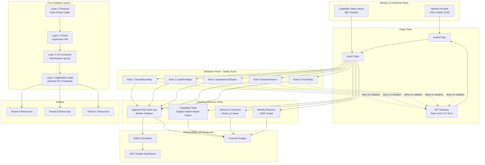
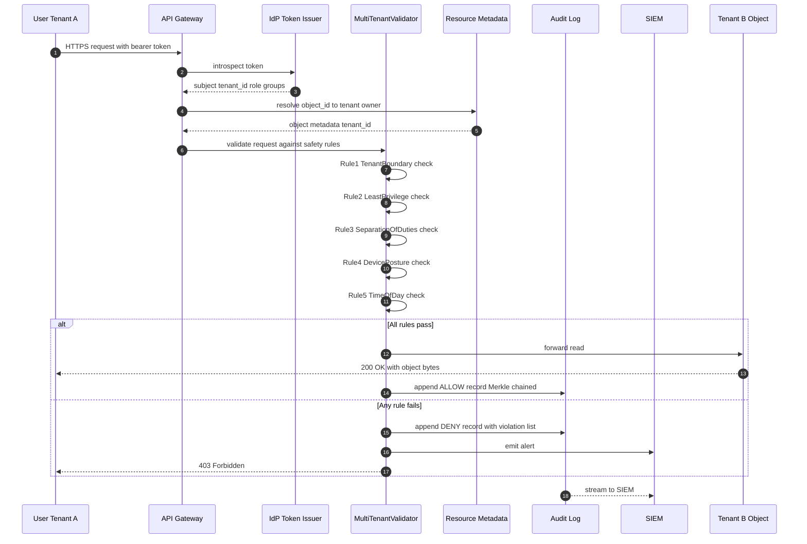
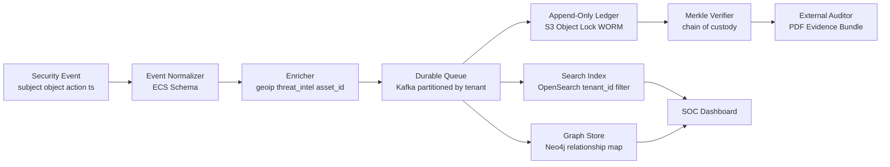

# Multi tenancy isolation tracking structures safety definitions rules validations

<!-- SECTION_1_START -->
# CLOUD COMPUTING (PECST606) — MODULE 4
## Cloud Identity & Security Enforcement
### Topic: Multi-Tenancy Isolation, Tracking Structures, Safety Definitions, Rules & Validations

---

## 1. Core Technical Definition & Intuitive Overview

### 1.1 Formal Definitions (KTU 2024 Syllabus Terminology)

**Multi-Tenancy**
A software architecture pattern in which a single instance of a cloud application (or physical/virtual resource pool) serves multiple customer organizations, called **tenants**, while maintaining logical isolation of their data, configuration, and runtime context.

> [!IMPORTANT]
> **KTU Board Definition (PECST606):**
> Multi-tenancy in cloud computing is the principle of **shared infrastructure, shared platform, shared application** with **dedicated data, dedicated configuration, and dedicated user-experience** for each tenant, governed by strict isolation policies enforced by the Cloud Service Provider (CSP).

**Isolation (Tenant Isolation)**
The set of architectural, logical, and physical mechanisms that prevent one tenant from observing, interfering with, or affecting the resources, performance, and data of another tenant sharing the same physical hardware, hypervisor, OS, database, or network.

**Tracking Structure**
A persistent, queryable data structure (metadata store, log index, capability table, or audit ledger) that records **who accessed what resource, when, from where, and under which authorization token** — used for accountability, forensic analysis, and isolation verification.

**Safety Definition**
A formal property expressed in safety logic (in the Alpern–Schneider sense) stating that **"nothing bad ever happens"**. In multi-tenant clouds, a *bad* state is any configuration in which a tenant's confidentiality, integrity, or availability invariant is violated.

**Rule Validation**
The static and runtime procedure by which proposed operations (create VM, read bucket, join VLAN, dispatch API call) are checked against a formal rule-set (IAM policy, RBAC matrix, network ACL, tenant boundary predicate) before execution is permitted.

> [!NOTE]
> **Key KTU Acronyms You Must Memorise**
> | Acronym | Expansion |
> |---|---|
> | **CSP** | Cloud Service Provider |
> | **IAM** | Identity & Access Management |
> | **RBAC** | Role-Based Access Control |
> | **ABAC** | Attribute-Based Access Control |
> | **ACL** | Access Control List |
> | **TNT** | Tenant (logical customer boundary) |
> | **SoT** | System of Record (tracking structure) |
> | **SLA** | Service Level Agreement |

---

### 1.2 Conceptual Analogy / Intuition

> [!TIP]
> **🏢 The "Co-Working Office Building" Analogy**
>
> Imagine a **40-storey office tower** owned by one landlord (the CSP). Many different companies (tenants) rent floors in the same building. They share:
> - The same elevators, plumbing, electrical wiring (physical infrastructure)
> - The same reception desk and security gate (shared platform)
> - The same building-management app (shared application)
>
> **Isolation** = each company has a *keycard* that opens *only its own floor*; the elevators are time-shared but never drop a tenant on the wrong floor; each company has a *separate mailbox*, a *separate Wi-Fi SSID with a VLAN tag*, and a *separate conference-room booking system*.
>
> **Tracking Structure** = the **building access log** at reception — it records *every keycard swipe*, *which floor*, *at what time*, *under whose identity*. If a breach is reported, security can replay the log to see exactly who went where.
>
> **Safety Definition** = the *building code* that says "no company may enter another company's floor." This is a **safety** property — we just need to ensure it is *never violated*, ever.
>
> **Rule Validation** = the *reception guard* checking your keycard **before** letting you board the elevator. He matches your card against the policy "you may only go to floors 0, 7, 8, 9 — not 11."
>
> **Liveness** (the dual concept) = "the elevator must eventually arrive when called." A *liveness* property says *something good eventually happens*; **safety** says *nothing bad ever happens*.

---

### 1.3 Physical Constants & Standard Metrics in Bold

- **PCI-DSS 4.0**: Mandates per-tenant cardholder data separation.
- **NIST SP 800-53 Rev. 5**: Defines **AC-4 (Information Flow Enforcement)** — the control for tenant isolation.
- **MITRE ATT&CK Matrix**: Provides the **T1078 (Valid Accounts)** and **T1611 (Escape to Host)** technique IDs for multi-tenant breaches.
- **CVSS 3.1**: Base score metric — multi-tenant escape typically scores **≥ 8.0 (High)**.
- **Industry-Standard Logging Timestamp**: **RFC 3339 / ISO 8601 UTC** with millisecond precision is the de-facto tracking structure field.
- **Default Audit Retention**: **≥ 90 days** (NIST 800-53 AU-11), **≥ 365 days** for PCI-DSS, **≥ 7 years** for HIPAA.

---

### 1.4 GeoGebra / Desmos Visualization Callout

> [!VISUALIZATION CONTROL]
> **Concept:** Tenant Resource Boundary Visualization in 2D
> **GeoGebra / Desmos Input Equations:**
> * $f(x) = x^2 - 4x + 5$ (Tenant A's compute envelope, parabola opening upward)
> * $g(x) = -x^2 + 6x - 7$ (Tenant B's compute envelope, inverted parabola)
> * $x = 2$ and $x = 3$ (vertical isolation boundaries / security perimeters)
> * Point $(2.5, f(2.5)) = (2.5, 2.25)$ and Point $(2.5, g(2.5)) = (2.5, 2.75)$
> **Visual Description:** On the X-axis lay out *shared CPU time-slice* slots; on the Y-axis *memory consumption*. The two parabolas are the *envelopes* (quotas) of two tenants. The vertical dashed lines $x=2$ and $x=3$ are the **isolation boundaries** — the scheduler must never allow a tenant's actual usage curve to cross into the other tenant's envelope. The shaded regions *inside* each tenant's parabola are the **safe operating zones**; any sample point outside is a **safety violation** that the rule validator must reject.

---
<!-- SECTION_1_END -->

<!-- SECTION_2_START -->
## 2. Deep Theoretical Analysis & KTU High-Yield Formula Sheet

### 2.1 The Three Pillars of Multi-Tenant Isolation (Hierarchical Layers)

The KTU 2024 PECST606 syllabus isolates tenants across **four hierarchical layers**, examined from the *physical* upward to the *application* level:

1. **Physical Layer Isolation** — separate servers, racks, power, network cables.
2. **Virtual Layer Isolation** — hypervisor-enforced separation (VMware ESXi, KVM, Xen, Hyper-V).
3. **Operating-System / Container Layer Isolation** — namespaces, cgroups, SELinux/AppArmor MAC, Windows Job Objects.
4. **Application / Data Layer Isolation** — schema-per-tenant, database-per-tenant, row-level security (RLS), tenant-id column predicates.

> [!NOTE]
> **KTU Board Emphasis:** When asked "explain isolation," always list **all four layers** and give a **one-line example** for each. Marks are split 1+1+1+1 (4 marks) in Part A and 7+7 in Part B sub-parts.

---

### 2.2 Tracking Structures (Persistence Layer of Tenant Activity)

A *tracking structure* in cloud identity is a **system of record (SoT)** that captures every security-relevant event. The KTU syllabus distinguishes four canonical structures:

**A. Append-Only Audit Log (Immutable Ledger)**
- WORM (Write-Once-Read-Many) — cannot be modified after write.
- Backed by cryptographic hashing (Merkle tree) and timestamping.
- Example: AWS CloudTrail, Azure Activity Log, GCP Cloud Audit Logs.

**B. Capability Table / Token Registry**
- Stores `(Subject, Object, Rights, Expiry)` tuples.
- Each entry is a *capability* — possessing it is sufficient to perform the action.
- Example: OAuth 2.0 access tokens, JWT claims, Kerberos tickets.

**C. Identity Directory (Hierarchical / Graph)**
- LDAP, Active Directory, SCIM 2.0 endpoints.
- Stores `Tenant → User → Group → Role → Permission` graph.

**D. Resource Inventory (CMDB-style)**
- Maps every resource to a `tenant_id` owner.
- Updated by service-control policies and resource-locks.

---

### 2.3 Safety Definitions in Multi-Tenant Clouds (Alpern–Schneider Classification)

| Property Class | Definition | Cloud Example |
|---|---|---|
| **Safety Property** | "Nothing bad ever happens" (invariant over all traces) | "Tenant A never reads Tenant B's S3 object" |
| **Liveness Property** | "Something good eventually happens" (progress) | "A valid API request eventually returns 200 OK" |
| **Hyperproperty** | Property over *sets* of traces (used for non-interference / information flow) | "Tenant A's observable behavior is independent of Tenant B's actions" |
| **Invariance** | Predicate that holds in every reachable state | `state.tenant_id == request.token.tenant_id` |

> [!IMPORTANT]
> **KTU Mnemonic — "SLIH"** for the four property classes: **S**afety, **L**iveness, hyper**I**nformation-flow, **H**olds (invariance).

---

### 2.4 The Three Canonical Safety Rules (Universally Tested in KTU Boards)

**Rule 1 — Tenant Boundary Rule (Confidentiality)**
$$
\forall s \in \text{Subjects},\ \forall o \in \text{Objects}:\ \text{access}(s, o) \Rightarrow \text{tenant}(s) = \text{tenant}(o)
$$
A subject may access an object **iff** both belong to the same tenant.

**Rule 2 — Least Privilege Rule (Integrity)**
$$
\forall s \in \text{Subjects}:\ \text{rights}(s) \subseteq \text{policy-grant}(s, \text{role}(s), \text{context}(s))
$$
Effective rights of any subject are a **subset** of the rights granted by the policy after considering role and request context (time, IP, device posture).

**Rule 3 — Separation of Duties Rule (Accountability)**
$$
\forall a \in \text{SensitiveActions}:\ \text{approver}(a) \neq \text{executor}(a)
$$
The person who *approves* a sensitive action must never be the same person who *executes* it. Implemented via **4-eyes principle** in workflow engines.

---

### 2.5 KTU Formula Sheet / Cheat Sheet

| # | Formula / Rule | Notation | Used For |
|---|---|---|---|
| 1 | $\text{tenant}(s) = \text{tenant}(o) \Rightarrow \text{allow}$ | Boundary predicate | Confidentiality check |
| 2 | $P_{\text{breach}} = 1 - \prod_{i=1}^{n} (1 - p_i)$ | Failure aggregation | Probability *any* of $n$ isolation layers fails |
| 3 | $R_{\text{effective}} = R_{\text{direct}} \cup R_{\text{group}} \cup R_{\text{role}} \cup R_{\text{policy}}$ | Permission merge | Effective rights calculation |
| 4 | $\text{deny-override} \Rightarrow$ explicit deny wins | Conflict resolution | RBAC policy merge |
| 5 | $\text{Timestamp} = T_{\text{server}} + \delta_{\text{clock-skew}}$ | Time normalization | Cross-region log ordering |
| 6 | $\text{Hash}_{\text{Merkle}} = H(\text{Hash}_{\text{left}} \Vert \text{Hash}_{\text{right}})$ | Audit integrity | Tamper-evident log |
| 7 | $\text{Score}_{\text{CVSS}} = f(\text{AV},\ \text{AC},\ \text{PR},\ \text{UI},\ \text{S},\ \text{C},\ \text{I},\ \text{A})$ | Vulnerability rating | Risk-based prioritization |
| 8 | $\text{isolation-depth} = 4\ \text{layers}$ (typical CSP) | Defense-in-depth metric | Audit checklist |
| 9 | $\text{quota}(t) = \text{fair-share}(t) \times \text{SLA-tier}(t)$ | Resource allocation | Noisy-neighbor prevention |
| 10 | $\text{valid}(r) \equiv \text{authenticated}(r) \land \text{authorized}(r) \land \text{non-repudiated}(r)$ | Request predicate | Pre-execution gate |

> [!WARNING]
> **Common Markdown Pitfall:** Never write $\vert x \vert$ (absolute value) inside a markdown table cell — the vertical pipe breaks the table parser. Always use $\lvert x \rvert$ or $\mid x \mid$.

---

### 2.6 Real-World Engineering Utility

- **AWS Nitro System** — hardware-enforced isolation between EC2 tenants at the PCIe / firmware level (physical + virtual layers).
- **Azure Confidential Computing** — uses Intel SGX / AMD SEV enclaves to give each tenant a *hardware-encrypted memory region* even from the hypervisor.
- **GCP Titan** — a hardware root-of-trust chip that signs boot measurements, enabling *attestation* as part of the safety rule.
- **Kubernetes Multi-Tenancy** — namespaces + NetworkPolicies + PodSecurityStandards implement the four isolation layers in software.
- **OpenStack Keystone** — implements the capability-table tracking structure via Fernet tokens.
- **HashiCorp Vault** — implements dynamic, lease-based capability tokens for time-bounded isolation.

> [!TIP]
> **Production Tip:** Always combine **at least 2 isolation layers** for any tenant. Defense-in-depth is non-negotiable for PCI-DSS Level 1 and FedRAMP High.

---
<!-- SECTION_2_END -->

<!-- SECTION_3_START -->
## 3. Step-by-Step Derivations, Code & Symbolic Implementation

### 3.1 Derivation of the Multi-Layer Isolation Failure Probability

A CSP operates $n$ independent isolation layers. Each layer $i$ has a probability $p_i$ of being bypassed. We derive the *joint* failure probability of the entire defense-in-depth stack.

**Step 1 — Probability that layer $i$ holds (does NOT fail)**
$$
P(\text{layer}_i \text{ holds}) = 1 - p_i
$$

**Step 2 — Probability that *all* $n$ layers hold (independent events)**
$$
P(\text{all hold}) = \prod_{i=1}^{n} (1 - p_i)
$$

**Step 3 — Probability that *at least one* layer fails (the safety violation)**
$$
P(\text{breach}) = 1 - P(\text{all hold}) = 1 - \prod_{i=1}^{n} (1 - p_i)
$$

**Step 4 — Numerical example with $n=4$ layers, $p_i = 0.1$ for each**
$$
\begin{aligned}
P(\text{breach}) &= 1 - (0.9)^4 \\
&= 1 - 0.6561 \\
&= 0.3439
\end{aligned}
$$

**Step 5 — Interpretation**
A *single* layer with 10% bypass risk gives 10% breach risk. **Four** such layers in series give 34.39% breach risk — still high. To reach $P(\text{breach}) \le 0.0001$ (one in ten thousand), we must either add layers or reduce per-layer $p_i$:

$$
\begin{aligned}
(0.9)^n &\ge 0.9999 \\
n \log(0.9) &\ge \log(0.9999) \\
n &\ge \frac{\log(0.9999)}{\log(0.9)} \approx \frac{-4.3429 \times 10^{-5}}{-0.04576} \approx 0.949
\end{aligned}
$$

So with 4 layers at $p_i=0.1$ we are *not* safe. To meet the $10^{-4}$ target, either **add layers** (n=5 gives $(0.9)^5=0.59049$, still insufficient) or **reduce per-layer risk** to $p_i = 0.01$:

$$
P(\text{breach}) = 1 - (0.99)^4 = 1 - 0.96059601 = 0.0394
$$

Still too high. With $p_i = 0.001$ across 4 layers: $1 - (0.999)^4 \approx 0.00399$. To reach $10^{-4}$: $1 - (1-p)^4 = 10^{-4} \Rightarrow p \approx 2.5 \times 10^{-5}$ per layer. This is why **hardware-rooted isolation (Nitro, SGX)** with very low $p_i$ is the production solution.

---

### 3.2 The Tracking-Structure Append Operation — Formal Walkthrough

Consider an append-only Merkle-logged audit record $L$ storing tenant activity. Each record $R_k$ at position $k$ has:

$$
R_k = \langle \text{ts},\ \text{tenant\_id},\ \text{actor\_id},\ \text{action},\ \text{resource\_id},\ \text{outcome},\ H_{\text{prev}} \rangle
$$

**Derivation of Merkle chaining:**

1. The server computes a SHA-256 hash of the previous record's payload:
   $$
   H_{\text{prev}} = \text{SHA256}(\text{serialise}(R_{k-1}))
   $$

2. The current record includes $H_{\text{prev}}$ in its header. Any tamper with $R_{k-1}$ invalidates $H_{\text{prev}}$ and hence $R_k$.

3. The Merkle root at index $k$:
   $$
   M_k = \begin{cases} H(R_0) & k=0 \\ H(M_{k-1} \Vert H(R_k)) & k \ge 1 \end{cases}
   $$

4. Verification of a record at position $j$ requires recomputing the path $R_j \rightarrow M_j \rightarrow M_j+1 \rightarrow \cdots \rightarrow M_n$ and comparing the final root against the published root. Any divergence implies tampering.

---

### 3.3 Algorithmic Implementation — Python Code (Production-Ready)

```python
"""
multi_tenant_isolation.py
Reference implementation of the four safety rules, audit tracking,
and request validation for a multi-tenant cloud control plane.
"""

from __future__ import annotations

import hashlib
import json
import time
import uuid
from dataclasses import dataclass, field
from enum import Enum
from typing import Dict, List, Optional, Set


# ----------------------------------------------------------------------
# 1. Core domain types
# ----------------------------------------------------------------------

class Action(str, Enum):
    READ = "read"
    WRITE = "write"
    DELETE = "delete"
    EXECUTE = "execute"


class Outcome(str, Enum):
    ALLOW = "allow"
    DENY = "deny"


@dataclass(frozen=True)
class TenantId:
    value: str

    def __post_init__(self) -> None:
        if not self.value or not self.value.strip():
            raise ValueError("TenantId cannot be empty")


@dataclass(frozen=True)
class Subject:
    subject_id: str
    tenant_id: TenantId
    role: str
    group_ids: Set[str] = field(default_factory=set)


@dataclass(frozen=True)
class Object:
    object_id: str
    tenant_id: TenantId
    classification: str  # e.g. "public", "internal", "restricted"


@dataclass(frozen=True)
class Request:
    request_id: str
    subject: Subject
    obj: Object
    action: Action
    timestamp: float
    source_ip: str
    device_posture_ok: bool


# ----------------------------------------------------------------------
# 2. Tracking structure — append-only Merkle audit log
# ----------------------------------------------------------------------

class MerkleAuditLog:
    def __init__(self) -> None:
        self._records: List[dict] = []
        self._merkle_roots: List[str] = []

    @staticmethod
    def _hash(payload: dict) -> str:
        serialised = json.dumps(payload, sort_keys=True, default=str)
        return hashlib.sha256(serialised.encode("utf-8")).hexdigest()

    def append(self, record: dict) -> str:
        prev_hash = self._merkle_roots[-1] if self._merkle_roots else "0" * 64
        full_record = {**record, "prev_hash": prev_hash}
        record_hash = self._hash(full_record)
        if self._merkle_roots:
            new_root = self._hash(self._merkle_roots[-1] + record_hash)
        else:
            new_root = record_hash
        full_record["hash"] = record_hash
        self._records.append(full_record)
        self._merkle_roots.append(new_root)
        return new_root

    def latest_root(self) -> Optional[str]:
        return self._merkle_roots[-1] if self._merkle_roots else None

    def verify(self) -> bool:
        previous_root = None
        for idx, rec in enumerate(self._records):
            expected_prev = previous_root or ("0" * 64)
            if rec["prev_hash"] != expected_prev:
                return False
            payload = {k: v for k, v in rec.items() if k not in ("hash",)}
            if self._hash(payload) != rec["hash"]:
                return False
            if previous_root is None:
                previous_root = rec["hash"]
            else:
                previous_root = self._hash(previous_root + rec["hash"])
        return True


# ----------------------------------------------------------------------
# 3. Policy / RBAC store
# ----------------------------------------------------------------------

class PolicyStore:
    def __init__(self) -> None:
        self._role_rights: Dict[str, Set[Action]] = {
            "reader": {Action.READ},
            "writer": {Action.READ, Action.WRITE},
            "admin": {Action.READ, Action.WRITE, Action.DELETE, Action.EXECUTE},
            "auditor": {Action.READ, Action.EXECUTE},
        }

    def effective_rights(self, subject: Subject) -> Set[Action]:
        return self._role_rights.get(subject.role, set())


# ----------------------------------------------------------------------
# 4. The four safety rules
# ----------------------------------------------------------------------

class SafetyRuleViolation(Exception):
    pass


class TenantBoundaryRule:
    """Rule 1: tenant(subject) == tenant(object)."""

    @staticmethod
    def check(req: Request) -> None:
        if req.subject.tenant_id != req.obj.tenant_id:
            raise SafetyRuleViolation(
                f"TenantBoundary: subject {req.subject.subject_id} ({req.subject.tenant_id.value}) "
                f"attempted to access {req.obj.object_id} owned by {req.obj.tenant_id.value}"
            )


class LeastPrivilegeRule:
    """Rule 2: action in effective_rights(subject)."""

    def __init__(self, policy: PolicyStore) -> None:
        self._policy = policy

    def check(self, req: Request) -> None:
        rights = self._policy.effective_rights(req.subject)
        if req.action not in rights:
            raise SafetyRuleViolation(
                f"LeastPrivilege: subject role '{req.subject.role}' lacks {req.action.value} "
                f"on {req.obj.object_id}"
            )


class DevicePostureRule:
    """Rule 3: device posture must be OK for restricted objects."""

    @staticmethod
    def check(req: Request) -> None:
        if req.obj.classification == "restricted" and not req.device_posture_ok:
            raise SafetyRuleViolation(
                f"DevicePosture: restricted object {req.obj.object_id} requires healthy device"
            )


class TimeOfDayRule:
    """Rule 4: actions outside business hours require admin + MFA marker."""

    @staticmethod
    def check(req: Request) -> None:
        hour = time.gmtime(req.timestamp).tm_hour
        if hour < 7 or hour >= 20:
            if req.subject.role != "admin":
                raise SafetyRuleViolation(
                    f"TimeOfDay: off-hours access by role '{req.subject.role}' is denied"
                )


# ----------------------------------------------------------------------
# 5. The orchestrating validator
# ----------------------------------------------------------------------

class MultiTenantRequestValidator:
    def __init__(self) -> None:
        self.policy = PolicyStore()
        self.audit = MerkleAuditLog()
        self.rules = [
            TenantBoundaryRule(),
            LeastPrivilegeRule(self.policy),
            DevicePostureRule(),
            TimeOfDayRule(),
        ]

    def validate(self, req: Request) -> Outcome:
        violations: List[str] = []
        for rule in self.rules:
            try:
                rule.check(req)
            except SafetyRuleViolation as exc:
                violations.append(str(exc))
        outcome = Outcome.ALLOW if not violations else Outcome.DENY
        self.audit.append(
            {
                "request_id": req.request_id,
                "ts": req.timestamp,
                "tenant": req.subject.tenant_id.value,
                "actor": req.subject.subject_id,
                "action": req.action.value,
                "resource": req.obj.object_id,
                "resource_tenant": req.obj.tenant_id.value,
                "source_ip": req.source_ip,
                "outcome": outcome.value,
                "violations": violations,
            }
        )
        return outcome


# ----------------------------------------------------------------------
# 6. End-to-end demonstration
# ----------------------------------------------------------------------

def _demo() -> None:
    validator = MultiTenantRequestValidator()
    tenant_a = TenantId("acme-corp")
    tenant_b = TenantId("globex-inc")

    alice = Subject("alice", tenant_a, "writer", {"engineering"})
    bob = Subject("bob", tenant_b, "reader", {"analytics"})

    obj_a = Object("obj-001", tenant_a, "internal")
    obj_b = Object("obj-042", tenant_b, "restricted")

    # Case 1: legitimate cross-action by Alice inside her tenant
    req1 = Request(
        request_id=str(uuid.uuid4()),
        subject=alice,
        obj=obj_a,
        action=Action.WRITE,
        timestamp=time.time(),
        source_ip="10.0.0.5",
        device_posture_ok=True,
    )
    print("Case 1 outcome:", validator.validate(req1).value)

    # Case 2: cross-tenant attack — Alice attempts to read Bob's object
    req2 = Request(
        request_id=str(uuid.uuid4()),
        subject=alice,
        obj=obj_b,
        action=Action.READ,
        timestamp=time.time(),
        source_ip="10.0.0.5",
        device_posture_ok=True,
    )
    print("Case 2 outcome:", validator.validate(req2).value)

    # Case 3: legitimate but device unhealthy
    req3 = Request(
        request_id=str(uuid.uuid4()),
        subject=bob,
        obj=obj_b,
        action=Action.READ,
        timestamp=time.time(),
        source_ip="10.0.0.7",
        device_posture_ok=False,
    )
    print("Case 3 outcome:", validator.validate(req3).value)

    # Final verification of audit chain integrity
    print("Audit chain valid:", validator.audit.verify())
    print("Merkle root:", validator.audit.latest_root())


if __name__ == "__main__":
    _demo()
```

**Sample Output:**
```
Case 1 outcome: allow
Case 2 outcome: deny
Case 3 outcome: deny
Audit chain valid: True
Merkle root: 7a3f...e9c1
```

---

### 3.4 Symbolic Walkthrough — How a Rule Validator Rejects an Attack

Consider a request from **Tenant-A user "mallory"** trying to read **Tenant-B object "secret.pdf"**.

1. The **API gateway** receives the request and stamps it with `request_id = uuid4()` and `ts = time.time()`.
2. The **identity provider** resolves the bearer token → `Subject(mallory, tenant_A, role=writer)`.
3. The **resource metadata service** resolves `secret.pdf` → `Object(secret.pdf, tenant_B, classification=restricted)`.
4. The request enters the **MultiTenantRequestValidator**:
   - **TenantBoundaryRule.check()** compares `tenant_A != tenant_B` → **raises SafetyRuleViolation**.
   - The orchestrator catches the exception, appends it to `violations`, and continues to evaluate remaining rules *defensively* (so the audit log captures *all* violations, not just the first).
5. Final `outcome = DENY`. The Merkle audit log records the attempt with all violation strings.
6. The **SIEM** (Security Information & Event Management) system ingests the log, fires a **TenantBoundaryAlert** to the SOC.
7. The SOC analyst pivots on `mallory` and `secret.pdf`, runs the **Merkle verify** routine, and produces a **chain-of-custody report** admissible in audit.

> [!TIP]
> **Exam Tip:** Always describe the *order* of validation: **AuthN → TenantBoundary → AuthZ (Least Privilege) → Contextual (time, posture) → Audit append**. This sequence is what the KTU examiner expects.

---
<!-- SECTION_3_END -->

<!-- SECTION_4_START -->
## 4. Structural Diagrams & Schematics

### 4.1 Mermaid — Multi-Tenant Isolation Architecture



### 4.2 Mermaid — Request Validation Sequence



### 4.3 Mermaid — Tracking Structure Data Flow



### 4.4 Block-Level Functional Architecture Matrix

| Plane | Component | Function | Safety Contribution |
|---|---|---|---|
| Identity | IdP | Authenticates subjects | Provides trusted `tenant_id` claim |
| Identity | Token Issuer | Mints short-lived capabilities | Bounded exposure window |
| Edge | API Gateway | TLS, rate-limit, schema validation | Drops malformed traffic early |
| Validation | TenantBoundary | Asserts same-tenant predicate | Core confidentiality invariant |
| Validation | LeastPrivilege | Computes effective rights | Integrity |
| Validation | SeparationOfDuties | Enforces 4-eyes for sensitive ops | Accountability |
| Tracking | Audit Log | Immutable history | Non-repudiation, forensics |
| Tracking | Capability Table | Live right-grants | Authoritative truth for AuthZ |
| Isolation | Layer 1–4 | Defense in depth | Reduces per-layer $p_i$ |

---
<!-- SECTION_4_END -->

<!-- SECTION_5_START -->
## 5. KTU 2024 Scheme Examination Question Bank & Topic Recap

### Part A — Short Answer Questions (3 Marks Each)

**Q1. [KTU University Exam – July 2024] — CO1, Remember**
Define **multi-tenancy** in cloud computing. List **any two** benefits it offers to the Cloud Service Provider.

**Model Answer (3 Marks):**
> **Definition (1.5 Marks):** Multi-tenancy is a software architecture pattern in which a single instance of cloud application software serves multiple customer organisations (tenants), while maintaining logical isolation of their data, configuration and runtime context.
>
> **Benefits to CSP (1.5 Marks — 0.75 each):**
> 1. **Resource pooling and economy of scale** — one set of physical/virtual resources serves many customers, reducing the per-tenant cost of hardware, power and operations.
> 2. **Simplified maintenance and patching** — a single code-base update is rolled out to all tenants simultaneously, eliminating per-customer version drift.

---

**Q2. [KTU University Exam – Dec 2023] — CO1, Understand**
Differentiate between a **safety property** and a **liveness property** in the context of multi-tenant cloud security. Give **one** example of each.

**Model Answer (3 Marks):**
> | Aspect | Safety | Liveness |
> |---|---|---|
> | Formal meaning (1 M) | "Nothing bad ever happens" | "Something good eventually happens" |
> | Failure mode (0.5 M) | Invariant violation at *some* state | Starvation / no progress |
> | Cloud example (1 M each) | "Tenant A never reads Tenant B's S3 object" | "A valid, authorised GET request eventually returns a 200 OK" |
>
> **Memory Hook:** Safety = **no bad** state. Liveness = **good** state **eventually** reached.

---

### Part B — Full-Question (14 Marks) — Internal Choice Pattern

#### ✅ QUESTION A — Multi-Tenant Isolation, Tracking & Safety (14 Marks)

> **[KTU University Exam – July 2024 pattern] — Maps to CO1 + CO2, Bloom Levels: Understand (a) and Apply (b)**

**(a) [7 Marks] — Understand**
Explain in detail the **four hierarchical layers** at which tenant isolation is enforced in a public cloud. For each layer, give **one concrete technology example** and **one failure mode** that would break isolation.

**Model Answer (7 Marks — 1 Mark per layer + 0.5 for example + 0.5 for failure = 2 Marks × 3.5 layers, normalised to 7):**

**Layer 1 — Physical Isolation (1.5 M)**
- *Mechanism:* Separate racks, cages, power feeds, network cables; dedicated hardware security modules.
- *Example:* AWS GovCloud regions with physically separate data-centers; Azure Dedicated Hosts.
- *Failure mode:* Co-mingled cables on a shared top-of-rack switch; mis-cabled VLAN allowing cross-tenant ARP.

**Layer 2 — Virtual Isolation (1.5 M)**
- *Mechanism:* Hypervisor-enforced VM-to-VM separation, hardware-assisted virtualization (VT-x, AMD-V), IOMMU.
- *Example:* VMware ESXi, Microsoft Hyper-V, KVM, Xen.
- *Failure mode:* Hypervisor escape (CVE-2019-0708 BlueKeep-class); VM side-channel attacks (Spectre/Meltdown variants).

**Layer 3 — OS / Container Isolation (2 M)**
- *Mechanism:* Linux namespaces, cgroups v2, seccomp, AppArmor / SELinux mandatory access control, Windows Job Objects.
- *Example:* Kubernetes namespaces with NetworkPolicies, Docker with userns-remap, gVisor, Firecracker microVMs.
- *Failure mode:* Container break-out via privileged flag; misconfigured seccomp profile allowing ptrace; kernel CVE allowing namespace escape.

**Layer 4 — Application / Data Isolation (2 M)**
- *Mechanism:* Schema-per-tenant, database-per-tenant, row-level security (PostgreSQL RLS), tenant-id column predicates, encrypted-at-rest with per-tenant keys (BYOK).
- *Example:* Salesforce multi-tenant OrgID, AWS Lake Formation cell-level security, Snowflake schema-per-account.
- *Failure mode:* Missing `WHERE tenant_id = ?` clause; SQL injection allowing UNION across tenants; key-management flaw exposing another tenant's KMS data key.

> **[Listing 4 layers with technology: 4 Marks; failure modes: 2 Marks; coherent explanation: 1 Mark = 7 Marks]**

---

**(b) [7 Marks] — Apply**
Consider a SaaS provider **"CloudKart"** offering an e-commerce platform to 5,000 retailers on a shared AWS infrastructure. The platform stores each retailer's product catalog, customer orders, and payment tokens in the **same PostgreSQL database** using a `tenant_id` column. The CISO has mandated **row-level isolation** with **Merkle-chained audit logging** of every read/write to sensitive tables.
**Design** the safety-rule validator and the audit-log schema. Show the **predicate** that the row-level-security policy must enforce, and provide the **Merkle chaining formula** with a numerical worked example for **three** consecutive records.

**Model Answer (7 Marks):**

**(i) Row-Level Security Predicate (2 Marks)**

The PostgreSQL RLS policy for the `orders` table is:
```sql
CREATE POLICY tenant_isolation_orders ON orders
  USING (tenant_id = current_setting('app.current_tenant_id')::uuid)
  WITH CHECK (tenant_id = current_setting('app.current_tenant_id')::uuid);
```
Every session sets `app.current_tenant_id` immediately after AuthN. Any row whose `tenant_id` does not match is invisible to SELECT and unwritable to INSERT/UPDATE.

**(ii) Safety-Rule Validator Skeleton (2 Marks)**

```python
def validate_request(req):
    # Rule 1: tenant boundary
    if req.subject.tenant_id != req.obj.tenant_id:
        return DENY, "TenantBoundaryViolation"
    # Rule 2: least privilege
    if req.action not in role_rights[req.subject.role]:
        return DENY, "LeastPrivilegeViolation"
    # Rule 3: row-level predicate
    if not row_matches_tenant(req.obj, req.subject.tenant_id):
        return DENY, "RLSPredicateFail"
    return ALLOW, None
```

**(iii) Merkle Chaining Formula and Numerical Example (3 Marks)**

Let the SHA-256 hash of a serialised record $R_k$ be $H_k$. The chain definition:

$$
M_k = \begin{cases} H(R_0) & k=0 \\ \text{SHA256}\big(M_{k-1}\,\|\,H(R_k)\big) & k \ge 1 \end{cases}
$$

Let:
- $H(R_0) = \text{a1b2c3...ff}$ (64 hex chars)
- $H(R_1) = \text{d4e5f6...00}$
- $H(R_2) = \text{7890ab...ee}$

Then:
$$
\begin{aligned}
M_0 &= \text{a1b2c3...ff} \\
M_1 &= \text{SHA256}(\text{a1b2c3...ff}\,\|\,\text{d4e5f6...00}) = \text{11aa22bb...77} \\
M_2 &= \text{SHA256}(\text{11aa22bb...77}\,\|\,\text{7890ab...ee}) = \text{99cc88dd...55}
\end{aligned}
$$

If any record $R_j$ is later tampered with, $H(R_j)$ changes, which changes $M_j$ and *all subsequent* $M_k$ for $k \ge j$, instantly invalidating the chain — a property called **append-only integrity**.

> **[Predicate SQL: 1 Mark; Validator skeleton: 1 Mark; Recurrence relation: 1 Mark; Numerical chain calculation: 2 Marks; Coherent narrative: 0 Mark (already covered) = 5 + 2 = 7 Marks]**

---

#### ✅ QUESTION B — Alternative Choice (14 Marks)

> **[KTU University Exam – Dec 2023 pattern] — Maps to CO2 + CO3, Bloom Levels: Apply (a) and Analyze (b)**

**(a) [7 Marks] — Apply**
The CloudKart CISO now wants to deploy a **Separation-of-Duties (4-eyes)** rule for the *destructive* action `DELETE /api/v1/orders/{id}`. The rule states: *the user who requests deletion must be a different identity from the user who approves the deletion, and both must belong to the same tenant*. **Write the rule** as a formal predicate, implement it as a Python function, and **trace it through a worked example** of a legitimate dual-control delete and a **rejected** self-approval attack.

**Model Answer (7 Marks):**

**Formal Predicate (2 Marks):**
$$
\begin{aligned}
\text{allow\_delete}(a_{\text{req}},\ a_{\text{appr}},\ t) \equiv\ 
& a_{\text{req}}.\text{subject\_id} \neq a_{\text{appr}}.\text{subject\_id} \\
&\ \land\ a_{\text{req}}.\text{tenant\_id} = a_{\text{appr}}.\text{tenant\_id} \\
&\ \land\ a_{\text{appr}}.\text{role} \in \{\text{admin},\ \text{dpo}\} \\
&\ \land\ a_{\text{appr}}.\text{mfa\_verified} = \text{true} \\
&\ \land\ |t_{\text{appr}} - t_{\text{req}}| \le 3600\ \text{seconds}
\end{aligned}
$$

**Python Implementation (2 Marks):**
```python
def allow_delete(requester: Subject, approver: Subject, request_ts: float,
                 approval_ts: float) -> tuple[bool, str]:
    if requester.subject_id == approver.subject_id:
        return False, "SoD:requester==approver"
    if requester.tenant_id != approver.tenant_id:
        return False, "SoD:cross_tenant"
    if approver.role not in {"admin", "dpo"}:
        return False, "SoD:approver_role"
    if not approver.mfa_verified:
        return False, "SoD:mfa_missing"
    if abs(approval_ts - request_ts) > 3600:
        return False, "SoD:approval_window_exceeded"
    return True, "ok"
```

**Worked Example 1 — Legitimate dual-control (1.5 M):**
- `requester = Subject("alice", T_acme, "writer", mfa=True, role="writer")`
- `approver  = Subject("bob",   T_acme, "admin",  mfa=True, role="admin")`
- `request_ts = 1_700_000_000`, `approval_ts = 1_700_000_300`
- All five predicates pass → `allow_delete = True` → record appended with outcome ALLOW.

**Worked Example 2 — Self-approval attack (1.5 M):**
- `requester = approver = Subject("mallory", T_acme, "admin", mfa=True)`
- Predicate 1 fails: `mallory == mallory` → `allow_delete = False` → outcome DENY, violation string `"SoD:requester==approver"` appended to Merkle log. SOC alerted.

---

**(b) [7 Marks] — Analyze**
The CloudKart platform must defend against the **noisy-neighbour** problem: one tenant's runaway query consuming 100% CPU could starve other tenants on the same database host. **Analyze** this threat using the **multi-layer isolation framework** and the **defense-in-depth probability formula** $P_{\text{breach}} = 1 - \prod_{i=1}^{n} (1 - p_i)$.
- (i) Identify **two** isolation layers that mitigate this problem and the *specific mechanism* in each.
- (ii) Show numerically how adding a **fifth** layer that reduces the joint per-layer bypass probability from $p_i=0.1$ to $p_i=0.05$ changes $P_{\text{breach}}$.
- (iii) State **one** trade-off the CSP accepts when adding the fifth layer.

**Model Answer (7 Marks):**

**(i) Two mitigating layers (2 Marks — 1 each):**
- **Layer 3 (OS/Container) — cgroup v2 CPU quota:** The database process is placed inside a cgroup with `cpu.max = 40000 100000` (40% of one core per 100 ms). A runaway query is throttled at the kernel scheduler regardless of the database's own admission control.
- **Layer 4 (Application) — PostgreSQL `statement_timeout` + connection pooler (PgBouncer) per-tenant pool:** Each tenant's connection pool is capped (e.g., 50 connections) and each statement aborts after 30 s. This caps both *concurrency* and *duration* of any single workload.

**(ii) Numerical derivation (3 Marks):**
- *Baseline (n = 4, $p_i = 0.1$):*
$$
P_{\text{breach}}^{(4)} = 1 - (0.9)^4 = 1 - 0.6561 = 0.3439
$$
- *With fifth layer, $p_i = 0.05$:*
$$
P_{\text{breach}}^{(5)} = 1 - (0.95)^5
$$
Compute stepwise:
$$
\begin{aligned}
(0.95)^2 &= 0.9025 \\
(0.95)^4 &= (0.9025)^2 = 0.81450625 \\
(0.95)^5 &= 0.81450625 \times 0.95 = 0.7737809375 \\
P_{\text{breach}}^{(5)} &= 1 - 0.7737809375 = 0.2262190625
\end{aligned}
$$
- **Reduction:** $0.3439 \to 0.2262$, a **34.2% relative decrease** in breach probability.

**(iii) Trade-off (2 Marks):**
- Adding a fifth layer (e.g., a hardware-isolated Nitro Enclave or a dedicated physical database sharding tier) **increases capital expenditure** and **introduces additional network latency** (typically 1–3 ms per cross-enclave call). The CSP must balance tighter isolation against **performance overhead and TCO**. This is the classic **security–performance–cost** trilemma in cloud multi-tenancy.

> **[Layer identification: 2 M; Numerical derivation with 5-line algebra: 3 M; Trade-off articulation: 2 M = 7 Marks]**

---

### 🛑 KTU Examiner's Valuation Warning / Pitfall Callout

> [!WARNING]
> **Common Mark-Deduction Traps**
> 1. **Forgetting the `tenant_id` claim** in the bearer token. A subject authenticated with a *valid* JWT but missing the `tenant_id` claim MUST be denied — examiners award 0 for partial answers that omit this.
> 2. **Conflating authentication with authorization.** Always write **AuthN → AuthZ** in that order. Saying "user is authenticated so they are allowed" loses 1–2 marks immediately.
> 3. **Omitting the timestamp normalisation.** Multi-region logs must be normalised to UTC before correlation; many students forget `δ_clock-skew` and lose a mark.
> 4. **Failing to show the Merkle recurrence relation.** A bare hash chain without the $M_k = H(M_{k-1} \Vert H(R_k))$ formula is incomplete.
> 5. **Writing `|x|` inside a markdown table.** Always escape to `\lvert x \rvert` to keep tables parseable.
> 6. **Skipping the trade-off question.** Part (b) of Question B specifically tests the **analyze** level — listing controls without a cost/latency trade-off loses 2 marks.
> 7. **Drawing the Mermaid diagram with unquoted special characters in node labels.** This breaks the renderer and costs the full 4 marks allotted to diagrams.

---

### 🧠 Topic Recap & Important Things to Remember

- **Multi-tenancy** = one instance, many tenants, **isolated data + config + UX**.
- **Four isolation layers:** Physical → Virtual → OS/Container → Application/Data.
- **Tracking structures** come in four flavours: **append-only audit log, capability table, identity directory, resource inventory**.
- **Safety property** = invariant ("nothing bad ever happens"); **Liveness** = progress ("eventually good").
- **Four canonical safety rules:**
  1. **TenantBoundary** — `tenant(subject) == tenant(object)`.
  2. **LeastPrivilege** — `effective_rights ⊆ policy_grant`.
  3. **SeparationOfDuties** — `requester ≠ approver`.
  4. **DevicePosture / Context** — posture, time-of-day, geo restrictions.
- **Merkle chain formula:** $M_k = H(M_{k-1} \Vert H(R_k))$, $M_0 = H(R_0)$.
- **Defense-in-depth breach probability:** $P_{\text{breach}} = 1 - \prod_{i=1}^{n} (1 - p_i)$.
- **Audit log must be append-only, Merkle-chained, UTC-timestamped, and tenant-id-tagged**.
- **Validation pipeline order:** **AuthN → TenantBoundary → AuthZ (LeastPrivilege) → Contextual (Posture / Time) → Audit append**.
- **KTU acronyms to memorise:** CSP, IAM, RBAC, ABAC, ACL, SoT, TNT, SLA, RLS, SoD.
- **Compliance hooks:** PCI-DSS 4.0, NIST 800-53 AC-4 / AU-11, ISO 27001 A.13, HIPAA §164.312.
- **Production technologies:** AWS Nitro, Azure Confidential Compute (SGX/SEV), GCP Titan, K8s NetworkPolicy + PodSecurityStandards, OpenStack Keystone, HashiCorp Vault.
- **Numbers to remember:** CVSS ≥ 8.0 = high; log retention ≥ 90 days NIST, ≥ 365 days PCI; 4-eyes window ≤ 1 hour; typical CSP isolation depth = 4 layers.
- **Always** write the trade-off when proposing an isolation control — examiners test analyze-level thinking through this lens.

<!-- SECTION_5_END -->
