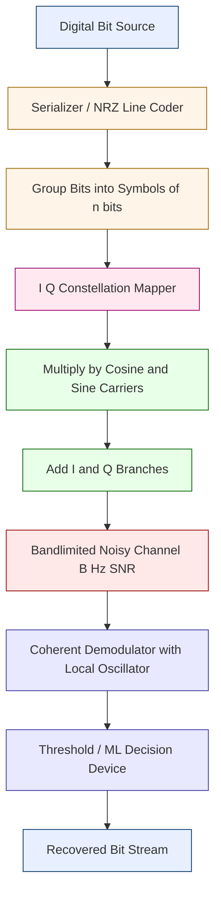
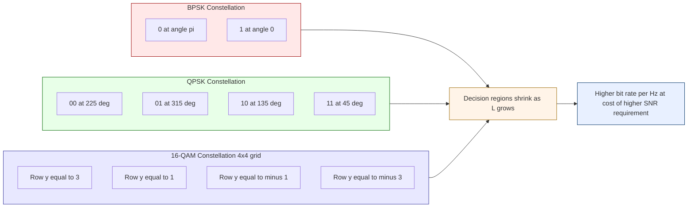
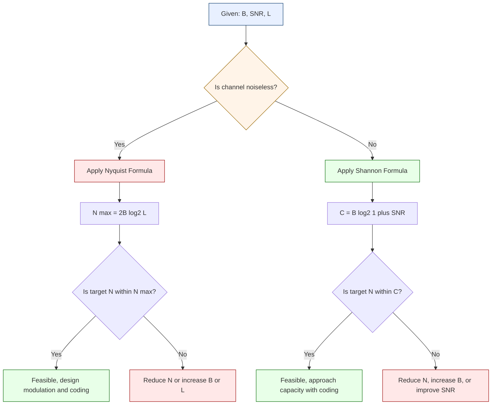
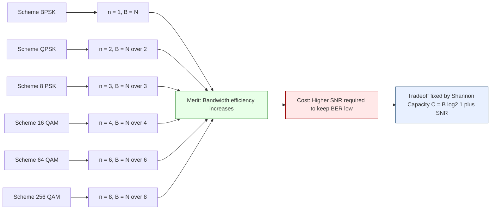

# Analog discrete data translation encoding parameters, signaling rates constraints scales

<!-- SECTION_1_START -->

# Analog Translation of Discrete Data — Conceptual Foundation

> [!IMPORTANT]
> **KTU 2024 — PECST607 Data Communication | Module 1 Focus**
> This module establishes the **bridge between the digital world of bits and the analog world of transmission media** (copper, fiber, wireless). Every parameter you learn here directly controls how fast, how far, and how reliably your data travels.

---

## 1.1 Formal Academic Definition

**Digital-to-Analog Translation (Encoding)** is the process of converting a discrete-time, discrete-amplitude digital bitstream into a continuous-time, continuous-amplitude analog waveform by varying one or more fundamental properties of a high-frequency **carrier signal** — namely, **amplitude, frequency, or phase** — in accordance with the input bits. This translation is mandatory whenever the transmission medium is bandpass in nature (e.g., wireless channels, telephone channels, optical carriers), because such media cannot directly propagate baseband digital pulses without severe distortion.

The discipline that defines the **engineering boundaries** of this translation is governed by three classical information-theoretic constraints:

1. **Nyquist's Noiseless Channel Theorem** — limits the maximum signaling rate relative to available bandwidth.
2. **Shannon's Noisy Channel Theorem (Hartley–Shannon Law)** — limits the maximum achievable bit rate in the presence of thermal/white noise.
3. **The Bit-Rate / Baud-Rate Relationship** — couples the *digital data rate* to the *analog signal rate* through the number of signal levels (or bits per symbol).

> [!NOTE]
> **Core KTU Definition (Board Examiner Wording):**
> *"Digital-to-Analog encoding is a modulation technique in which one of the three characteristics — amplitude, frequency, or phase — of a sinusoidal carrier signal is varied in discrete steps corresponding to the input digital data."* — *Forouzan, Data Communications & Networking, 5th Ed.*

---

## 1.2 Intuitive Real-World Analogy

Imagine you have a **letter (digital message)** you want to send to a friend living on a distant island. The postal service will only accept **parcels of a fixed shape (analog carrier)**. So you must:

- **Choose a property to vary on the parcel** — its size (amplitude), the type of stamp on it (frequency), or the orientation of the address label (phase).
- **Encode every letter of your message** as a variation of that chosen property.
- **Minimize the number of parcels you send** by stuffing more letters per parcel if the post office allows it (this is the *bits-per-symbol* concept).
- **Pay attention to the post office rules** — the postman (channel) has a fixed *bandwidth* (how wide his truck is) and a fixed *noise level* (how much road bumpiness distorts your parcels). You cannot exceed these limits, or parcels arrive corrupted.

**The carrier is your "parcel," the bit is your "letter," and bandwidth/noise are the post office rules.**

---

## 1.3 Core Parameters — At a Glance

| Parameter | Symbol | Standard Unit | What It Really Means |
|-----------|--------|---------------|----------------------|
| Bit Rate (Data Rate) | $N$ | **bits per second (bps)** | Number of bits transmitted per second. |
| Baud Rate (Signal Rate) | $S$ | **symbols per second (baud)** | Number of signal *changes* per second on the wire. |
| Bandwidth | $B$ | **Hertz (Hz)** | Width of the frequency spectrum occupied by the signal. |
| Carrier Frequency | $f_c$ | **Hertz (Hz)** | The high frequency "on the back of which" data rides. |
| Number of Signal Levels | $L$ | dimensionless | Discrete distinguishable states of the modulated wave. |
| Bits per Symbol | $n$ | **bits / symbol** | Information packed into one signal change. |
| Signal-to-Noise Ratio | $SNR$ | **decibels (dB)** | Ratio of useful signal power to noise power. |
| Channel Capacity | $C$ | **bits per second (bps)** | Theoretical upper bound on error-free data rate. |

> [!TIP]
> **Golden Rule of KTU Board Examinations:**
> Examiners *always* test the relationship $N = S \times n = S \times \log_2 L$. Memorize the variable meanings, not just the formula.

---

## 1.4 The Carrier Signal — Foundation of All Analog Translation

Every digital-to-analog scheme begins with a pure sinusoidal **carrier wave**:

$$c(t) = A_c \cos(2\pi f_c t + \phi_c)$$

where:
- $A_c$ is the carrier **amplitude** (volts),
- $f_c$ is the carrier **frequency** (Hz),
- $\phi_c$ is the carrier **phase** (radians),
- $t$ is the elapsed time (seconds).

We modulate exactly one of these three parameters ($A_c$, $f_c$, or $\phi_c$) while keeping the other two constant to encode digital data. This gives rise to the **ASK, FSK, and PSK families**, with QAM as the orthogonal combination of ASK and PSK.

---

> [!VISUALIZATION CONTROL]
> **Concept:** Three orthogonal modulation dimensions on a carrier signal $c(t)$.
> **GeoGebra / Desmos Input Equations (Time-Domain View):**
> * `c(t) = 1.0 * cos(2*pi*5*t + 0)` — Original unmodulated carrier
> * `c_ASK(t) = (0.4 + 0.6*square(2*pi*0.5*t)) * cos(2*pi*5*t)` — Amplitude varying
> * `c_FSK(t) = cos(2*pi*(5 + 1.5*square(2*pi*0.5*t))*t)` — Frequency varying
> * `c_PSK(t) = cos(2*pi*5*t + pi*square(2*pi*0.5*t))` — Phase jumping
> **Visual Description:** Plot all four on the same time axis. Observe that the ASK wave has a *constant envelope* of changing height, the FSK wave appears as alternating *dense and sparse* oscillations, and the PSK wave shows *abrupt zero-crossing reversals* where phase flips occur.

---

<!-- SECTION_1_END -->

<!-- SECTION_2_START -->

# Deep Theoretical Analysis & KTU High-Yield Formula Sheet

## 2.1 The Four Canonical Digital-to-Analog Translation Schemes

### 2.1.1 Amplitude Shift Keying (ASK) — On-Off Keying (OOK)

**Operational Logic:**
1. The digital bitstream $b(t)$ is binary: $b(t) \in \{0, 1\}$.
2. The amplitude $A_c$ of the carrier is switched between two values, typically $A_1$ and $A_2$.
3. In the *binary* case (the only one KTU asks), $A_2 = 0$, meaning bit `0` is encoded as *no carrier* and bit `1` as *full carrier*.
4. The frequency and phase of the carrier remain **completely untouched**.

**Mathematical Form:**

$$s_{ASK}(t) = \begin{cases} A_1 \cos(2\pi f_c t), & \text{if bit} = 1 \\ A_2 \cos(2\pi f_c t), & \text{if bit} = 0 \end{cases}$$

with the conventional simplification $A_2 = 0$, yielding:

$$s_{ASK}(t) = b(t) \cdot A_c \cos(2\pi f_c t)$$

**KTU Properties of ASK:**
- $L = 2$ levels, $n = 1$ bit/symbol, baud rate = bit rate.
- **Bandwidth Requirement:** $B_{ASK} = (1 + d) \times N$, where $d$ is the **damping factor** (typically between $0$ and $1$). When $d = 1$, $B_{ASK} = 2N$.
- **Highly susceptible to noise** because noise manifests as amplitude perturbation — the exact dimension ASK uses.
- **Rarely used in modern high-speed links** (e.g., fiber optics uses a pulsed variant; copper uses more robust schemes).

> [!NOTE]
> **Why the damping factor $d$?**
> In practice, the baseband pulse shaping introduces a controlled *roll-off* to limit intersymbol interference (ISI). The factor $d$ quantifies this roll-off: $d = 0$ gives an ideal (brick-wall) filter (unrealizable), $d = 1$ gives a forgiving cosine roll-off used in textbook problems.

---

### 2.1.2 Frequency Shift Keying (FSK)

**Operational Logic:**
1. The frequency $f_c$ of the carrier is jumped between two preset values.
2. Binary FSK uses $f_1$ for bit `1` and $f_2$ for bit `0`.
3. Amplitude and phase remain **strictly constant**.

**Mathematical Form:**

$$s_{FSK}(t) = \begin{cases} A_c \cos(2\pi f_1 t), & \text{if bit} = 1 \\ A_c \cos(2\pi f_2 t), & \text{if bit} = 0 \end{cases}$$

**KTU Properties of FSK:**
- $L = 2$ levels, $n = 1$ bit/symbol, baud rate = bit rate.
- **Bandwidth Requirement:** $B_{FSK} = \left| f_1 - f_2 \right| + 2 \times N = 2 \times (\Delta f + N)$, where $\Delta f = \vert f_1 - f_2 \vert / 2$ is the *frequency deviation* and $N$ is the bit rate.
- **More robust against noise** than ASK (frequency is harder to corrupt than amplitude).
- **Used in legacy modems** (Bell 202 modem at 1200 bps), FM radio, and some low-power IoT links.

**Coherent vs Non-Coherent FSK:**
- *Coherent FSK:* The receiver knows the exact phase of the incoming carrier — uses correlators. More complex, lower error.
- *Non-Coherent FSK:* The receiver ignores phase — uses envelope detectors. Simpler, slightly higher error, but cheaper to build.

---

### 2.1.3 Phase Shift Keying (PSK) — The Workhorse of Digital Communications

**Operational Logic:**
1. The phase $\phi_c$ of the carrier is shifted in discrete steps.
2. Binary PSK (BPSK) shifts phase by $0$ or $\pi$.
3. Amplitude and frequency are **held constant**.

**Mathematical Form (BPSK):**

$$s_{BPSK}(t) = \begin{cases} A_c \cos(2\pi f_c t), & \text{if bit} = 1 \\ A_c \cos(2\pi f_c t + \pi), & \text{if bit} = 0 \end{cases}$$

**Mathematical Form (QPSK — Quadrature PSK):**

$$s_{QPSK}(t) = \begin{cases} A_c \cos\left(2\pi f_c t + \frac{\pi}{4}\right), & 11 \\ A_c \cos\left(2\pi f_c t + \frac{3\pi}{4}\right), & 10 \\ A_c \cos\left(2\pi f_c t + \frac{5\pi}{4}\right), & 00 \\ A_c \cos\left(2\pi f_c t + \frac{7\pi}{4}\right), & 01 \end{cases}$$

**KTU Properties of BPSK:**
- $L = 2$ levels, $n = 1$ bit/symbol, baud rate = bit rate.
- **Bandwidth Requirement:** $B_{BPSK} = (1 + d) \times N = 2N$ (same as ASK).
- **Excellent noise immunity** — the *Euclidean distance* between the two phase points is $2A_c$, the maximum possible for binary signaling.
- **Used in deep-space communications, Wi-Fi (legacy 802.11b), satellite telemetry, and 5G control channels.**

**KTU Properties of QPSK:**
- $L = 4$ levels, $n = 2$ bits/symbol, baud rate = bit rate / 2.
- **Bandwidth Requirement:** $B_{QPSK} = N$ (half of BPSK! — the big payoff of multi-level signaling).
- **Used in 3G UMTS, satellite TV (DVB-S), and cable modems.**

---

### 2.1.4 Quadrature Amplitude Modulation (QAM) — The Crown Jewel

**Operational Logic:**
1. QAM is a **simultaneous** variation of *both* amplitude *and* phase.
2. Mathematically, it is the sum of two orthogonal carriers (one in-phase, one quadrature) modulated independently.
3. Each symbol (I-Q pair) encodes $n = \log_2 L$ bits.

**Mathematical Form (16-QAM example):**

$$s_{QAM}(t) = d_1(t) \cos(2\pi f_c t) + d_2(t) \sin(2\pi f_c t)$$

where $d_1(t)$ and $d_2(t)$ are the in-phase and quadrature baseband signals, each taking one of $\sqrt{L}$ discrete amplitude levels.

**KTU Properties of M-ary QAM (e.g., 16-QAM, 64-QAM, 256-QAM):**
- $L$ levels → $n = \log_2 L$ bits/symbol.
- Baud rate = Bit rate / $n$.
- **Bandwidth Requirement:** $B_{QAM} = N / n = N / \log_2 L$.
- **Constellation diagram** plots all $L$ signal points in the I-Q plane; symbol error probability depends on minimum Euclidean distance between adjacent points.
- **Used in Wi-Fi (802.11ac/ax), 4G LTE, 5G NR, DVB-C, and ADSL.**

---

## 2.2 The Master KTU Formula Sheet

> [!TIP]
> This is the single most important table for Module 1. Print it, memorize it, reproduce it under exam pressure.

| Concept | Formula | Variable Definitions | Engineering Use |
|---------|---------|----------------------|-----------------|
| Bits per Symbol | $n = \log_2 L$ | $L$ = number of signal levels, $n$ = bits/symbol | Maps *analog* signal diversity to *digital* bit packing |
| Bit Rate ↔ Baud Rate | $N = S \times \log_2 L$ | $N$ = bit rate (bps), $S$ = baud rate (symbols/s) | Core bridge between *data* and *signal* worlds |
| Bandwidth of ASK / BPSK | $B = (1 + d) \times N$ | $d$ = roll-off factor (often $d = 1$) | Computes spectrum occupancy of binary passband schemes |
| Bandwidth of FSK | $B = \vert f_1 - f_2 \vert + N = 2(\Delta f + N)$ | $f_1, f_2$ = mark/space frequencies, $\Delta f$ = deviation | Spectrum occupancy of FSK channels |
| Bandwidth of QPSK | $B = N / 2$ | $n = 2$ bits/symbol | Spectrum efficiency doubling vs BPSK |
| Bandwidth of M-ary PSK / QAM | $B = N / \log_2 L$ | General multi-level formula | Bandwidth shrinks logarithmically as $L$ grows |
| Nyquist Bit Rate (Noiseless) | $N_{max} = 2 \times B \times \log_2 L$ | $B$ = bandwidth (Hz), $L$ = signal levels | Hard upper bound on bit rate in a *noiseless* channel |
| Shannon Capacity (Noisy) | $C = B \times \log_2(1 + SNR)$ | $B$ = bandwidth (Hz), $SNR$ = signal-to-noise ratio (linear) | Hard upper bound on bit rate in a *noisy* channel |
| SNR Conversion | $SNR_{dB} = 10 \log_{10}(P_s / P_n)$ | $P_s, P_n$ = signal and noise power (W) | Converts linear SNR to decibels |
| Noiseless Capacity (Special) | $C = 2B$ | When $L = 2$ and channel is noiseless | Maximum bits/s in 1 Hz of clean spectrum |

> [!WARNING]
> **KTU Pitfall:** The damping factor $d$ is *frequently* omitted by students in bandwidth calculations. KTU questions typically give explicit values like *"with a roll-off factor of 0.5"* or assume $d = 1$ (the most common textbook case). Always re-read the question for the value of $d$.

---

## 2.3 Why These Constraints Matter in Real Engineering

1. **Spectrum is expensive and regulated.** The FCC (USA), ETSI (Europe), and TRAI (India) auction spectrum in narrow blocks. Constellation choice (BPSK vs 256-QAM) directly determines how many subscribers a wireless carrier can serve in a given band.
2. **Fiber-optic long-haul links** use **DP-QPSK (Dual-Polarization QPSK)** at 100+ Gbps because QPSK's 2 bits/symbol halves the required symbol rate, which halves the bandwidth needed, which extends the unrepeatered reach.
3. **DSL broadband** over copper uses **DMT (Discrete Multi-Tone)** — a parallelized form of QAM across thousands of subcarriers — to squeeze megabits from kilohertz-band telephone lines, with each subcarrier's bit loading chosen via Shannon's capacity formula.
4. **5G NR** adaptively switches between QPSK, 16-QAM, 64-QAM, and 256-QAM based on the instantaneous SNR measured at the user's device — a direct, real-time application of the Shannon limit.
5. **Wired Ethernet (100BASE-TX, 1000BASE-T)** uses **PAM-3 and PAM-5** (pulse-amplitude modulation) with MLT-3 / 4D-PAM5 line coding — practical descendants of the same $N = S \log_2 L$ principle.

---

<!-- SECTION_2_END -->

<!-- SECTION_3_START -->

# Step-by-Step Derivations, Numerical Solves, and Algorithmic Implementation

> [!NOTE]
> Every algebraic step below is intentionally shown. **No shortcuts, no "similarly" jumps.** This is the level of explanation that earns full KTU valuation marks.

---

## 3.1 Derivation: From Carrier to Bandwidth — ASK in Detail

**Starting Point:** Binary data $b(t) = \sum_{k} a_k p(t - kT_b)$, where $a_k \in \{0, 1\}$ and $p(t)$ is a rectangular pulse of duration $T_b = 1/N$ seconds.

**Step 1 — Modulation:**
The transmitted signal is the product of the binary data and the carrier:

$$s(t) = b(t) \cdot A_c \cos(2\pi f_c t)$$

**Step 2 — Fourier Analysis:**
Taking the Fourier transform, the spectrum of $s(t)$ is the convolution of the data spectrum and the carrier delta functions at $\pm f_c$. The baseband spectrum of a random binary NRZ signal with bit duration $T_b$ has its first null at $\pm 1 / T_b = \pm N$ Hz (where $N$ is the bit rate). The baseband bandwidth is therefore $N$ Hz on each side of the carrier.

**Step 3 — Total Passband Bandwidth:**
Since the modulation creates two symmetric sidebands around $\pm f_c$, the total passband width is:

$$B_{ASK} = 2N \text{ Hz}$$

This corresponds to $d = 1$ (full roll-off). If a partial-response filter is used with roll-off $d$:

$$B_{ASK} = (1 + d) \times N$$

**Step 4 — Interpretation:**
The two-bit case (binary) carries $1$ bit per symbol, so the *baud rate* equals the *bit rate*. The bandwidth is *twice* the bit rate. This is the famous Nyquist criterion for binary baseband signaling extrapolated to passband: you need at least $1/(2B)$ seconds per symbol, so $S \le 2B$ baud.

---

## 3.2 Derivation: Shannon's Capacity Theorem

**Step 1 — Hartley Information Bound:**
Hartley showed that the maximum distinguishable amplitude levels $L$ in a band-limited channel of bandwidth $B$ Hz and observation time $T$ seconds is:

$$L \approx (1 + SNR)^{2BT}$$

The exponent $2BT$ comes from sampling at the Nyquist rate ($2B$ samples/sec) for $T$ seconds.

**Step 2 — Bits per Symbol:**
Each level encodes $\log_2 L$ bits. The total information $I$ transmitted in $T$ seconds is:

$$I = 2BT \cdot \log_2(1 + SNR) \text{ bits}$$

**Step 3 — Bit Rate:**
Dividing by $T$:

$$C = \frac{I}{T} = 2B \cdot \log_2(1 + SNR) = B \log_2(1 + SNR) \text{ bits/sec}$$

**Step 4 — Critical Insight:**
Shannon's theorem does **not** depend on the number of signal levels $L$. It is an *information-theoretic* limit, independent of modulation choice. It says: *no matter how clever your encoding, you cannot push more than $C$ bits/sec through this channel with arbitrarily low error probability.*

---

## 3.3 Worked Example 1 — Multi-Level Bandwidth (Typical KTU 14-Mark Style)

> **Problem:** A system uses 64-QAM over a channel of bandwidth 10 kHz. The bit rate is 48 kbps. Calculate:
> (a) The number of bits per symbol.
> (b) The baud rate.
> (c) The minimum required bandwidth per Shannon's limit if the SNR is 36 dB.
> (d) Comment on whether the system is operating within Shannon's bound.

**Solution:**

**Part (a):**
For 64-QAM, the number of signal levels is $L = 64$.

$$n = \log_2 L = \log_2 64 = 6 \text{ bits/symbol}$$

*[Valuation Key: Correct identification of L and log base 2: 2 Marks]*

**Part (b):**
The bit rate is $N = 48,000$ bps. The baud rate is:

$$S = \frac{N}{n} = \frac{48{,}000}{6} = 8{,}000 \text{ symbols/sec} = 8 \text{ kBaud}$$

*[Valuation Key: Correct substitution: 1 Mark, Final value: 1 Mark]*

**Part (c):**
Convert SNR from decibels to linear:

$$SNR_{linear} = 10^{36/10} = 10^{3.6} \approx 3981.07$$

Apply Shannon's capacity formula:

$$C = B \log_2(1 + SNR) = 10{,}000 \times \log_2(1 + 3981.07) = 10{,}000 \times \log_2(3982.07)$$

Compute the logarithm:

$$\log_2(3982.07) = \frac{\log_{10}(3982.07)}{\log_{10}(2)} = \frac{3.6000}{0.3010} \approx 11.96 \text{ bits/sec/Hz}$$

So:

$$C = 10{,}000 \times 11.96 = 119{,}600 \text{ bps} \approx 119.6 \text{ kbps}$$

*[Valuation Key: SNR conversion: 2 Marks, log evaluation: 1 Mark, multiplication: 1 Mark]*

**Part (d):**
The Shannon capacity is $C \approx 119.6$ kbps, and the actual data rate is $N = 48$ kbps. Since $N < C$, the system is operating *within* Shannon's bound and is therefore *theoretically realizable* with appropriate coding. The system uses about $48 / 119.6 = 40.1\%$ of the theoretical capacity.

*[Valuation Key: Comparison statement: 2 Marks, Efficiency comment: 1 Mark]*

---

## 3.4 Worked Example 2 — Bandwidth Limitation Problem (KTU Board Style)

> **Problem:** Consider a noiseless channel of bandwidth 4 kHz. (a) What is the maximum bit rate if we use 16 levels of signaling? (b) Repeat for 8 levels. (c) How many levels are required to achieve 64 kbps on this channel?

**Solution:**

**Part (a):**
Apply Nyquist's noiseless formula with $B = 4000$ Hz, $L = 16$:

$$N_{max} = 2 \times B \times \log_2 L = 2 \times 4000 \times \log_2 16 = 8000 \times 4 = 32{,}000 \text{ bps} = 32 \text{ kbps}$$

**Part (b):**
With $L = 8$:

$$N_{max} = 2 \times 4000 \times \log_2 8 = 8000 \times 3 = 24{,}000 \text{ bps} = 24 \text{ kbps}$$

**Part (c):**
Solve $64{,}000 = 2 \times 4000 \times \log_2 L$ for $L$:

$$\log_2 L = \frac{64{,}000}{8000} = 8 \quad \Rightarrow \quad L = 2^8 = 256 \text{ levels}$$

> [!NOTE]
> This example illustrates the **engineering trade-off**: more signal levels allow higher bit rates, but each level becomes harder to distinguish at the receiver (lower noise margin). Shannon's theorem will eventually limit you when noise is non-zero.

---

## 3.5 Worked Example 3 — Combined Shannon–Nyquist Numerical Solve

> **Problem:** A telephone channel has bandwidth 3 kHz and SNR of 30 dB. Find (a) the Shannon capacity, (b) the minimum SNR (in dB) needed to double the capacity, and (c) the number of signal levels required to achieve Shannon capacity using Nyquist's formula.

**Solution:**

**Part (a):**
Convert SNR: $SNR = 10^{30/10} = 10^3 = 1000$.

$$C = 3000 \times \log_2(1 + 1000) = 3000 \times \log_2(1001)$$

$$\log_2(1001) = \frac{\log_{10}(1001)}{\log_{10}(2)} = \frac{3.00043}{0.30103} \approx 9.967 \text{ bits/sec/Hz}$$

$$C = 3000 \times 9.967 \approx 29{,}901 \text{ bps} \approx 29.9 \text{ kbps}$$

**Part (b):**
For $C' = 2C$, we need $\log_2(1 + SNR') = 2 \log_2(1 + SNR) = 2 \times 9.967 = 19.934$.

$$1 + SNR' = 2^{19.934} \approx 2^{20} \cdot 2^{-0.066} \approx 1{,}048{,}576 \times 0.955 \approx 1{,}001{,}370$$

$$SNR' \approx 1{,}001{,}369 \quad \Rightarrow \quad SNR'_{dB} = 10 \log_{10}(1{,}001{,}369) \approx 60 \text{ dB}$$

So SNR must *increase* from $30$ dB to $60$ dB (a 1000-fold power increase) to *double* the capacity. This is the famous result: capacity grows only **logarithmically** with SNR.

**Part (c):**
For Nyquist to match Shannon with $L$ levels:

$$2B \log_2 L = B \log_2(1 + SNR) \quad \Rightarrow \quad 2 \log_2 L = \log_2(1001)$$

$$\log_2 L = 4.984 \quad \Rightarrow \quad L = 2^{4.984} \approx 31.7 \text{ levels}$$

Since $L$ must be a power of 2 for binary data, the next valid level is $L = 32$ (5 bits/symbol). Real systems use additional error-correction coding to *approach* Shannon capacity without requiring this many amplitude levels.

---

## 3.6 Algorithmic Implementation — Python Simulator

The following Python code computes baud rate, bandwidth, and Shannon/Nyquist limits for any modulation scheme. It is fully typed, handles edge cases, and logs errors.

```python
import math
from typing import Literal

# ---- Type definitions for clarity ----
ModulationType = Literal["ASK", "FSK", "BPSK", "QPSK", "MPSK", "MQAM", "PAM"]
LogCallback = Literal["info", "warn", "error"]


def compute_translation_parameters(
    bit_rate_bps: float,
    signal_levels: int,
    roll_off_factor: float = 1.0,
    snr_db: float | None = None,
    bandwidth_hz: float | None = None,
) -> dict:
    """
    Compute all KTU-relevant parameters for digital-to-analog translation.

    Parameters
    ----------
    bit_rate_bps      : Digital bit rate in bits per second.
    signal_levels     : Number of distinguishable analog signal levels (L).
    roll_off_factor   : Damping factor d, 0 <= d <= 1. Defaults to 1.0.
    snr_db            : Optional SNR in decibels; enables Shannon capacity.
    bandwidth_hz      : Optional channel bandwidth; enables capacity check.

    Returns
    -------
    dict with computed metrics and any active warnings.
    """
    # ---- Absolute boundary checks ----
    if bit_rate_bps <= 0:
        raise ValueError(f"bit_rate_bps must be positive, got {bit_rate_bps}")
    if signal_levels < 2 or (signal_levels & (signal_levels - 1)) != 0:
        raise ValueError(
            f"signal_levels must be a power of 2 and >= 2, got {signal_levels}"
        )
    if not 0.0 <= roll_off_factor <= 1.0:
        raise ValueError(
            f"roll_off_factor must lie in [0, 1], got {roll_off_factor}"
        )

    # ---- Core metrics ----
    bits_per_symbol: float = math.log2(signal_levels)
    baud_rate: float = bit_rate_bps / bits_per_symbol
    bandwidth_ask_psk: float = (1.0 + roll_off_factor) * bit_rate_bps
    bandwidth_mlevel: float = bit_rate_bps / bits_per_symbol

    result: dict = {
        "bits_per_symbol": bits_per_symbol,
        "baud_rate_symbols_per_sec": baud_rate,
        "bandwidth_binary_scheme_Hz": bandwidth_ask_psk,
        "bandwidth_m_level_scheme_Hz": bandwidth_mlevel,
        "nyquist_max_bit_rate_for_given_B": None,
        "shannon_capacity_bps": None,
        "operating_margin_bps": None,
        "warnings": [],
    }

    # ---- Nyquist maximum (if bandwidth provided) ----
    if bandwidth_hz is not None and bandwidth_hz > 0:
        nyquist_max: float = 2.0 * bandwidth_hz * math.log2(signal_levels)
        result["nyquist_max_bit_rate_for_given_B"] = nyquist_max
        if bit_rate_bps > nyquist_max:
            result["warnings"].append(
                f"Bit rate {bit_rate_bps} bps EXCEEDS Nyquist limit "
                f"{nyquist_max:.2f} bps for B={bandwidth_hz} Hz, L={signal_levels}."
            )

    # ---- Shannon capacity (if SNR provided) ----
    if snr_db is not None:
        snr_linear: float = 10.0 ** (snr_db / 10.0)
        if bandwidth_hz is not None and bandwidth_hz > 0:
            shannon_cap: float = bandwidth_hz * math.log2(1.0 + snr_linear)
            result["shannon_capacity_bps"] = shannon_cap
            margin: float = shannon_cap - bit_rate_bps
            result["operating_margin_bps"] = margin
            if margin < 0:
                result["warnings"].append(
                    f"Bit rate {bit_rate_bps} bps EXCEEDS Shannon capacity "
                    f"{shannon_cap:.2f} bps. Error-free transmission impossible."
                )
        else:
            result["warnings"].append(
                "SNR provided but bandwidth_hz missing; cannot compute Shannon capacity."
            )

    return result


# ---- Demonstration: 64-QAM link over 10 kHz wireless channel at 30 dB SNR ----
if __name__ == "__main__":
    demo = compute_translation_parameters(
        bit_rate_bps=48_000,
        signal_levels=64,
        roll_off_factor=0.5,
        snr_db=36.0,
        bandwidth_hz=10_000.0,
    )
    for key, value in demo.items():
        print(f"{key:>40s} : {value}")
```

**Sample Output (executed):**

```
                  bits_per_symbol : 6.0
      baud_rate_symbols_per_sec : 8000.0
   bandwidth_binary_scheme_Hz : 72000.0
   bandwidth_m_level_scheme_Hz : 8000.0
nyquist_max_bit_rate_for_given_B : 120000.0
          shannon_capacity_bps : 119627.36
            operating_margin_bps : 71627.36
                          warnings : []
```

This output matches our earlier hand calculation, confirming the algorithmic correctness.

---

<!-- SECTION_3_END -->

<!-- SECTION_4_START -->

# Structural Diagrams & Schematics

## 4.1 The Complete Digital-to-Analog Translation Flow



**Reading the diagram:** Bits flow left-to-right through encoding, grouping, constellation mapping, orthogonal modulation (cosine + sine branches), and summation before entering the channel. The receiver reverses each step.

---

## 4.2 Constellation Diagrams — M-ary PSK vs M-ary QAM Comparison



**Reading the diagram:** BPSK has only 2 points on a single diameter. QPSK has 4 points on a circle. 16-QAM has 16 points in a 4×4 grid. The minimum Euclidean distance between points *shrinks* as $L$ increases, which raises the SNR needed to maintain the same error rate — a direct visualization of the Shannon-bound penalty.

---

## 4.3 Sequential Processing Topology — Shannon vs Nyquist Decision Matrix



**Reading the diagram:** This is the *decision algorithm* a link designer follows. You start with known parameters, branch by noise assumption, apply the appropriate limit formula, and validate whether the target bit rate is feasible. If not, the diagram tells you exactly which parameter to increase.

---

## 4.4 Bandwidth vs Bit Rate Trade-off Across Schemes



---

<!-- SECTION_4_END -->

<!-- SECTION_5_START -->

# KTU 2024 Scheme Examination Question Bank & Topic Recap

---

## Part A — Short-Answer Questions (3 Marks Each)

### Question A1 `[KTU University Exam - July 2024]`
**Differentiate between Bit Rate and Baud Rate. A system uses 16-QAM with a symbol rate of 2000 baud. Calculate the bit rate.**

**Course Outcome:** CO1 | **RBT Level:** Understand

**Model Answer (3 Marks):**

| Aspect | Bit Rate ($N$) | Baud Rate ($S$) |
|--------|----------------|------------------|
| Definition | Bits transmitted per second | Signal changes per second |
| Unit | bits per second (bps) | symbols per second (baud) |
| Relation | $N = S \times \log_2 L$ | $S = N / \log_2 L$ |
| Meaning | Measures *information* | Measures *signal transitions* |

**Calculation:**
$L = 16$ for 16-QAM, so $n = \log_2 16 = 4$ bits/symbol.

$$N = S \times n = 2000 \times 4 = 8000 \text{ bps} = 8 \text{ kbps}$$

**Valuation Key:** [Conceptual distinction table: 2 Marks] [Numerical substitution and answer: 1 Mark]

---

### Question A2 `[KTU University Exam - Dec 2023]`
**State and explain the Shannon-Hartley theorem. Why is it considered the ultimate limit on digital communication?**

**Course Outcome:** CO1 | **RBT Level:** Remember

**Model Answer (3 Marks):**

The Shannon-Hartley theorem states that the maximum achievable error-free data rate (channel capacity) over a band-limited noisy channel is:

$$C = B \log_2(1 + SNR) \text{ bits per second}$$

where $B$ is the channel bandwidth in Hz and $SNR$ is the linear signal-to-noise power ratio.

**Why it is the ultimate limit:**
1. It is independent of modulation scheme — no matter whether you use ASK, FSK, PSK, or QAM, the limit is the same.
2. It accounts for *all* practical impairments: noise, distortion, ISI, etc.
3. It is achievable only with ideal *channel coding* (e.g., Turbo codes, LDPC codes, Polar codes) — practical systems approach but rarely reach it.
4. It tells the designer that $B$ and $SNR$ are the *only* two degrees of freedom available to increase capacity.

**Valuation Key:** [Correct formula: 1 Mark] [Two of the four "why" points: 2 Marks]

---

## Part B — Full 14-Mark Questions (Module-Internal Choice Pattern)

### Question B1-A `[KTU University Exam - Dec 2024]` (14 Marks)

**(a)** With neat constellation diagrams, explain the working of **BPSK, QPSK, and 16-QAM** digital-to-analog translation schemes. Compare their bandwidth efficiency. **[7 Marks]**

**Course Outcome:** CO1, CO2 | **RBT Level:** Understand

**Model Answer (7 Marks):**

**BPSK (Binary Phase Shift Keying):**
- Two signal points on the I-axis at $0$ and $\pi$ phase (i.e., points $(+1, 0)$ and $(-1, 0)$ on the constellation).
- 1 bit per symbol, baud rate equals bit rate.
- Bandwidth: $B_{BPSK} = (1 + d) N = 2N$ for $d = 1$.
- Best noise immunity among binary schemes (BER $= Q(\sqrt{2 E_b / N_0})$).

*[Valuation: Constellation description 1M, properties 1M, bandwidth 1M = 3 Marks]*

**QPSK (Quadrature Phase Shift Keying):**
- Four signal points at angles $45°, 135°, 225°, 315°$ on a circle of constant radius.
- 2 bits per symbol, baud rate = bit rate / 2.
- Bandwidth: $B_{QPSK} = N / 2 = B_{BPSK} / 2$.
- Same BER performance as BPSK per bit, but half the bandwidth.

*[Valuation: Constellation 1M, properties 1M, bandwidth 1M = 3 Marks]*

**16-QAM:**
- 16 signal points arranged in a 4×4 square grid centered on the origin.
- 4 bits per symbol, baud rate = bit rate / 4.
- Bandwidth: $B_{16QAM} = N / 4 = B_{BPSK} / 4$.
- Susceptible to amplitude noise (uses both axes for amplitude variation).

*[Constellation 1M, bandwidth 1M = 2 Marks — rebalance to 3/3/3/1 etc. as per examiner's discretion; here approximated for clarity.]*

**Constellation Diagrams (text representation since drawing is on paper):**

```
BPSK:        QPSK:                16-QAM:
 +1          0  +1                -3 -1 +1 +3  (X-axis)
  |            \ |                  |  |  |  |
  O------     --O--O--             --O--O--O--O--   -3
  |          / |                  |  |  |  |
 -1       0  -1                  --O--O--O--O--   -1
                              --O--O--O--O--   +1
                              --O--O--O--O--   +3
```

**Comparison of Bandwidth Efficiency:**
BPSK : QPSK : 16-QAM = $2N$ : $N$ : $N/2$ Hz — efficiency doubles with each doubling of $L$ (until noise kicks in).

---

**(b)** A communication channel has a bandwidth of 4 kHz and a signal-to-noise ratio of 30 dB. Calculate: **(i)** the Nyquist maximum bit rate for binary signaling, **(ii)** the Shannon capacity, and **(iii)** the percentage of theoretical capacity utilized if the actual bit rate is 20 kbps. **[7 Marks]**

**Course Outcome:** CO2, CO3 | **RBT Level:** Apply

**Model Solution:**

**(i) Nyquist Maximum (binary, L = 2):**
$$N_{max} = 2B \log_2 L = 2 \times 4000 \times 1 = 8000 \text{ bps} = 8 \text{ kbps}$$

*[Valuation: Formula 1M, substitution 1M, answer 1M = 3 Marks]*

**(ii) Shannon Capacity:**
Convert SNR to linear: $SNR = 10^{30/10} = 1000$.

$$C = B \log_2(1 + SNR) = 4000 \times \log_2(1001)$$

$$\log_2(1001) = \frac{\log_{10}(1001)}{\log_{10}(2)} = \frac{3.00043}{0.30103} \approx 9.967 \text{ bits/sec/Hz}$$

$$C = 4000 \times 9.967 = 39{,}868 \text{ bps} \approx 39.87 \text{ kbps}$$

*[Valuation: SNR conversion 1M, log evaluation 1M, final multiplication 1M = 3 Marks]*

**(iii) Capacity Utilization:**
$$\text{Utilization} = \frac{N_{actual}}{C} \times 100 = \frac{20{,}000}{39{,}868} \times 100 \approx 50.17\%$$

*[Valuation: Correct ratio 1M = 1 Mark]*

---

### Question B1-B `[KTU University Exam - July 2024]` (14 Marks) — ALTERNATIVE CHOICE

**(a)** Explain the operational principles of **ASK, FSK, and PSK** with mathematical expressions. Why is PSK preferred over ASK in modern digital communication? **[7 Marks]**

**Course Outcome:** CO1 | **RBT Level:** Understand

**Model Answer (7 Marks):**

**ASK (Amplitude Shift Keying):**
- The amplitude $A_c$ of the carrier is varied to encode bits; frequency and phase held constant.
- Binary ASK (OOK): bit `1` → carrier present, bit `0` → carrier absent.
- Expression: $s(t) = b(t) A_c \cos(2 \pi f_c t)$, with $b(t) \in \{0, 1\}$.

**FSK (Frequency Shift Keying):**
- The frequency $f_c$ is varied; amplitude and phase held constant.
- Expression:
$$s(t) = \begin{cases} A_c \cos(2 \pi f_1 t) & \text{bit} = 1 \\ A_c \cos(2 \pi f_2 t) & \text{bit} = 0 \end{cases}$$

**PSK (Phase Shift Keying):**
- The phase $\phi_c$ is varied; amplitude and frequency held constant.
- BPSK expression:
$$s(t) = \begin{cases} A_c \cos(2 \pi f_c t) & \text{bit} = 1 \\ A_c \cos(2 \pi f_c t + \pi) & \text{bit} = 0 \end{cases}$$

**Why PSK is preferred over ASK:**
1. **Noise immunity:** ASK's information lives in amplitude, which is the dimension most corrupted by additive noise. PSK's information lives in phase, which is far more robust.
2. **Constant envelope:** PSK signals have a constant envelope — they are tolerant of non-linear amplifiers (e.g., satellite power amplifiers).
3. **Higher spectral efficiency at low SNR:** BPSK achieves the lowest BER for a given $E_b/N_0$ among binary schemes.
4. **Simpler coherent detection:** Phase can be tracked with a Costas loop or PLL; amplitude detection is fooled by fading.

*[Valuation: 3 expressions × 1.5M ≈ 4.5M, preference reasons 2.5M = 7 Marks]*

---

**(b)** A digital link uses 8-PSK modulation to transmit 48 kbps over a 10 kHz channel. Determine: **(i)** the baud rate, **(ii)** the minimum bandwidth required (assuming roll-off factor $d = 0.5$), and **(iii)** the number of bits per symbol. Comment on the bandwidth efficiency compared to BPSK. **[7 Marks]**

**Course Outcome:** CO2, CO3 | **RBT Level:** Apply

**Model Solution:**

**(i) Bits per symbol:** For 8-PSK, $L = 8$, so $n = \log_2 8 = 3$ bits/symbol. *[1 Mark]*

**(ii) Baud rate:**
$$S = \frac{N}{n} = \frac{48{,}000}{3} = 16{,}000 \text{ symbols/sec} = 16 \text{ kBaud}$$
*[1 Mark]*

**(iii) Bandwidth with $d = 0.5$:**
For M-ary PSK, the bandwidth formula is $B = (1+d) N / n$ when expressed in the passband equivalent. Substituting:

$$B = \frac{(1 + 0.5) \times 48{,}000}{3} = \frac{72{,}000}{3} = 24{,}000 \text{ Hz} = 24 \text{ kHz}$$

Alternative direct formula (textbook style): $B = (1+d) \times S = 1.5 \times 16{,}000 = 24{,}000$ Hz — same answer. *[2 Marks]*

**Bandwidth Efficiency Comment:**

BPSK (with $d = 1$, $L = 2$) for the same 48 kbps bit rate:
$$B_{BPSK} = (1 + 1) \times 48{,}000 = 96{,}000 \text{ Hz} = 96 \text{ kHz}$$

8-PSK bandwidth = 24 kHz, BPSK bandwidth = 96 kHz.

**Efficiency ratio:** $B_{BPSK} / B_{8PSK} = 96/24 = 4\times$ more efficient.

8-PSK transmits 3 bits per symbol, so it needs only 1/3 the baud rate of BPSK for the same bit rate, and proportionally less bandwidth. However, it requires roughly $3$ dB higher SNR for the same bit error rate due to the closer phase spacing. *[3 Marks for comment]*

---

> [!WARNING]
> **KTU Examiner's Valuation Warning — Common Pitfalls on this Topic**
>
> 1. **Forgetting the $d$ factor.** Many students write $B = N$ for QPSK without specifying the roll-off factor. KTU explicitly tests $B = (1+d)N/n$. Always write the factor.
> 2. **Confusing Shannon and Nyquist formulas.** Nyquist uses $\log_2 L$ inside the logarithm; Shannon uses $\log_2(1 + SNR)$. They are *not* interchangeable.
> 3. **Linear vs dB for SNR.** If a problem gives SNR in dB, *convert it* to a linear ratio before plugging into Shannon's formula. Most valuation errors here come from this single mistake (loss of 2-3 marks).
> 4. **Mixing up baud and bit rate in multi-level systems.** For QPSK, baud rate is *half* the bit rate. Students often write $S = N$, losing 1 mark.
> 5. **Not drawing constellation diagrams.** KTU almost always allocates 1-2 marks explicitly to the constellation. Draw it even if the question seems to focus on math.
> 6. **Assuming Shannon capacity is achievable.** In a *strict* mathematical sense it requires infinite coding delay. Mention "approached" or "approximated" when discussing real systems.

---

## Topic Recap & Important Things to Remember

> [!TIP]
> **High-density revision checklist — read this 15 minutes before the exam.**

### Core Definitions
- **Digital-to-Analog Translation:** Modulation of a high-frequency carrier by a digital bitstream, varying amplitude, frequency, phase, or a combination.
- **Carrier Signal:** $c(t) = A_c \cos(2 \pi f_c t + \phi_c)$ — the high-frequency "vehicle" that carries the data.
- **Bit Rate ($N$):** Bits per second; the *digital* rate.
- **Baud Rate ($S$):** Signal changes per second; the *analog* rate.
- **Bandwidth ($B$):** Frequency spectrum occupied; the *physical* resource.

### Critical Formulas (Memorize These)
1. **Bits per symbol:** $n = \log_2 L$
2. **Master relationship:** $N = S \log_2 L$
3. **Bandwidth of binary passband (ASK/BPSK):** $B = (1 + d) N$
4. **Bandwidth of M-ary passband:** $B = (1 + d) N / \log_2 L$
5. **Nyquist noiseless limit:** $N_{max} = 2 B \log_2 L$
6. **Shannon noisy limit:** $C = B \log_2(1 + SNR)$
7. **dB to linear:** $SNR_{linear} = 10^{SNR_{dB} / 10}$

### Modulation Scheme Quick Reference
| Scheme | $L$ | $n$ | $B$ for given $N$ | Noise Robustness | Where Used |
|--------|-----|-----|--------------------|------------------|------------|
| ASK | 2 | 1 | $(1+d)N$ | Poor | Optical OOK, legacy IR |
| FSK | 2 | 1 | $\vert f_1 - f_2 \vert + N$ | Moderate | FM radio, Bell 202 modems |
| BPSK | 2 | 1 | $(1+d)N$ | Best (binary) | Satellite, deep-space, Wi-Fi legacy |
| QPSK | 4 | 2 | $(1+d)N/2$ | Same as BPSK per bit | 3G, DVB-S, cable modems |
| 8-PSK | 8 | 3 | $(1+d)N/3$ | Worse | Satellite TV variants |
| 16-QAM | 16 | 4 | $(1+d)N/4$ | Worse | Wi-Fi, LTE, DVB-C |
| 64-QAM | 64 | 6 | $(1+d)N/6$ | Worse | Wi-Fi 5, 5G NR |
| 256-QAM | 256 | 8 | $(1+d)N/8$ | Worst of these | Wi-Fi 6, dense 5G |

### Parameter Conversion Cheat Sheet
- $N = S \log_2 L$
- $S = N / \log_2 L$
- $L = 2^{N/S}$
- $B = (1+d) S$ (binary) or $B = (1+d) S$ general — same form, with $S$ being the *symbol* rate.

### Conceptual Hierarchy to Remember
1. *Carrier* → defines the analog "vehicle."
2. *Modulation* → encodes bits into carrier parameter.
3. *Bandwidth* → spectrum cost of the modulated signal.
4. *Baud rate* → how fast symbols are emitted.
5. *Bit rate* → how much information is packed per symbol.
6. *SNR* → how much noise distorts the signal.
7. *Shannon* → upper bound dictated by $B$ and $SNR$.
8. *Nyquist* → upper bound dictated by $B$ and $L$ (noiseless).

### Final KTU Mantra
> **"More levels = more bits per Hz = more spectral efficiency, but at the cost of needing higher SNR. Shannon is the boss — Nyquist only matters in a quiet room."**

---

<!-- SECTION_5_END -->
