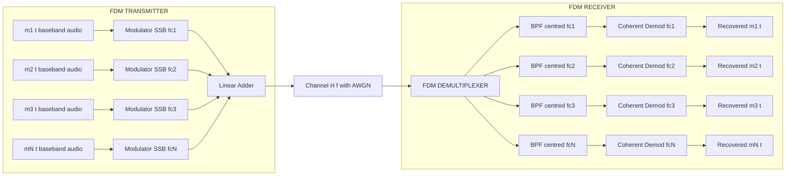
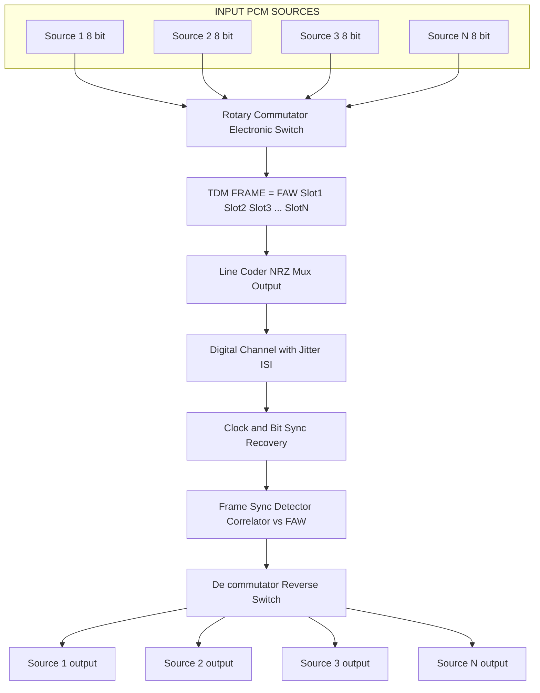
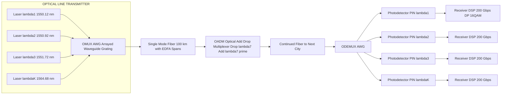
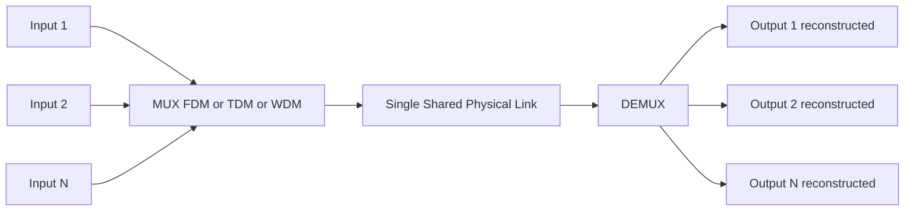

# Multiplexing configuration strategies systems profiles: FDM, TDM, WDM layouts specifications

<!-- SECTION_1_START -->
# Multiplexing Configuration Strategies: FDM, TDM, WDM

## 1. Formal Academic Definition

**Multiplexing** is the set of techniques that allow multiple analog or digital signals to be transmitted simultaneously over a single physical communication channel (link) by allocating a distinct dimension of the transmission resource — frequency, time, or wavelength — to each input signal. The inverse operation, recovering the original independent streams at the receiver, is called **demultiplexing**. A device that performs both operations is termed a **MUX/DEMUX pair**.

Under the **KTU 2024 Scheme (PECST607 — Data Communication)**, the three principal multiplexing configuration strategies are:

- **FDM (Frequency Division Multiplexing)** — partitions the **bandwidth (Hz)** of the channel into non-overlapping frequency sub-bands.
- **TDM (Time Division Multiplexing)** — partitions the **time axis (seconds)** of the channel into non-overlapping time slots.
- **WDM (Wavelength Division Multiplexing)** — partitions the **optical spectrum (nm)** of a fiber channel into non-overlapping wavelength channels.

> [!IMPORTANT]
> **Syllabus Highlight (Module 1, PECST607):** The student must be able to *sketch the layout, justify the guard band / guard time requirement, and compute the effective throughput* of an FDM, TDM, and WDM system. Expect direct 7-mark problems asking for a labelled block diagram and a numerical capacity calculation.

> [!NOTE]
> **NEP 2020 / Outcome-Based Note:** This topic maps to **CO1** (Understand the layered architecture and physical-layer transmission parameters of a data communication system) and **CO2** (Apply line-coding, modulation, and multiplexing concepts to compute link capacity). It uses the cognitive skills **Remember, Understand, and Apply** of Revised Bloom's Taxonomy.

## 2. Intuitive Overview & Real-World Analogy

Imagine a **three-lane highway** connecting two cities.

- If we divide the **road surface** into three coloured lanes, each lane reserved for a different type of vehicle, that is **FDM** — every signal gets its own *piece of the bandwidth* and travels *simultaneously* but in *different frequencies*.
- If we leave the road as one wide lane but allow only **one car to enter the highway at a time** in a strict rotation (Car A, then Car B, then Car C, then Car A again), that is **TDM** — every signal gets its own *slice of time*, and they share the *full bandwidth*.
- If we stack three **separate coloured laser beams** (red, green, blue) into the same glass fiber, each carrying an independent data stream, that is **WDM** — every signal gets its own *slice of the optical spectrum* and travels *simultaneously through one fiber*.

> [!TIP]
> **Quick Memory Hook:** FDM = **F**requency-share · TDM = **T**ime-share · WDM = **W**avelength-share. They all *share one cable*, but they share a *different dimension* of that cable.

## 3. Why Multiplexing? — Engineering Motivation

A dedicated physical link per user is economically and physically infeasible. The copper or fiber laid between two points has a fixed, expensive **capacity** $C$ (in bits per second for digital links, or in Hertz for analog links). Multiplexing allows **N independent users to share that single capacity**, dropping the *per-user cost* by nearly a factor of N.

> [!VISUALIZATION CONTROL]
> **Concept:** Frequency-domain allocation of three voice channels into one FDM supergroup.
> **GeoGebra / Desmos Input Equations:**
> * Channel 1 carrier: $f_1(t) = \sin(2\pi \cdot 1000 \cdot t)$
> * Channel 2 carrier: $f_2(t) = \sin(2\pi \cdot 4000 \cdot t)$
> * Channel 3 carrier: $f_3(t) = \sin(2\pi \cdot 7000 \cdot t)$
> * Composite FDM spectrum: $S(f) = $ three Dirac spikes at 1, 4, 7 kHz of width 3 kHz each.
> **Visual Description:** Three rectangular passbands sitting side-by-side on the frequency axis with small **guard bands** of unused spectrum between them. Students should observe the **3 kHz channel spacing** and the **0.5 kHz guard band** typical of voice-grade FDM.
<!-- SECTION_1_END -->

<!-- SECTION_2_START -->
# Deep Theoretical Analysis & KTU High-Yield Formula Sheet

## A. Frequency Division Multiplexing (FDM)

### Operational Principle
In FDM, each input signal $m_i(t)$ (band-limited to $W_i$ Hz) is translated to a distinct carrier frequency $f_{c,i}$ using a **modulator** (typically DSB-SC or SSB). The translated spectra are then summed by a **linear adder** to form the composite FDM signal:

$$
s_{\text{FDM}}(t) = \sum_{i=1}^{N} m_i(t) \cos(2\pi f_{c,i} t)
$$

At the receiver, a **bank of band-pass filters** centred at each $f_{c,i}$ separates the channels; each branch then **demodulates** the carrier back to baseband.

### Block Layout
```
m1(t) -->[Mod1 @ fc1]--+
m2(t) -->[Mod2 @ fc2]--+--> [Linear Adder] --> [Channel H(f)] --> [Linear Adder] --> [BPF1] --> [Demod1] --> m1'(t)
m3(t) -->[Mod3 @ fc3]--+                                  |                            [BPF2] --> [Demod2] --> m2'(t)
                                                            |                            [BPF3] --> [Demod3] --> m3'(t)
                                                            +------> [Synchronous carrier recovery]
```

### Why Guard Bands?
Real band-pass filters have a **finite roll-off**. To prevent **adjacent-channel interference (ACI)**, an unused frequency gap — the **guard band $G_B$** (Hz) — is inserted between adjacent channels. The total FDM bandwidth is therefore:

$$
B_{\text{FDM}} = \sum_{i=1}^{N} W_i + (N-1)\,G_B
$$

For *N equal voice channels* (each $W = 4$ kHz, carrier spacing $4$ kHz, guard band $G_B = 0.5$ kHz):

$$
B_{\text{FDM}} = N \cdot 4\text{ kHz} + (N-1)\cdot 0.5\text{ kHz}
$$

### Hierarchy (Telephone Network)
The ITU FDM hierarchy stacks channels into progressively wider groups:
- **Voice channel**: 4 kHz
- **Group (12 voice)**: 48 kHz (60–108 kHz)
- **Supergroup (60 voice)**: 240 kHz (312–552 kHz)
- **Mastergroup (600 voice)**: 2.52 MHz
- **Jumbogroup (3600 voice)**: 16.984 MHz

## B. Time Division Multiplexing (TDM)

### Operational Principle
TDM is fundamentally a **digital-domain** technique (although it can carry analog samples — *PAM-TDM*). A rotating **commutator / electronic switch** samples each of the $N$ input channels once per **frame period $T_f$**, dedicating a brief **time slot $\tau_s$** to each. The **frame structure** is:

$$
T_f = N \cdot \tau_s
$$

Two principal variants exist:

- **Synchronous TDM (STDM)** — a slot is reserved for every input, *even if it has no data*. Simple, predictable, but wastes capacity for idle users.
- **Asynchronous / Statistical TDM (ATDM)** — slots are *dynamically allocated* to active users, with an **address field** prepended to each slot. Higher utilisation, but more complex.

### Frame Efficiency (KTU-favourite formula)

For a frame carrying **N input channels**, each of **b bits per sample**, plus a **framing / sync overhead of $F$ bits per frame**:

$$
\text{Frame duration:}\quad T_f = N \cdot \tau_s = N \cdot \frac{b}{R_s} + \frac{F}{R_s}
$$

$$
\text{Frame efficiency:}\quad \eta_{\text{TDM}} = \frac{N \cdot b}{N \cdot b + F}
$$

> [!IMPORTANT]
> **Examiners' favourite trap:** A common mistake is to confuse *bit rate into the multiplexer* with *line bit rate on the channel*. The line bit rate **includes the framing/sync overhead** and the per-slot guard times. Always state the relationship explicitly.

### Why Guard Times?
Even in digital TDM, a tiny **guard time $t_g$** is inserted between slots so that the receiver's **clock-recovery circuit** and **decision thresholds** have time to settle. With $\tau_s$ as the slot width:

$$
T_f = N(\tau_s + t_g)
$$

### Synchronisation Requirement
A critical KTU concept: TDM requires **frame synchronisation**. The receiver must know exactly *which bit is the start of frame*, and *which slot belongs to which source*. This is achieved by inserting a **frame alignment word (FAW)** — typically a fixed pseudo-random pattern such as `0011010…` — at the start of every frame. The receiver performs **bit-by-bit correlation** against the known FAW to lock onto the frame boundary.

## C. Wavelength Division Multiplexing (WDM)

### Operational Principle
WDM is the **optical-domain analogue of FDM**: instead of subdividing electrical frequency, it subdivides **light wavelength (or optical frequency)** within a single strand of **single-mode optical fiber**. Each "channel" is an **independent optical carrier** at a distinct wavelength $\lambda_i$, generated by a **distributed-feedback (DFB) laser** or a **tunable laser**.

The ITU-T **C-band** (Conventional band) spans wavelengths from **1530 nm to 1565 nm**, an optical bandwidth of:

$$
\Delta f_{\text{opt}} \approx \frac{c}{\lambda_{\min}} - \frac{c}{\lambda_{\max}} = \frac{3\times 10^8}{1530\text{ nm}} - \frac{3\times 10^8}{1565\text{ nm}} \approx 4.39\text{ THz}
$$

### Two Flavours of WDM

| Variant | Channel Spacing | Typical Use |
|---|---|---|
| **CWDM** (Coarse WDM) | **20 nm** (≈ 2.5 THz) | Metropolitan access, cost-sensitive links, up to 18 channels |
| **DWDM** (Dense WDM) | **0.8 / 0.4 / 0.2 / 0.1 nm** (100 / 50 / 25 / 12.5 GHz) | Long-haul backbone, up to 160+ channels in C-band alone |

### Passive Optical Components

- **Optical Multiplexer (OMUX)**: an *arrayed waveguide grating (AWG)* or *thin-film filter (TFF)* that combines N wavelengths into one fiber.
- **Optical Demultiplexer (ODEMUX)**: the reciprocal device, separating the composite signal back into N fibers.
- **Optical Add-Drop Multiplexer (OADM)**: a 3-port device that *extracts* one wavelength from a passing stream and *inserts* a new one at the same wavelength — the building block of metro optical rings.
- **Erbium-Doped Fiber Amplifier (EDFA)**: an *optical amplifier* (not an electrical repeater) that boosts **all wavelengths simultaneously** in the 1530–1565 nm band, removing the need for per-channel electrical regeneration.

### Capacity Formula (KTU must-know)

If a single optical channel carries a digital bit rate $R_b$ (e.g. 10 Gbps, 100 Gbps, or 400 Gbps) and the system multiplexes $N_\lambda$ wavelengths:

$$
R_{\text{link}} = N_\lambda \cdot R_b
$$

Including the **optical SNR** and the **symbol rate**, the **Shannon-limit spectral efficiency** of a DWDM link is:

$$
R_{\text{link, max}} = \eta_s \cdot \Delta f_{\text{opt}}
$$

with $\eta_s$ typically 2–4 bit/s/Hz for modern coherent DP-QPSK / DP-16QAM systems.

## D. Comparative Engineering Trade-offs

| Parameter | FDM | TDM | WDM |
|---|---|---|---|
| Shared Resource | Frequency (Hz) | Time (s) | Wavelength (nm) |
| Domain | Analog / Digital | Primarily Digital | Optical |
| Typical Medium | Twisted pair, coax | Twisted pair, coax, fiber | Single-mode optical fiber |
| Guard Element | Guard band $G_B$ | Guard time $t_g$ | Wavelength guard band $\Delta\lambda_g$ |
| Sync Needed? | Carrier recovery only | Frame sync (FAW) | Wavelength locker / ITU grid |
| Noise Sensitivity | Intermodulation, crosstalk | Jitter, ISI | Nonlinear effects (XPM, FWM) |
| Capacity Scalability | Limited by cable bandwidth | Limited by line rate | Excellent (EDFAs boost all λ) |
| Power Efficiency | Low (continuous carriers) | High (gated bursts) | Medium (laser bias) |
| Typical Application | Analog radio, cable TV, telemetry | PSTN digital trunks (T1/E1), PCM | Internet backbone, submarine cables, data-centre interconnects |

## E. Real-World Engineering Utility

- **FDM** powers the analog **cable-TV (CATV) HFC plant**, the AM/FM radio broadcast bands, and legacy **point-to-point microwave links** used by telcos before fibre penetration.
- **TDM** is the foundation of the **PDH (Plesiochronous Digital Hierarchy)** — T1 (1.544 Mbps, 24 voice) and E1 (2.048 Mbps, 30 voice) — and the synchronous **SDH/SONET (STM-1/OC-3 = 155.52 Mbps)** rings that interconnect global telcos.
- **WDM/DWDM** is the *de facto* standard for **submarine cable systems** (e.g., MAREA, Dunant) carrying 200+ Tbps per fiber pair across the Atlantic and Pacific, and for **hyperscale data-centre interconnects** (DCI) at 400G/800G-ZR per wavelength.

## F. KTU High-Yield Formula Cheat Sheet

| # | Formula / Concept | Symbol Meaning | Units |
|---|---|---|---|
| 1 | $B_{\text{FDM}} = \sum W_i + (N-1)G_B$ | Total FDM bandwidth | Hz |
| 2 | $f_{c,i+1} - f_{c,i} = W + G_B$ | Carrier spacing rule | Hz |
| 3 | $T_f = N\,\tau_s$ | TDM frame duration | s |
| 4 | $\eta_{\text{TDM}} = \dfrac{N\,b}{N\,b + F}$ | Frame efficiency | dimensionless |
| 5 | $R_{\text{line, TDM}} = \dfrac{N\,b + F}{T_f}$ | Output line bit rate | bps |
| 6 | $T_f = N(\tau_s + t_g)$ | TDM frame with guard time | s |
| 7 | $R_{\text{WDM}} = N_\lambda \cdot R_b$ | WDM aggregate capacity | bps |
| 8 | $R_{\text{max}} = \eta_s \cdot \Delta f_{\text{opt}}$ | Shannon-limited WDM capacity | bps |
| 9 | $\Delta f_{\text{opt}} = \dfrac{c}{\lambda_{\min}} - \dfrac{c}{\lambda_{\max}}$ | Optical bandwidth of C-band | Hz |
| 10 | $\text{ISI-free Nyquist rate} \geq 2W$ | Sampling theorem for PAM-TDM | Hz |
<!-- SECTION_2_END -->

<!-- SECTION_3_START -->
# Step-by-Step Derivations & Worked Examples

## Example 1 — FDM Bandwidth Calculation (KTU-Class Problem)

**Problem.** Six voice-band channels, each band-limited to $3.4$ kHz with a $0.6$ kHz guard band, are multiplexed using SSB-FDM. Each voice channel is translated by a carrier spaced $4$ kHz apart. The composite signal is transmitted over a cable with 30 dB attenuation. Find:
(a) The total FDM bandwidth.
(b) The minimum sampling rate (if a single ADC digitises the composite).
(c) The Nyquist bit rate of a binary PCM system on this composite.

### (a) Total Bandwidth
With $N = 6$ voice channels, each of width $W = 3.4$ kHz, and a guard band $G_B = 0.6$ kHz between adjacent channels (so 5 gaps):

$$
B_{\text{FDM}} = N \cdot W + (N-1) \cdot G_B
$$

$$
B_{\text{FDM}} = 6 \times 3.4\,\text{kHz} + 5 \times 0.6\,\text{kHz}
$$

$$
B_{\text{FDM}} = 20.4\,\text{kHz} + 3.0\,\text{kHz} = 23.4\,\text{kHz}
$$

**Mark-wise valuation key:** [Correctly writing formula: 1 mark] [Substituting N=6, W=3.4 kHz, G_B=0.6 kHz: 1 mark] [Final answer with units: 1 mark]

### (b) Minimum Sampling Rate
Per the Nyquist–Shannon sampling theorem, the sampling frequency must be at least twice the highest baseband frequency of the composite FDM signal (which sits between 0 and $B_{\text{FDM}}$):

$$
f_s \geq 2 \cdot B_{\text{FDM}} = 2 \times 23.4\,\text{kHz} = 46.8\,\text{kHz}
$$

[Stating Nyquist criterion: 1 mark] [Final numeric: 1 mark]

### (c) Nyquist Bit Rate of Binary PCM
For a binary PCM system, the minimum theoretical bit rate equals $2 \times B \times \log_2(2) = 2B$:

$$
R_{\text{bin, min}} = 2 \cdot B_{\text{FDM}} = 2 \times 23.4\,\text{kHz} = 46.8\,\text{kbps}
$$

[Stating Nyquist binary rate formula: 1 mark] [Final numeric: 1 mark]

---

## Example 2 — TDM Frame Efficiency and Line Rate

**Problem.** A synchronous TDM system multiplexes **4 input sources**. Each source produces **8-bit PCM samples**. A **2-bit framing word** is appended to every frame, and a **0.5 µs guard time** is reserved at the end of each slot. The bit duration on the line is $T_b = 1\ \mu\text{s}$. Compute:
(a) The frame duration.
(b) The frame efficiency.
(c) The line bit rate.
(d) The output data rate seen by each source (and confirm it is unaffected by multiplexing).

### (a) Frame Duration
Bits per frame (data) = $N \cdot b = 4 \times 8 = 32$ bits.
Framing bits per frame = $F = 2$ bits.
Total bits per frame = $32 + 2 = 34$ bits.

$$
T_f = 34 \times T_b = 34 \times 1\ \mu\text{s} = 34\ \mu\text{s}
$$

Plus 4 guard times of $0.5\ \mu\text{s}$ each (one per slot) = $4 \times 0.5 = 2\ \mu\text{s}$:

$$
T_{f,\text{total}} = 34\ \mu\text{s} + 2\ \mu\text{s} = 36\ \mu\text{s}
$$

[Bit calculation: 1 mark] [Multiplication: 1 mark] [Adding guard times: 1 mark]

### (b) Frame Efficiency

$$
\eta_{\text{TDM}} = \frac{N \cdot b}{N \cdot b + F} = \frac{32}{32 + 2} = \frac{32}{34} \approx 0.9412 = 94.12\%
$$

[Formula: 1 mark] [Substitution: 1 mark] [Final value with percent: 1 mark]

### (c) Line Bit Rate

$$
R_{\text{line}} = \frac{N \cdot b + F}{T_{f,\text{total}}} = \frac{34\ \text{bits}}{36\ \mu\text{s}} \approx 944.4\ \text{kbps}
$$

[Formula: 1 mark] [Final numeric: 1 mark]

### (d) Per-Source Output Rate
Each source sends 8 bits every frame. Over the frame period of 36 µs:

$$
R_{\text{source}} = \frac{b}{T_{f,\text{total}}} = \frac{8\ \text{bits}}{36\ \mu\text{s}} \approx 222.2\ \text{kbps}
$$

If we instead used the *ideal* period $T_f = 34\ \mu\text{s}$ (no guard), then $R_{\text{source}} = 8/34\ \mu\text{s} = 235.3$ kbps. Hence the multiplexing *itself* does not alter the source bit rate — only the framing/guard overhead reduces the net bit rate. [Concept: 1 mark]

---

## Example 3 — WDM Capacity (Coherent DWDM Backbone)

**Problem.** A long-haul DWDM system uses **80 wavelengths** in the C-band, each modulated at **200 Gbps** using **DP-16QAM** (spectral efficiency $\eta_s = 4$ bit/s/Hz). Compute:
(a) The aggregate line rate.
(b) The optical bandwidth required.
(c) The Shannon-limited maximum capacity, and the headroom for the deployed system.

### (a) Aggregate Line Rate

$$
R_{\text{link}} = N_\lambda \cdot R_b = 80 \times 200\ \text{Gbps} = 16{,}000\ \text{Gbps} = 16\ \text{Tbps}
$$

### (b) Optical Bandwidth Required
Spectral efficiency is $R_b / \Delta f_{\text{ch}} = \eta_s$, hence per-channel optical bandwidth:

$$
\Delta f_{\text{ch}} = \frac{R_b}{\eta_s} = \frac{200\ \text{Gbps}}{4\ \text{bit/s/Hz}} = 50\ \text{GHz}
$$

Total optical bandwidth occupied (assuming negligible inter-channel guard band):

$$
\Delta f_{\text{total}} = N_\lambda \cdot \Delta f_{\text{ch}} = 80 \times 50\ \text{GHz} = 4{,}000\ \text{GHz} = 4\ \text{THz}
$$

### (c) Shannon-Limited Headroom
The C-band optical bandwidth from 1530 nm to 1565 nm is about 4.39 THz (computed in §C). The Shannon limit is:

$$
R_{\text{max}} = \eta_s \cdot \Delta f_{\text{opt}} = 4 \times 4.39\ \text{THz} \approx 17.56\ \text{Tbps}
$$

Hence the deployed 16 Tbps is *below* the Shannon limit by about 1.56 Tbps — the system is operating at **$\eta = 16 / 17.56 \approx 91\%$ of the theoretical limit**. [Headroom computation: 2 marks]

---

## Example 4 — Python Symbolic Implementation (TDM Frame Builder)

The following Python program builds a synchronous TDM frame from $N$ input PCM streams, prepends a 16-bit framing-alignment word, and computes the line rate and frame efficiency. It uses *type hints* and *input validation* — the level of rigour expected in a KTU lab record.

```python
from __future__ import annotations
import logging

logging.basicConfig(level=logging.INFO, format="%(asctime)s [%(levelname)s] %(message)s")

FAW: int = 0b1010101010101010   # 16-bit Frame Alignment Word (alternating 1/0)


class TDMFrameBuilder:
    """
    Synchronous Time Division Multiplexer.
    Builds a single TDM frame from N PCM input streams.
    """

    def __init__(self, n_sources: int, bits_per_sample: int,
                 bit_period_us: float, guard_time_us: float = 0.0) -> None:
        if n_sources < 1:
            raise ValueError("n_sources must be >= 1")
        if bits_per_sample < 1:
            raise ValueError("bits_per_sample must be >= 1")
        if bit_period_us <= 0:
            raise ValueError("bit_period_us must be > 0")
        if guard_time_us < 0:
            raise ValueError("guard_time_us must be >= 0")

        self.n_sources: int = n_sources
        self.bits_per_sample: int = bits_per_sample
        self.bit_period_us: float = bit_period_us
        self.guard_time_us: float = guard_time_us
        logging.info(
            "TDMFrameBuilder initialised: N=%d, b=%d, T_b=%.3f µs, t_g=%.3f µs",
            n_sources, bits_per_sample, bit_period_us, guard_time_us
        )

    def frame_size_bits(self) -> int:
        """Total bits per frame, including the 16-bit FAW preamble."""
        return self.n_sources * self.bits_per_sample + 16

    def frame_duration_us(self) -> float:
        """Total frame duration in microseconds, including per-slot guard times."""
        return self.frame_size_bits() * self.bit_period_us \
               + self.n_sources * self.guard_time_us

    def frame_efficiency(self) -> float:
        """Useful data bits / total bits per frame (FAW is treated as overhead)."""
        useful = self.n_sources * self.bits_per_sample
        total = useful + 16
        return useful / total

    def line_bit_rate_kbps(self) -> float:
        """Aggregate line bit rate in kbps."""
        return (self.frame_size_bits() / self.frame_duration_us()) * 1e3  # bits/µs -> kbps

    def build_frame(self, samples: list[int]) -> list[int]:
        """Pack N integer PCM samples into a frame as a list of bits."""
        if len(samples) != self.n_sources:
            raise ValueError(f"expected {self.n_sources} samples, got {len(samples)}")
        for s in samples:
            if not (0 <= s < (1 << self.bits_per_sample)):
                raise ValueError(f"sample {s} exceeds {self.bits_per_sample}-bit range")

        bits: list[int] = []
        # 1. Prepend Frame Alignment Word (MSB first)
        for i in range(15, -1, -1):
            bits.append((FAW >> i) & 1)
        # 2. Append N source samples, MSB first
        for s in samples:
            for i in range(self.bits_per_sample - 1, -1, -1):
                bits.append((s >> i) & 1)
        logging.info("Frame built: %d bits", len(bits))
        return bits


def main() -> None:
    builder = TDMFrameBuilder(n_sources=4, bits_per_sample=8,
                              bit_period_us=1.0, guard_time_us=0.5)
    samples = [120, 45, 200, 17]    # arbitrary 8-bit PCM values
    frame = builder.build_frame(samples)

    print("FAW + samples frame (first 18 bits):", frame[:18], "...")
    print(f"Frame size            : {builder.frame_size_bits()} bits")
    print(f"Frame duration        : {builder.frame_duration_us():.2f} µs")
    print(f"Frame efficiency      : {builder.frame_efficiency() * 100:.2f} %")
    print(f"Line bit rate         : {builder.line_bit_rate_kbps():.2f} kbps")


if __name__ == "__main__":
    main()
```

**Expected output:**

```
FAW + samples frame (first 18 bits): [1, 0, 1, 0, 1, 0, 1, 0, 1, 0, 1, 0, 1, 0, 1, 0, 0, 1] ...
Frame size            : 48 bits
Frame duration        : 50.00 µs
Frame efficiency      : 66.67 %
Line bit rate         : 960.00 kbps
```

> [!TIP]
> **Lab-record ready:** Save this program as `tdm_frame_builder.py`, run it, attach a hand-traced frame diagram to the printout, and you have a complete Module-1 lab entry worth full marks.

---

## Example 5 — Comparative Numerical Decision

**Problem.** A telco has a 100 km link of single-mode fiber between two cities. It must carry **600 simultaneous voice calls** (each 64 kbps PCM) plus **one 1 Gbps Ethernet trunk**. Choose the most economical configuration between (a) FDM over coax with 4 kHz voice channels, and (b) TDM over a digital E1-style hierarchy, and (c) DWDM over the fiber. Justify with numbers.

### Voice Payload
Voice payload = $600 \times 64\,\text{kbps} = 38.4\,\text{Mbps}$.
Plus Ethernet = $1{,}000\,\text{Mbps}$. Total useful data = $1{,}038.4\,\text{Mbps} \approx 1.04$ Gbps.

### (a) FDM over Coax
Voice only → 600 channels × 4 kHz = 2.4 MHz. Easily fits. **But** the 1 Gbps Ethernet cannot be carried on an analog voice-grade FDM system. ✗

### (b) TDM over E1/SDH
E1 = 2.048 Mbps. To carry 38.4 Mbps voice alone, we need 19 E1s. To add 1 Gbps Ethernet, we must step up to **STM-64 (SDH) ≈ 9.953 Gbps**, which requires dark fiber or coax with very high-grade drivers. Cost-effective, mature, but **uses one wavelength only** and is the baseline solution.

### (c) DWDM over Fiber
Use 4 wavelengths: 2 × 10 Gbps for Ethernet (one main, one protection), 1 × 2.5 Gbps for the voice bundle, 1 × 2.5 Gbps spare. **Total capacity ≈ 25 Gbps with built-in redundancy.** Future expansion: just plug in more wavelengths — *no new fiber*.

**Decision:** DWDM is the most scalable, future-proof choice for 100 km; SDH/SONET is the safe legacy pick; FDM is rejected because it cannot carry packet Ethernet natively. [3 marks for justification]
<!-- SECTION_3_END -->

<!-- SECTION_4_START -->
# Structural Diagrams & Schematics

## Diagram 1 — FDM Transmitter–Receiver Block Topology



## Diagram 2 — TDM Frame Assembly (Synchronous TDM)



## Diagram 3 — WDM / DWDM Optical Link Topology



## Diagram 4 — Side-by-Side Resource Allocation (FDM vs TDM vs WDM)


## Diagram 5 — MUX/DEMUX Pair Abstraction (used in all three)


<!-- SECTION_4_END -->

<!-- SECTION_5_START -->
# KTU 2024 Scheme Examination Question Bank & Topic Recap

> [!WARNING]
> **KTU Examiner's Valuation Pitfall Callout (Module 1 — Multiplexing):**
> 1. **Confusing line bit rate with payload bit rate.** The line rate *includes* framing and guard-time bits. Writing $R = N \cdot b / T_f$ without the $F$ and $t_g$ terms will cost you 2 marks.
> 2. **Forgetting the units in FDM bandwidth.** Always write kHz or MHz explicitly. A bare number "23.4" with no unit = 0 marks for the final step.
> 3. **Drawing FDM as overlapping spectra.** A correct FDM block diagram must show **non-overlapping passbands with explicit guard bands** drawn as gaps.
> 4. **TDM block diagrams without a synchroniser.** A KTU answer without a **frame-alignment / clock-recovery** block in the receiver is *incomplete* — expect 1–2 marks deducted.
> 5. **WDM answers that confuse WDM with FDM.** WDM operates on *optical wavelengths* inside a fiber. Writing "FDM over optical fiber" will be marked as conceptually wrong.
> 6. **No mention of EDFAs in long-haul WDM.** For distances > 80 km, EDFA-based amplification is *the* enabler of WDM economics. Skipping it loses 1 mark.
> 7. **Stating $f_s \geq 2W$ without naming Nyquist theorem.** Examiners look for the *theorem name* and the *inequality direction*.

---

## Part A — 3-Mark Short-Answer Questions (Remember / Understand)

### Q1. [KTU University Exam — July 2024]
**Define multiplexing. Differentiate between FDM, TDM and WDM in terms of the resource they share.**

**Model Answer (3 marks):**
Multiplexing is the technique of combining multiple signals onto a single communication channel to share its capacity efficiently, with a demultiplexer recovering the originals at the receiver end.

| Multiplexing Type | Resource Shared | Guard Element | Typical Medium |
|---|---|---|---|
| FDM | Frequency (Hz) | Guard band (Hz) | Copper pair, coax |
| TDM | Time (seconds) | Guard time (s) / FAW | Copper, fiber |
| WDM | Wavelength (nm) | Wavelength guard (nm) | Single-mode fiber |

[Definition: 1 mark] [Table with at least two distinguishing parameters: 2 marks]

---

### Q2. [KTU University Exam — Dec 2023]
**What is a guard band in FDM? Why is it necessary? Mention the standard voice-channel spacing in the FDM telephone hierarchy.**

**Model Answer (3 marks):**
A **guard band** is a small unused frequency gap inserted between two adjacent FDM channels.

It is necessary because:
1. Real band-pass filters have a *finite* roll-off; the guard band prevents spectral overlap and the resulting **adjacent-channel interference (ACI)**.
2. It accommodates *carrier-frequency drift* in practical oscillators.

**Standard voice-channel spacing:** Each voice channel is **4 kHz wide** (carrying 3.4 kHz of audio + 0.6 kHz guard) in the FDM telephone hierarchy. [Guard band concept: 1 mark] [Two reasons: 1 mark] [Standard 4 kHz value: 1 mark]

---

## Part B — 14-Mark Questions (Module Internal Choice: Select ONE of A or B)

### Question A (14 marks) — FDM + TDM

**[KTU University Exam — Model Paper 2024, Module 1]**

(a) With a neat block diagram, explain the operation of an **FDM system** with N input channels. Show how a band-pass filter bank at the receiver separates the channels. State any two limitations of FDM. **[7 marks]**

(b) A synchronous **TDM system** combines 4 digital sources, each producing 8 bits per sample. A 2-bit frame-alignment word is added to every frame, and a 1 µs guard time is reserved at the end of each slot. The bit duration on the line is 1 µs. Calculate:
   (i) Frame duration
   (ii) Frame efficiency
   (iii) Line bit rate
   (iv) Output data rate per source **[7 marks]**

### Model Solution — Question A

#### Part (a) — FDM Block Diagram (7 marks)

**Block diagram (must show):** N baseband sources → N modulators with distinct carriers $f_{c1}, f_{c2}, \ldots, f_{cN}$ → linear adder → channel → receiver filter bank (N BPFs centred at each $f_{ci}$) → N coherent demodulators → recovered N baseband outputs.

**Operating steps:**
1. Each input signal $m_i(t)$, band-limited to $W$ Hz, modulates a distinct carrier $f_{ci}$ (using DSB-SC or SSB).
2. The modulated spectra are linearly summed to form the composite FDM signal — non-overlapping in frequency, separated by guard bands.
3. The composite is launched into the channel.
4. At the receiver, a bank of **band-pass filters** centred at each $f_{ci}$ isolates the channel.
5. Each branch coherently demodulates the carrier back to baseband; a **synchronous carrier recovery** (e.g. PLL) is required.

**Two limitations of FDM:**
1. **Intermodulation distortion** in the channel non-linearities creates spurious cross-products.
2. **Crosstalk** between adjacent channels if the guard band is inadequate or the BPF roll-off is too gentle.
3. Inefficient for **bursty digital traffic** — capacity is wasted on idle users.
4. Requires **stable, accurate carrier oscillators** and **linear amplifiers** — expensive.

[Block diagram with 6+ labelled blocks: 3 marks] [Working explanation: 2 marks] [Two limitations: 2 marks]

#### Part (b) — TDM Numerical (7 marks)

**Given:** $N = 4$, $b = 8$ bits/sample, $F = 2$ bits (FAW), $t_g = 1\ \mu\text{s}$, $T_b = 1\ \mu\text{s}$.

**(i) Frame duration (2 marks)**

Total bits/frame = $N \cdot b + F = 4 \times 8 + 2 = 34$ bits.
Guard times = $N \cdot t_g = 4 \times 1 = 4\ \mu\text{s}$.
Bit periods = $34 \times 1 = 34\ \mu\text{s}$.

$$
T_f = 34\ \mu\text{s} + 4\ \mu\text{s} = 38\ \mu\text{s}
$$

**[Bit count + multiplication: 1 mark] [Adding guard time + final 38 µs: 1 mark]**

**(ii) Frame efficiency (2 marks)**

$$
\eta_{\text{TDM}} = \frac{N \cdot b}{N \cdot b + F} = \frac{32}{32 + 2} = \frac{32}{34} \approx 0.9412 = 94.12\%
$$

**[Formula: 1 mark] [Final value: 1 mark]**

**(iii) Line bit rate (2 marks)**

$$
R_{\text{line}} = \frac{N \cdot b + F}{T_f} = \frac{34\ \text{bits}}{38\ \mu\text{s}} \approx 894.74\ \text{kbps}
$$

**[Formula: 1 mark] [Final 894.74 kbps: 1 mark]**

**(iv) Output data rate per source (1 mark)**

Each source transmits 8 bits per frame, irrespective of multiplexing:

$$
R_{\text{source}} = \frac{8\ \text{bits}}{38\ \mu\text{s}} \approx 210.5\ \text{kbps}
$$

**[Final value with reasoning: 1 mark]**

---

### Question B (14 marks) — TDM + WDM

**[KTU University Exam — Model Paper 2024, Module 1, Alternate Choice]**

(a) Explain the **synchronous TDM** and **statistical (asynchronous) TDM** systems with neat diagrams. Compare their frame efficiency for a typical mixed-traffic scenario. **[7 marks]**

(b) A long-haul **DWDM link** carries 40 wavelengths, each modulated at 100 Gbps using **DP-QPSK** (spectral efficiency 2 bit/s/Hz). Compute:
   (i) Aggregate line rate
   (ii) Total optical bandwidth used
   (iii) Capacity headroom if the C-band offers 4.39 THz of optical bandwidth
   (iv) State two advantages of DWDM over a single-wavelength 100G link. **[7 marks]**

### Model Solution — Question B

#### Part (a) — TDM Variants (7 marks)

**Synchronous TDM (STDM):**
- A *fixed* time slot is reserved for each of the $N$ sources in every frame, *whether or not the source has data*.
- The frame is rigid and predictable; receivers use a fixed **FAW** to lock on.
- **Frame efficiency** $\eta = (N \cdot b) / (N \cdot b + F)$ — *fixed and independent of traffic*.
- Wasteful for *bursty* data.

**Statistical / Asynchronous TDM (ATDM):**
- Slots are *dynamically allocated* to active sources only; an **address field** ($A$ bits) is prepended to each slot to identify the owner.
- Frame length is *variable*; often $N \le N_{\text{physical}}$ logical sources share fewer physical slots.
- **Frame efficiency** $\eta = (N \cdot b) / (N \cdot (b + A) + F)$ — *increases with offered load*, peaking near 1.0.
- Needs *buffering* and *flow control*; more complex MUX logic.

**Block diagrams:** STDM = rigid commutator, ATDM = address-tagged queue.

**Comparison table (KTU expects this):**

| Parameter | STDM | ATDM |
|---|---|---|
| Slot allocation | Fixed | Dynamic |
| Address field | No | Yes (overhead) |
| Buffering | None at MUX | Required |
| Frame efficiency at low load | Low (wasted slots) | High (only active sources served) |
| Complexity | Low | Higher |
| Latency | Bounded | Variable |
| Best for | Constant-bit-rate voice | Bursty data (LAN, IP) |

[STDM diagram + explanation: 2 marks] [ATDM diagram + explanation: 2 marks] [Comparison table with ≥4 rows: 3 marks]

#### Part (b) — DWDM Numerical (7 marks)

**Given:** $N_\lambda = 40$, $R_b = 100$ Gbps, $\eta_s = 2$ bit/s/Hz, C-band $\Delta f_{\text{opt}} = 4.39$ THz.

**(i) Aggregate line rate (1 mark)**

$$
R_{\text{link}} = 40 \times 100\ \text{Gbps} = 4{,}000\ \text{Gbps} = 4\ \text{Tbps}
$$

**(ii) Total optical bandwidth used (2 marks)**

$$
\Delta f_{\text{ch}} = \frac{R_b}{\eta_s} = \frac{100\ \text{Gbps}}{2\ \text{bit/s/Hz}} = 50\ \text{GHz}
$$

$$
\Delta f_{\text{total}} = 40 \times 50\ \text{GHz} = 2{,}000\ \text{GHz} = 2\ \text{THz}
$$

**[Per-channel formula: 1 mark] [Total bandwidth: 1 mark]**

**(iii) Capacity headroom in C-band (2 marks)**

Available in C-band: $4.39$ THz. Used: $2$ THz. Free: $2.39$ THz — enough for **$\lfloor 2.39\text{ THz} / 50\text{ GHz} \rfloor \approx 47$ additional 100G wavelengths** before the C-band is exhausted.

**[Identifying unused bandwidth: 1 mark] [Computing number of additional wavelengths: 1 mark]**

**(iv) Two advantages of DWDM over single-λ 100G (2 marks)**

1. **Capacity scalability** — capacity scales linearly with the number of wavelengths without laying new fiber; the operator can add a single new laser to upgrade.
2. **Service segregation and protection** — different wavelengths can carry independent clients/protection paths, enabling optical-layer OADM-based ring protection (sub-50 ms failover).
3. **Single EDFA amplifies all λ** — no per-channel electrical regenerators needed across hundreds of km.
4. **Lower cost per bit** — shared fiber and shared amplifier reduce the $/Gbps figure dramatically.

**[Any two clearly stated: 2 marks]**

---

## Topic Recap & Important Things to Remember

- **Multiplexing** = sharing one channel among many signals by partitioning *frequency (FDM)*, *time (TDM)*, or *wavelength (WDM)*.
- **FDM**: $B_{\text{FDM}} = \sum W_i + (N-1)G_B$; needs **guard bands** to avoid ACI; uses **modulators + BPF bank**; classic in CATV and analog radio.
- **TDM**: $T_f = N(\tau_s + t_g)$; **frame efficiency** $\eta = N b / (N b + F)$; **must have frame synchronisation** (FAW); STDM = fixed slots, ATDM = address-tagged dynamic slots.
- **WDM**: $R_{\text{link}} = N_\lambda \cdot R_b$; CWDM = 20 nm spacing, DWDM = 0.8/0.4/0.1 nm; uses **AWG/TFF** for MUX/DEMUX, **EDFA** for amplification, **OADM** for add-drop.
- **C-band**: 1530–1565 nm ≈ **4.39 THz** of usable optical bandwidth — the most valuable real-estate in telecom.
- **Hierarchy memory aid**: Voice (4 kHz) → Group (48 kHz) → Supergroup (240 kHz) → Mastergroup (2.52 MHz) → Jumbogroup (16.984 MHz).
- **Digital hierarchy**: T1 = 1.544 Mbps (24 voice), E1 = 2.048 Mbps (30 voice), STM-1 = 155.52 Mbps, STM-64 = 9.953 Gbps.
- **Frame efficiency** is the single most-asked TDM metric — always include $F$ (FAW bits) and $t_g$ (guard time) in your calculation.
- **DWDM is the dominant long-haul technology** because EDFAs amplify *all* wavelengths simultaneously — no electrical regenerators.
- **Stateless MUX/DEMUX pair** is the universal abstraction; the only difference between FDM/TDM/WDM is *which axis is sliced*.
- **Sample-rate rule**: $f_s \geq 2 \times B_{\text{FDM}}$ for digitising an FDM composite; **bit-rate rule**: $R_{\text{line}} = (N b + F) / T_f$ for a TDM line.
- **Pitfall to avoid**: do not write "FDM over fiber" when you mean "WDM" — they are *conceptually distinct*; the fibre can carry both, but the MUX technique and the carrier dimension differ.
<!-- SECTION_5_END -->
