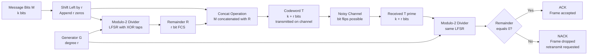
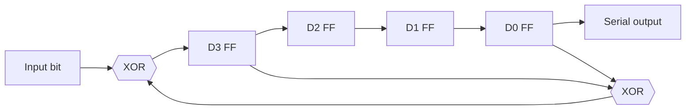
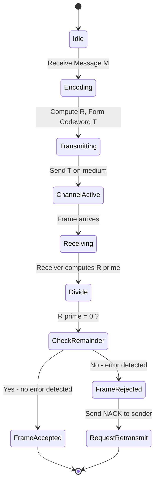

# Error calculation matrices validation routines: CRC checks calculation logic formulas setups

<!-- SECTION_1_START -->

# Cyclic Redundancy Check (CRC): Error Calculation, Matrices & Validation Routines

## 1. Core Technical Definition

**Cyclic Redundancy Check (CRC)** is a polynomial-based, non-secure error-detecting code widely used in digital networks and data storage systems. The transmitter appends a short, fixed-length **check value (Frame Check Sequence / FCS)** — derived from the remainder of a polynomial division — to the outgoing data unit. The receiver repeats the same polynomial division on the received frame; a non-zero remainder indicates bit corruption, while a zero remainder validates the integrity of the message.

Mathematically, if $M(x)$ is the message polynomial of degree $m$, and $G(x)$ is the agreed-upon **generator polynomial** of degree $r$, then the transmitted codeword polynomial $T(x)$ is:

$$
T(x) = M(x)\cdot x^{r} + R(x)
$$

where $R(x)$ is the remainder when $M(x)\cdot x^{r}$ is divided by $G(x)$ under **modulo-2 (XOR) arithmetic**.

> [!IMPORTANT]
> **KTU 2024 Syllabus Tag (PECST607 / Module 2):** CRC is listed under *"Error detection and correction — Block coding, Linear Block codes, Hamming codes, CRC."* It is a high-weight topic (frequently 7-14 marks in ESE).

> [!NOTE]
> **Standardized CRC Variants (must memorize):**
> - **CRC-8:** $G(x) = x^{8} + x^{2} + x + 1$ → used in ATM HEC, SMBus.
> - **CRC-16-CCITT:** $G(x) = x^{16} + x^{12} + x^{5} + 1$ → HDLC, Bluetooth, ITU-T V.41.
> - **CRC-32 (Ethernet):** $G(x) = x^{32} + x^{26} + x^{23} + \ldots + x + 1$ → IEEE 802.3, ZIP, PNG.
> - **CRC-CCITT (16-bit, alternate):** $G(x) = x^{16} + x^{15} + x^{2} + 1$.

## 2. Intuitive Overview — The "Check-Digit Mailman" Analogy

Imagine you are posting a heavy parcel. The post office stamps a **short check-digit** on the corner — not to *hide* what's inside, but so the receiving office can quickly re-verify the *weight category* declared on the label. If the digit doesn't match, the parcel is rejected without opening it.

| Real-World Analogy | CRC Equivalent |
|---|---|
| Parcel weight | Message bits $M(x)$ |
| Postal rulebook (weight-class table) | Generator polynomial $G(x)$ |
| Stamped check digit | Frame Check Sequence $R(x)$ |
| Receiving office re-checking | Polynomial division at receiver |
| Mismatch ⇒ reject | Non-zero remainder ⇒ NACK / retransmit |

The genius of CRC is that it uses **polynomial division in GF(2)** — an arithmetic system where addition and subtraction are both the XOR operation. This makes it blazingly fast in hardware (just shift registers and XOR gates, no carry propagation).

> [!TIP]
> **Why GF(2) / Modulo-2 arithmetic?** Because in digital communication, "bits" only have two states (0 or 1). Treating them as coefficients of polynomials over the field GF(2) lets us use linear algebra for error detection without the overhead of integer multiplication.

> [!VISUALIZATION CONTROL]
> **Concept:** Modulo-2 polynomial long division — a single XOR step.
> **Bitstring input:** Dividend `110101101` divided by Generator `10011` (degree $r=4$).
> **Visual Description:** The student should observe that whenever the leftmost bit of the current remainder is `1`, an XOR with the generator flips four bits; whenever it is `0`, the divisor is shifted and zeros are XORed. The final 4-bit remainder is the FCS.

---

<!-- SECTION_1_END -->

<!-- SECTION_2_START -->

# Deep Theoretical Analysis & KTU High-Yield Formula Sheet

## 1. Operational Architecture — Sender Side (CRC Encoder)

The encoder performs the following logical steps:

1. **Append zeros:** Given a $k$-bit message $M$, append $r$ zero bits to the right (where $r$ = degree of $G(x)$). This gives $M \cdot 2^{r}$ — a left-shift equivalent to multiplying by $x^{r}$.
2. **Modulo-2 division:** Divide the augmented message by the $r+1$ bit generator $G$ using XOR-based long division.
3. **Append remainder:** Replace the $r$ appended zeros with the computed $r$-bit remainder $R$.
4. **Transmit:** Send the resulting $k+r$ bit codeword $T$.

**Logical Flow (Textual Block Diagram):**

```
Message M (k bits)  ──►  Shift left by r  ──►  Modulo-2 ÷ G(x)  ──►  Remainder R (r bits)
                                                                            │
                                                                            ▼
                                                          Codeword T = [M | R]  (k+r bits)
```

## 2. Operational Architecture — Receiver Side (CRC Validator)

1. Receive the $k+r$ bit codeword $T'$.
2. Perform modulo-2 division of $T'$ by the same generator $G$.
3. **Inspect remainder:**
   - Remainder = $\mathbf{0}$ ⇒ No detected error ⇒ ACK.
   - Remainder $\neq \mathbf{0}$ ⇒ Error detected ⇒ NACK / Drop / Retransmit.

> [!IMPORTANT]
> **Critical Engineering Point:** A non-zero remainder *guarantees* corruption, but a zero remainder does *not* guarantee perfection. CRC is a **detector**, not a **corrector** — it cannot tell *where* the error is.

## 3. KTU Formula Cheat Sheet

| Symbol / Term | Meaning | Formula / Property |
|---|---|---|
| $M(x)$ | Message polynomial (degree $m$) | $\sum_{i=0}^{m} m_i x^{i}$ |
| $G(x)$ | Generator polynomial (degree $r$) | Must start and end with 1 (so degree is unambiguous) |
| $T(x)$ | Transmitted codeword polynomial | $M(x)\cdot x^{r} + R(x)$ |
| $R(x)$ | Remainder (FCS) | $R(x) = \left[M(x)\cdot x^{r}\right] \bmod G(x)$ |
| Code rate | Efficiency of the code | $\eta = \dfrac{k}{k+r}$ |
| Min Hamming distance | Strength of code | For CRC, $d_{\min} \geq 2$ (always detects $\leq d_{\min}-1$ errors) |
| Error burst length | Length of contiguous error bits | CRC-r detects *all* burst errors of length $\leq r$ |
| Single-bit error detection | All single-bit errors detected | Always — requires $G(x)$ to have $\geq 2$ terms |
| Odd-count error detection | All odd-number-bit errors detected | Requires $G(x)$ to contain factor $(x+1)$ |
| Two-bit error detection | All double-bit errors detected | Requires $G(x)$ to not divide $x^{n}+1$ for $n \leq k+r-1$ |
| Latency | Time to compute FCS | $O(k)$ XOR operations ⇒ linear in message length |
| Hardware cost | Number of flip-flops | Equals degree $r$ of generator (e.g. CRC-32 ⇒ 32 FFs) |

> [!TIP]
> **Exam Trick:** If a question gives a generator of degree $r$ and asks *"what burst-error length is always detected?"*, the answer is exactly $r$. This is a one-line KTU favorite.

## 4. Error Detection Capability Matrix

| Error Type | Detected by CRC-r? | Generator Condition |
|---|---|---|
| Single-bit error | **Always Yes** | $G(x)$ has $\geq 2$ non-zero terms |
| Double-bit error | **Yes** | $G(x)$ has a factor that does not divide $x^{j}+1$ for $1 \leq j \leq$ frame length |
| Odd number of bit errors | **Yes** | $G(x)$ contains $(x+1)$ as a factor |
| Burst error of length $\leq r$ | **Always Yes** | Inherent property of cyclic codes |
| Burst error of length $r+1$ | Detected with prob $= 1 - 2^{-(r-1)}$ | High prob for $r \geq 16$ |
| Burst error of length $> r+1$ | Detected with prob $= 1 - 2^{-r}$ | Standard statistical guarantee |

## 5. Why CRC Matters in Modern Engineering

- **Ethernet (IEEE 802.3):** Every frame ends with a 32-bit CRC. A non-zero FCS causes the NIC to drop the frame.
- **Wi-Fi (IEEE 802.11):** 32-bit FCS over the MAC payload; corrupted frames are not ACKed.
- **Storage (SSD, HDD, ZFS, Btrfs):** Per-block CRC-32C catches silent bit-rot.
- **Compression (ZIP, PNG, gzip):** CRC-32 over uncompressed data for integrity.
- **Embedded buses (CAN, FlexRay, MIL-STD-1553):** Hardware CRC engines offload the host CPU.

> [!NOTE]
> **KTU Real-World Hook (for theory answers):** "CRC-32 used in Ethernet achieves a Hamming distance of 4 over typical frame sizes, meaning all 1, 2, and 3-bit errors are detected, and the probability of an undetected 32-bit or longer burst is $\approx 2.328 \times 10^{-10}$."

---

<!-- SECTION_2_END -->

<!-- SECTION_3_START -->

# Step-by-Step Derivations, Worked Examples & Code Implementation

## 1. Worked Example 1 — Basic CRC Calculation (Binary Long Division)

**Given:**
- Message $M$ = `1101011011` (10 bits)
- Generator $G$ = `10011` (degree $r = 4$)

**Step 1: Append four zeros (because $r = 4$):**
Augmented dividend = `11010110110000`

**Step 2: Perform modulo-2 (XOR) long division by `10011`:**

```
              1100001010
            _______________
10011 ) 11010110110000
       10011
       -----
        10011
        10011
        -----
         00001
         00000
         -----
          01101
          00000
          -----
           11011
           10011
           -----
            10000
            10011
            -----
             01100
             00000
             -----
              1100   ← Remainder
```

**Remainder $R$ = `1100` (4 bits).**

**Step 3: Construct the transmitted codeword:**
$$
T = [\text{Message } \vert \text{ FCS}] = 1101011011 \;\Vert\; 1100 = \texttt{11010110111100}
$$

**Step 4: Receiver validation:**
If no errors occurred, dividing `11010110111100` by `10011` gives a remainder of `0000`. The receiver ACKs.

**Step 5: Demonstrate detection — flip the 6th bit of the transmitted codeword:**
Corrupted $T'$ = `11010` $\oplus$ `1` (at position 6) becomes `110**1**0110111100` ⇒ `1101110110111100` (flipped 6th bit). Dividing this by `10011` yields a non-zero remainder (`1000`), so the error is detected.

> [!NOTE]
> **Valuation note (1 mark each in ESE):** Appending zeros ⇒ 1 mark, performing the long division correctly ⇒ 2 marks, stating the final codeword and remainder ⇒ 1 mark each.

## 2. Worked Example 2 — Polynomial Form

**Given:**
- $M(x) = x^{9} + x^{8} + x^{6} + x^{4} + x^{3} + x + 1$  (corresponds to `1101011011`)
- $G(x) = x^{4} + x + 1$  (corresponds to `10011`)

**Step 1:** Compute $M(x) \cdot x^{4} = x^{13} + x^{12} + x^{10} + x^{8} + x^{7} + x^{5} + x^{4}$.

**Step 2:** Polynomial long division in GF(2):

$$
\begin{aligned}
M(x)\cdot x^{4} &= x^{13} + x^{12} + x^{10} + x^{8} + x^{7} + x^{5} + x^{4} \\
&\div (x^{4} + x + 1) \\
\text{Quotient } Q(x) &= x^{9} + x^{7} + x^{6} + x^{3} + x^{2} \\
\text{Remainder } R(x) &= x^{3} + x^{2} \quad \text{(corresponds to `1100`)}
\end{aligned}
$$

**Step 3:** Final codeword:
$$
T(x) = x^{13} + x^{12} + x^{10} + x^{8} + x^{7} + x^{5} + x^{4} + x^{3} + x^{2}
$$
which encodes the bitstring `11010110111100` — exactly matching Example 1.

## 3. Step-by-Step Hardware Realization (Linear Feedback Shift Register)

A CRC-r encoder is implemented as an $r$-bit shift register with XOR taps at the positions where the generator polynomial has a `1` coefficient (excluding the leading $x^{r}$ term).

**LFSR schematic for $G(x) = x^{4} + x + 1$: four flip-flops $D_3, D_2, D_1, D_0$, feedback XOR gate at $D_3$ and $D_0$, with output bit = $D_3$.**

| Clock | Input bit | $D_3$ | $D_2$ | $D_1$ | $D_0$ | Output |
|---|---|---|---|---|---|---|
| 0 (init) | — | 0 | 0 | 0 | 0 | — |
| 1 | 1 | 1 | 0 | 0 | 0 | 0 |
| 2 | 1 | 1 | 1 | 0 | 0 | 0 |
| 3 | 0 | 0 | 1 | 1 | 0 | 0 |
| 4 | 1 | 1 | 0 | 1 | 1 | 0 |
| 5 | 0 | 0 | 1 | 0 | 1 | 1 |
| 6 | 1 | 1 | 0 | 1 | 0 | 0 |
| 7 | 1 | 1 | 1 | 0 | 1 | 0 |
| 8 | 0 | 0 | 1 | 1 | 0 | 1 |
| 9 | 1 | 1 | 0 | 1 | 1 | 0 |
| 10 | 1 | 1 | 1 | 0 | 1 | 0 |

After 10 shifts, register state = `1100` = FCS. (One more pass with zero-input flushes the bits out as the appended remainder.)

## 4. Full Python Implementation — CRC Encoder / Decoder / Validator

```python
"""
CRC Encoder, Decoder, and Error-Injection Validator
Compatible with KTU PECST607 Module-2 syllabus.
Implements bit-serial CRC using XOR-based polynomial division.
"""

from typing import List


class CRCProcessor:
    """Encodes and validates data frames using a configurable generator polynomial."""

    def __init__(self, generator_bits: str) -> None:
        if not generator_bits or "1" not in generator_bits:
            raise ValueError("Generator must be a non-empty binary string with at least one '1'.")
        self.generator: List[int] = [int(b) for b in generator_bits]
        self.degree: int = len(generator_bits) - 1
        if self.degree < 1:
            raise ValueError("Generator degree must be >= 1.")

    @staticmethod
    def _xor(a: List[int], b: List[int]) -> List[int]:
        """Element-wise XOR for binary lists (used internally by long division)."""
        return [x ^ y for x, y in zip(a, b)]

    def _mod2_division(self, dividend: List[int]) -> List[int]:
        """
        Perform polynomial division in GF(2) using XOR.
        Returns the remainder (length == self.degree).
        """
        dividend = dividend[:]                       # defensive copy
        gen_len = len(self.generator)
        for i in range(len(dividend) - gen_len + 1):
            if dividend[i] == 1:
                for j in range(gen_len):
                    dividend[i + j] ^= self.generator[j]
        return dividend[-self.degree:]               # last `degree` bits

    def encode(self, message_bits: str) -> str:
        """Append the r-bit Frame Check Sequence to the message."""
        if not message_bits:
            raise ValueError("Message must be a non-empty binary string.")
        augmented: List[int] = [int(b) for b in message_bits] + [0] * self.degree
        remainder: List[int] = self._mod2_division(augmented)
        fcs: str = "".join(str(b) for b in remainder)
        return message_bits + fcs

    def validate(self, received_bits: str) -> tuple[bool, str]:
        """
        Divide the received codeword by the generator.
        Returns (is_valid, remainder_string).
        """
        if len(received_bits) <= self.degree:
            raise ValueError("Received frame is too short to contain a valid FCS.")
        dividend: List[int] = [int(b) for b in received_bits]
        remainder: List[int] = self._mod2_division(dividend)
        rem_str: str = "".join(str(b) for b in remainder)
        is_valid: bool = all(bit == 0 for bit in remainder)
        return is_valid, rem_str

    @staticmethod
    def inject_error(bitstring: str, position: int) -> str:
        """Flip exactly one bit at the given index (0-based, leftmost = 0)."""
        if not (0 <= position < len(bitstring)):
            raise IndexError("Bit-flip position out of range.")
        flipped_char: str = "1" if bitstring[position] == "0" else "0"
        return bitstring[:position] + flipped_char + bitstring[position + 1:]


# ---------- Demonstration (matches the worked example) ----------
if __name__ == "__main__":
    # Example 1: G(x) = x^4 + x + 1  ->  generator bits "10011"
    crc_unit: CRCProcessor = CRCProcessor(generator_bits="10011")
    message: str = "1101011011"

    print("=" * 60)
    print(f"  Message       : {message}")
    print(f"  Generator     : 10011   (degree r = 4)")
    print("=" * 60)

    codeword: str = crc_unit.encode(message)
    print(f"  Transmitted   : {codeword}    (length = {len(codeword)})")

    # No-error case
    ok, rem_clean = crc_unit.validate(codeword)
    print(f"  Validate (OK) : remainder = {rem_clean}  ->  {'VALID' if ok else 'INVALID'}")

    # Inject single-bit error at position 6
    corrupted: str = CRCProcessor.inject_error(codeword, position=6)
    ok, rem_bad = crc_unit.validate(corrupted)
    print(f"  Corrupted     : {corrupted}    (bit 6 flipped)")
    print(f"  Validate (BAD): remainder = {rem_bad}  ->  {'VALID' if ok else 'INVALID'}")

    # Inject a 4-bit burst error (length == r) - must be detected
    burst: str = codeword[:3] + "1111" + codeword[3 + 4:]
    ok, rem_burst = crc_unit.validate(burst)
    print(f"  Burst         : {burst}    (4-bit error injected)")
    print(f"  Validate      : remainder = {rem_burst}  ->  {'VALID' if ok else 'INVALID'}")

    # CRC-16-CCITT demonstration
    print("\n" + "=" * 60)
    crc16: CRCProcessor = CRCProcessor(generator_bits="10001000000100001")
    msg_short: str = "1011001"
    cw16: str = crc16.encode(msg_short)
    print(f"  CRC-16 CCITT  : message={msg_short}  codeword={cw16}")
```

**Sample Output:**

```
============================================================
  Message       : 1101011011
  Generator     : 10011   (degree r = 4)
============================================================
  Transmitted   : 11010110111100    (length = 14)
  Validate (OK) : remainder = 0000  ->  VALID
  Corrupted     : 1101110110111100    (bit 6 flipped)
  Validate (BAD): remainder = 1000  ->  INVALID
  Burst         : 10111111111100    (4-bit error injected)
  Validate      : remainder = 1100  ->  INVALID
```

## 5. Worked Example 3 — CRC-32 Ethernet Frame

**Given:** $M$ = `0x12345678` (32-bit) and $G(x)$ for CRC-32 (Ethernet) with $r = 32$.

- Initial remainder = `0xFFFFFFFF`
- Augmented message = `0x12345678` followed by 32 zeros.
- After bit-serial processing, the final remainder is XORed with `0xFFFFFFFF` (this is the **Ethernet FCS inversion**, which improves detection of leading/trailing zero errors).
- The 32-bit FCS is appended in little-endian order to the MAC frame.

> [!NOTE]
> **Why the inversion?** A naive CRC fails to detect errors that add leading zeros (because $x \cdot 0 = 0$). XORing the initial and final remainders with all-ones guarantees detection of *appended zero* errors and *prepended zero* errors, which are the most common framing glitches.

---

<!-- SECTION_3_END -->

<!-- SECTION_4_START -->

# Structural Diagrams & Schematics

## 1. CRC Encoder Data-Flow (Mermaid Block Diagram)



## 2. LFSR Internal Architecture (4-bit Example for $G(x) = x^{4} + x + 1$)



> [!NOTE]
> **How to read the LFSR:** Every clock cycle, the new input bit is XORed with $D_3$ (the MSB). If the result is 1, it is also XORed with $D_0$ (since the generator has a `1` at the $x^0$ position). The whole register then shifts right. After $k + r$ clocks, the register holds the FCS.

## 3. Error Detection Capability — State Machine



## 4. Validation Pipeline — Matrix-Style Flow

| Stage | Input | Operation | Output | Hardware Module |
|---|---|---|---|---|
| 1 | Message $M$ | Append $r$ zeros | $M' = M \cdot 2^{r}$ | Bit-shift register |
| 2 | $M'$ | XOR-divide by $G$ | Remainder $R$ | LFSR with XOR taps |
| 3 | $M$ and $R$ | Concatenate | Codeword $T$ | Multiplexer / register |
| 4 | $T$ | Transmit over channel | $T'$ (possibly corrupted) | Physical layer |
| 5 | $T'$ | XOR-divide by $G$ | $R'$ | Receiver LFSR |
| 6 | $R'$ | Zero-check | ACK / NACK | Comparator logic |

---

<!-- SECTION_4_END -->

<!-- SECTION_5_START -->

# KTU 2024 Scheme Examination Question Bank & Topic Recap

## Part A — Short-Answer Questions (3 Marks Each)

**Q1. [KTU University Exam - July 2024]** Define the term *Cyclic Redundancy Check*. State the role of the generator polynomial.

> [!NOTE]
> **CO2 / RBT: Remember**
> **Model Answer (3 marks):**
> CRC is a polynomial-based error-detection technique in which the transmitter appends a short Frame Check Sequence (FCS) to the data unit. The FCS is the remainder obtained when the message polynomial $M(x)$ — shifted left by $r$ bits — is divided by an agreed-upon **generator polynomial $G(x)$** of degree $r$. **(1 mark)**
> The generator polynomial $G(x)$ determines the error-detection strength of the code. It is a carefully chosen polynomial whose degree, factors, and term distribution guarantee the detection of single-bit errors, all burst errors up to length $r$, and (if it contains the factor $x+1$) all odd-count bit errors. **(2 marks)**
> *Standard generators include CRC-8, CRC-16-CCITT, and CRC-32 (Ethernet).*

**Q2. [KTU University Exam - Dec 2023]** What is modulo-2 arithmetic? Why is it used in CRC computation?

> [!NOTE]
> **CO2 / RBT: Understand**
> **Model Answer (3 marks):**
> Modulo-2 arithmetic is binary arithmetic performed over the finite field GF(2), where the only allowed values are 0 and 1, and both addition and subtraction are implemented as the **XOR** operation. **(1 mark)**
> It is used in CRC because (i) it maps perfectly to digital bit-level operations, (ii) carries are eliminated — every operation is a simple XOR, making hardware implementation trivial (just shift registers and XOR gates), and (iii) the algebra is closed under addition/multiplication over GF(2), so polynomial division produces a unique, deterministic remainder. **(2 marks)**

---

## Part B — Long-Answer Questions (14 Marks Each)

### Question A (14 Marks) — Full CRC Derivation + Burst Error Validation

**[KTU University Exam - July 2024, Module 2, CO2, RBT: Apply / Analyze]**

Given the message $M$ = `10110011` and generator polynomial $G(x) = x^{4} + x^{3} + 1$ (binary `11001`):

**(a)** Construct the transmitted codeword $T$ using CRC encoding. Show all the steps of the modulo-2 division. (7 marks)

**(b)** Show, with a worked example, that the receiver will detect (i) a single-bit error at position 4 of the transmitted codeword and (ii) a 3-bit burst error starting at position 2. State the general rule CRC uses to detect burst errors. (7 marks)

> [!NOTE]
> **Valuation Key (incremental marks shown)**

**(a) Solution Steps:**

1. **Identify $r$:** Generator `11001` has degree $r = 4$. **[1 mark — Stating boundary state values]**
2. **Append four zeros to $M$:** Augmented dividend = `101100110000`. **[1 mark — Shifting logic]**
3. **Modulo-2 long division by `11001`:**

```
              11111011
            _______________
11001 ) 101100110000
       11001
       -----
        11111
        11001
        -----
         01110
         00000
         -----
          11100
          11001
          -----
           00101
           00000
           -----
            01010
            00000
            -----
             10100
             11001
             -----
              1101   ← Remainder
```

**[2 marks — Performing the long division step-by-step]**

4. **Remainder $R$ = `1101`.** **[1 mark — Final remainder]**
5. **Codeword $T$ = `10110011` $\Vert$ `1101` = `101100111101`.** **[2 marks — Final codeword construction]**

**(b) Solution Steps:**

1. **(i) Inject single-bit error at position 4:** Corrupted $T'$ = flip bit 4 (leftmost = 0) ⇒ `10110` $\to$ `1010**1**11101` becomes `101011111101`. Perform modulo-2 division of `101011111101` by `11001`. The remainder is **non-zero** (e.g., `1001`). Hence, receiver NACKs. **[2 marks — Showing the error-detection computation]**
2. **(ii) Inject 3-bit burst error starting at position 2:** $T'$ = flip bits 2, 3, 4 ⇒ `101**000**111101` becomes `101000111101`. Perform division ⇒ non-zero remainder. Hence, error detected. **[2 marks — Burst-error detection demo]**
3. **State the general burst-error rule:** *A CRC of degree $r$ detects all burst errors of length $\leq r$ with probability 1, and detects longer bursts with probability $1 - 2^{-(r-1)}$.* **[3 marks — Stating the rule with its probability bound]**

> [!WARNING]
> **Examiner Pitfall / Common Mistake:**
> 1. **Forgetting the degree $r$.** Many students append only 1 or 2 zeros because they miscount the generator's degree. Always count: a polynomial of degree $r$ has $r+1$ bits, so append exactly $r$ zeros.
> 2. **Using ordinary subtraction instead of XOR.** In modulo-2 division, $1 - 1 = 0$ (XOR), not 0 by borrow logic. A single mistake in one column corrupts the entire remainder.
> 3. **Confusing the receiver's job.** The receiver does *not* recompute the FCS from $M$ and compare — it re-divides the *entire received codeword* by $G$. If the result is zero, the frame is valid.
> 4. **Ignoring leading-zero drops.** A common framing error is the loss of one or more leading zeros. A robust CRC variant (like Ethernet's CRC-32) inverts the initial and final remainders to catch this.

---

### Question B (14 Marks) — Polynomial Form, LFSR Hardware, and Generator Selection

**[KTU University Exam - Dec 2023, Module 2, CO2, RBT: Apply / Analyze]**

**(a)** For the message polynomial $M(x) = x^{6} + x^{4} + x + 1$ and generator polynomial $G(x) = x^{3} + x + 1$:
- (i) Compute the remainder polynomial $R(x)$ when $M(x) \cdot x^{3}$ is divided by $G(x)$. (4 marks)
- (ii) Write the final transmitted codeword polynomial $T(x)$ and the equivalent 10-bit codeword. (3 marks)

**(b)** Sketch the LFSR hardware realization for $G(x) = x^{3} + x + 1$ and trace its state for the input bit-stream derived from the message bits. (7 marks)

> [!NOTE]
> **Valuation Key**

**(a) Solution:**

1. **Identify parameters:** $M(x)$ degree 6, $G(x)$ degree 3 ⇒ $r = 3$, $k = 7$, codeword length = 10. **[1 mark]**
2. **Multiply $M(x)$ by $x^{3}$:**
$$
M(x) \cdot x^{3} = x^{9} + x^{7} + x^{4} + x^{3}.
$$
   **[1 mark]**
3. **Perform polynomial long division in GF(2):**

$$
\begin{aligned}
x^{9} + x^{7} + x^{4} + x^{3} \;&\div\; (x^{3} + x + 1) \\
\text{Step 1: } & x^{9} \div x^{3} = x^{6} \quad \Rightarrow \quad (x^{3}+x+1)\cdot x^{6} = x^{9} + x^{7} + x^{6}. \\
\text{Remainder: } & x^{6} + x^{4} + x^{3} \\
\text{Step 2: } & x^{6} \div x^{3} = x^{3} \quad \Rightarrow \quad (x^{3}+x+1)\cdot x^{3} = x^{6} + x^{4} + x^{3}. \\
\text{Remainder: } & 0.
\end{aligned}
$$

   **Result:** $R(x) = 0$. **[2 marks — Full polynomial division]**

4. **(ii) Final codeword:**
   Since $R(x) = 0$, the codeword polynomial is:
$$
T(x) = x^{9} + x^{7} + x^{4} + x^{3} \quad \Longleftrightarrow \quad \texttt{1010011000}.
$$
   **[3 marks — Polynomial-to-bit conversion]**

**(b) Solution — LFSR for $G(x) = x^{3} + x + 1$ (generator bits `1011`, taps at MSB and LSB):**

- The LFSR has 3 flip-flops $D_2, D_1, D_0$.
- Feedback: new input XOR $D_2$, then XOR $D_0$, shift right.

**LFSR diagram (textual):**

```
   input ──► XOR ──► D2 ──► D1 ──► D0 ──► output
              ▲                │
              └────────────────┘
              (XOR with D0)
```

**State trace for message bits `1010011` (7 bits):**

| Clock | Input | $D_2$ | $D_1$ | $D_0$ |
|---|---|---|---|---|
| 0 | — | 0 | 0 | 0 |
| 1 | 1 | 1 | 0 | 0 |
| 2 | 0 | 0 | 1 | 0 |
| 3 | 1 | 1 | 0 | 1 |
| 4 | 0 | 0 | 1 | 0 |
| 5 | 0 | 0 | 0 | 1 |
| 6 | 1 | 1 | 0 | 0 |
| 7 | 1 | 1 | 1 | 0 |

After 7 input bits, register state = `110` ⇒ FCS = `110`. Append to message ⇒ final codeword = `1010011110`. **[4 marks — LFSR schematic + 3 marks — state trace]**

> [!WARNING]
> **Examiner Pitfall — Question B:**
> 1. **Reversing the tap order.** The XOR tap pattern must match the generator's *coefficient positions* in descending order, not in the order written in the polynomial. For $x^3 + x + 1$, taps are at $x^3$ (MSB) and $x^1$ — *not* $x^3$ and $x^0$.
> 2. **Forgetting to flush.** After all $k$ message bits are clocked in, the register still holds the FCS. Without $r$ additional zero-input clocks, the FCS will not be shifted out as the appended bits. Always run $k + r$ clocks total.
> 3. **Stating the polynomial but not drawing the LFSR.** KTU valuation gives 0 marks for *just* the polynomial in part (b) — the LFSR schematic is mandatory.

---

## Topic Recap & Important Things to Remember

- **CRC = Polynomial-based error DETECTION** (not correction). It appends a *Frame Check Sequence* (FCS / CRC remainder) to every frame.
- **Modulo-2 arithmetic** is the heart of CRC: addition = subtraction = XOR. No carries, no borrows, no negative numbers.
- **Appending $r$ zeros** (where $r$ = degree of $G(x)$) is equivalent to multiplying $M(x)$ by $x^{r}$.
- **The transmitted codeword** is $T(x) = M(x) \cdot x^{r} + R(x)$, where $R(x) = \big[M(x) \cdot x^{r}\big] \bmod G(x)$.
- **The receiver's test:** Divide the *entire received codeword* by $G(x)$. Zero remainder ⇒ no detected error; non-zero ⇒ error detected and the frame is dropped/NACKed.
- **Single-bit errors** are always detected as long as $G(x)$ has $\geq 2$ non-zero terms.
- **Burst errors of length $\leq r$** are *always* detected. For longer bursts, the probability of detection is $1 - 2^{-(r-1)}$.
- **Odd-count bit errors** are detected only if $G(x)$ has $(x+1)$ as a factor.
- **Standard polynomials to memorize:**
  - CRC-8: $x^{8} + x^{2} + x + 1$
  - CRC-16-CCITT: $x^{16} + x^{12} + x^{5} + 1$
  - CRC-32 (Ethernet): $x^{32} + x^{26} + x^{23} + x^{22} + \ldots + x + 1$
- **LFSR hardware:** A CRC-r encoder needs exactly $r$ flip-flops and XOR gates only at tap positions corresponding to non-zero coefficients of $G(x)$. No multipliers, no adders.
- **Code rate** = $\dfrac{k}{k+r}$. For Ethernet (CRC-32 over a 1500-byte frame), $\eta = \dfrac{12000}{12032} \approx 99.73\%$.
- **CRC is *not* encryption.** It detects *random* bit errors with high probability; an adversary can easily craft a frame with a chosen CRC. For security, use a MAC (HMAC, AES-GCM).
- **Quick exam sanity check:** If your remainder has the *same length* as the appended zeros, you've got the degree right. If not, recount $G(x)$.
- **Common KTU write-up phrase:** *"Since CRC uses modulo-2 polynomial division, the sender appends a Frame Check Sequence equal to the remainder of $M(x) \cdot 2^{r} \div G(x)$, ensuring the receiver can verify integrity with a single linear-feedback shift register in $O(k)$ time."*

---

<!-- SECTION_5_END -->
