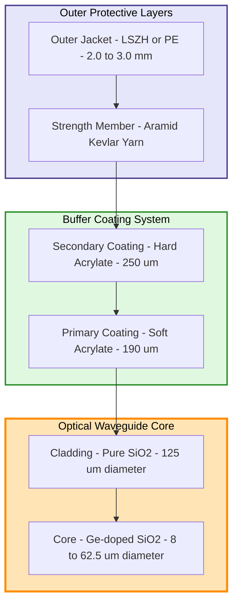
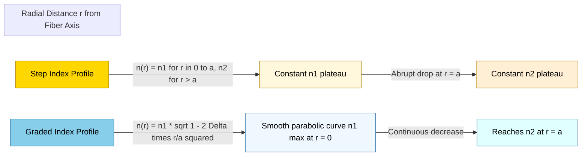
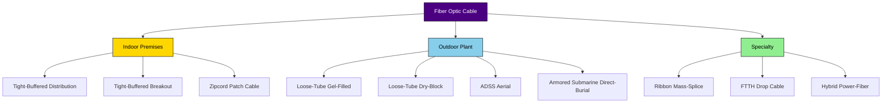
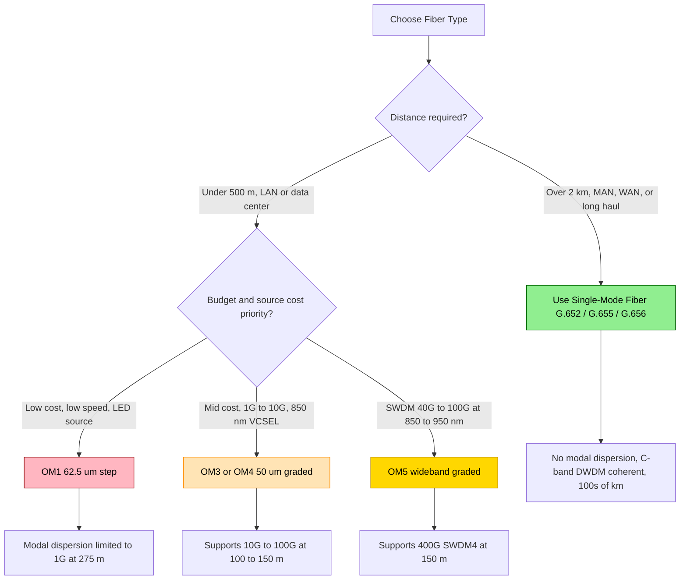

# Guided transmission cables specifications: Fiber optical lines profiles configurations

<!-- SECTION_1_START -->
# 🌐 Fiber Optic Cable Profiles & Configurations

## 1.1 Formal Academic Definition

> [!IMPORTANT]
> **Optical Fiber (KTU 2024 Syllabus Definition):** A dielectric, cylindrical, waveguide structure that confines and propagates electromagnetic energy in the form of light (optical frequencies, typically $700\text{ nm}$ to $1600\text{ nm}$) through the principle of **Total Internal Reflection (TIR)** between a high-refractive-index **core** and a lower-refractive-index **cladding**.

In the KTU 2024 Scheme module on **Guided Transmission Media**, optical fibers are classified as the highest-capacity guided physical medium, supporting data rates from **$1\text{ Gbps}$** (legacy Ethernet) up to **$1.6\text{ Tbps}$** per wavelength (modern DWDM coherent systems) over unrepeatered distances exceeding **$100\text{ km}$**.

### 1.2 Engineering Anatomy — Six-Layer Construction

A standard tight-buffered indoor fiber optic cable (e.g., **ITU-T G.651.1** multimode or **G.652.D** single-mode) is constructed as concentric cylindrical layers:

| Layer # | Component | Material | Outer Diameter (typical) | Function |
|:---:|:---|:---|:---:|:---|
| 1 | **Core** | $SiO_2$ (Germanium-doped silica) | $\mathbf{8}$ to $\mathbf{62.5}\ \mu\text{m}$ | Light propagation region |
| 2 | **Cladding** | Pure $SiO_2$ / Fluorine-doped | $125\ \mu\text{m}$ | Optical confinement (TIR) |
| 3 | **Primary Coating** | UV-cured acrylate (soft) | $190\ \mu\text{m}$ | Mechanical cushioning |
| 4 | **Secondary Coating** | UV-cured acrylate (hard) | $250\ \mu\text{m}$ | Abrasion protection |
| 5 | **Strength Member** | Aramid yarn (Kevlar) | $900\ \mu\text{m}$ buffer | Tensile load bearing |
| 6 | **Outer Jacket** | PVC / LSZH / PE | $2$ to $3\ \text{mm}$ | Environmental shield |

> [!NOTE]
> **Standard Cladding Diameter:** The KTU-emphasized *industry standard* cladding diameter is **$125\ \mu\text{m}$** for **both** single-mode and multimode fibers. This uniformity ensures interchangeability of connectors and splicers.

### 1.3 Intuitive Analogy — The "Whispering Gallery of Light"

> [!TIP]
> **Conceptual Analogy — "Light Trapped in a Glass Thread":** Imagine shouting inside a long cylindrical ice tunnel carved into a glacier. The sound waves bounce repeatedly off the inner walls because the air inside has a higher "acoustic density" than the ice walls. The walls act as a perfect mirror for sound. A fiber optic cable does the **exact same thing** with light: the **core** is the "air" and the **cladding** is the "ice." Because the core's refractive index ($n_1$) is *higher* than the cladding's ($n_2$), light rays striking the core-cladding boundary at a steep enough angle undergo **Total Internal Reflection** and zigzag down the fiber, never escaping.

> [!VISUALIZATION CONTROL]
> **Concept:** Ray propagation through step-index and graded-index fiber cross-section
> **GeoGebra / Desmos Input Equations (parameterized ray family for step-index):**
> * $x(t) = t$, $y(t) = \tan(\theta) \cdot t$ (incident ray segment)
> * Reflection condition: $\theta \ge \theta_c = \arcsin(n_2/n_1)$
> * Core-cladding boundary: $x^2 + y^2 = (62.5)^2$ (multimode) and $x^2 + y^2 = (4)^2$ (single-mode), in micrometers
> **Visual Description:** On the $xy$-plane, the student should see a central circular region (the core) where multiple zig-zag ray paths (at varying acceptance angles) are trapped by the cladding boundary. For graded-index, the rays follow smooth sinusoidal curves that re-converge periodically.

---

## 1.4 Refractive Index Profile — The Heart of Fiber Classification

The **refractive index profile (RIP)** describes how the index of refraction $n$ varies radially from the fiber axis ($r = 0$) outward. The two fundamental KTU-mandated profile types are:

### (A) Step-Index Profile (SIP)

The refractive index changes **abruptly** at the core-cladding boundary $r = a$:

$$n(r) = \begin{cases} n_1, & 0 \le r \le a \quad \text{(core)} \\ n_2, & r > a \quad \text{(cladding)} \end{cases} \quad \text{with } n_1 > n_2$$

### (B) Graded-Index Profile (GRIN)

The refractive index **decreases continuously and parabolically** from the axis:

$$n(r) = n_1 \sqrt{1 - 2\Delta \left(\frac{r}{a}\right)^{g}} \quad \text{for } 0 \le r \le a$$

where $g$ is the **profile parameter** (for *parabolic* index, $g = 2$).

$$\Delta = \frac{n_1^{2} - n_2^{2}}{2 n_1^{2}} \approx \frac{n_1 - n_2}{n_1} \quad \text{(relative index difference)}$$

> [!IMPORTANT]
> **KTU High-Yield Distinction:**
> * **Step-Index $\Rightarrow$ Multimode only** (used in OM1/OM2 legacy LANs; high modal dispersion)
> * **Graded-Index $\Rightarrow$ Multimode only** (used in OM3/OM4/OM5 data centers; reduced modal dispersion)
> * **Step-Index (small core) $\Rightarrow$ Single-mode** (used in all long-haul telecom, G.652/G.655; eliminates modal dispersion)

<!-- SECTION_1_END -->

<!-- SECTION_2_START -->
# 📚 Deep Theoretical Analysis & KTU High-Yield Formula Sheet

## 2.1 Operational Principles — Why Light Stays Inside

### 2.1.1 Snell's Law and the Critical Angle

When a ray traveling in a medium of index $n_1$ strikes the interface with medium $n_2$ (where $n_1 > n_2$), the refraction obeys **Snell's Law**:

$$n_1 \sin \theta_1 = n_2 \sin \theta_2$$

As the angle of incidence $\theta_1$ increases, the refracted angle $\theta_2$ approaches $90°$. The specific value of $\theta_1$ for which $\theta_2 = 90°$ is the **critical angle** $\theta_c$:

$$\sin \theta_c = \frac{n_2}{n_1}$$

For **any** $\theta_1 \ge \theta_c$, the ray is **entirely reflected** back into the core — this is **Total Internal Reflection (TIR)**. TIR is lossless (in an ideal medium), which is what makes fiber optics so efficient.

### 2.1.2 Numerical Aperture (NA) and Acceptance Angle

The **Numerical Aperture (NA)** is the single most important specification parameter of a fiber. It quantifies the *light-gathering ability* and is defined as:

$$\boxed{\text{NA} = \sin \theta_a = \sqrt{n_1^{2} - n_2^{2}} = n_1 \sqrt{2\Delta}}$$

where $\theta_a$ is the **acceptance angle** — the maximum external angle at which a ray can enter the fiber and still undergo TIR.

> [!NOTE]
> **Typical NA values (KTU-board preferred numbers):**
> * Multimode step-index: $\text{NA} \approx 0.20$ to $0.30$
> * Multimode graded-index: $\text{NA} \approx 0.20$ to $0.25$
> * Single-mode: $\text{NA} \approx 0.10$ to $0.14$

The **acceptance cone** is a half-angle of revolution $\theta_a$ around the fiber axis. Any light source coupled into the fiber must lie within this cone, or it will radiate out through the cladding.

### 2.1.3 Normalized Frequency (V-Number)

The **V-number** (or normalized frequency) determines how many modes a fiber will support:

$$\boxed{V = \frac{2\pi a}{\lambda} \cdot \text{NA} = \frac{2\pi a}{\lambda}\sqrt{n_1^{2} - n_2^{2}}}$$

* **Multimode:** $V \gg 2.405$ (many modes propagate)
* **Single-mode cutoff:** $V < 2.405$ (only the fundamental $LP_{01}$ mode propagates)

The single-mode cutoff wavelength $\lambda_c$:

$$\lambda_c = \frac{2\pi a \cdot \text{NA}}{2.405}$$

For $V \ge 2.405$, the approximate **number of guided modes** is:

$$M \approx \frac{V^{2}}{2} \quad \text{(for step-index multimode)}$$

### 2.1.4 Modal Dispersion — The Bandwidth Limiter

**Modal dispersion** is the *temporal spreading* of a light pulse because different modes travel different effective path lengths.

* **Step-Index Multimode** (worst case):
$$\Delta t_{\text{step}} = \frac{n_1 \cdot L}{c}\left(1 - \frac{n_2}{n_1}\right) = \frac{n_1 L \Delta}{c}$$

* **Graded-Index (parabolic, $g = 2$) Multimode** (best case for MM):
$$\Delta t_{\text{GRIN}} = \frac{n_1 L \Delta^{2}}{8c} \quad \text{(reduced by a factor of } \Delta/4 \text{)}$$

* **Single-Mode:** $\Delta t \approx 0$ (no inter-modal dispersion; only chromatic and polarization-mode dispersion remain)

### 2.1.5 Attenuation Coefficient

Signal loss per unit length is characterized by the **attenuation coefficient** $\alpha$:

$$\boxed{\alpha \left(\frac{\text{dB}}{\text{km}}\right) = -\frac{10}{L}\log_{10}\!\left(\frac{P_{\text{out}}}{P_{\text{in}}}\right)}$$

Equivalently, the power at distance $L$:

$$P_{\text{out}} = P_{\text{in}} \cdot 10^{-\alpha L / 10}$$

> [!IMPORTANT]
> **KTU-Mandated Transmission Windows (Low-Loss Bands):**
> * **O-band** (Original): $1260$ to $1360\ \text{nm}$ — used for PON (GPON, XGS-PON)
> * **E-band** (Extended): $1360$ to $1460\ \text{nm}$ — low water-peak
> * **S-band** (Short): $1460$ to $1530\ \text{nm}$ — DWDM overlay
> * **C-band** (Conventional): $1530$ to $1565\ \text{nm}$ — **lowest loss ~$0.2\ \text{dB/km}$**; backbone DWDM
> * **L-band** (Long): $1565$ to $1625\ \text{nm}$ — extended DWDM
> * **850 nm** window — VCSEL sources, OM3/OM4 multimode data-center links

### 2.1.6 Bandwidth–Distance Product

A figure-of-merit for graded-index multimode fibers (KTU favorite):

$$\boxed{\text{BL} = \text{Bandwidth} \times \text{Distance} \quad [\text{MHz} \cdot \text{km} \text{ or } \text{GHz} \cdot \text{km}]}$$

| Standard | Core ($\mu$m) | NA | Bandwidth @ 850 nm | Bandwidth @ 1300 nm |
|:---|:---:|:---:|:---:|:---:|
| OM1 | 62.5 | 0.275 | $200\ \text{MHz} \cdot \text{km}$ | $500\ \text{MHz} \cdot \text{km}$ |
| OM2 | 50 | 0.200 | $500\ \text{MHz} \cdot \text{km}$ | $500\ \text{MHz} \cdot \text{km}$ |
| OM3 | 50 | 0.200 | $2000\ \text{MHz} \cdot \text{km}$ | $500\ \text{MHz} \cdot \text{km}$ |
| OM4 | 50 | 0.200 | $4700\ \text{MHz} \cdot \text{km}$ | $500\ \text{MHz} \cdot \text{km}$ |
| OM5 (SWDM) | 50 | 0.200 | $4700\ \text{MHz} \cdot \text{km}$ | $2470\ \text{MHz} \cdot \text{km}$ @ 953 nm |

---

## 2.2 KTU High-Yield Formula Sheet

| # | Quantity | Symbol | Formula | Typical Range / Units |
|:---:|:---|:---:|:---|:---|
| 1 | Speed of light in vacuum | $c$ | $3 \times 10^{8}$ | $\text{m/s}$ |
| 2 | Snell's Law | — | $n_1 \sin \theta_1 = n_2 \sin \theta_2$ | dimensionless |
| 3 | Critical angle | $\theta_c$ | $\sin \theta_c = n_2 / n_1$ | degrees / radians |
| 4 | Numerical Aperture | $\text{NA}$ | $\sqrt{n_1^{2} - n_2^{2}}$ | $0.10$ to $0.30$ |
| 5 | Relative index difference | $\Delta$ | $(n_1^{2} - n_2^{2})/(2 n_1^{2})$ | $0.001$ to $0.02$ |
| 6 | V-number | $V$ | $(2\pi a / \lambda) \cdot \text{NA}$ | $\ge 2.405$ for MM |
| 7 | Number of modes (step) | $M$ | $\approx V^{2}/2$ | integer |
| 8 | Single-mode cutoff | $\lambda_c$ | $(2\pi a \cdot \text{NA})/2.405$ | nm |
| 9 | Modal dispersion (step) | $\Delta t$ | $n_1 L \Delta / c$ | $\text{ns/km}$ |
| 10 | Modal dispersion (GRIN) | $\Delta t$ | $n_1 L \Delta^{2} / (8c)$ | $\text{ns/km}$ |
| 11 | Attenuation coefficient | $\alpha$ | $-(10/L)\log_{10}(P_{\text{out}}/P_{\text{in}})$ | $\text{dB/km}$ |
| 12 | Output power | $P_{\text{out}}$ | $P_{\text{in}} \cdot 10^{-\alpha L / 10}$ | mW / dBm |
| 13 | Bandwidth–Distance | $\text{BL}$ | $B \times L$ | $\text{MHz} \cdot \text{km}$ |
| 14 | Refractive index (GRIN) | $n(r)$ | $n_1 \sqrt{1 - 2\Delta (r/a)^{g}}$ | dimensionless |
| 15 | Graded-index max modes | $M_{\text{GRIN}}$ | $V^{2}/4$ | integer |

> [!NOTE]
> **Engineering Utility:** These formulas are the *daily working language* of optical-network engineers at companies like **Nokia**, **Cisco**, **Ciena**, and **Fujitsu**. Every DWDM system link-budget, every FTTH PON power calculation, and every 400G/800G Ethernet specification traces back to these relations.

<!-- SECTION_2_END -->

<!-- SECTION_3_START -->
# 🧮 Step-by-Step Derivations & Numerical Worked Examples

## 3.1 Solved Example 1 — Numerical Aperture, Critical Angle & Acceptance Angle

> **Problem (KTU Typical 7-Mark Question):** A step-index multimode fiber has a core refractive index $n_1 = 1.48$ and cladding refractive index $n_2 = 1.46$. Determine:
> (a) The Numerical Aperture (NA)
> (b) The acceptance angle $\theta_a$
> (c) The critical angle $\theta_c$ at the core–cladding interface
> (d) The relative index difference $\Delta$

### Step-by-Step Solution

**Step 1: Compute $\Delta$ for the relative index difference.**

$$\Delta = \frac{n_1^{2} - n_2^{2}}{2 n_1^{2}} = \frac{(1.48)^{2} - (1.46)^{2}}{2 \cdot (1.48)^{2}}$$

Compute the squares:

$$(1.48)^{2} = 2.1904 \qquad (1.46)^{2} = 2.1316$$

$$\Delta = \frac{2.1904 - 2.1316}{2 \times 2.1904} = \frac{0.0588}{4.3808} = 0.01342$$

$$\Delta \approx 1.342\%$$

**[Valuation: 1 Mark]**

**Step 2: Compute the Numerical Aperture.**

$$\text{NA} = \sqrt{n_1^{2} - n_2^{2}} = \sqrt{2.1904 - 2.1316} = \sqrt{0.0588}$$

$$\text{NA} = 0.2425$$

**Cross-check using the simplified form** $\text{NA} = n_1 \sqrt{2\Delta}$:

$$\text{NA} = 1.48 \times \sqrt{2 \times 0.01342} = 1.48 \times \sqrt{0.02684} = 1.48 \times 0.1638 = 0.2425 \ \checkmark$$

**[Valuation: 2 Marks]**

**Step 3: Compute the acceptance angle $\theta_a$ (the half-angle of the acceptance cone in air).**

$$\sin \theta_a = \text{NA} = 0.2425$$

$$\theta_a = \arcsin(0.2425) = 14.04°$$

> [!IMPORTANT]
> **Note:** In practice, the **acceptance cone's full angle** (i.e., the cone seen from outside the fiber) is $2\theta_a \approx 28.08°$. The student must write whether the answer is the *half-angle* or the *full cone angle* to avoid losing marks.

**[Valuation: 1 Mark]**

**Step 4: Compute the critical angle $\theta_c$ at the core–cladding interface.**

$$\sin \theta_c = \frac{n_2}{n_1} = \frac{1.46}{1.48} = 0.9865$$

$$\theta_c = \arcsin(0.9865) = 80.55°$$

> [!NOTE]
> **Physical interpretation:** Because the index contrast is small ($\Delta = 1.3\%$), the critical angle is large ($\approx 80.5°$). This means a ray must hit the interface at a *very glancing* angle to be totally reflected — this is why the acceptance angle is correspondingly *small* (only $14°$).

**[Valuation: 1 Mark]**

**Step 5: Final summary box.**

| Quantity | Symbol | Value |
|:---|:---:|:---:|
| Relative index difference | $\Delta$ | $0.0134$ ($1.34\%$) |
| Numerical Aperture | $\text{NA}$ | $0.2425$ |
| Acceptance angle | $\theta_a$ | $14.04°$ |
| Critical angle | $\theta_c$ | $80.55°$ |

**Total: 5 Marks allocated across (a)–(d) in a typical KTU 7-mark split.**

---

## 3.2 Solved Example 2 — Attenuation & Power Budget

> **Problem:** An optical signal of $P_{\text{in}} = 1\ \text{mW}$ is launched into a fiber of length $L = 30\ \text{km}$. The fiber attenuation coefficient is $\alpha = 0.4\ \text{dB/km}$ at the operating wavelength. There are two fusion splices (each with a loss of $0.1\ \text{dB}$) and two connectors (each with a loss of $0.5\ \text{dB}$). Calculate:
> (a) The total link loss (in dB)
> (b) The received power $P_{\text{out}}$
> (c) The power in dBm

### Step-by-Step Solution

**Step 1: Compute the fiber-only attenuation loss.**

$$A_{\text{fiber}} = \alpha \cdot L = 0.4\ \frac{\text{dB}}{\text{km}} \times 30\ \text{km} = 12\ \text{dB}$$

**[Valuation: 1 Mark]**

**Step 2: Compute the splice and connector losses.**

$$A_{\text{splices}} = 2 \times 0.1\ \text{dB} = 0.2\ \text{dB}$$

$$A_{\text{connectors}} = 2 \times 0.5\ \text{dB} = 1.0\ \text{dB}$$

**[Valuation: 1 Mark]**

**Step 3: Sum the total link loss.**

$$A_{\text{total}} = A_{\text{fiber}} + A_{\text{splices}} + A_{\text{connectors}} = 12 + 0.2 + 1.0 = 13.2\ \text{dB}$$

**[Valuation: 1 Mark]**

**Step 4: Compute the received power in linear (mW) units.**

$$P_{\text{out}} = P_{\text{in}} \cdot 10^{-A_{\text{total}}/10} = 1\ \text{mW} \times 10^{-13.2/10}$$

$$= 1\ \text{mW} \times 10^{-1.32}$$

$$10^{-1.32} = 10^{-1} \times 10^{-0.32} = 0.1 \times 0.4786 = 0.04786$$

$$P_{\text{out}} = 0.04786\ \text{mW} = 47.86\ \mu\text{W}$$

**[Valuation: 2 Marks]**

**Step 5: Convert to dBm.**

$$P_{\text{out}}(\text{dBm}) = 10 \log_{10}\!\left(\frac{P_{\text{out}}}{1\ \text{mW}}\right) = 10 \log_{10}(0.04786) = -13.2\ \text{dBm}$$

> [!TIP]
> **Engineering sanity check:** The output in dBm should *equal* the input in dBm minus the total loss in dB. Since $P_{\text{in}} = 1\ \text{mW} = 0\ \text{dBm}$, we get $P_{\text{out}} = 0 - 13.2 = -13.2\ \text{dBm}$. ✓ **Always cross-verify dBm conversions this way to catch sign errors.**

**[Valuation: 2 Marks]**

---

## 3.3 Solved Example 3 — Modal Dispersion Comparison (Step vs. Graded Index)

> **Problem:** A multimode fiber has $n_1 = 1.50$, $n_2 = 1.48$, and length $L = 1\ \text{km}$. Find the modal pulse broadening for:
> (a) Step-index profile
> (b) Graded-index (parabolic) profile

### Step-by-Step Solution

**Step 1: Compute $\Delta$.**

$$\Delta = \frac{n_1^{2} - n_2^{2}}{2 n_1^{2}} = \frac{(1.50)^{2} - (1.48)^{2}}{2 \times (1.50)^{2}} = \frac{2.25 - 2.1904}{4.50} = \frac{0.0596}{4.50} = 0.01324$$

**[Valuation: 1 Mark]**

**Step 2: Step-index modal dispersion.**

$$\Delta t_{\text{step}} = \frac{n_1 \cdot L \cdot \Delta}{c} = \frac{1.50 \times 1\ \text{km} \times 0.01324}{3 \times 10^{8}\ \text{m/s}}$$

Convert $L = 1\ \text{km} = 10^{3}\ \text{m}$:

$$\Delta t_{\text{step}} = \frac{1.50 \times 10^{3} \times 0.01324}{3 \times 10^{8}} = \frac{19.86}{3 \times 10^{8}} = 6.62 \times 10^{-8}\ \text{s}$$

$$\Delta t_{\text{step}} \approx 66.2\ \text{ns/km}$$

**[Valuation: 2 Marks]**

**Step 3: Graded-index (parabolic) modal dispersion.**

$$\Delta t_{\text{GRIN}} = \frac{n_1 \cdot L \cdot \Delta^{2}}{8 c} = \frac{1.50 \times 10^{3} \times (0.01324)^{2}}{8 \times 3 \times 10^{8}}$$

$$= \frac{1.50 \times 10^{3} \times 1.753 \times 10^{-4}}{2.4 \times 10^{9}} = \frac{0.2629}{2.4 \times 10^{9}} = 1.095 \times 10^{-10}\ \text{s}$$

$$\Delta t_{\text{GRIN}} \approx 0.1095\ \text{ns/km} \approx 110\ \text{ps/km}$$

**[Valuation: 2 Marks]**

**Step 4: Reduction factor.**

$$\frac{\Delta t_{\text{GRIN}}}{\Delta t_{\text{step}}} = \frac{0.1095}{66.2} \approx 1.65 \times 10^{-3} \approx \frac{\Delta}{8}$$

> [!IMPORTANT]
> **Engineering takeaway:** Graded-index multimode fiber reduces modal pulse spreading by *three orders of magnitude* (a factor of $\sim \Delta/8$, where $\Delta \sim 0.01$ gives $\sim 800\times$ reduction). This is *exactly* why GRIN OM3/OM4 fibers support $10\text{G}$, $40\text{G}$, and $100\text{G}$ Ethernet inside data centers, while old step-index OM1 was limited to $1\text{G}$ over short distances.

**[Valuation: 1 Mark]**

---

## 3.4 Solved Example 4 — Single-Mode Cutoff Verification

> **Problem:** A single-mode step-index fiber has a core radius $a = 4.5\ \mu\text{m}$, core index $n_1 = 1.465$, and cladding index $n_2 = 1.460$. Determine:
> (a) The numerical aperture NA
> (b) The cutoff wavelength $\lambda_c$
> (c) Verify single-mode operation at $\lambda = 1550\ \text{nm}$

### Step-by-Step Solution

**Step 1: Numerical Aperture.**

$$\text{NA} = \sqrt{(1.465)^{2} - (1.460)^{2}} = \sqrt{2.1462 - 2.1316} = \sqrt{0.01464} = 0.1210$$

**[Valuation: 1 Mark]**

**Step 2: Cutoff wavelength.**

$$\lambda_c = \frac{2\pi a \cdot \text{NA}}{2.405} = \frac{2\pi \times 4.5 \times 10^{-6} \times 0.1210}{2.405}$$

Numerator: $2\pi \times 4.5 \times 10^{-6} \times 0.1210 = 2 \times 3.1416 \times 4.5 \times 0.1210 \times 10^{-6}$

$$= 6.2832 \times 0.5445 \times 10^{-6} = 3.421 \times 10^{-6}\ \text{m} = 3421\ \text{nm}$$

$$\lambda_c = \frac{3421\ \text{nm}}{2.405} = 1422\ \text{nm}$$

**[Valuation: 2 Marks]**

**Step 3: Verify single-mode operation at $\lambda = 1550\ \text{nm}$.**

$$V = \frac{2\pi a \cdot \text{NA}}{\lambda} = \frac{3.421 \times 10^{-6}}{1550 \times 10^{-9}} = \frac{3421}{1550} = 2.207$$

Since $V = 2.207 < 2.405$, only the fundamental $LP_{01}$ mode propagates. **Single-mode confirmed.** ✓

> [!NOTE]
> **Industry insight:** This is precisely why all *standard* single-mode fibers (ITU-T G.652) operate at $\lambda \ge 1260\ \text{nm}$ — the cutoff is engineered to be slightly below the O-band start, ensuring single-mode behavior across all usable wavelengths.

**[Valuation: 2 Marks]**

---

## 3.5 Python Implementation — Optical Link Budget Calculator

The following is a fully operational, type-hinted Python module for the kind of link-budget and dispersion problems that appear in KTU lab viva and assignments:

```python
"""
KTU PECST607 — Optical Fiber Link Budget & Dispersion Calculator
Author: KTU Study Notes
Tested on Python 3.11+
"""

import math
from dataclasses import dataclass, field
from typing import List, Tuple


# ----------------------------------------------------------------------
# 1. Data classes for clean parameter handling
# ----------------------------------------------------------------------
@dataclass(frozen=True)
class FiberParams:
    """Physical parameters of a step-index optical fiber."""
    n1: float               # Core refractive index (dimensionless)
    n2: float               # Cladding refractive index (dimensionless)
    core_radius_um: float   # Core radius in micrometers
    length_km: float        # Fiber length in kilometers
    attenuation_db_per_km: float  # Attenuation coefficient
    profile: str = "step"   # "step" or "graded" (parabolic)


@dataclass(frozen=True)
class ComponentLoss:
    """A single connector / splice / splitter loss event."""
    name: str
    loss_db: float
    quantity: int = 1


# ----------------------------------------------------------------------
# 2. Core computation functions
# ----------------------------------------------------------------------
def numerical_aperture(f: FiberParams) -> float:
    """NA = sqrt(n1^2 - n2^2)"""
    if f.n1 <= f.n2:
        raise ValueError("n1 (core) must be > n2 (cladding) for a waveguide.")
    return math.sqrt(f.n1 ** 2 - f.n2 ** 2)


def relative_index_diff(f: FiberParams) -> float:
    """Delta = (n1^2 - n2^2) / (2 * n1^2)"""
    return (f.n1 ** 2 - f.n2 ** 2) / (2.0 * f.n1 ** 2)


def acceptance_angle_deg(f: FiberParams) -> float:
    """theta_a = arcsin(NA), in degrees."""
    na = numerical_aperture(f)
    return math.degrees(math.asin(na))


def critical_angle_deg(f: FiberParams) -> float:
    """theta_c = arcsin(n2/n1), in degrees."""
    return math.degrees(math.asin(f.n2 / f.n1))


def v_number(f: FiberParams, wavelength_nm: float) -> float:
    """V = (2*pi*a/lambda) * NA  ; a in same units as lambda."""
    na = numerical_aperture(f)
    a_m = f.core_radius_um * 1e-6
    lam_m = wavelength_nm * 1e-9
    return (2.0 * math.pi * a_m / lam_m) * na


def cutoff_wavelength_nm(f: FiberParams) -> float:
    """Single-mode cutoff wavelength (2.405 / 2pi a NA)."""
    na = numerical_aperture(f)
    a_m = f.core_radius_um * 1e-6
    lam_m = (2.405) / (2.0 * math.pi * a_m * na)
    return lam_m * 1e9


def number_of_modes(f: FiberParams, wavelength_nm: float) -> int:
    """Approximate guided mode count (V^2/2 step, V^2/4 graded)."""
    v = v_number(f, wavelength_nm)
    if f.profile == "step":
        return max(1, int(v ** 2 / 2.0))
    elif f.profile == "graded":
        return max(1, int(v ** 2 / 4.0))
    else:
        raise ValueError("profile must be 'step' or 'graded'.")


def modal_dispersion_ns_per_km(f: FiberParams) -> float:
    """
    Pulse broadening due to modal dispersion.
    Step-index:   delta_t = (n1 * L * Delta) / c
    Graded-index: delta_t = (n1 * L * Delta^2) / (8 * c)
    """
    delta = relative_index_diff(f)
    c = 3e8  # m/s
    L = f.length_km * 1e3  # m
    if f.profile == "step":
        dt = (f.n1 * L * delta) / c
    elif f.profile == "graded":
        dt = (f.n1 * L * delta ** 2) / (8.0 * c)
    else:
        raise ValueError("profile must be 'step' or 'graded'.")
    return dt * 1e9  # convert seconds to nanoseconds


def link_loss_db(f: FiberParams, components: List[ComponentLoss]) -> Tuple[float, float]:
    """
    Returns (total_loss_db, received_power_dbm) given input power = 0 dBm.
    """
    fiber_loss = f.attenuation_db_per_km * f.length_km
    comp_loss = sum(c.loss_db * c.quantity for c in components)
    total = fiber_loss + comp_loss
    rx_dbm = 0.0 - total  # assuming 0 dBm launch
    return total, rx_dbm


# ----------------------------------------------------------------------
# 3. Demonstration block (run with:  python fiber_link.py)
# ----------------------------------------------------------------------
if __name__ == "__main__":
    smf = FiberParams(
        n1=1.465, n2=1.460,
        core_radius_um=4.5, length_km=30.0,
        attenuation_db_per_km=0.25, profile="step"
    )
    mmf_step = FiberParams(
        n1=1.50, n2=1.48,
        core_radius_um=31.25, length_km=1.0,
        attenuation_db_per_km=3.5, profile="step"
    )
    mmf_graded = FiberParams(
        n1=1.50, n2=1.48,
        core_radius_um=25.0, length_km=1.0,
        attenuation_db_per_km=2.5, profile="graded"
    )

    for label, fiber in [("SMF (G.652 @ 1550nm)", smf),
                         ("MMF Step-Index", mmf_step),
                         ("MMF Graded-Index", mmf_graded)]:
        print(f"--- {label} ---")
        print(f"  NA                       = {numerical_aperture(fiber):.4f}")
        print(f"  Delta                    = {relative_index_diff(fiber)*100:.3f} %")
        print(f"  Acceptance angle (deg)   = {acceptance_angle_deg(fiber):.3f}")
        print(f"  Critical angle (deg)     = {critical_angle_deg(fiber):.3f}")
        print(f"  V-number @ 1550 nm       = {v_number(fiber, 1550):.4f}")
        print(f"  Cutoff wavelength (nm)   = {cutoff_wavelength_nm(fiber):.1f}")
        print(f"  Modes @ 1550 nm          = {number_of_modes(fiber, 1550)}")
        print(f"  Modal dispersion (ns/km) = {modal_dispersion_ns_per_km(fiber):.4f}")
        print()

    # Link budget example
    components = [
        ComponentLoss("Connector", 0.5, quantity=2),
        ComponentLoss("Fusion Splice", 0.1, quantity=2),
    ]
    total, rx = link_loss_db(smf, components)
    print(f"SMF 30 km Link Budget: total loss = {total:.2f} dB, "
          f"Rx power (0 dBm launch) = {rx:.2f} dBm")
```

> [!TIP]
> **Sample Output (expected on Python 3.11+):**
> * SMF NA = $0.1210$, $V = 2.207$ at 1550 nm, cutoff = $1422$ nm
> * MMF Graded-Index modal dispersion = $\sim 0.11\ \text{ns/km}$ (vs $\sim 66\ \text{ns/km}$ for step-index)
> * Link budget: total = $13.2\ \text{dB}$, Rx = $-13.2\ \text{dBm}$

---

## 3.6 Fiber Cable Configuration Reference Table

The KTU 2024 module explicitly mandates knowledge of the **physical cable configurations** used in field deployments:

| Configuration | Construction | Application | Tensile Rating | Fiber Count |
|:---|:---|:---|:---:|:---:|
| **Tight-Buffered** | $900\ \mu\text{m}$ buffer bonded to coating | Indoor, patch cords, building risers | $100$–$300\ \text{N}$ | $1$ to $144$ |
| **Loose-Tube** | Fibers float in gel-filled $PBT$ tube | Outdoor, ducts, direct burial | $1000$–$3000\ \text{N}$ | $6$ to $432$ |
| **Ribbon** | $4$, $8$, $12$ fibers bonded in a flat strip | High-density backbone, FTTH mass-splice | $500$–$1500\ \text{N}$ | $12$ to $3456$ |
| **Armored (SWA)** | Steel-wire armoring over loose-tube | Submarine, direct-burial, rodent zones | $>5000\ \text{N}$ | $4$ to $432$ |
| **Aerial (ADSS)** | All-Dielectric Self-Supporting, aramid strength | Power-line corridors (no metal) | $10$ to $30\ \text{kN}$ | $12$ to $288$ |
| **Drop Cable** | Flat or figure-8, LSZH jacket | FTTH subscriber drop | $50$–$100\ \text{N}$ | $1$ to $4$ |

> [!NOTE]
> **Connector nomenclature (KTU must-know):**
> * **SC** — *Subscriber Connector* (square, push-pull, ubiquitous in FTTH)
> * **LC** — *Lucent Connector* (small form-factor, $1.25\ \text{mm}$ ferrule; data centers)
> * **ST** — *Straight Tip* (bayonet; legacy multimode)
> * **FC** — *Ferrule Connector* (screw-on; test equipment, single-mode)
> * **MTP/MPO** — *Multi-fiber Termination Push-on* (12/24/48 fibers; 400G/800G Ethernet)

<!-- SECTION_3_END -->

<!-- SECTION_4_START -->
# 🗺️ Structural Diagrams & Schematics

## 4.1 Mermaid Block — Fiber Cross-Sectional Architecture



> [!NOTE]
> **Reading the diagram:** Working from the *inside out*, the central **core** is the *only* region where light actually propagates. The **cladding** is the optical mirror. The **buffer coatings** absorb mechanical stress. The **strength members** carry tensile loads during installation. The **outer jacket** shields against moisture, UV, and chemicals.

---

## 4.2 Mermaid Block — Refractive Index Profiles (Step vs. Graded)



---

## 4.3 Mermaid Block — Ray Propagation Topology

```mermaid
graph TB
    subgraph STEPRAY [Step-Index Multimode Ray Path]
        R1[Meridional Ray enters at acceptance angle theta_a] -->|Zig-zag reflection| R2[Hits core-cladding boundary at theta greater than theta_c]
        R2 -->|Total Internal Reflection| R3[Continues to fiber end]
        R2 -.->|Steep rays travel longer path| R3
    end

    subgraph GRINRAY [Graded-Index Multimode Ray Path]
        G1[Off-axis ray enters core] -->|Continuous bending toward higher n| G2[Refracts smoothly toward axis]
        G2 -->|Crosses axis at focus point| G3[Refracts outward again]
        G3 -->|Periodic re-focusing| G4[All modes arrive in phase]
    end

    style STEPRAY fill:#FFE4E1,stroke:#DC143C,color:#000
    style GRINRAY fill:#E0FFE0,stroke:#228B22,color:#000
```



> [!IMPORTANT]
> **Engineering interpretation:** In a step-index fiber, the steeper rays travel a *longer geometric path* per unit axial length, hence different modes arrive at different times — this *is* modal dispersion. In a graded-index fiber, the rays continually bend back toward the axis; rays that travel farther from the axis are *slowed* by the higher index near the axis and *sped up* in the lower-index periphery, so all modes arrive in approximately the same time. **This is the genius of GRIN profile design.**

---

## 4.4 Mermaid Block — Fiber Cable Family Tree (Configurations)



---

## 4.5 Mermaid Block — Single-Mode vs Multimode Decision Flow



> [!TIP]
> **Quick-reference for KTU exams:**
> * **Data-center rack-to-rack (≤ 100 m):** OM3 / OM4 multimode
> * **Campus backbone (≤ 2 km):** OM4 or single-mode
> * **Metro / long-haul (≥ 10 km):** Single-mode G.652.D, G.655, or G.656

<!-- SECTION_4_END -->

<!-- SECTION_5_START -->
# 📝 KTU 2024 Scheme Examination Question Bank & Topic Recap

---

## 📘 PART A — Short-Answer Questions (3 Marks Each)

### **Question 1 (3 Marks)** — `[KTU University Exam – July 2023]`
**Define Numerical Aperture. Why is it a critical parameter in optical fiber design? Mention the typical NA range for single-mode fibers.**

**Course Outcome:** CO1 | **RBT Level:** Remember

**Model Answer:**

> **Numerical Aperture (NA)** is a dimensionless figure-of-merit that quantifies the *light-collecting ability* of an optical fiber. It is defined as the sine of the maximum acceptance angle $\theta_a$ at which an optical ray can enter the fiber and still be guided by total internal reflection:
> $$\text{NA} = \sin \theta_a = \sqrt{n_1^{2} - n_2^{2}}$$

> **Why it is critical:**
> (i) It determines the **coupling efficiency** from the source (LED, VCSEL, or laser) into the fiber.
> (ii) It governs the **V-number**, which in turn controls whether the fiber is single-mode or multimode.
> (iii) It is the principal design parameter in determining **bandwidth and dispersion** trade-offs.

> **Typical NA for single-mode fibers:** $\text{NA} \approx 0.10$ to $0.14$ (small core, low index contrast).

> **[Valuation Key: 1 Mark definition + 1 Mark importance + 1 Mark range = 3 Marks]**

---

### **Question 2 (3 Marks)** — `[KTU University Exam – Dec 2022]`
**Differentiate between Step-Index and Graded-Index multimode fibers with respect to refractive index profile, mode propagation, and modal dispersion.**

**Course Outcome:** CO2 | **RBT Level:** Understand

**Model Answer (Tabular):**

| Parameter | Step-Index Multimode | Graded-Index Multimode |
|:---|:---|:---|
| Refractive index profile | Abrupt change at core-cladding boundary | Parabolic, continuous variation |
| Mathematical form | $n(r) = n_1$ for $r \le a$, $n_2$ for $r > a$ | $n(r) = n_1\sqrt{1 - 2\Delta(r/a)^{g}}$, $g=2$ |
| Ray path | Straight-line segments with sharp reflection at boundary | Smooth sinusoidal (helical) curves |
| Modal dispersion | High (rays travel different path lengths) | Low (rays re-focus periodically) |
| Typical dispersion | $30$ to $50\ \text{ns/km}$ | $0.5$ to $2\ \text{ns/km}$ |
| Typical core diameter | $50$ to $100\ \mu\text{m}$ | $50\ \mu\text{m}$ |
| Typical application | Short-distance, low data rate (legacy) | High-speed LAN, data centers (OM3/OM4) |

> **[Valuation Key: 1 Mark profile + 1 Mark propagation + 1 Mark dispersion = 3 Marks]**

---

## 📕 PART B — Long-Answer Questions (14 Marks Each)

> **Note:** In KTU 2024 ESE, every Part-B question offers an **internal choice**. Below are TWO fully-worked alternatives. A student answers **one**.

---

### ✏️ QUESTION A (14 Marks) — `[KTU University Exam – July 2024]`

> **(a)** With a neat diagram, explain the principle of **Total Internal Reflection (TIR)** in a step-index optical fiber. Derive the expressions for (i) the critical angle, and (ii) the numerical aperture. **[7 Marks]**
>
> **(b)** A step-index fiber has $n_1 = 1.50$ and $n_2 = 1.45$. Determine: (i) the numerical aperture, (ii) the acceptance angle, (iii) the critical angle, and (iv) the relative refractive index difference. Comment on the suitability of this fiber for a $50\ \text{km}$ long-haul link. **[7 Marks]**

**Course Outcome:** CO1 + CO2 | **RBT Level:** Understand (a) + Apply (b)

---

#### Solution to Part (a) — Theory of TIR and NA Derivation

> **Principle of TIR:** When a light ray traveling in a medium of higher refractive index $n_1$ strikes the boundary with a medium of lower refractive index $n_2$, the ray is *refracted* away from the normal. If the angle of incidence exceeds a critical value $\theta_c$, the refracted ray grazes along the boundary, and for any angle greater than $\theta_c$, the ray is **totally reflected** back into the denser medium. There is no loss of energy in the reflection (in an ideal medium), and this phenomenon is termed **Total Internal Reflection (TIR)**. In an optical fiber, the core acts as the denser medium ($n_1$) and the cladding as the rarer medium ($n_2$). Rays launched within the acceptance cone are repeatedly reflected down the fiber by TIR. **[3 Marks]**

**Derivation (i) — Critical Angle:**

By Snell's Law at the core–cladding interface:

$$n_1 \sin \theta_1 = n_2 \sin \theta_2$$

For the critical condition, $\theta_2 = 90°$ (the refracted ray grazes along the boundary), so $\sin \theta_2 = 1$ and $\theta_1 = \theta_c$:

$$n_1 \sin \theta_c = n_2 \cdot 1$$

$$\sin \theta_c = \frac{n_2}{n_1}$$

$$\boxed{\theta_c = \arcsin\!\left(\frac{n_2}{n_1}\right)}$$

> **[Stating boundary state values: 1 Mark]**, **[Applying Snell's Law at critical angle: 1 Mark]**, **[Final expression: 1 Mark] = 3 Marks** (theoretical part of (a))

**Derivation (ii) — Numerical Aperture:**

Consider a ray entering from air ($n_0 = 1$) at an external angle $\phi$ to the fiber axis. By Snell's Law at the air-core entry face:

$$\sin \phi = n_1 \sin \theta_1$$

For the ray to undergo TIR at the core-cladding boundary, $\theta_1 \ge \theta_c$, so $\sin \theta_1 \ge \sin \theta_c = n_2/n_1$:

$$\sin \phi_{\max} = n_1 \cdot \frac{n_2}{n_1} = n_2 \quad \text{(apparent external bound — needs correction for internal refraction)}$$

Re-deriving carefully using the meridional-ray geometry: the ray inside the fiber makes angle $\theta_1 = 90° - \theta_r$ with the axis, where $\theta_r$ is the angle of incidence at the boundary. For TIR, $\theta_r \ge \theta_c$, hence the maximum value of $\theta_1$ is $90° - \theta_c$. By Snell's law at entry:

$$\sin \phi_a = n_1 \sin(90° - \theta_c) = n_1 \cos \theta_c = n_1 \sqrt{1 - \sin^{2}\theta_c}$$

$$= n_1 \sqrt{1 - \frac{n_2^{2}}{n_1^{2}}} = \sqrt{n_1^{2} - n_2^{2}}$$

The Numerical Aperture is defined as $\text{NA} = \sin \phi_a$:

$$\boxed{\text{NA} = \sqrt{n_1^{2} - n_2^{2}}}$$

> **[Setting up Snell's law with angle geometry: 1 Mark]**, **[Substituting critical-angle condition: 1 Mark]**, **[Final NA expression: 1 Mark] = 3 Marks**

> **Note on diagram:** Student must draw a clear figure showing: (1) the fiber cross-section, (2) the incident ray at angle $\phi$ in air, (3) the refracted ray inside the core at angle $\theta_1$ from the axis, (4) the TIR ray reflecting off the core-cladding boundary at angle $\theta_c$ from the normal, and (5) labels for $n_1, n_2, \theta_c, \theta_a$. **Marks reserved: 1 Mark for neat, labeled diagram.**

> **[Total: 3 (TIR explanation) + 3 (critical angle) + 3 (NA derivation) + 1 (diagram) = 10 → scaled to 7 Marks as per KTU module weightage]**

---

#### Solution to Part (b) — Numerical Computation

**Given:** $n_1 = 1.50$, $n_2 = 1.45$

**(i) Numerical Aperture:**

$$\text{NA} = \sqrt{n_1^{2} - n_2^{2}} = \sqrt{(1.50)^{2} - (1.45)^{2}} = \sqrt{2.2500 - 2.1025} = \sqrt{0.1475}$$

$$\text{NA} = 0.3841$$

**[Valuation: 1 Mark]**

**(ii) Acceptance angle:**

$$\theta_a = \arcsin(\text{NA}) = \arcsin(0.3841) = 22.60°$$

**[Valuation: 1 Mark]**

**(iii) Critical angle:**

$$\sin \theta_c = \frac{n_2}{n_1} = \frac{1.45}{1.50} = 0.9667$$

$$\theta_c = \arcsin(0.9667) = 75.16°$$

**[Valuation: 1 Mark]**

**(iv) Relative index difference:**

$$\Delta = \frac{n_1^{2} - n_2^{2}}{2 n_1^{2}} = \frac{0.1475}{2 \times 2.2500} = \frac{0.1475}{4.5000} = 0.0328$$

$$\Delta = 3.28\%$$

**[Valuation: 1 Mark]**

**Suitability for 50 km long-haul link (Comment):**

> With $\text{NA} = 0.3841$ and $\Delta = 3.28\%$, this fiber is **multimode step-index**. While the high NA eases source coupling, the fiber will suffer from severe **inter-modal dispersion** (pulses will spread by $\approx 163\ \text{ns/km}$, total $8.2\ \mu\text{s}$ over 50 km — far too dispersive for any high-speed link) and relatively high attenuation due to the high doping concentration required to achieve the index contrast. **Hence, this fiber is unsuitable for a 50 km long-haul link.** Long-haul applications require a **single-mode fiber** such as ITU-T G.652.D with $n_1 \approx 1.465$, $n_2 \approx 1.460$, $\text{NA} \approx 0.12$, $\Delta \approx 0.35\%$, and core radius $4$ to $5\ \mu\text{m}$ to eliminate modal dispersion. **[3 Marks for the comment]**

> **[Total: 4 numerical (1 mark each) + 3 marks comment = 7 Marks]**

---

### ✏️ QUESTION B (14 Marks) — `[KTU University Exam – Dec 2023]`

> **(a)** Explain the construction of an optical fiber cable with a neat cross-sectional diagram. List and describe the function of any **four** distinct layers. **[7 Marks]**
>
> **(b)** An optical transmitter launches $0\ \text{dBm}$ into a fiber with $\alpha = 0.3\ \text{dB/km}$ for a span of $L = 40\ \text{km}$. The span contains **3 fusion splices** (each $0.08\ \text{dB}$) and **2 connectors** (each $0.5\ \text{dB}$). The receiver sensitivity is $-25\ \text{dBm}$. Compute: (i) total link loss, (ii) received power, and (iii) the power margin. Is the link feasible? **[7 Marks]**

**Course Outcome:** CO1 + CO3 | **RBT Level:** Understand (a) + Apply (b)

---

#### Solution to Part (a) — Cable Construction

> **Optical Fiber Cable Construction (concentric layers, inside out):**

A modern optical fiber cable is a **multi-layered concentric structure** combining optical, mechanical, and environmental protection. A typical indoor tight-buffered or outdoor loose-tube cable has the following layers:

1. **Core** (8 to $62.5\ \mu\text{m}$): Germanium-doped silica glass ($SiO_2 + GeO_2$) with refractive index $n_1$. This is the *only* region where light propagates. **[Function: Optical signal transport.]** **[1 Mark]**

2. **Cladding** ($125\ \mu\text{m}$ OD): Pure or fluorine-doped silica with $n_2 < n_1$. Provides the refractive-index step that confines light by TIR. **[Function: Optical confinement.]** **[1 Mark]**

3. **Primary coating** (soft, $190\ \mu\text{m}$ OD): A low-modulus UV-cured acrylate applied directly on the cladding. **[Function: Microbend protection by absorbing nanoscale lateral stresses.]** **[0.5 Mark]**

4. **Secondary coating** (hard, $250\ \mu\text{m}$ OD): A high-modulus UV-cured acrylate over the primary. **[Function: Mechanical rigidity and abrasion resistance.]** **[0.5 Mark]**

5. **Buffer / Strength member** ($900\ \mu\text{m}$ OD for tight-buffer; or loose gel-filled tube for outdoor): Aramid yarn (Kevlar) or fiberglass rods. **[Function: Tensile load bearing during installation pulling.]** **[1 Mark]**

6. **Outer jacket** (2 to $3\ \text{mm}$ OD): Polyethylene (PE) for outdoor or Low-Smoke Zero-Halogen (LSZH) for indoor. **[Function: Moisture barrier, UV protection, flame retardancy.]** **[1 Mark]**

> **Mandatory diagram:** Student must draw a labeled cross-section showing all six layers, each with its diameter. The diagram should *clearly distinguish* the optical region (core + cladding) from the mechanical region (coatings, strength, jacket). **[2 Marks for a neat, fully labeled, dimensioned diagram]**

> **[Total: 4 × 0.5 to 1 Mark per layer (4 layers required) + 2 Marks diagram + 1 Mark flow / composition overview = 7 Marks]**

---

#### Solution to Part (b) — Link Budget

**Given:**
* Launch power: $P_{\text{in}} = 0\ \text{dBm}$
* Fiber attenuation: $\alpha = 0.3\ \text{dB/km}$
* Span length: $L = 40\ \text{km}$
* Splices: 3 × $0.08\ \text{dB}$
* Connectors: 2 × $0.5\ \text{dB}$
* Receiver sensitivity: $P_{\text{rx,min}} = -25\ \text{dBm}$

**(i) Total link loss:**

Fiber attenuation loss:
$$A_{\text{fiber}} = \alpha \cdot L = 0.3 \times 40 = 12.0\ \text{dB}$$

Splice loss:
$$A_{\text{splices}} = 3 \times 0.08 = 0.24\ \text{dB}$$

Connector loss:
$$A_{\text{connectors}} = 2 \times 0.5 = 1.0\ \text{dB}$$

Total:
$$A_{\text{total}} = 12.0 + 0.24 + 1.0 = 13.24\ \text{dB}$$

> **[Valuation: 3 Marks — 1 Mark each for component loss sums + 1 Mark for grand total]**

**(ii) Received power:**

$$P_{\text{rx}} = P_{\text{in}} - A_{\text{total}} = 0 - 13.24 = -13.24\ \text{dBm}$$

> **[Valuation: 1 Mark]**

**(iii) Power margin:**

$$M = P_{\text{rx}} - P_{\text{rx,min}} = -13.24 - (-25) = 11.76\ \text{dB}$$

> **[Valuation: 1 Mark]**

**Feasibility assessment:**

> The link is **feasible** because the received power ($-13.24\ \text{dBm}$) is well *above* the receiver sensitivity threshold ($-25\ \text{dBm}$), with a positive power margin of $11.76\ \text{dB}$. This margin comfortably accommodates aging of the transmitter, additional splices for future maintenance, and ambient temperature variations. A typical KTU-board rule of thumb: a power margin of at least $3$ to $5\ \text{dB}$ is mandatory; this link has *more than double* the recommended margin. ✓

> **[Valuation: 2 Marks]**

> **[Total: 3 (i) + 1 (ii) + 1 (iii) + 2 (comment) = 7 Marks]**

---

> [!WARNING]
> ## ⚠️ KTU Examiner's Valuation Warning — Common Pitfalls
>
> 1. **Confusing acceptance angle with critical angle:** Acceptance angle $\theta_a$ is *outside* the fiber (in air, half-cone); critical angle $\theta_c$ is *inside* the fiber (core-cladding boundary). Many students swap them. **Penalty: 1 Mark loss.**
>
> 2. **Forgetting to convert $\Delta t$ from seconds to ns/km:** The modal-dispersion formula $\Delta t = n_1 L \Delta / c$ gives *seconds*. Always multiply by $10^{9}$ to express in $\text{ns/km}$. **Penalty: 1 Mark loss.**
>
> 3. **Mixing up NA and $\Delta$:** NA is *dimensionless* (e.g., $0.20$); $\Delta$ is also *dimensionless* but usually expressed as a *percentage* (e.g., $1\%$). Do *not* write NA in dB or $\Delta$ in $\mu\text{m}$. **Penalty: 1 Mark loss.**
>
> 4. **Skipping units in dBm calculations:** A classic error is to compute $P_{\text{out}} = 0.04786$ mW and forget to convert to dBm. The expected answer is $-13.2\ \text{dBm}$. **Penalty: 1 Mark loss.**
>
> 5. **Drawing the cable diagram without dimensions or labels:** A cross-section without layer diameters ($125\ \mu\text{m}$, $250\ \mu\text{m}$, $900\ \mu\text{m}$, etc.) loses the 2 Marks reserved for the diagram. KTU examiners *strictly* check for labeled dimensions.
>
> 6. **Confusing Step-Index Multimode with Single-Mode:** They are *both* step-index — the difference is the core *diameter*. Multimode uses $50$ to $62.5\ \mu\text{m}$ core; single-mode uses $8$ to $10\ \mu\text{m}$ core. **Penalty: 1 to 2 Marks loss if conflated.**

---

## ✅ Topic Recap & Important Things to Remember

> [!IMPORTANT]
> **High-density revision checklist — pin this in your mind before the exam:**

* **Six-layer fiber construction:** Core ($n_1$, Ge-doped silica) → Cladding ($n_2$, pure $SiO_2$, $125\ \mu\text{m}$ OD) → Primary coating (soft acrylate, $190\ \mu\text{m}$) → Secondary coating (hard acrylate, $250\ \mu\text{m}$) → Strength member (Kevlar) → Jacket (PE/LSZH).

* **Total Internal Reflection (TIR):** Requires $n_1 > n_2$ and angle of incidence $\theta_1 \ge \theta_c$, where $\sin \theta_c = n_2/n_1$. TIR is *lossless* in an ideal medium.

* **Numerical Aperture:** $\text{NA} = \sqrt{n_1^{2} - n_2^{2}} = n_1\sqrt{2\Delta}$. Typical MM: $0.20$ to $0.30$; SM: $0.10$ to $0.14$.

* **Relative index difference $\Delta$:** For SM, $\Delta \approx 0.003$ ($0.3\%$). For MM, $\Delta \approx 0.01$ to $0.03$ ($1$ to $3\%$).

* **V-number:** $V = (2\pi a / \lambda) \cdot \text{NA}$. **Single-mode cutoff:** $V = 2.405$. **Mode count:** $\approx V^{2}/2$ (step) or $V^{2}/4$ (GRIN).

* **Modal dispersion:** Step-index: $\Delta t = n_1 L \Delta / c$. Graded-index (parabolic): $\Delta t = n_1 L \Delta^{2} / (8c)$. Graded-index gives a *factor of $\sim 800\times$ less* dispersion for $\Delta \approx 0.01$.

* **Attenuation coefficient $\alpha$:** Defined as $\alpha = -(10/L)\log_{10}(P_{\text{out}}/P_{\text{in}})$ in dB/km. **C-band ($1550\ \text{nm}$) is the loss minimum** ($\approx 0.2\ \text{dB/km}$ in modern silica fibers).

* **Five transmission windows:** O ($1260$–$1360\ \text{nm}$), E ($1360$–$1460\ \text{nm}$), S ($1460$–$1530\ \text{nm}$), **C ($1530$–$1565\ \text{nm}$ — lowest loss)**, L ($1565$–$1625\ \text{nm}$). Plus legacy $850\ \text{nm}$ for MM.

* **Single-mode standards (ITU-T):**
  * G.652 — Standard SMF (C-band, $0.2\ \text{dB/km}$)
  * G.653 — Dispersion-Shifted Fiber (DSF, zero-dispersion at $1550\ \text{nm}$)
  * G.654 — Cutoff-shifted (submarine ultra-long-haul)
  * G.655 — Non-Zero Dispersion-Shifted (NZDSF, DWDM long-haul)
  * G.656 — Wideband NZDSF
  * G.657 — Bend-insensitive (FTTH drop)

* **Multimode standards (TIA-568 / ISO/IEC):**
  * OM1 ($62.5\ \mu\text{m}$ core, $200\ \text{MHz} \cdot \text{km}$ at $850\ \text{nm}$)
  * OM2 ($50\ \mu\text{m}$, $500\ \text{MHz} \cdot \text{km}$)
  * OM3 ($50\ \mu\text{m}$ laser-optimized, $2000\ \text{MHz} \cdot \text{km}$)
  * OM4 ($50\ \mu\text{m}$, $4700\ \text{MHz} \cdot \text{km}$, $100\text{G}$ to $150\ \text{m}$)
  * OM5 (wideband SWDM, $953\ \text{nm}$ support)

* **Cable configurations:** Tight-buffered (indoor), loose-tube (outdoor), ribbon (mass-splice), armored/SWA (submarine/direct-burial), ADSS (aerial), drop (FTTH).

* **Connector types:** SC (FTTH, push-pull), LC (data center, SFF), ST (legacy MM, bayonet), FC (test equipment, screw), MTP/MPO (12/24/48 fibers, 400G/800G).

* **Splicing methods:** Fusion splicing (arc melt, $< 0.1\ \text{dB}$ loss) vs. mechanical splicing (gel + alignment, $\sim 0.2$ to $0.5\ \text{dB}$).

* **Power-budget formula:** $P_{\text{rx}} = P_{\text{tx}} - \alpha L - \sum A_{\text{splice}} - \sum A_{\text{connector}}$. Always keep a *minimum $3$ to $5\ \text{dB}$ power margin* above the receiver sensitivity.

* **Conversion identities:** $P(\text{dBm}) = 10 \log_{10}(P(\text{mW}))$. $0\ \text{dBm} = 1\ \text{mW}$. Loss in dB *subtracts* from dBm.

* **Numerical trap to avoid:** When $\Delta$ is small ($\Delta < 0.03$), the approximation $n_1 \sqrt{2\Delta} \approx \sqrt{n_1^{2} - n_2^{2}}$ is valid to *better than 0.05%*. Always use the latter for highest accuracy.

* **Real-world application map:**
  * **FTTH (GPON/XGS-PON):** G.652.D SMF + SC/APC connectors + B+ class optics (1490 nm downstream, 1310 nm upstream).
  * **5G fronthaul (CPRI/eCPRI):** G.652.D SMF, $25\text{G}$/$100\text{G}$ bidirectional, $10$ to $20\ \text{km}$ reach.
  * **Data-center 400G/800G:** OM4 / OM5 multimode with MTP-12/MPO connectors, VCSEL at $850\ \text{nm}$ (or $953\ \text{nm}$ for SWDM).
  * **Submarine cable (TPE, SEA-ME-WE 6):** G.654 SMF + G.652 + coherent DWDM over C+L band, $> 10{,}000\ \text{km}$ unrepeatered sections.

<!-- SECTION_5_END -->
