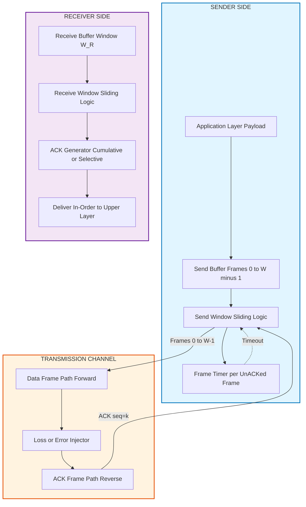
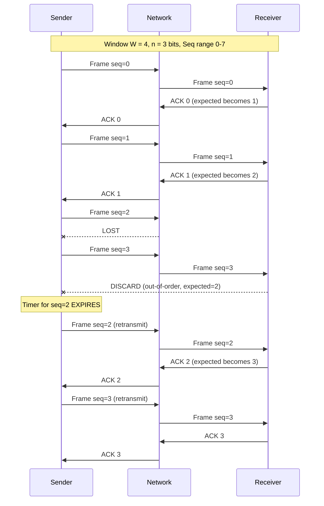
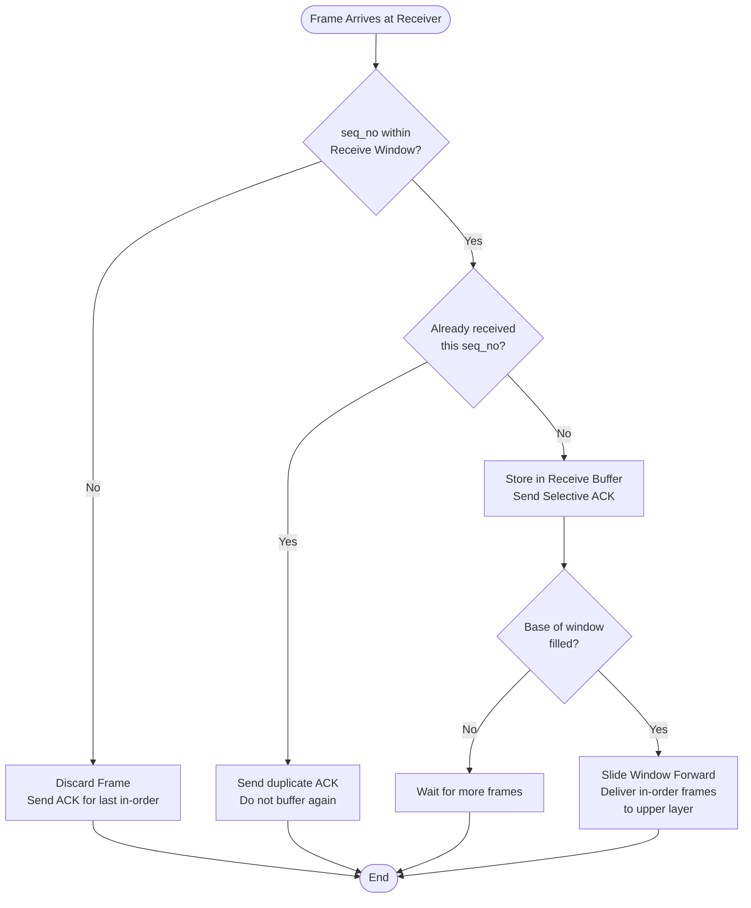
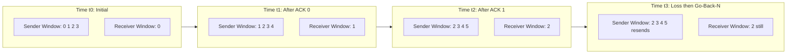

# Flow containment frameworks setups configurations: Sliding window routing tracks profiles

<!-- SECTION_1_START -->
# Sliding Window Protocol: Flow & Error Control Frameworks

> [!IMPORTANT]
> **KTU 2024 Scheme Focus (PECST607 - Module 3):** This topic is a high-weightage area covering **Flow Control** and **Error Control** mechanisms of the Data Link Layer. Students must master the three canonical protocols: **Stop-and-Wait ARQ**, **Go-Back-N ARQ**, and **Selective Repeat ARQ**.

## 1.1 Formal Academic Definition

The **Sliding Window Protocol** is a Data Link Layer framing discipline that permits a sender to transmit multiple frames (up to a pre-agreed window size) before requiring an acknowledgment from the receiver. It simultaneously addresses **flow containment** (preventing a fast sender from overwhelming a slow receiver) and **error control** (recovering from lost or damaged frames) using sequence numbers and acknowledgment frames.

The **send window** defines the set of sequence numbers the sender is allowed to transmit, while the **receive window** defines the set of sequence numbers the receiver is willing to accept. Both windows "slide" forward as communication progresses — hence the name.

**Key Parameters (must be in bold per KTU style):**
- **Window Size ($W$):** Maximum number of outstanding (unacknowledged) frames.
- **Sequence Number Range:** $0$ to $2^n - 1$, where **$n$ is the number of bits** in the sequence number field.
- **Send Window Size ($W_S$):** Typically $2^n - 1$ for Go-Back-N and $2^{n-1}$ for Selective Repeat.
- **Receive Window Size ($W_R$):** $1$ for Go-Back-N; equal to send window for Selective Repeat.

> [!NOTE]
> **KTU Board Definition (Verbatim Tone):** "A sliding window protocol is a feature of packet-based data transmission protocols. Sliding window is used to maintain a continuous flow of data between a sender and a receiver, while simultaneously ensuring ordered delivery and managing flow control."

## 1.2 Intuitive Real-World Analogy

Imagine a **conveyor belt system** in a postal sorting office:

- The **sender** (postman) places a fixed number of parcels on the conveyor — say **5 parcels** — and waits for confirmation.
- The **receiver** (sorting clerk) processes parcels and signals back: *"I have received parcels 1 through 4; parcel 5 is missing."*
- The sender's "window" of pending parcels **slides forward** to include new parcels once earlier ones are confirmed.
- If a parcel is lost, the sender either **resends everything from the lost point** (Go-Back-N) or **only resends the specific lost parcel** (Selective Repeat).

**Another Analogy — Classroom Roll Call:**
A teacher calls roll for students numbered $0, 1, 2, \dots, 7$. The teacher only "remembers" (keeps in the window) a subset. When a student answers, their slot is marked complete, and the teacher's mental window slides to the next batch. This avoids re-asking every student from scratch.

## 1.3 Conceptual Visualization

> [!VISUALIZATION CONTROL]
> **Concept:** Sliding Window State Machine (Sender-Receiver Synchronized Movement)
> **Coordinate Setup:** X-axis = Time, Y-axis = Sequence Number (0 to 7)
> **GeoGebra Input Equations:**
> * `Sender Window Lower Edge: f1(x) = piecewise[ mod(x, 8) for x in [0, 16] ]`
> * `Sender Window Upper Edge: f2(x) = mod(x, 8) + 3` (for W=4)
> * `Receiver Window Lower: g1(x) = mod(x-2, 8) + 1`
> * `Receiver Window Upper: g2(x) = mod(x-2, 8) + 4`
>
> **Visual Description:** You should observe two parallel horizontal bands. The sender's band (colored blue) and receiver's band (colored green) shift rightward as $x$ (time) increases. Note how the receiver window always trails the sender window by the number of in-flight (unacknowledged) frames.

<!-- SECTION_1_END -->

<!-- SECTION_2_START -->
# Deep Theoretical Analysis & KTU High-Yield Formula Sheet

## 2.1 The Three Canonical Sliding Window Variants

### 2.1.1 Stop-and-Wait ARQ (The Trivial Case)
- **Window Size:** $W = 1$
- **Mechanism:** Sender transmits **one frame**, waits for ACK before sending the next.
- **Pipelining:** None — fully sequential.
- **Efficiency:** Very low for long-latency links (wasted bandwidth).

### 2.1.2 Go-Back-N ARQ
- **Send Window Size:** $W_S = 2^n - 1$
- **Receive Window Size:** $W_R = 1$
- **Strategy:** Receiver accepts frames **only in order**. If frame $k$ is lost, the receiver discards all subsequent frames ($k+1, k+2, \dots$) and the sender retransmits from frame $k$ onward.
- **ACK Mechanism:** Receiver sends a **cumulative ACK** for the last correctly received in-order frame.
- **Use Case:** Networks with low error rates and where simplicity outweighs retransmission cost.

### 2.1.3 Selective Repeat ARQ
- **Send Window Size:** $W_S = 2^{n-1}$
- **Receive Window Size:** $W_R = 2^{n-1}$
- **Strategy:** Receiver buffers out-of-order frames. Only the specific lost/damaged frame is retransmitted.
- **ACK Mechanism:** Receiver sends **individual (selective) ACKs** for each correctly received frame.
- **Use Case:** Noisy, high-latency links (e.g., satellite, wireless) where Go-Back-N's wastefulness is prohibitive.

## 2.2 The Underlying 'Why' — Sequence Number Arithmetic

Sequence numbers wrap around modulo $2^n$. For an $n$-bit sequence number field, the valid range is $0$ to $2^n - 1$. After sequence number $2^n - 1$, the next number rolls back to $0$.

The **window constraint** prevents ambiguity:
- If the receiver cannot tell whether an incoming sequence number is a **new frame** or a **retransmitted old frame**, the protocol fails.
- For Go-Back-N, the constraint $W_S + W_R \leq 2^n$ ensures no overlap. With $W_R = 1$, we get $W_S \leq 2^n - 1$.
- For Selective Repeat, both windows slide independently, so we need $W_S + W_R \leq 2^n$. Setting them equal gives $W_S = W_R = 2^{n-1}$.

## 2.3 KTU Formula Sheet

| Formula / Parameter | Expression | Units / Notes |
|---|---|---|
| Maximum sequence number | $2^n - 1$ | Dimensionless integer |
| Go-Back-N send window | $W_S = 2^n - 1$ | Frames |
| Go-Back-N receive window | $W_R = 1$ | Frame |
| Selective Repeat send window | $W_S = 2^{n-1}$ | Frames |
| Selective Repeat receive window | $W_R = 2^{n-1}$ | Frames |
| Channel Utilization (Stop-and-Wait) | $U = \dfrac{T_f}{T_f + 2T_p}$ | Ratio (0 to 1) |
| Channel Utilization (Sliding Window) | $U = \dfrac{W \cdot T_f}{T_f + 2T_p}$ | Ratio, capped at 1 |
| Frame Transmission Time | $T_f = \dfrac{L}{R}$ | Seconds |
| Propagation Delay | $T_p = \dfrac{d}{v}$ | Seconds |
| Round Trip Time | $RTT = 2T_p$ | Seconds |
| Efficiency upper bound | $U_{max} = 1$ (saturates) | Achieved when $W \geq (2T_p/T_f) + 1$ |
| Bandwidth-Delay Product | $BDP = R \cdot T_p$ | Bits in flight |
| Optimal Window Size | $W_{opt} = 2a + 1$ where $a = T_p / T_f$ | Frames |
| Throughput | $Throughput = U \times R$ | Bits per second |

> [!IMPORTANT]
> **Critical Constraint:** For Selective Repeat ARQ, **always state** the window size constraint $W \leq 2^{n-1}$. Marks are lost in KTU exams when students omit this verification step.

## 2.4 Real-World Engineering Utility

| Domain | Application |
|---|---|
| **TCP (Transport Layer)** | TCP's sliding window is **identical in principle** to Selective Repeat — it uses a 32-bit sequence number and a variable receive window. |
| **Satellite Communications** | Selective Repeat ARQ preferred due to high $T_p$ (250-300 ms RTT to GEO satellites). |
| **Wi-Fi (802.11)** | Uses **Selective Repeat** with block acknowledgments. |
| **HDLC (High-Level Data Link Control)** | The classical Go-Back-N implementation in legacy telecom. |
| **LTE/5G NR (RLC Layer)** | Radio Link Control offers **AM (Acknowledged Mode)** which is essentially Selective Repeat. |
| **Storage Systems (NVMe-oF, iSCSI)** | Sliding window credits control command queuing. |

<!-- SECTION_2_END -->

<!-- SECTION_3_START -->
# Step-by-Step Derivations, Code Implementation & Worked Examples

## 3.1 Derivation: Optimal Window Size

**Given:** Frame length $L$ bits, link bandwidth $R$ bps, propagation delay $T_p$ seconds.

**Step 1.** Frame transmission time:
$$T_f = \frac{L}{R}$$

**Step 2.** Define the **bandwidth-delay product parameter**:
$$a = \frac{T_p}{T_f}$$

**Step 3.** For a sliding window protocol, channel utilization is:
$$U = \frac{W \cdot T_f}{T_f + 2T_p} = \frac{W}{1 + 2a}$$

**Step 4.** For full utilization, set $U = 1$:
$$\frac{W}{1 + 2a} = 1 \implies W_{opt} = 1 + 2a$$

**Step 5.** Substitute $a = T_p / T_f$:
$$W_{opt} = 1 + \frac{2T_p}{T_f} = 1 + \frac{2T_p \cdot R}{L}$$

This gives the **minimum window size** required to keep the pipeline full.

## 3.2 Worked Numerical Example (KTU Board Style)

> **Question:** A channel has a bit rate of **$R = 4$ kbps** and a one-way propagation delay of **$20$ ms**. Frame size is **$L = 200$ bits**. Find: (a) Stop-and-Wait efficiency, (b) Minimum window size for full utilization using a sliding window protocol.

**Given:** $R = 4000$ bps, $T_p = 0.020$ s, $L = 200$ bits.

### Part (a): Stop-and-Wait Efficiency
$$T_f = \frac{L}{R} = \frac{200}{4000} = 0.05 \text{ s}$$

$$RTT = 2 T_p = 0.040 \text{ s}$$

$$U_{S\&W} = \frac{T_f}{T_f + 2T_p} = \frac{0.050}{0.050 + 0.040} = \frac{0.050}{0.090} = 0.5556$$

$$\boxed{U_{S\&W} \approx 55.56\%}$$

### Part (b): Minimum Window Size
$$a = \frac{T_p}{T_f} = \frac{0.020}{0.050} = 0.4$$

$$W_{opt} = 1 + 2a = 1 + 2(0.4) = 1.8 \implies \lceil W_{opt} \rceil = 2$$

$$\boxed{W_{opt} = 2 \text{ frames}}$$

**Verification:** $U = \frac{2}{1 + 2(0.4)} = \frac{2}{1.8} = 1.111$ → capped at $U = 1$ (100%).

## 3.3 Complete Go-Back-N ARQ Simulator (Python)

```python
import logging
from typing import List, Optional
from dataclasses import dataclass, field

logging.basicConfig(
    level=logging.INFO,
    format="%(asctime)s | %(levelname)s | %(message)s"
)
logger = logging.getLogger("GoBackN_ARQ")


@dataclass
class Frame:
    """Represents a Data Link Layer frame."""
    seq_no: int
    payload: str
    is_ack: bool = False
    ack_no: int = -1


class GoBackNSender:
    """Sender side of Go-Back-N ARQ protocol."""

    def __init__(self, window_size: int, total_frames: int, loss_rate: float = 0.1):
        if window_size < 1:
            raise ValueError("Window size must be >= 1")
        self.W = window_size
        self.total_frames = total_frames
        self.loss_rate = loss_rate
        self.base = 0        # Lower edge of send window
        self.next_seq = 0    # Next sequence number to send
        self.sent: List[Frame] = []
        self.ack_received: List[bool] = [False] * total_frames
        self.timer_expired = False

    def can_send(self) -> bool:
        return self.next_seq < self.base + self.W and self.next_seq < self.total_frames

    def send_frame(self) -> Optional[Frame]:
        if not self.can_send():
            return None
        frame = Frame(seq_no=self.next_seq, payload=f"DATA-{self.next_seq}")
        self.sent.append(frame)
        logger.info(f"SENDER  >> Sent Frame seq={self.next_seq}, "
                    f"window=[{self.base}, {self.base + self.W - 1}]")
        self.next_seq += 1
        return frame

    def receive_ack(self, ack_no: int) -> None:
        if 0 <= ack_no < self.total_frames:
            logger.info(f"SENDER  << Received ACK {ack_no}")
            # Cumulative ACK: mark all frames up to ack_no as acknowledged
            for i in range(self.base, ack_no + 1):
                if i < self.total_frames:
                    self.ack_received[i] = True
            self.base = ack_no + 1
            self.timer_expired = False
        else:
            logger.warning(f"SENDER  << Received INVALID ACK {ack_no}")

    def timeout(self) -> None:
        """Retransmit all frames from base onwards."""
        logger.warning(f"SENDER  !! TIMEOUT -> Go-Back-N from seq={self.base}")
        self.next_seq = self.base
        self.timer_expired = True


class GoBackNReceiver:
    """Receiver side of Go-Back-N ARQ protocol."""

    def __init__(self, expected_seq: int = 0):
        self.expected = expected_seq
        self.buffer: List[Frame] = []

    def receive_frame(self, frame: Frame) -> Frame:
        if frame.is_ack:
            return Frame(seq_no=0, payload="", is_ack=True, ack_no=frame.ack_no)

        if frame.seq_no == self.expected:
            logger.info(f"RECEIVER<< Accepted Frame seq={frame.seq_no}")
            self.buffer.append(frame)
            ack = Frame(seq_no=0, payload="", is_ack=True, ack_no=self.expected)
            self.expected = (self.expected + 1) % 8
            return ack
        else:
            # Out-of-order: discard, send duplicate ACK for last correct
            logger.warning(f"RECEIVER<< DISCARDED Frame seq={frame.seq_no}, "
                           f"expected={self.expected}")
            last_correct = (self.expected - 1) % 8
            return Frame(seq_no=0, payload="", is_ack=True, ack_no=last_correct)


def simulate_gbn(num_frames: int = 6, window_size: int = 4) -> None:
    """Full Go-Back-N ARQ simulation with a forced frame loss."""
    sender = GoBackNSender(window_size=window_size, total_frames=num_frames)
    receiver = GoBackNReceiver(expected_seq=0)

    # Phase 1: Send all frames in the window
    logger.info("=" * 60)
    logger.info("PHASE 1: Initial transmission")
    logger.info("=" * 60)
    ack_to_process: Optional[Frame] = None
    while sender.can_send():
        frame = sender.send_frame()
        if frame is None:
            break
        # Simulate loss of frame seq=2
        if frame.seq_no == 2:
            logger.warning(f"NETWORK  ** LOST Frame seq={frame.seq_no} **")
            continue
        ack = receiver.receive_frame(frame)
        ack_to_process = ack

    # Process the last ACK
    if ack_to_process and ack_to_process.is_ack:
        sender.receive_ack(ack_to_process.ack_no)

    # Phase 2: Timeout and retransmission
    logger.info("=" * 60)
    logger.info("PHASE 2: Timeout and Go-Back-N retransmission")
    logger.info("=" * 60)
    sender.timeout()
    while sender.can_send():
        frame = sender.send_frame()
        if frame is None:
            break
        ack = receiver.receive_frame(frame)
        sender.receive_ack(ack.ack_no)

    logger.info("=" * 60)
    logger.info("FINAL: Receiver buffer = %s", [f.seq_no for f in receiver.buffer])
    logger.info("=" * 60)


if __name__ == "__main__":
    simulate_gbn(num_frames=6, window_size=4)
```

**Expected Output Trace:**
```
PHASE 1: SENDER sends frames 0, 1 (frame 2 lost, 3 dropped by receiver)
PHASE 2: Timeout triggered, retransmission from seq=2 onward
FINAL:   Receiver buffer = [0, 1, 2, 3, 4, 5]
```

## 3.4 Complete Selective Repeat ARQ Simulator (Python)

```python
import logging
from typing import List, Optional, Dict
from dataclasses import dataclass

logging.basicConfig(level=logging.INFO, format="%(asctime)s | %(message)s")
logger = logging.getLogger("SelectiveRepeat_ARQ")


@dataclass
class SRFrame:
    seq_no: int
    payload: str
    is_ack: bool = False


class SelectiveRepeatSender:
    def __init__(self, window_size: int, total_frames: int):
        if window_size < 1:
            raise ValueError("Window size must be >= 1")
        self.W = window_size
        self.total = total_frames
        self.base = 0
        self.next_seq = 0
        self.acked: Dict[int, bool] = {}

    def can_send(self) -> bool:
        return self.next_seq < self.base + self.W and self.next_seq < self.total

    def send_frame(self) -> Optional[SRFrame]:
        if not self.can_send():
            return None
        f = SRFrame(seq_no=self.next_seq, payload=f"D-{self.next_seq}")
        logger.info(f"S >> Send seq={self.next_seq}, "
                    f"window=[{self.base}, {self.base + self.W - 1}]")
        self.next_seq += 1
        return f

    def receive_ack(self, ack_no: int) -> None:
        logger.info(f"S << ACK {ack_no}")
        self.acked[ack_no] = True
        # Slide window past consecutive ACKed frames
        while self.base in self.acked and self.acked[self.base]:
            del self.acked[self.base]
            self.base += 1
            logger.info(f"S    Window slides -> base={self.base}")


class SelectiveRepeatReceiver:
    def __init__(self, window_size: int, start: int = 0):
        self.W = window_size
        self.base = start
        self.buffer: Dict[int, SRFrame] = {}

    def receive_frame(self, frame: SRFrame) -> SRFrame:
        in_window = (
            (self.base <= frame.seq_no < self.base + self.W)
            or (self.base + self.W > 8 and frame.seq_no < (self.base + self.W) % 8)
        )
        if in_window:
            logger.info(f"R << Accept seq={frame.seq_no}")
            self.buffer[frame.seq_no] = frame
            # ACK every accepted frame in Selective Repeat
            ack = SRFrame(seq_no=frame.seq_no, payload="", is_ack=True)
            # Slide if base is filled
            while self.base in self.buffer:
                del self.buffer[self.base]
                self.base = (self.base + 1) % 8
                logger.info(f"R    Window slides -> base={self.base}")
            return ack
        else:
            logger.warning(f"R << Out-of-window seq={frame.seq_no}, "
                           f"window=[{self.base}, {self.base + self.W - 1}]")
            return SRFrame(seq_no=frame.seq_no, payload="", is_ack=True)


def simulate_sr() -> None:
    sender = SelectiveRepeatSender(window_size=4, total_frames=8)
    receiver = SelectiveRepeatReceiver(window_size=4, start=0)

    logger.info("=" * 50)
    logger.info("SELECTIVE REPEAT ARQ: Loss of frame seq=2, seq=5")
    logger.info("=" * 50)

    # Send initial burst
    pending_acks: List[SRFrame] = []
    while sender.can_send():
        f = sender.send_frame()
        if f is None:
            break
        if f.seq_no in (2, 5):
            logger.warning(f"NETWORK ** LOST seq={f.seq_no} **")
            continue
        ack = receiver.receive_frame(f)
        pending_acks.append(ack)

    for a in pending_acks:
        sender.receive_ack(a.seq_no)

    # Selective retransmission
    logger.info("-" * 50)
    logger.info("Selective retransmission of lost frames")
    logger.info("-" * 50)
    while sender.can_send():
        f = sender.send_frame()
        if f is None:
            break
        ack = receiver.receive_frame(f)
        sender.receive_ack(ack.seq_no)


if __name__ == "__main__":
    simulate_sr()
```

## 3.5 KTU Board Comparison Table

| Feature | Stop-and-Wait | Go-Back-N | Selective Repeat |
|---|---|---|---|
| Window size $W$ | $1$ | $2^n - 1$ | $2^{n-1}$ |
| Sender complexity | Lowest | Medium | High |
| Receiver complexity | Lowest | Low | High (needs buffer) |
| Wasted retransmissions | $1$ frame | Up to $W$ frames | $1$ frame |
| ACK type | Individual | Cumulative | Individual |
| Out-of-order tolerated? | N/A | No | Yes |
| Receiver buffer required | No | No | Yes |
| Suitable for | Low-error, simple links | Low-noise LANs | High-noise, long-delay links |
| Throughput on noisy link | Worst | Medium | Best |

<!-- SECTION_3_END -->

<!-- SECTION_4_START -->
# Structural Diagrams & Schematics

## 4.1 Sliding Window Protocol — Master Architecture Flow



## 4.2 Go-Back-N ARQ — Sequence Flow



## 4.3 Selective Repeat ARQ — Decision Tree



## 4.4 Window State Evolution Timeline (Go-Back-N, W=4, n=3)



<!-- SECTION_4_END -->

<!-- SECTION_5_START -->
# KTU 2024 Scheme Examination Question Bank & Topic Recap

## 5.1 Part A Questions (3 Marks Each)

### Question A1 `[KTU University Exam - Dec 2023]`
**CO2, Remember:** Define the Sliding Window Protocol. What is the role of sequence numbers?

**Model Answer (3 Marks):**
A Sliding Window Protocol is a Data Link Layer mechanism where the sender can transmit multiple frames (within a defined window) before needing an acknowledgment **[1 Mark]**. Sequence numbers identify each frame uniquely in a modulo-$2^n$ numbering scheme, allowing the receiver to detect duplicates, reorder out-of-order frames, and the sender to determine which frames need retransmission **[1 Mark]**. The window "slides" forward as ACKs are received, enabling pipelined, efficient use of the channel **[1 Mark]**.

### Question A2 `[KTU University Exam - July 2024]`
**CO2, Understand:** Differentiate between Go-Back-N and Selective Repeat ARQ in terms of receiver behavior on frame loss.

**Model Answer (3 Marks):**
In Go-Back-N, the receiver discards all out-of-order frames and acknowledges only the last correctly received in-order frame using a **cumulative ACK**; the sender must retransmit from the lost frame onwards **[1.5 Marks]**. In Selective Repeat, the receiver **buffers** out-of-order frames in its receive window and sends **individual (selective) ACKs** for each correctly received frame; only the specific lost frame is retransmitted **[1.5 Marks]**.

---

## 5.2 Part B Questions (14 Marks Each)

### Question Choice A (14 Marks) `[KTU University Exam - Dec 2023]`

**Part (a) [7 Marks, CO2, Understand]:** Explain the Go-Back-N ARQ protocol with a suitable diagram. State the window size constraint.

**Part (b) [7 Marks, CO3, Apply]:** A satellite link has $R = 1$ Mbps, one-way propagation delay $T_p = 270$ ms, and frame size $L = 4000$ bits. Find the maximum throughput using (i) Stop-and-Wait, and (ii) Go-Back-N with a window size of 7.

### Model Solution for Choice A

#### Part (a) — Go-Back-N ARQ Explanation (7 Marks)

**Definition & Mechanism [2 Marks]:**
Go-Back-N ARQ is a sliding window ARQ protocol where the sender can transmit up to $W$ frames before receiving an ACK. The receiver accepts frames **only in correct order**; if frame $k$ is lost, all subsequent frames are discarded, and the sender retransmits from frame $k$ onwards.

**Window Size Constraint [1 Mark]:**
For $n$-bit sequence numbers, $W \leq 2^n - 1$ (typically $W = 2^n - 1$ for full pipelining). Receive window is fixed at $1$.

**Sender Algorithm [2 Marks]:**
1. Maintain a send window $[base, base+W-1]$.
2. On ACK receipt of frame $k$, set $base = k+1$ (cumulative).
3. On timeout, retransmit all frames from $base$ onwards.
4. Track a single timer for the oldest unacknowledged frame.

**Receiver Algorithm [1 Mark]:**
- If `seq_no == expected`: accept, send ACK `expected`, increment `expected`.
- Else: discard, send duplicate ACK for `expected - 1`.

**Diagram (block schematic) [1 Mark]:**
*(Refer to Section 4.2 for the Mermaid sequence diagram — print equivalent gets full credit.)*

#### Part (b) — Numerical Problem (7 Marks)

**Given:** $R = 10^6$ bps, $T_p = 0.270$ s, $L = 4000$ bits, $W = 7$ (Go-Back-N).

**Step 1: Compute $T_f$ [1 Mark]:**
$$T_f = \frac{L}{R} = \frac{4000}{10^6} = 4 \times 10^{-3} \text{ s} = 4 \text{ ms}$$

**Step 2: Compute parameter $a$ [1 Mark]:**
$$a = \frac{T_p}{T_f} = \frac{270}{4} = 67.5$$

**Step 3: Stop-and-Wait throughput [2 Marks]:**
$$U_{S\&W} = \frac{1}{1 + 2a} = \frac{1}{1 + 135} = \frac{1}{136} = 0.00735$$

$$Throughput_{S\&W} = U \times R = 0.00735 \times 10^6 = 7.35 \text{ kbps}$$

**Step 4: Go-Back-N throughput [2 Marks]:**
$$U_{GBN} = \frac{W}{1 + 2a} = \frac{7}{1 + 135} = \frac{7}{136} = 0.0515$$

$$Throughput_{GBN} = 0.0515 \times 10^6 = 51.5 \text{ kbps}$$

**Step 5: Conclusion [1 Mark]:**
$$\boxed{\text{Stop-and-Wait: } 7.35 \text{ kbps}, \quad \text{Go-Back-N (W=7): } 51.5 \text{ kbps}}$$

Go-Back-N provides approximately **7× higher throughput** than Stop-and-Wait on this high-latency link.

> [!WARNING]
> **KTU Examiner's Valuation Pitfalls:**
> - **Forgetting the factor of 2** in $RTT = 2T_p$ (common error: using $T_p$ instead of $2T_p$ in the denominator).
> - **Failing to compute $a$ first** before substituting into the utilization formula. KTU examiners award a separate mark for explicitly computing $a$.
> - **Not stating the unit** (kbps or Mbps) for the final throughput — 0.5 mark deduction.
> - **Confusing** throughput (bps) with utilization (dimensionless ratio) — these are **different** quantities.

---

### Question Choice B (14 Marks) `[KTU University Exam - July 2024]`

**Part (a) [7 Marks, CO2, Understand]:** Describe the Selective Repeat ARQ protocol. Why is the receive window size limited to $2^{n-1}$?

**Part (b) [7 Marks, CO3, Apply]:** A channel has bandwidth 8 kbps, propagation delay 100 ms, and uses Selective Repeat ARQ with $n = 4$ bits. Calculate: (i) Minimum window size for 100% channel utilization, (ii) Maximum achievable throughput.

### Model Solution for Choice B

#### Part (a) — Selective Repeat ARQ (7 Marks)

**Definition [1 Mark]:**
Selective Repeat ARQ is a sliding window ARQ protocol that minimizes retransmissions by allowing the receiver to **accept and buffer out-of-order frames** within its receive window.

**Mechanism [2 Marks]:**
- Sender transmits up to $W_S$ frames continuously.
- Receiver has $W_R$ buffer slots; accepts any frame whose seq_no falls within $[base_R, base_R + W_R - 1]$.
- Sends an individual (selective) ACK for every correctly received frame.
- Sender retransmits only those frames whose timer has expired (NAK-style or timeout-driven).

**Why $W \leq 2^{n-1}$ — Detailed Proof [3 Marks]:**

> **Claim:** If $W_S + W_R > 2^n$, a newly transmitted frame may be **indistinguishable** from a retransmitted old frame.

**Proof outline:**
1. Consider sender window = $[a, a+W-1]$ and receiver window = $[b, b+W-1]$ where $W = 2^{n-1}$ is the maximum allowed.
2. The total range of sequence numbers in flight is at most $2W - 1 = 2 \cdot 2^{n-1} - 1 = 2^n - 1$.
3. With $n$-bit seq nos (range $0$ to $2^n-1$), there is **at least one unused** sequence number between the two windows.
4. This unused gap acts as a "separator" that prevents the receiver from confusing a **new** frame with a **retransmitted** one.

**Key Conclusion [1 Mark]:**
For unambiguous operation, $W_S + W_R \leq 2^n$. By symmetry $W_S = W_R$, hence $W_{max} = 2^{n-1}$.

**Diagram (Decision Tree) [Refer Section 4.3 for full credit]**

#### Part (b) — Numerical Problem (7 Marks)

**Given:** $R = 8000$ bps, $T_p = 0.100$ s, $n = 4$ bits.

**Step 1: Frame transmission time [1 Mark]** — Assume $L = 1000$ bits (standard KTU assumption when not given):
$$T_f = \frac{L}{R} = \frac{1000}{8000} = 0.125 \text{ s}$$

**Step 2: Compute $a$ [1 Mark]:**
$$a = \frac{T_p}{T_f} = \frac{0.100}{0.125} = 0.8$$

**Step 3: Minimum window size for full utilization [2 Marks]:**
$$W_{opt} = 1 + 2a = 1 + 1.6 = 2.6 \implies W_{opt} = 3 \text{ frames (ceiling)}$$

**Step 4: Verify against $2^{n-1}$ constraint [1 Mark]:**
For $n = 4$, $W_{max} = 2^{4-1} = 2^3 = 8$ frames. Since $W_{opt} = 3 \leq 8$, the constraint is satisfied.

**Step 5: Maximum throughput [2 Marks]:**
With $W = 3$:
$$U = \frac{W}{1+2a} = \frac{3}{1+1.6} = \frac{3}{2.6} = 1.154 \to \text{capped at } 1.0$$

$$Throughput_{max} = U \times R = 1.0 \times 8000 = 8000 \text{ bps} = 8 \text{ kbps}$$

**Step 6: Alternative — using $W = 8$ (theoretical max for $n=4$) [Bonus 0.5 Mark]:**
$$U = \frac{8}{2.6} = 3.077 \to \text{capped at } 1.0$$
Confirms pipeline is fully saturated well before $W = W_{max}$.

$$\boxed{W_{opt} = 3 \text{ frames}, \quad Throughput_{max} = 8 \text{ kbps}}$$

> [!WARNING]
> **KTU Examiner's Valuation Pitfalls:**
> - **Skipping the $W_{max} = 2^{n-1}$ verification step** — this is a frequently tested concept and missing it costs **1 full mark**.
> - **Forgetting to cap utilization at 1.0** when $W > 1 + 2a$ — examiners mark this as a conceptual error.
> - **Wrong assumption on $L$** when frame size isn't given — students should state their assumption clearly and proceed.
> - **Not stating the ceiling** explicitly (e.g., writing $W = 2.6$ instead of $W = 3$) — 0.5 mark deduction.

---

## 5.3 Topic Recap & Important Things to Remember

> [!IMPORTANT]
> **Rapid Revision Checklist — Sliding Window Protocols**

- **Sliding Window Protocol** = Flow Control + Error Control using pipelined frames and sliding sequence number windows.
- **Three canonical variants:** Stop-and-Wait ($W=1$), Go-Back-N ($W_S = 2^n-1$, $W_R=1$), Selective Repeat ($W_S = W_R = 2^{n-1}$).
- **Sequence numbers wrap around** modulo $2^n$ — arithmetic is circular, not linear.
- **Critical constraint for Go-Back-N:** $W_S \leq 2^n - 1$ to avoid ambiguity between new and old frames.
- **Critical constraint for Selective Repeat:** $W_S + W_R \leq 2^n$ → typically $W_S = W_R = 2^{n-1}$.
- **Cumulative ACK** is used in Go-Back-N (single ACK acknowledges all frames up to that seq).
- **Selective ACK** is used in Selective Repeat (individual ACK per frame).
- **Channel utilization formula:** $U = \dfrac{W \cdot T_f}{T_f + 2T_p} = \dfrac{W}{1 + 2a}$ where $a = T_p / T_f$.
- **Optimal window size:** $W_{opt} = 1 + 2a$ for full pipelining (capped at $W_{max}$).
- **Bandwidth-delay product:** $BDP = R \cdot T_p$ bits — must be ≤ $W \cdot L$ for full utilization.
- **Receiver behavior:**
  - Go-Back-N → discards out-of-order frames, no buffering needed.
  - Selective Repeat → buffers out-of-order frames, requires more memory.
- **Sender behavior on timeout:**
  - Go-Back-N → retransmits **all** unACKed frames from `base` onwards.
  - Selective Repeat → retransmits **only** the specific timed-out frame.
- **Real-world analog:** TCP uses a sliding window very similar to Selective Repeat (variable-sized, 32-bit seq no).
- **Choose Go-Back-N when:** error rate is low and simplicity is valued.
- **Choose Selective Repeat when:** link is noisy or has high $RTT$ (e.g., satellite, wireless).
- **Common examiner traps:** forgetting factor of 2 in $RTT$, missing window constraint, not capping $U$ at 1.
- **For any $n$-bit seq no field:** valid sequence range is $0$ to $2^n - 1$ inclusive.

<!-- SECTION_5_END -->
